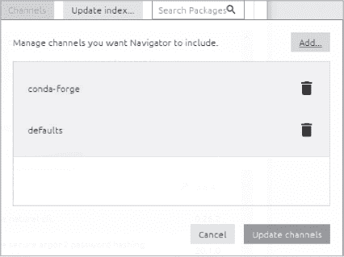

## 第三章：安装和启动 Anaconda**


Anaconda，全球最受欢迎的数据科学平台，提供了大量常用科学库的访问权限。本章将引导你完成在 Windows、macOS 和 Linux 上安装 Anaconda 的过程。为了验证安装，你将启动 Navigator，这是 Anaconda 的图形用户界面（GUI），并快速浏览其功能。

### **关于 Anaconda**

除了其他功能外，Anaconda 包括帮助你编写代码并处理数据集的工具；Python 语言本身；称为*包*的预编写程序集合；Navigator GUI；以及*Nucleus*，一个社区学习和共享资源。许多这些内容，如图 1-1 所示，由其他组织创建和维护，并通过 Anaconda 分发。


*图 1-1：Anaconda 的关键组件*

如果你是编程新手，可能对包（packages）这个概念不太熟悉。包是*模块*的集合，模块是执行某些任务的单一程序，其他程序可以使用这些任务。例如，一个模块可能加载图像并将其从彩色转换为灰度。另一个模块可能会调整或裁剪图像。这些图像处理模块中的几个可能被组合在一起形成一个包，而多个包则形成一个*库*（图 1-2）。例如，OpenCV 计算机视觉库包括执行简单图像处理的包，还有处理流视频的包，以及执行机器学习任务（如人脸检测）的包。


*图 1-2：模块、包和库的定义*

不幸的是，术语*模块*、*包*和*库*经常被交替使用，以至于它们几乎可以指同一事物。更糟糕的是，*包*还可以指一个分发单元，能够与社区共享，且可以包含一个库、一个可执行文件或两者。因此，你不必太纠结于这些定义。

许多随 Anaconda 一起发布的科学包需要许多*依赖项*（其他支持包的特定版本）才能运行。它们可能还需要特定版本的 Python。为了防止不同的 Python 安装和其他包互相干扰并导致故障，并保持它们的最新状态，Anaconda 使用名为*conda*的二进制包和环境管理器。你可以使用 conda 从 Anaconda 公共仓库安装成千上万的包。此外，还有成千上万的包来自社区频道，例如 conda-forge。这些包是 Anaconda 自动安装的几百个包之外的额外内容。

Conda 会确保每个库的所有必要依赖项都已安装，节省你大量的麻烦。如果缺少某个依赖项，它也会提醒你。最后，为了防止各种包发生冲突，conda 让你创建*conda 环境*，这些环境是你科学项目的安全、隔离的实验室。conda 环境中的包不会与其他位置的包产生干扰，且当你分享一个环境时，你可以确保所有必要的包都已包含。你将在第二章中学习如何创建 conda 环境。

当你下载 Anaconda 时，你将可以访问*[Anaconda.org](http://Anaconda.org)*，这是一个包管理系统，使你能够轻松地查找、访问、存储和共享公共笔记本、环境、数据库以及 conda 和 Python 包索引（PyPI）中的包。你可以使用它在云端共享你的工作，或搜索并下载流行的 Python 包和笔记本。你还可以使用 conda-build 构建新的 conda 包，然后将它们上传到云端与他人共享（或者随时从任何地方访问它们）。

Anaconda 由 Anaconda 公司开发和维护。除了我们将使用的免费 Anaconda 发行版（以前称为*Anaconda 个人版*），该公司还提供商业版本。你可以在*[`docs.anaconda.com/anacondaorg/`](https://docs.anaconda.com/anacondaorg/)*找到所有版本的官方文档。Anaconda 也是 R 编程语言的一个发行版，conda 为 Ruby、Lua、Scala、Java、JavaScript、C/C++、FORTRAN 等语言提供包、依赖项和环境管理。然而，在本书中，我们将专注于其在 Python 中的使用。

你需要大约 5GB 的可用硬盘空间来安装 Anaconda。否则，你需要安装 Miniconda，这是一个最小化安装，要求大约 400MB，并且附带 Python，但不包括其他预安装的库。安装 Anaconda 之前，也不需要卸载任何现有的 Python 安装或包。

如果你遇到问题，请参阅故障排除指南*[`docs.anaconda.com/anaconda/user-guide/troubleshooting/`](https://docs.anaconda.com/anaconda/user-guide/troubleshooting/)*和常见问题解答*[`docs.anaconda.com/anaconda/user-guide/faq/`](https://docs.anaconda.com/anaconda/user-guide/faq/)*。如果你遇到指令上的差异，请按照安装向导中的指示操作。

### **在 Windows 上安装 Anaconda**

你可以在 *[`docs.anaconda.com/anaconda/install/windows/`](https://docs.anaconda.com/anaconda/install/windows/)* 找到官方的 Windows 安装说明。第一步是下载 Anaconda 安装程序。你可能需要选择 32 位或 64 位安装程序。除非你的电脑非常老旧，否则你应该选择 64 位版本。如果不确定，可以通过进入 **设置** ▸ **系统** ▸ **关于** 来验证你的系统类型。

点击安装程序时，会将一个 .*exe* 文件下载到你的 *下载* 文件夹中（这可能需要几分钟时间）。此时，你可以选择使用 SHA-256 *校验和* 来检查安装程序的完整性，校验和是一种数学算法，用于检查文件是否损坏。将新生成的校验和与提前生成的校验和进行比较，可以检测在数据传输过程中是否出现错误。如果选择运行校验和，请参阅 *[`docs.anaconda.com/anaconda/install/hashes/`](https://docs.anaconda.com/anaconda/install/hashes/)* 中的说明。

要开始安装，请右键单击下载的 *.exe* 文件，并从弹出窗口中选择 **以管理员身份运行** 选项。以管理员身份，你将拥有在系统中任何位置安装 Anaconda 的权限。安装程序会请求你允许其对电脑进行更改。点击 **是**。安装向导现在应该出现。点击 **下一步**，然后同意许可协议。

下一窗口会要求你选择安装类型。选择推荐的 **仅限我** 选项，然后点击 **下一步**。接下来，系统会要求你选择安装位置。安装程序会建议在 *C:\* 驱动器下你的用户名文件夹中创建一个文件夹。请注意，此路径应仅包含 7 位 ASCII 字符（数字、字母和某些符号），并且不能包含空格。记下这个默认位置，然后点击 **下一步**。

在“高级安装选项”窗口中，将 Anaconda *设置为默认 Python*，并且不要将其添加到 PATH 中。这是推荐的做法。这意味着你需要通过开始菜单打开 Anaconda Navigator 或 Anaconda 命令提示符。如果勾选了环境变量复选框“将 Anaconda3 添加到我的 PATH”，你就可以在命令提示符中使用 Anaconda；然而，这可能会带来后续问题。另外，你也可以稍后将 Anaconda 添加到 PATH 中。点击 **安装** 以继续。当安装完成后，点击 **下一步**。

安装窗口关闭后，你可能会看到安装 PyCharm 或 DataSpell IDE 的选项。如果出现此情况，忽略它并点击 **下一步**。我们将使用 Anaconda 中预安装的 Spyder IDE。

安装现在应该完成了。在最后一个窗口中，如果你希望稍后查看教程，勾选相应框，然后点击**完成**。此时，可能会弹出一个窗口，欢迎你使用 Anaconda，并邀请你注册 Anaconda Nucleus。你还应该在开始菜单中看到一个*Anaconda3*文件夹（图 1-3）。该文件夹应该包含一些项目，如 Navigator 和提示符，它们是输入文本命令的终端。你也可能看到启动 Jupyter 和 Spyder 的图标。

要验证 Anaconda 是否正确加载，点击 Windows **开始**按钮，导航到 Anaconda3 应用程序，然后从下拉菜单中启动 Anaconda Navigator。你也可以在 Anaconda Prompt 终端中输入 anaconda-navigator。这个窗口不总是会自动弹出，因此请确保检查屏幕底部的任务栏。

要查看有关你 Anaconda 发行版和 Python 版本的详细信息，请在 Anaconda Prompt 中输入 conda info。


*图 1-3：Windows 开始菜单中的 Anaconda3 程序文件夹*

### **在 macOS 上安装 Anaconda**

你可以通过图形化设置向导或命令行在 macOS 上安装 Anaconda 个人版。你可以在*[`docs.anaconda.com/anaconda/install/mac-os/`](https://docs.anaconda.com/anaconda/install/mac-os/)*找到这两种方法的安装说明。通过滚动到下载页面底部选择适合你操作系统版本的安装程序。下载完成后，你可以选择使用 SHA-256 校验和算法验证数据的完整性（请参见“在 Windows 上安装 Anaconda”部分，位于第 9 页）。然后，双击下载的文件并点击**继续**开始安装过程。

安装过程中，你将依次看到强制性的介绍、读取说明和许可证界面。在“读取说明”界面的“重要信息”框中，会提供具体说明，若你想偏离任何推荐的默认选择，可以参考这些说明。当你完成这些步骤后，点击**安装**按钮，将 Anaconda 安装到你的*~/opt*目录中。虽然这是推荐的位置，但你也可以选择点击“更改安装位置”按钮来更改安装目录。

在下一个界面，选择**仅为我安装**，然后点击**继续**。此时，你可能会看到安装 PyCharm 或 DataSpell IDE 的选项。我们将使用 Anaconda 自带的 Spyder IDE，所以跳过此步骤，点击**继续**。此时，你应该看到一个显示成功安装的界面。我强烈建议你花时间查看快速入门指南和教程。

要结束安装过程，点击**关闭**。

为了验证安装，点击**Launchpad**然后选择**Anaconda Navigator**。另外，你可以使用 CMD-SPACE 打开 Spotlight 搜索，然后输入`Navigator`打开程序。你还可以通过访问 Mac 终端并输入`conda info`来查看安装的 Anaconda 发行版和 Python 版本的详细信息。

### **在 Linux 上安装 Anaconda**

由于 Linux 有许多不同的发行版，我强烈建议你访问官方 Anaconda 安装说明，地址为*[`docs.anaconda.com/anaconda/install/linux/`](https://docs.anaconda.com/anaconda/install/linux/)*。如果你在 IBM PowerPC 或 Power ISA 计算机上运行 Linux，请参见*[`docs.anaconda.com/anaconda/install/linux-power8/`](https://docs.anaconda.com/anaconda/install/linux-power8/)*。这些网站将帮助你安装在特定 Linux 发行版上使用 GUI 包所需的依赖项。本节中的说明适用于 x86 架构。

Linux 没有图形化安装选项，因此你需要使用命令行来完成大部分过程。首先，滚动到下载页面底部并点击适用于你系统的安装程序。当下载完成后，你可以选择使用 SHA-256 校验和算法验证数据的完整性（参见第 9 页的“在 Windows 上安装 Anaconda”部分）。打开终端并输入以下命令：

```py
sha256sum /path/filename
```

然后，输入以下命令开始安装：

```py
bash ~/Downloads/Anaconda4-202x.xx-Linux-x86_64.sh
```

请注意上述*.sh*文件名中的日期。这应该设置为你下载的文件名。如果你没有将安装程序下载到*Downloads*目录，请将`~/Downloads/`替换为正确的路径。

在安装程序提示时，点击**Enter**查看许可证条款，然后点击**Yes**同意。接下来，安装程序会提示你点击**Enter**以接受默认安装位置（推荐）或指定其他安装目录。如果你接受默认位置，安装程序将显示以下内容：

```py
PREFIX=/home/<user>/anaconda<2 or 3>
```

安装程序将继续进行，可能需要几分钟才能完成。当安装程序询问“你希望安装程序通过运行`conda init`初始化 Anaconda3 吗？”时，推荐的回答是“yes”。如果由于某种原因你决定选择“no”，请参阅安装网站上的说明和常见问题解答。

当安装程序完成时，你将看到一条消息，感谢你安装 Anaconda。忽略有关安装 PyCharm 或 DataSpell IDE 的链接，因为我们将使用预安装的 Spyder IDE。

为了使安装生效，你需要关闭并重新打开终端窗口，或者输入命令 source ~/.bashrc。要控制每个 Shell 会话是否默认激活 base 环境，请运行`conda config --set auto_activate_base True`。如果不希望默认激活 base 环境，请将其设置为`False`。通常，你会希望使用 base 环境作为默认环境。

要验证安装，请打开终端并输入 conda list。如果 Anaconda 正常工作，这将显示所有已安装包及其版本号的列表。你也可以输入 anaconda-navigator 来打开 Navigator。

### **了解 Anaconda Navigator**

Anaconda Navigator 是一个桌面 GUI。它提供了一种友好的点击式替代方式，不需要打开命令提示符或终端，并通过键入命令来操作 Anaconda。你可以使用 Navigator 启动应用程序、在 *[Anaconda.org](http://Anaconda.org)* 或本地 Anaconda 仓库中搜索包、管理 conda 环境、渠道和包，并访问大量的培训材料。它可以在 Windows、macOS 和 Linux 上运行。

#### ***启动 Navigator***

在 Windows 上，安装程序会为 Navigator 创建一个开始菜单快捷方式。对于通过 **.sh** 安装程序安装的 Linux 或 macOS（如我们之前所做的），打开终端并输入 anaconda-navigator。如果你在 macOS 上使用了 GUI (*.pkg*) 安装程序，可以点击 Launchpad 中的 Navigator 图标。

#### ***主页面***

Navigator 启动时会显示一个类似于 图 1-4 所示的窗口。你的视图中的应用图标（如 Jupyter Notebook 和 Spyder）可能会有所不同。


*图 1-4：Anaconda Navigator 主页面*

你看到的初始窗口是主页面 ➊。除了主页面外，还列出了 Environments、Learning 和 Community 等其他页面。当你启动 Navigator 时，你会进入 base（根）环境 ➋。环境就像是文件夹或目录，用于隔离和管理包。base 环境是 Anaconda 安装的文件夹，例如在 Windows 上是 *C:\Users\<your_username>\anaconda3\*。

可滚动的主屏幕上填充了多个应用程序的方块图标，如 Datalore、Spyder、命令提示符等 ➌。每个图标包含一个应用程序的 logo、应用程序的名称、应用程序的描述，以及根据当前状态显示的 Launch ➍ 或 Install ➎ 按钮。每个图标右上角的“齿轮”图标还允许你安装该应用程序，并更新、删除或安装特定版本。Anaconda 的优点在于，当它安装一个应用程序时，它会自动找到并安装该应用程序运行所需的所有依赖（其他包），并在弹出窗口中显示这些依赖的列表。

如果你通过 Anaconda Prompt 命令行界面安装了一个包或工具，Navigator 主页面可能不会反映这一更改。为了确保该页面始终保持最新，你可以点击右上角的刷新按钮 ➏。

在主页选项卡的左下角，您可能会看到一个 Anaconda Nucleus 的链接 ➐。您可以在此加入，或者使用右上角的按钮 ➑ 登录现有账户。请注意，这个按钮可能会显示为“登录”或“连接”。只有在您需要访问 Anaconda Nucleus 以通过云共享项目，或者访问像*[Anaconda.org](http://Anaconda.org)* 这样的存储库时，才需要登录。

#### ***环境选项卡***

现在，让我们来看一下“环境”选项卡（图 1-5）。要打开它，请点击主页下方的**Environments**链接 ➊。在这里，您可以管理 conda 环境，并安装或卸载来自 Anaconda、conda forge 及其他站点的库。我们将在第二章中详细讨论这一点。


*图 1-5：Anaconda Navigator 环境选项卡*

此时，您应该只看到基础（root）环境 ➋。其他显示的环境，如“Levy”、“golden_spiral”和“penguins”，是我以前使用屏幕底部的“创建”按钮 ➌ 创建的环境。请注意，还有其他按钮用于克隆、导入和删除环境。更新版本可能会显示一个额外的按钮，用于将环境备份到云端。

每次只能激活一个环境。点击一个环境链接会停用当前环境（例如“base”），并激活您所点击的环境（例如“penguins”）。屏幕更新可能需要几秒钟。屏幕的右半部分将显示该环境中安装的包列表，以及描述和版本号。还请注意，您可以使用主页选项卡上的下拉菜单中的应用程序来切换环境。

如果您点击已安装的下拉菜单，您将看到“未安装”、“可更新”、“已选择”和“所有” ➍ 的选项。在屏幕底部，您将看到当前安装和可用的包数量 ➎。对于基础环境，Anaconda 预安装的包可能会随着时间的推移略有变化，因此您看到的数字可能会有所不同。

**注意**

*您还可以通过访问* [`docs.anaconda.com/anaconda/packages/pkg-docs/`](https://docs.anaconda.com/anaconda/packages/pkg-docs/) *查看哪些包是 Anaconda 预装的。* *您需要知道您的操作系统和 Python 版本。*

当您选择**未安装**时，您将看到 Anaconda 中可用但当前未安装在所选环境中的包列表。要查看来自其他来源（例如 conda-forge）的包，只需点击**Channels**按钮 ➏，然后选择或添加一个新频道（图 1-6）。*频道*只是 conda 查找包时所采用的路径。与包操作相关的其他选项包括更新已启用频道的包列表（更新索引）和搜索包。



*图 1-6：频道下拉菜单让您添加、更新和删除频道。*

要从活动环境中移除一个包，请点击该包旁边的复选框（图 1-7）。这将打开一个菜单，提供诸如标记包进行移除或安装特定版本号的选项，后者将打开另一个菜单。


*图 1-7：标记一个包进行操作*

我们将在下一章详细讨论如何管理包。您还可以访问 Anaconda 文档了解更多相关内容 (*[`docs.anaconda.com/anaconda/navigator/tutorials/manage-packages/`](https://docs.anaconda.com/anaconda/navigator/tutorials/manage-packages/)*).

#### ***学习选项卡***

在“学习”选项卡（图 1-8）中，您可以发现更多关于 Navigator、Anaconda 平台和开放数据科学的内容。要打开它，请点击主页下方的**Learning**链接 ➊。


*图 1-8：Anaconda Navigator 学习选项卡*

点击“文档”、“培训”、“网络研讨会”或“视频”按钮 ➋ 以查看相关的图块项目 ➌。您可以一次性打开所有类别。要关闭一个高亮显示的类别，只需再次点击它即可。点击一个图块项目按钮将在浏览器窗口中打开它 ➍。按钮选项包括“阅读”、“查看”和“探索”。

#### ***社区选项卡***

在“社区”选项卡（图 1-9）中，您可以了解更多关于事件、免费支持论坛以及与 Navigator 相关的社交网络内容。要打开它，请点击主页下方的**Community**链接 ➊。


*图 1-9：Anaconda Navigator 社区选项卡*

点击“事件”、“论坛”或“社交”按钮 ➋ 可以更改显示的图块。根据图块的类型，您可以点击“了解更多” ➌、“探索” ➍ 或“参与” ➎。点击一个图块按钮将在浏览器窗口中打开该内容。

#### ***文件菜单***

Navigator 屏幕左上角的文件菜单包括让您设置偏好的选项（图 1-10）以及退出程序的选项。macOS 用户将在偏好设置菜单中看到额外的选项，包括“服务”，用于链接到计算机的系统偏好设置菜单；“隐藏 Anaconda-Navigator”，用于隐藏 Navigator 窗口；“隐藏其他”，用于隐藏除 Navigator 外的所有窗口；以及“显示所有”，用于显示所有窗口。有关偏好设置菜单选项的详细说明，请参见 *[`docs.anaconda.com/anaconda/navigator/overview/`](https://docs.anaconda.com/anaconda/navigator/overview/)*。

退出选项将关闭 Navigator，并释放 Anaconda 使用的内存资源。

这完成了对 Anaconda Navigator 的概述。您可以在官方文档中找到更多信息，网址为 *[`docs.anaconda.com/anaconda/navigator/`](https://docs.anaconda.com/anaconda/navigator/)*。在下一章中，我们将使用 Navigator 和命令行界面来设置 conda 环境，从而保持您的项目独立、安全和有序。


*图 1-10：Windows 上的 Anaconda Navigator 文件 ▸ 首选项菜单*

### **总结**

安装了 Anaconda 后，你现在可以轻松访问 Python 及其数千个有用的包。你还成为了 Anaconda 社区的一部分，享有存储选项、丰富的学习机会，以及上传和分享自己构建的包的能力。最后，你已经熟悉了 Navigator 界面，能够以点选的方式方便地运行 Anaconda。
