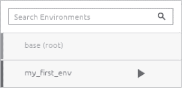
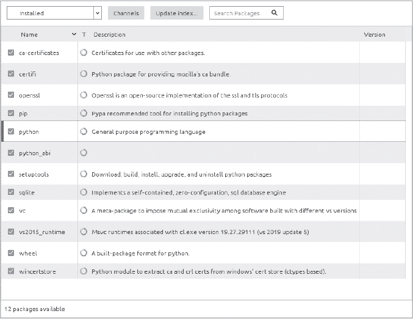
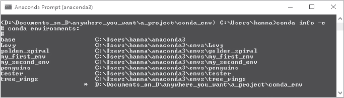

## 第四章：使用 **Conda 环境保持组织**


每个 Python 项目应该有自己的 conda 环境。Conda 环境让你可以使用任何你想要的包版本，包括 Python，而不会面临兼容性冲突的风险。你可以根据项目需求来组织你的包，而不是把不必要的包堆积在基础目录中。你还可以与他人共享你的环境，使他们能够完美地重现你的项目。

在前一章中介绍的 Anaconda Navigator 提供了一个简单的点选界面来管理环境和包。为了更高的控制，conda 让你可以通过文本命令在 Anaconda Prompt（Windows）或终端（macOS 或 Linux）中执行类似的任务。

在本章中，我们将使用 Navigator 和 conda 来创建 conda 环境、安装包、管理包、删除环境等。在开始之前，让我们更详细地了解为什么 conda 环境如此有用。

### **理解 Conda 环境**

你可以把 conda 环境看作是独立的 Python 安装。*conda 环境管理器*，在 图 2-1 中由货船表示，将每个环境视为一个安全的运输容器。每个“容器”都可以有自己的 Python 版本和你为特定项目需要运行的任何其他包的版本。这些容器不过是你计算机目录树中的专用目录。


*图 2-1：conda 环境和包管理器的概念图*

如 图 2-1 所示，你可以在计算机上加载不同版本的 Python 和相同库的不同版本。如果它们在不同的环境中，它们将被隔离，不会互相冲突。这一点很重要，因为你可能会继承只在某些旧版本的包上运行的遗留项目。

*conda 包管理器*，在 图 2-1 中由起重机表示，用于查找并安装包到你的环境中。可以把每个包想象成一个单独的项目，就像你应该早就回收掉的那箱 *《国家地理》* 杂志一样，打包在一个运输容器里。

包管理器确保你拥有最新的稳定版本，或者是你指定的版本的包。它还会查找并加载主包运行所需的所有 *依赖项*，并确保依赖项的版本匹配。依赖项只是提供支持功能的另一个 Python 包。例如，Matplotlib（用于绘图）和 pandas（用于数据分析）都建立在 NumPy（数值 Python）之上，且没有它们无法运行。因此，最好在可能的情况下，同时安装所有项目所需的包，以避免依赖冲突。

如果你担心在每个 conda 环境中安装软件包会浪费空间，完全不用担心。不会创建任何副本。Conda 会将软件包下载到软件包缓存中，每个环境都链接到该缓存中的相应软件包。

默认情况下，这个软件包缓存位于 Anaconda 发行版的 *pkgs* 目录中。要找到它，可以打开 Anaconda 提示符或终端（参见 第一章 的说明），并输入 conda info。根据你的操作系统，你应该能在 *C:\Users\<username>\anaconda3\pkgs*（Windows）、*~/opt/anaconda3*（macOS）或 */home/<username>/anaconda3/pkgs*（Linux）找到软件包缓存。

当然，这里的 *<username>* 指的是你的个人用户名。macOS 显示的位置是图形化安装路径。如果你使用命令行安装 Anaconda，你可以在 */Users/<username>/anaconda3* 找到它。无论如何，`conda info` 命令都会显示其位置。

**注意**

*默认情况下，每个用户都有自己的软件包缓存，并且不会与其他人共享。如果你想设置一个共享的软件包缓存来节省磁盘空间并减少安装时间，可以查看 [`docs.anaconda.com/anaconda/user-guide/tasks/shared-pkg-cache/`](https://docs.anaconda.com/anaconda/user-guide/tasks/shared-pkg-cache/) 中的说明。*

你也可以使用`conda info`命令（或`conda info --envs`）来查看你的 conda 环境存储的位置。例如，在 Windows 中，默认位置是 *C:\Users\<username>\anaconda3\envs*。

基础环境在安装 Anaconda 时默认创建，并包含 Python 安装和 conda 的核心系统库及依赖项。一般建议是，*避免在基础环境中安装额外的软件包*。如果你需要为新项目安装额外的软件包，最好首先创建一个新的 conda 环境。

**CONDA 和 PIP**

有时你会遇到无法通过 conda 安装的软件包。在这种情况下，你需要使用 Python 的 *包管理系统（pip）* 来安装。Conda 和 pip 的工作原理类似，但有两个不同之处。首先，pip 只适用于 Python，而 conda 支持多种语言。其次，pip 从 *Python 包索引*（*[`pypi.org/`](https://pypi.org/)*）即 *PyPI* 安装软件包，而 conda 则从 *Anaconda 仓库*（*[`repo.anaconda.com/`](https://repo.anaconda.com/)*）和 *[Anaconda.org](http://Anaconda.org)*（*[`anaconda.org/`](https://anaconda.org/)*）安装软件包。你也可以在激活的 conda 环境中使用 pip 从 PyPI 安装软件包。为了方便起见，conda 会在你创建的每个新环境中自动安装一份 pip。

不幸的是，当 conda 和 pip 一起使用创建环境时，可能会出现问题，特别是在多次连续使用这些工具时，会形成一种很难复现的状态。大多数问题源于这样一个事实：conda 像其他包管理器一样，对于它没有安装的包控制能力有限。在一起使用 conda 和 pip 时，以下是一般的指导原则：

+   在安装通过 conda 可用的包之后，再安装仅通过 pip 需要的包。

+   不要在根环境中运行 pip。

+   如果需要更改，可以从头开始重新创建 conda 环境。

+   将 conda 和 pip 的需求存储在环境（文本）文件中。

有关此问题的更多细节，请参见 *[`www.anaconda.com/blog/using-pip-in-a-conda-environment/`](https://www.anaconda.com/blog/using-pip-in-a-conda-environment/)*。关于 pip 的更多信息，请参见 *[`packaging.python.org/guides/installing-using-pip-and-virtual-environments/#creating-a-virtual-environment/`](https://packaging.python.org/guides/installing-using-pip-and-virtual-environments/#creating-a-virtual-environment/)*。我们将在本章稍后讨论如何创建需求文本文件。

### **使用 Navigator 管理 Conda 环境**

设置你的第一个 conda 环境非常简单。在接下来的部分中，我们将使用 Anaconda Navigator 图形用户界面来管理 conda 环境。稍后在本章中，我们将使用 Anaconda Prompt（或终端）来做相同的操作。Anaconda Prompt 和 Navigator 在第一章中已有介绍。

#### ***启动 Navigator***

在 Windows 中，打开开始菜单并点击 Anaconda Navigator 桌面应用程序；在 macOS 中，打开 Launchpad，然后点击 Anaconda-Navigator 图标；在 Linux 中，打开终端窗口并输入 anaconda-navigator。

当 Navigator 启动时，它会自动检查是否有新版本。如果你看到一个更新应用程序的消息框，询问是否要更新 Navigator，请点击**是**。有关 Navigator 界面的复习，请参见第一章。

#### ***创建新环境***

在 Navigator 中，选择**环境**标签，然后点击**创建**按钮。这将打开创建新环境对话框（见图 2-2）。因为这是你的第一个环境，所以命名为***my_first_env***。


*图 2-2：Navigator 创建新环境对话框*

请注意图 2-2 中的位置说明。默认情况下，conda 环境存储在 Anaconda 安装目录中的*envs*文件夹内。因此，在使用 Navigator 时，必须为每个环境指定一个唯一的名称。也可以通过命令行界面在其他位置创建环境。我们将在“指定环境位置”一节中进一步探讨这一选项，详见第 37 页。

第一个安装的包是 Python。默认情况下，这与你下载并安装 Anaconda 时使用的 Python 版本相同。如果你想安装不同版本的 Python，可以使用下拉菜单进行选择。

点击**创建**。大约一分钟后，你应该能在“环境”标签页上看到新环境。现在你应该有两个环境，*base (root)*和*my_first_env*。名称右侧的箭头表示*my_first_env*现在是活动环境（图 2-3）。*活动*意味着这是你当前工作的环境，任何你加载的包都会被放入这个文件夹中。点击列表中的名称会激活该名称，并停用其他环境。



*图 2-3：在 Navigator 环境标签页上创建的活动环境(my_first_env)*

在“环境”标签页上，还列出了*my_first_env*中安装的包及其版本号（图 2-4）。在窗口底部，你可以看到已经安装了 12 个包。这些都是与 Python 相关的包。随着时间的推移，包的数量可能会变化，因此你可能看到不同的数字。



*图 2-4：在 Navigator 环境标签页上最初安装的包列表*

恭喜，你刚刚创建了第一个 conda 环境！你可以立即开始使用 Python。但是，如果你需要额外的包，比如 pandas 和 NumPy，你必须在此环境中安装它们。那么，让我们开始吧。

#### ***管理包***

创建环境后，你可以使用“环境”标签页查看已安装的包，检查可用的包，查找并安装特定的包，以及更新和删除包。

##### **查找和安装包**

要查找已安装的包，点击你想要搜索的环境名称以激活它（见图 2-3）。如果右侧窗格中的已安装包列表很长且你不想滚动，可以在“搜索包”框中输入包的名称。这会减少显示的包的数量，直到只剩下你想要的包。

要查找未安装的包，点击右窗格上方的下拉菜单并选择**未安装**（见图 2-5）。


*图 2-5：在 Navigator 环境标签页上可用但未安装的包列表*

如图 2-5 左下角所示，创建新环境后，当前有 8,601 个包可以自动使用（这个数字可能随时间变化，因此你看到的数字可能不同）。要查看更多包，你可以使用“环境”标签页上的“频道”按钮添加频道。

点击**Channels**以打开对话框 (图 2-6)。然后，输入**conda-forge**以访问 conda-forge 社区频道。该频道由成千上万的贡献者组成，提供各种软件的包（更多信息，请参见*[`conda-forge.org/docs/user/introduction.html`](https://conda-forge.org/docs/user/introduction.html)*）。


*图 2-6：通过 Channels 对话框添加 conda-forge*

按 ENTER 键，然后点击**更新频道**按钮以添加 conda-forge (图 2-7)。


*图 2-7：使用 Channels 对话框更新频道*

Environments 标签页右侧的面板现在应该会刷新，显示你有成千上万个可用包。你可以通过点击对话框中的相应垃圾桶来移除频道（请参见图 2-7）。

**注意**

*如果你想要的包在 Anaconda 中不可用，可以尝试通过 Python 包索引（[PyPI.org/](http://PyPI.org/)）使用 pip 进行安装，conda 默认在 conda 环境中安装了 pip（有关更多信息，请参见第 24 页的“Conda 和 PIP”侧边栏）。*

记住，我们想要添加 NumPy 和 pandas。由于 NumPy 是 pandas 的依赖，因此它已包含在 pandas 的依赖列表中。因此，你只需要安装 pandas。在右侧面板顶部的搜索框中输入**pandas** (图 2-8)。然后，点击 pandas 包旁边的复选框，并点击右下角的**应用**按钮。要同时安装多个包，在点击应用之前，请先勾选每个相应的复选框。


*图 2-8：在 Environments 标签页中查找并安装 pandas 包*

打开一个新的对话框，并在片刻后显示 pandas 依赖的包列表 (图 2-9)。如你所见，NumPy 就在其中。点击**应用**按钮以完成 pandas 的安装。

如果你切换到已安装列表，已安装包的数量将增加，列表中将包括 pandas 和 NumPy。请注意，你可能需要清除“搜索包”框才能查看完整列表。


*图 2-9：包含依赖包的安装包列表*

你可能会注意到一些主要的库在“未安装”列表中似乎有重复。例如，你可以在“matplotlib”和“matplotlib-base”之间选择 (图 2-10)。“-base”选项通常是轻量级版本，适用于当像 Matplotlib 这样的包作为其他包的依赖时。因此，它可能无法完全功能化；因此，在安装像 Matplotlib 或 NumPy 这样的包时，你不应安装此“-base”版本。这样，你可以确保一切正常工作，没有意外。


*图 2-10：在未安装的包列表中，有两个可选的 matplotlib 库。*

##### **更新和删除包**

随着时间的推移，已安装包的新版可能会发布。要检查这些版本，请在“环境”选项卡的右侧窗格顶部选择**可更新**筛选器（见图 2-11）。你看到的列表可能与所示列表略有不同。


*图 2-11：环境选项卡的右侧窗格，显示可用更新的已安装包*

在这个例子中，Python 已过时，因此我们将其更新到当前版本。如果你的版本已经是最新的，尝试更新可更新列表中的另一个包。

首先，点击 Python 旁边的复选框，然后从弹出菜单中选择**标记为更新**（见图 2-12）。


*图 2-12：点击包旁边的复选框以打开用于更新和删除包的菜单。*

点击右下角的**应用**按钮。这将打开“更新包”窗口，显示哪些包将被修改，哪些将被安装（见图 2-13）。


*图 2-13：用于更新 Python 的更新包窗口*

点击**应用**以继续。几分钟后，Python 将从可更新列表中消失。将筛选器改为**已安装**，你将看到 Python 的版本已更改。基础（root）环境中的 Python 版本没有变化，因为你所做的所有更改仅针对*活动*的 conda 环境，即*my_first_env*。

在没有充分理由的情况下更新包应谨慎，因为其他包可能依赖于旧版本。如果你这样破坏了环境，世界并不终结；你可以使用环境文件恢复它，我们将在本章稍后讨论。

如果你想安装*特定版本*的包，请点击已安装包名称旁边的复选框，并使用图 2-12 中的菜单。点击**标记为特定版本安装**，然后从弹出窗口中选择版本号。点击**应用**以启动安装。

如果可更新包的列表很长，而你不想点击每个复选框，你可以使用命令行来提高效率。在“环境”选项卡中，点击活动环境名称旁边的三角箭头（见图 2-3）。然后，选择**打开终端**并输入以下命令：

```py
conda update --all
```

将显示一个待更新包的列表，并询问你是否继续。稍后在本章中，我们将讨论命令行界面时，会更详细地介绍这个命令。我们还会讨论如何锁定或冻结包，以便它不会被更新。

要从环境中移除一个软件包，点击其复选框，选择 **标记为移除选项**（见 图 2-12），然后点击 **应用**。这将移除该软件包，*包括它的依赖项*。这一点很重要。如果您从 *my_first_env* 中移除 pandas，那么 NumPy 也会被一并移除！为了避免这种情况，您需要在安装 pandas 之前明确安装 NumPy。

#### ***复制环境***

Environments 窗格底部的克隆和导入按钮（图 2-14）分别允许您创建环境的精确副本，和从规格文件创建新环境。要克隆环境，您首先需要通过点击环境名称来激活该环境。在使用导入时，系统会提示您为新环境命名，并指向规格文件。我们将在“复制和共享环境”一节中更详细地讨论如何从文件创建新环境，详见 第 44 页。


*图 2-14：Environments 选项卡中间窗格底部的按钮帮助您管理 conda 环境。*

#### ***备份环境***

在新版的 Anaconda Navigator 中，您可能会看到在导入按钮旁边有一个备份按钮。这个按钮允许您将环境备份到云端，并可以将其恢复。您可以用它来保存工作进度，保持灾难恢复的副本，或实现从一台机器到另一台机器的迁移。您需要拥有 Anaconda Nucleus 账户。详情请访问 *[`www.anaconda.com/blog/keeping-your-conda-environments-safe-and-secure-with-your-anaconda-nucleus-account/`](https://www.anaconda.com/blog/keeping-your-conda-environments-safe-and-secure-with-your-anaconda-nucleus-account/)*。

#### ***移除环境***

要删除一个 conda 环境，首先点击要删除的环境名称，然后点击 Environments 选项卡底部的 **移除** 按钮（带垃圾桶图标）（图 2-14）。接着会弹出一个窗口，显示该环境的位置并请求确认。

在删除环境之前，最好先创建一个环境文件，这样在需要时可以恢复该环境。我们将在后面的章节中介绍如何操作。

同时请注意，环境是文件夹，您在该文件夹中存储的任何数据都会在删除环境时被删除。您应该将数据保存在一个或多个独立的文件夹中。

### **使用命令行界面操作 Conda 环境**

您还可以在 *命令行界面*（*CLI*，发音为 *Clie*）中使用 conda 环境。高级用户可能更喜欢这种基于文本的界面提供的控制功能，而不是 Navigator 提供的点选功能。

#### ***启动命令行界面***

在 Windows 中，使用开始菜单启动 Anaconda Prompt；在 macOS 或 Linux 中，打开终端窗口。在命令行界面（CLI）中，`conda` 命令是管理环境和各种软件包安装的主要接口。和 Navigator 一样，你可以使用它来完成以下任务：

+   查询和搜索 Anaconda 软件包索引及当前的 Anaconda 安装

+   创建和管理 conda 环境

+   安装并更新现有 conda 环境中的软件包

与 Navigator 一样，你应从创建一个新的 conda 环境或激活一个现有的环境开始。表 2-1 列出了处理环境时一些更有用的单行 `conda` 命令。这些命令使你能够重现并扩展 Navigator 的功能。你需要将所有大写字母的单词替换为具体的名称。例如，对于 ENVNAME，你应替换为你的环境实际名称，如 *my_first_env*。你还可以将许多以双破折号（`--`）开头的命令选项缩写为一个破折号加上选项的第一个字母。换句话说，你可以使用 `-n` 替代 `--name`，使用 `-e` 替代 `--envs`。我们将在接下来的部分中更详细地讨论这些命令。

**表 2-1：** 用于处理环境的有用 `conda` 命令

| **命令** | **描述** |
| --- | --- |
| `conda help` | 显示 conda 命令位置参数的解释 |
| `conda info` | 验证安装、版本号、目录位置 |
| `conda update --name base conda` | 更新 conda 到当前版本 |
| `conda create --name` ENVNAME `python` | 创建新环境并安装 Python |
| `conda create --name` ENVNAME `python=3.`x | 使用特定 Python 版本创建新环境 |
| `conda create --prefix` path\ENVNAME | 在指定位置创建新环境 |
| `conda activate` ENVNAME | 激活指定的环境 |
| `conda activate` path\to\environment-dir | 激活指定位置的环境 |
| `conda deactivate` | 停用当前环境 |
| `conda list` | 列出当前环境中的所有软件包和版本 |
| `conda list --name` ENVNAME | 列出指定环境中的所有软件包及其版本 |
| `conda list --revisions` | 列出当前环境的版本 |
| `conda install -n` ENVNAME `--``revision` REVNUM | 恢复环境到先前的版本 |
| `conda remove --name` ENVNAME `--all` | 删除已停用的环境 |
| `conda create --clone` ENVNAME `--name` NEWENV | 创建环境的精确副本 |
| `conda env export --name` ENVNAME `> envname.yml` | 导出环境到可读的 YAML 文件 |
| `conda env create --file` ENVNAME`.yml` | 从 YAML 文件创建环境 |
| `conda list --explicit >` pkgs`.txt` | 导出具有精确版本的软件包列表（适用于单一操作系统） |
| `conda create --name` NEWENV `--file` pkgs`.txt` | 基于精确的软件包版本创建环境 |

有关完整的命令列表，请参见 *[conda 备忘单](https://docs.conda.io/projects/conda/en/4.6.0/_downloads/52a95608c49671267e40c689e0bc00ca/conda-cheatsheet.pdf)*。

**注意**

*本章假设你已按照第一章中的说明安装了 Anaconda。这样可以确保 Anaconda 正确添加到你的 PATH 中，PATH 是一个环境变量，指定了可执行程序所在的目录集。这对于在 macOS 和 Linux 上使用终端中的 conda 命令非常重要。*

#### ***创建新环境***

让我们创建一个新的 conda 环境，命名为 *my_second_env*，因为我们已经使用 Navigator 创建了 *my_first_env*。在 Anaconda 提示符窗口或终端中，输入以下命令：

```py
conda create --name my_second_env python
```

这将创建一个带有当前版本 Python 的新环境。当系统提示你是否继续时，输入 `y`（并在本章中继续执行此操作）。

**注意**

*你可以通过在命令末尾添加 --yes 或 -y 标志来禁用验证提示。如果你在自动化过程中使用，这很有帮助，但在日常工作中应避免使用，以减少出错的可能性。*

如果你想安装某个特定版本的 Python，比如 3.9，可以使用以下命令（但现在不要运行）：

```py
conda create --name my_second_env python=3.9
```

这个命令有些微妙。因为我们在指定 Python 版本时使用了*单个*等号（`=`），结果是 Python 3.9 树中的*最新*版本（例如 Python 3.9.4）。要获得*精确的* Python 3.9，必须在指定版本号时使用双等号（`==`）。

在创建环境时安装多个软件包，可以在 Python 安装后列出它们（现在也不要执行此操作）：

```py
conda create --name my_second_env python numpy pandas
```

要激活新环境，请输入以下命令：

```py
conda activate my_second_env
```

接下来，让我们检查环境是否已创建并处于活动状态：

```py
conda env list
```

这将生成图 2-15 中显示的列表。星号（*）标记了活动环境。你还可以看到我们在上一节中使用 Navigator 创建的 *my_first_env*，以及我之前创建的其他环境，其中一些将在本书后面使用。

为了让你始终清楚哪个环境处于活动状态，命令提示符现在会显示环境的名称（如图 2-15 中的第一行）。

要查看当前环境中已安装的软件包列表，请输入 `conda list`。这将返回软件包名称、版本、构建和频道信息。要查看*非活动*环境的内容，例如*my_first_env*，请使用 `conda list -n my_first_env`。记住，`-n` 只是 `--name` 的简写。


*图 2-15：Anaconda 提示符窗口中 `conda env list` 命令的输出*

#### ***指定环境的位置***

你创建的 conda 环境默认存储在 Anaconda 安装目录下的*envs*文件夹中。例如，在我的 Windows 电脑上，我们刚才创建的环境存储在*C:\Users\hanna\anaconda3\envs\my_second_env*（是我妻子 Hannah 设置的电脑，因此她被列为用户）。

然而，确实可以将环境存储在其他地方。这样，你可以将 conda 环境放入项目文件夹，并始终命名为类似*conda_env*的名称（参见图 2-16）。


*图 2-16：将 conda 环境存储在默认位置之外的示例目录树*

要在默认的*envs*文件夹之外创建 conda 环境，请将`--name`（`-n`）标志替换为`--prefix`（`-p`）：

```py
conda create -p D:\Documents_on_D\anywhere_you_want\a_project\conda_env
```

要激活环境，请运行以下命令：

```py
conda activate D:\Documents_on_D\anywhere_you_want\a_project\conda_env
```

将 conda 环境放在项目目录中有几个好处。首先，你可以立即判断一个项目是否使用了隔离的环境。其次，它使得你的项目自包含，而不是将环境、数据和像 Jupyter 笔记本这样的文件存储在不同、不相关的地方。第三，你可以为所有环境使用相同的名称，例如*conda_env*，使其对任何人来说都一目了然。

像默认位置的环境一样，你的新环境会在使用`conda env list`和`conda info -e`命令时显示，尽管它没有官方名称，比如*my_first_env*或*base*（参见图 2-17 中的*）。



*图 2-17：显示在 D:\驱动器上活动环境的`conda info -e`命令输出*

不足为奇的是，在创建 conda 环境时指定非默认安装路径会有一些缺点。例如，conda 将无法通过`--name`标志找到你的环境。例如，要列出位于默认位置的*my_first_env*的内容，你可以简单地输入以下命令：

```py
conda list -n my_first_env
```

对于其他位置的环境，你必须使用`--prefix`标志并指定完整路径：

```py
conda list -p D:\Documents_on_D\anywhere_you_want\a_project\conda_env
```

另一个问题是，你的命令提示符现在会以活动环境的*绝对路径*作为前缀，而不是环境的*名称*。这可能会导致一些冗长且难以管理的提示符，就像图 2-17 中第一行所看到的那样。

你可以通过修改*.condarc*文件中的`env_prompt`设置，强制 conda 始终使用环境名称作为提示符。这是*conda 配置文件*，一个可选的运行时配置文件，允许高级用户配置 conda 的各个方面，例如搜索包的频道。你可以在文档中阅读关于它的内容，链接为*[`conda.io/projects/conda/en/latest/user-guide/configuration/index.html`](https://conda.io/projects/conda/en/latest/user-guide/configuration/index.html)*。

如果你想修改（或创建）一个 .*condarc* 文件，以缩短你在 shell 提示符中的长前缀，请使用以下命令：

```py
conda config --set env_prompt ′({name})′
```

现在，你在提示符中将只看到环境名称，而不管该环境存储在哪里。如果你使用通用的 *conda_env* 名称，这样显示并不会非常有帮助，反而可能会让你感到困惑，甚至在错误的环境中工作。因此，你可能想继续使用长前缀格式，或者将每个环境名称与项目名称拼接，比如 *conda_env_penguins* 或 *conda_env_covid*。

#### ***管理包***

在你创建一个环境后，可以使用 conda 来检查所有可用的包，找到特定的包并安装，更新和删除包。如在“启动 Navigator”部分中所述，应该同时安装项目所需的所有包，以确保没有依赖冲突。

表 2-2 列出了在处理包时一些有用的 conda 命令。该表主要展示了在活动环境中使用的命令，因为这被认为是最佳实践。你需要用具体的名称替换所有大写字母的词汇。

**表 2-2：** 用于处理包的有用 `conda` 命令

| **命令** | **描述** |
| --- | --- |
| `conda search` PKGNAME | 在当前配置的通道中搜索一个包 |
| `conda search` PKGNAME`=3.9` | 在配置的通道中搜索特定版本 |
| `conda search` PKGNAME `--info` | 获取包的详细信息，包括其依赖关系 |
| `conda install` PKGNAME | 在当前环境中安装当前版本的包 |
| `conda install` PKGNAME`=3.4.2` | 在当前环境中安装指定版本的包 |
| `conda install` PKG1 PKG2 PKG3 | 在当前环境中安装多个包 |
| `conda install -c` CHANNELNAME PKGNAME`=3.4.2` | 从指定通道安装指定版本的包 |
| `conda uninstall` PKGNAME | 从当前环境中移除一个包 |
| `conda update` PKGNAME | 更新当前环境中指定的包 |
| `conda update --all` | 更新当前环境中所有可以更新的包 |
| `conda list` | 列出当前环境中的所有包 |
| `conda list anaconda` | 显示已安装的 Anaconda 发行版的版本号 |
| `conda clean --all` | 删除未使用的缓存文件，包括未使用的包 |
| `conda config --show` | 检查 conda 配置文件 |
| PKGNAME `--version` | 显示已安装包的版本号 |

有关完整的命令列表，请参阅“conda 备忘单”，链接如下：*[`docs.conda.io/projects/conda/en/4.6.0/_downloads/52a95608c49671267e40c689e0bc00ca/conda-cheatsheet.pdf`](https://docs.conda.io/projects/conda/en/4.6.0/_downloads/52a95608c49671267e40c689e0bc00ca/conda-cheatsheet.pdf)*。

##### **安装包**

使用 conda 安装包的推荐方式是*在一个激活的环境内*。或者，你也可以通过使用`--name`或`--prefix`标志并指定目录路径，从环境外安装包。此方法不建议使用。因为不仅麻烦，而且你还可能会把包安装到错误的环境中。

为了演示如何使用 conda 查找和安装包，让我们将两个包（Matplotlib 用于绘图，pillow 用于处理图像）添加到 *my_second_env* 环境中。首先，激活环境：

```py
conda activate my_second_env
```

在安装时，最好指定每个包的版本。这将帮助你明确记录环境中的内容，以防将来需要重建或共享你的项目。由于我们不需要使用旧版的 Matplotlib 或 pillow，让我们搜索包以查看其当前的版本号：

```py
conda search matplotlib
```

这将返回一个包含所有可用版本的长列表，在下面的示例中为简洁起见进行了截断。最右侧的列表示频道信息。当然，版本号会随着时间变化，因此你会看到不同的列表：

```py
--snip--
matplotlib                     3.3.4  py39haa95532_0  pkgs/main
matplotlib                     3.3.4  py39hcbf5309_0  conda-forge
matplotlib                     3.4.1  py37h03978a9_0  conda-forge
matplotlib                     3.4.1  py38haa244fe_0  conda-forge
matplotlib                     3.4.1  py39hcbf5309_0  conda-forge
matplotlib                     3.4.2  py37h03978a9_0  conda-forge
matplotlib                     3.4.2  py38haa244fe_0  conda-forge
matplotlib                     3.4.2  py39hcbf5309_0  conda-forge
```

*pkgs/main*频道是 conda 的*defaults*频道中的最高优先级频道，默认设置为 Anaconda Repository。在这个例子中，注意到默认频道中有 Matplotlib 3.3.4，而 conda-forge 频道则有 Matplotlib 3.4.2。

在 conda-forge 上的包可能比默认频道上的包更新，并且你可以在 conda-forge 上找到默认频道没有的包。然而，使用默认频道，你可以确保可用的包已经过兼容性检查，因此它是最“安全”的选择。

如果你没有指定频道，Anaconda 会自动使用你*.condarc*文件中频道配置列表顶部的频道。要查看你的频道列表，请输入：

```py
conda config --show channels
```

这将产生以下输出：

```py
channels:
  - conda-forge
  - defaults
```

按照这个示例配置，Anaconda 会首先在 conda-forge 频道中查找包。

如果你正在寻找的包位于最高优先级的频道，它会被安装，*即使在列表中的下一个频道有更新的版本*。在这种情况下，如果你在没有指定版本或频道的情况下安装 Matplotlib，你将获得最新的版本，因为 conda-forge 拥有最高优先级。

当我对 pillow 包进行相同操作时，我发现两个频道使用的是相同的版本（8.2.0），因此频道不重要。现在，让我们在*my_second_env*环境中同时安装这两个包，指定最新版本（使用此处显示的版本号，或者根据需要更新为当前版本）：

```py
conda install matplotlib=3.4.2 pillow=8.2.0
```

现在让我们验证一下安装：

```py
conda list
```

你应该能够看到正确的包版本以及 conda-forge 源频道。然而，默认频道将在“Channel”列中显示为空白。

如果您希望 conda 安装 *任何* 列出的渠道中的最新版本软件包，您可以使用以下命令关闭渠道优先级顺序：

```py
conda config --set channel_priority: false
```

您可以通过使用 `--channel` 标志和渠道名称来强制 conda 使用特定渠道，如下所示（对于默认渠道）：

```py
conda install -c defaults matplotlib=3.3.4
```

为了获得该渠道上最现代的版本，您可以省略版本号，尽管这不建议这样做。

要更改配置文件中渠道列表的成员资格和顺序，您可以使用 `--remove`、`--append` 和 `--prepend` 等标志。通常，您希望将默认渠道放在顶部，因此首先将其删除然后再添加回来：

```py
conda config --remove channels defaults
conda config --prepend channels defaults
```

**注意**

*您可以通过在 [`anaconda.org/`](https://anaconda.org/) 注册并上传自己的 conda 包，来添加自己的渠道。*

如果您通过 Anaconda 找不到所需的软件包，请尝试 Python 包索引 (*[`pypi.org/`](https://pypi.org/)*)。有关此资源的更多信息，请参见 第 24 页上的“Conda 和 PIP”侧边栏。当您使用 pip 安装软件包并使用 `conda list` 命令时，该软件包的渠道标识将是“pypi”。

最后，如果您希望在每个创建的环境中都安装基础软件包或一组软件包，可以编辑配置文件以自动添加它们。例如，要始终默认安装 Python 的最新版本，请运行以下命令：

```py
conda config --add create_default_packages python
```

现在每次创建新的 conda 环境时，Python 默认会被包含在内。如果您做大量数据科学工作，您可能还希望添加 NumPy、pandas 和绘图库。您可以通过输入以下命令来查看默认软件包列表：

```py
conda config --show
```

要从默认软件包列表中删除软件包，请使用 `--remove` 标志替代 `--add`。您还可以在命令提示符下通过 `--no-default-packages` 标志覆盖此选项。

要了解更多编辑配置文件的选项，请输入 conda config --help。有关安装软件包和管理渠道的更多信息，请访问 *[`docs.conda.io/`](https://docs.conda.io/)* 并分别搜索“使用 conda 安装”和“管理渠道”。

##### **更新和删除软件包**

随着时间的推移，可能会有安装的软件包的新版本可用。以下命令将帮助您保持环境的最新状态。

首先，请确保 conda 是最新的，运行以下命令（在任何位置）：

```py
conda update -n base conda
```

要检查在活动环境中是否有特定软件包（例如 pip）的更新，请输入：

```py
conda update pip
```

如果有更新，您将看到新的软件包信息，如其版本、构建、内存要求和渠道，并会提示您接受或拒绝更新。

要将活动环境中的所有软件包更新为当前版本，请输入：

```py
conda update –-all
```

要更新非活动环境，请输入以下命令，其中 ENV_NAME 是环境的名称。

```py
conda update -n ENV_NAME --all
```

即使`update`命令尝试将所有内容更新到最新版本，它也可能无法将所有软件包升级到最新版本。如果环境中存在冲突的约束条件，Anaconda 可能会使用较旧版本的某些软件包来满足依赖关系约束。

拥有强大功能就意味着更大的责任。小心更新 Anaconda 软件包，因为这个元包的升级发布频率低于其他软件包。因此，你可能在更新时不经意地降级了某些软件包。而且，绝不要尝试在基础（root）环境中管理一组精确的软件包。这是特定 conda 环境的任务。

有关这些主题的更多信息，请参见* [`www.anaconda.com/blog/keeping-anaconda-date/`](https://www.anaconda.com/blog/keeping-anaconda-date/)，* [`docs.anaconda.com/anaconda/install/update-version/`](https://docs.anaconda.com/anaconda/install/update-version/)，*和* [`www.anaconda.com/blog/whats-in-a-name-clarifying-the-anaconda-metapackage/`](https://www.anaconda.com/blog/whats-in-a-name-clarifying-the-anaconda-metapackage/)*。

**注意**

*通过创建一个例外列表并将其保存为名为 pinned.txt 的文件在环境的 conda-meta 目录中，可以防止某些软件包更新。你可以在[`docs.conda.io/`](https://docs.conda.io/)了解更多关于“防止软件包更新（锁定）”的信息。*

要从活动环境中*删除*一个软件包，比如 Matplotlib，请输入：

```py
conda remove matplotlib
```

要同时删除多个软件包，可以将它们一个接一个列出。现在就为*my_second_env*执行此操作：

```py
conda remove matplotlib pillow
```

要从非活动环境中删除相同的软件包，请使用`--name`（`-n`）标志提供环境的名称：

```py
conda remove -n ENV_NAME matplotlib
```

请记住，以这种方式处理非活动环境是不推荐的，因为这样更容易出错。无论是使用 Navigator 还是 conda，失去对所工作环境的追踪都极其容易，从而导致各种混乱。

要验证更新和删除软件包的结果，请在活动环境中使用 conda list 命令。

#### ***复制和共享环境***

你可以通过克隆环境或使用列出其内容的特殊文件来精确复制一个环境，这样就可以轻松地与他人共享环境、存档或恢复已删除的版本。

##### **克隆环境**

复制环境的最简单方法是使用`--clone`标志。例如，要创建一个名为*my_third_env*的*my_second_env*的精确副本，可以使用以下命令：

```py
conda create --name my_third_env --clone my_second_env
```

要验证结果，请输入：

```py
conda env list
```

##### **使用环境文件**

你还可以通过记录其内容来复制环境。*环境文件*是一个文本文件，列出了环境中安装的所有软件包和版本，包括使用 pip 安装的那些软件包。这有助于你恢复环境并与他人共享。

环境文件是以*YAML (.yml)*格式编写的，这是一种用于数据存储的可读数据序列化格式。YAML 最初意味着“Yet Another Markup Language”，但现在代表“YAML Ain’t Markup Language”，强调它不仅仅是一个文档标记工具。

要生成环境文件，您必须先激活环境，然后导出环境。以下是为*my_second_env*创建文件的方法：

```py
conda activate my_second_env
conda env export > environment.yml
```

您可以将文件命名为任何有效的文件名，例如*my_second_env.yml*，但请小心，因为如果已经存在同名文件，它将被覆盖。

默认情况下，文件会写入用户目录。对于我的 Windows 配置，这个目录是*C:\Users\hanna*。以下是文件内容（特定版本和日期已被替换为 x，因为这些值是时间依赖的，您的输出可能会有所不同）：

```py
name: my_second_env
channels:
  - conda-forge
  - defaults
dependencies:
  - ca-certificates=202x.xx.x=h5b45459_0
  - certifi=202x.xx.x=py39hcbf5309_1
  - openssl=1.1.1k=h8ffe710_0
  - pip=21.1.x=pyhd8ed1ab_0
  - python=3.x.x=h7840368_0_cpython
  - python_abi=3.x=1_cp39
  - setuptools=49.x.x=py39hcbf5309_3
  - sqlite=3.xx.x=h8ffe710_0
  - tzdata=202x=he74cb21_0
  - vc=14.c=hb210afc_4
  - vs20xx _runtime=14.28.29325=h5e1d092_4
  - wheel=0.xx.x=pyhd3deb0d_0
  - wincertstore=0.x=py39hcbf5309_1006
prefix: C:\Users\hanna\anaconda3\envs\my_second_env
```

现在，您可以将此文件通过电子邮件发送给同事，他们可以完美地重现您的环境。如果他们使用不同的操作系统，您可以使用`--from-history`标志生成一个跨平台都能使用的文件：

```py
conda env export --from-history > environment.yml
```

新的环境文件如下所示：

```py
name: my_second_env
channels:
  - conda-forge
  - defaults
dependencies:
  - python
prefix: C:\Users\hanna\anaconda3\envs\my_second_env
```

在这种情况下，环境文件仅包含您明确要求的包，如 Python，而不包括其依赖项。解决依赖问题可能会引入一些在不同平台间不兼容的包，因此它们未被包含在内。

记得我曾说过，安装包时最好指定版本号，即使您想安装最新版本吗？现在看看最后一个环境文件中的`-python`：*没有版本号*。当您使用历史标志时，环境文件包括*您要求的内容*。如果不指定版本，您告诉 conda 安装当前版本的 Python。如果某人在 Python 新版本发布后使用您的文件，不仅他们无法重现您的环境（假设您没有更新它），而且他们也*不知道*他们没有重现环境！

在拥有*environment.yml*文件后，您可以使用它来重新创建一个环境。例如，一位同事可以通过输入以下命令来复制*my_second_env*：

```py
conda env create -n my_second_env -f \directory\path\to\environment.yml
```

您还可以通过提供环境名称（此处用 ENV_NAME 表示）将包添加到文件中的另一个环境：

```py
conda env update -n ENV_NAME -f \directory\path\to\environment.yml
```

欲了解更多关于环境文件的信息，包括如何手动生成它们，请访问*[`conda.io/projects/conda/en/latest/user-guide/tasks/manage-environments.html#sharing-an-environment/`](https://conda.io/projects/conda/en/latest/user-guide/tasks/manage-environments.html#sharing-an-environment/)*。

##### **使用规范文件**

如果您的环境中不包括使用 pip 安装的包，您也可以使用*规范文件*在相同操作系统上重现 conda 环境。要创建规范文件，激活一个环境，例如*my_second_env*，然后输入以下命令：

```py
conda list --explicit > exp_spec_list.txt
```

这将产生以下输出，出于简洁性考虑已被截断：

```py
# This file may be used to create an environment using:
# $ conda create --name <env> --file <this file>
# platform: win-64
@EXPLICIT
https://conda.anaconda.org/conda-forge/win-64/ca-certificates-202x.xx.x-h5b45459_0.tar.bz2
https://conda.anaconda.org/conda-forge/noarch/tzdata-202xx-he74cb21_0.tar.bz2
--snip--
```

要使用这个文本文件重新创建 *my_second_env*，运行以下命令：

```py
conda create -n my_second_env -f \directory\path\to\exp_spec_list.txt
```

请注意，`--explicit` 标志确保文件中标注了目标平台，在这种情况下，第三行会显示 `# platform: win-64`。

#### ***恢复环境***

因为 conda 会保留对环境所做的所有更改的历史记录，你可以随时回滚到以前的版本。要查看可用版本的列表，首先激活环境，然后输入以下命令：

```py
conda list --revisions
```

在修订列表中，包名前的加号（ `+` ）表示该包已被添加，减号（ `–` ）表示该包已被卸载，包名前没有符号表示该包已被更新。

要将环境恢复到之前的版本，例如版本 3，使用以下命令：

```py
conda install --revision 3
```

或者，输入以下命令：

```py
conda install --rev 3
```

如果你恢复到较旧的修订版本，该修订将获得自己的编号，因此你仍然可以恢复到更早的版本。例如，如果修订列表显示有八个修订版本，且你恢复到修订版 6，当你重新生成修订列表时，你会看到九个修订版本。修订版 9 将与修订版 6 完全相同。

#### ***删除环境***

要删除一个 conda 环境，首先必须通过运行以下命令将其停用：

```py
conda deactivate
```

然后，要删除停用的环境，运行此命令，替换 ENVNAME 为环境的名称：

```py
conda remove -n ENVNAME --all
```

或者，你可以运行以下命令：

```py
conda env remove -n ENVNAME --all
```

为了验证删除操作，运行以下命令：

```py
conda env list
```

你还可以使用 `info` 命令来验证这一点：

```py
conda info -e
```

被删除的环境应该不会出现在环境列表中。

请记住，对于位于 Anaconda *envs* 文件夹之外的环境，你需要包括目录路径：

```py
conda remove -p PATH\ENVNAME --all
```

#### ***清理包缓存***

随着时间推移，随着你创建和删除环境，以及安装和卸载包，你的 *anaconda3* 文件夹将占用越来越多的磁盘空间。你可以通过清理包缓存来恢复部分空间。如《理解 Conda 环境》一节中所述（第 22 页），这个文件夹保存了你所有已安装的包。

要清理包缓存，可以在任何环境中运行 conda clean 命令。为了预览它将标记为删除的文件，可以执行一次干运行：

```py
conda clean --all --dry-run
```

提交时，使用以下命令：

```py
conda clean --all
```

这将删除索引缓存、未使用的缓存包（不再与任何环境关联的包）、tar 包（将多个文件合并并压缩的文件）以及 *pkgs* 目录下的锁文件。Windows 用户在运行此命令后，建议重启计算机。

要了解更多运行 `conda clean` 时的选项，请参阅 *[`docs.conda.io/projects/conda/en/latest/commands/clean.html`](https://docs.conda.io/projects/conda/en/latest/commands/clean.html)*。

### **总结**

每个 Python 项目都应该有自己的 conda 环境，以保持工作有序、隔离、更新、可重现并且可共享。尽管 Anaconda Navigator 提供了便捷的环境图形化操作，你还是应该学习一些命令行接口命令，以便获得完全的控制。
