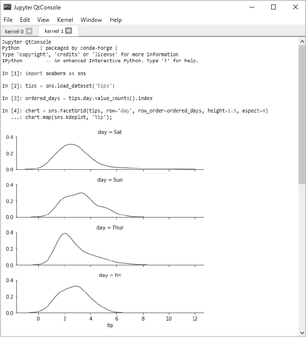
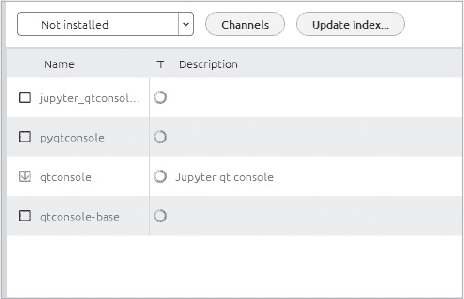
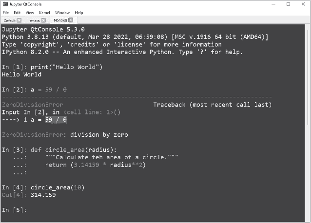
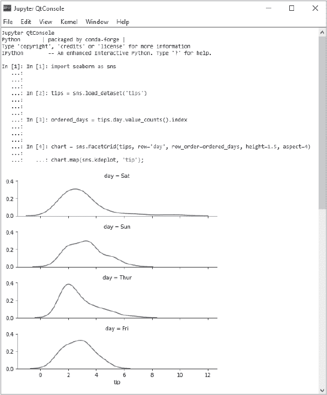
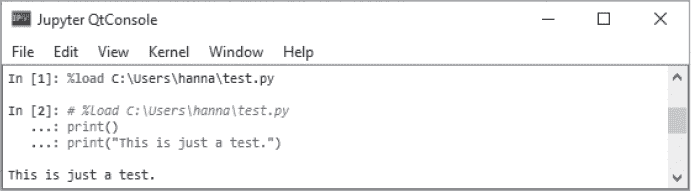
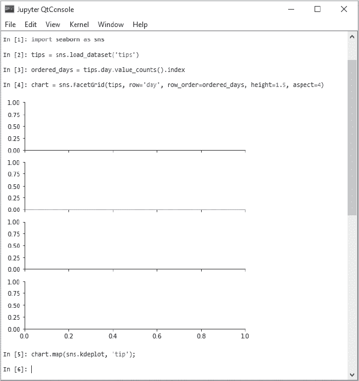

## 第五章：在 JUPYTER QT CONSOLE 中的简单脚本编写**


*Jupyter Qt 控制台* 是一款轻量级应用程序，它将终端的简洁性与仅在图形用户界面（GUI）中可能实现的功能（如查看内联图形）相结合。它旨在快速测试想法、探索数据集并处理教程，而不是长时间的交互式使用。

当我说 Qt 控制台是“轻量级”的意思是，它的内存占用小，不会给 CPU 带来负担。同样，它也不会通过众多的控制项和选项让用户感到困惑。其界面简洁而稀疏（见 图 3-1），类似于 Python 自带的交互式 Shell，但做了许多改进。这些改进包括行号、多标签页支持、丰富媒体输出（如图像、视频、音频和交互式元素）的支持、跨会话的命令历史记录检索、带语法高亮的多行编辑、会话导出等。



*图 3-1：具有两个标签（内核 0 和内核 1）以及内联图形的 Jupyter Qt 控制台*

接下来的章节将提供 Qt 控制台的广泛介绍。有关更深入的研究，你可以访问官方文档 *[`qtconsole.readthedocs.io/`](https://qtconsole.readthedocs.io/)*。

### **安装 seaborn**

如果你想重现本章中显示的图表，你需要安装 seaborn 数据可视化库。使用上一章中创建的 *my_first_env* conda 环境。

打开 Anaconda Prompt（Windows 系统）或终端（macOS 和 Linux 系统），然后输入以下命令：

```py
conda activate my_first_env

conda install seaborn
```

你还需要了解多行编辑，你可以在本章稍后的“多行编辑”部分找到相关内容。

### **使用 Navigator 安装并启动 Jupyter Qt 控制台**

使用 Anaconda Navigator 安装 Jupyter Qt 控制台有两种方法。如果你在第一种方法中遇到问题，可以尝试第二种方法。

最简单的方法是使用首页标签上的 Qt Console 磁贴。首先通过在首页标签顶部附近的 **Applications on** 下拉菜单中选择其名称来激活环境（见 图 3-2）。在这个例子中，我们使用的是上一章中创建的 *my_first_env*。接下来，点击 Qt Console 应用程序磁贴上的 **Install** 按钮。你可能需要滚动首页标签以找到该磁贴。


*图 3-2：Anaconda Navigator 首页标签，显示了活动环境（my_first_env）和 Qt Console 磁贴*

**注意**

*忽略名为 jupyter console 的包。此版本的控制台纯粹基于终端，不涉及用于图形的 Qt。*

几秒钟后，Install 按钮应该会变成 Launch 按钮。点击它以启动控制台。请注意，尽管首页标签上的磁贴显示的是 IPython（IP[y]）图标，但控制台窗口的名称是 Qt Console。

如果由于某种原因你没有在首页标签看到安装图块，请点击**环境**标签，将视图切换到**未安装**，在**搜索包**框中搜索**qtconsole**，然后点击列表中**qtconsole**旁边的按钮（图 3-3）。



*图 3-3：通过“环境”标签安装 Jupyter Qt 控制台*

接下来，点击屏幕底部的**应用**按钮，然后在弹出窗口中再次点击**应用**。你现在应该在首页标签上看到 Qt 控制台图块（图 3-3）。如果没有，尝试点击首页标签右上角的**刷新**按钮。

通过在每个环境中安装 Qt 控制台，你将能够导入并使用该环境中的其他包。

### **使用 CLI 安装和启动 Jupyter Qt 控制台**

若要使用 CLI 在新环境中安装 Jupyter Qt 控制台，而不是使用 Anaconda Navigator，首先打开 Anaconda 提示符（在 Windows 中）或终端（在 macOS 和 Linux 中），并激活 conda 环境。我们将在上一章创建的*my_first_env*环境中进行操作：

```py
conda activate my_first_env
```

接下来，使用 conda 安装控制台：

```py
conda install qtconsole
```

注意在待安装包列表中有`PyQt`。这个库使得在同一窗口中使用图形成为可能，也解释了 Jupyter Qt 控制台中的“Qt”含义。安装过程中，如果提示，输入 Y 完成安装。

启动程序时，输入：

```py
jupyter qtconsole
```

如果控制台没有自动出现，请检查你的任务栏。之后，如果你想更新应用程序，可以输入以下命令：

```py
conda update qtconsole
```

**注意**

*如果你同时打开了 Navigator 和 Anaconda 提示符（或终端），并且在它们之间切换工作，使用 conda 安装或删除包后，你需要点击 Navigator 首页上的“刷新”按钮。这将更新安装和启动按钮的状态。*

### **Qt 控制台控制**

Qt 控制台是*交互式*的，这意味着它像电子计算器一样工作。你输入的任何指令都会立即执行。实际上，你可以把控制台当作计算器使用：

```py
In [1]: 5 * 2 + (10 / 2)
Out[1]: 15.0
```

注意控制台如何标记输入与输出，并包括行号。尽管在黑白书籍中你看不见，Qt 控制台也使用不同的颜色来区分关键字、注释、错误信息等。这个被称为*语法高亮*的颜色编码帮助你将代码进行视觉分类。

你还可以选择浅色或深色背景。事实上，现在正是调整屏幕配置选项的好时机，看看你最喜欢哪种设置。

#### ***选择语法风格***

在 Jupyter Qt 控制台窗口顶部，点击 **视图** ▸ **语法样式**。你将看到大约 36 种样式类型，包括流行的 `emacs`、`vim` 和 `vs` 样式。选择其中一个，然后输入你在 图 3-4 中看到的代码，这样你就能看到主题的颜色选择。本书默认使用 `default` 语法样式，除非另有说明。

要比较样式，使用 **文件** ▸ **新标签页与新内核** 打开新标签页。然后使用 **窗口** ▸ **重命名当前标签** 为当前显示的样式命名（例如，图 3-4 中的“Monokai”）。你可以将代码从一个标签复制到下一个，以查看高亮变化。



*图 3-4：Monokai 语法样式*

如果你从命令行启动 Jupyter Qt 控制台，你可以同时指定一个样式。例如，要选择 Monokai，输入以下内容：

```py
jupyter qtconsole –-style monokai
```

当然，不需要指定 `default` 样式。

甚至可以配置控制台并设置你自己的样式（请参阅 *[`qtconsole.readthedocs.io/_/downloads/en/stable/pdf/`](https://qtconsole.readthedocs.io/_/downloads/en/stable/pdf/)* 中的“颜色和高亮”以及“字体”部分）。

#### ***使用键盘快捷键***

Jupyter Qt 控制台支持键盘快捷键，或称 *键绑定*，包括熟悉的 CTRL-C 和 CTRL-V，用于复制和粘贴（分别见表 3-1）。你可以通过点击 **帮助** ▸ **显示 QtConsole 帮助** 来查看键绑定列表。退出帮助时，使用 ESC 键。

**表 3-1：** Jupyter Qt 控制台中常用的键绑定

| **键绑定** | **描述** |
| --- | --- |
| CTRL-C | 将高亮文本复制到剪贴板，无需提示 |
| CTRL-SHIFT-C | 将高亮文本复制到剪贴板，并显示提示 |
| CTRL-V | 从剪贴板粘贴文本 |
| CTRL-Z | 撤销 |
| CTRL-SHIFT-Z | 重做 |
| CTRL-S | 保存为 HTML/XHTML |
| CTRL-L | 清除终端 |
| CTRL-A | 跳转到行首 |
| CTRL-E | 跳转到行尾 |
| CTRL-U | 从光标位置删除到行首 |
| CTRL-K | 从光标位置删除到行尾 |
| CTRL-P | 上一行（类似上箭头） |
| CTRL-N | 下一行（类似下箭头） |
| CTRL-F | 前进（类似右箭头） |
| CTRL-B | 返回（类似左箭头） |
| CTRL-D | 删除下一个字符，或者当输入为空时退出 |
| ALT-D | 删除下一个单词 |
| ALT-BACKSPACE | 删除上一个单词 |
| CTRL-. | 强制重启内核 |
| CTRL-+ | 增大字体大小 |
| CTRL-hyphen | 减小字体大小 |
| CTRL-T | 打开带有新内核的新标签页 |
| CTRL-SHIFT-P | 打印 |
| F11 | 切换全屏模式 |
| CTRL-R | 重命名当前标签 |
| ALT-R | 重命名窗口 |

在更实用的快捷键中，向上和向下箭头键尤其有用。它们允许你循环查看已经输入的行，方便再次使用。

#### ***使用标签和内核***

Jupyter Qt 控制台支持多个标签页，可以从**文件**菜单打开。你必须选择一个内核选项，这是执行代码的活动“计算引擎”。有三个选项：

**使用新内核的新标签页** 打开一个带有新 IPython 内核的新标签页。

**使用相同内核的新标签页** 创建一个父内核的子内核，该内核会加载在特定标签页上。在父标签页上初始化的对象将在两个标签页中都可以访问。

**使用现有内核的新标签页** 打开一个新标签页，并让你选择 IPython 以外的内核。

#### ***打印与保存***

如果你是那种喜欢把程序打印出来并用红笔编辑的“老派”人，你会喜欢**文件** ▸ **打印**命令，它会生成代码的硬拷贝，正如它在控制台中显示的那样。

你可以通过**文件** ▸ **保存为 HTML/XHTML** 将 Qt 控制台会话保存为 HTML 或 XHTML 文件。如果你有任何内嵌的图形或图片，可以选择将它们写入外部 PNG 文件。PNG 图像可以保存在外部文件夹中，或者内嵌保存，以创建一个更大但更便携的文件。在 Windows 中，外部文件夹名为*ipython_files*，它存储在 HTML 文件所在的位置下。

使用 XHTML 选项时，图形将作为 SVG 文件内嵌显示。要将内嵌图形的格式从默认的 PNG 格式切换到 SVG 格式，请参见“保存与打印”部分，网址为 *[`qtconsole.readthedocs.io/`](https://qtconsole.readthedocs.io/)*。

虽然 Qt 控制台主要用于交互式工作，但你也可以将已保存的 HTML/XHTML 文件或外部文本编辑器中的代码复制到控制台中再次运行。然而，你需要去除任何输出行，并且你将失去行号格式（比较图 3-5 与图 3-1）。



*图 3-5：从 HTML 文件复制并在新的 Qt 控制台会话中再次运行的代码*

你也可以使用`%load`魔法命令，将任何脚本（如文本文件或现有的 Python 文件）粘贴到 Qt 控制台作为下一次输入。然后，你可以编辑它或按原样执行。

**注意**

*魔法命令是 IPython 对普通 Python 代码的增强功能，它简化了诸如加载文件之类的常见任务。在 Qt 控制台中使用的行魔法命令，以百分号符号（`%`）为前缀。*

要查看`%load`命令如何工作，请为你的平台打开文本编辑器并输入以下内容：

```py
print()
print(″This is just a test.″)
```

`print()`函数是一个内建的 Python 例程（迷你程序），用于将输出打印到屏幕。我们将在第十一章中更详细地讨论函数。

将此文件保存为 *test.py* 或 *test.txt*。在 Qt 控制台中，键入`%load`，然后输入你的文件路径，像我在图 3-6 中的示例一样。按回车键加载文件，再按一次回车键执行代码。



*图 3-6：使用`%load`魔法命令从文本文件加载并执行代码*

`%load` 命令也可以从其他来源加载代码，如 URL。

常用的部分魔法命令列在 表 3-2 中。你可以在 *[`ipython.readthedocs.io/en/stable/interactive/magics.html`](https://ipython.readthedocs.io/en/stable/interactive/magics.html)* 了解更多相关内容。

正如你从这个例子中看到的，你不需要一个复杂的工具来编写 Python 程序；一个简单的记事本应用就足够了。但是你可以做得更好。专门用于编程的文本编辑器，如 Emacs、Vim、IDLE、Notepad++、Sublime Text 等，具有内置的功能，能让你更高效地编程。我们将在下一章介绍 Spyder 的文本编辑器。

**表 3-2：** 常用的行魔法命令

| **命令** | **描述** |
| --- | --- |
| `%cd` | 更改当前工作目录 |
| `%cls (或 %clear)` | 清除屏幕 |
| `%conda` | 在当前内核中运行 conda 包管理器 |
| `%load` | 加载代码到当前前端 |
| `%lsmagic` | 列出当前可用的魔法函数（按 ESC 键退出） |
| `%matplotlib qt` | 在交互式 Qt 窗口中显示 Matplotlib 图表，而不是内嵌显示 |
| `%pprint` | 切换美观打印开关 |
| `%precision` | 设置浮点数精度以便美观打印 |
| `%pwd` | 返回当前工作目录路径 |
| `%quickref` | 显示魔法函数的参考资料（按 ESC 键退出） |
| `%reset` | 从会话内存中移除所有变量 |
| `%timeit` | 计时 Python 语句或表达式的执行时间 |
| `%MAGIC?` | 在魔法命令后加上“?”可以显示其文档字符串 |

#### ***多行编辑***

*多行编辑* 是一个有用的功能，终端中没有，但 Qt 控制台支持。它让你可以通过使用 CTRL-ENTER 替代 ENTER 来输入多行，而无需立即执行。

**注意**

*本书使用 Windows 操作系统的习惯。macOS 用户在使用快捷键时应将 COMMAND 键替换为 CONTROL 键，将 OPTION 键替换为 ALT 键。*

如果你仔细看 图 3-1 中的代码，你会注意到第 4 行看起来有些奇怪。第二行没有编号，而是以三个点作为前缀：

```py
In [4]: chart = sns.FacetGrid(tips, row=′day′, ...
   ...: chart.map(sns.kdeplot, ′tip′);
```

由于我在输入第 4 行后按下了 CTRL-ENTER，这一行并未执行。因此，我能够在绘制图表之前完全定义它。如果我逐行输入并执行这些代码，我将会得到 图 3-7 中显示的不可接受的结果。



*图 3-7：逐行执行导致图表绘制时没有数据*

此外，在多行块中的任何位置，你都可以通过使用 SHIFT-ENTER 强制执行当前的代码块（无需跳到最后一行）。

多行编辑是 Jupyter Qt 控制台与其他基本解释器的一个显著区别。对于短小的代码片段，这个功能非常方便，但随着程序变得更长，你会更倾向于使用真正的文本编辑器，它提供更高效且持久的编辑体验。

### **总结**

Jupyter Qt 控制台是一个轻量级应用程序，适用于编写代码片段、快速探索数据集、测试想法以及完成编码教程。对于编写大型持久程序，你需要使用其他编码工具，如 Jupyter Notebook、JupyterLab 或 Spyder。
