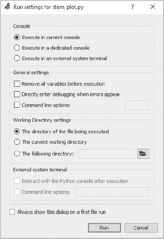
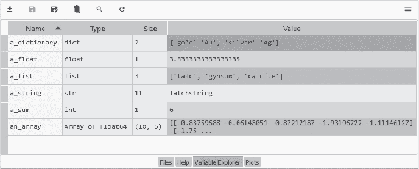

## 第六章：用 Spyder 进行**严肃编程**


*科学 Python 开发 IDE（Spyder）* 是一个开源的交互式开发环境，旨在由科学家为科学家设计。它将多个专业化工具，如文本编辑器、调试器、分析器、代码检查器和控制台，集成到一个全面的软件开发工具中。

Spyder 是为重度工作设计的，因此它比上一章中提到的 Jupyter Qt 控制台有更大的系统占用和更复杂的界面（图 4-1）。但这并不意味着你不能用 Spyder 来做小任务。它包含一个控制台，用于执行临时代码，还有一个文本编辑器，用于编写持久且易于编辑的各种大小的脚本。本书的第二部分使用了 Spyder，作为 Python 编程的入门教程，帮助你在需要学习 Python 或刷新某些概念时提供支持。


*图 4-1：科学 Python 开发 IDE（Spyder）*

一般来说，如果你打算编写复杂的程序或开发应用程序，你会选择使用 Spyder 或类似的 IDE。

### **使用 Anaconda Navigator 安装和启动 Spyder**

Spyder 已经预安装在你的 *base* 环境中。要在不同的环境中使用 Anaconda Navigator 安装 Spyder，首先通过选择首页标签顶部附近的 **Applications on** 下拉菜单中的环境名称来激活该环境（图 4-2）。在此示例中，我们使用的是在第二章中创建的 *my_first_env*。接下来，点击 Spyder 应用图标上的 **Install** 按钮来安装它。你可能需要向下滚动首页标签以找到该图标。

几分钟后，安装按钮应该会变成启动按钮。点击它来启动 Spyder。记住，如果你想安装 Spyder 的特定版本，可以点击右上角的齿轮图标，查看可用的版本号列表。

有关安装 Spyder 的更多信息，请参见安装指南 *[`docs.spyder-ide.org/current/installation.html`](https://docs.spyder-ide.org/current/installation.html)*


*图 4-2：Anaconda Navigator 首页标签，显示活动环境（my_first_env）和 Spyder 瓷砖*

### **使用 CLI 安装和启动 Spyder**

Spyder 已经预安装在你的 *base* 环境中。要在新环境中使用 conda 安装它，首先打开 Anaconda 提示符（在 Windows 中）或终端（在 macOS 和 Linux 中），然后激活 conda 环境。我们通过输入以下命令为 *my_first_env* 环境执行此操作：

```py
conda activate my_first_env
```

接下来，使用 conda 安装 Spyder：

```py
conda install spyder
```

要安装特定版本，如 5.0.3，输入：

```py
conda install spyder=5.0.3
```

要通过命令行启动 Spyder，输入：

```py
spyder
```

有关安装 Spyder 的更多信息，请参见安装指南 *[`docs.spyder-ide.org/current/installation.html`](https://docs.spyder-ide.org/current/installation.html)*

### **通过开始菜单启动 Spyder**

在大多数平台上，官方文档建议通过 Anaconda Navigator 启动 Spyder。然而，在 Windows 中，推荐的启动方法是通过开始菜单启动 Spyder（见图 4-3）。


*图 4-3：Spyder 安装在 Windows 的开始菜单中的 Anaconda3 文件夹下*

在那里，你应该能看到列出所有 Spyder 安装和它们所加载的环境，这些都在*Anaconda3*文件夹下。

### **配置 Spyder 界面**

图 4-4 显示了带有标记的 Spyder 界面，展示了主要的面板和工具栏。请注意，我已将其外观从“出厂设置”视图更改，以便于本次讲解并使其在黑白书籍中更易于查看。不要被所有控制项和面板吓到。Spyder 可以根据你需要的复杂度来调整，既可以很简单，也可以很复杂。

为了让你更容易跟随操作，让我们将你的屏幕配置为更接近图 4-4 中所示的样子。首先，在偏好设置窗口中设置语法高亮主题，Windows 和 Linux 系统上通过点击顶部工具栏的**工具** ▸ **偏好设置**；macOS 系统上通过点击**Python/Spyder** ▸ **偏好设置**；或者点击屏幕顶部主工具栏的扳手图标（见图 4-4）。

找到语法高亮主题菜单，选择**Spyder**选项，然后点击**确定**。这会将背景设置为白色（如果你眼睛敏感，可以使用**Spyder Dark**）。请注意，你有许多代码高亮颜色的选择，就像在上一章中使用 Jupyter Qt 控制台时一样。


*图 4-4：标记关键组件的 Spyder 界面*

现在，让我们将文件资源管理器面板移到屏幕的左侧。在界面顶部的工具栏中，点击**视图** ▸ **解锁面板和工具栏**。这使你可以像移动桌面窗口一样拖动它们。在右上角的面板中，找到灰色标签的**文件**，点击它。右上角的面板现在应该显示文件资源管理器窗口。抓住它的顶部，将其拖动到界面的左侧，如图 4-4 所示。你可以抓住面板的边缘来调整其大小。

在顶部工具栏中，点击**运行** ▸ **运行分析器**，然后点击**源** ▸ **运行代码分析**。这些选项会自动作为标签显示在右上角的面板中，如图 4-4 所示。使用分析器，你可以测量代码的运行时间，而代码分析会检查样式违规和潜在的错误。

要保存这个或任何布局，在顶部工具栏中选择**视图** ▸ **窗口布局** ▸ **保存当前布局**，并为布局起一个唯一的名字。这样，当你启动 Spyder 时，这个布局就会成为默认布局。要选择另一个布局，请在**视图** ▸ **窗口布局**中查找。

正如你所看到的，Spyder 是高度可配置的。你可以通过拖动面板将其从 Spyder 中弹出。你可以分别使用 **视图** ▸ **面板** 和 **视图** ▸ **工具栏** 来开启或关闭面板和工具栏。随着时间的推移，你的界面将逐步发展，变得独一无二。只要记得保存你的窗口布局！

在接下来的章节中，我们将探讨如何在不同环境中使用 Spyder，如何设置 Spyder 项目，以及如何使用 Spyder 的面板和工具栏。其他有用的参考资料包括 Spyder 的主页 (*[`www.spyder-ide.org/`](https://www.spyder-ide.org/)*)、文档 (*[`docs.spyder-ide.org/current/index.html`](http://docs.spyder-ide.org/current/index.html)*)、以及常见问题 (*[`docs.spyder-ide.org/5/faq.html`](https://docs.spyder-ide.org/5/faq.html)*).

### **在环境和包中使用 Spyder**

Spyder 是一个像其他包一样的工具，必须安装在 *某个* conda 环境中。这意味着，如果你尝试导入并使用不在与 Spyder 相同环境中的包，就会遇到错误。为了处理这个问题，我们将看看简单但资源消耗大的 *天真方法* 和轻量但更复杂的 *模块化方法*。

#### ***天真方法***

使用 Spyder 与环境结合的最简单方法是将 Spyder 直接安装到每个 conda 环境中并从那里运行，就像我们在之前的安装示例中所做的那样。这种方法适用于所有版本的 Spyder，并且在 IDE 安装后应该无需额外配置。不幸的是，这种方法会导致需要管理多个安装，并且不像其他替代方案那样灵活或可配置。

例如，假设你在一月份启动了一个新项目并在该环境中安装了当前版本的 Spyder。六个月后的七月，你开始了另一个项目并将 Spyder 加载到该项目的新环境中。这个版本的 Spyder 可能比你在一月份安装的版本更新。此时，你的 *pkgs* 文件夹中有两个单独的 Spyder 安装，占用了空间。如果你不需要保留旧版本，一个选择是运行 `conda update spyder` 来更新你所有环境中的 Spyder 版本，然后运行 `conda clean -all` 来删除未链接到任何环境的版本。

如果你不打算频繁使用 Spyder，或者你不会同时处理大量项目，或者你的系统资源并不严重受限，那么你可能会发现天真方法是一个合适的解决方案。它确实符合 *科学优先，编程其次* 的思维方式。否则，请查看下一节中的模块化方法。

#### ***模块化方法***

另一种使用现有环境的方法是将 Spyder 安装在一个位置，然后更改其默认的 Python 解释器。解释器是每个 conda 环境文件夹中存在的*python.exe*文件。根据你的系统，你可能会看到它被称为*python.exe*、*pythonw.exe*、*python* 或 *pythonw*。

采用模块化的方法，你只需安装一次 Spyder 并将其放入一个专用环境（我们称之为*spyder_env*）。这样，你可以单独更新 Spyder，避免与其他包产生冲突。你可以执行 Spyder 的最小安装，或者执行完整安装，后者包含所有 Spyder 的可选依赖项以确保其完全功能。

让我们使用命令行创建专用环境并执行完整安装，添加像 NumPy、pandas 等包：

```py
conda create -n spyder_env spyder numpy scipy pandas matplotlib sympy cython
```

从现在开始，你将从这个专用环境启动 Spyder。

要允许*spyder_env*中的 Spyder 包导入并使用另一个环境中的包，你必须将轻量级的*spyder_kernels*包安装到另一个环境中，可以使用 Navigator 或 conda。举个例子，我们并没有在第二章中创建的*my_second_env*中安装 Spyder。要在该环境中使用 Spyder，请激活该环境并像这样执行安装：

```py
conda activate my_second_env
conda install spyder_kernels
```

现在，你可以将运行在*spyder_env*中的 Spyder 应用程序指向*my_second_env*中的解释器，这样它就可以找到并使用安装在*my_second_env*中的包。

要在 Spyder 中更改 Python 解释器，请点击**状态**栏中当前环境的名称（见图 4-4），然后选择**在首选项中更改默认环境**（你也可以使用主工具栏中的“扳手”图标）。在首选项对话框中，选择**Python 解释器**，然后点击**使用以下 Python 解释器**旁边的单选按钮（见图 4-5）。从下拉列表中选择环境，或者使用文本框（或文本框右侧的选择文件图标）提供你希望使用的 Python 解释器路径。


*图 4-5：使用首选项对话框更改 Python 解释器*

点击**确定**更改解释器，然后点击顶部工具栏中的**控制台** ▸ **重启内核**，使更改生效。状态栏上的环境名称应从*spyder_env*更改为*my_second_env*（见图 4-6）。现在，Spyder 可以从选定的环境中找到并导入包，无论 Spyder 包的位置在哪里。


*图 4-6：Spyder 状态栏显示 Python 解释器的源环境名称*

注意，如果你将解释器更改为没有安装 Spyder 或 spyder-kernels 包的环境，当你尝试重新启动控制台时，将会在控制台中看到错误信息。同样，如果你尝试启动新控制台，你将看到图 4-7 中显示的提示信息。


*图 4-7：在没有 spyder-kernels 包的环境中启动新控制台会产生一个有用的错误信息。*

如你所想，使用多个环境的模块化方法可能会变得繁琐，你可能会失去对正在使用哪个环境的跟踪。Spyder 的一些功能，如变量资源管理器，可能不会正确处理某些数据类型。如果你需要在特定项目中锁定 Spyder 的某个版本，你最终可能不得不运行多个 Spyder 安装，这样其他项目才能使用最新版本。

有关模块化方法的更多详细信息，请参阅 Spyder 开发团队关于在 Spyder 中处理环境和包的指南，网址为*[`github.com/spyder-ide/spyder/wiki/Working-with-packages-and-environments-in-Spyder/`](https://github.com/spyder-ide/spyder/wiki/Working-with-packages-and-environments-in-Spyder/)*。

### **使用项目文件和文件夹**

Spyder 允许你创建特殊的*项目文件*来存储你的所有工作。这些文件帮助你保持组织性，并且可以稍后重新加载项目，顺畅地继续工作。项目通过 Spyder 顶部工具栏中的**项目**菜单进行管理（打开、关闭、创建等）。

#### ***在新目录中创建项目***

要创建一个新的项目文件作为新目录，请在顶部工具栏中点击**项目** ▸ **新建项目**。这将打开图 4-8 中所示的创建新项目对话框。为新项目命名为*my_spyder_proj*，选择一个磁盘位置，然后点击**创建**。


*图 4-8：创建新项目对话框*

这将创建如图 4-9 所示的目录结构。除了显示的文件夹，Spyder 还将创建八个文件，以帮助管理你的项目。


*图 4-9：创建新项目后 Spyder 的初始目录结构*

为了保持项目的有序性，你可以向*my_spyder_proj*中添加其他文件夹。理想情况下，这些文件夹应该使用标准化的名称，简洁明了，这样你就可以轻松地在项目之间工作，并与他人共享它们。让我们现在以此为例。如果你已经有自己的系统，随时可以使用它。

在 Spyder 的文件资源管理器窗格中，右键点击*my_spyder_proj*，然后从弹出菜单中选择**新建** ▸ **文件夹**。在现有的*.spyproject*文件夹下添加如下所示的文件夹，如图 4-10 所示。


*图 4-10：文件资源管理器窗格中显示的新项目文件夹*

在显示的命名格式中，*code* 用于存放你的 Python 代码；*data* 用于存放数据文件，如 Excel 表格、*.csv* 文件、图片等；*documents* 用于存放文本文件，如报告；*output* 用于存放你的代码生成的图表和表格；*misc* 用于存放其他所有内容。

为了使你的项目真正独立，我建议将你的 conda 环境和 Python 包列表包含在项目文件夹中。为此，如下一节所述，在现有目录中创建 Spyder 项目。

#### ***在现有目录中创建项目***

有时，你可能希望在一个 *现有的* 目录中创建你的 Spyder 项目。例如，当你想将 conda 环境包括在项目中时，这样这个重要的文件夹就可以与其他项目文件一起打包，方便你轻松地共享或归档项目。

当存储在 Spyder 项目中时，环境文件夹应该命名为类似 *env* 或 *conda_env* 的名称。如果你有多个项目，想要为环境文件夹添加一个项目名称——如果项目名较长，可以缩写——例如 *env_PROJ_NAME*。这样，你在从 Windows **开始** 菜单启动时，就可以识别正确的 Spyder 安装。请记住，在默认的 *pkgs* 文件夹之外创建环境有一些小的缺点，因此在提交之前，建议你查看 第 37 页的“指定环境位置”。

为了将 conda 环境文件夹包含在你的 Spyder 项目中，我们将通过命令行同时创建项目和环境文件夹。我们将项目文件夹命名为 *spyder_proj_w_env*，并使用 conda 同时创建这两个文件夹。在这个示例中，我将其放置在 Windows 中的 *C:\Users\hanna\* 文件夹下，但你可以将其放在任何位置。

**注意**

*后续的说明遵循了“使用 Spyder 与环境和包”的简单方法，正如本章前面所述。如果你使用的是 *模块化方法*，你只需在项目的 conda 环境中安装 spyder-kernels 包。之后，从 Spyder 的专用环境启动它，再将其 Python 解释器切换到你的项目 conda 环境。*

首先，如果 Spyder 当前正在运行，请使用 **文件** ▸ **退出** 在顶部工具栏退出它。接下来，打开 Anaconda 提示符（在 Windows 中）或终端（在 macOS 和 Linux 中），并输入以下内容：

```py
conda create -p C:\Users\hanna\spyder_proj_w_env\conda_env python=3.9 spyder=5.0.3
```

记住，`-p` 是 `--prefix` 的简写，它允许你指定目录路径。我们还同时安装了 Python 和 Spyder，指定了推荐的版本号。这代表了 Spyder 的最小安装。若要安装 Spyder 所有可选的依赖包以实现完全功能，你可以在前面的命令中将这些包名添加到 Spyder 后面（为简洁起见，我省略了版本号）：

```py
numpy scipy pandas matplotlib sympy cython
```

现在，激活新的环境并通过输入以下两行启动 Spyder，替换为你的环境路径：

```py
conda activate C:\Users\hanna\spyder_proj_w_env\conda_env
spyder
```

此时，你可以通过选择 Spyder 顶部工具栏中的**项目** ▸ **新建项目**来创建一个新项目。这一次，选择**现有目录**，将项目名称留空，并将位置设置为新项目文件夹的路径，*spyder_proj_w_env*，如图 4-11 所示。


*图 4-11：使用现有目录创建新的 Spyder 项目*

现在，你可以像我们在上一节中所做的那样，添加代码、数据等额外的文件夹。在这一点上，你将拥有一个独立的项目（图 4-12）。


*图 4-12：带有嵌入式 conda 环境（conda_env 文件夹）的新 Spyder 项目*

同样，你可以使用任何你喜欢的文件组织系统，但我强烈建议不要把所有东西直接丢进项目文件夹。这样会造成混乱，尤其是在处理大型项目时。

#### ***使用项目面板***

在处理项目文件夹时，你有几个选择。图 4-10 是从 Spyder 的文件资源管理器面板中截取的。如果你希望在使用 Spyder 时只看到你的项目文件夹，可以通过点击顶部工具栏的**视图** ▸ **面板** ▸ **项目**来打开项目面板。要关闭文件资源管理器面板，可以使用面板右上角的“汉堡”图标，或者通过顶部工具栏的**视图** ▸ **面板**并取消选择该面板。

**注意**

*你也可以在 Spyder 中通过操作系统的文件资源管理器查看你的项目文件夹。在项目面板或文件资源管理器面板中，右键点击项目文件夹，然后选择 ***在文件夹中显示***。*

### **帮助面板**

Spyder 的帮助面板无论是对初学者还是经验丰富的程序员都非常有用。要激活它，请点击图 4-4 中右上角面板底部的**帮助**标签。

当你第一次启动 Spyder 时，你会在帮助面板中看到一条消息，提示你阅读一篇简短的介绍性教程（图 4-13）。我强烈推荐你阅读，但如果你想等一下，也可以稍后通过顶部工具栏的帮助菜单来查看它。


*图 4-13：初始启动时的帮助面板*

除了介绍性教程外，工具栏的帮助菜单还提供了更长的 Spyder 教程，它会显示在帮助面板中（图 4-14）。你还可以观看视频，访问 Spyder 和 IPython 文档，查看键盘快捷键摘要等等。


*图 4-14：帮助菜单和在帮助面板中显示的 Spyder 教程*

如果你在编码时打开了帮助窗格，它可以查找、呈现并显示任何带有*文档字符串*（描述性文本摘要）的对象的文档，包括模块、类、函数和方法。这让你可以直接在 Spyder 中访问文档，而无需中断工作流去查看其他地方。

帮助窗格顶部的源菜单让你可以在编辑器和 IPython 控制台之间进行选择（见图 4-15）。手动点击一个对象，比如图 4-15 中的`print()`函数，然后按 CTRL-I（在 macOS 上是 CMD-I）会显示该项的信息。你也可以通过在窗格顶部的**对象**文本框中手动输入对象名称（比如“print”）来获取帮助。


*图 4-15：在编辑器中使用 CTRL-I（Windows）调用的 print() 函数的帮助输出*

要启用编辑器和控制台的自动帮助，首先点击主工具栏上的扳手图标（见图 4-4），然后选择**帮助**，并在自动连接下点击编辑器和 IPython 控制台的单选按钮。之后，可以通过帮助窗格顶部的“锁”图标打开和关闭它。当启用时，只需在函数或方法名称后输入左括号字符（`(`），即可显示其关联的帮助文档。

你也可以通过将鼠标悬停在编辑器中的对象上来访问对象的摘要帮助。点击悬停弹窗将会在帮助窗格中打开完整的文档。确保“源”菜单设置为“编辑器”。

最后，帮助窗格右上角的“汉堡”图标可以切换显示模式下的功能，比如富文本或纯文本、停靠和取消停靠窗格、关闭窗口等等。

### **IPython 控制台**

IPython 控制台位于图 4-4 中的右下窗格，代表与 Python 的直接连接，允许你交互式地运行代码。我们在第三章中已经回顾了大部分功能，因此这里不再赘述。

使用 Spyder，你可以打开多个控制台、重启内核、清除命名空间、查看历史日志、取消停靠窗口以及执行类似的任务。你可以通过点击 IPython 控制台窗格顶部的命名标签、使用窗格右上角的“汉堡”图标，或者点击顶部工具栏中的**控制台**来选择这些选项。你还可以与增强版 Spyder 调试器和变量资源管理器进行完整的图形用户界面集成，我们将在后续章节中探讨。

#### ***使用控制台进行输出和绘图***

当你使用 Spyder 的文本编辑器时，任何基于文本的输出都会显示在控制台中。同样，任何基于 Matplotlib 的图形将会显示在控制台中，如你在第三章中看到的，或者显示在 Spyder 的 Plots 窗格中。Pltots 窗格是默认位置，但你也可以通过打开**Plts**窗格，点击右上角的“汉堡”图标，然后取消选择**静默内联绘图**，强制图形显示*在*控制台内。你也可以通过选择顶部工具栏中的**工具** ▸ **首选项** ▸ **IPython 控制台** ▸ **图形**，然后从图形后端菜单中选择来控制图形的显示方式（图 4-16）。


*图 4-16：IPython 控制台图形对话框*

在控制台显示图形是一个不错的选择，如果你想保存交互式会话的记录。然而，如果你需要与图形进行交互，例如缩放、配置子图、操作文件并使用不同的格式保存图形，你就需要在新窗口中打开图形。你可以通过在程序顶部导入模块后添加魔法命令`%matplotlib qt`来实现这一点。

**注意**

*某些类型的图形无法在 Spyder 中显示，而是会在浏览器或外部本地窗口中打开。这些图形包括基于 Web 的图形和 Turtle 和 TKinter 窗口。*

#### ***在控制台中使用内核***

Python 内核是执行代码的计算引擎。你可以在控制台中使用几种操作内核的方式，包括启动新的内核和中断正在运行的内核。这些功能可以通过顶部工具栏中的控制台菜单、命名的控制台标签，或 IPython 控制台窗格中的“汉堡”图标访问。

你还可以通过控制台菜单连接到外部本地和远程内核（包括由 Jupyter Notebook 或 Qt 控制台管理的内核）。要了解更多信息，请访问 *[`docs.spyder-ide.org/5/panes/ipythonconsole.html`](https://docs.spyder-ide.org/5/panes/ipythonconsole.html)*。

#### ***清除命名空间***

Python 内核会跟踪你在编写代码时使用的对象，例如变量和函数。这个在控制台中定义的对象集合被称为*命名空间*。为了防止命名空间变得凌乱，Spyder 允许你在任何时候清除命名空间。

让我们来看一个示例。图 4-17 中的左窗格是文本编辑器，右窗格是控制台。你可以在两者中编写代码。在编辑器中，我设置了 `x = 5`，然后按 F5 运行程序。因为我没有包括 `print()` 函数，所以看似没有任何反应，但实际上，Python 已经将值 5 分配给了变量 `x`。


*图 4-17：文本编辑器（左）和控制台（右）共享相同的 x 值*

现在我决定停下来在控制台中测试一个编程想法。我想使用 `x` 的值为 10，但我忘记输入这个值。相反，我直接将 `x` 乘以 10，得到了 50 的输出 (图 4-17)。通常来说，这会引发错误，因为我还没有命名 `x`，但是由于我之前在编辑器中做了这件事（我认为那是一个独立的程序），`x` 已经在命名空间中了。从我的角度来看，这个结果是出乎意料的。

在一个小片段中调试很简单，但想象一下你正在处理更长、更复杂的程序。`x` 变量的一次出现可能会隐藏在 200 行代码中。即便是小程序，一个常见的错误是运行程序、删除了某个重要的部分，然后在程序正确运行时没有注意到这个错误，因为被删除的对象已经驻留在内存中。

这些持久对象很容易被忘记，它们可能来自多个来源，包括先前执行的代码、控制台中的交互式工作或便捷的库导入（Spyder 可能会自动进行一些便捷导入）。要在不重新启动内核的情况下删除这些对象并清空命名空间，你可以点击顶部工具栏中的**删除所有变量**，或在控制台面板中的控制台标签下进行操作。你也可以通过在控制台中输入以下命令删除所有变量：

```py
%reset
```

如果你想查看会话中全局命名空间中定义的对象，可以使用：

```py
dir()
```

注意，即使删除了所有变量，仍会有十几个内建对象存在。命名空间永远不会完全为空。

通常来说，每当你完成编写一个程序时，应该首先通过删除所有变量或启动一个新内核来检查程序是否能够独立运行。

#### ***历史面板***

历史面板 (图 4-4) 包含了你在控制台中运行的所有命令和代码的时间戳记录。你可以使用这个日志回顾你的操作步骤并重现你的工作。然而，它不会显示输出或消息，如果你在编辑器面板中运行程序，它只会显示文件被*运行*，而不会显示执行了哪些命令。不管你打开了多少个控制台，历史面板只有一个。所有来自不同控制台的命令将按执行顺序列出，而不会标明是来自哪个控制台。

你可以从历史面板中复制命令，并将它们粘贴到控制台和编辑器中。目前，历史面板最多只能显示 1,000 行历史记录，并且没有办法清除历史。命令列表存储在用户主文件夹中的 *history.py* 文件中，位置在 .*spyder-py3* 目录下（例如，Windows 系统中为 *C:/Users/<username*>，macOS 系统中为 */Users/<username>*，在 GNU/Linux 系统中为 */home/<username>*）。

#### ***特殊控制台***

除了 IPython 控制台，Spyder 还支持几种*特殊控制台*，你可以从顶部工具栏的“控制台”或通过使用 IPython 控制台面板上的“汉堡”图标启动。例如，Cython 控制台让你使用 Cython（Python 语言的超集）来加速代码，并能直接从 Python 调用 C 函数。SymPy 控制台则支持创建和显示符号数学表达式。你还可以通过 **首选项** ▸ **IPython 控制台** ▸ **高级设置** ▸ **使用符号数学** 来激活符号数学功能，前提是你已安装 SymPy 包。更多内容，请点击顶部工具栏上的 **帮助** ▸ **Spyder 教程**。

### **编辑器面板**

文本编辑器（图 4-4）是 Spyder 的核心。与控制台基本上是为一次性、交互式脚本编写而设计的“草稿本”，几乎没有持久化功能不同，Spyder 的编辑器面板让你能够创建可以保存和稍后运行（或编辑）的程序。你可以将它看作是一个带有代码友好功能的文字处理器，如语法高亮、实时代码和风格分析、按需补全、常用键盘快捷键、水平和垂直拆分等。

#### ***使用编辑器编写程序***

要测试编辑器，可以使用命令行或导航器激活你在本章“在现有目录中创建项目”部分中创建的*spyder_proj_w_env*环境。要在 IDE 中尝试绘图，请使用导航器或命令行在活动环境中安装 NumPy 和 Matplotlib 包。在命令行中，这看起来像以下内容：

```py
conda install matplotlib numpy -y
```

`-y`（`--yes` 的简写）只是确认在执行时的安装命令，这样你就不需要在过程中手动确认。为了方便起见，我这样展示，但手动确认安装和删除总是更安全。这也给你提供了另一个机会，确认正确的环境已被激活，并且 conda 不需要降级现有包，避免由于某些依赖问题。

接下来，从相同的环境启动 Spyder，可以通过 Windows 开始菜单（确保选择带有正确环境名称的图标）、Anaconda Navigator 或命令行启动。现在你可以使用编辑器编写你的第一个程序了。

为了评估 Spyder 的绘图功能，让我们使用 Matplotlib 画廊中的“Stem Plot”示例（*[`matplotlib.org/stable/gallery/index.html`](https://matplotlib.org/stable/gallery/index.html)*）。通过点击顶部工具栏中的 **文件** ▸ **新建文件** 或使用 CTRL-N 来启动一个新文件。你将看到一个新的“未命名”标签出现在编辑器面板中。

删除编辑器窗格中的模板文本，并输入以下代码。与控制台不同，按 ENTER 键添加新行是可以的。在脚本模式下，您的代码稍后会通过特殊命令执行。如果您是初学者，不必担心代码的细节；目前，专注于编辑器窗格的操作方式：

```py
″″″Stem plot example from matplotlib gallery″″″

import matplotlib.pyplot as plt
import numpy as np

x = np.linspace(0.1, 2 * np.pi, 41) y = np.exp(np.sin(x))

plt.stem(x, y)

print(″\nThis is a stem plot.″)
```

虽然现在已经可以运行这段代码，但首先让我们使用顶部工具栏中的 **文件** ▸ **另存为** 来保存它。将文件命名为 *stem_plot.py*，并将其保存在 Spyder 项目的 *code* 文件夹中。

**注意**

*文本编辑器支持许多键盘快捷键。要查看快捷键列表，请点击顶部工具栏中的 ***帮助*** ▸ ***快捷键概述***。要查找特定快捷键，请点击 ***工具*** ▸ ***首选项*** ▸ ***键盘快捷键***，同样在顶部工具栏中。*

要执行代码，您有几个选择。您可以使用运行工具栏左侧的“播放”箭头（参见图 4-4），点击编辑器窗格内并按 CTRL-ENTER，或在编辑器窗格内按 F5（或 FN-F5，具体取决于您的键盘）。

如果这是您第一次在 Spyder 中运行程序，系统会要求您选择一个运行配置（参见图 4-18）。选择默认选项 **在当前控制台中执行**。我们将在本章后面的小节中讨论这意味着什么，具体是“设置运行配置”部分。



*图 4-18：运行设置对话框*

现在，您应该能看到图 4-19 中显示的结果。


*图 4-19：执行 stem_plot.py 程序后的 Spyder 界面*

在图 4-19 中需要注意的一点是，文本输出“这是一个茎图”出现在控制台窗口中。这比在控制台中编程要干净得多，因为在控制台中，代码及其输出（包括错误信息）会一起显示在同一个窗口中。

在编辑器中运行程序后，程序就会被“识别”到控制台。这意味着它会记住像命名变量和定义的函数等内容。要查看示例，请在 IPython 控制台中输入以下内容，然后按 ENTER 键：

```py
plt.stem(x, y)
```

这应该会重新生成图 4-19 中的茎图。

这种行为在开发和调试复杂程序时非常有用，尤其是在探索大型数据集时，您不希望加载超过一次。它也可能导致意外结果，正如我们在本章“清空命名空间”部分所讨论的那样。

现在，让我们看看另一种显示图形的方式。在编辑器窗格中，在导入语句下方添加 `%matplotlib qt` 魔法命令，如下所示：

```py
″″″Stem plot example from matplotlib gallery″″″

import matplotlib.pyplot as plt
import numpy as np
%matplotlib qt
--snip--
```

将文件保存为*stem_plot.py*，然后使用 CTRL-ENTER 运行程序。在这种情况下，图形会显示在外部窗口中（如果没有弹出窗口，请检查任务栏是否有图标）。这个 Qt 窗口有一个工具栏，比内联模式下提供的选项更多（参见图 4-20）。


*图 4-20：在外部 Qt 窗口中显示的 Stem 图*

现在是重新访问全局命名空间的好时机。关闭 Qt 窗口。现在，从文件中删除 `%matplotlib qt` 魔法命令，并按 CTRL-S 保存。无论你是从编辑器重新运行文件，还是像之前一样在控制台使用 `plt.stem(x, y)`，Qt 窗口都会再次弹出。即使你将其从文件中删除，旧的命令仍然会在内存中持续存在。

要恢复内联绘图，请重启内核或运行魔法命令 `%matplotlib inline`，无论是在控制台还是通过编辑器。

#### ***定义代码单元格***

在前面的示例中，你将完整的程序输入到编辑器窗格中然后运行。你也可以一次运行一行，或运行一个连贯的代码块，称为“代码单元格”。

查看示例时，创建一个新文件，不过这次使用文件工具栏左侧的矩形“新建文件”图标（图 4-4）。将文件命名为 *temperature_converter.py* 并保存在 *code* 文件夹中。

在此示例中，假设你总是需要将温度测量值从一个刻度转换到另一个刻度，并且你希望将几个转换公式放在一个文件中以方便使用。你不想每次都运行整个程序，因为你通常只执行一次转换，比如从华氏度到摄氏度，或从摄氏度到开尔文度。在这种情况下，代码单元格是一个便捷的解决方案。

将以下代码输入到新文件中并保存。使用 `#%%` 将代码分割成独立的单元格：

```py
#%% Convert Temperature: Fahrenheit to Celsius
degrees_f = 0
degrees_c = (degrees_f - 32) * 5 / 9
print(f″{degrees_f} F = {degrees_c} C″)

#%% Convert Temperature: Celsius to Fahrenheit
degrees_c = -40
degrees_f = (degrees_c * 9 / 5) + 32
print(f″{degrees_c} C = {degrees_f} F″)

#%% Convert Temperature Celsius to Kelvin
degrees_c = 0
degrees_k = degrees_c + 273.15
print(f″{degrees_c} C = {degrees_k} K″)
```

在分隔符右侧添加描述不仅记录了该单元格的功能，还在大纲窗格中为该单元格命名。要激活此窗格，请前往顶部工具栏，点击 **查看** ▸ **窗格** ▸ **大纲**。图 4-21 显示了编辑器和大纲窗格的组合。


*图 4-21：温度转换器程序（temperature_converter.py）的编辑器窗格（左）和大纲窗格（右）*

在图 4-21 中的编辑器窗格中，注意到水平线如何将脚本划分为以 `#%%` 分隔的单元格。在大纲窗格中，单元格的描述按顺序从上到下出现。如果点击某个描述，编辑器窗格中对应的单元格将被高亮并激活。你也可以通过在文本编辑器中点击单元格来高亮显示该单元格。

要查看运行单元格的选项，将鼠标光标悬停在运行工具栏上的图标上（图 4-4）。这还会显示快捷键。要运行仅将摄氏度转换为华氏度的中间单元格，请点击该单元格，然后按 CTRL-ENTER 或点击工具栏上的 **运行当前单元格** 图标。你也可以使用图标或 F9 键运行选定的代码或单行代码。

能够运行选定的单元或单行代码在设计和调试程序时非常有用。它还很方便，比如说，改变绘图参数并评估结果，而不需要重新加载所有输入数据。你也可以用它更新程序的一部分，而不重新运行所有代码，但请记住，控制台只会“记住”最后一次执行的内容。如果这变得令人困惑，你可能需要通过重启内核或清除所有变量来刷新控制台。

#### ***设置运行配置***

当你第一次在编辑器中运行程序时，无论是通过工具栏的 **Run** ▸ **Run** 还是按 F5 键，都会弹出一个对话框，询问你选择执行文件的方法（参见图 4-18）。你会有三个选择：

+   在当前控制台中执行（默认）

+   在专用控制台中执行

+   在外部系统控制台中执行

接下来我们将详细介绍前两种，但对于初学者的建议是使用默认选项**在当前控制台中执行**，然后验证已完成的代码是否可以独立执行。这需要通过删除所有变量或在检查程序之前重启内核来清理命名空间。

不用担心被锁定在某个决定中。你可以随时通过从顶部工具栏选择 **Run** ▸ **Configuration per file** 来更改运行配置。

##### **在当前控制台中执行**

当在当前控制台中执行文件时，文件运行完毕后，你可以继续与控制台交互。这使得你可以检查并与执行过程中创建的任何对象进行交互。这是增量编码、测试和调试时非常有用的功能。如同在“使用编辑器编写程序”中所示，它让你可以从控制台调用命令和函数，而无需再次执行文件。

然而，这也有代价。对象可能在执行代码之前就已经在全局命名空间中持久存在（参见第 76 页的“清理命名空间”）。确保代码不依赖于命名空间中现有但临时存在的对象的一种方法是，如下所述，在新控制台中执行文件。

##### **在专用控制台中执行**

选择**在专用控制台中执行**选项意味着每次在编辑器中执行代码时，都会打开一个新的 IPython 控制台。选择此选项，可以确保没有持久化的全局对象污染命名空间，例如未定义的函数、无名变量或未导入的包。这是一个安全的选项，但在与代码交互时提供的灵活性稍差。它还可能生成很多控制台标签需要管理。因此，如果你已经意识到命名空间问题，**在当前控制台中执行**选项是更优选。

#### ***自动完成文本***

为了节省你的敲击次数，文本编辑器和控制台都支持使用 TAB 键进行 *自动完成*。例如，在编辑器中输入以下长变量名：

```py
supercalifragilisticexpialidocious = 'wonderful'
```

现在，慢慢开始再次输入它，看看会发生什么。

当你开始输入一个对象的名称时，比如命令、函数、变量、类等，编辑器会显示以这些字母开头的对象列表（图 4-22）。在控制台中，你必须按 TAB 键来显示列表。


*图 4-22：使用自动完成功能*

如果名称是唯一的，或者位于列表的顶部，你可以直接按 TAB 或 ENTER 键，Spyder 会自动填充剩余的部分。如果有多个选择，你可以继续输入，直到只剩下你想要的名称，然后按 TAB 或 ENTER；也可以使用箭头键选择正确的名称并按 TAB 或 ENTER；或者用鼠标双击正确的名称。你可以通过进入 **工具** ▸ **首选项** ▸ **自动完成与 Linting** 来改变看到建议完成列表所需的字符数。

自动完成是一个很棒的功能，因为它支持编写易于阅读的“Pythonic”代码。通过自动完成，你可以使用高度描述性的变量和函数名，例如 `photoshpere_temperature_in_celsius` 或 `step_2_apply_Gaussian_blur()`，而不会产生重复性劳损。

### **代码分析窗格**

Python 有一些写代码的准则，社区成员应遵循这些准则。目标是编写 Pythonic 代码，其他人可以轻松理解和使用。我们将在第二部分中进一步讨论这些准则。现在，只需要知道，*linter* 是一种工具，可以审查你的代码并提供反馈，指出可能违反准则的地方。Spyder 在其代码分析窗格中使用了业内最好的 *Pylint* linter。

代码分析将帮助你通过检测风格问题、不良实践和潜在的 bug 来改进代码。在你通过 linter 运行程序之前，你不应该认为程序已经完成——或者准备好发布到在线帮助网站上。

让我们来看看这个功能是如何工作的。从顶部工具栏选择 **项目** ▸ **打开项目**，打开你之前在“在现有目录中创建项目”一节中创建的 *spyder_proj_w_env* 项目。然后，使用顶部工具栏的 **文件** ▸ **打开** 打开 *stem_plot.py* 文件。我们之前在“使用编辑器编写程序”一节中创建了这个文件。接下来，通过点击编辑器窗格并按 F8，或通过使用顶部工具栏的 **源** ▸ **运行代码分析** 来打开代码分析窗格。你应该看到图 4-23 中显示的结果。


*图 4-23：编辑器窗格（左）和代码分析窗格（右）用于 stem_plot.py 程序*

在右侧代码分析窗格的顶部，你可以看到代码获得了 8.33 分（满分 10 分）的高评价。唯一的违规之处是程序末尾存在多余的换行符（空行）。

你可以通过点击 **工具** ▸ **首选项**，然后从 **常规**、**Linting**、**代码风格和格式**、**文档字符串风格**标签中进行选择，来定制代码分析。这里有很多选项，包括忽略某些错误和警告、改变格式化代码所用的工具、选择用于检查文档字符串的约定、下划线标记错误和警告等。

你还可以通过向代码中添加特定的注释来抑制消息。例如，一个期望是大多数全局空间中的变量应表示*常量*并应使用全大写字母命名。在短小的程序中，你可能选择通过在文件顶部插入以下注释来忽略这一点：

```py
# pylint: disable=invalid-name
```

要找到正确的消息名称，如“trailing-newlines”，请检查代码分析窗格中的结果（见图 4-23）。

要了解更多代码分析的内容，请参阅 Spyder 文档中的“深入窗格”部分（*[`docs.spyder-ide.org/`](https://docs.spyder-ide.org/)*）。要了解更多 Python 风格指南，请参阅 *[`pep8.org/`](https://pep8.org/)*。

### **变量资源管理器窗格**

变量资源管理器窗格允许你查看并编辑在文本编辑器中执行程序时生成的变量，或在 IPython 控制台中直接输入的变量。这些是当前 IPython 控制台会话的命名空间内容，你可以通过各种基于 GUI 的编辑器来使用变量资源管理器检查、添加、删除和编辑它们的值。

让我们来试试。首先，在顶部工具栏中点击 **控制台** ▸ **重启内核**，以启动一个新的 IPython 控制台会话。这将删除任何可能存在于内存中的旧变量。现在，在右上角窗格中，点击 **变量资源管理器** 标签，或者在顶部工具栏中点击 **查看** ▸ **窗格** ▸ **变量资源管理器**。

在 IPython 控制台中，输入以下内容：

```py
In [1]: import numpy as np

In [2]: an_array = np.random.randn(10, 5)

In [3]: a_list = ['talc', 'gypsum', 'calcite']

In [4]: a_dictionary = {'gold': 'Au', 'silver': 'Ag'}

In [5]: a_sum = 1 + 2 + 3

In [6]: a_float = 10 / 3

In [7]: a_string = ″latchstring″
```

每次按下 ENTER 键时，变量资源管理器窗格应该会更新，直到它显示像图 4-24 那样。



*图 4-24：变量资源管理器窗格*

窗格显示变量的名称；它的类型，例如整数、字符串、字典等；它的大小；以及它的值。在变量资源管理器中右键单击对象时，会显示出进一步绘图和分析这些对象的选项。该窗格支持编辑列表、字符串、字典、NumPy 数组、pandas DataFrame、pandas Series、Pillow 图像等，允许你通过单击绘制和可视化它们。例如，虽然 10 行 5 列的 NumPy 数组太大，无法在值列中显示，但如果你双击它，会出现一个对象查看器窗口，允许你查看数组并操作其内容（见图 4-25）。


*图 4-25：an_array 对象的对象查看器显示*

同样，在变量浏览器面板中双击列表对象所在的行，会启动对象查看器（图 4-26）。你可以通过右键点击对象查看器中的一行来执行一些操作，比如插入一行或添加新项，如“fluorite”。

如果你在当前会话中再次使用 `a_list` 变量，它将包含新项“fluorite”。你还可以使用变量浏览器的工具栏将当前会话的数据保存为 *.spydata* 文件，稍后可以加载该文件来恢复所有存储的变量。但是，请注意，在对象查看器中更改对象的值并不会改变你的代码。如果你重新运行生成 `a_list` 变量的代码，无论是从文件还是控制台，它都不会包含“fluorite”。


*图 4-26：对象查看器显示一个列表对象*

你可以通过点击面板右上角的“汉堡”图标来筛选变量浏览器中的项目。如果某个项目可以绘图，你可以通过右键点击该对象生成一个符合其数据类型的图表。例如，右键点击 `an_array` 对象，然后选择 **显示图像**。这将生成该数组的热力图（图 4-27）。


*图 4-27：an_array 对象的热力图*

Variable Explorer（变量浏览器）有一个限制，它无法显示在函数内定义的“局部”变量（我们将在第十一章中讨论函数）。如果你使用以下代码定义了一个函数，你将无法在面板中看到 `var1` 和 `var2` 变量。

```py
In [1]: def a_function():
   ...:      var1 = 42
   ...:      var2 = ″spam″
   ...:
```

变量浏览器让你跟踪程序的全局变量。它通过允许在友好的 GUI 格式中检查和编辑变量，帮助你开发和调试程序。欲了解更多可用选项，请参见 Spyder 文档中的 *[`docs.spyder-ide.org/5/panes/variableexplorer.html`](https://docs.spyder-ide.org/5/panes/variableexplorer.html)*。

### **性能分析器面板**

Profiler（性能分析器）通过测量文件中每个函数或方法的运行时间和调用次数，帮助你优化代码。你可以利用它识别瓶颈，并在进行更改后定量地衡量性能的提升。

让我们看一个例子，了解它是如何工作的。在顶部工具栏中，点击**文件** ▸ **新建文件**，打开编辑器中的新文件。将该文件保存在 *code* 文件夹中，位于你的 *spyder_proj_w_env* 项目中（或者你想保存的其他地方），文件名为 *hoot.py*。现在，输入以下代码：

```py
def search_list(my_iterable):
    if 'hoot' in my_iterable:
        print(″Hooty hoot!″)

def search_set(my_iterable):
    if 'hoot' in my_iterable:
        print(″Hooty hoot!″)

my_list = [i for i in range(1000)]
my_list[998] = 'hoot'

my_set = set(my_list)

search_list(my_list)
search_set(my_set)
```

在这个例子中，我们定义了两个函数，`search_list`和`search_set`，它们除了名称之外是完全相同的。我们将使用分析器来证明，在 Python 的*集合*中搜索一个项目比在 Python 的*列表*中搜索要快得多，因此我们需要区分这两个函数（我们将在第九章中更详细地讨论集合和列表）。

接下来，我们创建了一个包含 0 到 999 的数字的列表（Python 从 0 开始计数，而不是从 1 开始），并将倒数第二个项（索引 998）替换为“hoot”。然后我们从这个列表中创建了一个集合，命名为`my_set`。现在，我们调用每个函数，并根据需要传递列表或集合（*传递*意味着我们在函数的括号中输入列表或集合的名称）。当每个函数到达列表或集合中的“hoot”项时，它会立即在控制台中打印“Hooty hoot!”。

通过点击编辑器面板中的文件并按下 F5 键来运行文件。你应该能在 IPython 控制台中看到`Hooty hoot!`显示两次。

要查看每个函数运行所需的时间，点击顶部工具栏中的**运行** ▸ **运行分析器**。这将启动分析器面板并显示运行统计信息（见图 4-28）。


*图 4-28：分析器面板*

总时间列显示指定项目及其调用的每个函数所花费的时间（缩进显示在其下）。本地时间列仅计算在特定可调用对象的作用域内所花费的时间。根据本地时间，列表对象的运行时间为 14.8 微秒，而集合则只有 400 纳秒。由于这两个函数除了输入不同之外是相同的，我们可以推测，哈希集合比列表在进行成员查找时是更好的数据类型。

请注意，你可以使用分析器面板顶部的文本框选择文件，并通过文本框右侧的绿色“播放”箭头来运行它们（见图 4-28）。其他选项包括显示程序输出、保存分析数据、加载分析数据以进行比较和清除比较。

要了解更多关于分析器的内容，包括衡量代码内存使用情况的选项，请参见*[`docs.spyder-ide.org/5/panes/profiler.html`](https://docs.spyder-ide.org/5/panes/profiler.html)*。

### **调试器面板**

调试是检测和消除代码中的错误（“bug”）的过程，这些错误可能导致程序崩溃、返回错误结果或表现出其他意外行为。Python 会自动生成错误信息，帮助你确定代码中的哪个部分出现了问题。

对于更复杂的方法，Spyder 集成了 Python 标准库中的增强版`ipdb`调试器。通过调试工具，你可以逐行查看代码，检查问题。

深入探讨调试器的细节超出了本书的范围，你可能会写很多代码而不需要用到它。不过，如果你感兴趣，你可以在*[`docs.spyder-ide.org/5/panes/debugging.html`](https://docs.spyder-ide.org/5/panes/debugging.html)*上获得一个很好的概述，还有许多使用真实编码示例的在线教程和视频。

### **总结**

Spyder 足够强大，适合全职开发者，因此这里有很多内容我们没有涵盖。但尽管它功能强大，对于初学者来说也很容易上手使用，如果你只是想快速编写短小的脚本，它的编辑器和 IPython 控制台非常适合。虽然你大部分的科学编程可能会在接下来讲解的 Jupyter Notebook 中进行，但有许多编码任务 Spyder 更为适用，而你一定会很高兴将其加入到你的工具库中。

如果你是 Python 新手，并且想立即开始学习这门语言，你可以跳到第二部分，即《Python 入门》。完成后，别忘了回到第一部分，查看关于 Jupyter Notebook 和 JupyterLab 的章节（第五章和第六章）。
