## 第七章：5  

JUPYTER NOTEBOOK：计算研究的交互式日志**


经典的 Jupyter Notebook 是全球最流行的数据科学工具。作为一个可以保存的基于 Web 的应用程序，Notebook 让你能够捕捉整个计算过程，从加载和探索数据到开发和执行代码，甚至记录和展示结果。难怪 Notebook 已成为基于代码的研究的默认环境。

用 Anaconda 的定制服务总监 James Bednar 的话来说，*notebooks 讲述故事*。它们旨在捕捉并传达一个基于代码的叙事，这个叙事有线性的流程，并由小而易于理解的步骤组成。它们可以包括简明且准确地解释发生了什么的文档。这帮助科学家、研究人员、开发者和学生生成*可重复*的基于代码的研究。

像个人科学日志一样，Jupyter notebook 可以作为一次计算会话的完整记录。为了让你的工作更易于理解和重复，你可以将输入和输出与叙述文本、数学公式、图片、链接等交织在一起。你还可以直接分享你的 notebooks，或者将它们转换为互动幻灯片或仪表板。

在这一章中，我们将深入探讨经典版本的 Jupyter Notebook。下一章中，我们将介绍 JupyterLab 中的新版本，它是 Project Jupyter 的下一代界面。除了菜单的轻微重排，新版本的功能和经典 Notebook 一样，并且使用相同的文件格式。事实上，这两个版本可以在同一台计算机上并行运行，JupyterLab 甚至配有一个按钮用于启动经典版本。

**注意**

*在接下来的页面中，Jupyter Notebook 或 Notebook（大写“N”）指的是应用程序，而 Jupyter notebook 或 notebook（小写“n”）指的是应用程序生成的实际 notebook 文件。这些文件的扩展名为.ipynb，代表“IPython notebook”。*

为了补充这一章，你可以在*[`jupyter-notebook-beginner-guide.readthedocs.io/en/latest/`](https://jupyter-notebook-beginner-guide.readthedocs.io/en/latest/)*找到快速入门指南，并在*[`jupyter-notebook.readthedocs.io/en/stable/notebook.html`](https://jupyter-notebook.readthedocs.io/en/stable/notebook.html)*找到完整的文档。

### **安装 Jupyter Notebook**

Jupyter Notebook 是一个开源包，预装在 Anaconda 的*base*环境中。然而，在*base*环境中工作并不是一个好主意，因为那样会变得混乱。为了保持项目包的有序、安全和可共享，它们需要放在专门的 conda 环境中。

要在 conda 环境中使用 Jupyter Notebook，你有两种主要选择。你可以在每个 conda 环境中直接安装 Jupyter Notebook，或者将每个环境链接到*base*环境中的 Notebook 安装。为了模仿我们在第四章中使用 Spyder 的做法，我们将第一种选择称为*幼稚的做法*，第二种选择称为*模块化的做法*。虽然模块化的做法通常更为推荐，但如果一个项目需要锁定特定版本的 Notebook，你将需要使用幼稚的做法。

#### ***幼稚的做法***

幼稚的做法是直接在每个 conda 环境中安装 Jupyter Notebook。然后，Notebook 可以导入并使用同一环境中安装的任何包。

这是最简单的方法，但随着时间的推移，随着*pkgs*文件夹中不同版本的 Notebook 逐渐堆积，它可能会变得资源密集。你可能还会发现很难保持所有安装版本的更新，并且可能无法在 Notebook 中查看或切换到其他环境。

##### **通过 Anaconda Navigator 安装和启动 Jupyter Notebook**

要使用 Anaconda Navigator 在新环境中安装 Jupyter Notebook，首先通过 Windows 中的开始菜单、macOS 中的 Launchpad，或者在 Linux 中通过终端输入 anaconda-navigator 启动 Navigator。然后，在主页标签页顶部附近的下拉菜单中的“应用程序”（图 5-1）中，选择该环境的名称以激活它。在这个示例中，我们使用的是第二章中创建的*my_first_env*环境。如果你在第二章中跳过了这一步，参见“创建新环境”部分，详见第 36 页。

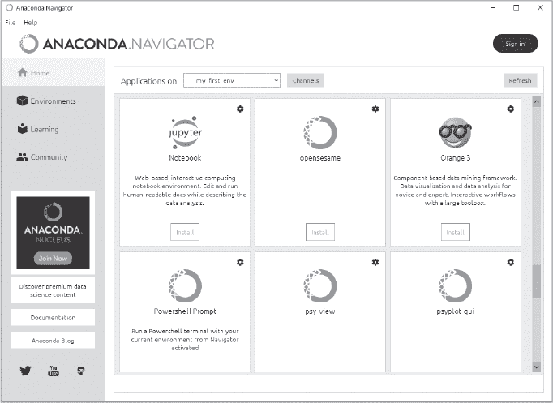

*图 5-1：Anaconda Navigator 主页标签，显示活动环境（my_first_env）和 Notebook 图块*

接下来，找到**Jupyter Notebook**应用程序的图块，然后点击**安装**按钮。你可能需要向下滚动主页标签页才能找到该图块。这将安装来自顶部频道的最新版本的 Notebook，频道列表位于主页标签页顶部附近。如果你想安装特定版本的 Jupyter Notebook，可以点击 Notebook 图块右上角的“齿轮”图标，查看可用版本号的列表（见图 5-1）。

几秒钟后，安装按钮应该会变成启动按钮。此按钮会在你的计算机上启动一个本地 Web 服务器，显示 Jupyter 仪表盘。因为它是本地运行的，所以你不需要连接到互联网。不过，你需要保持 Navigator 打开，因为它正在运行本地服务器来支持 Notebook 的功能，让你能在浏览器中与之互动。

##### **通过 CLI 安装和启动 Jupyter Notebook**

要在新环境中使用 conda 安装 Jupyter Notebook，首先打开 Anaconda Prompt（Windows 中）或终端（macOS 和 Linux 中），并激活 conda 环境。让我们为第二章中创建的*my_second_env*执行此操作。

如果你在第二章中跳过了这一步，使用以下命令创建环境：

```py
conda create --name my_second_env
```

现在，通过输入以下命令来激活环境：

```py
conda activate my_second_env
```

接下来，使用 conda 安装 Notebook：

```py
conda install notebook
```

要安装特定版本（例如 6.4.1），可以使用以下命令：

```py
conda install notebook=6.4.1
```

要启动 Notebook，输入：

```py
jupyter notebook
```

这会在你的计算机上启动一个本地 Web 服务器，显示 Jupyter 仪表板。由于它是本地运行的，因此你不需要活动的互联网连接。不过，你需要保持提示窗口或终端打开，因为它在本地运行 Notebook 服务器，允许你与浏览器进行交互。

**注意**

*有名为 notebook 和 jupyter 的 conda 包。notebook 包是经典的 Jupyter Notebook 应用程序，而更大的 jupyter 包则捆绑了 Jupyter Notebook、Qt 控制台和 IPython 内核。*

#### ***模块化方法***

模块化方法将每个 conda 环境链接回安装 Anaconda 时在*base*环境中加载的 Notebook 包。这种方法资源高效，便于更新 Notebook 包，并能让你在相同的 Notebook 中查看和选择不同的环境。

你可以使用模块化方法，无论是通过 Navigator 还是 CLI。为了简化，让我们使用 CLI。在 Anaconda Prompt（Windows 中）或终端（macOS 或 Linux 中）中输入以下命令来创建一个名为*my_jupe_env*的新环境：

```py
conda create --name my_jupe_env
```

当提示时输入 y 以接受安装。接下来，激活新环境：

```py
conda activate my_jupe_env
```

要将此环境与*base*环境中的 Jupyter Notebook 安装链接，使用以下命令：

```py
conda install ipykernel
```

因为我们使用了*ipykernel*包，所以在环境中不需要显式安装 Python。然而，如果你需要在项目中使用特定版本的 Python，你需要在环境中安装它。

现在，停用*my_jupe_env*，这会将你返回到*base*环境，然后安装*nb_conda_kernels*包（你只需要做一次）：

```py
conda deactivate
conda install nb_conda_kernels
```

nb_conda_kernels 包使得在环境中的 Jupyter 实例能够自动识别任何其他安装了 ipykernel 包的环境。正是*base*环境中的 nb_conda_kernels 和其他 conda 环境中的 ipykernel 的组合，才允许你使用单一的 Jupyter Notebook 安装。

要从*base*环境启动 Notebook，你需要输入以下命令：

```py
jupyter notebook
```

这会在你的计算机上启动一个本地 Web 服务器，显示 Jupyter 仪表板。由于它是本地运行的，因此你不需要活动的互联网连接。不过，你需要保持提示窗口或终端打开，因为它在本地运行 Notebook 服务器，允许你与浏览器进行交互。

### **你的第一个 Jupyter Notebook**

首先，让我们通过一个例子来进行操作。在这个例子中，我们将使用一个笔记本来总结著名的黄石公园老忠实间歇泉的喷发周期。我们将加载一些数据，进行准备，绘制图表，然后添加一张装饰性图片。

如果你在前面的章节中启动了 Notebook，浏览器将打开一个像 图 5-2 中那样的仪表板页面。现在使用页面右上角的 **Quit** 按钮关闭它，然后关闭浏览器标签。如果 Navigator 已经打开，通过选择 **文件** ▸ **退出** 来关闭它。

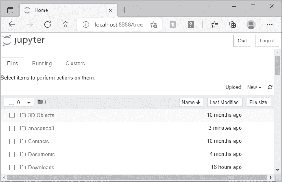

*图 5-2：当你启动 Jupyter Notebook 时，Jupyter 仪表板会出现在你的浏览器中。*

接下来，我们将使用上一节中描述的模块化方法，所以如果你还没有安装 nb_conda_kernels 包，请确保在 *base* 环境中安装它。要通过 CLI 执行此操作，请打开 Anaconda Prompt（Windows）或终端（macOS 或 Linux），然后激活 *base* 环境：

```py
conda activate base
```

然后输入以下内容：

```py
conda install nb_conda_kernels
```

notebook 包随 Anaconda 一起提供，因此它已经包含在 *base* 环境中。

#### ***创建专用项目文件夹***

Jupyter 笔记本会保存在你启动应用程序的文件夹中。这意味着笔记本通常会积累在你的主目录或用户目录中。此外，Anaconda 使用专用文件夹来跟踪你安装的包和 conda 环境（参见 第二章）。尽管 Anaconda 设计时就考虑到与这种结构的兼容性，并帮助你进行导航，但并非每个人都希望项目文件散落在目录树的各个位置。正如我们在前一章中讨论的，将所有项目文件保存在一个文件夹中有许多好处。

对于这个项目，让我们将 conda 环境和 Jupyter 笔记本存储在一个名为 *my_nb_proj* 的文件夹中，*my_nb_proj* 是“我的笔记本项目”的缩写。我将在 Windows 的用户目录中创建这个文件夹，建议你也在你的系统中使用类似的位置。虽然你可以通过 Anaconda Navigator 来操作，但命令行更简洁，所以我们接下来将使用命令行。

要为项目创建目录，打开 Anaconda Prompt（在 Windows 中）或终端（在 macOS 或 Linux 中），然后输入以下内容（使用你自己的目录路径）：

```py
mkdir C:\Users\hanna\my_nb_proj
mkdir C:\Users\hanna\my_nb_proj\notebooks
mkdir C:\Users\hanna\my_nb_proj\data
```

这将创建一个包含 *notebooks* 和 *data* 子目录的 *my_nb_proj* 目录。接下来，在项目目录中创建一个名为 *my_nb_proj_env* 的 conda 环境，激活它，并安装一些库（根据需要替换你自己的路径）：

```py
conda create --prefix C:\Users\hanna\my_nb_proj\my_nb_proj_env
conda activate C:\Users\hanna\my_nb_proj\my_nb_proj_env
conda install ipykernel pandas seaborn
```

如前所述，ipykernel 包让你可以在 *base* 环境中使用 Jupyter Notebook 应用程序。pandas 包是 Python 的主要数据分析库，seaborn 是一个包含一些有用数据集的绘图库。（我们将在本书后续章节中更详细地介绍这些库。）

在这一点上，你的项目目录结构应该类似于图 5-3。当然，实际项目中，你可能会包含其他文件夹，用于存储特定类型的数据、非笔记本脚本、杂项文件等。

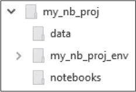

*图 5-3：我的*my_nb_proj*目录结构*

Jupyter Notebook 喜欢保存到其当前目录。第一次保存文件时，如果你从该文件夹启动 Notebook，操作最为简便。之后，你可以从任何位置启动 Notebook，并且仍然可以访问该文件。要在新的*notebooks*文件夹中启动 Notebook，首先激活*base*环境（其中安装了 Jupyter Notebook），然后使用`cd`命令切换目录：

```py
conda activate base
cd C:\Users\hanna\my_nb_proj\notebooks
```

由于该文件夹已经在我的用户目录中，我也可以使用相对路径：

```py
cd my_nb_proj\notebooks
```

要启动 Notebook，输入：

```py
jupyter notebook
```

你现在应该能在浏览器中看到 Jupyter 仪表板。

#### ***浏览笔记本仪表板和用户界面***

Jupyter Notebook 仪表板，也叫做*首页*，会打开一个直观的文件浏览器标签页（见图 5-4）。该标签页展示了从启动 Notebook 的目录中打开的笔记本文档和其他文件，这个目录被称为*当前目录*。当你点击文件或文件夹时，会看到标准的选项，如复制、重命名、删除等。仪表板还帮助你创建新的笔记本、退出应用程序，并管理当前运行的 Jupyter 进程和用于并行处理的集群。

因为我们是从空的*notebooks*文件夹启动的 Notebook，所以没有文件或文件夹可见。让我们通过创建一个新笔记本来解决这个问题。首先，点击文件标签页右上角的**新建**按钮，打开下拉菜单，如图 5-4 所示。

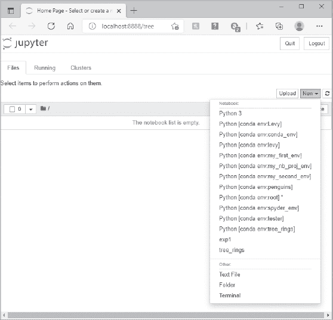

*图 5-4：从 Jupyter 仪表板新菜单中选择内核*

菜单为你提供了在你创建的各种 conda 环境中选择内核的选项，包括那些不在默认*envs*文件夹中的内核。它能够做到这一点，因为安装了 nb_conda_kernels 包在*base*环境中，并且每个环境中都安装了 ipykernel 包。在列表的底部，你还有其他选项，包括创建新文本文件、文件夹或终端。

要在你的*my_nb_proj*环境中激活内核，从列表中选择**Python [conda env:my_nb_proj_env]**。这将打开笔记本的用户界面（UI）。笔记本 UI 是你交互式构建笔记本文档的地方。其主要组件包括菜单栏、工具栏和单元格（见图 5-5）。我鼓励你通过点击菜单中的**帮助** ▸ **用户界面导览**来快速体验这些组件。

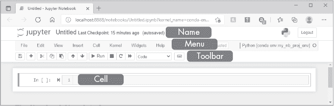

*图 5-5：笔记本用户界面*

在菜单栏的右侧，你会看到活动内核和 conda 环境（*Python[conda env:my_nb_proj_env]*）。如果这不是你预期的名称，那么你正在使用来自其他环境的包，这些包可能不包含你需要的包或其正确的版本。

Jupyter Notebook 的模块化特性是其成功的关键。它由块组成，称为*单元格*，可以包含代码或“文本”（例如标题、项目符号列表、图片和超链接）。代码单元可以独立运行，也可以一起运行，每个单元都有自己的输出区域。这使你能够将计算问题分解为多个部分，并将相关的想法组织到不同的单元格中。当你让一个（或多个）单元格正常工作时，你就可以继续。这对于交互式探索非常方便，尤其适用于你只需要每个会话运行一次的长时间运行过程。

#### ***命名笔记本***

让我们通过主动创建一个笔记本来学习 UI 组件和工作流程。首先，通过点击位于菜单栏上方的**Untitled**，在文本框中输入**geyser**，然后点击**重命名**来为你的新笔记本命名（见图 5-6）。

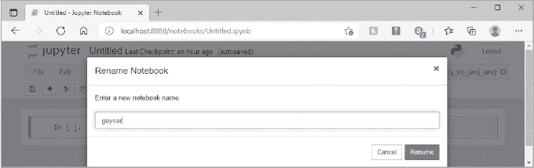

*图 5-6：重命名笔记本*

此时，你应该可以在项目的*notebooks*文件夹中看到一个新的文件和文件夹。*geyser.ipynb*文件是笔记本文档。这只是一个以*.ipynb*扩展名保存的纯文本 JSON 文件。*.ipynb_checkpoints*文件夹包含*geyser-checkpoint.ipynb*文件，它可以让你将笔记本恢复到之前的版本。

你还会在仪表盘中看到笔记本文件出现（见图 5-7）。如果点击文件名旁边的框，你将启动一个菜单栏，提供操作文件的选项，例如移动、重命名和删除它（“垃圾桶”图标）。

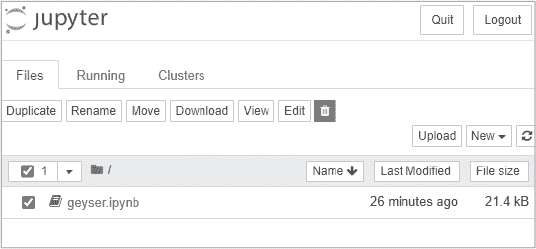

*图 5-7：激活文件操作菜单的 Jupyter 仪表盘*

要在以后打开 geyser 笔记本，只需在仪表盘中点击文件名。书籍图标会变绿，表示笔记本正在运行，你可以使用文件名上方的下拉菜单来筛选所有正在运行的笔记本。请注意，你无法访问仪表盘中目录树根目录（上层）的外部（更高层）笔记本文件。根目录是你启动 Notebook 时所在的目录。

#### ***使用 Markdown 单元添加文本***

现在，让我们为笔记本提供一个描述性标题，让大家知道它的内容，并引用 geysers 数据的来源。点击第一个单元格，左侧标记为`In [ ]:`。接着，在工具栏上，将单元格类型从**代码**更改为**Markdown**，如图 5-8 所示。

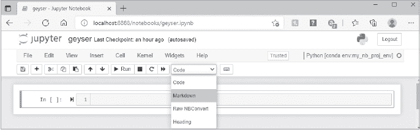

*图 5-8：使用工具栏更改单元类型*

*Markdown* (*[`daringfireball.net/projects/markdown/`](https://daringfireball.net/projects/markdown/)*), 是 HTML 标记语言的超集，让你可以在笔记本中添加解释性文本。你可以以多种方式格式化这些文本，包括文字大小、粗体、斜体和删除线。你可以更改颜色，使用样式表，创建列表，添加超链接。你甚至可以将图片和视频拖放到 Markdown 单元格中。

一些常用的 Markdown 样式列在 表 5-1 中。将自己的文本插入到全大写的词语中。要查看更多样式，请访问 *[`jupyter-notebook.readthedocs.io/`](https://jupyter-notebook.readthedocs.io/)*。

**表 5-1：** 常见的 Markdown 样式

| **样式语法** | **描述** |
| --- | --- |
| `# YOUR TEXT` | 标题大小；#（最大）→ #####（最小） |
| `**YOUR TEXT**` | 将文本设置为 **粗体** |
| `*YOUR TEXT*` | 将文本设置为 *斜体* |
| `~~YOUR TEXT~~` | 给文本添加删除线 |
| `- YOUR TEXT` | 创建项目符号列表（也支持 + 和 *） |
| `<span style=``″``color:red``″``>YOUR TEXT</span>` | 将文本更改为指定颜色（在 JupyterLab 中） |
| `Text` | 插入指向网站 URL 的超链接 |
| ```` | 使用文件名或 URL 地址插入图片。你也可以将图片拖放到单元格中。 |

**注意**

*样式菜单中的标题选项已被弃用，不再有效。笔记本将引导你使用 Markdown 选项来创建标题。*

要为你的笔记本创建标题，请点击单元格并输入以下内容：

```py
## Old Faithful geyser eruption dataset
### (Weisberg (2005) in *Applied Linear Regression*)
```

请确保在井号后面加一个空格。你的单元格应类似于 图 5-9。

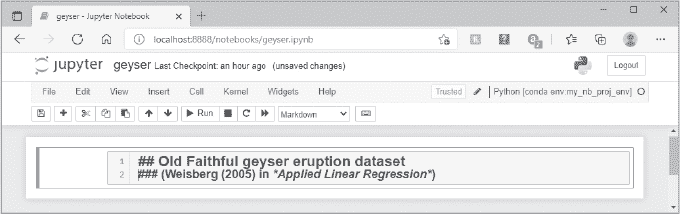

*图 5-9：使用 Markdown 单元格创建标题*

要执行单元格，请点击工具栏上的 **运行** 按钮，或者在键盘上按 SHIFT-ENTER。你的单元格应类似于 图 5-10。注意，“应用线性回归”是斜体的。要返回并再次编辑单元格，只需双击它。

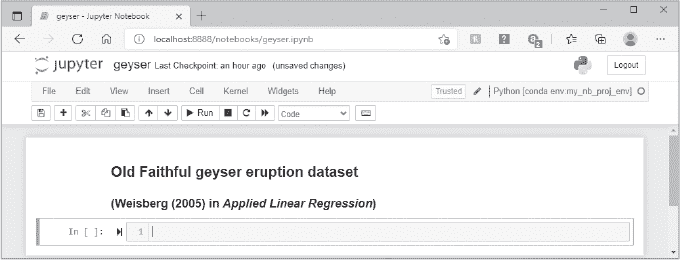

*图 5-10：格式化的标题*

**注意**

*SHIFT-ENTER 执行单元并将光标移到下一个单元，如果必要会创建一个新单元。CTRL-ENTER 执行当前单元但不移到下一个单元。*

#### ***通过代码单元添加代码和制作图表***

笔记本支持浏览器内的代码编辑，并且包含了像 Spyder 一样的功能，例如自动语法高亮、缩进和标签补全/自省。换句话说，你可以在浏览器中执行代码，并在笔记本中的专用输出单元中看到计算结果，包括图表和图像。

要开始编写代码，请点击新的代码单元并输入以下内容：

```py
%matplotlib inline
import pandas as pd
import seaborn as sns df = sns.load_dataset('geyser')  # Times are in minutes.
display(df.head())
df = df.rename(columns={'kind': 'eruption_cycle'})
```

这次，使用 CTRL-ENTER 来运行单元格。你可能已经注意到，这与 Jupyter Qt 控制台相反，在该控制台中，你按 ENTER 执行代码，而使用 CTRL-ENTER 可以输入多行但不执行。

若要以不同方式添加另一个单元格，请从菜单栏点击 **插入** ▸ **插入下方单元格**。点击新单元格，输入并运行以下代码以生成“小提琴图”：

```py
sns.violinplot(x=df.eruption_cycle, y=df.duration, inner=None);
```

行末的分号防止 Notebook 显示关于图形对象的*文本*信息。现在你的 Notebook 应该看起来像 图 5-11。

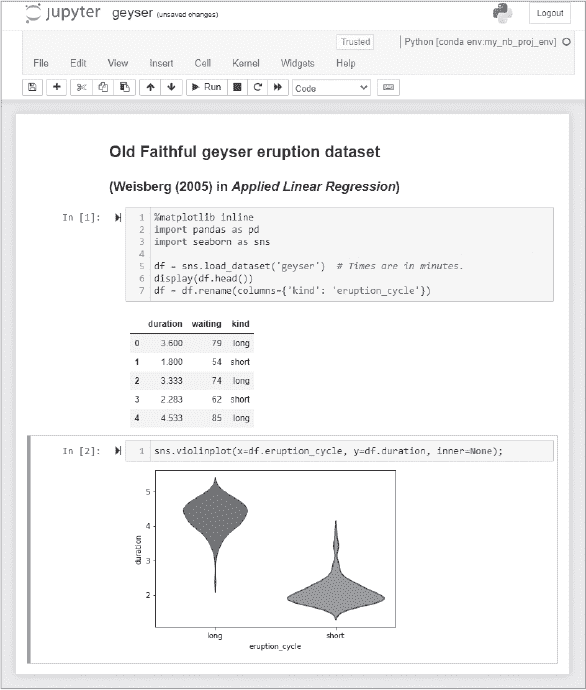

*图 5-11：带有内联图形的 geyser.ipynb Notebook*

有件重要的事情刚刚发生。在第一个单元格中，你导入了包，加载了 seaborn 的“geysers”数据集作为 pandas DataFrame，查看了 DataFrame 的前五行（`df.head()`），然后将其中一列的名称更改为更有意义的内容。在第二个单元格中，你绘制了 DataFrame。

关键在于，你将数据加载和准备这些（可能）耗时的步骤隔离在了各自的单元格中。如果你在第一个单元格中导入了包并加载了数据集（标记为 `In [1]:`），那么你就可以在后续单元格中“玩”数据。每次执行时没有理由等待数据加载。你在 Spyder 中看到了类似的单元格方法（请参见 第 81 页的“定义代码单元格”）。

另一个值得注意的地方是，你使用了一个魔法命令使 Matplotlib 图形*嵌入*在 Notebook 中（你不需要显式导入 Matplotlib 库，因为它是 seaborn 的依赖项）。你还可以通过使用 `%matplotlib notebook` 为图表添加简单的交互性，尽管这可能会减慢渲染速度。魔法命令最早是在 第三章中引入的。要查看所有魔法命令的列表，包括*单元格*魔法命令，可以在单元格中运行 `%lsmagic`。单元格魔法命令以*两个*百分号（`%%`）开头。

图表本身显示了老忠实喷泉有一个短周期和一个长周期的喷发。你等待的时间越长，喷发持续的时间就越长，因此作为游客，你的耐心会得到回报。

#### ***与输出单元格的工作***

默认情况下，Notebook 只显示代码单元格中最后一条命令的输出。根据不同情况，你可以通过使用 `print()` 或 `display()` 函数来绕过这个限制。在前一节中，我们使用了 `display()` 来显示 DataFrame 的前几行（`df.head()`）。你也可以将多个命令用逗号隔开写在同一行。或者，你可以在 Notebook 开始时导入 IPython InteractiveShell，并将其交互性选项设置为“all”：

```py
from IPython.core.interactiveshell import InteractiveShell
InteractiveShell.ast_node_interactivity = ″all″
```

除了 `all`，`InteractiveShell` 还有其他选项，包括 `none`、`last`、`last_expr` 和 `last_expr_or_assign`（其中“expr”代表“表达式”，“assign”代表“赋值”）。

要对输出单元进行更多控制，请使用单元格菜单（图 5-12）。“当前输出”和“所有输出”选项允许你隐藏输出、清除输出或为单个单元或整个笔记本切换滚动。

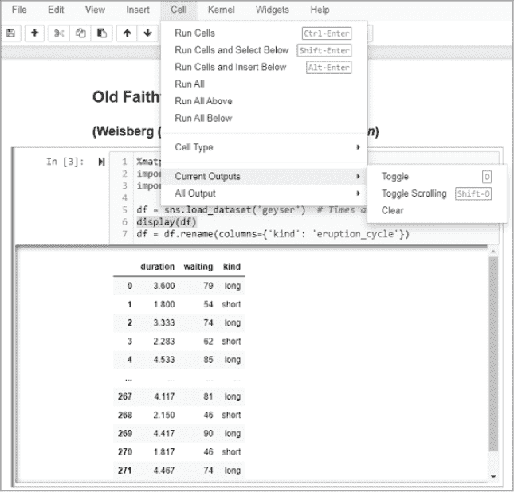

*图 5-12：切换滚动选项会向输出单元添加滚动条*

滚动选项在显示超大对象时非常有用，超出了输出单元的显示范围。图 5-12 显示了间歇泉笔记本中的完整 DataFrame（使用 `display(df)`），并且开启滚动条后，你可以查看 DataFrame 的最后几行。

#### ***使用 Markdown 单元格添加图片***

为了完成笔记本，我们来添加 Jim Peaco 提供的老忠实喷泉的鸟瞰图，这张图片可以从国家公园管理局的图像库中找到。插入一个新单元并将其类型更改为 **Markdown**。输入并运行以下代码，引用图片的网络地址：

```py

```

假设你有一个活跃的互联网连接，这会生成 图 5-13 中的输出。

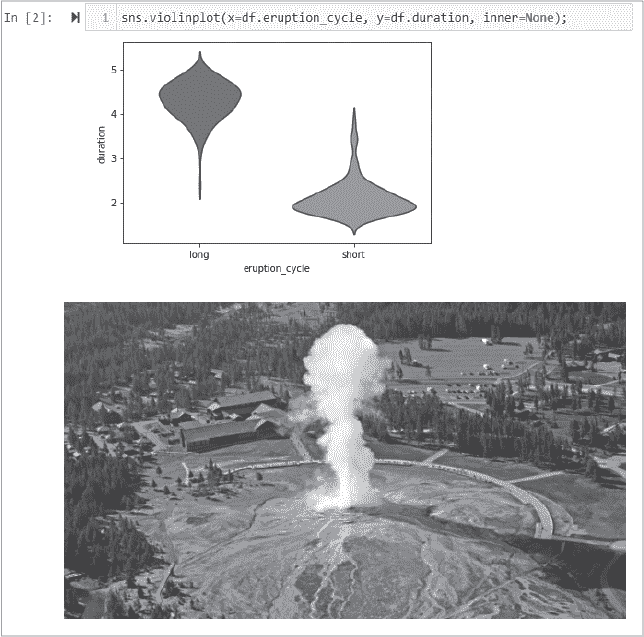

*图 5-13：包含国家公园管理局老忠实喷泉图像的笔记本下半部分*

如果你想控制图像的大小，可以使用以下命令：

```py

```

如果你不想担心链接失效、不稳定的互联网连接或跟踪外部文件，你可以通过菜单栏中的 **编辑** ▸ **插入图片**，粘贴剪贴板中的内容，或者直接将图片拖放到 Markdown 单元格中，来嵌入图像。嵌入的图像使得笔记本更具可携带性，但也有增加文件大小和使代码修订变得不太友好的缺点。

Markdown 单元格和笔记本通常使得在格式化文档中包含代码、方程式和图形变得非常容易。事实上，许多在线文章，如 *Medium* 和 *Towards Data Science* 上的文章，都是使用 Jupyter Notebook 创建的。

#### ***保存笔记本***

笔记本会在设定的时间段后自动保存，通常是 120 秒。你可以通过在单元格中运行 `%autosave n` 魔法命令来覆盖此设置，其中 `n` 是秒数，`n=0` 会禁用自动保存。这仅适用于单个笔记本，并且仅对当前会话有效。每次打开笔记本时，你都需要运行包含魔法命令的单元格才能生效。有关如何全局更改所有笔记本的自动保存设置的说明，请在线搜索 `autosavetime` Jupyter 扩展（我们将在本章后面讨论如何使用扩展）。

要在任何时候手动保存笔记本，可以使用工具栏上的 **保存** 图标、快捷键 CTRL-S 或菜单栏中的 **文件** ▸ **保存并创建检查点**。

每次手动保存笔记本时，你都会在一个名为*.ipynb_checkpoints*的文件夹中创建一个*检查点*文件，该文件夹位于初始*.ipynb*文件所在的文件夹中。你可以通过从菜单中点击**文件** ▸ **恢复到检查点**，然后点击最后一次检查点的日期戳来重置笔记本到检查点版本。

检查点很重要，因为自动保存仅更新*.ipynb*文件。这让你可以在不手动保存的情况下安全地工作一段时间。如果你发现自己走入了死胡同或犯了错误，你总是可以使用检查点文件恢复到早期的版本。

#### ***关闭笔记本***

要正确关闭笔记本，从菜单栏选择**文件** ▸ **关闭并停止**。接下来，在仪表板中按**退出**按钮，然后关闭窗口。

如果你登录到另一个服务器，而不是本地工作，你需要通过点击笔记本右上角的**注销**按钮，或者在 Jupyter 仪表板的右上角注销。

### **获取帮助**

帮助菜单虽然非常直观，但足够实用，值得一提。除了笔记本界面游览和文档外，它还提供了许多有用库的文档链接，如 Python、NumPy、pandas、Matplotlib 等 (图 5-14)。

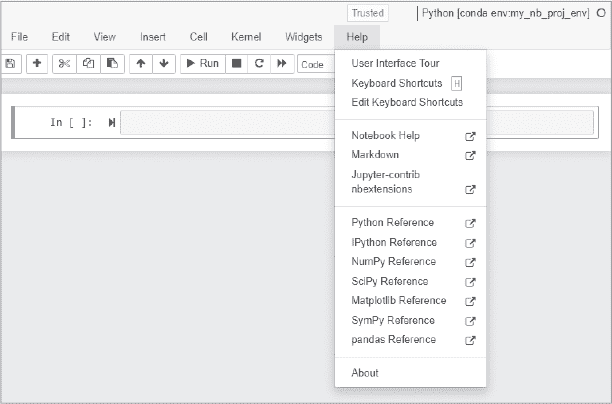

*图 5-14：帮助菜单*

#### ***键盘快捷键***

你还可以调出命令模式和编辑模式的键盘快捷键列表。你可能已经注意到，单元格边框最初是蓝色的，点击单元格后会切换为绿色。*蓝色*单元格表示你处于命令模式；*绿色*单元格表示你处于编辑模式。

在命令模式下，整个笔记本会被选中。在编辑模式下，焦点集中在单个单元格上。尽管有所重叠，但命令模式的键盘快捷键 (表 5-2) 帮助你操作*单元格*，而编辑模式的快捷键 (表 5-3) 帮助你处理*单元格中的文本*。

**表 5-2：** 选择的命令模式键盘快捷键

| **快捷键** | **描述** |
| --- | --- |
| H | 显示所有键盘快捷键 |
| ENTER | 进入单元格编辑模式 |
| SHIFT-ENTER | 运行单元格并选择下方单元格 |
| CTRL-ENTER | 运行选定的单元格 |
| F | 查找并替换 |
| Y | 将单元格模式更改为代码 |
| M | 将单元格模式更改为 Markdown |
| 1 到 6 | 将单元格更改为标题模式（1 = 最大，6 = 最小） |
| UP | 选择上方单元格 |
| DOWN | 选择下方单元格 |
| A | 在上方插入单元格 |
| B | 在下方插入单元格 |
| X | 剪切选定的单元格 |
| C | 复制选定的单元格 |
| V | 将单元格粘贴到下方 |
| SHIFT-V | 将单元格粘贴到上方 |
| D, D | 删除选定的单元格 |
| Z | 撤销单元格删除 |
| SHIFT-M | 合并选定单元格，或如果只选择了一个单元格，则与下方单元格合并 |
| S（或 CTRL-S） | 保存并创建检查点 |
| L | 切换行号 |
| O | 切换选定单元格的输出 |
| I, I | 中断内核 |
| SPACE | 向下滚动笔记本 |
| SHIFT-SPACE | 向上滚动笔记本 |

**表 5-3:** 选定的编辑模式快捷键

| **快捷键** | **描述** |
| --- | --- |
| CTRL-M (或 ESC) | 进入命令模式 |
| UP | 向上移动光标 |
| DOWN | 向下移动光标 |
| CTRL-UP | 跳转到单元格开始 |
| CTRL-DOWN | 跳转到单元格结束 |
| CTRL-LEFT | 向左移动一个单词 |
| CTRL-RIGHT | 向右移动一个单词 |
| CTRL-] | 增缩 |
| CTRL- | 缩进 |
| CTRL-/ | 切换注释 |
| CTRL-D | 删除整行 |
| CTRL-A | 全选 |
| CTRL-Z | 撤销 |
| CTRL-Y | 重做 |
| CTRL-BACKSPACE | 删除前一个单词 |
| CTRL-DELETE | 删除后一个单词 |
| SHIFT-ENTER | 运行单元格并选择下方单元格 |
| CTRL-ENTER | 运行选中的单元格 |
| CTRL-SHIFT-hyphen | 在光标处拆分单元格 |
| INSERT | 切换覆盖标志 |
| CTRL-S | 保存并创建检查点 |

要查看完整的快捷键列表，请点击**帮助** ▸ **键盘快捷键**，或者在命令模式下按键盘上的 H 键。如果这些快捷键还不够用，你可以通过笔记本应用程序本身自定义命令模式快捷键，使用**编辑键盘快捷键**项。对话框会引导你添加自定义快捷键。之后，来自笔记本的快捷键设置将保存到你的配置文件中。

#### ***命令面板***

你可以将光标悬停在工具栏上的项目上（见[图 5-5），以查看它们的功能。除非是命令面板图标，它像一个键盘，否则它们都很直观。

在 Jupyter Notebook 和 JupyterLab 中，所有用户操作都通过一个集中式的命令系统进行处理。这些操作包括菜单栏、上下文菜单、键盘快捷键等。为了方便使用，命令面板提供了一种通过键盘搜索和运行这些命令的方式（见图 5-15）。

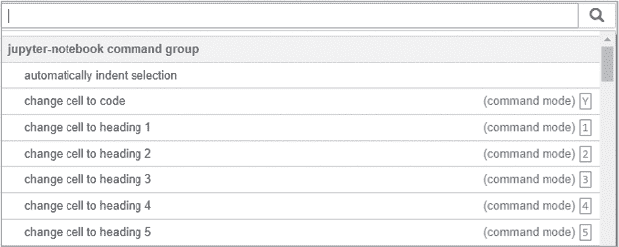

*图 5-15：命令面板的一部分*

你也可以在命令模式下按 P 打开命令面板，在编辑模式下按 CTRL-SHIFT-P 打开命令面板。要退出命令面板，请按 ESC 键。

### **使用笔记本扩展**

你可以通过使用用 JavaScript 编写的扩展来扩展笔记本环境的功能。这些模块，称为*nbextensions*，基本上是附加组件或插件，执行诸如自动完成代码、隐藏代码单元、拼写检查 Markdown 单元、创建目录、打开“草稿”单元进行独立实验等任务。你还可以编写自己的自定义扩展。要查看完整的扩展列表，请访问*[`jupyter-contrib-nbextensions.readthedocs.io/en/latest/nbextensions.html`](https://jupyter-contrib-nbextensions.readthedocs.io/en/latest/nbextensions.html)*。

**注意**

*经典笔记本扩展在 JupyterLab 版本中无法使用，因为 JupyterLab 有自己的一套扩展。你可以在下一章阅读相关内容。*

#### ***安装扩展***

*jupyter_contrib_nbextensions* 包是一个社区贡献的 nbextensions 集合。要在浏览器中本地加载这些扩展，你需要在 *base* 环境中安装它（如果你使用的是模块化方法），或在你的项目环境中安装它（如果使用的是简单方法）。例如，要使用命令行在 *base* 环境中安装，首先使用以下命令激活环境：

```py
conda activate base
```

然后，输入以下内容：

```py
conda install -c conda-forge jupyter_contrib_nbextensions
```

最后，将 JavaScript 和 CSS 文件安装到 Notebook 可以找到的位置：

```py
jupyter contrib nbextension install --user
```

*CSS*（即 *层叠样式表*）描述了笔记本中 HTML 元素的显示方式。`--user` 标志将文件安装到用户的 Jupyter 目录中。或者，使用 `--system` 标志将安装到系统范围的 Jupyter 目录中。

确认安装后，重新启动笔记本服务器。

#### ***启用扩展***

现在你应该可以在 Jupyter 首页看到一个 Nbextensions 标签，列出了可选择的 nbextensions，如 图 5-16 所示。

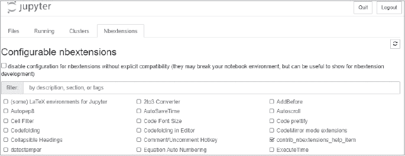

*图 5-16：Jupyter 仪表板上的新 Nbextensions 标签（显示为截断形式）*

点击扩展名会启动其 README 文件。例如，如果点击 **Tree Filter** nbextension 并向下滚动，你将看到它的功能描述以及如何使用的演示（图 5-17）。

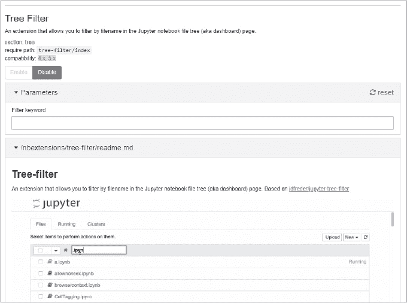

*图 5-17：点击 nbextension 名称将启动其描述性 README 文件。*

点击扩展旁边的复选框将启用该扩展。你还可以通过命令行启用和禁用 nbextensions（其中 <extension_name> 表示扩展的名称）：

```py
jupyter nbextension enable <extension_name>
```

和：

```py
jupyter nbextension disable <extension_name>
```

要了解更多关于 jupyter_contrib_nbextension 包的信息，请访问 *[`jupyter-contrib-nbextensions.readthedocs.io/`](https://jupyter-contrib-nbextensions.readthedocs.io/)*。要查找最新的扩展，可以在线搜索“有用的 Jupyter Notebook 扩展”。

### **使用小部件**

*Widgets*（即“窗口小工具”）是互动对象，如滑块、单选按钮、下拉菜单、复选框等。小部件让你为笔记本构建一个图形用户界面（GUI），使得探索数据、设置模拟、接受用户输入等任务变得更加容易。

在本节中，我们将使用 *ipywidgets* 扩展来创建小部件。一些示例显示在 图 5-18 中。要查看完整的小部件列表及其可配置的参数，请访问文档 *[`ipywidgets.readthedocs.io/en/stable/examples/Widget%20List.html`](https://ipywidgets.readthedocs.io/en/stable/examples/Widget%20List.html)*。

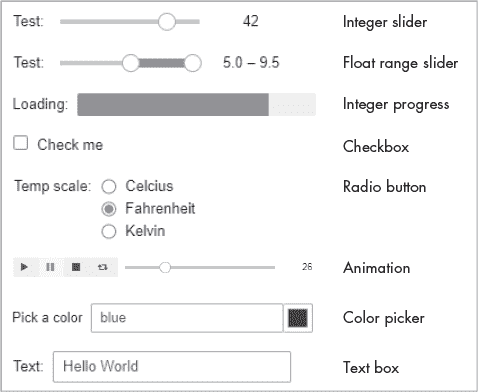

*图 5-18：在 ipywidgets 中可用的众多小部件类型之一*

我们不会在此覆盖所有类型的小部件，但会介绍足够的内容，让你有信心自行探索。

#### ***安装 ipywidgets***

ipywidgets 扩展可以像任何包一样安装。以下的指令将使用 CLI，但你也可以通过 Navigator GUI 轻松地复制这些步骤。

如果你使用的是简单的方法，即 Notebook 包安装在你的 conda 环境中，打开 Anaconda Prompt（Windows）或终端（macOS 和 Linux），激活目标环境，然后输入以下命令：

```py
conda install -c conda-forge ipywidgets
```

如果你使用的是模块化方法，其中 Jupyter Notebook 和 IPython 内核安装在不同的环境中，你还需要在包含 Jupyter Notebook 服务器的环境中安装*widgetsnbextension*包。widgetsnbextension 包配置经典的 Jupyter Notebook 以显示和使用小部件。现在让我们在*base*和*my_nb_proj_env*环境中执行此操作（你需要将*my_nb_proj_env*的路径替换为你的路径）：

```py
conda install -n base -c conda-forge widgetsnbextension
conda install -p C:\Users\hanna\my_nb_proj\my_nb_proj_env -c conda-forge ipywidgets
```

安装了 ipywidget 包后，你可以轻松地手动创建小部件，或者通过使用`interact`或`interactive`类来创建。

#### ***使用 Interact 创建小部件***

`ipywidgets.interact`类帮助你生成小部件，用于探索和与数据交互。让我们在一个新的 Notebook 中试试。

打开 Anaconda Prompt（在 Windows 中）或终端（在 macOS 或 Linux 中）。你应该处于*base*环境中（如果不是，请输入 conda activate base）。由于我们将保存一个新的 Notebook，请在启动 Jupyter Notebook 之前，导航到*my_nb_proj\notebooks*目录：

```py
cd C:\Users\hanna\my_nb_proj\notebooks
jupyter notebook
```

从 Jupyter 仪表板中，选择**新建** ▸ **Python [conda env:my_nb_proj_env]**。当浏览器中出现未命名的 Notebook 时，将其重命名为*widgets*并保存。

在第一个单元格中，输入并运行以下代码：

```py
   import numpy as np
   import matplotlib.pyplot as plt
➊ from ipywidgets import interact

   x = np.linspace(0, 6)

   def sine_wave(w=1.0):
       plt.plot(x, np.sin(w * x))
       plt.show()

➋ interact(sine_wave);
```

通过这段代码，你导入了 NumPy、Matplotlib 和 ipywidgets 中的 interact 类 ➊。然后，你使用 NumPy 的`linspace()`方法返回指定区间（0-6）内均匀分布的数字数组，并将其分配给`x`变量（我们在第十八章中详细介绍 NumPy）。接下来，你定义了一个简短的函数，它将`x`值乘以`x`的正弦值，再乘以一个名为`w`的标量，并绘制结果。最后，你调用`interact()`并传入`sine_wave()`函数 ➋。这会生成在图 5-19 中显示的滑块小部件。滑动控制按钮会重新定义`w`的值，并自动调用`sine_wave()`函数以更新图表。

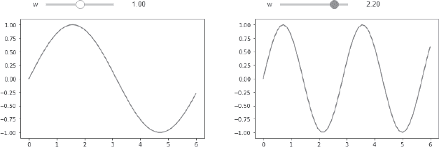

*图 5-19：更改滑块会交互式地更新正弦波图。*

请注意，你不需要指定滑块小部件。Ipywidgets 自动检测到我们传递给`sine_wave()`函数的是一个浮动值（`w=1.0`），因此知道使用浮动滑块。如果我们传递的是整数，它将使用整数滑块。

你还可以将 `interact()` 用作 Python 的 *装饰器*。我们在第十三章中讲解了装饰器；这些是用于增强其他函数行为的函数。要将 `interact()` 作为装饰器使用，请在你的 *widgets* 笔记本底部插入一个新单元格并运行以下代码：

```py
➊ @interact(w=1.0)
   def sine_wave(w):
       plt.plot(x, np.sin(w * x))
       plt.show()
```

你必须运行前面的单元格才能使其生效，因为我们没有重新导入库或重新赋值 `x`。当你运行当前单元格时，装饰器 ➊ 会为你调用正弦波函数。

在这些例子中，`interact()` 会在你移动滑块时尝试更新图表，有时会导致显示延迟。为了防止 `interact()` 立即更新，你可以从 ipywidgets 导入 `interact_manual()` 方法，并用它来调用 `sine_wave()` 函数。在这种情况下，图表不会更新，直到你停止移动滑块并按下 **运行交互** 按钮（图 5-20）。

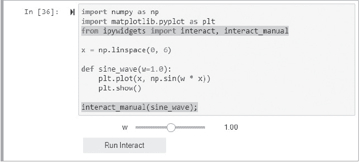

*图 5-20：`interact_manual()` 方法生成一个用于手动运行 `interact` 的按钮*

如你所见，`interact` 根据输入的类型来确定生成的小部件类型。如果你传递一个布尔值，如 `x=True`，它会生成一个复选框。如果传递一个字符串，如 `x='Hello, World!'`，它会生成一个文本框。传递一个列表或字典会生成一个下拉菜单。例如，在你的 *widgets* 笔记本底部插入一个新单元格并运行以下代码：

```py
def languages(descriptor):
    return descriptor

options = {′The King′: ′Python′, ′Not bad′: ′Julia′, ′Up and Coming′: ′Go′}
interact(languages, descriptor=options);
```

你应该能得到图 5-21 所示的输出。

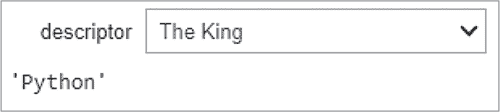

*图 5-21：一个 `interact` 生成的下拉菜单*

`interact` 类抽象化了许多决策，因此很容易使用。若要获得更多控制，你可以尝试使用 `interactive` 类或手动生成小部件。

#### ***使用交互式小部件创建***

`ipywidgets.interactive` 类让你能够访问与小部件绑定的信息，如它的关键字参数和结果。与 `interact()` 不同，你需要显式地使用 `display()` 方法将小部件显示在屏幕上。

让我们看一个例子。在你的 widgets 笔记本底部插入一个新单元格并输入以下代码：

```py
from ipywidgets import interactive

def my_function(x):
    return x

widget = interactive(my_function, x=5)
display(widget)
```

运行单元格并将滑块移到 `8` 的值。现在，插入一个单元格并运行以下代码：

```py
print(widget.result)
```

输出应该是 `8`。这使你可以在后续代码中使用小部件的结果，而不仅仅是查看结果。

#### ***手动创建小部件***

`interact` 和 `interactive` 类使得创建小部件几乎是自动化的。但如果你想对过程有更多控制权，可以通过指定所需的小部件来“手动”创建它们。你可以定义布局和样式，命名小部件，将它们连接在一起，获取事件等。

让我们做一个例子。首先在你的 *widgets.ipynb* 笔记本底部插入一个新单元格，然后运行以下代码：

```py
import ipywidgets as widgets

slider = widgets.IntSlider(value=0,
                           min=0, 
                           max=20, 
                           step=2, 
                           description='A Slider',
                           orientation='horizontal')
display(slider)
```

这会生成整数滑块条，如图 5-22 所示。


*图 5-22：一个命名的整数滑动条*

通过直接构建小部件，你可以指定额外的参数，比如显示名称（`description`）和方向（`horizontal` 或 `vertical`）。要查看所有可用的参数，可以将 `display(slider.keys)` 添加到当前单元格，或者在新单元格中运行 `slider.keys`。你可以在前面提到的文档链接中找到示例用例。

单独的滑动条本身用处不大，但像 `interactive` 类一样，你可以访问滑动条的值，在这种情况下，通过 `.value` 属性。在新单元格中，运行以下代码：

```py
print(f″Slider value = {slider.value}″)
```

这应该产生以下输出：

```py
Slider value = 0
```

#### ***处理事件***

用户与小部件交互时会创建一个 *事件*。例如，当你按下按钮小部件时，会发生一个 *点击* 事件。处理事件时，你告诉程序如何处理结果。这通常涉及编写一个“事件处理”函数。

为了捕获输出并确保它被显示，你必须将其发送到一个 `Output` 小部件，或者将你希望显示的信息放入 `HTML` 小部件。让我们来看一个 `Output` 的例子。

在你的小部件笔记本的底部插入一个新单元格，然后运行以下代码：

```py
   import ipywidgets as widgets
➊ from IPython.display import clear_output

   button1 = widgets.Button(description='Python')
   button2 = widgets.Button(description='Go')
   button3 = widgets.Button(description='Rust')
➋ output = widgets.Output()

   print(″Pick your favorite language:″)
   display(button1, button2, button3, output)

➌ def event_handler(button):
       with output:
           clear_output()
           print(″Your favorite language is {}″.format(button.description))

➍ button1.on_click(event_handler)
   button2.on_click(event_handler)
   button3.on_click(event_handler)
```

这将产生如 图 5-23 所示的输出。点击按钮将打印出按钮的描述（名称）。

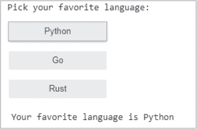

*图 5-23：处理按钮点击事件*

每次点击按钮时，输出会保留在输出单元格中，所以从 `IPython` 导入 `clear_output()` 方法 ➊。这个方法让你每次点击按钮时都能重新开始。接下来，创建三个按钮小部件和一个输出小部件来显示结果 ➋。

为了处理按钮点击事件，定义一个名为 `event_handler()` 的函数，接受一个按钮对象作为参数 ➌。使用输出小部件，首先清除显示，以移除任何先前按钮点击的输出，然后打印被点击按钮的名称。最后，对于每个按钮，使用 `Button` 小部件的 `on_click()` 方法并传递事件处理函数 ➍。这将把函数绑定到按钮点击事件。

#### ***自定义小部件***

ipywidgets 提供的小部件开箱即用非常吸引人，但如果你愿意，可以对其进行修改。小部件的 `layout` 属性让你可以控制小部件的大小、边框、对齐方式和位置。你还可以将小部件按网格方式排列。

在上一节中的事件处理代码示例中，在 `button1` 变量赋值之前添加以下行，并按照这里所示的方式更改 `button1` 的代码：

```py
layout = widgets.Layout(width='300px', height='50px', border='solid 2px')
button1 = widgets.Button(description='Python', layout=layout)
```

运行单元格，你应该会看到 图 5-24 中所示的输出。正如你可能猜到的，*px* 代表 *像素*。

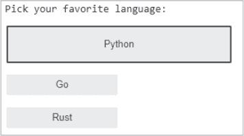

*图 5-24：Python 按钮（button1）的新布局*

方便的是，许多小部件允许你使用预定义样式。在前面的例子中，将 `button1` 的赋值更改为以下内容，然后运行单元格：

```py
button1 = widgets.Button(description='Python', button_style='danger')
```

Python 按钮应该变成红色。其他预定义的按钮样式选择包括 `primary`（蓝色）、`success`（绿色）、`info`（青色）和 `warning`（橙色）。

如果你需要更多控制，`style` 属性可以显示与布局无关的小部件样式属性。这个属性的属性是小部件特定的；你可以通过使用 `keys` 属性列出它们。例如，在前面的例子中，对于 `button1`，你可以运行 `button1.style.keys`。

假设你希望 Python 按钮变成粉红色，而这种颜色在预定义样式中不可用。在这种情况下，你首先需要将 `button1` 恢复到原始状态，然后使用 `style` 属性设置它的背景色：

```py
button1 = widgets.Button(description='Python')
button1.style.button_color = 'pink'
```

这些示例仅仅是你可以做的一个小小的尝试。要查看更多选项，请访问文档 *[`ipywidgets.readthedocs.io/en/latest/examples/Widget%20Styling.html`](https://ipywidgets.readthedocs.io/en/latest/examples/Widget%20Styling.html)*。

#### ***在其他格式中嵌入小部件***

笔记本菜单栏提供了一个小部件选项，用于将交互式小部件嵌入到静态网页、Sphinx 文档（熟悉的“Read the Docs”网页）以及 HTML 转换后的笔记本中，使用 *nbviewer* 网络应用程序。以下是菜单项：

**保存笔记本小部件状态** 将当前小部件状态保存为元数据，允许笔记本文件在渲染的小部件下呈现。

**清除笔记本小部件状态** 删除已保存的状态（你需要重新启动内核）。

**下载小部件状态** 触发下载包含当前使用的小部件模型序列化状态的 JSON 文件。

**嵌入小部件** 提供一个对话框，包含嵌入当前小部件的 HTML 页面。为了支持自定义小部件，它使用 RequireJS 嵌入器。

要了解更多关于嵌入的信息，请访问 *[`ipywidgets.readthedocs.io/en/latest/embedding.html#`](https://ipywidgets.readthedocs.io/en/latest/embedding.html#)*。

### **共享笔记本**

科学工作很少是孤立进行的。你需要一种方式来共享你的笔记本。在某些情况下，你可能希望共享一个*可执行*版本；例如，供同事运行和修改笔记本（想想程序员）。在其他情况下，你可能想要共享一个*已执行*的笔记本的静态副本，其中包含所有生成的图表和输出（想想非程序员）。后一组人可能包括那些不想安装笔记本、处理其数据或包依赖关系，或等待长时间运行的笔记本完成的利益相关者。

笔记本以 JSON 格式保存，需要渲染才能读取。在接下来的章节中，我们将讨论一些下载和共享笔记本的方法。

#### ***检查并运行带有内核菜单的笔记本***

笔记本的问题在于，单元格可能会被乱序运行、被删除，并且没有保证正确的执行顺序能够轻松重复。如我们在前面关于 Jupyter Qt 控制台和 Spyder 的章节中看到的那样，驻留内存中的导入和变量赋值可能会导致混淆和意外后果。

因此，在分享你的工作之前，强烈建议你点击 **内核** 菜单中的 **重启并运行全部**（图 5-25）。如果出现错误，修复第一个错误，重复该命令，然后继续处理下一个错误。

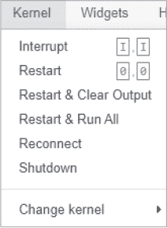

*图 5-25：笔记本内核菜单*

另一个有用的菜单项是“中断”。对于长时间运行的笔记本，当你忘记更改参数或识别到代码或输入中的错误时，这非常方便。

#### ***下载笔记本***

笔记本会自动保存为交互式 **.ipynb** 文件。你可以直接通过电子邮件将它们发送给使用笔记本的同事。或者，**文件** ▸ **另存为** 命令让你可以将笔记本保存为多种不同格式（图 5-26）。这些格式中有些，例如通过 LaTeX 导出的 PDF，需要安装特定的包（如果未安装，也不必担心，你会收到一个错误消息，告知你需要什么）。其中较为重要的格式有 HTML 和 Python。

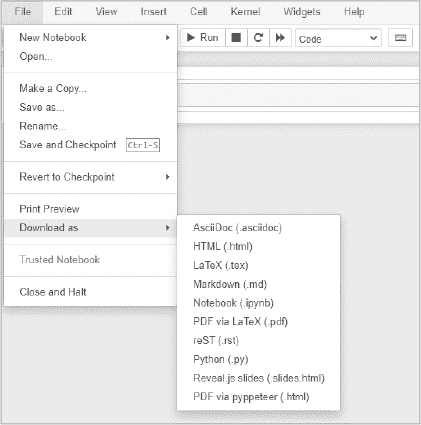

*图 5-26：笔记本文件菜单*

Python 选项会将你的笔记本保存为一个带有 *.py* 扩展名的文本文件，保存在你的下载文件夹中。然后你可以将该文件作为 Python 脚本在控制台或 IDE（如 Spyder）中运行。Markdown 单元格、单元格编号及其他非代码材料会通过 `#` 符号被注释掉。

例如，如果你使用 Python（*.py*）下载上一节中的间歇泉笔记本，你将得到以下脚本：

```py
#!/usr/bin/env python
# coding: utf-8

#  ## Old Faithful geyser eruption dataset   
#  ### (Weisberg (2005) in *Applied Linear Regression*)

# In[1]:
get_ipython().run_line_magic('matplotlib', 'inline')
import pandas as pd
import seaborn as sns

df = sns.load_dataset('geyser')  # Times are in minutes.
display(df.head())
df = df.rename(columns={'kind': 'eruption_cycle'})

# In[2]:
sns.violinplot(x=df.eruption_cycle, y=df.duration, inner=None);

# 
```

如果你在 Spyder 中打开这个 *geyser.py* 文件并运行它，你将看到表格形式的 DataFrame 输出和小提琴图，但看不到标题或老忠实喷泉的图像。

你还可以使用命令行通过 *nbconvert* 工具导出你的笔记本。这个工具已经驱动了 **另存为** 菜单选项，但在 CLI 中使用时（通过 `jupyter nbconvert` 调用），你可以方便地通过单个命令将一批笔记本文件转换为另一种格式。想了解更多，访问 *[`nbconvert.readthedocs.io/`](https://nbconvert.readthedocs.io/)*。

在你以合适的格式下载了笔记本之后，你仍然需要分享它。电子邮件是一种选择，但对于协作工作，你需要包含你所使用的任何外部数据文件。如果你的笔记本使用了第三方包，你还需要分享一个环境或需求文件（请参阅 第二章），这样与您共享的人就可以设置相同的环境。在接下来的章节中，我们将介绍一些通过第三方网站分享笔记本的便捷方式。

#### ***通过 GitHub 和 Gist 分享笔记本***

部署笔记本的一种简单灵活的方式是将其放入一个*代码仓库*。这些网站存储源代码档案，提供版本控制以跟踪变更，并且既有公共组件也有私人组件。虽然有很多免费的主机可以选择，但最受欢迎的是*GitHub*。

GitHub 公司是微软的子公司，提供基于*Git* 程序的互联网托管服务，用于软件开发和版本控制。Git 让你能够将你想要共享的笔记本存储在你计算机上的文件夹中，可以将其视为*本地*仓库。为了使这个文件夹充当仓库，Git 还会在一个名为*.git*的隐藏文件夹中存储快照（特定时间点版本状态的记录）和元数据。这使得它能够追踪文件内容和变更。你还可以包含支持数据文件和文件夹。

GitHub 网站让你能够在线托管这些 Git 仓库的克隆，以便共享、进行协作工作以及提供安全备份。你可以包含一个*README.md* 文件来描述仓库中的内容。其他用户可以下载你的笔记本进行运行和编辑。通过 Git 的版本控制系统，他们可以上传他们的更改，从而确保你的原始作品不会被覆盖。

要查看示例仓库，请访问这个链接：*[`github.com/rlvaugh/Impractical_Python_Projects/`](https://github.com/rlvaugh/Impractical_Python_Projects/)*。确保向下滚动以查看 README 文件。

你可以通过命令行运行 Git，但如果你是新手，或者只是想共享笔记本，我推荐使用*GitHub Desktop* 图形用户界面。Desktop 网站 (*[`docs.github.com/en/desktop/`](https://docs.github.com/en/desktop/)* )会指导你完成设置免费账户和创建第一个仓库的步骤。此外，快速在线搜索还会提供许多优秀的 GitHub 使用教程。

另外，如果你需要一个快速、简单且轻量的共享笔记本的选项，你可以使用*GitHub Gist*。Gist 基本上是一个共享文本的工具，由于笔记本是以 JSON 格式保存的，因此也符合条件。Gist 是一个简单的解决方案，适用于你不需要大规模仓库，但仍然能享受 Git 版本控制系统的情况下。实际上，*gist* 就是一个 Git 仓库，具备完整的提交历史、差异（diff）、分叉和克隆选项等功能。

当你创建一个 gist 时，你可以选择添加多个文件，但会有一定的限制。例如，若要添加 Excel 表格，你需要将其保存为逗号分隔值（CSV）文件。同样，你不能添加图片文件，也不能添加目录。因此，如果你的项目数据量较大，你可能需要使用 GitHub Desktop 或通过命令行使用 Git 创建一个完整的 GitHub 仓库。

鉴于我们的*geyser.ipynb*笔记本很简单且独立，让我们将其添加到 Gist 中。首先，访问网站* [`gist.github.com/`](https://gist.github.com/)*。如果你已经有 GitHub 账户，点击 Gist 横幅右侧的**登录**按钮（图 5-27）。否则，点击**注册**以创建一个免费账户。


*图 5-27：GitHub Gist 启动横幅*

登录后，点击横幅上的加号（**+**）（图 5-28）来创建一个 Gist。

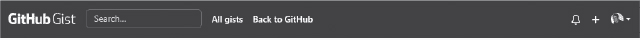

*图 5-28：登录后的 GitHub Gist 横幅*

在下一个窗口中，你将看到一个大的空白区域，用于添加文本（图 5-29）。你还会被提示输入带扩展名的文件名。请输入**geyser.ipynb**，然后在**Gist 描述**框中输入**老忠实喷发笔记本**。

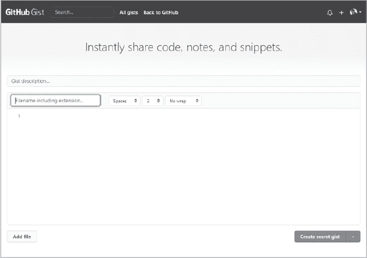

*图 5-29：Gist 创建页面*

现在是有趣的部分。在你操作系统的文件资源管理器中，导航到我们之前构建的*geyser.ipynb*文件，并将其拖放到 Gist 创建页面的空白文本框区域中。你应该能看到你笔记本的 JSON 文本文件（图 5-30）。

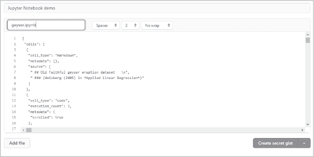

*图 5-30：拖放笔记本到 Gist 中的结果*

完成后，点击右下角绿色按钮上的*箭头*，查看保存选项。你可以创建一个私人（秘密）或公共的 Gist（图 5-31）。使用秘密选项时，只有知道你的 URL 的人才能看到内容。让我们保密，所以点击**创建秘密 Gist**。


*图 5-31：创建 Gist 的选项*

**注意**

*如果有人猜测或意外发现了秘密 Gist 的 URL，他们将能够查看它。为了更好的安全性，你需要使用 GitHub Desktop 或 Git 创建一个私人仓库（参见“使用 GitHub Desktop 创建你的第一个仓库” [`docs.github.com/`](https://docs.github.com/)）。*

几秒钟后，你应该能看到你的笔记本已完全渲染为静态 HTML 文件。输出内容，如小提琴图，仅会在笔记本在保存之前已经执行过时显示。

如果你向下滚动，你将看到一个添加评论的框。如果你向上滚动，你会看到一些操作图标，例如删除或编辑文件，正如图 5-32 所示。如果你点击编辑，笔记本将恢复为 JSON 格式（图 5-30）。虽然可以编辑这些文本并更改笔记本，但我怀疑你会想这么做。我们来看看其他选项。

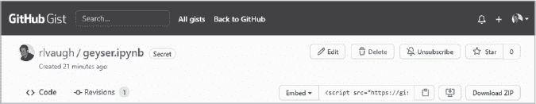

*图 5-32：与 Gist 一起工作的选项*

通过点击 **下载 ZIP** 按钮，用户可以将你的 Gist 下载为一个文件夹到他们的计算机中，在那里他们可以编辑和运行该笔记本。嵌入下拉菜单提供了将 Gist 嵌入到网站（例如博客文章）、复制共享链接或克隆 Gist 的选项。嵌入选项适用于任何支持 JavaScript 的文本字段。在 **下载 ZIP** 按钮的左侧，有一个图标用于将 Gist 保存到你的计算机，并在 GitHub Desktop 中使用它。

**注意**

*如果你分享笔记本的主要目的是与他人协作修改笔记本内容，那么在将其添加到仓库之前，应该清除笔记本中的输出。这将使得跟踪代码的变化变得更加容易。欲了解更多信息，请访问 [`mg.readthedocs.io/git-jupyter.html`](https://mg.readthedocs.io/git-jupyter.html)。*

要查看 Gist 的完整文档，请访问 *[`docs.github.com/en/github/writing-on-github/editing-and-sharing-content-with-gists/creating-gists/`](https://docs.github.com/en/github/writing-on-github/editing-and-sharing-content-with-gists/creating-gists/)*。此外，还有一个名为 *gist-it* 的笔记本扩展，用于创建 Gist (*[`jupyter-contrib-nbextensions.readthedocs.io/en/latest/nbextensions/gist_it/readme.html`](https://jupyter-contrib-nbextensions.readthedocs.io/en/latest/nbextensions/gist_it/readme.html)*)。

将笔记本放入仓库后，你将有更多分发它们的选项。让我们来看看一些最受欢迎的选项。

#### ***通过 Jupyter Notebook Viewer 分享笔记本***

*Jupyter nbviewer*，或称 *Notebook Viewer*，是一个免费的在线渲染 GitHub 托管笔记本的服务。当 GitHub 渲染引擎遇到困难时，例如处理大型笔记本、使用移动设备或使用某些基于 JavaScript 的库时，这个服务特别有用。同行和利益相关者可以使用 nbviewer 查看输入和输出，但要执行代码，他们必须将笔记本下载到本地 Jupyter 安装中。

要使用 nbviewer，你只需启动网站 (*[`nbviewer.jupyter.org/`](https://nbviewer.jupyter.org/)*)，并将笔记本的 URL 粘贴到文本框中（图 5-33）。这将把笔记本渲染为一个静态的 HTML 网页，并为你提供一个稳定的链接，可以与他人分享。只要 GitHub 仓库中的笔记本位置没有改变，这个链接将保持有效。

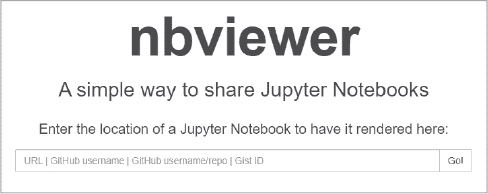

*图 5-33：nbviewer Web 应用程序*

该应用程序还支持浏览笔记本集合，并渲染其他格式的笔记本，如幻灯片和脚本。要分享多个笔记本，首先将它们都放入同一个仓库中。然后，将 nbviewer 指向该仓库的地址，它将自动为用户创建一个可导航的索引。

你可以使用我们在上一节中制作的 gist 来测试 nbviewer。只需使用嵌入菜单或剪贴板图标复制链接（参见 图 5-32），然后将其粘贴到 nbviewer 中。

#### ***通过 Binder 分享笔记本***

*Binder* (*[`mybinder.org`](https://mybinder.org)*) 是一个为使用 *公开* 仓库（例如 GitHub 上的仓库）而设计的免费网站。Binder 通过构建仓库的 *Docker 镜像*，让你运行存储在这些静态仓库中的笔记本。Docker 镜像是一个包含文件系统和参数的组合（参见 *[`www.docker.com/`](https://www.docker.com/)*）。当你通过 URL 分享你的笔记本时，Binder 会提供你的代码以及运行它所需的所有软件。用户无需下载或安装任何东西。

Binder 的基础环境是精简的。如果你的项目使用了任何第三方包，例如 Matplotlib 或 NumPy，你的 GitHub 仓库应包含 *environment.yml* 或 *requirements.txt* 文件。这些文件列出了你的项目所需的包（参见 第 44 页的“复制和共享环境”部分）。Binder 会读取该文件，并将所有包包括在 Docker 镜像中。如果你向 GitHub 提交新的更改，Binder 会更新该镜像。

镜像构建完成后，你可以使用 Binder URL 分享你的笔记本。Binder 使用免费的 *JupyterHub* (*[`jupyter.org/hub`](https://jupyter.org/hub)*) 服务器来托管你的仓库。JupyterHub 是一个开源服务，允许机构在大量用户之间共享笔记本。通过你提供的公共 IP 地址，用户可以在一个实时的 JupyterHub 实例中与代码和环境进行交互。

图 5-34 显示了 Binder 启动屏幕。我强烈推荐点击图中顶部可见的 Python 链接，查看“从零开始使用 Binder”的初学者教程。附加的指导（未显示）包含在主页底部。

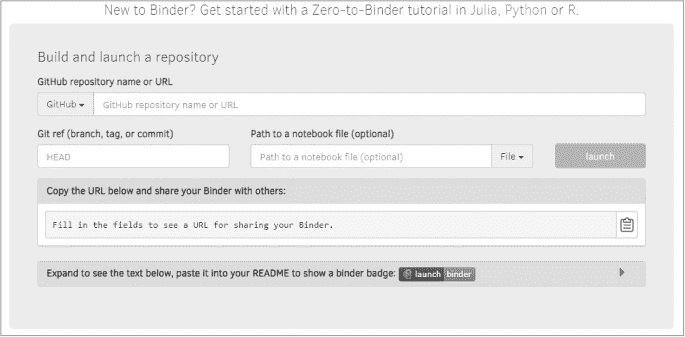

*图 5-34：Binder 在线表单用于分享互动笔记本*

用户可以执行你的笔记本，因此你需要提供任何数据依赖项。如果这些数据文件占用的内存为 10MB 或更少，最简单的解决方案是直接将它们添加到你的 GitHub 仓库中。记住，这必须是一个公开仓库，以便 Binder 访问它，因此你不应包含任何敏感信息。你还需要记住，Binder 仅在构建 Docker 镜像时下载数据，而不是在点击 Binder 链接时。只有当仓库有新的提交时，镜像才会被重建。

对于大小在 10MB 到几百兆字节之间的数据，你需要向你的仓库添加一个名为 *postBuild* 的文件。这个文件是一个 shell 脚本，它会作为 Docker 镜像构建的一部分执行，并且只会在新镜像构建时执行一次。要了解更多信息，请参见文档中的 *[`mybinder.readthedocs.io/en/latest/using/config_files.html#postbuild-run-code-after-installing-the-environment/`](https://mybinder.readthedocs.io/en/latest/using/config_files.html#postbuild-run-code-after-installing-the-environment/)*。

将大文件放入 GitHub 仓库或直接包含在 Binder 构建的镜像中并不实际。你最好使用一个特定于数据格式的库，在使用数据时流式传输它。或者，你可以在代码中按需下载它。出于安全原因，外发流量仅限于 HTTP 或 GitHub 连接，因此你不能使用 FTP 网站通过 Binder 获取数据。

如果用户通过 Binder 更改了你的笔记本，他们将无法保存或推送更改到 GitHub 仓库。要保存更改，他们需要通过点击 **文件** ▸ **下载为** ▸ **笔记本 (.ipynb)** 将笔记本下载到他们的计算机。

由于数据限制、保存问题和缺乏版本控制，Binder 最适合用来查看和运行笔记本。要协作 *开发* 笔记本，最好使用 Git 和 GitHub。

#### ***其他共享选项***

共享笔记本的其他选项包括但不限于 *Jovian* (*[`jovian.ai/docs/`](https://jovian.ai/docs/)*), *Google Colaboratory* (*[`colab.research.google.com/notebooks/intro.ipynb/`](https://colab.research.google.com/notebooks/intro.ipynb/)*), 和 *Microsoft Azure Notebooks* (*[`notebooks.azure.com/`](https://notebooks.azure.com/)*)。这些选项通常比我们之前讨论的选项需要更多的设置，并且可能与 GitHub 兼容性较差。所有这些都要求你拥有一个帐户，而且 Jovian 需要本地安装。Google 和 Microsoft 的选项中，笔记本界面看起来会稍有不同。

Colab 让用户能够协作并运行利用 Google 云资源的代码。这包括使用免费的 GPU，将文档保存到 Google Drive，以及直接在浏览器中运行 *TensorFlow* 机器学习库。实际上，Google 有一个名为 “Seedbank” 的示例深度学习笔记本仓库，你可以一键打开并运行。

Jovian 允许在单元格级别进行注释和讨论，以促进协作。Azure 帮助你从笔记本创建交互式演示并轻松分享，尽管无论如何，做到这一点都很简单。

最后，如果你希望完全控制谁可以访问你的笔记本以及如何使用它们，你可以设置自己的 *JupyterHub* 多用户 *Hub*。这让你可以为学生班级、企业数据科学工作组、科研项目等提供笔记本服务器。

使用 JupyterHub 时，你需要在某个地方运行一个可供用户通过网络访问的 Unix 服务器（通常是 Linux）。这可能需要配置一个公共服务器，最好由 IT 团队来完成，以确保安全问题得到妥善解决。了解更多信息，请访问*[`jupyterhub.readthedocs.io/en/latest/`](https://jupyterhub.readthedocs.io/en/latest/)*和*[`jupyter-server.readthedocs.io/en/latest/operators/public-server.html`](https://jupyter-server.readthedocs.io/en/latest/operators/public-server.html)*。

**注意**

*如果你只需要远程访问你的个人机器，可以按照[`jupyter-notebook.readthedocs.io/en/stable/public_server.html`](https://jupyter-notebook.readthedocs.io/en/stable/public_server.html)上的说明设置一个单用户的公共服务器。*

#### ***信任笔记本***

如果你在自己的计算机上本地运行笔记本，那么笔记本的安全性取决于你的计算机。但如果你是远程访问笔记本、共享笔记本或为多个用户创建服务器，则黑客利用笔记本的潜力会增加。

问题在于笔记本包含在可以执行代码的上下文中存在的输出（通过 JavaScript）。理想情况下，代码不应仅仅因为用户打开了笔记本就执行，尤其是那些他们没有编写的代码。但一旦用户决定执行笔记本中的代码，无论其执行什么内容，都应视为受信任的。

为了解决这个问题，Jupyter 开发者实现了旨在防止未经明确用户输入执行不受信任代码的安全模型。为了确保笔记本是“可信的”，每次执行和保存时，都会通过笔记本内容的摘要和一个秘密密钥计算签名。该签名被存储在一个数据库中，只有当前用户可以写入。默认情况下，该数据库位于以下位置：

+   Windows 中的*%APPDATA%/jupyter/nbsignatures.db*

+   macOS 中的*~/Library/Jupyter/nbsignatures.db*

+   Linux 中的*~/.local/share/jupyter/nbsignatures.db*

每个签名代表一系列输出，这些输出是用户执行代码后产生的。如前所述，在交互式会话中生成并保存的任何输出都被视为可信的。

当用户打开一个笔记本时，服务器会计算其签名。如果它在用户的数据库中找到该签名，任何 HTML 和 JavaScript 输出将被信任。否则，它是不受信任的。

在合作编辑笔记本时，其他用户将拥有不同的密钥，因此当笔记本共享给他们时，它将处于不受信任的状态。针对这种情况，有三种推荐的方法进行管理：

+   打开后重新运行笔记本（并非总是可行，你应该信任发送者）。

+   通过**文件** ▸ **信任的笔记本**明确信任笔记本（参见图 5-26）或在 CLI 中运行`jupyter trust /path/to/notebook.ipynb`。这些方法加载笔记本，计算新的签名，并将该签名添加到用户的数据库中。

+   分享一个“笔记本签名数据库”，并使用一个专门针对该项目的配置。

有关最后一种方法的详细说明，以及有关笔记本和服务器安全的更多信息，请参见[文档](https://jupyter-notebook.readthedocs.io/en/stable/security.html)。

### **将笔记本转化为幻灯片**

完成项目后，您可以通过将笔记本转化为幻灯片直接展示结果。这与 Microsoft PowerPoint 的工作方式类似，唯一的区别是，您可以实时运行代码，带来动态和沉浸式的体验。我们将通过一个示例来演示模块化的方法，在这种方法中，您从*base*环境运行 Jupyter Notebook。

#### ***安装 RISE 扩展***

要在幻灯片中启用交互式编程，您需要安装*Reveal.js – Jupyter/IPython 幻灯片扩展（RISE）*。首先，关闭所有正在运行的 Jupyter 笔记本。接下来，打开 Anaconda Prompt（Windows 系统）或终端（macOS 或 Linux 系统），并在*base*环境中运行以下命令：

```py
conda install -c conda-forge rise
```

现在，笔记本可以找到这个扩展并将其显示在仪表盘页面的 nbextensions 标签上。确保在安装笔记本的 conda 环境中安装 RISE。

#### ***创建幻灯片***

让我们创建一个新的笔记本，用来演示幻灯片功能。由于我们要保存一个新文件，因此我们将在之前创建的*notebooks*文件夹中启动笔记本。

激活*base*环境（即 Jupyter Notebook 已安装的环境）。接下来，使用`cd`命令和您的个人路径打开*notebooks*目录，然后启动笔记本：

```py
conda activate base
cd C:\Users\hanna\my_nb_proj\notebooks
jupyter notebook
```

当笔记本仪表盘在浏览器中打开时，点击文件标签页右上角的**新建**按钮，打开下拉菜单（见图 5-4）。为了激活*my_nb_proj*环境中的内核，从列表中选择**Python [conda env:my_nb_proj_env]**。请记住，这样可以从*base*环境启动笔记本，然后在*另一个*环境中工作。

当空白笔记本出现时，点击窗口顶部的**无标题**，将新笔记本重命名为**幻灯片**并保存。您还应该在工具栏的最右侧看到新的 RISE 图标（见图 5-35）。

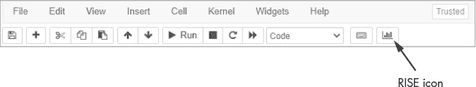

*图 5-35：工具栏末端的 RISE 图标*

从顶部菜单点击**视图** ▸ **单元格工具栏** ▸ **幻灯片**。您的笔记本中的第一个空单元格现在应该包含一个用于选择幻灯片类型的下拉菜单，如图 5-36 所示。

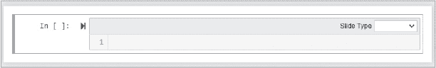

*图 5-36：幻灯片模式下的空笔记本单元格。注意右侧用于选择幻灯片类型的菜单。*

这个菜单提供了六个选项，详见表 5-4。最常用的是“幻灯片”、“跳过”和“备注”。

**表 5-4：** 幻灯片类型菜单

| **幻灯片类型** | **描述** |
| --- | --- |
| 幻灯片 | 开始新的一张幻灯片。在展示时，使用左右箭头键切换幻灯片。 |
| 子幻灯片 | 创建带有过渡动画的子页面。使用上下箭头键切换。 |
| 片段 | 创建一个隐藏的幻灯片部分，可以通过空格键过渡显示。 |
| 跳过 | 表示该幻灯片应被跳过，不显示。适用于隐藏不生成展示中可视化效果的代码。 |
| 备注 | 表示该幻灯片为演讲者备注。 |
| - | 表示当前单元格应与前一个单元格的行为一致。 |

现在，让我们做一个关于*对数螺旋*的简短幻灯片，这是自然界中常见的形状（图 5-37）。


*图 5-37：自然界中对数螺旋的一些例子*

从制作标题幻灯片开始。在第一个单元格中，将**幻灯片类型**菜单设置为**幻灯片**。然后，使用顶部工具栏将单元格类型更改为**Markdown**并输入以下内容：

```py
# Spira mirabilis:  The Miraculous Spiral
```

在键盘上按 CTRL-ENTER 退出 Markdown 模式。

在标题下方插入一个新单元格，继续将其类型设置为**幻灯片**和**Markdown**，然后输入以下内容：

```py
### - Why does a hurricane look like a galaxy? Or the chambers in a nautilus
shell resemble the swirls in a pinecone?  

### - Growth in nature is a geometric progression, and spirals that increase
geometrically are *logarithmic*. 

### - Logarithmic spirals can be plotted using Python with the polar equation:  
## $r = ae^{b\theta}$  
*Where:
r = radius   
a is the scaling factor (size of spiral)   
b is the growth factor that controls the ″openness″  
$\theta$ controls length of spiral*
```

按 CTRL-ENTER 执行代码。

插入一个新单元格，并将其类型设置为**幻灯片**和**代码**。接下来，输入以下代码，应用极坐标方程并生成互动滑块。这些滑块让你评估 a、b 和θ参数的影响。暂时不用担心所有的细节，我们将在书中的后面部分介绍 NumPy 和 Matplotlib 库。

```py
import numpy as np
import matplotlib.pyplot as plt
from ipywidgets import interact

def log_spiral(a=1, b=0.2, t=4):
    theta_radians = np.arange(0, t * np.pi, 0.1)
    radii = [a * np.exp(b * rad) for rad in theta_radians]
    plt.polar(theta_radians, radii, 'o', c='black')

interact(log_spiral);
```

接下来，在上一个单元格下方插入一个新单元格，并将其类型设置为**备注**和**Markdown**。此单元格可以在你向观众描述动态图时提示参数的含义。输入以下内容，然后按 CTRL-ENTER 执行：

```py
#### a: (scaling factor) controls size
#### b: (growth factor) controls openness
#### t: (theta) controls length
```

表示“幻灯片备注”的单元格必须紧接在与之关联的单元格之后。

使用一个新的单元格来结束展示，将其类型设置为**幻灯片**和**Markdown**。输入以下内容，然后按 CTRL-ENTER 执行：

```py
# The End
```

要启动幻灯片，首先保存笔记本，然后点击顶部单元格，再点击**RISE**按钮（图 5-35）。操作幻灯片时，使用表 5-5 中的键盘快捷键。有关所有快捷键的完整列表，包括操作虚拟黑板的快捷键，请点击每张幻灯片左下角可见的**?**图标。

**表 5-5：** 选定的 RISE 键盘快捷键

| **快捷键** | **结果** |
| --- | --- |
| ALT-R | 进入或退出 RISE（幻灯片模式） |
| SPACE | 向前切换到下一张幻灯片 |
| SHIFT-SPACE | 返回上一张幻灯片 |
| SHIFT-ENTER | 评估并选择下一个可见单元格 |
| HOME/END | 跳转到开始/结束 |
| T | 打开演讲者备注窗口 |

使用空格键导航到代码单元。如果你还没有执行这个单元，现在可以按 CTRL-ENTER 或 SHIFT-ENTER 执行。你可能需要手动调整窗口以使图表正确显示。慢慢移动滑块，观察参数如何影响图表。这是 PowerPoint 做不到的！

#### ***使用演讲者备注***

Slideshow 附带一个演讲者备注窗口，可以帮助你进行演示。它显示当前幻灯片、接下来的幻灯片、演讲者备注以及当前和经过的时间（图 5-38）。你可以在投影幻灯片的同时将此窗口打开在你的笔记本屏幕上。要进入此模式，演示时按下 T 键。

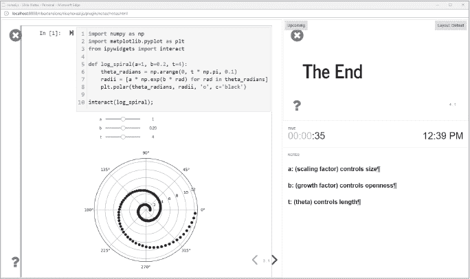

*图 5-38：RISE 演讲者备注窗口*

对于远程会议，Binder（在第 129 页的“通过 Binder 分享笔记本”中讨论）允许你在浏览器中免费托管实时幻灯片会议，用户无需安装 Python 或 Jupyter 即可查看。对于非实时查看，幻灯片可以导出为单个 HTML 文件。

幻灯片的内容远不止我在这里能涉及的。Jupyter 项目的文档没有太多关于幻灯片模式的内容，但你可以通过在线搜索“Jupyter Notebook 幻灯片”找到大量详细的教程和技巧。

### **总结**

Jupyter Notebook 之所以广受欢迎，是有充分理由的；它既实用、又简单、还充满乐趣！通过允许你将所有的分析和评论存储在一个地方，笔记本让记录工作、分享、展示以及快速恢复进度变得非常简单。

尽管如此，不要对笔记本*过于*迷恋，因为它们并不完美。它们的单元组织方式容易污染全局命名空间，且不利于编写可重用的函数和类，也让源代码管理和单元测试变得困难。这些正是我们在第四章中学习 Spyder 的一些原因，也是接下来我们将要了解 JupyterLab 的原因。掌握了 Notebook、Spyder 和 JupyterLab，你将始终能够根据任务需要选择最佳工具。
