## 第八章：JUPYTERLAB：你的科学中心**


*JupyterLab*是 Project Jupyter 的基于网页的界面。它将你所需要的所有科学计算组件整合到一个互动式协作环境中。其灵活的布局使你能够高效地执行完整的计算工作流程，从加载数据到生成最终报告。它的架构也是可以修改的，这意味着它具有扩展性，并且对开发者开放。

如果你从本书的开头就开始阅读，你已经接触过多个 JupyterLab 组件，如控制台（第三章），文本编辑器（第四章），以及 Jupyter Notebook（第五章）。所以我们这里不会再回顾这些内容；我们将重点介绍 JupyterLab 带来的新界面和其他一些功能。

**注意**

*JupyterLab 正在积极开发中，并且新功能会定期添加。为了确保你了解 JupyterLab 的最新状态，请务必查看完整文档：[`jupyterlab.readthedocs.io/`](https://jupyterlab.readthedocs.io/)。*

### **何时使用 JupyterLab 而非 Notebook？**

JupyterLab 的开发者根据 2015 年用户体验调查的结果创建了新的界面，该调查表明 Jupyter Notebook 需要更多的灵活性和集成。用户希望不仅能够轻松访问笔记本，还能访问文本编辑器、终端、数据查看器、调试器、Markdown 编辑器、CSV 编辑器、文件浏览器、IPython 集群管理器等。

JupyterLab 不仅提供这些工具，还允许你在它们之间共享内核。在一个浏览器窗口中，你可以在一个标签页上使用笔记本，在另一个标签页上编辑相关的数据文件，在终端中检查资源或进程，在控制台中测试概念，轻松地在文件管理器中查找和打开文件，改变显示语言，等等。像 Notebook 一样，它是免费的并且是开源的。

虽然 Jupyter Notebook 非常适合数据探索、增量软件开发和文档编写，但 JupyterLab 通过提供许多传统 IDE 中常见的功能，允许进行更为严肃的软件开发。但是如果你喜欢 Notebook，不必担心；JupyterLab 基本上是一个位于现有 Jupyter 架构之上的新前端。它使用与经典 Jupyter Notebook 相同的服务器和文件格式，因此与你现有的笔记本完全兼容。事实上，你可以在同一台计算机上同时运行经典的 Notebook 应用程序和 JupyterLab。

### **安装 JupyterLab**

正如我们在第二章中讨论的那样，为您的每个项目最好有一个独立的 conda 环境。要在这些环境中使用 JupyterLab，您有两个主要选项：可以直接在每个 conda 环境中安装 JupyterLab，或者将每个环境链接到*base*环境中的 JupyterLab 安装。我们将第一个选项称为*朴素*方法，第二个称为*模块化*方法。尽管通常推荐使用模块化方法，但如果一个项目需要锁定特定版本的 JupyterLab，您将需要使用朴素方法。

#### ***朴素方法***

在朴素方法中，您直接在 conda 环境中安装 JupyterLab。然后，您可以导入并使用在同一环境中安装的任何软件包。这是最简单的方法，但随着时间的推移，它可能会变得资源密集，因为您的*pkgs*文件夹会被不同版本的 JupyterLab 填满。

##### **使用 Anaconda Navigator 安装和启动 JupyterLab**

要使用 Anaconda Navigator 在新环境中安装 JupyterLab，首先通过 Windows 中的开始菜单、macOS 中的 Launchpad，或者在 Linux 中通过终端输入`anaconda-navigator`来启动 Navigator。然后，通过选择主页标签页顶部的**Applications on**下拉菜单中的环境名称来激活该环境（见图 6-1）。在本示例中，我们使用的是*base*环境。

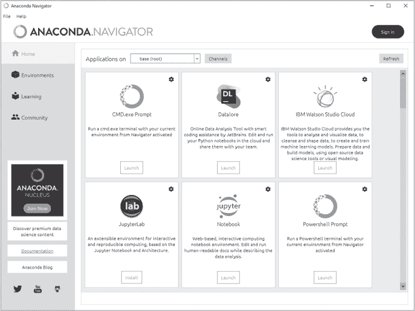

*图 6-1：Anaconda Navigator 主页标签页，显示活动环境（base 或 root）和 JupyterLab 图块*

接下来，找到 JupyterLab 应用图块并点击**安装**按钮。您可能需要向下滚动主页标签页才能找到该图块。如果找不到该图块，请按照下一节所述使用 CLI 安装 JupyterLab。

**注意**

*如果您看到启动按钮而不是安装按钮，则说明 JupyterLab 现在已与 Anaconda 一起预装。*

安装按钮将安装来自您的频道列表顶部的最新版本的 JupyterLab，频道列表位于主页标签页的顶部附近。如果您想安装特定版本，请点击 JupyterLab 图块右上角的“齿轮”图标（见图 6-1），以查看可用版本号的列表。

如果您需要绝对最新版本的 JupyterLab，请确保 conda-forge 频道位于您的频道列表顶部。默认频道中的软件包可能稍微旧一些，但作为补偿，它们通过了最严格的兼容性测试。有关使用频道的更多信息，请参见第二章。

几分钟后，安装按钮应变为启动按钮。此按钮将在您的计算机上启动一个本地 Web 服务器，显示 JupyterLab 界面。由于它是在本地运行的，您不需要活跃的互联网连接；然而，您需要保持 Navigator 处于运行状态。

##### **使用 CLI 安装和启动 JupyterLab**

要在新环境中使用 conda 安装 JupyterLab，首先打开 Anaconda Prompt（Windows）或终端（macOS 和 Linux），并激活 conda 环境。我们为在第二章中创建的*my_second_env*做这个操作。如果你跳过了第二章中的这一步，按照以下步骤创建该环境：

```py
conda create --name my_second_env
```

现在，激活该环境：

```py
conda activate my_second_env
```

接下来，使用 conda 安装 JupyterLab：

```py
conda install -c conda-forge jupyterlab
```

要安装特定版本，比如 3.1.4，你可以使用以下命令：

```py
conda install -c conda-forge jupyterlab=3.1.4
```

要通过命令行启动 JupyterLab，输入以下命令：

```py
jupyter lab
```

这会在你的计算机上启动一个本地 Web 服务器，显示 JupyterLab 界面。由于它是本地运行的，你不需要活跃的互联网连接。然而，你需要保持打开提示窗口或终端，因为它运行着本地服务器，允许你与网页浏览器进行交互。

#### ***模块化方法***

使用模块化方法，你将每个 conda 环境链接回你的*base*环境中的 JupyterLab 包。该方法资源效率高，并且使你可以轻松保持包的最新状态，并从同一个 JupyterLab 实例中选择不同的环境。

你可以使用模块化方法，无论是通过 Navigator 还是 CLI。为了简单起见，我们使用 CLI。打开 Anaconda Prompt（Windows）或终端（macOS 或 Linux），并输入以下命令以创建一个名为*my_lab_env*的新环境：

```py
conda create --name my_lab_env
```

当提示时输入 y 以接受安装。接下来，激活新的环境：

```py
conda activate my_lab_env
```

要将此环境与*base*环境中的 JupyterLab 安装进行链接，输入以下内容：

```py
conda install ipykernel
```

多亏了 ipykernel，我们无需显式地在环境中安装 Python。但是，如果你确实需要在项目中使用*特定*版本的 Python，你需要显式地将其安装到环境中。

现在，停用 *my_lab_env*，这将让你返回到*base*环境：

```py
conda deactivate
```

如果 JupyterLab 已经安装在*base*环境中，你可以跳过下一步。否则，使用以下命令安装 JupyterLab：

```py
conda install -c conda-forge jupyterlab
```

要安装特定版本，比如 3.1.4，你可以使用以下命令：

```py
conda install -c conda-forge jupyterlab=3.1.4
```

接下来，安装 nb_conda_kernels 包到*base*环境。你只需要做一次，如果你已经完成了第五章，它应该已经安装（你可以通过激活环境后运行 `conda list nb_conda_kernels` 来检查）：

```py
conda install nb_conda_kernels
```

nb_conda_kernels 包使得环境中的 Jupyter 实例能够自动识别任何安装了 ipykernel 包的其他环境。正是这种在*base*环境中的 nb_conda_kernels 和其他 conda 环境中的 ipykernel 的组合，使你能够使用单一安装的 JupyterLab。

要从活动的*base*环境启动 JupyterLab，输入以下内容：

```py
jupyter lab
```

这将在你的计算机上启动一个本地 web 服务器，显示 JupyterLab 界面。由于它是本地运行的，你不需要活跃的互联网连接。然而，你需要保持 Prompt 窗口或终端打开，因为它正在运行一个本地服务器，允许你与 web 浏览器进行交互。

### **构建一个 3D 天文模拟**

现在是时候开始使用 JupyterLab 了！在这个例子中，我们将使用 JupyterLab 构建一个 3D 模拟，模拟一个天文奇观：*球状星团*。球状星团是围绕大多数螺旋星系（例如我们的银河系）旋转的球形星星集合。它们是星系中最古老的特征之一，可能包含数百万颗紧密集中的星星。

为了避免混淆，让我们从头开始。如果你在前面的章节中启动了 JupyterLab，打开它的浏览器页面，然后通过点击 **文件** ▸ **关闭** 来关闭它。如果 Navigator 打开了，选择 **文件** ▸ **退出** 来关闭它。

以后我们将采用模块化方法，因此请确保按照前一部分的描述在你的 *base* 环境中安装 JupyterLab 和 nb_conda_kernels 包。

#### ***使用专门的项目文件夹***

Anaconda 使用专门的文件夹来跟踪你已安装的包和 conda 环境（见 第二章）。虽然 Anaconda 设计上能够顺利与这种结构配合并帮助你浏览它，但并不是每个人都希望将项目文件散布在目录树中。正如我们在 第四章 中讨论的，保持所有项目文件和文件夹都在一个主文件夹内有多种好处。

让我们通过一个例子来进行操作，在这个例子中，我们将 conda 环境和 Jupyter 笔记本存储在一个名为 *my_jlab_proj* 的文件夹中，简称“我的 JupyterLab 项目”。我将这个目录创建在 Windows 中的用户目录 (*C:\Users\hanna\*)，我建议你在你的系统中使用类似的位置。

**注意**

*JupyterLab 文件浏览器的根目录（即层级结构中的最高目录）是你启动 JupyterLab 时所在的目录。通常这是存放 anaconda3 文件夹的主目录。因此，你将无法在 JupyterLab 中访问此目录结构之上的文件或文件夹。*

虽然你可以使用 Anaconda Navigator 创建目录和环境，但命令行更加简洁，因此我们以后将使用命令行。要为项目创建目录，打开 Anaconda Prompt（在 Windows 中）或终端（在 macOS 或 Linux 中），然后输入以下内容（使用你自己的目录路径，直到 *\my_jlab_proj*）：

```py
mkdir C:\Users\hanna\my_jlab_proj
mkdir C:\Users\hanna\my_jlab_proj\notebooks
mkdir C:\Users\hanna\my_jlab_proj\data
```

这会创建一个名为 *my_jlab_proj* 的目录，里面有笔记本和数据子目录。接下来，在项目目录下创建一个名为 *my_jlab_proj_env* 的 conda 环境，激活它，并安装一些库（需要时替换为你自己的路径）：

```py
conda create --prefix C:\Users\hanna\my_jlab_proj\my_jlab_proj_env
conda activate C:\Users\hanna\my_jlab_proj\my_jlab_proj_env
conda install ipykernel matplotlib
```

如前所述，ipykernel 包允许你在*基本*环境中使用单个安装的 JupyterLab 应用程序。Matplotlib 包是 Python 的主要绘图库，其中包括 NumPy（数值 Python）包作为依赖项。我们将在本书的后续章节中详细探讨这些库。

此时，你的项目目录结构应该像图 6-2 所示。当然，对于一个真实的项目，你可能会包含额外的文件夹，用于特定类型的数据、非笔记本脚本、杂项和其他内容。

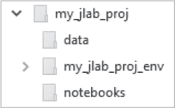

*图 6-2：my_jlab_proj 的目录结构*

要启动 JupyterLab，请首先返回到基本环境：

```py
conda deactivate
```

然后，输入以下内容：

```py
jupyter lab
```

#### ***JupyterLab 接口***

当你启动 JupyterLab 时，浏览器会新建一个标签页，左侧是文件管理器，主工作区是一个启动器标签页（图 6-3）。如果你在菜单栏顶部看不到启动器窗格，请选择 **文件** ▸ **新建启动器**。

在图 6-3 中的默认视图仅作为一个起点。事实上，JupyterLab 的构建模块非常灵活和可定制，因此没有标准视图的概念，尽管有一些共同的特性。

JupyterLab 会话驻留在一个*工作空间*中，其中包含 JupyterLab 的*状态*；即当前打开的文件、应用程序区域和选项卡的布局等。工作空间包括一个*主工作区*或*启动器*窗格，其中包含文档和活动的选项卡；一个*菜单栏*；以及一个可折叠的*左侧边栏*。左侧边栏包含文件浏览器和打开选项卡列表及运行的内核和终端的图标，目录表和扩展管理器。

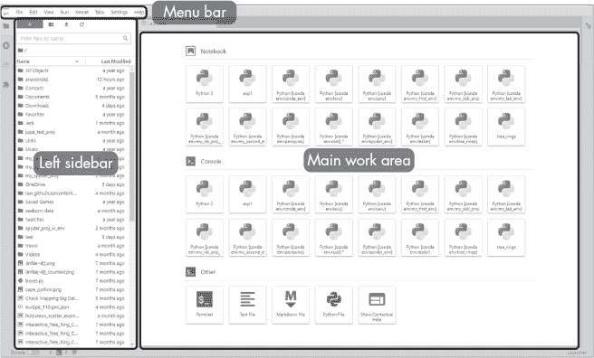

*图 6-3：带有主要组件标签的 JupyterLab 工作空间*

在启动器窗格中，你会看到笔记本和控制台的部分。其中包含你各种 conda 环境中的内核磁贴（你的视图将与图 6-3 不同，因为我自己设置了一些环境）。你还会看到一个其他部分，可以从中打开终端、文本文件、Markdown 文件、Python 文件或上下文帮助页面。

#### ***菜单栏***

JupyterLab 的顶部菜单栏（图 6-3）提供了顶级菜单，显示可用操作及其键盘快捷键。这些菜单是特定于主工作区中活动选项卡的；不可用的操作将显示但呈灰色（半透明）。为了方便起见，某些操作在左侧边栏中也有重复显示。以下是默认菜单：

**文件** 与文件和文件夹相关的操作，包括关闭和退出登录

**编辑** 与编辑文档和处理笔记本单元格相关的操作

**视图** 改变 JupyterLab 的外观并打开命令面板

**运行** 在笔记本和控制台中运行代码的操作

**内核** 管理内核的操作

**选项卡** 处理选项卡的操作，以及打开的选项卡列表

**设置** 主题、语言、键盘映射、字体大小等的设置

**帮助** JupyterLab 帮助链接，并启动经典 Jupyter Notebook

JupyterLab 扩展也可以在菜单栏中创建新的顶级菜单。这些菜单将特定于该扩展。

#### ***左侧边栏***

左侧边栏提供了访问常用选项卡的功能，如文件浏览器、打开的选项卡列表、正在运行的终端和内核、目录生成器以及第三方扩展管理器，如图 6-4 所示。

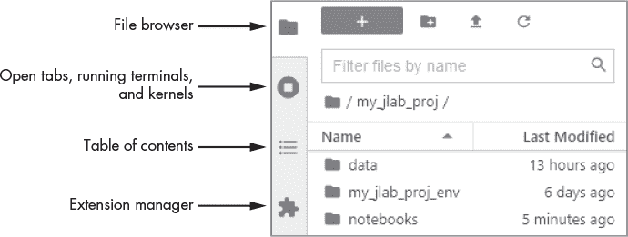

*图 6-4: 启动文件浏览器的左侧边栏*

当你关闭一个笔记本、代码控制台或终端时，服务器上运行的底层内核或终端仍然会继续运行。这使你能够执行长时间运行的操作，并在稍后返回。运行面板（图 6-5）让你可以重新打开与特定终端或内核相关联的文档。你还可以关闭任何打开的内核或终端。

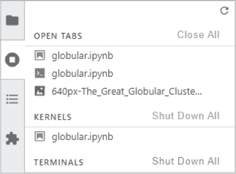

*图 6-5: 运行中的终端和内核面板*

现在内建于 JupyterLab 的目录扩展使得查看和浏览文档结构变得更加容易。当你打开笔记本、Markdown、LaTeX 或 Python 文件时，左侧边栏会自动生成一个目录。每个列出的部分都可以点击链接到文档中的实际部分。你可以为标题编号、折叠章节并浏览文件。

工具使用你在 Markdown 单元格中设置的标题来生成目录。启用“自动编号”选项（当你打开文件时可见），它将遍历笔记本并为由标题指定的部分和子部分编号。这使得你可以移动大部分章节，而无需逐一修改文档中的编号。

扩展管理器帮助你管理已安装的任何第三方扩展。我们稍后将详细介绍扩展。

左侧边栏是可折叠的。只需点击活动面板的图标，或者从菜单栏选择 **视图** ▸ **显示左侧边栏**，即可切换其显示状态。

#### ***创建新笔记本***

让我们在*notebooks*文件夹中创建一个新的 Jupyter 笔记本，用于存放我们的星团代码和输出。在文件管理器视图中，也就是*左侧边栏*，导航到文件夹并打开它。然后，在启动器面板中的笔记本部分，找到并点击标记为 `Python[conda env:my_jlab_proj_env]` 的方块（如果方块标签被截断，将光标悬停在方块上查看完整名称）。这将打开一个新的未命名笔记本，使用指定环境中的内核（图 6-6）。

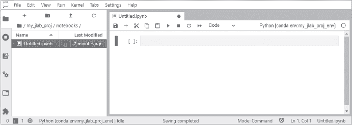

*图 6-6: JupyterLab 工作区中的新未命名笔记本*

请注意，笔记本的标签上方有一个彩色的顶部边框（默认是蓝色）。工作区只允许一个当前活动，这让你知道哪个标签是激活的。

如果你阅读了第五章，你可能会认出笔记本界面，尽管相对于经典笔记本有一些变化。单元格顶部的图标和菜单选项（位于 Untitled.ipynb 标签下方的工具栏）更简化、精炼，并且与运行在界面顶部的功能更全的菜单栏共享功能。花点时间将鼠标悬停在工具栏图标上，然后点击主菜单项，如文件、编辑和运行，查看可用的选项。这些功能应该你在第五章中已经熟悉。

#### ***命名笔记本***

现在，让我们重命名笔记本。你可以通过几种方式来完成此操作。你可以从主菜单中选择**文件** ▸ **重命名笔记本**。另外，你也可以通过右键点击**Untitled.ipynb**标签页或在文件浏览器中右键点击文件名，然后选择**重命名**(图 6-7)。

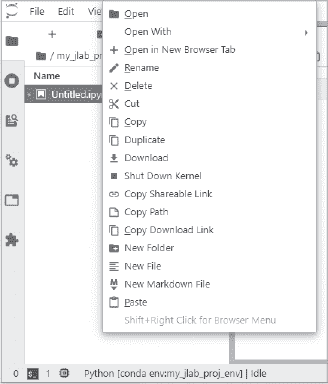

*图 6-7：文件浏览器的上下文菜单，用于操作文件*

**注意**

*JupyterLab 配备了许多方便的上下文菜单。几乎所有可点击的区域，包括笔记本单元格下方的空白区域，都有可用的菜单。*

使用图 6-7 中显示的上下文菜单将笔记本命名为**globular.ipynb**。笔记本标签页的名称也应该发生变化。

#### ***使用 Markdown 单元格***

要创建一个描述性的标题，请点击第一个单元格并使用笔记本顶部的工具栏(图 6-8)将单元格类型从**代码**更改为**Markdown**。


*图 6-8：笔记本工具栏*

现在，输入以下内容并按 CTRL-ENTER 运行单元格：

```py
## Simulate a Globular Star Cluster with Matplotlib
```

有关 Markdown 的更多信息，请参见第 102 页中的“使用 Markdown 单元格添加文本”。

#### ***添加代码并绘制图形***

你可以轻松地在单个单元格中运行模拟器代码，但为了叙述方便，让我们将其分散到多个单元格中。像这样创建模块化程序有其优势。例如，你可以在第一个单元格中隔离导入和数据加载，这样你就不需要在修改后续单元格时每次都重新运行它们。

首先通过使用笔记本工具栏中的“+”添加一个新单元格(图 6-8)。新单元格默认是代码单元格，因此你可以开始编码。第一步是导入构建模拟所需的库：

```py
%matplotlib inline
import numpy as np
from matplotlib import pyplot as plt
plt.style.use('dark_background')
```

该代码从一个魔术命令开始，使 Matplotlib 在 *inline* 中绘图。这意味着它将在笔记本内部的输出单元格中绘制。接下来的两行导入 NumPy 和 Matplotlib。最后一行选择 Matplotlib 的黑暗主题来绘制图形，这样我们的白色星星将在黑色背景下显示。按下 SHIFT-ENTER 运行该单元格，这将运行该单元格并在下方添加一个新的代码单元格，或者点击工具栏中的三角形“播放”图标（ ▸ ）（参见 图 6-8）。

现在定义一个通用函数，创建一个球形体积中的 x、y、z 坐标列表。在新单元格中，输入以下内容：

```py
def spherical_coords(num_pts, radius):
    ″″″Return list of uniformly distributed points in a sphere.″″″
 ➊ position_list = []
    for _ in range(num_pts):
     ➋ coords = np.random.normal(0, 1, 3)     
        coords *= radius   
        position_list.append(list(coords))
    return position_list
```

该函数将点数 (`num_pts`) 和球体半径 (`radius`) 作为参数。这决定了星团的大小及其包含的星星数量。然后，创建一个空列表 ➊ 以保存坐标，并循环处理点数，每次从具有均值 0 和标准差 1 的正态分布中绘制三个随机值 ➋。这三个值将表示星星的 x、y、z 坐标。将坐标乘以半径会拉伸或缩小星团的大小。在每次循环结束时，将坐标附加到列表中，并通过返回列表结束函数。

按下 SHIFT-ENTER 运行该单元格，以在笔记本底部添加一个新单元格。

现在，创建一个球状星团并将其绘制出来。在新单元格中，输入以下代码：

```py
   rim_radius = 1
   num_rim_stars = 3000
   rim_stars = spherical_coords(num_rim_stars, rim_radius)
➊ core_stars = spherical_coords(int(num_rim_stars/4), rim_radius/2.5)

➋ fig, ax = plt.subplots(1, 1, subplot_kw={'projection':'3d'})
   ax.axis('off')
➌ ax.scatter(*zip(*core_stars), s=0.5, c='white')
   ax.scatter(*zip(*rim_stars), s=0.1, c='white')
➍ ax.set_xlim(-(rim_radius * 4), (rim_radius * 4))
   ax.set_ylim(-(rim_radius * 4), (rim_radius * 4))
   ax.set_zlim(-(rim_radius * 3), (rim_radius * 3))
   ax.set_aspect('auto')
```

“边缘”变量表示整个星团的半径和星星数量。通过调用函数生成坐标。然后，再次调用该函数生成位于星团中心密集核心区域的星星的坐标 ➊。注意，您可以通过将它们除以缩放因子并确保星星数量变量保持整数来更改传递给函数的输入参数。您可以使用这些缩放器来改变核心区域的外观。

现在是绘制星星的时候了。暂时不必担心 Matplotlib 的复杂语法；我们稍后会在本书中详细讨论这一点。基本上，绘图被称为 `Axes`（简称 `ax`）位于 `Figure`（`fig`）对象中，这些对象作为容器 ➋。要创建一个单独的三维 `ax` 对象，您可以调用 `plt.subplots()` 方法，并将投影类型设置为 `3d`。然后，关闭绘图的 x、y 和 z 轴；我们希望我们的星团漂浮在宇宙的黑暗中。

要发布星点，请两次调用 `scatter()` 方法：一次用于边缘星星，一次用于核心 ➌。这使您可以为两个区域指定不同的点大小。`scatter()` 方法期望 x、y、z 点，但数据当前是一个列表的列表，每个点的坐标在其自己的列表中：

```py
[[-1.3416146295620397, 0.24853387721205472, -1.3228171973149565],
 [-0.23230429303889005, 0.04705622148151854, 0.7578767084376479]...]
```

为了提取这些坐标，我们将使用 Python 内置的`zip()`函数，并结合其*splat*（`*`）操作符来解包多个变量。最后通过设置坐标轴的限制，使它们的纵横比相等，并且足够大以容纳星团➍。通过将限制与`rim_radius`变量相关联，而不是指定绝对大小，如果你改变半径值，图表会自动调整。

按 CTRL-ENTER 运行单元格并生成图表，而无需添加新单元格。你的完成笔记本应该如下所示：图 6-9。

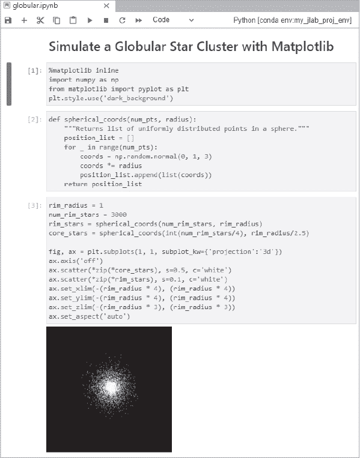

*图 6-9：完成的球状星团笔记本*

要保存工作，点击工具栏上的软盘图标，或者使用 CTRL-S。

#### ***添加一个控制台***

到目前为止，我们所做的都可以在经典的 Jupyter Notebook 应用程序中完成。现在，让我们看看 JupyterLab 能带来什么，尤其是能够使用多个标签页连接到相同内核的功能。

在处理代码时，特别是继承自队友的代码，你可能需要检查数据类型、列表内容、函数返回值等。通常，调查这些副作用会让你的笔记本变得杂乱。但是，JupyterLab 允许你打开多个标签页，并将这些标签页与正在运行的内核连接。这使得你可以在笔记本之外进行探索性工作，同时仍然处于工作空间内。

要打开一个连接到当前内核的控制台，在任何单元格中右键点击，然后在打开的上下文菜单中选择**为笔记本新建控制台**。一个控制台应该会出现在笔记本下方，如图 6-10 所示。

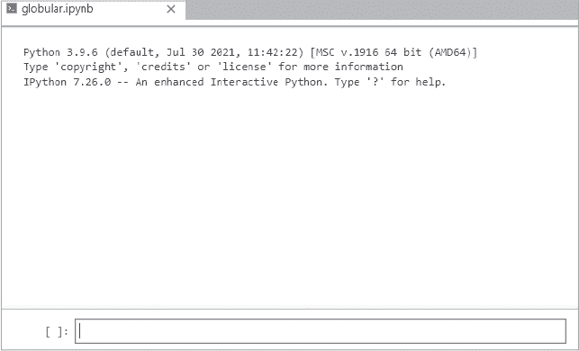

*图 6-10：一个新控制台链接到 globular.ipynb 笔记本*

要查看`rim_stars`列表中坐标的格式，将光标放在控制台底部的空框中，输入以下内容，然后按 SHIFT-ENTER 运行：

```py
print(rim_stars[:3])
```

这将显示列表的前三行：

```py
[[0.9223767036280706, -1.0746823426729988, 0.30774451034833233],
[0.25440816717656933, 0.21302429871155004, 0.7991568645529153], 
[-0.922974317327836, 0.49065537767349343, 0.5170958730770349]]
```

你可以看到你正在处理一个列表的列表，每个嵌套列表包含三个浮动值，分别表示 x、y 和 z 坐标。因为笔记本和控制台共享相同的内核，一旦你运行笔记本，任何导入、变量赋值、函数定义等都会驻留在内存中并可以被控制台访问。你甚至可以将单元格`[3]`的内容复制到控制台中，调整参数，并在那里绘制结果，而不会影响你的笔记本。

为了保持控制台整洁，打开其上下文菜单并选择**清除控制台单元格**。

#### ***显示图像文件***

如果你想将输出与球状星团的照片进行比较，以帮助你调整输入变量以获得真实感的模拟效果怎么办？你可以将图像添加到 Markdown 单元格中，但你可能需要向下滚动才能看到它，并且稍后必须记得删除它。为了避免这种麻烦，你可以在一个单独的 JupyterLab 窗口中显示该图像。

首先，访问 Wikimedia Commons 网站 (*[`commons.wikimedia.org/`](https://commons.wikimedia.org/)*)，并搜索 “The Great Globular Cluster in Hercules – M13”。将图片保存或下载到你的 *my_jlab_proj\data* 文件夹。我使用了分辨率为 640 像素的版本，下载地址是 *[`upload.wikimedia.org/wikipedia/commons/thumb/6/6f/The_Great_Globular_Cluster_in_Hercules_-_M13.jpg/640px-The_Great_Globular_Cluster_in_Hercules_-_M13.jpg`](https://upload.wikimedia.org/wikipedia/commons/thumb/6/6f/The_Great_Globular_Cluster_in_Hercules_-_M13.jpg/640px-The_Great_Globular_Cluster_in_Hercules_-_M13.jpg)*。

回到 JupyterLab，导航到文件浏览器中的图片并通过右键点击文件名选择**打开**，或者双击文件名来打开它。接下来，将新的图片面板和控制台拖动并堆叠到屏幕的右侧，以生成图 6-11 所示的布局。

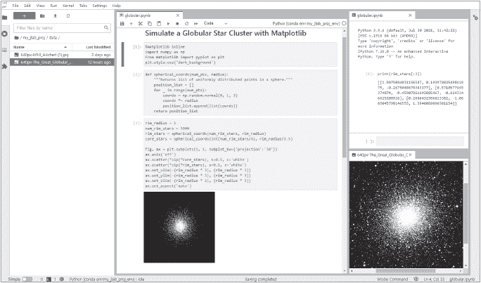

*图 6-11：我们的最终工作区，包含文件浏览器（左）、笔记本（中）、控制台（右上）和 .jpg 图片（右下）*

一个类似这样的工作区，包含文件浏览器、笔记本和控制台，是初学者的理想设置。

#### ***探索仿真***

你可以通过在外部窗口中打开仿真，改变背景色，添加网格线等方式来改变仿真的外观。要以 3D 模式探索仿真，可以将单元格 `[1]` 中的第一行更改为：

```py
%matplotlib qt
```

然后，从主菜单中选择 **运行** ▸ **运行所有单元**。这将打开一个外部 Qt 窗口，允许你旋转该星团并从各个角度查看它。如果窗口没有自动弹出，请检查任务栏。

如果你想看到图形的 3D 网格，最好使用负像素图像。首先，使用 CTRL / 或 CMD / 快捷键找到并注释掉以下两行：

```py
# plt.style.use('dark_background')
# ax.axis('off')
```

接下来，将恒星的颜色改为黑色：

```py
ax.scatter(*zip(*core_stars), s=0.5, c='black')
ax.scatter(*zip(*rim_stars), s=0.1, c='black')
```

将笔记本保存为 *globular_black.ipynb* 并运行所有单元。你可能需要重启内核来清除黑色背景的图形样式。如果需要，从菜单栏选择 **内核** ▸ **重启内核并运行所有单元**。你应该会看到图 6-12 所示的图形。

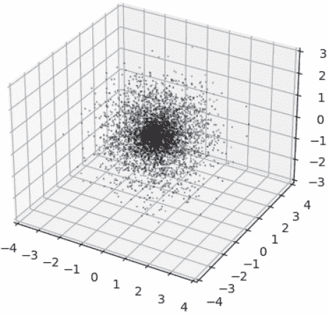

*图 6-12：带有网格线的“黑色”星团仿真*

**注意**

*你可以使用 jupyterlab-matplotlib 扩展在笔记本输出单元中与图形进行交互。我们将在本章稍后讨论 JupyterLab 扩展。*

#### ***打开多个笔记本***

JupyterLab 的一个优点是它允许你同时处理多个笔记本项目。假设你想编辑在第五章中制作的 *geyser.ipynb* 文件。在 JupyterLab 中，你可以通过文件管理器找到该笔记本并双击它来打开一个新的标签页（图 6-13）。

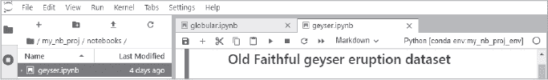

*图 6-13：在同一浏览器窗口中打开的两个笔记本*

您现在在同一个浏览器窗口中打开了两个笔记本，它们使用不同的内核，如每个笔记本右上角所示。

#### ***保存工作区***

工作区中的文档，如 Jupyter 笔记本和文本文件，可以使用标准命令进行保存，如 CTRL-S、**文件** ▸ **保存笔记本**等。此外，您的工作区的 *布局*（即您打开的标签页、它们的排列以及内容）可以作为 **.jupyterlab-workspace** 文件保存。

如果您打算多次使用当前布局，或者打算拥有多个依赖项目的布局，您需要为每个工作区提供一个独特的名称。要将此布局文件存储在项目文件夹中，请转到 JupyterLab 文件浏览器，确保您在 *my_jlab_proj* 文件夹中。接下来，使用新建文件夹图标（一个带有“+”的文件夹）创建一个名为 *workspaces* 的文件夹（图 6-14）。然后打开此文件夹。

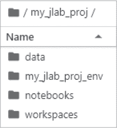

*图 6-14：添加工作区文件夹*

为了保存当前的 JupyterLab 状态，请在菜单栏中选择 **文件** ▸ **另存为当前工作区**。弹出窗口会要求您输入名称，格式如下：

*my_jlab_proj/new-workspace.jupyterlab-workspace*

将 *new-workspace* 文本改为 *globular* 然后点击 **保存**：

*my_jlab_proj/globular.jupyterlab-workspace*

要恢复到已保存的工作区，只需打开 *.jupyterlab-workspace* 文件。

#### ***清空工作区***

要清空工作区的内容，请使用 `reset` URL 参数。这里的示例展示了其一般格式：

```py
http(s)://<server:port>/<lab-location>/lab/workspaces/<workspace-name>?reset
```

例如，要重置我们的球形工作区，在浏览器的地址栏中使用`reset`，如下所示：

```py
http://localhost:8888/lab/workspaces/globular?reset
```

这将配置您的工作区，类似于 图 6-3 中所示的内容。如果您已按照上一节中的描述保存了之前的布局，仍然可以恢复该布局。

欲了解更多关于管理工作区的信息，请访问 *[`jupyterlab.readthedocs.io/en/stable/user/urls.html`](https://jupyterlab.readthedocs.io/en/stable/user/urls.html)*。

#### ***关闭工作区***

与 Jupyter Notebook 一样，仅仅关闭浏览器标签页并不会停止 JupyterLab。要完全关闭它，请在菜单栏上选择 **文件** ▸ **关闭**。如果您登录的是另一服务器而不是本地工作，您可以使用 **文件** ▸ **登出** 来退出。

**注意**

*请注意，一些服务提供商（如大学）可能有特定的服务器登出程序。未遵循这些程序可能会浪费分配的时间资源，并导致意外的使用费用。*

### **利用 JupyterLab 界面**

希望之前的示例让您对 JupyterLab 界面有所了解。在接下来的章节中，我们将更详细地看一下它的一些组件和控件。很多这些都是不言而喻的，因此我们将重点关注最有用和不太直观的部分。

正如你在球状星团练习中看到的，工作区允许你通过自定义布局将工具组合在一起。它还为 Jupyter 笔记本带来了一些不错的功能，包括通过拖拽单元格重新排列笔记本、在笔记本之间拖拽单元格以复制内容，以及创建多个相同笔记本的同步视图。

#### ***创建同步视图***

让我们来看一下关于同步视图的最后一个案例。你可能经常需要同时查看一个长笔记本的顶部和底部，或者向下滚动查看交互式输出。为了管理这一需求，JupyterLab 允许你多次打开同一个笔记本。

要了解这个是如何工作的，在球状星团会话中，点击*globular*笔记本，然后选择**文件** ▸ **为笔记本创建新视图**。接下来，调整布局，使两个笔记本并排显示。然后，缩小浏览器窗口，使其无法显示完整的笔记本及其输出，模拟一个长笔记本。在左侧笔记本中，向上滚动查看代码。在右侧笔记本中，向下滚动查看图表，如图 6-15 所示。现在，重新运行第一个笔记本中的单元格。右侧的图表应该会更新。

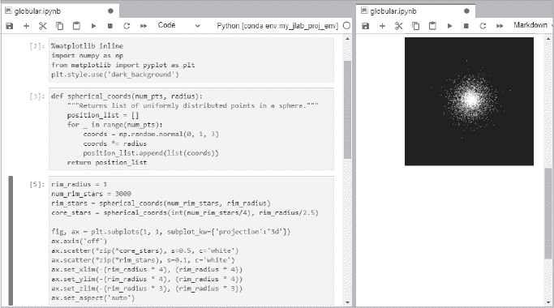

*图 6-15：不同标签页中相同笔记本的同步视图*

或者，你也可以将输出单元格移动到一个新窗格中。只需在包含球状星团模拟的输出单元格中打开上下文菜单，然后选择**为输出创建新视图**（图 6-16）。然后，你可以将它拖动到工作区中的任何位置。

如果你使用滑块或其他小部件来交互式地更改参数并更新可视化，这些也会包含在新的视图中。这使你可以在工作区内创建伪仪表板。

#### ***在笔记本之间复制单元格***

要在笔记本之间拖拽并复制单元格，使用**文件** ▸ **新建** ▸ **笔记本**打开一个新笔记本。将新笔记本拖到*globular*笔记本旁边。在*globular*笔记本中，点击一个单元格*编号*（例如`[1]:`），并将其拖动到新的未命名笔记本中。你应该看到类似图 6-17 所示的结果。

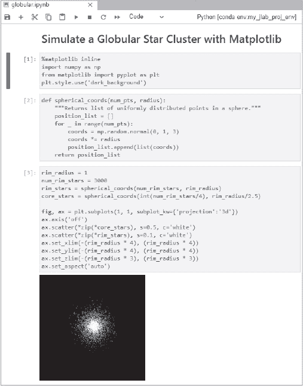

*图 6-16：带有输出单元格的球状星团笔记本，输出单元格位于一个单独的窗格中*

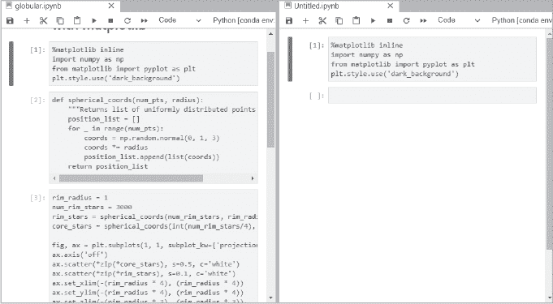

*图 6-17：将左侧笔记本中的第一个单元格拖入右侧笔记本的结果*

#### ***通过使用单文档模式保持专注***

经典的 Jupyter 笔记本有一个优点，那就是你可以专注于一个任务，而不必让应用程序“干扰”你。JupyterLab 的开发者注意到这一点，并加入了一个设置，允许你专注于单个文档或活动，而无需关闭主工作区中的所有其他标签。

要启用此设置，通过点击标签激活该标签，然后从菜单栏中选择 **视图** ▸ **简单界面**，或使用 JupyterLab 窗口左下角的 **简单** 切换开关。工作区将仅显示活动标签。如果你在 *球形* 工作区上开启和关闭此设置，可能会发现一个缺点。当你返回常规视图时，你 *可能* 会丢失你偏好的标签排列（比较 图 6-18 和 6-11）。

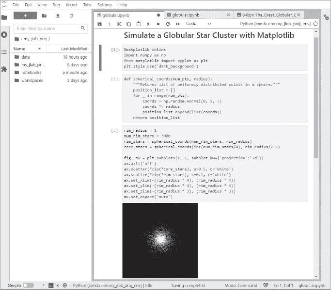

*图 6-18：关闭简单界面模式后，球形会话的工作区标签排列*

如果视图发生变化，你可以通过手动操作或使用已保存的 *.jupyterlab-workspace* 文件来恢复原始布局。由于这有点繁琐，当你打算长时间停留在单个文档或活动中时，你可能只想使用简单界面选项。

### **使用文本编辑器**

JupyterLab 包括一个文本编辑器，你可以用它来编写 Python 脚本。在我们的 *球形* 会话中没有涉及这个内容，所以这里我们通过一个简单的例子来讲解，使用勾股定理。这个著名的 *a*² + *b*² = *c*² 公式用于求直角三角形的斜边。

如果你已经关闭了 JupyterLab，从你的 *base* 环境启动它。打开 Anaconda 提示符（Windows）或终端（macOS 或 Linux），然后输入以下命令：

```py
jupyter lab
```

这应该会打开默认布局，如 图 6-3 所示。

如果你已经启动了 JupyterLab，可以通过编辑 URL 将其结尾改为 */lab* 来返回默认工作区。例如：

*http://localhost:8888/lab*

如果由于某种原因你的工作区看起来与 图 6-3 中的不同，可以通过添加 *?reset* URL 参数来重置它，如下所示：

*http://localhost:8888/lab?reset*

现在，从启动器面板中，启动一个新的文本文件或 Python 文件。一个新的标签页应该会为未命名文件打开。点击文件并输入以下内容：

```py
def pythagoras(a, b):
    return (a**2 + b**2)**0.5

for i in range(9):
     a = i
     b = i + 1
     print(f″a = {a}, b = {b}, c = {pythagoras(a, b)}″)
```

从菜单栏中，选择 **文件** ▸ **另存为**（如果你选择了 Python 文件选项，则选择 **文件** ▸ **另存 Python 文件为**），并将文件命名为 *pythagoras.py*。当你点击 **保存** 时，文件应该会出现在文件浏览器中。如果你回到并再次点击文件菜单，你会注意到保存选项现在变成了 **保存 Python 文件** 和 **另存 Python 文件为**，即使你最初选择的是文本文件。JupyterLab 现在已经识别这是一个 Python 文件。

在运行脚本之前，你需要保存它们。你可以通过查看标签来判断文件是否已保存。未保存的文件会在文件名旁边显示一个黑点，而已保存的文件则会显示一个 X（图 6-19）。

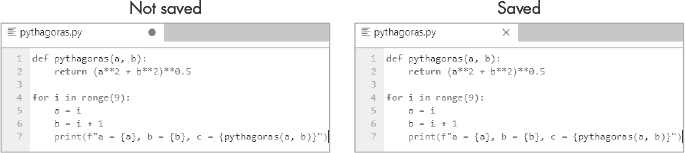

*图 6-19：未保存的文本文件标签上有•，而保存的文本文件标签上有 X*

尽管 JupyterLab 文本编辑器不像 Spyder 的编辑器那样强大（第四章），但它比像记事本这样的简单编辑器更为精致。如果你在菜单栏上点击 **设置**，你会看到多个子菜单，可以用来更改其外观和行为，如 图 6-20 所示。

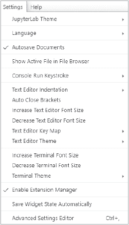

*图 6-20：设置菜单*

有一个键盘映射可以让你使用与 Sublime Text、vim 和 emacs 编辑器相同的快捷键。还有多种编辑器主题选择，能够更改字体大小，设置制表符缩进级别，并自动关闭括号。在高级设置编辑器中，你可以更改编辑器的配置文件。键盘快捷键也可以使用，具体取决于你选择的键盘映射。你可以在线搜索各个映射的键位绑定列表。

默认情况下，编辑器使用 *纯文本* 语法高亮样式，但你可以通过选择菜单栏上的 **视图** ▸ **文本编辑器语法高亮**（或 **文本编辑器主题**）从完整的列表中选择其他样式。往后，我将使用默认的 Jupyter 主题、键盘映射和语法高亮样式。有关高亮的更多信息，请参见 第三章。

回到我们的脚本。你有几种方法可以运行你在编辑器中编写的代码。在接下来的部分，我们将介绍通过终端和笔记本运行代码的选项。

#### ***在终端中运行脚本***

要在终端模拟器中运行已保存的 *pythagoras.py* 文件，在菜单栏上选择 **文件** ▸ **新建** ▸ **终端**。接着，点击终端面板并输入以下内容：

```py
python pythagoras.py
```

按下 ENTER，脚本应该会运行（图 6-21）。

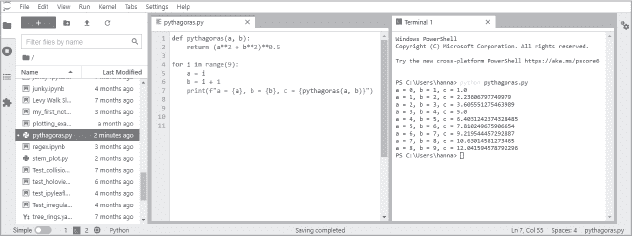

*图 6-21：在终端面板中运行 Python 文件*

根据你的计算机设置，你可能需要使用 `python3` 替代 `python`：

```py
python3 pythagoras.py
```

如果你编辑了 Python 文件并想在终端中重新运行它，请记住，你可以使用箭头键选择之前的命令，从而节省敲击键盘的时间。

#### ***在笔记本中运行脚本***

要在笔记本中运行已保存的 *pythagoras.py* 文件，在菜单栏上选择 **文件** ▸ **新建** ▸ **笔记本**。如果系统提示选择内核，请接受 **Python3** 或从下拉菜单中选择 **my_jlab_proj_env** 中的内核。接着，点击笔记本单元格并输入以下内容：

```py
%run pythagoras.py
```

按下 CTRL-ENTER，你应该会在笔记本中看到输出结果（图 6-22）。

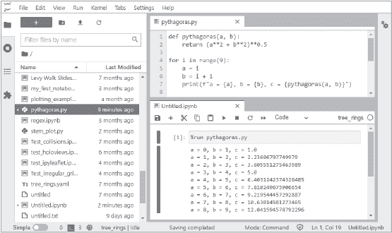

*图 6-22：在笔记本中运行 Python 文件*

请注意，你无需保存或重命名笔记本就可以使用它来运行脚本。

#### ***同时编写和记录代码***

JupyterLab 允许你在一个工作空间内编写文档代码、检查文档中的代码是否能运行，并预览结果。让我们来看一个例子。

在文件浏览器中，导航到你的用户目录。通过菜单栏中的**文件** ▸ **新建** ▸ **文本文件**打开一个新的文本编辑器。将其重命名为 *doc.md*（*.md* 文件是使用 Markdown 语言的纯文本格式文件，就像 Notebook 的 Markdown 单元），然后输入以下内容：

```py
## Example of Previewing Code Documentation in JupyterLab.
```

现在，在编辑器窗格中，打开上下文菜单，然后选择**显示 Markdown 预览**。

返回编辑器，输入以下内容：

```py
### Let's run some code in a console.

import matplotlib.pyplot as plt

plt.plot([0, 1, 2, 3], [0, 1, 2, 3])
plt.savefig('doc_test.png')
```

在编辑器窗格中，打开上下文菜单，然后选择**为编辑器创建控制台**。如果系统提示选择内核，选择一个已安装 Matplotlib 的内核，例如 `Python [conda env:my_jlab_proj_env]`。现在，将前面的代码（包括导入语句）复制到控制台中，然后使用 SHIFT-ENTER 执行。

接下来，在编辑器中输入以下代码，以便在 Markdown 预览中显示图表：

```py

```

你的布局应该类似于 图 6-23。

你还可以使用**为编辑器创建控制台**选项在文本编辑器中运行代码。打开控制台后，突出显示编辑器中的代码，然后从菜单中选择**运行** ▸ **运行代码**。

JupyterLab 的多样化布局和可共享内核支持高效的工作流程，从而提高生产力。如果你在编写代码时总是不断切换标签和滚动窗格，你可能没有充分利用 JupyterLab 的全部功能。

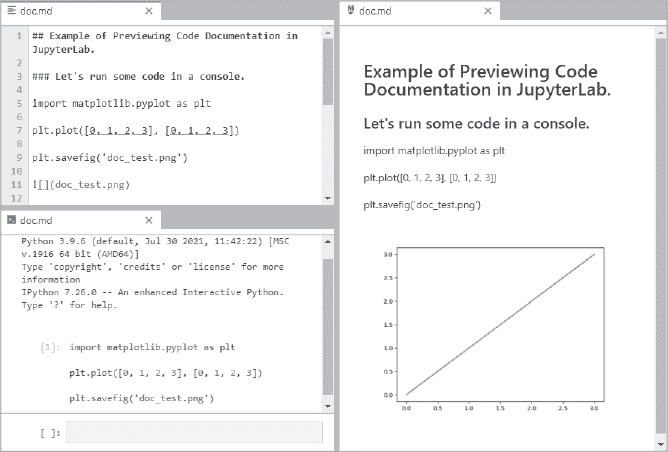

*图 6-23：使用编辑器、控制台和 Markdown 窗格预览代码*

### **使用 JupyterLab 扩展**

JupyterLab 扩展是即插即用的插件，用于“扩展” JupyterLab 的功能。每个扩展可以包含一个或多个插件（可扩展性的基本单元）。扩展可以由任何人创建，包括你自己。引用文档中的话，“[JupyterLab] 本身就是一系列扩展的集合，它们没有比任何自定义扩展更强大或更具特权。”

一小部分流行的 JupyterLab 扩展列在 表 6-1 中。一些以前流行的扩展，如目录和调试器扩展，现在已经内置到 JupyterLab 中。还有一些用于处理绘图和仪表盘库（如 Plotly、Bokeh 和 Dash）的扩展。我们将在 第十六章 中讨论这些库。

JupyterLab 扩展包含在浏览器中运行的 JavaScript。扩展有两种类型：*源代码*和*预构建*。激活源代码扩展需要安装 Node.js 并重建 JupyterLab。而预构建的扩展（如以 Python 包发布的扩展）不需要重建 JupyterLab。扩展还可以包括必要的服务器端组件，供扩展功能使用。

**表 6-1：** 有用的 JupyterLab 扩展

| **扩展** | **描述** | **网站** |
| --- | --- | --- |
| nbdime | 用于比较和合并 Jupyter 笔记本的工具 | *[`nbdime.readthedocs.io/en/latest/`](https://nbdime.readthedocs.io/en/latest/)* |
| jupyterlab-git | 使用 Git 进行版本控制 | *[`github.com/jupyterlab/jupyterlab-git/`](https://github.com/jupyterlab/jupyterlab-git/)* |
| JupyterLab GitHub | 从仓库访问笔记本 | *[`www.npmjs.com/package/@jupyterlab/github/`](https://www.npmjs.com/package/@jupyterlab/github/)* |
| Jupyter-ML 工作区 | 专为机器学习设计的 IDE | *[`github.com/ml-tooling/ml-workspace/`](https://github.com/ml-tooling/ml-workspace/)* |
| JupyterLab 系统监控 | 监控内存和 CPU 使用情况 | *[`github.com/jtpio/jupyterlab-system-monitor/`](https://github.com/jtpio/jupyterlab-system-monitor/)* |
| jupyterlab_html | 查看渲染后的 HTML 文件 | *[`github.com/mflevine/jupyterlab_html`](https://github.com/mflevine/jupyterlab_html)* |
| jupyterlab matplotlib | 交互式内联 Matplotlib | *[`github.com/matplotlib/ipympl/`](https://github.com/matplotlib/ipympl/)* |
| JupyterLab LaTeX | 实时编辑 LaTeX 文档 | *[`github.com/jupyterlab/jupyterlab-latex/`](https://github.com/jupyterlab/jupyterlab-latex/)* |
| JupyterLab 代码格式化工具 | 使用 Black 或 Autopep8 等格式化工具来强制执行风格指南 | *[`github.com/ryantam626/jupyterlab_code_formatter/`](https://github.com/ryantam626/jupyterlab_code_formatter/)* |
| jupyterlab-spellchecker | Markdown 单元和文本文件的拼写检查工具 | *[`github.com/ocordes/jupyterlab_spellchecker/`](https://github.com/ocordes/jupyterlab_spellchecker/)* |
| jupyterlab-google-drive | 通过 Google Drive 提供云存储 | *[`github.com/jupyterlab/jupyterlab-google-drive`](https://github.com/jupyterlab/jupyterlab-google-drive)* |

**注意**

*我们在第五章中回顾的经典 Jupyter Notebook 扩展与 JupyterLab 不兼容。尽管许多有用的扩展已被移植到 JupyterLab，但其他一些扩展仍在更新中。如果你想要的扩展不可用，请耐心等待，并定期检查扩展管理器以查看是否有更新。扩展的官方网站也可能会发布有关更新的新闻。*

#### ***使用扩展管理器安装和管理扩展***

你可以在左侧边栏使用扩展管理器（参见图 6-3）来安装和管理作为单个 JavaScript 包分发的扩展，这些包位于 *npm*，即 *node 包管理器* 上（* [`www.npmjs.com/`](https://www.npmjs.com/)*）。扩展管理器默认是关闭的，但你可以通过点击 **启用** 按钮来打开它（参见图 6-24）。

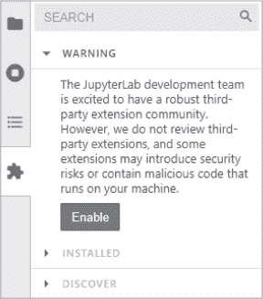

*图 6-24：从左侧边栏启用扩展管理器*

安装扩展允许它们在服务器、内核和浏览器上执行任意代码。由于第三方扩展未经审查，可能会引入安全风险或包含恶意代码，因此需要明确启用此操作。

扩展管理器面板分为三个部分：一个搜索栏、已安装扩展的列表，以及一个“发现”部分，显示 NPM 注册表中的所有 JupyterLab 扩展。结果会根据注册表的排序规则列出（参见 *[`docs.npmjs.com/searching-for-and-choosing-packages-to-download#package-search-rank-criteria/`](https://docs.npmjs.com/searching-for-and-choosing-packages-to-download#package-search-rank-criteria/)*）。其中一个例外是由 Jupyter 组织发布的扩展。这些扩展在名称旁边会有一个小 Jupyter 图标，并且始终出现在搜索结果列表的顶部（图 6-25）。

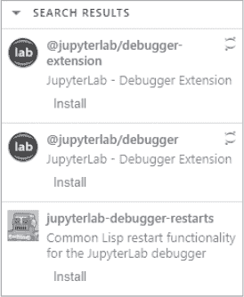

*图 6-25：由 Jupyter 组织发布的扩展已清晰标记，并出现在搜索结果的顶部。*

要查找可用的扩展，你可以向下滚动列表或使用扩展管理器的搜索框。要了解更多关于某个扩展的信息，点击其名称。这将会在新浏览器窗口中打开扩展的官方网站（通常是 GitHub）。

你可以使用管理器的 **安装** 按钮来安装扩展。对于源代码扩展，你需要 Node.js。要在你的 *base* 环境中 *从默认频道* 安装它，打开 Anaconda Prompt（Windows）或终端（macOS 或 Linux），并输入以下命令：

```py
conda install nodejs
```

要从 *conda-forge* 渠道安装，输入以下命令：

```py
conda install -c conda-forge nodejs
```

现在你已经准备好安装扩展了。

因为大多数扩展都是 *源代码* 扩展，当你点击管理器的 **安装** 按钮时，搜索栏下方会出现一个下拉菜单，指示扩展已经下载，但需要重建才能完成安装。你应该点击 **重建**，但如果由于某些原因忽略此操作，下次你刷新浏览器、切换工作区或启动 JupyterLab 时，系统会显示一个 **构建** 按钮。点击该按钮后，你将被要求“重新加载而不保存”或“保存并重新加载”。

如果你想同时管理多个扩展，你可以忽略重建通知，直到完成所有所需的更改。然后，点击 **重建** 按钮开始在后台进行重建。当重建完成后，将会弹出一个对话框，提示需要重新加载页面以加载最新的构建到浏览器中。此时，扩展会出现在管理器的已安装部分，在那里你将可以选择卸载或禁用它（图 6-26）。禁用扩展会阻止它被激活，但无需重建应用程序。

**注意**

*避免安装你不信任的扩展，并留意任何试图伪装成受信任扩展的扩展。由 Jupyter 组织发布的扩展将会在扩展名称的右侧显示一个小 Jupyter 图标。*

在安装过程中，JupyterLab 将检查软件包元数据，查找任何配套软件包，如笔记本服务器扩展或内核软件包。如果 JupyterLab 找到配套软件包的说明，它将弹出一个信息对话框，提醒你这些软件包的存在。是否考虑这些配套软件包，取决于你自己。

要了解更多有关扩展管理器的信息，请访问文档 *[`jupyterlab.readthedocs.io/en/stable/user/extensions.html`](https://jupyterlab.readthedocs.io/en/stable/user/extensions.html)*。

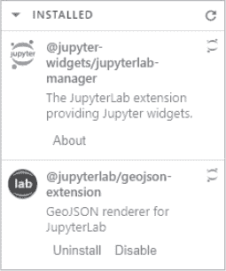

*图 6-26：用户安装的扩展可以在扩展管理器中卸载或禁用*

#### ***使用 CLI 安装和管理扩展***

除了扩展管理器之外，还有其他安装扩展的方法。不过，安装源扩展仍然需要你安装 Node.js 并重建 JupyterLab，而且你需要注意相同的安全问题（请参见前一节的详细信息）。

在管理器中点击扩展名称将带你到该扩展的网站。在这里，你可能会找到使用 CLI 安装的说明。例如，要安装 jupyterlab-git 扩展，该扩展让你能够使用 Git 进行版本控制，打开 Anaconda Prompt（Windows）或终端（macOS 或 Linux），并输入以下命令：

```py
conda install -c conda-forge jupyterlab-git
```

要卸载扩展，请使用以下命令：

```py
conda remove jupyterlab-git
```

同样在 CLI 中，你可以使用 `jupyter labextension` 命令从 NPM 安装或卸载源扩展，列出所有已安装的扩展，或禁用某个扩展。

要安装扩展，请使用这种格式，其中 <extension-name> 表示扩展的名称：

```py
jupyter labextension install <extension-name>
```

要安装多个扩展，请输入以下命令：

```py
jupyter labextension install <extension-name> <another-extension-name>
```

要安装特定版本的扩展，请使用以下命令：

```py
jupyter labextension install <extension-name>@1.2.3
```

要卸载扩展，请使用以下命令：

```py
jupyter labextension uninstall <extension-name> <another-extension-name>
```

如果你在多个阶段安装/卸载多个扩展，可能希望通过在安装/卸载步骤中包含`--no-build`标志来推迟重建 JupyterLab。当你准备好重建时，可以运行以下命令：

```py
jupyter lab build
```

你可以使用以下命令列出扩展：

```py
jupyter labextension list
```

**注意**

*jupyter labextension 命令使用扩展的 JavaScript 包名称，这可能与用于分发扩展的 conda 包名称不同。*

要禁用扩展而不重建 JupyterLab，请使用以下命令：

```py
jupyter labextension disable <extension-name>
```

禁用扩展会保持代码加载，但会阻止插件运行。

你可以使用以下命令启用禁用的扩展：

```py
jupyter labextension enable <extension-name>
```

安装的扩展默认是启用的，除非有明确的配置禁用了它们。

要获取 `jupyter labextension` 命令的帮助，请输入：

```py
jupyter labextension --help
```

要了解更多关于此命令的信息，请访问文档 *[`jupyterlab.readthedocs.io/en/stable/user/extensions.html`](https://jupyterlab.readthedocs.io/en/stable/user/extensions.html)*。

#### ***为 JupyterLab 安装 ipywidgets***

在 第五章中，我们使用了 ipywidgets 扩展在经典的 Jupyter Notebook 中使用小部件。大多数情况下，安装 ipywidgets 会自动配置 JupyterLab 使用小部件，因为它依赖于 jupyterlab_widgets 包，该包配置 JupyterLab 以显示和使用小部件。

如果你使用的是模块化方法，即 JupyterLab 和 IPython 内核安装在不同的环境中，则安装 ipywidgets 需要两个步骤：

1.  在包含 JupyterLab 的环境中安装 jupyterlab_widgets 包。

1.  在每个将使用 ipywidgets 的内核环境中安装 ipywidgets。

例如，如果你在 *base* 环境中安装了 JupyterLab，并且在之前创建的 *my_jlab_proj_env* 环境中安装了内核，可以使用以下命令，替换为你自己的 *my_jlab_proj_env* 文件夹路径：

```py
conda activate base
conda install -c conda-forge jupyterlab_widgets
conda activate C:\Users\hanna\my_jlab_proj\my_jlab_proj_env
conda install -c conda-forge ipywidgets
```

#### ***创建自定义扩展***

JupyterLab 扩展是一个包含一个或多个 JupyterLab 插件的包。你可以编写自己的插件，并将它们打包成一个 JupyterLab 扩展。关于这方面的详细信息超出了本书的范围，但你可以在*扩展开发者指南*中找到所需的内容，网址为 *[`jupyterlab.readthedocs.io/en/stable/extension/extension_dev.html`](https://jupyterlab.readthedocs.io/en/stable/extension/extension_dev.html)*。

### **共享**

当我们谈论 JupyterLab 中的共享时，主要是指共享笔记本。因为我们已经在 第 122 页的“共享笔记本”部分讨论过这个话题，所以这里不再赘述。不过，作为补充，你可以在 *[`jupyterlab.readthedocs.io/en/stable/user/jupyterhub.html`](https://jupyterlab.readthedocs.io/en/stable/user/jupyterhub.html)* 上找到更多关于在 JupyterHub 上使用 JupyterLab 的信息。如果你想进行实时协作，可以参阅 *[`jupyterlab.readthedocs.io/en/stable/user/rtc.html`](https://jupyterlab.readthedocs.io/en/stable/user/rtc.html)*。

### **总结**

JupyterLab 在 Jupyter Notebook 的基础上，通过提供一个类似 IDE 的环境来开发代码、探索数据集和进行实验。凭借其可扩展的环境，JupyterLab 使我们更接近真正的 *文学化编程*，即将逻辑的阐述与普通人类语言结合在一起。

尽管 JupyterLab 已经可以使用，但它仍在开发中，因此你需要查阅官方文档，以获取最新的功能、变化和已弃用的内容。除了核心程序的工作，第三方扩展的开发将继续进行。像 *nbdev* (*[`nbdev.fast.ai/`](https://nbdev.fast.ai/)*) 和调试器 (*[`jupyterlab.readthedocs.io/en/stable/user/debugger.html`](https://jupyterlab.readthedocs.io/en/stable/user/debugger.html)*) 等新工具正在将 JupyterLab 打造成一个完整的集成开发环境（IDE）。

2021 年底的一个发展是发布了跨平台的独立版*JupyterLab App*（* [`github.com/jupyterlab/jupyterlab-desktop/`](https://github.com/jupyterlab/jupyterlab-desktop/)*）。有了这个应用程序，JupyterLab 不再“存在”于网页浏览器中，而是作为一个独立的桌面应用程序存在。为了方便使用，它捆绑了一个 Python 环境，并附带了多个常用的库，准备在科学计算和数据科学工作流中使用。这些库包括 pandas、NumPy、Matplotlib、SciPy 等。然而，目前的一个缺点是该应用程序仅提供`pip`安装，而不支持 conda 安装。这意味着，与网页版本相比，一些库的安装并不像那么方便。

这就是本书的第一部分内容。到第四章，对于 Python 新手，读者被指示完成第二部分，这部分是 Python 入门教程。如果你已经完成了这部分，或者不需要的话，可以直接进入第三部分，这一部分概述了通过 Anaconda 提供的重要科学计算和可视化包，包括如何根据需要选择最适合的工具的技巧。
