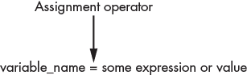

## 第九章：**整数、浮点数和字符串**


在本章中，你将学习表达式和语句的区别，了解如何给变量赋值，并熟悉 Python 中最常见的数据类型：整数、浮点数和字符串。在这个过程中，你可能会惊讶于使用简单的数学运算就能完成很多编程任务。

在完成本章及后续章节的学习时，我建议你运行代码示例，而不仅仅是阅读它们。输入命令会帮助你记住它们，并减少你对编程的任何恐惧。我将使用 Spyder 中的控制台和文本编辑器来展示本教程中的示例。我建议你也这么做，这样你可以跟着一起操作。如果你需要复习这些工具，请参见第三章了解 Jupyter Qt 控制台，和第四章了解 Spyder IDE。

### **数学表达式**

在计算机科学中，*表达式*是计算得出单一值的指令。最常见的表达式是数学表达式，比如 1 + 2，它的计算结果为 3。使用 Python，你可以将方程式嵌入到你的程序中（甚至可以将交互式控制台当作计算器使用）。为此，你需要熟悉数学运算符。

#### ***数学运算符***

用于表示某种操作或过程的符号叫做*运算符*。这些运算符执行某些功能或以某种方式操作值。常见的运算符有加号（`+`）和减号（`-`），分别用于加法和减法。表 7-1 列出了 Python 中一些可用的数学运算符。大多数运算符你应该都很熟悉，剩下的一些我们将在接下来的部分详细讲解。

**表 7-1：** 数学运算符

| **运算符** | **描述** | **示例** | **结果** |
| --- | --- | --- | --- |
| + | 加法 | 5 + 3 | 8 |
| - | 减法 | 5 - 3 | 2 |
| * | 乘法 | 5 * 3 | 15 |
| / | 除法 | 5/3 | 1.6666666666666667 |
| // | 除法（向下取整或整数除法） | 5 // 3 | 1 |
| % | 取模（余数） | 5 % 3 | 2 |
| ** | 幂运算 | 5**3 | 125 |

除法运算符（`/`）表示真正的除法，而*向下取整*除法（`//`）返回一个整数，忽略任何小数部分。注意，向下取整除法不会向上取整。如果结果是`1.99999`，你仍然会得到`1`作为答案。

如果你只想得到除法运算的分数或*余数*，可以使用*取模*运算符（`%`）。余数可能看起来像是一个奇怪的东西，但它其实非常有用。例如，你可以用它来识别偶数和奇数。在控制台输入以下代码：

```py
In [1]: 4 % 2
Out[1]: 0
```

**注意**

*执行代码的命令将取决于你使用的工具。对于 Jupyter Qt 控制台，按下回车键（如果在缩进代码内，按 SHIFT+ENTER）。*

在前面的例子中，使用取余运算符将 `4` 除以 `2` 得到 `0`，这意味着操作结果没有余数，因此 `4` 是偶数。取余的其他用途包括让程序每隔 *n* 次执行某些操作，或将秒转换为小时、分钟和秒。

幂运算符，或*指数*运算符，也有一个不太直观的特性。你不仅可以将数字提高到某个指数，还可以通过在 `**` 运算符后使用小数值来计算根。例如，要计算 9 的平方根，可以输入以下内容：

```py
In [2]: 9**0.5
Out[2]: 3.0
```

要计算 27 的立方根，请输入：

```py
In [3]: 27**(1/3)
Out[3]: 3.0
```

#### ***赋值运算符***

将 Python 作为手持计算器使用有点像对蚂蚁进行空袭。为了让程序真正有用，你需要以可重用的方式存储表达式的输出。这就是赋值语句、赋值运算符和变量的作用。

表达式计算出单一值，而*语句执行*某些操作。例如，*赋值*语句会创建一个新的*变量*。变量只是指向存储在内存中的数据的*引用*。在赋值语句中，等号（`=`）是一个赋值*运算符*，它将一个值或表达式赋给一个变量（图 7-1）。一个简单的例子是 `my_name = 'Lee'`。



*图 7-1：赋值语句的基础*

在赋值语句中，等号左边的项是变量的名称。这充当访问内存中信息的标签。等号右边的项是变量的值。这些值不必是数字。文本数据、项目列表，甚至图像和音乐都可以作为变量存储。

现在你了解了赋值语句，让我们通过将结果赋给变量，来使数学表达式更加持久和有目的。因为这是一个非常常见的编程任务，Python 会通过提供特殊的*增强*赋值运算符来帮助你，接下来我们将讨论这些运算符。

#### ***增强赋值运算符***

为了方便，你可以将数学运算符结合起来形成*增强赋值运算符*，这样你可以同时执行两个操作。以下是*没有*增强运算符的示例：

```py
In [4]: x = 5

In [5]: x = x + 5

In [6]: x
Out[6]: 10
```

请注意，你可以将一个变量加到它自身上，并且在控制台中输入变量名将显示其值。在文本编辑器中，你需要使用 `print(x)` 来将值显示到屏幕上。

使用增强赋值运算符（`+=`），你可以将 5 加到 `x` 上，而不必重复写 `x`：

```py
In [7]: x += 5

In [8]: x

Out[8]: 15
```

要创建增强赋值运算符，只需在等号（`=`）前添加数学运算符（表 7-1）。例如，要将 `x` 乘以 2，可以输入以下内容：

```py
In [9]: x *= 2

In [10]: x
Out[10]: 30
```

请注意，由于你将每个表达式的结果赋值给变量 `x`，每个表达式都可以在前一个的基础上构建。

#### ***优先级***

Python 中的数学表达式使用熟悉的优先级规则（表 7-2）。被括号包围的表达式总是首先执行，同一优先级的操作从左到右计算。

**表 7-2：** 数学运算优先级

| **级别** | **运算符** | **描述** |
| --- | --- | --- |
| 1（最高） | () | 括号 |
| 2 | ** | 幂运算 |
| 3 | -n, +n | 负数和正数参数 |
| 4 | *, /, //, % | 乘法、除法、整除、取余 |
| 5 | +, - | 加法和减法 |

这是优先级作用的一个示例。你可以在心里跟着做，看看是否和 Python 的结果一致：

```py
In [11]: 10**2 + (6 - 2) / 2 * 3
Out[11]: 106.0
```

优先级影响你在表达式中如何使用*空格*。例如，下面的表达式虽然会执行，但你可能会觉得它比前一个版本更难读：

```py
In [12]: 10 ** 2 + (6-2)/2*3
Out[12]: 106.0
```

你可以在 PEP8 中找到提高表达式可读性的指南（* [`pep8.org/`](https://pep8.org/) *）。虽然有一些规定的规则——比如从不使用多个空格、始终确保数学运算符两边的空格数量相同、赋值（=）和增强赋值运算符（如+=）两侧留一个空格——但你大部分时间可以自由发挥。如果视力不好，你可能会倾向于使用比推荐更多的空格。

#### ***math 模块***

Python 标准库包括一个`math`模块，它提供了对底层 C 库函数的访问。*函数*就像迷你程序，执行某些任务。它们将这些程序的细节隐藏起来，让你能够写出更简洁的代码。

要使用一个函数，只需输入函数名后跟括号。你在括号中输入的值或变量将作为输入传递给函数。我们将在第十一章中更详细地讨论函数，包括如何编写你自己的自定义版本。

相关功能的组通常被集中到*模块*中。`math`模块让你高效地进行常见和有用的数学计算，包括处理阶乘、二次方程以及三角函数、指数函数和双曲函数。它还包括常数，如*π*和*e*。可用功能的一个子集列在表 7-3 中。

要使用`math`模块，首先需要通过`import`语句将其*导入*。可以把这看作是从图书馆借书。因为有成千上万的可用模块，你不希望它们都默认加载。这就像把图书馆的所有书架上的书都一次性搬到你的桌子上一样。相反，你只拿取你需要的书籍。导入模块遵循这个原则，以便节省计算机的内存。

**表 7-3：** Python 数学模块函数子集

| **函数** | **描述** |
| --- | --- |
| `ceil(x)` | 返回大于或等于`x`的最小整数 |
| `fabs(x)` | 返回 `x` 的绝对值，作为浮点数 |
| `factorial(x)` | 返回 `x` 的阶乘值 |
| `floor(x)` | 返回小于或等于 `x` 的最大整数 |
| `frexp(x)` | 返回 `x` 的尾数和指数，作为一对 (`m`, `e`) |
| `isnan(x)` | 如果 `x` 是 NaN（不是一个数字），则返回 True |
| `exp(x)` | 返回 `e**x` |
| `log(x[, b])` | 返回 `x` 以 `b` 为底的对数（默认以 `e` 为底） |
| `log2(x)` | 返回 `x` 的以 2 为底的对数 |
| `log10(x)` | 返回 `x` 的以 10 为底的对数 |
| `pow(x, y)` | 返回 `x` 的 `y` 次方 |
| `sqrt(x)` | 返回 `x` 的平方根 |
| `acos(x)` | 返回 `x` 的反余弦值 |
| `asin(x)` | 返回 `x` 的反正弦值 |
| `atan(x)` | 返回 `x` 的反正切值 |
| `atan2(y, x)` | 返回 `y` / `x` 的反正切值 |
| `cos(x)` | 返回 `x` 的余弦值 |
| `hypot(x, y)` | 返回欧几里得范数，`sqrt(x**2 + y**2)` |
| `sin(x)` | 返回 `x` 的正弦值 |
| `tan(x)` | 返回 `x` 的正切值 |
| `degrees(x)` | 将 `x` 从弧度转换为度数 |
| `radians(x)` | 将 `x` 从度数转换为弧度 |

让我们使用 `math` 模块来计算 45 度的余弦值：

```py
In [13]: import math

In [14]: x = math.radians(45)

In [15]: math.cos(x)
Out[15]: 0.7071067811865476
```

首先，导入 `math` 模块，将 45 转换为弧度（Python 中所有三角函数使用弧度），并将结果赋给变量 `x`。注意，你输入模块名称后跟一个点（`.`），然后是 `radians()` 函数，括号中是你想要转换的角度。以这种方式使用点号被称为 *点符号法*。它告诉 Python 使用 `math` 模块的 `radians()` 函数。你可以把它理解为一个表示所有权的撇号：“`math` 的 `radians()` 函数。”

最后，调用 `cos()` 函数并传入 `x`。你也可以将这个值赋给一个变量，如下所示：

```py
In [16]: cos_x = math.cos(x)

In [17]: cos_x
Out[17]: 0.7071067811865476
```

接下来，让我们使用 `math` 来访问 *π* 并计算一个直径为 100 单位的圆的周长：

```py
In [18]: 100 * math.pi
Out[18]: 314.1592653589793
```

`math` 模块处理基本数学运算很好，但对于更高级的功能，例如微积分，你可能需要使用外部库，如 *SymPy*，我们将在后续章节中详细讲解。与此同时，想要了解更多关于 `math` 的内容，查看完整的函数和常量列表，以及详细的文档，可以访问 *[`docs.python.org/3/library/math.html`](https://docs.python.org/3/library/math.html)*。

**注意**

*回顾你最近学习的信息有助于保持记忆。花几分钟完成这个简短的测验。你可以在 附录 中找到答案和建议。*

**测试你的知识**

1.  对错：语句是计算指令，会计算出一个单一的值。

2.  表达式 `12%4` 的结果是：

a.  3

b.  48

c.  0

d.  12.4

3.  优先级最高的数学运算符是：

a.  乘方（**）

b.  整除 (//)

c.  括号 (())

d.  负数与正数参数 (-n, +n)

4. 编写一行代码，首先计算 42 的平方根，然后将结果提升到 4 次方。

### **错误信息**

一旦你开始编写代码，你就会犯错误。一个问题是，计算机比人类更加字面化。你和我在处理上下文意义、语法甚至拼写时可以非常灵活，但在计算机中，看到的就是得到的（图 7-2）。


*图 7-2：计算机将一切都理解为字面意思。*

你不能像处理人类语言的语法规则那样去弯曲 Python 的语法规则。当你在 Python 中尝试执行非法操作时，比如除以零，它会停止执行并显示一条错误信息，这个过程叫做*抛出异常*。

让我们来看一个人类能处理但 Python 不能处理的例子：

```py
In [16]: 25 / 'five'
Traceback (most recent call last):

File ″C:\Users\hanna\AppData\Local\Temp/ipykernel_8852/1797604750.py″, line 1, in <module>
25 / 'five'

TypeError: unsupported operand type(s) for /: 'int' and 'str'
```

Python 显示了一条错误信息，指出 `TypeError`，因为你试图将一个整数（`int`）除以一个字符串（`str`）。虽然你我可以很容易地猜出正确答案，但 Python 甚至不会尝试，因为你混合了*数据类型*（稍后会讲到这些）。对于 Python 来说，这就像将 25 除以“Steve”一样荒谬。

现在，让我们尝试除以零：

```py
In [20]: x = 42 / 0
Traceback (most recent call last):

File ″C:\Users\hanna\AppData\Local\Temp/ipykernel_22688/3599633117.py″, line 1, in <module>
42 / 0

ZeroDivisionError: division by zero
```

这会引发名为 `ZeroDivisionError` 的错误，并再次提供一个记录，称为*回溯*，描述了解释器在你的代码中遇到问题的位置。在这个案例中，回溯包含了导致异常的赋值语句和遇到的错误类型。对于某些错误，它还会提供一个指针（`^`），指向该行中发生异常的位置。

**注意**

*在许多情况下，实际上是回溯中引用的前一行导致了问题。所以请永远记得往上看！*

了解解释器遇到的错误类型将帮助你在犯错时调试代码。表 7-4 列出了你可能遇到的一些常见错误类型（你可以在 *[`docs.python.org/3/library/exceptions.html`](https://docs.python.org/3/library/exceptions.html)* 上找到更多）。如果你现在不理解它们，也不用担心。到本书的最后，它们应该会变得更加清晰。

**表 7-4：** 常见 Python 错误类型

| **错误类型** | **抛出时…** |
| --- | --- |
| `SyntaxError` | 遇到语法错误。 |
| `IndexError` | 尝试访问一个无效索引的项。 |
| `ModuleNotFoundError` | 找不到模块或包。 |
| `KeyError` | 找不到字典键。 |
| `ImportError` | 加载模块或包时发生问题。 |
| `StopIteration` | `next()` 函数超出了迭代器的项目。 |
| `TypeError` | 操作或函数应用于不适当类型的数据。 |
| `ValueError` | 函数的参数类型不合适。 |
| `NameError` | 找不到对象（变量、函数等）。 |
| `RecursionError` | 超过了最大递归深度（长时间运行的循环被终止）。 |
| `ZeroDivisionError` | 除法操作中的分母为零。 |
| `MemoryError` | 操作耗尽了内存。 |
| `KeyboardInterrupt` | 用户在执行过程中按下中断键（例如 CTRL-C）。 |

错误没什么大不了的。回溯信息的最后一行包含错误类型和简短的解释（如 `NameError: name` '`load`' `is not defined`）。如果你将这一行复制并粘贴到搜索引擎中，你会找到很多更易理解的友好解释，比回溯报告和官方文档中过于技术化的解释更容易懂。

接下来，我们将探讨处理某些异常的方法，以便在程序遇到异常时能够继续运行，而不是崩溃。如果提供的异常不足以处理特定情况，还可以为特定程序编写自定义异常。

### **数据类型**

就像错误有类型一样，Python 中的每个值都会自动分配到一个特定的数据类型。这使得 Python 能够区分字母（如“abc”）和数字（如“123”）。

同样的原则也适用于人类。我们不会尝试将字母相乘（除非我们在做代数）。我们也不会用数字给孩子起名字（除非我们是埃隆·马斯克）。在没有意识思考的情况下，我们的大脑能够识别不同类型的数据，并在对这些数据进行分类后，知道如何使用它们。

在计算机科学中，*数据类型*是一种分类，规定了对象可以存储哪些值（换句话说，哪些输入是可接受的），以及它们如何使用（可以进行哪些操作，例如将文本转换为小写）。许多编程语言使用*静态类型*，要求你明确声明每个创建的变量的数据类型，而 Python 使用*动态类型*，变量可以是任何数据类型，甚至在执行过程中改变类型。这使得 Python 成为一种更友好的语言，尽管这也有代价。使用静态类型的语言更擅长捕捉错误，因为它们可以在程序运行之前检查数据是否被正确使用。

**注意**

*Python 允许使用类型提示进行可选的静态类型检查。我们在这里不做详细介绍，但你可以在[`www.python.org/dev/peps/pep-0484/`](https://www.python.org/dev/peps/pep-0484/)了解更多。*

让我们首先来看一下 Python 中你将使用的一些内置数据类型（表 7-5）。由于数字和文本几乎出现在每个计算机程序中，我们在这里重点介绍三种数据类型：*字符串*、*整数*和*浮点数（浮动类型）*；其他数据类型将在后续章节中介绍。这三种数据类型在表 7-5 中以粗体突出显示。

**表 7-5：** 一些常见的数据类型

| **类别** | **数据类型** | **示例** |
| --- | --- | --- |
| **数值类型** | **整数** | -1**,** 0**,** 1**,** 4000 |
| **数值类型** | **浮动类型** | -1.5**,** 0.0**,** 0.33**,** 4000.001 |
| 数值类型 | 复数 | `a = 4 + 3j` |
| **文本类型** | **字符串** | 'a'**,** "b"**,** "Hello, world" |
| 序列类型 | 元组 | `(2, 5, 'Pluto', 4.56)` |
| 序列类型 | 列表 | `[2, 5, 'Pluto', 4.56]` |
| 序列类型 | 范围 | `range(0, 10, 1)` |
| 集合类型 | 集合 | `{2, 5, 'Pluto', 4.56}` |
| 集合类型 | 冻集合 | `frozenset({2, 5, 'Pluto', 4.56})` |
| 映射类型 | 字典 | `{'key': 'value'}` |
| 布尔类型 | 布尔值 | `True`, `False` |

除了表 7-5 中列出的二进制类型，还包括 *字节*、*字节数组* 和 *内存视图*。有关所有这些内建类型的更多信息，请访问 *[`docs.python.org/3/library/stdtypes.html`](https://docs.python.org/3/library/stdtypes.html)*。

#### ***访问数据类型***

你可以使用内建的 `type()` 函数来查询数据类型。将一个值或变量放入括号中，如以下代码所示：

```py
In [21]: type(0.5)
Out[21]: float

In [22]: type(0)
Out[22]: int
```

你还可以使用 `isinstance()` 函数来检查一个变量是否是某种数据类型的实例。例如，检查整数 `42` 是否是整数或字符串，可以将 `42` 放入括号中，并指定你要检查的数据类型，如下所示：

```py
In [23]: x = 42

In [24]: isinstance(x, int)
Out[24]: True

In [25]: isinstance(x, str)
Out[25]: False
```

就像人类大脑一样，Python 可以根据上下文识别数据类型。没有小数点的数字被视为整数。带有小数点的数字是浮动数，即使小数点后面没有数值（比如 `5.`）。字符串通过将字符括在引号中来识别（如“Hello”或‘123’）。

#### ***整数***

*整数* 类型表示整数，如 0、42 和 5,280。整数的长度仅受系统最大可用内存的限制。

Python 通过小数点的缺失来识别整数：

```py
In [26]: whole_number = 42

In [27]: type(whole_number)
Out[27]: int
```

在处理大数字时，你可以使用下划线 (`_`) 来分隔千位数，例如 `15_000_000` 代表 `15000000`。Python 不需要这个分隔符来理解这些数值，但它能让你更容易阅读。它减少了输入错误，避免了你数一堆零的麻烦：

```py
In [28]: 30_000_000 * 2
Out[28]: 60000000
```

本章后续内容我们还会探讨如何使输出更易于阅读。

#### ***浮动数***

*浮动数* 或 *浮点数* 包含小数点。它们包括 0.0、0.42 和 3.14159。浮动数具有 15 到 17 位的精度。由于 CPU 在二进制数字系统中存储数字的方式，可能会出现小的舍入误差，这意味着浮动数不总是完全准确的。例如，注意以下加法结果会出现额外的 0.00000000000000004：

```py
In [29]: 0.1 + 0.1 + 0.1
Out[29]: 0.30000000000000004
```

如果你需要更精确的精度来进行科学计算，可以使用内建的 `decimal` 模块 (*[`docs.python.org/3/library/decimal.html`](https://docs.python.org/3/library/decimal.html)*)。关于浮点数精度的更多信息，请参见 *[`docs.python.org/3/tutorial/floatingpoint.html`](https://docs.python.org/3/tutorial/floatingpoint.html)*。

##### **转换浮动数和整数**

使用整数进行操作有时返回整数，有时返回浮点数。在控制台中尝试以下操作：

```py
In [30]: x = 42 * 2

In [31]: x
Out[31]: 84

In [32]: type(x)
Out[32]: int

In [33]: y = 42 / 2

In [34]: y
Out[34]: 21.0

In [35]: type(y)
Out[35]: float
```

尽管大多数整数之间的操作总是返回整数，但除法可能不会（例如，42 / 5）。因为将整数除以整数可能会得到浮点数，所以 Python 会自动将商转换为浮点数，即使结果仍然是整数。

从一种数据类型转换到另一种数据类型的过程称为 *类型转换*。这可以是 *隐式的*，如前面的示例，或者是 *显式的*，你使用预定义的函数进行转换。显式类型转换通常用于用户输入，以确保输入值的类型适合后续操作。

在 Python 中，你可以通过几种方式将整数转换为浮点数。一个方法是将它们组合在同一个数学运算中。注意，将浮点数加到整数上会将该整数转换为浮点数：

```py
In [36]: x = 5

In [37]: type(x)
Out[37]: int

In [38]: x += 0.0

In [39]: type(x)
Out[39]: float
```

你也可以使用显式类型转换与内置的 `float()` 函数：

```py
In [40]: x = float(5)
```

如果 `x` 是整数，下面的操作也会生效：

```py
In [41]: x = float(x)
```

要将浮点数转换为整数，使用内置的 `int()` 函数：

```py
In [42]: y = 5.8

In [43]: y = int(y)

In [44]: y
Out[44]: 5
```

请注意，`int()` 仅仅是去掉小数部分，保留小数点左边的整数部分。如果你想处理任何小数余数，你需要使用四舍五入。

##### **四舍五入**

要将浮点数四舍五入到最接近的整数，而不仅仅是去掉小数部分，你需要使用内置的 `round()` 函数。在以下示例中，我们使用 `round()` 将浮点数 5.89 四舍五入到最接近的整数 6：

```py
In [45]: y = 5.89

In [46]: y = round(5.89)

In [47]: y
Out[47]: 6 In [48]: type(y)
Out[48]: int
```

`round()` 函数默认四舍五入到没有小数位，并返回一个整数。要指定四舍五入的小数位数，可以在待四舍五入的值后面加上数字。在以下示例中，我们将 `y` 变量的值四舍五入到一位小数：

```py
In [49]: y = 5.89

In [50]: y = round(y, 1)

In [51]: y
Out[51]: 5.9
```

因为你保留了小数点后的值，`y` 仍然是一个浮点数。

在交互式控制台中工作时，你也可以直接对数字进行四舍五入，而无需使用变量：

```py
In [52]: round(5.678, 2)
Out[52]: 5.68
```

如果浮点值恰好在两个整数之间，四舍五入函数会将奇数向上舍入，偶数向下舍入，如下所示：

```py
In [53]: round(5.5)
Out[53]: 6

In [54]: round(4.5)
Out[54]: 4
```

从之前的示例中可以看出，在处理数字时，你应该时刻注意数据类型。整数在代码处理中可以自动转换为浮点数，反之亦然。例如，进行任何使用浮点数的操作（如 `5 *= 1.0`），或是产生浮点数的操作（如 `5 /= 3`），都会得到浮点数。

**测试你的知识**

5. 写一个表达式，抛出一个 `SyntaxError`。

6. 你会期望表达式 `round(``'``Alice``'``)` 出现什么错误？

a. 一个 `TypeError`

b. 一个 `ValueError`

c. 一个 `NameError`

d. 一个 `SyntaxError`

7. 将 *π* 四舍五入到五位小数。

8. 使用 Python 来确定这个对象的类型：`(1, 2, 3)`。

9. 真假：有时在浮点数中出现的微小不准确性是 Python 特有的问题。

#### ***字符串***

*字符串*，也叫做*字符串文字*，是我们所说的文本值。你可以通过引号来识别它们。编程中最著名的字符串值“Hello, World!”通常是你学会打印的第一个内容。

字符串应该用引号括起来，表示字符串的开始和结束。在控制台中，输入：

```py
In [55]: a_string = "Hello, World!"

In [56]: print(a_string)
Hello, World!

In [57]: type(a_string)
Out[57]: str 

In [58]: type('1234')
Out[58]: str

In [59]: """Multiline strings can be encased in triple quotes \
    ...: so you don't have to type the marks over and over \
 ...: like a chump."""
Out[59]: "Multiline strings can be encased in triple quotes so you don't have
to type the marks over and over like a chump."
```

通常，你应该使用单引号括起来字符串，但如果你需要在字符串中包含一个单引号，比如作为省略号，你可以使用双引号，如`In [55]`行所示。在`In [58]`行中，注意如果数字被引号括起来，它们会被视为字符串。你不能直接将这些数字用于数学表达式，除非将其转换为数字类型，如整数或浮点数。

三引号（`"""`）让你能够跨多行书写字符串。虽然计算机不在乎代码行的长度，但人类在乎。为了可读性，PEP 8 推荐最大行长度为 79 个字符。如果你想写一个非常长的字符串，比如用于代码中的文档说明，你可以在字符串的开始和结束处使用三引号，如 `In [59]` 行所示。

为了遵守行长规范，你可以使用行续字符（`\`）在三引号之间换行。但请注意，如果你使用的是单引号或双引号的字符串，你需要将其放置在*引号外部*，如下面所示：

```py
In [60]: 'Hello, ' \
    ...: 'World!'
Out[60]: 'Hello, World!'
```

三引号还允许你在程序中添加简单的图形，例如显示井字游戏中棋盘位置的网格：

```py
"""

0 | 1 | 2
---------
3 | 4 | 5
---------
6 | 7 | 8

"""
```

最后，你可以使用`str()`函数将其他数据类型转换为字符串。以下示例将整数转换为字符串：

```py
In [61]: x = 42

In [62]: type(x)
Out[62]: int

In [63]: x = str(x)

In [64]: type(x)
Out[64]: str
```

**注意**

*在幕后，字符串是 Unicode 字符序列，Unicode 是一种国际编码标准，其中每个字母、数字或符号都有一个唯一的数值。Unicode 确保世界各地的计算机都能看到 A 作为 A，☺ 作为一个笑脸。*

##### **转义序列**

*转义序列* 是一种特殊字符，它让你将原本无法插入字符串中的文本插入进去。在前一节中，我们通过先用三引号括起字符串，成功地在其中包含了单引号的省略号。使用反斜杠（`\`）转义字符，放在*引号内*，我们可以仅使用单引号：

```py
In [65]: print('I don\'t have a banana.')
I don't have a banana.
```

请注意，反斜杠在最终的字符串中不会出现。如果你想打印反斜杠字符，你需要用另一个反斜杠对其进行转义：

```py
In [66]: print("I don't have an apple\\banana.")
I don't have an apple\banana.
```

表 7-6 列出了几个有用的转义序列及其结果。

**表 7-6：** 有用的 Python 转义序列

| **转义序列** | **结果** |
| --- | --- |
| `\``'` | 单引号（`'`） |
| `\``″` | 双引号（`"`） |
| `\\` | 反斜杠（`\`） |
| `\a` | ASCII 响铃（例如在 Windows 10 中使用 `print(``'``\a``'``)`） |
| `\n` | ASCII 换行符（换行） |
| `\r` | ASCII 回车符 |
| `\t` | ASCII 制表符 |

要查看完整的转义序列列表，请访问文档：*[`docs.python.org/3/reference/lexical_analysis.html`](https://docs.python.org/3/reference/lexical_analysis.html)*。

##### **原始字符串**

*原始字符串*不识别转义序列。当你需要处理大量反斜杠时，它们非常有用，比如 Windows 路径名。在普通字符串中，你必须用`\\`转义反斜杠，这可能会变得很麻烦：

```py
In [67]: print('C:\\Users\\hanna\\anaconda3\\envs')
C:\Users\hanna\anaconda3\envs
```

使用原始字符串，你看到的就是你得到的。要使用原始字符串，只需在字符串前加一个`r`前缀，在第一个引号之前：

```py
In [68]: print(r'C:\Users\hanna\anaconda3\envs')
C:\Users\hanna\anaconda3\envs
```

##### **运算符重载**

Python 可以根据运算符与数字或字符串的配合使用，来应用上下文。一个在不同数据类型上执行不同操作的运算符被称为*运算符重载*。这听起来可能很糟糕，但其实并非如此。要查看示例，请输入以下代码：

```py
In [69]: 'Hello, ' + 'world!'
Out[69]: 'Hello, world!'
```

当与字符串一起使用时，`+`加法运算符变成了*字符串连接*运算符。还要注意，空格是合法字符，所以我在`Hello`的单引号前加了一个空格。或者，也可以将空格加在`world`前面，或者完全分开，如下所示：

```py
In [70]: 'Hello,' + ' ' + 'world!'
Out[70]: 'Hello, world!'
```

同样，当一个字符串与整数相乘时，`*`乘法运算符变成了*字符串复制*运算符：

```py
In [71]: 'Ha' * 7
Out[71]: 'HaHaHaHaHaHaHa'
```

这对于脚本中的绘图很有用，例如生成代码中的分隔线：

```py
In [72]: '-' * 20
Out[72]: '--------------------'
```

当然，你不能轻松地在不同的数据类型之间混合使用它们。例如，你不能将数字和字符串相加，或者将两个单词相乘。

##### **字符串格式化**

在许多情况下，你可能想创建一个包含其他字符串的字符串。例如，你可能想在`print()`函数中引用一个变量。*格式化字符串*，也叫做*f-strings*，可以轻松实现这一点。你只需在字符串前加上`f`并将变量名放入花括号中，如下所示：

```py
In [73]: solute = 'salt'

In [74]: solvent = 'water'

In [75]: print(f'{solute} dissolves in {solvent}')
salt dissolves in water
```

**注意**

*如果你在控制台工作，可以省略`print()`函数，直接应用 f-string（例如：f'{solute} dissolves in {solvent}'）。*

在 f-string 中，花括号中的表达式会在运行时进行求值：

```py
In [76]: print(f"The circumference of a 10-inch circle is {10 * 3.14159}")
The circumference of a 10-inch circle is 31.4159
```

你还可以使用 f-strings 来指定文本的对齐方式，从而创建表格输出。在下面的示例中，保留了 25 个空格，`<`将这些空格左对齐，`^`将文本居中对齐，`>`则将文本右对齐：

```py
In [77]: print(f'{"output1" : <25}') 
    ...: print(f'{"output2" : ²⁵}') 
    ...: print(f'{"output3" : >25}') 
output1 
           output2 
                       output3
```

你可以使用 f-strings 来格式化数字值。要为一个长数字添加逗号，请使用以下格式：

```py
In [78]: long_number = 93000000

In [79]: print(f'{long_number:,}')
93,000,000
```

要使用指数表示法，使用`e`修饰符：

```py
In [80]: speed_of_light = 299792458

In [81]: print(f'{speed_of_light:e}')
2.997925e+08
```

要将数字格式化为特定的精度点，使用`f`修饰符。例如，要将欧拉数*e*打印为三位小数，输入：

```py
In [82]: e = 2.718281828459045

In [83]: print(f'{e:.3f}')
2.718
```

要将一个数字转换为百分比，使用`%`修饰符。包含一个数字来指定保留的小数位数：

```py
In [84]: num = 0.456

In [85]: print(f'{num:.2%}')
45.60%
```

如你所见，f-strings 使代码非常易读，只要你的变量名有意义。

**测试你的知识**

10.  如果`x =` `'``30_000_000``'`，那么`x`的数据类型是什么？

11. 以下哪项是运行代码 `f'{3.14159:.2f}'` 在 Jupyter Qt 控制台中的结果？

a. `'3.14'`

b. `'314,159'`

c. `'3.141590e+00'`

d. `'314.15%'`

12. 在文本编辑器中绘制一只猫头鹰并将其打印到屏幕上。每行代码不应超过 79 个字符。

13. 编写一个程序，将 1,824 秒转换为分钟和秒数，然后打印结果。

##### **字符串切片**

字符串中的每个字符都有一个独特的索引，用来定位它在字符串中的位置。可以把这个索引当作字符的地址。Python 从 0 开始计数，因此，字符串中第一个字符的索引是`0`，而不是`1`。

在控制台中，输入以下内容以检索字符串 `'PYTHON'` 的第一个和最后一个字符：

```py
In [86]: x = 'PYTHON'

In [87]: x[0]
Out[87]: 'P'

In [88]: x[5]
Out[88]: 'N'
```

使用索引时，输入变量名（如`x`）和你想要的索引，索引放在方括号（`[]`）中。请注意，尽管`PYTHON`有六个字符，最后一个索引是`5`，这也是因为 Python 从`0`开始计数。

如果你请求一个超出字符串末尾的索引，你将得到一个（非常常见的）`index out of range` 错误：

```py
In [89]: x[6]
Traceback (most recent call last):

File "<ipython-input-89-04aa5bc9ecce>", line 1, in <module>
x[6]

IndexError: string index out of range
```

你还可以使用索引来*切片*字符串（以及许多其他数据类型）。切片让你把一个字符串切割成更小的部分。例如，你可能会提取前三个字符，最后两个字符，中间的一个字符，等等。

要切片一个字符串，输入包含你感兴趣字符的端点。例如，要获取`PYTHON`中的前三个字符，输入以下内容：

```py
In [90]: x[0:3]
Out[90]: 'PYT'
```

请注意，你获取的是索引`0`、`1`和`2`上的字符，但不是索引`3`上的字符。切片时，Python 会获取*到*（但不包括）结束索引的所有内容。

由于起始和结束索引使用得很频繁，Python 提供了一种简写技巧，你可以省略这些索引。重新运行上面的代码，省略`0`：

```py
In [91]: x[:3]
Out[91]: 'PYT'
```

要返回整个字符串，你只需要使用冒号：

```py
In [92]: x[:]
Out[92]: 'PYTHON'
```

你还可以通过指定步长来更大步幅地切割字符串。默认的步长是`1`。如果你想从开始位置并每隔一个字符取一个字符，可以再加上一个冒号，后跟步长`2`：

```py
In [93]: x[::2]
Out[93]: 'PTO'
```

需要额外的冒号是因为我们正在使用语法`x[start:end:step]`。当没有提供值时，Python 默认采用起始和结束索引，方便使用。

你可以选择正向或反向切片字符串。要反向切片，使用*负*索引。例如，如果你只想获取字符串的末尾部分，可以在切片时使用负索引。要分别获取最后一个字符和最后三个字符，输入：

```py
In [94]: x[-1]
Out[94]: 'N'

In [95]: x[-3:]
Out[95]: 'HON'
```

请注意，反向的“第一个”索引是`-1`，而不是你可能预期的`0`。

要打印反向的字符串，可以使用`-1`逐个字符倒退：

```py
In [96]: x[::-1]
Out[96]: 'NOHTYP'
```

##### **成员运算符**

`in`和`not in`运算符告诉你一个字符或子字符串是否存在于字符串中。例如：

```py
In [97]: 'e' in 'scientist'
Out[97]: True

In [98]: 'engineer' not in 'I am a scientist'
Out[98]: True
```

这种功能在条件语句中很有用，我们稍后会更详细地讲解。例如，如果你想知道`'Waldo'`是否是变量`x`中字符串的一部分，可以输入以下内容：

```py
In [99]: x = "Here's Waldo!"

In [100]: if 'Waldo' in x:
     ...:      print("I found Waldo!")
I found Waldo!
```

##### **字符串方法**

数据类型的一个优点是，它们带有一些方法（一种函数），可以帮助你操作这些数据类型。方法表示数据类型可以执行的操作。例如，虽然`in`运算符告诉你某个字符或子字符串是否*存在*，但它并不会告诉你该字符或子字符串出现了多少次。如果你想计算出现的次数，可以使用`count()`方法。

要计算小写字母“i”在字符串“I am a scientist”中出现的次数，可以输入该字符串（或表示该字符串的变量），后跟一个点（`.`）和`count()`方法，并在括号内提供你要查找的字符或子字符串：

```py
In [101]: 'I am a scientist'.count('i')
Out[101]: 2
```

Python 提供了一个包含许多字符串方法的列表（参见 *[`docs.python.org/3/library/stdtypes.html#string-methods/`](https://docs.python.org/3/library/stdtypes.html#string-methods/)*）。一些常用的方法列在表 7-7 中。你应将粗体文本替换为你特定的字符串或子字符串。斜体文本是可选的。例如，*start*和*end*的索引选项默认分别为字符串的起始和结束索引，如果选择忽略它们。

**表 7-7：** 常用字符串方法

| **方法** | **描述** |
| --- | --- |
| str`.capitalize()` | 将第一个字符大写，其余字符小写 |
| str`.count(sub, start, end)` | 计算字符或子字符串出现的次数 |
| str`.endswith(suffix, start, end)` | 如果字符串以指定后缀结束，则返回 True |
| str`.find(sub, start, end)` | 返回子字符串在切片中的最低索引 |
| str`.isalnum()` | 如果字符串中的所有字符都是字母数字字符，则返回 True |
| str`.isalpha()` | 如果字符串中的所有字符都是字母，则返回 True |
| str`.isdigit()` | 如果字符串中的所有字符都是数字，则返回 True |
| str`.islower()` | 如果字符串中的所有字符都是小写字母，则返回 True |
| str`.isupper()` | 如果字符串中的所有字符都是大写字母，则返回 True |
| str`.lower()` | 将所有字符转换为小写 |
| str`.replace(old, new, count)` | 用新子字符串替换旧子字符串 |
| str`.split(sep=None, maxsplit=-1)` | 使用“sep”字符作为分隔符，返回单词列表 |
| str`.startswith(prefix, start, end)` | 如果字符串以指定前缀开始，则返回 True |
| str`.strip(chars)` | 移除前后的字符；如果未指定字符，则移除空白字符 |
| str`.title()` | 将每个单词的第一个字符大写 |
| str`.upper()` | 将所有字符转换为大写 |

由于字符串是*不可变的*（无法更改的），这些方法返回的是字符串的*副本*，而不是修改原始对象。你可以在控制台中输入以下内容：

```py
In [102]: x = 'string'

In [103]: print(x.upper())
STRING

In [104]: x
Out[104]: 'string'
```

在这个示例中，你将一个小写字符串（`'``string``'`）赋值给了变量`x`。然后，你对`x`调用了`upper()`字符串方法并打印出来。Python 能够看到并使用大写字符串，但当你稍后使用`x`变量时，它仍然保持原来的小写形式。

要使`x`始终引用大写字符串，你需要将其重新赋值为自身，如下所示：

```py
In [105]: x = x.upper()

In [106]: x
Out[106]: 'STRING'
```

为了演示字符串不可变性，我们尝试通过索引将`'STRING'`中的`I`改为`A`：

```py
In [107]: x[3] = 'A'
Traceback (most recent call last):

File "<ipython-input-106-124534701dc6>", line 1, in <module>
x[3] = 'A'

TypeError: 'str' object does not support item assignment
```

这引发了一个`TypeError`，因为字符串数据类型是不可变的。

为了（某种程度上）绕过不可变性，使用`replace()`方法，这需要创建一个新变量：

```py
In [108]: old_string = "I'm the old string."

In [109]: new_string = old_string.replace('old', 'new')

In [110]: new_string
Out[110]: "I'm the new string."
```

`split()`方法将一个字符串拆分并返回一个*列表*数据类型（在第九章中介绍）。例如：

```py
In [111]: caesar_said = 'Tee-hee, Brutus.'

In [112]: words = caesar_said.split()

In [113]: print(words)
Out[113]: ['Tee-hee,', 'Brutus.']
```

如果你仔细查看结果，你会发现标点符号被和单词一起归类。

默认情况下，`split()`将空格作为*分隔符*来拆分字符串。你还可以指定分隔符，例如连字符或如下例中的逗号以及后续的空格：

```py
In [114]: words = caesar_said.split(sep=', ')

In [115]: words
Out[115]: ['Tee-hee', 'Brutus.']
```

注意，与`Out[113]`行相比，逗号不再附加在`Tee-hee`上，但句点仍然附加在`Brutus`项上。

要去除标点符号，导入`string`模块，它包含一个`punctuation`字符串，并使用内置的`translate()`函数将其去除：

```py
In [116]: from string import punctuation

In [117]: print(punctuation)
!"#$%&'()*+,-./:;<=>?@[\]^_'{|}~

In [118]: no_punc = caesar_said.translate(str.maketrans('', '', punctuation))

In [119]: no_punc
Out[119]: 'Teehee Brutus'
```

`maketrans()`方法接受三个参数；前两个是空字符串（`''`），第三个是要删除的标点符号列表。这告诉函数将所有标点符号替换为`None`。

现在，你可以按空格分割字符串，并仅获得单词列表：

```py
In [120]: no_punc.split()
Out[120]: ['Teehee', 'Brutus']
```

注意，`Out[120]`行中的逗号是列表的一部分，用于分隔列表中的项，如`Teehee`和`Brutus`。它不算作字符串的一部分。还要注意，`Teehee`中缺少了连字符。这是因为`punctuation`字符串中包含了连字符。

在 Python 中有很多方法可以去除字符串中的不需要的字符。如果处理大块文本，建议使用*正则表达式*（*regex*）或*自然语言处理*库。这些工具专为处理文本而设计，我们将在第十五章中探讨其中的一些。

**测试你的知识**

14. 运行代码`'``latchstring``'``[2:8]`的结果是哪个？

a. `'``atchstr``'`

b. `'``tchstr``'`

c. `'``gnirts``'`

d. `'``atchst``'`

15. 要获取字符串值的子集，应该使用：

a. 负索引

b. 字符串迭代

c. 增强运算符

d. 字符串切片

16. 运行代码`'``latchstring``'``[12]`的结果是：

a. 一个`SyntaxError`

b. 一个`StopIteration`错误

c. 一个`IndexError`

d. 一个`ValueError`

17. 使用之前的`caesar_said`示例，使用`translate()`函数删除所有标点符号，*除了*连字符。

18. 将字符串 `'``impractical python projects``'` 转换为“标题”格式。

### **总结**

在这一章，你学到了*表达式*是评估为单一值的指令，就像数学公式一样。*语句*表示需要执行的某个动作，但不评估为值。*运算符*是用于表示某种动作或过程的符号，执行函数或以某种方式操作值。

你还学到了*变量*是存储在内存中的数据的*标签*。变量有*名称*和*值*。在 Python 中，每个值都会自动分配一个*数据类型*，你了解了三种最基本的数据类型：*整数*、*浮点数*和*字符串*。

在下一章，你将学习更多关于变量的内容，变量是让你连接和操作数据的对象。
