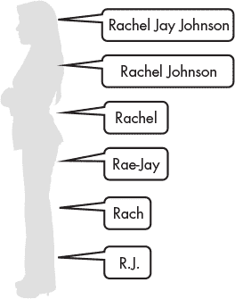

## 第十章：**变量**


变量是初学编程者需要理解的最重要概念之一，因此本章详细探讨了这些特性。从技术角度讲，变量是一个用来存储值的保留内存位置。它是指向内存中对象的引用或*指针*，但它本身不是对象。变量让你能够访问和操作每个对象的相关元数据（*属性*）和功能（*方法*）。

在上一章，你学习了如何赋值给变量。在这一章，你将进一步了解赋值语句，学习如何清晰地命名变量，使用内建函数获取用户输入，并练习比较一个变量和另一个变量。

### **变量具有标识**

Python 将数据和操作这些数据的函数封装到被称为*对象*的命名实体中。作为语言的基本构建块，Python 中的一切都是对象，每个对象都有一个*标识*（内存地址）、*类型*和*值*。数字 42 是一个对象，句子“Hello, world!”也是一个对象。对象的标识和类型永远不会改变，但它的值有时是可以改变的。

变量可以被看作是对象的标签。就像你可以有多个名字和昵称（图 8-1），Python 中的一个对象也可以通过多个变量进行引用。



*图 8-1：我们可以有多个名字；Python 中的对象也是如此。*

当你使用赋值语句，比如 `x = 5`，变量 `x` 会被初始化为引用等号右侧的对象。它还会被赋予一个作为标识的整数。这个数字对于所有现有对象都是唯一的。你可以通过 Python 内建的 `id()` 函数查看这个数字。注意，你在电脑上看到的 ID 号码可能与你看到的不同。

```py
In [1]: x = 5

In [2]: id(x)
Out[2]: 140718638636928
```

你可以通过赋予一个新值来覆盖一个变量：

```py
In [3]: x = 15

In [4]: id(x)
Out[4]: 140718638637248
```

重新赋值后的 `x` 现在有了新的标识。在第一个例子中，变量 `x` 是对一个值为 `5` 的整数对象的引用。当你用新值 `15` 覆盖 `x` 时，旧对象继续存在，但如果没有其他变量引用它，它的*引用计数*将归零。此时，它将进入*垃圾回收*过程，Python 会定期回收不再使用的内存块。在一些其他语言中，你必须手动指定并释放内存分配。而 Python 能够自动管理内存并“清理自己的垃圾”，这使得它成为一个非常友好的语言！

因为变量只是引用，所以多个变量可以指向同一个对象：

```py
In [5]: x = 42

In [6]: id(x)
Out[6]: 140718638638112

In [7]: y = x

In [8]: y
Out[8]: 42

In [9]: id(y)
Out[9]: 140718638638112
```

通过在 `In [7]` 行将 `x` 赋值给 `y`，两个变量现在都引用同一个对象，这从它们具有相同标识可以看出。这种内存高效的行为叫做*别名*。

如果你覆盖了`x`，它的身份会改变，但`y`仍然指向“旧”对象：

```py
In [10]: x = 50

In [11]: id(x)
Out[11]: 140718638638368

In [12]: y
Out[12]: 42

In [13]: id(y)
Out[13]: 140718638638112
```

结果是，旧对象的引用计数大于一，因此它不会在垃圾回收时被删除，并且会保留供你在表达式、函数等中使用。

### **赋值变量**

给变量赋值在 Python 中被称为*绑定*。除了直接使用“x = y”方法赋值外，你还可以使用表达式、操作符重载、函数等进行赋值。基本上，既可以赋值给变量值，也可以赋值给返回值的东西。

#### ***使用表达式***

表达式的结果可以赋值给一个变量：

```py
In [14]: x = 6 * 7

In [15]: x
Out[15]: 42
```

#### ***操作符重载***

同样，你可以在赋值变量时使用操作符重载。正如前一章所讨论的，操作符重载是指操作符能够以不同的方式与不同的数据类型一起工作。经典的例子是使用`+`号既用于加法运算*也*用于字符串连接。

操作符重载直接作用于字符串或其他变量。这里，我们与字符串一起使用它：

```py
In [16]: name = 'Hari ' + 'Seldon'

In [17]: print(name)
Hari Seldon
```

这里是使用变量的示例：

```py
In [18]: first_name = 'Hari'

In [19]: surname = 'Seldon'

In [20]: full_name = first_name + ' ' + surname

In [21]: print(full_name)
Hari Seldon
```

在`In [20]`这一行，注意我在名称之间添加了空格。没有它，输出将会是`HariSeldon`。

这是另一个操作符重载的例子：

```py
In [22]: repeat_name = (full_name + ' ') * 5

In [23]: print(repeat_name)
Hari Seldon Hari Seldon Hari Seldon Hari Seldon Hari Seldon
```

注意你可以使用操作符的优先级来控制顺序。要查看效果，可以再次运行`In [22]`，*去掉*括号并打印结果。

#### ***使用函数***

尽管我们尚未讲解它们，你可以在赋值语句中使用函数。在这里，我们将使用内建的`count()`字符串方法与赋值语句结合：

```py
In [24]: number_of_y_in_python = 'Python'.count('y')

In [25]: number_of_y_in_python
Out[25]: 1
```

在这种情况下，`count()`方法返回了值`1`，然后将其存储在变量中。

#### ***链式赋值与内存驻留***

你可以通过*链式赋值*同时将相同的值赋给多个变量：

```py
In [26]: answer_to_life = answer_to_the_universe = answer_to_everything = 42
```

有趣的是，Python 并不会为这些变量创建新的对象；它们都共享相同的身份：

```py
In [27]: id(answer_to_life)
Out[27]: 140718641390624

In [28]: id(answer_to_the_universe)
Out[28]: 140718641390624

In [29]: id(answer_to_everything)
Out[29]: 140718641390624
```

为了提高处理速度，Python 在启动时会创建一个小型的内存地址缓存。它会为一些小整数值（`-5`到`256`）使用这些缓存中的地址。将引用用于等价对象副本的编程实践被称为*内存驻留*。不在缓存中的较大值将会得到新的地址。例如：

```py
In [30]: big_var1 = 5**9

In [31]: big_var2 = 5**9

In [32]: id(big_var1)
Out[32]: 2642973757040

In [33]: id(big_var2)
Out[33]: 2642973756016
```

一些字符串也会被 Python 自动驻留，以优化性能。当 Python 代码被编译时，诸如变量名、函数名和类名这样的标识符会被驻留。其他字符串也可能被驻留。Python 会基于代码逐行地自动决定是否驻留。

字符串驻留的一个优点是，当你比较两个变量时，Python 可以比较*内存地址*。这比逐个字符比较字符串要快。

通常，Python 默认的字符串驻留机制已经足够，但你不应依赖它。如果你需要*确保*字符串被驻留，可以导入系统模块（`import sys`），并使用 `sys.intern()` 方法，将字符串放在括号内（请参阅 *[`docs.python.org/3/library/sys.html`](https://docs.python.org/3/library/sys.html)*）。

#### ***使用 f-Strings***

你可以在变量中使用 f-strings（请参阅第 192 页的“字符串格式化”部分）。只需在赋值前加上 `f`，然后是一个单引号或双引号。将你想要使用的变量放入大括号中，然后添加结束引号。以下是一个示例：

```py
In [34]: first_component = 'hydrogen'

In [35]: second_component = 'sulfide'

In [36]: compound = f'{first_component} {second_component}'

In [37]: print(compound)
hydrogen sulfide
```

你甚至可以在赋值语句中格式化字符串。例如：

```py
In [38]: compound = f'{first_component.title()} {second_component.title()}'

In [39]: print(compound)
Hydrogen Sulfide
```

在这种情况下，我们在大括号中的每个变量上调用了 `title()` 字符串方法。此方法将单词的第一个字母大写，并将剩余字母转换为小写。

### **命名变量**

程序被读取的频率远高于编写的频率。你的代码应该尽可能易于阅读，不仅是为了其他用户，也为了你自己。很多时候，我们会回到几个月前编写的程序，根本不记得它是如何工作的。

有句常见的话说“代码应该是自文档化的。”这意味着读者应该能够理解你的代码，而不依赖解释性注释。为了让代码“自文档化”，你需要特别注意变量命名。这包括确保你的名字合法，并尽可能地使它们逻辑清晰、简洁。

命名变量时有三条主要规则：

+   变量只能包含字母、数字或下划线 (`_`)

+   第一个字符不能是数字

+   变量名不能是*保留关键字*

#### ***保留关键字***

Python 为其自身保留了一组关键字（表 8-1）。你不能将这些作为变量名、函数名或其他标识符。

**表 8-1:** Python 的保留关键字

| **关键字** | **描述** |
| --- | --- |
| `and` | 逻辑运算符 |
| `as` | 用于给导入的模块或工具起别名 |
| `assert` | 用于调试 |
| `async` | 用于定义异步函数 |
| `await` | 指定在异步函数中将控制权交回事件循环的点 |
| `break` | 跳出循环 |
| `class` | 用于定义面向对象编程中的类 |
| `continue` | 继续到下一次循环迭代 |
| `def` | 定义一个函数 |
| `del` | 删除一个对象 |
| `elif` | Else-if 条件语句 |
| `else` | 条件语句 |
| `except` | 处理异常的指令 |
| `False` | 布尔值 |
| `finally` | 用于一个代码块，无论是否有异常都会执行 |
| `for` | 创建一个 for 循环 |
| `from` | 导入模块的特定部分 |
| `global` | 声明一个全局变量 |
| `if` | 条件语句 |
| `import` | 加载模块 |
| `in` | 检查某个值是否存在 |
| `is` | 测试两个变量是否相等 |
| `lambda` | 动态创建匿名函数 |
| `None` | 空值 |
| `nonlocal` | 声明一个非本地变量 |
| `not` | 逻辑运算符 |
| `or` | 逻辑运算符 |
| `pass` | 什么都不做的语句 |
| `raise` | 抛出一个异常 |
| `return` | 退出函数并返回一个或多个值 |
| `True` | 布尔值 |
| `try` | 创建 try/except 语句 |
| `while` | 创建一个 while 循环 |
| `with` | 简化异常处理；加载文件后自动关闭 |
| `yield` | 挂起一个生成器函数并返回一个值 |

你不需要记住所有的关键字；如果你尝试将其中一个作为变量名，Python 会抛出 `SyntaxError` 错误。如果你试图将值 `5` 赋给 `pass` 关键字，结果会发生如下情况：

```py
In [40]: pass = 5
File "<ipython-input-40-85539e45a032>", line 1
pass = 5
^
SyntaxError: invalid syntax
```

你还可以通过 Python 查看关键字列表。只需运行 `import keyword` 然后执行 `keyword.kwlist`。

除了关键字外，你还应该避免使用 Python 内置函数的名称作为变量名，比如 `print()` 或 `id()`。然而，这并不会阻止你这么做。例如：

```py
In [41]: print = 5

In [42]: print
Out[42]: 5
```

你会后悔这么做，因为 `print` 现在指向整数 `5`。如果你尝试使用 `print()` 函数，Python 会抛出错误：

```py
In [43]: print("Hello, World!")
Traceback (most recent call last):

File "<ipython-input-43-2223c92d0779>", line 1, in <module>
print(print)

TypeError: 'int' object is not callable
```

为了解决这个问题，你需要使用 `del(print)` 删除 `print` 变量。这样会恢复 `print()` 函数并使其重新生效。

许多这些函数名称是你可能会想使用的，比如 `min`、`max`、`sorted`、`list`、`set`、`slice` 和 `sum`。我们将在第十一章中查看这些内置函数及其用途。与此同时，你只需要在命名变量时保持警觉。Spyder 中的控制台和文本编辑器会用独特的颜色高亮这些特殊名称。我无法在黑白书籍中展示这一点，但你可以通过在控制台中输入以下代码来亲自查看：

```py
In [44]: spam = 42

In [45]: list
```

`spam` 变量应该与 `list` 变量不同颜色，因为 `list` 是一个内置函数的名称。如果在你的控制台中，`list` 是紫色的，避免为变量使用紫色名称。

**注意**

*如果你坚持使用保留关键字或内置函数名称，你可以通过在变量名后加下划线来避免冲突，例如 sum_、max_ 或 class_。更好的做法是，在下划线后添加描述符，例如 max_pressure。大家都能受益！*

#### ***变量区分大小写***

Python 是一种区分大小写的编程语言。你不仅需要正确拼写变量名以访问它们，还必须保持大写和小写字母的正确排列。例如：

```py
In [46]: declination = 80

In [47]: print(declination)
80

In [48]: print(Declination)
Traceback (most recent call last):

File "<ipython-input-48-d1839757958b>", line 1, in <module>
print(Declination)

NameError: name 'Declination' is not defined
```

Python 不识别 `Declination` 变量，因为第一个字母大写，结果抛出了 `NameError` 错误。

#### ***命名变量的最佳实践***

以下是一些确保你的变量名符合 Python 风格的建议。你还可以在 Python 的 PEP8 风格指南中找到关于命名约定的章节，地址是 *[`pep8.org/#naming-conventions/`](https://pep8.org/#naming-conventions/)*。

你应该使用下划线 (`_`) 来分隔变量名中的单词。例如：

```py
In [49]: the_answer_to_life_the_universe_and_everything = 42
```

在大多数情况下，你应该使用*小写*字母，并将大写字母保留给特殊对象，例如*常量*。常量是指在程序执行过程中不应该改变的值，你可以通过使用全大写来告知其他人某个变量表示的是常量。例如，赋值光速常量时，你可以使用如下命名：

```py
In [50]: SPEED_OF_LIGHT = 299_792_458
```

Python 中的常量有一个*上下文*意义，但这一点并不会被 Python 解释器强制执行。使用全大写字母来命名常量只是为了提醒其他程序员你的意图。否则，常量仍然可以像其他变量一样被覆盖。

变量名应该是合乎逻辑的并且具描述性，但尽量使用尽可能少的字符来实现这一目标。长变量名不仅难以输入，还可能导致代码行换行，从而使代码变得难以阅读。

这是一个过于清晰的命名示例：

```py
In [51]: distance_from_earth_to_the_sun_in_kilometers = 149_597_870
```

你可以通过几种方式缩短这个名字，例如：

```py
In [52]: earth_sun_distance_km = 149_597_870
```

或者：

```py
In [53]: earth_to_sun_km = 149_597_870
```

你也可以在*不可执行的注释*中包含重要信息，如单位。这些注释有助于你保持变量名的控制。我们将在第十四章讨论注释，但这里有一个内联注释的例子：

```py
In [54]: SPEED_OF_LIGHT = 299_792_458  # Meters per second in a vacuum.
```

Python 会忽略 `#` 符号之后的所有文本，但阅读你代码的程序员可以从注释中获取比变量名所传达的信息更多的内容。

命名变量是一个优化练习。你会惊讶于自己能够多频繁地回到程序中并改进变量名。然而，你应该避免过度优化，因为很容易走向极端。如果你习惯使用英制单位，`mps` 可能对你来说意味着“每秒英里数”，但对大多数人来说，它意味着“每秒米数”。

同样，避免使用以数字后缀结尾的变量名，如 `step1` 或 `step2`。这些名字没有意义，而且如果你增加或删除一个步骤，你需要重构整个程序。最好使用描述性更强的名字，像是 `denoised_image` 或 `kalman_filtered`。此外，永远不要在变量名中使用 `final`。这会惹怒神灵，你肯定在`final`之后还需要一个新的变量。

你还应该避免使用字符“l”（小写字母 L）、“O”（大写字母 O）或“I”（大写字母 I）作为单字符变量名。这些字符容易与数字 1 和 0 混淆。事实上，你应该完全避免使用单字符变量名，除非该字母是常见且广为人知的，例如使用 `x` 和 `y` 作为笛卡尔坐标值。在进行简单的教程练习时，像我们这里使用的那样使用简短的名字也是可以接受的。

#### ***管理动态类型问题***

在上一章，我们讨论了 Python 是一种动态类型语言，这意味着 Python 可以根据上下文分配数据类型，并且变量没有固定类型。这可能导致代码复杂且难以调试，因为一个名为 `x` 的变量在程序中的不同位置可能代表整数、字符串甚至函数。

管理这个问题的一种方法是在变量更改数据类型时更改变量名。对比以下代码：

```py
In [55]: x = '42'

In [56]: x = int(x)

In [57]: x = float(x)
In [58]: type(x)

Out[58]: float
```

使用以下代码：

```py
In [59]: x_string = '42'

In [60]: x_integer = int(x_string)

In [61]: x_float = float(x_integer)

In [62]: type(x_float)
Out[62]: float
```

在这两个例子中，`x` 变量最开始是字符串类型，最终变成了浮点数。然而，第二个例子中的小心且周到的命名实践帮助你跟踪程序的运行，即使程序有很多分支和循环，赋值语句之间相隔很远。

**注意**

*通过 Spyder 可以使用的 Linters，比如 Pylint ([`pylint.pycqa.org/`](https://pylint.pycqa.org/))，会在你将变量重新赋值为不同类型时提醒你。*

没有必要重新使用变量名，因为每次赋值都会创建一个新对象。你不需要像前面的例子那样明确包含数据类型在变量名中。重要的是，当你更改数据类型时，应该更改变量名。

#### ***处理无关紧要的变量***

作为占位符的变量通常使用单个小写字母命名，通常是“i”。这里是一个使用 `for` 循环的例子（我们在第十章中讨论过）：

```py
In [63]: for i in 'Python':
    ...:      print(i)
P
y
t
h
o
n
```

记得在执行 `print(i)` 代码后按 SHIFT-ENTER 以在 Qt 控制台中执行代码。

虽然从技术上讲，这个策略没有错，但检查你代码是否符合 PEP8 标准的 linters（比如我们在第四章中讨论过）会把 `i` 标记为“未使用的变量”。虽然你可以忽略这个，但它会让人感到烦躁。

为了避免违反编码标准，你可以使用下划线作为占位符变量名，例如以下示例：

```py
In [64]: for _ in 'Python':
    ...:      print(_)
P
y
t
h
o
n
```

这将让 linters 安静并保持愉快。

**测试你的知识**

1.  哪些变量名是有效的？

a.  _steve

b.  br549

c.  light-speed

d.  O579

2.  推荐使用哪种命名风格来命名常量？

a.  GravConstant

b.  GRAV_CONSTANT

c.  GRAV_constant

d.  grav_constant

3.  什么时候应该使用单个下划线作为变量名？

a.  当你想使用保留关键字时

b.  当你想保持变量的私密性时

c.  当你需要一个占位符用于迭代时

d.  当你想不出一个好名字时

4. 当你改变一个变量的数据类型时，你应该 ___________ 。

5. 创建一个新变量并删除它。

### **获取用户输入**

到目前为止，*我们*一直在将值赋给变量。在很多情况下，你可能希望直接从用户那里获取输入；例如，用于单位转换程序。由于这种做法非常常见，Python 提供了内建的

`input()` 函数。它的工作原理如下：

```py
In [65]: first_name = input('Enter your first name: ')

Enter your first name: Robert

In [66]: first_name
Out[66]: 'Robert'
```

`input()` 函数接收一个问题，称为 *提示*，并将其呈现给用户。这个提示应该尽可能清晰，以便用户知道该输入什么（以及什么格式）。然后，函数会暂停程序，直到用户输入一个值。由于函数期望输入的是字符串，所以你不需要为输入加上引号。

`input()` 函数返回一个 *字符串*，这意味着数字可能需要根据程序对输入的处理方式转换为整数或浮动数。为了进行转换，可以在赋值语句中调用 `int()` 或 `float()` 函数。例如，为了确保 `age` 变量是一个整数，可以输入以下内容：

```py
In [67]: age = int(input('Enter your age in years: '))

Enter your age in years: 42

In [68]: type(age)
Out[68]: int
```

你可能还希望输入保持一致性。由于 Python 区分大小写，通常会将输入转换为小写字母，以避免后续出现问题。在控制台中输入以下内容：

```py
In [69]: name = input('Enter your full name: ').lower()

Enter your full name: Chesterfield Walkingstick

In [70]: print(name)
chesterfield walkingstick
```

在这个例子中，我们调用了 `lower()` 字符串方法来自动将输入转换为小写。

**注意**

*当你的程序与实际用户互动时，如果有什么可能出错，它就会出错。没有任何东西能阻止用户将年龄输入为“forty-two”而不是“42”。幸运的是，Python 提供了像 while 循环、try 语句和条件语句等功能，允许你检查输入错误，并可以直接修复问题或要求用户重新输入符合期望格式的值。我们将在后续章节中探讨这些内容。*

`input()` 函数是一种比较原始的获取用户输入的方式。在本书的后面，我们将探讨一些更复杂的方法，例如使用带菜单、单选按钮、文本框等的图形用户界面（GUI）。

### **使用比较运算符**

Python 提供了 *比较* 运算符，也叫做 *关系* 运算符（参见 表 8-2），它允许你比较变量并确定它们之间的关系。每个运算符都会返回 `True` 或 `False`。

**表 8-2:** Python 关系运算符

| **运算符** | **描述** | **示例** |
| --- | --- | --- |
| `==` | 如果值相等，则条件为 True | `(a == a) 为 True` |
| `!=` | 如果值不相等，则条件为 True | `(a != b) 为 True` |
| `<>` | 如果值不相等，则条件为 True | `(a <> b) 为 True` |
| `>` | 如果左侧大于右侧，则为 True | `(2 > 6) 为 False` |
| `<` | 如果左侧小于右侧，则为 True | `(2 < 6) 为 True` |
| `>=` | 如果左侧大于或等于右侧，则为 True | `(2 >= 6) 为 False` |
| `<=` | 如果左侧小于或等于右侧，则为 True | `(2 <= 6) 为 True` |
| `is` | 对象身份 | `(a is a) 为 True` |
| `is not` | 否定对象身份 | `(a is not b) 为 True` |

运算符从左到右进行评估。例如，要检查 10 是否大于 2：

```py
In [71]: 10 > 2
Out[71]: True
```

比较运算符评估为 *布尔* 数据类型，具有两个值：`True` 和 `False`。这两个值总是大写的，与字符串不同，它们不需要引号。你可以像检查任何其他值一样检查它们的类型：

```py
In [72]: type(False)
Out[72]: bool
```

因为计算机以二进制方式工作，`True` 代表 `1`（或 `1.0`），而 `False` 代表 `0`（或 `0.0`）。你可以在控制台中测试这一点，如下所示：

```py
In [73]: a = True
In [74]: int(a)
Out[74]: 1

In [75]: b = False

In [76]: float(b)
Out[76]: 0.0
```

正如你从这个例子中看到的，你可以将布尔值存储在变量中，使用它们进行表达式运算，并将它们转换为整数和浮点数而不会引发异常。

前两个运算符都用于评估相等性，适用于任何数据类型：

```py
In [77]: 42 == 42
Out[77]: True

In [78]: 'Steve' != 'Steve'
Out[78]: False
```

其他运算符，如 `>` 和 `<=`，仅与浮点数值和整数一起使用。为了方便，你可以将这些运算符链式连接在一行中，例如 `2 < x < 5`，这表示 `x` 大于 `2` 且小于 `5`。

你可以使用这些关系来控制程序的行为。这里有一个使用条件语句的示例，我们将在第十章中研究。此示例比较了三种样本的 pH 值，以确定哪个是最酸的：

```py
In [79]: sample1_pH = 1.6

In [80]: sample2_pH = 6.0

In [81]: sample3_pH = 7.8

In [82]: if sample1_pH <= sample2_pH:
   ...:       print('Sample 1 is more acidic.')
   ...:  else:
   ...:       print('Sample 2 is more acidic.')
Sample 1 is more acidic.
```

在前面的示例中，关系运算符决定了打印哪个语句。你还可以将多个变量的比较链式连接在一起，如下所示：

```py
In [83]: sample1_pH < sample2_pH < sample3_pH
Out[83]: True
```

`is` 和 `is not` 运算符检查两个对象是否具有相同的身份（换句话说，是否指向内存中的同一个对象）。这与等于运算符（`==`）和不等于运算符（`!=`）不同，后者检查的是*相等性*。我们来看一个例子：

```py
In [84]: x = 1_000_000

In [85]: y = 1_000_000

In [86]: x == y
Out[86]: True

In [87]: x is y
Out[87]: False
```

因为我们为 `x` 和 `y` 分配了一个大数字，它们的值相等，但不是同一个对象。然而，如果我们使用较小的值，它们将是同一个对象，这是由于 Python 使用了启动内存缓存，正如在《链式赋值与驻留机制》一节中第 205 页讨论的那样。例如：

```py
In [88]: a = 256

In [89]: b = 256

In [90]: a is b
Out[90]: True
```

**测试你的知识**

6.  如果 `x = 257` 且 `y = 257`，`x is y` 代码的结果是什么？

a.  True

b.  False

7.  编写一个代码片段，提示用户输入他们的名字，然后打印出反向的名字。

8.  编写一个赋值语句，生成 `NameError`。

9.  编写一个赋值语句，生成 `TypeError`。

10.  在控制台中，`'hydrogen sulfide'.title()` 的输出是什么？

a.  `'Hydrogen Sulfide'`

b.  `'HYDROGEN SULFIDE'`

c.  `AttributeError: 'str' 对象没有 'title' 属性`

d.  `NameError: name 'title' is not defined`

### **总结**

在这一章中，你更深入地了解了变量的工作原理以及如何使用它们。你学习了更多关于变量赋值的知识，以及一些命名规则和建议，如何比较变量并获取用户输入。

因为变量只是内存中对象的标签，它们有时会表现得出乎意料，尤其是在处理可变对象时。在下一章中，我们将探讨容器数据类型，如列表、集合和字典，这一点会变得更加明显。
