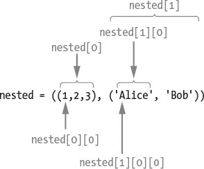
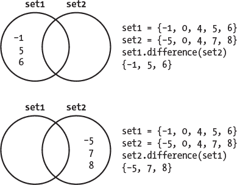
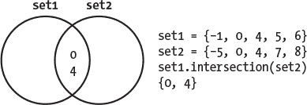
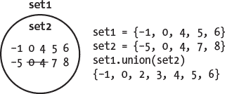
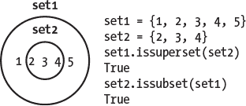

## 第十一章：**容器数据类型**


根据*梅里亚姆-韦伯斯特*词典，*数据*是复数形式。如果你在处理数据，那么你实际上是在处理*集合*，例如班级中的学生姓名或星系中恒星的光度。你需要某个地方来存储所有这些集合。这就是像元组、列表、集合和字典等容器数据类型派上用场的地方。它们每种都有特定的用途和功能。它们将帮助你将老鼠、基因、土壤样本和温度测量等内容保持有序和受控。

在本章中，我们将探讨表 9-1 中列出的内建数据结构，并介绍它们的一些主要特性。记住，*可变性*指的是对象创建后是否可以被修改（变异）。不可变对象必须被复制到新对象中，才能改变其值、追加或移除内容。

**表 9-1：** 容器数据类型

| **类别** | **数据类型** | **可变性** | **特点** | **示例** |
| --- | --- | --- | --- | --- |
| 序列类型 | 元组 | 不可变 | 快速、高效且不可更改 | `(2, 5,` `'``Pluto``'``, 4.56)` |
| 序列类型 | 列表 | 可变 | 灵活，拥有许多内建函数 | `[2, 5,` `'``Pluto``'``, 4.56]` |
| 集合类型 | 集合 | 可变 | 无重复元素，快速查找 | `{2, 5,` `'``Pluto``'``, 4.56}` |
| 集合类型 | 冻结集合 | 不可变 | 无重复元素，快速查找 | `frozenset({2, 5,` `'``Pluto``'``, 4.56})` |
| 映射类型 | 字典 | 可变 | 将唯一的键映射到值 | `{``'``key``'``:` `'``value``'``}` |

让我们从最简单的元组开始。

### **元组**

*元组*（发音为*TOO-pul*）是一个固定长度、可迭代、不可变、有序的值序列。这些值通常被称为*项*或*元素*。以下是一个元组的例子，其中每个名字代表一个项：

('`K. L. Putney`', '`M. B. Clark`', '`S. B. Vaughan`')

**注意**

*可迭代对象是可以循环遍历的项集合，例如字符串、元组、列表和集合。序列是一个按位置排序的项集合，作为单一存储单元。*

元组与字符串非常相似，但字符串只能包含字符，而元组是异质的，可以包含任何类型的值，包括不同类型的混合体。你甚至可以创建元组的元组。

元组的使用频率低于*列表*数据类型，而且对它们有效的方法较少。但正如古话所说，“马有马路，车有车道。”在某些情况下，元组比其他容器类型更为适用。

例如，由于元组是不可变的，它们非常适合存储像密码这样的对象。当你使用元组时，其他程序员会理解你不希望这些值发生变化。由于元组的不可变性，它们比列表更加节省内存，元组的操作也较小，因此在处理大量元素时，元组的速度稍微更快。

#### ***创建元组***

元组由一系列用逗号分隔的值组成，这些值被括号包围。但 Python 很智能，就像它能根据上下文识别不同的数据类型（如浮动数和整数）一样，你在创建元组时也可以打破规则，省略括号：

```py
In [1]: tup = 1, 2, 3

In [2]: tup
Out[2]: (1, 2, 3)
```

然而，大多数时候，你会希望包含括号，这样既能提高代码的可读性，又能在使用更复杂的代码（例如嵌套元组，即元组中存储元组）时保持一致：

```py
In [3]: nested = (1, 2, 3), ('Alice', 'Bob')

In [4]: nested
Out[4]: ((1, 2, 3), ('Alice', 'Bob'))
```

由于元组可以包含单个值，因此使用逗号分隔值比使用括号更为重要。为了了解原因，在控制台中输入以下内容并检查对象的类型：

```py
In [5]: what_am_I = (1)
In [6]: type(what_am_I)
Out[6]: int
```

在这种情况下，Python 认为你刚输入了一个带括号的整数！现在，添加一个结尾逗号：

```py
In [7]: what_am_I = (1,)

In [8]: type(what_am_I)
Out[8]: tuple
```

需要记住的是，单项元组需要一个结尾的逗号。

#### ***将其他类型转换为元组***

你还可以通过使用内置的`tuple()`函数将其他数据类型转换为元组。在控制台中输入以下内容：

```py
In [9]: x = tuple('Hello, World!')

In [10]: x
Out[10]: ('H', 'e', 'l', 'l', 'o', ',', ' ', 'W', 'o', 'r', 'l', 'd', '!')
```

这个代码片段将字符串`Hello, World!`转换为元组。请注意，字符串中的每个字符现在都是元组中的一个单独元素。

**注意**

*由于“tuple”是一个函数名称，你不应将其用作变量名。*

你也可以使用`tuple()`将一个列表（由方括号`[]`表示）转换为元组，如下所示：

```py
In [11]: planet_list = ['Venus', 'Earth', 'Mars']

In [12]: planet_tup = tuple(planet_list)

In [13]: planet_tup
Out[13]: ('Venus', 'Earth', 'Mars')
```

在这种情况下，字符串被保留为单独的单词，因为每个字符串都是列表中的一个单独项。

#### ***使用元组***

元组可以像字符串一样被索引和切片（参见第七章）。由于元组是不可变的，无法修改，因此它们没有许多内置方法。然而，在使用元组时，你可以利用 Python 标准库中的通用内置函数以增加其实用性。这些函数和方法的一些示例列在表 9-2 中。你应当将斜体中的虚拟变量和数值替换为实际的变量和数值名称。

**表 9-2：** 有用的内置函数和元组方法

| **函数** | **描述** | **示例** |
| --- | --- | --- |
| `tuple()` | 将序列转换为元组 | `tuple(`seq_name`)` |
| `len()` | 返回序列的长度 | `len(`tuple_name`)` |
| `min()` | 返回具有最小值的序列项 | `min(`tuple_name`)` |
| `max()` | 返回具有最大值的序列项 | `max(`tuple_name`)` |
| **方法** | **描述** | **示例** |
| `count()` | 返回指定值的出现次数 | tuple_name.`count(`value`)` |
| `index()` | 返回指定值的位置 | tuple_name.`index(`value`)` |

注意，元组*方法*是在元组名称后使用点表示法调用的，例如 tuple_name`.count(value)`。你在前一节中已经看过`tuple()`的用法，所以让我们先看看`len()`。

##### **获取元组的长度**

创建元组后，它的长度是固定的。你可以使用内置的`len()`函数来找到这个长度。让我们使用之前创建的元组来看看它是如何工作的：

```py
In [14]: len(tup)
Out[14]: 3

In [15]: len(nested)
Out[15]: 2
```

第一个结果`3`是直观的，因为`tup`中有三个项目。但嵌套元组的长度只有`2`，尽管明显有五个项目存在。

为了理解发生了什么，让我们使用索引来查看每个元组中的第一个项目：

```py
In [16]: tup[0]
Out[16]: 1

In [17]: nested[0]
Out[17]: (1, 2, 3)
```

括号内的值被视为元组中整体序列中的*单个项目*。如果你需要访问一个项目*内部*的值，可以再添加一个索引。例如，要查看每个嵌套项目中的第一个元素，输入以下内容：

```py
In [18]: nested[0][0]
Out[18]: 1

In [19]: nested[1][0]
Out[19]: 'Alice' 

In [20]: nested[1][0][0]
Out[20]: 'A'
```

如图 9-1 所示。由于第二个嵌套元组中的项目是字符串（`'``Alice``'`，`'``Bob``'`），而这些字符串又由元素（字母）组成，你需要索引到三层才能访问`nested[1]`中的所有元素。第一个索引获取嵌套元组，第二个索引获取嵌套元组中的字符串，第三个索引获取字符串中的字符。



*图 9-1：索引嵌套元组的示例*

理解这种行为很重要，万一你想迭代一个元组，逐一获取它的值时（我们还没有讲解循环，所以请耐心等待）。对于非嵌套元组，这是直接的：

```py
In [21]: for i in tup:
    ...:      print(i * 10)
10
20
30
```

对于嵌套元组，你需要遍历每个嵌套元组中的元素，以便访问所有项目：

```py
In [22]: for item in nested:
    ...:      for element in item:
    ...:           print(element * 5)
5
10
15
AliceAliceAliceAliceAlice
BobBobBobBobBob
```

“项目”和“元素”这两个术语没有特殊含义。你完全可以把它们称为“i”和“j”或者“Fred”和“George”。

##### **获取元组的最小值和最大值**

`min()`和`max()`函数分别返回元组中的最小值和最大值。以下是一个示例：

```py
In [23]: min(tup)
Out[23]: 1

In [24]: max(tup)
Out[24]: 3
```

这很简单，但如果我们尝试在嵌套元组上进行操作呢？让我们看看会发生什么：

```py
In [25]: min(nested)
Traceback (most recent call last):

File ″C:\Users\hanna\AppData\Local\Temp/ipykernel_25576/1378168620.py″, line 1, in <module>
min(nested)

TypeError: '<' not supported between instances of 'str' and 'int'
```

Python 抛出一个`TypeError`错误，因为它不知道如何区分最小字符串和最小整数。然而，你可以在字符串元组中找到最小值。看看这个：

```py
In [26]: test = ('c', 'bob', 'z')

In [27]: min(test)
Out[27]: 'bob'

In [28]: test = ('a', 'A')

In [29]: min(test)
Out[29]: 'A'
```

`min()`和`max()`函数使用 ASCII 排序顺序来排序字符串。在 ASCII 表中（见* [`www.asciitable.com/`](https://www.asciitable.com/)*），特殊字符（如标点符号）排在字母之前，大写字母排在小写字母之前。

许多其他内置函数可以处理多种数据类型。例如，`len()`函数适用于字符串、元组、集合、列表和字典。在第七章中学过的成员操作符也适用于多种类型。这里是一个示例：

```py
In [30]: elements = 'carbon', 'calcium', 'oxygen'

In [31]: 'carbon' in elements
Out[31]: True
```

##### **拆解元组**

你可以使用一种叫做*解包*的过程将元组中的值一次性赋给多个变量。假设你编写了一个返回笛卡尔坐标（x，y）对的函数，并希望在程序的后续部分使用单独的 x 和 y 值。以下是你可以获取这些值的方法：

```py
In [32]: coordinates = (45, 160)

In [33]: x, y = coordinates In [34]: x
Out[34]: 45

In [35]: y
Out[35]: 160
```

要使用嵌套元组，可以使用相同的括号结构来赋值变量。让我们重新审视我们的 `nested` 元组：

```py
In [36]: nested = (1, 2, 3), ('Alice', 'Bob'), 549

In [37]: (a, b, c), (d, e), f = nested

In [38]: a
Out[38]: 1

In [39]: e
Out[39]: 'Bob'
```

你不需要获取所有的元素。假设你只想获取嵌套元组中的前三个数字。如果直接尝试获取，它将引发一个异常：

```py
In [40]: (a, b, c) = nested
Traceback (most recent call last):

File ″C:\Users\hanna\AppData\Local\Temp/ipykernel_25576/3799313898.py″, line 1, in <module>
(a, b, c) = nested

ValueError: not enough values to unpack (expected 3, got 2)
```

Python 期望你解包元组中的每个项目。为了绕过这个问题，你可以使用 *splat*（或 *star*）运算符（`*`）结合无关的变量符号（`_`）来解包元组。Splat 允许任意数量的项，所以在这种情况下，你告诉 Python “获取其余部分”并将它们赋值给 `_`：

```py
In [41]: (a, b, c), *_ = nested

In [42]: a
Out[42]: 1

In [43]: b
Out[43]: 2

In [44]: c
Out[44]: 3

In [45]: _
Out[45]: [('Alice', 'Bob'), 549]
```

你不需要使用 `_` 中的值。这些值将在 Python 执行常规垃圾回收时被清除出内存。

##### **元组的运算符重载**

你可以像操作字符串一样在元组上使用运算符重载。例如，将两个元组相加会产生一个新元组，包含两个元组的所有值：

```py
In [46]: tup1 = 1, 2, 3

In [47]: tup2 = 4, 5, 6

In [48]: tup3 = tup1 + tup2

In [49]: tup3
Out[49]: (1, 2, 3, 4, 5, 6)
```

使用乘法运算符与整数结合时，会将元组的多个副本与它们所包含的对象引用的副本连接在一起：

```py
In [50]: tup1 * 3
Out[50]: (1, 2, 3, 1, 2, 3, 1, 2, 3)
```

##### **意外的元组行为**

元组不可变的规则存在漏洞。例如，如果元组包含一个*可变*数据类型，你可以在元组内更改该项。让我们通过使用一个可变列表来尝试（列表用方括号括起来；我们将在下一部分进一步了解列表）：

```py
In [51]: tup_with_list = (1, 2, ['Alice', 'Bob'], 3)

In [52]: tup_with_list
Out[52]: (1, 2, ['Alice', 'Bob'], 3)

In [53]: tup_with_list[2][1] = 'Steve'

In [54]: tup_with_list
Out[54]: (1, 2, ['Alice', 'Steve'], 3)
```

在这个例子中，我们能够将列表中的第二项（`[2][1]`）从 `Bob` 更改为 `Steve`，即使元组是不可变的。这属于你*可以*做的事情，但*不应该*做的事情！

##### **打印元组**

在元组上运行 `print()` 可能会令人沮丧，因为默认显示包含了逗号和引号：

```py
In [55]: names = 'Harry', 'Ron', 'Hermione'

In [56]: print(names)
('Harry', 'Ron', 'Hermione')
```

为了解决这个问题，你可以使用 `join()` 字符串方法来只打印元组中的字符串：

```py
In [57]: print(' '.join(names))
Harry Ron Hermione
```

在这个例子中，我们使用空格（`' '`）将元组中的每个项连接起来。你也可以使用其他字符来连接项，例如换行符转义序列（`\n`）：

```py
In [58]: print('\n'.join(names))
Harry
Ron
Hermione
```

`join()` 方法仅适用于由字符串组成的序列。要处理混合数据类型，请包含内建函数 `map()`：

```py
In [59]: tup = 'Steve', 5, 'a', 5

In [60]: print(' '.join(map(str, tup)))
Steve 5 a 5
```

你还可以使用 splat 运算符（`*`）高效且美观地打印元组：

```py
In [61]: print(*tup, sep='\n')
Steve
5
a
5
```

Splat 将元组作为输入并将其展开为函数调用中的位置参数。最后一个参数是用于打印时项之间的分隔符。默认分隔符是空格（`sep=' '`）。

**测试你的知识**

1.  对于 `tup = (1, 2, 3)`，如果运行这段代码 `tup[3]`，会发生什么？

2.  如果 `test = ('a', '!')`，运行 `min(test)` 的结果是什么？

3.  使用索引来提取`tup = (``'``Rust``'``,` `'``R``'``,` `'``Go``'``,` `'``Julia``'``), (``'``Python``'``)`中的字母“y”。

4.  以下哪些是元组的特征？

a. 固定长度

b. 有序的值

c. 内容不可更改

d. 仅包含整数、浮点数和字符串

5.  创建一个“实地考察”元组，包含这五项：顶篷帽、岩石锤、手持放大镜、登山靴和太阳镜。然后，编写代码从元组中移除顶篷帽（因为我不穿那个！）。

### **列表**

列表是一个可变长度、可迭代、有序的值序列。它们看起来像元组，只是它们被方括号而不是圆括号包围：

```py
['K. L. Putney', 'M. B. Clark', 'S. B. Vaughan']
```

因为列表是可变的，你可以随意更改它们的值。你可以添加项目、更改项目和删除项目。否则，列表和元组类似。它们可以保存多种数据类型，包括不同类型的混合。你可以对它们进行索引、切片、连接、嵌套、使用内置函数等等。列表是 Python 中的真正“工作马”，你将经常使用它们。

**注意**

*列表是可以作为值处理的对象。也就是说，它们可以存储在变量中并传递给函数。如果你听到“列表值”这个术语，请注意它指的是整个列表，而不是列表中的某个值。*

#### ***创建列表***

创建一个列表，将值或逗号分隔的值放入方括号（`[]`）中：

```py
In [62]: dna_bases = ['adenosine', 'guanine', 'cytosine', 'thymidine']

In [63]: dna_bases
Out[63]: ['adenosine', 'guanine', 'cytosine', 'thymidine']
```

因为列表是可变的，你可以从一个空列表开始。例如，你可以设置一个空列表，在程序稍后保存用户输入。操作方法如下：

```py
In [64]: empty_list = []
```

你还可以使用内置的`list()`函数将其他数据类型（如元组和字符串）转换为列表：

```py
In [65]: my_tuple = 1, 2, 3

In [66]: my_tuple
Out[66]: (1, 2, 3)

In [67]: my_list = list(my_tuple)

In [68]: my_list
Out[68]: [1, 2, 3]
```

**注意**

*因为“list”是一个函数的名称，请勿将其用作变量名。*

#### ***与列表的操作***

因为列表是可变的，你可以对它们做更多操作，而不仅限于元组，并且它们提供了更多的内置功能。表 9-3 总结了列表方法。你需要将斜体部分的名称替换为你自己的名称。此外，你还可以使用表 9-2 中的`len()`、`min()`和`max()`内置函数来处理列表。

**表 9-3:** 内置列表方法

| **方法** | **描述** | **示例** |
| --- | --- | --- |
| `append()` | 将单个项添加到列表末尾 | list_name`.append(`item`)` |
| `extend()` | 将可迭代项添加到列表末尾 | list_name`.extend(`iterable`)` |
| `insert()` | 在给定索引（`i`）之前插入项 | list_name`.insert(`i, item`)` |
| `remove()` | 移除列表中第一个与项值相等的项 | list_name`.remove(`item`)` |
| `pop()` | 移除并返回给定索引处的项 | list_name`.pop(`index`)` |
| `clear()` | 移除列表中的所有项 | list_name`.clear()` |
| `index()` | 返回第一个值等于项的索引 | list_name`.index(`item`)` |
| `count()` | 返回某个项在列表中出现的次数 | list_name`.count(`item`)` |
| `sort()` | 原地排序列表项 | list_name`.sort()` |
| `reverse()` | 原地反转列表项 | list_name`.reverse()` |
| `copy()` | 返回列表的浅拷贝 | list_name`.copy()` |

列表方法的工作方式不同于你在第七章中学到的字符串方法。字符串方法执行任务并返回一个新的字符串，而列表方法通常会修改列表并返回`None`。例如，要排序一个列表，你应该使用`list_name.sort()`，而不是`list_name = list_name.sort()`。

**注意**

*所有打印元组的方法也适用于列表，因此请参见第 228 页的“打印元组”。*

##### **向列表添加项**

`append`项允许你将一个项添加到列表的末尾。

```py
In [69]: patroni = ['stag', 'otter', 'dog']

In [70]: patroni.append('doe')

In [71]: patroni
Out[71]: ['stag', 'otter', 'dog', 'doe']
```

要将*多个*项添加到列表末尾，项需要以可迭代的形式存在。让我们尝试将一只鹭鸟和一只野兔添加到`patroni`列表中：

```py
In [72]: patroni.extend('heron', 'hare')
Traceback (most recent call last):

File ″C:\Users\hanna\AppData\Local\Temp/ipykernel_24452/4246633803.py″, line 1, in <module>
patroni.extend('heron', 'hare')

TypeError: extend() takes exactly one argument (2 given)
```

你会得到一个`TypeError`，因为`extend()`方法期望一个参数（括号中的内容），而不是两个。现在，尝试传递一个元组的名称，看看效果：

```py
In [73]: extra_patroni = 'heron', 'hare'

In [74]: patroni.extend(extra_patroni)

In [75]: patroni
Out[75]: ['cat', 'stag', 'otter', 'dog', 'doe', 'heron', 'hare']
```

成功了！无论是循环遍历值并将其中一些添加到列表中，还是添加从函数返回的值，`append()`和`extend()`都很有用。

##### **插入值到列表中**

如果你需要将一个项插入到列表的特定位置，而不仅仅是在末尾，可以使用`insert()`方法，并*传递*（即在括号中添加）你想放置该项之前的索引，然后是该项，两者之间用逗号分隔。例如，要将一个项添加到`patroni`列表的开头，可以使用索引`0`：

```py
In [76]: patroni.insert(0, 'cat')

In [77]: patroni
Out[77]: ['cat', 'stag', otter, dog, 'doe']
```

`insert()`方法会为每个项调整索引，以容纳新的项。然而，这在计算上是昂贵的，应尽量避免使用。

##### **从列表中删除项**

如果你想从列表的任何位置删除一个项，可以使用`pop()`方法。让我们删除`cat`的守护神。因为`pop()`不仅会删除该项，还会返回它，我们可以以某种方式使用它，比如将其赋值给一个变量，虽然这是可选的。让我们来看一下：

```py
In [78]: Umbridge_patronus = patroni.pop(0)

In [79]: Umbridge_patronus
Out[79]: 'cat'
In [80]: patroni
Out[80]: ['stag', 'otter', 'dog', 'doe', 'heron', 'hare']
```

我们现在有了一个新的变量，保存字符串`cat`，而`patroni`列表中不再包含该项。

如果你不指定索引，`pop()`会删除列表中的最后一个项。

删除项的另一种方法是使用`del`运算符，它是“删除”的缩写。只需传递索引给它：

```py
In [81]: names = ['Harry', 'Ron', 'Hermione', 'Ginny']

In [82]: del names[1]

In [83]: names
Out[83]: ['Harry', 'Hermione', 'Ginny']
```

`del`运算符也允许切片操作：

```py
In [84]: del names[:2]

In [85]: names
Out[85]: ['Ginny']
```

你还可以通过在`remove()`方法中指定项来删除该项：

```py
In [86]: my_list = ['a', 'b', 'c', 'a', 'b', 'c']

In [87]: my_list.remove('a')

In [88]: my_list
Out[88]: ['b', 'c', 'a', 'b', 'c']
```

注意，只有第一个出现的`'a'`会被移除。而且，如果指定的项在列表中不存在，Python 会引发`ValueError`。

##### **更改列表中项的值**

你可以通过使用索引来更改列表中项的值。让我们将`hare`的守护神更改为`wolf`：

```py
In [89]: patroni[5] = 'wolf'

In [90]: patroni
Out[90]: ['stag', 'otter', 'dog', 'doe', 'heron', 'wolf']
```

因为`hare`位于列表的末尾，我们也可以使用内置的`len()`函数来找到列表的末尾，并使用其返回值：

```py
In [91]: patroni[len(patroni) - 1] = 'wolf'
```

你需要从列表的长度中减去 1，因为 Python 中的迭代和索引是从 0 开始的，所以最后一个索引总是比列表的长度小 1。

##### **在列表中查找项目的索引**

类似于`remove()`方法，`index()`方法将返回列表中指定项第一次出现的零基索引。如果该项不存在，它还会引发`ValueError`。让我们获取`patroni`列表中`dog`的索引：

```py
In [92]: patroni

Out[92]: ['stag', 'otter', 'dog', 'doe', 'heron', 'wolf']

In [93]: patroni.index('dog')
Out[93]: 2
```

你还可以在列表上使用切片表示法，限制搜索范围到某个子序列。只需在项名后添加可选的开始和结束参数。然而，返回的索引仍然是相对于整个序列的开始来计算的：

```py
In [94]: patroni.index('dog', 2, 5)
Out[94]: 2
```

在这个例子中，`index()`方法查看了索引`2`到`5`之间的项目（`dog` *直到* `wolf`）。

`count()`方法返回某项在列表中出现的次数：

```py
In [95]: my_list.count('b')
Out[95]: 2
```

##### **列表中的值排序**

`sort()`方法原地对列表进行排序，可以是按字母顺序或数字顺序。例如：

```py
In [96]: letters = ['c', 'a', 'c', 'b', 'd']

In [97]: letters.sort()

In [98]: letters
Out[98]: ['a', 'b', 'c', 'c', 'd']
```

然而，计算机非常字面化，事情可能不会按计划进行。注意如果你尝试按字母顺序对一个包含不同大小写字母的列表进行排序时会发生什么：

```py
In [99]: letters_mixed_case = ['C', 'a', 'c', 'B', 'd']

In [100]: letters_mixed_case.sort()

In [101]: letters_mixed_case
Out[101]: ['B', 'C', 'a', 'c', 'd']
```

Python 的默认行为是将大写字母排在小写字母前。因此，这个混合大小写的例子虽然符合 Python 的标准，但可能并不是你预期或想要的。为了强制 Python 将字母一视同仁，你可以使用可选的`key`参数，在排序前将所有字符串转换为小写：

```py
In [102]: letters_mixed_case.sort(key=str.lower)

In [103]: letters_mixed_case
Out[103]: ['a', 'B', 'C', 'c', 'd']
```

`sort()`方法还带有第二个可选参数，用于*反转*列表中项的顺序：

```py
In [104]: letters_mixed_case.sort(reverse=True)

In [105]: letters_mixed_case
Out[105]: ['d', 'c', 'a', 'C', 'B']
```

你可以为`sort()`传递一个*排序键*，告诉它你希望按哪个参数进行排序。在这个例子中，我们根据字符串的长度使用`len`排序键进行排序：

```py
In [106]: my_list = ['longest', 'long', 'longer']

In [107]: my_list.sort(key=len)

In [108]: my_list
Out[108]: ['long', 'longer', 'longest']
```

你甚至可以编写并传递一个自定义函数给`sort()`，以进行更复杂的排序。要了解更多内容，请访问排序教程 *[`docs.python.org/3/howto/sorting.html`](https://docs.python.org/3/howto/sorting.html)*。

##### **复制的奇怪案例**

复制列表的行为可能暴露了 Python 语言中最大的“陷阱”。给自己倒杯咖啡，因为这可能是你今天学到的最重要的事情。

还记得变量名是指向对象的引用，而不是对象本身吗？同样，当你通过赋值语句复制一个对象时，你只是复制了对该对象的引用。当这种行为与可变对象结合时，可能会导致混乱。

让我们将一个列表赋值给另一个列表，看起来是件简单的事：

```py
In [109]: my_patroni = ['cat', 'hare', 'doe']

In [110]: your_patroni = my_patroni

In [111]: your_patroni
Out[111]: ['cat', 'hare', 'doe']
```

你可能认为`my_patroni`和`your_patroni`是包含相同值的独立列表，但它们并不是。每个名称都指向内存中的同一个对象。你可以通过检查每个对象的标识来确认这一点：

```py
In [112]: id(my_patroni), id(your_patroni)
Out[112]: (2181240760640, 2181240760640)
```

它们是同一个对象。所以，如果你修改一个，另一个也会被修改：

```py
In [113]: my_patroni[0] = 'stag'

In [114]: my_patroni
Out[114]: ['stag', 'hare', 'doe']

In [115]: your_patroni
Out[115]: ['stag', 'hare', 'doe']
```

修改`my_patroni`中的第一个项同时改变了`your_patroni`中的相同项。这种行为可能会让你整夜调试找 bug。

要正确地复制一个可变对象，比如列表，使用`copy()`方法：

```py
In [116]: my_patroni = ['cat', 'hare', 'doe']

In [117]: your_patroni = my_patroni.copy()

In [118]: your_patroni
Out[118]: ['cat', 'hare', 'doe']
```

另外，你也可以使用切片表示法从头到尾复制整个列表：

```py
In [119]: your_patroni = my_patroni[:]
```

无论哪种方法，每个列表对象都有一个独立的身份：

```py
In [120]: id(my_patroni), id(your_patroni)
Out[120]: (2181240443968, 2181240620288)
```

这很好，但我们还没有完成。切片和`copy()`方法会进行*浅*拷贝。这意味着，如果一个列表包含嵌套列表，`copy()`方法只会复制指向内部嵌套列表的*引用*。让我们来看一个例子：

```py
In [121]: my_patroni = [['cat', 'hare'], ['doe', 'stag']]

In [122]: your_patroni = my_patroni.copy()

In [123]: id(my_patroni), id(your_patroni)
Out[123]: (2181240513024, 2181240710976)
```

如预期的那样，这两个列表有不同的身份，意味着它们是不同的对象。现在让我们检查第一个嵌套列表（索引为`0`）的身份：

```py
In [124]: id(my_patroni[0]), id(your_patroni[0])
Out[124]: (2181240520640, 2181240520640)
```

这个内部列表在两个列表中是同一个对象。为了证明这一点，改变这个列表中的第一个项为`wolf`。记住，第一个索引引用的是第一个嵌套列表，而第二个索引引用的是这个列表中的第一个项。

```py
In [125]: my_patroni[0][0] = 'wolf'

In [126]: my_patroni
Out[126]: [['wolf', 'hare'], ['doe', 'stag']]

In [127]: your_patroni
Out[127]: [['wolf', 'hare'], ['doe', 'stag']]
```

再次，修改一个列表中的项会同时修改另一个列表中的相同项。注意，这种行为仅限于*嵌套*列表。如果你向`my_patroni`列表添加一个新项，它不会影响到`your_patroni`：

```py
In [128]: my_patroni.append('Manx cat')

In [129]: my_patroni
Out[129]: [['wolf', 'hare'], ['doe', 'stag'], 'Manx cat']

In [130]: your_patroni
Out[130]: [['wolf', 'hare'], ['doe', 'stag']]
```

为了避免这种行为，你应该导入内建的`copy`模块并使用其`deepcopy()`方法：

```py
In [131]: import copy

In [132]: their_patroni = copy.deepcopy(your_patroni)

In [133]: their_patroni
Out[133]: [['wolf', 'hare'], ['doe', 'stag']]

In [134]: id(your_patroni[0]), id(their_patroni[0])
Out[134]: (2181240520640, 2181240818368)
```

现在，嵌套列表已经是独立的对象，你已成功创建了原始列表的真正副本。不再有“量子纠缠”或“远程作用”的问题。

为了略微降低代码运行速度，`deepcopy()`会确保你复制所有内部对象的引用。这包括列表中每一层级的所有可变对象，从而避免可能需要花费大量时间来发现和修复的 bug。

##### **检查成员关系**

你可以使用`in`和`not_in`关键字检查一个项是否出现在列表中。这些关键字同样适用于其他容器数据类型，如下所示：

```py
In [135]: my_patroni = ['cat', 'hare', 'doe']

In [136]: 'hare' in my_patroni Out[137]: True

In [138]: 'wolf' in my_patroni
Out[138]: False
```

然而，对于大列表，不建议这样做。检查列表中的成员关系是计算开销很大的操作，因此很慢。Python 必须检查列表中的每一个值才能执行此操作，而在其他集合数据类型，如集合和字典中，它可以使用非常快速的哈希表来显著提高性能。为了这个目的，将列表转换为集合非常简单，稍后我们会在本章中进行介绍。

**测试你的知识**

6.  创建一个名为`patroni`的空列表，然后一次性向其中添加老虎、鲨鱼和鼬鼠。

7.  删除之前`patroni`列表中的所有项。

6.  向`patroni`列表中添加“鼬鼠”的*错误*方法是什么？

a.  `patroni.append(``'``shrew``'``)`

b.  `patroni += ['shrew'`]`

c.  `patroni = patroni + 'shrew'`

`patroni = patroni + ['shrew']`

9.  为什么不应该使用`patroni += 'shrew'`？

a.  你将抛出`TypeError: can only concatenate list (not ″str″) to list`

b.  增量运算符只适用于字符串和数学表达式

c. “鼩鼱”中的每个字母都会变成列表中的一个单独项

d. 没有人会用鼩鼱作为守护神

J.K. Rowling 的个人守护神是：

a. 曼岛猫

b. 杰克·拉塞尔梗

c. 鹤

d. 蜂鸟

### **集合**

*集合*是一个可变的、无序的、可迭代的包含*唯一*元素（不允许重复）的集合。集合的设计方式类似于数学中的集合，因此支持并集、交集和差集等操作。集合看起来像元组和列表，只不过它们被大括号包围：

```py
{'K. L. Putney', 'M. B. Clark', 'S. B. Vaughan'}
```

集合基于一种称为*哈希表*的数据结构，这使得向集合中添加和查找元素非常快速（我们在《调试器面板》一节中讨论过这种数据结构，见第 90 页）。哈希表的深度讨论超出了本书的范围，但基本上，哈希是一种将键或字符序列转换为更短、固定长度的值的过程，这些值更容易查找，并且这些值被存储在哈希表中以便快速查找。

除了在成员测试上比元组和列表明显更快外，集合还可以通过将元组或列表转换为集合来有效去除其中的重复值。另一方面，集合在迭代时稍微慢一些，占用的内存也更多。而且，由于集合是无序的，你不能像访问元组和列表那样使用索引来访问元素。

#### ***创建集合***

集合由一系列以逗号分隔的值组成，这些值被大括号（`{}`）包围：

```py
In [139]: a_set = {1, 2, 3}

In [140]: a_set
Out[140]: {1, 2, 3}
```

你还可以使用内置的 `set()` 函数来复制集合：

```py
In [141]: new_set = set(a_set)

In [142]: new_set
Out[142]: {1, 2, 3}
```

`set()` 函数也可以将其他数据类型转换为集合：

```py
In [143]: a_string = ('Hello, World!')

In [144]: a_set = set(a_string)

In [145]: a_set
Out[145]: {' ', '!', ',', 'H', 'W', 'd', 'e', 'l', 'o', 'r'}
```

这段代码将字符串 `a_string` 转换为了集合。注意，字符串中的每个字符现在是集合中的一个单独元素，重复项已被删除，元素是无序的。

顺便提一下，要创建一个空集合，你必须使用 `set()`，而不是 `{}`，因为后者会创建一个空字典，这是我们将在下一节中介绍的数据结构。

**注意**

*因为“set”是一个函数的名称，你永远不应将其用作变量名。*

集合中的元素必须是*可哈希的*，这意味着它们必须是不可变的。因为 Python 对集合中的每个元素进行哈希并存储哈希值，如果你就地修改一个元素，它会被重新哈希，新的哈希值会存储在哈希表中的不同位置。这可能会导致冲突和丢失元素，从而使集合无法正常工作。

整数、浮动数和字符串是不可变的，就像由不可变项组成的元组一样。你可以使用 `hash()` 函数检查 Python 中的对象是否是可哈希的：

```py
In [146]: hash('astrolabe')
Out[146]: -4570350835965251752
```

因为字符串 `'``astrolabe``'` 是不可变的，所以它被分配了一个哈希值。但是，如果你尝试对一个可变列表执行相同的操作，你将抛出一个 `TypeError` 错误。

要在集合中使用可变序列，首先必须将其转换为元组。在这个例子中，我们在将列表赋值给集合时将其转换为元组：

```py
In [147]: my_set = {tuple(['a', 'list'])}

In [148]: my_set
Out[148]: {('a', 'list')}
```

这仅在元组中不包含可变项（如列表）时有效：

```py
In [149]: a_tuple = (1, 2, 3, ['Hello, World!'])

In [150]: my_set = set(a_tuple)
Traceback (most recent call last):

File ″C:\Users\hanna\AppData\Local\Temp/ipykernel_3856/1713377465.py″, line 1, in <module>
my_set = set(a_tuple)

TypeError: unhashable type: 'list'
```

如果你的元组中有列表，你需要将它们也转换为元组。

因为集合使用哈希表，所以它们比元组和列表占用更多的内存。输入以下代码到控制台以查看差异：

```py
In [151]: import sys  # For system module.

In [152]: a_list = list(range(10_000))

In [153]: a_tuple = tuple(a_list)

In [154]: a_set = set(a_list)

In [155]: sys.getsizeof(a_list)
Out[155]: 87616

In [156]: sys.getsizeof(a_tuple)
Out[156]: 80040

In [157]: sys.getsizeof(a_set)
Out[157]: 524504
```

一个包含 10,000 个元素的集合大约占用比列表多六倍的内存，比相同大小的元组多 6.5 倍的内存。

#### ***与集合的操作***

表 9-4 列出了一些常用的集合操作方法。你应该用自己的变量名替换文中显示的*斜体*变量名。除了这些方法，你还可以使用 Python 的许多内置函数，例如`min()`、`max()`和`len()`，与集合一起使用。

**表 9-4:** 有用的内置集合方法

| **方法** | **操作符语法** | **描述** |
| --- | --- | --- |
| set1.`add(`item`)` |  | 向集合中添加项 |
| set1.`clear()` |  | 重置为空集合 |
| set1.`copy()` |  | 返回集合的浅拷贝 |
| set1.`difference(`set2`)` | set1 - set2 | 返回不共享的项 |
| set1.`difference_update(`set2`)` | set1 -= set2 | 将 set1 设置为不在 set2 中的项 |
| set1`.discard(`item`)` |  | 从集合中移除指定项 |
| set1`.intersection(`set2`)` | set1 & set2 | 返回两个集合中的所有项 |
| set1`.intersection_update(`set2`)` | set1 &= set2 | 将 set1 设置为交集项 |
| set1`.isdisjoint(`set2`)` |  | 如果没有共享项，返回 True |
| set1`.issubset(`set2`)` | set1 <= set2 | 如果 set2 包含 set1，返回 True |
| set1`.issuperset(`set2`)` | set1 >= set2 | 如果 set1 包含 set2，返回 True |
| set_name`.pop()` |  | 从集合中移除任意元素 |
| set_name`.remove(`item`)` |  | 从集合中移除一个元素 |
| set1`.symmetric_difference(`set2`)` | set1 `^` set2 | 返回不共享的 set1 和 set2 项 |
| set1`.symmetric_difference_update(`set2`)` | set1 `^`= set2 | 将 set1 设置为不共享的项 |
| set1`.union(`set2`)` | set1 `&#124;` set2 | 返回两个集合中的所有唯一项 |
| set1`.update(`set2`)` | set1 &#124;= set2 | 将 set1 设置为 set1 和 set2 的唯一项 |

操作符语法列表示了你可以使用的某些方法的简写语法。显然，这些语法比完整的方法名更难阅读。

集合非常适合用于存储无法包含重复项且需要与其他数据集进行比较的数据集。假设你正在研究两个农场池塘的动物群。为了方便起见，我们会简化数据集，但可以想象它是一个更为广泛的列表（并使用适当的分类学命名）：

```py
In [158]: pond1 = {'catfish', 'bullfrog', 'snail', 'planaria', 'turtle'}

In [159]: pond2 = {'bullfrog', 'crayfish', 'snail', 'leech', 'planaria'}
```

接下来，向`pond1`添加一个 gar：

```py
In [160]: pond1.add('gar')

In [161]: pond1
Out[161]: {'bullfrog', 'catfish', 'gar', 'planaria', 'turtle', 'snail'}
```

如果你尝试向`pond1`添加另一个 gar，所有操作看起来似乎正常，但集合中依然只会有一个`gar`项，因为不允许重复项。

##### **查找两个集合之间的差异**

假设你已经完成并且每个集合中的动物太多以至于无法直观比较。没问题，你可以使用`difference()`方法查看每个池塘独有的动物。图 9-2 使用 Venn 图演示了这种方法的返回内容。



*图 9-2：difference()集合方法*

将这个方法应用于我们的池塘集合产生以下结果：

```py
In [162]: pond1_unique_animals = pond1.difference(pond2)

In [163]: pond1_unique_animals
Out[163]: {'catfish', 'gar', 'turtle'}

In [164]: pond2_unique_animals = pond2.difference(pond1)

In [165]: pond2_unique_animals
Out[165]: {'crayfish', 'leech'}
```

因为没有不带有乌龟的池塘，这些结果表明你需要再去`pond2`做一次野外考察。

##### **查找两个集合中的重复项**

要查看哪些动物同时存在于两个池塘，使用`intersection()`方法，详见图 9-3。



*图 9-3：intersection()集合方法*

在我们的池塘数据上使用这种方法得到以下结果：

```py
In [166]: pond_common_animals = pond1.intersection(pond2)

In [167]: pond_common_animals
Out[167]: {'bullfrog', 'planaria', 'snail'}
```

你只需对`pond1`这样做，因为你会得到相同的结果，即`pond2.intersection(pond1)`。

##### **合并集合**

现在假设你对一个大湖进行了采样，并发现更多种类的动物比小池塘中的种类还多：

```py
In [168]: lake1 = {′bream′, ′planaria′, ′mussel′, ′catfish′, ′gar′, ′snail′, ′crayfish′,
′turtle′, ′bullfrog′, ′cottonmouth′, ′leech′, ′alligator′}
```

你想知道湖泊环境是否像一个大池塘，包括相同的动物以及一些额外的动物。为了确定这一点，首先必须使用`union()`方法将池塘动物合并为一个集合，如图 9-4 所示。



*图 9-4：union()集合方法*

```py
In [170]: pond_animals = pond1.union(pond2)

In [171]: print(pond_animals)
{'planaria', 'catfish', 'gar', 'snail', 'crayfish', 'turtle', 'bullfrog', 'leech'}
```

**注意**

*可以使用以下语法一次性合并多个集合：set1.union(set2, set3, set4...`)`。*

##### **确定一个集合是否是另一个集合的超集**

如果`lake1`集合包含了`pond_animals`集合中的所有动物，则被视为*超集*。图 9-5 展示了超集和子集的工作原理。



*图 9-5：issuperset()和 issubset()集合方法*

如果在 lake 集合上运行`issuperset()`，它将返回`True`，表示所有池塘动物都存在于湖中：

```py
In [172]: lake1.issuperset(pond_animals)
Out[172]: True
```

#### ***创建 Frozensets***

内置的`frozenset()`函数接受一个可迭代对象作为输入，并使其不可变。生成的“frozenset”是一个集合，其中的元素无法添加、移除或更改。

Frozensets 主要用作字典键（必须是不可变的）或其他集合中的元素，因为集合不能被插入到集合中。Frozensets 比集合更加“安全”，因为后续代码中不会意外更改 frozensets 中的元素。

要创建一个 frozenset，传递一个可迭代对象，比如另一个集合：

```py
In [173]: a_set = {1, 2, 3}

In [174]: a_frozenset = frozenset(a_set)

In [175]: a_frozenset
Out[175]: frozenset({1, 2, 3})
```

你可以在 frozensets 上使用与集合相同的函数和方法，只要它们不会改变 frozenset。数学集合操作如交集、差集和并集都适用于 frozensets。

**测试你的知识**

11.  为什么不应该使用`count()`来计算一个集合？

12.  要获取集合 1 和集合 2 中所有元素但不在两者中都存在的元素，你会使用以下哪种方法？

a.  `set1.difference(set2)`

b.  `set1.intersection(set2)`

c.  `set1.symmetric_difference(set2)`

d.  `set1.issubset(set2)`

13.  正确还是错误：创建空集的最佳方法是使用`set()`函数。

14.  哪种方法不适用于不可变集合？

a.  `frozenset1.union(frozenset2)`

b.  `len(frozenset1)`

c.  `frozenset1.pop()`

d.  `frozenset1.copy()`

### **字典**

简称字典，*dict*数据类型是一个有序的、可迭代的、可变的值集合，由*键*而不是数字索引。键可以是几乎任何数据类型，并映射到一个或多个值。字典被认为是存储和访问数据的 Python 结构中最重要的。

字典看起来与元组、列表和集合不同，因为它有键-值对。但与集合类似，它用花括号括起来：

```py
{'a_key': 'a_value', 'another_key': 'another_value'}
```

键具有与集合中元素相同的属性：它们必须是唯一的和不可变的，因为它们被哈希了。事实上，集合只是没有相应值的字典键的集合。像集合一样，字典由于使用了哈希过程而占用更多内存。

字典键类似于语言字典中的单词，而值表示该单词的定义。键可以是多个对象（如单词对），只要这些多个对象是不可变的（可以使用元组但不能使用列表）。

另一方面，值可以是可变对象。就像语言字典中的单词可以有多个定义一样，可以有多个值映射到单个键上是可以的。

因为字典关联或映射一件事物到另一件事物，当集合中的项目被标记时，它们倾向于被用作简单的数据库。你可以把它们用作具有键-值关系的简单数据库，比如学生的姓名和学生的 ID。

#### ***创建字典***

字典由用花括号（{}）括起来的逗号分隔的键-值对组成。键-值对之间用冒号分隔，如下所示：

```py
{'hello': 'hola', 'goodbye': 'adios'}
```

冒号的使用区分了字典和使用花括号的集合。

现在让我们创建一个将一些字母映射到它们对应的莫尔斯电码符号的字典：

```py
In [176]: morse = {'e': '.', 'h': '....', 'l': '.-..', 'o': '---', 's': '...'}

In [177]: morse
Out[177]: {'e': '.', 'h': '....', 'l': '.-..', 'o': '---', 's': '...'}
```

正如你所见，字典保留了键-值对的*插入*顺序。这主要影响查看字典时的可读性，输入数据时应考虑这一点。

现在，使用这个`morse`字典，你可以遍历一个单词并将其转换为莫尔斯电码：

```py
In [178]: for letter in 'hello':
    ...:      print(morse[letter])
....
.
.-..
.-..
---
```

请注意，字典键区分大小写，因此以下代码将引发`KeyError`错误：

```py
In [179]: morse['S']
Traceback (most recent call last):

File "C:\Users\hanna\AppData\Local\Temp/ipykernel_6456/1793354668.py", line 1, in <module>
morse['S']

KeyError: 'S'
```

如果你正在做像在字典中循环字母这样的事情，你可以通过将字母转换为小写作为键索引的一部分来避免这个错误，如下所示：

```py
In [180]: for letter in 'SOS':
    ...:       print(morse[letter.lower()])
...
---
...
```

你也可以使用内置的`dict()`函数来创建字典。这里的优势在于，你可以为键使用关键字参数，并避免键入太多单引号：

```py
In [181]: frank_sez = dict(bread='good', fire='bad')

In [182]: frank_sez
Out[182]: {'bread': 'good', 'fire': 'bad'}
```

**注意**

*因为“dict”是一个函数名，你永远不应该将它用作变量名。*

#### ***将两个序列合并成一个字典***

你可以将两个序列（如元组或列表）配对成一个字典。当然，序列中的元素数量应该相同，并且它们应该按适当的顺序排列，这样第一个列表中的索引 5 就会和第二个列表中索引 5 对应。以下是一个将英语单词翻译为西班牙语单词的示例。内置的`zip()`函数逐项配对这两个列表，映射相同的索引：

```py
In [183]: english = ['then', 'but', 'cold']

In [184]: spanish = ['entonces', 'pero', ['frio', 'fria']]

In [185]: translation = {}

In [186]: for key, value in zip(english, spanish):
    ...: translation[key] = value

In [187]: translation
Out[187]: 
{'then': 'entonces',
'but': 'pero',
'cold': ['frio', 'fria']}
```

由于西班牙语中“冷”这个词既可以是男性形式也可以是女性形式，因此这两种形式存储在一个嵌套列表中（你也可以使用元组来提高内存效率）。你可以使用标准的列表索引来访问列表中的项：

```py
In [188]: translation['cold'][0]
Out[188]: 'frio'
```

当然，你可能希望在嵌套列表中始终将男性形式或女性形式排在前面，这样你总是可以使用相同的索引来访问它。或者，你可以嵌套一个字典来指定男性（`m`）和女性（`f`）：

```py
In [189]: english = ['then', 'but', 'cold']

In [190]: spanish = ['entonces', 'pero', {'m': 'frio', 'f': 'fria'}]

In [191]: translation = {}

In [192]: for key, value in zip(english, spanish):
    ...:      translation[key] = value

In [193]: translation['cold']['f']
Out[193]: 'fria'

In [194]: translation['cold']['m']
Out[194]: 'frio'
```

通过使用字典，你不需要将翻译映射到任意的索引，而且你的代码更具可读性且不容易出错。如果你想让代码更简洁，可以使用以下方式构建翻译字典：`translation = dict(zip(english, spanish))`。

#### ***创建空字典和值***

要创建一个空字典，使用大括号：

```py
In [195]: empty_dict = {}
```

值也可以为空。这对于设置占位符键很有用，稍后你可以为其分配值，比如当你加载一个新的列表或用户提供某些输入时。以下是一个示例：

```py
In [196]: empty_dict['color'] = None

In [197]: empty_dict['weight'] = ''

In [198]: empty_dict
Out[198]: {'color': None, 'weight': ''}
```

#### ***操作字典***

表 9-5 总结了一些字典方法。你需要将斜体中的名称替换为你自己的名称。此外，你还可以使用许多内置函数，如`len()`、`min()`和`max()`与字典一起使用。

**表 9-5：** 内置字典方法

| **方法** | **描述** | **示例** |
| --- | --- | --- |
| `clear()` | 移除字典中的所有元素 | dict_name`.clear()` |
| `copy()` | 返回字典的副本 | dict_name`.copy()` |
| `fromkeys()` | 返回一个具有指定键和值的字典 | dict_name `= dict.fromkeys(`key_tuple, value`)` |
| `get()` | 返回指定键的值 | dict_name`.get(`key`)` |
| `items()` | 返回所有键值对的元组 | dict_name`.items()` |
| `keys()` | 返回字典键的列表 | dict_name`.keys()` |
| `pop()` | 移除指定键的元素 | dict_name`.pop(`key`)` |
| `popitem()` | 移除最后插入的键值对 | dict_name.`popitem()` |
| `setdefault()` | 如果键不存在，则插入指定的键和值；如果键存在，则返回其值 | dict_name.`setdefault(`key, value`)` |
| `update()` | 使用指定的键值对更新字典 | dict_name.`update({`key: value`})` |
| `values()` | 返回字典中的值列表 | dict_name.`values()` |

**注意**

*虽然您可以更改映射到键的值，但没有字典方法可以让您向现有键添加值。要做到这一点，您需要导入并使用 `collections` 第三方模块。我们将在第十一章中查看 `collections` 和其他有用的模块。*

##### **获取字典内容**

`keys()`、`values()` 和 `items()` 方法以列表形式的数据类型 `dict_keys`、`dict_values` 和 `dict_items()` 返回字典的内容。您可以对这些结构进行迭代（循环），但它们不像真正的列表那样工作。以下是它们的工作方式：

```py
In [199]: chems = dict(HCl='acid', NaOH='base', HNO3='acid')

In [200]: chems.keys()
Out[200]: dict_keys(['HCl', 'NaOH', 'HNO3'])

In [201]: chems.values()
Out[201]: dict_values(['acid', 'base', 'acid'])

In [202]: chems.items()
Out[202]: dict_items([('HCl', 'acid'), ('NaOH', 'base'), ('HNO3', 'acid')])
```

如果要将此输出用作列表，可以使用 `list()` 函数进行转换：

```py
In [203]: chems_keys = list(chems.keys())
In [204]: chems_keys
Out[204]: ['HCl', 'NaOH', 'HNO3']
```

当与 `items()` 一起使用时，这将返回一个键值对元组列表：

```py
In [205]: list(chems.items())
Out[205]: [('HCl', 'acid'), ('NaOH', 'base'), ('HNO3', 'acid')]
```

##### **获取字典键的值**

正如您所见，如果只需字典中键的值，可以像在列表中使用索引一样使用键，如下所示：

```py
In [206]: chems['HCl']
Out[206]: 'acid'
```

这很好用，直到您要求一个不存在的键时，Python 将引发 `KeyError`。为了避免这种情况，请使用 `get()` 方法，它允许您为不存在的键提供默认值：

```py
In [207]: chems.get('KOH', 'unknown')
Out[207]: 'unknown'
```

传递给 `get()` 方法的第二个参数（`'unknown'`）是默认返回值。现在，当您请求一个不存在的键（如氢氧化钾）时，该方法将返回 `'unknown'`。

您还可以使用 `in` 关键字来检查键是否存在：

```py
In [208]: 'NaOH' in chems
Out[208]: True
```

##### **向字典添加键值对**

要向字典添加键值对，您可以使用索引方法（见第 `In [196]:` 行）或使用 `update()` 方法：

```py
In [209]: chems.update({'KOH': 'base'})

In [210]: chems
Out[210]: {'HCl': 'acid', 'NaOH': 'base', 'HNO3': 'acid', 'KOH': 'base'}
```

要添加多个键值对，请使用逗号分隔它们：

```py
In [211]: chems.update({'KOH': 'base', 'Ca(OH)2': 'base'})
```

##### **合并字典**

您还可以使用 `update()` 将一个字典添加到另一个字典中，但更简洁的方法是使用 `**` 运算符。让我们将三个字典链接在一起，形成第四个字典：

```py
In [212]: d1 = dict(Harry='good', Draco='bad')

In [213]: d2 = dict(Hermione='good', Tom='bad')

In [214]: d3 = dict(Ron='good', Dolores='bad')

In [215]: d4 = {**d1, **d2, **d3}

In [216]: d4
Out[216]: 
{'Harry': 'good',
'Draco': 'bad',
'Hermione': 'good',
'Tom': 'bad',
'Ron': 'good',
'Dolores': 'bad'}
```

##### **从字典中删除键值对**

要移除一个键值对，请将键传递给 `pop()` 方法：

```py
In [217]: chems.pop('Ca(OH)2')
Out[217]: 'base'

In [218]: chems
Out[218]: {'HCl': 'acid', 'NaOH': 'base', 'HNO3': 'acid', 'KOH': 'base'}
```

注意，此方法会返回该值，因此在弹出时，如果需要，可以将其分配给变量：

```py
In [219]: val = chems.pop('KOH')

In [220]: val
Out[220]: 'base'
```

您还可以使用 `del` 关键字来删除元素；例如，`del chems['KHO']`。

##### **为键创建默认值**

`setdefault()` 方法允许您检查键是否存在，如果不存在，则为键设置一个值。否则，它将返回键的值。以下是一个示例：

```py
In [221]: solar_system = {'Sol': 0, 'Mercury': 1, 'Venus': 2, 'Earth': 3}

In [222]: solar_system.setdefault('Mars', 4)
Out[222]: 4 In [223]: solar_system
Out[223]: {'Sol': 0, 'Mercury': 1, 'Venus': 2, 'Earth': 3, 'Mars': 4}
```

因为键 `'Mars'` 不存在，该方法添加了它及其在太阳系中的顺序 `4`。但是，如果您尝试更改现有键，如 `'Earth'`，该方法将只返回其值并不做任何更改：

```py
In [224]: solar_system.setdefault('Earth', 42)
Out[224]: 3

In [225]: solar_system
Out[225]: {'Sol': 0, 'Mercury': 1, 'Venus': 2, 'Earth': 3, 'Mars': 4}
```

假设你想要统计 2021 年与冠状病毒相关的文章中提到的 Pfizer、Moderna 和 Johnson & Johnson 的次数。你打算将这些计数存储在一个字典中。`fromkeys()`方法将帮助你创建这个字典，通过填充相同初始值的键。默认值是`None`，但在这种情况下，使用`0`。你需要以元组的形式传递键，然后再传入一个值：

```py
In [226]: companies = ('Pfizer', 'Moderna', 'Johnson & Johnson')

In [227]: company_counts = dict.fromkeys(companies, 0)

In [228]: company_counts
Out[228]: {'Pfizer': 0, 'Moderna': 0, 'Johnson & Johnson': 0}
```

##### **执行反向查找**

字典经过优化，能够高效地查找给定键的值。然而，有时你可能希望查找与某个值对应的所有键（比如查找与某个电话号码关联的姓名）。Python 没有内置功能进行“反向查找”，所以你需要定义一个函数来执行这个任务。让我们来看一下：

```py
In [229]: def lookup_keys(d, v):
     ...:      keys = []
     ...:      for k in d:
     ...:           if d[k] == v:
     ...:                keys.append(k)
     ...:      return keys
```

我们还没有讲解函数，所以让我来解释一下。我们使用`def`关键字定义了一个名为`lookup_keys`的函数，它有两个参数：`d`（字典）和`v`（值）。按下 ENTER 时，Python 会自动缩进四个空格，这表示你正在函数内部工作。由于同一个值可能与多个键关联，我们创建了一个名为`keys`的空列表来保存这些值。接下来，我们遍历字典中的键，如果键的值与指定的值（`v`）匹配，我们就把它加入到列表中。循环结束后，我们使用`return`关键字返回该列表，结束函数的执行，并使得该列表对程序的其他部分可用。

让我们用上一节中的`solar_system`字典来测试这个函数。将字典的名称和`3`（第三颗行星）作为参数传入：

```py
In [230]: lookup_keys(solar_system, 3)
Out[230]: ['Earth']
```

正如你所料，反向查找的速度比正向查找慢。

##### **打印字典**

如果使用`print()`函数打印字典，你将看到构建字典时使用的所有大括号、引号和逗号。为了避免这种情况，你可以使用“漂亮打印”技术。

如果你在网上搜索“漂亮打印 Python 字典”，你会发现很多方法，比如`pprint()`，它们能生成比内建的`print()`函数更易读的输出。我们这里来看其中的一种方法——`json.dumps()`。

`json.dumps()`方法将 Python 对象转换为`JSON`字符串。这样，它就将字典格式化为吸引人的`JSON`格式。该方法接受三个用于漂亮打印的参数：字典名称，一个布尔值（`True`或`False`）表示是否排序键，以及缩进的空格数。

在以下示例中，我们导入了`json`，创建了一个字典（`d`），然后使用`print()`函数打印它，接着用`json.dumps()`进行比较：

```py
In [231]: import json

In [232]: letter_order = dict(z=26, c=3, a=1, b=2, g=7, t=20)

In [233]: print(letter_order)
{'z': 26, 'c': 3, 'a': 1, 'b': 2, 'g': 7, 't': 20}

In [234]: print(json.dumps(letter_order, sort_keys=False, indent=4))
{
     "z": 26,
     "c": 3,
     "a": 1,
     "b": 2,
     "g": 7,
     "t": 20
}
```

`JSON`输出比`print()`返回的水平布局更易于理解。然而，它只适用于`JSON`支持的数据类型，这意味着嵌套的集合和函数将无法处理。

虽然我们有些提前了，但值得注意的是，你可以使用`for`循环、内置的`sorted()`函数和`print()`来遍历、排序和打印字典。你甚至可以使用 f-strings 来“美化”输出，像这样：

```py
In [235]: for k in sorted(letter_order):
     ...:      print(f'{k}: {letter_order[k]}')
a: 1
b: 2
c: 3
g: 7
t: 20
z: 26
```

你可以通过在`print`命令中的第一个单引号后添加空格或制表符（`\t`），使输出格式类似于`json.dumps()`方法。试试看。

**测试你的知识**

15. 如果你想初始化一个所有值为空的字典，应该使用什么方法？

a. `setdefault()`方法

b. `fromkeys()`方法

c. `update()`方法

d. 内置的`zip()`函数

16. 关于字典，哪一项陈述是错误的？

a. 成员查找非常快速。

b. 字典被优化以查找给定值的键或键值。

c. 你可以使用`pprint()`模块来美化字典的打印输出。

d. 字典比列表更占用内存。

17. 创建一个笑话字典，将开场白与笑点相对应。以下是几个示例：“你听说过绑架案吗？他睡了三小时。” “我组建了一个名为‘999 兆字节’的乐队。” “你永远也不会得到一个工作机会。” “我听说你不得不射杀你的狗。它生气了吗？” “它对此并不太开心！”

18. 在`contacts[′Nix′, ′Goaty′] = ′goatynix@gmail.com′`中，方括号内保存的是什么数据类型？

a. 字符串

b. 列表

c. 元组

d. 集合

### **总结**

在本章中，你学习了四种用于处理集合数据的 Python 数据类型。元组是一个不可变的序列类型，按整数索引顺序存储对象的集合。列表是一个可变的序列类型，按整数索引顺序存储对象的集合。集合是一个可变的集合类型，存储无序的唯一对象集合。字典是一个可变的映射类型，存储有序的唯一对象（键）集合，并将这些键映射到相关的对象（值）。

这些内置数据结构各自有其用途和独特的行为。元组在内存上非常高效，是存放“安全”对象的好地方，因为它们在创建后无法更改。列表则是可变的，灵活多用，适用于许多任务，尽管成员查找较慢。集合可以高效地从数据集中删除重复项，提供非常快速的成员查找，并且允许执行数学集合操作，如并集和交集。字典也提供快速的成员查找，并且让你轻松设置关联数据库以存储标签数据。如果你不确定某种数据类型的行为，建议在将其纳入代码前，先在交互式控制台中测试一下。

还有很多东西需要学习。*理解式*，我们将在下一章讨论，提供了用于创建列表、集合和字典的简便方法。可以导入的模块，如*collections*和*itertools*，提供了处理容器数据类型的有用工具。我们将在第十一章中查看这些内容。然后，在第十二章中，我们将学习如何将外部数据集加载到列表、集合等中，而不是一项一项地手动输入。目前，是时候学习*流程控制*了。
