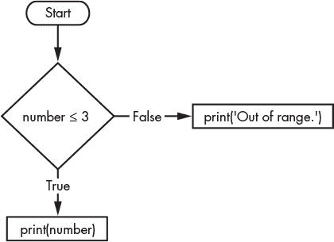
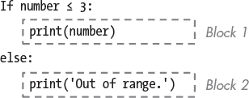
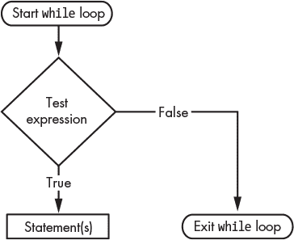
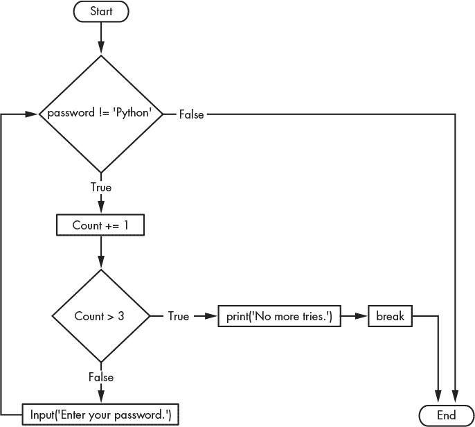

## 第十二章：流程控制**


到目前为止，我们一直在关注程序的组件，例如表达式、变量和数据类型。我们将这些组件组合成简单的可执行指令，但这些指令大多是线性的；换句话说，它们按编写的顺序依次执行。更复杂的程序会包括分支指令，这些指令可以跳过整个代码块，跳回到开头，或在多个选项中做出选择。为了处理这些情况，你需要一种控制代码流程的方法。

*执行流程* 指的是程序中语句执行的顺序。执行从代码的顶部开始，首先执行第一条语句，之后按照顺序依次执行剩余的语句。但这个顺序不一定是从上到下的。事实上，大多数程序的流程像繁忙交叉路口的车辆一样会改变方向。

*流程控制语句* 赋予 Python 做出决定的能力，以决定接下来执行哪些指令。你可以将这些语句看作流程图中的菱形，表示需要做出决策才能继续前进（见 图 10-1）。



*图 10-1：菱形表示流程图中的决策。*

这个流程图评估 `number` 变量是否大于或等于 `3`。根据评估结果，代码会选择一条路径或另一条路径，这一过程称为 *分支*。

在本章中，我们将讨论 `if`、`else`、`elif`、`while`、`for`、`break` 和 `continue` 流程控制语句和子句。我们还将探讨如何监控流程的执行并处理可能发生的任何异常。

### **if 语句**

`if` 语句是一种条件语句或关系语句。所有控制语句，包括 `if` 语句，都以冒号（`:`）结束，并紧随其后的是一个缩进的代码块。只有当 `if` 语句的条件为 `True` 时，这个缩进的代码块才会执行。否则，该代码块会被跳过。

例如，这段代码检查 42 是否小于 2。只有当条件为 `True` 时，它才会打印消息：

```py
In [1]: if 42 < 2:
    ...:      print("That's crazy!")
In [2]:
```

所有的 `if` 语句必须表达一个 *条件*，即一个结果为真或假的表达式。这个例子使用了比较运算符（`<`）来表达条件。另一个选项是使用布尔值（在 第八章 中讨论）。

如果你运行这段代码，你应该会注意到没有任何变化。这是因为该语句的结果是 `False`。没关系，但在大多数情况下，你会希望显式地处理 `False` 的结果，至少为了明确表示没有遗漏的代码。

你可以通过添加 `else` 子句来实现这一点，它会在 `if` 语句未执行时执行。图 10-1 中的菱形表示一个 `if-else` 语句，其工作原理如下：

```py
In [3]: number = 2

In [4]: if number <= 3:
   ...:      print(number)
   ...: else:
   ...:      print('Out of range.')
2
```

`else`子句表示图 10-1 中的`False`分支。如果`if`语句中的条件未满足，它将打印字符串`′``Out of range.``′`

#### ***处理代码块***

紧接在`if`语句和`else`子句之后的代码行会进行缩进。缩进代码是为了告诉 Python 解释器，这一组语句属于特定的*代码块*。这些代码块作为一个单元执行，直到缩进级别减少回零或回到与包含块相同的级别时结束。

大多数编程语言使用特定的语法来构造代码，例如使用大括号（`{}`）来标记代码块，使用分号（`;`）来结束语句行。Python 使用空白字符，因为这样在视觉上更容易理解，如图 10-2 所示，展示了前面提到的`if`语句。



*图 10-2：示例代码块*

第一行末尾的冒号告诉 Python 接下来会有一个新的代码块。此代码块中的每一行都必须进行相同的缩进。在该图中，代码块 1 是当`if`语句条件为`True`时执行的代码。

以下的`else`子句返回到先前的缩进级别。`else`后面的冒号表示另一个代码块的开始（即`if`语句条件为`False`时执行的代码块，或称为代码块 2），这个代码块也必须进行缩进。

我们目前处理的是单级缩进，但代码块中也可以包含更深层次的缩进，或者称为*嵌套*代码块。在下面的示例中，每个`In [7]`之后的输入行表示一个新的代码块：

```py
In [5]: genus = ′rattus′

In [6]: species = 'norvegicus'

In [7]: if genus == 'rattus':
    ...:      if species == 'norvegicus':
    ...:           print('The common brown rat.')
The common brown rat.
```

如果你在缩进代码时犯了错误，不用担心，Python 会提示你。根据错误发生的位置（例如，在函数外部或内部），Python 会抛出`SyntaxError`或`IndentationError`。

**注意**

*根据 PEP8 风格指南 ([`pep8.org/#indentation/`](https://pep8.org/#indentation/))，每个缩进级别应使用四个空格，并且推荐使用空格而非制表符。默认情况下，Spyder 编辑器将制表符转换为四个空格，因此可以减少反复操作带来的肌肉劳损。你可以在工具 *▸* 首选项 *▸* 编辑器 *▸* 源代码 *▸* 缩进字符中找到此选项。*

#### ***使用 else 和 elif 子句***

`if`语句有一个可选的子句，叫做`elif`（即“else-if”的缩写），当`if`语句的条件为`False`时，它会测试另一个条件。`elif`子句允许你检查多个表达式是否为`True`，并在其中一个条件为`True`时执行一个代码块。然后，你可以使用`else`子句作为最终的“捕捉”语句，当没有任何前面的条件满足时执行。

让我们使用`elif`和`else`来比较一个变量，该变量表示核反应堆的核心温度（单位：摄氏度），并对几种可能的响应进行比较：

```py
In [8]: core = 300

In [9]: if core < 200:
    ...:      print("Core is shut down")
    ...: elif 200 <= core < 300:
    ...:      print("Core is below optimum")
    ...: elif core == 300:
    ...:      print("Core is at optimum")
    ...: elif 300 < core < 1800:
    ...:      print("Core is above optimum") ...: else:
    ...:      print("Meltdown! Run for your life!")
Core is at optimum
```

代码首先为`core`变量分配一个 300^°的最佳工作温度。接着，`if`语句测试温度是否低于 200^°。如果是，核心应当关闭，因此会打印出相关的消息。然后，一系列`elif`语句检查其他结果，比如核心温度恰好为 300^°，并打印出相应的响应。最后，如果所有前述条件的评估结果为`False`，`else`语句会执行。这将捕捉到`core`值大于或等于`1800`的情况。使用`else`语句结束`if`语句块，确保至少有一个语句被执行，你不会得到空的响应。

使用`else`语句时，你需要特别小心，确保你的代码能够正确处理所有可能的值。例如，以下代码会打印出过热警告，尽管核心温度仅为 200^°。试着找找哪里出了问题：

```py
In [10]: core = 200

In [11]: if core < 200:
    ...:      print("Core is shutdown")
    ...: elif 200 < core < 300:
    ...:      print("Core is below optimum")
    ...: elif core == 300:
    ...:      print("Core is at optimum")
    ...: elif 300 < core < 1800:
    ...:      print("Core is above optimum")
    ...: else:
    ...:      print("Meltdown! Run your life!")
Meltdown! Run your life!
```

由于这段代码没有明确处理`core`值恰好为`200`的情况，因此它被评估为`else`语句中的条件，导致错误的消息和许多不必要的激动。

同时，要确保*只有一个*条件评估为`True`。使用`elif`的一个优点是，如果某个条件评估为`True`，程序会立即执行对应的代码块并退出语句。这是高效的，但如果多个`elif`条件评估为`True`，只有与*第一个*`True`条件相关联的代码块会执行。

下面是一个示例，展示了一段使用`elif`来递增多个计数变量的代码，且这些条件之间有重叠：

```py
In [12]: dogs = ('poodle', 'bulldog', 'husky')

In [13]: cats = ('persian', 'siamese', 'burmese')

In [14]: popular_breeds = ('poodle', 'persian', 'siamese')

In [15]: dog_count = 0 In [16]: cat_count = 0

In [17]: popular_breeds_count = 0

In [18]: animal = 'poodle'

In [19]: if animal in dogs:
    ...:      dog_count += 1
    ...: elif animal in cats:
    ...:      cat_count += 1
    ...: elif animal in popular_breeds:
    ...:      popular_breeds_count += 1

In [20]: dog_count
Out[20]: 1

In [21]: cat_count
Out[21]: 0

In [22]: popular_breeds_count
Out[22]: 0
```

这段代码首先分配了狗品种、猫品种以及流行狗品种的元组。接着，它为每个类别分配了计数变量，之后将“poodle”品种赋值给`animal`变量。

接下来，一系列条件语句评估`animal`变量。如果它在`dogs`元组中，`dog_count`变量加 1。否则，如果它在`cats`元组中，`cat_count`变量加 1，之后，如果它仅在`popular_breeds`元组中，`popular_breeds_count`会加 1。

当你运行代码并检查计数时，它们是错误的。尽管“poodle”同时出现在`dogs`和`popular_breeds`元组中，只有`dog_count`变量被更新。因为第一个`elif`语句评估为`True`，`if`语句立即终止，导致流行品种的评估从未执行。

#### ***使用三元表达式***

为了方便，Python 允许将`if-else`语句块合并为一个称为*三元表达式*的单一表达式，其语法如下：

```py
true expression if condition else false expression
```

这是一个示例：

```py
In [23]: core = 1801

In [24]: 'Run for your lives!' if core >= 1800 else 'So far so good!'
Out[24]: 'Run for your lives!'
```

三元表达式让你可以写出简洁的代码，但代价是可读性降低。它们应该仅在条件和表达式简单直白的情况下使用。

#### ***使用布尔运算符***

为了帮助你进行比较，Python 提供了 `and`、`or` 和 `not` 运算符。这三个运算符比较布尔值并计算出一个布尔值。

布尔运算符的可能结果可以通过真值表展示，我们在表 10-1 中展示了该表。

**表 10-1：** `and`/`or` 运算符的真值表

| **表达式** | **求值** |
| --- | --- |
| True `and` True | True |
| True `and` False | False |
| False `and` True | False |
| False `and` False | False |
| True `or` True | True |
| True `or` False | True |
| False `or` True | True |
| False `or` False | False |

如你所见，`and` 运算符只有在*两个*布尔值都为 `True` 时才会求值为 `True`。`or` 运算符只要*任意一个*布尔值为 `True`，就会求值为 `True`。例如，如果你早餐吃了玉米片*或*葡萄干麦片，那么你可以说自己吃了“麦片”，但如果你吃了培根*和*鸡蛋，你才能说自己吃了“培根和鸡蛋”。

`not` 运算符仅作用于*一个*表达式或布尔值，并计算出*相反*的布尔值。例如：

```py
In [25]: not False
Out[25]: True
```

使用 `and`、`or` 和 `not`，你可以构建更复杂的比较来控制代码的执行流。尝试在控制台中执行几个例子：

```py
In [26]: 'a' == 'a' and 10 > 2
Out[26]: True

In [27]: (10 > 2) and (42 > 2) and ('a' == 'b')
Out[27]: False

In [28]: (10 < 2) or ('a' != 'b')
Out[28]: True
```

Python 会从左到右依次计算每个表达式，直到得到一个单一的布尔值。然后它会将这些布尔值计算为一个最终值，可能是 `True` 或 `False`。运算顺序如下：

数学运算符 → 比较运算符 → `not` 运算符 → `and` 运算符 → `or` 运算符

使用布尔运算符，你可以在 `if` 语句中比较多个变量。以下是一个例子，你可以通过动物的腿数和发出的声音来区分动物：

```py
In [29]: legs = 4

In [30]: sound = 'bark'

In [31]: if legs == 4 and sound == 'bark':
    ...:      print('a dog')
    ...: elif legs == 4 and sound == 'meow':
    ...:      print('a cat')
a dog
```

在前面的示例中，`if` 语句要执行，两个条件必须都是 `True`。在以下示例中，只需要其中一个条件为 `True`：

```py
In [32]: today = 'Sunday'

In [33]: if today in ('Saturday', 'Sunday'):
    ...:      print('Enjoy your weekend!')
Enjoy your weekend!
```

如果 `today` 是 `Saturday` 或 `Sunday`，那么你就在周末，并且会调用 `print()` 函数。

注意，在使用 `if` 语句语法时容易出错。以下代码看起来是合乎逻辑的，但无论 `today` 变量的值如何，结果都会求值为 `True`：

```py
In [34]: today = 'Saturday'

In [35]: if today == 'Saturday' or 'Sunday':
    ...:      print('Enjoy your weekend!')
Enjoy your weekend!
```

### **循环**

循环允许在关键字下缩进的某些步骤反复执行。直到满足某个条件，重复才会停止，这使得循环类似于 `if` 语句，但它们可以执行多次。

Python 使用 `while` 和 `for` 关键字来实现循环。这些分别对应于*条件控制*循环和*集合控制*循环。

`while` 关键字加上一个条件构成了一个 `while` 语句。这些语句用于反复执行一段代码，直到给定的条件求值为 `False`。此时，程序中紧接着循环的下一行代码会被执行。以下是语法：

```py
while some condition is True:
   do something
```

`for` 关键字用于重复执行一段固定次数的代码或对一组项进行迭代。以下是基本语法：

```py
for something in something:
  do something
```

当 `for` 循环耗尽所有项目时，它的底层条件变为 `False`，循环结束并将控制权返回到 `for` 循环块下的第一行代码。

#### ***while 语句***

`while` 语句会测试一个条件，并不断执行代码块，直到条件变为 `False`（图 10-3），或者你显式地使用 `break` 语句结束循环（后面会详细讲解）。事实上，`while` 循环可能会永远运行下去。



*图 10-3：通用 `while` 循环的流程图*

`while` 循环用于在达到目标之前执行某个操作。例如，你可以模拟一群鹿的种群增长，直到种群达到目标值，这时模拟循环可以停止并记录相关细节，如达到目标所花费的时间或成年鹿的平均体重。

一个更简单的例子是测试密码。在下面的代码中，我们给用户设定了一个输入正确密码的次数限制。

```py
In [36]: password = ''

In [37]: count = 0 In [38]: ➊ while password != 'Python':
    ...:        password = input("Enter your password: ")
    ...:        count += 1
    ...:    ➋ if count > 3:
    ...:           print("No more tries.")
    ...:           break
```

在这个例子中，我们首先创建一个空的 `password` 变量，并将 `count` 变量设置为 `0`。然后我们使用 `while` 关键字开始一个循环 ➊。如果 `password` 不等于“Python”，缩进的 `while` 子句将提示用户输入密码。接着它将 `count` 变量增加 `1`，并使用 `if` 语句检查是否超过了允许的次数 ➋。如果这个条件为 `True`，用户将被告知已超出允许的尝试次数，并且 `break` 关键字将结束循环。如果 `count` 小于或等于 `3`，循环将继续提示用户输入密码。如果用户输入正确密码，循环将在没有任何提示的情况下结束。

图 10-4 用流程图记录了这个循环。注意 `while` 和 `if` 条件都被标记为菱形。这是因为它们代表了决策点。



*图 10-4：密码 `while` 循环的流程图*

每次执行循环都称为一次 *迭代*。`while` 循环可以 *无限次* 迭代，因为循环的次数在开始时没有明确指定。`while` 循环可以执行一百万次，或者在第一次迭代后结束，这取决于其条件是否满足。

**注意**

*如果你的程序进入了无限循环，可以使用 CTRL-C 停止程序并退出。*

**测试你的知识**

1. 每个新的代码块应该缩进 _____ 个空格。

2. 判断对错：`or` 操作符仅在 *两个* 布尔值都为 `True` 时，才会使表达式的结果为 `True`。

3. 编写一个永不结束的 `while` 循环，然后使用 CTRL-C 停止它。

4. 哪些值可以用来表示 `False`？

a. `0`

b. `0.0`

c. F

d. 上述所有

5.  形成猪拉丁语的方法是：将一个以辅音开头的英语单词将辅音移到末尾，并在其后添加“ay”。如果单词以元音开头，则直接在末尾添加“way”。使用 Spyder 文本编辑器编写一个程序，接受一个单词作为输入，利用索引和切片返回其对应的猪拉丁语形式。保持程序运行，直到用户决定退出。

#### ***for 语句***

`for` 语句让你能够执行固定次数的循环。这个次数通常通过内建的 `range()` 函数来指定。这个内存高效的函数返回一个从 0（默认值）开始，直到指定结束点之前的等距数字序列。以下是 `range()` 函数的语法：

```py
range(start, stop, step).
```

`start` 和 `step` 参数是可选的。如果省略，`start` 参数默认值为 `0`，`step` 默认值为 `1`。

这是一个示例，演示了如何使用 `for` 循环和 `range()` 打印五个数字：

```py
In [39]: for i in range(5):
    ...:      print(i)
0
1
2
3
4
```

请注意，`5` 没有包含在输出中。这是因为该函数读取*直到*停止值，但不包括它。`for` 语句下面的代码块是缩进的，就像在 `while` 循环中一样。

这是一个示例，展示如何使用 `range()` 中的所有三个参数（`start`、`stop`、`step`），以打印从 1 到 6 之间的每个其他数字：

```py
In [40]: for i in range(1, 6, 2):
    ...:      print(i)
1
3
5
```

请注意，在之前的代码中，`i` 是按照惯例在遍历数字范围时使用的变量名。任何合法的变量名（如 `num` 或 `number`）都可以使用。如果你使用 linter 工具检查代码，建议使用下划线（`_`）；否则，其他变量名有时会触发“未使用的变量”警告。

你可以将 `range()` 与 `len()` 函数结合使用，来获取任意大小序列的结束点。以下是一个示例：

```py
In [41]: my_list = ['a', 'b', 'c', 'd', 'e']

In [42]: for i in range(len(my_list)):
    ...:      print(my_list[i])
a
b
c
d
e
```

这段代码首先将字母列表赋值给 `my_list` 变量。在随后的 `if` 语句中，通过将 `range()` 函数与 `len()` 函数结合使用，设置了循环的迭代次数。每次迭代时，当前的 `i` 值被用作列表的索引，并打印出相应的字母。

尽管它能工作，但这段代码并不算非常 Pythonic。幸运的是，你可以直接在 `for` 语句中使用可迭代对象。记住，可迭代对象是那些可以一次返回一个元素的对象，包括像 `range`、`list`、`tuple`、`string`、`set` 等序列类型。因此，你不需要跟踪可迭代对象的大小或使用一个递增的索引值。以下是使用这种格式的之前代码片段：

```py
In [43]: for item in my_list:
    ...:      print(item)
a
b
c
d
e
```

请注意代码几乎像英语一样可读。没有比这更“Pythonic”的写法了！

**注意**

*在遍历列表时，绝对不要添加或删除列表中的项。如果你想在循环过程中更改列表，应该将更改追加到一个新的列表中。*

你甚至可以遍历一个字符串并打印其字符，而无需使用中间变量来保存字符串：

```py
In [44]: for letter in "Python":
    ...:      print(letter)
P
y
t
h
o
n
```

如果你在循环过程中需要获取项的索引，最佳的解决方案是使用内置的`enumerate()`函数。该函数为可迭代对象中的每个项添加计数器，并返回一个*enumerate*对象，允许你在循环过程中追踪迭代次数。默认情况下，第一个索引值从 0 开始，但你可以通过指定起始索引来覆盖这一行为。下面的示例生成一个编号的项列表（从 1 开始），数据类型为`list`：

```py
In [45]: equipment_list = ['binoculars', 'rock hammer', 'hand lens']

In [46]: for index, item in enumerate(equipment_list, start=1):
    ...:      print(index, item)
1 binoculars
2 rock hammer
3 hand lens
```

`enumerate()`的其他用法包括从列表中选择每隔*n*项，循环*n*项后结束循环，以及在绘图时使用索引作为线条权重或符号大小。

#### ***循环控制语句***

*循环控制语句*用于循环内部，改变正常的执行顺序。之前，你使用了`break`语句来中断并结束`while`循环。Python 还使用`continue`和`pass`语句来控制循环。

##### **break 语句**

`break`关键字允许你随时退出循环的代码块。一种常见的用法是将`while`设置为`True`（`while True:`），然后在满足某个条件时“手动”退出循环。由于`True`始终为真，无法通过条件停止循环，因此必须使用`break`强制退出。

在嵌套循环中，`break`只终止其所在的代码块及其中的任何内部代码块。外部循环将继续执行。例如，下面的示例包含了两个嵌套循环：

```py
In [47]: mythbusters = ['Kari', 'Grant', 'Tory']

In [48]: MYTHBUSTERS = ['Adam', 'Jamie']

In [49]: for star in mythbusters:
    ...:      for big_star in MYTHBUSTERS:
    ...:           if big_star == 'Adam':
    ...:                break
    ...:      print(star, big_star)
Kari Adam
Grant Adam
Tory Adam
```

即使`break`语句中断了内部的`for`循环并且阻止了“Jamie”的打印，外部循环仍然会继续执行直到完成。

##### **continue 语句**

`continue`关键字会立即将控制权返回到循环的起始位置，跳过其下方的任何循环语句。例如，下面的示例使用`while`循环来验证用户的用户名和密码。将代码输入到 Jupyter Qt 控制台中，然后按 SHIFT-ENTER 运行：

```py
In [50]: while True:
    ...:      name = input('Enter your username: ')
    ...:      if name != 'Alice':
    ...:        ➊ continue
    ...:   ➋ pwd = input('Enter your password: ')
    ...:      if pwd == 'Star_Lord':
    ...:        ➌ break
    ...:      else:
    ...:           print('That password is incorrect')
```

首先，当然是获取正确的用户名。如果第一个`if`语句的条件为`True`（用户名*不是*“Alice”），则`continue`语句会中断循环并重新开始序列 ➊。如果用户名通过测试，`continue`语句会被跳过，接下来会提示用户输入密码 ➋。如果输入正确，`break`语句会结束循环 ➌。否则，用户会收到错误提示，循环重新开始。

##### **pass 语句**

你可以使用`pass`关键字来构建“空”循环，或者不执行任何操作的代码块。这些关键字作为占位符，预留将来填写的代码，或者标记你故意省略某些内容的位置。例如，在这个片段中，我们选择不打印`Python`中的`h`：

```py
In [51]: word = 'Python'
In [52]: count = 0
In [53]: while count < len(word):
    ...:      if count < 3:
    ...:           print(word[count])
    ...:   ➊ elif count == 3:
    ...:           pass
    ...:      else:
    ...:           print(word[count])
    ...:      count += 1
P
y
t
o
n
```

这段代码将“Python”赋值给了`word`变量，并将 0 赋值给了`count`变量。当`count`值小于`word`的长度时，循环会打印出`word`中索引为当前`count`值的每个字符。但是，当`count`等于`3`时，它使用`pass`关键字跳过当前循环。

你本可以通过只打印`count < 3`和`count > 3`来完成相同的任务，但从回顾的角度看，这可能被视为一个索引错误（请参阅前面第`In [10]-[11]`行的核心温度示例）。通过包括对`h`的引用并使用`pass` ➊，可以明确看出你知道自己在做什么。你基本上是说，“我知道在这个索引处有一个字母，但我故意不打印它。”

#### ***用推导式替代循环***

在 Python 中，*推导式*是一种通过现有序列构建新序列（如列表、集合或字典）的方法。例如，你可能想要创建一个新列表，其中包含另一个列表中数字的对数。作为标准`for`循环的替代，推导式更快、更优雅、也更简洁。

推导式的一个缺点是，你不能在循环中嵌入`print()`函数来帮助你跟踪发生了什么。当使用复杂的表达式时，它们也可能变得难以阅读，但对于简单的表达式来说，它们无可替代。Python 支持列表、字典、集合的推导式，还有我们将在下一章讨论的：生成器。

##### **列表推导式**

要使用*列表推导式*创建一个新列表，将推导式表达式放在方括号中。如果你想用条件从现有的可迭代对象中选择项目，可以使用以下语法：

```py
new_list = [item for item in iterable if item satisfies condition]
```

如果你想在将这些项添加到新列表之前修改它们，或生成新的项，可以使用以下语法：

```py
new_list = [expression for item in iterable if condition]
```

例如，这里有一个示例，它接受一个字符串，遍历字符串， 将每个字母大写，并将大写字母追加到一个新列表中：

```py
In [54]: word = 'Python'

In [55]: letters = [letter.upper() for letter in word]

In [56]: letters
Out[56]: ['P', 'Y', 'T', 'H', 'O', 'N']
```

在这里，我们将一个字符串赋值给了`word`变量，然后使用列表推导式`[letter.upper() for letter in word]`创建了`letters`列表。注意语法略有不同，循环变量（`letter`）出现在定义之前。

以下示例提取了“Python”中的大写字母“P”。注意你可以在推导式中使用`if`语句：

```py
In [57]: cap = [letter.upper() for letter in word if letter.isupper()]

In [58]: cap
Out[58]: ['P']
```

行`In [57]`中的单行列表推导式等价于使用标准`for`循环的以下代码：

```py
In [59]: cap = []

In [60]: for letter in word:
    ...:      if letter.isupper():
    ...:           cap.append(letter)
```

在这种情况下，列表推导式帮你节省了三行代码。

你也可以通过嵌套的`for`循环创建列表推导式，如下所示：

```py
In [61]: first = ['Python is']

In [62]: last = ['fun', 'easy', 'neat'] In [63]: print([f + ' ' + l for f in first for l in last])
['Python is fun', 'Python is easy', 'Python is neat']
```

你可以在 *[`docs.python.org/3/tutorial/datastructures.html`](https://docs.python.org/3/tutorial/datastructures.html)* 中看到更多的列表推导式示例。

##### **字典推导式**

*字典推导式*类似于列表推导式，不同之处在于它使用键值对（k, v）代替了项，使用大括号包裹，并返回一个字典而不是列表。

你可以在现有的字典上使用字典推导式，在这种情况下，你要么基于某些条件从现有字典中选择键值对（k, v），要么基于条件对键和值应用表达式。一般语法如下：

```py
new_dict = {k:v for (k, v) in dictionary if k, v satisfy condition}
```

或者：

```py
new_dict = {k-expr:v-expr for (k, v) in dictionary if condition}
```

当在另一种可迭代对象（如列表）上使用字典推导式时，你可以选择并/或改变现有的项，以便将其作为新字典中的键值对。语法有多种变化，但大致如下所示：

```py
new_dict = {item:item-expr for item in iterable if condition}
```

注意，表达式可以改变用于键、值，或者两者的项。

这是一个例子，我们从列表中提取偶数，并将其映射到它们的平方：

```py
In [64]: inputs = [1, 2, 3, 4, 5, 6]

In [65]: new_dict = {item:item**2 for item in inputs if item % 2 == 0}

In [66]: new_dict
Out[66]: {2: 4, 4: 16, 6: 36}
```

在这里，我们将两个元组（`mineral`和`hardness`变量）压缩在一起，创建摩氏著名的矿物硬度标度的一部分：

```py
In [67]: mineral = 'talc', 'gypsum', 'calcite'

In [68]: hardness = 1, 2, 3

In [69]: mohs = {m: h for (m, h) in zip(mineral, hardness)}

In [70]: mohs
Out[70]: {'talc': 1, 'gypsum': 2, 'calcite': 3}
```

注意，你也可以通过调用内置的`dict()`函数来生成`mohs`字典，如下所示：

```py
In [71]: mohs = dict(zip(mineral, hardness))
```

##### **集合推导式**

*集合推导式* 用大括号括起来，并返回未排序的集合。你可以使用以下语法从可迭代对象中 *选择* 已有项：

```py
new_set = {item for item in iterable if item satisfies condition}
```

或者，你可以通过在将项添加到新集合之前应用基于条件的表达式，来改变项或派生新项：

```py
new_set = {expression for item in iterable if condition}
```

这是一个例子，它返回字符串中的所有唯一字符，考虑到集合不允许重复值（这与`set()`函数相同）：

```py
In [72]: pond_animals = ['turtle', 'duck', 'frog', 'turtle', 'snail', 'duck']

In [73]: unique_animals = {animal for animal in pond_animals}

In [74]: unique_animals
Out[74]: {'duck', 'frog', 'snail', 'turtle'}
```

这里我们使用一个表达式来计算单词的长度：

```py
In [75]: unique_word_lengths = {len(word) for word in pond_animals}

In [76]: unique_word_lengths
Out[76]: {4, 5, 6}
```

### **处理异常**

当 Python 在执行过程中遇到错误时，会发生 *异常*。这会导致它“抛出异常”，并产生一个代表错误的 Python 对象。如果不立即处理，异常会导致程序终止并显示错误消息。

幸运的是，异常可以通过流控制“捕获”并进行处理。这为你提供了修复问题、重新尝试、提供更有帮助的错误信息或抑制错误的机会。

#### ***使用 try 和 except***

Python 提供了一个`try`语句和一个`except`子句来帮助你处理异常。`try`语句允许你隔离可能包含错误并导致程序崩溃的代码。如果代码中包含错误，`except`子句将通过提供代码来处理它，这些代码只有在异常被抛出时才会执行。

最简单的异常处理仅仅是防止你的程序毫无预警地崩溃。它会呈现一个警告并（希望）给出有帮助的消息。以下是一个处理用户输入错误的例子：

```py
In [77]: try:
    ...:      age = int(input("Enter your age in years: "))
    ...: except:
    ...:      print("Please start again and enter a whole number.")

Enter your age in years: Harry
Please start again and enter a whole number.
```

在这个例子中，`age`的值被转换为整数，因为我们希望`age`是一个完整的年份数字。但是用户输入了字母（`Harry`），这引发了一个`ValueError`异常，因为字母不能转换为整数。然而，你不会看到这个错误信息，因为我们使用`try`语句捕获了异常，`try`语句的作用正如其名，它会单独尝试这段代码，给我们机会在程序崩溃之前采取措施。在这里，我们向用户打印了一条信息，以便程序能够相对优雅地结束。

在大多数情况下，你希望指定要处理的异常类型，而不是像我们在前一个代码片段中那样捕获所有内置异常。你可以在第 183 页的表 7-4 中找到异常类型的列表。你也可以在控制台中创建你需要的错误，并从结果的`Traceback`消息中读取异常名称。

让我们改写前面的代码片段来捕获`ValueError`。只需在`except`后面放上适当的异常名称，如下所示：

```py
In [78]: try:
    ...:     age = int(input("Enter your age in years: "))
    ...: except ValueError:
    ...:     print("Please start again and enter a whole number.")
```

你还可以通过将多个异常类型放在`except`后面，作为一个元组（带有括号）来捕获多个异常类型：

```py
In [79]: except (ValueError, TypeError):
```

如果你希望对每种错误类型使用不同的消息或采取不同的措施，只需在`try`语句中使用多个堆叠的`except`语句，格式如下：

```py
try:
   something...
except ValueError:
   do something... except TypeError:
   do something else...
```

你还可以将 Python 的错误消息集成到你自定义的版本中。异常有*参数*，它们是 Python 描述发生了什么的官方消息。你可以通过在异常类型后面指定一个变量，并用`as`关键字来使用这个参数。以下是一个例子：

```py
In [80]: try:
     ...:     age = int(input("Enter your age in years: "))
     ...: except ValueError as e:
     ...:      print(e)
     ...:      print("Please start again and enter a whole number.")

Enter your age in years: Steve
invalid literal for int() with base 10: "Steve"
Please start again and enter a whole number.
```

现在，你既能享受 Python 精确但技术性的解释，又能得到非程序员更友好的指示。

最后，你可以在所有`except`语句的末尾添加一个`else`子句。如果在`try`块中没有引发异常，你可以做一些操作，例如确认操作成功：

```py
In [81]: try:
    ...:     age = int(input("Enter your age in years: "))
    ...: except ValueError as e:
    ...:     print(f'\n{e}')
    ...:     print("Please start again and enter a whole number.")
    ...: else:
    ...:     print(f"You entered an age of {age} years")

Enter your age in years: 42
You entered an age of 42 years
```

#### ***使用 raise 关键字强制抛出异常***

Python 的`raise`关键字允许你在发生某个条件时强制抛出指定的异常。你可以使用它来抛出内置的错误类型或你自己的自定义错误。它对于验证输入尤其有用，例如强制使用最大值，或者在处理正数时处理负数输入。

要查看如何创建你自己的自定义错误，请在 Spyder 的文本编辑器中输入以下内容并保存为任何你喜欢的文件名：

```py
word = input("Enter Harry's last name: ")
if word.lower()!= 'potter':
    raise Exception('I was looking for Potter!')
```

在这里，你接受用户输入的名字，将其转换为小写，并与“potter”进行比较。如果名字不匹配，你使用`raise`关键字并调用`Exception`类，传递一个自定义消息。

现在，运行文件并在提示时输入“Houdini”。你应该在控制台看到类似的输出（为简洁起见，这里截断了一部分）：

```py
Enter Harry's last name: Houdini
Traceback (most recent call last):

--snip--

  File "C:/Users/hanna/file_play/junk.py", line 1, in <module>
    raise Exception('I was looking for Potter!')

Exception: I was looking for Potter!
```

要强制 Python 抛出一个内置异常，替换你之前使用的`Exception`类，使用内置异常类的名称（参见表 7-4）。在这个例子中，我们抛出 Python 内置的`TypeError`异常：

```py
number = 'Steve'
if isinstance(number, int):
    pass
else:
    raise TypeError("Only integers are accepted.")
```

你可以在*[`docs.python.org/3/tutorial/errors.html`](https://docs.python.org/3/tutorial/errors.html)*上阅读更多关于`raise`的内容。

#### ***忽略错误***

如果你想在循环时忽略错误该怎么办？例如，假设你使用 Python 的`None`关键字来定义数据集中缺失或空的样本值（`data`）：

```py
In [82]: data = [24, 42, 5, 26, None, 101]
```

你不希望从数据集中剔除这个占位符，因为它包含了有价值的信息。它能告诉你数据集是不完整的，以及缺失数据的位置。但是，如果你尝试遍历数据并对其进行某些操作，比如将每个值除以 2，`None`值会抛出`TypeError`并导致程序崩溃：

```py
In [83]: for sample in data:
    ...:     print(f'{sample / 2}’)
12.0
21.0
2.5
13.0
Traceback (most recent call last):

File "C:\Users\hanna\AppData\Local\Temp/ipykernel_5140/163932511.py", line 2, in <module> print(f’{sample / 2}’)

TypeError: unsupported operand type(s) for /: 'NoneType' and 'int'
```

我们可以结合多个流程控制元素来处理这些缺失数据。在这里，我们在`for`循环内使用了`try`语句和`except`子句：

```py
In [84]: for sample in data:
    ...:     try:
    ...:         x = sample / 2
    ...:         print(x)
    ...:     except TypeError:
    ...:         print("missing data")
12.0
21.0
2.5
13.0
missing data
50.5
```

现在，循环已完成执行并标记了缺失数据的位置。

然而，如果你想完全跳过缺失数据呢？例如，你想将输出传递给其他数学运算，而“缺失数据”值会干扰这些运算？在这种情况下，使用`continue`语句，如下所示：

```py
In [85]: for sample in data:
    ...:     try:
    ...:         x = sample / 2
    ...:         print(x)
    ...:      except TypeError:
    ...:         continue
12.0
21.0
2.5
13.0
50.5
```

现在，循环会将缺失值当作不存在的情况处理，因为它遇到该值时会继续循环。记住，`continue`会立即将控制权返回到循环的起始位置。

### **通过日志追踪执行**

为了控制程序的流程，你需要知道程序在关键位置返回了什么。跟踪这个信息的一种方式是使用`print()`函数。这可以让你打印输出、变量的数据类型或其他关于某个重要步骤的有用信息。

`print()`函数对于小型程序来说效果很好，但如果你只是用它来进行代码的质量控制，它可能会带来一些问题。为了简化代码和输出，你可能需要稍后删除所有包含`print()`的行，或者将它们注释掉（在行首加上`#`），以避免它们被执行。

对于大型程序，更好的选择是使用`logging`模块。这个模块是 Python 标准库的一部分，可以提供自定义报告，记录程序在你选择的任何位置所做的事情。五个*日志级别*可以让你按重要性对消息进行分类。它们在表 10-3 中列出。

**表 10-3：** Python 的日志级别

| **级别** | **功能** | **描述** |
| --- | --- | --- |
| DEBUG | `logging.debug()` | 诊断问题的详细信息 |
| INFO | `logging.info()` | 确认一切按预期正常工作 |
| WARNING | `logging.warning()` | 工作代码中的意外事件或潜在的未来问题 |
| ERROR | `logging.error()` | 错误阻止代码按预期功能运行 |
| CRITICAL | `logging.critical()` | 一个可能会导致程序停止的严重错误 |

需要记录日志的大型程序在控制台中编写较为困难，因此请将以下示例输入到 Spyder 的文本编辑器中，并保存为类似 *logging.py* 的文件名。此代码使用 `logging` 检查一个元音计数程序是否正确运行：

```py
   import logging
➊ logging.basicConfig(level=logging.DEBUG,
                       format='%(asctime)s %(levelname)s - %(message)s')
   word = 'scarecrow'
   VOWELS = 'aeiouy'
   num_vowels = 0

   for letter in word:
       if letter in VOWELS:
           num_vowels += 1
    ➋ logging.debug('letter & vowel count = %s-%s', letter, num_vowels)
```

保存文件并按 F5（或点击 **运行** 按钮）执行代码。你应该看到以下通用输出：

```py
In [86]: runfile(′C:/Users/hanna/.spyder-py3/temp.py′, wdir=′C:/Users/hanna/.spyder-py3′)
202x-09-27 14:37:30,578 DEBUG - letter & vowel count = s-0
202x-09-27 14:37:30,580 DEBUG - letter & vowel count = c-0
202x-09-27 14:37:30,581 DEBUG - letter & vowel count = a-1
202x-09-27 14:37:30,581 DEBUG - letter & vowel count = r-1
202x-09-27 14:37:30,582 DEBUG - letter & vowel count = e-2
202x-09-27 14:37:30,582 DEBUG - letter & vowel count = c-2
202x-09-27 14:37:30,582 DEBUG - letter & vowel count = r-2
202x-09-27 14:37:30,583 DEBUG - letter & vowel count = o-3
202x-09-27 14:37:30,583 DEBUG - letter & vowel count = w-3
```

我们来看看你做了什么。在导入模块后，你使用 `basicConfig()` 方法设置并格式化了你想看到的调试信息 ➊。`DEBUG` 级别是最低的级别，用于诊断细节。添加时间戳（`%(asctime)s`）在这里不是必需的，但在调试长时间运行的程序时，它可能变得非常重要。

在设置好要计数的单词、元音常量和计数变量后，你启动了一个 `for` 循环，遍历单词中的字母并将每个字母与 `VOWELS` 的内容进行比较。如果字母匹配，则将 `num_vowels` 计数器加 `1`。

对于每个评估的字母，你使用 `logging.debug()` 输入自定义文本消息，并显示当前计数 ➋。`logging` 输出会显示在控制台中。你可以看到时间戳、日志级别以及累积的元音计数，还可以看到哪些字母更改了计数。在这种情况下，只有元音字母会更改计数，所以程序看起来运行正常。

你可以将日志消息重定向到一个永久的*文本文件*中，而不是在屏幕上显示。只需在 `logging.basicConfig()` 函数中使用 `filename` 关键字，示例如下：

```py
logging.basicConfig(filename='vowel_counter_log.txt',
                    level=logging.DEBUG,
                    format='%(asctime)s %(levelname)s - %(message)s')
```

如代码所示，这段代码会将日志文件保存在与你的 Python 文件相同的文件夹中。若要将其保存在其他地方，你需要指定路径。

`print()` 函数和 `logging` 都可能减慢程序的运行。然而，禁用 `logging` 消息更为简便。通过使用 `logging.disable()` 函数，你可以用一行代码关闭某一级别的所有消息，示例如下：

```py
import logging
logging.disable(logging.CRITICAL)
```

将 `logging.disable()` 放在程序顶部、导入语句下方，可以轻松找到它并通过注释掉哈希标记来切换消息的开启和关闭，示例如下：

```py
import logging
#logging.disable(logging.CRITICAL)
```

`logging.disable()` 方法将压制所有指定级别及更低级别的消息。由于 `CRITICAL` 是最高级别，因此你可以使用它来禁用所有级别的消息。这比找到并删除（或注释掉）多个 `print()` 调用要容易得多。

欲了解更多有关 `logging` 模块的详细信息，请查看文档 *[`docs.python.org/3/library/logging.html`](https://docs.python.org/3/library/logging.html)*。若要获取基本教程，请访问 *[`docs.python.org/3/howto/logging.html`](https://docs.python.org/3/howto/logging.html)*。

**测试你的知识**

编写一个代码片段，要求用户输入用户名和密码。如果用户名不正确，继续提示直到输入正确。如果只有密码不正确，继续提示输入正确的密码，但不再重复请求用户名。

`for` 循环只是 `while` 循环的简洁版本。写一个 `while` 循环，模拟 `for` 循环的行为，并打印出“Python”五次。

使用列表推导式生成 1 到 10 之间的所有*偶数*。

使用 `for` 循环和 `range()` 函数打印一个类似 NASA 风格的倒计时，从 10 到 0。

一个隐藏的秘密信息位于以下单词的中心：“age”，“moody”，“knock”，“adder”，“project”，“stoop”，“blubber”。使用 `for` 循环找到并打印出这个信息。

使用文本编辑器编写一个“猜数字”游戏，程序随机选择一个介于 1 到 100 之间的整数（使用 `random.randint()`），并告诉玩家他们的猜测是太高还是太低，直到猜对为止。告知玩家他们获胜，并告诉他们猜了多少次。

使用文本编辑器编写一个“幸运饼干”程序，给用户提供三个选项：退出、打开幸运饼干或打开不幸饼干。列出正面的幸运语和幽默的“不幸”语句，并使用 `random` 模块的 `choice()` 函数从每个列表中随机选择。将结果打印到屏幕上。

### **总结**

编程的魔力在于程序在执行过程中能够做出决策。这些决策通过评估为 `True` 或 `False` 的条件来实现。通过使用比较和布尔运算符与*条件语句*（如 `if`、`elif` 和 `else`），你可以控制代码执行的内容和时机。

*缩进*（空白字符）用于将代码分隔成功能相似的片段，称为 *代码块*。缩进级别告诉 Python 何时开始和结束代码块。这有助于你控制程序执行的流程。

`while` 循环会使代码重复执行，直到满足某个条件。而 `for` 循环则会执行指定次数，或者直到它耗尽容器数据类型中的项，例如列表。两种类型的循环都可以通过 `break` 语句手动中断，或者使用 `continue` 语句强制跳回开始。

`for` 循环可以通过*推导式*简化为一行代码。你可以在列表、集合和字典中使用推导式。对于简单的表达式，推导式不仅比 `for` 循环更加简洁，而且速度更快。

因为错误可能会影响代码的流程，Python 提供了带有 `except` 子句的 `try` 语句，帮助你通过抑制错误、修复错误、创建自定义错误信息或让用户重试来处理错误。为了帮助你找到和调试错误以及其他问题，Python 提供了 `logging` 模块。与 `print()` 函数相比，`logging` 是一种更复杂且易于管理的方式，适用于监控大型程序的执行流程。

控制流程的另一种方式是编写函数。我们将在下一章中学习这些重要的“迷你程序”。
