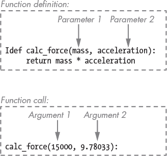
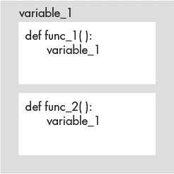
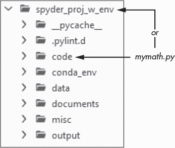

## 第十三章：**函数和模块**


*函数*是一个可重用的指令集，用于执行特定任务。当函数完成任务后，执行流程会返回到更大代码结构中的正确位置。*模块*是程序，通常由多个函数组成，用来执行某一任务或一组相关任务。你可以在代码中定义函数，但必须导入模块才能在 Python 程序中使用它们。

函数和模块都通过*抽象化*过程来简化代码。抽象化是将某个过程的细节移动到一个看似更简单的对象中，远离主要的执行流程。稍后，你可以通过一行代码调用该对象的名称来完成任务。

最好的函数和模块名称应该简短且富有描述性。它们可以让你快速浏览程序的主要部分，了解程序的执行流程，就像是在阅读摘要一样。一个好的类比是本书的目录。尽管实际章节中隐藏了大量的细节，但标题和小节标题让你大致了解每一章的内容。

在前几章中，你导入了像`math`和`os`这样的模块，并使用了内置函数如`print()`和`input()`。它们的代码被抽象化到了你从未看到的程度。你只需调用一个函数，然后就会发生某些事情。然而，也有时候，预先构建的解决方案要么不可用，要么不足以满足需求，这时你需要自己创建一个函数。

通过编写自己的函数来重用代码单元，你可以创建更加可读、组织更好、冗余更少的程序。在本章中，你将编写自定义函数和模块，并熟悉一些额外的内置函数和第三方模块，它们能让你的编程生活更轻松。

### **定义函数**

要在 Python 中编写一个函数，你需要使用`def`关键字定义它，后面跟上函数名、括号和冒号。与往常一样，冒号后面的代码必须缩进，缩进的行表示可执行的代码。以下是在 Spyder IDE 的 IPython 控制台中的示例：

```py
In [1]: def warning():
   ...:     print("WARNING: Converting units from metric to Imperial!")
```

**注意**

*在控制台中，你可以通过按两次 ENTER 键或使用 SHIFT-ENTER 键来完成一个函数。在编辑器中，当代码块回到与`def`关键字相同的缩进级别时，函数的代码块就结束了。*

你现在已经将警告信息封装在`warning()`函数中。要再次使用该信息，只需通过输入函数名和括号来*调用*函数即可。这可以避免你一遍又一遍地输入完整的消息：

```py
In [2]: warning()
WARNING: Converting units from metric to Imperial!
```

在函数名中，括号`()`，有时被称为*调用操作符*，让 Python 知道一个对象可以被*调用*，这是“执行此命令”的一种高级说法。

和 Python 中的其他一切一样，函数也是对象。它们属于`function`数据类型：

```py
In [3]: type(warning)
Out[3]: function
```

你可以将函数赋值给变量，在其他函数中使用它们，在其他函数中定义它们，将它们作为返回值从其他函数返回，甚至将它们存储在数据结构中（例如，作为列表中的项）。

根据 Python 的 PEP 8 风格指南 (*[`pep8.org/`](https://pep8.org/)*)，你应该用两行空白行将顶层函数（即缩进级别为 0 的函数）包围。在函数内部，你应该适量使用空白行来表示逻辑部分。

#### ***使用参数和实参***

你可以向函数提交或*传递*输入，执行某些操作后，再输出或*返回*结果。为此，你可以在括号内使用参数和实参，并用逗号分隔它们。

*参数* 是函数定义时使用的特殊变量，当调用函数时，它们接收一个值。它们指的是作为输入提供的数据片段，而不是数据本身。例如，以下代码定义了一个函数，该函数通过传入质量和加速度参数，使用著名的方程 *F=MA* 来计算力的值：

```py
In [4]: def calc_force(mass, acceleration):
   ...:      return mass * acceleration
```

*实参* 是在调用函数时传入的实际数据值。例如，你可以使用以下参数调用 `calc_force()` 函数：

```py
In [5]: calc_force(15000, 9.78033)
Out[5]: 146704.94999999998
```

图 11-1 识别了 `calc_force()` 函数定义中的参数以及调用时传入的实参。



*图 11-1：函数定义使用参数，函数调用使用实参*

像 `calc_force()` 这样返回值的函数被称为 *有返回值的函数*。执行某个操作但不返回值的函数被称为 *无返回值的函数*。前一节中的 `warning()` 函数就是一个无返回值的函数示例。

对于有返回值的函数，`return` 语句会使得执行退出函数并在调用该函数的代码点后立即恢复执行，这个位置被称为函数的 *返回地址*。在 `return` 关键字之后同一行列出的值会传回调用函数的代码。例如，对于 `calc_force()` 函数，这将是 `Out[5]` 行的值。

`return` 关键字总是结束一个函数，防止函数内的任何后续代码继续执行。

**注意**

*从技术上讲，所有函数都需要返回一个值。空函数通过自动返回 Python 的空值 None 来满足这个要求，None 属于 NoneType 数据类型。*

#### ***位置参数与关键字参数***

函数的参数可以分为两种类型：*位置参数*和*关键字参数*。位置参数必须按照函数定义中参数的顺序输入。正如 图 11-1 所示，`calc_force()` 函数使用位置参数，第一个传入的参数对应质量，第二个对应加速度。

关键字（或*命名*）参数包括一个关键字和等号，后面跟着提交的值。它们用于增加清晰度并明确函数的意图。下面是如何使用关键字调用`calc_force()`函数：

```py
In [6]: calc_force(mass=15000, acceleration=9.78)
Out[6]: 146700.0
```

**注意**

*根据 Python 风格指南，关键字参数中的等号两侧不应有空格。*

关键字参数的另一个优点是你不需要记住定义参数时的顺序。在这里，我们按相反的顺序输入参数：

```py
In [7]: calc_force(acceleration=9.78, mass=15000)
Out[7]: 146700.0
```

你可以在调用函数时同时输入位置参数和关键字参数。然而，一旦使用了关键字参数，就不能在同一个函数调用中再使用位置参数。因此，这段代码是有效的：

```py
In [8]: calc_force(15000, acceleration=9.78)
Out[8]: 146700.0
```

但是这段代码失败了：

```py
In [9]: calc_force(mass=15000, 9.78)

File "C:\Users\hanna\AppData\Local\Temp/ipykernel_3212/3649549750.py", line 1
calc_force(mass=15000, 9.78)
^
SyntaxError: positional argument follows keyword argument
```

你可以通过在定义函数时将星号（`*`）作为第一个参数来强制使用关键字参数：

```py
In [10]: def calc_force(*, mass, acceleration):
    ...:      return(mass * acceleration)
```

现在，如果你尝试使用位置参数，Python 将抛出异常并告知你不接受位置参数：

```py
In [11]: calc_force(15000, 9.78)
Traceback (most recent call last):

File "C:\Users\hanna\AppData\Local\Temp/ipykernel_3212/2133932729.py", line 1, in <module>
calc_force(15000, 9.78)

TypeError: calc_force() takes 0 positional arguments but 2 were given
```

#### ***使用默认值***

你可以为一个或多个参数指定默认值。这让你在参数通常使用特定值时简化函数调用。如果用户不确定要输入什么，它还可以引导用户选择一个可接受的值。

默认参数应放在*所有非默认参数之后*。下面是一个示例，当用户按下 ENTER 键而没有回应提示问题时，函数会使用默认值：

```py
In [12]: def default_input(prompt, default=None):
    ...:   ➊ prompt = f'{prompt} [{default}]:'
    ...:      response = input(prompt)
    ...:   ➋ if not response and default:
    ...:           return default
    ...:      else:
    ...:           return response
```

这个函数接受一个提示和一个默认值作为参数。调用函数时会指定提示和默认值，程序会在方括号中显示默认值➊。`response`变量存储用户的输入。如果用户什么都不输入且存在默认值，则返回默认值➋。否则，返回用户的响应。

让我们使用这个函数来获取用户的出生国家。对于目前在美国的用户，我们将默认值设置为“USA”，这样他们只需按下 ENTER 键，而不需要输入名称。注意这个默认值如何让你*控制*响应，尤其是当有多个可能的选项时（比如“America”、“United States”、“United States of America”、“US”等等）：

```py
In [13]: birth_country = default_input('Enter your country of birth:', 'USA')
Enter your country of birth: [USA]:

In [14]: birth_country
Out[14]: 'USA'
```

用户可以通过输入一个响应来覆盖默认值：

```py
In [15]: birth_country = default_input('Enter your country of birth:', 'USA')

Enter your country of birth: [USA]: Scotland

In [16]: birth_country
Out[16]: 'Scotland'
```

在大多数情况下，你会希望避免在 Python 中使用像字典、集合或列表这样的可变对象作为默认参数值。这是因为默认的可变对象仅在函数*定义*时初始化一次，而不是每次函数被*调用*时初始化。这可能会导致意想不到的输出。下面是一个例子：

```py
In [17]: def dog_breeds(new, current=['bulldog', 'dachshund']):
    ...:     current.append(new)
    ...:     return current

In [18]: my_dogs = dog_breeds('pomeranian')

In [19]: my_dogs
Out[19]: ['bulldog', 'dachshund', 'pomeranian']

In [20]: your_dogs = dog_breeds('poodle')

In [21]: his_dogs = dog_breeds('mutt')

In [22]: his_dogs
Out[22]: ['bulldog', 'dachshund', 'pomeranian', 'poodle', 'mutt']
```

这里的天真期望是，每个调用`dog_breeds()`函数的人都会从一只斗牛犬和腊肠犬开始，然后将他们的狗品种添加到这个列表中。但是，由于`current`列表是在函数定义时创建的（在第`In [17]`行），每次调用该函数时都会向这个*相同*的列表添加项目。

#### ***返回值***

当函数返回一个值时，你可以通过赋值语句将结果存储到一个变量中。例如，下面的代码将从运行`calc_force()`函数返回的值存储到名为`force`的变量中：

```py
In [23]: force = calc_force(15000, 9.78033)

In [24]: force
Out[24]: 146704.94999999998
```

你甚至可以返回多个值，用逗号分隔。你需要一个变量来存储每个值，如这个例子所示，函数接受一个数字作为参数，并返回该数字的平方和立方：

```py
In [25]: def square_and_cube(a_number):
    ...:      return a_number**2, a_number**3

In [26]: squared, cubed = square_and_cube(2)

In [27]: squared, cubed
Out[27]: (4, 8)
```

最后，函数可以包含多个`return`语句。每个语句在特定条件下执行，一旦某个语句执行完毕，函数就结束。试试在控制台中执行这个：

```py
In [28]: def goldilocks(a_number):
    ...:      num = int(a_number)
    ...:      if num > 42:
    ...:           return "too high"
    ...:      elif num < 42:
    ...:           return "too low"
    ...:      else:
    ...:           return "just right!"

In [29]: goldilocks(43)
Out[29]: 'too high'

In [30]: goldilocks(41)
Out[30]: 'too low'

In [31]: goldilocks(42)
Out[31]: 'just right!'
```

在这个例子中，`goldilocks()`函数接受一个数字作为参数，将其转换为整数，然后与`42`进行比较。三种可能的结果（大于、小于或等于）各自有一个`return`语句。

#### ***命名函数***

命名函数的规则与命名变量的规则相同（参见第 206 页的“命名变量”）。你可以使用字母、下划线和数字，只要首字符不是数字。所有字符应为小写，并且应使用下划线分隔单词。你应避免使用保留字和内置函数的名称。

因为函数执行一个动作，所以好的命名策略是包含描述该动作的动词和名词。一些例子是`reset_password()`、`register_image()`和`plot_light_curve()`。

关于命名和定义函数的更多信息，请访问文档中的*[`docs.python.org/3/tutorial/controlflow.html#defining-functions/`](https://docs.python.org/3/tutorial/controlflow.html#defining-functions/)*。

#### ***内置函数***

Python 提供了多个内置函数，让你的编码生活更加轻松。你已经使用过许多这些函数，包括`print()`、`len()`、`type()`、`list()`、`input()`、`round()`等。

表 11-1 列出了更常用的内置函数。要查看完整列表以及每个函数的详细描述，请访问*[`docs.python.org/3/library/functions.html`](https://docs.python.org/3/library/functions.html)*。

**表 11-1：** 常用的内置函数

| **函数** | **描述** |
| --- | --- |
| `abs()` | 返回数字的绝对值。 |
| `all()` | 如果可迭代对象的所有元素都为真，或者可迭代对象为空，返回`True`。 |
| `any()` | 如果可迭代对象的任一元素为真，或者可迭代对象为空，返回`True`。 |
| `chr()` | 返回表示输入的 Unicode 代码点的字符串（`chr(97)`返回`'a'`）。 |
| `dict()` | 创建一个新的`字典对象`。 |
| `dir()` | 不带参数时，返回当前作用域中的名称。如果传入一个对象作为参数，返回该对象的属性和方法列表。 |
| `enumerate()` | 为可迭代对象中的每个项添加一个计数器，并返回一个枚举对象。 |
| `filter()` | 返回一个迭代器，包含那些函数返回`True`的可迭代元素。 |
| `float()` | 返回由数字或字符串构建的浮动数值。 |
| `frozenset()` | 返回一个`frozenset`对象。 |
| `hash()` | 返回对象的哈希值（如果有的话）。 |
| `help()` | 调用内置帮助系统（适用于交互式使用）。 |
| `hex()` | 将整数转换为小写十六进制字符串，并以“0x”开头。 |
| `id()` | 返回一个对象的标识。 |
| `input()` | 获取用户输入并将其作为字符串返回。 |
| `int()` | 返回由数字或字符串构建的整数。 |
| `isinstance()` | 如果指定的对象是指定类型的实例，则返回`True`，否则返回`False`。 |
| `len()` | 返回序列或集合中的元素数量（例如字符串、列表或集合）。 |
| `list()` | 创建一个新的`list`对象。 |
| `max()` | 返回可迭代对象中的最大项，或两个或更多参数中的最大值。 |
| `min()` | 返回可迭代对象中的最小项，或两个或更多参数中的最小值。 |
| `next()` | 从迭代器中获取下一个元素。 |
| `open()` | 打开一个文件并返回相应的`file`对象。 |
| `ord()` | 返回字符的 Unicode 码点（`ord('a')` 返回 `97`）。 |
| `pow()` | 返回指定幂次的数值。 |
| `print()` | 将指定的消息打印到屏幕或其他标准输出设备。 |
| `range()` | 生成一个不可变的数字序列，用于指定的起始和停止整数。 |
| `repr()` | 返回包含对象可打印表示形式的字符串。 |
| `reversed()` | 返回一个反向迭代器。 |
| `round()` | 返回四舍五入到 *n* 位小数的数值。 |
| `set()` | 创建一个新的`set`对象。 |
| `sorted()` | 从可迭代对象的元素中返回一个新的排序列表（正序或倒序）。 |
| `str()` | 返回对象的字符串版本。 |
| `sum()` | 返回可迭代对象中所有项的和。 |
| `tuple()` | 创建一个新的`tuple`对象。 |
| `type()` | 返回一个对象的类型。 |
| `zip()` | 并行遍历多个可迭代对象，生成每个元素的元组。 |

最好在自己编写代码之前，先检查是否有内置函数可以完成特定任务。

**测试你的知识**

1.  当你调用一个需要输入的函数时，你传递给它的是：

a.  参数

b.  对象

c.  参数

d.  `def` 关键字

2.  理想情况下，一个函数名称应当包含以下两者：

a.  名词和下划线

b.  动词和下划线

c.  动词和名词

d.  数字和下划线

3.  一个不返回值的函数称为：

a.  有效的函数

b.  无返回值的函数

c.  警告函数

d.  模块

4.  编写一个函数，接受用户的名字并返回去除元音字母后的名字。你需要创建一个元音字母的字符串，遍历名字中的每个字母，并将每个字母与元音字符串中的内容进行比较。

5.  编写一个仅使用关键字参数的函数来计算动量（质量 * 速度）。

### **函数与执行流程**

类似于条件语句和循环，函数可以导致代码分支或跳转。在下面的示例中，我们定义了两个函数，并在第二个函数内部调用第一个函数：

```py
In [32]: def success():
    ...:      print("You found the number 3!")   

In [33]: def find_3():
    ...:      for i in range(6):
    ...:           if i == 3:
    ...:                success()

In [34]: find_3()
You found the number 3!
```

当你调用`find_3()`函数时，执行流程会进入该函数。但该函数并不是返回一个值并将控制权交回主程序，而是调用了另一个函数，理论上该函数可以调用代码中更高位置定义的其他函数。

这两个函数的定义不需要按顺序进行，也可以通过其他代码进行分隔，只要对这些函数的调用发生在它们定义*之后*。在 Spyder 主菜单中，点击**控制台** ▸ **重启内核**，然后输入以下代码，这次将`find()`定义放在`success()`之前，中间有其他代码：

```py
In [35]: def find_3():
    ...:     for i in range(6):
    ...:         if i == 3:
    ...:             success()

In [36]: print("Here's some other code...")
Here's some other code...

In [37]: print("Here's some more code...")
Here's some more code...

In [38]: def success():
    ...:      print("You found the number 3!")

In [39]: find_3()
You found the number 3!
```

如你所见，定义这两个函数的顺序并不重要；重要的是你在它们定义之后才调用了`find_3()`。

#### ***使用命名空间和作用域***

*命名空间*是名称的集合。在幕后，Python 使用命名空间将名称映射到内存中的相应对象。这使得 Python 能够跟踪当前正在使用的所有名称，并防止*冲突*，即两个不同的对象共享相同的名称。

不同的、独立的命名空间，称为*作用域*，可以在单个程序中同时存在。当你在控制台或文本编辑器中开始编写程序时，你位于*全局*作用域中，所有的对象名称共享同一个命名空间。每次你定义一个函数时，你进入该函数的*局部*作用域，所有在函数中使用的名称都会共享一个新的命名空间，这个命名空间对全局作用域和其他函数的局部作用域都是隐藏的。因此，在一个函数中使用与另一个函数或全局作用域中的主程序相同的对象名称是可能的（见图 11-2）。



*图 11-2：这个程序有一个全局作用域（灰色）和两个函数中的独立局部作用域（白色）。*

让我们来看一下作用域行为的实际应用。请在控制台中输入以下内容：

```py
In [40]: x = 42

In [41]: print(x)
42

In [42]: def local_scope():
    ...:     x = 5
    ...:     print(x)

In [43]: local_scope()
5

In [44]: print(x)
42
```

在前面的代码片段中，你使用了相同的变量名（`x`）两次，而没有问题。这是因为第一个`x`在全局作用域中，而第二个`x`安全地存放在函数的局部作用域中。按照当前的写法，全局作用域无法访问局部作用域中的`x`。因此，当你在`In [44]`行打印`x`时，你得到的是全局作用域中的值，尽管`x`在函数中看似已被重新赋值为`5`。函数终止后，Python 会“忘记”所有局部变量，因此不会发生名称冲突。

使用作用域来划分代码也有助于调试。因为函数只能通过它们传递的参数和返回的值与程序的其他部分进行交互，所以更容易追踪错误值的来源。

#### ***使用全局变量***

在全局作用域中赋值的任何变量对全局和局部作用域都是可见的。为了表明你在访问全局变量而不是将其作为参数传递给函数，并使其完全在函数中可用，你必须使用*global 语句*将其指定为函数中的*全局变量*，如下所示：

```py
In [45]: x = 42

In [46]: def local_scope():
    ...:      global x
    ...:      x = 5
    ...:      print(x)

In [47]: local_scope()
5

In [48]: print(x)
5
```

通过在`local_scope()`函数的定义中添加`global x`这一行，你为该函数提供了访问全局作用域中`x`变量的权限。现在，当你在函数中更改`x`的值时，这一变化将在全局作用域中反映出来，打印`x`时返回的是`5`，而不是之前的`42`。

**注意**

*全局空间中的变量如果是可变对象，可以在函数内进行修改，而无需使用 global 语句。*

由于在函数的局部作用域中可以使用全局变量，因此应避免在局部变量和全局变量中使用相同的名称。同样，应该避免在局部作用域中使用相同的变量名。虽然不可能在全局范围或其他函数之间共享局部变量，但这可能会造成混淆。即使它们从不交互，通常也不建议为两个不同的东西使用相同的名称。

通常不建议使用全局变量，尤其是在大型和复杂的程序中。试想，如果你有数百行代码和几十个函数，其中一个函数由于错误或逻辑失败将全局变量的值更改为错误的值。为了找到并修复这个问题，你必须遍历*整个*程序，而不是专注于单个函数或函数调用。

**注意**

*“不要使用全局变量”规则的例外是全局常量。将常量值赋值到程序顶部的全局作用域是可以的。因为常量的值不应该变化，所以它们不应增加代码的复杂性。*

#### ***使用 main()函数***

除了短小简单的程序外，通常将程序的主要代码封装到一个名为`main()`的函数中。这段代码通过执行表达式和语句、调用函数来运行程序的其余部分。将其从全局作用域中移除使得查找和管理更为方便。

你可以在程序中的任何位置定义`main()`函数，但通常它位于程序的开始或结束。如果你的代码和函数名称非常易读，将`main()`放在程序的开始部分可以很好地概括程序的功能。

以下是一个使用`main()`函数计算一些统计数据的程序。在 Spyder 文本编辑器中输入以下内容，并将其保存为*main_function_example.py*：

```py
from random import uniform

def main():
    data = generate_data()
    print(f"data = {data}")
    calc_mean(data)
    calc_max_value(data)
    calc_min_value(data)

def generate_data():
    samples = []
    for _ in range(10):
     ➊ sample = round(uniform(0.0, 50.0), 1)
        samples.append(sample)
    return samples

def calc_mean(data):
    print(f"\nMean = {round(sum(data) / len(data), 1)}")

def calc_max_value(data):
    print(f"Max = {max(data)}")

def calc_min_value(data):
    print(f"Min = {min(data)}")

main()
```

在这段代码中，我们首先从`random`模块导入`uniform()`方法，以便生成随机浮动值作为数据（在实际应用中，你会加载或输入一些数据到程序中）。接下来，我们定义了`main()`函数。就这个案例而言，函数的作用仅仅是调用其他函数。注意它的结构就像是对程序功能的总结。

下一个函数`generate_data()`返回一个包含 10 个随机浮动值的列表，这些值四舍五入到一个小数位，取自均匀分布。要使用`uniform`方法，需要传入你想要的范围的起始和结束值，在这个例子中是 0.0 和 50.0➊。接下来的三个函数将接受这个列表作为输入（一个参数），分别返回均值、最大值和最小值。

到此为止，你只定义了函数。如果你希望程序做一些事情，执行之前需要调用`main()`函数。

对于这种简单的代码，你可以不使用`main()`函数，而是将其内容移到全局作用域中，*在*被调用函数的定义下方。但是，随着代码变得更长、更复杂，`main()`函数将帮助你保持代码清晰和有序，并让你容易找到并回顾程序的功能。

### **高级函数主题**

到目前为止，你已经掌握了足够的函数知识，能够解决大部分（如果不是全部）你将遇到的编程问题。然而，总有更多的内容等待学习。本节将简要介绍递归、函数设计、lambda 函数和生成器。递归是一个特别具有挑战性的主题，如果你觉得它有趣或有用，我建议你自己深入阅读。

#### ***递归***

*递归*是一种强大的编程技巧，其中一个函数会调用自身。虽然递归可以通过更高效的`for`和`while`循环来实现，但这些循环有时会变得复杂和凌乱。

对于复杂的问题，递归函数可以提供一种更简单、更易读的方式来构建代码。你会经常看到递归被用来解决阶乘问题、查找斐波那契数列中的数字，或者计算贷款的复利利息，使用额外的数据，例如定期付款。

这里是一个简单的递归函数示例，名为`beer()`。注意`elif`和`else`语句中都包含了对`beer()`函数的调用。

```py
In [49]: def beer(bottles):
    ...:   ➊ if bottles <= 0:
    ...:           print("No more bottles of beer on the wall!")
    ...:      elif bottles == 1:
    ...:           print(f"{bottles} bottle of beer on the wall!")
    ...:           beer(bottles - 1)
    ...:      else:
    ...:           print(f"{bottles} bottles of beer on the wall!")
    ...:           beer(bottles - 1)

In [50]: beer(3)
3 bottles of beer on the wall!
2 bottles of beer on the wall!
1 bottle of beer on the wall!
No more bottles of beer on the wall!
```

这个函数的灵感来源于著名的《99 瓶啤酒》歌曲。它接受一个数字——代表啤酒瓶数——作为参数，然后更新剩余瓶数并再次调用自身，直到瓶数达到零。中间的`elif`语句仅用于在剩下最后一瓶时修正语法。

`if`语句➊ *不*包括对`beer()`的递归调用，因为这是*基本条件*，或*基例*，用于函数的结束。当满足条件时，基本条件会终止函数。

你需要一个基本情况，因为递归就像`while`循环一样，可能会一直持续下去。要查看一个示例，可以在控制台输入以下内容：

```py
In [51]: def keep_on_keeping_on():
    ...:      print("Somebody stop me!")
    ...:      keep_on_keeping_on()

In [52]: keep_on_keeping_on()
```

这个示例将引发以下异常：

```py
RecursionError: maximum recursion depth exceeded while calling a Python object
```

因为`keep_on_keeping_on()`函数不断调用自身，造成了无限递归，导致了*栈溢出*。这个错误发生在你尝试向一个内存块写入超出其容量的数据时。如果包含一个可达的基本情况，可以避免这种情况发生，但如果它允许过多的递归调用，则无法阻止。

为了防止无限递归，Python 解释器限制了*递归深度*；也就是说，限制了对一个函数的递归调用次数，默认为一个值。要查看这个值，可以在控制台中使用系统模块（`sys`），如下所示：

```py
In [53]: import sys

In [54]: print(sys.getrecursionlimit())
3000
```

虽然你可以通过传递一个整数给`sys.setrecursionlimit()`函数来增加递归限制，但需要小心这样做，因为最高可能的限制取决于平台，而过高的限制仍然可能导致崩溃。更好的选择是重写你的代码，避免使用递归。

**注意**

*实际的递归限制通常比`sys.getrecursionlimit()`返回的值略小。在我的机器上，尽管限制设置为 3,000，但在进行了 2,967 次调用后仍会引发 RecursionError。*

#### ***设计函数***

在编写函数时，有一种观点认为一个函数“应该只做一件事，且只做这件事”。虽然保持函数简短和简单是一个好的准则，但在许多情况下，较长、更复杂的函数反而是更好的选择。

较长的函数可以将相关任务合并到一个函数中，同时减少代码的总行数。因此，向函数添加一些*局部*复杂性可以减少程序的*全局*复杂性。

尽管如此，在编写函数时，保持“只做一件事”的准则仍然是一个好主意。这里有一个简单的示例，涉及嵌入式`print()`函数：

```py
In [55]: def area_of_square(side_length):
    ...:      area = side_length**2
    ...:      print(f"Area is {area}")
    ...:      return area

In [56]: area_of_square(50)
Area is 2500
Out[56]: 2500
```

如果这个函数作为程序中的一个中间步骤使用——也就是说，如果你只是计算一个面积并将其传递给另一个函数——你真的希望它将答案打印到屏幕上吗？不必要的打印会增加程序的运行时间，并可能将不需要的信息堆积在屏幕上。

另一方面，假设你想获取用户的名字，将其转换为小写，然后按字母顺序排列字母，以便在字典中找到这个名字的字谜。为了遵守“只做一件事”的准则，把这些任务拆分成多个函数是很傻的做法。

在他的书《*Beyond the Basic Stuff with Python*》（No Starch Press, 2021）中，作者 Al Sweigart 推荐函数应尽可能简短，但又不能过短。它们的代码行数不应超过 200 行，理想情况下应少于 30 行。

#### ***Lambda 函数***

还记得如何通过推导式将`for`循环缩减为一行代码吗？好吧，lambda 函数让你可以用类似的方式处理函数。

*lambda 函数* 是一个一次性使用的、没有名称的函数，由一个语句组成。它们有时被称为*匿名*函数，因为它们是通过 `lambda` 关键字定义的，而不是使用自己的名字。其语法如下：

```py
lambda parameter_1, parameter_2: expression
```

紧随 `lambda` 之后的单词和字符被视为参数。表达式出现在冒号后，返回值是自动的，无需使用 `return` 关键字。下面是一个示例，它将两个数字相乘：

```py
In [57]: multiply = lambda a, b: a * b

In [58]: multiply(6, 7)
Out[58]: 42
```

Lambda 函数的一个优点是，你可以即时创建它们，而无需变量赋值。只需将函数放在括号中，并在末尾添加参数（也用括号括起来）：

```py
In [59]: (lambda a, b: a * b)(6, 7)
Out[59]: 42
```

Lambda 函数通常与内置的 `filter()` 函数一起使用，用于从序列中选择特定的元素。lambda 函数定义了过滤条件，`filter()` 函数随后将这些条件应用到序列中。下面是一个示例，我们从一个列表中返回所有小于 `10` 的数字：

```py
In [60]: numbers = [5, 42, 26, 55, 12, 0, 99]

In [61]: filtered = filter(lambda x: x < 10, numbers)

In [62]: print(list(filtered))
[5, 0]
```

请注意，在打印 `filtered` 对象之前，你需要将其转换为其他数据类型，如列表或元组。

Lambda 函数在数据分析中非常有用，尤其是当你需要将一个函数作为参数传递给数据转换函数时。它们还可以省去你编写完整函数定义的麻烦，同时保持代码的可读性。

#### ***生成器***

*生成器* 是一种用于控制循环迭代行为的特殊例程。它允许你一次生成一个值，而不是一次性生成整个序列。与此相比，普通函数必须在返回结果之前先在内存中创建整个序列，无论序列的大小如何。

生成器使用*懒*评估，这意味着它们只有在被调用时才计算一个项目的值，而不需要先将所有内容加载到内存中。因此，生成器对象比其他可迭代对象（如列表）占用更少的内存。

当处理足够大的序列（可能占用你系统内存的大部分或全部）时，生成器非常有用。它们也是仅需使用一次序列时的好选择。

最常见的生成器是内置的 `range()` 函数，你之前可能已经使用过。使用 `range()` 时，无论你设置的上限是十还是万亿，对系统内存都没有影响，因为每个数字都是按需生成的，生成后立即丢弃。

生成器函数的定义方式与普通函数相同，不同的是它们使用 `yield` 语句代替 `return` 语句。下面是一个示例，它生成序列中每个数字的立方：

```py
In [63]: def cubes(my_range):
    ...:      for i in range(1, my_range + 1):
    ...:           yield i**3 
In [64]:
```

而 `return` 语句会*结束*并*退出*一个函数，`yield` 语句则*挂起*函数的执行，并将一个值返回给调用者。稍后，函数可以从上次挂起的位置继续执行。当生成器到达末尾时，它变为空，无法再次调用。

如果您尝试调用生成器函数并像调用常规函数那样传递参数，您可能会对结果感到惊讶：

```py
In [65]: cubes(5)
Out[65]: <generator object cubes at 0x0000017FE06834A0>
```

这里的问题是函数返回了一种称为*生成器对象*的迭代器类型。除非您通过在`for`循环中使用它或调用内置的`next()`函数等方式请求元素，否则此对象不会开始执行其代码。

下面是一个创建生成器对象（`cube_gen`）并使用`next()`获取其下一个值的示例。在幕后，生成器在每次调用`next()`函数后暂停，并在再次调用函数时恢复。这将持续进行，直到生成器对象耗尽并引发`StopIteration`异常：

```py
In [66]: cube_gen = cubes(5)

In [67]: next(cube_gen)
Out[67]: 1

In [68]: next(cube_gen)
Out[68]: 8

In [69]: next(cube_gen)
Out[69]: 27

In [70]: next(cube_gen)
Out[70]: 64

In [71]: next(cube_gen)
Out[71]: 125

In [72]: next(cube_gen)
Traceback (most recent call last): File "C:\Users\hanna\AppData\Local\Temp/ipykernel_23936/2492540236.py", line 1, in <module>
next(cube_gen)

StopIteration
```

此时，生成器对象为空，无法再次使用。如果您尝试使用`for`循环迭代它，将得不到任何内容：

```py
In [73]: for i in cube_gen:
    ...:      print(i)

In [74]:
```

您必须重新创建生成器才能再次使用它：

```py
In [75]: cube_gen = cubes(5)

In [76]: for i in cube_gen:
    ...:      print(i)
1
8
27
64
125
```

如果您的生成器使用简单表达式，可以使用*生成器表达式*更简洁地定义它。生成器表达式看起来很像列表推导式，但是您需要将包含`for`循环的表达式用*括号*括起来：

```py
In [77]: my_gen = (i for i in range(5))

In [78]: my_gen
Out[78]: <generator object <genexpr> at 0x000001C0DC3280B0>
```

由于其效率，生成器表达式经常用于替代函数中的列表推导式，例如`min`、`max`和`sum`：

```py
In [79]: sum(x**2 for x in range(500))
Out[79]: 41541750
```

最后，您可以使用类型转换将生成器转换为列表或元组。在本例中，我们将生成器表达式包装在内置的`list()`函数中，将结果转换为列表：

```py
In [80]: my_list = list(range(5))

In [81]: my_list
Out[81]: [0, 1, 2, 3, 4]
```

在处理非常大的序列以生成较小序列并且具有足够小的内存占用以存储在列表中时，您可能会执行此操作。

并且在这里，我们使用`tuple()`内置函数将结果转换为元组：

```py
In [82]: my_tuple = tuple(i**2 for i in my_list)

In [83]: my_tuple
Out[83]: (0, 1, 4, 9, 16)
```

当您需要从较大的输入序列中高效生成相对较小的元组时，您可能会再次执行此操作。

**测试您的知识**

6.  生成器函数始终包含哪个关键字？

a.  `return`

b.  `main`

c.  `yield`

d.  `range`

7.  将“使用`main()`函数”中的`generate_data()`函数重写为列表推导式，而不是使用`for`循环，详见第 295 页。

8.  编写一个 lambda 表达式，打印出此列表中的 5 的倍数：`[3, 10, 16, 25, 88, 75]`。

9.  正确还是错误：在代码末尾定义`main()`函数的目的是为了使其能够访问任何前面的函数。

10.  要运行一个 lambda 函数而不将其分配给变量，您必须将其包含在：

a.  花括号

b.  方括号

c.  括号

d.  您根本不需要对其进行封闭

### **模块**

*模块*是文件——通常是用 Python 编写——它们包含一组相关的函数。模块可以嵌入到 Python 程序中，用于执行常见任务和专业任务。例如，Python 的 *标准库* 包括 `os` 模块，它提供与操作系统相关的广泛功能。它还包括更专业的 `math` 模块，提供基本的数学函数。

像函数一样，模块让你隐藏你不希望看到的复杂代码。事实上，许多模块和内置函数甚至不是用 Python 编写的。例如，标准库中常见的`len()`函数是用 C 语言实现的。以下是它的一些源代码：

```py
static PyObject *
builtin_len(PyObject *module, PyObject *obj)
/*[clinic end generated code: output=fa7a270d314dfb6c input=bc55598da9e9c9b5]*/
{
    Py_ssize_t res;

    res = PyObject_Size(obj);
    if (res < 0) {
        assert(PyErr_Occurred());
        return NULL;
    }
    return PyLong_FromSsize_t(res);
}
```

想象一下，每次你想获取一个列表或字符串的长度时，都需要在你的程序中包含这样的代码！

通过封装，模块将复杂的代码简化为单行函数调用。这反过来有助于你编写更简洁、易读的代码。模块本身也让你将代码拆分为更容易访问和维护的功能组。

模块节省了你的时间、精力，甚至金钱，因为大多数第三方模块都是开源的。最棒的是，模块让你能够利用领域专家经过实践检验的成果。例如，OpenCV 计算机视觉模块让你即使对这个领域了解甚少，也能识别面部、追踪物体、处理图像等等。如果没有第三方版本，你还可以编写自己的模块。

#### ***导入模块***

除了一些标准库中的模块，你需要在使用之前先导入模块。按照约定，你应该将这些导入放在 Python 程序的顶部，并在最后一个导入之后插入一个空行。因此，你可以将导入看作是执行流程的“源头”。

将模块导入到顶部可以轻松查看哪些模块正在使用。考虑到很多时候用户需要在运行程序之前安装这些模块，他们不想在你的代码中进行“模块寻宝”。

让我们通过使用`random`模块来看看导入过程，它允许你处理伪随机数。导入这个模块最简单的方法是使用`import`关键字，后面跟上模块名称：

```py
In [84]: import random
```

现在，为了使用`random`模块中的函数，你需要使用点表示法，输入模块名称，后跟一个句点，再跟上函数名称。以下是一个例子，使用`choice()`函数从列表中的项中随机选择：

```py
In [85]: planets = ['Mars', 'Venus', 'Jupiter']

In [86]: planet = random.choice(planets)

In [87]: planet
Out[87]: 'Venus'
```

你可以使用逗号分隔的值一次导入多个函数，像这样：

```py
In [88]: from random import choice, randint, shuffle
```

为了节省每次输入`random`的麻烦，并使你的代码行更简洁，你可以仅使用`from`关键字导入`choice`，如在`import`语句中所示：

```py
In [89]: from random import choice

In [90]: planet = choice(planets)

In [91]: planet
Out[91]: 'Mars'
```

这种方式更简洁，但可读性稍差，因为你可能会忘记`choice()`来自哪里（尽管你可以随时向上滚动到顶部查看）。

另一种减少输入的方法是为模块名使用别名：

```py
In [92]: import random as ran

In [93]: planet = ran.choice(planets)

In [94]: planet
Out[94]: 'Jupiter'
```

一般来说，我会避免这样做，除非是那些别名被广泛使用的模块，比如用于 seaborn 绘图库的`sns`和用于 pandas 数据分析库的`pd`等。

同样，永远不要使用`*`通配符来导入模块中的所有函数，如下所示：

```py
In [95]: from random import *
```

这基本上表示“导入`random`模块中所有可用的函数”。你可能会在文献或其他人的代码中遇到这种写法，但这被认为是一个不好的做法。它将模块中的所有函数和类导入到你的命名空间中。结果，模块中的名称可能会与你定义的函数或其他库的函数发生冲突。虽然冲突很少发生，但养成尽量保持命名空间整洁的好习惯是很有必要的，因此应该避免使用`import *`。

最后，当导入多个模块时，最佳实践是将每个模块导入写在 *单独的行* 上。这种方式更具可读性，并且让你能够按 Python 标准库 → 第三方模块 → 用户自定义模块的优先顺序来组织模块。每一组模块之间应该用空行隔开，最后一个`import`语句后也应该跟一个空行。

如果你担心多个导入的模块可能使用相同的函数名称，可以按模块名称导入这些模块，或者为名称使用简短的别名，并通过点符号调用它们。这样，模块名就会清晰地与函数名关联，避免了混淆和冲突。

**注意**

*Python 库是包的集合，而包是模块的集合。因此，这三者的导入方式是相同的：使用由 `import` 关键字和要导入的库、包或模块的名称组成的导入语句。*

#### ***检查模块***

你可以使用内置的`dir()`函数来查看模块中可用的函数。我们来看一下用于生成随机数的`random`模块。输出很长，因此我在这里做了截断：

```py
In [96]: import random

In [97]: dir(random)
Out[97]: 
['BPF',
--snip--
'betavariate',
'choice',
'choices',
'expovariate',
'gammavariate',
'gauss',
'getrandbits',
'getstate',
'lognormvariate',
'normalvariate',
'paretovariate',
'randint',
'random',
'randrange',
'sample',
'seed',
'setstate',
'shuffle',
'triangular', 'uniform',
'vonmisesvariate',
'weibullvariate']
```

要查看每个函数的源代码，你可以使用来自`inspect`模块的`getsource()`方法。我们来看一下`random`模块中的`choice()`函数，它用于从序列中随机选择一个元素。请注意，这些模块是开源的，可能会更新和修订，因此你的输出可能与我展示的不同：

```py
In [98]: import inspect

In [99]: print(inspect.getsource(random.choice))
def choice(self, seq):
     """Choose a random element from a non-empty sequence."""
     try:
          i = self._randbelow(len(seq))
     except ValueError:
          raise IndexError('Cannot choose from an empty sequence') from None
     return seq[i]
```

你可以看到，`choice()`只是一个像你之前定义的函数。模块并没有什么神奇之处。

如果你只想查看模块的文档，可以使用`getdoc()`方法：

```py
In [100]: print(inspect.getdoc(random.choice))
Choose a random element from a non-empty sequence.
```

如前所述，Python 标准库中的内置函数是用 C 编写的，因此无法通过 `inspect` 访问。要查看它们的源代码，你需要从 *[`www.python.org/downloads/source/`](https://www.python.org/downloads/source/)* 下载。

除了检查模块的功能外，检查源代码还可以帮助你学习如何编写自己的自定义函数，扩展或修改现有模块的功能。

#### ***编写你自己的模块***

一个 Python（*.py*）文件可以作为一个模块。导入后，它会成为一个特殊的`module`对象，可以通过点符号调用其函数。

假设你正在处理一个需要反复求解二次方程并计算球体体积的项目。由于这些方程并不是`math`模块的一部分，你需要自己实现它们。为了避免在每个需要执行这些任务的程序中都定义函数，你可以一次性在一个名为`mymath`的可重用模块中定义这些函数，并在需要的地方导入该模块。文件名即为模块名。

接下来，我们需要确定模块的保存位置。当导入模块时，Python 解释器首先会查找一个名称匹配的*内建*模块。如果没有找到内建模块，它会在由`sys`模块的内建*sys.path*变量指定的目录列表中查找相应的文件。根据文档说明，该路径会从以下位置初始化：

+   包含输入脚本的目录（或者如果没有指定文件，则为当前目录）。

+   *PYTHONPATH*（一个目录名称的列表，其语法与 shell 变量 PATH 相同）。

+   安装相关的默认值（按照惯例，包括一个由`site`模块管理的 site-packages 目录）。

之后，我们将使用第一个选项，将你的自定义模块存储在项目目录中。这对初学者和非开发者（如科学家和工程师）来说是最简单、最直接的方法。然而，这样模块只会对从项目目录中运行的脚本可用。要在其他项目中使用该模块，你需要将文件复制到那些目录中，或者使用前面列表中的其他选项。最简单的方法是将路径添加到*PATH*变量中，像这样：

```py
In [101]: import sys

In [102]: sys.path.append(r'/path/to/my_module')
```

`mymath`模块将包含解决二次方程和计算球体体积的函数。我将把它保存在我们在第 70 页的“在现有目录中创建项目”中创建的*spyder_proj_w_env*项目中。如果你不想使用这个项目，随时可以按照第四章中的说明创建自己的项目文件夹。

首先，通过点击 Spyder 顶部工具栏中的**Projects** ▸ **Open Project** ▸ **spyder_proj_w_env***，打开项目。你将需要查看 Spyder 的文件浏览器、文本编辑器和 IPython 控制台，如图 4-4 所示。

现在，在文本编辑器中输入以下代码：

```py
import math

def quad(a, b, c):
    x1 = (-b - (b**2 - 4 * a * c)**0.5) / (2 * a)
    x2 = (-b + (b**2 - 4 * a * c)**0.5) / (2 * a)
    return x1, x2

def sphere_vol(r):
    vol = (4 / 3) * math.pi * r**3
    return round(vol, 2)
```

`quad()`函数接受二次方程的标准 a、b 和 c 系数作为参数，然后计算并返回方程的两个解。`sphere_vol()`函数接受一个半径作为参数，并返回该半径的球体体积，保留两位小数。

**注意**

*mymath 模块导入了内置的 math 模块。这是可以的，但要小心编写和导入相互依赖的多个模块。这样会导致循环依赖，结果会变得混乱，并可能引发 ImportError 错误。*

现在，通过点击顶部工具栏中的**文件** ▸ **另存为**，将程序保存为*mythmath.py*文件到*代码*文件夹中。你也可以将其保存到项目文件夹级别（图 11-3），并仍然能够从*代码*文件夹中的脚本访问它。个人而言，我不喜欢将项目文件夹弄得杂乱无章，因此决定将其保存在*代码*中。



*图 11-3：mymath.py 模块可以保存在代码文件夹或主项目文件夹中。*

如果你对当前 Python 解释器正在工作的文件夹有疑问，可以导入操作系统模块（`os`）并使用其`getcwd()`函数来返回当前工作目录。以下是控制台中的示例：

```py
In [103]: import os

In [104]: os.getcwd()
Out[104]: 'C:\\Users\\hanna\\spyder_proj_w_env\\code'
```

因为当前目录是*代码*文件夹，你无需指定路径来导入或以其他方式访问该文件夹中的其他文件。

现在，让我们在控制台中测试该模块：

```py
In [105]: import mymath

In [106]: mymath.quad(2, 5, -3)
Out[106]: (-3.0, 0.5) In [107]: mymath.sphere_vol(100)
Out[107]: 4188790.2
```

如果你想将`quad()`函数的结果赋值给一个变量，请记住，二次方程有两个解，因此你需要在赋值语句中使用两个变量：

```py
In [108]: soln1, soln2 = mymath.quad(2, 5, -3)

In [109]: soln1, soln2 
Out[109]: (-3.0, 0.5)
```

就是这么简单！现在，任何位于*代码*文件夹中的程序都可以导入并使用`mymath`模块，就像它们使用内置模块一样。

**注意**

*如果你尝试导入已经被导入的模块，什么也不会发生。所以，如果你修改了一个模块并想重新导入它，最好的做法是重启内核，然后再次导入该模块。事实上，任何时候 Python 表现异常时，你都应该考虑重启内核。正如你的 IT 支持人员常说的，“你试过重启吗？”*

#### ***模块命名***

在命名模块时，最佳实践是使用小写字母并用下划线分隔单词。名称最好只使用一个词，因为带下划线的名称容易与变量名混淆。你还应该避免使用点（.）和问号（?）等特殊符号。这些符号可能会导致问题，因为 Python 查找模块时的方式。例如，像*my.module.py*这样的文件名会告诉 Python，应该在名为*my*的文件夹中找到*module.py*文件。

#### ***编写独立运行的模块***

你在“编写自己的模块”中编写的*mymath.py*程序第 307 页仅定义了两个函数。作为模块它运行良好，但单独运行时不太实用，因为没有调用这些函数。所以，让我们将*mymath.py*转变为一个可以独立运行 *同时* 作为模块工作的程序。

在 Spyder 中，打开*mymath.py*文件，在文本编辑器中使用 **文件** ▸ **另存为** 从顶部工具栏创建它的副本。将新文件命名为*mymath2.py*。

现在，添加➊和➋处的代码块来定义并调用`main()`函数：

```py
   import math

➊ def main():
       a = 2
       b = 5 c = -3
       r = 100
       soln1, soln2 = quad(a, b, c)
       vol = sphere_vol(r)
       print(f'solution1 = {soln1}')
       print(f'solution2 = {soln2}')
       print(f'sphere volume = {vol}')

   def quad(a, b, c):
       x1 = (–b - (b**–2 - 4 * a * c)**0.5) / (2 * a)
       x2 = (-b + (b**–2 - 4 * a * c)**0.5) / (2 * a)
       return x1, x2

   def sphere_vol(r):
       vol = (4 / 3) * math.pi * r**3
       return round(vol, 2)

➋ if __name__ == '__main__':
       main()
```

在➊处，你定义一个`main()`函数来运行程序，分配变量作为模块函数的参数，调用这两个函数，并打印结果。

为了让 Python 判断程序是以独立模式运行还是作为导入的模块运行，你需要使用特殊的内置变量`__name__`➋。如果直接运行程序，`__name__`将设置为`__main__`，然后调用`main()`函数。如果程序是被导入的，`__name__`将设置为模块的文件名，`main()`不会被调用，程序不会执行，直到你调用它的某个函数，如`quad()`或`sphere_vol()`。

保存程序并使用 F5 或运行工具栏上的“播放”图标运行它。你应该在控制台看到以下输出：

```py
In [110]: runfile('C:/Users/hanna/spyder_proj_w_env/code/mymath2.py', wdir='C:/Users/hanna/
spyder_proj_w_env/code')
solution1 = -3.0
solution2 = 0.5
sphere volume = 4188790.2
```

该程序运行时就像你仅仅将`main()`作为最后一行代码调用一样。

#### ***内置模块***

Python 配备了多个内置模块。涵盖所有这些模块超出了本书的范围，但表 11-2 列出了其中一些常用的模块，并简要描述了每个模块。你已经使用过其中几个，包括`math`、`random`、`logging`和`inspect`。我们将在后续章节中查看其他一些模块。

**表 11-2：** 常用内置 Python 模块

| **模块** | **描述** |
| --- | --- |
| `os` | 操作系统任务，如目录和文件的创建、删除，识别当前目录等。 |
| `sys` | 系统操作和运行时环境任务，如退出程序、获取路径、命令行使用等。 |
| `shutil` | 用于高级文件操作的 Shell 工具，如复制、移动、删除目录树等。 |
| `inspect` | 用于获取有关活动对象的信息，如模块、类、方法、函数、回溯、帧对象和代码对象。 |
| `logging` | 一个灵活的事件日志系统，用于监控程序的执行流程。 |
| `math` | 基本数学运算和常量。 |
| `random` | 实现用于各种分布的伪随机数生成器。 |
| `statistics` | 用于计算数学统计的函数，如均值、几何均值、中位数、众数、协方差等。 |
| `collections` | 提供专门的容器数据类型，作为 Python 通用内置容器（如字典、列表、集合、元组）的替代品。常用工具包括 namedtuple()、deque、defaultdict 和 Counter。 |
| `itertools` | 创建用于高效循环的迭代器。包括快速函数用于压缩、计算笛卡尔积、生成排列和组合、循环等。 |
| `datetime` | 提供获取和操作日期和时间的工具。 |
| `re` | 用于处理正则表达式的工具，正则表达式定义了一组匹配字符串。用于搜索和解析文本数据。 |
| `http` | 集成了多个用于处理超文本传输协议的模块。 |
| `json` | 用于处理 JSON 格式数据的方法。 |
| `threading` | 用于创建、控制和管理线程（程序指令的最小序列），允许程序的不同部分并发运行，从而提高速度和简化操作。 |
| `multiprocessing` | 允许在给定机器上高效使用多个处理器。 |

了解内置模块是个好主意，这样你就不会重新发明轮子，也不会重复开发已经存在的模块。你可以在 *[`docs.python.org/3/tutorial/modules.html`](https://docs.python.org/3/tutorial/modules.html)* 查找官方文档。但不必记住所有模块或它们的内容。通过在线搜索某个特定任务，通常会返回有关模块的信息，以及实现该任务的实际代码示例。

**测试你的知识**

11.  编写一个计算重力的函数，使用公式 *F* = (*G* * mass1 * mass2) / radius²，其中 *G* 是万有引力常数（6.67 × 10-11 N-m²/kg²）。将 *G* 视为 *全局* 常量。

12.  导入 `math` 模块并列出它包含的所有函数。

13.  导入模块中 *所有* 可用函数的首选方法是使用：

a.  `from` module `import *`

b.  `import` 模块

c.  `import` module `as *`

d.  `from` module `import` func1`,` func2`,` func3`...`

14.  当你导入一个模块时，Python 首先会搜索：

a.  在当前工作目录中有一个名为该模块的文件。

b.  在 *PYTHONPATH* 中有一个名为该模块的文件。

在 site-packages 目录中有一个名为该模块的文件。

d.  具有该名称的内置模块

15.  编写一个接受全局作用域变量作为参数的函数。然后，将该函数重写为使用相同的变量作为全局变量。

### **总结**

函数是可调用的代码集合，它让你将程序组织成模块化、逻辑清晰的组。如果你发现自己重复编写代码，应该停下来写一个函数。

递归意味着“返回运行”，递归函数会反复调用自身。递归函数用于解决可以分解成相同类型的较小问题的复杂问题，且使用循环实现起来会非常困难。

Lambda 函数是一次性使用的、没有名称的函数，由单个语句组成。对于简单的任务，它们可以节省你定义完整命名函数的精力。

生成器是一个返回可以单次迭代的对象的函数。生成器不会一次性计算所有的值，而是等待被请求，然后逐个*生成*值。因此，生成器具有低内存占用，非常适用于只需使用一次的大数据集。

模块是一个包含相关函数集合的 Python 文件。模块必须被导入到其他 Python 文件中才能使用。模块使你能够利用他人的专长和努力，同时保持代码简洁清晰。你还可以为自己的项目编写自定义模块。
