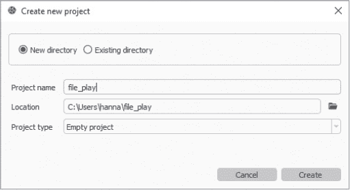
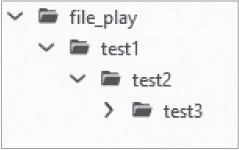
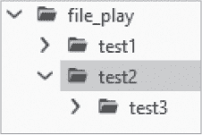
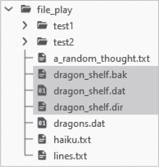
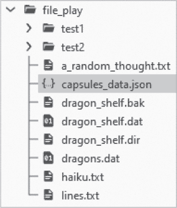

## 第十四章：**文件和文件夹**


文件让你能够以持久化和可共享的方式存储数据。没有它们，几乎不可能完成任何实际工作。Python 提供了许多模块和方法来处理文件、文件夹和目录路径。这些方法可以让你读取和写入文本文件；在退出程序后保存复杂数据；创建、移动和删除文件夹；以及执行其他系统级任务。

在本章中，我们将使用内置的操作系统模块（`os`）、路径库模块（`pathlib`）和 shell 工具模块（`shutil`）来处理文件、文件夹和目录路径。然后，我们将使用内置函数打开、读取、写入和关闭文本文件，并使用内置的 `pickle`、`shelve` 和 `json` 模块来保存和存储更复杂的数据类型，如 Python 列表和字典。最后，我们将学习在打开文件时如何处理异常。

### **创建一个新的 Spyder 项目**

让我们创建一个新的 Spyder 项目来用于本章。如果你需要复习 Spyder 项目的使用，请参阅第 68 页的“使用项目文件和文件夹”部分（第 68 页）。

首先，启动 Spyder（可以从开始菜单或 Anaconda Navigator 中启动），然后在顶部工具栏中点击 **项目** ▸ **新建项目**。在打开的创建新项目对话框中（图 12-1），确保“位置”框中包含你的主目录，将项目名称设置为 **file_play**，然后点击 **创建** 按钮。



*图 12-1：Spyder 创建新项目对话框*

现在你应该能在 Spyder 的文件资源管理器面板中看到这个新文件夹。

### **处理目录路径**

在你开始处理文件和文件夹（也称为 *目录*）之前，你需要知道如何找到它们以及将它们保存在哪里。为此，你需要一个地址，也就是 *目录路径*。

目录路径是用来唯一标识目录结构中某个位置的字符字符串。路径以根目录开始，在 Windows 中用一个字母（如 *C:\*）表示，在基于 Unix 的系统中用正斜杠（/*）表示。在 Windows 中，其他驱动器会被分配一个不同于 *C* 的字母，macOS 中的驱动器位于 */volume* 下，而 Unix 中的驱动器位于 */mnt* 下（表示“挂载”）。

路径名在不同的操作系统中表现不同。Windows 使用反斜杠（*\*）分隔文件夹，而 macOS 和 Unix 系统则使用正斜杠（/*）。在 Unix 系统中，文件夹和文件名对大小写敏感。

操作系统之间的这些差异可能会导致问题，特别是当你尝试编写可以在任何系统上运行的代码时。如果你在 Windows 中编写程序并使用反斜杠表示路径，其他平台将无法识别这些路径。幸运的是，Python 提供了标准库模块，如 `os` 和 `pathlib`，来帮助你解决这个问题。

#### ***操作系统模块***

操作系统（`os`）模块被描述为“系统相关事项的杂物抽屉”。表 12-1 总结了该模块中一些最常用的方法。要查看完整的方法列表及其使用详情，请访问文档 *[`docs.python.org/3/library/os.html`](https://docs.python.org/3/library/os.html)*。

**表 12-1：** 有用的 `os` 模块方法

| **方法** | **描述** |
| --- | --- |
| `os.getcwd()` | 返回当前工作目录 (cwd) 的位置 |
| `os.chdir()` | 将 cwd 更改为指定路径 |
| `os.getsize()` | 返回文件的大小（以字节为单位） |
| `os.listdir()` | 返回指定目录内的文件和文件夹列表（默认为 cwd） |
| `os.mkdir()` | 根据指定路径创建新目录 |
| `os.makedirs()` | 根据指定路径创建多个嵌套目录 |
| `os.rename()` | 重命名指定的文件或目录 |
| `os.rmdir()` | 删除一个空目录 |
| `os.walk()` | 生成目录树中的文件名 |
| `os.path.join()` | 连接路径组件并返回包含拼接路径的字符串 |
| `os.path.split()` | 将路径名拆分为头部和尾部（尾部=最后一个路径组件） |
| `os.path.abspath()` | 返回指定路径的规范化绝对版本 |
| `os.path.normpath()` | 根据当前系统修正路径分隔符 |
| `os.path.isdir()` | 检查指定路径是否对应现有目录 |
| `os.path.isfile()` | 检查指定路径是否对应现有文件 |
| `os.path.isabs()` | 检查指定路径是否为绝对路径 |
| `os.path.exists()` | 检查指定路径是否存在 |

这些 `os` 方法中的几个对于发现你之前未知道的路径非常有帮助。例如，要确定你当前工作的目录名称（即*当前工作目录*，或 *cwd*），可以导入 `os` 模块并在控制台中输入以下内容：

```py
In [1]: import os

In [2]: os.getcwd()
Out[2]: 'C:\\Users\\hanna\\file_play'
```

在这个例子中，你使用了 `os.getcwd()` 方法来获取当前工作目录的路径（你的路径会有所不同）。这是一个 Windows 示例，因此使用反斜杠来分隔目录名称，而且因为这是一个字符串，反斜杠必须通过另一个反斜杠进行转义（有关转义序列的复习，请参见 第 190 页）。`os.getcwd()` 方法会为你插入这些反斜杠，但如果你尝试在其他操作系统中使用这个路径，可能会遇到问题。

当前工作目录在进程启动时会分配给该进程（即程序的运行实例）。对于 Python 程序，当前工作目录始终是包含该程序的文件夹。

你可以使用 `os.chdir()` 从当前工作目录切换到另一个目录，示例如下：

```py
In [3]: os.chdir('C:\\Users\\hanna')

In [4]: os.getcwd()
Out[4]: 'C:\\Users\\hanna'
```

如你所见，这个新目录变成了当前工作目录。

如果你在 Windows 上工作并且不想输入双反斜杠，可以在路径名称前输入`r`，将其转换为原始字符串：

```py
In [5]: os.chdir(r'C:\Users\hanna')

In [6]: os.getcwd()
Out[6]: 'C:\\Users\\hanna'
```

为了使你的程序兼容所有操作系统，请使用`os.path.join()`方法，将文件夹名称和文件名作为独立的字符串传入，而不加分隔符字符。`os.path`方法会根据你使用的系统返回正确的分隔符。这使得文件和文件夹名的操作与平台无关。下面是一个示例：

```py
In [13]: path = '/Users/'

In [14]: path2 = os.path.join(path, 'hanna', 'file_play')

In [15]: path2
Out[15]: '/Users/hanna\\file_play'

In [16]: os.chdir(path2)

In [17]: os.getcwd()
Out[17]: 'C:\\Users\\hanna\\file_play'
```

在这个片段中，你将一个路径名作为字符串赋值给`path`变量。注意，你可以在 Windows 中安全地使用正斜杠。接下来，你使用`os.path.join()`方法创建了一个新的路径变量（`path2`）。即使在`Out[15]`行中的输出看起来有点乱，`os.path.join()`方法会根据你使用的操作系统自动修正分隔符（见`In[16]` - `Out[17]`行）。

你也可以将一个使用错误分隔符的现有路径通过`os.normpath()`转换为你正在使用的系统路径。下面是一个示例，其中 Unix 的正斜杠被转换为 Windows 的反斜杠：

```py
In [18]: path = 'C//Users//hanna'

In [19]: os.path.normpath(path)
Out[19]: 'C\\Users\\hanna'
```

#### ***绝对路径与相对路径***

从驱动器到当前文件或文件夹的完整目录路径被称为*绝对路径*。你可以使用被称为*相对路径*的快捷方式，使得目录操作更加简便。

相对路径是从当前工作目录的视角进行解析的。而绝对路径是以正斜杠或驱动器标签开始的，相对路径则不是。在以下代码片段中，你可以在不输入绝对路径的情况下切换目录，因为 Python 知道当前工作目录中的文件夹：

```py
In [20]: import os

In [21]: os.getcwd()
Out[21]: 'C:\\Users\\hanna'

In [22]: os.chdir('file_play')

In [23]: os.getcwd()
Out[23]: 'C:\\Users\\hanna\\file_play'
```

在幕后，相对路径被连接到指向当前工作目录的路径，以形成完整的绝对路径，该路径显示在`Out[23]`行中。

在 Windows、macOS 和 Linux 中，你可以通过使用点号（`.`）和点点（`..`）来识别文件夹，减少输入。例如，在 Windows 中，`.\`表示当前工作目录，`..\`表示包含当前工作目录的父目录。你也可以使用点号获取当前工作目录的绝对路径：

```py
In [24]: os.path.abspath('.')
Out[24]: 'C:\\Users\\hanna\\file_play'
```

如果你需要访问的文件、文件夹或用户自定义模块存储在与你的代码相同的文件夹中，你可以直接在代码中引用该项目的名称，而无需路径或“点”快捷方式。以下是一个示例，我们在*file_play*文件夹内创建多个嵌套文件夹。因为*file_play*是当前工作目录，这些文件夹将位于其中，所以不需要包含文件路径：

```py
In [25]: os.makedirs(r'test1/test2/test3')
```

在这个示例中，`os.makedirs()`方法使用原始字符串创建了三个嵌套文件夹（*test1*、*test2*和*test3*）。现在你应该能在 Spyder 项目的文件资源管理器窗格中看到这三个文件夹（图 12-2）。



*图 12-2：Spyder 项目中的三个新文件夹*

#### ***pathlib 模块***

`os`模块被广泛使用，你应该熟悉它的各种方法和语法。但它将路径视为字符串，这可能会变得繁琐，并且需要你使用标准库中其他模块的功能（仅仅为了收集和移动文件，跨目录操作就需要三个模块）。

另一种选择是使用更小且更集中的`pathlib`模块。该模块将路径视为对象而非字符串，并将所需的路径功能集中在一个地方。它与操作系统无关，使得它在编写跨平台程序时非常有用。

该模块的`Path`和`PurePath`类不仅帮助你处理目录路径，它们还复制了`os`模块中的一些有用方法，用于以下任务：

+   获取当前工作目录：`Path.cwd()`

+   创建目录：`Path.mkdir()`

+   重命名目录：`Path.rename()`

+   删除目录：`Path.rmdir()`

**注意**

*pathlib 中的 Path 类分为*纯路径*和具体路径。PurePath 对象像字符串一样作用，提供路径处理操作，如编辑路径、连接路径、查找父路径等，但它们不会访问文件系统。具体路径继承自 PurePath，提供了纯路径操作和新的方法，用于对路径对象进行系统调用。具体路径让你可以访问文件系统，进行目录搜索、删除目录、写入文件等操作。*

表 12-2 总结了`pathlib`模块中一些较为有用的方法。欲了解完整列表，请访问文档 *[`docs.python.org/3/library/pathlib.html`](https://docs.python.org/3/library/pathlib.html)*。该文档还包括了`os`方法与其对应的`Path`和`PurePath`方法的完整映射。

**表 12-2：** 用于路径操作的有用`Path`和`PurePath`方法

| **方法** | **描述** |
| --- | --- |
| `Path.cwd()` | 返回当前工作目录的路径对象 |
| `Path.exists()` | 返回布尔值，指示路径是否指向一个现有的文件或文件夹 |
| `Path.home()` | 返回表示用户主目录的路径对象 |
| `PurePath.is_absolute()` | 返回布尔值，指示路径是否为绝对路径 |
| `Path.is_dir()` | 如果给定路径指向一个目录（或符号链接），返回`True` |
| `Path.iterdir()` | 生成给定目录的内容 |
| `PurePath.joinpath()` | 将给定路径与其他参数逐个连接 |
| `Path.mkdir()` | 在给定路径创建一个新目录 |
| `Path.readlink()` | 返回给定符号链接的路径 |
| `Path.resolve()` | 将路径转换为绝对路径，解析任何符号链接；返回新路径 |
| `Path.rmdir()` | 删除空目录 |
| `Path.unlink()` | 删除一个文件或符号链接 |

下面是如何使用`Path`创建路径变量。首先从模块中导入类，如下所示：

```py
In [26]: from pathlib import Path

In [27]: a_path = Path('folder1', 'folder2', 'file1.txt')

In [28]: a_path
Out[28]: WindowsPath('folder1/folder2/file1.txt')
```

请注意，`Path`返回了一个`WindowsPath`对象。如果你使用的是 macOS 或 Linux，你应该看到一个`PosixPath`对象。还要注意，尽管`WindowsPath`对象显示的是正斜杠，但实际上它在后台使用的是正确的 Windows 反斜杠：

```py
In [29]: print(a_path)
folder1\folder2\file1.txt
```

`Path` 包含可以让你的代码更具可读性且更方便编写的方法。假设你想将一个路径追加到你的主目录。你可以使用`home()`方法来获取路径，而无需输入完整的路径：

```py
In [30]: home = Path.home()

In [31]: another_path = Path(home, 'folder1', 'folder2', 'file1.txt')

In [32]: print(another_path)
C:\Users\hanna\folder1\folder2\file1.txt
```

或者，你可以将所有操作放在一行中，并使用正斜杠而不是逗号来分隔路径组件：

```py
In [33]: another_path = Path.home() / 'folder1' / 'folder2' / 'file1.txt'

In [34]: another_path
Out[34]: WindowsPath('C:/Users/hanna/folder1/folder2/file1.txt')
```

如果你使用的是 Windows，不必担心那些正斜杠。如前所示，路径对象会根据使用的系统自动识别并返回正确的格式。

每个`Path`对象都包含用于处理文件和文件夹的有用属性。这些属性可以让你获取像路径的`stem`、文件的`name`或扩展名（`suffix`）等信息。例如，`parent`属性返回给定文件路径的最直接的父级。在以下示例中，我们获取到`another_path`变量中文本文件的路径*直到*该文件：

```py
In [35]: print(another_path.parent)
C:\Users\hanna\folder1\folder2
```

你可以多次访问此属性，以沿着给定文件的祖先树向上遍历，像这样：

```py
In [36]: print(another_path.parent.parent.parent)
C:\Users\hanna
```

如前所述，`pathlib`提供了对基本文件系统操作的访问，如移动、重命名和删除文件和文件夹。这些方法不会在执行前提醒你或等待确认，所以在使用它们时你需要非常小心。否则，你可能会轻易删除或覆盖你想保留的数据。

#### ***Shell 工具模块***

内建的 shell 工具模块（`shutil`）提供了用于处理文件和文件夹的高级函数，如复制、移动和删除。表 12-3 总结了一些最常用的方法。有关所有可用方法的列表及其详细使用说明，请访问文档：*[`docs.python.org/3/library/shutil.html`](https://docs.python.org/3/library/shutil.html)*。

**表 12-3：** 有用的`shutil`模块方法

| **方法** | **描述** |
| --- | --- |
| `copy()` | 复制文件（如果包括路径，则会复制到新目录） |
| `copy2()` | 与`copy()`相同，但会保留源文件的所有元数据 |
| `copytree()` | 递归地将源目录下的整个目录树复制到新的目标目录，并返回目标目录路径 |
| `disk_usage()` | 返回文件系统的磁盘使用统计信息，作为一个命名元组，包含 total、used 和 free 属性，单位为字节 |
| `move()` | 将文件或目录移动到另一个位置并返回目标位置 |
| `rmtree()` | 删除整个目录树（非常危险） |
| `make_archive()` | 创建一个归档文件（zip 或 tar），并返回其名称 |

这是一个示例，我通过使用点（.）表示绝对路径来获取系统的当前磁盘使用情况：

```py
In [37]: import shutil

In [38]: gb = 10**9

In [39]: total, used, free = shutil.disk_usage('.')

In [40]: print(f"Total memory (GB): {total / gb:.2f}")
Total memory (GB): 238.06

In [41]: print(f"Used memory (GB): {used / gb:.2f}")
Used memory (GB): 146.85

In [42]: print(f"Free memory (GB): {free / gb:.2f}")
Free memory (GB): 91.22
```

在下一个示例中，我们将 *test2* 文件夹移动到 *file_play* 文件夹下的新位置。为此，我们将当前路径（当前工作目录用点文件夹表示）和目标路径传递给 `move()` 方法（注意路径已为 Windows 配置）：

```py
In [43]: shutil.move('.\\test1\\test2', '.\\')
Out[43]: '.\\test2'
```

你应该在 Spyder 的文件资源管理器中看到此更新（比较 图 12-2 和 图 12-3）。子文件夹会随着父文件夹移动，所以 *test3* 文件夹会保持在 *test2* 文件夹下。



*图 12-3：test2 文件夹已移至 file_play 文件夹下*

**注意**

*使用 shutil 方法时一定要小心；没有警告信息，可能会导致意外行为。rmtree() 方法尤其危险，因为它会永久删除文件夹及其内容。你可能会清除系统的大部分内容，丢失与 Python 项目无关的重要文档，甚至可能会损坏电脑！*

现在你已经对使用 Python 操作文件和文件夹有了一些了解，是时候开始写入和读取文件了。我们将从简单的文本文件开始，然后再转向更复杂的数据结构。

**测试你的知识**

1.  '.' 文件夹表示：

a.  当前工作目录

b.  当前工作目录的父目录

c.  绝对路径

d.  当前工作目录的子目录

2.  你应该特别小心使用哪种方法？

a.  `shutil.move()`

b.  `shutil.copytree()`

c.  `Path.resolve()`

d.  `shutil.rmtree()`

3.  对还是错：相对目录路径是相对于根目录的。

4.  你可以使用 `os.path.join()` 方法来：

a.  返回目录路径作为对象而不是字符串

b.  返回目录路径作为列表而不是字符串

c.  返回适合你操作系统的路径分隔符

d.  为你的操作系统修正现有的路径分隔符

5.  `pathlib` 模块将路径视为 ___________ 。

### **处理文本文件**

*纯文本* 文件由可读字符组成，这些字符使用一些标准（如 ASCII）进行编码，除了空格、制表符和换行符外没有其他格式信息。纯文本文件的示例有文本文件 (*.txt*)、Python 文件 (*.py*) 和逗号分隔值文件 (*.csv*)。纯文本文件是跨平台的。你可以使用 Windows 的记事本和 macOS 的 TextEdit 应用程序打开并阅读它。

Python 的标准库包括用于读取和写入文本文件的内置函数。`pathlib` 模块也包含处理文本文件的方法。在接下来的部分中，我们将首先使用内置函数，然后再看 `pathlib` 的替代方法。

#### ***读取文本文件***

使用 Python，你可以通过多种方式从文本文件中读取字符串。例如，你可以读取单个字符、完整的行、整个文件等等。为了演示，打开你的系统文本编辑器并输入以下内容。确保在前两行后按回车键：

```py
This is the first line.
This is the second line.
This is the third line.
```

将文件保存在*file_play*文件夹中，命名为*lines.txt*。

**注意**

*你可以在 Spyder 文件资源管理器中双击文本文件以编辑和查看其内容。你也可以通过顶部工具栏的“文件 ▸ 新建文件”来生成文本文件。使用“另存为”命令选择 .txt 扩展名。*

现在，在控制台中输入以下内容以打开、读取和关闭文件：

```py
In [44]: f = open('lines.txt', 'r')

In [45]: f
Out[45]: <_io.TextIOWrapper name='lines.txt' mode='r' encoding='cp1252'>
```

在第一行，我们使用内置的 `open()` 函数打开文件，并将其内容赋给 `f` 变量（代表“文件”）。`open()` 函数接受两个参数，第一个是文本文件的名称。由于该文件位于当前工作目录中，因此无需包含路径。对于不在当前工作目录中的文件，你需要传递绝对路径或相对路径。

第二个参数是*访问模式*，它设置了在打开文件时可以执行的操作类型，例如读取、写入、追加等等。`'r'`告诉 Python 你想要以*只读*模式打开文件。这可以保护文件不被修改。尽管只读模式是默认模式，但明确地包括`'r'`参数可以让你的意图更加清晰。表 12-4 列出了 Python 中一些常见的文件访问模式。

**表 12-4:** 选定的文本文件访问模式

| **模式** | **描述** |
| --- | --- |
| `'r'` | 从文本文件读取。如果文件不存在，抛出异常。 |
| `'w'` | 写入文本文件。创建一个新文件，否则覆盖现有文件。 |
| `'x'` | 写入文本文件，但如果文件已经存在，则返回错误。 |
| `'a'` | 追加到文本文件。如果文件不存在，创建一个新文件。 |
| `'r+'` | 允许读写模式。 |
| `'b'` | 为二进制文件（如 `'rb'`）添加模式。 |

`open()` 函数返回了一个类型为 `_io.TextIOWrapper` 的 `File` 对象。这是一种类似于列表或元组的对象类型。

现在，让我们看一下读取文件的一些文件对象方法（表 12-5）。这些方法通过点号表示法调用文件对象。

**表 12-5:** 选定的文件对象方法和属性

| **方法** | **描述** |
| --- | --- |
| `close()` | 关闭文件。 |
| `closed` | 如果文件已关闭，则返回 `True`。 |
| `read()` | 从文件中读取指定数量的字符并返回一个字符串。 |
| `readline()` | 从文件中读取指定数量的字符并返回一个字符串。默认情况下，从当前位置读取直到行末的所有字符。 |
| `readlines()` | 读取文件中的所有行并将它们作为列表项返回。 |
| `seek()` | 将文件指针的位置更改为文件中的特定位置。 |
| `tell()` | 返回文件读/写指针在文件中的当前位置。 |
| `write()` | 将指定的字符串写入文件。 |
| `writelines()` | 将指定列表中的字符串写入文件。 |

最重要的方法之一是`close()`。在终止进程之前关闭文件是一种良好的实践。如果不关闭文件，可能会耗尽文件描述符（在计算机操作系统中唯一标识打开文件的数字），在 Windows 中锁定文件以防止进一步访问，导致文件损坏，或者在写入文件时丢失数据。

要关闭文件，可以使用点符号调用`close()`方法：

```py
In [46]: f.close()
```

你只能在文件对象打开时进行操作。文件对象关闭后，不能再对其进行操作。

现在，让我们来看一下获取文件内容的方法。在下面的控制台代码片段中，再次打开文件并使用`read()`方法读取第一个字符。该方法返回一个`string`数据类型（记住，在控制台中你可以使用上下箭头键来检索之前的命令）：

```py
In [47]: f = open('lines.txt', 'r')

In [48]: f.read(1)
Out[48]: 'T'

In [49]: f.read(10)
Out[49]: 'his is the'
```

将`read()`方法传入`1`会返回文件中的第一个字符。但传入`10`却没有返回文件中的前 10 个字符。这是因为`read()`会记住它上次读取的位置。要查找文件中的当前位置，可以使用`tell()`方法：

```py
In [50]: f.tell()
Out[50]: 11
```

要手动改变文件中指针的位置，可以将一个数字传递给`seek()`方法，如下所示：

```py
In [51]: f.seek(12)
Out[51]: 12

In [52]: f.read(1)
Out[52]: 'f'

In [53]: f.close()
```

要从头开始，必须关闭并重新打开文件，或者使用`seek()`方法返回到文件的开头。

如果你没有指定要读取的字符数，Python 会返回整个文件。这对于小文件来说没问题，但对于非常大的文件可能会成为问题。为了演示如何读取整个文件，请重新打开文件并调用没有参数的`read()`方法：

```py
In [54]: f = open('lines.txt', 'r')

In [55]: f.read()
Out[55]: 'This is the first line.\nThis is the second line.\nThis is the third
line.'

In [56]: f.close()
```

注意，文件对象包含换行符转义序列（`\n`）。这让它知道如何正确地打印每一行：

```py
In [57]: f = open('lines.txt', 'r')

In [58]: print(f.read()) This is the first line.
This is the second line.
This is the third line.

In[59]: f.close()
```

你可以使用`readline()`方法一次读取一行，如下所示：

```py
In [60]: f = open('lines.txt', 'r')

In [61]: print(f.readline())
This is the first line.

In [62]: print(f.readline())
This is the second line.

In [63]: print(f.readline())
This is the third line.

In [64]: f.close()
```

在这种情况下，“行”由换行符转义序列（`\n`）定义。与`read()`函数类似，`readline()`会记住它上次读取的位置，因此要从头开始，必须关闭并重新打开文件。

使用`readline()`时要小心。不要假设你传递给它的值代表一行；它实际上代表的是一个字符，就像`read()`方法一样。事实上，你可以重复`In[48]-In[49]`行的结果：

```py
In [65]: f = open('lines.txt', 'r')

In [66]: f.readline(1)
Out[66]: 'T'

In [67]: f.readline(10)
Out[67]: 'his is the'

In [68]: f.close()
```

要一次性读取整个文件，可以使用`readlines()`方法。与之前的方法不同，它返回一个包含文件中每一行的列表，而不是字符串。文件中的每一行会成为列表中的一个单独项。以下是一个示例：

```py
In [69]: f = open('lines.txt', 'r')

In [70]: lines = f.readlines()

In [71]: lines
Out[71]: 
['This is the first line.\n', 'This is the second line.\n',
'This is the third line.']

In [72]: f.close()
```

因为输出是一个列表，你可以获取它的长度，遍历它，等等，就像对待任何其他列表一样：

```py
In [73]: len(lines)
Out[73]: 3

In [74]: for line in lines:
    ...:     print(line)
This is the first line.

This is the second line.

This is the third line.
```

在前述方法中，行尾（EOL）标记被保留。这些是字符编码规范（如 ASCII）使用的控制字符，用来表示一行文本的结束。如果你不希望保留这些标记，可以使用列表推导式将其去除：

```py
In [75]: lines = [line.rstrip() for line in open('lines.txt', 'r')]

In [76]: lines
Out[76]: 
['This is the first line.',
'This is the second line.',
'This is the third line.']
```

将之前的输出与`Out[71]`中的输出进行比较。换行符（`\n`）已经消失。`rstrip()`字符串方法会移除字符串右侧指定的尾随字符。如果没有指定字符，它会移除行尾的换行符或空白字符。

#### ***使用 with 语句关闭文件***

由于关闭文件非常重要（且容易被忽视），Python 提供了`with`语句，它在嵌套代码块执行完毕后会自动关闭文件。在这个示例中，我们使用`with`语句和`open()`函数加载文本文件，然后使用`read()`方法获取文件的完整内容，并将其赋值给`lines`变量：

```py
In [77]: with open('lines.txt') as f:
    ...:     lines = f.read()
    ...:     print(lines)
This is the first line.
This is the second line.
This is the third line.
```

每当可能时，尝试在打开文件时使用`with`语句，以确保文件能够正确关闭。要检查文件是否关闭，可以使用它的`closed`属性，返回`True`或`False`：

```py
In [78]: f = open('lines.txt', 'r')

In [79]: f.closed
Out[79]: False

In [80]: f.close()

In [81]: f.closed
Out[82]: True
```

#### ***写入文本文件***

你可以使用`write()`和`writelines()`文件对象方法将字符串写入文本文件（参见表 12-5）。让我们通过一首由我创作的俳句诗来试试这个方法。

要写入文件，首先必须使用写入（`'w'`）文件访问模式打开它（参见表 12-4）。在控制台中输入以下内容：

```py
In [83]: f = open('haiku.txt', 'w')
```

在写入模式下调用`open()`打开文件时，如果指定的文件不存在，它将创建一个新文件；如果文件已经存在，它会完全覆盖该文件，删除其中的内容。在这种情况下，我们只需要输入文件名，因为我们是写入当前工作目录。如果要写入其他地方，你需要使用`chdir()`方法更改目录，或在文件名中包含目录路径。

现在我们有了一个文件对象，可以向其写入字符串，使用换行符来指定回车位置：

```py
In [84]: f.write('Faraway cloudbanks\n')
Out[84]: 19

In [85]: f.write('That I let myself pretend\n')
Out[85]: 26

In [86]: f.write('Are distant mountains')
Out[86]: 21

In [87]: f.close()
```

输出表示每个字符串中的字符数，包括换行符。关闭文件可以释放系统资源，防止不小心向文件写入更多数据。

让我们通过使用`read()`方法来检查是否成功：

```py
In [88]: with open('haiku.txt', 'r') as f:
    ...:     print(f.read()) Faraway cloudbanks
That I let myself pretend
Are distant mountains
```

记住，当你使用`with`语句打开文件时，它会自动关闭。

一行一行地输入非常繁琐。`writelines()`方法允许你*写入*一个字符串列表到文件，就像`readlines()`方法提供了将文本文件*读取*为列表的能力。以下示例创建了一个新的俳句列表，覆盖了现有的*haiku.txt*文件，将该列表写入文件，然后读取该文件：

```py
In [89]: poem = ['In city fields\n',
    ...:         'Contemplating cherry trees\n',
    ...:         'Strangers are like friends\n']

In [90]: with open('haiku.txt', 'w') as f:
    ...:     f.writelines(poem)

In [91]: with open('haiku.txt', 'r') as f:
    ...:     print(f.read())
In city fields
Contemplating cherry trees
Strangers are like friends
```

哎呀，我们忘记给俳句注明出处了——是大诗人一茶。没关系，使用追加（`'a'`）文件访问模式，您可以将字符串添加到现有的文本文件中，而不会覆盖原有内容：

```py
In [92]: with open('haiku.txt', 'a') as f:
    ...:     f.write('                        --Issa')

In [93]: with open('haiku.txt', 'r') as f:
    ...:     print(f.read())
In city fields
Contemplating cherry trees
Strangers are like friends
                        --Issa
```

您还可以使用 `writelines()` 来动态生成新的文件内容，如下所示：

```py
In [94]: with open('a_random_thought.txt', 'w') as f:
    ...:     f.writelines(line for line in poem if line.startswith('C'))

In [95]: with open('a_random_thought.txt', 'r') as f:
    ...:     print(f.read())
Contemplating cherry trees
```

在此示例中，我们过滤了 `poem` 列表，仅将以 `C` 开头的行写入新文件。

#### ***使用 pathlib 读取和写入文本文件***

`pathlib` 模块的 `Path` 类还提供了处理文件和文件夹的方法（见 表 12-6）。这些方法结合了像 `open()` 这样的内置函数，可以让简单的读写操作变得更方便（假设您喜欢使用路径对象）。

**表 12-6：** 一些用于处理文件和文件夹的有用 `Path` 方法

| **方法** | **描述** |
| --- | --- |
| `Path.glob()` | 根据给定模式（如 *.py）返回所有匹配的文件 |
| `Path.is_file()` | 如果给定路径指向常规文件（或符号链接），则返回 `True` |
| `Path.open()` | 根据文件名或路径+文件名打开文件 |
| `Path.read_bytes()` | 返回给定文件的内容作为字节对象 |
| `Path.read_text()` | 返回给定文件的内容作为字符串并关闭文件 |
| `Path.rename()` | 重命名文件或目录并返回新路径 |
| `Path.replace()` | 无条件重命名文件或目录并返回新路径 |
| `Path.touch()` | 在给定路径创建一个文件 |
| `Path.write_text()` | 以文本模式打开指定文件，写入内容，然后关闭文件 |

`Path.read_text()` 方法在后台调用 `open()`，并将文件的内容作为字符串返回。它还会像 `with` 语句一样自动关闭文件。以下是使用章节中早些时候提到的 *lines.txt* 文件的控制台示例：

```py
In [96]: from pathlib import Path

In [97]: p = Path('lines.txt')

In [98]: p.read_text()
Out[98]: 'This is the first line.\nThis is the second line.\nThis is the third
line.'
```

请注意，您必须首先创建一个路径对象（`p`）。对于不熟悉 `pathlib` 的用户来说，相较于上一节回顾的传统文件打开方法，这可能会让人感到困惑。

现在，让我们在 `test1` 文件夹中创建一个文件并使用 `Path` 向其中写入内容。在控制台中输入以下内容：

```py
In [99]: path = Path(Path.cwd() / 'test1' / 'another_haiku.txt')

In [100]: lines2 = 'Desolate moors fray\nBlack cloudbank, broken, scatters\nIn the pines, the
graves' In [101]: path.write_text(lines2)
Out[101]: 78

In [102]: print(path.read_text())
Desolate moors fray
Black cloudbank, broken, scatters
In the pines, the graves
```

`Path.write_text()` 方法接受一个字符串作为参数。与 `open()` 类似，它会覆盖具有相同名称的现有文件。与 `open()` 不同，它不允许使用追加模式。然而，它会自动关闭文件。

您可以在 *[`docs.python.org/3/library/pathlib.html`](https://docs.python.org/3/library/pathlib.html)* 上阅读更多关于 `pathlib` 的内容。

**测试你的知识**

6.  哪些语句或方法会关闭文本文件？

a.  `with` 语句

b.  `Path.read_text()` 方法

c.  `Path.write_text()` 方法

d.  `close()` 方法

e.  上述所有方法

7.  将上一节中创建的 *another_haiku.txt* 文件重命名为 *haiku_2.txt*。使用 `os` 或 `pathlib` 模块。

8.  从第 15 个字符开始打印 *haiku.txt* 文件。

9.  用于向现有文本文件添加文本的文件访问模式是什么？

a.  `w`

b.  `r`

c.  `a`

d.  `b`

10.  真或假：`os.writelines()`方法将列表写入文件；`Path.write_text()`方法将字符串写入文件。

### **处理复杂数据**

文本文件方便且流行，但这并不是唯一的选择。我们迄今为止审查的各种文件写入方法仅接受字符串或字符串列表作为输入。但 Python 包含许多不同的数据类型，例如字典，在您的日常工作中会用到，因此您需要一种方法来保存这些数据。

要保存这些其他数据类型，您需要使用*数据序列化*。此过程将结构化数据（例如 Python 字典）转换为可存储和共享的格式。当从存储中读取时，此格式保留了重建对象所需的信息。这个过程称为*反序列化*。

在本节中，我们将查看像`pickle`和`json`这样的模块，这些模块用于序列化和反序列化数据。`pickle`模块是 Python 的本地序列化模块。它将对象转换为一系列有序的字节（0 和 1），称为*字节流*。通过 pickling 和 unpickling，我们可以轻松地将数据从一个服务器或系统传输到另一个，并将其存储在文件或数据库中。

`json`模块将 Python 对象转换为一种称为*JavaScript 对象表示法*（简称*JSON*）的序列化表示形式，并根据需要进行反序列化。我们在第九章中用`json`来美化打印字典。它适用于几乎所有的编程语言。

这两个模块各有其优势和劣势（见表 12-7）。Pickling 适用于大多数 Python 对象和数据类型，而 JSON 仅限于某些对象和数据类型。

**表 12-7：** Pickle vs. JSON 序列化比较

| **特性** | **Pickle** | **JSON** |
| --- | --- | --- |
| 存储格式 | 字节流 | 人类可读的字符串对象 |
| Python 对象 | 所有对象 | 仅限于某些对象 |
| Python 数据类型 | 几乎所有数据类型 | 仅限于列表、字典、空值、布尔值、数字、字符串、数组和 JSON 对象 |
| 兼容性 | 仅限 Python | 语言无关 |
| 速度 | 相对较慢 | 相对较快 |
| 安全性 | 存在安全问题 | 安全可靠 |

**注意**

*Pickling 不如使用 JSON 安全。您应该非常小心地从未知来源 unpickle 数据，因为它可能包含恶意数据。Pickling 也适用于相对短期的数据存储，因为模块的修订可能不总是向后兼容的。*

#### ***Pickling 数据***

Pickle 意味着保存某物。`pickle`模块（*[`docs.python.org/3/library/pickle.html`](https://docs.python.org/3/library/pickle.html)*）将 Python 数据对象 pickle 成二进制文件。与文本文件不同，人类无法读取二进制文件。

序列化就像将字符串写入文件，只不过你写的是序列化对象。访问模式是相同的，只是增加了一个`'b'`表示“二进制”（表 12-8）。

**表 12-8:** 选择的二进制文件访问模式

| **模式** | **描述** |
| --- | --- |
| `'rb'` | 从二进制文件中读取。 |
| `'wb'` | 写入二进制文件。根据需要创建或覆盖文件。 |
| `'ab'` | 追加到二进制文件。根据需要创建或修改文件。 |

让我们来序列化一些列表。在控制台中输入以下内容：

```py
In [103]: import pickle

In [104]: dragon_prefix = ['Hungarian', 'Chinese', 'Peruvian']

In [105]: dragon_suffix = ['Horntail', 'Fireball', 'Vipertooth']

In [106]: f = open('dragons.dat', 'wb')

In [107]: pickle.dump(dragon_prefix, f)

In [108]: pickle.dump(dragon_suffix, f)

In [109]: f.close()
```

在导入`pickle`模块并创建了两个龙的列表后，我们打开了一个名为*dragons.dat*的新二进制文件。接着，我们使用`pickle.dump()`函数将这两个列表存储到该文件中，传递给它列表的名称和文件对象的名称作为参数。最后，我们关闭了文件（你应该能在*file_play*文件夹中看到它）。

`pickle.dump()`函数将每个列表作为单独的对象写入文件。为了检索这些对象，我们再次以二进制模式打开文件，并调用`pickle.load()`函数，如下所示：

```py
In [110]: f = open('dragons.dat', 'rb')

In [111]: dragon_prefix = pickle.load(f)

In [112]: dragon_suffix = pickle.load(f)

In [113]: print(dragon_prefix)
['Hungarian', 'Chinese', 'Peruvian']

In [114]: print(dragon_suffix)
['Horntail', 'Fireball', 'Vipertooth']

In [115]: f.close()
```

`pickle.load()`函数接受文件对象作为参数，并返回（或反序列化）第一个序列化对象，将其赋值给变量`dragon_prefix`。下一次调用`pickle.load()`将返回下一个序列化对象。这里需要注意的一点是，你不需要知道列表的原始名称（如`dragon_prefix`）就可以提取数据。你可以将它们命名为“poodledoodle”和“snickerdoodle”，你依然会以相同的顺序检索到相同的列表。

但是，如果你想按其他顺序检索序列化的对象，例如只检索龙的后缀怎么办？为此，你需要使用`shelve`模块，它将序列化进一步扩展。

#### ***存储序列化数据***

*数据库*是一个用于存储数据的特殊文件。大多数数据库类似于 Python 字典，因为它们将键映射到值。然而，与字典不同的是，数据库在程序结束后依然会保持数据。

Python 配有`dbm`模块，用于创建和更新数据库文件。然而，这个模块有一个限制，它的键和值必须是字符串或字节。`pickle`模块通过将多种数据类型转换为适合在数据库中使用的字符串，帮助克服了这个限制。

由于需要在数据库中存储非字符串对象的需求非常常见，这一功能已被整合到一个名为`shelve`的模块中，帮助你在文件中存储和访问被序列化的对象。它建立在`pickle`的基础上，实现了一个序列化字典，其中对象通过一个与之关联的键（由字符串组成）进行序列化。这些键让你能够加载已存储的数据文件，并随机访问由序列化对象组成的值。

`shelve`模块生成一个*架子*，它是一个持久化的、类似字典的对象。尽管可以直接序列化字典，但使用`shelve`模块在内存使用上更高效。

**注意**

*因为这个过程涉及到 pickle 模块，加载一个架子可能会执行意外的代码，所以从不可信来源加载架子是非常不安全的。*

让我们来看一下如何使用上一节的龙数据来实现数据存储：

```py
In [116]: import shelve

In [117]: s = shelve.open('dragon_shelf', 'c')

In [118]: type(s)
Out[118]: shelve.DbfilenameShelf
```

在导入模块后，我们使用了 `shelve.open()` 方法，在当前工作目录中创建了一个名为 `dragon_shelf` 的新架子，并将其赋值给变量 `s`，然后获取了 `s` 的数据类型。为了创建这个架子，我们使用了 `'c'` 访问模式。其他 `shelve` 访问模式可以在 表 12-9 中查看。

**表 12-9：** Shelve 访问模式

| **模式** | **描述** |
| --- | --- |
| `'c'` | 打开一个架子，支持读写操作，必要时创建该架子 |
| `'n'` | 创建一个新的、空的架子，支持读写操作，如果需要可以覆盖 |
| `'r'` | 打开一个现有的架子，仅支持读取操作 |
| `'w'` | 打开一个现有的架子，支持读写操作 |

现在，让我们通过键值组合将龙的数据添加到架子上。这会在后台对数据进行序列化。虽然我们在这里创建了列表，但我们也可以像在前面的 `pickle.dump()` 示例中那样，直接使用赋值给列表的变量名。

```py
In [119]: s['prefix'] = ['Hungarian', 'Chinese', 'Peruvian']

In [120]: s['suffix'] = ['Horntail', 'Fireball', 'Vipertooth']

In [121]: s.close()
```

关闭架子会 *同步* 数据，确保任何在内存缓存或缓冲区中的数据被写入磁盘。然后，它通过清除缓存来释放系统资源。

这里有两点需要注意：`shelve` 会自动在文件名后添加 *.dat* 扩展名，并且会创建额外的支持文件（在 图 12-4 中以灰色高亮显示）。这些额外的文件是操作系统特定的。例如，在 macOS 上，你可能只会看到一个名为 *dragon_shelf.db* 的文件。



*图 12-4：Windows 中与 dragon_shelf 相关的文件*

**注意**

*在 Spyder 的文件资源管理器中，二进制文件图标会显示 “01”。文本文件图标则使用两条直线。*

现在，让我们重新打开架子并检索一些数据：

```py
In [122]: s = shelve.open('dragon_shelf', 'r')

In [123]: type(s['prefix'])
Out[123]: list

In [124]: print(f"Dragon suffixes: {s['suffix']}")
Dragon suffixes: ['Horntail', 'Fireball', 'Vipertooth']

In [125]: s.close()
```

在以只读模式打开 *dragon_shelf* 文件后，你可以看到 `prefix` 键对应的是一个 `list` 对象。你还可以先打印出 `suffix` 列表，尽管它是第二个加载到架子上的列表。将这个与前一节中的 `pickle.load()` 方法进行比较，后者按顺序返回被序列化的对象。

##### **使用 with 语句关闭架子**

储存大量数据可能会占用很多内存，因此在完成操作后，关闭架子是非常重要的。由于这很容易被忽视，Python 允许你在打开架子时使用 `with` 语句，以便在某些操作后自动关闭文件。下面是一个示例：

```py
In [126]: with shelve.open('dragon_shelf', 'r') as s:
     ...:     print(type(s['prefix']))
<class 'list'>
```

由于 `with` 语句在代码块执行后关闭了架子，后续对 `s` 的操作将会抛出 `ValueError` 错误：

```py
ValueError: invalid operation on closed shelf
```

##### **使用 Shelve 方法**

架子对象支持字典支持的大多数方法和操作（表 12-10）。这是设计使然，旨在简化从基于字典的脚本过渡到需要持久存储的脚本。

如果您忘记了架子中的键名称，或者使用的是您未创建的架子，您可以使用`keys()`方法来检索这些名称。请注意，您需要使用`list()`函数将输出转换为列表：

```py
In [127]: with shelve.open('dragon_shelf', 'r') as s:
     ...:     print(list(s.keys()))
['prefix', 'suffix']
```

**表 12-10：** Shelve 模块方法

| **方法** | **描述** |
| --- | --- |
| `close()` | 同步并关闭架子对象 |
| `get()` | 返回与键相关的架子值 |
| `items()` | 返回架子的键值对元组 |
| `keys()` | 返回架子的键列表 |
| `pop()` | 删除指定的架子键并返回关联的架子值 |
| `sync()` | 如果架子（shelf）在开启时设置了`True`的写回（writeback），则将所有缓存中的条目写回 |
| `update()` | 从另一个字典或可迭代对象更新架子 |
| `values()` | 返回架子的所有值列表 |

其他一些方法会返回一个可迭代对象，您可以循环遍历。以下是一个使用`items()`方法的示例，该方法返回键值对元组：

```py
In [128]: with shelve.open('dragon_shelf', 'r') as s:
     ...:     print(s.items())
ItemsView(<shelve.DbfilenameShelf object at 0x000001D3956BAF70>)
```

打印输出时显示的是一个对象名称，而不是您可能预期的键值对。要获取键值元组，请循环遍历输出，如下所示：

```py
In [129]: with shelve.open('dragon_shelf', 'r') as s:
     ...:     for item in s.items():
     ...:         print(item)
('prefix', ['Hungarian', 'Chinese', 'Peruvian'])
('suffix', ['Horntail', 'Fireball', 'Vipertooth'])
```

您可以在*[`docs.python.org/3/library/shelve.html`](https://docs.python.org/3/library/shelve.html)*上阅读更多关于`shelve`及其方法的内容。

#### ***使用 JSON 存储数据***

使用`json`模块（*[`docs.python.org/3/library/json.html`](https://docs.python.org/3/library/json.html)*），您可以将数据存储为一个单一的人类可读的字符串。以下是一个以 JSON 格式存储的 Python 字典示例：

′{″key1″: ″value1″, ″key2″: ″value2″, ″key3″: ″value3″}′

它看起来就像一个常规的 Python 字典，唯一的不同是：它被单引号包围，这使得整个内容成为一个字符串。

与`pickle`和`shelve`相比，`json`模块提供了一种更快速且更安全的方式来存储和检索复杂的 Python 数据类型。然而，它支持的数据类型比`pickle`少，因为它仅限于字典、列表、空值、布尔值、数字（整数和浮点数）、字符串和 JSON 对象。

JSON 还可以帮助您访问全球范围内的信息。作为一种轻量级的数据交换格式，既便于人类阅读，又便于机器解析，许多网站的应用程序接口（API）使用 JSON 格式传递数据。

##### **以 JSON 格式保存数据**

要查看`json`如何工作，首先创建一个包含三艘著名宇宙飞船乘员容量的 Python 字典，并以 JSON 格式保存。请在控制台输入以下内容：

```py
In [130]: import json

In [131]: crew = dict(Mercury=1, Gemini=2, Apollo=3)

In [132]: crew
Out[132]: {'Mercury': 1, 'Gemini': 2, 'Apollo': 3}

In [133]: capsules_data = json.dumps(crew)

In [134]: capsules_data
Out[134]: '{"Mercury": 1, "Gemini": 2, "Apollo": 3}'

In [135]: with open('capsules_data.json', 'w') as f:
    ...:      f.write(capsules_data)
```

`json.dumps()` 方法将字典转换为 JSON 字符串。你可以像之前一样使用 `open()` 函数以写入模式将 JSON 字符串写入持久化文件。新的 *capsules_data.json* 文件应该会出现在 Spyder 文件资源管理器窗格中（图 12-5）。



*图 12-5：文件资源管理器窗格中的 capsules_data.json 文件*

请注意 Spyder 如何使用特殊图标表示文件。由于它是人类可读的，你可以像打开文本文件一样打开它并阅读其内容。

##### **以 JSON 格式加载数据**

现在，让我们打开、加载并使用 JSON 文件。我们将继续在控制台中工作，但以下示例也可以很容易地在文本编辑器或 Jupyter Notebook 中编写的已保存程序中完成：

```py
In [136]: with open('capsules_data.json', 'r') as f:
     ...:     crew = json.load(f)

In [137]: print(f"The Mercury capsule had {crew['Mercury']} seat.")
The Mercury capsule had 1 seat.

In [138]: print(f"The Apollo capsule had {crew['Apollo']} seats.")
The Apollo capsule had 3 seats.
```

##### **以 JSON 格式保存元组**

在 JSON 格式中没有元组的概念。如果你将元组保存为 JSON 格式，你将得到一个列表。在控制台中，输入以下内容来查看示例：

```py
In [139]: import json

In [140]: t = (1, 2, 3)

In [141]: type(t)
Out[141]: tuple

In [142]: t_json = json.dumps(t)

In [143]: t_json
Out[143]: '[1, 2, 3]'

In [144]: t2 = json.loads(t_json)

In [145]: t2
Out[145]: [1, 2, 3]

In [146]: type(t2)
Out[146]: list
```

在简单的情况下，你可以通过将输出转换回元组来处理：

```py
In [147]: t2 = tuple(t2)

In [148]: t2
Out[148]: (1, 2, 3)

In [149]: type(t2)
Out[149]: tuple
```

对于更复杂的情况，你可能需要在线搜索如何在 JSON 中使用元组。

#### ***打开文件时捕获异常***

读取和写入文件属于用户交互范畴，正如我们在第十章中看到的，用户参与时很多事情可能会出错。处理文件时，这些错误包括尝试打开不存在的文件或路径、没有适当权限尝试打开文件或文件夹、尝试打开文件夹而不是文件等等。

这些问题无法在你的代码中修复，但你可以捕获这些异常并提供一些有用的建议，而不是让程序崩溃并在屏幕上乱七八糟地输出错误信息。

大多数常见的文件加载错误属于操作系统异常类 `OSError`。这些错误包括表 12-11 中显示的错误。

**表 12-11：** 与文件加载相关的常见错误

| **类别** | **子类** |
| --- | --- |
| `BlockingIOError` |  |
| `ChildProcessError` |  |
| `ConnectionError` | `BrokenPipeError` |
| `ConnectionError` | `ConnectionAbortedError` |
| `ConnectionError` | `ConnectionRefusedError` |
| `ConnectionError` | `ConnectionResetError` |
| `FileExistsError` |  |
| `FileNotFoundError` |  |
| `InterruptedError` |  |
| `IsADirectoryError` |  |
| `NotADirectoryError` |  |
| `PermissionError` |  |
| `ProcessLookupError` |  |
| `TimeOutError` |  |

这是一个示例，我们使用 `OSError` 捕获一个不存在的文件（*fluffybunnyfeet.lol*）引发的异常。有关使用 `try` 和 `except` 的复习，请参见第十章。

```py
In [150]: try:
     ...:     with open('fluffybunnyfeet.lol', 'r') as f:
     ...:         data = f.read() ...: except OSError as e:
     ...:     print(e)
     ...: else:
     ...:     print('File successfully loaded.')
     ...: finally:
     ...:     print('File load process complete.')
[Errno 2] No such file or directory: 'fluffybunnyfeet.lol'
File load process complete.
```

`except` 子句打印了一条有用的信息，告知用户文件不存在（这是一个 `FileNotFoundError`）。`finally` 子句则通知用户文件加载过程已经结束。请注意，`finally` 块无论结果如何都会执行，而 `else` 代码块只会在操作成功时执行。

下面是一个成功使用我们之前创建的*haiku.txt*文件的示例：

```py
In [151]: try:
     ...:     with open('haiku.txt', 'r') as f:
     ...:         data = f.read()
     ...: except OSError as e:
     ...:     print(e)
     ...: else:
     ...:     print('File successfully loaded.')
     ...: finally:
     ...:     print('File load process complete.')
File successfully loaded.
File load process complete.
```

欲了解更多关于 Python 内置异常的内容，请访问文档：[`docs.python.org/3/library/exceptions.html`](https://docs.python.org/3/library/exceptions.html)。

#### ***其他存储解决方案***

如果你的数据足够复杂，可能需要更强大的存储解决方案。*可扩展标记语言（XML）* 旨在存储和传输小到中等规模的数据，并广泛用于共享结构化信息。*YAML* 是另一种人类可读的数据序列化语言，常用于配置文件和数据存储或传输的应用中。与 XML 相比，它具有更简洁的语法。*SQLite* 是一种轻量级数据库，提供零配置的关系型数据库管理系统。*层次数据格式（HDF5）* 用于存储大量科学阵列数据。涉及这些存储系统超出了本书的范围，但你可以在线找到关于每种方法的大量信息。

**测试你的知识**

11.  对错判断：`shelve` 模块帮助你在文件中存储和访问被序列化的对象。

12.  在本章讨论的保存和加载复杂数据的方法中，最安全的是：

a.  序列化

b.  同步

c.  JSON 格式

d.  存储

13.  重写本章“使用 JSON 存储数据”部分的船员容量程序，使其根据船员数量自动打印舱体名称和语法正确的“座位”（*seat* 或 *seats*）。

14.  使用控制台调查 JSON 如何处理引号。使用列表 `["don't", "do"]` 和 `['don\'t', 'do']`。

15.  打开和关闭文件的 Python 内置异常属于哪个异常类？

a.  `IOError`

b.  `FileNotFoundError`

c.  `PermissionError`

d.  `OSError`

16.  使用 Python 模块将*lines.txt*文件的副本移动到*test1*文件夹中，然后将其归档为 ZIP 文件。

### **总结**

文件使你能够以持久和可共享的方式保存你的工作，包括你在程序中分配的变量。要使用文件，你需要基本了解计算机文件系统的工作原理，如何操作目录路径，以及如何打开、读取和写入文件。

*绝对*目录路径是指完整的目录路径，从根目录开始（例如 Windows 上的*C:\*）。*相对*目录是相对于当前工作目录定义的。您可以使用快捷方式，例如“*.*”表示绝对目录，“*.\*”表示当前工作目录，以便更轻松地处理目录。

Python 的内置`os`，`pathlib`和`shutil`模块包含用于处理文件和文件夹的有用高级方法。但是，这些方法执行时没有警告，因此在移动、重命名或删除数据时需要小心。

Python 还有其他内置工具，用于处理人类可读的文本文件。要读取文件，首先必须使用`open()`函数将其作为文件对象打开。然后可以在此对象上调用`read()`和`readlines()`等方法。要写入文件，必须以写入模式打开它，然后调用`write()`和`writelines()`等方法。要向现有文件添加数据而不覆盖其内容，必须以追加模式打开它。

使用完文件后，应始终关闭文件以释放系统资源并防止文件意外被覆盖。您可以使用`close()`方法手动关闭文件，或者通过使用`with`语句自动关闭文件。

更复杂的数据，如 Python 字典和列表，可以使用`pickle`模块保存为二进制格式，或者使用`json`模块保存为人类可读的字符串。`shelve`模块帮助您将 pickled 对象存储和访问在*shelf*文件中，这是一个持久化的类似字典的对象，为每个 pickled 对象分配唯一的*key*名称。使用 JSON 格式比 pickling 更快速和安全，但并非所有 Python 对象和数据类型都可以存储在 JSON 中。

尽管理解 Python 文件和文件夹管理的基本工具很重要，但如果你的工作涉及大量存储在磁盘上的数据，你可能需要阅读关于*Python 数据分析库*的内容，也称为*pandas*。这个库包含高级工具，可以将数据从磁盘导入 Python 数据结构，然后再导出。许多文件格式都被支持，包括 Excel，CSV，TXT，SQL，HTML，JSON，Pickle 和 HDF5。我们将在第十五章和第二十章中讨论 pandas。
