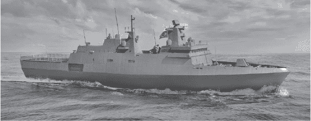

## 第十三章：面向对象编程（**OOP**）


迄今为止，在本教程中，你一直在使用基于执行动作和评估逻辑的过程式编程技术编写代码。你已经学会了如何使用函数和模块组织代码，并使用内置数据类型来组织数据。在本章中，你将学习如何使用面向对象编程来定义你自己的类型，以组织代码和数据。

*面向对象编程（OOP）*是一种语言模型，它允许你将相关数据与作用于这些数据的功能捆绑在一起。数据由*属性*（类似于变量）组成，通过*方法*（类似于函数）进行操作。这些“捆绑”形成了名为*类*的自定义数据类型。类帮助你将程序分成处理不同信息块的不同部分，而不是让所有信息混杂成一个无结构的混乱。

类允许你创建具有特定属性和行为的独立*对象*。通过使用类模板，你可以高效地“制作”多个对象，就像一套蓝图让你建造多个相同型号的汽车。每辆车一开始具有相同的属性，如颜色和里程，并且拥有相同的方法，如加速和刹车，但它们离开工厂后，情况可能会有所不同。一些汽车可能会重新喷漆，另一些可能会失去车轮对齐并向左偏移，它们的里程也会有所不同，等等。

在本章中，你将学习如何定义创建对象的类，编写对象的属性和方法，然后实例化这些对象。你还将编写继承其他类属性和方法的类，并使用数据类减少代码冗余。这个主题的介绍应当帮助你理解 OOP 的基本知识，并让你意识到作为程序员，你如何从中受益。

### **何时使用 OOP**

面向对象编程在编写大型复杂程序时更容易理解，因为它帮助你将代码结构化为更易于理解的小部分。它还减少了代码重复，使得代码更易于维护、更新和重用。因此，大多数商业软件现在都是采用面向对象编程构建的。

因为 Python 是一种面向对象编程语言，你已经在使用其他人定义的对象和方法。但与 Java 等语言不同，Python 并不强制你为自己的程序使用 OOP。它提供了使用其他方法（如过程式编程或函数式编程）来封装和分离抽象层的方式。

拥有这种选择很重要。如果你在小型程序中实现 OOP，大部分程序可能会显得过于复杂。引用计算机科学家 Joe Armstrong 的话来说，“面向对象语言的问题在于它们携带了所有这些隐式的环境。你想要的是一根香蕉，但你得到的是一只拿着香蕉和整个丛林的猩猩！”

作为科学家或工程师，你可以在没有 OOP 的情况下完成很多工作，但这并不意味着你应该忽视它。OOP 使得同时模拟许多对象变得简单，比如一群鸟或一簇星系。当需要在计算机内存中长时间保存和操作某些事物时，例如 GUI 按钮或窗口，它也变得非常重要。而且，由于你会遇到的大多数科学软件包都是基于 OOP 构建的，因此你需要对这一范式有一定的了解。

### **创建一个新的 Spyder 项目**

让我们创建一个新的 Spyder 项目，以便在本章中使用。如果你需要复习 Spyder 项目，请参见第 68 页中的“使用项目文件和文件夹”。

从你的*base*（根）环境启动 Spyder（无论是从开始菜单还是从 Anaconda Navigator）。在开始窗口中，它可能显示为 Spyder（anaconda3）。如果需要复习 conda 环境，请参见第二章。

接下来，在顶部工具栏中，点击**Projects** ▸ **New Project**。在打开的创建新项目对话框中（见图 13-1），确保位置框包含你的主目录，将项目名称设置为**oop**，然后点击**Create**按钮。


*图 13-1：Spyder 创建新项目对话框*

你现在应该能在 Spyder 的文件资源管理器面板中看到这个新文件夹。

为了方便起见，我们将使用位于*anaconda3*文件夹中的默认 conda 环境文件夹来存放第三方库。如果你希望使用与此项目绑定的环境文件夹，请参见第 37 页中的“指定环境位置”的说明。

### **定义护卫舰类**

演示面向对象编程（OOP）比单纯讨论它要容易得多，因此我们来构建一些可能在（非常）简单的战争游戏模拟器中使用的船只对象。每种独特类型的船只都需要自己的类来生成该船只类型的多个版本。我们可以独立追踪和操作这些对象。通过 OOP，船只类、船只对象以及作用于这些对象的方法之间的关系将变得清晰、合逻辑且紧凑。

让我们从定义一个类开始，构建最常见类型的战舰，称为“护卫舰”（见图 13-2）。护卫舰设计要快速、机动性强且多功能，用于护航和保护大型舰船免受空中、表面和水下的威胁。



*图 13-2：巴西塔曼达雷级护卫舰*

要构建护卫舰，你需要一个虚拟船坞，因此，在你的*oop*项目中，打开 Spyder 的文本编辑器并创建一个名为*ships.py*的新文件。将其保存在你喜欢的位置。

为了作为护卫舰的蓝图，使用`class`语句定义一个`Frigate`类。在`class`关键字之后，输入类的名称并加上括号：

```py
class Frigate(object):
 ➊ designation = 'USS'

 ➋ def __init__(self, name):
        self.name = name
        self.crew = 200     
        self.length_ft = 450
        self.tonnage = 5_000
        self.fuel_gals = 500_000
        self.guns = 2
     ➌ self.ammo = self.guns * 300
        self.heading = 0
        self.max_speed = 24
        self.speed = 0
```

根据 PEP 8 风格指南，类名应该以大写字母开头。如果类名由多个单词组成，使用*CapWords*约定，即每个新单词首字母大写，且单词之间不加空格（也叫做*CamelCase*）。

`Frigate`类使用一个参数，`object`。这个`object`参数表示 Python 中所有类型的基类。因为`object`是默认参数，所以在定义类时可以省略显式声明它。

接下来，将字符串`USS`（代表“United States Ship”，即“美国战舰”）赋值给一个名为`designation` ➊的属性。这是船只的名称前缀。你也可以使用 HMS（“Her Majesty’s Ship”，即“英皇舰”）、INS（“Indian Naval Ship”，即“印度海军舰”）或任何你喜欢的名称。在 Python 中，属性是与对象相关联的任何变量。就像在函数中一样，类为属性创建一个新的局部命名空间。

类也是对象，因此它们也可以拥有自己的属性。*类属性*是所有从该类创建的对象共享的属性，表现得有点像全局变量。在这个例子中，你构建的所有护卫舰都会有“USS”前缀，例如“USS Saratoga”。类属性非常高效，因为它们允许你将共享属性存储在一个位置。

接下来，你定义一个*初始化*方法 ➋，用于设置对象的初始属性值。方法实际上是定义在类中的函数。`__init__()`方法是一个特殊的内置方法，Python 在创建新对象时会自动调用它。在这个例子中，它接受两个参数，`self`和对象的`name`，`name`就是你为船只命名的名字。

**注意**

*`__init__()`方法是一个双下划线（dunder）方法，意味着它的名字前后都有双下划线。它也叫做魔法方法或特殊方法，允许你创建像 Python 原生数据结构（例如列表、元组和集合）一样行为的类。它们也是运算符重载和其他函数行为自定义的魔法。当你调用内置的 len()函数时，例如，背后实际上是调用了一个`__len__`方法。*

每个类方法的第一个参数，包括`__init__()`，总是对当前实例的引用，按约定称为`self`。（一个新对象被称为类的*实例*，而设置实例的初始值和行为的过程叫做*实例化*。）

你可以将`self`看作是你给对象命名的占位符。如果你创建一个船只对象并命名为`Intrepid`，`self`就变成了`Intrepid`。`self.speed`属性将变成“Intrepid 的速度”的引用。如果你实例化另一个船只对象并命名为`Indefatigable`，该对象的`self`就变成了`Indefatigable`。这样，`Intrepid`对象的`speed`属性的作用域就与`Indefatigable`对象的作用域相互独立。

现在是时候列出一些护卫舰的属性了。你需要为每艘船指定一个名称，以便区分不同的船只。你还需要指定一些关键的操作和战斗特性值，如燃料、航向和速度。由于这些属性与类的实例相关，因此被称为*实例属性*，并在`__init__()`方法内部分配（例如代码`self.name = name`）。

这些属性中的一些，比如大炮的数量和船只的长度，代表了每艘船共有的、不会随时间变化的值。然而，最好不要将它们设置为*类*属性，因为它们*可能*会发生变化。例如，一艘特定的船只可能会装备额外的实验性炮台，或者它的直升机停机坪可能会延伸至船尾。其他属性，如航向和速度，代表了*预期*会变化的占位符。通常，你应该将属性设置为良好的默认值，比如将油箱加满。

**注意**

*虽然可以使用方法在之后分配新的属性，但最好在`__init__`方法中初始化所有属性。这样，所有可用的属性都会方便地列出，且易于查找。*

花点时间查看初始化方法中的属性列表。为了简洁起见，我省略了一些在真实模拟中可能需要的属性，比如船只当前的位置、当前的“健康”状况，以及反向速度的最大限制。你可能还想要为建造和操作船只设置“成本”属性，这样可以帮助你保持预算。

还要注意，在分配属性时，你可以像使用变量一样使用表达式。例如，我们假设船只每门大炮携带 300 发弹药 ➌。

现在，让我们定义一些方法来驾驶船只并开火。

#### ***定义实例方法***

*实例方法*用于访问或修改对象的状态。它们必须具有`self`参数，以引用当前对象。

现在，让我们定义一个`helm()`方法，用于设置船只的航向和速度，并将速度限制在最大值。请在文本编辑器中输入以下内容（`def`语句应相对于类定义缩进四个空格）：

```py
    def helm(self, heading, speed):
     ➊ self.heading = heading
        self.speed = speed
        if self.speed > self.max_speed:
         ➋ self.speed = self.max_speed
        print(f"\n{self.name} heading = {self.heading} degrees")
        print(f"{self.name} speed = {self.speed} knots")
```

除了`self`参数外，你还需要传递一个航向（介于 0 到 359 度之间）和一个速度（单位为节）。

方法定义中的代码使用传递给它的参数更新对象的现有属性。要访问和更改属性，可以使用点符号。你之前已经使用过这种语法来调用像`os`和`random`模块中的方法。要覆盖在`__init__()`方法中最初分配的航向和速度属性，只需将它们设置为传递给方法的值 ➊。

此时，你需要验证用户输入。确保速度值不超过船只的最大速度。将`self.speed`属性与`self.max_speed`属性进行比较。如果大于最大速度，将其设置为`self.max_speed` ➋。通过打印船的航向和速度来完成方法。

现在，让我们定义一个名为`fire_guns()`的方法，用于一次性发射所有大炮。除了`self`之外，你不需要传递任何参数给此方法：

```py
    def fire_guns(self):
      ➌ if self.ammo >= self.guns:
            print("\nBOOM!")
          ➍ self.ammo -= self.guns
            print(f"\n{self.name} ammo remaining = {self.ammo} shells")
        else:
            print("\nInsufficient ammunition!")
```

首先，检查是否还有弹药 ➌。如果有，打印“BOOM！”然后，将`self.ammo`属性减去枪支数量（`self.guns`） ➍，并显示剩余的子弹数。否则，打印出弹药耗尽的消息。

这里需要注意的一点是，我们定义的方法没有返回任何内容。相反，它们直接在原地更改属性值。这种行为非常类似于在函数内更改全局变量（参见第十二章）。然而，这些方法之所以可以接受，是因为这些属性存在于类的范围内，而不是全局命名空间中。由于这些变化仅限于类的局部命名空间，所以跟踪和调试问题比使用全局变量要容易得多。

#### ***实例化对象并调用实例方法***

我们已经定义了一个`Frigate`类以及一些用于操作`Frigate`对象的方法。现在，让我们实例化一艘船并开始使用它。将以下代码添加到*ships.py*文件中，并保存：

```py
garcia = Frigate('garcia')
print(f"\n----------{Frigate.designation} {garcia.name.upper()}----------")
print(f"\nCrew complement = {garcia.crew}")
garcia.fire_guns()
garcia.fire_guns()
garcia.helm(heading=180, speed=30)
```

这段代码首先实例化了一个名为“Garcia”的新`Frigate`对象，并将其赋值给`garcia`变量。然后，它打印出船的名称，并调用内置的`upper()`方法以大写字母显示。

请注意，这段代码通过使用类名访问`Frigate.designation`类属性来打印“USS”标识。你可能注意到，在这里直接输入“USS”会更容易，而不是访问`designation`属性。我们使用这个属性是为了演示类属性的工作方式，同时也想强调类属性的一个常见问题：在许多情况下，你可以找到一个同样好的替代方案来避免使用它们。

接下来，代码打印船员配备情况，使用点符号表示法访问`crew`属性。最后，它发射大炮两次，然后改变船只的方向和速度。

如果运行文件，你应该会看到以下输出：

```py
----------USS GARCIA----------

Crew complement = 200

BOOM!

garcia ammo remaining = 598 shells

BOOM! garcia ammo remaining = 596 shells

garcia heading = 180 degrees
garcia speed = 24 knots
```

使用我们的`Frigate`类模板，我们可以创建任意数量的船只。让我们再创建一艘名为“Boone”的船。在文本编辑器中输入以下内容并保存：

```py
boone = Frigate('Boone')
print(f"\n----------{Frigate.designation} {boone.name.upper()}----------")
boone.fire_guns()
boone.fire_guns()
boone.helm(heading=270, speed=-1)
```

现在，运行它以查看此输出：

```py
----------USS BOONE----------

BOOM!

Boone ammo remaining = 598 shells

BOOM!

Boone ammo remaining = 596 shells

Boone heading = 270 degrees
Boone speed = -1 knots
```

你现在有两艘船，它们使用相似的代码，但速度和航向不同。使用`Frigate`类和面向对象编程，你可以轻松创建和跟踪数百艘具有不同属性的船只。

**测试你的知识**

1.  面向对象编程（OOP）通过以下方式使代码更易于阅读、维护和更新：

a.  消除对函数的需求

b.  减少代码重复

c.  使用方法而非函数

d.  给猩猩提供香蕉

2.  由类创建的对象的名称是什么：

a.  子类

b.  属性

c.  实例

d.  方法

3.  判断题：方法是定义在类中的函数，并通过点符号调用。

4.  在 OOP 中，你可以将`self`参数理解为：

a.  调用的类名的占位符

b.  调用方法时的占位符

c.  创建对象时的占位符

d.  以上所有

5.  编写一个`Parrot`类，包含名称、颜色和年龄属性，并具有尖叫和“模仿”（重复）输入的方法。

### **使用继承定义导弹护卫舰类**

今天，战舰上的炮已经大多被导弹系统取代（图 13-3）。我们可以通过简单地使用继承技术重新改造现有的`Frigate`类，轻松构建新的导弹护卫舰。


*图 13-3：护卫舰 HMS Iron Duke，发射她的 Harpoon 反舰导弹系统*

面向对象编程（OOP）中的一个关键概念是*继承*，它允许你基于现有的父类或祖先类定义一个新的子类。（从技术上讲，原始类称为*基类*或*超类*，新类称为*派生类*或*子类*。）新子类继承了现有超类的所有属性和方法。这使得通过添加特定于子类的新属性和方法，复制和扩展现有的基类变得容易。

让我们创建一个新的导弹护卫舰类，名为`GMFrigate`，它继承并修改我们当前的`Frigate`类。在你的*ships.py*程序的底部输入以下内容：

```py
class GMFrigate(Frigate):
 ➊ designation = Frigate.designation

    def __init__(self, name):
     ➋ Frigate.__init__(Frigate, name)
     ➌ self.missiles = 100 
        self.ammo = self.guns * 100

    def fire_missile(self):
        if self.missiles > 0:
            print("\nSSSSSSSSSSSttttt!")
            self.missiles -= 1
            print(f"\n{self.name} missiles remaining = {self.missiles}")
        else:
            print("\nMissiles depleted")
        self.missiles -= 1
```

要创建一个子类，传递`class`语句父类或超类的名称，在本例中是`Frigate`。记住，当你第一次定义`Frigate`时，你传递了`object`。这意味着`Frigate`从`object`类继承，`object`类是所有 Python 对象的根类。`object`类提供了所有派生类可能需要的常见方法的默认实现。现在通过传递`Frigate`而不是`object`，你将获得`object`下的属性和方法以及你添加到`Frigate`类中的新属性和方法。

导弹护卫舰将与护卫舰使用相同的“USS”命名方式，因此将一个`designation`类属性分配给相同的`Frigate`类属性，并使用点符号进行引用 ➊。你可以跳过这一步，只在需要时使用`Frigate.designation`属性，但通过显式重新分配类属性，你可以增加代码的清晰度。

接下来，我们为 `GMFrigate` 类定义 `__init__()` 初始化方法，该方法与 `Frigate` 类一样，包含 `self` 和 `name` 参数。在其下方，我们调用 `Frigate` 类的初始化方法 ➋，并传入 `Frigate` 而不是 `self`，以及一个 `name` 参数。传入 `Frigate` 类可以访问 `Frigate.__init__()` 方法中的所有属性，因此你无需重复编写代码，例如关于船员、吨位、火炮等内容。

如果你没有为子类定义 `__init__()` 方法，它将使用父类的 `__init__()` 方法。如果你想重写父类中的某些属性值，或添加新的属性，你需要为子类包含一个 `__init__()` 方法，正如我们在这个示例中所做的那样。

我们的原始驱逐舰类不支持导弹，因此添加一个新的 `self.missile` 属性 ➌。将导弹数量设为 `100`。由于这些导弹占用空间，你就没有足够的空间来存放其他弹药，因此通过将 `self.ammo` 属性设为火炮数量的 100 倍，而不是我们之前使用的 300 倍，来 *覆盖* 该属性。注意，这不会影响直接从原始 `Frigate` 类实例化的舰船的弹药数量；它们将使用父类的弹药设置。

你的舰船需要一种发射导弹的方式，因此定义一个新的方法 `fire_missile()`，其行为与之前定义的 `fire_guns()` 类似，但一次只发射一枚导弹。

#### ***实例化一个新的导弹驱逐舰对象***

现在，你可以实例化一个新的导弹驱逐舰。我们将它命名为 “Ticonderoga”：

```py
ticonderoga = GMFrigate('Ticonderoga')
print(f"\n------{ticonderoga.designation} {ticonderoga.name.upper()}------")
for _ in range(3):
    ticonderoga.fire_guns()
ticonderoga.fire_missile()
ticonderoga.helm(95, 22)
```

这段代码会生成以下输出：

```py
------USS TICONDEROGA------

BOOM!

Ticonderoga ammo remaining = 198 shells

BOOM!

Ticonderoga ammo remaining = 196 shells

BOOM!

Ticonderoga ammo remaining = 194 shells

SSSSSSSSSSSttttt!

Ticonderoga missiles remaining = 99

Ticonderoga heading = 95 degrees
Ticonderoga speed = 22 knots
```

通过让你的新类继承 `Frigate` 类的属性和方法，你能够遵循软件开发中的 *DRY*（“不要重复自己”）原则，旨在减少软件模式的重复。不过，你需要小心不要对 `Frigate` 类做出任何更改，除非你希望这些更改也体现在 `GMFrigate` 类中。

**注意**

*Python 允许使用多重继承，即子类可以从多个父类继承。这是通过在类定义中传递以逗号分隔的父类名称来实现的。如果父类中的方法名称没有重叠，使用多重继承是直接的。当方法名称重叠时，Python 会使用一种叫做方法解析顺序（MRO）的过程来解决问题。这可能会比较棘手，因此在大多数情况下，建议使用单一继承、不继承，或者确保所有父类的属性和方法名称不同的情况。*

#### ***使用 super() 函数进行继承***

`super()` 内置函数消除了在调用基类方法时显式调用基类名称的需要。它适用于单继承和多继承。例如，在 `GMFrigate` 类定义中，你在 `GMFrigate` 类的 `__init__()` 方法中调用了 `Frigate` 类的 `__init__()` 方法，如下所示：

```py
    def __init__(self, name):
        Frigate.__init__(Frigate, name)
```

这让 `GMFrigate` 类从 `Frigate` 类继承。或者，你可以使用 `super()` 函数，它返回一个代理对象，允许访问基类的方法：

```py
    def __init__(self, name):
        super().__init__(name)
```

在这种情况下，`super()` 消除了显式调用 `Frigate` 类的需要。在使用单一继承时，`super()` 只是一个更高级的方式来引用基类类型。它使代码更易于维护。例如，如果你在代码中到处使用 `super()` 并且想更改基类的名称（比如从 `Frigate` 改为 `Type26Frigate`），你只需要在定义基类时更改一次名称。

`super()` 的另一个用途是访问在新类中被重写的继承方法。让我们看一个例子，我们定义一个 `Destroyer` 类，该类包括了较小型的护卫舰（另一种类型的军舰）上的炮火，外加一些更大的炮火。在文本编辑器中启动一个新的 *super_destroyer.py* 文件，然后输入以下内容：

```py
   class Corvette:
       def fire_guns(self):
           print('boom!')

➊ class Destroyer(Corvette):
       def fire_guns(self):
        ➋ super().fire_guns()
           print('BOOM!')
```

首先，我们定义一个 `Corvette` 类，并为其添加一个触发炮火的方法。因为这些炮火相对较小，所以它们发出的声音是小写的“boom”。接下来，我们定义一个从 `Corvette` 类继承的 `Destroyer` 类 ➊。它有自己的 `fire_guns()` 方法，会为其大炮打印“BOOM!”。

要触发驱逐舰上的小型炮火，请使用 `super()` 函数 ➋。因为“super”指的是*基类*，它调用了 `Corvette` 类的 `fire_guns()` 方法。

现在，让我们实例化一个护卫舰和驱逐舰对象，并触发它们的炮火：

```py
print('-----A Corvette-----')
corvette = Corvette()
corvette.fire_guns()

print('\n-----A Destroyer-----')
destroyer = Destroyer()
destroyer.fire_guns()
```

这是输出结果。注意到“boom”的两种版本都被驱逐舰对象打印出来：

```py
-----A Corvette-----
boom!

-----A Destroyer-----
boom!
BOOM!
```

**注意**

*使用 super() 是有些争议的。一方面，它使代码更易于维护；另一方面，它使代码变得不够显式，这违反了 Python 的禅宗格言“显式优于隐式。”*

### **对象中的对象：定义舰队类**

回到我们的战争模拟，让我们创建一个 `Fleet` 类来操作我们已经实例化的所有舰船对象。没错：使用面向对象编程（OOP），对象可以控制其他对象。

在编辑器中，将以下代码添加到 *ships.py* 文件的底部：

```py
class Fleet():

    def __init__(self, name, list_of_ships):
        self.fleet_name = name
        self.ships = list_of_ships
        self.fleet_heading = 0  
        self.fleet_max_speed = 0  
        self.fleet_speed = 0
```

这个类的初始化方法看起来和 `Frigate` 类的初始化方法很像，只不过现在它有一个参数用于传递舰船列表。这个列表数据类型的项是之前实例化的舰船对象，比如 `garcia` 和 `boone`。

现在为这个类定义一些方法：

```py
    def find_fleet_max_speed(self):
     ➊ max_speeds = [ship.max_speed for ship in self.ships]
        print(f'\nMaximum ship speeds = {max_speeds} knots')
     ➋ self.fleet_max_speed = min(max_speeds)
        print(f'Fleet maximum speed = {self.fleet_max_speed} knots')

    def fleet_helm(self, heading, speed):
        self.fleet_heading = heading
        self.fleet_speed = speed
     ➌ if self.fleet_speed > self.fleet_max_speed:
            self.fleet_speed = self.fleet_max_speed
        print(f"\n{self.fleet_name} heading = {self.fleet_heading} degrees")
        print(f"{self.fleet_name} speed = {self.fleet_speed} knots") 
        for ship in self.ships:
            ship.heading = self.fleet_heading
            ship.speed = self.fleet_speed
```

一个舰队的速度不能超过最慢的船，因此需要定义一个方法来设置舰队的最大速度，就像我们之前为单个舰船所做的那样。第一步是使用列表推导，遍历`self.ships`列表中的船只，并将它们的最大速度（在`ship.max_speed`属性中找到）追加到一个名为`max_speeds`的新列表中 ➊。

当列表完成后，打印它，并通过调用内置的`min()`函数找到最慢舰船的最大速度 ➋，并将`self.fleet_max_speed`属性设置为该最大速度。最后，打印舰队的最大速度属性。

接下来，定义一个方法来设置舰队的航向和速度。这个方法与我们为单个舰船设置这些值时使用的技术类似。和之前一样，我们会将速度限制在最大速度范围内，以防用户输入无效的速度 ➌。然后，我们打印信息，并遍历`self.ships`列表中的每艘船，设置它们的航向和速度。

让我们通过实例化一个包含之前创建的 Garcia、Boone 和 Ticonderoga 舰船对象的“第七舰队”来测试`Fleet`类。输入以下内容，然后保存并运行程序：

```py
ships = [garcia, boone, ticonderoga]
seventh = Fleet("Seventh", ships) 
print(f"\nShips in {seventh.fleet_name} fleet:") 
for ship in seventh.ships:
    print(f"\t{ship.name.capitalize()}") 

seventh.find_fleet_max_speed()
seventh.fleet_helm(42, 28)
print(f"\ngarcia helm = {garcia.heading, garcia.speed}") print(f"boone helm = {boone.heading, boone.speed}")
print(f"ticonderoga helm = {ticonderoga.heading, ticonderoga.speed}")
```

这将产生以下输出：

```py
Ships in Seventh fleet:
     Garcia
     Boone
     Ticonderoga

Maximum ship speeds = [24, 24, 24] knots
Fleet maximum speed = 24 knots

Seventh heading = 42 degrees
Seventh speed = 24 knots

garcia helm = (42, 24)
boone helm = (42, 24)
ticonderoga helm = (42, 24)
```

由于所有的船都是护卫舰，它们的最大速度没有区别。但如果你有驱逐舰、航母等，你会在`max_speeds`列表中看到不同的值。

使用`Fleet`类及其`fleet_helm()`方法，你可以同时为舰船分配相同的航向和速度。如果你想要覆盖这些设置，也可以通过调用单个船只的`self.helm()`方法来实现，例如：

```py
garcia.helm(heading=50, speed=24)
print(f"\ngarcia helm = {garcia.heading, garcia.speed}")
print(f"boone helm = {boone.heading, boone.speed}")
print(f"ticonderoga helm = {ticonderoga.heading, ticonderoga.speed}")
```

现在，Garcia 的航向与舰队中其他船只的航向不同：

```py
garcia heading = 50 degrees
garcia speed = 24 knots

garcia helm = (50, 24)
boone helm = (42, 24)
ticonderoga helm = (42, 24)
```

### **通过数据类减少代码冗余**

Python 3.7 中引入的内置`dataclass`模块提供了一种方便的方式来使类变得更简洁。虽然数据类主要设计用于存储数据的类，但它们像普通类一样工作，并可以包括与数据交互的方法。一些使用场景包括银行账户类、科学文章内容类和员工信息类。

数据类已经实现了基本的“模板”功能。你可以直接实例化、打印和比较数据类实例，许多在类中常做的事情，比如根据传入的参数实例化属性，都可以简化为几条基本指令。

**注意**

*代码检查器通常会抱怨如果在类中使用超过七个实例属性。这似乎与数据类的目的相矛盾，因为数据类的目的是存储数据。此外，在科学领域，这一限制可能很难遵守，因为通常需要许多属性。尽管可以忽略代码检查器的建议，但你仍然应该尽量限制每个类的实例属性数量，以减少复杂性。你可以尝试将一些作为类属性处理，其他的移动到父类中，合并一些为一个单独的属性，等等。*

#### ***使用装饰器***

数据类是使用一种有用且强大的 Python 工具——*装饰器*来实现的。装饰器是一个设计用来包裹（封装）另一个函数或类的函数，以改变或增强被包裹对象的行为。它使你能够修改行为，而无需永久改变对象。装饰器还可以让你在多个函数上运行相同的过程时避免代码重复，例如检查内存使用情况、添加日志记录或测试性能。

##### **装饰器基础**

为了了解装饰器是如何工作的，让我们定义一个函数来计算一个数字的平方。然后，我们将定义一个装饰器函数来对该结果进行平方。请在控制台输入以下内容：

```py
In [1]: def square_it(x):
   ...:     return x**2

In [2]: def square_it_again(func):
   ...:     def wrapper(*args, **kwargs):
   ...:         result = (func(*args, **kwargs))**2 
   ...:         return result
   ...:     return wrapper
```

第一个函数` square_it()`接受一个数字，由`x`表示，并返回它的平方。第二个函数` square_it_again()`将作为第一个函数的装饰器，稍微复杂一些。

装饰器函数有一个`func`参数，表示一个函数。因为函数是对象，你可以将一个函数作为参数传递给另一个函数，甚至在一个函数内定义一个函数。当我们调用这个装饰器函数时，我们会将` square_it()`函数作为参数传递给它。

接下来，我们定义一个内部函数，叫做`wrapper()`。因为` square_it()`需要一个参数，所以我们需要设置内部函数来处理参数，使用特殊的位置参数和关键字参数`*args`和`**kwargs`。

在`wrapper()`函数内，我们调用传递给装饰器的函数（`func`），对其输出进行平方，将结果赋值给`result`变量，并返回`result`。最后，我们返回`wrapper()`函数。

要使用`square_it_again()`装饰器，调用它，将你想要装饰的函数（`square_it()`）传递给它，并将结果赋值给一个变量（`square`），该变量同样代表一个函数：

```py
In [3]: square = square_it_again(square_it)

In [4]: type(square)
Out[4]: function
```

现在你可以调用这个新函数，并传入一个合适的参数：

```py
In [5]: print(square(3))
81
```

在这个例子中，我们手动调用了装饰器函数。这展示了装饰器是如何工作的，但它有点冗长和复杂。在下一节中，我们将查看一种更方便的使用装饰器的方法。

##### **装饰器语法糖**

在计算机科学中，*语法糖*是简洁明了的语法，简化了语言，使其对人类使用更加“甜美”。装饰器的语法糖是`@`符号，它必须紧跟装饰器函数的名称。接下来的行必须是被包装函数或类的定义语句，如下所示：

```py
@decorator_func_name
def new_func():
     do something
```

在这种情况下，`decorator_func_name`表示装饰器函数，`new_func()`是被包装的函数。类定义可以替代`def`语句。

为了查看其工作原理，让我们重新创建一个数字平方的示例。使用箭头键调出控制台中之前定义的`square_it_again()`函数。因为我们必须在定义要包装的函数之前调用装饰器，所以我们必须将代码顺序与之前的示例相反地编写。

现在，添加装饰器并在下一行定义`.square_it()`函数。请注意，在使用`@`符号时，装饰器函数的名称后不带括号：

```py
In [7]: @square_it_again
   ...: def square_it(x):
   ...:     return x**2
```

要使用装饰后的函数，只需调用它并传入一个数字：

```py
In [8]: square_it(3)
Out[8]: 81
```

请注意，使用`@`装饰器时，我们不需要像在`In [3]`行中那样使用`square`函数。

如果装饰器让你感到有点头晕，不用担心。如果你能输入`@dataclass`，那么你就可以使用数据类了。这个装饰器修改了常规的 Python 类，使得你可以使用更简洁的语法来定义它们。

#### ***定义船只类***

为了看到数据类的优势，让我们定义一个常规类，然后使用数据类重复这个练习。我们的目标是创建通用的船只对象，供我们在模拟网格上进行跟踪。对于每个船只，我们需要提供一个名称、一个分类（如“护卫舰”）、一个注册国家和一个位置。

##### **将船只定义为常规类**

要定义一个名为`Ship`的常规类，在文本编辑器中输入以下内容，然后将其保存为*ship_tracker.py*：

```py
class Ship:
 ➊ def __init__(self, name, classification, registry, location):
        self.name = name
        self.classification = classification
        self.registry = registry
        self.location = location
    ➋  self.obj_type = 'ship'
        self.obj_color = 'black'
```

这段代码看起来与我们之前定义的`Frigate`类非常相似。不过，这次`__init__()`方法包括更多的参数➊。所有这些数据在实例化基于此类的对象时都需要作为参数传递。

注意，我们被迫通过重复每个参数名称（如`classification`）来复制代码：一次作为参数，另两次用于分配实例属性。你需要传递给方法的数据越多，这种冗余就越大。

除了传递给初始化方法的参数外，`Ship`类还包括两个“固定”属性，分别表示对象类型➋和颜色。这些属性使用等号赋值，就像常规类一样。因为这些属性对于给定的对象始终相同，所以无需将其作为参数传递。

现在，让我们实例化一个新的船只对象。输入以下内容，保存文件并运行：

```py
garcia = Ship('Garcia', 'frigate', 'USA', (20, 15))
print(garcia)
```

这创建了一个名为`garcia`的美国护卫舰，位于网格位置(20, 15)。但是，当你打印对象时，输出并不太有帮助：

```py
<__main__.Ship object at 0x0000021F5FF501F0>
```

这里的问题是，打印对象信息需要你定义额外的双下划线方法，如`__str__`和`__repr__`，它们返回对象的字符串表示，供信息性和调试使用。另一个有用的方法是`__eq__`，它允许你比较类的实例。Python 中有很多特殊方法，这里列出了一些基本的例子，详见表 13-1。

**表 13-1：** 基本特殊方法

| **特殊方法** | **描述** |
| --- | --- |
| `__init__(self)` | 在从类初始化一个对象时被调用。 |
| `__del__(self)` | 被调用以销毁一个对象。 |
| `__repr__(self)` | 返回一个可打印的字符串，用于调试时显示对象信息。 |
| `__str__(self)` | 返回一个字符串，用于漂亮地打印有关对象的有用信息。如果未实现，则使用`__repr__`。 |
| `__eq__(self, other)` | 执行两个对象的相等比较（`==`）。 |

为每个你编写的类定义这些方法可能会变得繁琐，这就是数据类派上用场的地方。数据类自动处理有关属性和双下划线方法的冗余问题。

##### **将 Ship 定义为数据类**

现在，让我们再次将`Ship`类定义为数据类。将此操作放在名为*ship_tracker_dc.py*（即“船只跟踪数据类”）的新文件中：

```py
   from math import dist
   from dataclasses import dataclass

   @dataclass
➊ class Ship:
    ➋ name: str
       classification: str
       registry: str
       location: tuple
    ➌ obj_type = 'ship'
       obj_color = 'black'
```

首先导入`math`和`dataclass`模块。我们将使用`math`中的`dist`方法来计算船只之间的距离，并使用`dataclass`来装饰我们的`Ship`类。要使用`dist`，你需要 Python 3.8 或更高版本。

接下来，使用`@`符号将`dataclass`前缀化，使其成为装饰器。在下一行定义`Ship`类，以便让装饰器知道它正在包装这个类➊。

通常，下一步是定义带有`self`和其他参数的`__init__()`方法，但数据类不需要这个。初始化是在幕后处理的，这样就不需要这段代码了。不过，你仍然需要列出属性，但与之前相比冗余大大减少。

对于每个必须作为参数传递的属性，输入属性名称，后跟冒号，再跟一个*类型提示* ➋。类型提示或类型*注解*告诉阅读代码的人预期的数据类型。静态分析工具可以使用类型提示检查代码中的错误。类型提示在 PEP 484 中引入（*[`www.python.org/dev/peps/pep-0484/`](https://www.python.org/dev/peps/pep-0484/)*）。

带有类型提示的类变量称为*字段*。`@dataclass`装饰器检查类以查找字段。如果没有类型提示，该属性将不会成为数据类中的字段。在这个例子中，`Ship`类中的所有字段都使用字符串数据类型（`str`），除了`location`，它使用`tuple`（表示一对 x、y 坐标）。有关常见数据类型的提醒，请参见表 7-5 在第 184 页。

**注意**

*你可以使用类型注解的默认值。例如，location: tuple = (0, 0) 将把新创建的 Ship 对象放置在坐标 x = 0, y = 0 的位置，如果在创建对象时未指定位置。然而，当你使用默认参数时，所有后续的参数必须也有默认值。*

因为我们在创建新对象时不需要传递`obj_type`和`obj_color`属性作为参数，所以我们用等号定义它们而不是冒号，并且不使用类型提示➌。通过像普通类一样赋值，每个`Ship`对象默认会被指定为“船只”，并具有一致的颜色属性用于绘图。

数据类（Dataclasses）可以像常规类一样具有方法。让我们定义一个方法来计算两艘船之间的欧几里得距离。`def`语句应该相对于类定义缩进四个空格：

```py
    def distance_to(self, other):
        distance = round(dist(self.location, other.location), 2)
        return str(distance) + ' ' + 'km'
```

`distance_to()`方法接受当前船只对象和另一个船只对象作为参数。然后，它使用内置的`dist`方法来计算它们之间的距离。该方法返回两点（x 和 y）之间的欧几里得距离，其中 x 和 y 是该点的坐标。距离以字符串形式返回，因此我们可以包含公里数的引用。

现在，在全局作用域中，不进行缩进，创建三个船只对象，并传递以下信息：

```py
garcia = Ship('Garcia', 'frigate', 'USA', (20, 15))
ticonderoga = Ship('Ticonderoga', 'destroyer', 'USA', (5, 10))
kobayashi = Ship('Kobayashi', 'maru', 'Federation', (10, 22))
```

一旦你开始输入`Ship()`类的参数，Spyder 文本编辑器中应该会弹出一个窗口，提示你输入正确的内容（图 13-4）。


*图 13-4：Spyder 文本编辑器弹出窗口，显示 Ship 类中参数的名称和数据类型。*

因为你创建的类是 Python 中的合法数据类型，它们的行为与内置数据类型类似。因此，Spyder 编辑器会使用类型提示来指导你创建船只对象。在下一章中，我们将讨论如何正确地记录类，以便在图 13-4 中替换掉“No documentation available”消息，变成类似“用于在网格上跟踪船只的对象”这样的一行类描述。

还值得注意的是，你不需要为参数使用正确的数据类型。因为 Python 是一个*动态*类型语言（见第七章的第 184 页），你可以将整数作为`classification`参数传递，程序仍然会运行。下面是一个包含错误参数的示例，错误部分以灰色突出显示（请不要将其添加到代码中）：

```py
test = Ship('Test', 42, 'HMS', (15, 15))
```

**注意**

*尽管 Python 解释器会忽略类型提示，你可以使用第三方静态类型检查工具，如 Mypy（[`mypy.readthedocs.io/`](https://mypy.readthedocs.io/)），在程序运行之前分析代码并检查错误。*

`@dataclass` 装饰器是一个代码生成器，它会自动添加方法。这包括 `__repr__` 方法。这意味着，当你调用 `print(garcia)` 时，你现在会看到有用的信息：

```py
print(garcia)
Ship(name='Garcia', classification='frigate', registry='USA', location=(20, 15))
```

现在，让我们检查数据是否存在，并且方法是否正常工作。添加以下代码行并重新运行脚本：

```py
ships = [garcia, ticonderoga, kobayashi]
for ship in ships:
    print(f"The {ship.classification} {ship.name} is visible.")
    print(f"{ship.name} is a {ship.registry} {ship.obj_type}.")
    print(f"The {ship.name} is currently at grid position {ship.location}\n")

print(f"Garcia is {garcia.distance_to(kobayashi)} from the Kobayashi")
```

通过将船只对象放入一个列表中，我们可以遍历该列表，使用点符号访问属性，并打印结果：

```py
The frigate Garcia is visible.
Garcia is a USA ship.
The Garcia is currently at grid position (20, 15)

The destroyer Ticonderoga is visible.
Ticonderoga is a USA ship.
The Ticonderoga is currently at grid position (5, 10)

The maru Kobayashi is visible.
Kobayashi is a Federation ship.
The Kobayashi is currently at grid position (10, 22)

Garcia is 12.21 km from the Kobayashi
```

`Ship` 数据类让你实例化一个船只对象，并在类型注解的字段中存储诸如船只名称和位置等数据。通过减少冗余并自动生成所需的类方法，例如 `__init__()` 和 `__repr__()`，`@dataclass` 装饰器使得你可以编写更易于阅读和编写的代码。

**注意**

*@classmethod 和 @staticmethod 装饰器让你可以在类的命名空间内定义与类的特定实例无关的方法。它们不常用，通常可以用普通函数替代。然而，你应该知道它们的存在，因为它们在 OOP 教程中经常提到，在某些情况下也很有用。*

##### **使用 Ship 数据类绘图**

为了更好地理解如何使用面向对象编程（OOP），让我们进一步推进这个项目，并在网格上绘制我们的船只对象。绘制船只时，我们将使用 Matplotlib 绘图库。（我们将在本书后面更详细地讨论 Matplotlib。）要在你的基础环境中安装该库，打开 Anaconda Prompt（在 Windows 中）或终端（在 macOS 或 Linux 中），并输入以下内容：

```py
conda activate base
conda install matplotlib
```

如果提示输入**y**，请按提示操作，如果你已经安装了 Matplotlib，不用担心，因为 Anaconda 会根据需要更新该软件包。

**注意**

*如果你在使用 Spyder，并且不确定当前激活的是哪个 conda 环境，可以在控制台输入 conda info。这样会显示当前环境及其路径。*

在文本编辑器中，将你的 *ship_tracker_dc.py* 文件保存或复制到一个新文件 *ship_display.py*，并按如下方式编辑：

```py
   from math import dist
   from dataclasses import dataclass
➊ import matplotlib.pyplot as plt

   @dataclass
   class Ship:
       name: str
       classification: str
       registry: str
       location: tuple
       obj_type = 'ship'
       obj_color = 'black'

       def distance_to(self, other):
           distance = round(dist(self.location, other.location), 2)
           return str(distance) + ' ' + 'km'

   garcia = Ship('Garcia', 'frigate', 'USA', (20, 15))
   ticonderoga = Ship('Ticonderoga', 'destroyer', 'USA', (5, 10))
   kobayashi = Ship('Kobayashi', 'maru', 'Federation', (10, 22))

➋ VISIBLE_SHIPS = [garcia, ticonderoga, kobayashi]

➌ def plot_ship_dist(ship1, ship2):
       sep = ship1.distance_to(ship2)  
       for ship in VISIBLE_SHIPS:
        ➍ plt.scatter(ship.location[0], ship.location[1],
                       marker='d',
                       color=ship.obj_color)
           plt.text(ship.location[0], ship.location[1], ship.name)
    ➎ plt.plot([ship1.location[0], ship2.location[0]],
                  [ship1.location[1], ship2.location[1]],
                  color='gray', 
                  linestyle="--")
       plt.text((ship2.location[0]), (ship2.location[1] - 2), sep, c='gray')
       plt.xlim(0, 30)
       plt.ylim([0, 30])
       plt.show()

➏ plot_ship_dist(kobayashi, garcia)
```

首先添加一行代码以导入 Matplotlib ➊。在实例化三个船只对象后，替换从 ➋ 开始的其余代码。这行代码将三个船只对象的列表赋值给变量 `VISIBLE_SHIPS`，它表示你在仿真网格上可以看到的船只。我们将其视为常量，因此使用大写格式。

接下来，定义一个函数来计算两个船只（`ship1` 和 `ship2`）之间的距离，并绘制所有可见的船只 ➌。对两个船只调用 `Ship` 类的 `distance_to()` 方法，将结果赋值给名为 `sep`（表示*分离*）的变量，然后遍历 `VISIBLE_LIST`，在散点图中绘制每个船只 ➍。为此，Matplotlib 需要船只的 x 和 y 位置、标记样式（`'d'` 表示菱形形状）以及颜色（`ship.obj_color` 属性）。注意你可以在每个参数后面的逗号处输入换行，以便使输入更加易读“堆叠”。

现在，使用 Matplotlib 的`plt.plot()`方法在用于距离测量的船只之间绘制虚线 ➎。该方法接受每艘船的 x–y 坐标、颜色和线条样式。接着，使用`plt.text()`方法向图表中添加文本，传入一个位置、`sep`变量和颜色作为参数。

完成函数后，设置图表的 x 和 y 坐标限制，然后调用`plt.show()`方法来显示图表。在全局作用域中，调用该函数并传入`kobayashi`和`garcia`船只对象 ➏。

保存并运行文件。你应该能看到图 13-5 中显示的图表。


*图 13-5：ship_display.py 程序的输出*

将数据和方法封装到类中可以生成紧凑、直观的对象，方便你批量操作。得益于面向对象编程（OOP），我们可以轻松地在网格上生成和追踪成千上万的船只对象。

#### ***通过字段和后初始化处理来识别敌友***

有时，你可能需要初始化一个依赖于另一个属性值的属性。由于另一个属性必须已经存在，因此你需要在`__init__`函数外初始化第二个属性。幸运的是，Python 提供了内置的`__post_init__`函数，专门用于此目的。

让我们通过一个基于战争游戏模拟的例子来看看。由于联盟关系可能随时间变化，某一国家注册的船只可能从盟友转变为敌人。尽管`registry`属性是固定的，但它的归属关系是不确定的，你可能想在初始化后评估它的敌友状态。

为了创建一个能够满足这个需求的`Ship`数据类版本，请在文本编辑器中输入以下内容，并将其保存为*ship_allegiance_post_init.py*：

```py
from dataclasses import dataclass, field

@dataclass
class Ship:
    name: str
    classification: str
    registry: str
    location: tuple
    obj_type = 'ship'
    obj_color = 'black'
 ➊ friendly: bool = field(init=False)

 ➋ def __post_init__(self):
        unfriendlies = ('IKS')
        self.friendly = self.registry not in unfriendlies
```

在这种情况下，我们首先从`dataclasses`模块导入`dataclass`和`field`。`field`函数帮助你更改数据类属性的各种属性，例如为它们提供默认值。

接下来，我们初始化`Ship`类，就像在*ship_tracker_dc.py*程序中那样，不同的是我们添加了一个新的属性`friendly`，其数据类型为布尔类型，默认值为`False` ➊。请注意，我们通过调用`field`函数并使用关键字参数`init`来设置这个默认值。

现在，我们定义`__post_init__()`方法，并以`self`作为参数 ➋。接着，我们将一组敌对的注册名称赋给一个名为`unfriendlies`的变量。最后，通过检查当前对象的`self.registry`属性是否出现在`unfriendlies`元组中，我们为`self.friendly`属性赋值为`True`或`False`。

让我们通过创建两艘船来测试它，一艘是友好的，另一艘是敌对的。请注意，你并没有为`Ship`类传递`friendly`属性的参数；这是因为它使用默认值，最终由`__post_init__()`方法决定：

```py
homer = Ship('Homer', 'tug', 'USA', (20, 9))
bortas = Ship('Bortas', 'D5', 'IKS', (15, 25))

print(homer)
print(bortas)
```

这会产生以下结果：

```py
Ship(name='Homer', classification='tug', registry='USA', location=(20, 9), friendly=True)
Ship(name='Bortas', classification='D5', registry='IKS', location=(15, 25), friendly=False)
```

你可能已经注意到，不需要显式调用`__post_init__()`方法。这是因为`dataclass`生成的`__init__()`代码会在类中定义该方法时自动调用它。

**注意**

*继承在数据类中与常规类中的工作方式大体相同。需要注意的一点是，数据类通过一种方式组合属性，这种方式会阻止在子类中使用具有默认值的父类属性，尤其是当子类中包含没有默认值的属性时。因此，你应该避免在作为基类使用的类上设置字段默认值。*

#### ***使用 __slots__ 优化数据类***

如果你使用数据类存储大量数据，或者预计从一个类实例化成千上万个对象，你应该考虑使用类变量`__slots__`。这个特殊属性通过减少内存消耗和访问属性的时间来优化类的性能。

一个常规类将实例属性存储在一个名为`__dict__`的内部管理字典中。`__slots__`变量通过使用在 C 编程语言中实现的高效数组相关数据结构来存储它们。

下面是一个示例，使用了一个名为`Ship`的标准数据类，接着是一个使用`__slots__`的`ShipSlots`数据类。将此代码输入文本编辑器，并将其保存为*ship_slots.py*：

```py
from dataclasses import dataclass

@dataclass
class Ship:
    name: str
    classification: str
    registry: str
    location: tuple

@dataclass
class ShipSlots:
 ➊ __slots__ = 'name', 'classification', 'registry', 'location'

    name: str
    classification: str
    registry: str
    location: tuple
```

这两个类定义之间的唯一区别是将一个属性名元组分配给`__slots__`变量 ➊。这个变量允许你明确声明期望对象具有哪些实例属性。现在，代替拥有一个允许在对象创建后添加属性的*动态*字典(`__dict__`)，你有了一个*静态*结构，它为使用`__slots__`的每个对象节省了一个字典的开销。由于通常建议一次性初始化对象的所有属性，因此无法使用`__slots__`动态添加属性并不一定是坏事。

然而，使用`__slots__`与多重继承结合时可能会出现问题。同样，当通过类属性为实例变量提供默认值时，你也应该避免使用它。你可以在官方文档中的* [`docs.python.org/3/reference/datamodel.html#slots/`](https://docs.python.org/3/reference/datamodel.html#slots/)* 和这个*Stack Overflow*回答中找到更多注意事项，链接为* [`stackoverflow.com/questions/472000/usage-of-slots/`](https://stackoverflow.com/questions/472000/usage-of-slots/)*。

### **创建类模块**

在前一章中，我们使用模块来抽象代码。一个包含一个或多个类声明的程序也可以作为模块使用，让你在当前代码中使用这些类，而无需重新定义它们。

让我们通过一个例子来逐步讲解，使用你在上一节中制作的 *ship_slots.py* 程序。在控制台中，首先导入 *ship_slots.py* 程序：

```py
In [9]: import ship_slots as slots
```

现在你可以像在控制台中定义它们一样使用它的类：

```py
In [10]: garcia = slots.Ship('Garcia', 'frigate', 'USS', (10, 20))

In 11]: garcia
Out[11]: Ship(name='Garcia', classification='frigate', registry='USS', location=(10, 20))
```

创建一个类模块对于构建完整的战争游戏模拟将非常有用。你可以将各种船只、舰队和显示类转化为模块化的类库，然后在构建个别模拟时导入这些模块。这将使你专注于当前模拟的代码，而不会遇到类声明的“杂乱”。

如果你忘记了类名或每个类所需的参数，只需开始实例化一个新对象。Spyder 将弹出一个窗口提示你这些值（见 图 13-6 和 13-7）。


*图 13-6：Spyder 弹出窗口列出 ship_slots 模块中的类*


*图 13-7：Spyder 弹出窗口列出 Ship 类使用的参数和数据类型*

如果你使用常规类而非 dataclass，这些提示会少一些详细信息。在下一章中，你将学习如何文档化类，并且 图 13-7 中的文档注释将非常有用。

**测试你的知识**

6.  `super()` 内置函数消除了以下需求：

a.  为每个实例属性指定适当的数据类型

b.  每个类实例共有的类属性

c.  显式调用基类名称来调用方法

d.  一个初始化（`__init__()`）方法

7.  dataclass 设计用于当你有：

a.  许多需要大量参数的方法

b.  拥有大量属性但方法较少的类

c.  一个需要大量参数的初始化方法

d.  a. 和 b.

e.  b. 和 c.

8.  装饰器的“语法糖”符号是：

a.  `#`

b.  `@`

c.  `**`

d.  `//`

9.  对错：类型提示指定了你应该使用的属性数据类型。

10.  后初始化处理用于：

a.  替换类定义中的 `__init__()` 方法

b.  在 `__init__()` 方法外初始化属性

c.  为大数据集优化内存使用

d.  在创建大量对象时优化处理速度

11.  类变量 `__slots__` 通过以下方式减少内存占用：

a.  替换通常用于存储实例属性的 `__dict__` 字典

b.  在幕后实现 C

c.  使用动态字典与静态数据结构

d.  a. 和 b.

e.  b. 和 c.

12.  编辑 *ship_display.py* 程序，使其在网格中移动 Garcia，同时持续更新到 Kobayashi 的距离（提示：你需要一个 `for` 循环）。

### **总结**

*面向对象编程* 帮助你组织代码，同时减少冗余。*类* 让你将相关的数据和操作这些数据的函数结合成新的自定义数据类型。

面向对象编程中的函数称为*方法*。当你使用`class`语句定义一个`类`时，你将相关的元素组合在一起，使数据与方法之间的关系变得清晰，并确保合适的方法与适当的数据一起使用。因此，当你有多种类型的数据、与每种数据相关的多个函数，以及一个日益复杂的代码库时，你会想考虑使用类。

`class`是创建*对象*（也称为*实例*）的模板或工厂。你通过使用函数符号调用类的名称来创建对象。与常规函数一样，这种做法引入了一个新的局部名称空间，所有在`class`语句中分配的名称都会生成类的对象*属性*，这些属性是所有类实例共享的。属性用于存储数据，每个对象的属性可能随着时间的推移而改变，以反映对象状态的变化。

类可以*继承*其他类的属性和方法，从而实现代码重用。在这种情况下，新的类是子类或*子类*，而已有的类是父类或*基类*。继承的属性和方法可以在子类中被重写，以修改或增强继承的行为。通过`super()`函数，你可以调用基类中的原始方法，即使这些方法在子类中已经被修改。由于 Python 允许类从多个父类继承，这可能导致复杂的代码，难以理解。

*装饰器*是修改另一个函数行为的函数，但不会永久改变被修改的函数。它们还帮助你避免重复代码。`@dataclass`装饰器装饰`class`语句，使其更加简洁。尽管*数据类*是为主要存储数据的类设计的，它们仍然可以作为常规类使用。然而，缺点是，与常规类相比，使用数据类时多重继承可能会变得更加困难。

`__slots__`类变量优化了内存使用和属性访问速度。然而，它也有一些限制，例如，初始化后无法动态创建属性，并且在使用多重继承时，复杂度会增加。

你可以将相关的`class`语句组合在一起并保存为 Python 文件。这些*类库*随后可以作为模块导入到其他程序中。像 Spyder 这样的集成开发环境（IDE）将提示用户正确的类名、参数、方法和文档，从而无需查看所有的类定义代码。

面向对象编程（OOP）远比我们在这里讨论的内容要广泛；毕竟它*就是*整个丛林。如果你认为你的项目可以从 OOP 中受益，并且希望进一步探索这个主题，你可以查看官方的 Python 类教程，地址为 *[`docs.python.org/3/tutorial/classes.html`](https://docs.python.org/3/tutorial/classes.html)*，官方的数据类文档，地址为 *[`docs.python.org/3/library/dataclasses.html`](https://docs.python.org/3/library/dataclasses.html)*，以及 PEP 557 数据类增强提案，地址为 *[`www.python.org/dev/peps/pep-0557/`](https://www.python.org/dev/peps/pep-0557/)*。
