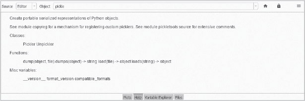

## 第十六章：**记录你的工作**


Python 因其代码的可读性而著名，但这种可读性只能带你走到一定程度。为了与他人协作，并提醒自己为什么做出这样的选择，你需要依靠自然语言来传达信息，使你的意思尽可能明确，或者解释程序的目的。Python 通过注释和文档字符串（docstrings）实现这一点。

*注释*是计算机程序中的不可执行注解。*文档字符串*（docstring）是多行字符串，不赋值给任何变量，用来为 Python 模块、类、方法和函数添加文档。注释和文档字符串一起构成了代码文档。

良好的文档能够清晰表达你的意图，并为未来的用户（包括你自己）节省时间和精力。没有理由逆向工程代码的部分内容或浪费时间去理解没有上下文的晦涩参数或数字。

适当的文档也可能包括编程过程中学到的经验教训，并能标记出潜在问题，例如跨操作系统工作时遇到的问题。这些能够帮助你传递宝贵的知识，避免其他人在独立发现并处理这些问题时浪费时间。

由于控制台中生成的代码通常是临时的，因此你只需要为*持久*程序记录文档，例如在文本编辑器或 Jupyter Notebook 中生成的程序。这些文件会保存到磁盘上并重复使用，有时会在几个月后再次使用，因此记录任何不明显的意图和假设是非常重要的。

### **注释**

*注释*是你在代码中添加的说明，用来提醒你正在做什么，解释新代码块的目的，标记待办事项，或者暂时“关闭”你不希望执行的代码。它们在别人需要理解和修改你的工作时尤其有用。

注释以井号（`#`）符号开始，告诉 Python 忽略（不执行）同一行中剩余的代码。下面是一个例子：

```py
# Step 1: Crop image to 50x50 pixels.
```

在控制台和文本编辑器中，注释的颜色通常与常规代码不同。如果你使用的是“Spyder”语法高亮主题（详见第 64 页的“配置 Spyder 界面”），注释会显示为灰色，文档字符串会显示为绿色。

注释可以出现在单行中，跨越多行，或者嵌入在代码行中。后者称为*内联*注释。

和变量名一样，注释应该尽量简洁，通常需要多次迭代才能做到最好。如果注释太长或太多，它们会分散注意力，用户可能会忽视它们。如果注释过于简短且含糊不清，它们的目的就会失效。如果缺少注释，用户可能会浪费时间去解读代码。而那个用户可能就是你！

当然，你总是要避免粗鲁的评论：

```py
# Added this to fix Steve's stupid mistake.
```

这样的注释会让人反感，破坏团队合作，并且让你看起来不专业。

另一个注释错误是违反了 DRY（不要重复自己）的准则，详细说明了已经易于理解和明确的代码。下面是一个冗余的注释例子，它没有增加任何价值，反而产生了视觉噪音：

```py
force = mass * acceleration  # multiply mass variable by acceleration variable.
```

以下注释显得过于显而易见，并且使代码显得杂乱无章，而并未提供额外的价值，因为代码本身已经很容易理解：

```py
# As Step 1, enter the mass of the object.
mass = 549
# As Step 2, enter the acceleration of the object.
acceleration = 42
# As Step 3, calculate Force.
force = mass * acceleration
```

紧随其后的难懂内联注释可能原本是作为临时提醒，但编码者忘记将其删除，结果现在它带来了困惑而非清晰：

```py
acceleration = 42  # Intermediate for now.
```

类似地，与代码相矛盾的注释比没有注释更糟糕。因此，应该保持注释的更新并处理任何代码变化。实际上，这很难做到，因此一个好的理由是将注释数量限制在严格必要的范围内。

你可以在 *[Python 风格指南（PEP8）](https://pep8.org/)* 中找到官方的 Python 注释指南。大部分内容将在接下来的章节中总结。

#### ***单行注释***

注释通常占据单独一行，并总结随后的代码，如下所示：

```py
# Use Cartesian product to generate permutations with repetition.
for perm in product([0, 1, 2, 3, 4, 5, 6, 7, 8, 9], repeat=len(combo)):
```

因为用户可能不熟悉内建的 `itertools` 模块中的 `product` 函数，所以注释帮助他们省去了查找的麻烦。

编写单行注释时，应在井号后插入一个空格，并使用完整的句子并加上句号。如果注释包含多个句子，每个句号后应跟两个空格。注释应以大写字母开头，除非第一个单词是以小写字母开头的标识符。

此外，所有注释都应该与它们所描述的代码保持相同的缩进级别。例如，由于物质无法达到或超过光速（`C`），下面的注释解释了为何将 `velocity` 变量重新赋值为光速减去 0.000001：

```py
if velocity >= C:
    # Don't let the ship reach light speed.
    velocity = C - 0.000001
```

由于被引用的变量赋值发生在 `if` 语句块*内部*，所以注释缩进了四个空格。

#### ***多行注释***

跨越多行的注释被称为*多行*注释或*块注释*。Python 没有正式的多行注释语法。处理它们的一种方式是将其视为一系列以井号开头的单行注释，如下所示：

```py
# This is a really long-winded comment that probably should be 
# shortened or left off or broken up and inserted before various
# bits of code or in a docstring somewhere.
```

这种方法的缺点是可读性较差。另一种替代方法是使用三引号的多行字符串。之所以有效，是因为 Python 会忽略未赋值给变量的字符串。这种方法也更具可读性：

```py
"""
This is a really long-winded comment that probably should be 
shortened or left off or broken up and inserted before various
bits of code or in a docstring somewhere.
"""
```

你也可以将三引号放置在与注释相同的行上，如下所示：

```py
"""This is a really long-winded comment that probably should be 
shortened or left off or broken up and inserted before various
bits of code or in a docstring somewhere."""
```

如果块注释包含多个段落，请使用空行分隔这些段落。

块注释会打破代码的连续性，应仅在特殊情况下使用。这些情况包括记录重要的经验教训、添加许可证和版权信息，以及插入临时提醒，如 TODO 列表、FIXME 标记和警告。

#### ***内联注释***

内联注释出现在语句的末尾。一个常见的用途是指定测量单位，如下所示：

```py
C = 299_792_458  # Speed of light in a vacuum in meters per second.
```

通过在注释中指定值的单位，而不是将单位包含在变量名中，我们能够使用更简洁的变量名。

内联注释应至少与代码隔开两个空格，并且`#`后面应该跟一个空格。如果注释无法与代码放在同一行，应使用单行或多行注释将其放在语句上方。

内联注释会分散注意力，应谨慎使用。它们绝不应该陈述显而易见的内容，而是应该增加清晰度。例如，一些函数和方法带有非直观的参数值，比如内置的`turtle`模块的`screen()`方法，它设置一个绘图窗口。通常，你传递给它你想要的窗口大小，以像素为单位，例如`width=800, height=900`，但如果想要使用整个屏幕，你只需要传递`1`。内联注释可以使这一点更加明确：

```py
screen.setup(width=1.0, height=1.0)  # For fullscreen view.
```

内联注释也可以为变量赋值提供上下文：

```py
apogee = 25_500  # Highest point in the orbit.
```

另外，内联注释还可以提供格式化提示：

```py
url = https://www.python.org/  # Cut and paste from website address.
```

在这里，注释为用户定义函数的一个参数提供了清晰的解释：

```py
trajectory = rocket(dx=25, dy=-100)  # Negative y moves down the screen.
```

你可能会忍不住使用比实际需要更多的内联注释。在大多数情况下，通过使用清晰的对象名称，可以避免或最小化注释的使用。

#### ***注释掉代码***

因为 Python 会忽略注释，你可以使用`#`符号来阻止部分代码的执行。这有助于你通过开启或关闭部分代码来测试和调试代码。

例如，你可能希望程序打印出大量信息，但在开发过程中，这些打印输出可能会拖慢代码的执行速度，并且遮蔽你希望看到的其他输出。在编写代码时，你可以通过将这些行注释掉来临时停止它们的输出，如下所示：

```py
# print(key_used)
# print(ciphertext)
# print(plaintext)
# print('Program complete.')
```

为了方便，你可以通过快捷键高亮并注释掉代码块。在 Spyder 中，你可以通过点击顶部工具栏的**文件** ▸ **编辑**查看适合你系统的快捷键。例如，在 Windows 中，你可以使用 CTRL-1 切换代码的启用和禁用。若要注释掉包含解释性注释的代码块，请使用 CTRL-4 来注释代码块，使用 CTRL-1 恢复代码块。

**测试你的知识**

1.  内联注释前应该留多少空格？

a.  1

b.  2

c.  0

d.  内联注释应该使用三引号

2.  对还是错：多行注释如果使用三引号会更易读。

3.  在 Python 中，井号（`#`）表示以下哪项：

a.  一个注释

b.  一个数字

c.  一行不可执行的代码

d.  以磅为单位的重量

4.  一个不错的替代方法是：

a. 多行文档字符串

b. 单行注释

c. 良好的命名规范

d. 明智地使用常量

### **文档字符串**

文档字符串是一个三引号字符串字面量，出现在模块、函数、类或方法定义的第一行。由于这种位置和三引号的使用，各种帮助工具可以发现并显示文档字符串。

文档字符串通常由一行摘要和更详细的描述组成：

```py
"""
A one-line summary.

More info such as:
 function summaries
 method summaries
 attribute summaries
 exceptions raised
 and so on
"""
```

由于摘要行可以被自动索引工具使用，因此它应当只占用一行，并且与文档字符串的其余部分用空行分隔。摘要行可以与开头的引号在同一行，也可以放在下一行。除非整个文档字符串可以在一行内显示，否则应将结束引号放在单独的一行。文档字符串的缩进应与第一行的引号对齐。

当文档字符串设置正确时，你可以通过特殊的 `__doc__` 属性访问它们。要查看我们在第十二章中使用的 `pickle` 模块的示例，请在控制台中输入以下内容：

```py
In [1]: import pickle

In [2]: print(pickle.__doc__)
```

这将显示模块的文档字符串：

```py
Create portable serialized representations of Python objects.

See module copyreg for a mechanism for registering custom picklers.
See module pickletools source for extensive comments.

Classes:

    Pickler
    Unpickler

Functions:

    dump(object, file)
    dumps(object) -> string
    load(file) -> object
    loads(string) -> object

Misc variables:

    __version__
    format_version
    compatible_formats
```

你也可以通过在 Spyder 的帮助面板中输入 **pickle** 来看到这一点（图 14-1）。



*图 14-1：在 Spyder 帮助面板中显示的 pickle 模块文档字符串*

对于简单的函数或方法，文档字符串可以完全由一行摘要组成。即使这个摘要不跨越多行，你仍然应该使用三引号，示例如下：

```py
"""Accept number as n and return cube of n."""
```

这几乎是文档字符串可以最简洁的形式，但对于简单的函数或你为自己定义的函数来说是足够的。然而，如果你打算处理企业级别的代码或为开源项目做贡献，你会想要遵循 PEP 257 中的文档字符串规范（*[`www.python.org/dev/peps/pep-0257/`](https://www.python.org/dev/peps/pep-0257/)*）。有些情况可能相当复杂，文档字符串可能会长达几个屏幕。

在接下来的章节中，我们将探讨适用于独立工作或小组密切合作的科学家和工程师的文档字符串规范。在这些情况下，用户使用代码的频率通常高于修改代码，因此简单的文档字符串应该能够满足他们的需求。

#### ***文档化模块***

模块的文档字符串应当放置在模块的顶部，位于任何导入语句之上。第一行应描述模块的目的。文档字符串的其余部分通常应列出模块导出的类、异常、函数以及其他对象，每个对象附带一行简短的总结。如果这些总结提供的信息不如对象自身文档字符串中的摘要详细，也是可以的。

下面是 `pickle` 模块的文档字符串在实际代码中的样子：

```py
"""Create portable serialized representations of Python objects.

See module copyreg for a mechanism for registering custom picklers.
See module pickletools source for extensive comments.

Classes:

    Pickler
    Unpickler

Functions:

    dump(object, file)
    dumps(object) -> string
    load(file) -> object
    loads(string) -> object

Misc variables:

    __version__
    format_version
    compatible_formats
"""
```

随着模块变得越来越大和复杂，它们的文档字符串可能变得相当技术性。这使得初学者和非开发者在编写和阅读时都会感到困难。对于为自己或直接团队使用编写的程序，更简单的总结可能更为合适。以下是我们在第十一章中编写的*mymath.py*模块的友好文档字符串（加粗）：

```py
"""
Functions to solve the quadratic equation and get the volume of a sphere.

Functions:
quad(a, b, c) -> soln1, soln2
sphere_vol(radius) -> volume rounded to 2 decimal places
"""
import math

def quad(a, b, c):
    x1 = (-b - (b**2 - 4 * a * c)**0.5) / (2 * a)
    x2 = (-b + (b**2 - 4 * a * c)**0.5) / (2 * a)
    return x1, x2

def sphere_vol(r):
    vol = (4 / 3) * math.pi * r**3
    return round(vol, 2)
```

你可以通过`__doc__`来获取这个文档：

```py
In [3]: import my_math

In [4]: print(my_math.__doc__)

Functions to solve the quadratic equation and get the volume of a sphere.

Functions:
quad(a, b, c) -> soln1, soln2
sphere_vol(radius) -> volume rounded to 2 decimal places
```

同样，内置的`help()`函数可以检索这个文档字符串，提供更多信息，包括文件的位置：

```py
In [5]: help(my_math)
Help on module my_math:

NAME
my_math - Functions to solve the quadratic equation and get the volume of a sphere.

DESCRIPTION
    Functions:
    quad(a, b, c) -> soln1, soln2
    sphere_vol(radius) -> volume rounded to 2 decimal places FUNCTIONS
    quad(a, b, c)
    sphere_vol(r)

FILE
    C:\Users\hanna\spyder_proj_w_env\code\my_math.py
```

这个文档字符串为用户提供了`my_math`模块的良好概述。别担心函数的描述稍显简略。正如你将在后面的章节中看到的那样，函数有自己的文档字符串，你可以在其中详细描述函数的目的、参数、输出等内容。

#### ***类的文档***

类的文档字符串应遵循与模块级文档字符串相同的模式。它应该总结类的行为，并列出公共方法和实例变量。任何子类、构造函数和方法应有自己的文档字符串。所有记录类的文档字符串后应插入一个空行。

这是一个`Starship`类的文档字符串示例：

```py
class Starship:
    """
    A class to represent a starship.

    Attributes
    ----------
    name : str
        name of the ship
    torpedoes : int
        number of photon torpedoes
    phasers: int
        number of phaser banks
    crew: int
        number of crew members

    Methods
    -------
    info():
        Print the ship's attributes.

    fire_all():
        Return the sum of the weapon attributes as an integer.
    """
```

这个文档字符串很简单，但没关系，因为文档字符串的主要用途之一是在使用类时提供动态提示（见图 13-4）。因此，你应该尽量简洁地呈现信息。

在这种情况下，我们用一行总结开始文档字符串，随后列出属性。这个列出包括属性名称、数据类型和简要描述。接下来，我们列出类的方法，并为每个方法提供一行总结。

#### ***函数和方法的文档***

函数或方法的文档字符串应总结其行为，并记录其参数、返回值、副作用以及引发的任何异常和调用时的限制（如果适用）。应标明可选参数和关键字参数。

通常，如果你的函数或方法不接受任何参数并返回一个单一的值，一行总结就足够作为文档。这个总结应该使用*命令式语气*；换句话说，应该使用“Return”而不是“Returns”：

```py
def warning():
    """Print structural integrity warning message."""
    print("She canna take it Capt'n! She's gonna blow!")
```

这是一个更长的文档字符串，描述了一个接受两个单词的函数，如果这些单词是字谜（由相同字母按不同顺序组成）则返回`True`，否则返回`False`。它提供了关于函数的参数和返回值的信息：

```py
def is_anagram(word1, word2):
    """
    Check if two strings are anagrams and return a Boolean.

    Arguments:
        word1: a string
        word2: a string

    Returns:
        Boolean
    """
    return sorted(word1.lower()) == sorted(word2.lower())

print(is_anagram('forest', 'softer'))
```

这是此代码的输出。由于“softer”是“forest”的字谜（由相同字母按不同顺序组成），所以比较结果为`True`：

```py
In [6]: runfile('C:/Users/hanna/oop/junk.py', wdir='C:/Users/hanna/oop')
True
```

如果一个函数的参数有默认值，应该提到这些默认值。这里是使用`tax_rate`参数的一个示例：

```py
def calc_taxes(taxable_income, tax_rate=0.24):
    """ Calculate Federal taxes based on taxable income and rate.

    Args:
        taxable_income: int
                           Income after qualified deductions.
        tax_rate: float 
                    Federal tax rate as decimal value. 
                    Defaults to 24% tax bracket.

    Returns: int
               Federal taxes owed. 
"""
```

#### ***使用 doctest 保持文档字符串更新***

更新程序时，容易忘记编辑相关的文档字符串。使用内置的`doctest`模块，你可以在文档字符串中嵌入使用示例，以检查代码和文档之间是否存在差异。

`doctest`模块会搜索看起来像是交互式 Python 会话的文本片段，然后执行这些会话以验证它们是否按预期工作。我们来看一个简单的函数，它接受星舰的跃迁因子值，并调整它使其落在可接受的操作范围内。粗体部分的代码代表嵌入的测试用例：

```py
def warp(factor):
    """Return input warp factor adjusted to allowable values.

    Args:
        factor: int
                  warp factor

    Returns: int
               warp factor adjusted to operating limits

    Raise: ValueError
            factor value must be float or integer

 >>> warp(5)
 5
 >>> warp(3.5)
 3
 >>> warp(12)
 10
 >>> warp(-4) 
 0
 >>> warp(0)
 0
 >>> warp('ten')
 Traceback (most recent call last):
 …
 ValueError: factor must be a number """  
    if isinstance(factor, (int, float)):
        speed = int(factor)
        if speed < 0:
            speed = 0
        elif speed > 10:
            speed = 10   
        return speed
    else:
        raise ValueError("factor must be a number")

if __name__ == "__main__":
    import doctest
    doctest.testmod()
```

测试用例检查可接受和不可接受的值。不可接受的值是那些会导致比较语句失败的值，例如`12`和`-4`。

你可以通过几种方式运行`doctest`。一种方式是通过按 F5 在文本编辑器中运行脚本。另一种方式是打开控制台，导入`doctest`模块和你的自定义模块（不带*.py*扩展名），然后调用`testmod()`方法，如下所示：

```py
In [7]: import doctest
In [8]: import set_warp

In [9]: doctest.testmod(set_warp)
Out[9]: TestResults(failed=0, attempted=6)
```

因为没有任何测试失败，你得到了一个简要的测试结果总结。如果你返回到文档字符串并将`warp(-4)`的预期结果从`0`编辑为`4`，然后重新运行该方法（记得先保存脚本），你会看到如下输出：

```py
In [10]: doctest.testmod(set_warp)
**********************************************************************
File "C:\Users/hanna/file_play\set_warp.py", line 21, in set_warp.warp
Failed example:
warp(-4) 
Expected:
4
Got:
0
**********************************************************************
1 items had failures:
1 of 6 in set_warp.warp
***Test Failed*** 1 failures.
Out[10]: TestResults(failed=1, attempted=6)
```

要打印出`doctest`模块尝试的详细日志、它的预期结果以及实际找到的结果，可以将`verbose=True`传递给`testmod()`。以下是没有失败的测试的结果：

```py
In [11]: doctest.testmod(set_warp, verbose=True) 
Trying:
    warp(5)
Expecting:
    5
ok
Trying:
    warp(3.5)
Expecting:
    3
ok
Trying:
    warp(12)
Expecting:
    10
ok
Trying:
    warp(-4) 
Expecting:
    0
ok
Trying:
    warp(0)
Expecting:
    0
ok
Trying:
    warp('ten')  
Expecting:
    Traceback (most recent call last):
        ...
    ValueError: factor must be a number
ok
1 items had no tests:
    set_warp
1 items passed all tests:
   6 tests in set_warp.warp
6 tests in 2 items.
6 passed and 0 failed.
Test passed.
```

你还可以通过 Anaconda Prompt 或终端运行`doctest`。只需导航到包含 Python 文件的目录，并使用`-v`开关（用于详细模式）运行以下命令：

```py
python <your_filename.py> -v
```

如果只需要简要的总结，可以省略`-v`开关。

除了检查模块的文档字符串是否是最新的，你还可以使用`doctest`验证测试文件或测试对象中的交互式示例是否按预期工作。这被称为*回归测试*，它确保以前开发和测试的软件在更改后仍然正常运行。

你还可以使用`doctest`为包编写教程文档，充分使用输入输出示例进行说明。要了解更多信息，请访问*[`docs.python.org/3/library/doctest.html`](https://docs.python.org/3/library/doctest.html)*。

#### ***在 Spyder 代码分析面板中检查文档字符串***

你可以使用 Spyder IDE 检查文档字符串是否符合已建立的规范。结果将在代码分析面板中显示，该面板在第四章的第 85 页中介绍过，并且也会在文本编辑器中显示。

##### **设置 Spyder 偏好设置**

要设置 Spyder 以检查文档字符串，点击顶部工具栏中的**工具** ▸ **偏好设置**。在偏好设置窗口中，点击**自动补全和代码检查**，然后选择**文档字符串样式**标签。你应该能看到图 14-2 所示的窗口。确保勾选**启用文档字符串样式检查**复选框。


*图 14-2：Spyder 的文档字符串样式窗口*

**选择用于检查文档字符串的约定**下拉菜单提供了三种选择：PEP 257、NumPy 和自定义。如前所述，PEP 257 是 Python 官方的文档字符串指南，因此我们将在这里使用它。

除了 PEP 257，一些科学界的成员使用 NumPy 文档字符串标准（*[`numpydoc.readthedocs.io/en/latest/install.html`](https://numpydoc.readthedocs.io/en/latest/install.html)*）。你可以在*[`sphinxcontrib-napoleon.readthedocs.io/en/latest/example_numpy.html`](https://sphinxcontrib-napoleon.readthedocs.io/en/latest/example_numpy.html)*看到该样式的示例）。

你还可以选择根据* [`www.pydocstyle.org/en/stable/error_codes.html`](http://www.pydocstyle.org/en/stable/error_codes.html)*中找到的代码来显示或忽略某些错误。

**注意**

*除了 PEP 257 和 NumPy 之外，还有其他文档字符串格式可供遵循。Google 有自己的一种格式和优秀的样式指南（[`google.github.io/styleguide/pyguide.html`](https://google.github.io/styleguide/pyguide.html)）。你可以在[`sphinxcontrib-napoleon.readthedocs.io/en/latest/example_google.html`](https://sphinxcontrib-napoleon.readthedocs.io/en/latest/example_google.html)看到该样式的示例。此外，*reStructuredText*是一种流行的格式，主要与名为*Sphinx*的工具配合使用。Sphinx 使用文档字符串生成 Python 项目的文档，格式包括 HTML 和 PDF。如果你曾经阅读过 Python 模块的文档（[`readthedocs.org/`](https://readthedocs.org/)），你就见识过 Sphinx 的实际应用。*

##### **运行分析**

要查看在实践中使用 Spyder 检查文档字符串的效果，我们来写一些缺少文档字符串的代码。打开文本编辑器，输入以下内容，并将其保存为*test_docs.py*（你可以在上一章的*oop* Spyder 项目中进行，或在其他地方进行）：

```py
class Volcano():
    'A volcano object'
    def __init__(self, name, classification, active):
        """sfsds"""
        self.name = name
        self.classification = classification
        self.active = active

    def erupt(self):
        'lsjljl'
        if self.classification == 'stratovolcano' and self.active is True:
            print("\nRUMBLE!\n")

    def pyroclastic_cloud(self):
        if self.classification == 'stratovolcano' and self.active is True:
            print("\nWHOOSH!\n")

mountain = Volcano('Krakatoa', 'stratovolcano', True)
mountain.erupt()
mountain.pyroclastic_cloud()
```

希望你已经注意到这里的几个文档错误，如果没有，不要灰心，Spyder 会为你找到并标记这些错误。首先，在顶部工具栏中点击**Source**。这将会弹出图 14-3 中显示的菜单。


*图 14-3：Spyder 顶部工具栏中的 Source 菜单*

确保选中**显示文档字符串样式警告**复选框，然后在菜单底部点击**运行代码分析**选项（或按 F8 快捷键）。代码分析面板应该会出现（图 14-4）。


*图 14-4：带有与文档字符串相关的消息的代码分析面板*

点击**Convention**标题旁边的右箭头（**>**）符号，展开代码和文档字符串的样式信息。在*test_docs.py*示例中，我们缺少两个推荐的文档字符串：一个是整个程序的文档字符串，称为模块文档字符串，另一个是`pyroclastic_cloud`方法的文档字符串。

代码分析窗格中的信息来自代码静态检查工具，它在处理文档字符串时缺乏精细度。要查看特定的文档错误，将光标悬停在文本编辑器中行号左侧的橙色三角形上（图 14-5）。你将看到多个错误代码及其描述。


*图 14-5：第 1 行的代码分析信息*

关于缺失模块文档字符串的消息会重复出现，但其错误代码与代码分析窗格中的不同。然后，对于 `Volcano` 类定义，系统会标记缺少空行、引号使用不当，以及文档字符串末尾需要加句号的问题。

如果你将光标悬停在第 3 行的三角形上，指向`__init__()`方法，你会看到一个显示类似错误的窗口（图 14-6）。


*图 14-6：第 3 行的代码分析信息*

请注意，工具检查的是摘要描述的*存在*，但不会评估描述的*内容*。例如 `"""sfsds"""` 这样的无意义摘要仍然能通过测试。

Spyder 的代码分析工具是确保你的代码及其文档符合 Python 社区标准的好方法。

**测试你的知识**

5.  以下哪些选项帮助你访问文档字符串？

a.  `__doc__` 特殊属性

b.  `help()`

c.  Spyder 帮助窗格

d.  以上所有选项

6.  导入内置的 `itertools` 模块，并查看其 `product()` 方法的帮助信息。

7.  哪些 Python 增强提案（PEP）提供了关于代码文档化的指导？

a.  PEP 248

b.  PEP 8

c.  PEP 549

d.  PEP 257

8.  以下哪些选项使文档字符串能够被自动帮助工具访问？

a.  使用三重引号

b.  输入和输出数据类型的描述

c.  它紧跟在 `def` 语句后面

d.  以空格结尾的三重引号

9.  Spyder 的代码分析工具可以检查文档字符串是否符合以下要求：

a.  PEP 8 风格指南

b.  PEP 257 和 Google 风格指南

c.  PEP 8 和 Google 风格指南

d.  PEP 257 和 NumPy 风格指南

10.  为第十三章的*ships.py* 程序中定义的 `Frigate` 类编写文档字符串。

### **总结**

良好的文档化能最大化代码的可用性及其在未来的可维护性。在 Python 社区，编写良好的代码意味着编写了良好的文档。注释和文档字符串允许你将人类语言添加到程序中，以填补关于程序目的、意义和可用性的解释空白。

注释表示不可执行的注释内容，用于标注代码或暂时屏蔽某些行，以防它们运行。你应该谨慎使用注释，解释你的意图、记录重要的编程经验、提供警告、包含法律信息（如许可证和版权数据）、指定单位等。大多数注释占据单行，或嵌入到代码行中，并以`#`符号开头。多行注释可以使用三引号来提高可读性。

文档字符串是特殊的三引号字符串，出现在模块的顶部或`class`或`def`语句后面。它们为用户提供代码的概述，说明代码的功能以及如何使用，你可以通过自动帮助工具访问它们。你应该在每个模块、类、方法和函数中使用文档字符串，并且随着代码的变化，保持它们的更新。

各种工具可以帮助你检查文档字符串是否最新且格式正确。通过内置的`doctest`模块，你可以在文档字符串中嵌入可测试的案例。这些案例可以帮助你检查代码更新是否改变了预期的行为，并且为新用户提供示例用法。Spyder IDE 包含一个工具，用于检查文档字符串是否符合 PEP 257 和 NumPy 的规范。检查结果会显示在代码分析面板中，并在文本编辑器的边缘与问题代码行相邻显示。
