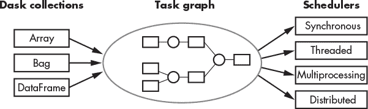

## 第十五章：THE SCIENTIFIC LIBRARIES**


在本章中，我们将概述 Python 中用于数学、数据分析、机器学习、深度学习、计算机视觉、语言处理、网页抓取和并行处理的核心库的高级总结（见表 15-1）。我们还将探讨一些选择竞争产品的指南。在接下来的章节中，我们将深入研究这些库的功能，并将其应用于实际应用中。

表 15-1 将这些库组织为子类别，列出它们的网站，并提供简短的描述。由于这些是流行且在许多情况下成熟的库，你应该能轻松找到每个库的更多指导，既可以在线查阅，也可以在书店找到相关书籍。

**表 15-1：** Python 的科学计算库

| **任务** | **库** | **描述** | **网站** |
| --- | --- | --- | --- |
| Math and data analysis | NumPy | 数组的数值计算工具 | *[`numpy.org/`](https://numpy.org/)* |
| SciPy Library | 友好且高效的数值例程 | *[`www.scipy.org/`](https://www.scipy.org/)* |
| SymPy | 符号数学/计算机代数工具 | *[`www.sympy.org/`](https://www.sympy.org/)* |
| Pandas | 数据操作、分析和可视化工具 | *[`pandas.pydata.org/`](http://pandas.pydata.org/)* |
| Machine and deep learning | Scikit-learn | 通用机器学习工具包 | *[`scikit-learn.org/`](https://scikit-learn.org/)* |
| TensorFlow | 深度学习神经网络的符号数学库 | *[`www.tensorflow.org/`](https://www.tensorflow.org/)* |
| Keras | 更友好的 TensorFlow 封装 | *[`keras.io/`](https://keras.io/)* |
| PyTorch | 快速高效的人工神经网络 | *[`pytorch.org/`](https://pytorch.org/)* |
| Image processing | OpenCV | 实时计算机视觉库 | *[`opencv.org/`](https://opencv.org/)* |
| Scikit-image | 科学图像处理和分析工具 | *[`scikit-image.org/`](https://scikit-image.org/)* |
| Pillow | 基本图像处理工具 | *[`python-pillow.org/`](https://python-pillow.org/)* |
| Language processing | NLTK | 符号和统计语言处理库 | *[`www.nltk.org/`](http://www.nltk.org/)* |
| spaCy | 快速的生产级语言处理库 | *[`spacy.io/`](https://spacy.io/)* |
| Helper libraries | requests | HTTP 请求的网页抓取工具 | *[`pypi.org/project/requests/`](https://pypi.org/project/requests/)* |
| BeautifulSoup | 从 HTML 和 XML 文件中提取文本的工具 | *[`www.crummy.com/software/`](https://www.crummy.com/software/)* |
| re | 正则表达式库 | *[`docs.python.org/3/library/re.html`](https://docs.python.org/3/library/re.html)* |
| Dask | 用于 Python 的并行计算库 | *[`dask.org/`](https://dask.org/)* |
| Spark | 针对大数据的“更重”替代 Dask | *[`spark.apache.org/`](https://spark.apache.org/)* |

### **SciPy 堆栈**

SciPy 开源库栈预先安装在 Anaconda 中，并包含 NumPy、SciPy 库、Matplotlib、IPython、SymPy 和 pandas（见图 15-1）。这些被称为“Python 数值计算和可视化的基石”，并且是使用最广泛的科学库之一。


*图 15-1：SciPy 生态系统的核心组件（图片来源：[`SciPy.org`](https://SciPy.org))*

在接下来的章节中，我们将对这些库进行高层次的介绍。然后，在后续章节中，我们将深入探讨 NumPy、Matplotlib 和 pandas。

#### ***NumPy***

NumPy 是 *Numerical Python*（数值 Python）的缩写，是 Python 专门用于执行数值计算的库。它支持创建大型的多维数组和矩阵，并提供了大量用于操作这些数组的高级数学函数。NumPy 被认为是 Python 科学计算的基础包，但我也会称其为 *基础性* 因为许多其他重要库，如 pandas、Matplotlib、SymPy 和 OpenCV，都是建立在它之上的。

NumPy 包含了大多数涉及数值数据的科学应用所需的数据结构、算法和“粘合剂”。NumPy 中的操作比 Python 自带标准库中的同类功能更快、更高效。掌握 NumPy 知识对使用大多数（如果不是全部的话）科学 Python 包至关重要，因此我们将在第十八章中对其进行更详细的探讨。

#### ***SciPy***

科学库 *SciPy* 旨在解决数学、科学和工程领域的问题，涵盖了科学计算中许多标准问题领域。它是建立在 NumPy 之上并对其进行了扩展，提供了许多用户友好且高效的数值例程，如数值积分、插值、优化、线性代数、统计学、快速傅里叶变换、信号与图像处理以及求解微分方程等功能。它扩展了 NumPy 提供的线性代数例程和矩阵分解功能，并提供了对许多物理常数和转换因子的访问。

#### ***SymPy***

*SymPy* 是一个用于符号数学的开源库。它的目标是成为一个功能齐全的 *计算机代数系统（CAS）*。

虽然大多数计算机代数系统发明了自己的语言，但 SymPy 是用 Python 编写和执行的。这使得熟悉 Python 的人可以更轻松地使用它。它还允许你将其作为库使用。因此，除了在交互式环境中使用 SymPy 之外，你还可以将它导入到你自己的 Python 应用程序中，进行自动化或扩展。

SymPy 让你能够以符号的方式进行各种计算。它可以简化表达式；计算导数、积分和极限；解方程；处理矩阵等等。它包括用于绘图、打印（包括数学公式或 LaTeX 的漂亮打印输出）、代码生成、物理学、统计学、组合数学、数论、几何学、逻辑学等方面的软件包。

以一种简单的方式理解 SymPy，可以考虑使用 Python 的基本`math`库计算无理数√8：

```py
In [1]: import math

In [2]: math.sqrt(8)
Out[2]: 2.8284271247461903
```

结果是一个截断的数字答案，因为√8 不能用有限的数字表示。使用 SymPy 时，对于非完美平方的数字，默认不对其进行计算；因此，符号结果默认会进行符号化简化（例如 2 × √2）：

```py
In [2]: import sympy
   ...: sympy.pprint(sympy.sqrt(8))
Out[2]: 2⋅√2
```

如前所述，SymPy 包含许多有用的方法，例如解方程。例如，解*x*² - 2 = 0。

```py
In [3]: import sympy

In [4]: x = sympy.symbols('x')

In [5]: sympy.pprint(sympy.solve(x**2 - 2, x))
[-√2, √2]
```

SymPy 方便地提供了自己的绘图模块：

```py
In [6]: from sympy import symbols, cos
   ...: from sympy.plotting import plot3d

In [7]: x, y = symbols('x y')

In [8]: plot3d(cos(x * 2) * cos(y * 4) - (y / 4), (x, -1, 1), (y, -1, 1))
```


要查看更多 SymPy 的功能，请访问*[`docs.sympy.org/latest/tutorial/index.html`](https://docs.sympy.org/latest/tutorial/index.html)*。

你可能会问，既然已经有 NumPy 和 SciPy 库，为什么还要使用 SymPy？简短的回答是，SymPy 用于处理代数和进行理论数学或物理学计算；而 NumPy 和 SciPy 用于对实际数据进行分析。

#### ***pandas***

*Python 数据分析*库是最流行的开源数据科学库。简称*pandas*，它包含了旨在促进数据提取、清洗、分析和可视化的数据结构和操作工具。它采用了 NumPy 的许多重要部分，并与其他库如 SciPy、statsmodels、scikit-learn 和 Matplotlib 兼容。

此外，pandas 对于处理表格数据和常见数据源，如 SQL 关系型数据库和 Excel 电子表格，非常有用。它尤其适用于处理时间索引数据，并包含基于 Python 核心可视化库 Matplotlib 的绘图功能，方便你可视化数据。

pandas 中最常见的数据结构是*DataFrame*，它是一种类似于电子表格的表格格式，包含列、行和数据。你可以从多种类型的输入构建 DataFrame，在以下示例中，通过使用 Jupyter Notebook 从列表列表构建：

```py
import pandas as pd
data = [['Carbon', 'C', 6], ['Nitrogen', 'N', 7], ['Oxygen', 'O', 8]]
df = pd.DataFrame(data, columns=['Element', 'Symbol', 'Atomic #'])
df
```

|  | 元素 | 符号 | 原子序数 |
| --- | --- | --- | --- |
| 0 | 碳 | C | 6 |
| 1 | 氮 | N | 7 |
| 2 | 氧 | O | 8 |

使用 DataFrame 时，你可以在 Python 中拥有类似 Excel 电子表格或 SQL 表格的功能。然而，DataFrame 通常更快、更易用且更强大，因为它们是 Python 和 NumPy 生态系统的核心组成部分。

pandas 库是科学家们最重要的库之一，正如古谚所说，他们花费 80%的时间寻找和准备数据，另外 20%的时间抱怨它！因此，掌握 pandas 是至关重要的，您将在 第二十章 中获得良好的起点，该章节涵盖了一些基础知识。

**注意**

*其他库开始挑战 pandas，保持其简单性的同时解决了一些效率问题，如无法通过多核处理、GPU 处理或集群计算来扩展项目。Modin 提供了完整的 pandas 替代方案，让您可以更多地优化使用 pandas。Vaex ([`vaex.io/`](https://vaex.io/)) 使用高效的惰性评估和巧妙的内存映射，帮助您在普通硬件上探索和可视化大型数据集。Dask ([`dask.org/`](https://dask.org/)) 实现了许多与 pandas 相同的方法，并提供比 Modin 或 Vaex 更多的功能。Dask 使用更复杂，但可以帮助您处理大型数据集，并利用计算集群提高处理速度。*

### **通用机器学习库：scikit-learn**

数据分析的一部分是构建和验证*预测模型*，这些模型利用已知结果预测未来结果或解释过去行为。这属于*机器学习*范畴，本身又是人工智能的一个类别（图 15-2）。机器学习涉及数据集中模式识别的方法，使得机器学习算法能够通过经验自动改进。这些算法根据训练数据构建*监督*模型，以及*无监督*模型，在后者中，模型可以自行“发现”模式。这些算法可以利用这些模型做出决策，而无需显式编程。

开源的 scikit-learn 库建立在 NumPy、SciPy 和 Matplotlib 的基础之上。被认为是 Python 程序员的首选通用机器学习工具包，scikit-learn 对使 Python 成为高效的数据科学工具至关重要。在 Anaconda 上预安装的 scikit-learn 也很易于使用，使其成为机器学习的良好起点。


*图 15-2：一些人工智能分支*

如 图 15-3 所示，scikit-learn 库包括用于预测数据分析的软件包，包括分类（支持向量机、随机森林、最近邻等）、回归、聚类（*k*-means、谱聚类等）、降维（主成分分析、矩阵分解、特征选择等）、预处理（特征提取和归一化）以及模型选择（度量、交叉验证和网格搜索）。既涵盖了监督方法也涵盖了无监督方法。您可以在 第二十章 中了解 scikit-learn 的工作原理。


*图 15-3：使用 scikit-learn 进行回归、分类和聚类分析的示例（由[`scikit-learn.org/`](https://scikit-learn.org/)提供）*

**注意**

*作为 scikit-learn 的补充，有一个名为 statsmodels 的库（[`www.statsmodels.org/`](https://www.statsmodels.org/)），其中包含经典统计和经济学算法。而 scikit-learn 更关注预测，statsmodels 则更关注统计推断、p 值和不确定性估计。*

### **深度学习框架**

*深度学习*是机器学习的一个分支，超越了包含在 scikit-learn 中的方法。与通过结构化训练集修改固定模型的参数不同，深度学习网络能够从未经处理或未标记的数据中进行*无监督*学习。因此，深度学习系统模仿人脑在处理数据和生成决策模式时的非线性工作方式。

这些系统中最知名的被称为*人工神经网络（ANNs）*。这些网络通常需要进行非常复杂的数学运算，涉及百万到数十亿个参数，仅有得益于为视频游戏开发的图形处理单元（GPUs）的速度和效率才有可能实现。示例应用包括自动驾驶汽车和谷歌翻译。

专为深度学习设计的 Python 库被称为深度学习*框架*。这些接口抽象了底层算法的细节，允许您使用预构建和优化的组件快速轻松地定义模型。在众多可用的框架中，TensorFlow、Keras 和 PyTorch 三者占据主导地位。

尽管这三个系统仍在不断发展，它们已经拥有了良好的文档、训练集、教程和支持，您可以信赖它们提供强大的深度学习解决方案。

#### ***TensorFlow***

Python 的最古老、最流行的深度学习框架是一个名为*TensorFlow*的开源库。由谷歌创建以支持其大规模应用，TensorFlow 是一个用于多个机器学习任务的端到端平台。由于其庞大的用户群体、良好的文档和在所有主要操作系统上的运行能力，TensorFlow 在工业和学术界广受欢迎，跨越各种领域。您可以在网上找到许多文章来帮助您实现复杂问题的解决方案。您还可以在线完成认证程序。

TensorFlow 非常强大，能够通过在数百个多 GPU 服务器上分布计算高效处理大型数据集。它提供了许多功能，包括一个名为*TensorBoard*的工具，帮助您创建易于理解的漂亮可视化，并从中获得有用的分析。

#### ***Keras***

虽然 TensorFlow 有丰富的文档并附带操作指南，但它仍然被认为是最具挑战性的深度学习框架之一，界面复杂且学习曲线陡峭。幸运的是，谷歌工程师 François Challet 编写了另一个库*Keras*，它作为 TensorFlow 的接口。虽然它现在是 TensorFlow 核心应用编程接口（API）的一部分，但你也可以独立使用 Keras。

与 TensorFlow 类似，Keras 是开源的并且可以在所有平台上运行。不同于 TensorFlow，Keras 是用 Python 编写的，使其更易于使用。Keras 旨在快速原型开发和小数据集上的快速实验，其轻量级、简洁的界面采用极简主义设计，使得构建可以与 TensorFlow 配合工作的神经网络变得容易。而且，因为 Keras 可以作为封装层，你在需要使用 Keras 简洁接口中不包含的功能时，可以随时“降级”到 TensorFlow。

Keras 可以在 CPU 和 GPU 上无缝运行。它主要用于分类、语音识别、文本生成、摘要和标签。通过简化操作并使模型易于理解，Keras 成为初学者非常好的深度学习工具。

#### ***PyTorch***

*PyTorch*，由 Facebook 的人工智能研究实验室开发，是 TensorFlow 的直接竞争对手。PyTorch 可以在所有平台上运行，并且最近集成了*Caffe*，这是一种在伯克利开发的流行深度学习框架，主要面向图像处理领域。PyTorch 在 Anaconda 中预安装。

PyTorch 正在成为学术研究的首选框架，尽管它在 Facebook、Microsoft 和 Wells Fargo 等行业巨头中仍被广泛使用。它在原型设计方面表现出色，适合那些更多处于非生产实现阶段的项目。它的优势包括灵活性、调试能力和较短的训练时间。

与 TensorFlow 不同，PyTorch 被描述为对 Python 更加“本地化”，使得开发和实现机器学习模型变得更为容易。其语法和应用非常符合 Python 风格，并且与 NumPy 等重要库无缝集成。尽管 Keras 在易用性方面似乎占据优势，尤其对于深度学习新手而言，PyTorch 在速度、灵活性和内存优化方面更胜一筹。

PyTorch 的另一个优势是调试。Keras 通过封装到各种函数中隐藏了构建神经网络的许多细节。这意味着你只需几行代码就能构建一个人工神经网络。而在 PyTorch 中，你需要在代码中明确指定更多细节；因此，找出错误变得更加简单。同时，修改权重、偏置和网络层并重新运行模型也变得更加容易。

总的来说，PyTorch 被认为比 TensorFlow 更容易使用，但比 Keras 更难使用。TensorFlow 的可视化功能也受到更高的评价。

**选择深度学习框架**

根据马克·吐温的说法，“所有的概括都是错误的，包括这条。” 许多个人和项目相关的问题可能会影响你选择哪种深度学习框架。不过，如果你足够搜索互联网上的资源，你还是可以找到一些关于深度学习框架选择的通用指南：

+   如果你是深度学习的初学者，考虑选择 Keras，其次是 PyTorch。

+   如果你是新手并且是研究社区的一部分，考虑使用 PyTorch。

+   如果你是经验丰富的研究人员，你可能会更喜欢 PyTorch。

+   想要一个快速即插即用框架的开发者会更喜欢 Keras。

+   如果你有经验并且希望从事工业界工作，考虑使用 TensorFlow。

+   如果你处理的是大规模数据集，并且需要速度和性能，选择 PyTorch 或 TensorFlow。

+   如果调试是个问题，使用 PyTorch，因为可以使用标准的 Python 调试器（尽管使用 Keras 时，由于界面简单，调试的需求很少）。

+   如果你需要多个后端支持，选择 Keras 或 TensorFlow。

+   Keras 和 TensorFlow 提供更多的部署选项，并简化了模型导出到 Web 的过程；而在 PyTorch 中，你必须使用 Flask 或 Django 作为后端服务器。

+   对于快速原型设计，使用 Keras，其次是 PyTorch。

+   如果可视化是优先考虑的，选择 Keras 或 TensorFlow。

+   如果你已经在使用 Keras 或 TensorFlow，使用 Keras 进行深度神经网络设计，使用 TensorFlow 进行机器学习应用。

### **计算机视觉库**

计算机视觉是人工智能的一个分支，专注于训练计算机像人类视觉一样看和处理数字图像和视频。其目标是让计算机通过图像获取世界状态的高层次理解，并返回适当的输出。例如，自动驾驶汽车应该检测到你已经偏离车道，并警告你或自动将车轮转回。这需要在图像中检测、跟踪和分类特征。除了自动驾驶汽车，常见的应用还包括面部检测和识别、皮肤癌诊断、事件检测以及相机自动对焦。

有很多专门用于计算机视觉和图像处理的 Python 库，但有三个库，OpenCV、scikit-image 和 Pillow，基本上可以满足你大多数的需求。让我们在接下来的章节中快速了解一下这三个库。

#### ***OpenCV***

*OpenCV*，即*开源计算机视觉*，是全球最流行的开源计算机视觉库。它的主要关注点是实时应用程序，例如在流媒体视频中识别面孔，但它可以做从简单图像编辑到机器学习应用的所有事情。OpenCV 是用 C++编写的，以提高速度，但它有一个 Python 封装器，支持 Windows、Linux、Android 和 macOS 平台。

OpenCV 具有模块化结构，包括数千个优化的算法，涵盖了简单的图像处理、视频分析、2D 特征框架、物体检测、物体跟踪、相机标定、3D 重建等多个领域。OpenCV 将图像转换为高效的 NumPy 数组，并且由于其采用优化的 C/C++编写，能够利用快速的多核处理。

OpenCV 已经存在了超过 20 年，拥有一个庞大且支持的用户群体。许多大型公司如 Google、Yahoo、Microsoft、Intel、IBM、Sony 和 Honda 都在积极使用 OpenCV。由于其成熟和受欢迎，你可以找到许多书籍和在线教程来帮助你使用这个库。

#### ***scikit-image***

开源的 *scikit-image* 库是 SciPy 的图像处理工具箱。其使命是成为 Python 中科学图像分析的*权威*库。它预装在 Anaconda 中。

scikit-image 库包含许多行业、研究和教育中常用的算法和工具。它是用 Python 编写的，像 OpenCV 一样，通过转换原始图像来使用 NumPy 数组作为图像对象。尽管它缺乏一些 OpenCV 中用于实时图像处理的复杂算法，但它仍然拥有许多对科学家有用的算法，包括特征和斑点检测。它还包含一些 OpenCV 没有的算法实现。

该库使用起来相当简便，并且有丰富的文档和大量示例与使用案例。所有代码都经过同行评审，质量很高。它为许多机器学习模型提供了一致的接口，使得学习新模型相对容易。它还提供了许多可选项——并且具有合理的默认设置——用于调优模型以获得最佳性能。你可以在 *[`scikit-image.org/docs/stable/auto_examples/`](https://scikit-image.org/docs/stable/auto_examples/)* 找到示例库。

#### ***PIL/Pillow***

*Pillow* 是 *Python 图像库（PIL）*的“友好”分支，它是 Python 中最古老的核心图像处理库之一。Pillow 可以在所有主要操作系统上运行，并且预装在 Anaconda 中，主要用于基本的图像处理。

如果你不需要 OpenCV 或 scikit-image 的功能，Pillow 因其轻量级和易用性，在 Web 项目中被广泛用于图像转换。它支持多种图像文件格式，并提供预定义的图像增强滤镜，包括锐化、模糊、轮廓、平滑、边缘检测、调整大小、像素操作等。它尤其适合用于自动处理大量图像。

**选择图像处理库**

下面是选择图像处理库的一些建议。这里只考虑开源库。

+   如果你的工作或研究涉及 *实时* 计算机视觉应用，那么你需要学习 OpenCV。

+   如果你的数据集包含静态图像和流媒体视频的混合，你应该同时考虑使用 OpenCV 和 scikit-image。后者的一些方法和工具可以补充 OpenCV。关于这两者如何协同工作的简短示例，请访问 Adrian Rosebrock 的教程，了解如何检测低对比度图像 (*[`www.pyimagesearch.com/2021/01/25/detecting-low-contrast-images-with-opencv-scikit-image-and-python/`](https://www.pyimagesearch.com/2021/01/25/detecting-low-contrast-images-with-opencv-scikit-image-and-python/)*).

+   如果你主要处理静态图像，scikit-image 或 Pillow 应该足够，并且可以避免 OpenCV 带来的“开销”。在这两者之间，如果你经常处理图像并进行较为复杂的分析和操作，scikit-image 会更为合适。

+   对于基本的图像处理，比如加载图像、裁剪图像或简单的过滤，Pillow 应该足够使用。同样，你也可以直接在 NumPy 和 SciPy 的`ndimage`模块中实现许多简单的操作。

### **自然语言处理库**

*自然语言处理（NLP）*是语言学和人工智能的一个分支，旨在赋予计算机从书面和口头语言中提取意义的能力。一些常见的 NLP 应用包括语音识别；语音转文本；机器翻译；聊天机器人；垃圾邮件检测；词语分割（称为标记化）；情感分析；光学字符识别（OCR），将手写或印刷文本的图像转换为数字文本；当然，还有亚马逊的 Alexa。

更受欢迎的 NLP 库包括 NLTK、spaCy、Gensim、Pattern 和 TextBlob。NLTK 和 spaCy 是通用的 NLP 库，接下来的章节将详细讨论这两个库。其他库如 Gensim 则更为专业，专注于子领域如语义分析（检测单词的意义）、主题建模（根据单词统计确定文档的含义）和文本挖掘。

#### ***NLTK***

*自然语言工具包*，简称*NLTK*，是 Python 中最古老、最强大、最受欢迎的 NLP 库之一。NLTK 是开源的，可以在 Windows、macOS 和 Linux 上使用。它于 2001 年作为宾夕法尼亚大学计算语言学课程的一部分创建，并在几十位贡献者的帮助下不断发展壮大。NLTK 已在 Anaconda 中预装。

因为 NLTK 是为学术研究群体设计的，它功能强大，但在快速生产环境中的使用可能稍显缓慢。它也被认为有些难以学习，尽管这一点通过开发者编写的免费且有用的在线教科书《Python 自然语言处理》（*Natural Language Processing with Python*）（*[`www.nltk.org/book/`](http://www.nltk.org/book/)*）在一定程度上得到了缓解。

NLTK 的一个优势是它包含了大量的语料库（文本集）和预训练模型。因此，它可以被认为是学术界自然语言处理（NLP）领域的事实标准库。

#### ***spaCy***

*spaCy*库比 NLTK 年轻，且设计上能够很好地与像 scikit-learn、TensorFlow、PyTorch 等机器学习框架以及其他 NLP 库（如 Gensim）协同工作。它被宣传为“工业级”，意味着它是可扩展的、经过优化的，并且在生产应用中非常快速。像 NLTK 一样，它有很好的文档，并且预装了有用的语言模型。它的支持社区虽然不如 NLTK 庞大，但正在快速增长，未来可能会超越 NLTK 的受欢迎程度。

**选择 NLP 库**

尽管 NLP 领域有数十种库，但你只需掌握其中几个，就能在该领域达到熟练水平。以下是选择 NLP 库的一些指导原则：

+   如果你从事学术研究或其他研究工作，你可能会想花时间学习 NLTK。

+   spaCy 库在将 NLP 与机器学习模型结合使用时会非常有用。

+   如果你需要高效优化的性能，可以考虑 spaCy。

+   如果你计划做的是抓取网站并分析结果，可以考虑*Pattern* (*[`github.com/clips/pattern/`](https://github.com/clips/pattern/)*)，它是一个具有基本 NLP 功能的专用网页挖掘工具。

+   如果你是初学者或计划在工作中轻度使用 NLP，可以考虑*TextBlob* (*[`textblob.readthedocs.io/en/dev/`](https://textblob.readthedocs.io/en/dev/)*)。TextBlob 是一个用户友好的前端接口，封装了 NLTK 和 Pattern 库，提供高层次、易于使用的界面。它适合学习和快速原型设计，随着你经验的积累，你可以添加功能来优化你的原型。

+   如果你对主题建模和统计语义学（分析和评分文档的相似性）感兴趣，可以考虑*Gensim* (*[`radimrehurek.com/gensim/`](https://radimrehurek.com/gensim/)*)。Gensim 通过将文档流式传输到其分析引擎，并对其进行增量式无监督学习，能够处理非常大的文件。它的内存优化和快速处理速度是通过使用 NumPy 库实现的。Gensim 是一个专用工具，不适用于通用 NLP 任务。

+   如果你想同时处理多种语言的 NLP，可以考虑*Polyglot* (*[`polyglot.readthedocs.io/en/latest/index.html`](https://polyglot.readthedocs.io/en/latest/index.html)*)。

### **辅助库**

*辅助库*帮助你使用本章讨论的科学库。这里讨论的那些库可以帮助你快速下载数据、准备数据并进行分析。

#### ***Requests***

*数据整理*（或 *数据清理*）指的是将数据从“原始”形式转化为更适合分析的格式的过程。这包括检查、修正、重新映射等过程。你可以通过之前讨论的 pandas 库做很多这方面的工作，但首先你需要获取数据。

由于大量的人类知识都可以在线获取，你很可能需要一种方法从全球信息网上提取数据。请注意，我并不是在说简单地从在线数据库下载一个 Excel 表格，这很容易，或者手动复制并粘贴网页上的文本。我指的是自动提取和处理内容的过程，这个过程称为 *网页抓取*。让我们来看两个开源库来帮助实现这一点，requests 和 Beautiful Soup，以及第三个库 re，它帮助你清理和修正数据。

流行且可靠的 requests 库旨在使 *超文本传输协议 (HTTP)* 请求变得更加简单和用户友好。HTTP 是全球信息网（World Wide Web）数据通信的基础，其中的超文本文档包含指向其他资源的超链接，用户可以通过点击鼠标或在网页浏览器中点击屏幕轻松访问这些资源。requests 库在 Anaconda 中是预安装的。

让我们来看一个例子，在 Jupyter Notebook 中使用爬虫从网站上抓取马丁·路德·金博士的《我有一个梦想》演讲（* [`www.analytictech.com/mb021/mlk.htm`](http://www.analytictech.com/mb021/mlk.htm) *）：

```py
import requests

url = 'http://www.analytictech.com/mb021/mlk.htm'
page = requests.get(url)
```

在导入 requests 库后，您需要将 `url` 地址作为字符串提供。您可以从希望提取文本的网站复制并粘贴这个地址。requests 库抽象化了在 Python 中发起 HTTP 请求的复杂性。`get()` 方法获取 `url` 并将输出赋值给 `page` 变量，该变量引用了网页返回的 `Response` 对象。此对象的文本属性包含网页内容，包括演讲稿，以可读文本字符串的形式呈现。

此时，数据是以 *超文本标记语言 (HTML)* 的形式存在的，这是创建网页的标准格式：

```py
<!DOCTYPE HTML PUBLIC "-//IETF//DTD HTML//EN">
<html> <head>
<meta http-equiv="Content-Type"
content="text/html; charset=iso-8859-1">
<meta name="GENERATOR" content="Microsoft FrontPage 4.0">
<title>Martin Luther King Jr.'s 1962 Speech</title>
</head>
--snip--
<p>I am happy to join with you today in what will go down in
history as the greatest demonstration for freedom in the history
of our nation. </p>
--snip--
```

正如你所看到的，HTML 中有很多 *标签*，如 `<head>` 和 `<p>`，它们告诉浏览器如何格式化网页。在开始标签和结束标签之间的文本被称为 *元素*。例如，“马丁·路德·金博士 1962 年的演讲”是一个标题元素，位于开始标签 `<title>` 和结束标签 `</title>` 之间。段落使用 `<p>` 和 `</p>` 标签格式化。

因为这些标签不是原始文本的一部分，所以在进行进一步分析（如自然语言处理）之前应该将它们移除。要移除这些标签，你需要使用 Beautiful Soup 库。

#### ***Beautiful Soup***

*Beautiful Soup* 是一个开源 Python 库，用于从 HTML 和 XML 文件中提取可读数据。它在 Anaconda 中是预安装的。

让我们在上一节中通过请求返回的 HTML 文件上使用 Beautiful Soup（简写为 *bs4*）：

```py
import bs4

soup = bs4.BeautifulSoup(page.text, 'html.parser')
p_elems = [element.text for element in soup.find_all('p')]
speech = ' '.join(p_elems)
print(speech)
```

在导入 bs4 后，我们调用`bs4.BeautifulSoup()`方法，并将包含 HTML 的字符串传递给它。`soup`变量现在引用一个`BeautifulSoup`对象，这意味着你可以使用`find_all()`方法来定位 HTML 文档中被段落标签（`<p>`）包裹的文本。这将生成一个列表，你可以通过在空格（`' '`）上连接段落元素，将它变成一个连续的文本字符串。以下是（截断的）打印结果：

```py
I am happy to join with you today in what will go down in
history as the greatest demonstration for freedom in the history
of our nation.  Five score years ago a great American in whose
symbolic shadow we stand today signed the Emancipation Proclamation.
This momentous decree came as a great beckoning light of hope to
--snip--
```

现在你拥有了可以轻松阅读并用 Python 的多种语言处理工具进行分析的文本。

#### ***正则表达式***

无论你从哪里获取原始数据，它可能都包含拼写错误、格式问题、缺失的值以及其他阻碍你立即使用的数据问题。你需要以某种方式处理它，例如重新格式化、替换或删除某些部分，而且你希望能够 *批量* 处理。幸运的是，*正则表达式* 为你提供了多种工具来解析原始文本并执行这些任务。

正则表达式（或 *有理* 表达式），通常简写为 *regex*，是一个字符序列，用来指定一个 *搜索模式*。如果你曾经在文本编辑器中使用过“查找”或“查找和替换”功能，那么你可能对这些模式很熟悉。通过模式匹配，正则表达式帮助你从不需要的文本中提取出你想要的内容。

正则表达式可以做一些繁琐但重要的事情，这些事情通常是你会委派给助理或技术人员的。例如，它可以扫描文本，寻找与你研究领域相关的信息。如果你是一名研究地震的地震学家，你可以编写程序扫描新闻信息，获取有关这些事件的报告，抓取数据、格式化并存储到数据库中。

Python 有一个内建模块叫做 re，你可以用它来处理正则表达式。我们来看一个例子，在这个例子中，你正在搜索文本中的 10 位电话号码。在这个数据库中，人们以多种方式输入电话号码，例如带区号的括号、使用破折号、使用空格等等，但你希望使用没有空格的 10 个连续数字。以下是 re 和 Python 如何帮助你提取和格式化这些数字的方式：

```py
import re

data = 'My phone number: (601)437-4455, also my number: (601) 437-4455, \
          again my number: 601-437-4455, still my number: 601.437.4455'

nums = re.findall(r'[\(]?[1-9][0-9\ \.\-\(\)]{10,}[0-9]', data)

print(nums)
```

在导入 re 并输入数据后，你会分配一个名为`nums`的变量，并调用`re.findall()`方法。这种复杂的语法看起来像是某种代码，双关语有意而为之，就像任何代码一样，你必须知道关键所在。不展开细节，你基本上是在告诉`findall()`方法以下内容：

+   匹配的文本字符串可能以`(`符号或数字一到九`[\(]?[1-9]`开始。

+   其中可以有数字、空格、句点、破折号或括号`[0-9\ \.\-\(\)]`。

+   匹配的字符串必须至少包含 10 个字符`{10,}`。

+   最终，它必须以零到九之间的数字`[0-9]`结束。

这个第一次尝试会找到所有输入的数字：

```py
['(601)437-4455', '(601) 437-4455', '601-437-4455', '601.437.4455']
```

接下来，你需要使用 `re.sub()` 方法删除非数字字符，该方法会用你提供的字符替换目标字符。`^` 告诉方法查找除了零到九的数字以外的所有内容，并将它们替换为空，表示为 `''`：

```py
nums_nospace = re.sub('[⁰-9]', '', str(nums))
print(nums_nospace)
```

这会生成一个连续的数字字符串：

```py
6014374455601437445560143744556014374455
```

你现在可以使用列表推导式遍历这个字符串，并提取你所需的 10 位数字分组：

```py
phone_list = [nums_nospace[x:x+10] for x in range(0, len(nums_nospace), 10)]
print(phone_list)
```

这将生成你所需格式的数字列表（以字符串形式表示）：

```py
['6014374455', '6014374455', '6014374455', '6014374455']
```

这个简单的例子展示了正则表达式的强大功能，也暴露了它语法的复杂性。事实上，正则表达式可能是 Python 中最“不 Pythonic”的东西。幸运的是，由于几乎每个人都在与其语法作斗争，因此有很多工具、教程、书籍和备忘单可供帮助你使用它。

你可以在 *[`docs.python.org/3/howto/regex.html`](https://docs.python.org/3/howto/regex.html)* 和 *[`realpython.com/regex-python/`](https://realpython.com/regex-python/)* 上找到很好的“如何使用”教程。Al Sweigart 的《用 Python 自动化无聊的工作》第二版（No Starch Press，2019）第七章提供了正则表达式模式匹配的概述，而 Jeffrey Friedl 的《正则表达式精通》（O'Reilly，2006）则深入讲解了它们。你还可以在许多网站上找到带有示例的备忘单，包括 *[`learnbyexample.github.io/python-regex-cheatsheet/`](https://learnbyexample.github.io/python-regex-cheatsheet/)*。其他网站，如 *[`regexr.com/`](https://regexr.com/)* 和 *[`www.regexpal.com/`](https://www.regexpal.com/)* 允许你玩转正则表达式，以学习它们是如何工作的。

如果你需要处理大量文本，正则表达式将显著减少你需要编写的代码量，从而节省时间并减少挫败感。只需稍加努力，你就能完全掌握你的数据，解决问题，并自动化一些你可能从未意识到可以自动化的任务。

#### ***Dask***

*Dask* 是一个用 Python 编写的开源并行计算库。它被开发用来将 Python 生态系统库（如 pandas、NumPy、scikit-learn、Matplotlib、Jupyter Notebook 等）从单台计算机扩展到多核机器和分布式集群。Dask 在 Anaconda 中是预安装的。

为了理解 Dask 所提供的好处，先让我们简单了解一些术语。*线程*是可以被调度器独立管理的最小程序指令序列。*并行处理*指的是将计算任务的不同部分——线程——分配到两个或多个处理器上，以加速程序执行。

在过去，计算机的中央处理单元（CPU）只有一个微处理器，或者说是 *核心*，它一次执行一步代码，就像一支军队单列行进。如今，计算机至少配备双核 CPU，包含两个完整的微处理器，它们共享通往内存和外设的单一路径。高端工作站甚至可以有八个或更多核心。因此，理论上，你的程序不再需要单列行进；它们可以并肩运行。也就是说，如果存在独立的线程，它们可以同时运行，从而节省大量时间。

但是 Python 在并行计算方面有其局限性。即使现在计算机有多个 CPU，Python 仍然使用 *全局解释器锁（GIL）* 来提高单线程的性能，鼓励一次只执行一个线程。这限制了多个 CPU 核心的使用，无法提高计算速度。

使用 Dask，你可以用 Python 在多核机器上本地进行并行计算，或者跨上千台机器远程计算。Dask 还非常高效地执行这些任务，同时进行内存管理。为了保持较低的内存占用，它将大数据集存储在磁盘上，并复制数据块进行处理。它还会尽可能快地丢弃中间值。因此，Dask 允许在笔记本电脑上操作大于 100GB 的数据集，在工作站上操作大于 1TB 的数据集。

Dask 由两部分组成：分布式数据结构，提供类似于 pandas DataFrame 和 NumPy 数组的 API，以及任务图和调度器（图 15-4）。它实现了许多与 pandas 相同的方法，这意味着在许多情况下它可以完全替代 pandas。Dask 还提供 NumPy 和 scikit-learn 的替代品，并具备扩展 *任何* Python 代码的能力。



*图 15-4：Dask 集合生成由调度器执行的图（图片来源：[`dask.org/`](https://dask.org/)）。*

Dask 会给你的项目增加额外的复杂性，因此你应该主要在处理巨大数据集并需要使用集群计算时使用它。Dask 的文档非常优秀，并且网上有很多教程可以帮助你使用这个库。

**注意**

*你可能听说过 Apache Spark，这是一个比 Dask 更成熟、更“重”的替代方案，已经成为大数据企业界的主流工具，并且深受信赖。它是一个一体化项目，拥有自己的生态系统，主要使用 Scala 编写，并支持部分 Python。你可以在 [`docs.dask.org/en/latest/spark.html`](https://docs.dask.org/en/latest/spark.html) 找到这两个库的对比。一般来说，如果你已经在使用 Python 及其相关库，如 NumPy 和 pandas，你可能会更倾向于使用 Dask。*

### **总结**

Python 通过其易于使用的核心语言和构建在其上的众多库，支持科学工作。这些包不仅免费，而且由于庞大且活跃的用户社区，它们也非常稳健、可靠且文档齐全。

你了解了一些最重要且最受欢迎的科学库，包括用于数值和数组计算的 NumPy 和 SciPy；用于数据分析的 pandas；用于机器学习的 scikit-learn；用于神经网络的 Tensorflow、Keras 和 PyTorch；用于计算机视觉的 OpenCV；以及用于语言处理的 NLTK。在第十六章和第十七章中，我们介绍了处理地理数据和创建可视化的库。在第十八章、第十九章、第二十章和第二十一章中，我们更深入地探讨了 NumPy、Matplotlib、pandas 和 scikit-learn。
