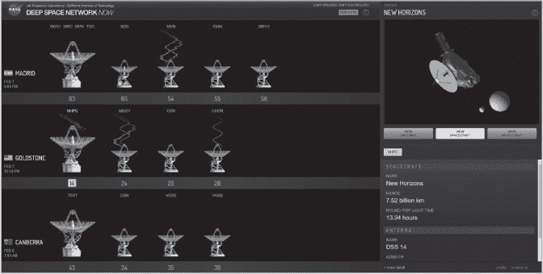

## 第十八章：信息可视化、科学可视化与仪表板库**


数据可视化是科学的一个重要组成部分。人类天生是视觉生物，以图形方式查看数据比阅读字符串或数字列表更高效、更直观。有效的图表帮助你清理、准备和探索数据。你可以利用它们揭示异常值和虚假样本，识别模式，并比较数据集。也许最重要的是，它们帮助你与他人清晰地沟通，并以一种易于理解的方式传达你的想法。难怪图形被称为“沟通的巅峰”。

数据可视化是一个非常广泛的类别，涵盖了从用于数据探索和报告的简单图表，到实时操作的复杂交互式 Web 应用程序。使用 Python，你可以轻松地涵盖这一范围。事实上，当涉及到创建图形时，Python 因其丰富的资源而感到困扰。拥有超过 40 个不同的绘图库，几乎每个人都能找到适合自己的。但这也是问题的一部分。

穿越 Python 的绘图 API 令人精疲力尽。用户可能会被所有选择所淹没，这些选择涵盖了广泛的功能，既有独特的也有重叠的。结果，他们通常更多地关注学习 API，而不是他们真正的工作：探索数据。事实上，本书的灵感来自于与其他科学家讨论这一问题，他们正是因为这个问题感到沮丧。

Python 的绘图库的另一个问题是，绝大多数都要求你编写代码来创建即使是最简单的可视化。与 Tableau 或 Excel 等软件相比，这些软件通过少量鼠标点击就能创建合理且美观的图表，且对用户的认知负担很小。

幸运的是，许多用户有类似的需求，通过稍微的前瞻性思考，你可以避免走上次优路径。通常，这涉及选择一个涵盖最常见任务的高层工具，简洁且方便，通常通过在现有工具上提供更简单的 API 来实现。

在接下来的章节中，我们将广泛地了解一些 Python 中最受欢迎和最有用的绘图和仪表板库。然后，我们将回顾一些逻辑性问题，帮助你找到最适合你需求的绘图库或库。

**注意**

*本章中的绘图示例旨在展示代码的复杂性和生成的图表类型。你不需要运行代码片段，因为许多讨论的库并未预先安装在 Anaconda 中。但如果你确实想自己测试它们，可以在产品网页上找到安装说明。我建议你将它们全部安装在一个专用的 conda 环境中（请参见第二章），而不是将它们放在基础环境中。*

### **信息可视化和科学可视化库**

我们可以将可视化分为三大类：*InfoVis*、*SciVis* 和 *GeoVis* （见图 16-1）。InfoVis（信息可视化）指的是 2D 或简单的 3D 静态或交互式数据表示，常见的例子包括统计图表，如饼图和柱状图。SciVis（科学可视化）指的是物理数据的图形表示，这些可视化旨在通过新颖和非常规的手段提供数据洞察。例如磁共振成像（MRI）和湍流流体流动的模拟。GeoVis（地理可视化）指的是通过静态和交互式可视化分析地理位置数据。常见的例子包括卫星图像和地图创建。


*图 16-1：三种可视化类别及示例*

表 16-1 列出了 Python 中一些重要的 InfoVis 和 SciVis 绘图库。接下来，我们将详细介绍其中的一些，然后再转向仪表盘库。最后，在第十七章中，我们将对 GeoVis 库进行类似的探讨。

**表 16-1：** Python 主要的 InfoVis 和 SciVis 库

| **类型** | **库** | **描述** | **网址** |
| --- | --- | --- | --- |
| InfoVis | Matplotlib | 适用于出版质量的 2D 和简单 3D 图表 | *[`matplotlib.org/`](https://matplotlib.org/)* |
| seaborn | Matplotlib 封装库，简化且美化绘图 | *[`seaborn.pydata.org/`](https://seaborn.pydata.org/)* |
| pandas | Matplotlib 封装库，简化 DataFrame 图表绘制 | *[`pandas.pydata.org/`](http://pandas.pydata.org/)* |
| Altair | 简单易用的 2D 图形，适用于小型数据集 | *[`altair-viz.github.io/`](https://altair-viz.github.io/)* |
| ggplot | 使用 pandas 绘制简单的“图形语法”图表 | *[`yhat.github.io/ggpy/`](https://yhat.github.io/ggpy/)* |
| Bokeh | 大型或流数据集的网页交互工具 | *[`bokeh.org/`](https://bokeh.org/)* |
| Chartify | 基于 Bokeh 的图表封装，简化图表绘制 | *[`github.com/spotify/chartify/`](https://github.com/spotify/chartify/)* |
| Plotly | 动态交互图形，适用于网页应用 | *[`plotly.com/python/`](https://plotly.com/python/)* |
| HoloViews | 可被多种库使用的可视化数据结构 | *[`holoviews.org/`](http://holoviews.org/)* |
| hvPlot | 基于 HoloViews/Bokeh 的简易交互绘图库 | *[`hvplot.holoviz.org/`](https://hvplot.holoviz.org/)* |
| Datashader | 用于将巨大数据集栅格化的工具，便于可视化 | *[`datashader.org/`](https://datashader.org/)* |
| SciVis | VTK | 3D 计算机图形的可视化工具包 | *[`vtk.org/`](https://vtk.org/)* |
| Mayavi | 具有交互性的 3D 科学可视化工具 | *[`docs.enthought.com/mayavi/`](https://docs.enthought.com/mayavi/)* |
| ParaView | 具有交互性的 3D 科学可视化工具 | *[`www.paraview.org/`](https://www.paraview.org/)* |

**注意**

*如果你对我们是如何陷入这场混乱的好奇，可以花几分钟看看 James Bednar 的博客文章“*Python 数据可视化 2018：为什么有这么多库？*”([`www.anaconda.com/blog/python-data-visualization-2018-why-so-many-libraries/`](https://www.anaconda.com/blog/python-data-visualization-2018-why-so-many-libraries/))。你还应该查看他的电子书《Python 数据可视化》和 PyViz 网站 ([`pyviz.org/`](https://pyviz.org/))，这些资源旨在帮助用户为他们的需求选择最佳的开源 Python 数据可视化工具，包括链接、概述、比较、示例和详尽的工具列表。*

#### ***Matplotlib***

*Matplotlib* 库是一个开源的、综合性的 Python 可视化库，旨在创建手稿级别的静态、动画和交互式可视化。主要是 2D 图表，例如条形图、饼图、散点图等，尽管也有一些 3D 绘图的可能性（图 16-2）。Matplotlib 已经有近 20 年的历史，最初是为了为早期版本的 Python 提供一个类似 MATLAB 的界面。MATLAB 是一种专有的科学编程语言，虽然曾经很流行，但现在已被 Python 取而代之。


*图 16-2：Matplotlib 绘图类型的小样本（图片来源：[`matplotlib.org/`](https://matplotlib.org/)）*

Matplotlib 的重点是创建用于出版物的静态图像和用于数据探索与分析的交互式图形。这些交互式图形使用像 Qt 这样的 GUI 工具包，而不是 Web 应用程序。该库已与 Anaconda 一起预安装。

Matplotlib 是 Python 可视化的王者、祖宗和“大咖”。它是一个庞大且详尽的库，许多替代产品都建立在它之上，就像其他库也建立在 NumPy 之上（包括 Matplotlib）。同样，像 pandas 这样的库的内部可视化工具也依赖于 Matplotlib 方法。

Matplotlib 的座右铭是“让简单的事变得简单，让复杂的事变得可能”。它支持所有操作系统，并处理所有常见的图像格式。它功能广泛，几乎可以构建你能想象的任何类型的图表，而且由于 Matplotlib 和 IPython 社区的合作，它与其他流行的科学库如 pandas、NumPy 和 scikit-learn 具有高度兼容性。

Matplotlib 是一个强大但低级的绘图引擎。这意味着你有很多灵活性和选项，可以通过逐步组装组件来精确控制图表。但这种自由也带来了复杂性。当创建复杂的图表时，你的代码可能会变得丑陋、密集且冗长。

Matplotlib 的 API 的难用性在一定程度上被其流行度和成熟度所弥补。简单的在线搜索就能找到几乎任何你想绘制的图形的示例代码。它最宝贵的资源无疑是 Matplotlib 的*图库*（*[`matplotlib.org/gallery/index.html/`](https://matplotlib.org/gallery/index.html/)*），这是一个包含各种图形绘制代码“食谱”的“烹饪书”。

Matplotlib 的其他问题包括其图形的外观和“可探索性”。尽管 Matplotlib 图形具有交互功能，如缩放、平移、保存和显示光标的*位置*（图 16-3），但与更现代的库相比，它们显得有些过时。


*图 16-3：Matplotlib 图形在外部 Qt 窗口（左）与 Jupyter 笔记本内联显示（右）的对比*

默认情况下，Matplotlib 的交互功能是设计为在*外部*窗口中工作，而不是在与你的代码位于同一屏幕上的*内联*模式下。你可以在 Jupyter Notebook 和 JupyterLab 中强制使用内联交互，但结果可能会出现故障。例如，保存按钮可能会直接打开一个空白网页，而不是下载图形。其他库还提供了更智能的光标悬停功能，可以显示有关已显示数据的自定义信息。

作为 Matplotlib 主导地位和实用性的证明，许多外部包扩展或建立在 Matplotlib 的功能之上（参见*[`matplotlib.org/3.2.1/thirdpartypackages/`](https://matplotlib.org/3.2.1/thirdpartypackages/)*）。其中两个包，*mpldatacursor*和*mplcursors*，允许你只用几行代码向图形添加*一些*交互式数据光标功能。

同样，也有一些依赖 Matplotlib 底层的附加可视化工具包。其中最重要的之一是*seaborn*，它旨在简化绘图，并生成比 Matplotlib 默认值更具吸引力的图形。seaborn 和 pandas 都是 Matplotlib 的封装库，使你可以使用更少的代码访问 Matplotlib 的部分方法。

#### ***seaborn***

*seaborn*库是一个免费的开源可视化库，建立在 Matplotlib 之上。它提供了一个更高层次的（即更易用的）接口，用于绘制吸引人且信息丰富的*统计*图形，如条形图、散点图、直方图等。它还内置了密度估计器、置信区间和回归函数的功能。不出所料，它与 pandas 和 NumPy 中的数据结构有很好的集成。seaborn 已在 Anaconda 中预安装。

seaborn 的目标之一是通过使用面向数据集的绘图函数，使可视化成为探索和理解数据的核心部分。它使得默认的图表更加美观，并支持构建复杂的可视化。通过使用高级的多图网格和不同的颜色调色板，它帮助揭示数据模式（访问 *[`seaborn.pydata.org/examples/index.html`](https://seaborn.pydata.org/examples/index.html)* 以查看更多示例）。

Seaborn 设计上与 pandas 中的流行 DataFrame 对象兼容，你可以轻松地将列名分配给图表的坐标轴。它也被认为比 Matplotlib 更适合制作多维度的图表。

在下面的示例中，最后一行代码生成了一个吸引人的散点图，包括一个带有 95％置信区间的线性回归线、边际直方图和分布图：

```py
import seaborn as sns
tips = sns.load_dataset('tips')
sns.jointplot(data=tips, x='total_bill', y='tip', kind='reg');
```


seaborn 的最佳特性之一是*pairplot*。这种内置的图表类型让你可以在一张图中探索整个数据集中的成对关系，提供查看直方图、分层核密度估计、散点图等选项。以下是使用 Palmer 群岛数据集创建的 pairplot 示例，用于识别企鹅物种。数据被加载为 pandas DataFrame（有关 pandas 库的概述，请参见第十五章）。

```py
import seaborn as sns
penguins = sns.load_dataset('penguins')
sns.pairplot(data=penguins, hue='species', markers=['o', 'X', 's']);
```


另一个内置的图表类型，*stripplot*，是一种散点图，其中一个变量是分类变量。它非常适合比较不同企鹅物种的喙长：

```py
sns.set_theme(style='whitegrid')
strip = sns.stripplot(x='bill_length_mm', y='species', data=penguins);
```


与 Matplotlib 不同，seaborn 允许你在绘图操作*过程中*操作数据。例如，你可以通过在`barplot()`方法中调用内置的长度函数（`len`）来计算企鹅数据集中的体重样本数量：

```py
bar = sns.barplot(data=penguins, x='species', y='body_mass_g', estimator=len)
bar.set(xlabel='Penguin Species', ylabel='Number of Samples');
```


让我们看看使用 seaborn 定制图表有多么简单。表 16-2 列出了 COVID-19 大流行初期，受影响最严重的前 10 个国家（按病例数排序）。致死率列列出了每 100 例确诊病例的死亡人数。每 10 万人死亡数列根据国家的总人口计算死亡人数。

**表 16-2：** COVID-19 统计数据

| **国家** | **地区** | **病例数** | **死亡人数** | **每 10 万人死亡数** | **致死率** |
| --- | --- | --- | --- | --- | --- |
| 美国 | 北美 | 31,197,873 | 562,066 | 171.80 | 0.018 |
| 印度 | 亚洲 | 13,527,717 | 170,179 | 12.58 | 0.013 |
| 巴西 | 拉丁美洲 | 13,482,023 | 353,137 | 168.59 | 0.026 |
| 法国 | 欧洲 | 5,119,585 | 98,909 | 147.65 | 0.019 |
| 俄罗斯 | 亚洲 | 4,589,209 | 101,282 | 70.10 | 0.022 |
| 英国 | 欧洲 | 4,384,610 | 127,331 | 191.51 | 0.029 |
| 土耳其 | 中东 | 3,849,011 | 33,939 | 41.23 | 0.009 |
| 意大利 | 欧洲 | 3,769,814 | 114,254 | 189.06 | 0.030 |
| 西班牙 | 欧洲 | 3,347,512 | 76,328 | 163.36 | 0.023 |
| 德国 | 欧洲 | 3,012,158 | 78,500 | 94.66 | 0.026 |
| 来源: *[`coronavirus.jhu.edu/data/mortality`](https://coronavirus.jhu.edu/data/mortality)* |

让我们将表 16-2 保存为逗号分隔值（*.csv*）文件，并与 seaborn 一起使用，查看死亡人数、每 10 万人死亡率和致死率之间的关系：

```py
import pandas as pd
import seaborn as sns

sns.set_style('whitegrid')
df = pd.read_csv('johns_hopkins_covid_stats_apr_2021.csv')
scatter = sns.scatterplot(data=df, 
                          x='Deaths', 
                          y='Deaths/100K Popl', 
                          hue='Country', 
                          style='Country',
                          size='Fatality Rate', 
                          sizes=(50, 200))
scatter.legend(loc='center right', bbox_to_anchor=(1.4, 0.5), ncol=1);
```


在导入 pandas 和 seaborn 后，你设置图表的样式，使其背景为白色并带有网格线。然后以 *.csv* 格式加载数据，生成名为 `df` 的 pandas DataFrame。创建散点图（`scatter`）只需要一个命令。标记的颜色（`hue`）和形状（`style`）基于国家，标记的大小反映了致死率，大小范围为 50 到 200。最后，你创建一个图例并调用图表。请注意，通过使用表 16-2 中的 DataFrame 列名，代码易于阅读和理解。

尽管 seaborn 是基于 Matplotlib 的抽象层，但它仍然提供访问底层 Matplotlib 对象的方式，因此你仍然可以精确控制你的图表。当然，你需要对 Matplotlib 有一定了解，才能以这种方式调整 seaborn 的默认设置。

相比 Matplotlib，seaborn 绘制的图表被认为更具吸引力，因此更适合用于出版物和演示文稿。如果你只需要用更简单的代码和更好的默认设置制作静态图像，那么 seaborn 是一个不错的选择。

**注意**

*即使你选择使用 Matplotlib 而不是 seaborn 封装器，你仍然可以导入 seaborn 并使用其主题来改善图表的视觉效果。例如，参见 [`www.python-graph-gallery.com/106-seaborn-style-on-matplotlib-plot`](https://www.python-graph-gallery.com/106-seaborn-style-on-matplotlib-plot) 和 [`seaborn.pydata.org/generated/seaborn.set_theme.html?highlight=themes`](https://seaborn.pydata.org/generated/seaborn.set_theme.html?highlight=themes)。*

#### ***pandas 绘图 API***

在上一章中讨论的 pandas 库有自己的绘图 API，`Pandas.plot()` (*[`pandas.pydata.org/pandas-docs/stable/user_guide/visualization.html`](https://pandas.pydata.org/pandas-docs/stable/user_guide/visualization.html)*)。这个 API 已经成为创建 2D 图表的事实标准，因为它可以使用 Matplotlib 和许多其他库作为绘图后端。这使得通过 pandas 学习一套绘图命令后，你可以使用各种库来制作静态或交互式图表。

在 pandas 中绘图可以说是使用 Python 创建可视化的最简单方法。它特别适合于快速的“临时”图表，用于数据探索。我们来看看：

```py
import pandas as pd

female_ht_vs_wt = {'height': [137, 152, 168, 183, 198, 213],
                  'weight': [31.2, 45.2, 58.8, 72.3, 85.5, 108.3]}
df = pd.DataFrame(female_ht_vs_wt)
df.plot(kind='scatter', x='weight', y='height')
df.plot.bar('weight');
```


在导入 pandas 并创建一个关于女性身高与体重关系的 Python 字典后，我们将字典转换为 pandas DataFrame。然后，代码的最后两行可以立即生成两个图形！还有比这更简单的吗？

这些图形非常简洁，缺乏任何交互功能，但不用担心，pandas 与其他绘图库配合得很好。只需一点点努力，你就可以切换到其他绘图库以获得额外的功能。通过将 pandas 的绘图后端更改为 HoloViews，我们将很快讨论这个库，你就能生成一个交互式图形，让你缩放、平移、保存，并在点上悬停光标查看其值。下面是代码和结果的示例：

```py
import pandas as pd

pd.options.plotting.backend = 'holoviews'
female_ht_vs_wt = {'height': [137, 152, 168, 183, 196, 213],
                  'weight': [31.2, 45.2, 58.8, 72.3, 84.5, 108.3]}
df = pd.DataFrame(female_ht_vs_wt)
df.plot(kind='scatter', x='weight', y='height')
```


请注意，尽管更改了绘图库，但你并没有需要修改原始绘图代码中的任何一行。要查看一些其他的`Pandas .plot()` API 替代品，请访问 *[`pyviz.org/high-level/index.html#pandas-plot-api/`](https://pyviz.org/high-level/index.html#pandas-plot-api/)*。

#### ***Altair***

*Altair* 是一个开源的统计可视化库，专为 Python 设计，与 pandas DataFrame 紧密对接。它受到那些希望快速可视化小型数据集的用户的喜爱。

Altair 自动处理了许多绘图细节，让你专注于你想要做的事情，而不是“如何做”的按钮操作部分。就像前一部分中提到的女性身高与体重的例子，你只需将数据列与编码通道（例如 x 轴和 y 轴）关联，即可制作图形。但这种易用性也带来了一些缺点。与 Matplotlib 绘制的图形相比，它的自定义程度较低，而且不支持 3D 绘图功能。

另一方面，所有 Altair 图形都可以交互式操作，这意味着你可以缩放、平移、突出显示图形区域，使用选定的数据更新关联图表，启用*工具提示*，让你将光标悬停在点上以查看详细信息，等等。Altair 可视化需要 JavaScript 前端来显示图表，因此应与 Jupyter notebooks 或支持笔记本功能的集成开发环境（IDE）一起使用。

与 Matplotlib 和其他*命令式*绘图库不同，Altair 本质上是*声明式*的，它生成一个 JSON 格式的图形对象，图形可以从该对象中重新构建。JSON，全称为 JavaScript 对象表示法，是一种用于存储和传输数据对象的文件和数据交换格式，采用人类可读的文本格式。由此，Altair 生成的图形并非由像素构成，而是由数据和可视化规格构成的图形。

由于声明式绘图对象存储了数据和相关元数据，因此在绘制图表命令期间操纵数据或将其与其他数据一起可视化变得非常容易。它还可能导致非常大的可视化文件大小，或将整个数据集存储在你的 Jupyter notebook 中。尽管有一些解决方法可以帮助你管理内存和性能问题，但库的文档建议绘制的数据行数不要超过 5000 行（见 *[`altair-viz.github.io/user_guide/faq.html#altair-faq-large-notebook/`](https://altair-viz.github.io/user_guide/faq.html#altair-faq-large-notebook/)*）。

使用 JSON 的另一个缺点是，如果与不受信任的服务或浏览器一起使用，它可能会被攻击。这会使托管的网页应用程序容易受到各种攻击。

#### ***Bokeh***

*Bokeh* 是一个开源可视化库，支持从非常大或流式数据集创建交互式的、适合网页展示的图表。Bokeh（发音为“BO-kay”）使用 Python 定义的图表，并自动通过 HTML 和 JavaScript（这两种是用于交互式网页的主流编程语言）在网页浏览器中渲染它们。它是维护良好且支持较好的库之一，并且已经预装在 Anaconda 中。

Bokeh 可以输出 JSON 对象、HTML 文档或交互式网页应用程序。它有一个三层接口，从简单快速到非常详细，逐步增加对图表的控制。然而，与 Matplotlib 不同，Bokeh 没有为一些常见图表类型（如饼图、甜甜圈图或直方图）提供高级方法。这需要额外的工作，并且需要使用如 NumPy 等额外的库。对 3D 绘图的支持也有限。因此，从实际角度来看，Bokeh 的原生 API 主要用于将图表发布为网页应用或基于 HTML/JavaScript 的报告，或者当你需要生成高度交互的图表或仪表板时使用。

Bokeh 在 Jupyter notebooks 中表现良好，并允许你使用*主题*，你可以提前规定绘图的外观，比如字体大小、坐标轴刻度、图例等等。图表还配备了一个工具栏（图 16-4），用于交互操作，包括缩放、平移和保存。


*图 16-4：Bokeh 图表工具栏（由 [`bokeh.org/`](https://bokeh.org/) 提供）*

最后，如果你将数据保存在 pandas 中，你可以使用一个名为 Pandas-Bokeh 的库（*[`github.com/PatrikHlobil/Pandas-Bokeh/`](https://github.com/PatrikHlobil/Pandas-Bokeh/)*），该库直接消费 pandas 数据对象，并使用 Bokeh 渲染它们。这比单独使用 Bokeh 提供了一个更高层次、更易用的接口。基于 Bokeh 构建的其他高级 API 包括用于绘图的 HoloViews、hvPlot 和 Chartify，以及用于创建仪表板的 Panel。我们将在本章稍后部分介绍这些内容。

#### ***Plotly***

*Plotly* 是一个开源的基于网页的工具包，用于制作互动式的、出版质量的图形。它与 Bokeh 类似，都是通过 Python 生成所需的 JavaScript 来构建交互式图表。像 Bokeh 和 Matplotlib 一样，Plotly 是一个核心 Python 库，许多更高级的库都基于它。

Plotly 图表存储在 JSON 数据格式中。这使得它们可以便捷地通过其他编程语言（如 R、Julia、MATLAB 等）的脚本进行读取和使用。其基于网页的可视化效果可以在 Jupyter notebook 中展示，保存为独立的 HTML 文件，或嵌入到网页应用程序中。由于 Plotly 使用 JSON，它也面临与 Altair 类似的内存和安全问题（请参见 第 429 页的“Altair”部分）。

与 Matplotlib 和 seaborn 不同，Plotly 专注于在 Python 中创建动态的、交互式的图形，以便嵌入到网页应用中。你可以创建基础图表，也可以创建更独特的等高线图、树状图和 3D 图表（参见 图 16-5）。


*图 16-5：使用 Plotly Express 制作的 3D 散点图*

图 16-6 展示了一个 3D 网格的示例。你甚至可以在图例和标题中显示 LaTeX 方程式。


*图 16-6：在 Plotly/Dash 中绘制的 3D 网格凉鞋*

Plotly 还支持滑块、过滤器、鼠标悬停和鼠标点击事件。只需几行代码，你就可以创建引人注目的互动图表，这不仅能节省你在数据集探索中的时间，还能轻松修改并导出。这一工具包还支持多个数据源的复杂可视化，而不像 Tableau 等产品那样每个图表只能接受一个数据表作为输入。

Plotly 使用 JavaScript 编写，并驱动 *Dash* (*[`dash.plotly.com/introduction`](https://dash.plotly.com/introduction)*)，一个开源 Python 框架，用于构建网页分析应用程序（称为仪表盘）。Dash 是基于 Plotly.js 的，它大大简化了在 Python 中构建高度自定义的仪表盘。此类应用程序可以在网页浏览器中渲染，并可以部署到服务器并通过 URL 分享。Dash 是跨平台的，并且支持移动端。我们将在“仪表盘”一章的 第 445 页中进一步讨论 Dash。

Plotly 还提供了一个高层次、更加直观的 API，叫做 *Plotly Express* (*[`plotly.com/python/plotly-express/`](https://plotly.com/python/plotly-express/)*)，它提供了简化语法，可以一次性创建整个图表。它有超过 30 个函数用于创建不同类型的图形，每个函数都经过精心设计，力求保持一致性并尽可能易于学习，让你能够轻松地在散点图、条形图、旭日图等图形之间切换，适用于数据探索过程中的各个阶段。因此，Plotly Express 是使用 Plotly 创建常见图形的推荐起点。

Plotly Express 图表非常容易进行样式设置，以实现非常有用的功能。假设你想查看二十年期间的每月降水总量，并查看 8 月和 10 月与其他月份的比较。使用 Plotly Express，你可以轻松地突出显示这些月份的线条，使其更加显眼。通过交互式工具栏，你可以切换尖峰线和悬停功能，以查询数值（图 16-7）。


*图 16-7：一个包含突出显示的线条、尖峰线条和悬停框的 Plotly Express 折线图*

Plotly Express 的另一个有用功能是图例是“动态的”。点击图例中的一个类别一次，你会暂时从图表中移除它。点击两次，所有其他线条将消失，只留下该类别独立显示。这是在图 16-8 中针对 8 月（`Aug`）类别完成的。你甚至可以通过动画展示图表，查看随着时间的变化情况。这是理清复杂“意大利面条”图表的好方法！


*图 16-8：双击图例类别将通过移除其他数据来隔离该类别。*

让我们重新审视捕捉病毒传播第一年死亡统计数据的 COVID-19 数据集。你将希望将以下代码和结果与第 427 页中的 seaborn 示例进行比较。

```py
import pandas as pd
import plotly.express as px

df = pd.read_csv('johns_hopkins_covid_stats_apr_2021.csv')
fig = px.scatter(data_frame=df, 
                 x='Deaths', 
                 y='Deaths/100K Popl', 
                 color='Country', 
                 size='Fatality Rate', 
                 text='Country')
fig.update_layout(showlegend=False)
fig.show()
```


与之前的 seaborn 代码类似，这段代码非常易读且易于理解。还要注意，Plotly Express 有一个特定的参数`data_frame`，它明确告诉你，这个库是为处理 pandas 而设计的。

这里的一个不错的功能是，你可以轻松地在标记上方显示国家名称，让你使用一致的标记形状来进行大小比较。你无法像在 seaborn 中那样自动获得“大小”图例，但 Plotly Express 通过自动允许鼠标悬停事件来弥补这一点，正如英国数据中的图表所示。

Plotly Express 的另一个有用功能是*面板图*，它让你可以按地理区域查看之前的散点图：

```py
--snip--
fig = px.scatter(data_frame=df, 
                 x='Deaths', 
                 y='Deaths/100K Popl', 
                 color='Country', 
                 size='Fatality Rate', 
                 text='Country',
              ➊ facet_col='Region')
fig.update_layout(showlegend=False)
fig.show()
```


我们通过向`px.scatter()`方法添加一个参数➊来实现这一点。

Plotly Express 主要用于探索性数据分析。你的数据必须采用非常特定的格式（它针对的是 pandas DataFrame），你对图表的自定义能力有限，而且你可能会在将可视化结果放入演示文稿时遇到困难。为了能够完成你可能想做的所有操作，你可能需要偶尔切换到完整的 Plotly API，或者将 Plotly Express 与其他库（如 Matplotlib 或 seaborn）结合使用。

还有一个独立的第三方包装库围绕 Plotly，名为 *cufflinks* (*[`github.com/santosjorge/cufflinks/`](https://github.com/santosjorge/cufflinks/)*)，它提供了 Plotly 和 pandas 之间的绑定。这个库帮助你使用 `Pandas.plot()` 接口从 pandas DataFrame 创建图表，但输出结果是 Plotly 图形。

Plotly 和 Plotly Express 都能够直接从 pandas DataFrame 构建 web 图表。你在 Jupyter notebooks 中创建的图表可以直接复制粘贴到 Dash 应用中，快速实现仪表盘。你可以在 *[`plotly.com/python/scientific-charts/`](https://plotly.com/python/scientific-charts/)* 查看一些使用 Plotly 构建的科学图表示例。

#### ***HoloViews***

*HoloViews* 是一个开源库（注意，我没有说是 *绘图库*），旨在通过抽象掉绘图过程来简化可视化。HoloViews 通过提供一组声明式绘图对象，方便你交互式地可视化数据，这些对象存储你的数据并附带相关元数据。其目标是支持科学研究的整个生命周期，从最初的探索到发布、再到工作复现以及新的扩展。

HoloViews 允许你将各种容器类型组合成数据结构，以便可视化地探索数据。一些示例容器类型包括 *Layout*，用于将元素并排显示为独立的子图；*Overlay*，用于将元素叠加显示；以及 *DynamicMap*，用于动态图表，能够自动更新并响应用户交互。要体验 DynamicMap 容器，可以查看 *[`holoviews.org/user_guide/Streaming_Data.html`](https://holoviews.org/user_guide/Streaming_Data.html)* 和 *[`holoviews.org/user_guide/Responding_to_Events.html`](https://holoviews.org/user_guide/Responding_to_Events.html)* 来查看动画示例。

HoloViews 使用适当的绘图库，如 Matplotlib、Plotly 或 Bokeh，作为后端生成最终的图表。这让你能够专注于数据，而不是浪费时间编写绘图代码。作为一个绘图“中介”，HoloViews 与 seaborn 和 pandas 等库集成良好，特别适合用来可视化大数据集——多达数十亿条——使用如 *Dask* 和 *Datashader* 等库（例如 *[`holoviz.org/tutorial/Plotting.html`](https://holoviz.org/tutorial/Plotting.html)*）。

Python 绘图未来的一个愿景是使用一组库来简化在 web 浏览器中处理小型和大型数据集的过程（见 图 16-9）。这将包括进行探索性分析、制作简单的基于小部件的工具，或者构建功能齐全的仪表盘。


*图 16-9：HoloViz 维护的库（由 [holoviz.org](http://holoviz.org) 提供）*

在这一协同努力下，HoloViews 和 GeoViews 提供了一个统一简洁的高级 API，支持像 Matplotlib、Bokeh、Datashader、Cartopy 和 Plotly 这样的库。Panel 提供了统一的仪表盘方法，而 Datashader 允许绘制非常大的数据集。Param 支持声明用于在笔记本上下文中或外部使用的小部件的用户相关参数。这种安排使你能够轻松地在后端之间切换，而无需学习每个新绘图库的命令。

认识到典型的图形是由许多视觉表现组成的对象，HoloViews 使得组合元素变得非常简单，支持两种最常见的方式：将多个表现合并成一个图形，或在同一坐标轴上叠加视觉元素。在制作多图形图表时，HoloViews 通过自动链接各个图形中的坐标轴和选择项来提供帮助。它还非常适用于创建动态更新的图表，尤其是使用滑块的图表。借助 Bokeh 后端，你可以结合各种小部件以及缩放和漫游工具来帮助数据探索。

让我们来看一个 Jupyter Notebook 示例，这个示例改编自 HoloViews 展示页面 (*[`holoviews.org/gallery/index.html`](https://holoviews.org/gallery/index.html)*)，它使用了 HoloViews 和 Panel 来生成图表。数据方面，我们将再次使用 Palmer Archipelago 数据集，该数据集量化了三种企鹅物种的形态学差异。得益于 Panel，你将能够使用下拉菜单在单个图表中切换和装饰显示的数据。

```py
   import seaborn as sns  # For access to penguins dataset.
   import holoviews as hv
   import panel as pn, panel.widgets as pnw
   hv.extension('bokeh')

➊ hv.opts.defaults(hv.opts.Points(height=400, width=500, 
                                   legend_position='right',
                                   show_grid=True))

   penguins = sns.load_dataset('penguins')
   columns = penguins.columns
   discrete = [x for x in columns if penguins[x].dtype == object]
   continuous = [x for x in columns if x not in discrete]
➋ x = pnw.Select(name='X-Axis', value='bill_length_mm', options=continuous)
   y = pnw.Select(name='Y-Axis', value='bill_depth_mm', options=continuous)
   size = pnw.Select(name='Size', value='None', options=['None'] + continuous)
   color = pnw.Select(name='Color', value='None', 
                      options=['None'] + ['species'] + ['island'] + ['sex'])
   @pn.depends(x.param.value, y.param.value, 
               color.param.value, size.param.value) 

➌ def create_figure(x, y, color, size):
       opts = dict(cmap='Category10', line_color='black')
       if color != 'None':
           opts['color'] = color 
       if size != 'None':
           opts['size'] = hv.dim(size).norm() * 20
       return hv.Points(penguins, [x, y], label="{} vs {}".
                        format(x.title(), y.title())).opts(**opts)

   widgets = pn.WidgetBox(x, y, color, size, width=200)
   pn.Row(widgets, create_figure).servable('Cross-selector')
```

在导入 seaborn（用于数据）、HoloViews 和 Panel 后，你告诉 HoloViews 使用哪个绘图库。Bokeh 是默认选项，但你可以通过将代码行更改为 `hv.extension('matplotlib')` 或 `hv.extension('plotly')` 来轻松更改为 Matplotlib 或 Plotly。通常情况下，改变后端无需更改代码的其余部分。

下一行 ➊ 是可选的，但它展示了 HoloViews 的一个不错功能：设置自定义默认值，以决定你希望图表的外观。在这种情况下，你设置了图形的大小、图例的位置以及所有散点图使用的背景网格。

接下来，你加载企鹅数据集，该数据集方便地随 `seaborn` 库一起以 pandas DataFrame 格式提供。为了给用户提供菜单选项，遍历 `penguins` DataFrame 中的列，并将内容分别赋值给名为 `discrete` 和 `continuous` 的列表。`discrete` 列表包含对象，如物种名称、岛屿名称或企鹅的性别。`continuous` 列表则用于数值数据，如喙长和喙深。

从 ➋ 开始，您必须指定 Panel 小部件将为 x 轴和 y 轴以及标记的大小和颜色显示哪些选项，包括最初显示的默认选项。之后，您定义一个函数来创建图形 ➌ 并返回一个 HoloViews *Points* 元素。最后两行代码使用菜单小部件创建图形。

该程序的输出如图 16-10 所示。注意图表左侧的下拉菜单和右侧的交互式工具栏。因为我们将 `size` 和 `color` 的默认值设置为 `'None'`，所以所有数据点看起来都相同。

现在，您可以使用菜单小部件按物种为数据点上色（见图 16-11），这会在图表的右下角生成一个图例。将大小选项设置为体重允许您将第三个度量标准定性地融入到二维散点图中。现在您可以看到，*Gentoo* 物种明显比另外两个物种大。


*图 16-10：三种不同企鹅物种的喙深度与喙长度关系*


*图 16-11：按物种着色并根据体重调整大小的喙深度与喙长度关系*

在图 16-12 中，我们使用了下拉菜单更改了数据和大小参数。正如您所看到的，这是一个非常好的方式，可以在不生成大量图表的情况下，交互式地探索并熟悉数据集。


*图 16-12：按物种着色并根据鳍长调整大小的喙长度与体重关系*

这里的一个关键点是，代码引用了 DataFrame 来创建一个 HoloViews *Points* 元素。这个对象基本上是 DataFrame，并且知道哪些数据映射到 x 轴和 y 轴。这使得 DataFrame 可以被绘制。但与其他库中的图表对象不同，`hv.Points` 元素会保留原始数据。这使得它在后续的处理管道中仍然可用（要查看动态演示，请访问 HoloViews Showcase: *[`holoviews.org/Tutorials/Showcase.html`](http://holoviews.org/Tutorials/Showcase.html)*）。

就像 Plotly 有 Plotly Express 一样，HoloViz 库也有 *hvPlot*，这是一个建立在 HoloViews 基础上的更简单的绘图替代方案。这个完全交互式的高级 API 补充了基于 Matplotlib 构建的库（如 pandas 和 GeoPandas）提供的主要是静态的图表，这些库需要额外的支持库来进行基于 Web 的交互式绘图。它专为 PyData 生态系统设计，并与其核心数据容器兼容，这些容器允许用户处理各种数据类型（见图 16-13）。


*图 16-13：hvPlot 库为 HoloViews 提供了一个高级绘图 API*

hvPlot 库的交互式 Bokeh 基础 API 支持平移、缩放、悬停和可点击/可选择的图例。在以下示例中，hvPlot 与 pandas 配合使用，生成一个交互式图表：

```py
import hvplot.pandas
from bokeh.sampledata.degrees import data as degrees

degrees.hvplot.line(x='Year', y=['Art and Performance', 
                                 'Business', 'Biology', 
                                 'Education', 'Computer Science'], 
                    value_label='% of Degrees Earned by Women', 
                    legend='top')
```


这就像在 pandas 中绘图一样简单，但请注意图表右侧的工具栏，其中有平移、缩放、保存和悬停图标。悬停时，你可以使用光标查询图形的详细信息，如计算机科学变量的弹出窗口所示。这些选项在使用原生 pandas 绘图时是不可用的。

若想了解更多关于这些库的信息，请查看 *HoloViz* (*[`holoviz.org/`](https://holoviz.org/)*)，这是一个旨在让 Python 中的基于浏览器的数据可视化更加易用、易学并更强大的协调性努力。

#### ***Datashader***

*Datashader* 是一个开源库，旨在可视化非常大的数据集。Datashader 并不是将整个数据集从 Python 服务器传输到浏览器进行渲染，而是将其栅格化（像素化）成一个更小的热图或图像，然后再传输进行渲染。与 Matplotlib 等流行库在处理仅 10 万个点时可能遇到的性能问题不同，Datashader 可以处理数亿甚至数十亿个数据点。例如，图 16-14 绘制了 3 亿个数据点。


*图 16-14：Datashader 创建的 3 亿数据点的图表，数据来源于 2010 年人口普查（感谢 Datashader 提供）*

Datashader 使得在标准硬件（如笔记本电脑）上处理非常大的数据集成为可能。尽管计算密集型步骤是用 Python 编写的，但它们通过名为 *Numba* (*[`numba.pydata.org/`](https://numba.pydata.org/)*) 的工具透明地编译为机器代码，并通过 Dask 分布到多个处理器上。

Datashader 文档强调了该工具在绘图预处理阶段的功能。这意味着 Datashader 通常与其他绘图库一起使用，处理与大数据集相关的繁重工作。因此，尽管它更注重性能和效率，而非直接生成基础统计图表，但它可以与其他工具配合，帮助你绘制大数据集——比如在散点图中——通过处理常见的过度绘制问题，解决分布点密度被掩盖的问题（如图 16-15 所示）。


*图 16-15：Datashader（右侧）很好地处理了过度绘制的点（感谢 [`holoviews.org/`](https://holoviews.org/) 提供）。*

在另一个示例中，假设你使用 Bokeh 将数据直接传输到浏览器，这样即便没有 Python 进程在后台运行，用户也能与数据进行交互。如果数据集包含数百万或数十亿个样本，你将面临 Web 浏览器的限制。但使用 Datashader，你可以将这个庞大的数据集预渲染为固定大小的栅格图像，从而捕捉数据的分布。然后，Bokeh 的交互式图表可以在缩放和平移时动态重新渲染这些图像，使得在 Web 浏览器中处理庞大数据集变得更加容易（图 16-16）。


*图 16-16：使用 HoloViews + Bokeh 生成基于 Datashader 的交互式图表（图像来源：[`datashader.org/`](https://datashader.org/))*

你可以在 *[`examples.pyviz.org/`](https://examples.pyviz.org/)* 的“选区划分”（gerrymandering）示例中看到 Datashader 实际应用的精彩实例。Datashader 与 HoloViews 和多个绘图库协同工作，生成了一张展示休斯顿人口的地图，按种族进行颜色编码，将绘图转化为精美的艺术作品，呈现出一种如水彩画般的效果，只有在彩色显示时才能真正感受到其美妙。

查看一个很好的示例，展示了如何将 Datashader 与统计图表结合使用，参考 *[`holoviews.org/user_guide/Large_Data.html`](https://holoviews.org/user_guide/Large_Data.html)*。Datashader 的共同创始人 Peter Wang 在 *[`www.youtube.com/watch?v=fB3cUrwxMVY/`](https://www.youtube.com/watch?v=fB3cUrwxMVY/)* 上提供了一个易于理解的库概述视频。

在所有这些示例中，请注意你将失去 Datashader 一些交互性。你仍然可以进行缩放和平移，但鼠标悬停事件等将不再有效，除非有特殊支持，因为浏览器并不会将所有数据点加载以供检查。作为回报，你可以在不让计算机崩溃的情况下可视化数百万个数据点。

#### ***Mayavi 和 ParaView***

一种常见的科学实践是可视化点云数据，比如你可能在激光雷达（LIDAR）扫描中遇到的数据。像 Matplotlib 这样的通用工作库能够在一定程度上执行这个任务，但当你尝试交互式地可视化点云和其他 3D 图表时，性能会迅速下降。例如，如果你尝试与大量样本进行交互，Matplotlib 可能会变得很慢，甚至崩溃你的计算机。即使 3D 表现成功渲染，它们看起来也不会很好，可能很难理解你所看到的内容。

Datashader 可以提供帮助，但对于需要大量图形处理的 3D 和 4D 可视化（例如用于物理过程的可视化），你需要一个专门的库，如 Mayavi（发音为 MA-ya-vee），它能够处理*物理位置*的规则和不规则网格数据。这使得 Mayavi 与 Datashader 有所不同，因为后者更多地专注于在*任意空间*中的信息可视化，而不一定是三维的物理世界。

Mayavi2 是一个开源的通用跨平台工具，用于 3D 科学数据可视化。它从一开始就考虑到了脚本编写和可扩展性。你可以将 Mayavi2 导入 Python 脚本中，像使用 Matplotlib 一样将其用作一个简单的绘图库。它还提供了一个应用程序（图 16-17），可以单独使用。

Mayavi2 是用 Python 编写的，使用强大的可视化工具包（VTK）库，并通过 Tkinter 提供图形用户界面（GUI）。它是跨平台的，可以在任何同时支持 Python 和 VTK 的系统上运行（几乎所有 Unix、macOS 或 Windows 系统）。在一定程度上，你可以在 Jupyter 笔记本中使用 Mayavi。想要查看一些 Mayavi2 图表示例，请访问* [`docs.enthought.com/mayavi/mayavi/auto/examples.html`](https://docs.enthought.com/mayavi/mayavi/auto/examples.html)*。


*图 16-17：Mayavi2 应用程序用于 3D 可视化。注意右下角的 Python 控制台。*

Mayavi2 的替代方案是*ParaView*（图 2-18）。虽然设计用于 3D，但它也能处理 2D，具有高度的交互性，并且提供 Python 脚本接口。


*图 16-18：ParaView 应用程序用于 3D 可视化。注意左下角的 Python 控制台。*

ParaView 由桑迪亚国家实验室开发，而 Mayavi 是 Enthought 公司推出的产品，其 Canopy 发行版是 Anaconda 的直接竞争对手。

### **仪表盘**

*仪表盘*是一种易于阅读的交互式图形用户界面，通常实时展示。仪表盘通常显示在一个链接到数据库的网页上，这样展示的信息就能不断更新。科学领域的仪表盘示例包括天气站、地震监测和航天器跟踪（图 16-19）。



*图 16-19：NASA 航天器跟踪仪表盘（图片来源：[`www.nasa.gov`](https://www.nasa.gov))*

仪表盘确实可以大大提高数据的可用性和交互性，尤其是对于非技术用户。只要有互联网连接，它们还可以让数据随时随地都能访问。这在与外部合作方协作或向分散的利益相关者提供结果时尤其重要。

仪表盘需要执行多个任务，如分析和可视化数据、监听并接受用户请求、以及通过 Web 服务器返回网页。你可以将不同的库组合起来处理这些任务，或者你可以直接使用专门的仪表盘库。

Python 支持五个主要库进行高级 Web 仪表盘开发：Dash、Streamlit、Voilà、Panel 和 Bokeh（表 16-4）。这些库允许你使用纯 Python 创建仪表盘，因此你不必学习像 JavaScript 和 HTML 这样的底层启用语言。我们之前已经看过 Bokeh，因此这里我们将重点介绍其他四个。

**表 16-4：** Python 最重要的仪表盘库

| **库** | **描述** | **网址** |
| --- | --- | --- |
| Plotly Dash | 高级生产级/企业仪表盘 | *[`plotly.com/dash/`](https://plotly.com/dash/)* |
| Streamlit | 快速、简便的 Web 应用，支持多种绘图库 | *[`streamlit.io/`](https://streamlit.io/)* |
| Voilà | 将 Jupyter Notebook 呈现为独立的 Web 应用 | *[`voila.readthedocs.io/`](https://voila.readthedocs.io/)* |
| Panel | 使用几乎任何库的交互式 Web 应用 | *[`panel.holoviz.org/`](https://panel.holoviz.org/)* |
| Bokeh | 适用于大规模或流式数据集的 Web 交互性 | *[`bokeh.org/`](https://bokeh.org/)* |

在我们快速了解这四个工具之前，请注意，实际上在其他库中也可以实现仪表盘的某些功能。图形绘制的老牌库 Matplotlib 支持多种 GUI 工具包接口，如 Qt，可以生成本地应用程序，作为基于 Web 的仪表盘的替代方案。而多个库利用 JavaScript 来帮助构建仪表盘，*Bowtie*（* [`bowtie-py.readthedocs.io/`](https://bowtie-py.readthedocs.io/) *）则让你使用纯 Python 来构建仪表盘。你可以在 Jupyter Notebook 中使用*ipywidgets*来构建仪表盘，但你需要使用一个单独的可部署服务器，如 Voilà，来共享它。

如需更多了解，PyViz 提供了一个仪表盘页面，包括博客文章、比较文章的链接以及替代或辅助工具的列表。你可以在* [`pyviz.org/dashboarding/`](https://pyviz.org/dashboarding/) *找到它。

**注意**

*我们之前看过的 Bokeh，包含了一个小部件和应用库，以及一个用于图表和仪表盘的服务器。它还支持大规模数据集的实时流式传输。然而，如果你打算使用 Bokeh 开发复杂的数据可视化，你需要一些 JavaScript 的知识。Panel 是建立在 Bokeh 上的，就像 seaborn 是建立在 Matplotlib 上的一样，它提供了一个更高级的工具包，使得构建仪表盘变得更容易。它还支持除了 Bokeh 之外的多个绘图库。*

#### ***Dash***

*Dash* 是一个开源 Python 框架，由 Plotly 开发，作为部署 web 分析应用程序的完整解决方案。Dash 建立在 Plotly.js、React.js 和 *Flask*（一个用于从零开始构建 web 应用的低级框架）之上。Dash 应用程序在 web 浏览器中渲染，部署到服务器并通过 URL 共享。这使得 Dash 平台独立，并且支持移动设备。在 2020 年，Plotly 发布了 *JupyterDash* (*[`github.com/plotly/jupyter-dash/`](https://github.com/plotly/jupyter-dash/)*)，一个新的库，旨在从 Jupyter 环境中构建 Dash 应用。

使用 Dash，你可以仅用几个小时就构建一个响应式的定制界面。顺便提一下，*响应式* 意味着网页可以在各种设备和屏幕尺寸上良好渲染。Dash 使用简单的模式来抽象化大部分仪表板构建过程，例如生成所需的 JavaScript、React 组件、HTML 和服务器 API。实际上，你基本上可以将 Plotly 图表直接从 Jupyter notebook 复制并粘贴到 Dash 应用中。

在仪表板的外观方面，Dash 提供了一个吸引人的开箱即用默认样式表，但也允许你轻松添加第三方样式。*Dash-bootstrap-components* (*[`dash-bootstrap-components.opensource.faculty.ai/`](https://dash-bootstrap-components.opensource.faculty.ai/)*）是一个开源库，它使得构建具有复杂响应式布局、一致风格的应用变得更容易。你还可以使用来自 Bootswatch 主题的任何主题 (*[`www.bootstrapcdn.com/bootswatch/`](https://www.bootstrapcdn.com/bootswatch/)*）。这些节省时间的附加工具可以让你以最小的努力构建专业外观的仪表板。

由于其相对成熟、用户社区的扩展以及大型企业组织的采用，Dash 现在拥有大量专业模块库、多个仓库以及出色的文档和教程，帮助构建定制化仪表板。而大多数科学家可能只会制作简单的单页仪表板，Dash 也能够构建多页、可扩展、高性能的仪表板，并能够将组织风格指南融入最终的布局中。这是 Dash 与像 Streamlit 和 Voilà 这样更简便工具的区别所在。

另一方面，Dash 主要是为 Plotly 设计的，尽管也可以使用其他第三方绘图库（参见 *[`github.com/plotly/dash-alternative-viz-demo/`](https://github.com/plotly/dash-alternative-viz-demo/)*）。Dash 还要求你使用 HTML 和层叠样式表（CSS）语法，这不是 Python 用户通常愿意做的事情。这导致了更简单工具的出现，例如 Streamlit，接下来我们将介绍它。

#### ***Streamlit***

*Streamlit* 是一个相对较新的开源库，用于快速构建吸引人的仪表板 web 应用程序。作为一个一体化工具，它解决了 web 服务和数据分析的问题。

Streamlit 的简单 API 让你可以专注于数据分析和可视化，而不是前端和后端技术问题。共享和部署都非常快速且简单，而且学习曲线可以说是 Python 中所有仪表板工具中最短的。因此，Streamlit 的受欢迎程度迅速上升，并且不断有新功能被添加。

与 Dash 主要针对生产和企业环境不同，Streamlit 设计用于快速原型开发。它让你用更少的代码做更多的事情，而且与 Dash 主要与 Plotly 配合工作不同，Streamlit 允许你轻松地混合和匹配来自多个库的图表，包括 Plotly、Altair、Bokeh、seaborn 和 Matplotlib。这使你可以根据具体的绘图任务选择最合适的工具，并允许团队成员使用他们偏好的绘图库。

对于现有的 Python 脚本，Streamlit 可以说是将其快速且轻松转化为交互式仪表板的最佳方法。然而，它不支持 Jupyter Notebook，且在将代码迁移到 Streamlit 时，你可能会遇到一些障碍。另一方面，它与诸如 scikit-learn、TensorFlow/Keras、NumPy、OpenCV、PyTorch、pandas 等主流库高度兼容。如果你对 Streamlit 的默认设计感到满意，并且不需要做太多定制，它是一个快速启动仪表板的绝佳选择。

#### ***Voilà***

*Voilà* 是一个开源库，可以让你快速将 Jupyter 笔记本转化为独立的交互式仪表板，并与他人共享。作为建立在 Jupyter 上的薄层，它代表了一个非常具体的用例，而不是一个完整的仪表板解决方案。

Voilà 允许与项目相关的非技术人员使用你的 Jupyter 笔记本，而无需了解 Python 或 Jupyter，也无需在他们的电脑上安装这些工具。如果你已经有了包含所需所有交互性的笔记本，它是将工作转化为仪表板的最短路径。

Voilà 主要用于渲染。一个常见的方法是使用像 bqplot、Plotly 或 ipywidgets 这样的 Python 库，向 Jupyter notebook 中添加交互性（小部件），这些都受到 Voilà 的支持。（我们在第五章中介绍了 ipywidgets）。你可能需要格式化笔记本，以便隐藏和抑制未使用的代码和 Markdown。

Voilà 运行笔记本中的代码，收集输出并将其转换为 HTML。默认情况下，笔记本的代码单元会被隐藏。输出按其在笔记本中出现的顺序垂直显示（图 16-20），但是你可以使用 *小部件布局模板* 来改变单元输出的位置，例如将它们拖动到水平布局中。然后，页面被保存为一个 Web 应用，其中页面上的小部件可以访问底层 Jupyter 内核。

此时，仪表板仅在你的计算机上。为了让其他人可以访问，你需要通过使用公共云计算平台（如 Binder、Heroku、Amazon Web Services (AWS)、Google Cloud Platform (GCP)、IBM Cloud 或 Microsoft Azure）将仪表板部署到云端。

*Binder* 是一个免费的开源网络应用程序，用于管理数字存储库，它是部署 Voilà 应用程序最容易接入的方式之一。使用场景包括研讨会、科学工作流和团队之间的简化共享。Heroku (*[`www.heroku.com/`](https://www.heroku.com/))* 对于技术不熟悉和预算有限的人也是一个不错的选择。它管理支持的硬件和服务器基础设施，让你可以专注于完善你的应用程序。缺点是，由于网络性能较低，应用程序可能运行较慢。你可以在 *[`voila.readthedocs.io/en/stable/deploy.html`](https://voila.readthedocs.io/en/stable/deploy.html)* 查看更多部署选项。

Voilà 生成的仪表板与 Streamlit 类似，并且使用起来更简单，前提是你已经准备好了 Jupyter 笔记本。Jupyter 爱好者还会欣赏 Voilà 共享 Jupyter 的小部件库，而 Streamlit 则要求你学习自己的一套自定义小部件。你可以在 *[`voila-gallery.org/`](https://voila-gallery.org/)* 查看一些示例仪表板。


*图 16-20：仪表板元素保持 Jupyter Notebook 的排列方式（图片来自 [`voila-gallery.org`](https://voila-gallery.org)）。*

#### ***Panel***

*Panel* 是一个开源的 Python 库，允许你通过将用户定义的小部件连接到图表、图像、表格或文本，创建自定义的互动式网页应用和仪表板。由 Anaconda 创建和支持，Panel 是 HoloViz 统一绘图库的一部分（见 图 16-9），并使用 Bokeh 服务器。

Panel 帮助支持你的整个工作流，使你无需仅仅依赖一种方式来使用数据和分析，且不需要为了让代码适应不同的使用方式而重写代码。你可以无缝地从数据探索、创建可复现的步骤，到在笔记本中讲述故事，再到为目标观众创建仪表板，甚至从仪表板中创建笔记本。

Panel 根据 Python 语法自动创建前端，而无需编写 HTML 或创建 CSS 样式表。它比 Dash 或 Streamlit 更好地与 Jupyter Notebook 集成。如果你已经在使用 Jupyter Notebook，而 Voilà 又不够灵活，那么它无疑是下一个选择。

与 Streamlit 类似，Panel 可以与多个库的可视化配合使用，包括 Bokeh、Matplotlib、HoloViews 等，使其能够立即查看，无论是单独显示还是与控制它们的交互式小部件结合显示。由于与 HoloViz 家族（包括 GeoViews）集成，Panel 在处理地理空间数据方面特别出色。

Panel 对象是响应式的，会立即更新以反映其状态的变化。这使得组合可视化对象并将它们链接成简单的单次应用程序来执行特定的探索任务变得容易。然后，你可以在更复杂的组合中重用相同的对象来构建更具雄心的应用程序。你还可以在多个页面之间共享信息，以便构建功能全面的多页应用程序。要查看一些示例仪表盘以及 Panel 如何与多个绘图库一起工作，请访问 *[`panel.holoviz.org/gallery/index.html`](https://panel.holoviz.org/gallery/index.html)*。

### **选择绘图库**

即使是 Python 中最简单的绘图库，也需要一定的时间和精力来学习，因此你不可能实际学习所有的库。但有这么多的绘图库可供选择，你如何从中选择？

一个简化的回答是，这取决于你想做什么。但事情并不仅仅如此。你需要超越眼前的需求。你明年会做什么？你的队友和客户使用什么？你如何为长期发展做好准备，减少需要学习的库的数量？

以下部分旨在帮助你选择最适合你的库，或库的组合。它们包括我们迄今讨论过的库，并涵盖以下标准：

**数据集大小** 你需要绘制的数据点数量

**图表类型** 你计划制作的图表类型，从统计图表到复杂的 3D 可视化

**格式** 你计划展示数据的方式，例如静态图表、Jupyter 笔记本、交互式仪表盘等。

**多功能性** 一个库的能力范围，例如易用性、制作复杂图表的能力以及仪表盘支持

**成熟度** 库的年龄

对于前四个标准，我们将关注原生的、开箱即用的功能。尽管通过使用其他库（例如，启用交互性）来扩展给定库的功能总是可能的，但这里的假设是，普通用户希望避免这类复杂性。

请记住，我们这里只讨论最流行的绘图库的一个子集。如果你有高度专业化的需求，你需要进行在线搜索，找到最合适的工具。

#### ***数据集大小***

选择绘图库的最重要的起点考虑因素是你计划使用的数据集的大小。在当今的大数据时代，你无法承受在可视化过程中出现性能不佳或内存问题。尽管有一些方法可以减少和操作大数据集，使其表现得像较小的数据集，但通常你希望尽可能避免这样做。

图 16-21 展示了不同库可以绘制的实际数据规模的大致范围。这些范围更偏向于*相对*而非*绝对*，因为最大限制可能取决于你所做的绘图类型、使用的硬件、浏览器性能、是否在 Jupyter notebook 中工作等因素。


*图 16-21: InfoVis 和 SciVis 库与数据集大小（以样本数计）对比*

我们讨论的大多数 InfoVis 库能够绘制十万到百万个数据点之间的数据。Bokeh 支持基于 Canvas 和 WebGL 的绘图，默认的 Canvas 绘图限制可能在数十万之内。但是，如果使用 WebGL JavaScript API（*[`get.webgl.org/`](https://get.webgl.org/)）*来绘制 Bokeh 图形，假设它支持特定类型的绘图，那么其限制应与 Matplotlib 和 Plotly 相似。

更大的数据集需要使用 Datashader，它将绘图渲染为图像。SciVis 库 Mayavi 和 ParaView 可以使用编译过的数据库和原生 GUI 应用程序处理数十亿个样本。由于 HoloViews 可以使用 Matplotlib、Bokeh 或 Plotly 作为其绘图后端，并且支持 Datashader，因此理论上它能够覆盖 图 16-21 所展示的整个范围。

#### ***绘图类型***

了解你计划制作的绘图类型，以及它们的互动性程度，有助于你选择最适合你需求的工具。图 16-22 展示了绘图库的能力，左侧为简单的统计图，右侧为复杂的 3D 可视化图。


*图 16-22: InfoVis 和 SciVis 库与绘图类型对比*

所有的 InfoVis 库都能处理统计绘图。即使是 SciVis 工具 Mayavi 和 ParaView 在某种程度上也具备这个能力，尽管它们并非最佳选择。同样，虽然几个 InfoVis 库可以生成 3D 散点图（图 16-5）和网格（图 16-2 和 16-6），但对于大规模和复杂的 3D 图（如 图 16-17 和 16-18），你仍然需要 Mayavi 或 ParaView 来进行高性能的可视化。在三大绘图库中，只有 Bokeh 没有内置的 3D 功能，尽管可以通过安装其他库进行扩展。

#### ***格式***

了解你如何展示可视化将帮助你选择一个库，同时保持尽可能简单。除了如 Mayavi、ParaView 和仪表盘工具等特殊产品外，大多数库都可以用来生成静态图形和图像，供打印或报告使用。不过，你需要确认是否能够输出平滑的 SVG 格式，尽管大多数库都支持这一选项。图 16-23 展示了更复杂的选项，范围从 Jupyter 笔记本到可以在浏览器中查看的高度互动的 Web 应用程序。


*图 16-23：InfoVis 和 SciVis 库与发布格式*

仪表盘库的展示方式是将最简单、最不灵活的库放到左侧，而将功能更强大、可定制性更高的库放到右侧。例如，Voilà 仅与 Jupyter Notebook 配合使用，而 Dash 可以生成企业级的可视化图表。Bokeh 通过 *WebSockets* 操作，这是一种用于维持客户端和服务器之间持久连接的库，允许你进行多个双向交互时保持连接。

#### ***多功能性***

有时是自然演变，有时是设计使然，绘图库会成长为一种“家族”形式（图 16-24）。例如，Plotly 家族包含 Plotly Express（用于快速简便的绘图）和 Dash（用于仪表盘）。类似地，HoloViews 包含 hvPlot 和 Panel，而 pandas 和 seaborn 则让使用 Matplotlib 绘图变得尽可能简单。拥有真正多功能的家族，你可以通过简单的语法快速生成图形，深入核心库添加复杂的元素，并无缝地将结果作为 Web 仪表盘分享。

尽管在一定程度上可以混合使用这些库，但需要学习多个库的语法并不太吸引人。Plotly 和 HoloViews 都为你提供了完整的内置功能，但这并不意味着你只能选择这两个选项。Matplotlib 系列可以“集成”一个仪表盘库，如 Streamlit、Panel 或 Voilà，而 Chartify、Pandas-Bokeh 和 hvPlot 则可以作为 Bokeh 的“简易”选项。


*图 16-24：InfoVis 和 SciVis 库的多功能性*

#### ***成熟度***

图 16-25 展示了各绘图库的相对使用年限。一个库存在的时间越长，它就越有可能是可靠的、文档齐全的，并且有一个成熟的用户基础，这些用户会提供有用的教程、示例图库和扩展功能。随着时间的推移，用户遇到 bug，学习使用模式，并分享他们的经验。因此，你可以在像 Stack Overflow（* [`stackoverflow.com/`](https://stackoverflow.com/)*）这样的帮助网站上找到大多数问题的答案。

Paraview、Matplotlib 和 pandas 已经存在了很长时间，而像 Voilà 和 Panel 这样的库则相对较新。请记住，成熟度是一个有一定可扩展性的标准。非常受欢迎的库会迅速成熟。一个很好的例子就是较新的仪表板库 Dash 和 Streamlit，它们拥有快速增长的用户群体，不断添加新特性并完善文档。


*图 16-25：InfoVis 和 SciVis 库的相对年龄*

#### ***做出最终选择***

尽管最好的绘图库可能依赖于你的使用场景以及你的背景和技能水平，但没有人愿意在每个新项目中都跳来跳去地更换工具。尽管如此，很可能你不能仅凭一个可视化库就应付所有需求，尤其是当你需要做多种工作时，包括可视化复杂的 3D 模拟。

如果你打算*大量*使用 Python，你应该寻找像 Matplotlib、Plotly 或 HoloViz 家族这样的库，覆盖 图 16-21 到 图 16-25 中的尽可能多的内容。这些库可能更难学习，但从长远来看，它是值得的。

学习 Matplotlib 的理由一直都很强大，主要由于它的成熟度、多功能性、与生态系统的良好集成，以及许多其他库是基于它构建的。作为默认的绘图工具，它是一个安全的选择，但如果你更倾向于一个更简单的库，情况也并非完全没有希望。如前所述，图 16-21 到 图 16-24 假设你正在使用所发布库的*原生功能*。它们进一步假设你希望像缩放和平移这样的功能能够开箱即用。但实际上，许多其他库也存在，并且只需要稍加努力，就可以*扩展*它们的原生功能。之前你已经看到，借助一行额外的代码，HoloViews 就能为 pandas 绘图 API 生成的静态图形增加交互性。

使用 Anaconda，你可以轻松地安装绘图库并在 Jupyter Notebook 中进行试验。你应该利用在线教程，花时间做一些实验。如果你发现你更喜欢一个相对简单的库，或者一个在这里没有讨论的库，寻找可以添加任何缺失功能的库。你也许能拼凑出一个完美符合你需求的 Frankenstein 产品。

最后的评论：HoloViz 的概念很有趣。它的目标是为 Python 提供一个统一、一致且面向未来的绘图解决方案。特别是如果你有一个长远的职业生涯，这个方案值得认真考虑。

**注释**

*在选择绘图库后，你仍然需要选择一种绘图类型来与数据配合使用。一个很好的起点是[From Data to Viz 网站](https://www.data-to-viz.com/)。在这里，你可以找到一个决策树，帮助你根据数据集的格式确定最合适的图表类型。你还会找到一个“注意事项”页面，帮助你理解并避免一些最常见的数据展示错误。*

### **总结**

在这一章中，我们回顾了 InfoVis 库，它们用于二维或简单三维的静态或交互式数据表示，以及更复杂的 SciVis 库，用于物理数据的图形表示。由于 InfoVis 库涉及常见的显示方式，如条形图和散点图，因此有许多库可以选择。

最受欢迎的 InfoVis 库是 Matplotlib。由于它的成熟性和灵活性，其他绘图库，如 seaborn，基于 Matplotlib 进行了“封装”，使其更易于使用，并提供了额外的主题和样式。像 Bokeh、Plotly 和 Holoviews 这样的新型绘图库，提供了 Matplotlib 的大部分功能，但还专注于 Web 应用程序和交互式仪表板的构建。其他工具，如 Datashader，则解决了高效绘制大量数据的需求。

选择一个常用的绘图库是个人的决定，受你需要完成的任务和你愿意投入的精力的影响。因为大多数用户希望尽量学习尽可能少的库，最佳的解决方案是选择一个绘图库“家族”，它能提供广泛的图表类型、格式、数据集大小等支持。这需要权衡与一个成熟（但可能不太连贯）的解决方案相比，后者提供大量支持，而新颖的、文档较少的库则试图提供一个无缝的、整体的方法，能够经得起时间的考验。
