## 第十九章：**地理空间库**


*地理空间*数据是指包含地理位置参考的任何数据，例如纬度和经度、街道地址和邮政编码。这对许多科学领域都非常重要，包括地质学、地理学、气象学、气候学、生物学、考古学、人类学、海洋学、经济学和社会学。因此，有很多 Python 库专门用于处理地理空间数据。

地理空间数据包括*矢量*和*栅格*数据（图 17-1）。在矢量数据中，空间元素（如多边形、线条和点）通过 x 和 y 坐标表示。举例来说，包括道路中心线、国家边界和星巴克位置。栅格数据由一组行列组成，每个单元格都有一些相关信息（类似于像素）。例如，航拍照片和卫星图像就是栅格数据的例子。这些数据类型可以作为*图层*应用于地图，让你根据任务需求仅显示所需的内容，比如仅使用基于矢量的街道地图进行导航。你还可以使用矢量数据来计算距离和面积。

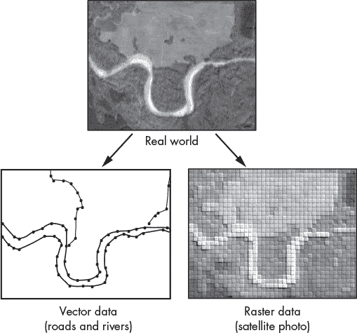

*图 17-1：通过矢量和栅格数据的组合表示世界*

*地理信息系统（GIS）*、*全球定位系统（GPS）*和遥感是用于获取、处理和存储地理空间数据的技术示例。Python 的灵活性使其在将数据从文件或数据库转换为可用数据方面非常出色。大约在 2008 年，主要的 GIS 平台，如 ArcGIS 和 QGIS，开始采用 Python 进行脚本编写、工具制作和分析。因此，Python 现在成为执行地理空间分析的主流编程语言。正如统计可视化一样，有大量的 Python 库专为帮助你可视化地理空间数据而设计。

### **地理空间库**

地理空间库的目的是跟踪和使用空间对象类型（如点和多边形）、空间参考系统（用于将地球的曲面投影到平面上）、地理和几何格式（用于精确或快速测量距离和面积）、常见的 GIS 数据格式（用于输入/输出）、空间索引（加速处理）以及地图装饰器（如国界和海岸线）。大多数库都允许你创建动画，可以通过将帧转换为 MP4 或直接作为实时动画。

表 17-1 列出了一些重要且流行的地理空间库，以及一些特殊的库。接下来的章节中，我们将从高层次上简要了解其中的几个库。

**表 17-1：** Python 的重要地理空间库

| **库名** | **描述** | **网站** |
| --- | --- | --- |
| GeoPandas | GIS 库结合了“带几何的 pandas” | *[`geopandas.org/`](https://geopandas.org/)* |
| Cartopy | 用于与 Matplotlib 一起进行投影感知绘图的工具 | *[`scitools.org.uk/cartopy/`](https://scitools.org.uk/cartopy/)* |
| geoplot | Cartopy 扩展（“seaborn for geospatial”） | *[`residentmario.github.io/geoplot/`](https://residentmario.github.io/geoplot/)* |
| Plotly | 易用的交互式地图 | *[`plotly.com/python/maps/`](https://plotly.com/python/maps/)* |
| folium | 低资源消耗的易用交互式地图 | *[`python-visualization.github.io/folium/`](https://python-visualization.github.io/folium/)* |
| ipyleaflet | 基于 ipywidgets 的 Jupyter-LeafletJS 桥接 | *[`github.com/jupyter-widgets/ipyleaflet/`](https://github.com/jupyter-widgets/ipyleaflet/)* |
| GeoViews | 使用 HoloViews 和 Cartopy 进行地理绘图。 | *[`geoviews.org/`](http://geoviews.org/)* |
| KeplerGL | 在 Jupyter 中可视化大数据集的工具 | *[`docs.kepler.gl/docs/keplergl-jupyter/`](https://docs.kepler.gl/docs/keplergl-jupyter/)* |
| pydeck | 优化的适用于 Jupyter 的大规模交互工具 | *[`pydeck.gl/`](https://pydeck.gl/)* |
| PyGMT | 用于通用地图工具的 Python 封装 | *[`www.pygmt.org/`](https://www.pygmt.org/)* |
| Bokeh | 包括 Google 地图在内的响应式绘图 | *[`docs.bokeh.org/`](https://docs.bokeh.org/)* |
| EarthPy | 用于处理空间数据的辅助函数 | *[`earthpy.readthedocs.io/`](https://earthpy.readthedocs.io/)* |
| gmplot | 类似 Matplotlib 的接口，用于在 Google 地图上绘图 | *[`github.com/gmplot/gmplot/`](https://github.com/gmplot/gmplot/)* |
| MovingPandas | 用于跟踪和分析运动数据的工具 | *[`anitagraser.github.io/movingpandas/`](https://anitagraser.github.io/movingpandas/)* |
| cuSpatial | 用于常见空间操作的 GPU 加速工具 | *[`github.com/rapidsai/cuspatial/`](https://github.com/rapidsai/cuspatial/)* |

**注意**

*本章中的绘图示例旨在展示代码的复杂性和所生成的图形类型。你不需要运行这些代码片段，因为大多数讨论的库并未预先安装在 Anaconda 中。如果你确实想自己测试它们，可以在每个部分引用的产品网页上找到安装说明。我建议你在专门的 conda 环境中安装它们（请参见第二章），而不是将它们安装到基础环境中。*

#### ***GeoPandas***

*GeoPandas* 是 Python 中解析地理空间数据的最流行的开源库。正如你从名字中可以猜到的，它扩展了 pandas 使用的数据类型（参见第 403 页中的“pandas”），使得处理地理空间矢量数据类似于处理表格数据。它还使得在 Python 中进行的操作，可以避免使用专用的空间数据库（如 PostGIS）。 

在 GeoPandas 中，*GeoDataFrame*看起来像 pandas 中的表格 DataFrame，但它有一个特殊的“geometry”列来存储位置数据（图 17-2）。

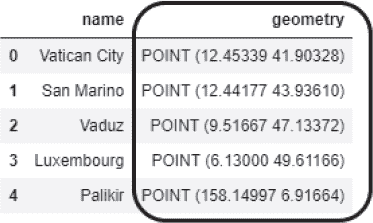

*图 17-2：几何列（框住的部分）区分了 GeoDataFrame 和 DataFrame。*

该几何列将几何对象的*类型*（表 17-2）和绘制该对象所需的*坐标*（以经纬度表示）捆绑在一起。

**表 17-2：** GeoPandas 中使用的几何体

| **几何类型** | **描述** |
| --- | --- |
| Point | 一个点 |
| MultiPoint | 一组点 |
| LineString | 一段线段 |
| MultiLineString | 一系列连接的线段 |
| LinearRing | 一个封闭的线段集合（零面积多边形） |
| Polygon | 由一系列点定义的闭合形状 |
| MultiPolygon | 一组多边形 |

GeoPandas 不仅使用 pandas，还使用其他几个重要的开源库，提供一个简单而方便的框架来处理地理空间数据。它依赖于*Shapely*（*[`pypi.org/project/Shapely/`](https://pypi.org/project/Shapely/)*）来处理平面几何形状（如街道中心线或国家边界多边形）、Fiona（*[`pypi.org/project/Fiona/`](https://pypi.org/project/Fiona/)*）来读取和写入地理数据文件格式、pyproj（*[`pypi.org/project/pyproj/`](https://pypi.org/project/pyproj/)*）来处理投影、Matplotlib 来绘图，以及 descartes（*[`pypi.org/project/descartes/`](https://pypi.org/project/descartes/)*）来将 Shapely 几何对象与 Matplotlib 进行集成。

结果，你可以通过几行代码从 GeoSeries 或 GeoDataFrame 绘制地图：

```py
import geopandas as gpd

world = gpd.read_file(gpd.datasets.get_path('naturalearth_lowres'))
world.plot();
```

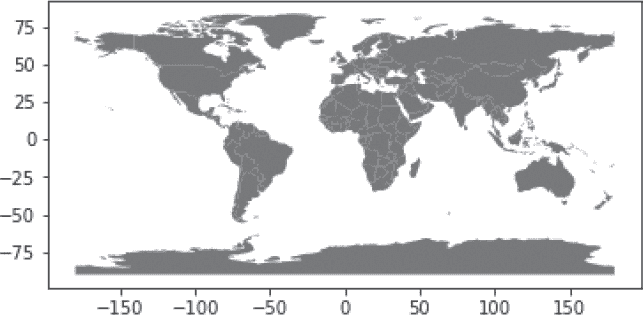

在这个 Jupyter Notebook 示例中，`world`变量表示一个由 GeoPandas 内部全球数据集生成的 GeoDataFrame。当然，这个简单的图表可以进一步自定义。你可以传递给 Matplotlib 的样式选项，特别是针对线条的样式，将与`plot()`方法一起使用。

下面是一个人口按国家划分的分级颜色地图示例——其中各区域根据数据值进行着色：

```py
import geopandas as gpd

world = gpd.read_file(gpd.datasets.get_path('naturalearth_lowres'))
world = world[(world.name != 'Antarctica')]  # Omit Antarctica.
world.plot(column='pop_est', 
           legend=True,
           legend_kwds={'label': "Population by Country in Billions",
                        'orientation': "horizontal"});
```

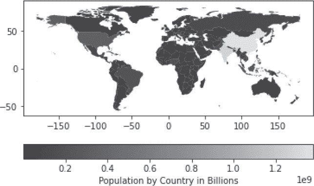

通过将世界数据加载为 GeoDataFrame，可以轻松地过滤数据并重新绘制。在之前的图表中，我们移除了南极洲，因为它没有常住人口。现在，让我们通过修改一行代码来查看所有人口超过 3 亿的国家：

```py
world = world[(world.pop_est > 300000000) & (world.name != 'Antarctica')]
```

重新运行代码块后，仅显示中国、印度和美国：

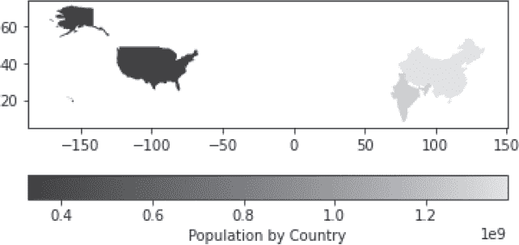

历史上，你只能使用 GeoPandas 绘制静态地图。现在，多亏了 Contextily (*[`github.com/geopandas/contextily`](https://github.com/geopandas/contextily)*) 提供的基础地图和 IPYMPL (*[`github.com/matplotlib/ipympl`](https://github.com/matplotlib/ipympl)*) 提供的 Jupyter 中交互式的 Matplotlib 图表，现在可以使用 GeoPandas 创建交互式地图。同样，基于 HoloViews 构建的 hvPlot（见 第十六章）使用基于 Bokeh 的交互式绘图 API，为 pandas 和 GeoPandas 输出添加了缩放、平移、查询、滑块和可点击图例等功能（见 图 17-3）。

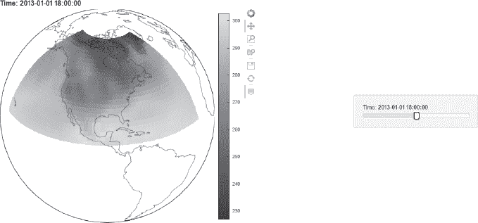

*图 17-3：带工具栏和滑块小部件的交互式 hvPlot（感谢 [holoviz.org](http://holoviz.org) 提供）*

安装并导入 Contextily 库后，GeoPandas 可以支持*基于瓦片*的地图，以及前面展示的基于轮廓的地理地图。瓦片地图（或 *Web 地图瓦片*）是一种通过无缝拼接数十个通过互联网单独请求的图像或矢量数据文件，在浏览器中显示的地图。Google Maps 中的街道和地形图层就是基于瓦片的地图的典型例子。Contextily 提供了轻松访问流行瓦片源的功能，如 OpenStreetMap 和 Stamen，允许你添加类似 Google Maps 背景的地图（见 图 17-4）。


*图 17-4：东京一部分的瓦片地图*

与 pandas 类似，GeoPandas 在单核上运行，但它还支持*空间索引*，这是一种可以显著提升查询大型地理空间数据集性能的技术。GeoPandas 可以生成空间索引，在某些情况下自动生成，在其他情况下则需要手动生成，你可以通过调用 GeoDataFrame 上的 `sindex` 属性来实现。此外，一个新的库，*geofeather* (*[`pypi.org/project/geofeather/`](https://pypi.org/project/geofeather/)*)，可以显著加快读取和写入标准空间文件格式（如 *shapefile*）的速度。

如果你不打算执行复杂的数据转换或处理百万级记录，GeoPandas 是一个非常好的通用工具。使用这个工具进行绘图需要了解一些晦涩的 Matplotlib 语法，且需要插件来增加交互性。GeoPandas 最适合处理矢量数据，但你也可以使用 *rasterio* (*[`rasterio.readthedocs.io/en/latest/`](https://rasterio.readthedocs.io/en/latest/)* ) 执行有限的栅格处理。幸运的是，许多其他地理空间库与 GeoPandas 配合得很好，因此你可以选择在 GeoPandas 中组织数据，并使用其他工具进行绘图。

#### ***Cartopy***

*Cartopy* 是一个开源库，用于制作地图和进行地理空间分析。它专为科学家设计，并由一个活跃的开发社区维护。Cartopy 是 Python 标准绘图库 Matplotlib 的扩展，利用了包括 NumPy、Shapely 和 PROJ.4 在内的其他库。

Cartopy 引以为傲的是其“投影感知”功能。也就是说，它能够处理大量的投影（图 17-5），并在这些投影之间转换点、线、向量、多边形和图像。它还与 GeoPandas 配合得很好，使你能够在使用栅格数据时，比仅使用 GeoPandas 更轻松地创建符合地图学准确性的地图。如果你使用 Matplotlib 进行基本绘图，Cartopy 使你能够轻松将技能扩展到制图学领域。

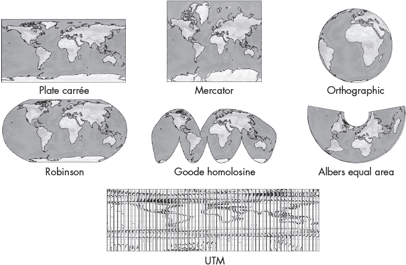

*图 17-5：Cartopy 中可用的一些地图投影*

与许多其他地理空间库一样，你可以仅用几行代码制作一个基础地图：

```py
import cartopy.crs as ccrs
import matplotlib.pyplot as plt

ax = plt.axes(projection=ccrs.Robinson())
ax.coastlines()
plt.show()
```

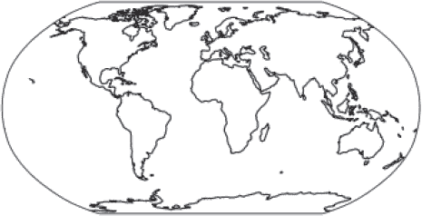

根据你的设置，Cartopy 可以快速绘制最多一百万个点，但随着数据集变大，性能会明显下降。你可以在其画廊页面查看更多 Cartopy 绘图示例 (*[`scitools.org.uk/cartopy/docs/latest/gallery/index.html`](https://scitools.org.uk/cartopy/docs/latest/gallery/index.html)*)，以及支持的地图投影列表 (*[`scitools.org.uk/cartopy/docs/v0.19/crs/projections.html`](https://scitools.org.uk/cartopy/docs/v0.19/crs/projections.html)*)。

#### ***Geoplot***

*Geoplot* 是一个相对较新的高级开源地理空间绘图库。作为 Cartopy 和 Matplotlib 的扩展，它自称为“地理空间领域的 seaborn”，这意味着它在底层库的基础上简化了绘图过程，使得地图制作变得更容易。

Geoplot 旨在与 GeoPandas 输入良好配合，提供了一系列易于使用的地理空间可视化工具（大概涵盖了你将需要的 90% 的功能）。由于 geoplot 是基于 Cartopy 构建的，它能够充分利用 Cartopy 广泛的地图投影列表。

geoplot 的一大特色是 *卡托图*，这是一种将多边形（如省份或州）在地图上呈现的主题图，其中地理大小根据选定的变量（如人口、国内生产总值或肥胖率）进行扭曲变换。在以下来自 geoplot 的绘图参考页面的示例中，你使用 geopandas 和 geoplot 的一个原生数据集 `contiguous_usa`，轻松生成了按州划分的美国人口卡托图：

```py
import geopandas as gpd
import geoplot as gplt
import geoplot.crs as gcrs

contiguous_usa = gpd.read_file(gplt.datasets.get_path('contiguous_usa'))
gplt.cartogram(contiguous_usa, scale='population', 
               projection=gcrs.AlbersEqualArea(), 
               color='black');
```

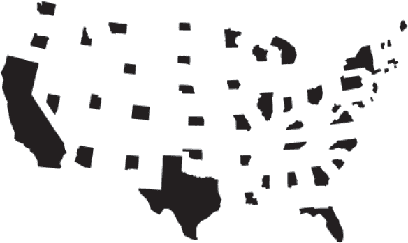

在这个卡托图中，加利福尼亚州是美国人口最多的州，按照其真实大小展示。其余州的大小根据各自人口的相对规模进行了缩小。

Geoplot 还允许你制作桑基图。这是一种流动图，其中线条和箭头的宽度与可视化的移动量成比例，例如城市街道上的交通流动（图 17-6）。最著名的桑基图描绘了拿破仑著名的俄罗斯战役及其从莫斯科撤退的过程。

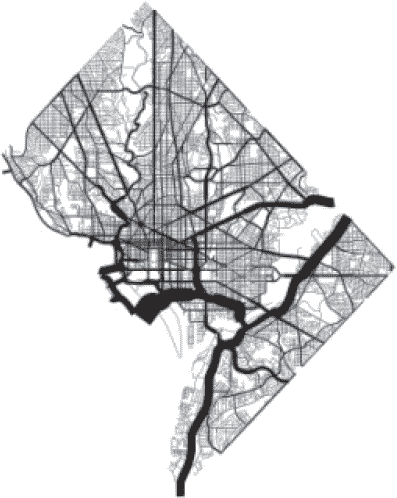

*图 17-6：华盛顿特区街道的桑基图，按日均交通量排序（感谢 geoplot 提供）*

像 GeoPandas 一样，geoplot 只制作静态地图。然而，通过一些额外的工作，比如将你的图形写入 HTML 并使用 mplleaflet 库，你可以实现交互功能，如缩放和平移。

如果你愿意放弃较多的设计控制，geoplot 让你可以轻松制作地图。要超越基本功能并制作高度自定义的地图，你需要熟悉 Matplotlib。尽管核心文档还不错，但由于 geoplot 尚处于不成熟阶段，你可能很难找到符合你特定需求的教程或示例。此外，geoplot 目前处于“维护”状态，没有计划推出新功能。

#### ***Plotly***

在第十六章中介绍的 Plotly 和 Plotly Express，具有广泛的地理空间数据可视化功能。它们提供了许多制图选项，且 Plotly Express API 使用简便。你可以用一行代码制作动画的 choropleth 地图，并通过 Dash 部署到网页上。

Plotly 地图对于快速探索数据、识别异常值和发现趋势非常有用。你可以使用 GeoPandas 的便利，或者如果你的数据框中有经纬度列，直接从 pandas DataFrame 中绘制。以下的 Jupyter Notebook 示例，使用 Plotly Express，将一个关于全球火山的 Plotly 数据集转化为一个高度互动的图形，只需几行代码。

```py
➊ import pandas as pd
   import plotly.express as px

   f = "https://raw.githubusercontent.com/plotly/datasets/master/volcano_db.csv"
   df = pd.read_csv(f, encoding="iso-8859-1")
➋ fig = px.scatter_geo(data_frame=df,
                        lat='Latitude',
                        lon='Longitude',
                        hover_name='Type',
                        hover_data={'Type':False,
                                    'Country':True, 
                                    'Volcano Name':True},
                        symbol='Type',
                        color='Type',
                        projection='orthographic')
   fig.show()
```

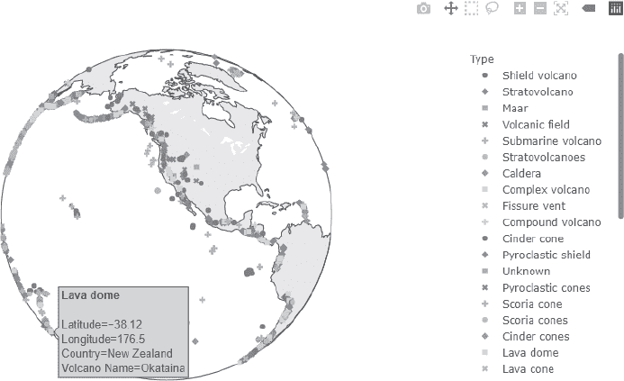

大部分代码由导入库 ➊ 和加载数据构成，之后才是实际的绘图步骤 ➋。在这个图表中，你可以使用光标抓取并旋转地图，就像它是一个真实的三维地球仪一样。你可以将光标悬停在火山标记上，弹出一个窗口显示火山类型以及其他信息，如其位置、国家和名称。你还可以选择让标记可以点击，只有在故意按下鼠标按钮时，弹出窗口才会出现。

如果你查看这个图的右上角，你会看到一个工具栏，它可以让你截屏、平移、缩放等。这些工具非常有帮助，特别是当你需要解决密集的数据点时，例如冰岛的众多火山（见图 17-7）。

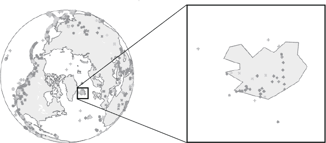

*图 17-7：Plotly Express 根据缩放级别重新发布数据，适应合适的比例。*

你还可以使用 Plotly 制作 3D 表面图，其自动工具栏允许围绕多个轴进行旋转。下面是一个单个火山的示例：

```py
import pandas as pd
import plotly.graph_objects as go

df = pd.read_csv(
"https://raw.githubusercontent.com/plotly/datasets/master/volcano.csv")
fig = go.Figure(data=[go.Surface(z=df.values)])
fig.update_layout(title='Volcano', 
                  autosize=False,
                  width=600, height=600,
                  margin=dict(l=65, r=50, b=65, t=90))
fig.show()
```

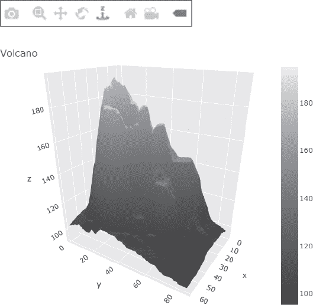

像大多数其他地理空间库一样，Plotly 和 Plotly Express 支持*基于瓦片*的地图（见图 17-4），用于添加街道、地形、影像等内容。与 GeoPandas 不同，你可以直接访问这些功能，而无需使用像 Contextily 这样的额外库。

如果你想快速构建交互式图表，可以通过将光标悬停在某个区域来查询地图，或者将用户输入的小部件（如滑块）放置在与地图同一屏幕上，Plotly 和 Plotly Express 是不错的选择。通过 Plotly 的 Dash 库（请参阅 第 446 页中的“Dash”），你可以将你的工作无缝地转换为一个仪表盘。

#### ***folium***

开源的 *folium* 库让你能够使用 *Leaflet.JS* 可视化地图，Leaflet.JS 是一个强大的 JavaScript 库，用于在大多数移动和桌面平台上构建交互式网页地图应用。Folium 首次发布于 2013 年，极受欢迎，因此你可以在网上找到大量的资料，帮助你学习如何使用它并根据自己的需求进行定制。

使用 folium，你可以从 OpenStreetMap、Mapbox 和 Stamen 等地图服务中选择多个 *图块集*。图块集是由光栅或矢量数据组成的集合，这些数据被划分成均匀的正方形网格图块，最多有 22 个预设的缩放级别。它们让你轻松制作出美观的 Leaflet 地图：

```py
import folium

map = folium.Map(location=[29.7, -95.2147])
map
```

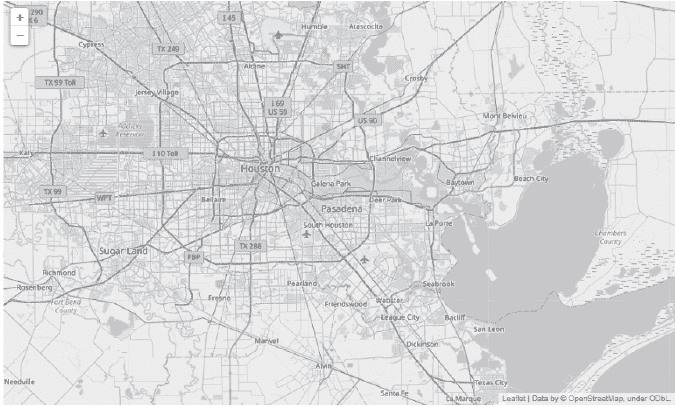

这个 Jupyter Notebook 示例默认使用 OpenStreetMap 图块。地图中心的位置坐标是经纬度（这可能会让你感到困惑，因为许多库使用的是现代的经度-纬度顺序）。你可以使用 *LatLong.net* (*[`www.latlong.net/geo-tools`](https://www.latlong.net/geo-tools)*) 等工具查找地址的坐标，或者通过在线搜索地理特征的坐标来获取。也可以通过光标查询 folium 地图来获取这些信息。此地图还具有可缩放性；当你放大时，地图会显示越来越详细的信息，直到你耗尽可用的图块缩放级别。

folium 的另一个优点是它支持 *标记*。你可能见过这些泪滴形的图标，用于在 Google 地图上标识搜索位置。Folium 提供了几个预定义的标记，也允许你通过使用图片或访问免费图标库来创建自定义标记。你还可以在标记上添加弹出窗口。我们来看一个例子：

```py
import folium

map = folium.Map(location=[37.15, -111.1], tiles='stamen terrain') 
folium.Marker(location=[37.1, -111.17],
              popup="Water Sample #2",
              icon=folium.Icon(color="black")).add_to(map)
map
```

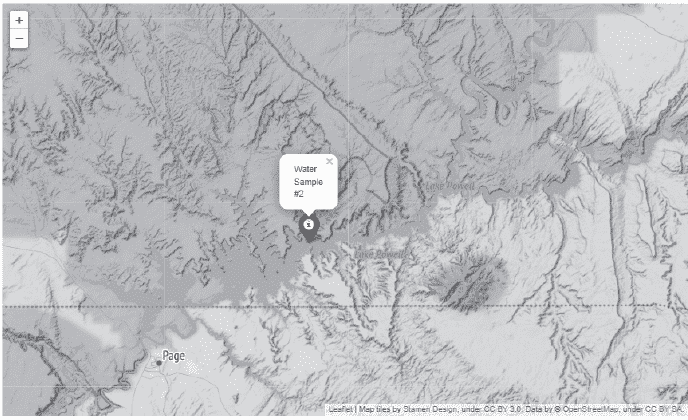

这段代码使用了“Stamen Terrain”图块，显示了犹他州鲍威尔湖周围的区域。标记表示水质样本的位置，点击标记会显示样本编号。

现在让我们回顾一下在 第 467 页中使用的火山数据集。如果你运行代码，可以从像 Free [onlinewebfonts.com](http://onlinewebfonts.com) (*[`onlinewebfonts.com/fonts`](https://onlinewebfonts.com/fonts)*) 或 Iconfinder (*[`iconfinder.com/`](https://iconfinder.com/))* 这样的网站下载火山图标。

```py
import pandas as pd
import folium
from folium import plugins

f = "https://raw.githubusercontent.com/plotly/datasets/master/volcano_db.csv"
df = pd.read_csv(f, encoding="iso-8859-1")
map = folium.Map(tile='Stamen Terrain', control_scale=True)
for index, row in df.iterrows():
    volcano_icon = folium.features.CustomIcon('volcano_icon.png', 
                                              icon_size=(25, 25))
    folium.Marker(location=(row['Latitude'], row['Longitude']),
                  popup=row['Type'],
                  icon=volcano_icon, tooltip=(row['Type'], 
                           row['Country'], 
                           row['Volcano Name'])
                 ).add_to(map)
mini_map = folium.plugins.MiniMap(toggle_display=True)
map.add_child(mini_map)
map
```

该脚本生成了另一个世界火山位置地图。图 17-8 是该地图缩放至冰岛，类似于图 17-7。请注意自定义的火山图标、地形背景、悬停窗口、右下角的索引图以及左下角的比例尺。所有这些都只需几行代码。

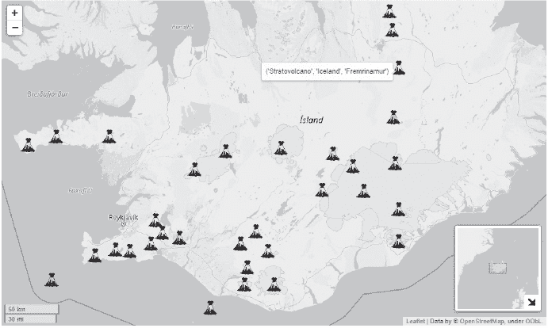

*图 17-8：使用 folium 绘制的冰岛火山*

由于 folium 嵌入了大量信息，文件大小可能会变得非常大。例如，前面的代码生成了一个 138MB 的笔记本文件。

将 folium 与流行的 GeoPandas 库结合使用是可视化地理参考数据的绝佳方法。假设您正在研究法国巴黎周围的城市“热岛”效应。您已记录下成千上万的数据点，记录了城市东部的温度，并且正在使用 GeoPandas 来处理这些数据。通过 folium 的热图，数据点将根据地图的缩放级别进行聚合或分离（图 17-9）。您还可以添加时间序列，使您能够查看全天、整个月份、全年等的温度变化。而且，借助 folium 的`MarkerCluster`插件，您可以将这种技术应用于单独的标记。只是不要尝试添加图例；folium 仅对分级图有图例支持。

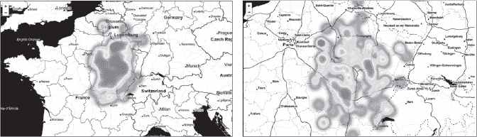

*图 17-9：温度数据的热图，缩小（左）与放大（右）*

folium 库旨在简化操作、提高性能和可用性。通过将 Python 库（如 GeoPandas）中的数据分析能力与 LeafletJS 的映射功能相结合，folium 使您能够生成具有多层数据表示的地图。包含有用的背景图像（例如街道地图和地形图）非常简单，而且有许多插件可用来扩展 folium 的功能（请参见*[`python-visualization.github.io/folium/plugins.html#folium-plugins/`](https://python-visualization.github.io/folium/plugins.html#folium-plugins/)*）。

#### ***ipyleaflet***

*ipyleaflet*开源互动小部件库基于 ipywidgets（*[`github.com/jupyter-widgets/ipywidgets/`](https://github.com/jupyter-widgets/ipywidgets/)*）。与 folium 类似，ipyleaflet 封装了 Leaflet.JS，为 Jupyter Notebook 和 JupyterLab 带来映射功能。尽管 folium 被认为更易于使用，但 ipyleaflet 被认为更具可定制性，且提供了更多的交互性选择。

ipyleaflet 中的一切，例如瓦片地图和标记，都是互动式的，您可以从 Python 或笔记本界面动态更新属性。而且，因为 ipyleaflet 是建立在 ipywidgets 之上的，您可以编写程序，使用小部件捕捉用户输入。

假设您正在编制地面撞击陨石坑的统计数据。在这个示例中，您使用测量控制小部件和鼠标交互式地找出乍得共和国的阿罗昂加陨石坑的半径和面积：

```py
from ipyleaflet import Map, MeasureControl, basemaps

m = Map(basemap=basemaps.OpenTopoMap,center=(19.0933, 19.2431), zoom=11)
measure = MeasureControl(position='bottomleft', 
                         active_color = 'black',
                         primary_length_unit = 'kilometers')
m.add_control(measure)
measure.completed_color = 'red'
m
```

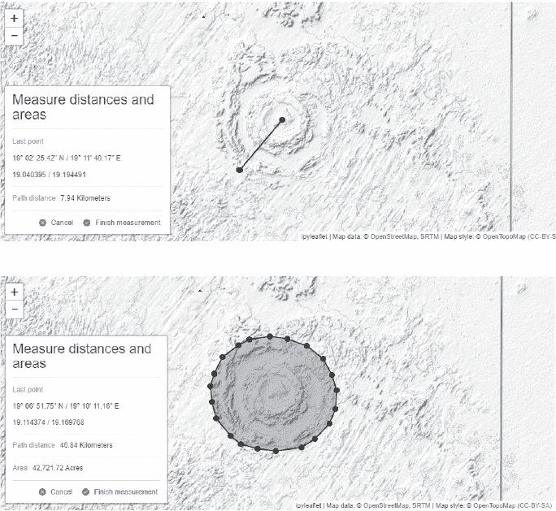

点击地图上的方形 () 图标可以激活测量距离和面积工具。然后，你可以点击两个位置以获取它们之间的线性测量，或者绘制一个多边形来获得一个区域，正如前面的示例所示。你甚至可以自定义单位。

另一个有趣的控制选项是*SplitMap*，它让你可以在同一位置比较不同的图层集。假设你正在研究欧洲的夜景，并且你很好奇哪座城市造成了一个明亮的光斑。只需几行代码，你就可以生成一个双层显示来回答这个问题：

```py
from ipyleaflet import Map, basemaps, basemap_to_tiles, SplitMapControl

m = Map(center=(42.6824, 365.581), zoom=5)
left_layer = basemap_to_tiles(basemaps.Esri.WorldStreetMap)
right_layer = basemap_to_tiles(basemaps.NASAGIBS.ViirsEarthAtNight2012)
control = SplitMapControl(left_layer=left_layer, right_layer=right_layer)
m.add_control(control)
m
```


上述代码生成了一个“分割”地图，左侧显示城市和街道，右侧显示夜间卫星图。你可以抓住屏幕中央的圆形“|||”标记并拖动它到每一侧，以牺牲另一侧的地图来扩展一侧的显示（图 17-10）。这让你可以在夜间地图下窥视城市和道路，而无需通过将地图合并或调整上方地图的透明度来增加一个地图的混乱。你还可以缩放查看更小的城市。

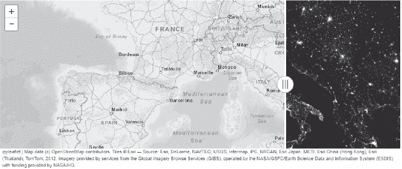

*图 17-10：SplitMap 边界被拖动到右侧*

*放大镜* 是一个特别有趣的功能，允许你在不改变地图整体缩放级别的情况下查看详细信息。当它被激活时，你只需将光标移到地图上的一个圆圈内，即可查看该圆圈内的放大视图（图 17-11）。它适用于任何缩放级别，并且与所有可用的底图兼容。

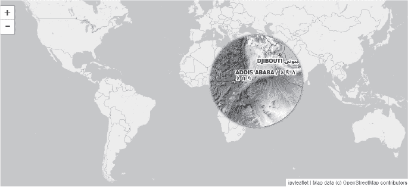

*图 17-11：ipyleaflet 中的放大镜选项*

许多此类功能，包括标记聚类等，也可以在 folium 中使用，尽管你可能需要使用一个插件（*[`python-visualization.github.io/folium/plugins.html#folium-plugins/`](https://python-visualization.github.io/folium/plugins.html#folium-plugins/)）*来复制在 ipyleaflet 中可以做到的功能。然而，这些功能重叠并不包括将用户交互（如选择）返回到 Python 中进行进一步处理的方式，因为 folium 仅提供从 Python 到 JavaScript 地图的单向路径。

**注意**

*与 ipyleaflet 类似，Jupyter-gmaps* ([`github.com/pbugnion/gmaps/`](https://github.com/pbugnion/gmaps/)) *也是建立在 Jupyter 交互式小部件框架之上，但它连接的是 Jupyter 和 Google Maps，而非 Leaflet.JS。*

#### ***GeoViews: HoloViz 方法***

HoloViz 维护的库，如 第十六章（见 图 16-9）中讨论的，提供了一个统一的解决方案，用于处理地理空间数据。这包括仪表板和其他类型的交互式可视化。在这系列开源库中，HoloViews 为地理空间数据提供了大量支持，包括执行基础地球科学工作的能力。

对于更高级的工作，尤其是涉及地图投影的工作，HoloViz 包括一个专门的地理空间库，称为 *GeoViews*。GeoViews 基于 HoloViews，并且基于 Cartopy 库的地理绘图类型，可以使用 Matplotlib 或 Bokeh 作为绘图后端。

GeoViews 使你能够处理大型、多维的地理数据集，快速可视化子集或组合，并可以访问底层的原始数据。它设计为与 Iris 和 xarray 库一起使用，并且可以接受多种数据格式，包括 NumPy 数组、pandas DataFrame 和 GeoPandas GeoDataFrame。在这些情况下，数据被封装在 HoloViews 或 GeoViews 对象中，提供即时交互式可视化（见第 436 页的 “HoloViews”）。地理投影使用广泛的 Cartopy 坐标参考系统。

与其他地理空间库类似，GeoViews 让你能够访问各种有用的数据库、多边形集合（如国家边界）以及街道和地形的瓦片地图。只需几行代码，就能生成图表，如官方网页上的 Jupyter Notebook 示例所示：

```py
import geoviews as gv
import geoviews.feature as gf
from cartopy import crs

gv.extension('bokeh')
(gf.ocean + gf.land + gf.ocean * gf.land * gf.coastline * gf.borders).opts(
'Feature', projection=crs.Geostationary(), global_extent=True, height=325).cols(3)
```

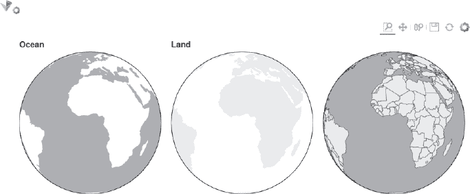

GeoViews 支持 GeoPandas 数据结构，使得绘制 shapefile 和分级图变得轻松。以下是使用 GeoPandas 数据集绘制人口分级图的示例：

```py
import geopandas as gpd
import geoviews as gv
from cartopy import crs

gv.extension('bokeh')
gv.Polygons(gpd.read_file(gpd.datasets.get_path('naturalearth_lowres')),
            vdims=['pop_est', ('name', 'Country')]).opts(width=600,
            projection=crs.Robinson())
```

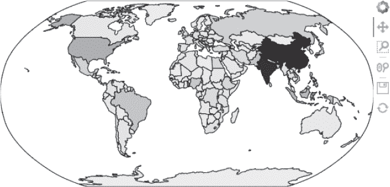

最后，这是带有新变化的火山示例。因为 GeoViews 是 HoloViz 的一部分，你可以选择使用 hvPlot 绘制图表，我个人觉得它更容易使用（就像 Plotly Express 相较于 Plotly）。

```py
   import pandas as pd
   import holoviews as hv
   import hvplot.pandas

   f = "https://raw.githubusercontent.com/plotly/datasets/master/volcano_db.csv"
   df = pd.read_csv(f, encoding="iso-8859-1")

   # Reassign the dataframe with only 3 volcano types:
➊ df = df[(df['Type'] == 'Cone') | 
           (df['Type'] == 'Stratovolcano') | 
           (df['Type'] == 'Shield volcano')] 
➋ marker = hv.dim('Type').categorize({'Cone': 'triangle', 
                                       'Shield volcano': 'circle', 
                                       'Stratovolcano': 'square'}) 
   size = hv.dim('Type').categorize({'Cone': 6,
                                     'Shield volcano': 5,
                                     'Stratovolcano': 4})
   df.hvplot.points('Longitude', 'Latitude', 
                    color='Type',
                    marker=marker,
                    size=size,
                    hover_cols=['Volcano Name'],
                    coastline=True)
```


在这种情况下，除了盾形火山、层状火山和锥形火山之外，所有其他类型的火山都从 DataFrame ➊ 中被移除。然后，地图被定制化，以独特的形状 ➋、大小和颜色绘制这些火山类型。尽管这里没有展示，你也可以选择分配默认的形状和大小。

注意右侧工具栏，包含平移、缩放、保存等图标，以及可自定义的悬停窗口。不幸的是，没有像 Plotly Express 那样能够在正射投影中旋转地球的工具，因为 hvPlot 仅使用 Bokeh，而不是 Plotly 作为绘图后端。

GeoViews 的一个主要卖点是，它是一个全面、前瞻性的解决方案的一部分，旨在满足你所有绘图和制图的需求。另一方面，与其他库相比，其文档支持相对有限。

#### ***KeplerGL***

*KeplerGL JupyterLab 扩展* 是一个先进的开源地理空间库，建立在 Mapbox GL (*[`www.mapbox.com/`](https://www.mapbox.com/)*) 和 deck.gl (*[`deck.gl/`](https://deck.gl/)*）之上。后者是一个 WebGL（GPU）驱动的框架，用于使用分层方法可视化大规模数据集。它拥有大量层类型，支持位图、图标、点云、网格、等高线、地形等多种数据展示（详见 *[`deck.gl/docs/api-reference/layers/`](https://deck.gl/docs/api-reference/layers/)*）。

Uber 开发了 KeplerGL (*[`kepler.gl/`](https://kepler.gl/)*) 作为一个基于 web 的工具，旨在让不同经验和技能水平的用户更容易创建有意义的数据可视化。它专为处理大型地理空间数据集设计，特别是与流动性相关的数据集。它包括令人印象深刻的功能，包括一个图形用户界面（图 17-12），你可以通过拖放数据集、使用内置的时间序列动画、进行 3D 可视化、处理数百万个数据点、动态执行空间聚合、以及通过调整颜色、大小、过滤等方式定制地图。

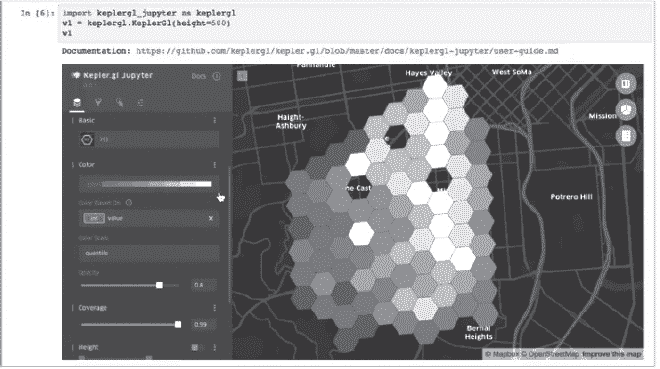

*图 17-12：KeplerGL 界面用于在 JupyterLab 中定制地图（图片来自 KeplerGL）。*

在 Jupyter 中运行 KeplerGL GUI 时，你可以完全避免使用 Python。你可以将数据文件拖放到浏览器中，用不同的地图图层进行可视化，进行过滤和聚合探索，最后将最终的可视化结果导出为静态地图或动画视频。该网站会引导你完成制图工作流程 (*[`docs.kepler.gl/docs/user-guides/b-kepler-gl-workflow/`](https://docs.kepler.gl/docs/user-guides/b-kepler-gl-workflow/)*)，并展示如何使用 GUI 的友好菜单（图 17-13）。

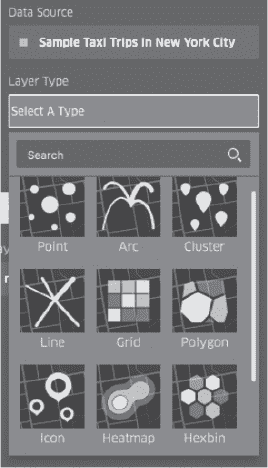

*图 17-13：KeplerGL 界面菜单，用于选择地图图层类型（图片来自 KeplerGL）*

KeplerGL 提供了一组 Mapbox 背景地图，包括用于显示陆地、水域、道路、建筑物轮廓、3D 建筑物和标签的地图。你需要在 Mapbox 注册，免费计划每月提供 50,000 次地图下载，足以应付大多数小型应用程序。你还被限制使用 CSV、GeoJSON、pandas DataFrame 或 GeoPandas GeoDataFrame 格式的数据，这意味着无法进行实时数据流处理。

设置和使用 KeplerGL 比其他地理空间库稍微复杂一些。它可以在 JupyterLab 中使用，并且（目前）必须通过 Python 的标准包管理器（`pip`）进行安装，而不是通过 conda 或 conda-forge 安装。

#### ***pydeck***

*pydeck* 图形库是一组针对 Jupyter Notebook 环境优化的 Python 绑定，用于使用 deck.gl 创建空间可视化。如前所述，deck.gl 是一个 WebGL 驱动的框架，用于使用分层方法可视化大规模数据集。

pydeck 库为你提供了在 Python 中访问完整的 deck.gl 图层目录的权限。你可以创建美丽的 deck.gl 地图（图 17-14），无需编写大量 JavaScript，还可以将这些地图嵌入到 Jupyter Notebook 中，或者导出为独立的 HTML 文件。该库的设计目的是与流行的 JavaScript 基础地图提供商（尤其是 Mapbox）协同工作，但其他地图瓦片解决方案，如 OpenStreetMap，可能具有不同的兼容性级别。

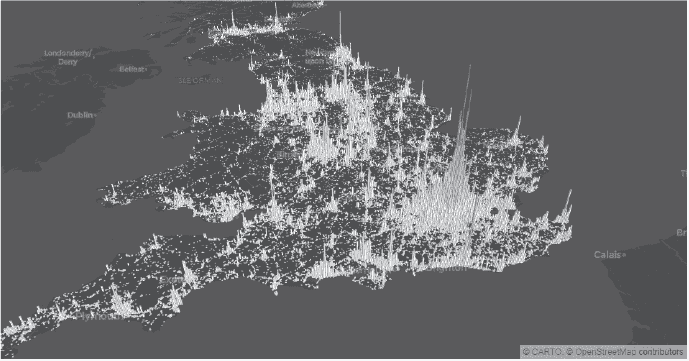

*图 17-14：英国的个人伤害道路事故 ([`pydeck.gl/gallery/hexagon_layer.html`](https://pydeck.gl/gallery/hexagon_layer.html))*

Pydeck 支持大规模更新，例如在 2D 和 3D 中对成千上万的数据点进行颜色更改或数据修改。像 ipyleaflet 一样，它支持双向通信，即可以将可视化中选择的数据传回 Jupyter Notebook 内核。例如，你可以将从政府来源加载到地图上的几何数据传回 pandas DataFrame。

让我们再次访问我们的火山数据库。以下代码片段输入到 Jupyter Notebook 中，会将数据加载为 pandas DataFrame，并生成一个聚焦在非洲之角的全球地图：

```py
   import pandas as pd
   import pydeck as pdk

   f = "https://raw.githubusercontent.com/plotly/datasets/master/volcano_db.csv"
   df = pd.read_csv(f, encoding="iso-8859-1")
➊ layer = pdk.Layer('ScatterplotLayer', 
                     df, 
                     get_position=['Longitude', 'Latitude'], 
                     auto_highlight=True,
                     get_radius=10_000, 
                     radius_min_pixels=1,
                     radius_max_pixels=10_000,  
                     get_fill_color='[255, 255, 255]',
                     pickable=True)
➋ view_state = pdk.ViewState(longitude=42.59, latitude=11.82, 
                              zoom=5, min_zoom=1, max_zoom=8, 
                              pitch=0, bearing=0)
   r = pdk.Deck(layers=[layer], initial_view_state=view_state)
➌ r.to_html("scatterplot_layer.html")
```

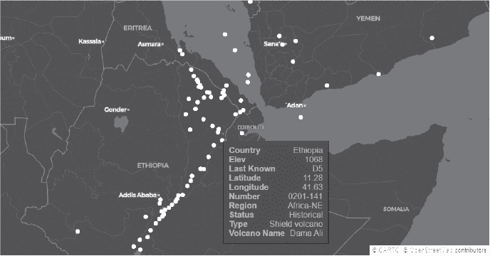

导入库并将 CSV 文件读取为 DataFrame 后，你调用 pydeck 的 `Layer` 方法并选择 `ScatterplotLayer` ➊。在此过程中，你还将点的半径设置为 10 公里，颜色设置为白色，并使其“可选”，这样你就可以将光标悬停在每个点上，查看与 DataFrame 中数据相关的内容（如“达马·阿里”火山地图所示）。

接下来，你需要设置 `view_state`，它告诉 pydeck 地图的中心位置、缩放比例，以及 `pitch` 和 `bearing` ➋。后两个参数允许你生成一个倾斜的视角，就像 图 17-14 中的那样。最后，你告诉 pydeck 如何渲染地图并将其保存为 HTML 文件 ➌。

如果你玩这个示例几分钟，某些问题会变得显而易见。要为每种类型的火山分配一个独特的颜色，你需要使用以下代码在 DataFrame 中创建一个新列：

```py
color_lookup = pdk.data_utils.assign_random_colors(df['Type'])
df['color'] = df.apply(lambda row: color_lookup.get(row['Type']), axis=1)
```

同样，如果你需要一个图例，你需要使用像 Matplotlib 这样的外部库来创建一个（搜索 `matplotlib.pyplot.colorbar`），然后将其渲染到你的 pydeck 可视化旁边。与 Plotly Express 和 hvPlot 示例相比，这两个任务要么非常直观，要么完全自动化。

这些问题部分是由于 pydeck 的不成熟，可能在你读到这篇文章时已经得到解决。然而，目前的结论是，pydeck 最适合用于处理大数据集的数据分析场景——而这正是它的强项所在。

使用 pydeck，您可以使用 Python 访问*Google Earth Engine*（* [`earthengine.google.com/`](https://earthengine.google.com/) *），这是一个用于处理卫星图像和其他地球观测数据的云计算平台。Earth Engine 托管了一个多拍字节的地理空间数据集和卫星图像目录，包括超过 40 年的历史地球图像。它每天摄取图像，存储在公共数据档案中，并将其免费提供给学术、非营利、商业和政府用户进行全球规模的数据挖掘。

除了提供访问大量地理空间数据的仓库，Earth Engine 还提供了分析大数据集所需的计算能力、API 和其他工具。根据网站介绍，这些工具提供了行星级的分析能力，使科学家、研究人员和开发人员能够检测变化、绘制趋势并量化地球表面差异。

*pydeck-earthengine-layer*包装器（* [`github.com/UnfoldedInc/earthengine-layers/tree/master/py/`](https://github.com/UnfoldedInc/earthengine-layers/tree/master/py/) *）通过使用 deck.gl 层将 pydeck 与 Google Earth Engine 连接，支持 Earth Engine API（* [`earthengine-layers.com/`](https://earthengine-layers.com/) *）。这使得通过 Python 可视化庞大的地理空间数据集成为可能。该 pydeck 包装器于 2020 年发布，可以通过 conda-forge 轻松安装。使用它时，您需要使用启用 Earth Engine 的 Google 帐户进行身份验证（您可以在* [`earthengine.google.com/new_signup/`](https://earthengine.google.com/new_signup/) *注册）。

而 Earth Engine 可视化通常是基于栅格的，pydeck 则赋予您混合栅格和矢量图形的能力，开辟了新的可视化机会。您可以添加交互性功能，例如基于悬停的工具提示，还可以将 Earth Engine 数据解释为地形高度，以在 3D 中显示它们。您甚至可以使用 Earth Engine *平台*（* [`earthengine.google.com/platform/`](https://earthengine.google.com/platform/) *）上传和操作您自己的数据集。

为了帮助您入门，Earth Engine 提供了许多预打包的数据集（* [`developers.google.com/earth-engine/datasets/`](https://developers.google.com/earth-engine/datasets/) *）和示例案例研究（* [`earthengine.google.com/case_studies/`](https://earthengine.google.com/case_studies/) *）。通过 pydeck 和 Earth Engine，您可以监控降水和洪水、植被变化、森林火灾和森林砍伐、城市扩展等，而无需将成千上万的卫星图像下载到您的计算机中。

如果你预计会经常处理“行星级”数据集，pydeck 是一个很好的解决方案。它也比 KeplerGL 更容易安装，因为你可以使用 conda-forge。尽管它无法与 Plotly Express 或 hvPlot 在较小数据集上的快速简单绘图相竞争，但随着产品的成熟，这一差距应该会逐渐缩小。

#### ***Bokeh***

Bokeh，已在第十六章介绍，是 Python 主要的绘图库之一。与 Matplotlib 和 Plotly 库类似，它也具有自己的地理空间能力 (*[`docs.bokeh.org/en/latest/docs/user_guide/geo.html`](https://docs.bokeh.org/en/latest/docs/user_guide/geo.html)*).

Bokeh 可以接收来自多个来源的地理空间数据，包括 GeoPandas 和 GeoJSON。它还可以使用 Web Mercator 投影的 XYZ 瓦片服务。通过 `gmap()` 方法，你可以在 Google 地图上绘制符号，但你必须提供一个 Google API 密钥，任何使用 Bokeh 与 Google 地图的操作都必须符合 Google 的服务条款。

尽管 Bokeh 允许你重现其他库中可用的地理空间功能，例如人口图、热图、地图瓦片等，但你可能会发现这个过程比较困难。一个常见的用户抱怨是文档和学习资源有限。初学者也可能会在“中级”API 上遇到困难，这个 API 并不算难，但也不算容易。使用像 hvPlot 这样高层 API 可以在一定程度上缓解这个问题，hvPlot 使用 Bokeh 作为其绘图后端。

### **选择 GeoVis 库**

到这时，你可能已经得出结论，选择任何一种 Python 可视化库就像是在买新车。你永远无法在一个地方得到所有你想要的功能，而每一个非常有用的功能背后总有一个相应的限制，迫使你做出妥协。

然而，仍然有希望。得益于像 Contextily、IPYMPL、hvPlot 等“桥接”库，地理空间绘图库之间的界限正变得越来越模糊。此外，大多数库都可以与 GeoPandas 配合使用，GeoPandas 是 Python 用于解析地理空间数据的主要工具，像 Datashader 这样的库也可以帮助绘制大型数据集。

然而，仍然存在一些重要的差异，可以帮助你决定使用哪个库或哪些库。正如上一章所述，成熟度可以作为区分绘图库的重要因素。图 17-15 展示了各种 GeoVis 库到 2022 年的年龄。这个图与图 16-26 使用相同的比例尺，如果你比较这两个图，你会发现即便是最老的 GeoVis 库，其年龄也不到最老的 InfoVis 和 SciVis 库的一半。

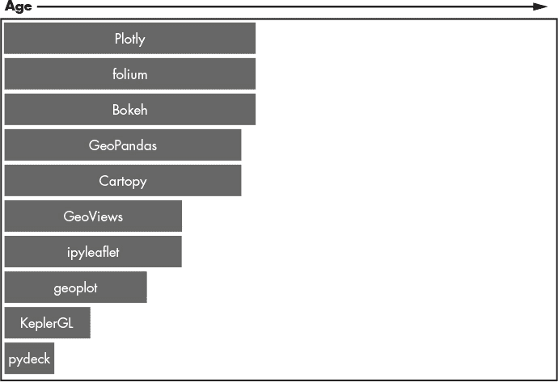

*图 17-15：GeoVis 库的相对年龄*

尽管如此，成熟且广泛使用的库（如 GeoPandas、folium 和 Plotly）有大量讨论材料，你可以找到如何使用它们的丰富资料。它们经过了更多的实战考验，你不太可能是第一个遇到令人沮丧的 bug 或无法解决的限制问题的人。与此同时，一些较年轻的库也有“老骨头”。例如，geoplot 是基于 Cartopy 构建的，GeoViews 则基于 HoloViews 和 Cartopy 构建，后者的用户数量是 GeoViews 本身的 10 倍。一个库是否成熟且广泛使用，在某种程度上取决于它所构建的基础库。

为了进一步区分各个库，让我们关注它们的优势。本书假设大多数科学家希望尽可能抽象化编程，只学习一个 API。为此，图 17-16 中的阴影区域标示了库的开箱即用的显著特点，这些特点基于开发者的声明、在线教程与评论以及我个人的经验等多种因素的综合评估。阴影越深，代表该特点越突出，相关的评估因素已注明。没有阴影并不一定意味着某个库缺乏该特性，而是说明：1）它相较于竞争库中的特性较为次要，或 2）实现该特性需要额外使用其他库。

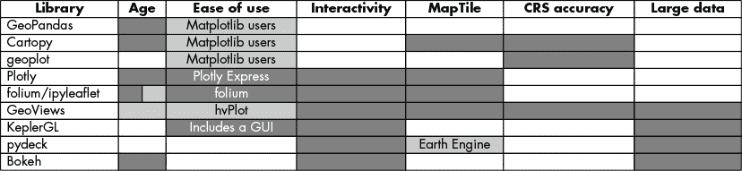

*图 17-16：重要 Python 地理空间库的优势（带有评估标注的阴影区域）*

举个例子，Cartopy 的一个主要卖点是其强大的投影系统，它不仅能够提供高度准确的地图绘制，还能执行复杂的参考系统数据转换。这并不意味着其他库会把纽约市绘制在大西洋中央，它只是意味着在处理投影时，其他库不如 Cartopy 及基于 Cartopy 的库。因此，如果这个功能对你非常重要，Cartopy、geoplot 和 GeoViews 应该是你关注的对象。

folium 和 ipyleaflet 库提供了大量易于访问的地图图块。GeoPandas 通过 Contextily 库提供对这些图块的访问。虽然这不是一个很高的门槛，但它确实违背了*科学优先，编程其次*的原则。

如果你预计进行大量遥感工作，pydeck 库提供了一个轻松连接到 Google Earth Engine 的方式，Google Earth Engine 拥有 PB 级的卫星影像数据。

在易用性方面，Plotly Express 和 folium 无可比拟。它们代表了绘图的“甜蜜点”，做得很多事情都很好，只要你不使用庞大的数据集。要理解这一点，可以尝试使用其他库和相同的代码量，重现图 17-7 中的 Plotly Express 地图，如第 467 页所示。

如果你已经是 seaborn 和 Matplotlib 用户，你应该会发现 GeoPandas、Cartopy 和 geoplot 有一定的直观性。GeoViews 的文档较为有限，但你可以使用同为 HoloViz 系列的一部分的 hvPlot 作为一种易于使用的“Plotly Express-like”绘图选项（参见第 476 页中的“GeoViews：HoloViz 方法”）。

GeoViews 在某种程度上似乎满足了所有需求。它是一个全功能的库，从头到尾应有尽有，作为统一的 HoloViz 系列的一部分，可能为你未来的工作提供良好的支持。GeoViews 首次发布于 2016 年，已有时间积累其受欢迎程度，并希望能提供更完善的文档支持。

在数据大小方面，大多数库在绘制数十万点时没有问题，但许多库在处理更大数据集时开始变得吃力。这在一定程度上可以通过 Datashader 缓解。虽然 Datashader 本身不是一个地理空间库，但它是处理大型地理空间数据集的科学家的必备库。它将可视化过程分解为多个步骤并行运行，从而快速为大数据集创建显示。同样，pydeck 帮助你管理像 Google Earth Engine 这样的网站提供的大型数据集。

最后，尽管 GeoPandas 没有满足许多需求，但这并不意味着你不会使用它。它仍然是处理地理空间数据的最流行方法。只是有更好的方式来绘制和探索结果。

### **总结**

地理空间数据包括带有地理位置参考的矢量数据和/或栅格数据。在本章中，我们回顾了用于绘制此类数据的主要 Python 库。

最受欢迎的开源 Python 库用于解析地理空间数据的是 GeoPandas，它还内置了基于 Matplotlib 的绘图功能。由于许多其他包与 GeoPandas 配合使用，你可能会发现自己在准备数据时使用这个库，而使用其他工具绘制结果。

正如在第十六章讨论的 InfoVis 库一样，选择一个地理空间绘图库在很大程度上取决于你需要绘制的内容——无论是现在还是将来——以及你愿意投入多少精力。为了帮助你做出选择，图 17-16 提供了主要地理空间库的即用型区分特性总结。需要记住的是，始终有可能通过“桥接”库将缺失的功能填补起来，从而将一组自定义的包组合起来。
