## 第十八章：NUMPY: 数值计算 Python**


*NumPy* 是 *Numerical Python* 的缩写，是 Python 数值计算的基础库。它扩展了 Python 的数学功能，成为许多科学和数学包的基础。因此，你需要了解 NumPy，才能有效使用 Python 的科学库，如 Matplotlib（用于绘图）和 pandas（用于数据分析）。

NumPy 是开源的，并且与 Anaconda 一起预安装。它增强了 Python 标准库中内置工具的功能，这些工具对于许多数据分析计算来说可能过于简单。使用 NumPy，你可以执行快速操作，包括数学、逻辑、形状操作、排序、选择、I/O、离散傅里叶变换、基本线性代数、基本统计运算、随机模拟等。

NumPy 的核心是 *array* 数据结构，基本上是一个值的网格。通过使用预编译的 C 代码、多维数组和操作数组的函数，NumPy 加速了较慢算法的运行，并以高效的方式执行高级数学计算。NumPy 还使得处理具有数百万到数十亿样本的大型均匀数据集变得更加容易。

如果你不理解数组，就无法理解 NumPy，因此在本章中，我们将首先关注这些特性，然后再查看库的一些基本功能。有关进一步学习，请访问官方站点 (*[`numpy.org/`](https://numpy.org/)*)，该站点包含“快速入门”和更详细的教程和指南。

### **介绍数组**

在计算机科学中，数组是一种数据结构，包含一组具有相同大小和数据类型（在 NumPy 中称为*dytpes*）的元素（值或变量）。数组可以通过非负整数的元组、布尔值、另一个数组或整数进行索引。

这是一个二维整数数组的示例，由两行三列组成的网格。由于数组使用方括号，因此它们看起来与 Python 列表非常相似：

```py
array([[0, 1, 2],
       [3, 4, 5]])
```

要从这个数组中选择一个元素，可以使用标准的索引和切片技术。例如，要选择元素 `2`，你需要先索引行，然后是列，使用 `[0][2]`（记住：Python 从 0 开始计数，而不是从 1）。

你可能有几个理由想要使用数组。通过索引访问单个元素非常高效，使得无论数组大小如何，运行时间都是常数。实际上，数组让你能够对整块数据执行复杂的计算，而无需逐个循环并访问每个元素。因此，基于 NumPy 的算法运行速度比原生 Python 中的算法快几个数量级。

除了更快之外，数组还将数据存储在连续的内存块中，与 Python 内置的非连续块列表等序列相比，内存占用显著较小。例如，列表基本上是指向（可能是）非连续块中存储的异构 Python 对象的指针数组，使其比 NumPy 数组非常不紧凑。因此，数组通常是存储数据的首选数据结构，可靠且高效。例如，流行的 OpenCV 计算机视觉库将数字图像操作和存储为 NumPy 数组。

#### ***使用维度和形状描述数组***

理解数组需要了解它们的布局。数组中的*维度*是从数组中选择元素所需的索引数量。你可以将维度看作是数组的*轴*。

数组中的维度数量，也称为其*秩*，可用于描述数组。图 18-1 是一维、二维和三维数组的图形示例。

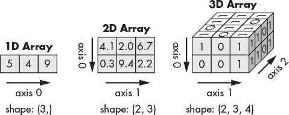

*图 18-1：一维、二维和三维数组的图形表示*

数组的*形状*是一个整数元组，表示沿每个维度的数组大小，从第一个维度（轴 0）开始。示例形状元组如下所示，每个数组下方显示在图 18-1 中。

一维数组，也称为*向量*，具有单个轴。这是数组的最简单形式，是 Python 的`list`数据类型的 NumPy 等效形式。以下是图 18-1 中 1D 数组在 Python 中的示例外观：

```py
array([5, 4, 9])
```

具有多个维度的数组基本上是数组内的数组。具有行和列的数组称为 2D 数组。图 18-1 中的 2D 数组具有形状元组(2, 3)，因为其第一个轴（0）的长度为 2，第二个轴（1）的长度为 3。

2D 数组用于表示*矩阵*。您可能还记得数学课上的矩阵，这些是元素（例如数字或代数表达式）的矩形网格，排列在行和列中，并用方括号括起来。矩阵以一种优雅而紧凑的方式存储数据，尽管包含许多元素，但每个矩阵被视为一个单位。

以下是 Python 中图 18-1 中 2D 数组的示例：

```py
array([[4.1, 2.0, 6.7],
       [0.3, 9.4, 2.2]])
```

具有三个或更多维度的数组称为*张量*。如前所述，数组可以具有任意数量的维度。以下是图 18-1 中 3D 数组的示例：

```py
array([[[1, 0, 1, 1],
        [0, 1, 1, 1],
        [1, 1, 0, 1]],

       [[0, 0, 0, 0],
        [0, 0, 0, 0],
        [1, 1, 0, 1]]])
```

张量在二维显示中可能难以可视化，但 Python 会尽量帮助你。注意空行如何将两个堆叠的矩阵分开，这些矩阵组成了 3D 网格。你还可以通过计算输出中方括号的数量来确定数组的秩。连续三个方括号意味着你正在处理一个 3D 数组。

#### ***创建数组***

NumPy 通过其`ndarray`类来处理数组，也称为`array`别名。`ndarray`这个名称是*N 维*的缩写，因为这个类可以处理任意数量的维度。NumPy 的`ndarray`在创建时具有固定大小，无法像 Python 列表或元组那样增长。更改`ndarray`的大小会创建一个新数组并删除原始数组。

**注意**

*你应该知道 numpy.array 不同于 Python 标准库中的 array.array。后者只是一个一维数组，并且与 NumPy 数组相比功能有限。*

NumPy 提供了多个内置函数来创建`ndarray`。这些函数让你能够直接创建数组，或将现有的序列数据类型（如元组和列表）转换为数组。表 18-1 列出了其中一些常见的创建函数。我们将在接下来的章节中详细介绍其中一些。你可以在*[`numpy.org/doc/stable/reference/routines.array-creation.html`](https://numpy.org/doc/stable/reference/routines.array-creation.html)*找到完整的创建函数列表。

**表 18-1：** 数组创建函数

| **函数** | **描述** |
| --- | --- |
| `array` | 通过推断或指定`dtype`将输入序列转换（复制）为`ndarray` |
| `asarray` | 类似于`array`，但选项较少，默认情况下不创建副本 |
| `arange` | 类似于内置的`range()`函数，但返回的是`ndarray`而不是列表 |
| `linspace` | 在指定区间内返回均匀间隔的数字 |
| `ones` | 生成一个所有值为 1 的`ndarray`，具有给定的形状和`dtype` |
| `ones_like` | 生成与输入数组形状和`dtype`相同的全 1`ndarray` |
| `zeros` | 生成一个所有值为 0 的`ndarray`，具有给定的形状和`dtype` |
| `zeros_like` | 生成与输入数组形状和`dtype`相同的`zeros ndarray` |
| `empty` | 为一个给定形状的新未填充的`ndarray`分配内存 |
| `empty_like` | 基于输入数组为一个新的未填充的`ndarray`分配内存 |
| `full` | 生成一个具有给定形状和`dtype`的`ndarray`，所有值都设置为填充值 |
| `full_like` | 采用输入数组，并生成一个与输入数组形状和`dtype`相同的填充数组 |
| `eye` | 返回一个二维方阵，对角线为 1，其它位置为 0 |
| `identity` | 类似于`eye`，但没有指定对角线索引的选项 |

因为数组必须包含相同类型的数据，所以数组需要知道传递给它的 `dtype` 类型。你可以选择让函数推断出最合适的 `dtype`（尽管你会想检查一下结果），或者显式地提供 `dtype` 作为额外的参数。

一些常用的 `dtype` 类型列在 表 18-2 中。代码列列出了你可以传递给函数的简写参数，例如 `dtype=` `'i8` `'`，以替代 `dtype=` `'int64` `'`。要查看完整的支持数据类型列表，请访问 *[`numpy.org/doc/stable/user/basics.types.html`](https://numpy.org/doc/stable/user/basics.types.html)*。

**表 18-2：** 常见的 NumPy 数据类型

| **类型** | **代码** | **描述** |
| --- | --- | --- |
| `bool` | `?` | 布尔类型（True 和 False）。 |
| `object` | `O` | 任意 Python 对象类型。 |
| `string_` | `S`n | 固定长度的 ASCII 字符串类型，每个字符占用 1 字节。n 参数表示最长字符串的长度，例如 `'S15'`。 |
| `unicode_` | `U`n | 固定长度的 Unicode 类型，字节数与平台相关。n 参数表示最长的长度，例如 `'U12'`。 |
| `int8, uint8` | `i1, u1` | 有符号和无符号 8 位（1 字节）整数类型。 |
| `int16, uint16` | `i2, u2` | 有符号和无符号 16 位整数类型。 |
| `int32, uint32` | `i4, u4` | 有符号和无符号 32 位整数类型。 |
| `int64, uint64` | `i8, u8` | 有符号和无符号 64 位整数类型。 |
| `float32` | `f4` 或 `f` | 单精度浮动点类型。 |
| `float64` | `f8` 或 `d` | 双精度浮动点类型，与 Python 的浮点数兼容。 |
| `float128` | `f16` 或 `g` | 扩展精度浮动点类型。 |
| `complex64` | `c8` | 由两个 32 位浮点数组成的复数类型。 |
| `complex128` | `c16` | 由两个 64 位浮点数组成的复数类型。 |
| `complex256` | `c32` | 由两个 128 位浮点数组成的复数类型。 |

对于字符串和 Unicode 数据类型，`dtype` 参数必须包括最长字符串或 Unicode 对象的长度。例如，如果数据集中最长的字符串有 12 个字符，指定的 `dtype` 应为 `'S12'`。这是必要的，因为所有的 `ndarray` 元素应该具有相同的大小。无法创建变长字符串，因此必须确保分配足够的内存来容纳数据集中每个可能的字符串。在使用 *现有输入* 时，例如将字符串列表转换为数组时，NumPy 可以为你进行这个计算。

因为 `dtype` 占用的内存量是自动分配的（或者可以手动输入），所以 NumPy 知道在创建 `ndarray` 时应该分配多少内存。表 18-2 中的选项让你对数据在内存中的存储方式有充分的控制，但不要因此感到害怕。大多数情况下，你只需要知道你使用的数据的基本类型，例如浮点数或整数。

**NUMPY 如何分配内存**

NumPy 的聪明之处在于它如何分配内存。下图显示了一个 3x4 的二维数组，其中包含从 0 到 11 的数字，这些信息通过图底部的“Python 视图”示意图表示。你已经熟悉了像 `dtype`、维度和数据这样的参数，接下来我们重点关注内存分配和步幅。

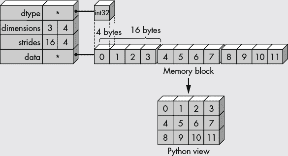

`ndarray` 的值作为计算机 RAM 中一个连续的内存块存储，如图中的内存块示意图所示。这种方式非常高效，因为处理器更喜欢将内存中的数据按块存储，而不是随机散布。如果你将数据存储在像列表这样的 Python 数据类型中，内存中会保存到对象的*指针*，这会产生“开销”，从而降低处理速度。

为了帮助 NumPy 解释内存中的字节，`dtype` 对象存储了关于数组*布局*的附加信息，例如数据的大小（以字节为单位）和数据的字节顺序。因为我们在示例中使用了 `int32` 类型的 `dtype`，所以每个数字占用 4 字节的内存（32 位/每字节 8 位）。

`Ndarray` 拥有一个属性，`strides`，它是一个元组，表示在遍历数组时，在每个维度上步进所需的字节数。这个元组告诉 NumPy 如何将连续的内存块转换为图中所示的 Python 视图数组。

在图中，内存块由 48 字节组成（12 个整数，每个占 4 字节），一个接一个地存储。数组步幅指示了在内存中跳过多少字节才能移动到某一轴上的下一个位置。例如，我们需要跳过 4 字节（1 个整数）才能到达下一列，但要跳过 16 字节（4 个整数）才能到达下一行的同一位置。因此，数组的步幅为 (16, 4)。

##### **使用 array() 函数**

创建数组的最简单方法是将一个序列（例如列表）传递给 NumPy 的 `array()` 函数，之后它会被转换为 `ndarray`。我们现在来做一个例子，创建一个一维数组。首先，我们通过别名 `np` 导入 NumPy（这是约定俗成的做法，可以减少调用 NumPy 函数时的输入量）：

```py
In [1]: import numpy as np

In [2]: arr1d = np.array([1, 2, 3, 4]) 

In [3]: type(arr1d)
Out[3]: numpy.ndarray

In [4]: print(arr1d)
[1 2 3 4]
```

你也可以通过传递一个变量给 `array()` 函数来创建 `ndarray`，比如这样：

```py
In [5]: my_sequence = [1, 2, 3, 4]

In [6]: arr1d = np.array(my_sequence)

In [7]: arr1d
Out[7]: array([1, 2, 3, 4])
```

要创建多维数组，可以将 `array()` 函数传递一个嵌套序列，其中每个嵌套序列的长度相同。下面是一个例子，使用一个包含三个嵌套列表的列表来创建一个二维数组：

```py
In [8]: arr2d = np.array([[0, 1, 2], [3, 4, 5], [6, 7, 8]])

In [9]: print(arr2d)
[[0 1 2]
 [3 4 5]
 [6 7 8]]
```

每个嵌套列表变成了二维数组中的一行。要从元组构建相同的数组，你需要将 `In [8]` 行中的所有方括号 `[]` 替换为圆括号 `()`。

**注意**

*当你打印一个数组时，NumPy 会按照以下布局显示它：最后一个轴从左到右打印，倒数第二个从上到下打印，其他轴也从上到下打印，每个切片之间用空行分隔。所以，1D 数组打印为行，2D 数组为矩阵，3D 数组为矩阵列表。*

现在，让我们查看一些二维数组的属性，比如它的形状：

```py
In [10]: arr2d.shape
Out[10]: (3, 3)
```

它的维度数量

```py
In [11]: arr2d.ndim
Out[11]: 2
```

以及它的步长：

```py
In [12]: arr2d.strides
Out[12]: (12, 4)
```

虽然数组中的项必须是相同的数据类型，但这并不意味着你不能将这些项作为混合序列类型（如元组和列表）传递给 `array()` 函数：

```py
In [13]: mixed_input = np.array([[0, 1, 2], (3, 4, 5), [6, 7, 8]])

In [14]: mixed_input
Out[14]: 
array([[0, 1, 2],
       [3, 4, 5],
       [6, 7, 8]])
```

之所以有效，是因为 NumPy 读取的是序列中元素的数据类型，而不是序列本身的数据类型。

然而，如果你尝试传递不同长度的嵌套列表，你可能不会这么幸运：

```py
In [15]: arr2d = np.array([[0, 1, 2], [3, 4, 5], [6, 7]])

C:\Users\hanna\AppData\Local\Temp/ipykernel_19556/570173853.py:1:
VisibleDeprecationWarning: Creating an ndarray from ragged nested sequences
(which is a list-or-tuple of lists-or-tuples-or ndarrays with different
lengths or shapes) is deprecated. If you meant to do this, you must specify
'dtype=object' when creating the ndarray.
    arr2d = np.array([[0, 1, 2], [3, 4, 5], [6, 7]])
```

你可以通过将 `dtype` 更改为 `object` 来避免此警告，如下所示：

```py
In [16]: arr2d = np.array([[0, 1, 2], [3, 4, 5], [6, 7]], dtype='object')

In [17]: print(arr2d)
[list([0, 1, 2]) list([3, 4, 5]) list([6, 7])]
```

注意，你现在得到的是一个包含列表对象的一维数组，而不是你想要的二维整数数组。就像数学矩阵一样，数组如果要用于数学计算，它们需要具有 *相同的行和列数*（虽然在这方面有一定的灵活性，但我们会把它留到“广播”一节讲解）。

现在，让我们看看具有多于两个维度的数组。`array()` 函数将序列的序列转换为二维数组；序列的序列的序列转换为三维数组；依此类推。所以，要创建一个 3D 数组，你需要传递多个嵌套的序列。下面是一个使用嵌套列表的示例：

```py
In [18]: arr3d = np.array([[[0, 0, 0],
    ...:                   [1, 1, 1]],
    ...:                  [[2, 2, 2],
    ...:                   [3, 3, 3]]])

In [19]: arr3d
Out[19]: 
array([[[0, 0, 0],
        [1, 1, 1]],

       [[2, 2, 2],
        [3, 3, 3]]])
```

在这个示例中，我们传递了一个包含两个嵌套列表的列表，每个嵌套列表中又包含两个嵌套列表。注意输出的数组中间有一个空行，这在视觉上分隔了函数创建的两个堆叠的二维数组。

在创建高维数组时，跟踪所有的括号可能既繁琐又对视力有害。幸运的是，NumPy 提供了其他创建数组的方法，这些方法比 `array()` 函数更方便。我们将在接下来的部分中探讨这些方法。

##### **使用 arange() 函数**

为了创建包含数字序列的数组，NumPy 提供了 `arange()` 函数，它的功能类似于 Python 内置的 `range()` 函数，只不过它返回的是数组，而不是不可变的数字序列。

`arange()` 函数接受与 `range()` 相似的参数。这里，我们创建一个从 0 到 9 的一维数组：

```py
In [20]: arr1d = np.arange(10)

In [21]: arr1d
Out[21]: array([0, 1, 2, 3, 4, 5, 6, 7, 8, 9])
```

我们还可以添加起始、结束和步长参数来创建一个包含 0 到 10 之间偶数的数组：

```py
In [22]: arr1d_step = np.arange(0, 10, 2)

In [23]: arr1d_step
Out[23]: array([0, 2, 4, 6, 8])
```

接下来，我们从 5 开始序列，并在 9 停止：

```py
In [24]: arr1d_start_5 = np.arange(5, 10)

In [25]: arr1d_start_5
Out[25]: array([5, 6, 7, 8, 9])
```

而 `range()` 总是产生整数序列，`arange()` 则允许你指定数组中数字的数据类型。这里，我们使用双精度浮点数：

```py
In [26]: arr1d_float = np.arange(10, dtype='float64')

In [27]: arr1d_float.dtype
Out[27]: dtype('float64')
```

有趣的是，`arange()` 允许为步长参数传入浮动数值：

```py
In [28]: arr1d_float_step = np.arange(0, 3, 0.3)

In [29]: arr1d_float_step
Out[29]: array([0\. , 0.3, 0.6, 0.9, 1.2, 1.5, 1.8, 2.1, 2.4, 2.7])
```

**注意**

*当`arange()`与浮点数参数一起使用时，通常无法预测获得的元素数量，因为浮点数的精度有限。因此，最好使用 NumPy 的`linspace()`函数，该函数接收所需元素数量作为参数，而不是步长参数。我们稍后将详细讨论`linspace()`。*

使用`arange()`和`reshape()`函数，你可以通过一行代码创建多维数组——并生成大量数据。`arange()`函数创建一个一维数组，`reshape()`将这个线性数组按照形状参数划分为不同的部分。以下是使用 3D 形状元组(2, 2, 4)的示例：

```py
In [30]: arr3d = np.arange(16).reshape(2, 2, 4)
In [31]: print(arr3d)
[[[ 0  1  2  3]
  [ 4  5  6  7]]

 [[ 8  9 10 11]
  [12 13 14 15]]]
```

因为数组需要对称，形状元组的乘积必须等于数组的大小。在这种情况下，`(8, 2, 1)`和`(4, 2, 2)`是有效的，但`(2, 3, 4)`会报错，因为结果数组包含 24 个元素，而你指定的是 16 个元素（`np.arange(16)`）：

```py
In [32]: arr3d = np.arange(16).reshape(2, 3, 4)
Traceback (most recent call last):

File "C:\Users\hanna\AppData\Local\Temp/ipykernel_19556/3404575613.py", line 1, in <module>
arr3d = np.arange(16).reshape(2, 3, 4)

ValueError: cannot reshape array of size 16 into shape (2,3,4)
```

##### **使用 linspace()函数**

NumPy 的`linspace()`函数创建一个在定义区间内均匀间隔的`ndarray`。它基本上是带有`num`（样本数量）参数的`arange()`函数，而不是`step`参数。`num`参数决定数组中将包含多少个元素，函数会计算它们之间的数值，使间隔相等。

假设你需要一个大小为 6 的数组，值在 0 和 20 之间。你只需传递一个起始值、终止值和`num`值，如下所示，并为清晰起见使用关键字参数：

```py
In [33]: np.linspace(start=0, stop=20, num=6)
Out[33]: array([ 0., 4., 8., 12., 16., 20.])
```

这生成了一个包含六个浮点值的一维数组，所有值均匀分布。请注意，终止值（`20`）包含在数组中。

你可以通过将布尔参数`endpoint`设置为`False`，强制函数不包括终点：

```py
In [34]: np.linspace(0, 20, 6, endpoint=False)
Out[34]: 
array([ 0\. , 3.33333333, 6.66666667, 10\. , 13.33333333, 16.66666667])
```

如果你想获取值之间间隔的大小，可以将布尔参数`retstep`设置为`True`。这样会返回步长值：

```py
In [35]: arr1d, step = np.linspace(0, 20, 6, retstep=True)

In [36]: step
Out[36]: 4.0
```

默认情况下，`linspace()`函数返回`dtype`为`float64`。你可以通过传递`dtype`参数来覆盖这一点：

```py
In [37]: np.linspace(0, 20, 6, dtype='int64')
Out[37]: array([ 0, 4, 8, 12, 16, 20], dtype=int64)
```

然而，在更改数据类型时需要小心，因为由于四舍五入，结果可能不再是线性空间。

和`arange()`一样，你可以实时地重塑数组。在这里，我们使用相同的`linspace()`参数生成一个二维数组：

```py
In [38]: np.linspace(0, 20, 6).reshape(2, 3)
Out[38]: 
array([[ 0.,  4.,  8.],
       [12., 16., 20.]])
```

**注意**

*可以创建间隔不均匀的序列。例如，`np.logspace()`函数创建一个对数空间，其中的数字在对数尺度上均匀分布。*

`linspace()` 函数让你控制数组中元素的数量，这是使用 `arange()` 时可能遇到的挑战。均匀间隔的数字数组在处理连续变量的数学函数时非常有用。同样，当你需要均匀地采样一个对象，比如波形时，线性空间也非常有用。要查看 `linspace()` 的一些有用示例，请访问 *[`realpython.com/np-linspace-numpy/`](https://realpython.com/np-linspace-numpy/)*。

`meshgrid()` 函数根据给定的两个一维数组创建一个矩形网格。生成的索引矩阵在每个单元格中保存二维空间中每个点的 x 和 y 坐标。虽然 `meshgrid()` 在绘图和插值二维数组时非常有用，但 `mgrid()` 函数调用 `meshgrid()` 来生成一个密集的“网格”，支持多个维度。

##### **创建预填充数组**

为了方便，NumPy 允许你使用预填充的 1、0、随机值或自定义值来创建 `ndarray`。你甚至可以创建一个没有预定义值的空数组。这些数组通常用于需要一个用于存储计算结果的结构，机器学习训练应用，创建图像掩膜，执行线性代数等情况。

要创建一个填充为零的数组，只需传递 `zero()` 函数一个形状元组，如下所示：

```py
In [39]: np.zeros((3, 3))
Out[39]: 
array([[0., 0., 0.],
       [0., 0., 0.],
       [0., 0., 0.]])
```

要创建一个填充为 1 的数组，使用 `ones()` 函数重复此过程：

```py
In [40]: np.ones((3, 3))
Out[40]: 
array([[1., 1., 1.],
       [1., 1., 1.],
       [1., 1., 1.]])
```

`np.eye()` 函数创建一个数组，其中所有元素的值都为零，除了 *k* 维度的对角线元素，其值为一：

```py
In [41]: np.eye(N=3, M=3, k=0)
Out[41]: 
array([[1., 0., 0.],
       [0., 1., 0.],
       [0., 0., 1.]])

In [42]: np.eye(N=3, M=3, k=1)
Out[42]: 
array([[0., 1., 0.],
       [0., 0., 1.],
       [0., 0., 0.]])
```

默认情况下，这些函数返回 `float64` 值，但你可以通过 `dtype` 参数覆盖这一点，比如 `dtype=int`。

要用自定义值和数据类型填充数组，请使用 `full()` 函数，语法如下：

```py
In [43]: np.full((3, 3), fill_value=5, dtype='int64')
Out[43]: 
array([[5, 5, 5],
       [5, 5, 5],
       [5, 5, 5]], dtype=int64)
```

`empty()` 函数返回一个新的 `ndarray`，其形状为给定的形状，并填充了未初始化（任意）数据，数据类型为给定的数据类型：

```py
In [44]: np.empty((2, 3, 2))
Out[44]: 
array([[[2.20687562e-312, 2.05833592e-312],
        [5.73116149e-322, 0.00000000e+000],
        [2.35541533e-312, 2.07955588e-312]],

       [[2.05833592e-312, 2.44029516e-312],
        [2.35541533e-312, 2.33419537e-312],
        [0.00000000e+000, 0.00000000e+000]]])
```

根据文档，`empty()` 不会将数组的值设置为零，因此可能比 `zeros()` 函数稍快。但它要求用户手动设置数组中的所有值，因此应谨慎使用。

最后，你可以使用 NumPy 生成伪随机数数组。对于 0 到 1 之间的浮动值，只需传递一个形状元组给 `random()`：

```py
In [45]: np.random.random((3,3))
Out[45]: 
array([[0.16666842, 0.54555604, 0.08931106],
       [0.14603673, 0.84008062, 0.67797898],
       [0.17353608, 0.34648653, 0.97878551]])
```

此外，你可以生成随机整数，从“标准正态”分布中采样值，打乱现有数组的内容等。我们将在本章稍后介绍这些选项，你也可以在 *[`numpy.org/doc/stable/reference/random/generator.html`](https://numpy.org/doc/stable/reference/random/generator.html)* 找到官方文档。

#### ***访问数组属性***

作为对象，`ndarray` 具有可通过点符号访问的属性。我们已经查看了一些这些属性，你可以在 表 18-3 中找到更多。

**表 18-3:** 重要的 `ndarray` 属性

| **属性** | **描述** |
| --- | --- |
| `ndim` | 数组的轴（维度）数量 |
| `shape` | 一个整数元组，表示数组在每个维度的大小 |
| `size` | 数组中元素的总数 |
| `itemsize` | 数组中每个元素的字节大小 |
| `dtype` | 描述数组元素数据类型的对象 |
| `strides` | 在遍历数组时每个维度的步长（字节元组） |

例如，要获取 `arr1d` 对象的形状，可以输入以下内容：

```py
In [46]: arr1d = np.arange(0, 4)

In [47]: arr1d.shape
Out[47]: (4,)
```

作为一个一维数组，只有一个轴，因此只有一个索引。注意索引后的逗号，它告诉 Python 这是一个元组数据类型，而不仅仅是括号中的整数。

数组的大小是它包含的元素总数。这与通过 `shape` 返回的元素的乘积相同。要获取数组的大小，输入以下内容：

```py
In [48]: arr1d.size
Out[48]: 4
```

要获取数组的 `dtype`，请输入：

```py
In [49]: arr1d.dtype
Out[49]: dtype('int32')
```

请注意，即使你使用的是 64 位机器，数字的默认 `dtype` *可能是* 32 位，例如 `int32` 或 `float32`。为了确保使用 64 位数字，你可以在创建数组时指定 `dtype`，如下所示（对于 `int64`）：

```py
In [50]: test = np.array([5, 4, 9], dtype='int64')

In [51]: test.dtype
Out[51]: dtype('int64')
```

要获取数组的步长，使用点符号访问`strides`属性：

```py
In [52]: arr1d.strides
Out[52]: (4,)
```

在数组中使用字符串时，`dtype` 需要包括最长字符串的长度。NumPy 通常可以自动推断出来，如下所示：

```py
In [53]: arr1d_str = np.array(['wheat', 'soybeans', 'corn'])

In [54]: arr1d_str.dtype
Out[54]: dtype('<U8')
```

注意，unicode（`U`）`dtype` 包括数字 8，这是 `soybeans`（最长的字符串项）的长度。

要查看每个项目所占的位数和数据类型，可以调用`dtype`的`name`属性，如下所示：

```py
In [55]: arr1d_str.dtype.name
Out[55]: 'str256'
```

在这种情况下，数组中的每个项目都是占用 256 位（8 个字符 x 32 位）的 `string`。这与 `itemsize` 属性不同，后者只显示单个字符的大小，*以字节为单位*：

```py
In [56]: arr1d_str.itemsize
Out[56]: 32
```

**测试你的知识**

1.  什么不是数组的特征？

a.  使得计算快速且内存占用小

b.  完全由单一数据类型的元素组成

c.  最多支持四个维度

d.  提供了比循环更高效的替代方案

2.  二维数组也称为：

a.  线性数组

b.  张量

c.  秩

d.  矩阵

3.  步长元组告诉 NumPy：

a.  数组中不同数据类型的数量

b.  遍历数组时，在每个维度中步进的字节数

c.  采样数组时的步长

d.  数组的字节大小

4.  你已经得到一个包含各种大小数字图像的数据集，并被要求从每张图像中均匀地抽取 100 个像素强度样本。你会使用哪个 NumPy 函数来选择样本位置？

a.  `arange()`

b.  `empty()`

c.  `empty_like()`

d.  `full()`

e.  `linspace()`

5.  写一个表达式生成一个 100×100 的零矩阵。

#### ***数组的索引和切片***

`ndarray` 中的元素可以通过索引和切片访问。这让你能够提取元素的值，并且可以使用赋值语句修改值。数组索引使用方括号 `[]`，就像 Python 列表一样。

##### **索引和切片 1D 数组**

一维数组是从零开始索引的，所以第一个索引始终是 `0`。对于反向索引和切片，第一个值是 `-1`。图 18-2 描述了数组中五个元素的索引。

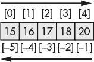

*图 18-2：1D ndarray 的索引*

如果你熟悉列表索引，那么索引 1D 数组不会有任何问题。我们来看一些示例，其中使用正索引和负索引选择元素：

```py
In [57]: arr1d = np.array([15, 16, 17, 18, 19, 20])

In [58]: arr1d[0]
Out[58]: 15

In [59]: arr1d[-6]
Out[59]: 15

In [60]: arr1d[-1]
Out[60]: 20
```

要访问数组中的每隔一个元素，可以加入步长值 2：

```py
In [61]: arr1d[::2]
Out[61]: array([15, 17, 19])
```

要一次访问多个元素，请使用一个由逗号分隔的索引数组，如下所示：

```py
In [62]: arr1d[[0, 2, 4]]
Out[62]: array([15, 17, 19])
```

选择了这些元素后，你可以给它们赋新值，并改变底层数组中的值，像这样：

```py
In [63]: arr1d[[0, 2, 4]] = 0

In [64]: arr1d
Out[64]: array([ 0, 16, 0, 18, 0, 20])
```

你还可以通过数组切片给一组数组元素赋新值。在下一个示例中，我们使用切片将前三个元素的值改为 100：

```py
In [65]: arr1d[:3] = 100

In [66]: arr1d
Out[66]: array([100, 100, 100, 18, 0, 20])
```

在前面的示例中，100 的值传播到了整个切片。这一过程被称为 *广播*。因为数组切片是源数组的视图，而不是副本，所以对视图的任何修改都会改变原数组。这在处理非常大的数组时是有利的，因为它避免了 NumPy 动态创建内存密集型副本。

请注意，即使将数组切片赋值给一个变量，这种赋值行为仍然存在：

```py
In [67]: arr1d = np.array([0, 1, 2, 3, 4])

In [68]: a_slice = arr1d[3:]

In [69]: a_slice
Out[69]: array([3, 4])

In [70]: a_slice[0] = 666

In [71]: arr1d
Out[71]: array([ 0, 1, 2, 666, 4])

In [72]: a_slice[:] = 42

In [73]: arr1d
Out[73]: array([ 0, 1, 2, 42, 42])
```

因为切片本身是一个数组，它有自己的一组索引，这些索引与源数组的索引不同。因此，`a_slice[:]` 对应于 `arr2d[3:]`。

要创建一个真正的副本而不是视图，请调用 `copy()` 方法，如下所示：

```py
In [74]: a_slice = arr1d[1:3].copy()

In [75]: a_slice[:] = 55

In [76]: a_slice
Out[76]: array([55, 55])

In [77]: arr1d
Out[77]: array([ 0, 1, 2, 42, 42])
```

现在，`a_slice` 数组与 `arr1d` 独立，改变它的元素不会影响源数组。

另外，你可以先对切片调用 `array` 函数，然后修改结果：

```py
In [78]: a_slice = np.array(arr1d[:])

In [79]: a_slice[:] = 55

In [80]: arr1d
Out[80]: array([0, 1, 2, 42, 42])
```

改变 `a_slice` 数组对 `arr1d` 没有影响，因为这些数组表示的是独立的对象。

##### **索引和切片 2D 数组**

二维数组使用一对值进行索引。这些值对类似于笛卡尔坐标系，除了行索引（轴 0 的值）在前，列索引（轴 1 的值）在后，如图 18-3 所示。再次使用方括号。

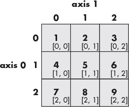

*图 18-3：2D ndarray 的索引*

让我们创建图 18-3 中的 2D 数组，进一步研究这个问题：

```py
In [81]: arr2d = np.arange(1, 10).reshape(3, 3)

In [82]: arr2d
Out[82]: 
array([[1, 2, 3],
       [4, 5, 6],
       [7, 8, 9]])
```

在 2D 数组中，索引对中的每个值引用的是 1D 数组（整行或整列），而不是单个元素。例如，指定整数索引 `1` 输出的是由 2D 数组的第二行组成的 1D 数组：

```py
In [83]: arr2d[1]
Out[83]: array([4, 5, 6])
```

对 2D 数组进行切片也可以沿 1D 数组进行。在这里，我们沿着行切片，取最后两行：

```py
In [84]: arr2d[1:3]
Out[84]: 
array([[4, 5, 6],
       [7, 8, 9]])
```

这产生了一个形状为 (2, 3) 的 2D 数组。

要获取 2D 数组中的整列，可以使用以下语法：

```py
In [85]: arr2d[:, 1]
Out[85]: array([2, 5, 8])
```

冒号（`:`）告诉 NumPy 获取所有行；`1` 则选择仅第 1 列，这样你就只剩下来自 `arr2d` 中心列的 1D 数组。

你也可以使用以下语法提取一列，尽管在这种情况下，与其输出包含列值的 1D 数组，不如生成形状为 (3, 1) 的 2D 数组：

```py
In [86]: arr2d[:, 1:2]
Out[86]: 
array([[2],
       [5],
       [8]])

In [87]: arr2d[:, 1:2].shape
Out[87]: (3, 1)
```

一般来说，如果你使用整数索引和切片的混合方式对 2D 数组进行切片，你会得到一个 1D 数组。如果你沿着两个轴进行切片，你会得到另一个 2D 数组。参考 图 18-4，它展示了使用各种表达式从 2D 数组中采样的结果。

与 1D 数组一样，2D 切片是数组的视图，你可以使用这些视图来修改源数组中的值。在这个示例中，我们选择了 图 18-3 中数组的中间列，并将其所有元素更改为 `42`。

```py
In [88]: a2_slice = arr2d[:, 1]

In [89]: a2_slice
Out[89]: array([2, 5, 8])

In [90]: a2_slice[:] = 42

In [91]: arr2d
Out[91]: 
array([[ 1, 42, 3],
       [ 4, 42, 6],
       [ 7, 42, 9]])
```

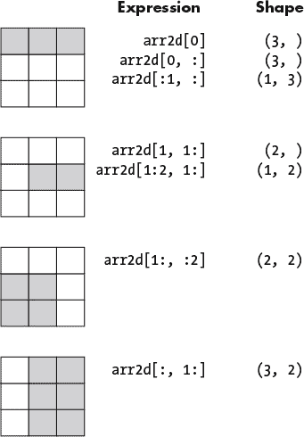

*图 18-4：2D ndarray 的示例切片*

要从 2D 数组中选择单个元素，指定一对整数作为元素的索引。例如，要获取第二行和第二列交点处的元素，可以输入以下内容：

```py
In [92]: arr2d[1, 1]
Out[92]: 42
```

请注意，这种语法是更传统的嵌套列表语法的简化版本，在传统语法中，每个索引都被括号包围：

```py
In [93]: arr2d[1][1]
Out[93]: 42
```

##### **索引和切片高维数组**

对于具有多于两个维度的数组，索引和切片的关键是将它们视为 *一系列堆叠的低维数组*。我们将这些堆叠的数组称为 *plans*。与 2D 数组一样，索引 3D 数组的顺序由它们的形状元组决定。

让我们先来看一个形状为 (2, 3, 4) 的 3D 数组。你可以将形状元组中的第一个值看作是该 3D 数组中的 2D 数组的数量。接下来的两个数字被视为这些 2D 数组的形状元组，分别表示其行数和列数。这里有一个示例：

```py
In [94]: arr3d = np.arange(24).reshape(2, 3, 4)

In [94]: arr3d
Out[94]: 
array([[[ 0,  1,  2,  3],
        [ 4,  5,  6,  7],
        [ 8,  9, 10, 11]],

       [[12, 13, 14, 15],
        [16, 17, 18, 19],
        [20, 21, 22, 23]]])
```

查看输出时，你应该会看到两个形状为 `(3, 4)` 的 2D 数组，一个叠放在另一个上面。这些数组通过输出中的空格以及第二个 2D 数组周围的一组新的方括号来区分。

因为数组包含两个矩阵，形状元组中的 3D 维度是 `2`。这个数字排在前面，因此你可以将形状元组看作记录了计划、行和列的数量。

为了看看这如何工作，我们可以使用索引来检索数组中的值 `20`。我们可以使用数组的形状元组 (plans, rows, columns) 来指导我们：

```py
In [95]: arr3d[1, 2, 0]
Out[95]: 20
```

首先，我们必须选择第二个 2D 数组，它的索引是 `1`，因为 Python 从 0 开始计数。接下来，我们使用 `2` 选择了第三行。最后，我们使用 `0` 选择了第一列。关键是按顺序处理形状元组。数组的维度会告诉你需要多少个索引（三维数组需要三个，四维数组需要四个，以此类推）。

切片也遵循形状元组的顺序。例如，要查看 `arr3d` 数组的下方 2D 数组，您需要输入 `1` 作为平面索引，然后使用冒号简写符号选择所有行和列：

```py
In [96]: arr3d[1, :, :]
Out[96]: 
array([[12, 13, 14, 15],
       [16, 17, 18, 19],
       [20, 21, 22, 23]])
```

供参考，图 18-5 展示了通过 3D 数组的一些示例切片，以及相应的形状。

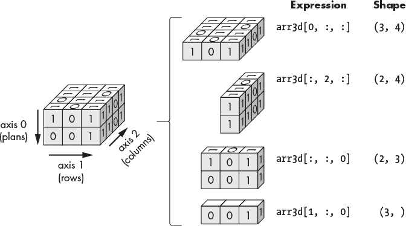

*图 18-5：通过 3D ndarray 的一些示例切片*

像往常一样，改变切片中元素的值将会改变源数组，除非该切片是一个副本：

```py
In [97]: arr3d[0, :, :] = 0

In [98]: arr3d
Out[98]: 
array([[[ 0,  0,  0,  0],
        [ 0,  0,  0,  0],
        [ 0,  0,  0,  0]],

       [[12, 13, 14, 15],
        [16, 17, 18, 19],
        [20, 21, 22, 23]]])
```

在我们继续之前，先练习一下对多于三维的数组进行索引和切片。例如，看看以下 4D 数组：

```py
In [99]: arr4d = np.arange(24).reshape(2, 2, 2, 3)

In [100]: arr4d
Out[100]: 
array([[[[ 0,  1,  2],
         [ 3,  4,  5]],

        [[ 6,  7,  8],
         [ 9, 10, 11]]],

       [[[12, 13, 14],
         [15, 16, 17]],

        [[18, 19, 20],
         [21, 22, 23]]]])
```

请注意，数组以四个方括号开始，并且使用两个空行将两个堆叠的 3D 数组分开。由于我们处理的是一个 4D 数组，要选择 `20` 元素，您需要输入四个索引：

```py
In [101]: arr4d[1, 1, 0, 2]
Out[101]: 20
```

这里，从左到右，您将 4D 数组索引到 3D 数组；3D 数组索引到 2D 数组；2D 数组索引到 1D 数组；最后将 1D 数组索引到单个元素。这在图 18-6 中可能更加明显，它演示了这些操作的顺序。

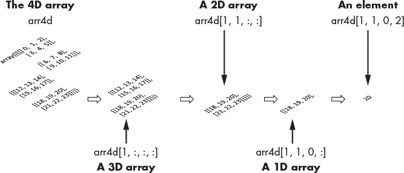

*图 18-6：将 4D 数组索引到单个元素 [1, 1, 0, 2]*

这种排序风格适用于任意数量的维度。

最后，对于 4D 数组，其中第四维表示时间，考虑将数组水平排列而不是垂直排列会很有帮助（图 18-7）。

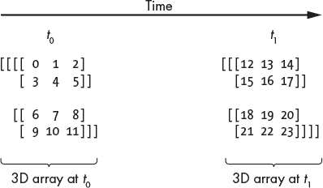

*图 18-7：每个 4D 切片可以代表同一个 3D 数组，在不同的时间进行采样。*

在这种情况下，每个单一的 4D 切片将代表同一数据集（3D 数组），但是在不同的时间点进行测量的。因此，要查看第一组测量结果，您可以输入 `arr4d[0, :, :]`，而查看最后一组测量结果时，可以输入 `arr4d[-1, :, :]`。

##### **布尔索引**

除了使用数值索引和切片，您还可以通过条件和布尔运算符在数组中选择元素。这使您能够在不知道元素位置的情况下提取数组中的元素。例如，您可能在一个垃圾填埋场周围有数百个监测井，您想找到所有检测到有毒污染物甲苯超过某一阈值的井。使用布尔索引，您不仅可以识别这些井，还可以基于输出创建一个新的数组。

为了说明，以下条件会在数组中搜索任何大于或等于四的整数元素：

```py
In [102]: arr1d = np.array([1, 2, 3, 4, 5])

In [103]: print(arr1d >= 4)
[False False False True True]
```

如你所见，Python 会返回一个布尔值数组，其中条件满足的地方会有 `True` 值。请注意，这种语法适用于任何维度的 `ndarray`。

NumPy 还可以在后台使用布尔值，允许你基于条件对数组进行切片：

```py
In [104]: a_slice = arr1d[arr1d >= 4]

In [105]: a_slice
Out[105]: array([4, 5])
```

比较两个数组也会生成一个布尔数组。在这个例子中，我们标记所有在 `arr_2` 中大于 `arr_1` 中对应元素的值为 `True`：

```py
In [106]: arr_1 = np.random.randn(3, 4)

In [107]: arr_2 = np.random.randn(3, 4)

In [108]: arr_2 > arr_1
Out[108]: 
array([[ True,  True, False,  True],
       [ True, False,  True, False],
       [False,  True,  True, True]])
```

布尔索引的常见用法是将灰度图像分割为前景和背景部分，这个过程叫做 *阈值处理*。这会生成一个基于截断值的二值图像。以下是一个示例，其中我们创建一个二维图像数组，然后对大于 4 的值进行阈值处理：

```py
In [109]: img = np.array([
 [12, 13, 14,  4, 16,  1, 11, 10,  9],
 [11, 14, 12,  3, 15,  1, 10, 12, 11],
 [10, 12, 12,  1, 14,  3, 10, 12, 12], [ 9, 11, 16,  0,  4,  2,  3, 12, 10],
 [12, 11, 16, 14, 10,  2, 16, 12, 13],
 [10, 15, 16, 14, 14,  4, 16, 15, 12],
 [13, 17, 14, 10, 14,  1, 14, 15, 10]])

In [110]: img_thresh = (img > 4).astype(int)
```

记住，`True` 等价于 `1`，`False` 等价于 `0`。这使得我们可以通过附加 `astype()` 函数并传入整数数据类型来将布尔数组转换为数值数组。

阈值处理后，新的数组中 `0` 值的区域应该形成数字 4：

```py
In [111]: print(img_thresh)
[[1 1 1 0 1 0 1 1 1]
 [1 1 1 0 1 0 1 1 1]
 [1 1 1 0 1 0 1 1 1]
 [1 1 1 0 0 0 0 1 1]
 [1 1 1 1 1 0 1 1 1]
 [1 1 1 1 1 0 1 1 1]
 [1 1 1 1 1 0 1 1 1]]
```

要根据布尔数组赋值，你需要基于条件索引源数组，然后赋予一个值。在这里，我们将 `0` 赋值给所有值小于 `5` 的数组元素：

```py
In [112]: img[img < 5] = 0

In [113]: img
Out[113]: 
array([[12, 13, 14,  0, 16,  0, 11, 10,  9],
       [11, 14, 12,  0, 15,  0, 10, 12, 11],
       [10, 12, 12,  0, 14,  0, 10, 12, 12],
       [ 9, 11, 16,  0,  0,  0,  0, 12, 10],
       [12, 11, 16, 14, 10,  0, 16, 12, 13],
       [10, 15, 16, 14, 14,  0, 16, 15, 12],
       [13, 17, 14, 10, 14,  0, 14, 15, 10]])
```

同样，你也可以使用索引改变布尔数组中的整行、整列和整块。例如，`img[0] = 0` 会将 `img` 数组的第一行所有元素都改为 `0`。

在数组中使用布尔值涉及一些怪癖。通过布尔索引提取数组中的元素会默认创建数据的副本，这意味着不需要使用 `copy()` 函数。布尔数组的另一个特殊之处是，在编写比较语句时，你必须将 `and` 和 `or` 关键字分别替换为 `&` 和 `|` 符号。

**测试你的知识**

6.  创建一个大小为 30、形状为 (5, 6) 的二维 `ndarray`。然后，切片数组以提取灰色高亮的值：

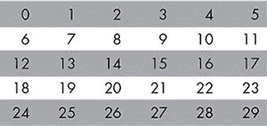

7.  对第 6 题中的数组进行重采样，提取灰色高亮的元素：

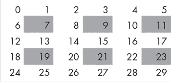

8.  切片一个 `ndarray` 会得到：

a.  一个新的数组对象

b.  源数组的副本

c.  源数组的视图

d.  一个 Python `list` 对象

9.  使用标量索引和另一个切片组合切片二维数组会得到：

a.  一个二维数组

b.  一个一维数组

d.  一个单一元素（0D 数组）

e.  以上都不是

10.  这个数组的秩是多少？

array([[[[ 0,  1,  2,  3],

[ 4,  5,  6,  7]],

[[ 8,  9, 10, 11],

[12, 13, 14, 15]]],

[[[16, 17, 18, 19],

[20, 21, 22, 23]],

[[24, 25, 26, 27],

[28, 29, 30, 31]]]])

### **操作数组**

NumPy 提供了处理现有数组的工具。常见的操作包括重塑数组、交换轴以及合并和拆分数组。这些操作在旋转、放大、平移图像以及拟合机器学习模型时非常有用。

#### ***改变形状与转置***

NumPy 提供了更改数组形状、转置数组（交换列和行）以及交换轴的函数。你已经在使用其中的一个函数——`reshape()`。

使用`reshape()`时要注意的一点是，像所有 NumPy 赋值一样，它创建的是数组的*视图*而不是*副本*。在以下示例中，重塑`arr1d`数组只会对数组进行临时更改：

```py
In [114]: arr1d = np.array([1, 2, 3, 4])

In [115]: arr1d.reshape(2, 2)
Out[115]: 
array([[1, 2],
       [3, 4]])

In [116]: arr1d
Out[116]: array([1, 2, 3, 4])
```

这种行为在你希望暂时更改数组的形状以便进行计算时非常有用，而不需要复制任何数据。

同样，将数组赋值给一个新变量只是创建了对源数组的另一个引用。在以下示例中，尽管将重塑后的`arr1d`数组赋值给一个名为`arr2d`的新变量，但更改`arr2d`中的值也会更改`arr1d`中相应的值：

```py
In [117]: arr2d = arr1d.reshape(2, 2)

In [118]: arr2d
Out[118]: 
array([[1, 2],
       [3, 4]]) 

In [119]: arr2d[0] = 42

In [120]: arr2d
Out[120]: 
array([[42, 42],
       [ 3,  4]])

In [121]: arr1d
Out[121]: array([42, 42, 3, 4])
```

显然，这种行为可能会让你陷入困境。如前所述，如果你想从现有数组创建一个独立的`ndarray`对象，使用`copy()`函数。

要修改数组本身而不是仅创建视图，使用`shape()`函数并传递一个形状元组：

```py
In [122]: arr1d.shape = (2, 2)

In [123]: arr1d
Out[123]: 
array([[42, 42],
        [3, 4]])
```

将这段代码与`In [114] – Out [116]`进行比较。在这里，源数组被永久更改。

##### **展平数组**

有时候，即使你的数据是高维的，你也希望使用 1D 数组作为某些过程的输入。例如，标准的绘图程序通常期望使用简单的数据结构，如列表或单一的平面数组。同样，图像数据通常会在输入神经网络的输入层之前转换为 1D 数组。

从高维数组转到 1D 数组称为*展平*。`ravel()`函数可以在创建数组*视图*的同时完成这一操作。以下是一个示例：

```py
In [124]: arr2d = np.arange(8).reshape(2, 4)

In [125]: arr2d
Out[125]: 
array([[0, 1, 2, 3],
       [4, 5, 6, 7]])

In [126]: arr1d = arr2d.ravel()

In [127]: arr1d
Out[127]: array([0, 1, 2, 3, 4, 5, 6, 7])
```

在展平数组时创建数组副本，可以使用`ndarray`对象的`flatten()`方法。由于该方法生成的是副本而不是视图，因此比`ravel()`稍慢。以下是语法：

```py
In [128]: arr2d.flatten()
Out[128]: array([0, 1, 2, 3, 4, 5, 6, 7])
```

你也可以通过使用`shape()`函数并传递数组中元素的数量来原地展平原始数组：

```py
In [129]: arr2d.shape = (8)

In [130]: arr2d
Out[130]: array([0, 1, 2, 3, 4, 5, 6, 7])
```

请记住，你可以通过调用数组的`size`属性并使用点符号获取数组的大小。

##### **交换数组的列和行**

在分析数据时，最好从多个角度进行检查。图 18-8 显示了三个德州城市的月平均气温数据。如何展示数据——是*按月份*展示，还是*按地点*展示——取决于你想回答的问题以及你在报告中可以用于展示数据的空间。

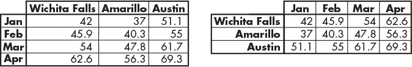

*图 18-8：显示德克萨斯州三个城市的平均月度温度（^°F），按月和城市展示*

就像 Microsoft Excel 可以轻松地反转列和行一样，NumPy 提供了便捷的`transpose()`函数来执行此操作：

```py
In [131]: arr2d = np.arange(8).reshape(2, 4)

In [132]: arr2d
Out[132]: 
array([[0, 1, 2, 3],
       [4, 5, 6, 7]])

In [133]: arr2d.transpose()
Out[133]: 
array([[0, 4],
       [1, 5],
       [2, 6],
       [3, 7]])
```

这仍然是原始数组的视图。要创建一个新数组，你可以添加`copy()`函数，如下所示：

```py
In [134]: arr2d_transposed = arr2d.transpose().copy()
```

对于更高维度的数组，你可以将`transpose()`传递一个轴编号的元组，按照你希望的顺序进行转置。让我们将一个 3D 数组转置，使轴的顺序变为第三轴优先，第一轴第二，第二轴保持不变：

```py
In [135]: arr3d = np.arange(12).reshape(2, 2, 3)

In [136]: arr3d
Out[136]: 
array([[[0,  1,  2],
        [3,  4,  5]],

       [[6,  7,  8],
        [9, 10, 11]]])

In [137]: arr3d.transpose((2, 1, 0))
Out[137]: 
array([[[0,  6],
        [3,  9]],

       [[1,  7],
        [4, 10]],

       [[2,  8],
        [5, 11]]])
```

交换轴的另一种方法是`swapaxes()`。它接受一对轴并重新排列数组，返回数组的视图。这里是一个例子：

```py
In [138]: arr3d
Out[138]: 
array([[[0,  1,  2],
        [3,  4,  5]],

       [[6,  7,  8],
        [9, 10, 11]]])

In [139]: arr3d.swapaxes(0, 1)
Out[139]: 
array([[[0,  1,  2],
        [6,  7,  8]],

       [[3,  4,  5],
        [9, 10, 11]]])
```

#### ***连接数组***

NumPy 提供了几个函数，让你可以将多个现有数组合并或*堆叠*成一个新数组。让我们首先创建两个 2D 数组，第一个由零组成，第二个由一组成：

```py
In [140]: zeros = np.zeros((3, 3))

In [141]: ones = np.ones((3, 3))
```

现在，让我们使用`vstack()`函数将两个数组按垂直方向堆叠。这将把第二个数组作为新行沿轴 0 添加到第一个数组中：

```py
In [142]: np.vstack((zeros, ones))
Out[142]: 
array([[0., 0., 0.],
       [0., 0., 0.],
       [0., 0., 0.],
       [1., 1., 1.],
       [1., 1., 1.],
       [1., 1., 1.]])
```

`hstack()`函数将第二个数组作为新列添加到第一个数组上：

```py
In [143]: np.hstack((zeros, ones))
Out[143]: 
array([[0., 0., 0., 1., 1., 1.],
       [0., 0., 0., 1., 1., 1.],
       [0., 0., 0., 1., 1., 1.]])
```

`row_stack()`和`column_stack()`函数将 1D 数组堆叠成新的 2D 数组。例如：

```py
In [144]: x = np.array([1, 2, 3])

In [145]: y = np.array([4, 5, 6])

In [146]: z = np.array([7, 8, 9])

In [147]: np.row_stack((x, y, z))
Out[147]: 
array([[1, 2, 3],
       [4, 5, 6],
       [7, 8, 9]])

In [148]: np.column_stack((x, y, z))
Out[148]: 
array([[1, 4, 7],
       [2, 5, 8],
       [3, 6, 9]])
```

你还可以使用深度堆叠函数（`dstack((x, y, z))`）在轴 2 上进行列堆叠。此函数类似于`hstack()`，不同之处在于它首先将 1D 数组转换为 2D 列向量。

#### ***分割数组***

NumPy 还允许你对数组进行除法或*分割*。与连接一样，你可以垂直或水平地进行分割。

下面是一个使用`vsplit()`函数的例子。首先，让我们创建一个数组：

```py
In [149]: source = np.arange(24).reshape((4, 6))

In [150]: source
Out[150]: 
array([[ 0,  1,  2,  3,  4,  5],
       [ 6,  7,  8,  9, 10, 11],
       [12, 13, 14, 15, 16, 17],
       [18, 19, 20, 21, 22, 23]])
```

要将`source`数组垂直（沿轴 0）分割为两部分，传递`vsplit()`函数数组和`2`作为参数：

```py
In [151]: split1, split2 = np.vsplit(source, 2)

In [152]: split1
Out[152]: 
array([[ 0, 1, 2, 3,  4,  5],
       [ 6, 7, 8, 9, 10, 11]])

In [153]: split2
Out[153]: 
array([[12, 13, 14, 15, 16, 17],
       [18, 19, 20, 21, 22, 23]])
```

要将`source`数组水平（沿轴 1）分割为两部分，传递`hsplit()`数组和`2`作为参数：

```py
In [154]: split1, split2 = np.hsplit(source, 2)

In [155]: split1
Out[155]: 
array([[ 0,  1,  2],
       [ 6,  7,  8],
       [12, 13, 14],
       [18, 19, 20]])

In [156]: split2
Out[156]: 
array([[ 3,  4,  5],
       [ 9, 10, 11],
       [15, 16, 17],
       [21, 22, 23]])
```

在之前的示例中，数组分割必须是*均等划分*。使用`split()`函数，你可以沿一个轴将数组分割成多个数组。你将原始数组和要分割的部分的索引传递给该函数，并且可以选择传递一个轴编号（默认为轴 0）。例如，要将`source`数组分割成包含两列、三列和一列的三个数组，你将输入如下：

```py
In [157]: a, b, c = np.split(source, [2, 5], axis=1)

In [158]: a
Out[158]: 
array([[ 0,  1],
       [ 6,  7],
       [12, 13],
       [18, 19]])

In [159]: b
Out[159]: 
array([[ 2,  3,  4],
       [ 8,  9, 10],
       [14, 15, 16],
       [20, 21, 22]])

In [160]: c
Out[160]: 
array([[ 5],
       [11],
       [17],
       [23]])
```

索引`[2, 5]`告诉 NumPy 在轴 1 上哪里分割数组。要在行上重复此操作，只需将`axis`参数改为`0`。

### **使用数组进行数学运算**

现在你已经知道如何创建和操作数组，是时候将它们应用于它们的主要目的：数学运算了。NumPy 使用两种内部实现来高效地对数组进行数学运算：*矢量化*和*广播*。矢量化支持在相同大小的数组之间进行运算，而广播则将这种行为扩展到形状不同的数组。

#### ***矢量化***

`ndarray` 的最强大特性之一，*矢量化* 让你无需显式的 `for` 循环就能对数据执行批量操作。这意味着你可以一次性对整个数组应用操作，而不需要选择其中的每一个元素。

对于相同大小的数组，算术运算会逐元素应用，如 图 18-9 所示。

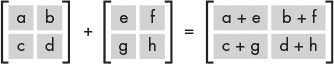

*图 18-9：涉及相同大小数组的数学运算会在对应元素上执行。*

因为循环背后是用 C 语言实现的，所以矢量化可以加速处理。我们来看看一个例子，比较 Python 中的循环和 NumPy 中的矢量化。

从创建两个包含 100,000 个随机选择的整数（范围是 0 到 500）的数据集开始：

```py
In [161]: data_a = np.random.randint(500, size=100_000)

In [162]: data_b = np.random.randint(500, size=100_000)
```

现在，创建一个空列表，然后遍历这两个数据集，如果 `data_a` 中的每一项也出现在 `data_b` 中，就将它添加到列表中：

```py
In [163]: shared_list = []

In [164]: for item in data_a:
     ...:     if item in data_b:
     ...:         shared_list.append(item)
```

请注意，这也可以通过列表推导式写成 `shared_list = [item for item in data_a if item in data_b]`。

根据你的硬件配置，可能需要等待五秒钟或更长时间，才能完成这个循环。

这是列表中的前三个值（你的可能不同，因为这些是随机生成的）：

```py
In [165]: shared_list[:3]
Out[165]: [326, 159, 155]
```

让我们使用 NumPy 的 `isin()` 函数重复这个练习。这个优化函数会将目标数组中的每个元素与另一个数组进行比较，并返回一个布尔值。我们可以将其与索引结合使用，返回值为 `True` 的元素：

```py
In [166]: data_a[np.isin(data_a, data_b)]
Out[166]: array([326, 159, 155, ..., 136, 416, 307])
```

与之前标准的 Python 循环相比，这个计算几乎是瞬间完成的。

矢量化还允许更简洁和可读的代码，看起来像数学表达式。例如，要将两个数组相乘，你可以省略嵌套循环，直接写成 `arr1 * arr2`，如下所示：

```py
In [167]: arr1 = np.array([[1, 1, 1], [2, 2, 2]])

In [168]: arr1
Out[168]: 
array([[1, 1, 1],
       [2, 2, 2]])

In [169]: arr2 = np.array([[3, 3, 3], [4, 4, 4]])

In [170]: arr2
Out[170]: 
array([[3, 3, 3],
       [4, 4, 4]])

In [171]: arr1 * arr2
Out[171]: 
array([[3, 3, 3],
       [8, 8, 8]])
```

这种行为适用于所有基本的算术运算，例如加法、减法、乘法和除法。

#### ***广播***

*广播* 技术允许对不同形状的数组执行运算。为了理解它的工作原理，考虑 图 18-10，其中一个包含四个元素的 1D 数组与一个包含单个元素的 1D 数组相乘。

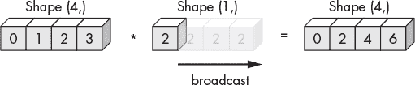

*图 18-10：当将 1D ndarray 与标量相乘时的广播示例*

如你所见，较小的数组会扩展到较大的数组，直到它们具有兼容的形状。形状为 (1,) 的数组会变成形状为 (4,) 的数组，其中单一的值会被重复，以便可以进行逐元素乘法操作。这种行为同样适用于标量与数组之间的运算。

要使广播生效，两个数组的维度必须兼容。当两个维度相等或其中一个维度为 1 时，它们是兼容的。NumPy 通过比较数组形状元组来确定这种兼容性，从右到左进行比较。例如，要检查不同的 24 元素 3D 数组是否可以广播，NumPy 将比较它们的形状元组，如 图 18-11 所示。

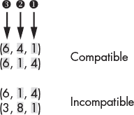

*图 18-11：检查 3D 数组的维度是否兼容（灰色阴影值）*

从尾部维度 ➊ 开始，NumPy 确定这两对数组是兼容的，因为至少有一个维度等于 1。对于下一个比较 ➋，这仍然成立，但在最后的比较 ➌ 中，底部的那一对数组失败了，因为 6 和 3 不相等。因此，我们无法在这两个数组之间执行任何数学操作。

相比之下，在 图 18-12 中，一个 2D 数组和一个 1D 数组是兼容的，因此 1D 数组可以广播到缺失的行中。

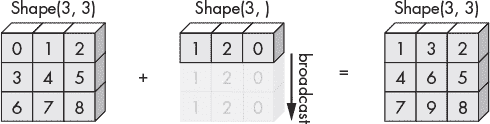

*图 18-12：将 2D 数组与 1D 数组相加时广播的示例*

这允许按元素进行加法运算。广播可以沿着行、列或平面进行，具体取决于需要。有关广播的更多信息，包括实际示例，请访问 *[`numpy.org/doc/stable/user/basics.broadcasting.html`](https://numpy.org/doc/stable/user/basics.broadcasting.html)*。

#### ***矩阵点积***

在 NumPy 中，数组之间的基本乘法是按元素执行的。换句话说，一个数组中的每个元素都与第二个数组中对应的元素相乘。这也包括 2D 数组的乘法，通常称为矩阵乘法。

然而，你可能还记得数学课上，正确的矩阵乘法涉及对行和列进行操作，而不是按元素进行。这就是 *矩阵点积*，其中第一个矩阵的水平方向与第二个矩阵的垂直方向相乘，结果然后相加，如 图 18-13 中的灰色阴影值所示。这个过程不仅不是 *按元素* 执行的，而且是不可交换的，因为 `arr1 * arr2` 不等于 `arr2 * arr1`。

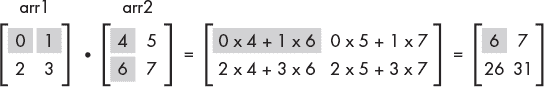

*图 18-13：矩阵点积*

要以这种方式相乘两个矩阵，NumPy 提供了 `dot()` 函数。以下是使用 图 18-13 中的矩阵的示例：

```py
In [172]: arr1 = np.array([[0, 1], [2, 3]])

In [173]: arr2 = np.array([[4, 5], [6, 7]])

In [174]: np.dot(arr1, arr2)
Out[174]: 
array([[ 6,  7],
       [26, 31]])
```

你也可以使用替代语法 `arr1.dot(arr2)` 来计算点积。

除了点积外，NumPy 还提供了其他进行线性代数运算的函数。要查看完整列表，请访问 *[`numpy.org/doc/stable/reference/routines.linalg.html`](https://numpy.org/doc/stable/reference/routines.linalg.html)*。

#### ***递增和递减数组***

你可以使用增强运算符，如 `+=`，在不创建新数组的情况下更改数组中的值。以下是使用一维数组的一些示例：

```py
In [175]: arr1d = np.array([0, 1, 2, 3])

In [176]: arr1d += 10

In [177]: arr1d
Out[177]: array([10, 11, 12, 13])

In [178]: arr1d -= 10

In [179]: arr1d
Out[179]: array([0, 1, 2, 3])

In [180]: arr1d *= 2

In [181]: arr1d
Out[181]: array([0, 2, 4, 6])
```

在这些情况下，标量值会应用到数组中的每个元素。

#### ***使用 NumPy 函数***

与 Python 的标准 `math` 模块类似，NumPy 也提供了一套自己的数学函数。这些函数包括通用函数和聚合函数。*通用*函数，也称为 *ufunc*，按元素逐个处理，并生成一个与输入大小相同的新数组。*聚合*函数作用于整个数组，生成一个单一值，例如数组中元素的总和。

##### **通用函数**

执行简单逐元素转换的通用函数，例如取对数或平方一个元素，称为 *一元* ufunc。使用它们时，调用该函数并传入一个 `ndarray`，如下所示：

```py
In [182]: arr1d = np.array([10, 20, 30, 40])

In [183]: np.log10(arr1d)
Out[183]: array([1\. , 1.30103 , 1.47712125, 1.60205999])

In [184]: np.square(arr1d)
Out[184]: array([ 100, 400, 900, 1600], dtype=int32)
```

一些常用的一元 ufunc 已列在 表 18-4 中。你可以在 *[`numpy.org/doc/stable/reference/ufuncs.html#ufuncs/`](https://numpy.org/doc/stable/reference/ufuncs.html#ufuncs/)* 上找到完整的列表。

**表 18-4：** 有用的 NumPy 一元通用函数

| **函数** | **描述** |
| --- | --- |
| `abs` | 计算每个元素的绝对值 |
| `fabs` | 计算每个元素的绝对值并返回浮动类型 |
| `all` | 测试沿指定轴的所有数组元素是否均为 True |
| `any` | 测试沿指定轴的任意数组元素是否为 True |
| `ceil` | 计算每个元素大于或等于它的最小整数 |
| `floor` | 计算每个元素小于或等于它的最大整数 |
| `clip` | 将数组中的值限制在指定的最小值和最大值范围内 |
| `round` | 将数组中的值四舍五入到指定的小数位数 |
| `exp` | 计算每个元素的指数（ex） |
| `log, log10, log2` | 计算每个元素的自然对数、以 10 为底的对数或以 2 为底的对数 |
| `rint` | 将元素四舍五入到最接近的整数，同时保持数据类型 |
| `sign` | 计算每个元素的符号（正数=1，零=0，负数=-1） |
| `sqrt` | 计算每个元素的平方根 |
| `square` | 计算每个元素的平方 |
| `modf` | 返回数组的整数部分和小数部分，作为新数组 |
| `isnan` | 返回布尔数组，指示 NaN（非数字）值 |
| `degrees` | 将表示弧度的元素转换为角度 |
| `radians` | 将表示角度的元素转换为弧度 |
| `cos, sin, tan` | 计算每个元素的余弦、正弦或正切 |
| `cosh, sinh, tanh` | 计算每个元素的双曲余弦、双曲正弦或双曲正切 |
| `arccos, arcsin, arctan` | 计算每个元素的反三角函数 |
| `arccosh, arcsinh, arctanh` | 计算每个元素的反双曲三角函数 |
| `sort` | `arr.sort()` 就地排序；`np.sort()` 返回排序后的副本 |

接受两个数组作为输入并返回单一数组的通用函数称为*二元* ufunc。以下二元函数用于找到两个数组中的最大值和最小值，并将结果返回为新数组：

```py
In [185]: a = np.array([1, 2, 500])

In [186]: b = np.array([0, 2, -1])

In [187]: np.maximum(a, b)
Out[187]: array([ 1, 2, 500])

In [188]: np.minimum(a, b)
Out[188]: array([ 0, 2, -1])
```

其他一些二元函数列在表 18-5 中。

**表 18-5：** 有用的 NumPy 二元通用函数

| **函数** | **描述** |
| --- | --- |
| `add` | 按元素相加 |
| `subtract` | 按元素从第一个数组中减去第二个数组 |
| `multiply` | 按元素相乘 |
| `divide` | 按元素相除 |
| `floor_divide` | 对数组进行除法运算并截断余数 |
| `power` | 将第一个数组中的元素提升到第二个数组中的幂 |
| `maximum, fmax` | 按元素返回最大值，`fmax`忽略 NaN 值 |
| `minimum, fmin` | 按元素返回最小值，`fmax`忽略 NaN 值 |
| `mod` | 按元素返回模值 |
| `copysign` | 将第二个数组中的符号复制到第一个数组的值上 |
| `greater` | 返回元素逐一*大于*的布尔数组 |
| `greater_equal` | 返回元素逐一*大于或等于*的布尔数组 |
| `less` | 返回元素逐一*小于*的布尔数组 |
| `less_equal` | 返回元素逐一*小于或等于*的布尔数组 |
| `equal` | 返回元素逐一*相等*的布尔数组 |
| `not_equal` | 返回元素逐一负相等的布尔数组 |

欲了解更多关于通用函数的信息，请访问：*[`numpy.org/doc/stable/user/basics.ufuncs.html`](https://numpy.org/doc/stable/user/basics.ufuncs.html)*。

##### **统计方法**

NumPy 还提供了一些方法，用于计算整个数组或沿某一轴的数据的统计值。将数组中的元素减少为单一值的操作称为*聚合*或*归约*。

让我们通过一个包含随机生成整数的二维数组来尝试一下这些方法：

```py
In [189]: arr = np.random.randint(100, size=(3, 5))

In [190]: arr
Out[190]: 
array([[85, 77,  0, 10, 24],
       [16, 39, 94, 11, 21],
       [71, 54,  8, 73, 98]])
```

要计算这个数组中所有元素的均值，可以使用点符号在数组上调用`mean()`：

```py
In [191]: arr.mean()
Out[191]: 45.4
```

你还可以将数组传递给`mean()`函数，像这样：

```py
In [192]: np.mean(arr)
Out[192]: 45.4
```

可选的`axis`参数允许你指定计算统计值的轴。例如，指定轴 1 意味着计算将在*列方向*进行，结果是一个一维数组，元素个数等于数组中的行数：

```py
In [193]: arr.mean(axis=1)
Out[193]: array([39.2, 36.2, 60.8])
```

指定轴 0 告诉函数沿*行方向*进行计算。在下面的示例中，这将生成一个一维数组，包含五个元素，等于列的数量：

```py
In [194]: arr.sum(axis=0)
Out[194]: array([172, 170, 102, 94, 143])
```

这些函数也可以在没有`axis`关键字的情况下调用：

```py
In [195]: arr.mean(1)
Out[195]: array([39.2, 36.2, 60.8])
```

表 18-6 列出了一些有用的数组统计方法。你可以使用整个数组，也可以指定轴。

**表 18-6：** 有用的 NumPy 统计方法

| **函数** | **描述** |
| --- | --- |
| `argmin` | 最小值元素的索引 |
| `argmax` | 最大值元素的索引 |
| `count_nonzero` | 计算数组中非零值的数量 |
| `cumprod` | 从索引 1 开始的元素累积积 |
| `cumsum` | 从索引 0 开始的元素累积和 |
| `mean` | 元素的算术平均值 |
| `min` | 元素的最小值 |
| `max` | 元素的最大值 |
| `std` | 元素的标准差 |
| `sum` | 元素的和 |
| `var` | 元素的方差 |

请注意，NumPy 还提供了 `apply_along_axis()` 聚合函数，它允许你传递统计函数、轴和数组作为参数。以下是使用前述数组的一个示例：

```py
In [196]: np.apply_along_axis(np.mean, axis=1, arr=arr)
Out[196]: array([37.4, 31\. , 74.4])
```

你还可以定义自己的函数并将它们传递给 `apply_along_axis()`：

```py
In [197]: def cube(x):
     ...:      return x**3

In [198]: np.apply_along_axis(cube, axis=1, arr=arr)
Out[198]: 
array([[614125, 456533,      0,   1000,  13824],
       [  4096,  59319, 830584,   1331,   9261],
       [357911, 157464,    512, 389017, 941192]], dtype=int32)
```

请注意，在这些示例中，你能够在不显式遍历每个元素的情况下操作数组。这再次展示了 NumPy 的一个强大优势。

##### **生成伪随机数**

NumPy 提供了用于从不同类型的概率分布创建数组的函数。这些函数对于生成随机数据来测试机器学习模型、创建具有已知形状或分布的数据分布、为蒙特卡洛模拟随机抽取数据等任务非常有用。它们的运行速度通常比 Python 内建的 `random` 模块中的类似函数快至少一个数量级。

表 18-7 列出了你可以在 `np.random` 中找到的一些函数。完整列表请访问 *[`numpy.org/doc/stable/reference/random/index.html`](https://numpy.org/doc/stable/reference/random/index.html)*。

**表 18-7：** 有用的 NumPy 伪随机函数

| **函数** | **描述** |
| --- | --- |
| `beta` | 从 Beta 分布中绘制样本 |
| `binomial` | 从二项分布中绘制样本 |
| `chisquare` | 从卡方分布中绘制样本 |
| `gamma` | 从 Gamma 分布中绘制样本 |
| `normal` | 从正态（高斯）分布中绘制随机样本 |
| `permutation` | 返回一个排列的范围或序列的随机排列 |
| `power` | 从幂函数分布中绘制样本 |
| `rand` | 创建一个给定形状的数组，填充来自（0, 1）区间的均匀分布随机样本 |
| `randint` | 返回从低（包含）到高（不包含）的随机整数 |
| `randn` | 从“标准正态”分布中返回一个样本（或多个样本） |
| `random` | 返回位于半开区间（0.0, 1.0）中的随机浮点数 |
| `seed` | 更改随机数生成器的种子 |
| `shuffle` | 原地随机排列序列 |
| `uniform` | 从半开区间（low, high）中绘制均匀分布的样本 |

### **读取和写入数组数据**

NumPy 可以以二进制和文本格式从磁盘加载和保存数据。支持的文本格式有 **.txt** 和 **.csv**。通常，你会使用基于 NumPy 的 pandas 库来处理文本或表格数据。我们将在第二十章中讨论 pandas。

对于以二进制格式存储和检索数据，NumPy 提供了 `save()` 和 `load()` 函数。要将数组保存到磁盘，只需将文件名和数组作为参数传递，如下所示：

```py
In [199]: arr = np.arange(8).reshape(2, 4)

In [200]: arr
Out[200]: 
array([[0, 1, 2, 3],
       [4, 5, 6, 7]])

In [201]: np.save('my_array', arr)
```

这将生成二进制文件 *my_array.npy*（*.npy* 扩展名会自动添加）。

要重新加载此文件，请输入以下命令：

```py
In [202]: np.load('my_array.npy')
Out[202]: 
array([[0, 1, 2, 3],
       [4, 5, 6, 7]])
```

`np.savez()` 函数允许你将多个数组保存到一个未压缩的 *.npz* 文件中。提供关键字参数可以将它们按相应的名称存储在输出文件中：

```py
In [203]: arr1 = np.arange(5)

In [204]: arr2 = np.arange(4)

In [205]: np.savez('arr_arch.npz', a=arr1, b=arr2)

In [206]: archive = np.load('arr_arch.npz')

In [207]: archive['a']
Out[207]: array([0, 1, 2, 3, 4])
```

如果数组作为 *位置* 参数（没有关键字）指定，它们的名称默认会是 *arr_0*、*arr_1* 等。

要在归档时压缩数据，使用 `savez_compressed()` 函数：

```py
In [208]: np.savez_compressed('arr_arch_compressed.npz', a=arr1, b=arr2)
```

如果你确实想要读取文本文件，NumPy 提供了 `genfromtxt()`（从文本生成）函数。例如，要加载一个 *.csv* 文件，你需要将文件路径、分隔值的字符（如逗号），以及数据列是否有标题等信息传递给该函数。

```py
In [209]: arr = np.genfromtxt('my_data.csv', delimiter=',', names=True)
```

这将生成一个 *结构化* 数组，该数组包含记录而不是单独的元素。我们没有讨论结构化数组，因为它们是低级工具，我们将使用 pandas 来执行加载 *.csv* 文件等操作。不过，你可以在 *[`numpy.org/doc/stable/user/basics.rec.html`](https://numpy.org/doc/stable/user/basics.rec.html)* 阅读更多关于结构化数组的信息。

**测试你的知识**

11.  为什么在输出数组的前两个元素中会有这么多空白（[ 0, 2, -10000]）？

12.  你会使用哪个函数将高维数组压缩为一维数组？

a.  `meshgrid()`

b.  `vsplit()`

c.  `ravel()`

d.  `thresh()`

13.  对于数组 [[0, 1, 2], [3, 4, 5], [6, 7, 8]]，切片 arr2d[:2, 2] 会产生什么结果？

a.  `array([1])`

b.  `array([2, 5])`

c.  `array([6, 7])`

d.  `array([3, 4, 5])`

14.  在 NumPy 中，数组的乘法是如何执行的：

a.  按行列排列

b.  按行列排列

c.  按元素逐个执行

d.  按行排列然后按列排列

15.  哪个数组可以与形状为 (4, 3, 6, 1) 的数组进行广播？

a.  (4, 6, 6, 1)

b.  (1, 6, 3, 1)

c.  (4, 1, 6, 6)

d.  (6, 3, 1, 6)

### **总结**

在处理统一数据集时，NumPy 的 `ndarray` 是比 Python 列表等竞争数据结构更快、更高效的替代方案。可以在不使用 `for` 循环的情况下执行复杂计算，并且 `ndarray` 占用的内存比其他 Python 数据类型少得多。

本章涉及了许多 NumPy 的基础知识，但仍有更多内容需要学习。为了扩展你对 NumPy 的了解，我推荐 NumPy 的“Beyond the Basics”页面 (*[`numpy.org/doc/stable/user/c-info.beyond-basics.html`](https://numpy.org/doc/stable/user/c-info.beyond-basics.html)*) 和 Wes McKinney 的*《Python 数据分析：Pandas、NumPy 与 IPython 数据清洗》*，第二版（O'Reilly，2018）。

在你开始应用 NumPy 之前，建议先阅读接下来的两章，内容涉及 Matplotlib 和 pandas。这些库是基于 NumPy 构建的，并提供了更高级的封装，用于执行数据分析和绘图。
