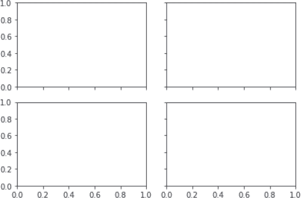

## 第二十一章：**解密 MATPLOTLIB**


即使在 Python 中有大量的绘图包可供选择，Matplotlib 依然脱颖而出。它于 2003 年推出，旨在为科学和工程提供类似 MATLAB 的绘图接口，现在它已经主导了 Python 中的绘图工作。它催生了许多可视化扩展包，如 seaborn，并为像 pandas 这样的流行分析工具提供了底层绘图功能。掌握 Matplotlib 后，你可以快速生成简单的图表，也能制作复杂的精致图表，同时控制显示的每一个细节。

Matplotlib 库已随 Anaconda 预安装。得益于其成熟、流行和开源的特点，它拥有一个庞大的支持社区，随时为你提供建议和代码示例。最好的资源是著名的 Matplotlib 画廊（*[`matplotlib.org/stable/gallery/index.html`](https://matplotlib.org/stable/gallery/index.html)*），它包含了制作几乎所有你能想象到的图表的代码“食谱”。

就像任何强大的软件一样，Matplotlib 有时被一位作者形容为“语法上乏味”。最简单的图表很容易制作，但难度很快上升。尽管像 Matplotlib 画廊这样的资源提供了有用的代码示例，但如果你需要一些与提供的示例稍有不同的内容，可能会让你一头雾水。事实上，许多人通过复制和粘贴他人的代码，然后在边缘进行修改，直到得到他们想要的效果。正如一位用户曾告诉我：“无论我用多少次 Matplotlib，它总是让我感觉像是第一次使用！”

幸运的是，通过花时间学习一些 Matplotlib 的关键要素，你可以大大减轻这种困扰。因此，在本章中，我们将研究 Matplotlib 图表的基础，包括它的两个绘图接口和制作多面板、动画以及自定义图表的方法。有了这些知识，你可能会发现 Matplotlib 是一个值得掌握的工具，而不是一个需要回避或勉强使用的工具。

然而，如果你不打算成为绘图高手，可以查看下一章中更简单的 seaborn 包装器。如果 seaborn 对你来说过于复杂，还有一个更简单——虽然灵活性较低——的 pandas 绘图选项。

### **图表的结构**

理解 Matplotlib 的第一步是掌握其图表中使用的有时令人困惑的术语。为此，让我们解析一个图表及其组成部分。

Matplotlib 中的图表保存在一个 `Figure` 对象中（见 图 19-1 左侧）。这是一个空白画布，代表所有图表元素的最顶层容器。除了提供绘制图表的画布外，`Figure` 对象还控制图表的大小、长宽比、多个图表在同一画布上的间距，以及将图表输出为图像的功能。


*图 19-1：Matplotlib 图表中的 Figure、Axes 和 Axis 组件*

图表本身——也就是你我认为的*图形*——由 `Axes` 类表示（图 19-1，中央）。这个类包括大多数图形*元素*，如线条、多边形、标记（点）、文本、标题等，以及作用*于*它们的方法。它还设置坐标系统。一个 `Figure` 可以包含多个 `Axes` 对象，但每个 `Axes` 对象只能属于一个 `Figure`。

`Axes` 对象不应与表示图表中 x 轴或 y 轴上数值的 `Axis` 元素混淆（图 19-1，右）。这包括刻度线、标签和坐标范围。所有这些元素都包含在 `Axes` 类中。

图 19-1 中的每个组件都存在于一个层级结构中（图 19-2）。最底层包括图 19-1 中的元素，如每个坐标轴、坐标轴刻度线和标签，以及曲线（`Line2D`）。最高层是 `Figure` 对象，它作为所有下层元素的容器。


*图 19-2：在图 19-1 中，图表组件的层级结构*

因为一个 `Figure` 对象可以包含多个 `Axes` 对象，你可以在图 19-2 中让多个 `Axes` 对象指向同一个 `Figure`。一个常见的例子是子图，其中一个 `Figure` 画布包含两个或更多不同的图表并排显示。

### **pyplot 和面向对象的方法**

Matplotlib 有两种主要的绘图接口。使用第一种接口，称为*pyplot 方法*，你依赖 Matplotlib 的内部 `pyplot` 模块*自动*创建和管理 `Figure` 和 `Axes` 对象，然后使用 `pyplot` 方法进行绘图。这种方法主要用于处理单个图表，减少了你需要了解和编写的代码量。它是一个类似 MATLAB 的 API，非常适合快速交互式工作。

使用第二种方法，即*面向对象风格*，你*显式地*创建 `Figure` 和 `Axes` 对象，然后在这些对象上调用方法。这种方法让你对定制图表和在大型程序中跟踪多个图表有最好的控制权。如果你首先创建一个 `Axes` 对象，理解与其他库的交互也会更容易。

在接下来的章节中，我们将讨论这两种方法。然而，根据 Matplotlib 文档，为了保持一致性，你应该*选择一种方法并坚持使用*。他们建议使用面向对象风格，特别是对于复杂的图表以及那些作为更大项目一部分需要重用的方法和脚本。

其实可以说，初学者觉得 Matplotlib 难以掌握的一个原因是他们在现有代码中看到这些方法的混合，例如在像 Stack Overflow 这样的问答网站上。由于这种情况是不可避免的，我建议你通读这两种方法的描述，这样你就可以做出明智的选择，并且在遇到遗留代码或教程时，能够了解另一种方法。

### **使用 pyplot 方法**

为了使用 `pyplot` 方法生成一个简单的图表，让我们使用 Jupyter Qt 控制台。在基础环境中打开 Anaconda 提示符（在 Windows 中）或终端（在 macOS 或 Linux 中）来启动控制台。

首先，运行以下命令（如果你的提示符中包括“base”，可以忽略这个命令）：

```py
conda activate base
```

接下来，输入以下内容：

```py
jupyter qtconsole
```

现在，将 Matplotlib 的 `pyplot` 模块导入到控制台中。为了方便起见，并且根据惯例，你应该使用别名 `plt`：

```py
In [1]: import matplotlib.pyplot as plt
```

默认情况下，控制台中的绘图会显示为*内联*（即在控制台内）。为了启用图表交互功能，比如缩放和平移，可以使用魔法命令`%matplotlib qt`。之后的图表将在外部 Qt 窗口中呈现，并附带一个工具栏。要恢复内联绘图，请使用魔法命令`%matplotlib inline`。

**注意**

*在 Jupyter Notebook 中，你还可以使用 `%matplotlib notebook` 来启用单元格内交互。这可能会导致绘图时出现一些延迟，因为渲染是在服务器端完成的。*

现在，导入 NumPy 并使用它生成一个简单的 1D 数组用于绘图：

```py
In [2]: import numpy as np

In [3]: data = np.arange(5, 10) In [4]: data
Out[4]: array([5, 6, 7, 8, 9])
```

要绘制数据，将其传递给命名恰当的 `plot()` 方法：

```py
In [5]: plt.plot(data);
```

行尾的分号抑制了`Figure`对象名称的显示，而这个名称并不需要。你现在应该能在控制台看到图 19-3。


*图 19-3：一个简单的自动生成的线性图*

有两点需要注意：在代码中我们没有显式地引用 `Figure` 或 `Axes` 对象，因为 `pyplot` 在幕后处理了这些问题。我们也没有指定要在图中显示哪些元素，包括沿 x 轴和 y 轴显示的刻度和数值。相反，Matplotlib 根据你的数据智能地选择了你需要的图表类型并进行了注解。

按照这种方式，`plot()` 方法绘制折线图，`scatter()` 绘制散点图，`bar()` 绘制条形图，`hist()` 绘制直方图，`pie()` 绘制饼图，等等。我们将在接下来的章节中深入了解这些内容，你也可以访问 *[`matplotlib.org/stable/plot_types/index`](https://matplotlib.org/stable/plot_types/index)*。

这些方法的自动化特性在您想快速探索数据集时非常有用，但生成的图形通常过于简单，不适合用于演示或报告。一个问题是，像`plt.plot()`这样的默认方法假设您希望每个坐标轴的大小与输入数据的范围相匹配（例如，当数据仅限于 5 到 8 之间时，x 轴范围从 5 到 8，而不是从 0 到 10）。它还假设您不需要图例、标题或坐标轴标签，并且希望线条和标记绘制为蓝色。实际情况并非总是如此，因此 `pyplot` 提供了许多方法来为图表添加标题、坐标轴标签、网格等内容。接下来，我们将查看这些方法。

#### ***使用 pyplot 方法创建和操作图形***

尽管被认为比面向对象的风格更简单，`pyplot` 仍然可以生成一些非常复杂的图形。为了演示这一点，让我们使用一些 `pyplot` 方法创建一个比 图 19-3 中展示的图形更复杂的图形。

*悬链线*是链条在两端悬挂时所呈现的形状。这是一种在自然和建筑中常见的形状，例如风压下的方形帆和密苏里州圣路易斯的著名拱门。您可以通过在控制台窗口中输入以下代码来生成悬链线，其中 `cosh(x)` 表示 `x` 值的双曲余弦：

```py
In [6]: import numpy as np

In [7]: x = np.arange(-5, 5, 0.1)

In [8]: y = np.cosh(x)
```

现在，让我们使用宽度为 3 的黑色线条绘制悬链线，并添加标题、坐标轴标签、坐标轴值的限制以及背景网格。在前六行代码之后，务必按下 CTRL-ENTER，以防止图形过早生成。最后一行之后，您可以按下 ENTER。

```py
In [9]: plt.title('A Catenary')
   ...: plt.xlabel('Horizontal Distance')
   ...: plt.ylabel('Height')
   ...: plt.xlim(-8, 8)
   ...: plt.ylim(0, 60)
   ...: plt.grid()
   ...: plt.plot(x, y, lw=3, color='k');
```

对于线条颜色，`'k'` 是“黑色”的单字符简写符号。您可以在 *[`matplotlib.org/stable/tutorials/colors/colors.html`](https://matplotlib.org/stable/tutorials/colors/colors.html)* 查看更多颜色选择，并在 *[`matplotlib.org/stable/api/_as_gen/matplotlib.pyplot.plot.html`](https://matplotlib.org/stable/api/_as_gen/matplotlib.pyplot.plot.html)* 上查看 `plot()` 的更多参数。您的输出应该如下所示：图 19-4。

在 Matplotlib 中，渲染在图形画布上的元素，例如标题、图例或线条，称为 `Artist` 对象。标准的图形对象，如矩形、圆形和文本，称为 *原始* `Artist`。保存这些原始对象的容器，如 `Figure`、`Axes` 和 `Axis` 对象，称为 *容器* `Artist`。


*图 19-4：悬链线的线图*

一些常用的 `pyplot` 方法用于制作图形和操作 `Artists`，列在 表 19-1 和 19-2 中。要查看完整列表，请访问 *[`matplotlib.org/stable/api/pyplot_summary.html`](https://matplotlib.org/stable/api/pyplot_summary.html)*。点击此在线列表中的方法名称将跳转到有关方法参数和示例应用的详细信息。要了解有关 `Artists` 的更多内容，请访问 *[`matplotlib.org/stable/tutorials/intermediate/artists.html`](https://matplotlib.org/stable/tutorials/intermediate/artists.html)*。

**表 19-1：** 创建图形的常用 `pyplot` 方法

| **方法** | **描述** | **示例** |
| --- | --- | --- |
| `bar` | 制作条形图 | `plt.bar(x, height, width=0.8)` |
| `barh` | 制作水平条形图 | `plt.barh(x, height)` |
| `contour` | 绘制等高线图 | `plt.contour(X, Y, Z)` |
| `contourf` | 绘制填充的等高线图 | `plt.contourf(X, Y, Z, cmap='Greys')` |
| `hist` | 制作二维直方图 | `plt.hist(x, bins)` |
| `pie` | 显示饼图 | `plt.pie(x=[8, 80, 9], labels=['A', 'B', 'C'])` |
| `plot` | 绘制数据线/标记 | `plt.plot(x, y, 'r+') # 红色交叉点` |
| `Polar` | 制作极坐标图 | `plt.polar(theta, r, 'bo') # 蓝色点` |
| `Scatter` | 绘制散点图 | `plt.scatter(x, y, marker='o')` |
| `stem` | 绘制到 y 坐标的垂直线 | `plt.stem(x, y)` |

**表 19-2：** 操作图形的常用 `pyplot` 方法

| **方法** | **描述** | **示例** |
| --- | --- | --- |
| `annotate` | 向 `Axes` 添加文本和箭头 | `plt.annotate('text', (x, y))` |
| `axis` | 设置坐标轴属性（最小值，最大值） | `plt.axis([xmin, xmax, ymin, ymax])` |
| `axhline` | 添加一条水平线 | `plt.axhline(y_loc, lw=5)` |
| `axvline` | 添加一条垂直线 | `plt.axvline(x_loc, lw=3, c='red')` |
| `close` | 关闭图形 | `plt.close()` |
| `draw` | 如果交互模式关闭，则更新 | `plt.draw()` |
| `figure` | 创建或激活一个图形 | `plt.figure(figsize=(4.0, 6.0))` |
| `grid` | 添加网格线 | `plt.grid()` |
| `imshow` | 将数据显示为图像 | `pic = plt.imread('img.png')``plt.imshow(pic, cmap='gray'))` |
| `legend` | 在坐标轴上放置图例 | `plt.plot(data, label='Data')``plt.legend()` |
| `loglog` | 对每个轴使用对数刻度 | `plt.loglog()` |
| `minorticks_off` | 移除坐标轴的次刻度 | `plt.minorticks_off()` |
| `minorticks_on` | 显示坐标轴上的次刻度 | `plt.minorticks_on()` |
| `savefig` | 保存为 *.jpg*, *.png*, *.pdf* 等格式 | `plt.savefig('filename.jpg')` |
| `semilogx` | 对 x 轴使用对数刻度 | `plt.semilogx()` |
| `semiology` | 对 y 轴使用对数刻度 | `plt.semilogy()` |
| `set_cmap` | 设置颜色映射 | `plt.set_cmap('Greens')` |
| `show` | 在终端或交互模式关闭时显示图形 | `plt.show()` |
| `subplot` | 在图形上创建子图 | `plt.subplot(nrows, ncols, index)` |
| `text` | 向`Axes`中添加文本 | `plt.text(x, y, 'text')` |
| `tight_layout` | 调整子图间的填充 | `plt.tight_layout(pad=3)` |
| `title` | 向`Axes`添加标题 | `plt.title('text')` |
| `xkcd` | 打开 xkcd 草图风格* | `plt.xkcd()` |
| `xlabel` | 设置 x 轴标签 | `plt.xlabel('text')` |
| `xlim` | 设置 x 轴限制 | `plt.xlim(xmin, xmax)` |
| `xticks` | 设置刻度信息 | `plt.xticks([0, 2], rotation=30)` |
| `ylabel` | 设置 y 轴标签 | `plt.ylabel('text')` |
| `ylim` | 设置 y 轴限制 | `plt.ylim(ymin, ymax)` |
| `yticks` | 设置刻度信息 | `plt.yticks([0, 2], rotation=30)` |
| *为了最佳效果，应安装 Humor Sans 字体。 |

请注意，表格中的代码示例代表简单的情况。大多数方法接受多个参数，使你可以精细调整图表的属性，如字体样式和大小、线宽和颜色、旋转角度、爆炸视图等（参见*[`matplotlib.org/stable/api/pyplot_summary.html`](https://matplotlib.org/stable/api/pyplot_summary.html)*）。

#### ***与子图的工作***

到目前为止，我们一直在处理单个图形，但有时你可能希望将两个图表并排比较，或者将多个图表打包成一个汇总显示。在这些情况下，Matplotlib 提供了`subplot()`方法。

要了解这个是如何工作的，我们首先生成两条不同的正弦波数据：

```py
In [10]: time = np.arange(-12.5, 12.5, 0.1)

In [11]: amplitude = np.sin(time)

In [12]: amplitude_halved = np.sin(time) / 2
```

比较这些波形的一种方法是将它们绘制在同一个`Axes`中，如下所示：

```py
In [13]: plt.plot(time, amplitude, label='sine1')
    ...: plt.plot(time, amplitude_halved, lw=3, ls='--', label='sine2')
    ...: plt.legend();
```

这会产生图 19-5 中的输出。默认情况下，曲线在 Qt 控制台中使用不同的颜色绘制，但因为这是一本黑白书籍，我们使用了不同的线宽（`lw`）和线条样式（`ls`）来区分`amplitude_halved`数据和`amplitude`数据。`plt.plot()`中的`label`参数也允许使用图例。有关标记和线条样式的字符列表，请访问*[`matplotlib.org/stable/api/_as_gen/matplotlib.pyplot.plot.html`](https://matplotlib.org/stable/api/_as_gen/matplotlib.pyplot.plot.html)*。


*图 19-5：两条正弦波绘制在同一个 Axes 对象中*

如果你要比较的曲线多于几条，单个图表可能会变得混乱，难以阅读。在这种情况下，你可能希望使用由`subplot()`方法创建的独立堆叠图表。图 19-6 描述了此方法的语法，其中四个子图（`Axes`）被放置在同一个`Figure`容器中。


*图 19-6：理解 subplot()方法*

子图将按网格排列，传递给`subplot()`方法的前两个参数指定该网格的尺寸。第一个参数表示网格的行数，第二个参数表示列数，第三个参数是*活动*子图的索引（在图中以灰色高亮显示）。

活动子图是你在调用像 `plot()` 或 `scatter()` 这样的函数时当前正在绘制的子图。与 Python 中的大多数情况不同，索引从 1 开始，而不是 0。

Matplotlib 使用一个名为 *当前图形* 的概念来追踪当前正在绘制的 `Axes`。例如，当你调用 `plt.plot()` 时，`pyplot` 会创建一个新的“当前图形” `Axes` 来绘制。这就是为什么在控制台工作时你必须按 CTRL-ENTER。一旦按下 ENTER，图形就完成了，一个新的“当前图形”会被排队。当你处理多个子图时，`index` 参数告诉 `pyplot` 哪个子图代表“当前图形”。

**注意**

*为了方便起见，你不需要在 subplot() 参数中使用逗号。例如，plt.subplot(223) 和 plt.subplot(2, 2, 3) 效果相同，尽管前者的可读性较差。*

现在，让我们将正弦波绘制为两个独立的堆叠图。过程是调用 `subplot()` 方法并修改其活动子图参数，以更改当前子图。对于每个当前子图，`plot()` 方法会将该子图特定的数据绘制出来，如下所示：

```py
In [14]: plt.subplot(2, 1, 1)
    ...: plt.plot(time, amplitude, label='sine1')
    ...: plt.legend(loc='upper right')
    ...: 
    ...: plt.subplot(2, 1, 2)
    ...: plt.ylim(-1, 1)
    ...: plt.plot(time, amplitude_halved, label='sine2')
    ...: plt.legend(loc='best');
```

请注意，如果你没有设置第二个图的 `y` 限制，`pyplot` 会自动缩放图形，使两个子图看起来相同。因为我们使用 `ylim()` 方法手动设置了缩放，所以可以清楚地看到第二个正弦波的振幅是第一个的一半（图 19-7）。


*图 19-7：正弦波显示在两个水平子图中*

这些图形看起来有点拥挤。让我们通过调用 `tight_layout()` 方法并传递一个 `pad` 值来为它们腾出一些空间。`pad` 值越大，子图之间的间隔就越大，但也有一个最大限制。还可以使用其他参数来微调显示；例如，使用 `h_pad` 和 `w_pad` 来调整相邻子图之间边缘的高度和宽度。

使用方向键调出前一个代码，并添加 `tight_layout()` 方法，如下所示：

```py
In [15]: plt.subplot(2, 1, 1)
    ...: plt.plot(time, amplitude, label='sine1')
    ...: plt.legend(loc='upper right')
    ...: 
    ...: plt.subplot(2, 1, 2)
    ...: plt.ylim(-1, 1)
    ...: plt.plot(time, amplitude_halved, label='sine2')
    ...: plt.legend(loc='best')
    ...: 
    ...: plt.tight_layout(pad=2)
```

这将生成图形 图 19-8。现在可以清楚地看到哪个 x 轴对应哪个子图。


*图 19-8：调用 tight_layout() 后的结果*

你刚刚看到 `subplot()` 方法如何让你将一个图形细分为不同的绘图区域，并将绘图命令集中在单个子图上。为了帮助你管理更复杂的图形，Matplotlib 提供了 `GridSpec` 类，我们接下来会了解它。

**测试你的知识**

1. `Axes` 对象表示：

a. 绘图的 x、y 和 z 轴

b. 绘图的单独元素，例如标题和图例

c. 单个图形元素的容器

d. 一个空白画布

2.  对还是错：对于复杂的图形，以及那些打算作为更大项目的一部分进行重用的方法和脚本，Matplotlib 文档建议你使用面向对象的风格。

3.  哪段代码生成一个宽 4 列高 3 行的子图网格，并激活第二个子图？

a.  `plt.subplot(3, 4, 1)`

b.  `plt.subplots(3, 4, 2)`

c.  `plt.subplot(4, 3, 2)`

d.  `plt.subplot(342)`

4.  `%matplotlib qt`魔法命令用于：

a.  在控制台中启用图形显示

b.  允许在 Jupyter Notebook 中进行交互式图形操作

c.  打开一个具有交互控件的外部窗口

d.  在使用外部窗口后恢复内联图形

5.  使用以下数据创建一个火箭高度的 Python 字典：Atlas: 57, Falcon9: 70, Saturn V: 111, Starship: 120。绘制一个柱状图，y 轴标注为米单位，并将柱宽设置为 0.3。

#### ***使用 GridSpec 构建多面板显示***

`matplotlib.gridspec`模块包含一个`GridSpec`类，允许你将一个`Figure`划分为多个子区域。这有助于你创建具有不同宽度和高度的子图。最终的*多面板*显示对于在演示和报告中总结信息非常有用。

##### **构建火星多面板显示**

让我们通过一个例子来操作：假设你正在研究火星上的一个古老湖床。你想总结一些关于赤铁矿、菱铁矿和黄铁矿的发现，这三种铁矿物与水环境有关。你已经草拟了一个汇编图的布局（图 19-9），现在你想用 Matplotlib 来创建它。


*图 19-9：火星研究汇总图的草图（由表 19-2 中的 xkdc()方法生成）*

**注意**

*如果你想保存代码，你可以在 Spyder 文本编辑器或 Jupyter Notebook 中创建这个项目，而不是在控制台中。你已经在第四章、第五章和第六章的这些应用程序中使用过 Matplotlib。如果你在 Jupyter Notebook 中工作，所有定义图形的代码应该包含在同一个单元格内。*

首先，如果你还没有这样做，导入 NumPy 和 Matplotlib：

```py
In [16]: import numpy as np

In [17]: import matplotlib.pyplot as plt
```

现在，调用`GridSpec`来创建一个 3×3 的网格，并将结果对象赋值给名为`gs`的变量，代表*网格规范*。在控制台中，输入此语句后，使用 CTRL-ENTER，我们将开始定义子图：

```py
In [18]: gs = plt.GridSpec(3, 3)
```

上述代码创建了一个包含三行三列的网格。要将子图放置在此网格中，你需要索引`gs`对象。与`subplot()`方法不同，索引从 0 开始，而不是从 1 开始。

图 19-10 展示了子图位置及其网格索引。要放置左上角的子图（用于展示直方图，如图 19-9 所示），使用 `gs[0, :2]`。这表示第一行 `[0]` 和第一、第二列 `[:2]`，因此该子图跨越第一行的前两列。同样，`gs[:2, 2]` 跨越第三列的前两行，而 `gs[2, 1]` 将子图放置在第三行的中间。


*图 19-10：带有网格规格索引标注的图 19-9 草图子图*

在构建总结图中的子图之前，您需要使用图 19-10 中的索引指定它的网格位置。现在我们为直方图做这个操作。由于我们没有真实的火星数据，因此我们将使用从正态分布中抽取的虚拟数据集（使用 NumPy 的 `random.normal()` 方法）：

```py
   ...: 
   ...: plt.subplot(gs[0,:2])
   ...: plt.title('Goethite Distribution Location 1')
   ...: plt.hist(np.random.normal(0.22, 0.02, size=500), bins=5)
   ...:
```

`np.random.normal()` 方法的参数包括均值、标准差和从正态分布中抽取的样本数。`plt.hist()` 方法使用这个输出，以及直方图的分箱数。

这将生成图 19-11 中的图表，尽管直到整个绘图完成之前，你是看不到这个图的。由于直方图数据是随机生成的，因此你的视图可能与此略有不同。


*图 19-11：直方图子图*

接下来，我们将在直方图下方构建等高线图。请注意，我们可以按照任何顺序构建子图，但遵循逻辑顺序可以让后续修改代码时更容易。像往常一样，首先通过 `plt.subplot()` 定位子图在网格上的位置：

```py
   ...: plt.subplot(gs[1, :2])
   ...: plt.title('Goethite Concentration Location 1')
   ...: plt.text(1.3, 1.6, ➊ 'o--Sample A')
   ...: x, y = np.arange(0, 3, 0.1), np.arange(0, 3, 0.1)
   ...: X, Y = ➋ np.meshgrid(x, y)
   ...: Z = np.absolute(np.cos(X * 2 + Y) * 2 + np.sin(Y + 3))
   ...: plt.contourf(X, Y, Z, cmap='Greys')
   ...: plt.colorbar() 
   ...:
```

为了演示如何在图形上放置文本，添加一个标注，标明样本 A ➊ 的位置。使用的 `text()` 方法至少需要 x, y 坐标和文本字符串。字符串中的圆圈和线条部分（`o--`）表示指向样本位置的指针。`text()` 方法还有许多其他参数，包括 `fontsize`、`color` 和 `rotation` 等。

接下来，使用 NumPy 生成一些虚拟坐标和 *网格网格* ➋。`meshgrid()` 方法基于给定的两个一维数组创建一个矩形网格，这些数组表示笛卡尔坐标或矩阵索引。通过这个网格，我们可以使用一个方程生成相应的 `Z` 值。调用 `pyplot` 的 `contourf()` 方法并传入坐标和灰度色图，可以生成填充的等高线图。最后，展示色标。

这段代码将生成类似于图 19-12 所示的地图。如果你想让它更炫酷，可以使用箭头艺术家指向样本位置（请参见 *[`matplotlib.org/stable/tutorials/text/annotations.html#annotating-with-arrow/`](https://matplotlib.org/stable/tutorials/text/annotations.html#annotating-with-arrow/)*）。


*图 19-12：等高线图子图*

接下来，我们将生成图 19-9 右上角的散点图。这将绘制位置 1 的赤铁矿浓度与菱铁矿浓度的关系。首先分配网格位置，然后添加标题以及 x 轴和 y 轴的标签。

```py
   ...: plt.subplot(gs[:2, 2])
   ...: plt.title('Loc1 Goe-Hem Ratio')
   ...: plt.xlabel('Hematite mg')
   ...: plt.ylabel('Goethite mg')
   ...: plt.scatter(np.random.normal(3, 1, 30), np.random.uniform(1, 30, 30))
   ...:
```

要生成散点图，你需要将`plt.scatter()`方法传递一个 x、y 值的序列。在本例中，我们将使用 NumPy 的正态分布和均匀分布方法随机生成这些值。对于正态分布方法，参数是均值、标准差和抽样数量。对于均匀分布方法，参数分别表示低值和高值以及抽样数量。

这最终会生成图 19-13 中的子图。同样，由于数据是随机生成的，每个散点图都会看起来不同。

**注意**

*对于包含几千个数据点以上的数据集，将标记类型传递给 plt.plot()比使用 plt.scatter()更高效。原因是 plt.plot()将点渲染为克隆，而 plt.scatter()则单独渲染每个点，以便调整标记的大小以反映数据值或区分数据集。*


*图 19-13：散点图子图*

现在，让我们构建三个饼图，记录样本 A、B 和 C 中赤铁矿、菱铁矿和黄铁矿的百分比。我们将这些饼图沿汇总图的底部排列。

每个饼图将使用相同的扇区标签（表示图表中的类别），因此这些标签应在一开始就分配，以避免重复代码。此外，我们将使用`plt.pie()`方法的`explode`参数来分开饼图的扇区。为了指定扇区之间的间隙大小，我们将使用一个名为`explode`的列表，该列表通过稍微将黄铁矿扇区从其余部分拉出，来突出显示它：

```py
    ...: labels = 'Goethite', 'Hematite', 'Jarosite'
    ...: explode = [0.1, 0.1, 0.2]
    ...:
```

要制作饼图，需要将`plt.pie()`方法传递`labels`（表示图表中的类别）、`sizes`（表示每个类别的百分比）和`explode`列表：

```py
   ...: plt.subplot(gs[2, 0])
   ...: plt.title('Sample A')
   ...: sizes = [35, 55, 10]
   ...: plt.pie(sizes, labels=labels, explode=explode)
   ...: 
   ...: plt.subplot(gs[2, 1])
   ...: plt.title('Sample B')
   ...: sizes = [35, 45, 20]
   ...: plt.pie(sizes, labels=labels, explode=explode)
   ...: 
   ...: plt.subplot(gs[2, 2])
   ...: plt.title('Sample C')
   ...: sizes = [35, 35, 30]
   ...: plt.pie(sizes, labels=labels, explode=explode)
   ...:
```

通过调用`tight_layout()`方法来完成图形，以在子图之间添加一些间距。完成此最后一行后，如果你在控制台中，按 ENTER 或 SHIFT-ENTER 生成最终的多面板图形，你可以在图 19-14 中查看它。

```py
    ...: plt.tight_layout();
```


*图 19-14：最终的多面板汇总图*

由于`GridSpec`，汇总显示包含了跨越多行和多列的子图。

##### **更改子图的宽度和高度**

在某些范围内，你可以设置`GridSpec`生成的行和列的宽度和高度。你可以通过`width_ratios`和`height_ratios`参数来实现，这些参数接受一个数字列表。只有这些数字之间的*比例*才重要。例如，要为我们的 3×3 网格设置每列的宽度比例，`[1, 2, 4]`与`[2, 4, 8]`是等效的。

为了演示，输入以下代码来修改我们的火星多面板显示：

```py
In [19]: widths = [2, 3, 2]

In [20]: heights = [2, 10, 3]
```

`widths`列表处理列宽，从索引 0 开始。`heights`列表则重复这一过程，用于行高。

现在，调出上一节的代码（如果在控制台中，使用箭头键），并编辑`plt.GridSpec`的调用，如下所示：

```py
In [21]: gs = plt.GridSpec(3, 3, width_ratios=widths, height_ratios=heights)
```

重新运行代码，你应该能在图 19-15 中看到图形。注意像是较短的直方图和较高的等高线图等变化。


*图 19-15：具有新行和列宽度及高度的多面板显示*

要了解更多关于`GridSpec`的信息并查看一些示例用法，请访问*[`matplotlib.org/stable/api/_as_gen/matplotlib.gridspec.GridSpec.html`](https://matplotlib.org/stable/api/_as_gen/matplotlib.gridspec.GridSpec.html)*。有关`pyplot`方法的教程，请参阅*[`matplotlib.org/stable/tutorials/introductory/pyplot.html`](https://matplotlib.org/stable/tutorials/introductory/pyplot.html)*。

### **使用面向对象风格**

面向对象的绘图风格通常需要比之前描述的`pyplot`方法更多的代码，但它能让你最大限度地利用 Matplotlib。通过显式创建`Figure`和`Axes`对象，你将能更轻松地控制图形，更好地理解与其他库的交互，创建具有多个 x 轴和 y 轴的图形，等等。

**注意**

*如果你熟悉面向对象编程，你会更欣赏面向对象风格。这个编程范式在第十三章中有详细介绍。*

为了熟悉面向对象风格，我们重新创建图 19-3 中的简单图形。如果你正在使用 Qt 控制台，现在请重新启动它。

不管使用哪种绘图方法，Matplotlib 的`import`语句保持不变：

```py
In [22]: import matplotlib.pyplot as plt

In [23]: import numpy as np
```

现在，使用 NumPy 重新生成数据集：

```py
In [24]: data = np.arange(5, 10)
```

要开始使用面向对象的风格，输入以下内容并在控制台中按 CTRL-ENTER：

```py
In [25]: fig, ax = plt.subplots()
```

一旦在程序中看到这行代码，你就知道你正在处理面向对象风格。`plt.subplots()`方法创建一个`Figure`实例和一组子图（一个`Axes`对象的 NumPy 数组）。如果没有指定子图的数量，默认返回一个子图。因为返回了两个对象，你需要将结果解包到两个变量中，按照约定命名为`fig`和`ax`。记住，在`pyplot`方法中，这两个实体是在幕后创建的。

为了显示图形，添加以下行并按 ENTER：

```py
    ...: ax.plot(data);
```

这将生成与图 19-3 中相同的图形，正如图 19-16 所示。


*图 19-16：使用面向对象风格生成的简单折线图*

因为你将图形分配给了`fig`变量，所以你可以通过简单地在控制台中输入`fig`来重新生成它：

```py
In [26]: fig
```

面向对象的绘图风格其实并不神秘。关键在于将`pyplot`创建的`Figure`和`Axes`对象赋值给变量。你将不再获得`pyplot`的自动化特性，但作为回报，你将打开一扇定制图表的对象属性和方法的大门。

#### ***使用面向对象风格创建和操作图表***

为了更好地理解面向对象风格，让我们用它重新创建《使用 pyplot 方法创建和操作图表》中的悬链线示例，见第 542 页。为了展示该风格的一些增强功能，我们将强制 y 轴穿过图表的中心。

如果你正在使用 Qt 控制台，现在请重新启动内核。然后，导入 NumPy 和 Matplotlib，并重新生成悬链线数据：

```py
In [27]: import numpy as np

In [28]: import matplotlib.pyplot as plt

In [29]: x = np.arange(-5, 5, 0.1)

In [30]: y = np.cosh(x)
```

要创建单个图表，输入以下内容，然后按 CTRL-ENTER（在控制台中）：

```py
In [31]: fig, ax = plt.subplots()
```

接下来，调用`AXES`对象的`set()`方法，并传递关键字参数来设置标题、坐标轴标签和坐标轴范围。这个便捷方法可以让你一次性设置多个属性，而无需为每个属性单独调用特定的方法。你可以使用一行长代码，或者在每个逗号后按 ENTER 键，生成一个更具可读性的垂直堆叠，如下所示：

```py
    ...: ax.set(title='A Catenary', 
    ...:        xlabel='Horizontal Distance', 
    ...:        ylabel='Height',
    ...:        xlim=(-8, 8.1),
    ...:        ylim=(0, 60))
```

现在让我们将 y 轴移动到图表的中心，而不是沿着一侧。在 Matplotlib 中，*脊柱*是连接坐标轴刻度线并标记包含绘制数据区域边界的线。这些脊柱默认位于图表的四周，刻度和标签位于左侧和底部边缘（见图 19-16）。但是，脊柱也可以放置在任意位置。通过面向对象风格，我们可以使用`Spine`子类的`set_position()`方法来实现这一点。

以下代码首先将左侧（y 轴）移动到 x 轴上的 0 值。然后，设置线条宽度为`2`，使得该坐标轴能够稍微从背景网格中突出，背景网格稍后将被使用：

```py
 ...: ax.spines.left.set_position('zero')
 ...: ax.spines.left.set_linewidth(2)
```

以下行通过将颜色设置为无，关闭绘图的右边界：

```py
 ...: ax.spines.right.set_color('none')
```

接下来的三行分别重复此过程，用于底部坐标轴和顶部坐标轴：

```py
 ...: ax.spines.bottom.set_position('zero')
 ...: ax.spines.bottom.set_linewidth(2)
 ...: ax.spines.top.set_color('none')
```

为了完成绘图，添加背景网格并调用绘图方法，传入 x 和 y 数据，将线条宽度设置为`3`，颜色设置为黑色（`'k'`）：

```py
    ...: ax.grid()
    ...: ax.plot(x, y, lw=3, color='k');
```

这将生成图 19-17 中的图表。


*图 19-17：使用面向对象风格构建的悬链线折线图*

如果你省略与坐标轴脊柱相关的代码，你可以使用与`pyplot`方法相同的代码量，重新生成图 19-4 中的图表。因此，面向对象风格的冗长与其能够提供更多功能密切相关，人们通常会利用这一点。

使用 `pyplot` 方法的对象导向风格有等效的方法。不幸的是，方法名称往往不同。例如，`pyplot` 中的 `title()` 在面向对象风格中变为 `set_title()`，`xticks()` 变为 `set_xticks()`。这也是为什么最好选择一种风格并坚持使用它的原因之一。

一些常用的面向对象绘图方法列在表 19-3 中。你还可以在 *[`matplotlib.org/stable/plot_types/index.html`](https://matplotlib.org/stable/plot_types/index.html)* 和本章中 Matplotlib 画廊的第 538 页找到更多方法，如绘制箱形图、小提琴图等。

**表 19-3：** 用于创建图形的有用面向对象方法

| **方法** | **描述** | **示例** |
| --- | --- | --- |
| `bar` | 绘制条形图 | `ax.bar(x, height)` |
| `barh` | 绘制水平条形图 | `ax.barh(x, height)` |
| `contour` | 绘制等高线图 | `ax.contour(X, Y, Z)` |
| `contourf` | 绘制填充的等高线图 | `ax.contourf(X, Y, Z, cmap='Greys')` |
| `hist` | 绘制二维直方图 | `ax.hist(x, bins)` |
| `pie` | 显示饼图 | `ax.pie(x=[8, 80, 9], labels=['A', 'B', 'C'])` |
| `plot` | 绘制数据为线条/标记 | `ax.plot(x, y, 'r+') # 红色叉号` |
| `polar` | 绘制极坐标图 | `fig, ax = plt.subplots(subplot_kw={'projection': 'polar'})``ax.plot(theta, r, 'bo') # 蓝色圆点` |
| `scatter` | 绘制散点图 | `ax.scatter(x, y, marker='o')` |
| `stem` | 绘制垂直线到 y 坐标 | `ax.stem(x, y)` |

处理 `Figure` 和 `Axes` 对象的常见方法列在表 19-4 和表 19-5 中。在很多情况下，这些方法的作用类似于表 19-2 中的 `pyplot` 方法，尽管方法名称可能不同。

**表 19-4：** 用于处理 `Figure` 对象的有用面向对象方法

| **方法** | **描述** | **示例** |
| --- | --- | --- |
| `add_subplot` | 添加或获取 `Axes` | `ax = fig.add_subplot(2, 2, 1)` |
| `close()` | 关闭一个图形 | `plt.close(fig2)` |
| `colorbar` | 向 `Axes` 添加颜色条 | `fig.colorbar(image, ax=ax)` |
| `constrained_layout` | 自动调整子图布局 | `fig, ax = plt.subplots(constrained_layout=True)` |
| `gca` | 获取当前图形中的当前 `Axes` 实例 | `fig.gca()` |
| `savefig` | 保存为 *.jpg*、*.png*、*.pdf* 等格式 | `fig.savefig('filename.jpg')` |
| `set_size_inches` | 设置 `Figure` 的大小（以英寸为单位） | `fig.set_size_inches(6, 4)` |
| `set_dpi` | 设置 `Figure` 的每英寸点数 | `fig.set_dpi(200) # 默认是 100.` |
| `show` | 显示图形，适用于终端运行或当交互模式关闭时 | `plt.show()` |
| `subplots` | 创建带有 `Axes` 的 `Figure` | `fig, ax = plt.subplots(2, 2)` |
| `suptitle` | 向 `Figure` 添加超级标题 | `fig.suptitle('text')` |
| `tight_layout` | 自动调整子图适应 | `fig.tight_layout()` |

**表 19-5：** 操作 `Axes` 对象的有用面向对象方法

| **方法** | **描述** | **示例** |
| --- | --- | --- |
| `annotate` | 向 `Axes` 添加文本和箭头 | `ax.annotate('text', xy=(5, 2))` |
| `axis` | 获取或设置轴的属性 | `ax.axis([xmin, xmax, ymin, ymax])` |
| `axhline` | 添加水平线 | `ax.axhline(y_loc, lw=5)` |
| `axvline` | 添加垂直线 | `ax.axvline(x_loc, lw=3, c='red')` |
| `grid` | 添加网格线 | `ax.grid()` |
| `imshow` | 以图像形式显示数据 | `pic = plt.imread('img.png')``ax.imshow(pic, cmap='gray'))` |
| `legend` | 在 `Axes` 上放置图例 | `ax.plot(data, label='Data')``ax.legend()` |
| `loglog` | 在每个轴上使用对数缩放 | `ax.loglog()` |
| `minorticks_on` | 显示轴的次刻度 | `ax.yaxis.get_ticklocs(minor=True)``ax.minorticks_on()` |
| `minorticks_off` | 移除轴的次刻度 | `plt.minorticks_off()` |
| `semilogx` | 对 x 轴使用对数缩放 | `ax.semilogx()` |
| `semiology` | 对 y 轴使用对数缩放 | `ax.semilogy()` |
| `set` | 一次设置多个属性 | `ax.set(title, ylabel, xlim, alpha)` |
| `set_title()` | 设置 `Axes` 标题 | `ax.set_title('text', loc='center')` |
| `set_xticks()` | 设置 x 轴刻度标记 | `xticks = np.arange(0, 100, 10) ax.set_xticks(xticks)` |
| `set_yticks()` | 设置 y 轴刻度标记 | `yticks = np.arange(0, 100, 10) ax.set_yticks(yticks)` |
| `set_xticklabels` | 在调用 `set_xticks()` 后设置 x 轴标签 | `labels = [a', 'b', 'c', 'd']``ax.set_xticklabels(labels)` |
| `set_yticklabels` | 在调用 `set_yticks()` 后设置 y 轴标签 | `ax.set_yticklabels([1, 2, 3, 4])` |
| `tick_params` | 更改刻度、标签和网格 | `ax.tick_params(labelcolor= 'red')` |
| `twinx` | 创建一个新的 y 轴，和 x 轴共享 | `ax.twinx()` |
| `twiny` | 创建一个新的 x 轴，和 y 轴共享 | `ax.twiny()` |
| `set_xlabel()` | 设置 x 轴标签 | `ax.set_xlabel('text', loc='left')` |
| `set_ylabel()` | 设置 y 轴标签 | `ax.set_ylabel('text', loc='top')` |
| `set_xlim()` | 设置 x 轴的范围 | `ax.set_xlim(-5, 5)` |
| `set_ylim()` | 设置 y 轴的范围 | `ax.set_ylim(0, 10)` |
| `set_xscale()` | 设置 x 轴的尺度 | `ax.set_xscale('log')` |
| `set_yscale()` | 设置 y 轴的尺度 | `ax.set_yscale('linear')` |
| `text` | 向 `Axes` 添加文本 | `ax.text(x, y, 'text')` |
| `xaxis.grid()` | 添加 x 轴网格线 | `ax.xaxis.grid(True, which='major')` |
| `yaxis.grid()` | 添加 y 轴网格线 | `ax.yaxis.grid(True, which='minor')` |

如在 `pyplot` 部分中提到的，这些表格中的代码示例代表的是简单的案例。大多数方法接受多个参数，使您能够微调图表的属性，例如字体样式和大小、线宽和颜色、旋转角度、爆炸视图等。要了解更多内容，请访问 Matplotlib 文档：[`matplotlib.org/`](https://matplotlib.org/)。

#### ***与子图的操作***

与`pyplot`方法类似，面向对象风格支持使用子图（参见第 545 页的“与子图一起工作”）。虽然有多种方法可以将子图分配给`Figure`和`Axes`对象，但`plt.subplots()`方法非常方便，返回一个 NumPy 数组，允许你使用标准索引或使用诸如`axs[0, 0]`或`ax1`之类的唯一名称选择子图。另一个好处是，你可以在绘制任何数据之前预览子图的几何形状。

**注意**

*面向对象方法创建子图的函数是 subplots，而 pyplot 方法使用 subplot。*

调用没有参数的`plt.subplots()`会生成一个空的单一图表（图 19-18）。从技术上讲，这会生成一个 1×1 的`AxesSubplot`对象。

```py
In [32]: fig, ax = plt.subplots()
```


*图 19-18：使用面向对象风格的 subplots()方法生成的空图表*

生成多个子图类似于`plt.subplot()`方法，只是没有用于活动子图的索引参数。第一个参数表示行数；第二个参数表示列数。通常，多个`Axes`被赋予复数形式的名称`axs`，而不是`axes`，以避免与单个`Axes`实例混淆。

传递两个参数给`plt.subplots()`方法可以控制子图的数量及其几何形状。以下代码生成了图 19-19 中所示的 2×2 子图网格，并将两个`AxesSubplot`对象的列表存储在`axs`变量中：

```py
In [33]: fig, axs = plt.subplots(2, 2)
    ...: axs
Out[33]: 
array([[<AxesSubplot:>, <AxesSubplot:>],
         [<AxesSubplot:>, <AxesSubplot:>]], dtype=object)
```


*图 19-19：2×2 排列中的四个子图*

要激活一个子图，你可以使用它的索引。在这个例子中，我们绘制第一行第二个子图，生成图 19-20：

```py
In [34]: fig, axs = plt.subplots(2, 2)
    ...: axs[0, 1].plot([1, 2, 3]);
```


*图 19-20：使用子图索引[0, 1]进行绘图*

或者，你可以通过使用元组拆包来单独命名和存储多个`Axes`的子图。每一行的子图需要放在自己的元组中。然后，你可以使用名称选择子图，而不是使用不易读的索引。以下代码重现了图 19-20：

```py
In [35]: fig, ((ax1, ax2), (ax3, ax4)) = plt.subplots(2, 2)
    ...: ax2.plot([1, 2, 3]);
```

最后，`subplots()`方法还接受其他关键词参数，包括图形关键词，允许你进行一些操作，比如在图表间共享坐标轴、调整图形的大小和布局等（图 19-21）：

```py
In [36]: fig, axs = plt.subplots(ncols=2, 
    ...:                         nrows=2, 
    ...:                         sharex=True,
    ...:                         sharey=True,
    ...:                         figsize=(6, 4),
    ...:                         tight_layout=True)
```

欲了解更多关于这些关键词的信息，请参阅该方法的文档，地址为 *[`matplotlib.org/stable/api/_as_gen/matplotlib.pyplot.subplots.html`](https://matplotlib.org/stable/api/_as_gen/matplotlib.pyplot.subplots.html)*。



*图 19-21：共享 x 轴和 y 轴的 2×2 子图网格*

#### ***使用 GridSpec 构建多面板显示***

`matplotlib.gridspec`模块（参见“使用 GridSpec 构建多面板显示”部分，见第 549 页）也适用于面向对象的风格。现在让我们使用它来重现图 19-14 中的火星多面板显示。这将让你直接对比`pyplot`方法和面向对象方法的差异。

##### **重建火星多面板显示**

为了重新开始，可以在已打开的控制台中重启内核（**Kernel** ▸ **Restart Current Kernel**）或退出并重新打开控制台。如果是重启，请使用 CTRL-L 清空窗口。在 Jupyter Notebook 中，使用**Kernel** ▸ **Restart & Clear Output**进行重启。

现在，导入 NumPy 和 Matplotlib，并使用`GridSpec`设置一个 3×3 的网格。在控制台中，在`In [39]`这一行后按 CTRL-ENTER，以防止生成图表（在 Notebook 中，使用 ENTER 键）：

```py
In [37]: import numpy as np

In [38]: import matplotlib.pyplot as plt

In [39]: fig = plt.figure()
    ...: gs = fig.add_gridspec(3, 3)
    ...:
```

接下来，构建直方图子图。命名为`ax1`并使用图 19-10 中的网格索引来定位它：

```py
    ...: ax1 = fig.add_subplot(gs[0, :2])
    ...: ax1.set_title(' Goethite Distribution Location 1')
    ...: ax1.hist(np.random.normal(0.22, 0.02, size=500), bins=5)
```

在控制台中继续使用 CTRL-ENTER，构建等高线图，方法如下：

```py
    ...: ax2 = fig.add_subplot(gs[1, :2])
    ...: ax2.set_title('Goethite Concentration Location 1')
    ...: ax2.annotate('o--Sample A', xy=(1.3, 1.6))
    ...: x, y = np.arange(0, 3, 0.1), np.arange(0, 3, 0.1)
    ...: X, Y = np.meshgrid(x, y)
    ...: Z = np.absolute(np.cos(X * 2 + Y) * 2 + np.sin(Y + 3))
    ...: contour_map = ax2.contourf(X, Y, Z, cmap='Greys')
    ...: fig.colorbar(contour_map)
    ...:
```

接下来，我们将构建显示区域右上角的散点图：

```py
    ...: ax3 = fig.add_subplot(gs[:2, 2])
    ...: ax3.set_title('Loc1 Goe-Hem Ratio')
    ...: ax3.set_xlabel('Hematite mg')
    ...: ax3.set_ylabel('Goethite mg')
    ...: ax3.scatter(np.random.normal(3, 1, 30), 
    ...:                np.random.uniform(1, 30, 30))
    ...:
```

添加饼状图楔形标签和楔形之间间隙的代码。这减少了代码重复，因为这些变量对于所有图表都是相同的：

```py
     ...: labels = 'Goethite', 'Hematite', 'Jarosite'
    ...: explode = [0.1, 0.1, 0.2]
    ...:
```

完成所有图表后，调用`Figure`对象的`tight_layout()`方法，以防止图表彼此重叠。在控制台中按 ENTER 或 SHIFT-ENTER 生成显示效果，在 Jupyter Notebook 中按 CTRL-ENTER：

```py
    ...: ax4 = fig.add_subplot(gs[2, 0])
    ...: ax4.set_title('Sample A')
    ...: sizes = [35, 55, 10]
    ...: ax4.pie(sizes, labels=labels, explode=explode)
    ...: 
    ...: ax5 = fig.add_subplot(gs[2, 1])
    ...: ax5.set_title('Sample B')
    ...: sizes = [35, 45, 20]
    ...: ax5.pie(sizes, labels=labels, explode=explode)
    ...: 
    ...: ax6 = fig.add_subplot(gs[2, 2])
    ...: ax6.set_title('Sample C')
    ...: sizes = [35, 35, 30]
    ...: ax6.pie(sizes, labels=labels, explode=explode)
    ...: 
    ...: fig.tight_layout();
```

请注意，`pyplot`方法与对象导向方法的主要区别在于一些方法名称的变化，例如`title()`被替换为`set_title()`，以及使用了子图名称。最终的显示效果应该与图 19-14 一致，唯一的不同可能是在随机生成的数据上有所变化。

要更改子图的宽度和高度，请参阅“更改子图的宽度和高度”部分，见第 554 页。这个任务在两种绘图方法中是一样的。

`matplotlib.gridspec`模块为多面板显示中的子图布局提供了很大的控制能力。然而，正如 Python 中的常见做法一样，完成同一任务有多种方法，接下来我们将介绍其中一种替代方法。

##### **GridSpec 的高级替代方法**

Matplotlib 库提供了一些高级替代方法来替代使用`GridSpec`。例如，使用`subplot_mosaic()`方法，你可以通过逻辑名称（如`upper_left`和`right`）来布局网格。然后你可以使用这些名称来索引`axs`对象，如下所示：

```py
In [40]: fig, axs = plt.subplot_mosaic([['left', 'upper right'],
    ...:                               ['left', 'lower right']],
    ...:                               figsize=(4.5, 3.5),
    ...: tight_layout=True)
    ...: axs['upper right'].set_title('upper right');
```

这将生成图 19-22 中的显示效果。子图会按照`In [40]`中分配的顺序排列。


*图 19-22：使用 plt.subplot_mosaic()方法创建的子图*

要了解更多关于`subplot_mosaic()`和其他多面板选项的信息，请参阅“处理多个图形和坐标轴”部分，访问*[`matplotlib.org/stable/tutorials/introductory/usage.html#sphx-glr-tutorials-introductory-usage-py/`](https://matplotlib.org/stable/tutorials/introductory/usage.html#sphx-glr-tutorials-introductory-usage-py/)*，以及“在图形中排列多个坐标轴”部分，访问*[`matplotlib.org/stable/tutorials/intermediate/arranging_axes.html`](https://matplotlib.org/stable/tutorials/intermediate/arranging_axes.html)*。

#### ***插入图***

*插入*图——即在一个图内插入另一个图——对于展示包围图的某部分的细节、同一数据的不同处理方式、数据的地理位置等非常有用。插图类似于子图，但它采用了不同的构建技术。

要创建插图，首先创建一个`Figure`对象，然后使用`add_axes()`方法将`Axes`添加到其中。请在控制台或笔记本中输入以下代码；如果你已经在当前会话中执行了导入操作，可以忽略导入部分：

```py
In [41]: import numpy as np

In [42]: import matplotlib.pyplot as plt

In [43]: %matplotlib inline

In [44]: x = np.arange(0, 25)

In [45]: y = x**3
```

现在，设置`Figure`和`Axes`对象。在此例中，`ax2`表示插入图：

```py
In [46]: fig = plt.figure()    
    ...: ax1 = fig.add_axes([0, 0, 1.0, 1.0]) 
    ...: ax2 = fig.add_axes([0.1, 0.6, 0.4, 0.3])
    ...:
```

传递给`add_axes()`方法的看似复杂的列表代表了`Axes`的`rect`参数。它定义了矩形`Axes`对象的尺寸。该值的范围从 0 到 1，分别表示矩形的左、下、宽度和高度。

现在创建主图和插图：

```py
    ...: # Main plot
    ...: ax1.plot(x, y, 'k*-')
    ...: ax1.set_xlabel('x')
    ...: ax1.set_ylabel('y')
    ...: 
    ...: # Inset plot
    ...: ax2.plot(x, np.sin(y), 'r*-')
    ...: ax2.set_xlabel('x')
    ...: ax2.set_ylabel('y')
    ...: ax2.set_title('Sine of Y')
```

你应该得到类似图 19-23 所示的图表。


*图 19-23：带有插入图的图表*

#### ***3D 绘图***

尽管 Matplotlib 主要用于 2D 绘图，但它也包括一个`Axes3D`类，支持 3D 散点图、直方图、表面图、等高线图等。以下是一个示例：

```py
In [47]: import numpy as np
    ...: import matplotlib.pyplot as plt 
    ...: 
    ...: z = np.arange(0, 200, 1)
    ...: x = z * np.cos(25 * z)
    ...: y = z * np.sin(25 * z)
    ...: 
 ➊ ...: ax = plt.figure().add_subplot(projection='3d') 
    ...:
    ...: ax.plot(x, y, z, 'black');
```

关键是创建`Axes`对象时传递`projection='3d'`关键字➊。如果你觉得下面这种两行语法更容易理解，也可以使用：

```py
    ...: fig = plt.figure()
    ...: ax = plt.axes(projection ='3d')
```

两者将产生如图 19-24 所示的图表。


*图 19-24：一个 3D 线图*

要了解更多关于 3D 绘图的信息，请访问*[`matplotlib.org/stable/tutorials/toolkits/mplot3d.html`](https://matplotlib.org/stable/tutorials/toolkits/mplot3d.html)*。

#### ***动画图***

科学家通常研究动态现象，如洋流和驯鹿迁徙。无论是基于实际观察还是模拟行为，能够在图表中可视化运动（这一过程叫做*动画*）可以带来深入的洞察，帮助更好地理解这些现象。动画还能够增强演示效果，帮助观众更好地理解你所传达的内容。

正如你所期待的，Matplotlib 提供了多种方式来动画化图表。对于简单的动画，你可以通过在循环中手动更新和绘制变量。为了方便并处理更复杂的动画，你可以使用`matplotlib.animation`模块 (*[`matplotlib.org/stable/api/animation_api.html`](https://matplotlib.org/stable/api/animation_api.html)*).

`animation`模块包含`FuncAnimation`类，它通过重复调用一个函数来动画化一个可视化。`ArtistAnimation`类通过使用固定的一组`Artist`对象（例如预计算的图像列表）来制作动画。通常，`FuncAnimation`更易于使用且效率更高。我们在这里不讨论`ArtistAnimation`。

##### **使用 for 循环动画化图表**

也许最简单的动画化图表的方法是使用`for`循环。让我们尝试使用《处理子图》中的正弦波示例，第 545 页。在控制台中输入以下代码，在第一行后使用 CTRL-ENTER，在最后一行后使用 ENTER：

```py
In [48]: import numpy as np
    ...: import matplotlib.pyplot as plt
 ➊ ...: import time 
 ...: %matplotlib qt
    ...: 
    ...: t = np.arange(-12.5, 12.5, 0.1)
    ...: amplitude = np.sin(t)
    ...: 
    ...: fig, ax = plt.subplots()
 ➋ ...: line, = ax.plot(t, amplitude)
    ...: for i in range(30):
    ...:     updated_amp = np.sin(t + i)
 ➌ ...:    line.set_ydata(updated_amp) 
    ...:     fig.canvas.draw()
    ...:     fig.canvas.flush_events()
    ...:     time.sleep(0.1)
```

开始时，像往常一样导入 NumPy 和 Matplotlib，但这次需要加入标准库的`time`模块 ➊。`time.sleep()`方法将帮助我们稍后控制动画的速度。

我们将在外部 Qt 窗口中展示动画，所以调用`%matplotlib` `qt`魔法命令。如果你在 Jupyter Notebook 中工作，你可以使用`%matplotlib notebook`命令在 notebook 中显示动画。

接下来，重新生成之前的时间（`t`）和`amplitude`数据，然后分配`fig`和`ax`变量。要使用`for`循环动画化图表，你需要在每次循环迭代之前更新显示的数据。因为我们绘制的是一条线，所以需要为图表分配一个`line`变量 ➋。注意`line`后的逗号，这表示这是一个元组解包过程。

开始一个运行 30 次的`for`循环。在每次循环中，通过将循环次数（`i`）添加到 y 数据中，使用方程`np.sin(t + i)`将时间序列向前移动一秒。将结果赋值给`updated_amp`变量。在绘图之前，调用`line`对象的`set_ydata()`方法并传入`updated_amp`变量 ➌。

要更新已经更改但没有自动重绘的`Figure`对象，调用`canvas.draw()`。接着使用`canvas_flush_events()`方法，清除当前图表，以便下一次迭代可以从空白屏幕开始。

最后，调用`time.sleep()`方法并传入`0.1`。这是暂停程序执行的秒数。可以随意调整这个数字，看看它对动画的影响；数字越大，动画进行得越慢。

要运行动画，在控制台中按下 ENTER；在 Jupyter Notebook 中按下 CTRL-ENTER。要返回内联绘图，记得使用`%matplotlib inline`魔法命令。

你也可以通过使用`pyplot`方法来实现这种实时动画。以下是一个示例，我们通过不断更新一个散点图，添加一个通过二次方程计算出的新点。你可以在 Qt 控制台或 Spyder 文本编辑器中运行它：

```py
In [49]: import numpy as np
    ...: import matplotlib.pyplot as plt
    ...: %matplotlib qt
    ...: 
    ...: x = 0 ...: for i in range(30):
    ...:     x = x + 1
    ...:     y = x**2
    ...:     plt.scatter(x, y)
    ...:     plt.title("Quadratic Function")
    ...:     plt.xlabel("x")
    ...:     plt.ylabel("x-squared")
    ...:     plt.pause(0.1)
```

注意使用`plt.pause()`代替`time.sleep()`。`plt.pause()`方法以秒为单位接受一个参数，并在此时间间隔内运行 GUI 事件循环。在暂停之前，活动图形会被更新并显示，暂停期间（如果有）会运行 GUI 事件循环。

当动画运行时，x 轴和 y 轴会自动调整，以适应扩展的绘图范围。当动画完成时，你应该会看到一个如图 19-25 所示的图形。


*图 19-25：完成的 pyplot 动画*

对于复杂的动画，Matplotlib 文档建议使用`matplotlib.animation`模块，而不是使用`for`循环。我们将在接下来介绍这种技术。

##### **使用 FuncAnimation 类进行动画绘图**

`FuncAnimation`类通过重复调用一个函数来制作动画。它提供了一种比上一部分使用的`for`循环方法更正式、更灵活的方式。

让我们使用面向对象的方式在同一个图中为两条线做动画。在控制台或 Jupyter Notebook 中输入以下内容（如果你使用 Notebook，将`%matplotlib qt`魔法命令替换为`%matplotlib notebook`）：

```py
In [50]: import numpy as np
    ...: import matplotlib.pyplot as plt
    ...: from matplotlib.animation import ➊ FuncAnimation
    ...: %matplotlib qt
    ...: 
    ...: x = np.arange(-6, 6, 0.02)
    ...: y = np.sin(2 * x) / x
 ➋ ...: scaler = np.arange(1, 10, 0.1) 
    ...:  
    ...: fig, ax = plt.subplots()
    ...: line1 = ax.plot(x, y, color='k', lw=2) ➌[0]
    ...: line2 = ax.plot(x, y, color='r', ls='--')[0]
    ...: 
    ...: def animate(frame):
    ...:     line1.set_ydata(y / frame)
    ...:     line2.set_ydata(y / frame * -0.2)
    ...: 
    ...: animated = FuncAnimation(fig, animate, frames=scaler, interval=20)
```

从`matplotlib.animation`模块导入`FuncAnimation` ➊。接下来，使用 NumPy 生成一些数据以供绘图。`scaler`数组将使你能够修改`x`和`y`数据，从而在动画运行时打印出不同的内容 ➋。

设置`fig`和`ax`对象，然后为每条线绘制图形，为第一条线设置黑色，为第二条线设置红色。同时，将第一条线的线宽设置为 2，第二条线的线型设置为虚线。

对于两条线，在绘图代码的末尾添加一个零索引`[0]` ➌。`plot`命令返回一系列线条对象，而我们只希望获取序列中的第一个项。这是替代先前部分中用于动画化正弦波的元组解包方法（`line, = ax.plot(t, amplitude)`）的一种方式。

现在是定义一个函数的时候了，这个函数将更新数据以创建动画的每一帧。我们将这个函数命名为`animate`，并给它一个名为`frame`的参数。这个参数的值将是`scalar`数组，该数组通过`FuncAnimation()`类中的`frames`参数传递。

对每条线使用`set_ydata()`方法，并传入由`scaler`数组除以的`y`数据。对于第二条线，将`scaler`乘以一个负的标量，以便`line2`看起来与`line1`不同。

要完成代码，调用`FuncAnimation()`并将`Figure`对象（即它将绘制的`fig`）传递给它，传入用户定义的函数（`animate`），以及`frames`和`interval`参数。`frames`参数代表传递给用户定义函数的每一帧数据的来源。它可以是一个可迭代对象、一个整数、一个生成器函数或`None`。`interval`参数设置每帧之间的延迟时间，单位是毫秒。增大这个数字将使动画变慢。

**注意**

*你可以直接将标量 NumPy 数组赋值给 frames 参数，像这样：FuncAnimation(fig, animate, frames=np.arange(1, 10, 0.1), interval=20)。尽管这去除了对标量变量的需求，但代码的可读性可能变差。*

通过在控制台按 ENTER 键或在 Jupyter Notebook 中按 CTRL-ENTER 来运行代码。你应该会看到两个动画折线图，如图 19-26 所示。要停止动画，请点击图表窗口右上角的**关闭**按钮。否则，在调用`FuncAnimation()`时，将`repeat=False`设置为在动画播放一次后停止。


*图 19-26：功能动画的屏幕截图*

`FuncAnimation()`中的一个可选参数是`fargs`。`fargs`是*功能参数*的缩写，当你的用户定义的函数需要多个参数时，可以使用这个参数。第一个参数总是保留给`FuncAnimation()`中的`frames`参数，但你可以将后续的参数（即在`frames`之后的参数）作为有序的元组传递，例如：

```py
    ...: ani = FuncAnimation(fig, func, frames=param1,fargs=(param2, param3))
```

最后，要将动画保存为.*gif*文件，请使用`save()`方法，并传入可选的每秒帧数（`fps`）和每英寸点数（`dpi`）参数，如下所示：

```py
    ...: animated.save('animation.gif', fps=20, dpi=150)
```

其他支持的文件格式包括*.avi*、*.mp4*、*.mov*，其他保存选项包括`to_html5_video()`和`to_jshtml()`方法。要了解更多关于`FuncAnimation`方法和参数的信息，请访问*[`matplotlib.org/stable/api/_as_gen/matplotlib.animation.FuncAnimation.html`](https://matplotlib.org/stable/api/_as_gen/matplotlib.animation.FuncAnimation.html)*。

### **样式设置**

到目前为止，你已经通过传递新的值来改变图表的默认设置，如线宽或标记颜色。但是如果你想为多个图表*同时*设置这些值，使得所有线条的颜色都是黑色呢？或者如果你想*按顺序循环*显示一组预定义的颜色呢？

好吧，一种做法是使用`RcParams`类的实例在运行时设置参数。该类的名称代表*运行时配置参数*，你可以在笔记本、脚本或控制台中通过`pyplot`方式或面向对象的风格来运行它。它将设置保存在`matplotlib.rcParams`变量中，这是一个类似字典的对象。

有一长串可配置的参数，你可以通过多种方式查看。要查看有效的参数列表，请访问 *[`matplotlib.org/stable/api/matplotlib_configuration_api.html?highlight=rcparams/`](https://matplotlib.org/stable/api/matplotlib_configuration_api.html?highlight=rcparams/)*。要查看有关这些参数的更多详细信息，运行 `import matplotlib as mpl`，然后运行 `print(mpl.matplotlib_fname())`。这将显示你计算机上 *matplotlibrc* 文件的路径，你可以打开并查看该文件。

#### ***更改运行时配置参数***

让我们来看一个 `pyplot` 示例，在这个示例中，我们标准化了图形的大小，使用黑色绘制所有线条，并循环使用两种不同的线条样式。这意味着绘制的第一条线将始终采用某种一致的样式，而第二条线将采用另一种一致的样式。在控制台中输入以下内容：

```py
In [51]: import numpy as np
    ...: import matplotlib.pyplot as plt
    ...: import matplotlib as mpl
    ...: from cycler import cycler
    ...: %matplotlib inline
    ...:
```

在这里需要注意的是，我们将 Matplotlib 导入为 `mpl`。以这种方式导入 Matplotlib 可以让我们访问比仅使用 `pyplot` 模块更多的功能。我们还导入了 `cycler`。`Cycler` 类将让我们在制作多数据图时指定想要循环使用的颜色和其他样式属性。你可以在 *[`matplotlib.org/stable/tutorials/intermediate/color_cycle.html`](https://matplotlib.org/stable/tutorials/intermediate/color_cycle.html)* 中阅读相关内容。

要访问 `rcParams` 中的一个属性，可以像访问字典键一样处理它。你可以通过输入 `mpl.rcParams.keys()` 或访问上一节中列出的来源来查找有效的参数名称。在接下来的三行中，我们设置了图形大小、线条颜色和线条样式：

```py
    ...: mpl.rcParams['figure.figsize'] = (5, 4)
    ...: mpl.rcParams['lines.color'] = 'black'
    ...: mpl.rcParams['axes.prop_cycle'] = cycler('linestyle', ['-', ':'])
    ...:
```

**注意**

*你也可以通过 pyplot 设置参数，使用类似 `plt.rcParams['lines.color'] = 'black'` 的语法。*

要循环使用线条样式，可以使用 `axes.prop_cycle` 键，然后将 `cycler` 工厂函数传递给参数（`'linestyle'`）和样式列表（实线和虚线）。这些默认设置已经为你当前会话中的所有图形重置。

最后，生成一些数据并绘制它：

```py
    ...: x = np.arange(0, 15, 0.1)
    ...: y = np.sin(x)
    ...: 
    ...: plt.plot(x, y)
    ...: plt.plot(x + 1, y - 2);
```

通常，这段代码会生成一个有两条实线的图形，一条蓝色，另一条橙色。然而，现在，你会看到两条黑色的线，通过不同的线条样式区分（图 19-27）。


*图 19-27：使用全局图形大小、线条颜色和线条样式参数构建的图形*

请注意，如果你在之前的图形中绘制 *三* 条线，那么第三条线将回到使用实线样式，你将会看到一条虚线和两条实线。如果你想要三种不同的样式，你需要将额外的样式添加到循环器中。

为了方便，Matplotlib 提供了通过关键字参数同时修改多个设置的函数。以下是一个例子，使用之前的绘图数据，我们首先重置 Matplotlib 的“工厂默认设置”：

```py
In [52]: mpl.rcParams.update(mpl.rcParamsDefault)
    ...:
```

现在，让我们使用 `rc()` 便捷函数将默认的线宽更改为 `5`，并将线条样式设置为点划线：

```py
In [53]: mpl.rc('lines', lw=5, ls='-.')
    ...: plt.plot(x, y);
```

这将生成图表，如 图 19-28 所示。


*图 19-28：使用便捷函数设置的新绘图参数*

如果你只想对特定代码块使用某个样式，样式包提供了一个上下文管理器，限制你的更改仅作用于特定范围。有关详细信息，请参阅“临时样式”部分，链接为 *[`matplotlib.org/stable/tutorials/introductory/customizing.html`](https://matplotlib.org/stable/tutorials/introductory/customizing.html)*。

#### ***创建并使用样式文件***

你可以将 Matplotlib 默认样式的更改保存到文件中。这让你可以为报告或演示文稿标准化图表，并在项目团队中共享这些自定义设置。它还通过让你预设某些图表参数并将其封装在外部文件中，减少了代码冗余和复杂性。

让我们创建一个简单的样式文件，设置图表的一些标准，例如图形大小和分辨率、是否使用背景网格，以及标题、坐标轴标签和刻度标签的字体类型和大小。在 Spyder 文本编辑器或任何文本编辑器中，输入以下内容：

```py
# scientific_style.mplstyle

figure.figsize:    4, 3  # width & height in inches
figure.dpi:        200   # dots per inch
axes.grid:         True
font.family:       Times New Roman
axes.titlesize:    24
axes.labelsize:    20
xtick.labelsize:   16
ytick.labelsize:   16
```

**注意**

*有关创建样式文件的指导，请使用你计算机上的 matplotlibrc 文件，如前所述。你还可以在 [`matplotlib.org/stable/tutorials/introductory/customizing.html`](https://matplotlib.org/stable/tutorials/introductory/customizing.html) 找到一个副本。*

为了让 Matplotlib 容易找到这个文件，你需要将其保存在特定的位置。首先，通过在控制台输入以下命令来找到 *matplotlibrc* 文件的位置：

```py
In [54]: import matplotlib as mpl

In [55]: mpl.matplotlib_fname()
Out[55]: 'C:\\Users\\hanna\\anaconda3\\lib\\site-packages\\matplotlib\\mpl-
data\\matplotlibrc'
```

这会显示你到 *mpl-data* 文件夹的路径，该文件夹包含 *matplotlibrc* 文件和一个名为 *stylelib* 的文件夹等。将你的样式文件保存到 *stylelib* 文件夹中，命名为 *scientific_style.mplstyle*（替换 .*txt* 扩展名）。

**注意**

*如果 Matplotlib 以后无法找到该文件，你可能需要重新启动内核。在控制台中，点击 ***内核*** ▸ ***重新启动当前内核***。在 Jupyter Notebook 中，点击 ***内核*** ▸ ***重新启动***。*

现在，让我们使用这个文件创建一个标准化的图表。在导入 `pyplot` 后，使用其 `style.use()` 方法加载样式文件，*不带* 文件扩展名：

```py
In [56]: import matplotlib.pyplot as plt

In [57]: plt.style.use('scientific_style')
```

接下来，使用面向对象的风格生成一个空白图形。你应该会看到类似于 图 19-29 的图表。

```py
In [58]: fig, ax = plt.subplots()
    ...: ax.set_title('Standardized Title')
    ...: ax.set_xlabel('Standardized X-labels')
    ...: ax.set_ylabel('Standardized Y-labels');
```


*图 19-29：通过样式文件生成的空白标准化图表*

当你保存样式文件时，可能已经注意到 *stylelib* 文件夹中充满了现有的 *mplstyle* 文件。这些文件创建了许多不同的图表格式，你可以查看它们，获取如何编写自己样式文件的线索。在下一节中，我们将使用其中一个文件来覆盖 Matplotlib 的一些默认值。

#### ***应用样式表***

除了让你自定义自己的绘图外，Matplotlib 还提供了可以通过`style.use()`导入的预定义*样式表*。样式表与*matplotlibrc*文件看起来相同，但其中只能设置与实际绘图样式相关的`rcParams`。这使得样式表在不同的机器之间具有可移植性，因为不必担心未安装的依赖项。只有少数`rcParams`不能被重置，你可以查看这些参数的列表，访问 *[`matplotlib.org/stable/api/style_api.html#matplotlib.style.use/`](https://matplotlib.org/stable/api/style_api.html#matplotlib.style.use/)*。

你可以在 *[`matplotlib.org/stable/gallery/style_sheets/style_sheets_reference.html`](https://matplotlib.org/stable/gallery/style_sheets/style_sheets_reference.html)* 上看到可用样式表的示例。这些示例以缩略图条的形式展示，如图 19-30 所示。有些样式表模仿了流行的绘图库，如 seaborn 和 ggplot。


*图 19-30：灰度样式表示例*

**注意**

*一个需要注意的重要样式表是*seaborn-colorblind*样式表。该样式表使用“色盲安全”颜色，专为 5% 到 10% 的色盲人群设计。*

让我们尝试使用与 Matplotlib 一起提供的灰度样式表绘制一个散点图。首先，在控制台或 Jupyter Notebook 中导入 NumPy 和 Matplotlib，然后调用灰度文件：

```py
In [59]: import numpy as np
    ...: import matplotlib.pyplot as plt
    ...: 
    ...: plt.style.use('grayscale')
    ...:
```

现在，生成一些虚拟数据以制作两个不同的点云：

```py
    ...: x = np.arange(0, 20, 0.1)
    ...: noise = np.random.uniform(0, 10, len(x))
    ...: y = x + (noise * x**2)
    ...: y2 = x + (noise * x**3)
    ...:
```

完成后，使用`pyplot`方法设置并执行绘图。为两个坐标轴使用对数刻度。

```py
    ...: plt.title('Grayscale Style Scatterplot')
    ...: plt.xlabel('Log X')
    ...: plt.ylabel('Log Y')
    ...: plt.loglog()
 ➊ ...: plt.scatter(x, y2, alpha=0.4, label='X Cubed') 
    ...: plt.scatter(x, y, marker='+', label='X Squared')
    ...: plt.legend(loc=(1.01, 0.7));
```

你应该能看到类似于图 19-31 中的图形。由于使用了随机生成的数据，点的位置可能会有所不同。


*图 19-31：使用灰度样式表制作的散点图*

注意调用`plt.scatter()`时使用`alpha`关键字➊。`alpha`属性控制透明度，让你调节线条或标记的透明度。值为`1`表示完全不透明。

让一个数据集稍微透明有助于解决*重叠*问题，其中一个数据集的标记会覆盖在其他数据集的标记上，从而遮挡了重叠的标记。半透明标记在叠加时也会变得更暗，这可以帮助你可视化数据密度（例如，图图 19-31 中的黑色圆圈）。

**注意**

*要控制标记的绘图顺序，在调用 plt.scatter() 时使用 zorder 参数（例如 zorder=2）。具有较高 zorder 值的艺术元素会覆盖具有较低值的元素。*

回到我们的样式表：如果你打开*grayscale.mplstyle*，你会发现它看起来很像我们在“创建和使用样式文件”一节中制作的*scientific_style.mplstyle*文件，位于第 576 页。因此，如果现有的样式表不完全适合你的需求，你可以随时复制该文件，进行编辑，然后将其保存为新的样式表！

**测试你的知识**

6. 真还是假：操作脊柱的能力是`pyplot`方法的一个优点。

7. 在图 19-14 的显示中添加总结标题“火星赤铁矿、赤铁矿和针铁矿分布”。使用你喜欢的任何绘图方法。

8. 使用以下代码生成三个数据集以供绘图：`np.random.normal(0, 1, 50).cumsum()`。在一行中生成三个子图，并使用`for`循环将每个子图填充不同的数据集。为每个子图添加独特的标题，并使用黑色交叉标记绘制数据。

9. 使用`np.random.rand(4, 4)`生成一个随机化的二维 NumPy 数组。然后，使用`heat = ax.imshow(data)`绘制热图。使用`for`循环和`range` 30 来使热图动画化。

10. 使用公式`velocity = 9.81 * time`计算自由落体物体的速度。让物体自由下落 15 秒，并且每秒钟在一个单一的图表中显示其位置和速度，使用不同的 y 轴来表示每个数据。

### **总结**

本章的目标是介绍强大的 Matplotlib 绘图库，并（希望）解决其中一些令人沮丧的方面。一个主要的困惑来源是，制作图形有两种主要接口；为了保持一致性，你应该选择一个并坚持使用它。

`pyplot`方法适用于隐式的、“当前激活的”`Figure`和`Axes`对象，其中`Figure`是一个空白画布，而`Axes`包含图形元素，如线条、图例、标题等。为了简化绘图，`pyplot`在幕后创建了这些对象。

`pyplot`方法在互动式使用 Matplotlib 时以及在小型脚本中效果很好，但在构建更大的应用程序时，更推荐使用面向对象的风格。明确地将`Figure`和`Axes`对象赋值给变量将帮助你跟踪多个图表，并确保生成它们的代码尽可能清晰。你还将对某些图形元素有更多的控制。

对于比`pyplot`方法更简单、更自动化的绘图，你可以使用 seaborn 包，它是 Matplotlib 的一个包装器。此外，pandas 数据分析包也为 Matplotlib 提供了封装，使绘图更加简便，但功能相对简单。第十六章中概述了 seaborn 和 pandas 的绘图，我们将在下一章再次讨论它们。

若要进一步学习并掌握高级的 Matplotlib 功能，可以查看官方网页上的教程和用户指南 (*[`matplotlib.org/`](https://matplotlib.org/)*) 以及 Real Python 网站上的相关内容 (*[`realpython.com/python-matplotlib-guide/`](https://realpython.com/python-matplotlib-guide/)*)。你还可以在 *[`matplotlib.org/cheatsheets/`](https://matplotlib.org/cheatsheets/)* 找到有用的备忘单。
