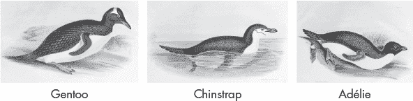

## 第二十二章：PANDAS、SEABORN 和 SCIKIT-LEARN**


一种常见的科学实践是评估数据并利用它来生成预测模型。在本章中，我们将使用 Python 的三个最受欢迎的开源库来解决一个动物分类问题。通过这种基于项目的实践方法，将展示这些库的功能和协同效应，并演示使用 Python 做科学研究的具体过程。

对于数据加载、分析和处理，我们将使用 pandas 包（*[`pandas.pydata.org/`](https://pandas.pydata.org/)*）。pandas 基于 NumPy 和 Matplotlib 构建，虽然底层使用基于数组的计算，但它的语法更简单，使得编写代码和绘图更加快速、容易且更少出错。与原生 Python 不同，pandas 能够智能地读取表格文本文件数据，识别列、行、标题等内容。与 NumPy 不同，pandas 能处理异质数据类型，如文本和数字的混合数据。

我们还将使用 seaborn 库（*[`seaborn.pydata.org/`](https://seaborn.pydata.org/)*），它封装了 Matplotlib，用于生成更具吸引力且更易于理解的可视化图表。它在高度可定制但冗长的 Matplotlib 语法和简单的 pandas 之间提供了一个良好的折衷。更好的是，seaborn 与 pandas 紧密集成，能够无缝地进行绘图和有效的数据探索。

最后，scikit-learn 库（*[`scikit-learn.org/`](https://scikit-learn.org/)*）是 Python 的主要通用机器学习工具包。它提供了分类、回归、聚类、降维、预处理和模型选择的算法。

在接下来的章节中，你将应用这些库来解决一个实际问题，并观察它们如何协同工作。但由于这些库的规模和范围庞大，我们无法深入研究它们。每个库都有专门的书籍，Wes McKinney 的 *《Python 数据分析》* 第二版中关于 pandas 的概述就足足有 270 页，尽管它不是全面的。

如果你想了解完整的内容，我在本章末的“总结”部分列出了一些附加资源。你还可以在之前提到的官方网站上找到有用的教程和示例。

### **介绍 pandas Series 和 DataFrame**

pandas 库包含用于处理常见数据源（如 Excel 表格和 SQL 关系数据库）的数据结构。它的两个主要数据结构是 Series 和 DataFrame。其他库（如 seaborn）则设计用于与这些数据结构良好集成，并提供额外的功能，使得 pandas 成为任何数据科学项目的良好基础。

#### ***Series 数据结构***

*Series* 是一种一维的带标签数组，可以容纳任何类型的数据，例如整数、浮点数、字符串等。由于 pandas 基于 NumPy，因此序列对象本质上是两个关联的数组。一个数组包含数据点的值，可以是任何 NumPy 数据类型；另一个数组包含每个数据点的标签，称为 *索引*（表 20-1）。

**表 20-1：** 一个 Series 对象

| **索引** | **值** |
| --- | --- |
| 0 | 42 |
| 1 | 549 |
| 2 | ' Steve ' |
| 3 | -66.6 |

与 Python 列表项的索引不同，序列中的索引不需要是整数。在 表 20-2 中，索引是元素的名称，而值是它们的原子序数。

**表 20-2：** 一个具有有意义索引的 Series 对象

| **索引** | **值** |
| --- | --- |
| 硅 | 14 |
| 钠 | 11 |
| 氩 | 18 |
| 钴 | 27 |

一个序列的作用类似于 Python 字典，其中索引代表键。因此，它可以在许多场景中作为字典的替代品。另一个有用的特性是，在进行算术操作时，即使标签的顺序不同，不同的序列也会根据索引标签对齐。

与列表或 NumPy 数组类似，你可以通过指定索引来切片一个序列或选择单独的元素。你可以以多种方式操作序列，例如过滤它、对其进行数学运算，或将其与其他序列合并。要查看序列对象的众多属性和方法，请访问 *[`pandas.pydata.org/pandas-docs/stable/reference/api/pandas.Series.html`](https://pandas.pydata.org/pandas-docs/stable/reference/api/pandas.Series.html)*。

#### ***DataFrame 数据结构***

*DataFrame* 是一种由两维结构组成的更复杂的数据结构。它是一个使用表格结构组织的对象集合，类似于电子表格，包含列、行和数据（表 20-3）。你可以将其视为一个有序的列集合，配有两个索引数组。每一列代表一个 pandas 序列。

**表 20-3：** 一个 DataFrame 对象

| **列** |
| --- |
| **索引** | **国家** | **州** | **县** | **人口** |
| --- | --- | --- | --- | --- |
| 0 | 美国 | 阿拉巴马州 | 奥陶戈 | 54,571 |
| 1 | 美国 | 阿拉巴马州 | 巴尔德温 | 182,265 |
| 2 | 美国 | 阿拉巴马州 | 巴伯 | 27,457 |
| 3 | 美国 | 阿拉巴马州 | 比布 | 22,915 |

第一个索引用于行，类似于序列中的索引数组。第二个索引用于跟踪标签序列，每个标签表示一个列标题。DataFrame 也类似于字典；列名是键，每列中的数据序列是值。像序列一样，DataFrame 拥有许多属性和方法。有关更多信息，请参见 *[`pandas.pydata.org/pandas-docs/stable/reference/api/pandas.DataFrame.html`](https://pandas.pydata.org/pandas-docs/stable/reference/api/pandas.DataFrame.html)*。

通过将索引对象和标签集成到结构中，你可以轻松地操作数据框（DataFrames）。我们将在处理分类问题时查看一些这样的功能。你也可以通过访问“10 分钟快速了解 pandas”教程来掌握基础知识，网址为 *[`pandas.pydata.org/docs/user_guide/10min.html`](https://pandas.pydata.org/docs/user_guide/10min.html)*。

### **Palmer Penguins 项目**

*Palmer Penguins 数据集*包含了来自南极洲帕尔默群岛三个岛屿的 342 个企鹅观察数据（图 20-1）。该数据集通过*Palmer Station Antarctica LTER*（* [`pallter.marine.rutgers.edu/`](https://pallter.marine.rutgers.edu/) *）提供。


*图 20-1：Dream、Torgersen 和 Biscoe 岛，帕尔默群岛，南极洲的位置*

研究中采样了三种不同的企鹅物种。按体型从大到小排列，它们是信天翁企鹅、帽带企鹅和阿德利企鹅（图 20-2）。



*图 20-2：由查尔斯·约瑟夫·赫尔曼德尔（Charles Joseph Hullmandel）绘制的 Palmer Penguins 数据集中的三种企鹅物种（图片来自 Wikimedia Commons）*

本项目的目标是生成一个模型，通过翅膀长度、体重等形态特征的组合来预测企鹅物种。在机器学习中，这被认为是一个 *分类* 问题。我们将使用 pandas 加载、探索、验证和清理数据，使用 seaborn 绘制数据，使用 scikit-learn 构建预测模型。

#### ***项目大纲***

像这样的数据科学项目遵循一系列逻辑步骤，如下所示：

1.  定义问题（最重要的一步）。

1.  收集原始数据并设置项目。

1.  处理数据（通过清洗、合并、填充、简化等方式）。

1.  探索数据。

1.  进行深入分析并开发模型和算法。

1.  应用模型并展示项目结果。

Jupyter Notebook 非常适合此过程，因为它可以按顺序处理所有步骤，且基本上是自文档化的。它还可以转化为幻灯片用于展示（如第五章中讨论的）。

#### ***项目设置***

对于本项目，我们将在专用项目文件夹中使用 Jupyter Notebook。我们将使用最简单的方式安装 Notebook 和科学绘图库，即直接在项目文件夹中的 conda 环境中安装（参见第五章）。通常，当你希望使用 *特定的* 和 *持久的* 版本库或应用程序时，会使用这种简单的方法。我们在这里使用它进行实践，因为之前我们一直专注于模块化方法，在这种方法中，Notebook 安装在 *base* 环境中。

首先，在你的用户目录下创建一个名为 *penguins* 的文件夹。虽然你可以通过 Anaconda Navigator 执行此操作，但命令行更加简洁，因此我们接下来将使用命令行。

要为项目创建目录，请打开 Anaconda 提示符（在 Windows 中）或终端（在 macOS 或 Linux 中），然后输入以下命令（请使用你自己的目录路径）：

```py
mkdir C:\Users\hanna\penguins
mkdir C:\Users\hanna\penguins\notebooks
```

这将创建一个名为 *penguins* 的目录，并在其中创建一个 *notebooks* 子目录。接下来，在项目目录下创建一个名为 *penguins_env* 的 conda 环境，激活它，并安装我们将要使用的库（根据需要替换自己的路径）：

```py
conda create --prefix C:\Users\hanna\penguins\penguins_env
conda activate C:\Users\hanna\penguins\penguins_env
conda install python notebook pandas seaborn 
conda install -c conda-forge scikit-learn
```

现在，你已经为项目创建了一个 conda 环境，其中包含 notebook、pandas、python、scikit-learn 和 seaborn 包。请记得在 第二章 中提到，这个环境是隔离的，不能“看到”系统中其他的包，例如 *base* 环境中的包。

此时，你的 *penguins_env* 应该已经激活，项目目录结构应该如 图 20-3 所示。我们将直接从 seaborn 加载数据集，因此无需创建 *data* 文件夹。


*图 20-3：penguins 项目的目录结构*

要为项目创建一个 notebook，首先使用 Anaconda 提示符或终端导航到 *notebooks* 文件夹：

```py
cd C:\Users\hanna\penguins\notebooks
```

要启动 Notebook，输入以下命令：

```py
jupyter notebook
```

现在，你应该在浏览器中看到 Jupyter 仪表板。点击 **New** 按钮，选择 **Python[conda env:penguins_env]** 来创建一个新的 notebook。一个新的 notebook 应该会在浏览器中出现。点击 **Untitled**，将其命名为 *penguins_project*，然后点击 **Save** 按钮。你准备好了！

**注意**

*如果你以后想使用 Anaconda Navigator 打开 notebook，请启动 Navigator，使用 Environments 标签激活 penguins_env，然后点击 Jupyter Notebook 磁贴上的 Launch 按钮。这将打开仪表板，你可以导航到 notebook 文件夹并启动 penguins_project.ipynb。如果你想在 JupyterLab 中使用 Notebook，请参阅 第六章 中的 JupyterLab 安装和启动 Notebook 的说明。*

#### ***导入包和设置显示***

在第一个 notebook 单元格中，导入 Matplotlib、seaborn 和 pandas。输入以下代码并使用 SHIFT-ENTER 执行，它会自动跳转到一个新的空白单元格：

```py
import matplotlib.pyplot as plt
import seaborn as sns
import pandas as pd

# Enable multiple outputs per cell:
%config InteractiveShell.ast_node_interactivity = 'all'

# Set plotting styles
sns.set_style('whitegrid')
sns.set_palette(['black', 'red', 'grey'])
```

**注意**

*通常，我们会在这里执行所有导入操作，但为了叙述的方便，我们将在稍后导入 scikit-learn 组件，这样我们可以在应用它们之前讨论这些组件。*

默认情况下，Notebook 每个单元格只显示一个输出。使用 `%config` 魔法命令可以覆盖此设置，使我们能够在一个单元格中看到多个输出，例如数据表和条形图。

seaborn 默认的颜色调色板无疑是美丽的（见 *[`seaborn.pydata.org/tutorial/function_overview.html`](http://seaborn.pydata.org/tutorial/function_overview.html)*），但在黑白书籍中，它的魅力略有失色。作为折中，我们将使用 `whitegrid` 样式表，并将调色板重置为黑色、红色和灰色，每种颜色代表数据集中的三种企鹅物种。

#### ***加载数据集***

seaborn 附带了一些练习数据集，这些数据集在安装时会自动下载。这些数据集都是逗号分隔值（*.csv*）文件，存储在 *[`github.com/mwaskom/seaborn-data/`](https://github.com/mwaskom/seaborn-data/)* 仓库中。如果你需要获取数据集名称，可以通过在笔记本或控制台中运行 `sns.get_dataset_names()` 来检索（当然，前提是先导入 seaborn）。

作为数据分析工具，pandas 可以读取和写入存储在多种介质中的数据，如文件和数据库（见表 20-4）。示例语法为 `df = pd.read_excel('`filename.xlsx`')` 和 `df.to_excel('`filename.xlsx`')`，其中 `df` 代表 *DataFrame*。欲了解更多选项，请访问 *[`pandas.pydata.org/docs/reference/io.html`](https://pandas.pydata.org/docs/reference/io.html)*。

除了表 20-4 中的方法外，`read_table()`方法可以读取表格数据，例如文本 *(.txt*) 文件，其中值由空格或制表符分隔。Python 通常能自动检测分隔符，但你也可以将分隔符作为参数传入，例如，`sep='\t'`表示制表符。

**表 20-4：** 有用的 pandas I/O 方法

| **输入（读取器）** | **输出（写入器）** |
| --- | --- |
| `read_csv()` | `to_csv()` |
| `read_excel()` | `to_excel()` |
| `read_hdf()` | `to_hdf()` |
| `read_sql()` | `to_sql()` |
| `read_json()` | `to_json()` |
| `read_html()` | `to_html()` |
| `read_stata()` | `to_stata()` |
| `read_clipboard()` | `to_clipboard()` |
| `read_pickle()` | `to_pickle()` |

除了加载外部数据源，你还可以从多种不同类型的输入中创建 DataFrame。这些包括 2D `ndarray`、列表的列表或元组、字典或系列的列表、现有的 DataFrame 等。

尽管有这么多选择，我们将使用 seaborn 的`load_dataset()`方法来加载企鹅数据集。这个专用方法从 seaborn 仓库中读取一个 CSV 格式的数据集，并返回一个 pandas DataFrame 对象。在新的单元格中输入以下内容并按 SHIFT-ENTER：

```py
# Load penguins dataset:
df = sns.load_dataset('penguins')
```

**注意**

*在本笔记本中，我使用了简单的注释，例如 # 加载企鹅数据集，作为单元格标题。为了制作合适的标题，你可以在每个代码单元格之前添加一个 Markdown 单元格，如第五章中所述。*

在前面的代码中，我们将 DataFrame 分配给名为 `df` 的变量。这是方便的，因为这个名称反映了数据类型。然而，你也可以使用其他名称，比如 `penguins_df`。

#### ***显示 DataFrame 并重命名列***

加载数据后，首先你需要查看数据。对于像企鹅这样的较大数据集，pandas 默认会显示 DataFrame 的部分顶部和部分底部。要查看示例，输入以下内容，然后按 CTRL-ENTER 执行单元格而不离开：

```py
# View dataframe head and tail:
df
```

要在可滚动的输出单元格中查看整个 DataFrame，将此命令放在单元格顶部并重新运行：`pd.set_option('display.max_rows', None)`。

调用 DataFrame 会显示所有列及前五行和后五行数据（图 20-4）。如果可能，列名应该简洁且具有描述性。然而，这并非总是可行的，因此我们来练习更改列标题。


*图 20-4：DataFrame 头部和尾部显示*

在同一个单元格中，添加以下代码以将 `sex` 列标题重命名为 `gender`。`inplace` 参数告诉 pandas 更改当前的 DataFrame，而不是返回一个副本。按 CTRL-SHIFT 执行代码并跳转到新单元格。

```py
# Rename sex column to 'gender' and verify change:
df.rename(columns={'sex': 'gender'}, inplace=True)
df.head()
```

`head()` 方法显示 DataFrame 中的前五行，如图 20-5 所示。要查看更多行，只需将你想查看的行数作为参数传递给它。


*图 20-5：更改 sex 列标题为 gender 后的 DataFrame 头部*

在图 20-4 中，输出底部包含了行数和列数。你可能会立即注意到一个问题：有 344 行数据，但之前我提到数据集有 342 个观察值。这一差异可能是由两个常见的数据集问题引起的：重复或缺失值。

#### ***检查重复数据***

数据行意外重复并不罕见。这可能发生在数据集初次创建时，之后的编辑中，或在数据传输和转换过程中。在开始分析之前，你应该删除这些冗余数据，因为它占用了内存，降低了处理速度，并由于重复值的过度权重而扭曲统计数据。

幸运的是，pandas 提供了 `duplicated()` 方法来查找重复的行。在新单元格中输入以下内容，然后按 CTRL-ENTER 执行：

```py
# Check for duplicate rows:
duplicate_rows = df[df.duplicated(keep=False)]
print(f'Number of duplicate rows = {len(duplicate_rows)}')
```

你应该会得到以下输出，因为没有重复行：

```py
Number of duplicate rows = 0
```

如果数据集中存在重复项，我们可以使用 `drop_duplicates()` 方法将其移除，方法如下：

```py
df.drop_duplicates(inplace=True)
```

你也可以查看特定列中的重复值。在当前单元格底部输入以下内容，并通过按 SHIFT-ENTER 执行：

```py
# Check for duplicates across specified columns:
df[df.duplicated(['bill_length_mm', 'bill_depth_mm', 'flipper_length_mm', 'body_mass_g'])]
```

请注意，内部的方括号定义了一个包含列名的 Python 列表，而外部的方括号表示“选择括号”，用于从 pandas DataFrame 中选择数据。我们指定了七列中的四列，产生了图 20-6 中的输出。


*图 20-6：四列浮动数据类型中具有重复值的行*

正如你马上就会看到的，第 339 行是第 3 行的重复（针对四个指定的列）。但是，尽管这里有重复值，它们并不是我们需要当作重复数据来处理的类型。相反，它们表示*缺失值*，我们将在下一节讨论这个问题。

#### ***处理缺失值***

图 20-6 中的重复值由*非数字*（`NaN`）表示。这是一个特殊的浮点值，所有使用 IEEE 标准浮点表示法的系统都能识别它。为了计算速度和便捷性，它作为 NumPy 和 pandas 的默认缺失值标记。`NaN`和 Python 的内建`None`值基本上是可以互换的。默认情况下，这些空值不会参与计算。

##### **查找缺失值**

缺失数据值会减少统计效能，并且在估算参数和进行预测时可能引入偏差。要查找企鹅数据框中的缺失值，在一个新单元格中输入以下内容，然后按 SHIFT-RETURN：

```py
# Find null values
df.isnull().sum()
df[df.isnull().any(axis=1)]
```

第一个方法将缺失值求和并以表格形式显示结果（图 20-7）。企鹅数据集缺失了 11 个性别标注和总计 8 个形态测量值。


*图 20-7：df.isnull().sum()的输出*

第二次调用会索引 DataFrame，其中*任何*列的值缺失（而不是*所有*列）。记住，pandas 是基于 NumPy 构建的，因此轴 1 指的是列，轴 0 指的是行。你应该得到图 20-8 中所示的结果。


*图 20-8：所有包含缺失数据的 DataFrame 行*

##### **填充和删除缺失值**

在你尝试从数据集进行分析或构建模型之前，必须处理缺失值。虽然忽略这个问题是一个选择，但最好是填补缺失值或完全删除它们。处理方法列出了在表 20-5 中。

**表 20-5：** 处理缺失数据的有用方法

| **方法** | **描述** |
| --- | --- |
| `dropna` | 根据参数，移除包含缺失数据的行或列，依据是任何值或所有值是否为空。 |
| `fillna` | 用常数值或插值方法填充缺失值。参数包括`ffill`和`bfill`方法。 |
| `ffill` | “向前填充”通过将最后一个有效观察值向前传播。 |
| `bfill` | “向后填充”通过用下一个行或列中的值来替代缺失值，如所指定的那样。 |
| `isnull` | 返回布尔值，指示缺失/NA 值。 |
| `notnull` | 否定`isnull`。 |

使用`fillna()`填补缺失值的选项包括用数据集中的均值、中位数或最频繁值来替换它们，从而避免整体统计数据的偏差。例如，要使用列的均值，你可以使用以下语法（不要将其添加到你的项目代码中）：

```py
df['col1'] = df['col1'].fillna(df['col1'].mean())
```

**注意**

*pandas 库试图模仿 R 编程语言，而 fillna()方法中的 na 代表 R 中用于表示缺失数据的 NA（不可用）标记。*

填充缺失数据对于数据集较小且需要考虑每一个观测值的情况非常重要。如果在众多列中只有一列缺少值，你可能不希望“丢弃”行中其他所有有用的数据。

由于我们拥有一个强大的数据集，且无法轻易插补和替换缺失的性别数据，因此我们将*删除*包含缺失数据的行。在新单元格中输入以下内容，然后按 SHIFT-ENTER：

```py
# Drop Null Values
df = df.dropna(how='any')
df.isnull().sum()
```

使用赋值语句调用`dropna()`会导致当前的 DataFrame（`df`）被覆盖。这使得 DataFrame 可以随着时间变化，但需要注意的是，要撤销更改并恢复 DataFrame 的先前状态，你需要运行当前单元格上方的所有单元格。将`how`参数设置为`any`传递给`dropna()`意味着任何包含至少一个缺失值的行都会被删除。

要检查结果，重新运行`isnull()`方法。你应该会得到图 20-9 中的输出。


*图 20-9：删除空值后空值的总结*

DataFrame 中不再包含缺失值。

##### **重新索引**

*重新索引*是指使数据符合特定轴上给定标签集的过程。在标签位置上没有数据时，缺失值标记会自动插入。

当我们在上一部分删除了带有空值的行时，我们也删除了它们相应的索引。要查看结果，请在新单元格中运行以下代码并按 SHIFT-ENTER：

```py
# Check index values after dropping rows.
df.head()
```

如图 20-10 所示，DataFrame 的索引（最左侧的列）中存在一个空隙，这是因为包含空值的第 3 行被删除了。


*图 20-10：删除行导致缺失的 DataFrame 索引。*

若要恢复索引，请运行以下代码并使用 SHIFT-ENTER 执行该单元格。

```py
# After dropping nulls, reindex:
df.reset_index(drop=True, inplace=True)
df.head()
```

在`reset_index()`方法中，`drop=True`表示旧的索引不会作为新列保留在 DataFrame 中，因为不需要保留该信息。`inplace=True`参数表示该方法会直接修改当前的 DataFrame，而不是返回一个副本。作为替代，你也可以简单地重新分配 DataFrame，如下所示：

```py
df = df.reset_index(drop=True).
```

调用`head()`方法显示索引现在按顺序排列（图 20-11）。


*图 20-11：重新索引后的 DataFrame 头部*

Pandas 包含了其他几个重新索引的函数，如 `reindex()` 和 `reindex_like()`。你可以在 *[`pandas.pydata.org/pandas-docs/stable/reference/frame.html`](https://pandas.pydata.org/pandas-docs/stable/reference/frame.html)* 找到这些函数和其他 DataFrame 函数。关于缺失值的更多内容，请参见 *[`pandas.pydata.org/docs/user_guide/missing_data.html`](https://pandas.pydata.org/docs/user_guide/missing_data.html)*。

#### ***探索数据集***

到这一步，你已经通过检查重复项、移除缺失值和重新索引 DataFrame 来清理了数据。当然，仍然可能存在问题，比如错误的值（例如，企鹅的体重为一百万克）。捕捉并纠正这些问题需要对数据集进行探索，pandas 和 seaborn 提供了多种方法来帮助你完成这一过程。这些方法还将帮助你理解数据集，从而为解决项目目标制定计划。

##### **描述 DataFrame**

让我们通过表格和图表的结合来探索 DataFrame。首先，我们将查看使用的数据类型和总体统计信息。在一个新的单元格中，输入以下内容并按下 SHIFT-ENTER：

```py
# Display datatypes and data statistics:
df.dtypes
df.describe(include='all')
```

这将生成如图 20-12 所示的输出。


*图 20-12：dtypes() 和 describe() 方法的输出*

`describe()` 方法返回 DataFrame 的快速统计概览。传入 `all` 会生成 *所有* 列的统计摘要。如果省略 `include` 参数，则只会显示 *数值* 列的摘要。

表中存在的 `NaN` 值表示 *不适用* 值，而不是缺失值。例如，你不能对一个像 `species` 这样的类别特征计算均值，因此结果显示为 `NaN`。

统计表不会告诉你数据集中的每个值是否有效，但它有助于框定事情的好坏。如果最小值、最大值和均值看起来合理，那么数据集可能是可靠的。

##### **使用 countplot 计数观察值**

数据表虽然有用，但可能密集且难以解读。例如，数据是偏向雄性还是雌性企鹅？这些信息是存在的，但你需要努力去提取它。

在这些情况下，创建数据的可视化是有益的。seaborn 库提供了许多用于数据探索的统计图表类型（表 20-6）。你可以在 seaborn 画廊中查看这些示例 (*[`seaborn.pydata.org/examples/index.html`](https://seaborn.pydata.org/examples/index.html)*)，并且可以在 *[`seaborn.pydata.org/tutorial.html`](https://seaborn.pydata.org/tutorial.html)* 找到绘图教程。

**表 20-6：有用的 seaborn 绘图方法**

| **方法** | **描述** |
| --- | --- |
| `barplot()` | 通过条形图呈现类别数据，条形的高度或长度与所代表的值成比例。 |
| `boxplot()` | 通过四分位数表示数值数据的局部性、离散程度和偏度分组的图形表示。 |
| `countplot()` | 使用条形图显示每个类别数据分箱中的观察计数的可视化。 |
| `histplot()` | 用于将连续数据按类别形式分箱并显示的条形图序列。 |
| `jointgrid()` | 用于绘制包含边际单变量图的双变量图的网格。 |
| `jointplot()` | 用于绘制两个变量的`jointgrid()`图形的`jointgrid()`封装函数，使用标准的双变量和单变量图形。 |
| `lineplot()` | 在数轴上显示数据的图形，其中标记位于响应值之上，表示出现次数。 |
| `pairgrid()` | 用于绘制数据集中成对关系的子图网格。 |
| `pairplot()` | 更易于使用的`pairgrid()`封装函数。 |
| `relplot()` | 用于通过散点图和折线图可视化统计关系的函数。 |
| `scatterplot()` | 使用笛卡尔坐标显示两个变量值的图形。可以通过标记编码（颜色/大小/形状）加入其他变量。 |
| `stripplot()` | 一个类别变量的散点图。 |
| `swarmplot()` | 一个没有重叠点的 stripplot。 |
| `violinplot()` | 结合了箱线图和核密度估计，展示跨越一个或多个类别变量水平的定量数据分布。 |

让我们看一个示例，其中我们绘制企鹅的数量和性别。在新单元格中输入以下内容，然后按 SHIFT-ENTER：

```py
# Plot species and gender counts:
sns.countplot(data=df, x='species', hue='gender')
plt.xticks(rotation=45)
plt.legend(loc='best');
```

这将在图 20-13 中生成输出结果。

通过可视化数据，我们可以立刻看到鹤顶企鹅物种的样本略显不足，而且性别之间的分布几乎是平衡的。


*图 20-13：企鹅物种和性别数量的条形图*

那么企鹅的*岛屿分布*是怎样的呢？它们是一个大家庭，还是有些更喜欢某个岛屿呢？为了检查这一点，在新单元格中输入以下代码，然后按 SHIFT-ENTER：

```py
# Count and plot penguin species per island:
sns.countplot(data=df, x='island', hue='species')
plt.legend(loc='best');
```

这段代码统计了每个岛屿上的企鹅数量，将结果以条形图呈现，并根据物种为条形着色（参见图 20-14）。


*图 20-14：每个岛屿上采样的企鹅数量条形图，按物种着色*

基于图 20-14，我们可以看到，阿德利企鹅生活在所有岛屿上，但鹤顶企鹅仅分布在梦岛，而金图企鹅仅分布在比斯科岛（岛屿位置请参见图 20-1）。所以，如果你从托尔格森岛获得测量数据，你就知道那是阿德利企鹅。而对于其他两个岛屿，由于你只能在这两个岛屿上选择两种物种，维度空间就被简化了。

**注意**

*这里的假设是每个岛屿都已被充分采样。我们假设如果某个岛屿的数据集中没有某种企鹅物种，说明该物种不在该岛屿上栖息。你应该在实际研究中验证这一假设，因为缺乏证据并不等于证据缺失。*

另一种按岛屿统计每种物种的方法是结合使用 pandas 的 `get_dummies()` 方法和 `groupby()` 方法。第一个方法将分类变量转换为 *虚拟变量*，这些是用于表示分类数据的数值变量。第二个方法用于对大量数据进行分组并对这些组执行操作。

在这种情况下，我们希望按岛屿 *汇总* 企鹅物种，因此我们将方法链式调用，并将按 `island` 列分组的 `species` 列传递给它，接着使用 `sum()` 方法。在新的单元格中输入以下代码，然后按 SHIFT-ENTER：

```py
# Count penguins per species per island
count_df = (pd.get_dummies(data=df, columns=['species']).groupby(
    'island', as_index=False).sum())
print(count_df.columns)
count_df[['island', 'species_Adelie', 'species_Gentoo', 'species_Chinstrap']]
```

调用 `print()` 可以让你看到新“虚拟”列的名称（以粗体显示）：

```py
Index(['island', 'bill_length_mm', 'bill_depth_mm', 'flipper_length_mm',
      'body_mass_g', 'species_Adelie', 'species_Chinstrap', 'species_
      Gentoo'],
      dtype='object')
```

代码的最后一行显示了 `count_df` 数据框中的新列（图 20-15）。


*图 20-15：按岛屿和企鹅物种汇总列的 count_df 数据框*

检查表格数据的一个优势是，低值和高值同样显而易见。而在条形图中，低值可能会被误认为是 0，因为条形的高度较短。

你可以在 *[`pandas.pydata.org/pandas-docs/stable/reference/api/pandas.get_dummies.html`](https://pandas.pydata.org/pandas-docs/stable/reference/api/pandas.get_dummies.html)* 和 *[`pandas.pydata.org/pandas-docs/stable/reference/api/pandas.DataFrame.groupby.html`](https://pandas.pydata.org/pandas-docs/stable/reference/api/pandas.DataFrame.groupby.html)* 上阅读更多关于 `get_dummies()` 和 `groupby()` 方法的信息。

##### **通过 pairplot 获取整体图像**

由于可视化对于理解数据非常有效，seaborn 提供了 `pairplot()` 方法，用于绘制数据集中变量之间的成对关系。此方法创建一个坐标轴网格，其中每个变量在单独的一行共享 y 轴，在单独的一列共享 x 轴。这样可以帮助你快速发现数据中的模式。

要创建 pairplot，在新的单元格中输入以下代码，然后按 SHIFT-ENTER：

```py
sns.pairplot(df, hue='species', markers=['o', '*', 'd']);
```

这里的参数是数据框的名称、用于为图形着色的列和标记类型。你可以在 *[`matplotlib.org/stable/api/markers_api.html`](https://matplotlib.org/stable/api/markers_api.html)* 上找到标记类型的列表。

由于数据集只有四列数值型数据，pairplot（图 20-16）非常直观且易于理解。


*图 20-16：企鹅数据集的 pairplot*

pairplot 使得查看数据分布和关系变得容易。例如，散点图中点聚集成不同的组是重要的，因为它们表明像主成分分析（PCA）和 *k* 最近邻等分类策略应该能够区分不同物种。具有线性关系的散点图，如鳍长与体重的关系，表明回归技术在已知其中一个特征时可以预测另一个特征。

##### **深入挖掘散点图的细节**

尽管包含了大量信息，即使是 pairplot 也不能讲述完整的故事。例如，性别在决定每个物种的体重和喙长中起什么作用？要探究这个问题，你需要更详细的图表。在一个新单元格中输入以下内容，然后按 SHIFT-ENTER：

```py
# Investigate bill length vs. body mass by species by gender:
sns.scatterplot(data=df, 
                x='body_mass_g', 
                y='bill_length_mm', 
                hue='species', 
                style='species', 
                size='gender')

plt.legend(bbox_to_anchor=(1.3, 1.0));
```

在 `scatterplot()` 的调用中，`hue`、`style` 和 `size` 参数分别控制标记的颜色、形状和大小。前两个基于 `species`，后者基于 `gender`；因此，表示雌性企鹅的数据点在同一物种中与雄性企鹅的大小不同。调用 `legend()` 并使用 `bbox_to_anchor` 参数可以防止图例覆盖图表，遮挡一些数据。你应该会在 图 20-17 中看到结果。


*图 20-17：鳍长与体重的散点图，按物种着色，按性别调整大小*

这个图表显示，每个物种的雌性通常比雄性更小，喙较短，体重较轻。喙长和体重之间的相关性对于阿德利企鹅和金图企鹅物种而言似乎更强，无论性别如何。

你可以通过 *[`seaborn.pydata.org/generated/seaborn.scatterplot.html`](https://seaborn.pydata.org/generated/seaborn.scatterplot.html)* 学习更多关于散点图的内容。

##### **使用箱线图和条形图调查类别散点图**

我们可以通过使用不同类型的图表，如 *箱线图* 和 *条形图*，进一步探索性别关系。要创建一个箱线图，在新单元格中输入以下代码，然后按 SHIFT-ENTER：

```py
# Plot body mass by species by gender:
box = sns.boxplot(x="body_mass_g", 
                  y="gender", 
                  orient='h', 
                  hue='species',
                  data=df)
```

这会生成图 图 20-18。


*图 20-18：按物种和性别划分的企鹅体重箱线图*

箱线图提供了关于数据对称性、分组和偏斜度的洞察。每个箱体表示数据分布的第一到第三四分位数，箱内的垂直线表示中位数值。 “胡须”延伸至显示其余的分布，排除被视为“异常值”的点，这些异常值以菱形表示。

根据图 20-18 中的箱型图，阿德利企鹅和帽带企鹅的体型相似，都比金图企鹅小，而且所有物种的雌性企鹅通常都比雄性小。然而，性别之间存在重叠，这意味着单靠体重不能明显区分雄性和雌性。

seaborn 条形图会显示实际数据点，而不是像箱型图那样对数据进行总结。让我们来看看两种物种和性别的喙长测量值。在一个新的单元格中，输入以下代码，然后按 SHIFT-ENTER：

```py
# Plot bill length by species by gender:
strip = sns.stripplot(data=df,
                      x='bill_length_mm', 
                      y='gender', 
                      hue='species', 
                      dodge=True)
```

`dodge` 参数会将每个物种的点进行偏移，从而减少重叠，使图表更易阅读（见图 20-19）。


*图 20-19：按物种和性别分组的企鹅喙长条形图*

根据图表，我们可以看到，阿德利企鹅的喙比其他两种企鹅明显短。性别差异较小，尽管所有物种的雌性企鹅的喙通常较短，平均而言。

##### **使用 jointplot 组合视图**

企鹅的另一个可能的特征是喙的垂直厚度，称为其 *深度*。你可以在图 20-2 中看到，金图企鹅的喙窄且尖，而其他两种物种的喙则更圆胖。尽管有许多方法可以通过图形进行比较，但我们将尝试使用 *核密度估计（KDE）* 来绘制一个联合图。

KDE 图是一种可视化数据集观察分布的方法，类似于直方图。但与直方图通过计数离散区间内的观察值来逼近数据的概率密度不同，KDE 图通过使用高斯核平滑观察值，从而产生连续的密度估计。这使得在绘制多个分布时，图表更简洁、更易于理解。`joinplot()` 方法允许你使用双变量和单变量的 KDE 图来绘制两个变量。

在一个新的单元格中，输入以下内容，然后按 SHIFT-ENTER：

```py
# Plot bill depth vs. bill length by species:
sns.jointplot(data=df, 
              x="bill_length_mm", 
              y="bill_depth_mm", 
              kind="kde",
              hue="species", 
              alpha=0.75);
```

这将生成图 20-20 中的图表。


*图 20-20：按物种分组的喙深与喙长的联合图*

从联合图中沿边缘的高斯曲线可以看出，阿德利企鹅因其较短的喙长而有所区别，而金图企鹅则因其较浅的喙深而有所区别。

你可以通过多种方式自定义 jointplot。要查看一些示例，请查看文档中的 *[`seaborn.pydata.org/generated/seaborn.jointplot.html`](http://seaborn.pydata.org/generated/seaborn.jointplot.html)*。

##### **使用 radviz 可视化多个维度**

pandas 库自带基于 Matplotlib 的绘图功能。这包括用于以二维格式绘制多维数据集的 `radviz()`（径向可视化）方法（见图 20-21）。


*图 20-21：汽车数据集的一个示例 Radviz 图*

在径向可视化中，DataFrame 中的维度，如企鹅的体重或喙长，会均匀地分布在圆周上。这些数值型列中的数据会被归一化到 0 到 1 之间，以确保所有维度的权重相等。然后，这些数据会投影到圆形的二维空间中，就像假想的弹簧将它们固定在圆周上的列标签处。一个点被绘制在“弹簧”力作用的合力为零的地方。

径向可视化本质上是直观的。具有相似维度值的点会聚集在圆心附近，维度值相似且位于圆上相对位置的点也会聚集在一起。维度值较大的点会被“拉”向圆的这一侧。企鹅数据集只有四个维度，但 `radviz()` 方法可以处理更多维度。

要制作径向可视化，请在新单元格中输入以下内容，然后按 SHIFT-ENTER：

```py
   # Make radial visualization:
➊ sns.set_theme(context='talk')
   plt.figure(figsize=(7, 7))
➋ pd.plotting.radviz(df.drop(['island', 'gender'], axis=1), 
                      class_column='species',
                      color=['black', 'red', 'grey'], 
                      marker='+', 
                      alpha=0.7)
   plt.legend(loc=(1.01, 0.7));
```

为了使 Radviz 图看起来更好，可以使用 `set_theme()` 方法重置默认的 seaborn 绘图参数，并将上下文设置为 `'talk'` ➊。`context` 参数控制图表元素的缩放，比如标签大小和线条粗细。基本上下文是 `notebook`，其他上下文有 `paper`、`talk` 和 `poster`，这些都是通过不同的缩放值调整后的 `notebook` 参数。使用 `talk` 参数可以确保图表标签易于阅读。为了更好地提高可读性，手动将图形尺寸设置为 7" × 7"。

接下来，调用 pandas 的 `plotting.radviz()` 方法 ➋。此方法只接受一个类别列，称为 `class_column`，在此例中为 `species`。其他 DataFrame 列假定为数值型，因此我们需要删除不包含数值数据的 `island` 和 `gender` 列。你可以通过创建 DataFrame 的副本来实现这一点，但因为我们只需要这个修改后的 DataFrame 来进行绘图，所以我们将临时删除这些列，使用 `drop()` 方法，同时将 DataFrame 传递给 `radviz()` 方法。

`drop()` 方法接受两个参数：作为列表的列名和轴编号，其中 0 = 行，1 = 列。除非你传递 `inplace=True` 参数，否则 DataFrame 只会在当前操作中发生变化。

因为我们没有使用 seaborn 绘图，所以需要提醒 pandas 使用我们选择的颜色方案，并且更改标记样式和透明度，以便更容易看到重叠的点。将图例移到一旁也有帮助。注意我们是如何将 seaborn (`sns`) 和 Matplotlib 的 `pyplot` (`plt`) 与 pandas 的 `plotting` 结合使用的。这是因为 seaborn 和 pandas 都是建立在 Matplotlib 之上的。

你应该能看到 图 20-22 中显示的图表。


*图 20-22：企鹅数据集的 Radviz 图*

在图中，Gentoo 数据点形成一个明显的簇，倾向于体重和鳍肢长度。体型相似的 Chinstrap 和 Adélie 企鹅主要通过喙长区分，这使得 Chinstrap 的点位于中心的右侧。

radviz 图是探索数据的另一种方式，并且在数据维度更多时变得更有用。要了解更多关于 pandas 实现的内容，请访问*[`pandas.pydata.org/docs/reference/api/pandas.plotting.radviz.html`](https://pandas.pydata.org/docs/reference/api/pandas.plotting.radviz.html)*。

这里值得注意的是，我们更改了绘图样式。我将继续使用这种新样式，但如果你想返回到以前的`'whitegrid'`样式，需要在新单元格中输入以下代码，然后再绘制更多图形：

```py
# Restore theme and palette:
sns.set_theme(context='notebook') 
sns.set_style("whitegrid")
sns.set_palette(['black', 'red', 'grey'])
```

##### **使用 corr()量化相关性**

pandas 的`DataFrame`类提供了一个`corr()`方法，通过计算列之间的逐对相关性（排除 NA/null 值）来量化数据相关性。当你计划使用回归技术进行预测时，这非常有用。

在一个新单元格中，输入以下内容并按 SHIFT-ENTER：

```py
correlations = df.corr()
sns.heatmap(correlations, center=1, annot=True);
```

第一行调用`corr()`方法，并将结果赋值给 correlations 变量。下一行将结果绘制为 seaborn 热图（图 20-23）。`center`参数是可选的，它告诉该方法绘制分歧数据时，色彩映射的中心值。如果值为`1`，最佳相关性将以黑色显示。`annot`参数启用每个彩色方块内的绘图注释。


*图 20-23：相关性热图*

热图确认并量化了我们在 pairplot 中注意到的相关性（图 20-16）。鳍肢长度和体重的相关性最强，其次是鳍肢长度和喙长。

要了解更多关于`corr()`方法和 seaborn 热图的信息，请访问*[`pandas.pydata.org/pandas-docs/stable/reference/api/pandas.DataFrame.corr.html`](https://pandas.pydata.org/pandas-docs/stable/reference/api/pandas.DataFrame.corr.html)*和*[`seaborn.pydata.org/generated/seaborn.heatmap.html`](https://seaborn.pydata.org/generated/seaborn.heatmap.html)*。

**测试你的知识**

1.  以下哪些是 pandas 系列或数据框相比 NumPy 数组的优势？

a.  使用异构数据类型的能力

b.  能够使用数字*或*标签作为索引

c.  加载 Python 字典的能力

d.  处理表格数据的易用性

2.  对错：在重命名数据框中的列后需要重新索引。

3.  将以下字典转换为数据框，并将最后一列重命名为“whales”：

animals = {'canines': ['husky', 'poodle', 'bulldog'],

'felines': ['Siamese', 'Persian', 'Maine Coon'],

'cetaceans': ['humpback', 'sperm', 'right']}

4.  显示上一题中`animals`数据框的第一行。

5.  翻转`animals`数据框中的行和列（提示：查阅 pandas 的`transpose()`方法）。

#### ***使用 k-最近邻算法预测企鹅物种***

本项目的目标是开发一个基于 Palmer Archipelago 数据集对企鹅进行分类的模型。我们的数据探索显示，四个形态特征（喙长和喙深、鳍长和体重）在多个图表中形成了不同但重叠的聚类。这意味着一个机器学习分类算法应该能够处理这个问题。

最好从简单的开始，如果你稍微做些研究，你会发现 *k-最近邻*（*k*-NN）是机器学习中最基础、最适合初学者的分类算法之一。它使用距离度量直观地找到一个新未知数据点的 *k* 个最近邻，然后利用这些邻居做出预测。

在图 20-24 中，两个分类类（A 和 B）的数值数据点在散点图中绘制。一个新的未标记数据点（⋆）位于两个聚类之间。为了对这个新点进行分类，算法的 *k* 参数设置为 7。由于大多数最接近的点属于 B 类，因此新数据点将被分配到 B 类。由于这是一个“投票”算法，*k* 应始终设置为奇数，以避免出现平局。


*图 20-24：k-NN 算法选择七个最接近的新数据点邻居的示例*

除了直观且易于解释外，*k*-最近邻算法运行速度快，适用于小型数据集，能有效抵抗噪声，并且可以调优以提高准确性。它还具有多功能性，因为可以同时应用于分类和回归问题。

然而，该算法需要一个密集的数据集，以确保数据点之间不会相距太远。数据维度越多（例如鳍长和体重），所需的数据量就越大，以确保*k*-最近邻算法能够正常工作。

此外，*k*-最近邻算法像其他机器学习算法一样，需要自己的数据准备流程。由于该算法只能处理数值数据，因此通常需要将分类值转换为整数，并将数值数据归一化到 0 和 1 之间。归一化是必要的，因为较大数值的维度会扭曲距离计算。

##### **将分类数据转换为数值数据**

如前所述，*k*-最近邻算法使用 *数值* 数据。为了利用重要的非数值数据，例如来源岛屿和性别，你需要将这些值转换为数字。

首先对`island`列执行此操作，使用我们之前在计算每个岛屿企鹅数量时用过的 pandas `get_dummies()`方法。接下来，我们将手动对性别重复这个练习，这样你可以练习 DataFrame *索引*。在一个新单元格中输入以下内容，然后按 SHIFT-ENTER：

```py
   # Prepare for k-NN.
   # Add numerical columns for island and gender labels:
   knn_df = pd.get_dummies(data=df, columns=['island'])

➊ knn_df['male'] = 0
   knn_df.loc[knn_df['gender'] == 'Male', 'male'] = 1

   knn_df['female'] = 0
   knn_df.loc[knn_df['gender'] == 'Female', 'female'] = 1

➋ knn_df.iloc[:300:30]
```

要使用 `get_dummies()`，将数据框和你想转换的列标签传递给它。将结果赋值给一个名为 `knn_df` 的新数据框。该方法将创建三个新列——每个岛屿一个——其值为 0 或 1，具体取决于 `island` 列中的值（可能是 `Biscoe`、`Dream` 或 `Torgersen`）。

接下来，为了演示，我们将使用不同的方法将 `gender` 列转换为新的 `male` 和 `female` 列。我们将为每个类别创建一个新列，并用零填充它。然后，使用条件语句，我们将查找目标类别所在的行，并将列值更改为一。例如，雄性企鹅的列将在 `gender` 列包含雄性标记的行中显示 `1`；对于所有其他行，该列将显示 `0`。

首先，创建一个名为 `male` 的新列。为该列分配一个值 `0` ➊。接下来，使用 pandas 的 `loc` 索引运算符来选择 `knn_df` 数据框的一个 *子集*。因为 pandas 可以使用基于标签和基于整数的索引来处理行和列，所以它有两个索引运算符。`loc` 运算符用于严格基于标签的索引，而 `iloc` 运算符用于处理标签严格为整数的情况。在我们的例子中，列使用标签（例如“species”），行使用整数。

当前操作将把 `gender` 列中的 `Male` 值转换为 `male` 列中的 `1` 值。所以，选择 `gender` 列（`knn_df['gender']`），然后使用条件语句覆盖我们在前一行中设置的 `0` 值。你在这里的意思是，“获取 `gender` 列，如果它的值是 `Male`，就将 `1` 放入 `male` 列中。”

对女性列重复这段代码，然后通过使用 `iloc` 运算符对数据框中的行进行采样来检查结果 ➋。这就像索引一个列表，你从头开始，到达索引 300，并使用步长 30 来选择每第 30 行。

你应该在图 20-24 中看到输出。注意数据框右侧的五个新列。现在，类别化的岛屿和性别列可以被 *k*-NN 算法使用，这样你就可以利用所有可用数据。


*图 20-25：一个新的 knn_df 数据框示例，其中包含岛屿和性别的新数值列*

通过将性别和岛屿数据转换为数字，我们为形态学数据补充了两个新维度。

如果你的目标是预测在海上采集的企鹅物种，你可能需要删除与岛屿相关的列，因为你无法确定企鹅的原始地点。

##### **设置训练和测试数据**

*k*-NN 分类器是一种*监督学习*算法。这意味着你通过提供一组已知的例子，即“训练”数据集，向它展示答案应该是什么样子。然而，你不能使用所有可用的数据作为训练集，因为这样你就没有客观的方式来测试结果。因此，你需要随机地划分出一个较小的子集，用来测试模型的准确性。

作为一种懒惰学习算法，*k*-NN 没有实际的训练阶段，在训练阶段它不会“学习”一个判别函数来应用于新数据。相反，它加载或记住数据，并在预测阶段使用数据进行计算。

为了方便，scikit-learn 将`train_test_split()`方法提供为`sklearn.model_selection`模块的一部分。在新的单元格中输入以下代码，然后按 SHIFT-ENTER：

```py
   # Break out numerical and target data and split off train and test sets:
   from sklearn.model_selection import train_test_split

➊ X = knn_df.select_dtypes(include='number')  # Use numerical columns.
   y = knn_df['species']  # The prediction target.

   # Split out training and testing datasets:
➋ X_train, X_test, y_train, y_test = train_test_split(X, y,
                                                       test_size=0.25,
                                                       random_state=300)
```

导入模块后，在新的`knn_df`数据框上调用 pandas 的`select_dtypes()`方法 ➊。此方法返回一个数据框的子集，包含或排除根据数据类型筛选的列。我们需要数值列用于*k*-NN 算法，因此将`include`设置为`'number'`，并将结果赋值给名为`X`的变量。

接下来，将`species`列赋值给名为`y`的变量。这代表你要预测的分类标签。请注意，大写的“X”和小写的`y`格式遵循 scikit-learn 文档中的惯例。

使用`train_test_split()`方法分割训练和测试数据 ➋。你需要为`X`和`y`的训练和测试解包四个变量。因为我们传递给方法的是数据框，它将返回数据框。

这里的一个关键参数是`test_size`，它表示完整数据集的比例。默认情况下，这个值是 0.25，也就是 25%。因此，对于我们的企鹅数据集，这代表 83 个样本（332 × 0.25）。

为了避免偏倚，`train_test_split()`方法会在划分数据前随机打乱数据。为了在多次函数调用中生成可复现的结果，你可以向`random_state`参数传递一个整数。按照当前的写法，这段代码让你产生一组可重复的训练和测试数据。要生成新的随机数据集，你需要更改`random_state`的值或完全不使用它。

尽管在这里我们不需要它来获得良好的结果，但`train_test_split()`方法带有一个`stratify`参数，它确保数据划分时保持每个目标类样本的比例与原始数据集中的比例一致。因此，如果原始数据集采样了 25%的 A 类和 75%的 B 类，训练集和测试集将反映这一比例。这有助于避免抽样偏差，即样本不能代表真实的总体。

要了解更多关于 `train_test_split()` 方法的信息，请访问 *[`scikit-learn.org/stable/modules/generated/sklearn.model_selection.train_test_split.html`](https://scikit-learn.org/stable/modules/generated/sklearn.model_selection.train_test_split.html)*。

##### **标准化数据**

训练集和测试集中的每一列数值数据应该被标准化到 0 和 1 之间。这可以防止具有大数值的列对 *k*-NN 距离度量造成偏差。

由于列转换（例如标准化）是机器学习中的常见操作，scikit-learn 提供了两个模块，`compose` 和 `preprocessing`，来简化这一任务。在一个新的单元格中输入以下内容，然后按 SHIFT-ENTER：

```py
   # Normalize numerical columns to 0-1:
   from sklearn.compose import make_column_transformer
   from sklearn.preprocessing import MinMaxScaler

➊ column_transformer = make_column_transformer((MinMaxScaler(),
                                                 ['bill_depth_mm',
                                                  'bill_length_mm',
                                                  'flipper_length_mm',
                                                  'body_mass_g']), 
                                                remainder='passthrough')
   X_train = column_transformer.fit_transform(X_train) ➋ X_train = pd.DataFrame(data=X_train, 
                          columns=column_transformer.get_feature_names_out())
   X_train.head()

   X_test = column_transformer.fit_transform(X_test)
   X_test = pd.DataFrame(data=X_test, 
                         columns=column_transformer.get_feature_names_out())
   X_test.head()
```

首先导入 `make_column_transformer()` 方法和 `MinMaxScaler()` 方法。第一个方法让我们转换列数据；第二个方法指定如何进行转换。

为了标准化数据，需要将其缩放，使得最小值和最大值介于 0 和 1 之间。将 `make_column_transformer()` 方法与 `MinMaxScaler()` 方法一起传入 ➊。接下来，传入你希望转换的列；在此情况下，是那些尚未缩放到 0 和 1 的数值列。默认情况下，转换器会 *丢弃* 你在前一个参数中未指定的列。为了避免这种情况，将 `remainder` 参数设置为 `passthrough`。

现在你需要通过调用 `fit_transform()` 方法并传入你在上一节创建的 `X_train` 变量来应用转换器。此方法会转换数据并将结果合并，返回一个数组。要将此数组转换回 DataFrame，请调用 pandas 的 `DataFrame` 类并传入 `X_train` 数组 ➋。列转换器不仅会转换列，还会重命名它们，因此对于 `columns` 参数，请在 `column_transformer` 对象上调用 `get_feature_names_out()` 方法。

调用 `X_train.head()` 查看结果，然后为测试集重复此代码。两个 DataFrame 的表头显示在 图 20-26 中。在两个 DataFrame 中，列应该具有新名称，所有列应包含数值数据，且值应介于 0.0 和 1.0 之间。


*图 20-26：标准化后的 X_train 和 X_test DataFrame 的表头（横向截断显示）*

要了解更多关于 scikit-learn 列转换器的信息，请访问 *[`scikit-learn.org/stable/modules/generated/sklearn.compose.make_column_transformer.html`](https://scikit-learn.org/stable/modules/generated/sklearn.compose.make_column_transformer.html)*。

现在你有了只有数字的 DataFrame，可以用于训练和测试。`x_test` 和 `y_test` DataFrame 让你将这些数字 DataFrame 与物种标签关联起来。这个数据集只有七个维度，是一个 *低维* 数据集。一个 *高维* 数据集，在机器学习中很常见，可能包含超过 100,000 个特征！

##### **运行 k-NN 并检查预测的准确性**

到此为止，数据已经准备好用于 *k*-NN 分类器了。是时候给那只企鹅命名了！

在一个新的单元格中，输入以下代码，然后按下 SHIFT-ENTER 键：

```py
# Run k-NN and check accuracy of prediction:
from sklearn.neighbors import KNeighborsClassifier
from sklearn.metrics import accuracy_score

knn = KNeighborsClassifier(n_neighbors=5, p=2)
knn.fit(X_train, y_train)
predictions = knn.predict(X_test)

accuracy = accuracy_score(y_test, predictions)
print(f"Model accuracy = {accuracy}")
```

要运行 *k*-NN，你需要从 scikit-learn 的 `neighbors` 模块中导入 `KNeighborsClassifier` 类（*[`scikit-learn.org/stable/modules/generated/sklearn.neighbors.KNeighborsClassifier.html`](https://scikit-learn.org/stable/modules/generated/sklearn.neighbors.KNeighborsClassifier.html)*）。要检查结果，请从 `metrics` 模块中导入 `accuracy_score()` 方法。

调用 `KNeighborsClassifier`，并传入 `k` 值为 `5`，`p` 值为 `2`。`p` 值告诉分类器使用欧几里得（即直线）距离度量。通常，低维数据集且异常值较少时，这种方式是合适的。

接下来，调用分类器的 `fit()` 方法来训练模型，然后在 `X_test` 数据集上运行 `predict()` 方法。这将使用你 *从训练中保留* 的测量数据来预测物种。

最后，调用 `accuracy_score()` 方法，并传入 `y_test` 和 `predictions` 变量。此方法将比较这两个数据集，并将准确度指标存储在 `accuracy` 变量中，随后你可以打印出来（图 20-27）。


*图 20-27：k-NN 模型的准确度*

一开始，模型准确地匹配了 `X_test` 数据集中的约 99% 的样本。但不要太激动。这仅仅是匹配了 `penguins` 数据集中的一个 *随机选择* 子集中的样本。如果你通过将 `train_test_split()` 方法的 `random_state` 参数从 `300` 改为 `500` 来生成一个新的测试集，并重新运行这些单元格，你会得到 `0.9642857142857143` 的准确度。虽然这对于一个真实世界的数据集来说已经算是最好的结果，但我们可以利用这个差异来探讨如何在其他项目中处理更大程度的错配。

##### **使用交叉验证优化 k 值**

监督式机器学习的目标是使模型能够超越我们在训练样本中看到的内容，从而能够可靠地分类新的数据。*k*-NN 分类器使用多个 *超参数*，如 `k`、`p` 和 `weights` 来控制学习过程。此外，`train_test_split()` 方法中的 `test_size` 和其他参数也会对模型结果产生重大影响。你可以将这些参数视为可以调节的旋钮，来“调整”或“定制”模型的拟合程度。

然而，必须小心不要将参数调整得 *过* 精细。*过拟合* 是一个常见问题，它可能潜藏在一个表面上看似准确的模型背后（图 20-28）。


*图 20-28：原始训练集（左）和与新、未匹配的训练集叠加（右）的模型拟合示例*

在图 20-28 中，左侧的图表展示了对随机化训练数据集的三种拟合（过拟合、欠拟合和最佳拟合）。任何落在这些线右侧的点将被归类为属于 B 类。

如果左侧图表代表我们将来所有的数据，过拟合的模型将是最准确的。但当我们选择并发布一个新的训练集（图 20-28 右侧）时，看看会发生什么。一些点保持不变，其他点发生变化，过拟合的模型不再与数据匹配。另一方面，欠拟合的模型既无法拟合训练数据，也无法足够地推广到新数据。

通常，*k* 值越小，模型与数据的拟合越“紧密”，也越容易出现过拟合；*k* 值越大，模型越可能出现欠拟合。

在图 20-28 中，更加泛化的“最佳拟合”模型很好地匹配了这两个数据集。为了实现这个泛化模型，我们需要找到重要超参数的最佳值。但在多维空间中工作时，这不是直观的。它需要通过迭代调查，在多次改变参数后，记录和评分结果。

在接下来的代码中，我们将使用 *交叉验证*（简称 *cv*）来研究一系列 *k* 值。这是一种模型验证技术，用于评估统计分析结果如何推广到新的、未知的数据集。它还帮助发现诸如过拟合等问题。

交叉验证通过重新抽样训练集的不同部分来创建测试集。为了确保整个训练集都得到评估，它会多次重复这种抽样。随着迭代的进行，它会改变一个超参数的值，比如 *k*，并根据模型准确性对结果进行评分。当找到最佳参数时，你将其输入到 *k*-NN 分类器中，并对与交叉验证过程分离的测试数据集进行最终评估（图 20-29）。


*图 20-29：使用交叉验证构建预测模型（修改自[scikit-learn.org](http://scikit-learn.org))*

要在我们的企鹅数据集模型上使用交叉验证，在新单元格中输入以下内容，然后按下 SHIFT-ENTER：

```py
   # Run cross-validation on k:
   import numpy as np
   from sklearn.model_selection import cross_validate

   cv_metrics = {'train_score_ave': [],
                 'cv_score_ave': []}

   num_neighbors = {'k': np.arange(1, 25)} for k in num_neighbors['k']:
    ➊ knn = KNeighborsClassifier(n_neighbors=k, p=2)
       scores = cross_validate(knn, X_train, y_train, return_train_score=True)
       cv_metrics['cv_score_ave'].append(np.mean(scores['test_score']))
       cv_metrics['train_score_ave'].append(np.mean(scores['train_score']))

➋ cv_metrics_df = pd.DataFrame(cv_metrics)
   cv_metrics_df.insert(loc=0, column='k', value=num_neighbors['k'])
   cv_metrics_df.head(10)

   best_k = cv_metrics_df.loc[cv_metrics_df['cv_score_ave'].idxmax()]
   print(f"Best k for current training and testing set: {int(best_k['k'])}")
```

我们将使用 NumPy 来创建一系列 *k* 值，以评估并平均每次交叉验证迭代的结果。`cross_validate()` 方法位于 scikit-learn 的 `model_selection` 模块中。

Python 字典非常适合存储诸如测试结果之类的数据，并且可以轻松转换为 pandas DataFrame。在导入之后，创建一个名为 `cv_metrics` 的字典，键为每次迭代的平均训练集和交叉验证分数。这些字典键的初始值是空列表。

接下来，创建一个`num_neighbors`字典，其中包含一个键值对：*k*和从 1 到 25 的 1D`ndarray`。这些代表您将要测试的*k*值范围。

遍历`num_neighbors`字典，并将当前的*k*值传递给`KNeighborsClassifier` ➊。然后，调用`cross_validate()`方法，将其传递给`knn`模型和训练数据，并将`return_train_score`参数设置为`True`。在每次循环结束时，将分数结果附加到`cv_metrics`字典中的相应键中。使用 NumPy 的`mean()`方法对整个过程中每个数据点的分数进行平均。

在循环之外，将`cv_metrics`字典转换为 DataFrame ➋，然后将`num_neighbors`字典作为新列添加到 DataFrame 的最左侧。通过在 DataFrame 上调用`insert()`方法，并传递第一列位置（`loc=0`）、列名和值（通过将`num_neighbors`字典传递给`k`键获得）。最后调用`head(10)`以显示前 10 行。

与其在 DataFrame 中滚动查找具有最佳分数的*k*值，不如使用`idxmax()`方法让 pandas 来找到它，该方法返回请求轴上第一次出现的最大值的索引。默认情况下，这是轴 0（行）。当打印结果时，您应该在图 20-30 中看到输出。

比较交叉验证和训练分数可以深入了解模型的过拟合和欠拟合情况。然而，对于高维数据集来说，这个过程计算开销很大，并且不需要训练分数来选择最佳参数。


*图 20-30：cv_metrics DataFrame 中的前 10 行和最佳*k*值的 cv 选择*

要绘制 cv 结果，在新单元格中输入以下内容，然后按 SHIFT-ENTER：

```py
# Plot cross-validation results:
sns.set_palette(['black', 'red', 'grey']) 
df_melt = cv_metrics_df.melt('k', var_name='cols',  value_name='vals')
sns.lineplot(x='k', y="vals", hue='cols', data=df_melt);
```

第一行重置我们一直使用的 seaborn 颜色调色板，以保持一致的外观。下一行准备 DataFrame 进行绘图。在 seaborn 中，将多列绘制到同一 y 轴上需要调用 pandas 的`melt()`方法。此方法返回一个新的 DataFrame，将其重塑为长表格，每列一个行。有关宽格式和长格式数据的详细信息，请参阅*[`seaborn.pydata.org/tutorial/data_structure.html`](https://seaborn.pydata.org/tutorial/data_structure.html)*。

使用新的`df_melt` DataFrame，您可以调用 seaborn 的`lineplot()`方法来获得图 20-31 中的绘图。顶部曲线代表平均训练分数。


*图 20-31：使用*k*值进行平均训练分数和交叉验证分数的比较*

如果你计划广泛使用 pandas，考虑学习它的绘图语法。例如，你可以用一行代码重新创建图 20-31：`cv_metrics_df.plot.line(x='k')`。这些图表的自定义能力不如 seaborn 或 Matplotlib，但对于数据探索来说已经足够。要了解更多信息，请访问 *[`pandas.pydata.org/docs/getting_started/intro_tutorials/04_plotting.html`](https://pandas.pydata.org/docs/getting_started/intro_tutorials/04_plotting.html)*。

欠拟合的模型将具有较低的训练和测试准确性，而过拟合的模型将具有较高的训练准确性，但测试准确性较低。在图 20-31 的左侧，当 *k* = 1 时，训练集是完全准确的，因为训练数据点仅与其自身进行比较。然而，交叉验证结果却不那么准确。这表明存在轻微的过拟合，我们可以预期在 *k* 值较低时会出现这种情况。

在图的右侧，当 *k* 大于 20 时，两个曲线的准确性都会下降。模型试图适应过多的数据点，导致出现欠拟合。

当 *k* = 4 时，交叉验证得分达到了最高的平均准确性，两个曲线开始汇聚并平行运行。在这种情况下，5 到 10 之间的 *k* 值只会增加计算负担，而不会提高模型准确性。

如果你更改 `train_test_split()` 方法中的 `random_state` 或 `test_size` 参数并重新运行代码，你会看到最佳 *k* 值的变化。这是因为模型开始时的准确性非常高，因此微小的随机效应可以产生较大的相对影响，而几乎没有绝对影响。

##### **使用 GridSearchCV 优化多个超参数**

运行交叉验证可能需要一些时间，因此 scikit-learn 提供了一个名为 `GridSearchCV` 的便捷类。它接受一个参数名称和值的字典，对其进行交叉验证，并报告结果。你可以在 *[`scikit-learn.org/stable/modules/generated/sklearn.model_selection.GridSearchCV.html`](https://scikit-learn.org/stable/modules/generated/sklearn.model_selection.GridSearchCV.html)* 上找到文档。

在一个新的单元格中，输入以下内容并按 SHIFT-ENTER：

```py
from sklearn.model_selection import GridSearchCV

params = {'n_neighbors': np.arange(1, 20),
          'weights': ['uniform', 'distance'], 
          'p': [1, 2]}

grid = GridSearchCV(estimator=knn, 
                    param_grid=params, 
                    scoring='accuracy', 
                    verbose=1)
grid_results = grid.fit(X_train, y_train)
print(f"Best parameter values: {grid_results.best_params_}")
```

一个名为 `params` 的字典包含超参数范围。在此示例中，*k*（`n_neighbors`）范围是一个 NumPy 数组，`weights` 和 `p` 参数使用列表。

`GridSearchCV` 类需要知道你正在使用的 DataFrame（`knn`）、参数字典的名称（`params`）、评分依据（`accuracy`）以及你希望它报告的详细程度。通过传递 `verbose=1`，我们抑制了大部分无关的输出。

在拟合模型后，你可以打印 `best_params_` 属性查看结果（图 20-32）。


*图 20-32：运行 GridSearchCV 的结果*

接下来，在一个新单元格中，将网格搜索识别的最佳参数传递给 `KNeighborsClassifier`，拟合模型，对测试数据集进行预测，并评估准确性。这对应于图 Figure 20-29 中的“重新训练的模型”和“最终评估”步骤。

```py
knn = KNeighborsClassifier(n_neighbors=4, p=2, weights='uniform')
knn.fit(X_train, y_train)
predictions=knn.predict(X_test) 

accuracy = accuracy_score(y_test, predictions)
print(f"Model accuracy = {accuracy}")
```

你应该得到如图 Figure 20-33 所示的输出。


*图 20-33：应用优化超参数后的模型准确性*

你可能会注意到，这个分数比我们最初使用 `k=5` 时的分数差（见 Figure 20-27）。这是因为这次在 *单一* 训练-测试数据集上的初步运行相当于一次幸运的骰子投掷。当前使用 `k=4` 构建的模型已经在 *多个* 数据集上进行了测试，并且在重复使用时应该会得到与 `k=5` 相同的平均准确度（见 Figure 20-31），但具有更好的计算效率。

在这些思路下，我们仅使用了企鹅数据集的 75%来训练模型。我们怎么知道 80%的数据比例不会得到更好的结果呢？为了找出答案，你可以使用一个循环，运行 `train_test_split()` 方法的 `test_size` 和 `random_state` 参数的多个组合，并对每个组合进行建模。

需要测试许多参数和数据集组合，并且内存使用量较大，这使得 *k*-NN 算法不适用于非常大的数据集。否则，它有许多优点，包括易于使用、易于理解、训练速度快、多功能且不依赖于底层数据分布的假设。

**测试你的知识**

6.  要概览数据集的整体情况，可以调用：

a.  seaborn `relplot()` 方法

b.  pandas `radviz()` 方法

c.  seaborn `pairplot()` 方法

d.  seaborn `jointplot()` 方法

7.  *k*-NN 算法适用于：

a.  高维数据集中的分类

b.  计算机内存稀缺的项目

c.  在嘈杂、低维数据集中的分类

d.  以上所有

8.  使用非常低的 *k* 值与 *k*-NN 算法一起使用可能导致：

a.  过长的运行时间

b.  一个欠拟合的模型

c.  一个过拟合的模型

d.  一个通用模型

9.  在机器学习中，超参数是：

a.  一个由算法自动选择的参数

b.  设置在算法顶层的参数

c.  一个可调节的参数，用于控制学习过程

d.  一个过于兴奋的参数

10.  交叉验证用于：

a.  检查模型在独立测试集上的准确性

b.  从超参数输入范围中找到最优的超参数

c.  检查数据集是否有重复样本

d.  获取关于模型欠拟合和过拟合的洞察

### **总结**

Palmer 企鹅项目提供了一个很好的概述，展示了 pandas、seaborn 和 scikit-learn 的工作原理，它们是如何协同工作的，以及你可以使用它们完成什么任务。然而，在这一点上，你仅仅是略微接触到了这些包的庞大功能。为了扩展你的知识，我推荐参考本章介绍中的官方库文档以及以下书籍：

*Python 数据分析：使用 Pandas、NumPy 和 IPython 进行数据整理*，第二版，Wes McKinney 著（O’Reilly Media，2018 年），是由 pandas 库的创建者编写的不可或缺的指南。

*Python 数据科学手册：处理数据的必备工具*，Jake VanderPlas 著（O’Reilly Media，2016 年），是一本详尽的参考书，涵盖了重要的 Python 数据科学工具，包括 pandas。

*动手实践机器学习：Scikit-Learn、Keras 与 TensorFlow 的概念、工具与技术*，第二版，Aurélien Géron 著（O’Reilly Media，2019 年），为机器学习初学者提供了实用的指导。

尽管企鹅项目覆盖了很多内容，但它并没有涉及科学家使用的最重要的结构化数据形式之一：时间序列数据。在接下来的最终章节中，我们将探讨如何在程序和图表中加入日期和时间的方法。
