## 第二十三章：**使用 Python 和 Pandas 管理日期和时间**


在数学中，*时间序列* 是按时间顺序索引的一系列数据点。它们是科学数据集中常见的组件，其中观察是在一段时间内进行的。

尽管你我都将“11/11/1918”识别为日期，但计算机将此值视为字符串。为了智能地处理日历日期以及小时、分钟、秒等，Python 和 pandas 将它们视为特殊对象。这些对象“知道”公历日历、六十进制（基础 60）时间系统、时区、夏令时、闰年等机制。

原生 Python 支持通过其 `datetime` 模块的时间序列，而 pandas 则是面向使用日期数组，例如 DataFrame 中的索引或列。除了其用于处理固定频率和不规则时间序列的内置工具和算法外，pandas 还使用 `datetime` 模块。*固定频率* 时间序列中的观察是以固定间隔（例如每天一次）记录的。否则，时间序列被认为是*不规则*的性质。

我们将在这里看一看 Python 和 pandas 的方法，目标是介绍与时间序列工作的基础，并使您熟悉这一主题。更详细的信息，您可以访问 *[`docs.python.org/3/library/datetime.html`](https://docs.python.org/3/library/datetime.html)* 获取 Python 的 `datetime` 模块和 *[`pandas.pydata.org/pandas-docs/stable/user_guide/timeseries.html`](https://pandas.pydata.org/pandas-docs/stable/user_guide/timeseries.html)* 获取 pandas 工具。

### **Python datetime 模块**

Python 的内置 `datetime` 模块包括 `date`、`time` 和组合的 `datetime` 类型。通过将时间信息视为特定数据类型，Python 知道如何正确高效地操作它。这包括处理时区、夏令时 (DST)、闰年和不同的国际格式化方法。

在这个简要介绍中，我们将看一看如何用 *时间戳* 标记时间序列数据，表示特定的时间点；时间 *间隔*，由开始和结束时间戳划分；以及 *固定周期*，如一年。您还可以追踪*经过的*时间，例如相对于实验开始的时间。我们还将讨论如何将 `datetime` 对象转换为字符串，然后再转换回来。

#### ***获取当前日期和时间***

`datetime.now()` 方法基于您计算机的时钟返回当前日期和时间。在安装了 NumPy、pandas 和 Matplotlib 的环境中，启动 Jupyter Qt 控制台并输入以下内容（您将看到一个不同的日期，由于明显的原因）：

```py
In [1]: from datetime import date, time, datetime

In [2]: now=datetime.now()

In [3]: now
Out[3]: datetime.datetime(2022, 10, 27, 17, 51, 26, 382489)

In [4]: type(now)
Out[4]: datetime.datetime
```

`now()` 方法以 ISO 8601 格式（年-月-日）返回日期。ISO 8601 是数字日期的全球标准格式。

`now` 变量表示 `datetime` 数据类型。用于存储日期和时间信息的其他类型见 表 20-1。

**表 21-1：** Python `datetime` 模块中的数据类型

| **数据类型** | **描述** |
| --- | --- |
| `date` | 公历日期，格式为年、月、日 |
| `datetime` | 组合的 `date` 和 `time` 类型 |
| `time` | 二十四小时制（军用）时间，包含小时、分钟、秒和微秒 |
| `timedelta` | 两个 `datetime` 对象之间的差值，单位为天数、秒数和微秒数 |
| `tzinfo` | 时区信息 |

要访问 `now` 对象中的 `date` 和 `time` 数据，或任何其他时间戳，使用它的 `datetime` 属性，使用点符号调用：

```py
In [5]: now.day
Out[5]: 27

In [6]: now.hour
Out[6]: 17

In [7]: now.minute
Out[7]: 51

In [8]: now.microsecond
Out[8]: 382489
```

要提取 `date` 和 `time` *对象*，请使用相同名称调用 `datetime` 方法：

```py
In [9]: now.date()
Out[9]: datetime.date(2022, 10, 27)

In [10]: now.time()
Out[10]: datetime.time(17, 51, 26, 382489)
```

#### ***分配时间戳并计算时间差***

要将时间戳分配给变量，将 `datetime()` 与年-月-日-小时-分钟-秒-微秒格式的日期和时间传递：

```py
In [11]: ts = datetime(1976, 7, 4, 0, 0, 1, 1)
```

要将其作为字符串查看，将变量传递给 Python 内置的 `str()` 函数：

```py
In [12]: str(ts)
Out[12]: '1976-07-04 00:00:01.000001'
```

如果你不关心时间数据，只需将 `datetime()` 与日期一起传递：

```py
In [13]: ts = datetime(1976, 7, 4)

In [14]: str(ts)
Out[14]: '1976-07-04 00:00:00'
```

`timedelta` 对象表示一个 *持续时间*，即两个日期或时间之间的差异。减去两个 `datetime` 对象得到的是经过的时间。为了演示，我们来计算 Python 创建者 Guido van Rossum 在 2022 年 10 月 28 日的年龄：

```py
In [15]: delta = datetime(2022, 10, 28) - datetime(1956, 1, 31)

In [16]: delta
Out[16]: datetime.timedelta(days=24377)

In [17]: age = delta.days / 365.2425

In [18]: int(age)
Out[18]: 66
```

如果你同时包含日期和时间信息，`timedelta` 对象将显示天数、秒数和微秒数，这些是唯一存储的内部单位：

```py
In [19]: dt1 = datetime(2022, 10, 28, 10, 36, 59, 3)

In [20]: dt2 = datetime(1956, 1, 31, 0, 0, 0, 0)

In [21]: delta = dt1 - dt2

In [22]: delta
Out[22]: datetime.timedelta(days=24377, seconds=38219, microseconds=3)
```

`timedelta` 对象支持加法、减法、乘法、除法、取模等算术运算。要查看支持的完整操作列表，请访问 *[`pandas.pydata.org/pandas-docs/stable/reference/api/pandas.Timedelta.html`](https://pandas.pydata.org/pandas-docs/stable/reference/api/pandas.Timedelta.html)*。

#### ***格式化日期和时间***

如你所见，datetime 输出并不十分友好。使用 `str()` 函数将其转换为字符串可以有所帮助，但你还可以通过使用 `datetime` 的 `strftime()` 方法做得更多。

`strftime()` 方法使用 C 语言（ISO C89）兼容的规范或 *指令*，这些指令以 `%` 符号开头。常用的一些指令列在 表 21-2 中。

**表 21-2：** 选择的 `Datetime` 格式规范

| **指令** | **描述** | **示例** |
| --- | --- | --- |
| %a | 缩写的星期几名称 | Sun, So, Mon, Mo, Sat, Sa |
| %A | 星期几的全名 | Sunday, Sonntag |
| `%d` | 两位数的星期几 | 01, 02, ..., 05 |
| %b | 月份的缩写 | Jan, Feb, Dec, Dez |
| %B | 月份的全名 | February, Februar |
| `%m` | 两位数的月份 | 01, 02, ..., 31 |
| `%y` | 两位数的年份 | 00, 01, ..., 99 |
| `%Y` | 带世纪的年份，十进制数 | 0001, ..., 2022, ..., 9999 |
| `%H` | 二十四小时制的小时 | 01, 02, ..., 23 |
| `%I` | 十二小时制的小时数 | 01, 02, . . ., 12 |
| %p | 上午或下午 | AM, am, PM, pm |
| `%M` | 两位数的分钟数 | 01, 02, . . ., 59 |
| `%S` | 两位数的秒数（60, 61 用于闰秒） | 01, 02, . . ., 59 |
| `%f` | 微秒的十进制表示（零填充六位数字） | 000000, 000001, . . ., 999999 |
| `%w` | 星期几的整数，0 代表星期日 | 0, 1, . . ., 6 |
| `%W` | 一年中的星期数（星期一 = 一周的第一天；在第一个星期一之前的天数为第 0 周） | 00, 01, . . . 53 |
| `%U` | 一年中的星期数（星期日 = 一周的第一天；在第一个星期日之前的天数为第 0 周） | 00, 01, . . . 53 |
| `%Z` | 时区名称（空为天真对象） | (空)，UTC，GMT |
| %c | 适合地区的日期和时间表示 | Wed Mar 30 09:14:12 2022 |
| %x | 适合地区的日期表示 | 07/31/1984, 31.07.1984 |
| %X | 适合地区的时间表示 | 13:30:15 |
| `%F` | `%Y-%m-%d`格式的快捷方式 | 2022-03-30 |
| `%D` | `%m/%d/%y`格式的快捷方式 | 03/30/22 |
| 粗体 = 地区特定的日期格式 |

在控制台中，输入以下内容以查看一些示例格式：

```py
In [23]: now = datetime.now()

In [24]: now.strftime('%m/%d/%y %H:%M')
Out[24]: '10/30/22 09:14' In [25]: now.strftime('%x')
Out[25]: '10/30/22'

In [26]: now.strftime('%A, %B %d, %Y')
Out[26]: 'Sunday, October 30, 2022'

In [27]: now.strftime('%c')
Out[27]: 'Sun Oct 30 09:14:00 2022'
```

你可以在 *[`pandas.pydata.org/pandas-docs/stable/reference/api/pandas.Period.strftime.html`](https://pandas.pydata.org/pandas-docs/stable/reference/api/pandas.Period.strftime.html)* 找到更多格式化指令。

#### ***将字符串转换为日期和时间***

有时，你可能需要从文件导入日期和时间信息，而不是自己创建。如果输入数据是字符串格式，你需要将字符串转换为日期。这基本上是我们在上一节中执行的操作的反向操作，你可以使用`dateutil.parser.parse()`方法或`datetime.strptime()`方法来实现这一点。第三方`dateutil`日期工具包扩展了`datetime`模块，并随着 pandas 一起自动安装。

对于常见的`datetime`格式，使用`parse()`方法会更方便。在控制台中，输入以下内容：

```py
In [28]: from dateutil.parser import parse
```

`parse()`方法可以处理大多数日期表示。如果你输入的日期是月份在前，像美国那样，它会在`datetime`对象中遵循这种惯例：

```py
In [29]: parse('Oct 31, 2022, 11:59 PM')
Out[29]: datetime.datetime(2022, 10, 31, 23, 59)
```

对于日期在月份之前的地区，将`dayfirst`参数设置为`True`：

```py
In [30]: parse('2/10/2022', dayfirst=True)
Out[30]: datetime.datetime(2022, 10, 2, 0, 0)
```

让我们来看一个现实世界的例子。假设你已经按日期记录了在自动相机中捕获到的动物类型。你已将数据加载为列表，并希望将字符串格式的日期替换为`datetime`对象：

```py
In [31]: data = ['2022/10/31', 'bobcat',
 '2022/11/1', 'fox', 
                  '2022/11/2', ['bobcat', 'opposum']]

In [32]: data_dt = data.copy() In [33]: for i, date in enumerate(data): 
     ...:     if i % 2 == 0:
     ...:         data_dt[i] = parse(date)

In [34]: data_dt
Out[34]: 
[datetime.datetime(2022, 10, 31, 0, 0),
'bobcat',
datetime.datetime(2022, 11, 1, 0, 0),
'fox',
datetime.datetime(2022, 11, 2, 0, 0),
['bobcat', 'opposum']]
```

在这个例子中，我们对初始数据列表进行了复制（`date_dt`），然后使用内置的`enumerate()`函数遍历`data`列表，以获取列表中的项及其索引。如果索引是偶数，对应的是日期的位置，我们就解析`data_dt`列表中该位置的日期。现在，我们得到了原始数据以及一个日期为`datetime`对象的版本。

尽管`parse()`对于常见的已知日期格式非常有用，但它无法处理每种情况。对于边缘情况，你需要使用`datetime`模块的`strptime()`方法，并传递正确的格式规范。例如，假设你的实验助理使用下划线来分隔日期组件输入了一堆日期：

```py
In [35]: date = '2022_10_31'
```

`parse()`方法无法识别此格式并将引发错误（`ParserError: Unknown string format: 2022_10_31`）。要处理此非标准格式，请使用`strptime()`并从表 21-2 中使用指令，并确保在相对位置放置下划线：

```py
In [36]: datetime.strptime(date, '%Y_%m_%d')
Out[36]: datetime.datetime(2022, 10, 31, 0, 0)
```

与`parse()`类似，你可以使用`strptime()`将一系列日期转换。以下是使用列表推导而不是`for`循环的示例：

```py
In [37]: dates = ('8/11/84', '9/11/84', '10/11/84')

In [38]: dates_dt = [datetime.strptime(date, '%m/%d/%y') for date in dates]

In [39]: dates_dt
Out[39]: 
[datetime.datetime(1984, 8, 11, 0, 0),
datetime.datetime(1984, 9, 11, 0, 0),
datetime.datetime(1984, 10, 11, 0, 0)]
```

若要了解更多关于`dateutil`包的信息，请访问*[`pypi.org/project/python-dateutil`](https://pypi.org/project/python-dateutil)*。

#### ***使用 datetime 对象绘图***

绘制日期可能会因为日期标签过长而变得混乱。此外，标准绘图默认值在显示刻度时不考虑适当的时间间隔。要查看使用 Matplotlib 的示例，请在控制台中输入以下内容：

```py
In [40]: import datetime as dt
   ...:  import numpy as np
   ...:  import matplotlib.pyplot as plt

In [41]: dates = [dt.date(2022, 1, 31),
   ...:           dt.date(2022, 2, 28),
   ...:           dt.date(2022, 3, 31),
   ...:           dt.date(2022, 4, 30)]

In [42]: obs = [5, 12, 25, 42]

In [43]: plt.plot(dates, obs);
```

这将在图 21-1 中生成难以阅读的结果。

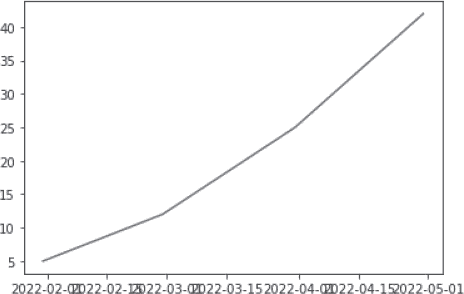

*图 21-1：x 轴上重叠的日期标签*

处理绘图日期时，必须通过导入`matplotlib`.`dates`模块告知 Matplotlib 处理`datetime`对象。这个专用模块建立在`datetime`和第三方`dateutil`模块之上。在其复杂的绘图能力中，它帮助你使用*定位器*方法定义时间尺度，这些方法能够找到并理解你使用的日期类型，例如月份和年份。

让我们使用`matplotlib.dates`重新构建上一个图。记得在输入第`In [48]`行代码时使用 CTRL-ENTER 以防止过早执行：

```py
In [44]: import matplotlib.dates as mdates

In [45]: months = mdates.MonthLocator()

In [46]: days = mdates.DayLocator() In [47]: date_fmt = mdates.DateFormatter('%Y-%m')

In [48]: fig, ax = plt.subplots()
    ...: plt.plot(dates, obs)
    ...: ax.xaxis.set_major_locator(months)
    ...: ax.xaxis.set_major_formatter(date_fmt)
    ...: ax.xaxis.set_minor_locator(days)
```

这将在图 21-2 中生成结果。

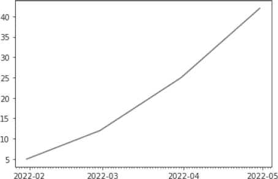

*图 21-2：日期格式正确的绘图*

现在日期标签可读，并且如果你的视力足够好，你将能够数出每个月每天的正确刻度数。定位器函数也适用于其他单位，如小时、分钟、秒和工作日。要了解更多信息，请访问*[`matplotlib.org/stable/api/dates_api.html`](https://matplotlib.org/stable/api/dates_api.html)*模块文档。

#### ***创建朴素对象与知情对象***

Python 的`datetime`对象可以根据是否包含时区信息分为*朴素*或*知情*。朴素对象不包含时区信息，无法相对于其他`datetime`对象定位自身。具有元数据（如时区和夏令时信息）的知情对象表示特定且明确的时间点，可以相对于其他知情对象定位。

为了生成带时区信息的对象，`datetime`和`time`对象具有一个可选的时区属性`tzinfo`，用于捕捉协调世界时（*UTC*）的时差、时区名称以及是否处于夏令时（DST）。

UTC 是格林威治标准时间（GMT）的继任者，是世界用来调节时钟和时间的主要时间标准。精度通常为毫秒，但使用卫星信号时可以达到亚微秒级精度。UTC 不随季节变化，也不受夏令时（DST）的影响。通过使用 UTC，你可以自信地分享你的工作，避免了复杂的时区和类似的调整。

尽管`tzinfo`属性可以包含详细的、特定于国家的时区信息，但`datetime`模块的`timezone`类只能表示与 UTC 有固定时差的简单时区，如 UTC 本身或北美的 EST 和 EDT 时区。

要访问更详细的时区信息，你可以使用第三方库`pytz`（*[`pypi.org/project/pytz/`](https://pypi.org/project/pytz/)*），该库被 pandas 封装。要创建带时区信息的时间戳，导入`pytz`并将`datetime`方法的时区名称传递给`pytz`库。你可以使用`common_timezones`属性查找这些名称，下面是列出的最后 10 个时区名称：

```py
In [49]: import pytz

In [50]: pytz.common_timezones[-10:]
Out[50]: 
['Pacific/Wake',
'Pacific/Wallis',
'US/Alaska',
'US/Arizona',
'US/Central',
'US/Eastern',
'US/Hawaii',
'US/Mountain',
'US/Pacific',
'UTC']
```

首先，让我们创建一个*带时区信息*的 UTC 时间戳：

```py
In [51]: aware = datetime(2022, 11, 2, 21, 15, 19, 426910, pytz.UTC)

In [52]: aware
Out[52]: datetime.datetime(2022, 11, 2, 21, 15, 19, 426910, tzinfo=<UTC>)
```

请注意，带时区信息的时间戳包含时区元数据（`tzinfo=<UTC>`）。

要将现有的无时区信息的时间戳转换为带时区信息的时间戳，可以在`pytz`时区上调用`localize()`方法，并将`datetime`对象传递给该方法，如下所示：

```py
In [53]: unaware = datetime(2022, 11, 3, 0, 0, 0)

In [54]: aware = pytz.timezone('Europe/London').localize(unaware)

In [55]: aware
Out[55]: datetime.datetime(2022, 11, 3, 0, 0, tzinfo=<DstTzInfo 'Europe/
London' GMT0:00:00 STD>)
```

要从一个时区转换到另一个时区，可以使用`astimezone()`方法：

```py
In [56]: here = datetime(2022, 11, 3, 14, 51, 3,
 tzinfo=pytz.timezone('US/Central'))

In [57]: there = here.astimezone(pytz.timezone('Europe/London')) In [58]: there
Out[58]: datetime.datetime(2022, 11, 3, 20, 42, 3, tzinfo=<DstTzInfo 'Europe/
London' GMT0:00:00 STD>)
```

`pytz`库在转换时会考虑本地区域的特殊情况，比如夏令时（DST）。

**注意**

*因为许多日期时间方法将天真的日期时间对象视为本地时间，所以最好使用带时区信息的日期时间来表示 UTC 时间。因此，推荐的创建当前 UTC 时间对象的方式是调用`datetime.now(timezone.utc)`。*

**测试你的知识**

1.  哪个日期是以全球标准的数字日期格式书写的？

a.  23-2-2021

b.  2021 年 2 月 23 日

c.  2021 年 2 月 23 日

d.  23/2/21

2.  哪些方法可以将日期的字符串表示转换为`datetime`对象？

a.  `strftime()`

b.  `str()`

c.  `strptime()`

d.  `parse()`

3.  哪个指令产生格式`'03/30/2022 21:09'`？

a.  `'%m/%d/%y %H:%M'`

b.  `'%M/%D/%Y %H:%m'`

c.  `'%m/%d/%Y %H:%M'`

d.  `'%m/%d/%y %H:%M'`

4.  什么是全球时间标准？

a.  `pytz`

b.  美国东部时间（US/Eastern）

c.  UTC

d.  格林威治标准时间（GMT）

5.  哪种方法可以将天真的`datetime`对象转换到新时区？

a.  `mdates()`

b.  `parse()`

c.  `timedelta()`

d.  `localize()`

### **使用 pandas 进行时间序列和日期功能**

正如您可能预料的那样，pandas 在处理时间序列方面具有广泛的功能。该功能基于 NumPy 的 `datetime64` 和 `timedelta64` 数据类型，具有纳秒级分辨率。此外，许多其他 Python 库的功能已被合并，并且开发了新的功能。使用 pandas，您可以加载时间序列；将数据转换为适当的 `datetime` 格式；生成日期时间范围；索引、合并和重新采样固定频率和不规则频率的数据；等等。

pandas 库使用四个与时间相关的通用概念。它们分别是日期时间、时间差、时间跨度和日期偏移量（表 21-3）。除了日期偏移量，每个时间概念都有一个*标量*类，用于单一观测值，以及一个相关的*数组*类，用作索引结构。

**表 21-3：** pandas 中的时间相关概念

| **概念** | **标量类** | **数组类** | **数据类型** | **创建方法** |
| --- | --- | --- | --- | --- |
| 日期时间 | `Timestamp` | `DatetimeIndex` | `datetime64[ns]``datetime64[ns, tz]` | `to_datetime` 或 `date_range` |
| 时间差 | `Timedelta` | `TimedeltaIndex` | `timedelta64[ns]` | `to_timedelta` 或 `timedelta_range` |
| 时间跨度 | `Period` | `PeriodIndex` | `period[freq]` | `Period` 或 `period_range` |
| 日期偏移量 | `DateOffset` | 无 | 无 | `Dateoffset` |

*日期时间*表示具有时区支持的特定日期和时间。它类似于 Python 标准库中的 `datetime.datetime`。*时间差*是一个绝对的时间持续时间，类似于标准库中的 `datetime.timedelta`。*时间跨度*是由某个时间点及其相关的频率（如每日、每月等）定义的一个周期。*日期偏移量*表示一个相对的时间持续时间，遵循日历运算规则。

在接下来的章节中，我们将探讨这些不同的概念以及创建它们的方法。欲了解更多详情，您可以访问官方文档，地址为 *[`pandas.pydata.org/pandas-docs/stable/user_guide/timeseries.html`](https://pandas.pydata.org/pandas-docs/stable/user_guide/timeseries.html)*。

#### ***解析时间序列信息***

要创建一个表示特定事件时间的时间戳，使用 `Timestamp` 类：

```py
In [59]: import pandas as pd
In [60]: ts = pd.Timestamp('2021, 2, 23 00:00:00')

In [61]: ts
Out[61]: Timestamp('2021-02-23 00:00:00')
```

同样，要创建 `DatetimeIndex` 对象，使用 `DatetimeIndex` 类：

```py
In [62]: dti = pd.DatetimeIndex(['2022-03-31 14:39:00', 
                                 '2022-04-01 00:00:00'])

In [63]: dti
Out[63]: DatetimeIndex(['2022-03-31 14:39:00', '2022-04-01 00:00:00'],
dtype='datetime64[ns]', freq=None)
```

对于现有数据，pandas 的 `to_datetime()` 方法将标量、类似数组、类似字典以及 pandas 的 Series 或 DataFrame 对象转换为 pandas `datetime64[ns]` 对象。这使得您可以轻松地从各种来源和格式中解析时间序列信息。

要查看我所说的内容，请在控制台中输入以下命令：

```py
In [64]: import numpy as np
   ...:  from datetime import datetime
   ...:  import pandas as pd

In [65]: dti = pd.to_datetime(["2/23/2021", 
   ...:                        np.datetime64("2021-02-23"),
   ...:                        datetime(2022, 2, 23)])

In [66]: dti
Out[66]: DatetimeIndex(['2021-02-23', '2021-02-23', '2022-02-23'],
dtype='datetime64[ns]', freq=None)
```

在这个例子中，我们向 `to_datetime()` 方法传递了三种不同格式的日期列表。这包括一个字符串、一个 NumPy `datetime64` 对象和一个 Python `datetime` 对象。该方法返回一个 pandas `DatetimeIndex` 对象，它将日期统一存储为 ISO 8601 格式（年-月-日）的 `datetime64[ns]` 对象。

该方法可以处理时间以及日期：

```py
In [67]: dates = ['2022-3-31 14:39:00',
   ...:          '2022-4-1 00:00:00',
   ...:          '2022-4-2 00:00:20',
   ...:          '']

In [68]: dti = pd.to_datetime(dates)

In [69]: dti
Out[69]: 
DatetimeIndex(['2022-03-31 14:39:00', '2022-04-01 00:00:00',
'2022-04-02 00:00:20', 'NaT'],
dtype='datetime64[ns]', freq=None)
```

在这个例子中，我们传递了一个包含日期和时间的列表，所有日期和时间都被正确转换了。注意，我们在列表末尾包含了一个空项（`''`）。`to_datetime()` 方法将此条目转换为 `NaT`（Not a Time）值，这相当于你在前一章学到的 pandas `NaN`（Not a Number）值的时间戳等价物。

`to_datetime()` 方法也适用于 pandas 数据框。让我们看一个示例，在这个示例中，你记录了（在 Microsoft Excel 中）一个拍摄动物图像的野外摄像机的日期和时间。你已将电子表格导出为 .*csv* 文件，现在想要使用 pandas 加载并解析它。

要创建 .*csv* 文件，在诸如记事本或 TextEdit 之类的文本编辑器中，输入以下内容，然后将其保存为 *camera_1.csv*：

```py
Date,Obs
3/30/22 11:43 PM,deer
3/31/22 1:05 AM,fox
4/1/22 2:54 AM,cougar
```

回到控制台，输入以下内容以将文件读取为 DataFrame（替换为你的 .*csv* 文件路径）：

```py
In [70]: csv_df = pd.read_csv('C:/Users/hanna/camera_1.csv')

In [71]: csv_df
Out[71]: 
              Date    Obs
0 3/30/22 11:43 PM   deer
1  3/31/22 1:05 AM    fox
2   4/1/22 2:54 AM cougar
```

要将 `Date` 列转换为 ISO 8601 格式，请输入以下内容：

```py
In [72]: csv_df['Date'] = pd.to_datetime(csv_df['Date'])

In [73]: csv_df
Out[73]: 
                 Date    Obs
0 2022-03-30 23:43:00   deer
1 2022-03-31 01:05:00    fox
2 2022-04-01 02:54:00 cougar
```

这些日期时间记录在美国东部时区，但没有包含该信息。为了使日期时间具有意识，首先进行以下导入：

```py
In [74]: import pytz
```

接下来，将一个变量分配给 `pytz tzfile` 对象，然后将变量传递给 `localize()` 方法：

```py
In [75]: my_tz = pytz.timezone('US/Eastern')
In [76]: csv_df['Date'] = csv_df['Date'].dt.tz_localize(my_tz)
```

你可以在一行中完成所有操作，但使用 `my_tz` 变量可以使代码更易读且不太可能换行。要检查结果，请打印 `Date` 列：

```py
In [77]: print(csv_df['Date'])
0 2022-03-30 23:43:00-04:00
1 2022-03-31 01:05:00-04:00
2 2022-04-01 02:54:00-04:00
Name: Date, dtype: datetime64[ns, US/Eastern]
```

即使在 UTC 中工作是个好主意，保留有意义的时间数据也很重要。例如，你可能希望研究这些动物何时在当地时间活动，因此你会希望保留记录在美国东部的时间。在这种情况下，你将希望基于 `Date` 列创建一个新的“UTC-aware”列，以便同时兼顾两者。因为 `Date` 列现在意识到其时区，所以你必须使用 `tz_convert()` 而不是 `tz_localize()`：

```py
In [78]: csv_df['Date_UTC'] = csv_df['Date'].dt.tz_convert(pytz.utc)
```

打印列以验证转换是否成功：

```py
In [79]: print(csv_df[['Date', 'Date_UTC']])
                       Date                  Date_UTC
0 2022-03-30 23:43:00-04:00 2022-03-31 03:43:00+00:00
1 2022-03-31 01:05:00-04:00 2022-03-31 05:05:00+00:00
2 2022-04-01 02:54:00-04:00 2022-04-01 06:54:00+00:00
```

**注意**

*要从日期时间中删除时区信息以使其变为 naive，可以像这样将 tz_convert() 方法设置为 None：csv_df['Date'] = csv_df['Date']`.`dt.tz_convert(None).*

最后，如果你查看 `csv_df` DataFrame 的前面输出，你会看到索引值从 0 到 2。这是默认的，但你完全可以使用 `datetime` 值作为索引。事实上，当进行绘图等操作时，`datetime` 索引非常有用。因此，让我们将 `Date_UTC` 列作为 DataFrame 的索引。在控制台中，输入以下内容来完成这一步：

```py
In [80]: csv_df = csv_df.set_index('Date_UTC')
Out[80]: 
                                         Date Obs
Date_UTC 
2022-03-31 03:43:00+00:00 2022-03-31 03:43:00 deer
2022-03-31 05:05:00+00:00 2022-03-31 05:05:00 fox
2022-04-01 06:54:00+00:00 2022-04-01 06:54:00 cougar
```

要了解更多关于`to_datetime()`方法的信息，请访问*[`pandas.pydata.org/pandas-docs/stable/reference/api/pandas.to_datetime.html`](https://pandas.pydata.org/pandas-docs/stable/reference/api/pandas.to_datetime.html)*。你可以在*[`pandas.pydata.org/pandas-docs/stable/reference/api/pandas.Series.dt.tz_localize.html`](https://pandas.pydata.org/pandas-docs/stable/reference/api/pandas.Series.dt.tz_localize.html)*和*[`pandas.pydata.org/pandas-docs/stable/reference/api/pandas.Series.dt.tz_convert.html`](https://pandas.pydata.org/pandas-docs/stable/reference/api/pandas.Series.dt.tz_convert.html)*中找到`dt.tz_localize()`和`dt.tz_convert()`的文档。

#### ***创建日期范围***

*固定*频率的时间序列在科学中经常出现，应用领域广泛，如信号处理中的波形采样、心理学中的目标行为观察、经济学中的股市变动记录以及交通工程中的交通流量记录。毫不奇怪，pandas 提供了许多标准化的频率和生成它们、重采样它们及推断它们的工具。

pandas 的`date_range()`方法返回一个具有固定频率的`DatetimeIndex`对象。要生成由天组成的索引，传入一个开始日期和结束日期，如下所示：

```py
In [81]: day_index = pd.date_range(start='2/23/21', end='3/1/21')

In [82]: day_index
Out[82]: 
DatetimeIndex(['2021-02-23', '2021-02-24', '2021-02-25', '2021-02-26',
'2021-02-27', '2021-02-28', '2021-03-01'],
dtype='datetime64[ns]', freq='D')
```

你还可以传入开始日期或结束日期，以及要生成的周期数量（例如，天数）。在以下示例中，我们从某个观察点的时间戳开始，并请求六个周期：

```py
In [83]: day_index = pd.date_range(start='2/23/21 12:59:59', periods=6)

In [84]: day_index
Out[84]: 
DatetimeIndex(['2021-02-23 12:59:59', '2021-02-24 12:59:59',
'2021-02-25 12:59:59', '2021-02-26 12:59:59',
'2021-02-27 12:59:59', '2021-02-28 12:59:59'],
dtype='datetime64[ns]', freq='D')
```

请注意，这六个日期时间表示的是从 12:59:59 开始的日期。通常，你希望日期从午夜开始，因此，pandas 提供了一个方便的`normalize`参数来进行此调整：

```py
In [85]: day_index_normal = pd.date_range(start='2/23/21 12:59:59',
 periods=6, 
 normalize=True)

In [86]: day_index_normal
Out[86]: 
DatetimeIndex(['2021-02-23', '2021-02-24', '2021-02-25', '2021-02-26',
'2021-02-27', '2021-02-28'],
dtype='datetime64[ns]', freq='D')
```

在它们被标准化为天后，输出的`datetime64`对象将不再包含时间部分。

默认情况下，`date_range()`方法假设你想要的是*按天*的频率。然而，也可以使用其他频率，许多频率是为商业应用设计的（例如，商业月末、商业年末等）。

表 21-4 列出了与科学更相关的一些时间序列频率。完整的列表，包括金融频率，请参见“DateOffset 对象”在*[`pandas.pydata.org/pandas-docs/stable/user_guide/timeseries.html`](https://pandas.pydata.org/pandas-docs/stable/user_guide/timeseries.html)*。

**表 21-4：** 有用的时间序列频率

| **Freq string** | **Offset type** | **Description** |
| --- | --- | --- |
| `N` | `Nano` | 按纳秒 |
| `U` | `Micro` | 按微秒 |
| `L or ms` | `Milli` | 按毫秒 |
| `S` | `Second` | 按秒 |
| `T or min` | `Minute` | 按分钟 |
| `H` | `Hour` | 按小时 |
| `D` | `Day` | 按日历天 |
| `W-MON, W-TUE,` . . . | `Week` | 每周，且可选地固定在某一星期几 |
| `MS` | `MonthBegin` | 按月的第一天 |
| `M` | `MonthEnd` | 按月的最后一天 |
| `Q` | `Quarter` | 按季度 |
| `AS-JAN, AS-FEB,` . . . | `YearBegin` | 每年，锚定在给定月份的第一个日历日 |
| `A-JAN, A-FEB,` . . . | `YearEnd` | 每年，锚定在给定月份的最后一个日历日 |

要指定偏移类型，请将来自 表 21-4 的频率字符串别名作为`freq`参数传递。您还可以使用`tz`参数指定时区。以下是如何创建与 UTC 参考的每小时频率：

```py
In [87]: hour_index = pd.date_range(start='2/23/21', 
 periods=6, 
 freq='H', 
 tz='UTC')

In [88]: hour_index
Out[88]: 
DatetimeIndex(['2021-02-23 00:00:00+00:00', '2021-02-23 01:00:00+00:00',
'2021-02-23 02:00:00+00:00', '2021-02-23 03:00:00+00:00',
'2021-02-23 04:00:00+00:00', '2021-02-23 05:00:00+00:00'],
dtype='datetime64[ns, UTC]', freq='H')
```

对于现有时间序列，您可以通过使用`freq`属性检索其频率，如下所示：

```py
In [89]: hour_index.freq
Out[89]: <Hour>
```

表 21-4 中显示的频率代表*基础*频率。将整数`2`放在`freq`参数中的`H`前面，即可制作此新频率，例如双小时。

```py
In [90]: bi_hour_index = pd.date_range(start='2/23/21', periods=6, freq='2H')

In [91]: bi_hour_index
Out[91]: 
DatetimeIndex(['2021-02-23 00:00:00', '2021-02-23 02:00:00',
'2021-02-23 04:00:00', '2021-02-23 06:00:00',
'2021-02-23 08:00:00', '2021-02-23 10:00:00'],
dtype='datetime64[ns]', freq='2H')
```

您还可以通过传递像`'2H30min'`这样的频率字符串来组合偏移量。

```py
In [92]: pd.date_range(start='2/23/21', periods=6, freq='2H30min')
Out[92]:
DatetimeIndex(['2021-02-23 00:00:00', '2021-02-23 02:30:00',
'2021-02-23 05:00:00', '2021-02-23 07:30:00',
'2021-02-23 10:00:00', '2021-02-23 12:30:00'],
dtype='datetime64[ns]', freq='150T')
```

#### ***创建周期***

时间戳将数据与时间点关联起来。然而，有时数据在某个*时间跨度*内保持恒定，例如一个月，您希望将数据与该间隔关联起来。

在 pandas 中，诸如日、月、年等的常规时间间隔由`Period`对象表示。使用`period_range()`方法，`Period`对象可以收集到一个序列中以形成`PeriodIndex`。您可以使用`freq`关键字和来自 表 21-4 的频率别名指定周期的时间跨度。

假设您想要跟踪 2022 年 9 月的每日观察。首先，使用`period_range()`方法创建一个频率为天的时间跨度：

```py
In [93]: p_index = pd.period_range(start='2022-9-1', 
 end='2022-9-30', 
 freq='D')
```

接下来，创建一个 pandas 系列，并使用 NumPy 的`random.randn()`方法即时生成一些虚假数据。请注意，数据点的数量必须等于索引中的天数。

```py
In [94]: ts = pd.Series(np.random.randn(30), index=p_index)

In [95]: ts
Out[95]: 
2022-09-01 0.412853
2022-09-02 0.350678
2022-09-03 0.086216
--snip--
2022-09-28 1.944123
2022-09-29 0.311337
2022-09-30 0.906780
Freq: D, dtype: float64
```

您现在拥有一个按日组织的 2022 年 9 月时间序列。

要将周期按其自身的频率移动，只需添加或减去一个整数。这是使用年度时间跨度的示例：

```py
In [96]: year_index = pd.period_range(2001, 2006, freq='A-DEC')

In [97]: year_index
Out[97]: PeriodIndex(['2001', '2002', '2003', '2004', '2005', '2006'],
dtype='period[A-DEC]')

In [98]: year_index + 10
Out[98]: PeriodIndex(['2011', '2012', '2013', '2014', '2015', '2016'],
dtype='period[A-DEC]')
```

使用`'A-DEC'`的频率意味着每年表示 1 月 1 日到 12 月 31 日。通过添加`10`来将周期向上移动 10 年。您只能在具有*相同*频率的`Period`对象之间以这种方式执行算术运算。

这里是创建月度周期的示例：

```py
In [99]: month_index = pd.period_range('2022-01-01', '2022-12-31', freq='M')

In [100]: month_index
Out[100]: 
PeriodIndex(['2022-01', '2022-02', '2022-03', '2022-04', '2022-05', '2022-06',
'2022-07', '2022-08', '2022-09', '2022-10', '2022-11', '2022-12'],
dtype='period[M]')
```

使用`asfreq()`方法，您可以将现有期间转换为另一个频率。这是一个示例，我们将`month_index`变量的期间转换为每个月第一小时锚定的小时：

```py
In [101]: hour_index = month_index.asfreq('H', how='start')

In [102]: hour_index
Out[102]: 
PeriodIndex(['2022-01-01 00:00', '2022-02-01 00:00', '2022-03-01 00:00',
'2022-04-01 00:00', '2022-05-01 00:00', '2022-06-01 00:00',
'2022-07-01 00:00', '2022-08-01 00:00', '2022-09-01 00:00',
'2022-10-01 00:00', '2022-11-01 00:00', '2022-12-01 00:00'],
dtype='period[H]')
```

要了解有关 pandas `Period` 类和`asfreq()`方法的更多信息，请访问 *[`pandas.pydata.org/docs/reference/api/pandas.Period.html`](https://pandas.pydata.org/docs/reference/api/pandas.Period.html)* 和 *[`pandas.pydata.org/docs/reference/api/pandas.Period.asfreq.html`](https://pandas.pydata.org/docs/reference/api/pandas.Period.asfreq.html)*。

#### ***创建时间间隔***

`timedelta_range()`方法创建`TimedeltaIndex`对象。它的行为类似于`date_range()`和`period_range()`：

```py
In [103]: pd.timedelta_range(start='1 day', periods = 5)
Out[103]: TimedeltaIndex(['1 days', '2 days', '3 days', '4 days', '5 days'],
dtype='timedelta64[ns]', freq='D')
```

在电视剧《*迷失*》中，某个角色每隔 108 分钟必须输入代码并按下按钮，以避免某种未知的灾难。使用`timedelta_range()`方法和频率参数，他可以围绕这一要求安排自己的日程。假设他最后一次按下按钮是在午夜，他将无法获得多少不被打扰的睡眠：

```py
In [104]: pd.timedelta_range(start="1 day", end="2 day", freq="108min")
Out[104]: 
TimedeltaIndex(['1 days 00:00:00', '1 days 01:48:00', '1 days 03:36:00',
'1 days 05:24:00', '1 days 07:12:00', '1 days 09:00:00',
'1 days 10:48:00', '1 days 12:36:00', '1 days 14:24:00',
'1 days 16:12:00', '1 days 18:00:00', '1 days 19:48:00',
'1 days 21:36:00', '1 days 23:24:00'],
dtype='timedelta64[ns]', freq='108T')
```

#### ***使用偏移量平移日期***

除了处理频率外，你还可以导入偏移量并使用它们来偏移`Timestamp`和`DatetimeIndex`对象。以下是一个示例，我们导入`Day`类并用它来偏移一个著名的日期：

```py
In [105]: from pandas.tseries.offsets import Day

In [106]: apollo_11_moon_landing = pd.to_datetime('1969, 7, 20')

In [107]: apollo_11_splashdown = apollo_11_moon_landing + 4 * Day()
In [108]: print(f"{apollo_11_splashdown.month}/{apollo_11_splashdown.day}")
7/24
```

你还可以导入`DateOffset`类，然后将时间跨度作为参数传递：

```py
In [109]: from pandas.tseries.offsets import DateOffset

In [110]: ts = pd.Timestamp('2021-02-23 09:10:11')

In [111]: ts + DateOffset(months=4)
Out[111]: Timestamp('2021-06-23 09:10:11')
```

`DateOffset`对象的一个优点是它们遵循夏令时（DST）转换。你只需要从`pandas.tseries.offsets`导入适当的类。下面是一个示例，演示如何在美国中部时区的春季夏令时转换中，将时间偏移一小时：

```py
In [112]: from pandas.tseries.offsets import Hour

In [113]: pre_dst_date = pd.Timestamp('2022-03-13 1:00:00', tz='US/Central')

In [114]: pre_dst_date
Out[114]: Timestamp('2022-03-13 01:00:00-0600', tz='US/Central')

In [115]: post_dst_date = pre_dst_date + Hour()

In [116]: post_dst_date
Out[116]: Timestamp('2022-03-13 03:00:00-0500', tz='US/Central')
```

请注意，最终的日期时间（`03:00:00`）比起始日期时间（`01:00:00`）晚了*两小时*，即使你只偏移了*一个小时*。这是因为跨越了夏令时转换。

在这一点上，即使两个时间序列位于不同的时区，你也可以将它们结合起来。结果将是 UTC 时间，因为 pandas 会自动跟踪每个时间序列的等效 UTC 时间戳。

要查看可用的偏移量列表，请访问 *[`pandas.pydata.org/pandas-docs/stable/reference/api/pandas.tseries.offsets.DateOffset.html`](https://pandas.pydata.org/pandas-docs/stable/reference/api/pandas.tseries.offsets.DateOffset.html)*。

#### ***时间序列的索引与切片***

当你处理时间序列数据时，通常将时间组件作为系列或数据框的索引，以便可以根据时间元素进行操作。在这里，我们创建了一个其索引表示时间序列、数据为从 0 到 9 的整数的系列：

```py
In [117]: ts = pd.Series(range(10), index=pd.date_range('2022', 
 freq='D', 
 periods=10))
In [118]: ts
Out[118]: 
2022-01-01 0
2022-01-02 1
2022-01-03 2
2022-01-04 3
2022-01-05 4
2022-01-06 5
2022-01-07 6
2022-01-08 7
2022-01-09 8
2022-01-10 9
Freq: D, dtype: int64
```

即使索引现在是日期，你仍然可以像使用整数索引那样切片和操作系列。例如，要选择每隔一行的数据，可以输入以下内容：

```py
In [119]: ts[::2]
Out[119]: 
2022-01-01 0
2022-01-03 2
2022-01-05 4
2022-01-07 6
2022-01-09 8
Freq: 2D, dtype: int64
```

要选择与 1 月 5 日相关的数据，请使用该日期索引系列：

```py
In [120]: ts['2022-01-05']
Out[120]: 4
```

方便的是，你不需要以输入日期时的相同格式输入日期。任何可以解析为日期的字符串都可以使用：

```py
In [121]: ts['1/5/2022']
Out[121]: 4

In [122]: ts['January 5, 2022']
Out[122]: 4
```

*重复*的日期将产生一个*切片*，显示与该日期相关的所有值。同样，你也可以使用以下语法查看按相同日期索引的所有行：dataframe`.loc['`datetime_index`']`。

此外，如果你有一个包含多个年份的时间序列，可以根据年份进行索引，并检索包含该年份的所有索引和数据。这对于其他时间跨度（如月份）也适用。

切片的操作方式相同。你可以使用时间序列中未明确包含的时间戳，如`2021-12-31`：

```py
In [123]: ts['2021-12-31':'2022-1-2']
Out[123]: 
2022-01-01 0
2022-01-02 1
Freq: D, dtype: int64
```

在这种情况下，我们从 2021 年 12 月 31 日开始索引，该日期在时间序列中的日期之前。

**注意**

*记住，pandas 是基于 NumPy 的，因此切片创建的是视图而非副本。对视图执行的任何操作都会改变源 series 或 DataFrame。*

如果你希望日期时间组件作为数据而不是索引，在创建 series 时省略索引参数：

```py
In [124]: pd.Series(pd.date_range('2022', freq='D', periods=3))
Out[124]: 
0 2022-01-01
1 2022-01-02
2 2022-01-03
dtype: datetime64[ns]
```

结果是一个带有整数索引的 pandas 系列，并且日期被当作数据处理。

#### ***重采样时间序列***

将时间序列的频率转换为不同频率的过程称为*重采样*。这可能涉及*降采样*，即将数据聚合到较低的频率，可能是为了减少内存需求或查看数据趋势；*上采样*，即将频率提高，可能是为了在两个分辨率不同的数据集之间进行数学操作；或者简单的重采样，即保持相同的频率，但改变基准点，比如从年初(`AS-JAN`)到年末(`A-JAN`)。

在 pandas 中，重采样是通过在 pandas 对象上调用`resample()`方法来完成的，使用点符号表示法。它的一些常用参数列在表格 21-5 中。要查看完整的列表，请访问*[`pandas.pydata.org/pandas-docs/stable/reference/api/pandas.DataFrame.resample.html`](https://pandas.pydata.org/pandas-docs/stable/reference/api/pandas.DataFrame.resample.html)*。series 和`dataframe`对象使用相同的参数。

**表 21-5：** pandas `resample()`方法的有用参数

| **参数** | **描述** |
| --- | --- |
| `freq` | `DateOffset`或`Timedelta`对象，或字符串，表示重采样频率（如`'D'`、`'Q'`、`'10min'`）。 |
| `axis` | 要进行重采样的轴（`0`或`'index'`，`1`或`'columns'`）。默认为`0`。 |
| `closed` | 在降采样时，指示哪个区间的结束是包含的，可以是`'right'`或`'left'`。默认值会根据`freq`类型而变化。 |
| `label` | 在降采样时，选择使用哪个区间边缘来标记结果，可以是`'right'`或`'left'`。默认值会根据`freq`类型而变化。 |
| `convention` | 仅对`PeriodIndex`有效，控制在将频率从低频转换为高频时是否使用`freq`的开始或结束。默认为`'start'`。 |
| `kind` | 传入`'timestamp'`将结果索引转换为`DateTimeIndex`，传入`'period'`将其转换为`PeriodIndex`。默认情况下，保留输入表示法。 |
| `on` | 对于 DataFrame，指定要用于重采样的列，而不是`index`。该列必须是类似 datetime 的类型。 |

##### **上采样**

上采样是指将数据重采样到*更短*的时间跨度，例如从日数据转换为小时数据。这会创建包含`NaN`值的桶，这些值必须填充；例如，使用前向填充和后向填充方法`ffill()`和`bfill()`。这个两步过程可以通过链式调用 resample 方法和填充方法来完成。

为了说明这一点，让我们创建一个包含年度值的玩具数据集，并将其扩展为季度值。这可能在某些情况下是必要的，例如，生产目标每年增加，但进展必须以季度生产来跟踪。在控制台中输入以下内容：

```py
In [125]: import pandas as pd

In [126]: dti = pd.period_range('2021-02-23', freq='Y', periods=3)

In [127]: df = pd.DataFrame({'value': [10, 20, 30]}, index=dti)

In [128]: df.resample('Q').ffill()
```

在导入 pandas 之后，创建一个名为`dti`的年度`PeriodIndex`。接着，创建数据框，并传入一个字典，其值以列表形式提供。然后，将`index`参数设置为`dti`对象。调用`resample()`方法并传入`Q`，表示季度，然后调用`ffill()`方法，链式调用在末尾。

该代码的结果在图 21-3 中进行了分解，图中从左到右依次展示了原始数据框、重采样结果和填充结果。原始的年度值以粗体显示。

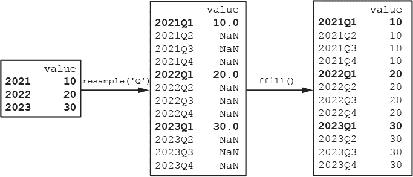

*图 21-3：使用 resample()方法将年度范围的数据框重采样为季度范围，之后跟随 ffill()方法*

`resample()`方法构建新的季度索引，并用`NaN`值填充新行。调用`ffill()`方法会填充这些空行，填充方向是“前向”的。这里的意思是，“每年第一季度（Q1）的值将用于该年内所有季度的值。”

后向填充执行相反的操作，假设每年新年（Q1）开始时的值应适用于前一年中的季度，*不包括*前一个第一季度：

```py
In [129]: df.resample('Q').bfill()
```

此代码的执行结果在图 21-4 中进行了描述。再次强调，原始的年度值以粗体显示。

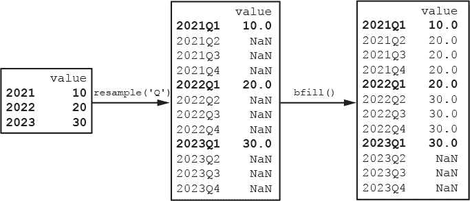

*图 21-4：使用 resample()方法将年度范围的数据框重采样为季度范围，之后跟随 bfill()方法*

在这种情况下，与第一季度相关的值被“回填”到前面三个季度。然而，你需要小心，因为可能会出现“剩余”的`NaN`值。这些值可以在图 21-4 中右侧数据框的值列末尾看到。最后三个值没有变化，因为没有可用的`2024Q1`数据来设置该值。

为了填充缺失的数据，假设每个季度的值都以 10 为增量增长，然后使用链式调用`fillna()`方法重新运行代码。传入`40`来填充剩余的空缺：

```py
In [130]: df.resample('Q').bfill().fillna(40)
Out[130]: 
       value
2021Q1  10.0
2021Q2  20.0
2021Q3  20.0
2021Q4  20.0
2022Q1  20.0
2022Q2  30.0
2022Q3  30.0
2022Q4  30.0
2023Q1  30.0
2023Q2  40.0
2023Q3  40.0
2023Q4  40.0
```

`bfill()`和`ffill()`都是`fillna()`方法的同义词。你可以在*[`pandas.pydata.org/pandas-docs/stable/reference/api/pandas.DataFrame.fillna.html`](https://pandas.pydata.org/pandas-docs/stable/reference/api/pandas.DataFrame.fillna.html)*中查看更多关于它的信息。

##### **降采样**

下采样是指将高频数据重采样到低频数据，例如将分钟数据转为小时数据。由于需要将多个样本合并为一个样本，`resample()` 方法通常与用于 *聚合* 数据的方法链式使用（参见 表 21-6）。

**表 21-6：** pandas 中有用的聚合方法

| **方法** | **描述** |
| --- | --- |
| `count()` | 返回非空值的数量 |
| `max()` | 返回最大值 |
| `mean()` | 返回值的算术平均数 |
| `median()` | 返回值的中位数 |
| `min()` | 返回最小值 |
| `std()` | 返回值的标准差 |
| `sum()` | 返回值的总和 |
| `var()` | 返回值的方差 |

为了练习下采样，我们将使用 *The Atlantic* 的 “COVID Tracking Project” 提供的真实数据集。该数据集包括从 2020 年 3 月 3 日到 2021 年 3 月 7 日的 COVID-19 统计数据。

为了缩小数据集的规模，我们将只下载德克萨斯州的数据。请访问 *[`covidtracking.com/data/download/`](https://covidtracking.com/data/download/)*，向下滚动，然后点击 **Texas** 的链接。为了方便起见，我建议将此文件移动到启动 Jupyter Qt 控制台的同一文件夹中；这样加载数据时就不需要提供文件路径。

首先，将数据加载为 pandas DataFrame。输入文件包含许多我们不需要的列，因此我们只选择 `date` 和 `deathIncrease` 两列。后者是当天与 COVID 相关的死亡人数。

```py
In [131]: df = pd.read_csv("texas-history.csv", 
    ...:                  usecols=['date','deathIncrease'])

In [132]: df.head()
Out[132]: 
        date deathIncrease
0 2021-03-07            84
1 2021-03-06           233
2 2021-03-05           256
3 2021-03-04           315
4 2021-03-03           297
```

通过在 DataFrame 上调用 `head()` 方法，保持关注数据的变化是很有帮助的，默认情况下该方法返回前五行数据。在这里，我们看到日期是按 *降序* 排列的，但我们通常使用并绘制按 *升序* 排列的日期数据。因此，我们调用 pandas 的 `sort_values()` 方法，传入列名，并将 ascending 参数设置为 `True`：

```py
In [133]: df = df.sort_values('date', ascending=True)

In [134]: df.head()
Out[134]: 
          date deathIncrease
369 2020-03-03             0
368 2020-03-04             0
367 2020-03-05             0
366 2020-03-06             0
365 2020-03-07             0
```

接下来，日期看起来像日期，但它们真的是日期吗？通过检查 DataFrame 的 `dtypes` 属性，可以确认这一点：

```py
In [135]: df.dtypes
Out[135]: 
date object
deathIncrease int64
dtype: object
```

结果显示它们并不是日期。这一点很重要，因为 `resample()` 方法仅适用于具有 `datetime` 类型索引的对象，如 `DatetimeIndex`、`PeriodIndex` 或 `TimedeltaIndex`。我们需要将它们的类型更改并将其设置为 DataFrame 的索引，替换当前的整数值。我们还将删除 `date` 列，因为我们不再需要它。

```py
In [136]: df = df.set_index(pd.DatetimeIndex(df['date'])).drop('date',
    ...:                                                       axis=1)
In [137]: df.head()
Out[137]: 
            deathIncrease
date 
2020-03-03              0
2020-03-04              0
2020-03-05              0
2020-03-06              0
2020-03-07              0
```

到目前为止，我们已经整理了数据，使得我们的 DataFrame 使用了一个按升序排列日期的 `DatetimeIndex`。接下来，使用 pandas 绘图工具快速绘制图形，来查看数据的表现，这对于数据探索既快速又方便：

```py
In [138]: df.plot();
```

这将返回图 图 21-5 中展示的图形。

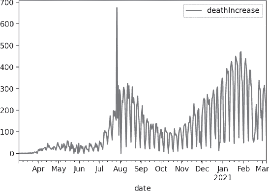

*图 21-5：2020 年 3 月 3 日至 2021 年 3 月 7 日期间德克萨斯州与 COVID-19 相关的每日死亡人数*

图 21-5 中一个非常突出的方面是 2020 年 8 月初的峰值。因为这显然是一个*最大*值，你可以使用`max()`和`idxmax()`方法分别轻松获取该值及其日期索引：

```py
In [139]: print(df.max(), df.idxmax())
deathIncrease 675
dtype: int64 deathIncrease 2020-07-27
dtype: datetime64[ns]
```

这很可能是一个异常值，特别是考虑到 CDC 在该日期仅记录了 239 例死亡，这与相邻的数据更为一致（请参见* [`covid.cdc.gov/covid-data-tracker/#trends_dailydeaths/`](https://covid.cdc.gov/covid-data-tracker/#trends_dailydeaths/)*）。接下来，我们将使用 CDC 的数据。要更改 DataFrame，应用`.loc`索引器，并传递日期（索引）和列名，如下所示：

```py
In [140]: df.loc['2020-7-27', 'deathIncrease'] = 239

In [141]: df.plot();
```

峰值现在已经消失，图形看起来更合理，如图 21-6 所示。

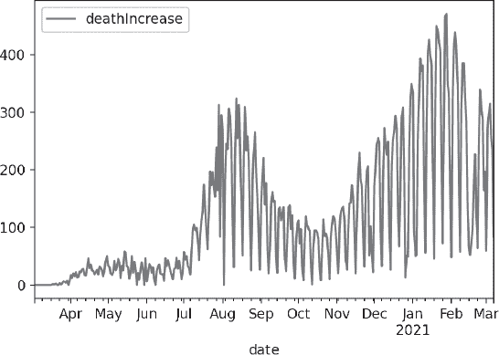

*图 21-6：删除异常峰值后的德克萨斯州 COVID-19 相关每日死亡人数*

另一个显著的现象是曲线的“锯齿状”特征，这由死亡人数的周期性振荡所造成。这些振荡的频率很高，怀疑疾病是以这种方式进展的。

为了调查这个异常，创建一个新的 DataFrame，其中包括一列表示星期几：

```py
In [142]: df_weekdays = df.copy()

In [143]: df_weekdays['weekdays'] = df.index.day_name()
```

现在，使用 pandas 的`iloc[]`索引打印出多周的数据：

```py
In [144]: print(df_weekdays.iloc[90:115])
           deathIncrease    weekdays
date 
2020-06-01             6      Monday
2020-06-02            20     Tuesday
2020-06-03            36   Wednesday
2020-06-04            33    Thursday
2020-06-05            21      Friday
2020-06-06            31    Saturday
2020-06-07            11      Sunday
2020-06-08             0      Monday
2020-06-09            23     Tuesday
2020-06-10            32   Wednesday
2020-06-11            35    Thursday
2020-06-12            19      Friday
2020-06-13            18    Saturday
2020-06-14            19      Sunday
2020-06-15             7      Monday
2020-06-16            46     Tuesday
2020-06-17            33   Wednesday
2020-06-18            43    Thursday
2020-06-19            35      Friday
2020-06-20            25    Saturday
2020-06-21            17      Sunday
2020-06-22            10      Monday
2020-06-23            28     Tuesday
2020-06-24            29   Wednesday
2020-06-25            47    Thursday
```

正如我在灰色部分所强调的，最低的死亡人数通常发生在星期一，星期天的死亡人数也似乎被压缩了。这表明周末存在报告问题，存在一天的时间滞后。你可以在* [`www.ncbi.nlm.nih.gov/pmc/articles/PMC7363007/`](https://www.ncbi.nlm.nih.gov/pmc/articles/PMC7363007/)* 上了解更多关于这一报告现象的内容。

**注意**

*如果你在大流行期间活跃在社交媒体上，可能注意到有人质疑基于像图 21-5 这样的图表的 COVID 数据的真实性。这是一个很好的例子，说明如何通过简单的数据科学应用，快速解决谜题并有效平息阴谋论。*

由于这些振荡是*每周*发生的，从每日到每周的降采样应该能够合并低和高的报告，并平滑曲线。输入以下内容来测试这一假设：

```py
In [145]: df.resample('W').sum().plot();
```

这会产生图 21-7 中的图形，振荡的高频部分已消失。

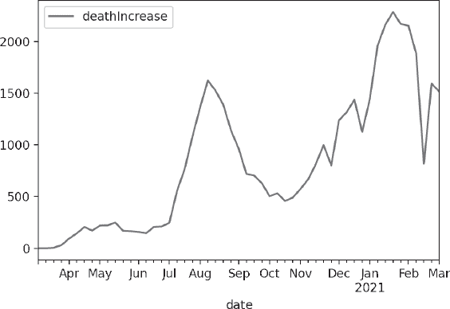

*图 21-7：2020 年 3 月 3 日至 2021 年 3 月 7 日德克萨斯州 COVID-19 相关每周死亡人数*

现在，让我们将数据降采样到每月周期：

```py
In [146]: df.resample('m').sum().plot();
```

这会产生图 21-8 中的更平滑图形。

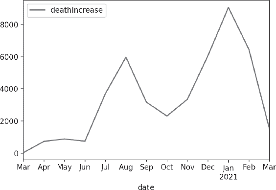

*图 21-8：2020 年 3 月 3 日至 2021 年 3 月 7 日德克萨斯州与 COVID-19 相关的每月死亡人数*

请注意，你也可以降采样到自定义周期，例如每四天的`'4D'`。

##### **重采样时更改开始日期**

到目前为止，我们在聚合间隔时一直使用的是*默认*起始日期，但这可能导致不希望出现的结果。以下是一个例子：

```py
In [147]: raw_dict = {'2022-02-23 09:00:00': 100,
     ...:             '2022-02-23 10:00:00': 200,
     ...:             '2022-02-23 11:00:00': 100,
     ...:             '2022-02-23 12:00:00': 300}

In [148]: ts = pd.Series(raw_dict)

In [149]: ts.index = pd.to_datetime(ts.index)

In [150]: ts.resample('2H').sum()
Out[150]: 
2022-02-23 08:00:00 100
2022-02-23 10:00:00 300
2022-02-23 12:00:00 300
Freq: 2H, dtype: int64
```

尽管第一个数据点在早上 9 点被记录，重新采样后的总和却*从*早上 8 点开始。这是因为聚合间隔的默认值是 `0`，导致两小时（`'2H'`）频率的时间戳为 `00:00:00`，... `08:00:00`，`10:00:00` 等，因此跳过了 `09:00:00`。

要强制输出范围从 `09:00:00` 开始，传递方法的 `origin` 参数 `'start'`。现在它应该使用时间序列的实际开始时间：

```py
In [151]: ts.resample('2H', origin='start').sum()
Out[151]: 
2022-02-23 09:00:00 300
2022-02-23 11:00:00 400
Freq: 2H, dtype: int64
```

聚合从早上 9 点开始，正如所期望的那样。

##### **使用插值重新采样不规则时间序列**

科学观察通常是 irregular 的。毕竟，角马不会按照固定的时间表出现在水坑旁。幸运的是，无论时间序列的频率是 irregular 还是 fixed，重新采样的工作方式都是一样的。

与上采样类似，*正则化*时间序列会生成带有空值的新时间戳。之前，我们使用反向填充和前向填充来填补这些空白值。在下一个示例中，我们将使用 pandas 的`interpolate()`方法。

让我们先生成一个不规则间隔的日期时间列表，分辨率为秒：

```py
In [152]: raw = ['2021-02-23 09:46:48',
     ...:        '2021-02-23 09:46:51', ...:        '2021-02-23 09:46:53',
     ...:        '2021-02-23 09:46:55',
     ...:        '2021-02-23 09:47:00']
```

接下来，在一行代码中创建一个 pandas 序列对象，其中索引是转换为 `DatetimeIndex` 的 `datetime` 字符串：

```py
In [153]: ts = pd.Series(np.arange(5), index=pd.to_datetime(raw))

In [154]: ts
Out[154]: 
2021-02-23 09:46:48 0
2021-02-23 09:46:51 1
2021-02-23 09:46:53 2
2021-02-23 09:46:55 3
2021-02-23 09:47:00 4
dtype: int32
```

现在，以相同的分辨率（`'s'`）重新采样此时间序列，并使用 `'linear'` 作为 `method` 参数调用 `interpolate()`：

```py
In [155]: ts_regular = ts.resample('s').interpolate(method='linear')

In [156]: ts_regular
Out[156]: 
2021-02-23 09:46:48 0.000000
2021-02-23 09:46:49 0.333333
2021-02-23 09:46:50 0.666667
2021-02-23 09:46:51 1.000000
2021-02-23 09:46:52 1.500000
2021-02-23 09:46:53 2.000000
2021-02-23 09:46:54 2.500000
2021-02-23 09:46:55 3.000000
2021-02-23 09:46:56 3.200000
2021-02-23 09:46:57 3.400000
2021-02-23 09:46:58 3.600000
2021-02-23 09:46:59 3.800000
2021-02-23 09:47:00 4.000000
Freq: S, dtype: float64
```

现在，你已经为每秒生成了时间戳，并且在原始数据点之间插值了新值。`method` 参数还提供了其他选项，包括 `nearest`、`pad`、`zero`、`spline` 等。你可以在 *[`pandas.pydata.org/pandas-docs/stable/reference/api/pandas.Series.interpolate.html`](https://pandas.pydata.org/pandas-docs/stable/reference/api/pandas.Series.interpolate.html)* 中阅读相关内容。

##### **重新采样与分析不规则时间序列：一个二进制示例**

让我们来看一个处理不规则时间序列的实际例子。假设你已经将一个传感器安装在制冷机的压缩机上，用来查看压缩机在一天内的开（`1`）和关（`0`）状态。

要构建玩具数据集，请在控制台中输入以下内容：

```py
In [157]: import pandas as pd

In [158]: raw_dict = {'2021-2-23, 06:00:00': 0,
    ...:              '2021-2-23, 08:05:09': 1,
    ...:              '2021-2-23, 08:49:13': 0,
    ...:              '2021-2-23, 11:23:21': 1,
    ...:              '2021-2-23, 11:28:14': 0}

In [159]: ts = pd.Series(raw_dict)

In [160]: ts.index = pd.to_datetime(ts.index)

In [161]: ts.plot();
```

这产生了图 21-9 中的图形。注意，它并未反映数据的二进制（`0` 或 `1`）特性。

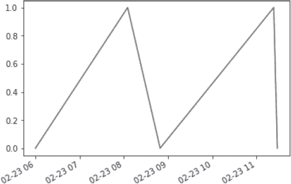

*图 21-9：压缩机开关数据的不规则时间序列图*

在其原始的不规则形式中，数据难以可视化和处理。例如，如果你尝试检查上午 11 点压缩机的状态，你会遇到错误：

```py
In [162]: ts['2021-02-23 11:00:00']
KeyError --snip--
```

问题在于，系列索引不能即时插值。我们需要先将数据重新采样到一个“工作分辨率”，在这个例子中是秒：

```py
In [163]: ts_secs = ts.resample('S').ffill() In [164]: ts_secs
Out[164]:
2021-02-23 06:00:00 0
2021-02-23 06:00:01 0
2021-02-23 06:00:02 0
2021-02-23 06:00:03 0
2021-02-23 06:00:04 0
..
2021-02-23 11:28:10 1
2021-02-23 11:28:11 1
2021-02-23 11:28:12 1
2021-02-23 11:28:13 1
2021-02-23 11:28:14 0
Freq: S, Length: 19695, dtype: int64

In [165]: ts_secs.plot();
```

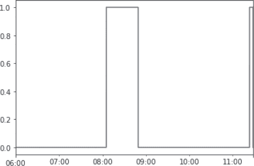

*图 21-10：重新采样为每秒频率的时间序列图*

现在，图表反映了数据的二进制“开关”特性，你可以提取出上午 11 点的状态：

```py
In [166]: ts_secs['2021-2-23 11:00:00']
Out[166]: 0
```

要确定压缩机在该时间段内的开关时间，请对序列调用`value_counts()`方法：

```py
In [167]: ts_secs.value_counts()
Out[167]: 
0 16758
1 2937
dtype: int64
```

要确定压缩机运行的时间占一天的比例，只需将`value_counts()`输出中的索引`1`的值除以一天的秒数：

```py
In [168]: num_secs_per_day = 60 * 60 * 24

In [169]: print(f"On = {ts_secs.value_counts()[1] / num_secs_per_day}")
On = 0.033993055555555554
```

压缩机只运行了当天的三分之一。这真是很好的隔热效果！

##### **滑动窗口函数**

pandas 库提供了用于转换时间序列的函数，这些函数使用*滑动窗口*或具有指数衰减权重的方法。这些函数平滑原始数据点，使得长期趋势更加明显。

*移动平均*是常用的时间序列技术，用于平滑噪声和空隙，并揭示潜在的数据趋势。广为人知的例子是用于分析股市数据的 50 天和 200 天移动平均线。

为了计算移动平均，使用指定长度的“窗口”来对 DataFrame 列中的行进行平均。窗口从最早的日期开始，并按时间单位逐步滑动到列的下方，然后重复这个过程。以下是一个三天移动平均的示例，平均值用粗体显示：

```py
                   value
date 
2020-06-01             6     |
2020-06-02            20   | |
2020-06-03            36 | | |--> (6 + 20 + 36)/3 = 20.67
2020-06-04            33 | |--> (20 + 36 + 33)/3 = 29.67
2020-06-05            21 |--> (36 + 33 + 21)/3 = 30.0
```

为了制作我们 COVID 数据的“月度”30 天移动平均（来自“下采样”部分，见第 650 页），首先将其重新导入为一个名为`df_roll`的新 DataFrame，并替换异常值。（如果你仍然有数据在内存中，可以用`df_roll = df.copy()`替代接下来的五行）：

```py
In [170]: df_roll = pd.read_csv("texas-history.csv",
    ...: usecols = ['date','deathIncrease'])

In [171]: df_roll = df_roll.sort_values('date', ascending=True)

In [172]: df_roll = df_roll.set_index(pd.DatetimeIndex(df_roll['date'])) In [173]: df_roll = df_roll.drop('date', axis=1)

In [174]: df_roll.loc['2020-7-27', 'deathIncrease'] = 239
```

接下来，为该 DataFrame 创建一个`30_day_ma`列，并通过调用`rolling()`方法对`deathIncrease`列进行计算，传递`30`，然后加上`mean()`方法。最后调用`plot()`来完成：

```py
In [175]: df_roll['30_day_ma'] = df_roll.deathIncrease.rolling(30).mean()

In [176]: df_roll.plot();
```

如图 21-11 所示，移动平均曲线比每月重采样所产生的曲线（见图 21-8）更加平滑，但保留了一些周期性的波动。

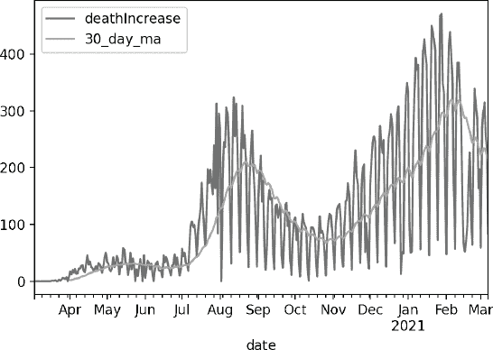

*图 21-11：德克萨斯州与 COVID 相关的死亡人数及 30 天移动平均曲线*

默认情况下，平均值会显示在窗口的*末尾*，这使得平均曲线相对于日常数据看起来有所偏移。要将其显示在窗口的*中心*，请将`True`传递给`rolling()`方法的`center`参数：

```py
In [177]: df_roll['30_day_ma'] = df_roll.deathIncrease.rolling(30,
 center=True).mean()

In [178]: df_roll.plot();
```

现在，平均曲线和原始数据中的峰值和谷值更好地对齐，如图 21-12 所示。

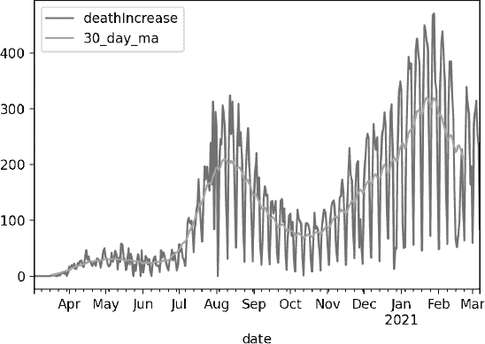

*图 21-12：德克萨斯州与 COVID 相关的死亡人数及 30 天移动平均曲线，显示在窗口间隔的中心*

你可以在表 21-6 中使用`rolling()`调用其他聚合方法。在这里，我们对同一 30 天滑动窗口调用标准差方法，并将新列与其他列一起显示（见图 21-13）：

```py
In [179]: df_roll['30_std'] = df_roll.deathIncrease.rolling(30,
 center=True).std()
In [180]: df_roll.plot();
```

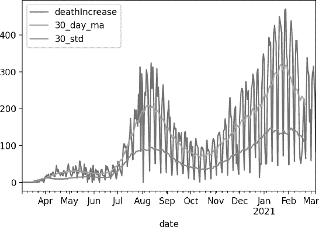

*图 21-13：德克萨斯州 COVID 相关每日死亡的 30 天滑动窗口标准差和移动平均*

除了具有固定窗口大小的滚动平均外，pandas 还提供了使用扩展窗口（`expanding()`）、二进制移动窗口（`corr()`）、指数加权函数（`ewm()`）和用户定义的移动窗口函数（`apply()`）的方法。你可以在 *[`pandas.pydata.org/pandas-docs/stable/reference/frame.html`](https://pandas.pydata.org/pandas-docs/stable/reference/frame.html)* 了解关于 DataFrame 的相关信息，在 *[`pandas.pydata.org/pandas-docs/stable/reference/series.html`](https://pandas.pydata.org/pandas-docs/stable/reference/series.html)* 了解关于 Series 的相关信息。

**测试你的知识**

6.  与 pandas `Timestamp` 类相关的索引结构是什么？

a.  `datetime64`

b.  `datetime64[ns]`

c.  `TimedeltaIndex`

d.  `DatetimeIndex`

7.  将 `'2021-2-23 00:00:00'` 转换为 pandas `Timestamp`。

8.  将上面的时间戳本地化到欧洲/华沙时区。

9.  为 2021 年 5 月 1 日的每个小时创建一个 PeriodIndex。

10.  以下哪项是降采样的示例？

a.  从分钟到秒

b.  从分钟到小时

c.  从年到周

d.  从天到月

### **总结**

时间序列表示以时间为参考的数据索引。Python 和 pandas 都提供了特殊的“时间感知”数据类型和工具。这些工具让你可以轻松处理如六十进制运算、时区转换、夏令时、闰年、日期时间绘图等问题。通过操作时间序列，你可以深入理解数据，解决其他无法预测的问题。

好的，这就是*科学家用 Python 的工具*。这本书有一个简单的目标：让你作为一名科学家开始使用 Python。

如果你已经读完了这本书，你就学会了如何通过 Anaconda 配置你的计算机进行科学计算，如何使用 conda 环境和专用项目文件夹来组织项目，如何熟悉 Jupyter Qt 控制台、Spyder、Jupyter Notebook 和 JupyterLab 等编码工具。如果你是 Python 新手，你现在已经掌握了语言的基础知识。你了解了许多重要的科学和可视化包，并且应该对如何在它们之间做出选择有所了解。最后，你已经在像 NumPy、Matplotlib、pandas、seaborn 和 scikit-learn 等关键库上获得了一些实际操作经验。

接下来，提升你编程知识和技能的最佳方法是*做项目*，无论是赚钱还是娱乐。项目让你将庞大的 Python 世界拆解成可管理的小块，迫使你集中精力完成一组特定的任务，并提高你的信心。它们会引发你从未想过的问题，寻找答案的过程将有助于你进一步提升自己的教育水平。继续前进！
