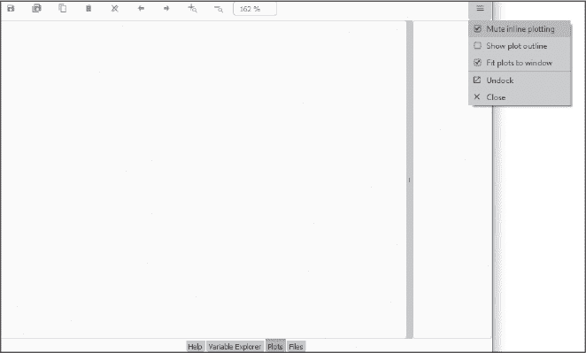

## 附录：**“测试你的知识”挑战的答案**

**第七章**

1.  False

2.  c

3.  c

4.

In [22]: (42**0.5)**4

Out[22]: 1764.0000000000002

5.

In [1]: 42 **= 2

File "C:\Users\hanna\Local\Temp/ipykernel_24188/3589881457.py", line 1

42 **= 2

^

SyntaxError: 无法赋值给字面量

6.  a

7.

In [1]: import math

In [2]: round(math.pi, 5)

Out[2]: 3.14159

8.

In [1]: type((1, 2, 3))

Out[1]: tuple

9.  False

10.  字符串

11.  a

12.

print (

"""

^-------^

|  >   <  |

|   V   |

\     /

---

Hooty Hoot!

""")

13.

In [35]: secs = 1824

In [36]: minutes, seconds = ((int(secs / 60)), (int(secs % 60)))

In [37]: print(f'{secs}秒 = {minutes}分钟, {seconds}秒')

1824 秒 = 30 分钟, 24 秒

14.  b（据说是英语中最长的连续辅音字符串）

15.  d

16.  c

17.

In [1]: from string import punctuation

In [2]: punc = punctuation.replace('-','')

In [3]: caesar_said = '呵呵，布鲁图斯。'

In [4]: hyph_only = caesar_said.translate(str.maketrans('', '',punc))

In [5]: hyph_only

Out[5]: '呵呵 布鲁图斯'

18.

In [1]: '不切实际的 python 项目'.title()

Out[1]: '不切实际的 Python 项目'

**第八章**

1.  a, b, d

2.  b

3.  c

4.  改变它的名字

5.

In [1]: x = 42

In [2]: del x

6.  False

7.

In [1]: print(input("请输入你的名字: ")[::-1])

Enter your first name: Lee

eeL

8.

In [1]: john == 'Harry'

Traceback (most recent call last):

File "<ipython-input-112-97bd679db026>", line 1, in <module>

john == 'Harry'

NameError: 名字'john'未定义

9.

In [1]: a = '爱丽丝'

In [2]: b = 42

In [3]: c = a / b

Traceback (most recent call last):

File "C:\Users\hanna\AppData\Local\Temp/ipykernel_24188/2258966649.py",

line 1, in <module>

c = a / b

TypeError: 不支持的操作数类型：'int'和'str'

10.  a

**第九章**

1.  `IndexError: 元组索引超出范围`

2.  `'!'`

3.

In [1]: tup = ('Rust', 'R', 'Go', 'Julia'), ('Python')

In [2]: tup[1][1]

Out[2]: 'y'

4.  a, b, c

5.

In [1]: field_trip = '草帽',

...:            '岩锤',

...:            '放大镜',

...:            '登山靴',

...:            '太阳镜' In [2]: field_trip

Out[2]: ('草帽', '岩锤', '放大镜', '登山靴',

'太阳镜')

In [3]: field_trip = field_trip[1:]

In [4]: field_trip

Out[4]: ('岩锤', '放大镜', '登山靴', '太阳镜')

6.

In [1]: patroni = []

In [2]: patroni.extend(['老虎', '鲨鱼', '黄鼠狼'])

In [3]: patroni

Out[3]: ['老虎', '鲨鱼', '黄鼠狼']

7.

In [1]: patroni.clear()

In [2]: patroni

Out[2]: []

8.  c

9.  c

10.  c

11.  集合去除数据集中的重复值；每个唯一值只会出现一次。

12.  c

13.  True

14.  c

15.  a

16.  b

17.

In [1]: jokes = {"你听说过绑架的事吗？":

...:          "他睡了 4 个小时！",

...:          "你把你的狗打了吗？他生气了吗？":

...:          "他对这件事并不太高兴！"}

In [2]: jokes["你听说过绑架的事吗？"]

Out[2]: '他睡了 4 个小时！'

18.  c

**第十章**

1.  四个空格

2.  False

3.

In [1]: while True:

...:     print('帮帮我！！！！')

4.  a, b

5.

print('英语到猪拉丁翻译器')

VOWELS = 'aeiouy'

while True:

word = input("输入一个单词，或者输入 '0' 停止：")

if word == '0':

break

if word[0] in VOWELS:

pig_latin = word + 'way'

else:

pig_latin = word[1:] + word[0] + 'ay'

print(f'\n{pig_latin}')

6.

In [1]: while True:

...:      name = input('请输入你的用户名：')

...:      if name != 'Alice':

...:           continue

...:      while True:

...:           pwd = input('请输入你的密码：')

...:           如果 pwd == 'Star Lord':

...:                break

...:           else:

...:                print('密码错误')

...:      break

7.

In [1]: count = 0

In [2]: while count < 5:

...:      print('Python')

...:      count += 1

Python

Python

Python

Python

Python

8.

In [1]: print([i for i in range(1, 10) if i % 2 == 0])

[2, 4, 6, 8]

9.

In [1]: for i in range(10, -1, -1):

...:      print(i)

...:

10

9

8

7

6

5

4

3

2

1

0

10.

In [1]: words = ['年龄', '情绪化', '敲门', '毒蛇', '项目', '台阶',

'胡言乱语'

In [2]: for word in words:

...:      middle = int(len(word) / 2)

...:      print(word[middle])

g

o

o

d

j

o

b

11.

import random

answer = random.randint(1, 100)

guess = int(input('猜一个 1 到 100 之间的数字：'))

attempts = 1

while guess != answer:

if guess > answer:

print('你猜得太高了。')

else:

print('你猜得太低了。')

guess = int(input('再猜一次：'))

attempts += 1

print('\n 你猜对了！')

print(f'你只用了 {attempts} 次尝试。')

12.

import random

fortunes = ['天哪，人们喜欢你！',

'今天你将学习一项新的编码技能。',

'你是一个快速学习者！',

'你的智慧使你优于他人。']

misfortunes = ['你的眼睛像池塘。污水池。',

'你的耳朵像花朵。菜花。',

'你的呼吸能杀死一千只骆驼。',

'跑进巷子大喊“鱼！”']

print("""

0 - 退出

1 - 一张幸运饼干

2 - 一张不幸饼干

""")

while True:

choice = input('从菜单中选择一个数字：')

if choice.isdigit():

choice = int(choice)

if choice == 0:

print('感谢你参与游戏！')

break

if choice == 1:

print(random.choice(fortunes))

elif choice == 2:

print(random.choice(misfortunes))

else:

print('从菜单选项中选择。')

**第十一章**

1.  c

2.  c

3.  b

4.

In [1]: def vowel_voider():

...:      name = input("请输入你的姓氏：")

...:      new_name = ''

...:      vowels = 'aeiouy'

...:      for char in name:

...:           if char not in vowels:

...:                new_name += char

...:           else:

...:               continue

...:      return new_name

5.

In [1]: def calc_momentum(*, mass, velocity):

...:      return mass * velocity

In [2]: calc_momentum(mass=10, velocity=50)

Out[2]: 500

6.  c

7.

In [1]: from random import uniform

In [2]: samples = [round(uniform(0, 50), 1) for x in range(10)]

In [3]: samples

Out[3]: [42.7, 37.8, 30.2, 35.0, 0.4, 35.1, 22.4, 9.8, 23.4, 30.0]

8.

In [1]: nums = [3, 10, 16, 25, 88, 75]

在 [2]：filtered = filter(lambda x: x % 5 == 0, nums)

在 [3]：print(list(filtered))

[10, 25, 75]

9.  假。调用`main()`可以授予其访问权限。

10.  c

11.

在 [1]：G = 0.0000000000667

在 [2]：def calc_force_gravity(mass1, mass2, radius):

...:      global G

...:      f = (G * mass1 * mass2) / radius**2

...:      return f

**注意**

*你也可以使用 G = 6.67e-11。*

12.

在 [1]：import math

在 [2]：dir(math)

13.  b

14.  d

15.

在 [1]：x = 25

在 [2]：def use_x(x):

...:      print(x**2)

在 [3]：use_x(x)

625

在 [4]：def use_x():

...:      global x

...:      print(x**2)

在 [5]：use_x()

625

**第十二章**

1.  c

2.  d

3.  假

4.  c

5.  对象

6.  e

7.

在 [1]：from pathlib import Path

在 [2]：p = Path('.\\test1\\another_haiku.txt')

在 [3]：p.rename('.\\test1\\haiku_2.txt')

输出[3]：WindowsPath('test1/haiku_2.txt')

8.  记住，Python 从 0 开始计数：

在 [93]：with open('haiku.txt') as f:

...:      f.seek(14)

...:      print(f.read())

思考樱花树

陌生人像朋友

--一茶

9.  c

10.  真

11.  真

12.  c

13.

在 [1]：import json

在 [2]：crew = dict(Mercury=1, Gemini=2, Apollo=3)

在 [3]：capsules_data = json.dumps(crew)

在 [4]：with open('capsules_data.json', 'w') as f:

...:      f.write(capsules_data)

在 [5]：with open('capsules_data.json', 'r') as f:

...:      crew = json.load(f)

在 [6]：for key in crew:

...:      如果 crew[key] == 1：

...:           seat = 'seat'

...:      否则：

...:           seat = 'seats'

...:      print(f"该{key}舱有{crew[key]}个{seat}。")

水星舱有 1 个座位。

双子座舱有 2 个座位。

阿波罗舱有 3 个座位。

14.

在 [1]：test = ["don't", "do"]

在 [2]：test_json = json.dumps(test)

在 [3]：test_json

输出[3]：'["don\'t", "do"]'

在 [4]：test = ['don\'t', 'do']

在 [5]：test

输出[5]：["don't", 'do']

在 [6]：test_json = json.dumps(test)

在 [7]：test_json

输出[7]：'["don\'t", "do"]'

15.  d

假设当前工作目录是`file_play`：

在 [1]：import shutil

在 [2]：shutil.move('lines.txt', 'test1')

输出[2]：'test1\\lines.txt'

在 [3]：shutil.make_archive('.\\test1\\lines.txt', 'zip')

输出[3]：'.\\test1\\lines.txt.zip'

**第十三章**

1.  b

2.  c

3.  真

4.  c

5.

class Parrot():

def __init__(self, name, color, age):

self.name = name

self.color = color

self.age = age

def squawk(self):

print("\n 刺耳的叫声！\n")

def parroting(self):

phrase = input("请输入波莉重复的话：")

print(f"\n 刺耳的叫声！{phrase}刺耳的叫声！")

polly = Parrot('波莉', '绿色', 80)

polly.squawk()

polly.parroting()

输出：

刺耳的叫声！

请输入波莉重复的话：波莉想要一个饼干！

刺耳的叫声！波莉想要一个饼干！刺耳的叫声！

6.  c

7.  e

8.  b

9.  真

10.  b

11.  d

12.  *ship_display.py* 程序中的新代码已用灰色高亮显示：

from math import dist

from dataclasses import dataclass

import matplotlib.pyplot as plt

@dataclass

class Ship:

'''用于追踪在网格上定位船只的对象。'''

name: str

classification: str

registry: str

location: tuple

obj_type = 'ship'

obj_color = '黑色'

def distance_to(self, other):

distance = round(dist(self.location, other.location), 2)

return str(distance) + ' ' + 'km'

garcia = Ship('Garcia', 'frigate', 'USA', (20, 15))

ticonderoga = Ship('Ticonderoga', 'destroyer', 'USA', (5, 10))

kobayashi = Ship('Kobayashi', 'maru', 'Federation', (10, 22))

VISIBLE_SHIPS = [garcia, ticonderoga, kobayashi]

def plot_ship_dist(ship1, ship2):

sep = ship1.distance_to(ship2)

对于 VISIBLE_SHIPS 中的每一艘船：

plt.scatter(ship.location[0], ship.location[1],

marker='d',

color=ship.obj_color)

plt.text(ship.location[0], ship.location[1], ship.name)

plt.plot([ship1.location[0], ship2.location[0]],

[ship1.location[1], ship2.location[1]],

color='gray',

linestyle="--")

plt.text((ship2.location[0]), (ship2.location[1] - 2), sep, c='gray')

plt.xlim(0, 30)

plt.ylim([0, 30])

plt.show()

对于 i 在 range(30) 中：

garcia.location = (20, i)

plot_ship_dist(kobayashi, garcia)i)

在 Spyder 中运行脚本之前，请进入图表窗格并选择**静音内联绘图**（图 A-1）。这样会强制图表在图表窗格中显示，而不是在控制台内联显示。

*图 A-1：在 Spyder 中从图表窗格选择静音内联绘图*

要关闭所有图表，请点击图表窗格工具栏上的大**X**图标。

作为挑战，看看你能否让 Garcia 在屏幕上斜向移动。

**第十四章**

1.  b

2.  True

3.  a, c

4.  c

5.  d

6.

在 [1]: import itertools

在 [2]: help(itertools.product)

7.  b, d

8.  a, c

9.  d

10.

class Frigate():

"""一款用于战争游戏模拟的护卫舰类战舰。

属性

name (str): 没有指定/登记的船只名称。

crew (int): 机组成员数量。

length_ft(int): 船只的长度，单位为英尺。

tonnage (int): 船只的重量，单位为短吨（美国）。

fuel_gals(int): 油箱容量，单位为美制加仑。

guns (int): 大炮数量。

ammo (int): 可用的弹药数量。 heading (int): 船头所指的航向。

max_speed (float): 船只的最大速度，以节为单位。

speed (float): 船只当前的速度，单位为节。

定义的方法：

__init__(self, name)

构造船只对象所需的所有属性。

参数

name (str):

没有指定/登记的船只名称。

helm(self, heading, speed)

设置并显示船只的当前航向和速度。

参数

heading (int):

船头指向的航向。

speed (float):

当前船速，以节为单位。

返回

None

fire_guns(self)

打印 "BOOM!" 并减少并打印剩余弹药。

参数

None

返回

None

"""

**第十八章**

1.  c (数组可以容纳任何维度的数值)

2.  d

3.  b

4.  e

5.

在 [1]: import numpy as np

在 [2]: np.zeros((10, 10))

6.

在 [1]: import numpy as np

在 [2]: arr2d = np.arange(30).reshape(5, 6)

在 [3]: arr2d[::2]

7.

在 [4]: arr2d[1::2, 1::2]

在 [5]: # 也可以：

在 [6]: arr2d[1:5:2, 1:6:2]

8.  c

9.  b

10.  4

11.  因为每个元素的字节大小由最大元素设定（–10000）

12.  c

13.  b

14.  c

15.  c

**第十九章**

1.  c

2.  True

3.  d

4.  c

5.  注意：该解决方案使用了`pyplot`方法。

In [1]: rockets = {'Atlas': 57, 'Falcon9': 70, 'SaturnV': 111, 'Starship':

120}

In [2]: plt.ylabel('高度 (米)')

...: plt.bar(rockets.keys(), rockets.values(), width=0.3);

6.  False

7.  使用`suptitle()`方法，如下所示，适用于`pyplot`方法：

plt.suptitle('火星高岭土、赤铁矿和黄铁矿分布')

和面向对象风格如下：

fig.suptitle('火星高岭土、赤铁矿和黄铁矿分布')

8.  该解决方案使用面向对象风格：

In [64]: # 创建虚拟数据集：

...: x = np.random.normal(0, 1, 50).cumsum()

...: y = np.random.normal(0, 1, 50).cumsum()

...: z = np.random.normal(0, 1, 50).cumsum()

...:

...: # 创建数据集和标题的列表：

...: data = [x, y, z]

...: titles = ['数据 X', '数据 Y', '数据 Z']

...:

...: # 创建子图：

...: fig, axs = plt.subplots(1, 3)

...: fig.tight_layout()

...:

...: # 遍历子图并使用黑色交叉点绘制数据：

...: for i, ax in enumerate(axs):

...:     ax.set_title(titles[i])

...:     ax.plot(data[i], 'k+')

**注意**

*你的图形可能会有所不同，因为数据是随机生成的。*

9.  该解决方案使用面向对象风格：

import numpy as np

import matplotlib.pyplot as plt

%matplotlib notebook

fig, ax = plt.subplots()

for _ in range(30): data = np.random.rand(4, 4)

heat = ax.imshow(data)

fig.canvas.draw()

fig.canvas.flush_events()

**注意**

*你的图形可能会有所不同，因为数据是随机生成的。*

10.  该解决方案使用面向对象风格：

import matplotlib.pyplot as plt

%matplotlib inline

def calc_data(t, pos, vel, dt):

"""返回在真空中自由下落物体的时间、位置和速度。"""

time = []  # 秒

position = []  # 米

velocity = []  # 米/秒

for _ in range(15):  # 自由落体时间（秒）。

pos = pos + vel * dt

vel = vel + -9.81 * dt  # 9.81 米/秒² 为地球重力。

t += dt

position.append(pos)

velocity.append(abs(vel))  # 转换为绝对值。

time.append(t)

return time, position, velocity

time, position, velocity = calc_data(t=0, pos=0, vel=0, dt=1)

# 设置绘图：

fig, ax1 = plt.subplots()

ax2 = ax1.twinx()  # 与 ax 共享 x 轴。

ax1.set_xlabel('时间 (秒)')

ax1.set_ylabel('距离 (米)', color='green')

ax2.set_ylabel('速度 (米/秒)', color='red') ax2.invert_yaxis()  # 使较大的数字显示在底部。

# 绘制数据：

ax1.plot(time, position, 'go', label='位置')

ax1.legend()

ax2.plot(time, velocity, 'red', label='速度')

ax2.legend(loc='lower left');

**第二十章**

1.  a, b, d

2.  False

3.

import pandas as pd

animals = {'canines': ['哈士奇', '贵宾犬', '斗牛犬'],

'felines': ['暹罗', '波斯', '缅因猫'],

'cetaceans': ['座头鲸', '抹香鲸', '弓头鲸']}

df = pd.DataFrame(animals)

df.rename(columns={'cetaceans': '鲸类'}, inplace=True)

df.head()

|  | **犬科动物** | **猫科动物** | **鲸类** |
| --- | --- | --- | --- |
| 0 | 哈士奇 | 暹罗 | 弓头鲸 |
| 1 | 贵宾犬 | 波斯猫 | 精子鲸 |
| 2 | 英国斗牛犬 | 缅因猫 | right |

4.

df.head(1)

|  | **犬科动物** | **猫科动物** | **鲸类** |
| --- | --- | --- | --- |
| 0 | 哈士奇 | 暹罗 | 弓头鲸 |

5.

df_t = df.T

df_t

|  | **0** | **1** | **2** |
| --- | --- | --- | --- |
| 犬科动物 | 哈士奇 | 贵宾犬 | 英国斗牛犬 |
| 猫科动物 | 暹罗 | 波斯猫 | 缅因猫 |
| 鲸类 | 弓头鲸 | 精子鲸 | right |

6.  b 和 c

7.  c

8.  c

9.  c

10.  b 和 d

**第二十一章**

1.  b

2.  c 和 d

3.  c

4.  c

5.  d

6.  d

7.

在 [1]: import pandas as pd

在 [2]: date = '2021-2-23 00:00:00'

在 [3]: dt = pd.to_datetime(date)

在 [4]: dt

输出[4]: Timestamp('2021-02-23 00:00:00')

8.

在 [1]: import pandas as pd

在 [2]: dt_warsaw = dt.tz_localize('Europe/Warsaw')

在 [3]: dt_warsaw

输出[3]: Timestamp('2021-02-23 00:00:00+0100', tz='Europe/Warsaw')

9.

在 [1]: import pandas as pd

在 [2]: hours = pd.period_range(start='2021-5-1',

...:                           periods=24,

...:                           freq='H')

在 [3]: hours

输出[3]:

PeriodIndex(['2021-05-01 00:00', '2021-05-01 01:00', '2021-05-01 02:00', '2021-05-01 03:00', '2021-05-01 04:00', '2021-05-01 05:00',

'2021-05-01 06:00', '2021-05-01 07:00', '2021-05-01 08:00',

'2021-05-01 09:00', '2021-05-01 10:00', '2021-05-01 11:00',

'2021-05-01 12:00', '2021-05-01 13:00', '2021-05-01 14:00',

'2021-05-01 15:00', '2021-05-01 16:00', '2021-05-01 17:00',

'2021-05-01 18:00', '2021-05-01 19:00', '2021-05-01 20:00',

'2021-05-01 21:00', '2021-05-01 22:00', '2021-05-01 23:00'],

dtype='period[H]')

10.  b 和 d
