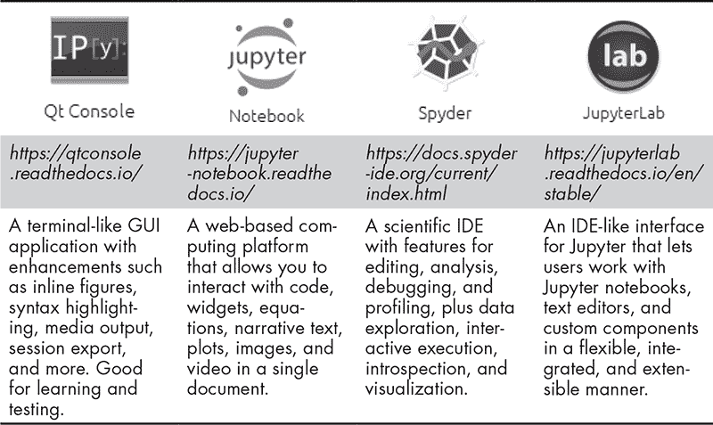

# 第一部分：设置你的科学编码环境**

在第一部分中，你将创建一个科学编码环境，为未来多年的工作打下基础。你将首先安装*Anaconda*，这是一个适用于 Windows、macOS 和 Linux 的 Python 发行版，提供了本书中将使用的科学库。然后，你将学习使用 conda 包和环境管理器来保持项目的组织和更新。之后，你将熟悉流行的编码工具 Jupyter Qt 控制台、Spyder、Jupyter Notebook 和 JupyterLab。

这些编码工具帮助你编写代码、运行代码并查看输出，已总结在表 I-1 中。如果你不确定表中任何术语的含义，请参见“术语”侧边栏。

**表 I-1：** 编码工具摘要

Jupyter Qt 控制台让你在名为 IPython 解释器的窗口内执行命令，并立即显示结果。你可以使用此控制台与数据交互和可视化。它也非常适合学习 Python。

著名的 Jupyter Notebook 是一个 Web 应用程序，允许你创建和共享包含实时代码、方程式、可视化以及叙述文本的文档。它是数据科学中广泛使用的工具，可以让你做从探索和清洗数据到生成精美的交互式报告、演示和仪表盘的一切。通过基于云的*JupyterHub*，你可以为多个用户提供 Jupyter 笔记本，例如一班学生或一个科学研究小组。

Spyder 和 JupyterLab 是*集成开发环境（IDEs）*。IDE 是为程序员提供一套软件开发工具的应用程序。例如，IDE 可能包括调试软件和测量代码或代码部分运行时间的工具。IDE 旨在与特定的应用平台一起使用，消除开发生命周期中的障碍。它们通常用于比控制台或笔记本中通常做的更复杂的编程。*JupyterLab*是 Anaconda 的 Jupyter 项目的下一代用户界面，结合了经典的 Jupyter Notebook 和提供类似 IDE 体验的用户界面。它将来有一天会取代 Jupyter Notebook。

这些编码工具是*Interactive Python (IPython)*的产品，IPython 是用于交互式计算的命令行外壳。（*命令行外壳*将操作系统的服务暴露给程序或用户。）IPython 仍在不断发展，2015 年该项目分裂，语言无关的部分（如笔记本格式、Qt 控制台、Web 应用程序、消息协议等）被移至 Jupyter 项目。

*Jupyter*这个名字来源于 Julia、Python 和 R 语言，尽管该项目支持超过 40 种语言。拆分后，一些术语发生了变化。最显著的是，IPython Notebook 变成了 Jupyter Notebook。IPython 产品的功能也存在一些重叠。这可能会导致混淆，尤其是考虑到许多在线文章和教程中引用了旧的术语。如果你对 IPython 和 Jupyter Notebook 的历史感兴趣，可以查看 datacamp 博客文章“IPython 还是 Jupyter？”*，[`www.datacamp.com/community/blog/ipython-jupyter/`](https://www.datacamp.com/community/blog/ipython-jupyter/)。

**术语**

以下是我们将在第一部分中使用的一些重要术语。

**调试**

这是一个多步骤的过程，用于查找、隔离和解决阻止程序正常运行的问题，这些问题被称为*bug*。调试通常使用一个名为*调试器*的程序来进行。调试器在受控条件下以逐步模式运行问题程序，以跟踪其操作。这通常包括在特定点运行或暂停程序，跳过某些部分，显示内存内容，显示导致程序崩溃的错误位置，等等。

**可扩展**

*可扩展性*是软件工程和系统设计中的一个原则，它表明一个工具是否提供了未来发展的空间。例如，JupyterLab 被设计为一个可扩展的环境。JupyterLab 的*扩展*是提供新的交互功能的附加组件。例如，*JupyterLab LaTeX*是一个允许你实时编辑 LaTeX 文档的扩展，*JupyterLab Plotly*是一个渲染 Plotly 图表的扩展，*JupyterLab 系统监视器*让你监控自己的资源使用情况，比如内存和 CPU 时间。你甚至可以为自己的项目编写自定义插件。

**集成开发环境（IDE）**

IDE 是一种编程工具，它将其他专用工具集成到一个单一的编程环境中。这些专用工具包括文本编辑器、调试器、代码自动完成功能、错误高亮功能、文件管理器、项目管理器、性能分析器、部署工具、编译器等等。通过将常见的软件开发工具整合到一个应用程序中，IDE 提高了程序员的生产力，并且使得管理有许多互相关联脚本的大型项目变得更加容易。缺点是，IDE 可能会比较*沉重*，意味着它们可能占用大量系统资源。对于初学者和只需要编写相对简单脚本的人来说，IDE 也可能显得有些过于复杂。

**自省**

确定对象类型并在运行时检查其属性的能力。在 Python 中，*对象*是一种具有属性和方法的代码特性；你将在第十三章中进一步了解这些内容。代码自省动态检查这些对象并提供关于它们的信息。当自省功能可用时，将鼠标悬停在代码中的对象上会弹出一个窗口，列出对象的类型以及有关如何使用它的有用提示。

**内核**

操作系统核心中的计算引擎。它始终驻留在内存中，这意味着操作系统不能将其交换到存储设备上。内核管理磁盘、任务和内存，并作为应用程序与硬件层面数据处理之间的桥梁。

**性能分析**

一种分析方法，用于衡量程序或程序组件在运行时所需的时间或内存。性能分析信息可以优化代码并提高其性能。集成开发环境（IDE），如 Spyder，内置了性能分析工具。

**Qt**

发音为*cute*，这是一个小工具（“Windows 小工具”）工具包，用于创建图形用户界面和跨平台应用程序，这些应用程序可以在 Windows、macOS、Linux 和 Android 上运行。

**终端**

在现代用法中，*终端*指的是*终端仿真器*，而非实际的硬件，如显示器和键盘。仿真器提供一个基于文本的界面，用于输入命令，也可以被称为*命令行界面（CLI）*、*命令提示符*、*控制台*或*shell*。所有主要操作系统都配备了某种类型的终端。Windows 包括用于运行磁盘操作系统（DOS）命令的命令提示符可执行文件*cmd.exe*，并可以连接到其他服务器。macOS 附带了恰如其名的*终端*，你可以使用它在操作系统中运行 Unix 命令，或使用 Zsh 或 Z shell 访问其他计算机。Unix 通常包括一个名为*xterm*的程序，可以运行*Bash*或其他 Unix shell。

终端并不是很用户友好，但它们可以访问某些信息和软件，这些内容有时只在中央计算机上可用，例如文件传输协议（FTP）服务器。在终端中操作成千上万的文件和文件夹比在图形窗口中更容易。你可以在计算机上自动化和加速工作流，从而节省时间并减少烦恼。此外，你还可以通过终端运行 Python 程序，以及许多 Anaconda 操作（作为使用 Anaconda Navigator GUI 的替代方法）。最棒的是，知道如何使用终端将大大给你的同事们留下深刻印象。

在完成第四章的内容后，你可以继续学习第一部分，"Python 入门"，以了解 Python 编程的基础。如果你已经对 Python 有一定了解，可以直接完成第一部分，然后跳到第三部分，"Anaconda 生态系统"，深入学习科学计算中常用的关键包。
