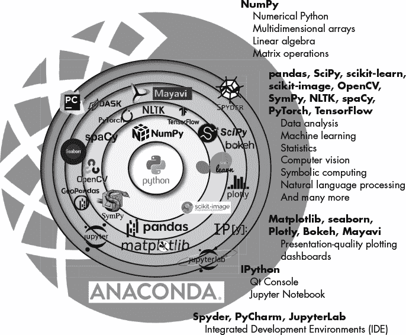

# 第三部分**

**Anaconda 生态系统**

Python 的科学生态系统是*强大的*，这意味着它试图以多种方式满足相同的需求。如本书引言中所述，这可能导致用户在大量包和工具中迷失方向。通过 conda 和 conda-forge 提供的数千个 Python 包，用户很容易感到不知所措。

幸运的是，只有少数几个包被认为是科学工作中必不可少的。这些库构成了用于科学研究的基本 Python 生态系统，并在图 III-1 中显示，此外还包括一些重叠、附加和竞争的库（例如，PyCharm 和 Spyder 是通过 Anaconda 提供的类似编程工具）。

这个生态系统的核心是 Python。在图 III-1 中，Anaconda 在外缘环绕着 Python 以及其他库和工具，帮助你高效地使用它们。在 Python 和 Anaconda 之间有几个环形层，旨在传达某些库是建立在其他库之上的。

外层的两个环包含了帮助你编写代码、运行代码并查看输出的工具。这些工具包括（如今已经熟悉的）*Jupyter Qt 控制台*、*Jupyter Notebook*、*Spyder* 和 *JupyterLab*。

最内层的三个环包含了通过 Anaconda 提供的一些众多科学和绘图库。在第三部分中，我们将快速了解这些库的功能、使用它们的原因，以及如何在重叠或竞争的版本中做出选择。在第四部分中，我们将更深入地探讨一些更重要的库，尽管并非全面。

*图 III-1：用于科学研究的基础 Python 生态系统（改编自 [`indranilsinharoy.com/`](https://indranilsinharoy.com/)，2013）*
