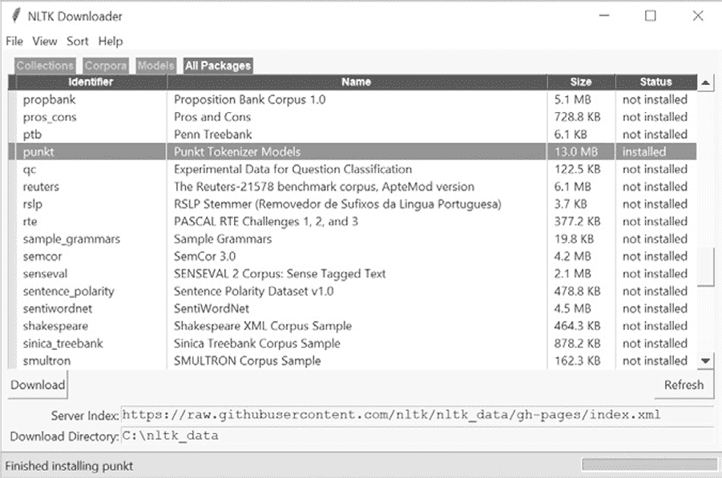
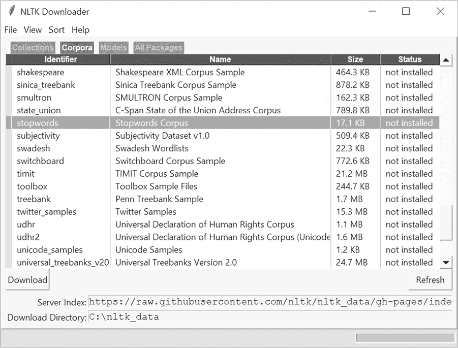
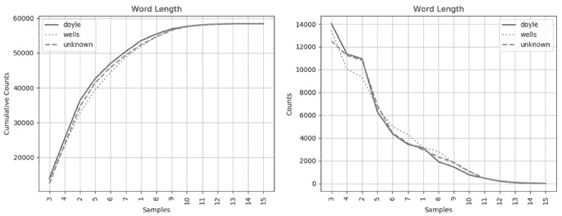
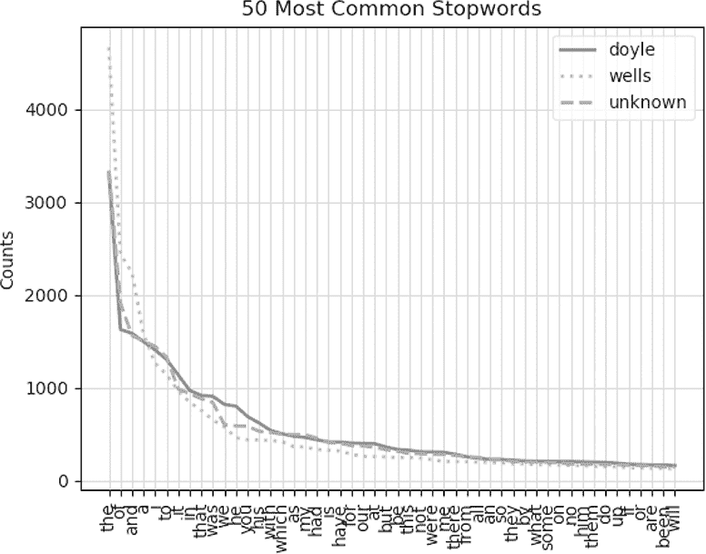
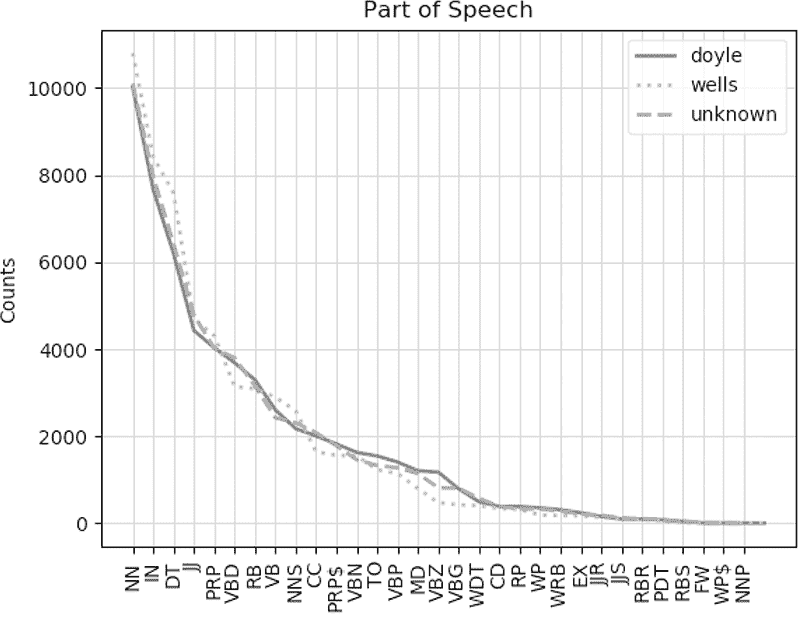
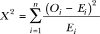
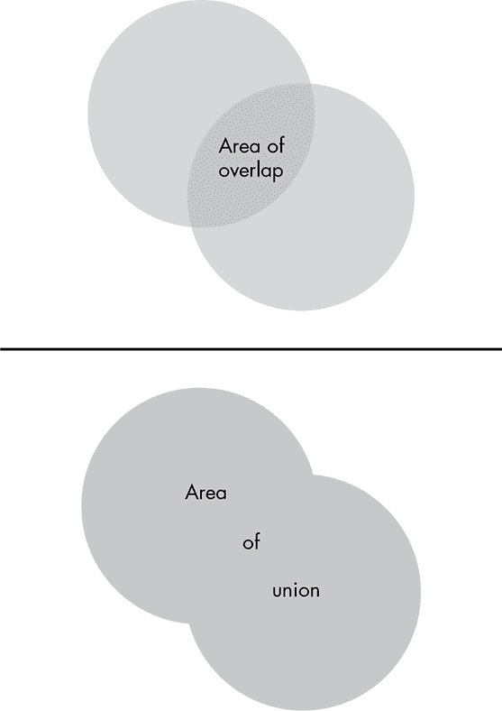
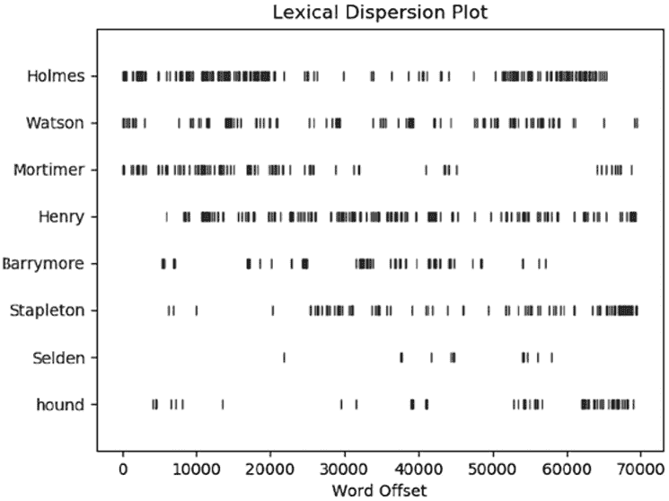
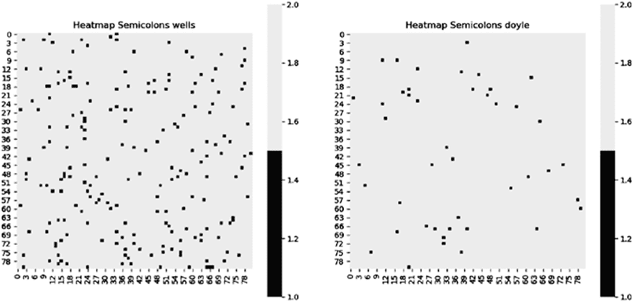

## 第三章：使用文体学归属作者身份


*文体学*是通过计算机文本分析对文学风格进行定量研究的学科。它基于这样一个观点：我们每个人都有独特、一致且可识别的写作风格。这包括我们的词汇、标点使用、句子和单词的平均长度等等。

文体学的一个常见应用是作者身份归属分析。你是否曾经怀疑莎士比亚真的写了他所有的戏剧？或者约翰·列侬或保罗·麦卡特尼真的是《我的一生》这首歌的作者？*《布谷鸟的呼唤》*的作者罗伯特·加尔布雷思真的就是伪装成作者的 J.K. 罗琳吗？文体学能给出答案！

文体学曾被用于推翻谋杀定罪，甚至帮助识别并定罪“独行炸弹人”（Unabomber）。其他应用还包括检测抄袭以及确定文字背后的情感色调，如社交媒体帖子中的情感。文体学甚至可以用于检测抑郁症迹象和自杀倾向。

在本章中，你将使用多种文体学技术来确定是亚瑟·柯南·道尔还是赫伯特·乔治·威尔斯写了小说*《失落的世界》*。

### **项目 #2：猎犬、战争与失落的世界**

亚瑟·柯南·道尔爵士（1859–1930）最著名的作品是《福尔摩斯探案集》，被认为是犯罪小说领域的里程碑。赫伯特·乔治·威尔斯（1866–1946）以多部开创性的科幻小说而闻名，其中包括*《世界大战》*、*《时间机器》*、*《隐形人》*和*《莫罗博士岛》*。

1912 年，*《海滨杂志》*刊登了*《失落的世界》*，这是一本科幻小说的连载版本。故事讲述了一次由动物学教授乔治·爱德华·挑战者领导的亚马逊盆地探险队，探险队在此过程中遇到了活恐龙和一群凶猛的类人猿部落。

虽然小说的作者已经知道，但为了这个项目，我们假设其身份存在争议，而你将负责解开这个谜团。专家们已将候选作者缩小为两位——道尔和威尔斯。威尔斯略微占优，因为*《失落的世界》*是一本科幻小说，这是他的专长。书中还出现了粗暴的穴居人，类似于他在 1895 年作品*《时间机器》*中的莫洛克人。而道尔则以侦探小说和历史小说闻名。

目标

编写一个 Python 程序，利用文体学技术判断是亚瑟·柯南·道尔还是赫伯特·乔治·威尔斯写了小说*《失落的世界》*。

#### ***策略***

*自然语言处理（NLP）*的科学处理计算机精确、结构化的语言与人类使用的含有细微差别且常常模糊不清的“自然”语言之间的相互作用。NLP 的典型应用包括机器翻译、垃圾邮件检测、搜索引擎问题的理解，以及手机用户的预测文本识别。

最常见的自然语言处理（NLP）作者分析测试会分析以下文本特征：

**单词长度** 文档中单词长度的频率分布图

**停用词** 停用词的频率分布图（如*the*、*but*和*if*等短小、无上下文的功能性词汇）

**词性** 根据词法功能（如名词、代词、动词、副词、形容词等）绘制的词频分布图

**最常用的词** 对文本中最常用词汇的比较

**Jaccard 相似度** 一种用于衡量样本集相似性和多样性的统计量

如果道尔和威尔斯有明显不同的写作风格，这五个测试应该足以区分它们。我们将在编码部分更详细地讨论每个测试。

为了捕捉并分析每个作者的风格，你需要一个代表性的*语料库*，即一篇文本。对于道尔，可以使用著名的《福尔摩斯探案集》中的小说《巴斯克维尔的猎犬》，该书于 1902 年出版。对于威尔斯，可以使用《世界大战》，该书于 1898 年出版。这两部小说都包含超过 50,000 个单词，足够用于进行可靠的统计抽样。接下来，你将把每位作者的样本与《失落的世界》进行比较，以确定他们的写作风格有多相似。

为了进行文体计量分析，你将使用*自然语言工具包（NLTK）*，这是一个用于处理 Python 中的人类语言数据的流行程序和库套件。它是免费的，支持 Windows、macOS 和 Linux 系统。NLTK 最初于 2001 年作为宾夕法尼亚大学计算语言学课程的一部分创建，之后在众多贡献者的帮助下持续发展和扩展。要了解更多信息，可以访问官方的 NLTK 网站* [`www.nltk.org/`](http://www.nltk.org/)*。

#### ***安装 NLTK***

你可以在* [`www.nltk.org/install.html`](http://www.nltk.org/install.html)*找到 NLTK 的安装说明。在 Windows 上安装 NLTK，打开 PowerShell 并使用首选安装程序（pip）进行安装。

```py
python -m pip install nltk
```

如果你安装了多个版本的 Python，需要指定版本。以下是针对 Python 3.7 的命令：

```py
py -3.7 -m pip install nltk
```

要检查安装是否成功，打开 Python 交互式命令行，并输入以下内容：

```py
>>> import nltk
>>>
```

如果没有出现错误，那就说明一切正常。否则，请按照* [`www.nltk.org/install.html`](http://www.nltk.org/install.html)*上的安装说明进行操作。

##### **下载分词器**

要运行文体测试，你需要将多个文本或*语料库*拆分成单独的单词，称为*标记*。在写作时，NLTK 中的 word_tokenize()方法会隐式调用 sent_tokenize()，该方法用于将语料库拆分为独立的句子。要处理 sent_tokenize()，你需要*Punkt Tokenizer 模型*。虽然这是 NLTK 的一部分，但你需要通过方便的 NLTK 下载器单独下载。要启动它，请在 Python 命令行中输入以下内容：

```py
>>> import nltk
>>> nltk.download()
```

现在应该已经打开 NLTK Downloader 窗口 (图 2-1)。点击顶部的 **Models** 或 **All Packages** 标签，然后点击 Identifier 列中的 **punkt**。滚动到窗口底部并为你的平台设置下载目录（请参阅 *[`www.nltk.org/data.html`](https://www.nltk.org/data.html)*）。最后，点击 **Download** 按钮以下载 Punkt Tokenizer 模型。



图 2-1：下载 Punkt Tokenizer 模型

请注意，你也可以直接在 shell 中下载 NLTK 包。以下是一个示例：

```py
>>> import nltk
>>> nltk.download('punkt')
```

你还需要访问 Stopwords 语料库，可以通过类似的方式下载。

##### **下载 Stopwords 语料库**

点击 NLTK Downloader 窗口中的 **Corpora** 标签并下载 Stopwords 语料库，如 图 2-2 所示。



图 2-2：下载 Stopwords 语料库

或者，你可以使用 shell。

```py
>>> import nltk
>>> nltk.download('stopwords')
```

让我们再下载一个包，帮助你分析词性，如名词和动词。在 NLTK Downloader 窗口中点击 **All Packages** 标签并下载 Averaged Perceptron Tagger。

要使用 shell，请输入以下内容：

```py
>>> import nltk
>>> nltk.download('averaged_perceptron_tagger')
```

当 NLTK 下载完成后，退出 NLTK Downloader 窗口，并在 Python 交互式命令行中输入以下内容：

```py
>>> from nltk import punkt
```

然后输入以下内容：

```py
>>> from nltk.corpus import stopwords
```

如果没有遇到错误，模型和语料库已经成功下载。

最后，你需要安装 matplotlib 来绘制图表。如果还没有安装，请参阅 第 6 页 上关于安装科学包的说明。

#### ***语料库***

你可以从 *[`nostarch.com/real-world-python/`](https://nostarch.com/real-world-python/)* 下载《巴斯克维尔的猎犬》(*hound.txt*), 《世界大战》(*war.txt*), 和《失落的世界》(*lost.txt*) 的文本文件，以及书中的代码。

这些文本来自 Project Gutenberg (*[`www.gutenberg.org/`](http://www.gutenberg.org/)*)，这是一个提供公有领域文学作品的极好资源。为了让你能立即使用这些文本，我已经去除了多余的内容，如目录、章节标题、版权信息等。

#### ***风格计量代码***

你接下来编写的 *stylometry.py* 程序会将文本文件作为字符串加载，进行分词处理，并运行列出在 第 28 页–29 页 的五种风格计量分析。程序会输出包含图表和终端消息的组合，帮助你确定《失落的世界》的作者。

保持程序和三个文本文件在同一个文件夹中。如果你不想自己输入代码，只需跟随可下载的代码，网址为 *[`nostarch.com/real-world-python/`](https://nostarch.com/real-world-python/)*。

##### **导入模块并定义 main() 函数**

清单 2-1 导入 NLTK 和 matplotlib，分配常量，并定义 main() 函数以运行程序。main() 中使用的函数将在本章后面详细描述。

```py
stylometry.py, part 1
import nltk
from nltk.corpus import stopwords
import matplotlib.pyplot as plt

LINES = ['-', ':', '--']  # Line style for plots.

def main():
  ➊ strings_by_author = dict()
    strings_by_author['doyle'] = text_to_string('hound.txt')
    strings_by_author['wells'] = text_to_string('war.txt')
    strings_by_author['unknown'] = text_to_string('lost.txt')

    print(strings_by_author['doyle'][:300])

 ➋ words_by_author = make_word_dict(strings_by_author)
    len_shortest_corpus = find_shortest_corpus(words_by_author)
 ➌ word_length_test(words_by_author, len_shortest_corpus)
    stopwords_test(words_by_author, len_shortest_corpus)    
    parts_of_speech_test(words_by_author, len_shortest_corpus)
    vocab_test(words_by_author)
    jaccard_test(words_by_author, len_shortest_corpus)
```

清单 2-1：导入模块并定义 main() 函数

首先导入 NLTK 和 Stopwords 语料库。然后导入 matplotlib。

创建一个名为 LINES 的变量，并使用全大写字母命名约定来表示它应该被视为常量。默认情况下，matplotlib 会以颜色绘制图形，但你仍然需要为色盲人士和这本黑白书籍指定一组符号！

在程序开始时定义 main()。这个函数中的步骤几乎像伪代码一样可读，并且提供了一个关于程序将要做什么的良好概述。第一步将是初始化一个字典，用于存储每个作者的文本 ➊。text_to_string() 函数将把每个语料库加载到这个字典中作为字符串。每个作者的名字将作为字典的键（*失落的世界*用 unknown 表示），而他们小说中的文本字符串将作为值。例如，以下是键 Doyle，其对应的值文本字符串已大幅截断：

```py
{'Doyle': 'Mr. Sherlock Holmes, who was usually very late in the mornings --snip--'}
```

在填充字典后，立即打印出 doyle 键的前 300 个条目，以确保一切按计划进行。此时应产生如下输出：

```py
Mr. Sherlock Holmes, who was usually very late in the mornings, save
upon those not infrequent occasions when he was up all night, was seated
at the breakfast table. I stood upon the hearth-rug and picked up the
stick which our visitor had left behind him the night before. It was a
fine, thick piec
```

在语料库正确加载后，下一步是将字符串标记化为单词。目前，Python 不识别单词，而是处理 *字符*，如字母、数字和标点符号。为了解决这个问题，你将使用 make_word_dict() 函数，将 strings_by_author 字典作为参数，分离出字符串中的单词，并返回一个名为 words_by_author 的字典，其中作者为键，单词列表为值 ➋。

风格计量学依赖于单词计数，因此它在每个语料库长度相同的情况下效果最佳。有多种方法可以确保进行公平的比较。通过 *分块处理*，你可以将文本划分为若干块，例如每块 5,000 个单词，并对这些块进行比较。你还可以使用相对频率而非直接计数，或通过截断到最短的语料库来进行归一化。

让我们探讨一下截断选项。将单词字典传递给另一个函数 find_shortest_corpus()，该函数计算每个作者列表中的单词数并返回最短语料库的长度。表 2-1 显示了每个语料库的长度。

**表 2-1：** 每个语料库的长度（单词数）

| 语料库 | 长度 |
| --- | --- |
| 猎犬 (道尔) | 58,387 |
| 战争 (威尔斯) | 59,469 |
| 世界 (未知) | 74,961 |

由于此处最短的语料库代表了一个强大的数据集，包含近 60,000 个单词，你将使用 len_shortest_corpus 变量将其他两个语料库截断为这个长度，然后再进行任何分析。当然，假设是截断后的文本在后端内容上与前端内容没有显著差异。

接下来的五行调用了执行样式计量分析的函数，如《策略》一章中 第 28 页 ➌ 所列。所有函数都将 words_by_author 字典作为参数，大多数函数还接受 len_shortest_corpus 作为参数。我们将在准备好文本进行分析后立即查看这些函数。

##### **加载文本并构建词典**

Listing 2-2 定义了两个函数。第一个将文本文件作为字符串读取。第二个构建一个字典，以每个作者的名字作为键，小说（现在已被标记为单独的单词，而不是一个连续的字符串）作为值。

```py
stylometry.py, part 2
  def text_to_string(filename):
      """Read a text file and return a string."""
      with open(filename) as infile:
          return infile.read()

➊ def make_word_dict(strings_by_author):
      """Return dictionary of tokenized words by corpus by author."""
      words_by_author = dict()
      for author in strings_by_author:
          tokens = nltk.word_tokenize(strings_by_author[author])
       ➋ words_by_author[author] = ([token.lower() for token in tokens
                                      if token.isalpha()])
      return words_by_author
```

Listing 2-2：定义 text_to_string() 和 make_word_dict() 函数

首先，定义 text_to_string() 函数来加载文本文件。内置的 read() 函数将整个文件读取为一个单独的字符串，从而便于对文件进行广泛的操作。使用 with 打开文件，这样文件无论如何结束都会自动关闭。就像收拾玩具一样，关闭文件是一种良好的习惯。它可以防止发生一些不好的事情，比如文件描述符耗尽、文件被锁定无法访问、文件损坏，或者写入文件时丢失数据。

一些用户在加载文本时可能会遇到类似下面的 UnicodeDecodeError 错误：

```py
UnicodeDecodeError: 'ascii' codec can't decode byte 0x93 in position 365:
ordinal not in range(128)
```

*编码* 和 *解码* 指的是将存储为字节的字符转换为人类可读的字符串的过程。问题是，内置函数 open() 的默认编码是与平台相关的，并且依赖于 locale.getpreferredencoding() 的值。例如，如果你在 Windows 10 上运行该代码，你将得到以下编码：

```py
>>> import locale
>>> locale.getpreferredencoding()
'cp1252'
```

CP-1252 是一种传统的 Windows 字符编码。如果你在 Mac 上运行相同的代码，可能会返回不同的编码，比如 'US-ASCII' 或 'UTF-8'。

UTF 代表 *Unicode 转换格式*，它是一种文本字符格式，旨在与 ASCII 向后兼容。尽管 UTF-8 能处理所有字符集，并且是全球网络上使用的主要编码形式，但它并不是许多文本编辑器的默认选项。

此外，Python 2 假设所有文本文件都使用 latin-1 编码，它适用于拉丁字母表。Python 3 更加智能，尽量尽早检测编码问题。然而，如果没有指定编码，它可能会抛出错误。

所以，第一步故障排除应该是传递编码参数给 open() 函数，并指定 UTF-8。

```py
    with open(filename, encoding='utf-8') as infile:
```

如果你仍然遇到加载语料库文件的问题，可以尝试添加一个错误参数，如下所示：

```py
    with open(filename, encoding='utf-8', errors='ignore') as infile:
```

你可以忽略错误，因为这些文本文件是作为 UTF-8 下载的，并且已经通过这种方法进行了测试。关于 UTF-8 的更多内容，请参见 *[`docs.python.org/3/howto/unicode.html`](https://docs.python.org/3/howto/unicode.html)*。

接下来，定义 `make_word_dict()` 函数，该函数将接受按作者分类的字符串字典，并返回按作者分类的单词字典➊。首先，初始化一个名为 `words_by_author` 的空字典。然后，遍历 `strings_by_author` 字典中的键。使用 NLTK 的 `word_tokenize()` 方法，并传递字典的键。返回的结果将是一个标记的列表，这些标记将作为每个作者的字典值。标记就是语料库中被切割的小块，通常是句子或单词。

以下代码片段演示了该过程如何将一个连续的字符串转换为标记的列表（包括单词和标点）：

```py
>>> import nltk		  
>>> str1 = 'The rain in Spain falls mainly on the plain.'		  
>>> tokens = nltk.word_tokenize(str1)		  
>>> print(type(tokens))		  
<class 'list'>
>>> tokens		  
['The', 'rain', 'in', 'Spain', 'falls', 'mainly', 'on', 'the', 'plain', '.']
```

这与使用 Python 内置的 `split()` 函数类似，但 `split()` 从语言学的角度来说并不生成标记（请注意，句点没有被标记化）。

```py
>>> my_tokens = str1.split()		  
>>> my_tokens		  
['The', 'rain', 'in', 'Spain', 'falls', 'mainly', 'on', 'the', 'plain.']
```

一旦你有了标记，使用列表推导式➋填充 `words_by_author` 字典。*列表推导式*是 Python 中执行循环的一种简写方式。你需要用方括号将代码括起来，以表示这是一个列表。将标记转换为小写，并使用内置的 `isalpha()` 方法，如果标记中的所有字符都是字母则返回 True，否则返回 False。这样可以过滤掉数字和标点符号，也会过滤掉带连字符的单词或名字。最后，返回 `words_by_author` 字典。

##### **查找最短的语料库**

在计算语言学中，*频率*指的是语料库中某个词出现的次数。因此，频率意味着*计数*，你稍后将使用的方法会返回一个包含单词及其计数的字典。为了以有意义的方式比较计数，所有语料库应该具有相同的单词数量。

由于这里使用的三个语料库都很大（见 表 2-1），你可以安全地通过将它们都截断为最短的长度来对语料库进行规范化。示例 2-3 定义了一个函数，用于在 `words_by_author` 字典中查找最短的语料库并返回其长度。

```py
stylometry.py, part 3
def find_shortest_corpus(words_by_author):
    """Return length of shortest corpus."""
    word_count = []
    for author in words_by_author:
        word_count.append(len(words_by_author[author]))
        print('\nNumber of words for {} = {}\n'.
              format(author, len(words_by_author[author])))
    len_shortest_corpus = min(word_count)
    print('length shortest corpus = {}\n'.format(len_shortest_corpus))        
    return len_shortest_corpus
```

示例 2-3：定义 `find_shortest_corpus()` 函数

定义一个函数，接受 `words_by_author` 字典作为参数。立刻开始一个空列表，用于保存单词计数。

遍历字典中的作者（键）。获取每个键对应值的长度，该值是一个列表对象，并将长度追加到 `word_count` 列表中。这里的长度表示语料库中的单词数。每次循环时，打印作者的名字以及其标记化语料库的长度。

当循环结束时，使用内置的 `min()` 函数获取最小的计数，并将其赋值给 `len_shortest_corpus` 变量。打印答案，然后返回该变量。

##### **比较单词长度**

作者独特风格的一部分就是他们使用的单词。福克纳观察到，海明威从不让读者跑去查字典；海明威指责福克纳使用“10 美元的单词”。作者的风格通过单词的长度和词汇表达出来，这一点我们将在本章后面讨论。

示例 2-4 定义了一个函数，用于比较每个语料库中单词的长度，并将结果绘制为频率分布图。在频率分布中，单词的长度与每个长度的计数数目进行对比。例如，对于长度为六个字母的单词，一个作者可能有 4,000 次出现，而另一个作者可能有 5,500 次出现。频率分布允许比较不同单词长度的范围，而不仅仅是平均单词长度。

示例 2-4 中的函数使用列表切片将单词列表截断到最短语料库的长度，以避免小说大小对结果的影响。

```py
stylometry.py, part 4
def word_length_test(words_by_author, len_shortest_corpus):
    """Plot word length freq by author, truncated to shortest corpus length."""
    by_author_length_freq_dist = dict()
    plt.figure(1)    
    plt.ion()

 ➊ for i, author in enumerate(words_by_author):
        word_lengths = [len(word) for word in words_by_author[author]
                        [:len_shortest_corpus]]
        by_author_length_freq_dist[author] = nltk.FreqDist(word_lengths)
     ➋ by_author_length_freq_dist[author].plot(15, 
                                                linestyle=LINES[i],                                                  
                                                label=author,   
                                                title='Word Length')
    plt.legend()
    #plt.show()  # Uncomment to see plot while coding.
```

示例 2-4：定义 `word_length_test()` 函数

所有的风格计量函数将使用标记的字典；几乎所有函数都将使用最短语料库的长度参数，以确保样本大小一致。使用这些变量名作为函数的参数。

启动一个空字典来保存按作者划分的单词长度的频率分布，然后开始制作图表。由于你将制作多个图表，首先实例化一个名为 `1` 的图形对象。为了确保所有图表在创建后都能保持显示，开启交互式绘图模式 `plt.ion()`。

接下来，开始遍历分词后的字典中的作者 ➊。使用 `enumerate()` 函数为每个作者生成一个索引，供你选择绘图的线条样式。对于每个作者，使用列表推导获取每个单词在值列表中的长度，范围被截断到最短语料库的长度。结果将是一个列表，其中每个单词都被一个表示其长度的整数所替代。

现在，开始填充你的新按作者划分的词典，以保存频率分布。使用 `nltk.FreqDist()`，它接受一个单词长度的列表并创建一个包含单词频率信息的数据对象，该信息可以进行绘制。

你可以直接使用类方法 `plot()` 绘制词典，而无需通过 `plt` 引用 `pyplot` ➋。这将首先绘制出现频率最高的样本，接着是你指定的样本数量，在本例中为 15。这意味着你将看到长度从 1 到 15 个字母的单词频率分布。使用 `i` 从 `LINES` 列表中选择，并通过提供标签和标题来完成。标签将用于图例，使用 `plt.legend()` 调用。

请注意，你可以通过 cumulative 参数更改频率数据图的显示方式。如果指定 cumulative=True，你将看到累计分布（图 2-3，左）。否则，plot() 默认为 cumulative=False，你将看到实际计数，从高到低排列（图 2-3，右）。在此项目中继续使用默认选项。



图 2-3：NLTK 累计图（左）与默认频率图（右）

完成后，调用 plt.show() 方法来显示图表，但要将其注释掉。如果你希望在编写完此函数后立即看到图表，可以取消注释。还要注意，如果你通过 Windows PowerShell 启动该程序，图表可能会立即关闭，除非使用 block 标志：plt.show(block=True)。这会保持图表打开，但会暂停程序的执行，直到图表关闭为止。

单凭 图 2-3 中的词长频率图，Doyle 的风格与未知作者的风格更为相似，尽管也有一些段落是 Wells 相比之下相同或更优的。现在，让我们进行其他测试，看看是否能确认这一发现。

##### **比较停用词**

*停用词* 是一些常用的小词，如 *the*、*by* 和 *but*。这些词在在线搜索等任务中被过滤掉，因为它们不提供上下文信息，曾被认为在识别作者方面价值不大。

但停用词由于频繁且随意使用，或许是最能体现作者风格的标志。而且，由于你比较的文本通常涉及不同的主题，这些停用词变得非常重要，因为它们与内容无关，并且在所有文本中都有出现。

清单 2-5 定义了一个函数，用于比较三种语料库中停用词的使用情况。

```py
stylometry.py, part 5
def stopwords_test(words_by_author, len_shortest_corpus):
    """Plot stopwords freq by author, truncated to shortest corpus length."""
    stopwords_by_author_freq_dist = dict()
    plt.figure(2)
    stop_words = set(stopwords.words('english'))  # Use set for speed.
    #print('Number of stopwords = {}\n'.format(len(stop_words)))
    #print('Stopwords = {}\n'.format(stop_words))

    for i, author in enumerate(words_by_author):        
        stopwords_by_author = [word for word in words_by_author[author]
                               [:len_shortest_corpus] if word in stop_words]    
        stopwords_by_author_freq_dist[author] = nltk.FreqDist(stopwords_by_
        author)    
        stopwords_by_author_freq_dist[author].plot(50, 
                                                   label=author,
                                                   linestyle=LINES[i],
                                                   title=
                                                   '50 Most Common Stopwords')
    plt.legend()
##    plt.show()  # Uncomment to see plot while coding function.
```

清单 2-5：定义 stopwords_test() 函数

定义一个函数，接受单词字典和最短语料库长度作为参数。然后初始化一个字典，用于保存每个作者的停用词频率分布。你不想将所有图表都放在同一个图形中，因此从新图形 2 开始。

将一个本地变量 stop_words 赋值为 NLTK 的英语停用词语料库。集合比列表查找速度更快，因此将语料库设置为集合，以便以后更快地查找。接下来的两行代码目前被注释掉，它们会打印出停用词的数量（179）及停用词本身。

现在，开始遍历`words_by_author`字典中的作者。使用列表推导从每个作者的语料库中提取所有的停用词，并将这些作为一个新字典`stopwords_by_author`中的值。在下一行中，你将把这个字典传递给 NLTK 的`FreqDist()`方法，并使用输出填充`stopwords_by_author_freq_dist`字典。这个字典将包含生成每个作者频率分布图所需的数据。

重复你在列表 2-4 中用于绘制单词长度的代码，但将样本数设置为 50 并给予不同的标题。这将绘制使用的前 50 个停用词（参见图 2-4）。



图 2-4：按作者划分的前 50 个停用词频率图

道尔和未知作者以类似的方式使用停用词。此时，两个分析结果都倾向于道尔是未知文本的最可能作者，但仍然需要做更多工作。

##### **比较词性**

现在让我们比较三个语料库中使用的词性。NLTK 使用一个叫做 PerceptronTagger 的词性标注器来识别词性。词性标注器处理标记化后的单词序列，并为每个单词附加一个词性标签（参见表 2-2）。

**表 2-2：** 词性与标签值

| 词性 | 标签 | 词性 | 标签 |
| --- | --- | --- | --- |
| 协调连词 | CC | 所有格代词 | PRP$ |
| 基数词 | CD | 副词 | RB |
| 限定词 | DT | 副词，比较级 | RBR |
| 存在词 there | EX | 副词，最高级 | RBS |
| 外来词 | FW | 虚词 | RP |
| 介词或从属连词 | IN | 符号 | SYM |
| 形容词 | JJ | 到 | TO |
| 形容词，比较级 | JJR | 感叹词 | UH |
| 形容词，最高级 | JJS | 动词，基本形式 | VB |
| 列表项标记 | LS | 动词，过去式 | VBD |
| 情态动词 | MD | 动词，动名词或现在分词 | VBG |
| 名词，单数或不可数名词 | NN | 动词，过去分词 | VBN |
| 名词，复数 | NNS | 动词，非第三人称单数现在时 | VBP |
| 名词，专有名词，单数 | NNP | 动词，第三人称单数现在时 | VBZ |
| 名词，专有名词，复数 | NNPS | 疑问限定词，哪个 | WDT |
| 前限定词 | PDT | 疑问代词，谁，什么 | WP |
| 所有格结尾 | POS | 所有格疑问代词，谁的 | WP$ |
| 人称代词 | PRP | 疑问副词，哪里，什么时候 | WRB |

标注器通常在大型数据集上进行训练，如*宾州树库*或*布朗语料库*，使它们非常准确，尽管并不完美。你也可以找到其他语言的训练数据和标注器。你不需要担心所有这些术语及其缩写。和之前的测试一样，你只需要比较图表中的各行。

列表 2-6 定义了一个函数，用于绘制三个语料库中词性频率分布。

```py
stylometry.py, part 6
def parts_of_speech_test(words_by_author, len_shortest_corpus):
    """Plot author use of parts-of-speech such as nouns, verbs, adverbs."""
    by_author_pos_freq_dist = dict()
    plt.figure(3)
    for i, author in enumerate(words_by_author):
        pos_by_author = [pos[1] for pos in nltk.pos_tag(words_by_author[author]
                            [:len_shortest_corpus])] 
        by_author_pos_freq_dist[author] = nltk.FreqDist(pos_by_author)
        by_author_pos_freq_dist[author].plot(35, 
                                             label=author,
                                             linestyle=LINES[i],
                                             title='Part of Speech')
    plt.legend()
    plt.show()
```

列表 2-6：定义 parts_of_speech_test() 函数

定义一个函数，接收作为参数的——你猜对了——词典和最短语料库的长度。然后初始化一个字典来保存每个作者的词性频率分布，接着调用一个函数来生成第三张图。

开始遍历 words_by_author 字典中的作者，使用列表推导式和 NLTK pos_tag() 方法来构建一个名为 pos_by_author 的列表。对于每个作者，这会创建一个列表，将作者语料库中的每个词替换为其对应的词性标签，如下所示：

```py
['NN', 'NNS', 'WP', 'VBD', 'RB', 'RB', 'RB', 'IN', 'DT', 'NNS', --snip--]
```

接下来，制作 POS 列表的频率分布，并在每次循环时绘制曲线，使用前 35 个样本。注意，POS 标签只有 36 个，其中一些标签，如 *列表项标记*，在小说中很少出现。

这是你绘制的最后一张图，所以调用 plt.show() 来将所有图表显示在屏幕上。如在列表 2-4 的讨论中所指出的，如果你使用 Windows PowerShell 启动程序，可能需要使用 plt.show(block=True) 来防止图表自动关闭。

前面的图表以及当前的图表（图 2-5）应该在大约 10 秒后显示。



图 2-5：按作者排序的前 35 个词性频率图

再次出现的情况是，Doyle 和未知曲线的匹配明显优于未知与 Wells 的匹配。这表明 Doyle 是未知语料库的作者。

##### **比较作者的词汇**

为了比较三个语料库之间的词汇，你将使用 *卡方随机变量*（X²），也叫做 *检验统计量*，来衡量未知语料库与每个已知语料库所使用的词汇之间的“距离”。词汇之间的“距离”越小，越相似。公式如下：



其中 *O* 是观察到的词数，*E* 是假设两个对比语料库来自同一作者时的预期词数。

如果 Doyle 写了这两本小说，它们的最常见词汇比例应该是相同的——或者相似的。检验统计量允许你通过衡量每个词的计数差异来量化它们的相似度。卡方检验统计量越低，两个分布之间的相似度越高。

列表 2-7 定义了一个函数，用于比较三个语料库之间的词汇。

```py
stylometry.py, part 7
def vocab_test(words_by_author):
    """Compare author vocabularies using the chi-squared statistical test."""
    chisquared_by_author = dict()
    for author in words_by_author:
     ➊ if author != 'unknown': 
           combined_corpus = (words_by_author[author] +
                              words_by_author['unknown'])
           author_proportion = (len(words_by_author[author])/
                                len(combined_corpus))
           combined_freq_dist = nltk.FreqDist(combined_corpus)		
           most_common_words = list(combined_freq_dist.most_common(1000))
           chisquared = 0
        ➋ for word, combined_count in most_common_words:
              observed_count_author = words_by_author[author].count(word)
              expected_count_author = combined_count * author_proportion
              chisquared += ((observed_count_author -
                              expected_count_author)**2 /
                             expected_count_author)
           ➌ chisquared_by_author[author] = chisquared    
         print('Chi-squared for {} = {:.1f}'.format(author, chisquared))
 most_likely_author = min(chisquared_by_author, key=chisquared_by_author.get)
 print('Most-likely author by vocabulary is {}\n'.format(most_likely_author))
```

列表 2-7：定义 vocab_test() 函数

vocab_test() 函数需要词典，但不需要最短语料库的长度。和之前的函数一样，它通过创建一个新的字典来保存每个作者的卡方值，然后遍历词典。

要计算卡方分数，你需要将每个作者的语料库与未知语料库连接。你不想将未知与其自身合并，因此使用条件语句避免这种情况 ➊。对于当前的循环，将作者的语料库与未知语料库结合起来，然后通过将作者语料库的长度除以合并后语料库的长度来获取当前作者的比例。然后，通过调用`nltk.FreqDist()`获取合并语料库的频率分布。

现在，通过使用`most_common()`方法并传递 1000，来生成合并文本中 1000 个最常见的单词列表。在风格计量分析中，没有硬性规定需要考虑多少个单词。文献中的建议是考虑最常见的 100 到 1000 个单词。由于你正在处理大量文本，最好偏向较大的数值。

用 0 初始化`chisquared`变量；然后启动一个嵌套的 for 循环，遍历`most_common_words`列表 ➋。`most_common()`方法返回一个元组列表，每个元组包含一个单词及其计数。

```py
[('the', 7778), ('of', 4112), ('and', 3713), ('i', 3203), ('a', 3195), --snip--]
```

接下来，从单词字典中获取每个作者的观察到的计数。对于道尔来说，这将是《巴斯克维尔的猎犬》语料库中最常见单词的计数。然后，获取预期计数，对于道尔来说，这将是如果他写了《巴斯克维尔的猎犬》和未知语料库，应该得到的计数。为此，将合并语料库中的计数数目乘以之前计算的作者比例。然后，应用卡方公式，并将结果添加到跟踪每个作者卡方分数的字典中 ➌。显示每个作者的结果。

要找到具有最低卡方分数的作者，调用内置的`min()`函数，并传递字典和字典键，你可以通过`get()`方法获取该键。这将返回对应最小*值*的*键*。这很重要。如果你省略了最后一个参数，`min()`将基于名称的字母顺序返回最小的*键*，*而不是*它们的卡方分数！你可以在以下代码片段中看到这个错误：

```py
>>> print(mydict)
{'doyle': 100, 'wells': 5}
>>> minimum = min(mydict)
>>> print(minimum)
'doyle'
>>> minimum = min(mydict, key=mydict.get)
>>> print(minimum)
'wells'
```

很容易假设`min()`函数返回最小的数值*值*，但正如你所看到的，默认情况下它是查看字典的*键*。

完成函数，通过打印基于卡方分数最可能的作者。

```py
Chi-squared for doyle = 4744.4
Chi-squared for wells = 6856.3
Most-likely author by vocabulary is doyle
```

另一个测试表明道尔是作者！

##### **计算 Jaccard 相似度**

为了确定由语料库创建的集合之间的相似度，你将使用*Jaccard 相似系数*。也叫做*交集与并集比*，它是两个集合的重叠区域面积除以两个集合的并集区域面积（图 2-6）。



图 2-6：集合的交集与并集比是重叠区域的面积除以并集区域的面积。

两个文本创建的集合之间重叠越多，它们更有可能是由同一位作者写的。示例 2-8 定义了一个函数，用于衡量样本集合的相似度。

```py
stylometry.py, part 8
def jaccard_test(words_by_author, len_shortest_corpus):
    """Calculate Jaccard similarity of each known corpus to unknown corpus."""
    jaccard_by_author = dict()
    unique_words_unknown = set(words_by_author['unknown']
                               [:len_shortest_corpus])
 ➊ authors = (author for author in words_by_author if author != 'unknown')
    for author in authors:
        unique_words_author = set(words_by_author[author][:len_shortest_corpus]) 
        shared_words = unique_words_author.intersection(unique_words_unknown)
     ➋ jaccard_sim = (float(len(shared_words))/ (len(unique_words_author) +
                                                  len(unique_words_unknown) -
                                                  len(shared_words)))
        jaccard_by_author[author] = jaccard_sim
        print('Jaccard Similarity for {} = {}'.format(author, jaccard_sim))
 ➌ most_likely_author = max(jaccard_by_author, key=jaccard_by_author.get)
    print('Most-likely author by similarity is {}'.format(most_likely_author))

if __name__ == '__main__':
    main()
```

示例 2-8：定义 `jaccard_test()` 函数

和之前的大多数测试一样，`jaccard_test()` 函数将词典和最短语料库的长度作为参数。你还需要一个字典来存储每个作者的 Jaccard 系数。

Jaccard 相似度基于唯一单词，因此你需要将语料库转换为集合，以便去除重复项。首先，你会从未知语料库中构建一个集合。然后，你会遍历已知语料库，将它们转换为集合，并与未知集合进行比较。在制作集合时，务必将所有语料库截断为最短语料库的长度。

在运行循环之前，使用生成器表达式从 `words_by_author` 字典中获取除未知作者外的作者名称 ➊。*生成器表达式*是一个返回可以逐个值进行迭代的对象的函数。它看起来很像列表推导式，但它是用圆括号包围的，而不是方括号。而且，它不会构建一个可能占用大量内存的项列表，而是实时生成这些项。当你需要使用大量的值，但只用一次时，生成器非常有用。我在这里使用它，作为展示这一过程的机会。

当你将生成器表达式赋值给变量时，你得到的只是一个称为*生成器对象*的迭代器类型。将此与创建列表进行对比，如下所示：

```py
>>> mylist = [i for i in range(4)]
>>> mylist
[0, 1, 2, 3]
>>> mygen = (i for i in range(4))
>>> mygen
<generator object <genexpr> at 0x000002717F547390>
```

前面代码片段中的生成器表达式与这个生成器函数是一样的：

```py
def generator(my_range):
    for i in range(my_range):
        yield i
```

与返回语句结束函数不同，`yield` 语句*暂停*函数的执行，并将一个值返回给调用者。稍后，函数可以从暂停的地方继续执行。当生成器到达末尾时，它“空”了，无法再次调用。

回到代码，使用作者生成器开始一个 `for` 循环。找到每个已知作者的唯一单词，就像你对未知作者所做的那样。然后使用内置的 `intersection()` 函数，找到当前作者单词集和未知单词集之间所有共享的单词。两个给定集合的*交集*是包含两个集合中所有共同元素的最大集合。通过这些信息，你可以计算 Jaccard 相似系数 ➋。

更新 `jaccard_by_author` 字典，并在解释器窗口中打印每个结果。然后，找到具有最大 Jaccard 值 ➌ 的作者并打印结果。

```py
Jaccard Similarity for doyle = 0.34847801578354004
Jaccard Similarity for wells = 0.30786921307869214
Most-likely author by similarity is doyle
```

结果应该偏向道尔（Doyle）。

完成*stylometry.py*，编写代码以便在作为导入模块或独立模式下运行程序。

### **总结**

*《失落的世界》*的真正作者是道尔，所以我们就此为止，宣布胜利。如果你想进一步探究，下一步可以是为道尔和威尔斯增加更多已知的文本，使它们的总长度接近《失落的世界》，这样就不必对其进行截断。你还可以测试句子长度和标点风格，或者使用更复杂的技术，如神经网络和遗传算法。

你还可以通过*词干提取*和*词形还原*技术来优化现有的函数，如 vocab_test()和 jaccard_test()，这些技术将单词简化为它们的根形式，从而便于比较。目前程序的写法是，*talk*、*talking*和*talked*被视为完全不同的单词，尽管它们共享相同的词根。

到了最后，风格计量学无法绝对确定是阿瑟·柯南·道尔爵士写了*《失落的世界》*。它只能通过证据的权重，表明他比赫伯特·乔治·威尔斯更可能是作者。明确地提出问题非常重要，因为你不能评估所有可能的作者。正因如此，成功的作者鉴定始于传统的侦探工作，先将候选人名单缩小到一个可管理的范围。

### **进一步阅读**

*《Python 自然语言处理：使用自然语言工具包分析文本》*（O'Reilly，2009），由 Steven Bird、Ewan Klein 和 Edward Loper 编写，是一本介绍使用 Python 进行自然语言处理（NLP）的易懂入门书，书中有很多练习，并且与 NLTK 网站有很好的集成。该书的新版已更新至 Python 3 和 NLTK 3，并可以在网上查看，网址是*[`www.nltk.org/book/`](http://www.nltk.org/book/)*。

1995 年，小说家库尔特·冯内古特提出了“故事有形状，可以在图纸上绘制”的观点，并建议“将它们输入计算机”。2018 年，研究人员基于这个想法，使用了超过 1700 本英文小说，并应用了一种叫做*情感分析*的 NLP 技术，能够揭示单词背后的情感基调。他们的研究结果有一个有趣的总结，“世界上每个故事都有六种基本情节之一”，可以在[BBC.com](http://BBC.com)网站上找到，链接为：*[`www.bbc.com/culture/story/20180525-every-story-in-the-world-has-one-of-these-six-basic-plots/`](http://www.bbc.com/culture/story/20180525-every-story-in-the-world-has-one-of-these-six-basic-plots/)*。

### **实践项目：使用分布图追踪猎犬**

NLTK 自带了一个有趣的小功能，叫做*分布图*，它可以展示一个词在文本中的位置。更具体地说，它绘制了一个词的出现位置与从语料库开始的词数之间的关系。

图 2-7 是《巴斯克维尔的猎犬》中主要人物的分布图。



图 2-7：巴斯克维尔的猎犬中主要人物的分布图

如果你熟悉这个故事——如果你不熟悉，我就不剧透——那么你会注意到霍尔姆斯在中间部分的稀疏出现，几乎没有。

莫蒂默的双峰分布，以及巴里莫尔、塞尔登和猎犬的晚期故事重叠。

离散图可以有更多实际应用。例如，作为技术书籍的作者，我需要在术语首次出现时进行定义。这听起来很简单，但有时编辑过程会重新排列整章内容，这类问题可能被忽略。利用包含大量技术术语的离散图，可以使查找这些首次出现的术语变得更加容易。

另一种使用场景是，假设你是一名数据科学家，与法律助理合作处理一宗涉及内幕交易的刑事案件。为了找出被告是否在进行非法交易前与某个董事会成员进行了交谈，你可以将被告收到的传票邮件作为一个连续的字符串载入，并生成一个离散图。如果该董事会成员的名字按预期出现，案件就可以结案！

对于这个练习项目，编写一个 Python 程序，重现图 2-7 中显示的离散图。如果你在加载 *hound.txt* 语料库时遇到问题，请重新阅读第 35 页关于 Unicode 的讨论。你可以在附录和在线找到解决方案，*practice_hound_dispersion.py*。

### **练习项目：标点符号热力图**

*热力图* 是一种使用颜色来表示数据值的图表。热力图曾被用来可视化著名作家的标点符号使用习惯 (*[`www.fastcompany.com/3057101/the-surprising-punctuation-habits-of-famous-authors-visualized/`](https://www.fastcompany.com/3057101/the-surprising-punctuation-habits-of-famous-authors-visualized/)*)，并且可能有助于推测《失落的世界》的作者身份。

编写一个 Python 程序，仅根据标点符号对本章使用的三部小说进行分词。然后，重点分析分号的使用。对于每位作者，绘制一个热力图，将分号显示为蓝色，其他标点符号显示为黄色或红色。图 2-8 显示了威尔斯的《世界大战》和道尔的《巴斯克维尔的猎犬》的热力图示例。



图 2-8：威尔斯（左）和道尔（右）分号使用的热力图（深色方块）

比较三个热力图。结果更倾向于道尔还是威尔斯作为《失落的世界》的作者？

你可以在附录和在线找到解决方案，*practice_heatmap_semicolon.py*。

### **挑战项目：修复频率**

如前所述，频率在自然语言处理中指的是计数，但它也可以表示单位时间内的出现次数。或者，它可以表示为比率或百分比。

定义一个新的版本的 nltk.FreqDist()方法，使用百分比而不是计数，并用它来生成*stylometry.py*程序中的图表。如需帮助，请参见 Clearly Erroneous 博客（*[`martinapugliese.github.io/plotting-the-actual-frequencies-in-a-FreqDist-in-nltk/`](https://martinapugliese.github.io/plotting-the-actual-frequencies-in-a-FreqDist-in-nltk/)*）。
