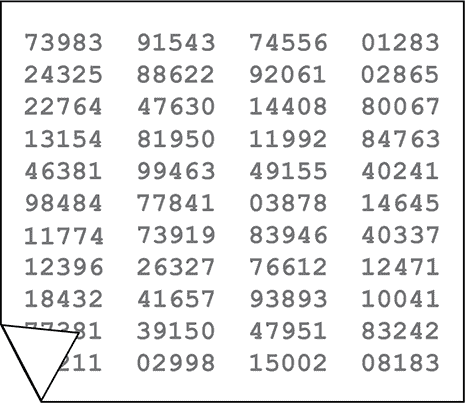
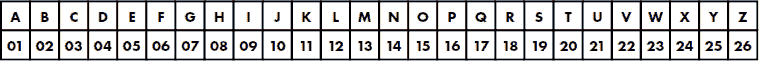
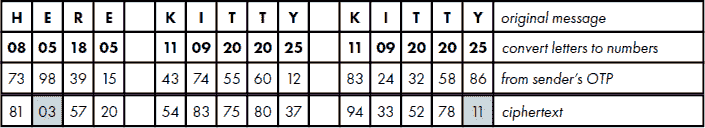
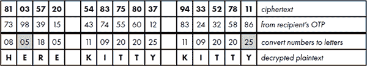
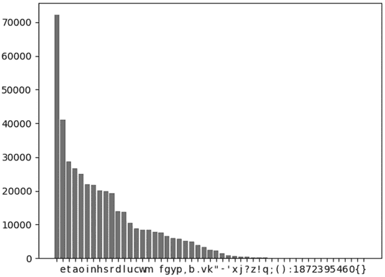

## 第四章：使用书籍密码发送超级机密信息


《*Rebecca 的密码*》是肯·福莱特（Ken Follett）创作的一本广受好评的畅销小说。故事背景设定在二战时期的开罗，基于真实事件，讲述了一名纳粹间谍和一名追捕他的英国情报官员的故事。书名指的是间谍使用的密码系统，它以达芙妮·杜穆里埃（Daphne du Maurier）所著的著名哥特式小说《*Rebecca*》为密钥。*Rebecca*被认为是 20 世纪最伟大的小说之一，德国人确实在战争期间将它作为密码书使用。

Rebecca 密码是*一次性密钥*的一种变体，一种无法破解的加密技术，它需要一个与所发送的信息大小至少相同的密钥。发送方和接收方各自持有一份密钥本，使用一次后，最上面的一张纸会被撕掉并丢弃。

一次性密钥提供绝对的、完美的安全性——即使是量子计算机也无法破解！尽管如此，密钥本仍有一些实际缺点，阻碍了它的广泛使用。其中最主要的是需要安全地传输和交付密钥本给发送方和接收方，存储它们的安全性，以及手动编码和解码消息的难度。

在《*Rebecca 的密码*》中，双方必须了解加密规则并且拥有相同版本的书籍才能使用该密码。在本章中，你将把书中描述的手动方法转化为一种更安全且更易于使用的数字技术。在这个过程中，你将使用到 Python 标准库、collections 模块和 random 模块中的一些有用函数。你还将稍微了解一下 Unicode 标准，这个标准确保了字母、数字等字符在所有平台、设备和应用中都能普遍兼容。

### **一次性密钥**

一次性密钥本质上是一个有序的纸张堆，每张纸上印有真正随机的数字，通常以五个一组的方式排列（见图 4-1）。为了方便隐藏，这些密钥本通常很小，可能需要一只强力放大镜才能读取。尽管这种方法显得有些老派，但一次性密钥产生的密码是世界上最安全的，因为每个字母都使用一个唯一的密钥进行加密。因此，密码分析技术，如频率分析，根本无法奏效。



图 4-1：一次性密钥纸张示例

要使用图 4-1 中的一次性密钥加密消息，首先为字母表中的每个字母分配一个两位数字。*A*等于 01，*B*等于 02，以此类推，如下表所示。



接下来，将你的简短信息中的字母转换成数字：


从一次性密码本页的左上角开始，按从左到右的顺序，为每个字母分配一个数字对（*密钥*），并将其加到该字母的数字值上。你将使用基数为 10 的数字对，因此，如果你的和大于 100，则使用模运算将结果截断为最后两位数字（103 变为 03）。下图中阴影单元格内的数字就是模运算的结果。



此图中的最后一行表示密文。请注意，在明文中重复的“KITTY”在密文中并未重复。每次加密“KITTY”都是唯一的。

要将密文解密回明文，接收方使用与其相同的密码本页。他们将自己的数字对放在密文对下方，然后进行减法运算。当减法结果为负数时，使用模运算（在减法前将密文值加上 100）。最后，他们将结果数字对转换回字母。



为了确保没有重复的密钥，消息中的字母数不能超过密码本上的密钥数。这就要求使用简短的消息，简短的消息有一个优点，就是更容易加密和解密，而且提供给密码分析员的破解机会更少。其他一些指导原则包括：

+   将数字写出（例如，2 写作 TWO）。

+   用*X*代替句号结束句子（例如，CALL AT NOONX）。

+   将无法避免的其他标点符号写出来（例如，逗号）。

+   以*XX*结束明文消息。

### **丽贝卡密码**

在小说*《丽贝卡的钥匙》*中，纳粹间谍使用了一种变体的一次性密码本。葡萄牙购买了相同版本的小说*《丽贝卡》*。其中两本由间谍保留，另两本交给北非的隆美尔元帅的工作人员。加密消息通过预定频率的无线电发送。每天最多发送一条消息，并且总是在午夜。

为了使用密钥，间谍需要获取当前日期——比如 1942 年 5 月 28 日——然后将当天的日期与年份相加（28 + 42 = 70）。这将决定使用哪一页小说作为一次性密码本。因为 5 月是第五个月，因此每个句子中的每第五个单词将被忽略。由于《丽贝卡密码》是计划仅在 1942 年相对短时间内使用，间谍不必担心日历中的重复会导致密钥的重复。

间谍的第一条消息如下：HAVE ARRIVED. CHECKING IN. ACKNOWLEDGE。 从第 70 页开始，他沿着页面读，直到找到字母*H*。它是第 10 个字符，忽略每第五个字母。字母表中的第 10 个字母是*J*，因此他在密文中使用这个字母代表*H*。接下来的字母*A*在*H*之后三个字母的位置找到，因此用字母表中的第三个字母*C*进行编码。这种方式一直持续，直到整个消息被加密。对于像*X*或*Z*这样的稀有字母，作者 Ken Follett 表示应用了特殊规则，但没有详细描述这些规则。

以这种方式使用书籍相较于真正的一次性密钥有明显的优势。引用福尔特的话，“密钥本身显然是为了加密目的，但书籍看起来十分无辜。”然而，仍然有一个缺点：加密和解密的过程繁琐且可能出错。让我们看看能否使用 Python 解决这个问题！

### **项目 #6：Rebecca 的数字密钥**

将《Rebecca》技巧转化为数字程序，相较于一次性密钥有几个优势：

+   编码和解码过程变得快速且无误。

+   可以发送更长的消息。

+   句号、逗号甚至空格都可以直接加密。

+   像*z*这样的稀有字母可以从书中的任何地方选择。

+   密码书可以隐藏在硬盘或云端数千本电子书中。

最后一项是非常重要的。在小说中，英国情报官员在一个被俘的德军前哨中发现了《Rebecca》的副本。通过简单的推理，他认出了它是一次性密钥的替代品。然而，如果是数字方法，这将更加困难。事实上，这本小说可以保存在一个小而易于隐藏的设备中，比如 SD 卡。这使得它与一次性密钥相似，一次性密钥通常不大于邮票。

然而，数字方法确实有一个缺点：程序是*可发现*的。虽然间谍可以简单地记住一次性密钥的规则，但在数字方法中，规则必须嵌入到软件中。通过编写看似无辜——或者至少是神秘——的程序，并让它请求用户输入消息和密码书的名称，可以最大限度地减少这个弱点。

目标

编写一个 Python 程序，使用数字小说作为一次性密钥加密和解密信息。

#### ***策略***

与间谍不同，你不需要小说中所有的规则，许多规则实际上根本无法使用。如果你曾使用过任何形式的电子书，你会知道页码是没有意义的。屏幕大小和文字大小的变化使得所有页码都不再唯一。而且因为你可以从书中的任何地方选择字母，你不一定需要为稀有字母或忽略计数中的数字设置特别的规则。

所以，你不需要完美地再现《Rebecca》密码。你只需生成类似的东西，最好是更好。

幸运的是，Python 的*可迭代对象*，比如列表和元组，使用数字索引来跟踪其中的每一项。通过将小说加载为列表，你可以利用这些索引作为每个字符的独特起始密钥。然后，你可以根据年份的天数来移动索引，模拟《Rebecca 的关键》中间谍的加密方法。

不幸的是，《Rebecca》目前还未进入公有领域。作为替代，我们将使用你在第二章中使用的亚瑟·柯南·道尔爵士的《失落的世界》文本文件。这本小说包含 51 个独特字符，出现了 421,545 次，因此你可以随机选择索引，几乎不必担心重复。这意味着你可以每次加密时都使用整本书作为一次性密钥，而不必局限于单张一次性密钥表上的少量数字。

**注意**

*如果你愿意，你可以下载并使用《Rebecca》的数字版。我只是不能免费提供给你！*

因为你会重复使用这本书，你需要考虑到*消息对消息*和*信息内*的密钥重复问题。消息越长，密码分析员可以研究的材料越多，破解代码就越容易。如果每条消息都使用相同的加密密钥，所有拦截到的消息就可以视为一条大消息。

对于消息对消息的问题，你可以模仿间谍并根据年份的天数来移动索引数字，使用 1 到 366 的范围来考虑闰年。在这个方案中，2 月 1 日将是 32。这样，每次加密时，书籍就会变成一个全新的一次性密钥表，因为相同字符会使用不同的密钥。移动一个或多个增量会重置所有索引，实际上是“撕掉”了之前的密钥表。与一次性密钥不同，你不必担心丢弃一张纸！

对于信息内重复的问题，在传输消息之前，你可以先进行检查。虽然这种情况不太可能发生，但程序在加密过程中有可能选取相同的字母两次，从而使用相同的索引两次。重复的索引基本上是重复的密钥，这会帮助密码分析员破译你的代码。所以，如果发现有重复的索引，你可以重新运行程序或重新措辞消息。

你还需要类似于《Rebecca 的关键》中的规则。

+   双方需要拥有相同的*失落的世界*数字副本。

+   双方需要知道如何移动索引。

+   尽量保持信息简洁。

+   请写出数字。

#### ***加密代码***

以下的*rebecca.py*代码会接收一条消息，并根据用户的要求返回加密或明文版本。消息可以直接输入，或从书籍网站下载。你还需要一个名为*lost.txt*的文本文件，放在与代码相同的文件夹中。

为了清晰起见，你将使用 *ciphertext*、*encrypt*、*message* 等变量名。不过，如果你真是一个间谍，恐怕你会避免使用那些可能暴露身份的术语，免得敌人拿到你的笔记本。

##### **导入模块并定义 main() 函数**

示例 4-1 导入了模块并定义了 main() 函数，用于运行程序。该函数会请求用户输入，调用所需的加密或解密函数，检查是否有重复的键，并打印出密文或明文。

是否在程序的开始或结束定义 main() 函数取决于个人选择。有时候，它可以作为整个程序的一个简洁、易读的总结。其他时候，它可能显得不合时宜，就像“倒马车”一样。从 Python 的角度来看，只要在程序结束时调用该函数，放置的位置并不重要。

```py
rebecca.py, part 1
import sys
import os
import random
from collections import defaultdict, Counter
def main():
    message = input("Enter plaintext or ciphertext: ")
    process = input("Enter 'encrypt' or 'decrypt': ")
    while process not in ('encrypt', 'decrypt'):
        process = input("Invalid process. Enter 'encrypt' or 'decrypt': ")
    shift = int(input("Shift value (1-366) = "))
    while not 1 <= shift <= 366:
        shift = int(input("Invalid value. Enter digit from 1 to 366: ")
 ➊ infile = input("Enter filename with extension: ")

    if not os.path.exists(infile):
        print("File {} not found. Terminating.".format(infile), file=sys.stderr)
        sys.exit(1)    
    text = load_file(infile)
    char_dict = make_dict(text, shift)

    if process == 'encrypt':
        ciphertext = encrypt(message, char_dict)
     ➋ if check_for_fail(ciphertext):
            print("\nProblem finding unique keys.", file=sys.stderr)
            print("Try again, change message, or change code book.\n",         
                  file=sys.stderr)
            sys.exit()
     ➌ print("\nCharacter and number of occurrences in char_dict: \n")
        print("{: >10}{: >10}{: >10}".format('Character', 'Unicode', 'Count'))
        for key in sorted(char_dict.keys()):
            print('{:>10}{:>10}{:>10}'.format(repr(key)[1:-1],
                                              str(ord(key)), 
                                              len(char_dict[key])))
        print('\nNumber of distinct characters: {}'.format(len(char_dict)))
        print("Total number of characters: {:,}\n".format(len(text)))

        print("encrypted ciphertext = \n {}\n".format(ciphertext))    
        print("decrypted plaintext = ")

     ➍ for i in ciphertext:
            print(text[i - shift], end='', flush=True)

   elif process == 'decrypt':
       plaintext = decrypt(message, text, shift)
       print("\ndecrypted plaintext = \n {}".format(plaintext))
```

示例 4-1：导入模块并定义 main() 函数

从导入 sys 和 os 开始，它们是两个让你能够与操作系统交互的模块；然后是 random 模块；接着是从 collections 模块导入 defaultdict 和 Counter。

collections 模块是 Python 标准库的一部分，包含了多个容器数据类型。你可以使用 defaultdict 来动态构建字典。如果 defaultdict 遇到缺失的键，它会提供默认值，而不是抛出错误。你将使用它来构建 *《失落的世界》* 中的字符字典及其对应的索引值。

Counter 是字典的子类，用于计数可哈希的对象。元素作为字典的键存储，其计数值作为字典的值存储。你将使用它来检查密文，并确保没有重复的索引。

在这一点，你开始定义 main() 函数。该函数首先会请求用户输入要加密或解密的消息。为了最大限度地提高安全性，用户应该手动输入此消息。接着，程序询问用户是要进行加密还是解密。一旦用户做出选择，程序会请求输入移位值。移位值代表一年中的日期，范围为 1 到 366（包括）。接下来，程序会要求输入 infile，这将是 *lost.txt*，即 *《失落的世界》* 的数字版 ➊。

在继续之前，程序会检查文件是否存在。它使用操作系统模块的 path.exists() 方法，并传入 infile 变量。如果文件不存在或路径和/或文件名不正确，程序会告知用户，使用 file=sys.stderr 选项在 Python Shell 中将“错误”消息显示为红色，并使用 sys.exit(1) 终止程序。1 用于标记程序因错误终止，而非正常终止。

接下来，你会调用一些稍后定义的函数。第一个函数将*lost.txt*文件加载为一个名为 text 的字符串，其中包括空格和标点等非字母字符。第二个函数构建一个字符及其对应索引的字典，并应用移位值。

现在，你开始使用条件判断来评估正在使用的处理过程。正如我之前提到的，为了清晰起见，我们使用了*加密*和*解密*这样的术语。在真正的间谍工作中，你会希望掩盖这些术语。如果用户选择了加密，则调用该函数，使用字符字典加密消息。当该函数返回时，程序已成功加密消息。但不要认为它一定如预期般工作！你需要检查它是否能正确解密，并确保没有重复的键。为此，你将开始一系列质量控制步骤。

首先，你检查是否有重复的键 ➋。如果此函数返回 True，提示用户重试、更改消息，或将书籍换成其他书籍，而不是*失落的世界*。对于消息中的每个字符，你将使用 char_dict 并随机选择一个索引。即使每个字符有数百甚至数千个索引，你也可能会为某个字符多次选择相同的索引。

使用稍有不同参数重新运行程序，应该能够解决这个问题，除非你的消息很长且包含大量低频字符。处理这种罕见情况可能需要重新措辞消息，或者找一本比*失落的世界*更大的手稿。

**注意**

*Python 的 random 模块并不会产生真正的随机数，而是产生可以预测的伪随机数。任何使用伪随机数的密码系统都有可能被密码分析师破解。为了在生成随机数时获得最大安全性，应该使用 Python 的 os.urandom()函数。*

现在，打印字符字典的内容，这样你可以看到各种字符在小说中出现的次数 ➌。这将帮助你指导信息的编写，尽管*失落的世界*中包含了大量有用的字符。

```py
Character and number of occurrences in char_dict: 

 Character   Unicode     Count
        \n        10      7865
                  32     72185
         !        33       282
         "        34      2205
         '        39       761
         (        40        62
         )        41        62
         ,        44      5158
         -        45      1409
         .        46      3910
         0        48         1
         1        49         7
         2        50         3
         3        51         2
         4        52         2
         5        53         2
         6        54         1
         7        55         4
         8        56         5
         9        57         2
         :        58        41
         ;        59       103
         ?        63       357
         a        97     26711
         b        98      4887
         c        99      8898
         d       100     14083
         e       101     41156
         f       102      7705
         g       103      6535
         h       104     20221
         i       105     21929
         j       106       431
         k       107      2480
         l       108     13718
         m       109      8438
         n       110     21737
         o       111     25050
         p       112      5827
         q       113       204
         r       114     19407
         s       115     19911
         t       116     28729
         u       117     10436
         v       118      3265
         w       119      8536
         x       120       573
         y       121      5951
         z       122       296
         {       123         1
         }       125         1

Number of distinct characters: 51
Total number of characters: 421,545
```

为了生成这个表格，你使用 Python 的格式规范迷你语言（*[`docs.python.org/3/library/string.html#formatspec`](https://docs.python.org/3/library/string.html#formatspec)*)来打印三个列的标题。大括号中的数字表示字符串中应包含的字符数，而大于号表示右对齐。

然后程序遍历字符字典中的键，并使用相同的列宽和对齐方式打印它们。它打印字符、字符的 Unicode 值，以及它在文本中出现的次数。

你可以使用 repr() 来打印键。这个内建函数返回一个字符串，包含对象的可打印表示形式。也就是说，它返回关于对象的所有信息，以便调试和开发使用的格式。这允许你显式地打印像换行符 (\n) 和空格这样的字符。索引范围 [1:-1] 排除了输出字符串两边的引号。

ord() 内建函数返回一个整数，表示字符的 Unicode 代码点。计算机只能处理数字，因此必须为每个可能的字符分配一个数字，例如 *%*、5、 或 *A*。*Unicode 标准* 确保每个字符，不论平台、设备、应用程序或语言，都有一个唯一的数字，并且具有普遍兼容性。通过向用户展示 Unicode 值，程序使用户能够察觉文本文件中发生的任何异常情况，例如同一个字母以多个不同的字符形式出现。

对于第三列，你获取每个字典键的长度。它表示该字符在小说中出现的次数。程序然后打印出不同字符的数量以及文本中所有字符的总数。

最后，你通过打印密文和解密后的明文来完成加密过程，以便检查。为了破译消息，程序遍历密文中的每个项，并使用该项作为文本 ➍ 的索引，减去之前添加的移位值。当你打印结果时，程序使用 end='' 替代默认的换行符，因此每个字符不会显示在单独的一行。

main() 函数以一个条件语句结束，用于检查 `process == 'decrypt'`。如果用户选择解密消息，程序将调用 decrypt() 函数，然后打印解密后的明文。请注意，你可以在这里简单地使用 else，但我选择使用 elif 以提高清晰度和可读性。

##### **加载文件并创建字典**

清单 4-2 定义了用于加载文本文件并创建文件中字符及其对应索引的字典的函数。

```py
rebecca.py, part 2
   def load_file(infile):
       """Read and return text file as a string of lowercase characters."""
       with open(infile) as f:
           loaded_string = f.read().lower()
       return loaded_string

➊ def make_dict(text, shift):
       """Return dictionary of characters and shifted indexes."""
       char_dict = defaultdict(list)
       for index, char in enumerate(text):
         ➋ char_dict[char].append(index + shift)
       return char_dict
```

清单 4-2：定义 load_file() 和 make_dict() 函数

这个清单开始时定义了一个函数，用于将文本文件加载为字符串。使用 with 打开文件确保文件在函数结束时自动关闭。

一些用户在加载文本文件时，可能会遇到类似以下的错误：

```py
UnicodeDecodeError: 'charmap' codec can't decode byte 0x81 in position
27070:character maps to <undefined>
```

在这种情况下，尝试通过添加编码（encoding）和错误（errors）参数来修改 open 函数。

```py
  with open(infile, encoding='utf-8', errors='ignore') as f:
```

关于这个问题的更多信息，请参见 第 35 页 中的 第二章。

打开文件后，将文件内容读取为一个字符串，并将所有文本转换为小写字母。然后返回该字符串。

下一步是将字符串转换为字典。定义一个函数，接受这个字符串和移位值作为参数 ➊。程序使用 `defaultdict()` 创建一个 `char_dict` 变量。这个变量将是一个字典。然后，程序将列表的类型构造函数传递给 `defaultdict()`，因为你希望字典的值是包含索引的列表。

使用 `defaultdict()` 时，每当一个操作遇到字典中尚不存在的项时，名为 `default_factory()` 的函数将被调用且不带参数，其输出将作为该项的值。任何不存在的键都会获得由 `default_factory` 返回的值，而且不会抛出 `KeyError`。

如果你试图在没有方便的 `collections` 模块的情况下动态创建字典，你将得到 `KeyError`，如下例所示。

```py
>>> mylist = ['a', 'b', 'c']
>>> d = dict()
>>> for index, char in enumerate(mylist):
 d[char].append(index)

Traceback (most recent call last):
 File "<pyshell#16>", line 2, in <module>
  d[char].append(index)
KeyError: 'a'
```

内置的 `enumerate()` 函数充当自动计数器，因此你可以轻松获取从 *失落的世界* 中提取的字符串中每个字符的索引。`char_dict` 中的键是字符，而这些字符在文本中可能出现成千上万次。因此，字典的值是保存所有这些字符出现位置的索引列表。当将移位值添加到索引并将其附加到值列表时，你可以确保每个消息的索引都是唯一的 ➋。

通过返回字符字典来结束函数。

##### **加密消息**

清单 4-3 定义了一个加密消息的函数。生成的密文将是一个索引列表。

```py
rebecca.py, part 3
def encrypt(message, char_dict):
    """Return list of indexes representing characters in a message."""
    encrypted = []
    for char in message.lower():
     ➊ if len(char_dict[char]) > 1:
            index = random.choice(char_dict[char])
        elif len(char_dict[char]) == 1: # Random.choice fails if only 1 choice
            index = char_dict[char][0]
     ➋ elif len(char_dict[char]) == 0:
            print("\nCharacter {} not in dictionary.".format(char),
                  file=sys.stderr)
            continue
        encrypted.append(index)
    return encrypted
```

清单 4-3：定义一个加密明文消息的函数

`encrypt()` 函数将把消息和 `char_dict` 作为参数传入。首先，通过创建一个空列表来存储密文。接着，开始遍历消息中的字符并将它们转换为小写，以匹配 `char_dict` 中的字符。

如果与字符关联的索引数量大于 1，程序将使用 `random.choice()` 方法随机选择该字符的一个索引 ➊。

如果字符在 `char_dict` 中仅出现一次，`random.choice()` 会抛出一个错误。为了解决这个问题，程序使用条件语句，并硬编码选择索引的方式，索引将位于位置 [0]。

如果字符在 *失落的世界* 中不存在，它也不会出现在字典中，因此使用条件语句检查此情况 ➋。如果评估为 True，则打印警告信息，并使用 `continue` 返回循环的开始，而不选择索引。稍后，当质量控制步骤在密文上运行时，解密后的明文中将会出现一个空格，表示该字符的位置。

如果没有调用 `continue`，那么程序将把索引添加到加密列表中。当循环结束时，你会返回该列表以结束函数。

为了了解其工作原理，我们来看看纳粹间谍在 *Rebecca 的钥匙* 中发送的第一条消息，示例如下：

已到达。正在检查。确认。

使用这个消息和 70 的移位值生成了以下随机生成的密文：

```py
[125711, 106950, 85184, 43194, 45021, 129218, 146951, 157084, 75611, 122047,
121257, 83946, 27657, 142387, 80255, 160165, 8634, 26620, 105915, 135897,
22902, 149113, 110365, 58787, 133792, 150938, 123319, 38236, 23859, 131058,
36637, 108445, 39877, 132085, 86608, 65750, 10733, 16934, 78282]
```

由于算法的随机性，你的结果可能会有所不同。

##### **解密消息**

示例 4-4 定义了一个函数来解密密文。用户会在 main() 函数提示输入时复制并粘贴密文。

```py
rebecca.py, part 4
def decrypt(message, text, shift):
    """Decrypt ciphertext list and return plaintext string."""
    plaintext = ''
    indexes = [s.replace(',', '').replace('[', '').replace(']', '')
               for s in message.split()]
    for i in indexes:
        plaintext += text[int(i) - shift]
    return plaintext
```

示例 4-4：定义一个函数来解密明文消息

该示例首先定义了一个名为 decrypt() 的函数，参数包括消息、正文（文本）和位移值。当然，消息将是密文形式，由表示位移索引的数字列表组成。你立即创建一个空字符串来存储解密后的明文。

大多数人会在 main() 函数提示输入时复制并粘贴密文。此输入可能包含或不包含列表中的方括号。而且，由于用户是通过 input() 函数输入密文，因此结果是一个 *字符串*。为了将索引转换为可以进行位移的整数，首先需要删除非数字字符。可以使用字符串的 replace() 和 split() 方法，同时利用列表推导式返回一个列表。列表推导式是 Python 中执行循环的简洁方式。

要使用 replace()，你需要传入你想要替换的字符，后跟用于替换的字符。在这种情况下，使用空格进行替换。注意，你可以通过点符号将它们“串联”在一起，一次性处理逗号和方括号。是不是很酷？

接下来，开始遍历索引。程序将当前的索引从字符串转换为整数，以便你可以减去在加密时应用的位移值。你使用索引访问字符列表并获取相应的字符。然后将字符添加到明文字符串中，并在循环结束时返回明文。

##### **检查失败并调用 main() 函数**

示例 4-5 定义了一个函数来检查密文中的重复索引（密钥），并通过调用 main() 函数结束程序。如果该函数发现重复的索引，可能是加密已被破坏，main() 函数会告诉用户如何修复它，然后终止程序。

```py
rebecca.py, part 5
def check_for_fail(ciphertext):
    """Return True if ciphertext contains any duplicate keys."""
    check = [k for k, v in Counter(ciphertext).items() if v > 1]
    if len(check) > 0:
        return True

if __name__ == '__main__':
    main()
```

示例 4-5：定义一个函数检查重复的索引并调用 main()

这个代码列出了一个名为 check_for_fail() 的函数，它接受密文作为参数。它会检查密文中的任何索引是否有重复。记住，一次性密码本的方法之所以有效，是因为每个密钥都是唯一的；因此，密文中的每个索引应该是唯一的。

为了查找重复项，程序再次使用了 Counter。它使用列表推导式构建一个包含所有重复索引的列表。这里，k 代表（字典）键，v 代表（字典）值。由于 Counter 生成每个键的计数字典，你可以理解为：对于从密文生成的字典中的每个键值对，创建一个包含所有出现超过一次的键的列表。如果有重复项，就将相应的键添加到检查列表中。

现在你需要做的就是获取检查的长度。如果它大于零，则表示加密已被破解，程序将返回 True。

程序以调用程序作为模块或独立模式的样板代码结束。

#### ***发送消息***

以下消息摘自*《Rebecca 的关键》*。你可以在可下载的*Chapter_4*文件夹中找到它，文件名为*allied_attack_plan.txt*。作为测试，尝试用 70 的位移发送它。当请求输入时，使用操作系统的全选、复制和粘贴命令来传输文本。如果它未通过 check_for_fail()测试，重新运行一次！

```py
Allies plan major attack for Five June. Begins at oh five twenty with
bombardment from Aslagh Ridge toward Rommel east flank. Followed by tenth
Indian Brigade infantry with tanks of twenty second Armored Brigade on Sidi
Muftah. At same time, thirty second Army Tank Brigade and infantry to charge
north flank at Sidra Ridge. Three hundred thirty tanks deployed to south and
seventy to north.
```

这个技术的好处在于你可以使用适当的标点符号，至少如果你将消息输入到解释器窗口中。通过外部复制的文本可能需要去除换行符（例如\r\n 或\n），并将其放置在回车符出现的地方。

当然，只有*《失落的世界》*中的字符可以被加密。程序会警告你出现异常的情况，然后用空格替代缺失的字符。

为了保持隐秘，你不想将明文或密文消息保存到文件中。从终端复制和粘贴是最好的方法。只需记得在完成后复制一些新的内容，以免在剪贴板上留下可疑证据！

如果你想更花哨一些，可以使用 Al Sweigart 编写的 pyperclip 库，直接从 Python 复制和粘贴文本到剪贴板。你可以在*[`pypi.org/project/pyperclip/`](https://pypi.org/project/pyperclip/)*了解更多信息。

### **总结**

在这一章中，你学会了使用 collections 模块中的 defaultdict 和 Counter；random 模块中的 choice()；以及 Python 标准库中的 replace()、enumerate()、ord()和 repr()。最终，制作出了一个基于一次性密码本技术的加密程序，能够生成无法破解的密文。

### **进一步阅读**

*《Rebecca 的关键》（Penguin Random House, 1980）*，作者肯·福雷特，是一本令人兴奋的小说，以其深刻的历史细节、对二战期间开罗的准确描绘以及扣人心弦的间谍故事情节而著称。

*《密码书：从古埃及到量子密码学的秘密科学》*（Anchor, 2000），作者西蒙·辛格，是一本有趣的密码学历史回顾，包括对一次性密码本的讨论。

如果你喜欢破解密码，可以查看 *Cracking Codes with Python*（No Starch Press, 2018），作者 Al Sweigart。该书面向密码学和 Python 编程初学者，涵盖了许多密码类型，包括反向密码、凯撒密码、换位密码、替换密码、仿射密码和维吉尼亚密码。

*Impractical Python Projects: Playful Programming Activities to Make You Smarter*（No Starch Press, 2019），由 Lee Vaughan 著，书中包括额外的密码，例如联合路由密码、铁路栅栏密码和特雷瓦尼恩空密码，以及用隐形电子墨水写作的技巧。

### **实践项目：字符图表**

如果你已经安装了 matplotlib（请参见第 6 页的“安装 Python 库”），你可以使用条形图将《失落的世界》中的可用字符及其出现频率可视化。这可以补充当前在 *rebecca.py* 程序中使用的每个字符及其计数的 shell 输出。

互联网上充斥着关于 matplotlib 图表的示例代码，所以只需搜索 *制作简单的条形图 matplotlib*。在绘制之前，您需要先按降序排序计数。

记住英语中最常见字母的助记符是“etaoin”。如果按降序绘图，你会发现 *失落的世界* 数据集也不例外（图 4-2）！



图 4-2：在《失落的世界》数字版中字符出现的频率

请注意，最常见的字符是空格。这使得加密空格变得容易，进一步困扰任何密码分析！

你可以在附录和书籍网站上找到解决方案 *practice_barchart.py*。

### **实践项目：第二次世界大战时期的秘密通信**

根据维基百科上关于 *Rebecca* 的文章（*[`en.wikipedia.org/wiki/Rebecca_(novel`](https://en.wikipedia.org/wiki/Rebecca_(novel))），二战期间德国人确实尝试使用这本小说作为书码的关键。与其逐字编码消息，不如使用书中的单词来构成句子，按页码、行号和行内位置来引用。

复制并编辑 *rebecca.py* 程序，使其使用单词而不是字母。为了帮助你入门，这里有一种使用列表推导式将文本文件作为单词列表加载的方法，而不是字符：

```py
with open('lost.txt') as f:
  words = [word.lower() for line in f for word in line.split()]
  words_no_punct = ["".join(char for char in word if char.isalpha())
                for word in words]

print(words_no_punct[:20])  # Print first 20 words as a QC check
```

输出应该像这样：

```py
['i', 'have', 'wrought', 'my', 'simple', 'plan', 'if', 'i', 'give', 'one',
'hour', 'of', 'joy', 'to', 'the', 'boy', 'whos', 'half', 'a', 'man']
```

请注意，所有标点符号，包括撇号，已被去除。消息需要遵循这一惯例。

你还需要处理《失落的世界》中未出现的单词，比如专有名词和地名。一种方法是使用“首字母模式”，在这种模式下，接收者只使用标志之间每个单词的首字母。标志应该是常见的单词，比如*a*和*the*，并且重复使用它们，以便更容易识别开始和结束的标志。在这种情况下，*a a*表示首字母模式的开始，*the the*表示结束。例如，要处理短语*Sidi Muftah with ten tanks*，首先将其直接运行以识别缺失的单词。

```py
Enter plaintext or ciphertext: sidi muftah with ten tanks
Enter 'encrypt' or 'decrypt': encrypt
Shift value (1-365) = 5
Enter filename with extension: lost.txt

Character sidi not in dictionary.

Character muftah not in dictionary.

Character tanks not in dictionary.

encrypted ciphertext = 
 [23371, 7491]

decrypted plaintext = 
with ten
```

在识别出缺失的单词后，请重新措辞消息并使用首字母模式拼写它们。我在以下代码片段中将首字母标记为灰色：

```py
Enter plaintext or ciphertext: a a so if do in my under for to all he the the
with ten a a tell all night kind so the the
Enter 'encrypt' or 'decrypt': encrypt
Shift value (1-365) = 5
Enter filename with extension: lost.txt

encrypted ciphertext = 
 [29910, 70641, 30556, 60850, 72292, 32501, 6507, 18593, 41777, 23831, 41833,
16667, 32749, 3350, 46088, 37995, 12535, 30609, 3766, 62585, 46971, 8984,
44083, 43414, 56950]

decrypted plaintext =
a a so if do in my under for to all he the the with ten a a tell all night
kind so the the
```

在《失落的世界》中，*a*出现了 1,864 次，*the*出现了 4,442 次。如果你坚持使用简短的消息，就不应该重复键。否则，你可能需要使用多个标志字符，或者禁用 check-for-fail()函数并接受一些重复项。

随意提出自己的方法来处理问题单词。作为精通规划的德国人，他们肯定有*某种*想法，否则他们根本不会考虑使用书籍密码！

你可以在附录中找到一个简单的首字母解决方案，*practice_WWII_words.py*，或者在线访问* [`nostarch.com/real-world-python/`](https://nostarch.com/real-world-python/) *。
