## 发现冥王星


根据伍迪·艾伦的说法，成功的 80%仅仅是出现在场。这无疑描述了克莱德·汤博的成功，一个没有受过训练的堪萨斯农场男孩，在 1920 年代长大。由于对天文学充满热情却没有上大学的钱，他尝试了一下，邮寄了自己最好的天文素描给洛威尔天文台。令他大吃一惊的是，他被聘为助手。一年后，他发现了冥王星，并因此获得了永恒的荣耀！

费尔西瓦尔·洛威尔，这位著名的天文学家和洛威尔天文台的创始人，基于海王星轨道的扰动提出了冥王星的存在。他的计算是错误的，但纯粹巧合的是，他正确预测了冥王星的轨道路径。在 1906 年到他 1916 年去世之间，他曾两次拍摄冥王星。每次，他的团队都未能注意到它。而汤博则在 1930 年 1 月，经过仅一年寻找，拍摄并识别出了冥王星（图 5-1）。

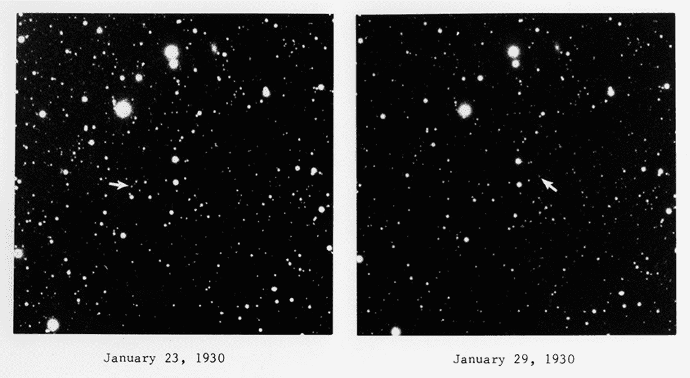

图 5-1：冥王星的发现底片，箭头指示的位置

汤博所取得的成就非凡。在没有计算机的情况下，他所遵循的方法论既不切实际，又繁琐且要求极高。他必须一夜又一夜地拍摄并重新拍摄天空的某些小部分，通常是在一个冰冷的圆顶下，圆顶被刺骨的寒风吹动。然后，他需要冲洗并筛选所有底片，寻找在星星密集区域中任何微弱的运动迹象。

虽然他没有计算机，但他确实拥有一台先进的设备，叫做*闪烁比较器*，这使他能够快速在连续几晚的底片之间切换。在通过闪烁比较器观察时，恒星保持静止，但冥王星作为一个移动物体，像信标一样闪烁。

在本章中，你将首先编写一个 Python 程序，复制 20 世纪初期的闪烁比较器。接着，你将进入 21 世纪，编写一个程序，利用现代计算机视觉技术自动检测运动物体。

**注意**

*2006 年，国际天文学联合会将冥王星重新分类为矮行星。这是基于在柯伊伯带中发现了其他与冥王星相似的天体，包括一个——厄里斯——它的体积较小，但质量比冥王星大 27%。*

### **项目#7：复制闪烁比较器**

冥王星可能是用望远镜拍摄的，但它是用显微镜发现的。闪烁比较器（图 5-2），也叫做*闪烁显微镜*，允许用户安装两张照片板并快速切换查看其中一张到另一张。在这种“闪烁”过程中，任何在两张照片之间发生位置变化的物体都会显得来回跳动。

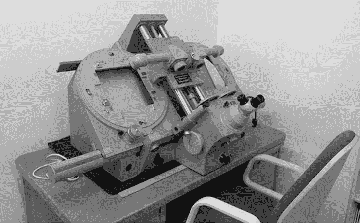

图 5-2：闪烁比较器

为了使该技术有效，照片需要在相同的曝光条件下拍摄，并且具有相似的观看条件。最重要的是，两张图像中的星星必须完全对齐。在汤博（Tombaugh）时代，技术人员通过艰苦的手工劳动来完成这一过程；他们在长达一个小时的曝光过程中小心引导望远镜，显影胶片后，再通过闪烁比较器进行微调对齐。正因为这项精细的工作，汤博有时需要花费一周的时间来检查一对胶片。

在这个项目中，你将数字化复制对齐胶片并进行闪烁显示的过程。你将处理明亮和昏暗的物体，观察不同曝光下照片的影响，并比较使用正片与汤博所用的负片的效果。

**目标**

编写一个 Python 程序，将两张几乎相同的图像对齐，并在同一窗口中快速交替显示它们。

#### ***策略***

该项目的照片已经拍摄完成，因此你只需要将它们对齐并进行闪烁显示。图像对齐通常被称为图像*配准*。这涉及对其中一张图像进行垂直、水平或旋转的变换。如果你曾用数码相机拍摄过全景照片，那么你一定见过配准技术的应用。

图像配准按照以下步骤进行：

1.  在每张图像中定位出独特的特征。

1.  用数字描述每个特征。

1.  使用数字描述符匹配每张图像中相同的特征。

1.  将一张图像进行扭曲，使得匹配的特征在两张图像中的像素位置相同。

为了获得良好的效果，图像应该具有相同的大小，并覆盖几乎相同的区域。

幸运的是，OpenCV Python 包附带了可以执行这些步骤的算法。如果你跳过了第一章，你可以在第 6 页阅读关于 OpenCV 的内容。

一旦图像完成配准，你需要将它们显示在同一个窗口中，使其精确重叠，然后循环显示若干次。再次强调，你可以借助 OpenCV 轻松实现这一点。

#### ***数据***

你需要的图像位于书籍支持文件中的*Chapter_5*文件夹，可以从*[`nostarch.com/real-world-python/`](https://nostarch.com/real-world-python/)*下载。文件夹结构应如图 5-3 所示。下载文件夹后，请不要更改此组织结构或文件夹内容和名称。

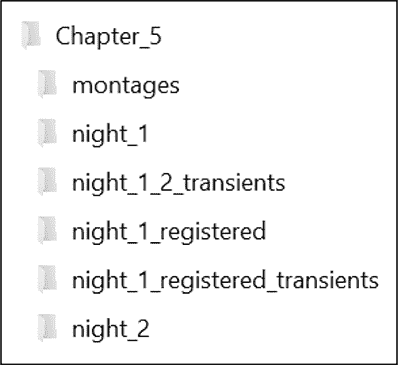

图 5-3：项目 7 的文件夹结构

*night_1* 和 *night_2* 文件夹包含你将用来开始的输入图像。从理论上讲，这些图像应该是拍摄于不同夜晚的同一片区域的图像。这里使用的是相同的星空图像，且我添加了一个人工的 *短暂天体*。短暂天体，简称 *短暂天文事件*，是一个在相对较短的时间框架内可以检测到其运动的天体。彗星、小行星和行星都可以被视为短暂天体，因为它们的运动在更静态的银河背景下很容易被检测到。

表 5-1 简要描述了 *night_1* 文件夹的内容。该文件夹包含文件名中带有 *left* 的文件，表示它们应该放置在闪烁比较仪的左侧。*night_2* 文件夹中的图像文件名包含 *right*，应放置在另一侧。

**表 5-1:** *night_1* 文件夹中的文件

| 文件名 | 描述 |
| --- | --- |
| *1_bright_transient_left.png* | 包含一个明亮的短暂天体 |
| *2_dim_transient_left.png* | 包含一个直径为单个像素的暗短暂天体 |
| *3_diff_exposures_left.png* | 包含一个背景过曝的暗短暂天体 |
| *4_single_transient_left.png* | 仅包含左侧图像中的明亮短暂天体 |
| *5_no_transient_left.png* | 没有短暂天体的星空 |
| *6_bright_transient_neg_left.png* | 第一个文件的负片，显示汤博使用的图像类型 |

图 5-4 是其中一张图像的示例。箭头指向短暂天体（但不属于图像文件的一部分）。

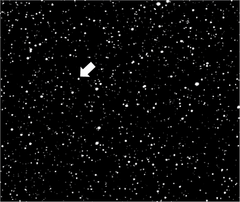

图 5-4: 1_bright_transient_left.png，箭头指示短暂天体

为了模拟完美对齐望远镜的困难，我稍微移动了 *night_2* 文件夹中的图像，使它们相对于 *night_1* 文件夹中的图像有所偏移。你需要遍历这两个文件夹中的内容，注册并比较每一对照片。因此，每个文件夹中的文件数应相同，且命名规则应确保照片正确配对。

#### ***闪烁比较仪代码***

以下 *blink_comparator.py* 代码将数字化复制一个闪烁比较仪。可以在网站的 *Chapter_5* 文件夹中找到此程序。你还需要上一节描述的文件夹。将代码保存在 *night_1* 和 *night_2* 文件夹之上的文件夹中。

##### **导入模块并分配常量**

列表 5-1 导入了运行程序所需的模块，并为接受的最小关键点匹配数分配了常量。关键点，也叫兴趣点，是图像中的有趣特征，可用于表征图像。它们通常与强烈的亮度变化相关，例如角点，或者在这个例子中是星体。

```py
blink_comparator.py, part 1
import os
from pathlib import Path
import numpy as np
import cv2 as cv

MIN_NUM_KEYPOINT_MATCHES = 50
```

列表 5-1: 导入模块并为关键点匹配分配常量

首先导入操作系统模块，使用它来列出文件夹中的内容。接着导入 pathlib，一个简化处理文件和文件夹的有用模块。最后导入 NumPy 和 cv（OpenCV）用于处理图像。如果你跳过了第一章，你可以在第 8 页找到 NumPy 的安装说明。

为接受的最小关键点匹配数量分配一个常量变量。为了提高效率，你最好选择一个能够产生可接受配准结果的最小值。在这个项目中，算法运行非常快，因此可以增加这个值，而不会产生显著的成本。

##### **定义 main()函数**

清单 5-2 定义了 main()函数的第一部分，用于运行程序。这些初步步骤创建了列表和目录路径，用于访问各种图像文件。

```py
blink_comparator.py, part 2 
def main():
    """Loop through 2 folders with paired images, register & blink images."""
    night1_files = sorted(os.listdir('night_1'))
    night2_files = sorted(os.listdir('night_2'))             
    path1 = Path.cwd() / 'night_1'
    path2 = Path.cwd() / 'night_2'
    path3 = Path.cwd() / 'night_1_registered'
```

清单 5-2：定义 main()的第一部分，用于操作文件和文件夹

首先定义 main()函数，然后使用 os 模块的 listdir()方法来创建*night_1*和*night_2*文件夹中所有文件名的列表。对于*night_1*文件夹，listdir()返回以下内容：

```py
['1_bright_transient_left.png', '2_dim_transient_left.png', '3_diff_exposures_
left.png', '4_no_transient_left.png', '5_bright_transient_neg_left.png']
```

请注意，os.listdir()在返回文件时并不对文件进行排序。底层操作系统决定了排序顺序，这意味着 macOS 返回的列表将与 Windows 不同！为了确保列表一致且文件正确配对，可以用内建的 sorted()函数包装 os.listdir()。该函数会基于文件名的第一个字符返回按数字顺序排列的文件。

接下来，使用 pathlib 的 Path 类将路径名分配给变量。前两个变量将指向两个输入文件夹，第三个变量将指向一个输出文件夹，用于存放配准后的图像。

pathlib 模块是 Python 3.4 引入的，它是 os.path 的替代方案，用于处理文件路径。os 模块将路径视为字符串，这可能会很麻烦，并且需要你使用标准库中的多个功能。相反，pathlib 模块将路径视为对象，并将所需的功能集中在一个地方。pathlib 的官方文档位于* [`docs.python.org/3/library/pathlib.html`](https://docs.python.org/3/library/pathlib.html) *。

对于目录路径的第一部分，使用 cwd()类方法获取当前工作目录。如果你至少有一个 Path 对象，你可以在路径指定中混合使用对象和字符串。你可以将表示文件夹名称的字符串与/符号连接起来。这与使用 os.path.join()类似，如果你熟悉 os 模块的话。

请注意，你需要在项目目录内执行程序。如果从文件系统的其他地方调用它，将会失败。

##### **在 main()中的循环**

示例 5-3，仍然在 main()函数中，通过一个大的 for 循环运行程序。这个循环会从两个“night”文件夹中的每一个提取一个文件，将它们作为灰度图像加载，找到每张图像中的匹配关键点，利用这些关键点将第一张图像变换（或*配准*）以匹配第二张图像，保存配准后的图像，然后比较（或*闪烁*）配准后的第一张图像和原始的第二张图像。我还包括了一些可选的质量控制步骤，在你确认结果满意后可以将它们注释掉。

```py
blink_comparator.py, part 3
for i, _ in enumerate(night1_files):    
    img1 = cv.imread(str(path1 / night1_files[i]), cv.IMREAD_GRAYSCALE)
    img2 = cv.imread(str(path2 / night2_files[i]), cv.IMREAD_GRAYSCALE)
    print("Comparing {} to {}.\n".format(night1_files[i], night2_files[i]))
 ➊ kp1, kp2, best_matches = find_best_matches(img1, img2)
    img_match = cv.drawMatches(img1, kp1, img2, kp2, 
                               best_matches, outImg=None)
    height, width = img1.shape
    cv.line(img_match, (width, 0), (width, height), (255, 255, 255), 1)
 ➋ QC_best_matches(img_match)  # Comment out to ignore.
    img1_registered = register_image(img1, img2, kp1, kp2, best_matches)

 ➌ blink(img1, img1_registered, 'Check Registration', num_loops=5)  
    out_filename = '{}_registered.png'.format(night1_files[i][:-4])
    cv.imwrite(str(path3 / out_filename), img1_registered) # Will overwrite!
    cv.destroyAllWindows()
    blink(img1_registered, img2, 'Blink Comparator', num_loops=15)
```

示例 5-3：在 main()函数中运行程序循环

通过枚举 night1_files 列表开始循环。内置的 enumerate()函数为列表中的每个项目添加一个计数器，并返回该计数器以及项目。由于你只需要计数器，可以使用单个下划线(_)表示列表项。按惯例，单个下划线表示一个临时或不重要的变量。它还可以让代码检查程序（例如 Pylint）保持正常。如果你在这里使用一个变量名，例如 infile，Pylint 会抱怨一个*未使用的变量*。

```py
W: 17,11: Unused variable 'infile' (unused-variable)
```

接下来，使用 OpenCV 加载图像及其在 night2_files 列表中的配对图像。注意，你必须将路径转换为字符串，以便传递给 imread()方法。你还需要将图像转换为灰度图像。这样，你只需处理单通道图像，它表示强度。为了跟踪循环过程中发生的事情，可以在 shell 中打印一条消息，指示正在比较哪些文件。

现在，找到关键点及其最佳匹配 ➊。find_best_matches()函数（稍后你将定义）将返回这三个变量：kp1，表示第一个加载图像的关键点；kp2，表示第二个图像的关键点；以及 best_matches，表示匹配的关键点列表。

这样，你可以通过视觉检查匹配结果，使用 OpenCV 的 drawMatches()方法在 img1 和 img2 上绘制它们。作为参数，该方法接受每张图像及其关键点、最佳匹配关键点列表和输出图像。在此例中，输出图像参数设置为 None，因为你只是查看输出，而不是将其保存到文件中。

为了区分这两张图像，在 img1 的右侧画一条垂直的白线。首先，使用 shape 获取图像的高度和宽度。接下来，调用 OpenCV 的 line()方法，并传入你要绘制的图像、起始和结束坐标、线条颜色以及线条粗细。请注意，这是一张彩色图像，因此要表示白色，你需要使用完整的 BGR 元组(255, 255, 255)，而不是在灰度图像中使用的单一强度值(255)。

现在，调用质量控制函数——稍后你将定义——来显示匹配结果 ➋。图 5-5 展示了一个示例输出。你可能希望在确认程序正常运行后注释掉这一行。

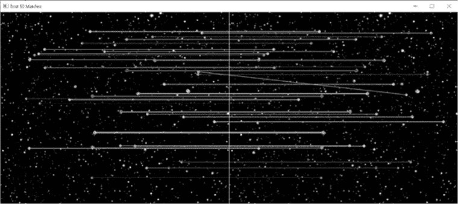

图 5-5：QC_best_matches() 函数的示例输出

找到并检查了最佳关键点匹配后，是时候将第一张图像注册到第二张图像了。使用稍后编写的函数来执行此操作。将两张图像、关键点和最佳匹配列表传递给该函数。

Blink 比较器（名为 blink()）是你稍后将编写的另一个函数。在这里调用它，查看注册过程对第一张图像的影响。传递给它原始图像和注册后的图像、显示窗口的名称以及你希望执行的闪烁次数 ➌。该函数将在两张图像之间闪烁。你看到的“摇晃”程度将取决于匹配 img2 所需的扭曲量。确认程序按预期运行后，可能想注释掉这一行。

接下来，将注册后的图像保存到名为 *night_1_registered* 的文件夹中，该文件夹路径由 path3 变量指向。首先，分配一个文件名变量，引用原始文件名，并在末尾附加 *_registered.png*。为了避免在名称中重复文件扩展名，使用索引切片（[:-4]）将其去除，然后再添加新的结尾。最后，使用 imwrite() 保存文件。请注意，这将覆盖具有相同名称的现有文件，而不会发出警告。

在开始寻找瞬时变化时，你需要一个干净的视图，因此调用方法销毁所有当前的 OpenCV 窗口。然后再次调用 blink() 函数，将注册后的图像、第二张图像、窗口名称以及循环图像的次数传递给它。第一张图像将并排显示在 图 5-6 中。你能找到瞬时变化吗？

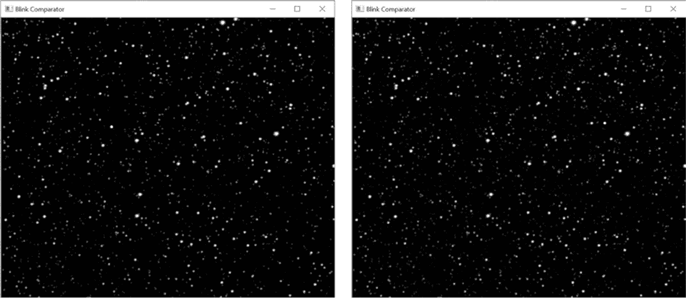

图 5-6：night_1_registered 和 night_2 文件夹中第一张图像的 Blink Comparator 窗口

##### **查找最佳关键点匹配**

现在是时候定义主函数中使用的函数了。列表 5-4 定义了一个函数，用于查找从 *night_1* 和 *night_2* 文件夹中提取的每对图像之间的最佳关键点匹配。它应该定位、描述并匹配关键点，生成匹配列表，然后通过最小可接受关键点数的常量截断该列表。该函数返回每张图像的关键点列表和最佳匹配列表。

```py
blink_comparator.py, part 4 
def find_best_matches(img1, img2):
    """Return list of keypoints and list of best matches for two images."""
    orb = cv.ORB_create(nfeatures=100)  #  Initiate ORB object.
 ➊ kp1, desc1 = orb.detectAndCompute(img1, mask=None)
    kp2, desc2 = orb.detectAndCompute(img2, mask=None)    
    bf = cv.BFMatcher(cv.NORM_HAMMING, crossCheck=True)
 ➋ matches = bf.match(desc1, desc2)
    matches = sorted(matches, key=lambda x: x.distance)
    best_matches = matches[:MIN_NUM_KEYPOINT_MATCHES]

    return kp1, kp2, best_matches
```

列表 5-4：定义用于查找最佳关键点匹配的函数

首先定义该函数，该函数以两张图像作为参数。主函数（main()）将在每次运行 for 循环时从输入文件夹中选择这些图像。

接下来，使用 OpenCV 的 ORB_create() 方法创建一个 orb 对象。ORB 是嵌套首字母缩写词的缩写：*O*riented FAST 和 *R*otated *B*RIEF。

FAST，即*F*eatures from *A*ccelerated *S*egment *T*est，是一种快速、高效且免费的算法，用于*检测*关键点。为了*描述*这些关键点，以便可以在不同图像之间进行比较，你需要使用 BRIEF。BRIEF 是*B*inary *R*obust *I*ndependent *E*lementary *F*eatures 的缩写，它同样快速、紧凑且是开源的。

ORB 将 FAST 和 BRIEF 结合成一个匹配算法，该算法通过首先检测图像中像素值剧烈变化的独特区域，然后记录这些独特区域的位置作为*关键点*。接下来，ORB 使用数值数组，或*描述符*，通过在关键点周围定义一个小区域，称为*补丁*，来描述在关键点处发现的特征。在图像补丁内，算法使用模式模板定期采样强度。然后，它将预选的样本对进行比较，并将它们转换为二进制字符串，称为*特征向量*（参见图 5-7）。

*向量*是一系列数字。*矩阵*是一个由行和列组成的矩形数字数组，它被视为一个整体并按照规则进行操作。*特征向量*是一个具有一行和多列的矩阵。为了构建一个特征向量，算法通过将 1 添加到向量的末尾（如果第一个样本具有最大强度）或将 0 添加到末尾（如果相反）来将样本对转换为二进制系列。

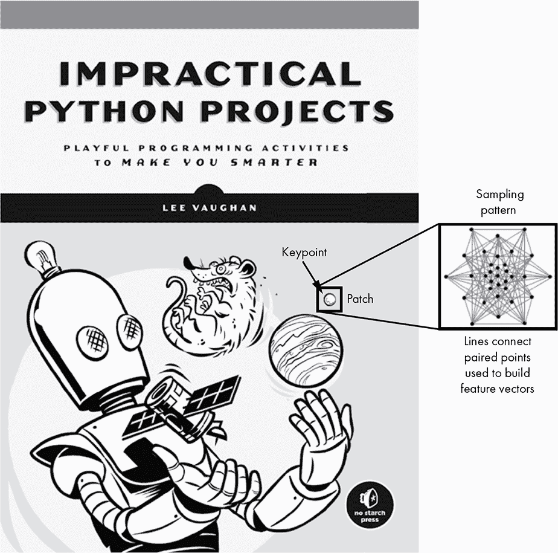

图 5-7：ORB 如何生成关键点描述符的卡通示例

以下显示了一些示例特征向量。我缩短了向量列表，因为 ORB 通常会比较并记录 512 对样本！

```py
V1 = [010010110100101101100--snip--]
V2 = [100111100110010101101--snip--]
V3 = [001101100011011101001--snip--]
--snip--
```

这些描述符作为特征的数字指纹。OpenCV 使用额外的代码来补偿旋转和尺度变化，这使得即使特征的大小和方向不同，它也能匹配相似的特征（参见图 5-8）。

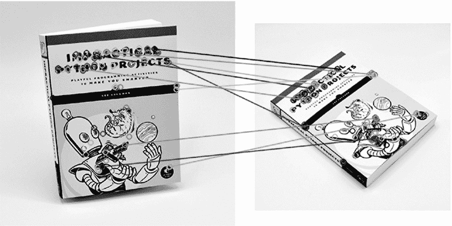

图 5-8：OpenCV 可以匹配关键点，尽管它们在尺度和方向上存在差异。

创建 ORB 对象时，你可以指定要检查的关键点数量。默认方法为 500，但对于本项目所需的图像配准，100 个就足够了。

接下来，使用 orb.detectAndCompute() 方法 ➊，找到关键点及其描述符。传入 img1，然后对 img2 重复相同的代码。

在定位并描述了关键点后，下一步是找到两幅图像中共同的关键点。通过创建一个包含距离度量的 BFMatcher 对象来开始此过程。暴力匹配器将第一幅图像中一个特征的描述符与第二幅图像中的所有特征进行比较，使用哈明距离。它返回最接近的特征。

对于两个相同长度的字符串，*汉明距离*是指对应位置或索引中值不同的数量。对于以下特征向量，不匹配的位置以粗体显示，汉明距离为 3：

```py
1001011001010
1100111001010
```

bf 变量将是一个 BFMatcher 对象。调用 match() 方法并将两个图像的描述符传递给它 ➋。将返回的 DMatch 对象列表分配给名为 matches 的变量。

最佳匹配将具有最小的汉明距离，因此请按升序排序对象，将这些最佳匹配项移到列表的开头。请注意，您需要使用 lambda 函数以及对象的距离属性。*lambda 函数*是一个小型的、一次性的、没有名称的函数，通常是动态定义的。紧随 lambda 之后的词和字符是参数。表达式在冒号后面，返回值是自动的。

由于您只需要在程序开始时定义的最小关键点匹配数，因此通过切片匹配列表来创建一个新列表。最佳匹配项位于列表开头，因此从匹配列表的起始位置切片直到 MIN_NUM_KEYPOINT_MATCHES 指定的值。

此时，您仍在处理神秘的对象，如下所示：

```py
best matches =  <DMatch 0000028BEBAFBFB0>, <DMatch 0000028BEBB21090>, --snip--
```

幸运的是，OpenCV 知道如何处理这些。通过返回两组关键点和最佳匹配对象列表，完成该函数。

##### **检查最佳匹配**

[Listing 5-5 定义了一个简短的函数，帮助您视觉检查关键点匹配。您已经在 Figure 5-5 中看到了这个函数的结果。通过将这些任务封装到一个函数中，您可以减少 main() 中的杂乱，并通过注释掉一行代码来让用户关闭此功能。

```py
blink_comparator.py, part 5
def QC_best_matches(img_match):
    """Draw best keypoint matches connected by colored lines."""    
    cv.imshow('Best {} Matches'.format(MIN_NUM_KEYPOINT_MATCHES), img_match)
    cv.waitKey(2500)  # Keeps window active 2.5 seconds.
```

Listing 5-5: 定义一个函数来检查最佳关键点匹配

定义该函数时使用一个参数：匹配的图像。这个图像是通过 Listing 5-3 中的 main() 函数生成的。它由左图和右图组成，关键点以彩色圆圈表示，并且通过彩色线条连接对应的关键点。

接下来，调用 OpenCV 的 imshow() 方法显示窗口。您可以在命名窗口时使用 format() 方法。传递最小关键点匹配数的常量给它。

完成该功能后，给用户 2.5 秒的时间查看窗口。请注意，waitKey() 方法并不会销毁窗口；它只是暂停程序指定的时间。等待时间过后，程序恢复执行，新窗口将会出现。

##### **注册图像**

Listing 5-6 定义了一个函数，将第一张图像注册到第二张图像。

```py
blink_comparator.py, part 6
def register_image(img1, img2, kp1, kp2, best_matches):
    """Return first image registered to second image."""
    if len(best_matches) >= MIN_NUM_KEYPOINT_MATCHES:
        src_pts = np.zeros((len(best_matches), 2), dtype=np.float32)
        dst_pts = np.zeros((len(best_matches), 2), dtype=np.float32)

     ➊ for i, match in enumerate(best_matches):
            src_pts[i, :] = kp1[match.queryIdx].pt
            dst_pts[i, :] = kp2[match.trainIdx].pt            
        h_array, mask = cv.findHomography(src_pts, dst_pts, cv.RANSAC)

     ➋ height, width = img2.shape  # Get dimensions of image 2.
        img1_warped = cv.warpPerspective(img1, h_array, (width, height))

        return img1_warped

    else:
        print("WARNING: Number of keypoint matches < {}\n".format
              (MIN_NUM_KEYPOINT_MATCHES))
        return img1
```

Listing 5-6: 定义一个函数将一张图像注册到另一张图像

定义一个函数，接收两张输入图像、它们的关键点列表以及由 find_best_matches() 函数返回的 DMatch 对象列表作为参数。接下来，将最佳匹配的位置加载到 NumPy 数组中。从一个条件判断开始，检查最佳匹配列表是否等于或超过 MIN_NUM_KEYPOINT_MATCHES 常量。如果是，则初始化两个 NumPy 数组，行数与最佳匹配的数量相等。

np.zeros() NumPy 方法返回一个具有给定形状和数据类型的新数组，填充为零。例如，下面的代码片段生成一个三行两列的零填充数组：

```py
>>> import numpy as np
>>> ndarray = np.zeros((3, 2), dtype=np.float32)
>>> ndarray
array([[0., 0.],
       [0., 0.],
       [0., 0.]], dtype=float32)
```

在实际代码中，数组至少会是 50×2，因为你规定了至少要有 50 个匹配点。

现在，枚举匹配列表并开始用实际数据填充数组 ➊。对于源点，使用 queryIdx.pt 属性获取描述符在 kp1 描述符列表中的索引。对下一组点重复此操作，但使用 trainIdx.pt 属性。查询/训练术语有点混淆，但基本上分别指代第一张和第二张图像。

下一步是应用*单应性*。单应性是一种使用 3×3 矩阵的变换，将一张图像中的点映射到另一张图像中的对应点。如果两张图像分别从不同角度观察同一平面，或者两张图像是通过相同相机绕光轴旋转而无平移的，那么这两张图像可以通过单应性关联。为了正确运行，单应性需要至少四个在两张图像中对应的点。

单应性假设匹配点确实是对应点。但是，如果仔细查看图 5-5 和图 5-8，你会发现特征匹配并不完美。在图 5-8 中，约 30% 的匹配是错误的！

幸运的是，OpenCV 包括了一个带有离群点检测器的 findHomography() 方法，称为*随机采样一致性*（RANSAC）。RANSAC 随机采样匹配点，找到一个解释其分布的数学模型，并优先选择预测最多点的模型。然后它丢弃离群点。例如，考虑 图 5-9 中的“原始数据”框中的点。

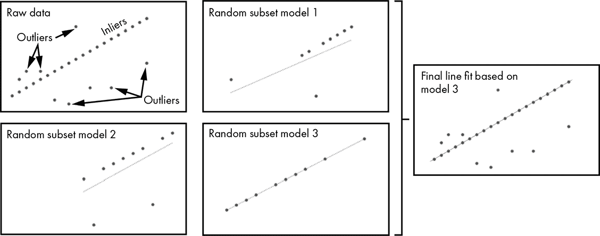

图 5-9：使用 RANSAC 进行示例线性拟合以忽略离群点

如你所见，你想通过真实数据点（称为*内点*）拟合一条线，并忽略较少数量的伪点（*离群点*）。使用 RANSAC，你随机采样一组原始数据点，拟合一条线，然后重复此过程若干次。每个线性拟合方程都会应用到所有点。通过最多点的那条线被用于最终的线性拟合。在图 5-9 中，这将是最右侧框中的线。

要运行 findHomography()，传入源点和目标点，并调用 RANSAC 方法。这将返回一个 NumPy 数组和一个掩码。掩码指定了内点和外点，或是好的匹配和坏的匹配。你可以使用它执行诸如仅绘制好匹配之类的任务。

最后的步骤是将第一张图像扭曲，使其与第二张图像完美对齐。你需要第二张图像的尺寸，因此使用 shape() 获取 img2 的高度和宽度 ➋。将这些信息与 img1 和单应性矩阵 h_array 一同传入 warpPerspective() 方法。返回已注册的图像，它将是一个 NumPy 数组。

如果关键点匹配数少于你在程序开始时设定的最小数目，图像*可能没有*正确对齐。因此，打印一个警告并返回原始的、未注册的图像。这将允许 main() 函数继续不间断地循环处理文件夹中的图像。如果配准效果不好，用户将能察觉到问题，因为问题图像对不会在闪烁比较器窗口中正确对齐。错误信息也会出现在命令行中。

```py
Comparing 2_dim_transient_left.png to 2_dim_transient_right.png.
WARNING: Number of keypoint matches < 50
```

##### **构建闪烁比较器**

列表 5-7 定义了一个运行闪烁比较器的函数，并在程序以独立模式运行时调用 main()。blink() 函数会在指定范围内循环，先显示注册后的图像，再显示第二张图像，且都显示在同一个窗口中。每张图像只显示三分之一秒，这是 Clyde Tombaugh 使用闪烁比较器时偏好的频率。

```py
blink_comparator.py, part 7 
def blink(image_1, image_2, window_name, num_loops):
    """Replicate blink comparator with two images."""
    for _ in range(num_loops):
        cv.imshow(window_name, image_1)
        cv.waitKey(330)
        cv.imshow(window_name, image_2)
        cv.waitKey(330)

if __name__ == '__main__':
    main()
```

列表 5-7：定义一个函数以实现图像闪烁效果

定义 blink() 函数，包含四个参数：两个图像文件、一个窗口名称和需要执行的闪烁次数。用一个范围值设置一个 for 循环，循环次数等于闪烁的次数。由于你不需要访问运行中的索引，因此可以使用一个下划线 (_) 来表示该变量是无关紧要的。正如本章前面提到的，这可以防止代码检查程序引发“未使用的变量”警告。

现在调用 OpenCV 的 imshow() 方法，并传入窗口名称和第一张图片。这将是*注册的*第一张图片。然后暂停程序 330 毫秒，这是 Clyde Tombaugh 自己推荐的时间。

对第二张图像重复前两行代码。由于两张图像已经对齐，窗口中唯一会变化的就是瞬态。如果只有一张图像包含瞬态，它将会出现闪烁的效果。如果两张图像都捕捉到瞬态，它将会表现出来回跳动的效果。

使用标准代码结束程序，以便它能够在独立模式下运行或作为模块导入。

#### ***使用闪烁比较器***

在运行*blink_comparator.py*之前，先将房间的灯光调暗，模拟通过设备目镜观察的情况。然后启动程序。你应该首先看到图像中心附近闪烁的两个明显亮点。在下一对图像中，这些点会变得非常小——只有一个像素大小——但你应该仍然能检测到它们。

第三轮将显示相同的小型瞬态，只不过这次第二张图片的整体亮度会比第一张更亮。你应该仍然能够找到这个瞬态，但会更难以发现。这就是为什么汤博曾经需要小心地拍摄并冲洗图像，以确保曝光一致。

第四轮包含一个单一的瞬态，显示在左侧的图像中。它应该是闪烁的，而不是像之前的图像那样来回跳动。

第五对图像是控制图像，没有瞬态。这是天文学家几乎一直看到的：令人失望的静态星空。

最后一轮使用的是第一对图像的负片版本。亮的瞬态显示为闪烁的黑点。这是克莱德·汤博用过的图像类型，因为这样可以节省时间。由于黑点和白点一样容易被发现，他认为没有必要为每张负片打印正片。

如果你查看注册的负片图像的左侧，你会看到一条黑色条纹，表示对齐图像所需的平移量（图 5-10）。你在正片图像中不会注意到这一点，因为它与黑色背景融为一体。

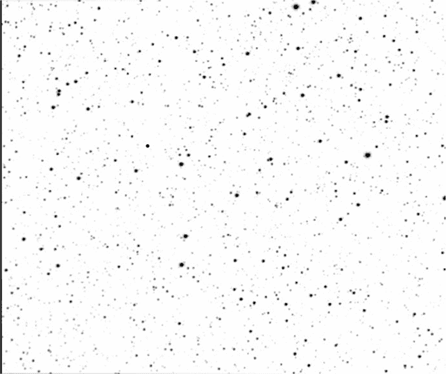

图 5-10：负片图像，6_bright_transient_neg_left_registered.png

在所有的轮次中，你可能会注意到每一对图像的左上角有一颗暗淡的星星在闪烁。这不是瞬态，而是由*边缘伪影*引起的假阳性。边缘伪影是图像错位导致的图像变化。经验丰富的天文学家会忽略这颗暗星，因为：它发生在图像的边缘附近，而且可能的瞬态在不同图像之间并没有移动，只是变暗了。

你可以在图 5-11 中看到这个假阳性的原因。因为在第一帧中只捕捉到了星星的一部分，相比第二张图中的同一颗星星，其亮度降低了。

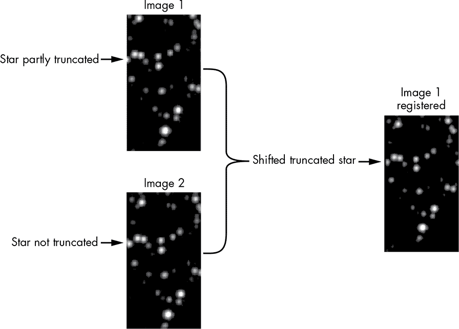

图 5-11：在图像 1 中注册一个截断的星星，导致星星的亮度明显比图像 2 中的暗。

人类能够直观地处理边缘效应，但计算机需要明确的规则。在下一个项目中，你将通过在寻找瞬态时排除图像的边缘来解决这个问题。

### **项目 #8：通过图像差异检测天文瞬态**

闪光比较仪曾被认为与望远镜同样重要，但现在它们安静地摆放在博物馆里积满灰尘。天文学家们不再需要它们，因为现代的图像差异化技术比人眼更擅长检测移动物体。如今，克莱德·汤博的每一项工作都将由计算机完成。

在这个项目中，假设你是一个天文台的暑期实习生。你的任务是为一位仍在使用生锈的闪光比较仪的古老天文学家创建一个数字化工作流。

目标

编写一个 Python 程序，接受两张已注册的图像，并突出显示它们之间的任何差异。

#### ***策略***

你现在需要的是一个自动寻找瞬态物体的算法，而不是一个简单的闪烁图像的算法。这个过程仍然需要已注册的图像，但为了方便起见，可以直接使用项目 7 中已经生成的图像。

检测图像之间的差异是一个常见的操作，OpenCV 自带了一个专门用于此目的的绝对差异方法 absdiff()。它计算两个数组之间的逐元素差异。但仅仅检测差异还不够。你的程序需要识别出差异的存在，并只显示包含瞬态物体的图像。毕竟，天文学家有更重要的事情要做，比如将行星降级！

因为你要找的物体位于黑色背景上，且匹配的亮物体已经被去除，所以在差异化过程中剩下的任何亮物体都值得注意。由于在星空中出现多个瞬态物体的几率极低，标记一到两个差异应该足以引起天文学家的注意。

#### ***瞬态检测器代码***

以下的*transient_detector.py* 代码将自动化地检测天文图像中的瞬态物体。你可以在网站的*Chapter_5* 文件夹中找到它。为了避免代码重复，程序使用了*blink_comparator.py* 已经注册的图像，因此你需要在项目目录中包含*night_1_registered_transients* 和 *night_2* 文件夹（见图 5-3）。和之前的项目一样，保持 Python 代码文件位于这两个文件夹的*上层*文件夹。

##### **导入模块并分配常量**

列表 5-8 导入了运行程序所需的模块，并分配了一个用于管理边缘伪影的常量（见图 5-11）。这个常量代表一个小的距离，垂直于图像的边缘测量，用来排除在分析中的区域。任何在图像边缘和这个常量之间检测到的物体将被忽略。

```py
transient_detector.py, part 1
import os
from pathlib import Path
import cv2 as cv

PAD = 5  # Ignore pixels this distance from edge
```

列表 5-8：导入模块并分配常量以管理边缘效应

你需要导入上一个项目中使用的所有模块，除了 NumPy，因此在这里导入它们。将填充距离设置为 5 像素。这个值可能会因数据集的不同而略有变化。稍后，你将在图像的边缘区域画一个矩形，这样你就可以看到这个参数排除了多少区域。

##### **检测并圈出暂态**

列表 5-9 定义了一个函数，你将用它来找到并圈出每对图像中的最多两个暂态。它会忽略填充区域中的暂态。

```py
transient_detector.py, part 2 
def find_transient(image, diff_image, pad):
    """Find and circle transients moving against a star field. """
    transient = False
    height, width = diff_image.shape
    cv.rectangle(image, (PAD, PAD), (width - PAD, height - PAD), 255, 1)
    minVal, maxVal, minLoc, maxLoc = cv.minMaxLoc(diff_image)
 ➊ if pad < maxLoc[0] < width - pad and pad < maxLoc[1] < height - pad:
        cv.circle(image, maxLoc, 10, 255, 0)
        transient = True
    return transient, maxLoc
```

列表 5-9：定义一个函数来检测并圈出暂态

find_transient() 函数有三个参数：输入图像、表示第一和第二个输入图像之间差异的图像（表示 *差异图*）以及 PAD 常量。该函数将找到差异图中最亮像素的位置，在其周围画一个圆，并返回该位置以及一个布尔值，指示是否找到了对象。

从设置一个名为 transient 的变量开始，初始值为 False。你将用这个变量来指示是否发现了暂态。由于现实生活中暂态比较少见，所以它的初始状态应为 False。

为了应用 PAD 常量并排除图像边缘附近的区域，你需要获取图像的边界。通过 shape 属性可以获取这些信息，它返回图像的高度和宽度的元组。

使用高度和宽度变量以及 PAD 常量，使用 OpenCV 的 rectangle() 方法在图像变量上绘制一个白色矩形。稍后，这将向用户显示图像中哪些部分被忽略了。

diff_image 变量是一个表示像素的 NumPy 数组。背景为黑色，两个输入图像之间位置发生变化（或突然出现）的任何“星星”将显示为灰色或白色（参见 图 5-12）。

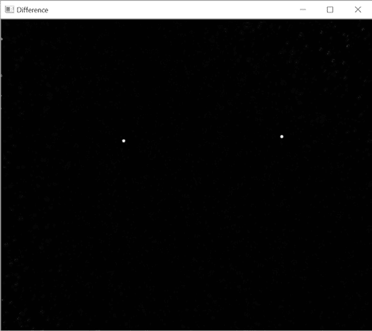

图 5-12：由“亮暂态”输入图像导出的差异图

要定位最亮的暂态，使用 OpenCV 的 minMaxLoc() 方法，它返回图像中的最小和最大像素值及其位置元组。请注意，我将变量命名为与 OpenCV 的大小写命名约定一致（例如 maxLoc）。如果你希望使用更符合 Python PEP8 风格指南的命名方式（* [`www.python.org/dev/peps/pep-0008/`](https://www.python.org/dev/peps/pep-0008/)*），可以自由地使用像 max_loc 这样的名称代替 maxLoc。

你可能在图像的边缘附近找到了一个最大值，因此运行一个条件来排除这种情况，忽略在 PAD 常量 ➊ 限定的区域内找到的值。如果该位置通过，则在图像变量上圈出它。使用一个半径为 10 像素、线宽为 0 的白色圆圈。

如果你已经画出了一个圆圈，那么你就找到了一个暂态，因此将 transient 变量设置为 True。这将在程序稍后的部分触发额外的操作。

通过返回瞬时天体和 maxLoc 变量来结束函数。

**注意**

*minMaxLoc() 方法容易受到噪声（例如假阳性）的影响，因为它作用于单个像素。通常，你会首先运行一个预处理步骤，比如模糊处理，以去除多余的像素。然而，这也可能导致你错过较暗的天体，这些天体在单张图像中可能无法与噪声区分开来。*

##### **准备文件和文件夹**

列表 5-10 定义了 main() 函数，创建了输入文件夹中文件名的列表，并将文件夹路径分配给变量。

```py
transient_detector.py, part 3
def main():
    night1_files = sorted(os.listdir('night_1_registered_transients'))
    night2_files = sorted(os.listdir('night_2'))             
    path1 = Path.cwd() / 'night_1_registered_transients'
    path2 = Path.cwd() / 'night_2'
    path3 = Path.cwd() / 'night_1_2_transients'
```

列表 5-10：定义 main() 函数，列出文件夹内容，并分配路径变量

定义 main() 函数。然后，就像你在 列表 5-2 中在 第 100 页 所做的那样，列出包含输入图像的文件夹内容，并将它们的路径分配给变量。你将使用现有文件夹来存放包含已识别瞬时天体的图像。

##### **遍历图像并计算绝对差异**

列表 5-11 启动了一个 for 循环，遍历图像对。该函数读取对应的图像对，作为灰度数组，计算图像之间的差异，并在一个窗口中显示结果。然后，它在差异图像上调用 find_transient() 函数。

```py
transient_detector.py, part 4 
for i, _ in enumerate(night1_files[:-1]):  # Leave off negative image   
    img1 = cv.imread(str(path1 / night1_files[i]), cv.IMREAD_GRAYSCALE)
    img2 = cv.imread(str(path2 / night2_files[i]), cv.IMREAD_GRAYSCALE)

    diff_imgs1_2 = cv.absdiff(img1, img2)
    cv.imshow('Difference', diff_imgs1_2)
    cv.waitKey(2000)

    temp = diff_imgs1_2.copy()
    transient1, transient_loc1 = find_transient(img1, temp, PAD)
    cv.circle(temp, transient_loc1, 10, 0, -1)

    transient2, _ = find_transient(img1, temp, PAD)
```

列表 5-11：遍历图像并找到瞬时天体

启动一个 for 循环，遍历 *night1_files* 列表中的图像。该程序设计用于处理 *正向* 图像，因此使用图像切片（[:-1]）来排除负向图像。使用 enumerate() 获取一个计数器；命名为 i，而不是 _，因为稍后你将用它作为索引。

要查找图像之间的差异，只需调用 cv.absdiff() 方法，并传递两个图像的变量。显示结果两秒钟后再继续程序。

由于你将要遮盖最亮的瞬时天体，首先请复制 diff_imgs1_2。将此副本命名为 temp，表示临时文件。现在，调用你之前编写的 find_transient() 函数。传递给它第一个输入图像、差异图像以及 PAD 常量。使用结果更新瞬时天体变量，并创建一个新变量 transient_loc1，用来记录差异图像中最亮像素的位置。

瞬时天体可能已经或尚未在连续两个晚上的图像中都被捕获。为了确认它是否被捕获，遮盖你刚才找到的亮点，使用黑色圆圈覆盖它。通过在 temp 图像上使用黑色作为颜色，并将线宽设置为 -1，这会告诉 OpenCV 填充圆圈。继续使用半径 10，但如果你担心两个瞬时天体非常接近，也可以适当减小这个半径。

再次调用 find_transient()函数，但对于位置变量使用单个下划线，因为你不会再使用它。瞬态的数量不太可能超过两个，甚至找到一个就足够让图像接受进一步检查，所以无需再寻找更多。

##### **揭示瞬态并保存图像**

清单 5-12，仍然是在 main()函数的 for 循环中，显示第一张输入图像，并将任何瞬态用圆圈标出，发布涉及的图像文件名，并保存图像为新的文件名。你还将打印每对图像结果的日志到解释器窗口。

```py
transient_detector.py, part 5
        if transient1 or transient2:
            print('\nTRANSIENT DETECTED between {} and {}\n'
                  .format(night1_files[i], night2_files[i]))
        ➊ font = cv.FONT_HERSHEY_COMPLEX_SMALL
           cv.putText(img1, night1_files[i], (10, 25),
                      font, 1, (255, 255, 255), 1, cv.LINE_AA)
           cv.putText(img1, night2_files[i], (10, 55),
                      font, 1, (255, 255, 255), 1, cv.LINE_AA)

           blended = cv.addWeighted(img1, 1, diff_imgs1_2, 1, 0)
           cv.imshow('Surveyed', blended)
           cv.waitKey(2500)  

         ➋ out_filename = '{}_DECTECTED.png'.format(night1_files[i][:-4])
            cv.imwrite(str(path3 / out_filename), blended)  # Will overwrite!

       else:
           print('\nNo transient detected between {} and {}\n'
                  .format(night1_files[i], night2_files[i]))

if __name__ == '__main__':
    main()
```

清单 5-12：显示标记了瞬态的图像，记录结果并保存结果

启动一个条件语句，检查是否发现瞬态。如果评估结果为 True，则在终端输出一条信息。对于 for 循环评估的四张图像，你应该得到以下结果：

```py
TRANSIENT DETECTED between 1_bright_transient_left_registered.png and 1_bright_transient_right.png

TRANSIENT DETECTED between 2_dim_transient_left_registered.png and 2_dim_transient_right.png

TRANSIENT DETECTED between 3_diff_exposures_left_registered.png and 3_diff_exposures_right.png

TRANSIENT DETECTED between 4_single_transient_left_registered.png and 4_single_transient_right.png

No transient detected between 5_no_transient_left_registered.png and 5_no_transient_right.png
```

发布一个负结果显示程序按预期工作，并且不容置疑地证明图像已被比较。

接下来，发布两张在 img1 数组上有正响应的图像的文件名。首先为 OpenCV 分配一个字体变量➊。要查看可用字体的列表，可以在* [`docs.opencv.org/4.3.0/`](https://docs.opencv.org/4.3.0/)*上搜索*HersheyFonts*。

现在调用 OpenCV 的 putText()方法，传递第一张输入图像、图像的文件名、位置、字体变量、大小、颜色（白色）、厚度和线型。LINE_AA 属性创建一个抗锯齿线条。对第二张图像重复这段代码。

如果找到了两个瞬态，可以使用 OpenCV 的 addWeighted()方法将它们显示在同一张图像上。该方法计算两个数组的加权和。参数包括第一张图像及其权重，第二张图像及其权重，以及添加到每个和中的标量。使用第一张输入图像和差异图像，将权重设置为 1，以便每张图像都被充分使用，并将标量设置为 0。将结果赋值给名为 blended 的变量。

在一个名为 Surveyed 的窗口中显示合成图像。图 5-13 展示了“明亮”瞬态的示例结果。

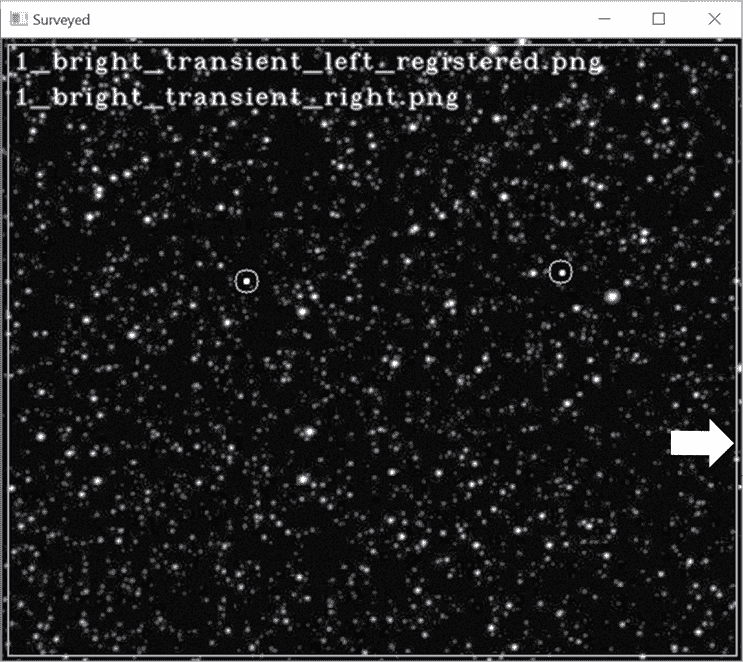

图 5-13：瞬态检测器（transient_detector.py）的示例输出窗口，箭头指示了垫片矩形

注意图像边缘附近的白色矩形。这代表 PAD 距离。矩形外的瞬态被程序忽略。

使用当前输入图像的文件名加上“DETECTED” ➋来保存合成图像。图 5-13 中的暗淡瞬态将被保存为*1_bright_transient_left_registered_DECTECTED.png*。将其写入*night_1_2_transients*文件夹，使用 path3 变量。

如果没有找到瞬态，请在终端窗口中记录结果。然后，用代码结束程序，作为模块或独立模式运行。

#### ***使用瞬态检测器***

想象一下，克莱德·汤博（Clyde Tombaugh）如果使用你的瞬态检测器会有多高兴。它真的是“设置并忘记”型。即使是第三对图像之间变化的亮度，这在闪光比较器中是个大问题，但对于这个程序来说毫无挑战。

### **总结**

在本章中，你复制了一个老式的闪光比较器设备，并使用现代计算机视觉技术更新了这一过程。在这个过程中，你使用了 pathLib 模块简化了目录路径的操作，并且对不重要的未使用的变量名使用了单个下划线。你还使用了 OpenCV 来寻找、描述和匹配图像中的有趣特征，使用单应性对齐这些特征，合成图像并将结果写入文件。

### **进一步阅读**

*走出黑暗：冥王星行星*（Stackpole Books，2017 年），由克莱德·汤博和帕特里克·摩尔（Patrick Moore）编写，是关于冥王星发现的标准参考书，讲述了发现者自己的故事。

*追逐新视野：冥王星首次史诗任务的内幕*（Picador，2018 年），由艾伦·斯特恩（Alan Stern）和大卫·格林斯彭（David Grinspoon）编写，记录了将宇宙飞船（顺便说一下，里面装有克莱德·汤博的遗 ashes）送往冥王星的伟大努力。

### **实践项目：绘制轨道路径**

编辑 *transient_detector.py* 程序，使其在两个输入图像对中都有瞬态时，OpenCV 会绘制一条连接两个瞬态的线。这样可以揭示瞬态在背景星体中的轨道路径。

这种信息对于冥王星的发现至关重要。克莱德·汤博通过冥王星在两张发现板之间的运动距离，以及曝光之间的时间，验证了这颗行星接近洛厄尔预测的轨道，而不仅仅是某颗靠近地球的小行星。

你可以在附录和 *Chapter_5* 文件夹中找到解决方案 *practice_orbital_path.py*。

### **实践项目：找出差异**

你在本章中进行的特征匹配不仅在天文学领域具有广泛应用。例如，海洋生物学家使用类似的技术通过鲸鲨的斑点来识别它们。这提高了科学家们对鲸鲨种群数量的准确估算。

在 图 5-14 中，左右照片之间有变化。你能找到吗？更棒的是，你能编写 Python 程序来对齐和比较这两张图像，并圈出变化的部分吗？

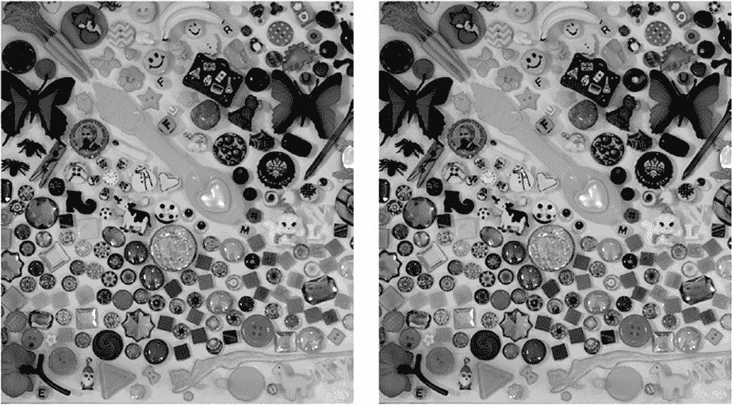

图 5-14：找出左右图像之间的差异。

起始图像可以在 *montages* 文件夹中的 *Chapter_5* 文件夹找到，这些图像可以从书籍官网下载。这些是彩色图像，你需要将其转换为灰度图像并在进行物体检测之前进行对齐。你可以在附录和 *montages* 文件夹中找到解决方案 *practice_montage_aligner.py* 和 *practice_montage_difference_finder.py*。

### **挑战项目：数星星**

根据*Sky and Telescope*杂志，从两半球裸眼可见的星星有 9,096 颗（*[`www.skyandtelescope.com/astronomy-resources/how-many-stars-night-sky-09172014/`](https://www.skyandtelescope.com/astronomy-resources/how-many-stars-night-sky-09172014/)*）。这个数字本身已经很多，但如果通过望远镜观察，星星的数量会呈指数级增长。

为了估算大量的星星，天文学家们会对天空的小区域进行调查，使用计算机程序计算星星数量，然后将结果外推到更大的区域。对于这个挑战项目，假设你是洛威尔天文台的助手，参与一个调查小组。编写一个 Python 程序，计算在项目 7 和 8 中使用的图像*5_no_transient_left.png*中星星的数量。

若需要提示，可以在线搜索*如何使用 Python 和 OpenCV 计算图像中的点数*。有关使用 Python 和 SciPy 的解决方案，参见*[`prancer.physics.louisville.edu/astrowiki/index.php/Image_processing_with_Python_and_SciPy`](http://prancer.physics.louisville.edu/astrowiki/index.php/Image_processing_with_Python_and_SciPy)*。如果将图像分成更小的部分，你可能会发现结果有所改善。
