## 阿波罗 8 号赢得月球竞赛


1968 年夏，美国在太空竞赛中处于下风。苏联的“宗德”号飞船看起来已经准备好登月，中央情报局拍摄到了停在发射台上的巨型苏联 N-1 火箭，而美国的阿波罗计划仍然需要三次测试飞行。但在 8 月，NASA 经理乔治·洛提出了一个大胆的想法。我们*现在*就去月球吧！与其在地球轨道上做更多测试，不如让我们在 12 月绕月飞行，让*那*成为测试。就在那一刻，太空竞赛几乎已经结束。不到一年后，苏联投降了，尼尔·阿姆斯特朗为全人类迈出了伟大的一步。

将阿波罗 8 号宇宙飞船送上月球的决定绝非轻松之举。1967 年，三名宇航员在阿波罗 1 号舱内遇难，多次无人驾驶任务爆炸或以其他方式失败。在这种背景下，且事关重大，一切都取决于*自由返回*的概念。任务的设计是，如果服务舱的引擎未能点燃，飞船将直接绕月飞行，然后像回旋镖一样返回地球（图 6-1）。

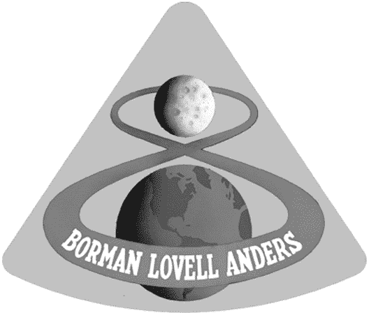

图 6-1：阿波罗 8 号徽标，其中绕月自由返回轨道作为任务编号

在这一章中，你将编写一个使用名为 turtle 的绘图板模块的 Python 程序，用来模拟阿波罗 8 号的自由返回轨道。你还将研究物理学中的一个经典难题：三体问题。

### **理解阿波罗 8 号任务**

阿波罗 8 号任务的目标仅仅是绕月飞行，因此不需要携带月球着陆舱组件。宇航员们乘坐的是指令舱和服务舱，统称为*CSM*（图 6-2）。

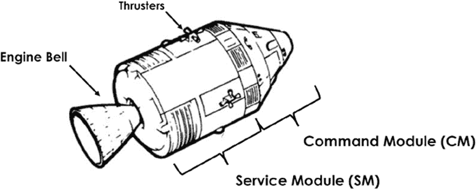

图 6-2：阿波罗指令舱与服务舱模块

1968 年秋，CSM 引擎仅在地球轨道上进行了测试，且存在关于其可靠性的正当担忧。为了绕月飞行，引擎需要两次点火：第一次是减速以进入月球轨道，第二次是离开轨道。使用自由返回轨道时，如果第一次操作失败，宇航员仍然可以滑行返回地球。事实证明，引擎两次点火都非常成功，阿波罗 8 号绕月飞行了 10 次。（然而，命运多舛的阿波罗 13 号则充分利用了其自由返回轨道！）

#### ***自由返回轨道***

绘制自由返回轨道需要大量复杂的数学运算。毕竟，这*就是*火箭科学！幸运的是，你可以用几个简化的参数在二维图表中模拟该轨道（图 6-3）。

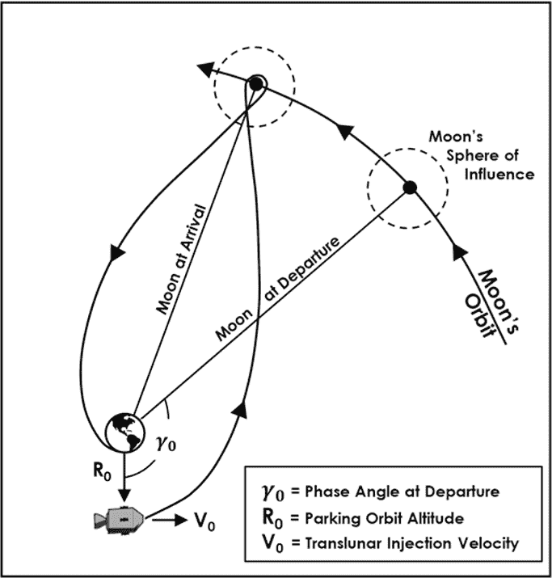

图 6-3：自由返回轨道（非比例图）

这个自由返回的二维模拟使用了几个关键值：指令舱的起始位置（R[0]）、指令舱的速度和方向（V[0]）以及指令舱和月球之间的相位角（γ[0]）。*相位角*，也叫做*领先角度*，是从起始位置到最终位置所需的指令舱轨道时间位置的变化。*跨月注入速度*（V[0]）是一种推进操作，用来将指令舱设置为月球轨迹。它通过从绕地轨道（*停车轨道*）中实现，航天器在此轨道上进行内部检查，并等待与月球的相位角达到最优。这时，*土星五号*火箭的第三级发动机会点燃并脱落，指令舱则继续滑行向月球。

由于月球在移动，在执行跨月注入之前，你必须预测月球的未来位置，或者*领先*它，就像用霰弹枪打飞碟一样。然而，这个过程与射击霰弹枪略有不同，因为太空是弯曲的，你需要考虑地球和月球的引力。这两个天体对航天器的拉力会产生难以计算的扰动——这些扰动甚至难度之大，以至于这个计算问题在物理学领域有了一个专门的名字：三体问题。

#### ***三体问题***

*三体问题*是预测三个相互作用的天体行为的挑战。艾萨克·牛顿的引力方程在预测两个天体（如地球和月球）之间的行为时非常有效，但如果再加上第三个天体，无论是航天器、彗星、月亮等，问题就变得复杂。牛顿从未能够将三体或更多天体的行为归纳成一个简单的方程式。275 年来——即便有国王提供奖金奖励解决方案——世界上最伟大的数学家们也一直未能解开这个问题。

问题在于，三体问题不能通过简单的代数表达式或积分来解决。计算多个引力场的影响需要进行数值迭代，这样的计算规模没有高速计算机（如你的笔记本电脑）是无法实现的。

1961 年，迈克尔·米诺维奇（Michael Minovitch），当时是喷气推进实验室的暑期实习生，使用当时世界上最快的计算机——IBM 7090 主机，找到了第一个数值解。他发现，数学家可以通过使用修正圆锥法，减少解决一个限制性三体问题（如我们地球-月球-指令舱问题）所需的计算量。

*修正圆锥方法*是一种分析近似方法，它假设在航天器位于地球的引力影响范围内时，你正在处理一个简单的双体问题，而在月球的引力影响范围内又是另一个问题。这是一种粗略的“便签纸”计算方法，能提供合理的出发和到达条件估算，减少初始速度和位置向量的选择范围。剩下的就是通过重复的计算机模拟来精细化飞行路径。

由于研究人员已经找到并记录了阿波罗 8 号任务的修正圆锥解法，你不需要重新计算它。我已经将其调整为你将在此处使用的二维场景。不过，之后你可以通过改变像 R[0]和 V[0]这样的参数并重新运行模拟来实验其他解法。

### **项目#9：与阿波罗 8 号一起飞往月球！**

作为 NASA 的暑期实习生，你被要求为媒体和公众制作一个简单的阿波罗 8 号自由返回轨迹模拟。由于 NASA 资金紧张，你需要使用开源软件，并尽可能快速和低成本地完成这个项目。

目标

编写一个 Python 程序，图形化地模拟阿波罗 8 号任务提出的自由返回轨迹。

#### ***使用 turtle 模块***

为了模拟阿波罗 8 号的飞行，你需要一种在屏幕上绘制和移动图像的方法。虽然有很多第三方模块可以帮助你完成这项工作，但我们会通过使用预安装的 turtle 模块来保持简单。尽管 turtle 最初是为帮助孩子们学习编程而发明的，但它可以轻松地适应更复杂的用途。

turtle 模块允许你使用 Python 命令在屏幕上移动一个小图像，称为*turtle*。该图像可以是不可见的、实际的图像、自定义形状或图 6-4 中显示的预定义形状之一。

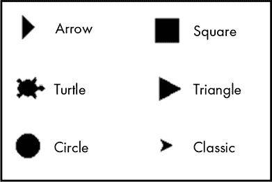

图 6-4：turtle 模块提供的标准 turtle 形状

随着 turtle 的移动，你可以选择在它的后面画一条线来追踪它的运动(图 6-5)。

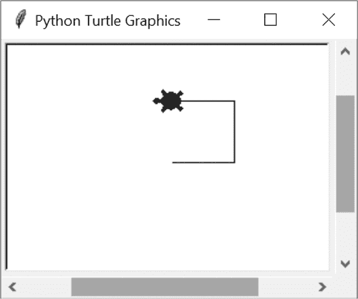

图 6-5：在 Turtle 图形窗口中移动 turtle

这个简单的图形是通过以下脚本制作的：

```py
>>> import turtle
>>> steve = turtle.Turtle('turtle') # Creates a turtle object with turtle shape.
>>> steve.fd(50) # Moves turtle forward 50 pixels.
>>> steve.left(90) # Rotates turtle left 90 degrees.
>>> steve.fd(50)
>>> steve.left(90)
>>> steve.fd(50)
```

你可以使用 Python 的 turtle 功能编写更简洁的代码。例如，你可以使用 for 循环来创建相同的图案。

```py
>>> for i in range(3):
       steve.fd(50)
       steve.left(90)
```

在这里，steve 前进 50 个像素，然后向左转 90 度。这些步骤通过 for 循环重复三次。

其他 turtle 方法允许你更改 turtle 的形状、改变其颜色、抬起笔不绘制路径、在屏幕上“印章”当前的位置、设置 turtle 的朝向，并获取它在屏幕上的位置。图 6-6 展示了这些功能，并在接下来的脚本中进行了描述。

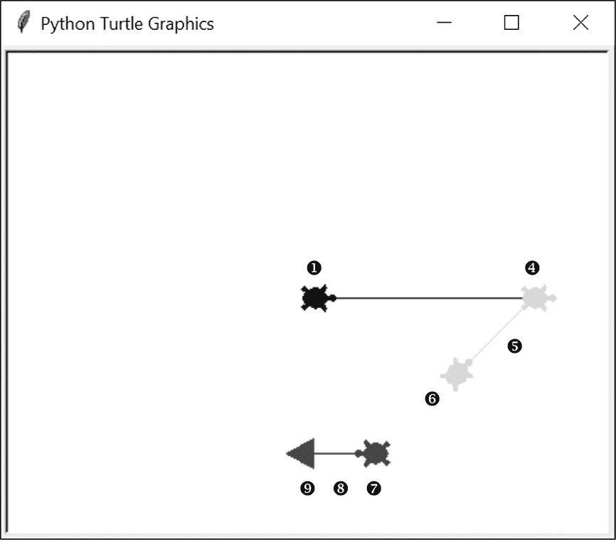

图 6-6：更多海龟行为的示例。数字指代脚本注释。

```py

   >>> import turtle
   >>> steve = turtle.Turtle('turtle')
➊ >>> a_stamp = steve.stamp()
➋ >>> steve.position()
   ➌ (0.00,0.00)
   >>> steve.fd(150)
➍ >>> steve.color('gray')
   >>> a_stamp = steve.stamp()
   >>> steve.left(45)
➎ >>> steve.bk(75)
   >>> a_stamp = steve.stamp()
➏ >>> steve.penup()
   >>> steve.bk(75)
   >>> steve.color('black')
➐ >>> steve.setheading(180)
   >>> a_stamp = steve.stamp()
➑ >>> steve.pendown()
   >>> steve.fd(50)
➒ >>> steve.shape('triangle')
```

导入海龟模块并实例化一个名为 steve 的海龟对象后，使用 stamp()方法 ➊留下 steve 的图像。然后使用 position()方法 ➋获取海龟当前的(*x*, *y*)坐标，并将其作为元组 ➌。这个方法在计算物体之间的距离时会很有用，尤其是在重力方程中。

将海龟向前移动 150 个单位，并将其颜色更改为灰色 ➍。然后留下印章，旋转海龟 45 度，再使用 bk()（向后）方法将其向后移动 75 个单位 ➎。

先留下另一个印章，然后使用 penup()方法停止绘制海龟的路径 ➏。将 steve 向后移动 75 个单位，并将其颜色改为黑色。现在，使用 rotate()方法的替代方法，直接设置海龟的朝向 ➐。朝向就是海龟当前移动的方向。请注意，默认的“标准模式”方向是以东为参考，而非北方（表 6-1）。

**表 6-1：** 海龟模块在标准模式下的常见方向（角度）

| 角度 | 方向 |
| --- | --- |
| 0 | 东 |
| 90 | 北 |
| 180 | 西 |
| 270 | 南 |

先留下另一个印章，然后放下画笔再次绘制海龟后面的路径 ➑。将 steve 向前移动 50 个单位，然后将其形状改为三角形 ➒。这完成了绘图。

不要被我们目前所做的简单操作迷惑。通过正确的命令，你可以绘制复杂的设计，例如图 6-7 中的 Penrose 镶嵌。


图 6-7：海龟模块演示生成的 Penrose 镶嵌，penrose.py

海龟模块是 Python 标准库的一部分，官方文档可以在*[`docs.python.org/3/library/turtle.html?highlight=turtle#module-turtle/`](https://docs.python.org/3/library/turtle.html?highlight=turtle#module-turtle/)*找到。对于快速教程，可以在线搜索 Al Sweigart 的*Simple Turtle Tutorial for Python*。

#### ***策略***

我们已经做出战略决策，使用海龟绘制模拟图，但模拟图应该是什么样子呢？为了方便起见，我建议基于图 6-3 来设计。你将从地球附近的相同停泊轨道位置（R[0]）和月球的相同大致相位角（γ[0]）开始。你可以使用图像表示地球和月球，并使用自定义的海龟形状构建 CSM。

另一个重要的决策是是否使用过程式编程或面向对象编程（OOP）。当你计划生成多个行为相似且相互作用的对象时，OOP 是一个不错的选择。你可以使用 OOP 类作为地球、月球和 CSM 对象的蓝图，并在模拟运行时自动更新对象属性。

你可以使用*时间步长*来运行模拟。基本上，每个程序循环代表一个无量纲的时间单位。每次循环，你都需要计算每个物体的位置并更新（重绘）它在屏幕上的位置。这需要解决三体问题。幸运的是，已经有人做过这个工作，而且他们是用 turtle 来实现的。

Python 模块通常会包括示例脚本，向你展示如何使用该产品。例如，matplotlib 画廊包括用于制作大量图表和绘图的代码片段和教程。同样，turtle 模块附带了*turtle-example-suite*，其中包含 turtle 应用的演示。

示例之一，*planet_and_moon.py*，提供了一个处理三体问题的好“配方”，使用了 turtle（参见图 6-8）。要查看这些示例，打开 PowerShell 或终端窗口并输入`python -m turtledemo`。根据你的平台和安装的 Python 版本数量，你可能需要使用`python3 -m turtledemo`。

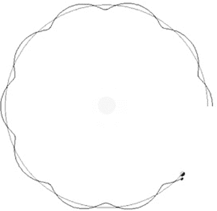

图 6-8：planet_and_moon.py 海龟示例的屏幕截图

此示例处理的是太阳-地球-月球三体问题，但它可以很容易地适应处理地球-月球-CSM 问题。同样，对于特定的阿波罗 8 号情况，你将使用图 6-3 来指导程序的开发。

#### ***阿波罗 8 号自由回归代码***

*apollo_8_free_return.py*程序使用 turtle 图形生成阿波罗 8 号 CSM 离开地球轨道、环绕月球并返回地球的俯视图。程序的核心基于上一节讨论的*planet_and_moon.py*示例。

你可以在*Chapter_6*文件夹中找到该程序，文件可以从书籍的官网上下载，网址为*[`nostarch.com/real-world-python/`](https://nostarch.com/real-world-python/)*。你还需要从该网站获取地球和月球图像（参见图 6-9）。请确保将它们与代码放在同一文件夹中，并且不要更改文件名。

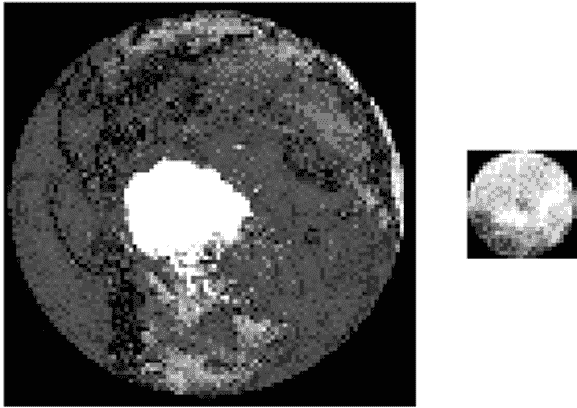

图 6-9：在模拟中使用的 earth_100x100.gif 和 moon_27x27.gif 图像

##### **导入 turtle 并赋值常量**

列表 6-1 导入了 turtle 模块并赋值了表示关键参数的常量：引力常数、主循环运行的次数，以及 R[0]和 V[0]的*x*和*y*值（参见图 6-3）。将这些值列在程序的顶部使得它们易于查找和修改。

```py
apollo_8_free_return.py, part 1 
from turtle import Shape, Screen, Turtle, Vec2D as Vec

# User input:
G = 8 
NUM_LOOPS = 4100 
Ro_X = 0 
Ro_Y = -85 
Vo_X = 485 
Vo_Y = 0
```

列表 6-1：导入 turtle 并赋值常量

你需要从 turtle 导入四个辅助类。你将使用 Shape 类来制作一个看起来像 CSM 的自定义海龟。Screen 子类用于创建屏幕，turtle 术语中称之为*绘图板*。Turtle 子类用于创建海龟对象。Vec2D 导入的是一个二维向量类，它将帮助你定义速度，作为一个具有大小和方向的向量。

接下来，分配一些变量，用户以后可能希望调整它们。首先是引力常数，它用于牛顿引力方程中，以确保单位的正确性。将其设置为 8，这是 turtle 演示中使用的值。可以将其视为一个 *缩放过* 的引力常数。你不能使用真实的常数，因为模拟并不使用现实世界的单位。

你将在一个循环中运行模拟，每次迭代代表一个时间步长。每个步骤，程序都会重新计算 CSM 的位置，随着它穿越地球和月球的引力场。通过反复试验得出的 4100 的值，将在宇宙飞船返回地球后停止模拟。

1968 年，往返月球大约需要六天。由于你每次循环增加 0.001 的时间单位，并运行 4,100 次循环，这意味着模拟中的一个时间步长大约代表现实世界中的两分钟。时间步长越长，模拟运行得越快，但结果的准确性越差，因为小错误会随着时间的推移积累。在实际的飞行路径模拟中，你可以通过先运行一个小的时间步长（以获得最大的准确性），然后使用结果来找到一个能产生相似结果的最大时间步长，从而优化时间步长。

接下来的两个变量 Ro_X 和 Ro_Y 表示 CSM 在月球转移注入（translunar injection）时的（*x*，*y*）坐标（见图 6-3）。同样，Vo_X 和 Vo_Y 表示月球转移注入速度的 *x* 和 *y* 分量，这个速度由土星五号火箭的第三阶段提供。这些值最初是通过猜测得出的，然后通过反复模拟进行优化。

##### **创建引力系统**

由于地球、月球和 CSM 形成了一个持续互动的引力系统，你需要一种方便的方式来表示它们及其相应的力。为此，你需要两个类，一个用于创建引力系统，另一个用于创建其中的天体。清单 6-2 定义了 GravSys 类，帮助你创建一个迷你太阳系。这个类将使用一个列表来跟踪所有在运动中的天体，并将它们通过一系列时间步长循环。它基于 turtle 库中的 *planet_and_moon.py* 演示。

```py
apollo_8_free_return.py, part 2
class GravSys():
    """Runs a gravity simulation on n-bodies."""

    def __init__(self):
        self.bodies = []
        self.t = 0
        self.dt = 0.001    

 ➊ def sim_loop(self):
        """Loop bodies in a list through time steps."""
        for _ in range(NUM_LOOPS):
            self.t += self.dt
            for body in self.bodies:
                body.step()
```

清单 6-2：定义一个类来管理引力系统中的天体

GravSys 类定义了模拟运行的时间、时间步长（循环之间的时间间隔）以及参与的天体。它还调用了你将在清单 6-3 中定义的 Body 类的 step() 方法。这个方法将根据引力加速度更新每个天体的位置。

定义初始化方法，并按照惯例将 self 作为参数传递。self 参数表示你将在 main() 函数中创建的 GravSys 对象。

创建一个空列表，命名为 bodies，用于存放地球、月球和 CSM 对象。接着，设置模拟开始时的属性以及每次循环时递增的时间量，这个量被称为 *delta time* 或 dt。将起始时间设置为 0，并将 dt 时间步长设置为 0.001。如前一节所讨论的，这个时间步长大约对应现实世界中的两分钟，并且会产生一个平滑、准确且快速的模拟。

最后一个方法控制模拟中的时间步长 ➊。它使用一个 for 循环，范围设置为 NUM_LOOPS 变量。使用单个下划线 (_) 而不是 i 来表示使用一个不重要的变量（有关详细信息，请参见 列表 5-3 以及 第五章）。

在每次循环中，增加重力系统的时间变量 dt。然后，通过遍历物体列表并调用 body.step() 方法（稍后会在 Body 类中定义）来对每个物体应用时间偏移。此方法更新物体由于引力作用而改变的位置和速度。

##### **创建天体**

列表 6-3 定义了 Body 类，用于构建地球、月球和 CSM Body 对象。尽管没有人会把行星误认为是小型航天器，但从引力角度来看，它们差别并不大，因此你可以将它们都用相同的模板创建出来。

```py
apollo_8_free_return.py, part 3
class Body(Turtle): 
    """Celestial object that orbits and projects gravity field.""" 
    def __init__(self, mass, start_loc, vel, gravsys, shape):
        super().__init__(shape=shape)
        self.gravsys = gravsys
        self.penup()
        self.mass = mass
        self.setpos(start_loc)
        self.vel = vel
        gravsys.bodies.append(self)
        #self.resizemode("user")
        #self.pendown()  # Uncomment to draw path behind object.
```

列表 6-3：定义一个类来创建地球、月球和 CSM 的对象

通过使用 Turtle 类作为 *祖先* 来定义一个新类。这意味着 Body 类将方便地继承 Turtle 类的所有方法和属性。

接下来，为 body 对象定义一个初始化方法。你将用它在模拟中创建新的 Body 对象，这个过程在面向对象编程中称为 *实例化*。作为参数，初始化方法接收自身、质量属性、起始位置、起始速度、重力系统对象和形状。

super() 函数允许你调用父类的方法，以访问从祖先类继承的方法。这使得你的 Body 对象能够使用预构建的 Turtle 类的属性。将形状属性传递给它，这样你在 main() 函数中创建物体时，就能为物体传递自定义的形状或图像。

接下来，为 gravsys 对象分配一个实例属性。这将允许重力系统和物体进行交互。请注意，最好通过 __init__() 方法初始化属性，就像我们在这里做的那样，因为它是创建对象后第一个被调用的方法。这样，这些属性将立即对类中的其他方法可用，并且其他开发者可以在一个地方看到所有属性的列表。

以下是 Turtle 类的 penup() 方法，它将移除绘图笔，使得物体在移动时不会留下路径。这样，你就可以选择运行带有或不带有可视轨道路径的模拟。

为物体初始化一个质量属性。你需要这个属性来计算重力。接下来，使用 Turtle 类的 setpos()方法为物体分配起始位置。每个物体的起始位置将是一个(*x*, *y*)元组。原点(0, 0)将在屏幕中央，*x*坐标向右增加，*y*坐标向上增加。

为速度分配一个初始化属性。它将保存每个物体的起始速度。对于 CSM，这个值将在模拟过程中随着飞船穿越地球和月球的引力场而变化。

在每个物体实例化时，使用点符号将其附加到重力系统中的物体列表中。你将在 main()函数中从 GravSys()类创建 gravsys 对象。

最后的两行，已注释掉，允许用户更改模拟窗口的大小，并选择在每个物体后面绘制路径。先从全屏显示开始，并保持笔的位置在上方，以便快速运行模拟。

##### **计算重力加速度**

阿波罗 8 号模拟将在月际注入后立即开始。此时，*土星 V*的第三级已经点燃并脱落，CSM 开始向月球行进。所有的速度或方向变化将完全由于重力变化。

清单 6-4 中的方法遍历物体列表中的物体，计算每个物体的重力加速度，并返回一个表示物体在*x*和*y*方向上的加速度的向量。

```py
apollo_8_free_return.py, part 4
    def acc(self):
        """Calculate combined force on body and return vector components."""
        a = Vec(0, 0)
        for body in self.gravsys.bodies:
            if body != self:
                r = body.pos() - self.pos()
                a += (G * body.mass / abs(r)**3) * r
        return a
```

清单 6-4：计算重力加速度

仍然在 Body 类内，定义加速度方法，命名为 acc()，并传入 self。在方法内，定义一个局部变量 a，再次代表加速度，并将其赋值为一个使用 Vec2D 辅助类的向量元组。2D 向量是一个由实数（*a*, *b*）组成的对，这里分别表示*x*和*y*分量。Vec2D 辅助类强制执行规则，允许使用向量进行简便的数学运算，如下所示：

+   (*a*, *b*) + (*c*, *d*) = (*a* + *c*, *b* + *d*)

+   (*a*, *b*) – (*c*, *d*) = (*a* – *c*, *b* – *d*)

+   (*a*, *b*) × (*c*, *d*) = *ac* + *bd*

接下来，开始遍历物体列表中的项，该列表包含地球、月球和指令服务舱（CSM）。你将使用每个物体的重力来确定你正在调用 acc()方法的物体的加速度。物体不应自我加速，因此如果物体与自身相同，则排除它。

要计算空间中某一点的重力加速度（存储在 g 变量中），你需要使用以下公式：

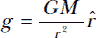

其中，*M* 是吸引物体的质量，*r* 是物体之间的距离（半径），*G* 是你之前定义的引力常数，*r* 是从吸引物体的质心到被加速物体质心的单位向量。*单位向量*，也称为*方向向量*或*归一化向量*，可以表示为 *r/|r|*，或者：

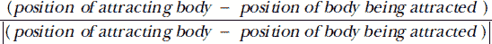

单位向量可以帮助你捕捉加速度的方向，方向可以是正值或负值。要计算单位向量，你需要通过使用海龟的 pos() 方法获取每个物体当前的位置，并将其表示为一个 Vec2D 向量来计算物体之间的距离。如前所述，这个向量是一个由 (*x*, *y*) 坐标组成的元组。

然后，你将把这个元组输入到加速度方程中。每次循环遍历一个新的物体时，你将根据正在检查物体的引力来更改 a 变量。例如，虽然地球的引力可能会减缓 CSM 的速度，月球的引力可能会朝相反方向拉动并使其加速。a 变量将捕捉到循环结束时的净效应。通过返回 a 来完成方法。

##### **逐步模拟**

Listing 6-5，仍然在 Body 类中，定义了一个方法来解决三体问题。它会在每个时间步长中更新引力系统中物体的位置、方向和速度。时间步长越短，解的准确性越高，但也会牺牲计算效率。

```py
apollo_8_free_return.py, part 5
def step(self):
    """Calculate position, orientation, and velocity of a body."""
    dt = self.gravsys.dt
    a = self.acc()
    self.vel = self.vel + dt * a
    self.setpos(self.pos() + dt * self.vel)
 ➊ if self.gravsys.bodies.index(self) == 2:  # Index 2 = CSM.
        rotate_factor = 0.0006
        self.setheading((self.heading() - rotate_factor * self.xcor()))
     ➋ if self.xcor() < -20: 
            self.shape('arrow')
            self.shapesize(0.5)
            self.setheading(105)
```

Listing 6-5: 应用时间步长并旋转 CSM

定义一个 step() 方法来计算物体的位置、方向和速度。将 self 作为参数传递给它。

在方法定义中，设置一个本地变量 dt，赋值为同名的 gravsys 对象。这个变量与任何实时系统没有关联；它只是一个浮动的数字，你将用它来在每个时间步长中增加速度。dt 变量的值越大，模拟的运行速度就越快。

现在，调用 self.acc() 方法来计算当前物体由于其他物体的引力场的合力所经历的加速度。该方法返回一个 (*x*, *y*) 坐标的向量元组。将其乘以 dt 并将结果加到 self.vel() 上，后者也是一个向量，从而更新当前时间步长的物体速度。回想一下，背后 Vec2D 类将负责处理向量运算。

要更新海龟图形窗口中物体的位置，将物体的速度乘以时间步长，并将结果加到物体的位置信息上。现在，每个物体将根据其他物体的引力来移动。你刚刚解决了三体问题！

接下来，添加一些代码来精细化 CSM 的行为。推力从 CSM 后部喷射，因此在实际任务中，航天器的后部朝向目标。这样，发动机就能启动并减速，足以进入月球轨道或地球大气层。对于自由返回轨迹来说，航天器不需要以这种方式朝向目标，但由于阿波罗 8 号计划发射发动机并进入月球轨道（并成功完成），你应该在整个旅程中正确地调整航天器的朝向。

从物体列表 ➊ 中选择 CSM。你将在 `main()` 函数中按大小顺序创建物体，因此 CSM 将是列表中的第三个项目，索引为 2。

为了让 CSM 在太空中滑行时旋转，给一个名为`rotate_factor`的局部变量赋值一个小的数值。我是通过反复试验得出这个数字的。接下来，使用 CSM 海龟对象的`self.heading`属性设置其航向。你无需传入 (*x*, *y*) 坐标，而是调用`self.heading()`方法，它会返回对象当前的航向角度，然后从中减去`rotate_factor`变量乘以当前的 *x* 位置，该位置通过调用`self.xcor()`方法获取。这样，随着 CSM 靠近月球，它的旋转速度会加快，以保持尾部指向运动方向。

在航天器进入地球大气层之前，你需要将服务舱分离。为了在一个与实际阿波罗任务相似的位置进行分离，使用另一个条件来检查航天器的 *x* 坐标 ➋。模拟中假定地球位于屏幕中心，坐标为 (0, 0)。在海龟中，*x* 坐标会随着你向左移动而减小，向右移动则增大。如果 CSM 的 *x* 坐标小于 –20 像素，你可以假设它正在返回地球，并且是时候与服务舱分离了。

你将通过改变代表 CSM（指令舱）的海龟形状来模拟这个事件。由于海龟包含一个标准形状——叫做箭头——它与指令舱相似，因此你现在只需调用`self.shape()`方法，并传入该形状的名称。然后调用`self.shapesize()`方法，将箭头的大小减半，使其匹配后续自定义的指令舱形状。当 CSM 通过 –20 *x* 位置时，服务舱将神奇地消失，留下指令舱完成回程任务。

最后，你需要将指令舱的底部朝向地球，确保热防护罩朝向地球。通过将箭头形状的航向设置为 105 度来实现这一点。

##### **定义 `main()`，设置屏幕，并实例化引力系统**

你使用面向对象编程构建了引力系统和其中的天体。为了运行仿真，你将回到过程式编程并使用 main()函数。此函数设置海龟图形屏幕，为引力系统和三个天体实例化对象，构建指令舱的自定义形状，并调用引力系统的 sim_loop()方法以逐步进行时间步长。

示例 6-6 定义了 main()并设置了屏幕。它还创建了一个引力系统对象来管理你的迷你太阳系。

```py
apollo_8_free_return.py, part 6
def main():  
    screen = Screen()
    screen.setup(width=1.0, height=1.0) # For fullscreen.
    screen.bgcolor('black')
    screen.title("Apollo 8 Free Return Simulation")

    gravsys = GravSys()
```

示例 6-6：在 main()中设置屏幕并创建 gravsys 对象

定义 main()函数，然后基于 TurtleScreen 子类实例化一个屏幕对象（绘图窗口）。接着调用该屏幕对象的 setup()方法，将屏幕大小设置为全屏。通过传递宽度和高度参数为 1 来实现这一点。

如果你不希望绘图窗口占满整个屏幕，可以将以下代码片段中的像素参数传递给 setup()：

```py
screen.setup(width=800, height=900, startx=100, starty=0)
```

注意，负值的 startx 表示右对齐，负值的 starty 表示底部对齐，默认设置会创建一个居中的窗口。可以随意尝试这些参数，以找到最适合你显示器的设置。

完成屏幕设置后，将背景颜色设置为黑色并为其设置标题。接下来，使用 GravSys 类实例化一个引力系统对象 gravsys。这个对象将使你能够访问 GravSys 类中的属性和方法。稍后在实例化每个天体时，你将把它传递给每个天体。

##### **创建地球和月球**

示例 6-7 仍然在 main()函数中，使用你之前定义的 Body 类创建地球和月球的海龟对象。地球将保持在屏幕中心不动，而月球将绕着地球旋转。

当你创建这些对象时，你需要设置它们的起始坐标。地球的起始位置接近屏幕中心，稍微偏向下方一点，以便为月球和指令舱留出空间，使它们可以在窗口的顶部互动。

月球和指令舱的起始位置应该与图 6-3 中的内容一致，指令舱位于地球中心正下方。这样，你只需在*x*方向施加推力，而不需要计算一个包含*x*方向和*y*方向运动的向量分量速度。

```py
apollo_8_free_return.py, part 7
   image_earth = 'earth_100x100.gif'
   screen.register_shape(image_earth)
   earth = Body(1000000, (0, -25), Vec(0, -2.5), gravsys, image_earth)
   earth.pencolor('white')
   earth.getscreen().tracer(n=0, delay=0) 

➊ image_moon = 'moon_27x27.gif'
   screen.register_shape(image_moon)
   moon = Body(32000, (344, 42), Vec(-27, 147), gravsys, image_moon)
   moon.pencolor('gray')
```

示例 6-7：实例化地球和月球的海龟对象

首先将地球的图像赋值给一个变量，该图像包含在此项目的文件夹中。注意，图像应该是*gif*文件，并且不能旋转以显示海龟的朝向。为了让海龟识别新的形状，使用 screen.register_shape()方法将其添加到 TurtleScreen 的 shapelist 中，并将引用地球图像的变量传给它。

现在是时候为地球实例化 turtle 对象了。你调用 Body 类并传入质量、起始位置、起始速度、引力系统和 turtle 形状（在这种情况下是图像）的参数。接下来，我们将更详细地讨论每个参数。

这里并没有使用真实世界的单位，因此质量是一个任意数字。我从 turtle 示例程序 *planet_and_moon.py* 中使用的太阳质量值开始，这个程序是本程序的基础。

起始位置是一个 (*x*, *y*) 元组，将地球放置在屏幕的中心附近。然而，它向下偏移了 25 像素，因为大部分动作会发生在屏幕的上半部分。这个位置将为该区域提供更多空间。

起始速度是一个简单的 (*x*, *y*) 元组，作为参数传递给 Vec2D 辅助类。如前所述，这将允许后续的方法通过向量运算来改变速度属性。需要注意的是，地球的速度不是 (0, 0)，而是 (0, -2.5)。在现实世界中以及模拟中，月球足够大，会影响地球，使得地球和月球之间的重心不在地球的中心，而是在更远的地方。这会导致地球 turtle 在模拟过程中出现摆动，并且位置发生干扰性的变化。由于月球将在模拟过程中出现在屏幕的上半部分，每个时间步长地球向下移动少许将减缓这种摆动。

最后两个参数是你在之前列表中实例化的 gravsys 对象和地球的图像变量。传递 gravsys 意味着地球 turtle 将被添加到物体列表中，并包含在 sim_loop() 类方法中。

请注意，如果你不想在实例化对象时使用大量参数，可以在创建对象后更改其属性。例如，在定义 Body 类时，你本可以设置 self.mass = 0，而不是为质量使用一个参数。然后，在实例化地球对象后，你可以通过 earth.mass = 1000000 来重设质量值。

因为地球略有摆动，它的轨道路径会在行星的顶部形成一个紧密的圆圈。为了将其隐藏在极地帽中，可以使用 turtle 的 pencolor() 方法，并将线条颜色设置为白色。

使用代码使地球的海龟在模拟开始前延迟启动，并防止各种海龟在程序第一次绘制和调整大小时在屏幕上闪烁。getscreen() 方法返回海龟正在绘制的 TurtleScreen 对象。然后，可以对该对象调用 TurtleScreen 方法。在同一行中，调用 tracer() 方法，该方法用于打开或关闭海龟动画并设置绘图更新的延迟。*n* 参数决定了屏幕更新的次数。值为 0 表示每次循环屏幕都会更新；较大的值会逐渐抑制更新。这可以加速复杂图形的绘制，但会以图像质量为代价。第二个参数设置屏幕更新之间的延迟时间，单位为毫秒。增加延迟会减慢动画速度。

你将以类似地球海龟的方式构建月球海龟。首先分配一个新变量来保存月球的图像 ➊。月球的质量只有地球质量的几分之一，因此要为月球使用一个较小的值。我开始时使用了大约 16,000 的质量，并调整该值，直到 CSM 的飞行路径在月球周围产生了一个视觉上令人满意的循环。

月球的起始位置由图 6-3 中显示的相位角控制。像这个图一样，你在这里创建的模拟并非按比例显示。尽管地球和月球的图像将具有正确的相对大小，但它们之间的距离小于实际距离，因此需要相应地调整相位角。我在模型中减少了距离，因为太空非常广阔，真的非常大。如果你想要按比例显示模拟并将其完全适应你的计算机显示器，那么你只能接受一个极其小的地球和月球(图 6-10)。

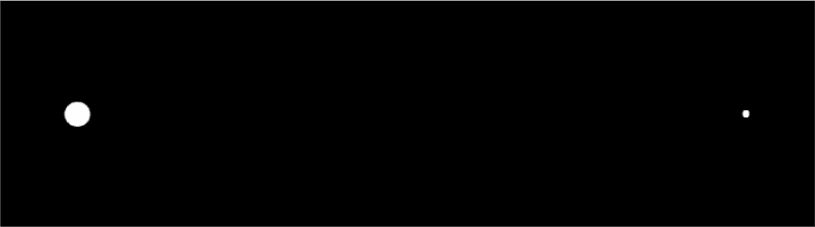

图 6-10：地球与月球系统在最近接近时，或称近地点，按比例显示

为了让这两个天体仍然易于识别，你将使用更大的、经过适当缩放的图像，但减少它们之间的距离(图 6-11)。这种配置对观众来说更加直观，同时仍然能够复制自由返回轨道。

由于在模拟中地球和月球之间的距离较近，根据开普勒的第二定律，月球的轨道速度会比实际情况快。为了解决这个问题，月球的起始位置设计得比图 6-3 所示的相位角要小。

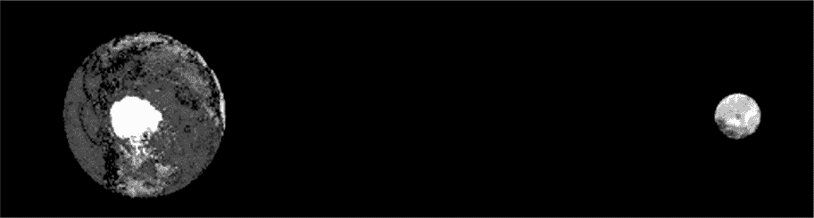

图 6-11：模拟中的地球与月球系统，仅有正确比例的天体大小

最后，你需要一个选项来在月球后面画一条线，以追踪它的轨道。使用海龟的 pencolor() 方法，并将线条颜色设置为灰色。

**注意**

*例如质量、初始位置和初始速度等参数是全局常量的理想候选项。尽管如此，我选择将它们作为方法参数输入，以避免在程序开始时让用户承受过多的输入变量。*

##### **为 CSM 构建自定义形状**

现在是时候实例化一个 turtle 对象来表示 CSM 了。这比创建最后两个对象需要更多的工作。

首先，无法将 CSM 显示为与地球和月球相同的比例。要做到这一点，你需要*小于*一个像素，但这是不可能的。而且，这样做还有什么乐趣呢？所以，再次，你将不拘一格地调整比例，使 CSM 足够大，以便能被识别为阿波罗飞船。

其次，你不会像处理其他两个物体时那样使用图像来表示 CSM。因为图像形状在 turtle 转动时不会自动旋转，而你希望在大部分旅程中使 CSM 尾部朝前，所以必须自定义自己的形状。

列表 6-8，仍然在 main() 中，通过绘制基本形状（如矩形和三角形）来构建 CSM 的表示。然后，你将这些单独的基本图形组合成一个最终的复合形状。

```py
apollo_8_free_return.py, part 8
csm = Shape('compound')
cm = ((0, 30), (0, -30), (30, 0))
csm.addcomponent(cm, 'white', 'white')
sm = ((-60, 30), (0, 30), (0, -30), (-60, -30))
csm.addcomponent(sm, 'white', 'black')  
nozzle = ((-55, 0), (-90, 20), (-90, -20))
csm.addcomponent(nozzle, 'white', 'white')
screen.register_shape('csm', csm)
```

列表 6-8：为 CSM turtle 构建自定义形状

命名一个变量 csm 并调用 turtle Shape 类。传递参数 'compound'，表示你希望使用多个组件构建形状。

第一个组件将是指令模块。命名一个变量 cm，并将其赋值为坐标对的元组，这些坐标在 turtle 中称为*多边形类型*。这些坐标构建一个三角形，如图 6-12 所示。

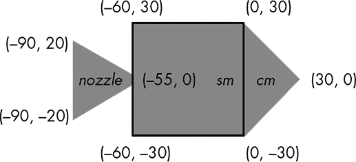

图 6-12：包含喷嘴、服务模块和指令模块坐标的 CSM 复合形状

使用 addcomponent() 方法将这个三角形组件添加到 csm 形状中，方法通过点号符号调用。传递 cm 变量、填充颜色和轮廓颜色。合适的填充颜色包括白色、银色、灰色或红色。

对服务模块矩形重复此一般过程。在将组件添加到服务和指令模块时，设置轮廓颜色为黑色，以便区分服务模块和指令模块（参见图 6-12）。

使用另一个三角形表示喷嘴，也称为*发动机喇叭*。添加组件后，将新的 csm 复合形状注册到屏幕上。传递方法时需要提供形状的名称以及引用该形状的变量。

##### **创建 CSM，启动仿真并调用 main()**

列表 6-9 完成 main() 函数，通过实例化一个 CSM 的 turtle 并调用运行时间步骤的仿真循环。然后，如果程序在独立模式下运行，它将调用 main()。

```py
apollo_8_free_return.py, part 9
    ship = Body(1, (Ro_X, Ro_Y), Vec(Vo_X, Vo_Y), gravsys, 'csm')
    ship.shapesize(0.2)
    ship.color('white')
    ship.getscreen().tracer(1, 0)
    ship.setheading(90)

    gravsys.sim_loop()

if __name__ == '__main__':
    main()
```

列表 6-9：实例化 CSM turtle，调用仿真循环和 main()

创建一个名为 ship 的海龟来表示指令模块。起始位置是一个(*x*, *y*)元组，将指令模块放置在屏幕上地球正下方的停泊轨道。我首先大致估算了停泊轨道的合适高度（图 6-3 中的 R[0]），然后通过反复运行仿真进行微调。注意，你使用的是程序开始时分配的常量，而非实际值。这是为了方便你以后实验这些值。

速度参数（Vo_X, Vo_Y）表示指令模块在土星第三阶段停止点火时的速度，即在向月球注入过程中。所有的推力都朝*X*方向，但地球的引力将使飞行轨迹立刻向上弯曲。像 R[0]参数一样，一个最佳猜测的速度被输入并通过仿真进行优化。注意，速度是一个使用 Vec2D 辅助类输入的元组，这使得后续方法能够通过向量运算改变速度。

接下来，使用 shapesize()方法设置飞船海龟的大小。然后将其路径颜色设置为白色，这样它就能与飞船的颜色匹配。其他吸引人的颜色有银色、灰色和红色。

使用 getscreen()和 tracer()方法控制屏幕更新，然后将飞船的航向设置为 90 度，使其在屏幕上指向正东方。

这完成了天体对象的定义。现在剩下的就是启动仿真循环，使用 gravsys 对象的 sim_loop()方法。在全局空间中，使用代码运行程序，可以作为导入模块或独立模式运行。

按照当前的程序，你必须手动关闭 Turtle Graphics 窗口。如果你希望窗口自动关闭，可以在 main()函数的最后一行添加以下命令：

```py
screen.bye()
```

#### ***运行仿真***

当你第一次运行仿真时，笔尖会抬起，且所有天体的轨道路径不会绘制出来（图 6-13）。指令模块会平滑地旋转并重新定位自己，接近月球然后是地球。

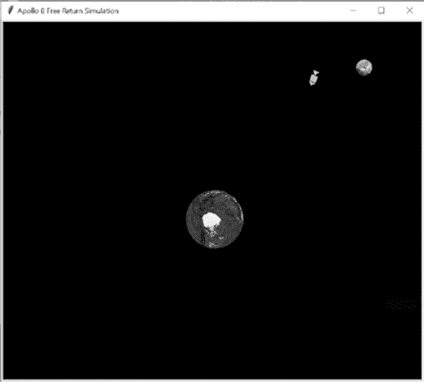

图 6-13：仿真运行时，笔尖抬起，指令模块接近月球

要追踪指令模块的轨迹，去到 Body 类的定义并取消注释这行代码：

```py
    self.pendown() # uncomment to draw path behind object
```

你现在应该能看到自由返回轨迹的“8 字形”轨迹（图 6-14）。

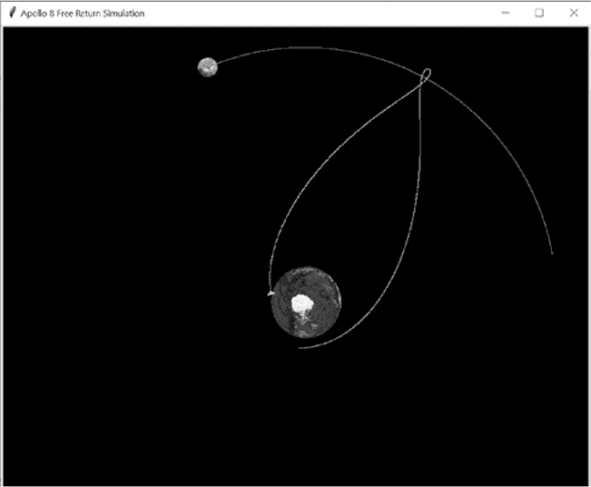

图 6-14：仿真运行时，笔尖下压，指令舱在太平洋迫降

你还可以模拟*引力推进*—也叫做*弹弓机动*—通过将 Vo_X 速度变量设置为 520 到 540 之间的某个值，然后重新运行仿真。这将导致指令模块绕月球飞行，并窃取一些月球的动量，从而增加飞船的速度并偏转飞行路径（图 6-15）。拜拜，阿波罗 8 号！

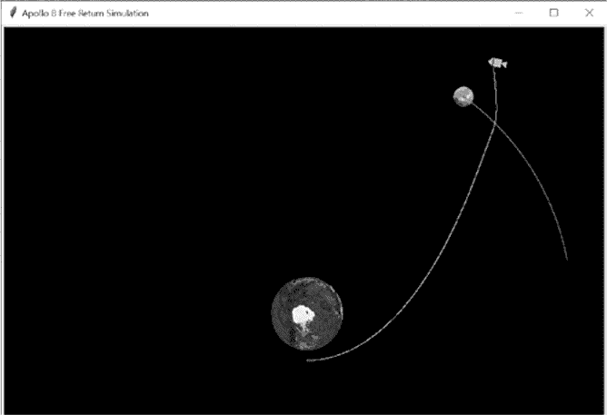

图 6-15：通过 Vo_X = 520 实现的引力弹弓机动

这个项目应该教会你，太空旅行是与秒与厘米赛跑的游戏。如果你继续尝试不同的 Vo_X 变量值，你会发现即便是微小的变化也可能让任务失败。如果你没有撞向月球，你可能会过于陡峭地重新进入地球大气层，或者完全错过月球！

模拟的好处在于，如果失败了，你仍然可以继续尝试。NASA 为其所有提出的任务进行无数次模拟。模拟结果帮助 NASA 在多个飞行计划中做出选择，找到最有效的航线，决定在出现问题时该怎么做，以及更多内容。

模拟对于外太阳系探索尤为重要，因为巨大的距离使得实时通信变得不可能。关键事件的时间安排，如喷射推进器、拍摄照片或释放探测器，都是基于精确模拟进行预编程的。

### **总结**

在本章中，你学习了如何使用 turtle 绘图程序，包括如何制作自定义的 turtle 形状。你还学习了如何使用 Python 模拟引力并解决著名的三体问题。

### **进一步阅读**

*《阿波罗 8 号：第一次登月任务的惊心动魄故事》*（亨利·霍尔特出版社，2017 年），作者杰弗里·克鲁格，讲述了历史性的阿波罗 8 号任务，从其不太可能的起点到其“难以想象的胜利”。

在线搜索 *PBS Nova How Apollo 8 Left Earth Orbit* 应该能返回一个简短的视频片段，讲解阿波罗 8 号的月际转移机动，标志着人类首次离开地球轨道并前往另一个天体。

*《NASA 旅行者 1 号与 2 号用户手册》*（海恩斯出版社，2015 年），作者克里斯托弗·赖利、理查德·科菲尔德和菲利普·多林，提供了关于三体问题以及迈克尔·米诺维奇对太空旅行贡献的有趣背景。

维基百科上的 *引力辅助* 页面包含了许多有趣的引力辅助机动动画和历史性的行星飞掠，你可以在阿波罗 8 号模拟中重现这些内容。

*《追寻新视野：深入探秘第一次冯向冥王星的史诗任务》*（皮卡多出版社，2018 年），作者艾伦·斯特恩和大卫·格林斯普恩，记录了模拟在 NASA 任务中的重要性和普及性。

### **实践项目：模拟搜索模式**

在第一章中，你使用贝叶斯定理帮助海岸警卫队寻找失踪的海员。现在，使用 turtle 设计一个直升机搜索模式，以寻找失踪的海员。假设观察员能够看到 20 像素远的区域，并且长航迹之间的间隔为 40 像素（见图 6-16）。

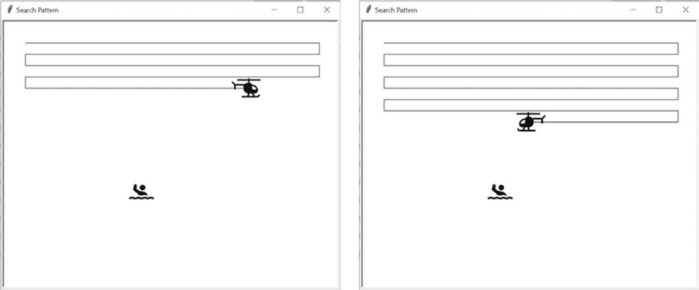

图 6-16：来自 practice_search_pattern.py 的两个截图

为了好玩，添加一个直升机 turtle，并在每次飞行时正确调整它的方向。还可以添加一个随机位置的海员 turtle，在找到海员时停止模拟，并在屏幕上显示喜讯（见图 6-17）。

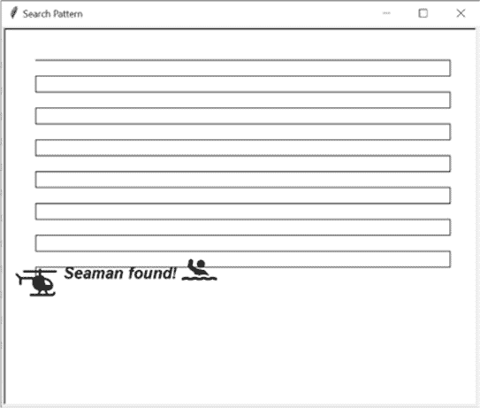

图 6-17：海员在 *practice_search_pattern.py* 中被发现。

你可以在附录中找到解决方案，*practice_search_pattern.py*。我已将数字版本和直升机、海员图像一并包含在 *Chapter_6* 文件夹中，可以从书籍网站下载。

### **练习项目：启动我！**

重写 *apollo_8_free_return.py* 使得移动的月球接近静止的指令舱，导致指令舱开始移动，然后将其甩向远方。为了增加趣味，调整指令舱的方向，使其始终指向前进的方向，仿佛在自身的推动下行进（见 图 6-18）。

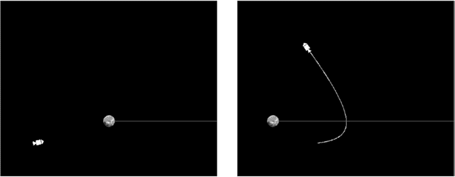

图 6-18：月球接近静止的指令舱（左），然后将其抛向星空（右）。

如需解决方案，请参见附录中的 *practice_grav_assist_stationary.py*，或从 *[`nostarch.com/real-world-python/`](https://nostarch.com/real-world-python/)* 下载。

### **练习项目：关闭我！**

重写 *apollo_8_free_return.py* 使得指令舱和月球的轨道交叉，指令舱在月球之前通过，而月球的引力减缓指令舱的速度，并使其改变方向约 90 度。与之前的练习项目一样，让指令舱始终指向行进的方向（见 图 6-19）。

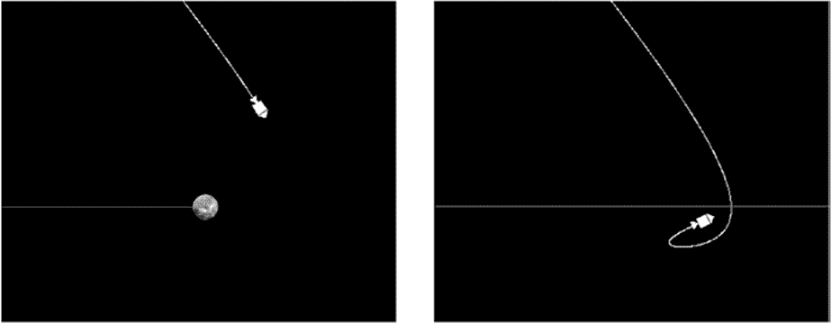

图 6-19：月球与指令舱交叉轨道，月球减慢并转向指令舱。

如需解决方案，请参见附录中的 *practice_grav_assist_intersecting.py*，或从 *[`nostarch.com/real-world-python/`](https://nostarch.com/real-world-python/)* 下载。

### **挑战项目：真实比例模拟**

重写 *apollo_8_free_return.py* 使得地球、月球及其之间的距离都能准确缩放，如 图 6-10 所示。使用彩色圆圈代替图像表示地球和月球，且使指令舱不可见（只绘制其后方的线条）。使用 表 6-2 来帮助确定相对的大小和距离。

**表 6-2：地月系统的长度参数**

| 地球半径 | 6,371 公里 |
| --- | --- |
| 月球半径 | 1,737 公里 |
| 地月距离 | 356,700 公里* |

*阿波罗 8 号任务在 1968 年 12 月的最接近接触

### **挑战项目：真实的阿波罗 8 号**

重写 *apollo_8_free_return.py* 使其模拟整个阿波罗 8 号任务，而不仅仅是自由返回组件。指令舱应绕月球轨道飞行 10 圈后再返回地球。
