## 选择火星着陆点


在火星上着陆是一项极其困难且充满风险的任务。没有人希望失去一颗价值十亿的探测器，因此工程师必须强调操作安全。他们可能会花费数年时间通过卫星图像寻找最安全的着陆点，以满足任务目标。而且他们需要覆盖的区域非常广阔，火星的干旱土地几乎与地球一样多！

分析如此大范围的区域需要计算机的帮助。在本章中，你将使用 Python 语言和喷气推进实验室（Jet Propulsion Laboratory）骄傲的成果——火星轨道激光测高仪（MOLA）地图，来选择和排名火星着陆器的候选着陆点。为了加载和提取 MOLA 地图中的有用信息，你将使用 Python Imaging Library、OpenCV、tkinter 和 NumPy。

### **如何在火星上着陆**

将探测器着陆到火星表面的方法有很多，包括降落伞、气球、反向火箭和喷气背包。无论采用哪种方法，大多数着陆操作都遵循相同的基本安全规则。

第一个规则是目标选择低洼地区。探测器可能以每小时 27,000 公里的速度进入火星大气层。为了实现软着陆，必须通过厚厚的大气层减速。然而，火星的大气层非常稀薄——其密度大约是地球大气的 1%。为了找到足够的密度以产生影响，你需要瞄准最低的海拔区域，在那里空气更稠密，飞行所需的时间也最长。

除非你有专门的探测器，例如为极地冰帽设计的探测器，否则你会希望选择靠近赤道的地区着陆。这里，你将能获得充足的阳光来为探测器的太阳能面板提供能量，并且温度足够温暖，可以保护探测器的精密机械设备。

你需要避免选择那些被巨石覆盖的地方，因为巨石可能会摧毁探测器，阻止其面板展开，挡住其机械臂，或让探测器倾斜，无法面向太阳。出于类似的原因，你还应该避开那些陡坡区域，比如火山口边缘的地方。从安全的角度来看，越平坦越好，而无聊的地方则是美丽的。

另一个着陆火星的挑战是精确度有限。要飞行超过 5000 万公里，穿越大气层，并精确地在预定位置着陆是非常困难的。星际导航的误差以及火星大气特性的变化，使得在小范围内命中目标变得非常不确定。

因此，NASA 会对每个着陆坐标进行大量计算机模拟。每次模拟运行都会生成一个坐标，成千上万次运行的散点会形成一个椭圆形状，其长轴与探测器的飞行路径平行。这些*着陆椭圆*可能非常大（见图 7-1），尽管随着每次新任务的推进，准确性会有所提高。

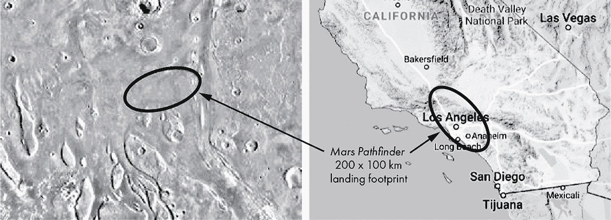

图 7-1：1997 年火星探路者着陆点（左）与南加州（右）的对比图

2018 年的 *InSight* 着陆器的着陆椭圆仅为 130 km × 27 km。探测器在该椭圆范围内着陆的概率约为 99%。

### **MOLA 地图**

为了识别合适的着陆点，你需要一张火星地图。在 1997 年至 2001 年之间，*Mars Global Surveyor* (*MGS*) 太空船上的一台工具向火星发射激光，并反射计时 6 亿次。通过这些测量，由玛丽亚·祖伯（Maria Zuber）和大卫·史密斯（David Smith）领导的研究人员制作了一张详细的全球地形图，被称为 MOLA (图 7-2)。

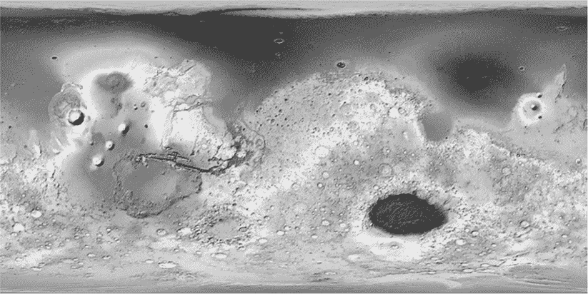

图 7-2：火星的 MOLA 阴影地形图

要查看 MOLA 的精彩彩色版本以及图例，请访问 *Mars Global Surveyor* 的维基百科页面。地图中的蓝色区域对应于数十亿年前火星上可能存在的海洋和海域。这些区域的分布是基于海拔和诊断性地表特征的组合，比如古老的海岸线。

MOLA 的激光测量垂直定位精度约为 3 至 13 米，水平定位精度约为 100 米。像素分辨率为每像素 463 米。单独看，MOLA 地图缺乏选择最终着陆椭圆所需的详细信息，但它非常适合进行你将要执行的范围划定工作。

### **项目 #10：选择火星着陆点**

假设你是 NASA 夏季实习生，正在参与 Orpheus 项目，这个任务旨在探测火星震动并研究火星内部，就像 2018 年的火星 *InSight* 任务一样。因为 Orpheus 的目的是研究火星的内部，所以火星表面的有趣特征并不那么重要。安全性是首要关注点，这使得这个任务成为工程师梦寐以求的机会。

你的任务是找到至少十二个区域，供 NASA 的工作人员选择较小的候选着陆椭圆。根据你的主管的要求，这些区域应为长 670 km（东西方向）和宽 335 km（南北方向）的矩形。为了应对安全问题，这些区域应横跨赤道，位于 30°N 和 30°S 纬度之间，处于低海拔，并且尽可能平坦光滑。

目标

编写一个 Python 程序，利用 MOLA 地图中的图像选择靠近火星赤道的 20 个最安全的 670 km × 335 km 区域，从中选择 *Orpheus* 着陆器的着陆椭圆。

#### ***策略***

首先，您需要一种方法将 MOLA 数字地图划分为矩形区域，并提取高程和表面粗糙度的统计数据。这意味着您将处理像素，因此需要图像处理工具。由于 NASA 总是注重成本控制，您将希望使用免费且开源的库，如 OpenCV、Python 图像库（PIL）、tkinter 和 NumPy。有关概述和安装说明，请参阅 OpenCV 和 NumPy 在第 6 页的“安装 Python 库”，以及 PIL 在第 65 页的“文字云和 PIL 模块”。tkinter 模块随 Python 一起预安装。

为了尊重高程约束，您可以简单地计算每个区域的平均高程。对于在给定尺度下测量表面平滑度，您有很多选择，其中一些相当复杂。除了基于高程数据来衡量平滑度，您还可以通过立体图像中的差异阴影、雷达、激光和微波反射中的散射量、红外图像中的热变化等来进行测量。许多粗糙度估算涉及沿*横断面*进行繁琐的分析，横断面是绘制在地球表面上的线，沿着这些线测量并检查高度变化。由于您并不是一个有三个月时间的暑期实习生，因此您将保持简单，使用两种常见的度量方法，并将其应用于每个矩形区域：标准差和峰谷值。

*标准差*，也被物理科学家称为*均方根*，是衡量一组数字分散程度的指标。低标准差表明一组中的值接近平均值；高标准差则表明它们分布在更广泛的范围内。具有低标准差的高程地图区域意味着该区域相对平坦，高程值与平均值的差异很小。

从技术上讲，样本群体的标准差是均值的平方偏差的平均值的平方根，表示如下公式：

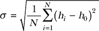

其中，σ 是标准差，*N* 是样本数量，*h*[*i*] 是当前的高度样本，*h*[*0*] 是所有高度的平均值。

*峰谷值*统计是指表面上最高点与最低点之间的高度差。它捕捉了表面上的最大高度变化。这一点很重要，因为一个表面可能具有相对较低的标准差——暗示着平滑——但仍然可能包含显著的危险，如图 7-3 中的横截面所示。

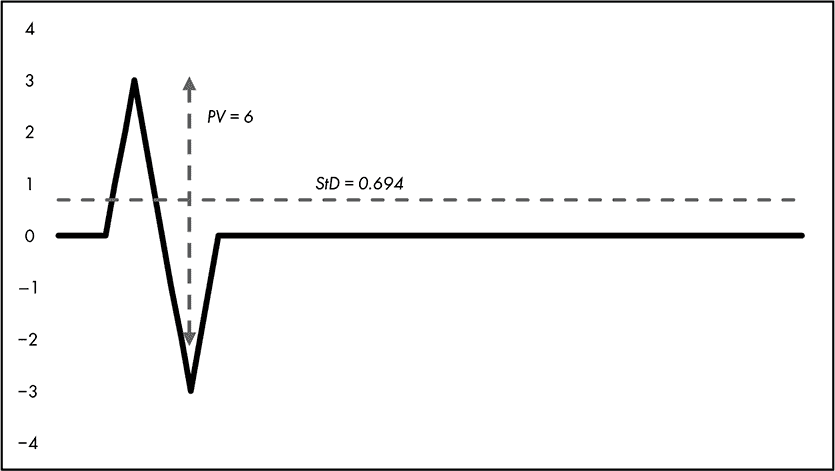

图 7-3：表面剖面（黑线）与标准差（StD）和峰谷值（PV）统计数据

你可以使用标准差和峰谷统计数据作为比较指标。对于每个矩形区域，你需要寻找每个统计数据的最低值。由于每个统计数据记录的是略有不同的内容，你将基于每个统计数据找到最佳的 20 个矩形区域，然后只选择那些重叠的矩形，最终找到最佳的矩形区域。

#### ***站点选择器代码***

*site_selector.py* 程序使用 MOLA 地图的灰度图像（图 7-4）来选择着陆点矩形，并使用阴影颜色图（图 7-2）显示它们。高程通过灰度图像中的单通道表示，因此比三通道（RGB）彩色图像更容易使用。

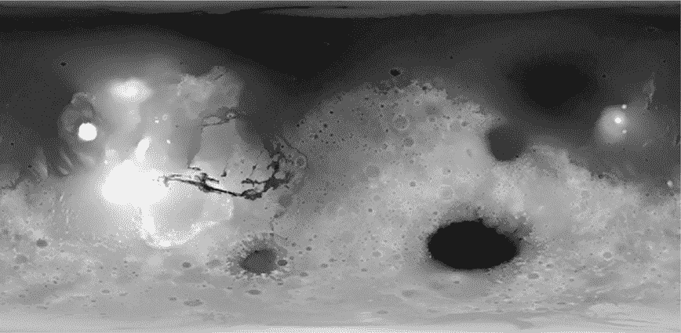

图 7-4：火星 MGS MOLA 数字高程模型 463m v2 (mola_1024x501.png)

你可以在 *Chapter_7* 文件夹中找到程序、灰度图像 (*mola_1024x501.png*) 和彩色图像 (*mola_color_1024x506.png*)，该文件夹可以从 *[`nostarch.com/real-world-python/`](https://nostarch.com/real-world-python/)* 下载。请将这些文件保存在同一文件夹中，并且不要重命名它们。

**注意**

*MOLA 地图有多种文件大小和分辨率。这里使用的是最小的文件尺寸，以加快下载和运行时间。*

##### **导入模块并分配用户输入常量**

清单 7-1 导入模块并分配代表用户输入参数的常量。这些包括图像文件名、矩形区域的尺寸、最大高程限制以及考虑的候选矩形数量。

```py
site_selector.py, part 1
import tkinter as tk
from PIL import Image, ImageTk
import numpy as np
import cv2 as cv

# CONSTANTS: User Input:
IMG_GRAY = cv.imread('mola_1024x501.png', cv.IMREAD_GRAYSCALE)
IMG_COLOR = cv.imread('mola_color_1024x506.png')
RECT_WIDTH_KM = 670  
RECT_HT_KM = 335  
MAX_ELEV_LIMIT = 55  
NUM_CANDIDATES = 20  
MARS_CIRCUM = 21344
```

清单 7-1：导入模块并分配用户输入常量

首先导入 tkinter 模块。这是 Python 默认的 GUI 库，用于开发桌面应用程序。你将使用它来制作最终的显示窗口：顶部是彩色 MOLA 地图，底部是已发布矩形的文本描述。大多数 Windows、macOS 和 Linux 机器都已安装 tkinter。如果你没有安装，或者需要最新版本，可以从 *[`www.activestate.com/`](https://www.activestate.com/)* 下载并安装。该模块的在线文档可以在 *[`docs.python.org/3/library/tk.html`](https://docs.python.org/3/library/tk.html)* 找到。

接下来，从 Python 图像库中导入 Image 和 ImageTK 模块。Image 模块提供了一个表示 PIL 图像的类，并且提供了工厂函数，包括从文件加载图像和创建新图像的函数。ImageTK 模块包含用于从 PIL 图像创建和修改 tkinter 的 BitmapImage 和 PhotoImage 对象的支持。再次强调，你将在程序结束时使用这些模块将彩色地图和一些描述性文本放入总结窗口中。最后，导入 NumPy 和 OpenCV。

现在，分配一些常量来表示程序运行过程中不会改变的用户输入。首先，使用 OpenCV 的 imread() 方法加载灰度的 MOLA 图像。请注意，必须使用 cv.IMREAD_GRAYSCALE 标志，因为该方法默认加载彩色图像。没有使用该标志的代码将加载彩色图像。然后，添加矩形大小的常量。在接下来的列表中，你将把这些尺寸转换为像素，以便在地图图像中使用。

接下来，为了确保矩形定位在低海拔的平坦区域，你应该将搜索限制在轻微坑洼的平坦地形上。这些区域被认为代表古老的海洋底部。因此，你将设置最大海拔限制为灰度值 55，这与被认为是古代海岸线遗迹的区域非常接近（参见图 7-5）。

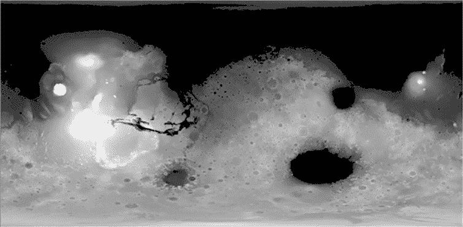

图 7-5：MOLA 地图，像素值 ≤ 55 的区域被涂黑，以表示古老的火星海洋

现在，指定要显示的矩形数量，由 NUM_CANDIDATES 变量表示。稍后，你将从一个排序后的矩形统计数据列表中选择这些矩形。通过为火星周长（以公里为单位）分配一个常量，来完成用户输入常量的设置。你稍后将使用这个常量来确定每公里的像素数。

##### **分配派生常量并创建屏幕对象**

列表 7-2 分配了从其他常量派生的常量。这些值会在用户更改前述常量时自动更新，例如测试不同的矩形大小或海拔限制。该列表最终通过创建 tkinter 屏幕和画布对象来完成最终显示。

```py
site_selector.py, part 2
   # CONSTANTS: Derived:
   IMG_HT, IMG_WIDTH = IMG_GRAY.shape
   PIXELS_PER_KM = IMG_WIDTH / MARS_CIRCUM
   RECT_WIDTH = int(PIXELS_PER_KM * RECT_WIDTH_KM)
   RECT_HT = int(PIXELS_PER_KM * RECT_HT_KM)
➊ LAT_30_N = int(IMG_HT / 3)
   LAT_30_S = LAT_30_N * 2
   STEP_X = int(RECT_WIDTH / 2)
   STEP_Y = int(RECT_HT / 2)

➋ screen = tk.Tk()
   canvas = tk.Canvas(screen, width=IMG_WIDTH, height=IMG_HT + 130)
```

列表 7-2：分配派生常量并设置 tkinter 屏幕

首先，使用 shape 属性解包图像的高度和宽度。OpenCV 将图像存储为 NumPy 的 ndarray，这些是*n*维数组——也就是同类元素的表格。对于图像数组，shape 是一个包含行数、列数和通道数的元组。高度表示图像中的像素行数，宽度表示图像中的像素列数。通道表示用来表示每个像素的组件数量（例如红、绿、蓝）。对于只有一个通道的灰度图像，shape 只是表示区域的高度和宽度的元组。

为了将矩形的尺寸从公里转换为像素，你需要知道每公里的像素数。所以，将图像的宽度除以周长，以获得赤道上的每公里像素数。然后将宽度和高度转换为像素。你将在后续的索引切片中使用这些值，因此请确保它们是整数，可以通过使用 int() 来确保。现在，这些常量的值应该分别是 32 和 16。

你想将搜索范围限制在最温暖和最阳光明媚的区域，这些区域位于赤道之间，纬度在 30°北和 30°南之间（参见图 7-6）。就气候标准而言，这个区域对应于地球的热带。

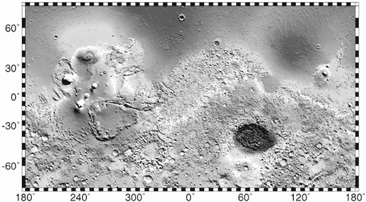

图 7-6：火星的纬度（y 轴）和经度（x 轴）

纬度值从赤道的 0°开始，到极地的 90°结束。要找到 30°北纬，你只需要将图像的高度除以 3 ➊。要到达 30°南纬，只需将到达 30°北纬所需的像素数翻倍。

将搜索范围限制在火星的赤道区域有一个有益的副作用。你正在使用的 MOLA 地图基于*圆柱投影*，该投影用于将地球表面转移到平面上。这导致经线收敛并变得平行，从而严重扭曲了靠近极地的地物。你可能在地球的墙面地图上注意到这种情况，格林兰岛看起来像一个大陆，南极洲巨大得不可思议（参见图 7-7）。

幸运的是，这种扭曲在赤道附近最小化，因此你不必将其考虑在矩形的维度中。你可以通过检查 MOLA 地图上的火山口形状来验证这一点。只要它们是圆形的——而不是椭圆形的——就可以忽略与投影相关的效应。

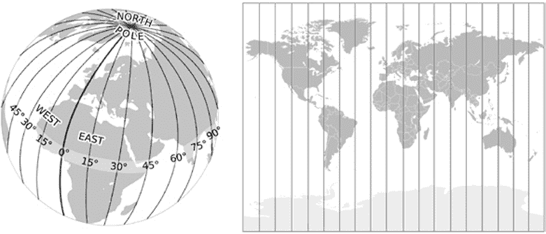

图 7-7：强迫经线平行会扭曲靠近极地的地物大小。

接下来，你需要将地图划分成矩形区域。一个合逻辑的起点是左上角，位于 30°北纬线下方（参见图 7-8）。

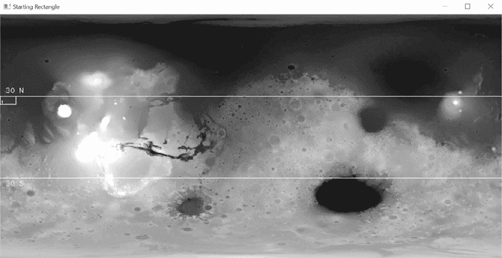

图 7-8：第一个编号矩形的位置

程序将绘制第一个矩形，编号并计算其中的高度统计数据。然后它会将矩形向东移动，并重复这一过程。每次移动矩形的距离由 STEP_X 和 STEP_Y 常量定义，并且与称为*别名效应*的现象有关。

别名效应是一个分辨率问题。当你没有足够多的样本来识别某一地区所有重要的地表特征时，就会发生这种情况。这可能导致你“跳过”某个特征，比如火山口，从而未能识别出来。例如，在图 7-9A 中，在两个大火山口之间有一个适当平滑的着陆椭圆。然而，如图 7-9B 所示，任何一个矩形区域都没有对应这个椭圆；该区域内的两个矩形都部分采样了一个火山口的边缘。因此，虽然在附近存在一个适合的着陆椭圆，但绘制的矩形中没有一个包含该椭圆。在这种矩形布局下，图 7-9A 中的椭圆*产生了别名效应*。但是，如果将每个矩形移动其宽度的一半，如图 7-9C 所示，平滑区域将被正确采样并识别出来。

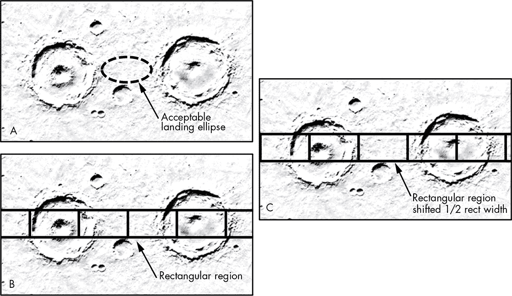

图 7-9：由于矩形位置引起的别名效应示例

避免别名效应的经验法则是将步长设置为小于或等于你想要识别的最小特征的宽度的一半。对于这个项目，使用矩形宽度的一半，这样显示不会显得过于拥挤。

现在是时候展望最终显示的效果了。创建一个 tkinter Tk() 类的屏幕实例 ➋。tkinter 应用程序是 Python 对 GUI 工具包 Tk 的封装，Tk 最初是用一种叫做 TCL 的计算机语言编写的。它需要一个屏幕窗口来连接到底层的 tcl/tk 解释器，将 tkinter 命令翻译成 tcl/tk 命令。

接下来，创建一个 tkinter 画布对象。这是一个矩形绘图区域，旨在支持复杂的图形、文本、控件和框架布局。将屏幕对象传递给它，将其宽度设置为 MOLA 图像的宽度，并将其高度设置为 MOLA 图像的高度加上 130。图像下方的额外填充区域将用来显示总结矩形统计数据的文本。

通常来说，应该将刚才描述的 tkinter 代码放在程序的*最后*，而不是放在开始部分。我选择将其放在接近顶部的位置，以便更容易理解代码的解释。你也可以将这段代码嵌入到生成最终显示的函数中。然而，这可能会给 macOS 用户带来问题。对于 macOS 10.6 或更高版本，Apple 提供的 Tcl/Tk 8.5 存在严重的 bug，可能导致应用程序崩溃（详见 *[`www.python.org/download/mac/tcltk/`](https://www.python.org/download/mac/tcltk/)*）。

##### **定义和初始化 Search 类**

清单 7-3 定义了一个类，你将用它来搜索合适的矩形区域。接着定义了类的 __init__() 初始化方法，用于实例化新对象。有关面向对象编程（OOP）的快速概述，请参见 第 10 页的“定义 Search 类”部分，在那里你也将定义一个搜索类。

```py
site_selector.py, part 3
class Search():
    """Read image and identify landing rectangles based on input criteria.""" 

   def __init__(self, name):
       self.name = name
    ➊ self.rect_coords = {}
       self.rect_means = {}
       self.rect_ptps = {}
       self.rect_stds = {}
    ➋ self.ptp_filtered = []
       self.std_filtered = []
       self.high_graded_rects = []
```

清单 7-3：定义 Search 类和 __init__() 方法

定义一个名为 Search 的类。然后定义 __init__() 方法，用于创建新对象。name 参数将允许你在稍后的 main() 函数中创建对象时为每个对象赋予个性化的名称。

现在你准备好开始分配属性了。首先将对象的名称与创建对象时提供的参数关联。然后，分配四个空字典来保存每个矩形的重要统计数据 ➊。这些包括矩形的角点坐标及其平均海拔、峰谷高度差和标准差统计数据。作为键，这些字典将使用连续的数字，从 1 开始。你将需要过滤这些统计数据以找到最低值，因此设置两个空列表来存储这些 ➋。注意，我使用 ptp 这个术语，而不是 ptv，来表示峰谷高度差统计数据。这样做是为了与 NumPy 内置方法中用于此计算的*峰值到峰值*一致。

在程序结束时，您将把同时出现在排序后的标准差和峰值到谷值列表中的矩形放入一个名为 `high_graded_rects` 的新列表中。这个列表将包含得分最低的矩形编号。这些矩形将是寻找着陆椭圆的最佳地点。

##### **计算矩形统计数据**

仍然在 Search 类中，列表 7-4 定义了一个方法，该方法计算矩形中的统计数据，将统计数据添加到相应的字典中，然后移动到下一个矩形并重复该过程。该方法通过仅使用低洼地区的矩形来填充字典，从而遵守了海拔限制。

```py
site_selector.py, part 4
def run_rect_stats(self):
    """Define rectangular search areas and calculate internal stats."""
    ul_x, ul_y = 0, LAT_30_N
    lr_x, lr_y = RECT_WIDTH, LAT_30_N + RECT_HT
    rect_num = 1

    while True:
     ➊ rect_img = IMG_GRAY[ul_y : lr_y, ul_x : lr_x]
        self.rect_coords[rect_num] = [ul_x, ul_y, lr_x, lr_y]
        if np.mean(rect_img) <= MAX_ELEV_LIMIT:
            self.rect_means[rect_num] = np.mean(rect_img)
            self.rect_ptps[rect_num] = np.ptp(rect_img)
            self.rect_stds[rect_num] = np.std(rect_img)
        rect_num += 1

        ul_x += STEP_X
        lr_x = ul_x + RECT_WIDTH
      ➋ if lr_x > IMG_WIDTH:
            ul_x = 0
            ul_y += STEP_Y
            lr_x = RECT_WIDTH
            lr_y += STEP_Y
      ➌ if lr_y > LAT_30_S + STEP_Y:
            break
```

列表 7-4：计算矩形统计数据并移动矩形

定义 `run_rect_stats()` 方法，该方法将 `self` 作为参数。然后为每个矩形的左上角和右下角分配局部变量。通过将坐标和常数结合来初始化这些变量。这样可以将第一个矩形放置在图像的左侧，且其上边界位于 30° 北纬。

通过为矩形编号来跟踪这些矩形，编号从 1 开始。这些编号将作为字典的键，用于记录坐标和统计数据。您还将用它们来标识地图上的矩形，正如之前在 图 7-8 中演示的那样。

现在，启动一个 `while` 循环，该循环将自动执行移动矩形和记录统计数据的过程。该循环会一直运行，直到矩形的超过一半部分延伸到 30° 南纬以下，届时循环将终止。

如前所述，OpenCV 将图像存储为 NumPy 数组。为了计算活动矩形中的统计数据，而不是整张图像，可以使用常规切片 ➊ 创建一个子数组。将此子数组命名为 `rect_img`，即“矩形图像”。然后，将矩形编号和这些坐标添加到 `rect_coords` 字典中。您需要为 NASA 的工作人员保留这些坐标记录，他们将使用您的矩形作为后续更详细调查的起点。

接下来，开始一个条件判断，检查当前矩形是否在指定的项目最大海拔限制以下或等于该限制。作为此语句的一部分，使用 NumPy 来计算 `rect_img` 子数组的平均海拔。

如果矩形通过了海拔测试，按照需要填充三个字典，分别包含坐标、峰值到谷值的差值和标准差统计数据。请注意，您可以将计算过程作为步骤的一部分进行，使用 `np.ptp` 来计算峰值到谷值的差值，使用 `np.std` 来计算标准差。

接下来，将 rect_num 变量增加 1 并移动矩形。将左上角的*x*坐标按步长移动，然后将右下角的*x*坐标按矩形的宽度进行平移。您不希望矩形越过图像的右侧，因此需要检查 lr_x 是否大于图像的宽度➋。如果是，设置左上角的*x*坐标为 0，将矩形移回屏幕左侧的起始位置。然后将其*y*坐标向下移动，以便新矩形沿着新的一行移动。如果这一新行的底部距离南纬 30°超过半个矩形的高度，您就已经完全采样了搜索区域，可以结束循环➌。

在南北纬 30°之间，图像两侧被相对较高、坑洼的地形所限制，这些区域不适合作为着陆点（见图 7-6）。因此，您可以忽略最后一步，即将矩形向其宽度的一半方向平移。否则，您将需要添加代码，将矩形从图像的一侧移动到另一侧，并计算每个部分的统计数据。我们将在本章末的最终挑战项目中更详细地了解这种情况。

**注意**

*当您在图像上绘制某些东西时，例如矩形，该绘制将成为图像的一部分。改变后的像素将在您运行的任何 NumPy 分析中包含，因此请确保在注释图像之前先计算任何统计数据。*

##### **检查矩形位置**

在搜索类下仍然缩进，列表 7-5 定义了一个执行质量控制的方法。它打印出所有矩形的坐标，然后在 MOLA 地图上绘制它们。这将帮助您验证搜索区域是否已完全评估，并且矩形的大小是否符合预期。

```py
site_selector.py, part 5
def draw_qc_rects(self):
        """Draw overlapping search rectangles on image as a check."""
        img_copy = IMG_GRAY.copy()
        rects_sorted = sorted(self.rect_coords.items(), key=lambda x: x[0])
        print("\nRect Number and Corner Coordinates (ul_x, ul_y, lr_x, lr_y):")
        for k, v in rects_sorted:
            print("rect: {}, coords: {}".format(k, v))
            cv.rectangle(img_copy,
                         (self.rect_coords[k][0], self.rect_coords[k][1]),
                         (self.rect_coords[k][2], self.rect_coords[k][3]),
                         (255, 0, 0), 1)
        cv.imshow('QC Rects {}'.format(self.name), img_copy)
        cv.waitKey(3000)
        cv.destroyAllWindows()
```

列表 7-5：作为质量控制步骤在 MOLA 地图上绘制所有矩形

首先定义一个方法，在图像上绘制矩形。在 OpenCV 中，您在图像上绘制的任何东西都会成为图像的一部分，因此首先需要在本地空间中复制图像。

您需要向 NASA 提供每个矩形的标识号码和坐标的打印输出。为了按数字顺序打印这些信息，请使用 lambda 函数对 rect_coords 字典中的项进行排序。如果您之前没有使用过 lambda 函数，可以在第 107 页的第五章中找到简短的说明。

为列表打印一个标题，然后开始通过新排序的字典中的键和值进行循环。键是矩形编号，值是坐标列表，如下所示的输出：

```py
Rect Number and Corner Coordinates (ul_x, ul_y, lr_x, lr_y):
rect: 1, coords: [0, 167, 32, 183]
rect: 2, coords: [16, 167, 48, 183]

--snip--

rect: 1259, coords: [976, 319, 1008, 335]
rect: 1260, coords: [992, 319, 1024, 335]
```

使用 OpenCV 的 rectangle()方法在图像上绘制矩形。传入绘制的图像、矩形坐标、颜色和线宽。通过直接从 rect_coords 字典中使用键和列表索引（0 = 左上角*x*，1 = 左上角*y*，2 = 右下角*x*，3 = 右下角*y*）来访问坐标。

为了显示图像，调用 OpenCV 的 imshow()方法，并传入窗口的名称和图像变量。矩形应覆盖在以赤道为中心的带状区域内的火星图像上（图 7-10）。保持窗口显示三秒钟，然后销毁它。

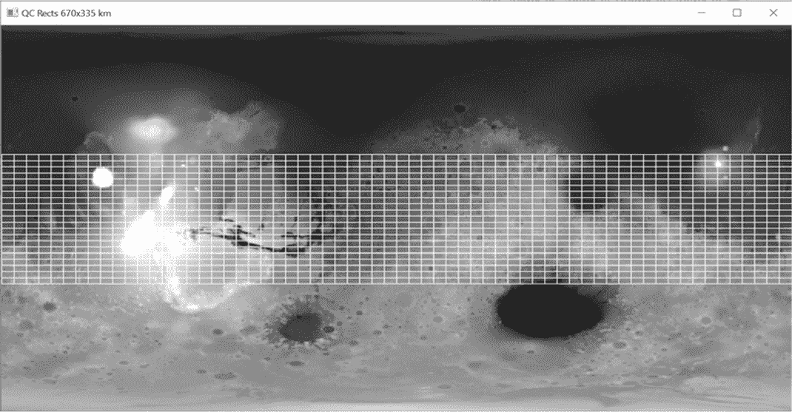

图 7-10：draw_qc_rects()方法绘制的所有 1,260 个矩形

如果你将图 7-10 与图 7-8 进行比较，你可能会注意到矩形看起来比预期的小。这是因为你使用矩形的宽度和高度的一半步进地移动矩形，在图像上水平和垂直排列，导致它们相互重叠。

##### **排序统计数据并高评分矩形**

继续定义 Search 类，列表 7-6 定义了一个方法，用于寻找具有最佳潜在着陆点的矩形。该方法对包含矩形统计数据的字典进行排序，根据峰谷值和标准差统计数据制作矩形的前几个列表，然后制作这两个列表之间共享的矩形列表。共享的矩形将是着陆点的最佳候选者，因为它们将具有最小的峰谷值和标准差。

```py
site_selector.py, part 6
def sort_stats(self): 
    """Sort dictionaries by values and create lists of top N keys."""
    ptp_sorted = (sorted(self.rect_ptps.items(), key=lambda x: x[1]))
    self.ptp_filtered = [x[0] for x in ptp_sorted[:NUM_CANDIDATES]]
    std_sorted = (sorted(self.rect_stds.items(), key=lambda x: x[1]))
    self.std_filtered = [x[0] for x in std_sorted[:NUM_CANDIDATES]]    
    for rect in self.std_filtered:
        if rect in self.ptp_filtered:
            self.high_graded_rects.append(rect)
```

列表 7-6：基于统计数据对矩形进行排序和高评分

定义一个名为 sort_stats()的方法。使用一个 lambda 函数对 rect_ptps 字典进行排序，该函数根据值进行排序，而不是键。字典中的值是峰谷测量值。这将创建一个包含元组的列表，元组的第 0 个索引是矩形编号，第 1 个索引是峰谷值。

接下来，使用列表推导式将矩形编号填充到 self.ptp_filtered 属性中，矩形编号来自 ptp_sorted 列表。使用索引切片选择前 20 个值，如 NUM_CANDIDATES 常量所规定。你现在得到了 20 个具有最低峰谷值的矩形。对标准差进行相同的基本代码处理，生成具有最低标准差的 20 个矩形的列表。

通过遍历 std_filtered 列表中的矩形编号，并将其与 ptp_filtered 列表中的编号进行比较来完成该方法。将匹配的编号附加到你之前使用 __init__()方法创建的 high_graded_rects 实例属性中。

##### **在地图上绘制过滤后的矩形**

列表 7-7，仍然位于 Search 类下，定义了一个方法，用于在灰度 MOLA 地图上绘制 20 个最佳矩形。你将在 main()函数中调用此方法。

```py
site_selector.py, part 7 
def draw_filtered_rects(self, image, filtered_rect_list):
    """Draw rectangles in list on image and return image."""
    img_copy = image.copy()
    for k in filtered_rect_list: 
        cv.rectangle(img_copy,
                     (self.rect_coords[k][0], self.rect_coords[k][1]),
                     (self.rect_coords[k][2], self.rect_coords[k][3]),
                     (255, 0, 0), 1)
        cv.putText(img_copy, str(k),
                   (self.rect_coords[k][0] + 1, self.rect_coords[k][3]- 1),
                   cv.FONT_HERSHEY_PLAIN, 0.65, (255, 0, 0), 1)

 ➊ cv.putText(img_copy, '30 N', (10, LAT_30_N - 7),
               cv.FONT_HERSHEY_PLAIN, 1, 255)
    cv.line(img_copy, (0, LAT_30_N), (IMG_WIDTH, LAT_30_N),
            (255, 0, 0), 1)
    cv.line(img_copy, (0, LAT_30_S), (IMG_WIDTH, LAT_30_S),
            (255, 0, 0), 1)
    cv.putText(img_copy, '30 S', (10, LAT_30_S + 16),
               cv.FONT_HERSHEY_PLAIN, 1, 255)

    return img_copy
```

列表 7-7：在 MOLA 地图上绘制过滤后的矩形和纬度线

首先定义方法，该方法需要多个参数。除了 self，方法还需要加载的图像和一个矩形编号的列表。使用一个局部变量复制图像，然后开始循环遍历 `filtered_rect_list` 中的矩形编号。每次循环时，通过使用矩形编号访问 `rect_coords` 字典中的角落坐标来绘制矩形。

为了区分一个矩形和另一个矩形，使用 OpenCV 的 `putText()` 方法在每个矩形的左下角显示矩形编号。该方法需要图像、文本（字符串形式）、左上角 *x* 和右下角 *x* 的坐标、字体、线宽和颜色。

接下来，绘制标注的纬度限制，从 30° 北纬的文本开始 ➊。然后使用 OpenCV 的 `line()` 方法绘制该线。该方法需要传入一个图像、一对 (*x*, *y*) 坐标表示线段的起点和终点，一个颜色和一个厚度。对 30° 南纬的纬线执行相同的操作。

通过返回标注后的图像来结束该方法。基于峰谷得分和标准差统计数据，最佳矩形分别显示在 图 7-11 和 7-12 中。

这两幅图展示了每个统计数据的前 20 个矩形。这并不意味着它们总是相同的。由于单个小陨石坑的存在，标准差最低的矩形可能不会出现在峰谷图中。为了找到最平坦、最平滑的矩形，你需要识别出同时出现在这两幅图中的矩形，并在自己的显示区域中展示它们。

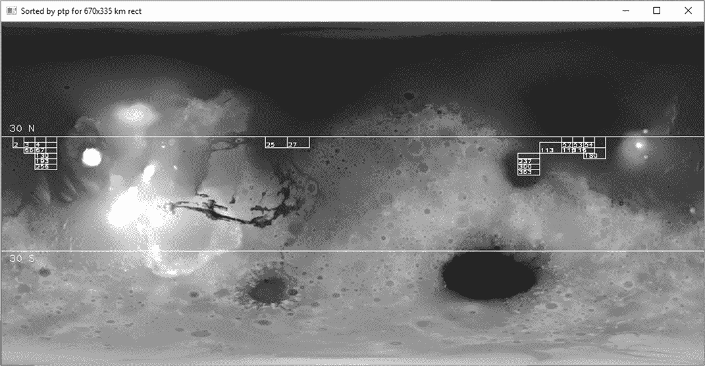

图 7-11：标准差最低的 20 个峰谷得分矩形

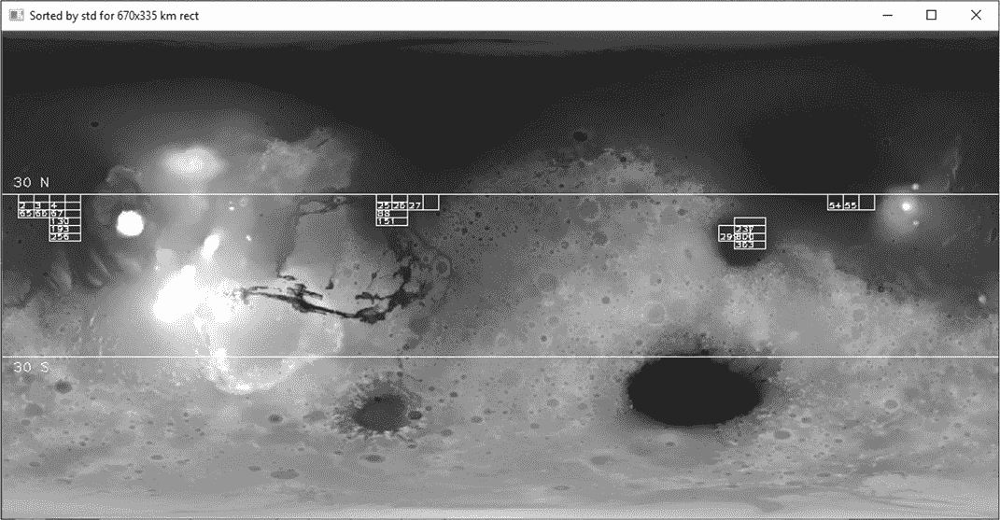

图 7-12：标准差最低的 20 个矩形

##### **制作最终的彩色显示**

列表 7-8 通过定义一个方法总结最佳矩形，完成了 Search 类的实现。它使用 tkinter 创建一个总结窗口，并将矩形显示在彩色 MOLA 图像上。它还在图像下方打印矩形的统计数据作为文本对象。虽然这增加了一些工作量，但比直接在图像上用 OpenCV 显示总结的统计数据要干净得多。

```py
site_selector.py, part 8
def make_final_display(self):
    """Use Tk to show map of final rects & printout of their statistics."""
    screen.title('Sites by MOLA Gray STD & PTP {} Rect'.format(self.name))

    img_color_rects = self.draw_filtered_rects(IMG_COLOR,
                                               self.high_graded_rects)

 ➊ img_converted = cv.cvtColor(img_color_rects, cv.COLOR_BGR2RGB)
    img_converted = ImageTk.PhotoImage(Image.fromarray(img_converted)) 
    canvas.create_image(0, 0, image=img_converted, anchor=tk.NW)

 ➋ txt_x = 5
    txt_y = IMG_HT + 20
    for k in self.high_graded_rects:
        canvas.create_text(txt_x, txt_y, anchor='w', font=None,
                           text="rect={} mean elev={:.1f} std={:.2f} ptp={}"
                           .format(k, self.rect_means[k], self.rect_stds[k],
                                   self.rect_ptps[k]))
        txt_y += 15
     ➌ if txt_y >= int(canvas.cget('height')) - 10:
            txt_x += 300
            txt_y = IMG_HT + 20        
    canvas.pack()
    screen.mainloop()
```

列表 7-8：使用彩色 MOLA 地图制作最终显示

定义方法后，为 tkinter 屏幕窗口设置一个标题，标题链接到你的搜索对象名称。

然后，为了制作最终的彩色图像用于显示，命名一个局部变量 `img_color_rects` 并调用 `draw_filtered_rects()` 方法。将彩色 MOLA 图像和评分较高的矩形列表作为参数传入。这将返回包含最终矩形和纬度限制的彩色图像。

在您将这个新彩色图像显示到 tkinter 画布之前，您需要将图像的颜色从 OpenCV 的蓝绿红（BGR）格式转换为 tkinter 使用的红绿蓝（RGB）格式。可以使用 OpenCV 的 cvtColor()方法来完成此转换。将图像变量和 COLOR_BGR2RGB 标志➊传递给该方法。将结果命名为 img_converted。

此时，图像仍然是 NumPy 数组。要转换为 tkinter 兼容的照片图像，您需要使用 PIL ImageTk 模块的 PhotoImage 类和 Image 模块的 fromarray()方法。将您在前一步中创建的 RGB 图像变量传递给该方法。

现在图像已准备好用于 tkinter，使用 create_image()方法将其放置在画布中。将画布的左上角坐标（0, 0）、转换后的图像和西北锚点方向传递给该方法。

现在剩下的就是添加总结文本。首先为第一个文本对象➋的左下角分配坐标。然后开始遍历高等级矩形列表中的矩形编号。使用 create_text()方法将文本放入画布中。传递给它一对坐标、左对齐的锚点方向、默认字体和文本字符串。通过使用矩形编号（用 k 表示“key”）访问不同的字典来获取统计信息。

在绘制每个文本对象后，将文本框的*y*坐标增加 15。然后写一个条件语句，检查文本是否大于或位于画布底部 10 像素以内➌。您可以使用 cget()方法获取画布的高度。

如果文本离画布底部太近，您需要开始新的一列。将 txt_x 变量向右移动 300，并将 txt_y 重置为图像的高度加 20。

完成方法定义后，通过打包画布并调用屏幕对象的 mainloop()来结束。打包优化了画布中对象的排列。mainloop()是一个无限循环，运行 tkinter，等待事件发生并处理该事件，直到窗口关闭。

**注意**

*彩色图像的高度（506 像素）略大于灰度图像的高度（501 像素）。我选择忽略这一点，但如果你对准确性有严格要求，可以使用 OpenCV 通过`IMG_COLOR = cv.resize(IMG_COLOR, (1024, 501), interpolation = cv.INTER_AREA)`来缩小彩色图像的高度。*

##### **使用 main()运行程序**

列表 7-9 定义了一个 main()函数来运行程序。

```py
site_selector.py, part 9
   def main():
       app = Search('670x335 km')
       app.run_rect_stats()
       app.draw_qc_rects()
       app.sort_stats()
       ptp_img = app.draw_filtered_rects(IMG_GRAY, app.ptp_filtered)
       std_img = app.draw_filtered_rects(IMG_GRAY, app.std_filtered)

    ➊ cv.imshow('Sorted by ptp for {} rect'.format(app.name), ptp_img)
       cv.waitKey(3000)
       cv.imshow('Sorted by std for {} rect'.format(app.name), std_img)
       cv.waitKey(3000)

       app.make_final_display()  # Includes call to mainloop().

➋ if __name__ == '__main__':
      main()
```

列表 7-9：定义并调用用于运行程序的 main()函数

从 Search 类实例化一个 app 对象开始。命名为 670x335 km，以记录所研究的矩形区域的大小。接下来，按顺序调用 Search 方法。运行矩形的统计信息并绘制质量控制矩形。将统计信息从小到大排序，然后绘制具有最佳峰谷差和标准差统计信息的矩形。显示结果 ➊，并通过生成最终的汇总显示来完成函数。

返回全局空间，添加代码让程序能够以导入模块或独立模式运行 ➋。

图 7-13 显示了最终的显示结果。它包括按标准差排序的高评分矩形和汇总统计信息。

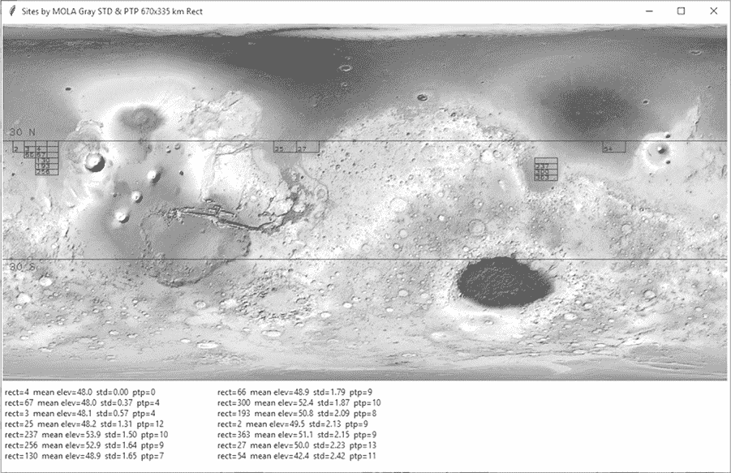

图 7-13: 最终显示，包含按标准差排序的高评分矩形和汇总统计信息

#### ***结果***

完成最终显示后，首先要做的是进行合理性检查。确保矩形位于允许的纬度和海拔范围内，并且看起来位于平滑的地形上。同样，基于峰谷差和标准差统计信息的矩形，如在 图 7-11 和 图 7-12 中所示，应符合约束条件，并且大多数情况下选择相同的矩形。

如前所述，图 7-11 和 图 7-12 中的矩形并没有完全重叠。这是因为你使用了两种不同的平滑度度量。虽然如此，你可以确定的是，重叠的矩形将是所有矩形中最平滑的。

虽然最终显示中的所有矩形位置看起来都合理，但在地图的远西侧，矩形的集中分布尤为令人鼓舞。这是搜索区域中最平滑的地形（图 7-14），你的程序显然识别了这一点。

这个项目重点关注安全问题，但科学目标在大多数任务的站点选择中起主导作用。在本章结尾的实践项目中，你将有机会将额外的约束条件——地质——纳入站点选择的方程中。

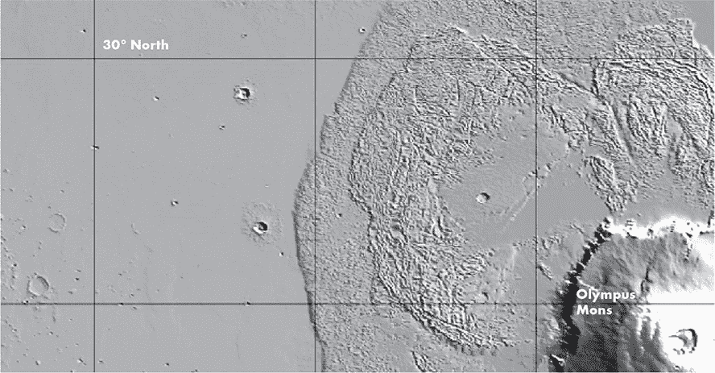

图 7-14: 奥林帕斯山熔岩区以西的非常平滑地形

### **摘要**

在本章中，你使用了 Python、OpenCV、Python Imaging Library、NumPy 和 tkinter 来加载、分析和显示图像。因为 OpenCV 将图像视为 NumPy 数组，你可以轻松地从图像的某些部分提取信息，并使用 Python 的众多科学库对其进行评估。

你使用的数据集下载迅速且运行快速。虽然一个真正的实习生会使用一个更大、更严格的数据集，例如由数百万个实际海拔测量值组成的数据集，但你能够在较少的工作量下看到这个过程如何运行，并获得合理的结果。

### **进一步阅读**

喷气推进实验室有几个简短而有趣的视频，讲述火星着陆的过程。通过在线搜索 *Mars in a Minute: How Do You Choose a Landing Site?*、*Mars in a Minute: How Do You Get to Mars?* 和 *Mars in a Minute: How Do You Land on Mars?* 可以找到这些视频。

*Mapping Mars: Science, Imagination, and the Birth of a World*（《火星制图：科学、想象与一个世界的诞生》，Picador，2002），由奥利弗·莫顿（Oliver Morton）著作，讲述了当代火星探索的故事，包括 MOLA 地图的制作。

*The Atlas of Mars: Mapping Its Geography and Geology*（《火星地图集：制图其地理与地质》，剑桥大学出版社，2019），由肯尼斯·科尔斯（Kenneth Coles）、肯尼斯·田中（Kenneth Tanaka）和菲利普·克里斯滕森（Philip Christensen）编著，是一本精彩的火星通用参考地图集，包含了地形学、地质学、矿物学、热学性质、近地表水冰等多种地图。

用于项目 10 的 MOLA 地图的数据页面位于 *[`astrogeology.usgs.gov/search/map/Mars/GlobalSurveyor/MOLA/Mars_MGS_MOLA_DEM_mosaic_global_463m/`](https://astrogeology.usgs.gov/search/map/Mars/GlobalSurveyor/MOLA/Mars_MGS_MOLA_DEM_mosaic_global_463m/)*。

详细的火星数据集可以在由圣路易斯华盛顿大学 PDS 地质学节点提供的火星轨道数据浏览器网站上找到 (*[`ode.rsl.wustl.edu/mars/index.aspx`](https://ode.rsl.wustl.edu/mars/index.aspx)*).

### **实践项目：确认绘图成为图像的一部分**

编写一个 Python 程序，验证添加到图像中的绘图内容（如文本、线条、矩形等）是否成为该图像的一部分。使用 NumPy 计算 MOLA 灰度图像中矩形区域的均值、标准差和峰谷统计数据，但不要绘制矩形的边框。然后在该区域周围绘制一条白色线条，并重新运行统计数据。这两次运行的结果一致吗？

你可以在附录或 *Chapter_7* 文件夹中找到解决方案 *practice_confirm_drawing_part_of_image.py*，该文件可以从 *[`nostarch.com/real-world-python/`](https://nostarch.com/real-world-python/)* 下载。

### **实践项目：提取海拔剖面**

海拔剖面是景观的二维横截面视图。它提供了地图上两个位置之间绘制的线条上的地形起伏的侧面视图。地质学家可以使用剖面来研究表面的平滑度，并可视化其地形。在本练习项目中，绘制一个从西到东的剖面，经过太阳系最大火山奥林匹斯山的火山口（图 7-15）。

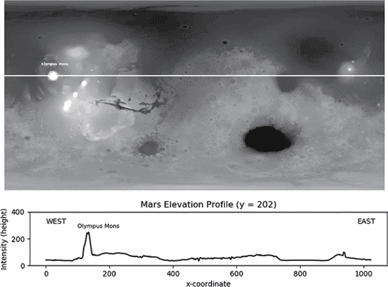

图 7-15：经过奥林匹斯山的垂直夸张的东西向剖面

使用图 7-15 中显示的 *Mars MGS MOLA - MEX HRSC Blended DEM Global 200m v2* 地图。这个版本比你在项目 10 中使用的地图具有更好的横向分辨率。它还使用了 MOLA 数据中的全部高程范围。你可以在 *Chapter_7* 文件夹中找到一个副本，*mola_1024x512_200mp.jpg*，并可以从本书网站下载。解决方案 *practice_profile_olympus.py* 可在同一文件夹和附录中找到。

### **实践项目：3D 绘图**

火星是一个不对称的行星，南半球以古老的陨石坑高原为主，北半球则是平滑、平坦的低地。为了更好地展示这一点，可以使用 matplotlib 的 3D 绘图功能，显示你在前一个实践项目中使用的 *mola_1024x512_200mp.jpg* 图像（图 7-16）。

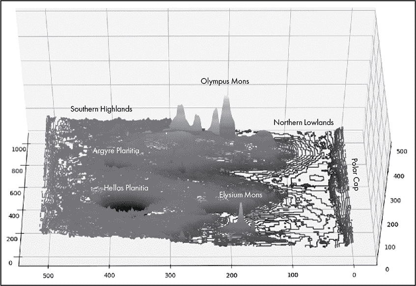

图 7-16：火星的 3D 等高线图，朝向西方

使用 matplotlib，你可以通过点、线、等高线、网格框和表面来制作 3D 地形图。虽然这些图形有些粗糙，但你可以快速生成它们。你还可以使用鼠标交互式地抓取图形并改变视角。它们对于那些难以从 2D 地图中想象地形的人特别有用。

在图 7-16 中，夸大的垂直比例使得从南到北的高程差异容易观察到。你还可以轻松识别出最高的山（奥林帕斯山）和最深的陨石坑（赫拉斯平原）。

你可以使用附录中的 *practice_3d_plotting.py* 程序，或 *Chapter_7* 文件夹中的相同程序（可以从本书网站下载）来重现图 7-16 中的图表—不带注释。地图图像可以在同一文件夹中找到。

### **实践项目：混合地图**

创建一个新项目，将一些科学元素添加到选址过程中。将 MOLA 地图与彩色地质地图结合，找到塔尔西斯山脉火山沉积物中最平坦的矩形区域（见图 7-17 中的箭头）。

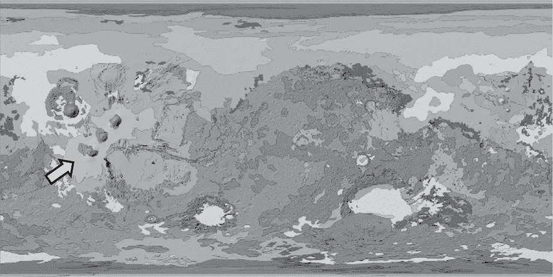

图 7-17：火星的地质地图。箭头指向塔尔西斯火山沉积物。

由于塔尔西斯山脉区域位于较高的海拔，重点应放在寻找火山沉积物中最平坦、最光滑的部分，而不是最低的海拔。为了隔离火山沉积物，可以考虑对地图进行灰度阈值处理。*阈值处理*是一种分割技术，用于将图像分成前景和背景。

使用阈值处理，你可以将灰度图像转换为二值图像，其中高于或在指定阈值之间的像素设置为 1，其他所有像素设置为 0。你可以使用这个二值图像来过滤 MOLA 地图，如图 7-18 所示。

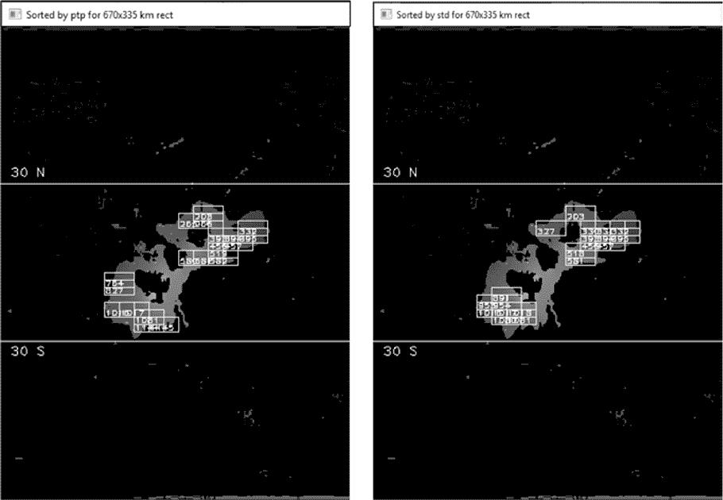

图 7-18：塔尔西斯山脉区域的 MOLA 滤波地图，左侧为 ptp 矩形，右侧为 std 矩形

你可以在*Chapter_7*文件夹中找到地质图*Mars_Global_Geology_Mariner9_1024.jpg*，该文件可以从书籍的网站上下载。火山沉积物的颜色将是浅粉色的。对于高度图，请使用“提取高度剖面”练习项目中的*mola_1024x512_200mp.jpg*，可以在第 172 页找到。

解决方案包含在*practice_geo_map_step_1of2.py*和*practice_geo_map_step_2of2.py*文件中，可以在同一文件夹中找到，也可以在附录中查看。首先运行*practice_geo_map_step_1of2.py*程序来生成第 2 步的滤镜。

### **挑战项目：三连击**

编辑“提取高度剖面”项目，使得剖面通过位于塔尔西斯山脉的三座火山，如图 7-19 所示。

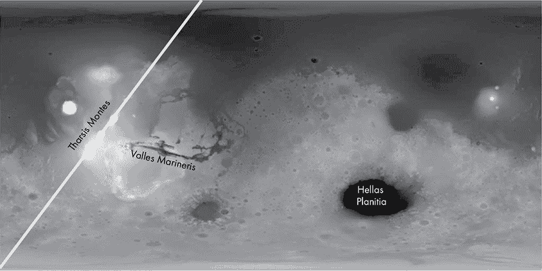

图 7-19：穿过塔尔西斯山脉三座火山的对角线剖面

其他有趣的地貌特征包括瓦莱斯·马里内里斯，这是一个长度是大峡谷的九倍、深度是大峡谷的四倍的峡谷，以及赫拉斯平原，它被认为是太阳系中第三或第四大撞击坑（图 7-19）。

### **挑战项目：包裹矩形**

编辑*site_selector.py*代码，使其适应不能整除 MOLA 图像宽度的矩形尺寸。实现这一点的一种方法是添加代码，将矩形分割成两部分（一个沿地图的右边缘，另一个沿左边缘），分别计算每个部分的统计数据，然后将它们重新组合成一个完整的矩形。另一种方法是复制图像并将其“拼接”到原始图像上，如图 7-20 所示。这样，你就不需要拆分矩形；只需决定何时停止将它们移动 across 地图即可。

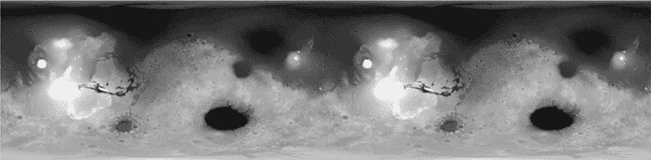

图 7-20：重复的灰度 MOLA 图像

当然，为了提高效率，你不需要复制整个地图。你只需要沿着东侧边缘保留一条宽度足够容纳最终重叠矩形的条带。
