## 第八章：探测遥远系外行星


系外行星，简称外行星，是围绕外星太阳公转的行星。到 2019 年底，已发现超过 4000 颗系外行星。这意味着自 1992 年首次确认发现系外行星以来，平均每年发现 150 颗！如今，发现一颗遥远的行星似乎像感冒一样容易，但人类几乎花费了整个历史——直到 1930 年——才发现了构成我们太阳系的八颗行星以及冥王星。

天文学家通过观察恒星运动中的引力诱发摆动，首次探测到系外行星。如今，他们主要依赖于当系外行星从恒星与地球之间经过时，恒星光线的微弱变暗。借助强大的下一代设备，如詹姆斯·韦伯太空望远镜，他们将能够直接拍摄系外行星的图像，并了解其旋转、季节、天气、植被等更多信息。

在本章中，你将使用 OpenCV 和 matplotlib 模拟一个系外行星在其太阳前经过的过程。你将记录下由此产生的光曲线，然后利用它来探测行星并估算其直径。接着，你将模拟系外行星如何呈现给詹姆斯·韦伯太空望远镜。在“实践项目”部分，你将研究一些异常的光曲线，这些曲线可能代表巨大的外星巨型结构，这些结构是为了利用恒星的能量而设计的。

### **凌星光度法**

在天文学中，*凌星*是指相对较小的天体直接穿过较大天体的盘面与观察者之间。当小天体移动到较大天体的面前时，较大天体会略微变暗。最著名的凌星现象是水星和金星凌日（参见图 8-1）。

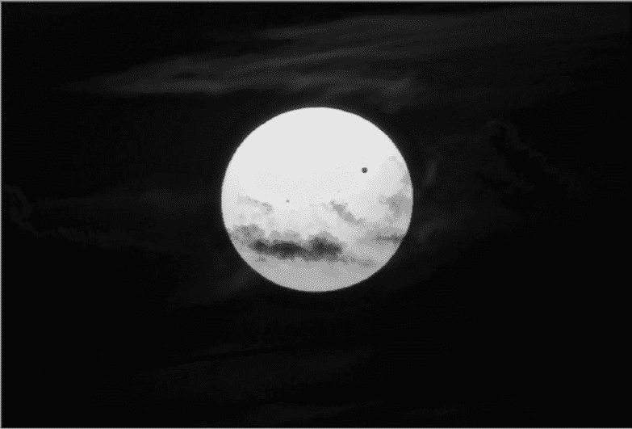

图 8-1：2012 年 6 月，云层和金星（黑点）在太阳前经过

通过今天的技术，天文学家可以在凌星事件中探测到遥远恒星光线的微弱变暗。这一技术称为*凌星光度法*，其结果是绘制出恒星亮度随时间变化的图表（参见图 8-2）。

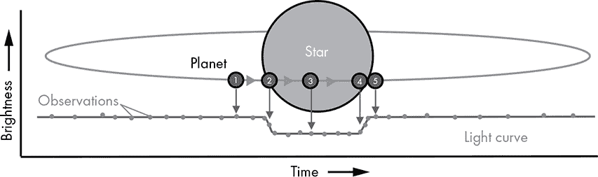

图 8-2：用凌星光度法探测系外行星的技术

在图 8-2 中，光度曲线图上的点表示恒星发出的光的测量值。当行星不位于恒星上方 ➊ 时，测得的亮度是最大的。（我们将忽略系外行星在经历其不同相位时反射的光，这会非常轻微地增加恒星的表观亮度）。随着行星的前缘开始进入恒星盘面 ➋，发出的光逐渐变暗，形成光度曲线中的上升段。当整个行星出现在盘面上 ➌ 时，光度曲线变平，并保持平稳，直到行星开始从盘面的远端退出。这时形成另一段上升段 ➍，直到行星完全离开盘面 ➎。此时，光度曲线恢复到最大值，因为恒星不再被遮挡。

由于过境期间阻挡的光量与行星盘面的大小成正比，因此你可以使用以下公式来计算行星的半径：

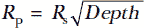

其中 *R*[p] 是行星的半径，*R*[*s*] 是恒星的半径。天文学家通过恒星的距离、亮度和颜色（与恒星的温度相关）来确定恒星的半径。*深度*指的是在过境期间亮度的总变化量（见图 8-3）。

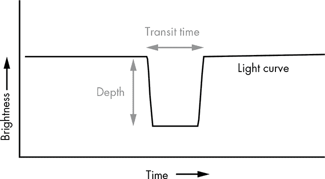

图 8-3：深度代表在光度曲线中观察到的亮度变化总量。

当然，这些计算假设整个系外行星，而不是它的一部分，都会经过恒星的表面。如果系外行星只掠过恒星的上方或下方（从我们的视角来看），则可能会出现后者的情况。我们将在“过境光度测量实验”中探讨这种情况，见第 182 页。

### **项目 #11：模拟系外行星过境**

在我飞往爱达荷州拍摄 2017 年“大美洲日全食”之前，我做了充分的准备。全食事件，即月亮完全遮住太阳的那段时间，仅持续了 2 分钟 10 秒。这几乎没有时间进行实验、测试或临时处理。为了成功捕捉到半影、影子、太阳耀斑和钻石戒指效应（见图 8-4），我必须精确知道带什么设备、使用什么相机设置，以及这些事件的发生时间。

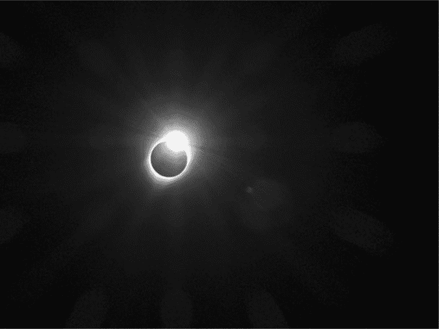

图 8-4：2017 年日全食末期的钻石戒指效应

类似地，计算机模拟帮助你为观察自然世界做准备。它们帮助你理解预期的内容、何时发生，以及如何校准你的仪器。在本项目中，你将创建一个系外行星过境事件的模拟。你可以通过不同的行星大小来运行此模拟，从而理解过境大小对光度曲线的影响。稍后，你将使用该模拟来评估与小行星带和可能的外星超级结构相关的光度曲线。

目标

编写一个 Python 程序来模拟系外行星凌星，绘制结果的光变曲线，并计算系外行星的半径。

#### ***策略***

要生成光变曲线，您需要能够测量亮度的变化。您可以通过对像素进行数学运算来实现这一点，比如计算均值、最小值和最大值，使用 OpenCV 进行处理。

您将不使用真实的凌星和恒星图像，而是会在黑色矩形上绘制圆形，正如您在上一章中绘制火星地图时所做的那样。为了绘制光变曲线，您可以使用 matplotlib，Python 的主要绘图库。您已经在“使用 pip 安装 NumPy 及其他科学包”中安装了 matplotlib，并在第二章开始使用它绘制图形。

#### ***凌星代码***

*transit.py*程序使用 OpenCV 生成系外行星凌过恒星的视觉模拟，使用 matplotlib 绘制结果的光变曲线，并使用来自第 179 页的行星半径方程来估算行星的大小。您可以自己输入代码或从* [`nostarch.com/real-world-python/`](https://nostarch.com/real-world-python/)* 下载它。

##### **导入模块和赋值常量**

清单 8-1 导入模块并赋值常量，表示用户输入的值。

```py
transit.py, part 1
import math
import numpy as np
import cv2 as cv
import matplotlib.pyplot as plt

IMG_HT = 400
IMG_WIDTH = 500
BLACK_IMG = np.zeros((IMG_HT, IMG_WIDTH, 1), dtype='uint8') 
STAR_RADIUS = 165
EXO_RADIUS = 7
EXO_DX = 3
EXO_START_X = 40
EXO_START_Y = 230
NUM_FRAMES = 145
```

清单 8-1：导入模块和赋值常量

导入 math 模块来计算行星半径方程，导入 NumPy 来计算图像的亮度，导入 OpenCV 来绘制模拟图像，导入 matplotlib 来绘制光变曲线。然后开始赋值常量，表示用户输入的值。

从模拟窗口的高度和宽度开始。窗口将是一个黑色的矩形图像，通过使用 np.zeros()方法创建，该方法返回一个形状和类型指定的、填充为零的数组。

回想一下，OpenCV 图像是 NumPy 数组，数组中的项必须具有相同的类型。uint8 数据类型表示一个无符号整数，范围从 0 到 255。您可以在* [`numpy.org/devdocs/user/basics.types.html`](https://numpy.org/devdocs/user/basics.types.html)* 上找到其他数据类型及其描述的有用列表。

接下来，赋值恒星和系外行星的半径值（以像素为单位）。OpenCV 将在绘制它们的圆形时使用这些常量。

系外行星将穿过恒星的面，因此您需要定义它的移动速度。EXO_DX 常量将在每次编程循环中将系外行星的* x *位置增加三像素，使其从左到右移动。

赋值两个常量来设置系外行星的起始位置。然后赋值一个 NUM_FRAMES 常量来控制模拟更新的次数。尽管您可以通过计算该数字（IMG_WIDTH/EXO_DX）来得到，但赋值可以让您微调模拟的持续时间。

##### **定义 main() 函数**

列表 8-2 定义了用于运行程序的 main()函数。虽然你可以在任何位置定义 main()，但将其放在开始部分使其成为整个程序的总结，从而为后面定义的函数提供上下文。作为 main()的一部分，你将计算外行星的半径，将方程嵌套在 print()函数的调用中。

```py
transit.py, part 2
def main():
    intensity_samples = record_transit(EXO_START_X, EXO_START_Y)  
    relative_brightness = calc_rel_brightness(intensity_samples)
    print('\nestimated exoplanet radius = {:.2f}\n'
          .format(STAR_RADIUS * math.sqrt(max(relative_brightness)
                                          - min(relative_brightness))))
    plot_light_curve(relative_brightness)
```

列表 8-2：定义 main()函数

在定义 main()函数后，命名一个变量 intensity_samples 并调用 record_transit()函数。*强度*指的是光的强度，用像素的数值表示。record_transit()函数将模拟画面绘制到屏幕上，测量其强度，将测量值附加到名为 intensity_samples 的列表中，并返回该列表。它需要外行星的起始点（*x*，*y*）坐标。传递起始常量 EXO_START_X 和 EXO_START_Y，它们将把行星放置在类似于图 8-2 中➊的位置。注意，如果显著增加外行星的半径，可能需要将起始点向左移动（负值是可以接受的）。

接下来，命名一个变量 relative_brightness 并调用 calc_rel_brightness()函数。顾名思义，该函数计算*相对*亮度，即测量的强度除以最大记录强度。它接受强度测量列表作为参数，将测量值转换为相对亮度，并返回新的列表。

你将使用相对亮度值的列表，通过第 179 页的方程计算外行星的半径（以像素为单位）。你可以在 print()函数中执行此计算。使用{:.2f}格式将答案保留两位小数。

通过调用绘制光曲线的函数结束 main()函数。传递相对亮度列表。

##### **记录穿越事件**

列表 8-3 定义了一个函数，用于模拟并记录穿越事件。它在黑色矩形图像上绘制恒星和外行星，然后移动外行星。它还计算并显示每次移动时图像的平均强度，将强度附加到一个列表中，并在最后返回该列表。

```py
transit.py, part 3
def record_transit(exo_x, exo_y):
    """Draw planet transiting star and return list of intensity changes."""
    intensity_samples = []
    for _ in range(NUM_FRAMES):
        temp_img = BLACK_IMG.copy()
        cv.circle(temp_img, (int(IMG_WIDTH / 2), int(IMG_HT / 2)),
                  STAR_RADIUS, 255, -1)
     ➊ cv.circle(temp_img, (exo_x, exo_y), EXO_RADIUS, 0, -1)
        intensity = temp_img.mean()
        cv.putText(temp_img, 'Mean Intensity = {}'.format(intensity), (5, 390),
                   cv.FONT_HERSHEY_PLAIN, 1, 255)
        cv.imshow('Transit', temp_img)
        cv.waitKey(30)
     ➋ intensity_samples.append(intensity)
        exo_x += EXO_DX
    return intensity_samples
```

列表 8-3：绘制模拟图像，计算图像强度，并将其作为列表返回

record_transit()函数接受一对(*x*，*y*)坐标作为参数。这些坐标代表外行星的起始点，或者更具体地说，是用于作为模拟中绘制的第一个圆心的像素。它不应与图像中心的恒星圆重叠。

接下来，创建一个空列表来保存强度测量值。然后，启动一个 for 循环，使用 NUM_FRAMES 常量重复模拟一定次数。模拟的持续时间应该稍微超过系外行星离开恒星面所需的时间。这样，你就可以获得包含掩星后测量的完整光变曲线。

使用 OpenCV 在图像上绘制的图形和文本将成为该图像的一部分。因此，你需要通过将原始 BLACK_IMG 复制到名为 temp_img 的本地变量中，替换每次循环中的前一个图像。

现在，你可以使用 OpenCV 的 circle()方法绘制恒星。传递给它临时图像、对应于图像中心的圆心坐标（*x*，*y*）、STAR_RADIUS 常量、白色填充颜色和线条厚度。使用负数作为厚度值可以将圆填充为颜色。

接下来，绘制系外行星圆圈。使用 exo_x 和 exo_y 坐标作为起点，EXO_RADIUS 常量作为大小，黑色填充颜色 ➊。

这时，你应该记录图像的强度。由于像素已经代表强度，因此你需要做的就是计算图像的平均值。你所采集的测量次数取决于 EXO_DX 常量。这个值越大，系外行星移动越快，你记录平均强度的次数就越少。

使用 OpenCV 的 putText()方法在图像上显示强度读数。传递给它临时图像、包含测量值的文本字符串、文本字符串的左下角坐标（*x*，*y*）、字体、文本大小和颜色。

现在，命名窗口为 Transit，并使用 OpenCV 的 imshow()方法显示它。图 8-5 展示了一个循环迭代过程。

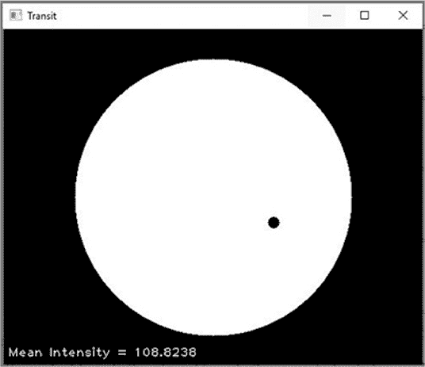

图 8-5：系外行星掩过恒星

显示图像后，使用 OpenCV 的 waitKey()方法每 30 毫秒更新一次图像。传递给 waitKey()的数字越小，系外行星穿越恒星的速度就越快。

将强度测量值追加到 intensity_samples 列表中，然后通过将 exo_x 值增加 EXO_DX 常量来推进系外行星圆圈 ➋。最后，通过返回平均强度测量值的列表来结束该函数。

##### **计算相对亮度并绘制光变曲线**

列表 8-4 定义了计算每个强度样本相对亮度并显示光变曲线图的函数。如果该程序不是作为模块在其他程序中使用，还会调用 main()函数。

```py
transit.py, part 4 
   def calc_rel_brightness(intensity_samples):
       """Return list of relative brightness from list of intensity values."""
       rel_brightness = []
       max_brightness = max(intensity_samples)
       for intensity in intensity_samples:
          rel_brightness.append(intensity / max_brightness)
       return rel_brightness

➊ def plot_light_curve(rel_brightness):
       """Plot changes in relative brightness vs. time."""
       plt.plot(rel_brightness, color='red', linestyle='dashed',
               linewidth=2, label='Relative Brightness')
       plt.legend(loc='upper center')
       plt.title('Relative Brightness vs. Time')
       plt.show()

➋ if __name__ == '__main__':
      main()
```

列表 8-4：计算相对亮度、绘制光变曲线并调用 main()

光变曲线显示了随时间变化的*相对*亮度，未被遮挡的恒星的亮度为 1.0，而完全被掩盖的恒星亮度为 0.0。为了将平均强度测量转换为相对值，定义一个 calc_rel_brightness()函数，该函数接受一个平均强度测量值的列表作为参数。

在函数中，首先创建一个空列表来保存转换后的值，然后使用 Python 的内置 max()函数来查找 intensity_samples 列表中的最大值。为了获得相对亮度，遍历列表中的每个元素，并将其除以最大值。然后将结果添加到 rel_brightness 列表中。最后，返回新列表，结束函数。

定义第二个函数来绘制光变曲线，并将 rel_brightness 列表传递给它➊。使用 matplotlib 的 plot()方法，并传递列表、线条颜色、线条样式、线宽和图例标签。添加图例和图表标题，然后显示图表。你应该会看到图 8-6 中的图表。

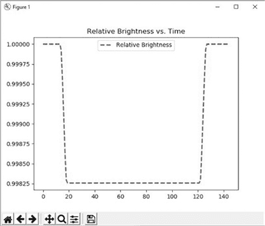

图 8-6：来自 transit.py 的示例光变曲线图

图表上的亮度变化乍一看可能会显得非常剧烈，但如果仔细观察*y*轴，你会发现外行星仅将恒星的亮度降低了 0.175%！为了查看恒星的绝对亮度图（图 8-7）上的效果，可以在 plt.show()之前添加以下行：

```py
plt.ylim(0, 1.2)
```

光变曲线因过境而发生的偏折微妙但可检测。不过，你不希望盯着光变曲线看得眼睛花，所以继续让 matplotlib 像图 8-6 那样自动调整*y*轴。

通过调用 main()函数来完成程序➋。除了光变曲线，你应该在命令行中看到估算的外行星半径。

```py
estimated exoplanet radius = 6.89
```

就是这样。不到 50 行 Python 代码，你已经开发出了发现外行星的方法！

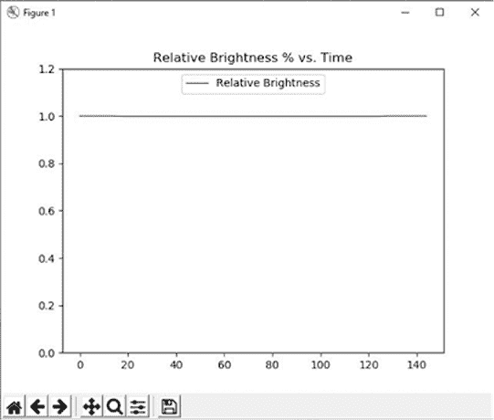

图 8-7：从图 8-6 中重新缩放 y 轴的光变曲线

#### ***实验过境光度测量***

现在你有了一个可运行的模拟，你可以使用它来模拟过境的行为，从而更好地分析将来在实际观察中获得的数据。一种方法是运行大量可能的情况，并生成预期外行星反应的“图谱”。研究人员可以使用这个图谱来帮助解读实际的光变曲线。

例如，如果外行星的轨道平面相对于地球倾斜，使得外行星在过境过程中只部分穿过恒星？研究人员能否通过它的光变曲线特征来检测到它的位置，还是它只会像一个较小的外行星进行完整的过境？

如果你使用半径为 7 的外行星并让它掠过恒星的底部运行模拟，你应该会得到一个 U 形曲线（图 8-8）。

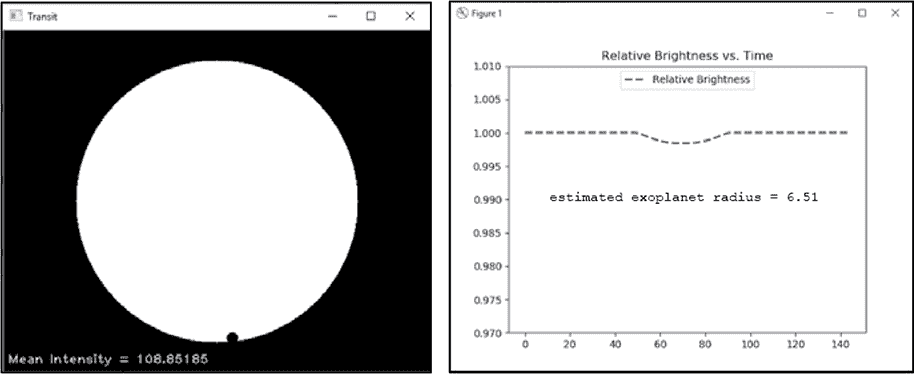

图 8-8：一个半遮挡其恒星的外星行星的光变曲线，半径为 7

如果你重新运行模拟，设置外星行星的半径为 5，并让外星行星完全经过恒星的面前，你将得到图 8-9 中的图表。

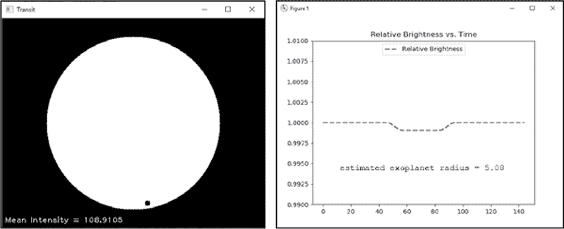

图 8-9：一个完全遮挡其恒星的外星行星的光变曲线，半径为 5

当外星行星掠过恒星的一侧，未完全遮挡它时，重叠区域会不断变化，产生图 8-8 中的 U 型曲线。如果整个外星行星完全经过恒星的面前，曲线的底部则会较平坦，如图 8-9 所示。而由于在部分掩星过程中你无法看到行星的完整盘面，你也无法测量其真实大小。因此，如果光变曲线底部没有平坦部分，大小的估计就应当谨慎对待。

如果你运行一系列不同大小的外星行星，你会看到光变曲线以可预测的方式变化。随着行星大小的增加，曲线会加深，曲线两侧的坡度变长，因为恒星亮度的较大部分被遮挡了（参见图 8-10 和图 8-11）。

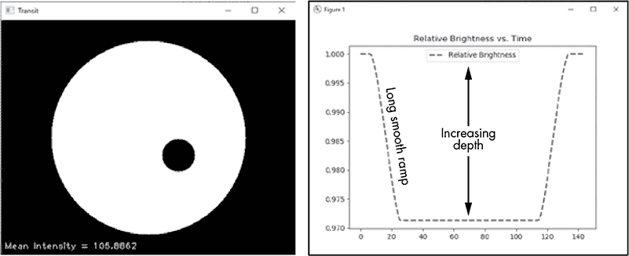

图 8-10：EXO_RADIUS = 28 的光变曲线


图 8-11：EXO_RADIUS = 145 的光变曲线

由于外星行星是圆形的、边缘光滑的物体，它们应当产生平滑的光变曲线，曲线的变化应持续增加或减少。这是非常重要的知识，因为天文学家在寻找外星行星时，记录到了显著的起伏曲线。在本章末的“实践项目”部分，你将利用你的程序探索那些形状奇怪的光变曲线，它们可能是外星工程的结果！

### **项目 #12：成像外星行星**

到 2025 年，三台强大的望远镜——两台在地球上，一台在太空中——将使用红外线和可见光直接成像地球大小的外星行星。在最佳情况下，外星行星将以一个饱和的像素显示出来，周围的像素会有所溢出，但这足以判断行星是否自转，是否有大陆和海洋，是否有气候和季节变化，以及是否能够支持我们所知道的生命！

在这个项目中，你将模拟分析来自这些望远镜拍摄的图像的过程。你将以地球作为一个遥远外星行星的代替，这样你可以轻松地将已知的特征（如大陆和海洋）与单个像素中看到的内容联系起来。你将关注反射光的颜色成分和强度，并推测外星行星的大气层、地表特征以及自转情况。

目标

编写一个 Python 程序，对地球的图像进行像素化处理，并绘制红色、绿色和蓝色通道的强度。

#### ***策略***

为了演示你可以通过单一的饱和像素捕获不同的表面特征和云层，你只需要两张图像：一张是西半球的图像，另一张是东半球的图像。方便的是，NASA 已经从太空拍摄了地球的东西半球图像（图 8-12）。

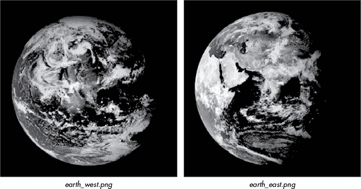

图 8-12：东西半球的图像

这些图像的大小为 474×474 像素，分辨率对于未来的系外行星图像来说过高，因为系外行星预计只会占据 9 个像素，其中只有中心像素完全被行星覆盖（图 8-13）。

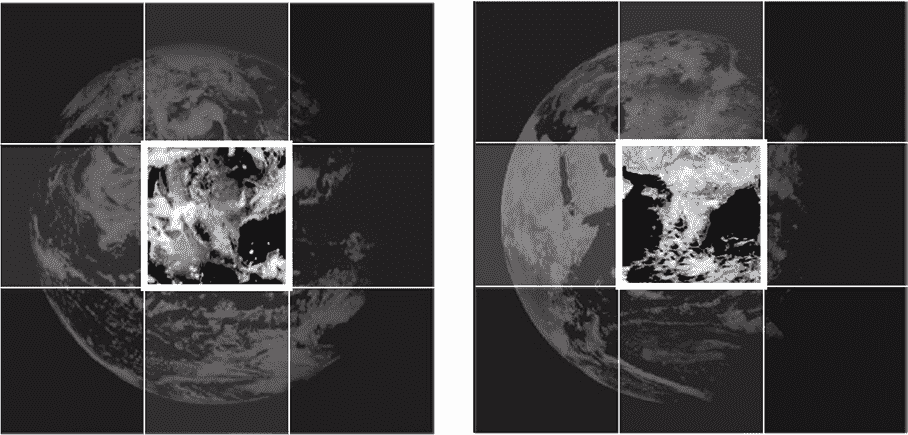

图 8-13：覆盖有 9 像素网格的 earth_west.png 和 earth_east.png 图像

你需要通过将地球图像映射到 3×3 数组来降解图像。由于 OpenCV 使用 NumPy，这将非常容易实现。为了检测系外行星表面的变化，你需要提取主要的颜色（蓝色、绿色和红色）。OpenCV 允许你对这些颜色通道进行平均。然后，你可以使用 matplotlib 显示结果。

#### ***像素化器代码***

*pixelator.py* 程序加载这两张地球图像，将它们调整为 3×3 像素，然后再将它们调整为 300×300 像素。这些最终图像仅用于可视化，它们拥有与 3×3 图像相同的颜色信息。程序随后对两张调整过的图像的颜色通道进行平均，并将结果以饼图形式绘制出来，你可以进行比较。你可以从本书的网站下载代码和两张图像（*earth_west.png* 和 *earth_east.png*）。将它们保存在同一文件夹中，并且不要重命名图像。

##### **导入模块和降采样图像**

清单 8-5 导入用于绘图和图像处理的模块，然后加载并降解两张地球图像。它首先将每张图像缩小为 9 像素的 3×3 数组。接着，它将降采样后的图像放大为 300×300 像素，以便足够大可以查看，并将它们显示在屏幕上。

```py
pixelator.py, part 1
import numpy as np
import cv2 as cv
from matplotlib import pyplot as plt

files = ['earth_west.png', 'earth_east.png']

for file in files:
    img_ini = cv.imread(file)
    pixelated = cv.resize(img_ini, (3, 3), interpolation=cv.INTER_AREA)
    img = cv.resize(pixelated, (300, 300), interpolation=cv.INTER_AREA)
    cv.imshow('Pixelated {}'.format(file), img)
    cv.waitKey(2000)
```

清单 8-5：导入模块并加载、降解和显示图像

导入 NumPy 和 OpenCV 来处理图像，并使用 matplotlib 将它们的颜色组件绘制为饼图。然后，开始列出包含两张地球图像的文件名。

现在开始循环遍历列表中的文件，使用 OpenCV 将它们加载为 NumPy 数组。回想一下，OpenCV 默认加载彩色图像，因此你不需要为此添加任何参数。

你的目标是将地球图像缩小为一个单一的饱和像素，周围是部分饱和的像素。要将图像从原始的 474×474 大小降到 3×3，使用 OpenCV 的 resize()方法。首先，将新图像命名为*pixelated*，并传递给方法当前图像、新的宽度和高度（像素单位）以及插值方法。*插值*发生在调整图像大小时，使用已知数据来估算未知点的值。OpenCV 文档建议在缩小图像时使用 INTER_AREA 插值方法（参见几何图像转换：*[`docs.opencv.org/4.3.0/da/d54/group__imgproc__transform.html`](https://docs.opencv.org/4.3.0/da/d54/group__imgproc__transform.html)*）。

此时，你有一个太小的图像，无法直观查看，因此将其重新调整为 300×300，以便检查结果。使用 INTER_NEAREST 或 INTER_AREA 作为插值方法，这些方法将保留像素边界。

显示图像 (图 8-14)，并使用 waitKey()延迟程序两秒。

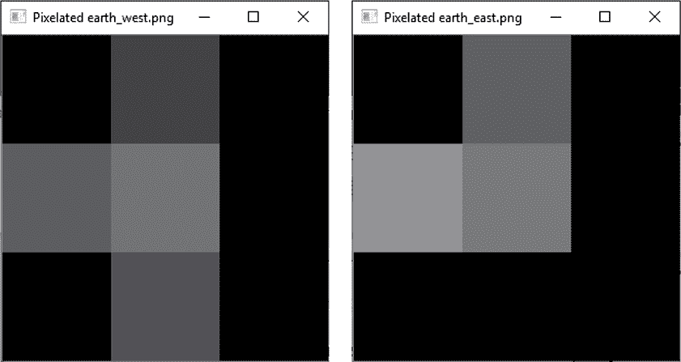

图 8-14：像素化颜色图像的灰度视图

请注意，你不能通过将图像调整回 474×474 来恢复其原始状态。一旦将像素值平均至 3×3 矩阵，所有细节信息就永远丢失了。

##### **平均颜色通道并制作饼图**

仍然在 for 循环中，清单 8-6 制作并显示每个像素化图像的蓝色、绿色和红色分量的饼图。你可以将这些图表进行比较，从中推测行星的天气、陆地、旋转等信息。

```py
pixelator.py, part 2 
   b, g, r = cv.split(pixelated)
   color_aves = []
   for array in (b, g, r):
       color_aves.append(np.average(array))

   labels = 'Blue', 'Green', 'Red'
   colors = ['blue', 'green', 'red']    
   fig, ax = plt.subplots(figsize=(3.5, 3.3))  # size in inches
➊ _, _, autotexts = ax.pie(color_aves,
                            labels=labels,
                            autopct='%1.1f%%',
                            colors=colors)
   for autotext in autotexts:
       autotext.set_color('white')
   plt.title('{}\n'.format(file))

plt.show()
```

清单 8-6：拆分和平均颜色通道并制作颜色的饼图

使用 OpenCV 的 split()方法分离像素化图像中的蓝色、绿色和红色颜色通道，并将结果解包到 b、g、r 变量中。这些是数组，如果你调用 print(b)，你应该会看到如下输出：

```py
[[ 49  93  22]
 [124 108  65]
 [ 52 118  41]]
```

每个数字代表一个像素——具体来说，是该像素的蓝色值——在 3×3 像素化图像中。要计算数组的平均值，首先创建一个空列表来存储平均值，然后遍历数组，调用 NumPy 的平均方法，并将结果附加到列表中。

现在你已经准备好制作每个像素化图像的颜色平均值饼图了。首先，将颜色名称分配给一个名为 labels 的变量，用于标注饼图的扇区。接着，指定你希望在饼图中使用的颜色，这些颜色将覆盖 matplotlib 的默认选择。要制作图表，使用 fig 和 ax 命名约定来代表图形和坐标轴，调用 subplots()方法，并传入图形的尺寸（单位：英寸）。

由于图像之间的颜色差异只有很小的变化，你希望在每个颜色的饼图楔形中显示该颜色的百分比，这样你可以轻松查看它们之间是否存在差异。不幸的是，matplotlib 的默认设置是使用黑色文本，这在深色背景下可能难以看清。为了解决这个问题，调用 ax.pie()方法生成饼图，并使用它的 autotexts 列表 ➊。该方法返回三个列表，一个与饼图楔形相关，一个与标签相关，一个与数字标签相关，称为*autotexts*。你只需要最后一个列表，因此将前两个列表当作未使用的变量，赋值为下划线符号。

将色彩平均值列表和标签列表传递给 ax.pie()，并设置其 autopct 参数以显示小数点后一位的数字。如果该参数设置为 None，则不会返回 autotexts 列表。最后，传递用于饼图楔形的颜色列表，完成参数设置。

第一幅图像的 autotexts 列表如下：

```py
Text(0.1832684031431146, 0.5713253822554821, '40.1%'), Text(-0.5646237442340427,
-0.20297789891298565, '30.7%'), Text(0.36574010704848686, -0.47564080364930983, '29.1%')
```

每个 Text 对象都有(*x*, *y*)坐标和百分比值作为文本字符串。由于这些仍然会以黑色显示，你需要遍历这些对象并使用它们的 set_color()方法将颜色更改为白色。现在，你只需要将图表标题设置为文件名并显示图表（[图 8-15）。

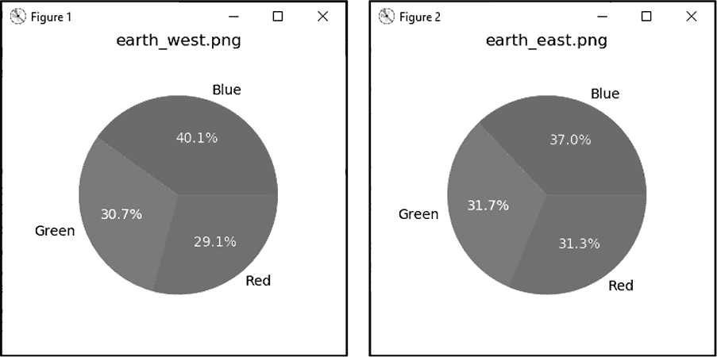

图 8-15：pixelator.py 生成的饼图

尽管饼图相似，但其差异是有意义的。如果你比较原始的彩色图像，你会看到*earth_west.png*照片包含更多的海洋，因此应该产生更大的蓝色楔形。

##### **绘制单个像素**

图 8-15 中的图表是针对整个图像的，包括对黑色区域的采样。为了获取一个未被污染的样本，你可以使用每个图像中心的单个饱和像素，如清单 8-7 所示。此代码代表了编辑后的*pixelator.py*副本，标注了更改的行。你可以在*Chapter_8*文件夹中找到数字副本，名为*pixelator_saturated_only.py*。

```py
pixelator_saturated_only.py
import cv2 as cv
from matplotlib import pyplot as plt

files = ['earth_west.png', 'earth_east.png']

# Downscale image to 3x3 pixels.
for file in files:
    img_ini = cv.imread(file)
    pixelated = cv.resize(img_ini, (3, 3), interpolation=cv.INTER_AREA)
    img = cv.resize(pixelated, (300, 300), interpolation=cv.INTER_NEAREST)
    cv.imshow('Pixelated {}'.format(file), img)
    cv.waitKey(2000)

 ➊ color_values = pixelated[1, 1]  # Selects center pixel.

    # Make pie charts.
    labels = 'Blue', 'Green', 'Red'
    colors = ['blue', 'green', 'red']    
    fig, ax = plt.subplots(figsize=(3.5, 3.3))  # Size in inches.

 ➋ _, _, autotexts = ax.pie(color_values,
                             labels=labels,
                             autopct='%1.1f%%',
                             colors=colors)
    for autotext in autotexts:
        autotext.set_color('white')
 ➌ plt.title('{} Saturated Center Pixel \n'.format(file))

plt.show()
```

清单 8-7：绘制像素化图像中心像素的颜色饼图

清单 8-6 中的四行代码，用于分割图像并计算颜色通道的平均值，可以替换为一行代码 ➊。pixelated 变量是一个 NumPy 数组，[1, 1]表示数组中的第 1 行第 1 列。记住，Python 的计数从 0 开始，因此这些值对应于一个 3×3 数组的中心。如果你打印 color_values 变量，你将看到另一个数组。

```py
[108 109 109]
```

这些是中心像素的蓝色、绿色和红色通道值，你可以直接将它们传递给 matplotlib ➋。为了清晰起见，更改图表标题，使其表明你仅分析中心像素 ➌。图 8-16 显示了生成的图表。

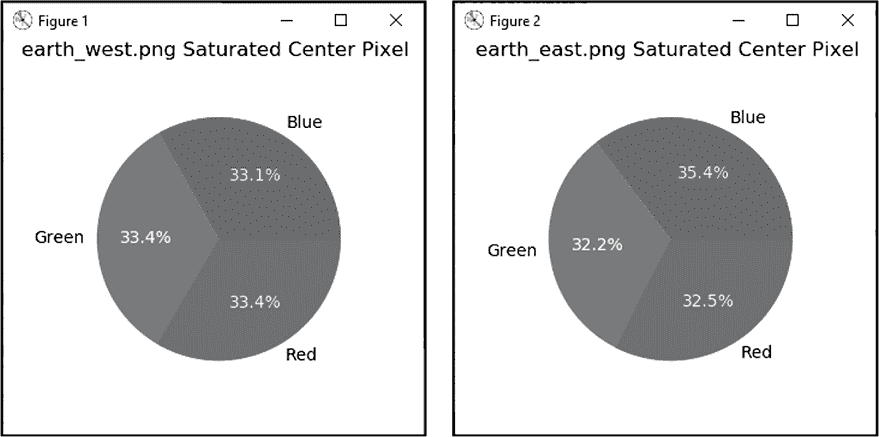

图 8-16：pixelator_saturated_only.py 生成的单像素饼图

图 8-15 和 8-16 中西半球的颜色差异很微妙，但你知道它们是真实的，因为你*前向建模*了反应。也就是说，你通过实际观测得出了结果，所以你知道这个结果是有意义的、可重复的，并且是独一无二的。

在实际的系外行星调查中，你会希望拍摄尽可能多的图像。如果相似的强度和颜色模式在时间上持续存在，那么你可以排除诸如天气等随机效应。如果颜色模式在较长时间内发生可预测的变化，你可能在观察季节效应，比如冬季出现白色极地冰盖，春夏季节绿植扩展的现象。

如果测量周期性地重复，并且时间跨度相对较短，你可以推测行星正在自转。在本章末尾的“实践项目”部分，你将有机会计算系外行星的一天长度。

### **总结**

在本章中，你使用了 OpenCV、NumPy 和 matplotlib 创建图像并测量它们的属性。你还将图像调整为不同的分辨率，并绘制了图像强度和颜色通道信息。通过简短而简单的 Python 程序，你模拟了天文学家用来发现和研究遥远系外行星的重要方法。

### **进一步阅读**

*如何搜索系外行星*，由行星学会（Planetary Society）出版，(*[`www.planetary.org/`](https://www.planetary.org/)*)，这是一本关于搜索系外行星技术的好概述，涵盖了每种方法的优缺点。

“过境光变曲线教程”，由安德鲁·范德堡（Andrew Vanderburg）编写，解释了过境光度法的基础，并提供了开普勒太空望远镜的过境数据链接。你可以在 *[`www.cfa.harvard.edu/~avanderb/tutorial/tutorial.html`](https://www.cfa.harvard.edu/~avanderb/tutorial/tutorial.html)* 上找到它。

“NASA 想要拍摄系外行星表面”（*Wired*，2020），由丹尼尔·奥伯豪斯（Daniel Oberhaus）编写，描述了将太阳变成一个巨大的相机镜头来研究系外行星的努力。

“戴森球：高级外星文明如何征服银河系”（*Space.com*，2014），由卡尔·塔特（Karl Tate）编写，是一张信息图，展示了一个高级文明如何利用巨大的太阳能面板阵列捕获恒星的能量。

*环世界*（Ringworld），由拉里·尼文（Larry Niven）编写，出版于 1970 年，是科幻小说的经典之作。故事讲述了一个任务，目的地是一个巨大的废弃外星建筑——环世界，它环绕着一颗外星星球。

### **实践项目：探测外星巨型结构**

2015 年，正在处理开普勒太空望远镜数据的业余天文学家注意到天鹅座中的塔比星（Tabby’s Star）出现了异常现象。这颗星星的光变曲线记录于 2013 年，显示出亮度变化不规则，这种变化远远大于行星所能引起的变化（图 8-17）。

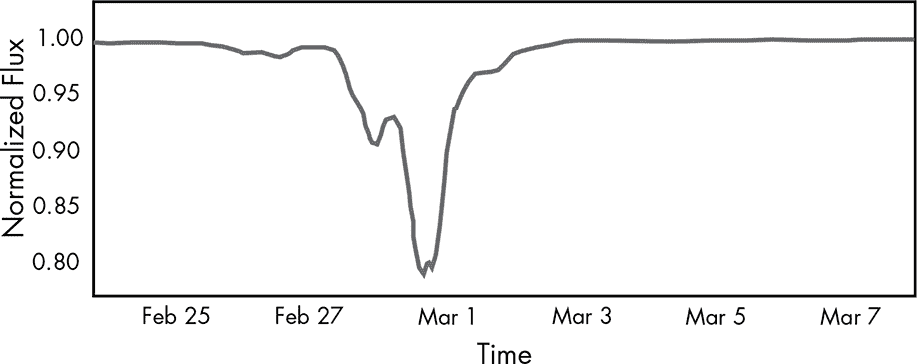

图 8-17：由开普勒太空天文台测量的 Tabby 星的光变曲线

除了亮度的剧烈下降外，光变曲线还表现出不对称性，并且包含一些奇怪的凸起，这在典型的行星凌日中并未见过。提出的解释认为，这个光变曲线可能是由于星体吞噬行星、由解体彗星云凌日、一个被小行星群包围的大型环状行星，或者是*外星巨型结构*所致。

科学家推测，这样大小的人造结构很可能是外星文明试图从其太阳收集能量的尝试。科学文献和科幻小说中都描述了这些惊人的大型太阳能电池板项目。例如包括戴森群、戴森球、环世界和波克罗夫斯基壳（图 8-18）。

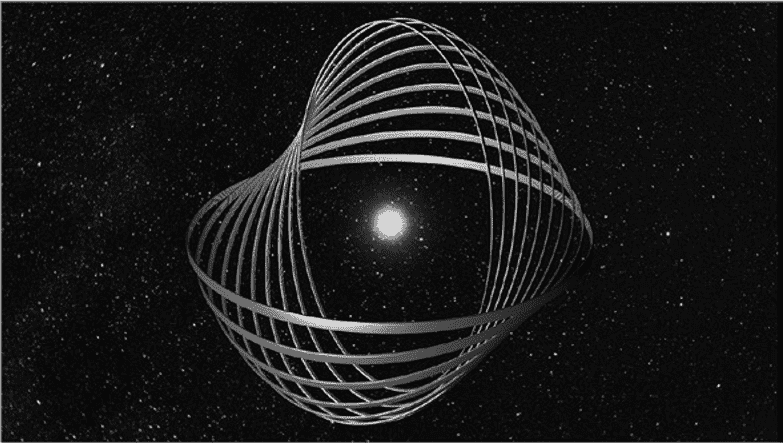

图 8-18：围绕恒星的波克罗夫斯基壳系统，旨在拦截恒星的辐射

在这个实践项目中，使用*transit.py*程序来逼近 Tabby 星光变曲线的形状和深度。用其他简单的几何形状替换程序中使用的圆形外星行星。你不需要完全匹配曲线，只需捕捉到关键特征，如不对称性、2 月 28 日左右看到的“凸起”，以及亮度的大幅下降。

你可以在*Chapter_8*文件夹中找到我尝试编写的程序*practice_tabbys_star.py*，该文件可以从本书网站下载，网址为*[`nostarch.com/real-world-python/`](https://nostarch.com/real-world-python/)*，并且可以在附录中找到。它会生成图 8-19 所示的光变曲线。


图 8-19：由 practice_tabbys_star.py 产生的光变曲线

我们现在知道，无论是什么环绕 Tabby 星，都会允许某些波长的光通过，所以它不可能是一个实心物体。基于这种行为和它吸收的波长，科学家们认为尘埃是导致这颗星光变曲线形状怪异的原因。然而，像天秤座中的 HD 139139 等其他恒星，至今仍然没有解释它们奇异的光变曲线。

### **实践项目：检测小行星凌日**

小行星带可能是一些曲折和不对称光变曲线的罪魁祸首。这些碎片带通常来自行星碰撞或太阳系的形成，就像木星轨道中的特洛伊小行星（图 8-20）。你可以在网页“Lucy：首次任务探索特洛伊小行星”中找到一段有趣的特洛伊小行星动画，网址为*[`www.nasa.gov/`](https://www.nasa.gov/)*。

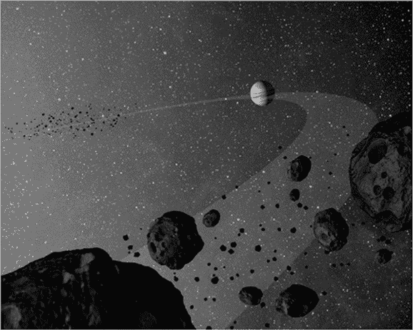

图 8-20：超过一百万颗特洛伊小行星共享木星的轨道。

修改 *transit.py* 程序，使其随机生成半径在 1 到 3 之间的小行星，且小行星的生成概率偏向于 1。允许用户输入小行星的数量。无需计算外行星半径，因为该计算假设你处理的是单个球形物体，而你不是。试验小行星的数量、大小和分布范围（小行星存在的 *x*-范围和 *y*-范围），观察其对光变曲线的影响。图 8-21 展示了一个这样的例子。

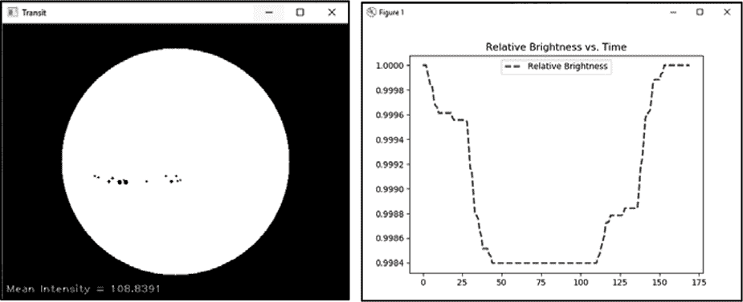

图 8-21：由随机生成的 asteroids（小行星）场产生的不规则、非对称光变曲线

你可以在附录和本书网站上找到解决方案 *practice_asteroids.py*。该程序使用面向对象编程（OOP）来简化多个小行星的管理。

### **实践项目：加入光球暗化**

*光球* 是恒星的发光外层，辐射光和热。由于光球的温度随着离恒星中心的距离增加而降低，恒星盘的边缘比中心更冷，因此看起来比中心更暗（图 8-22）。这一现象被称为 *光球暗化*。


图 8-22：太阳的光球暗化和太阳黑子

重写 *transit.py* 程序，使其能够处理光球暗化。不要再绘制恒星，而是使用 *Chapter_8* 文件夹中的图片 *limb_darkening.png*，该文件可以从本书网站下载。

光球暗化会影响行星过境产生的光变曲线。与项目 11 中你产生的理论曲线相比，这些曲线将显得不那么方形，边缘更加圆润柔和，底部呈弯曲状（图 8-23）。

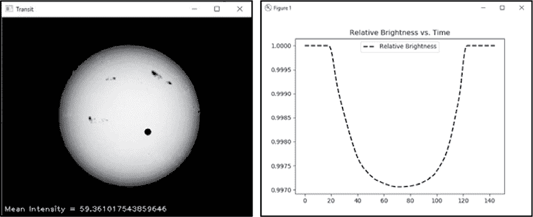

图 8-23：光球暗化对光变曲线的影响

使用你修改后的程序重新访问“实验：过境光度法”中的第 186 页，在那里你分析了部分过境产生的光变曲线。你应该会看到，相比部分过境，完全过境仍然产生较宽的波谷，并且波谷底部较为平坦（图 8-24）。

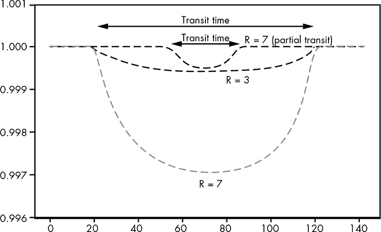

图 8-24：完全与部分过境的光变曲线（R = 外行星半径）

如果一个小行星的完全过境发生在恒星的边缘，光球暗化可能使其与一个大行星的部分过境难以区分。你可以在图 8-25 中看到这一点，箭头表示行星的位置。

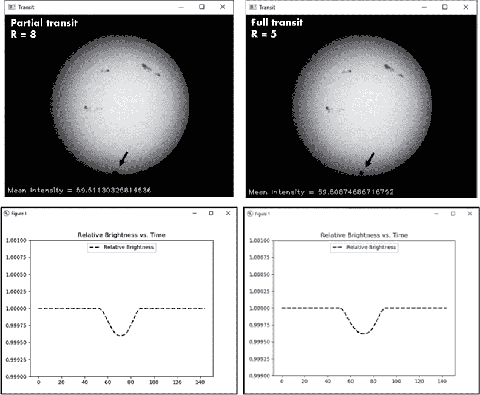

图 8-25：半径为 8 像素的行星的部分过境与半径为 5 像素的行星的完全过境

天文学家有许多工具可以提取光变曲线中的信息。通过记录多个过境事件，他们可以确定系外行星的轨道参数，比如行星与恒星之间的距离。他们可以利用光变曲线中的细微变化来推算行星完全遮盖恒星表面的时间。他们还可以估计理论上的边缘变暗程度，并可以使用建模方法，正如你在这里所做的那样，将所有信息结合起来，并用实际观测数据验证他们的假设。

你可以在附录和 *Chapter_8* 文件夹中找到一个解决方案，*practice_limb_darkening.py*，并从书籍网站下载。

### **实践项目：检测恒星斑点**

太阳黑子——在外星太阳上被称为 *星斑*——是由恒星磁场变化引起的表面温度降低区域。星斑会使恒星的表面变暗，并对光变曲线产生有趣的影响。在 图 8-26 中，一颗系外行星经过星斑，造成了光变曲线中的一个“突起”。

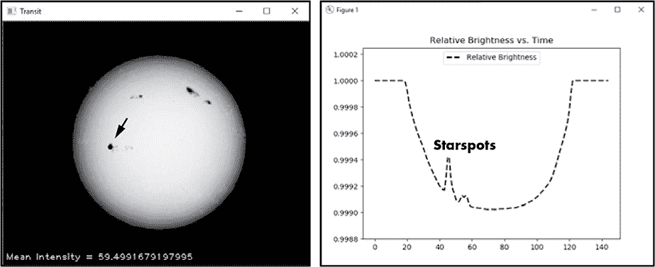

图 8-26：一颗系外行星（箭头，左图）经过恒星斑点时，会在光变曲线中产生一个“突起”。

为了实验星斑，使用前一个实践项目中的 *practice_limb_darkening.py* 代码，并编辑它，使一颗大致与星斑大小相同的系外行星在横越过程中经过这些星斑。为了重现 图 8-26，设置 EXO_RADIUS = 4，EXO_DX = 3，EXO_START_Y = 205。

### **实践项目：检测外星舰队**

系外行星 BR549 上的超级进化的海狸们忙得不可开交，就像海狸一样。它们已经集结了一支庞大的殖民舰队，这些舰船已经装载完毕，准备离开轨道。由于自己也能进行系外行星探测，它们决定抛弃已经啃噬殆尽的家园，前往地球那片郁郁葱葱的绿树成荫的森林！

编写一个 Python 程序，模拟多艘太空飞船横越一颗恒星。给飞船设置不同的大小、形状和速度（如图 8-27 所示）。

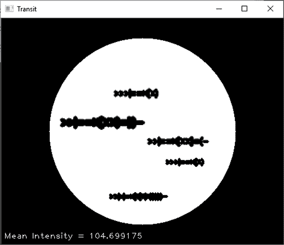

图 8-27：一支外星殖民舰队准备入侵地球

将得到的光变曲线与 Tabby 星的光变曲线（图 8-17）以及小行星实践项目的光变曲线进行比较。这些飞船会产生独特的曲线吗，还是你能从小行星群、恒星斑点或其他自然现象中得到相似的模式？

你可以在附录和 *Chapter_8* 文件夹中找到一个解决方案，*practice_alien_armada.py*，并从书籍网站下载。

### **实践项目：检测具有卫星的行星**

一个拥有卫星的系外行星会产生怎样的光变曲线？编写一个 Python 程序，模拟一个小型外卫星绕着更大的系外行星轨道运行，并计算出由此产生的光变曲线。你可以在附录和书籍网站上找到一个解决方案，*practice_planet_moon.py*。

### **实践项目：测量系外行星的一天长度**

你的天文学家老板给了你 34 张外行星 BR549 的图像。图像拍摄时间间隔为一小时。编写一个 Python 程序，按顺序加载这些图像，测量每张图像的强度，并将这些测量值绘制成单一的光曲线（图 8-28）。使用该曲线来确定 BR549 的白昼长度。

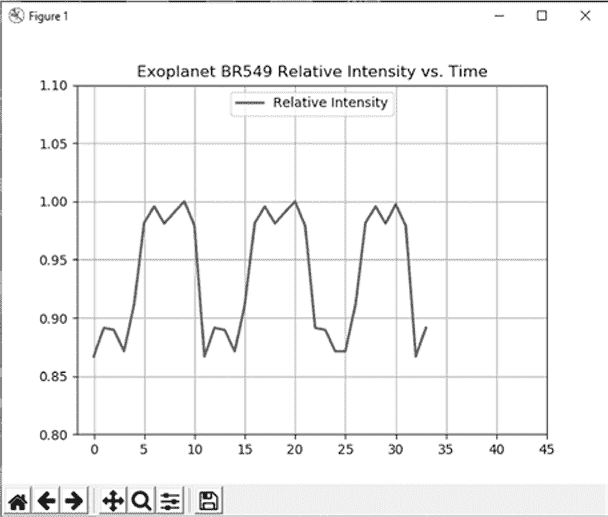

图 8-28：外行星 BR549 的 34 张图像合成光曲线

你可以在附录中找到一个解决方案，*practice_length_of_day.py*。代码的数字版本以及图像文件夹（*br549_pixelated*）都位于从本书网站可下载的*Chapter_8*文件夹中。

### **挑战项目：生成动态光曲线**

重新编写*transit.py*，使得光曲线在模拟运行时动态更新，而不是仅在结束时显示。
