## 第十章：识别朋友或敌人


人脸检测是一种机器学习技术，用于在数字图像中定位人脸。这是面部*识别*过程的第一步，面部识别是通过代码识别特定个体人脸的技术。人脸检测和识别方法有广泛的应用，例如社交媒体上的照片标记、数字相机的自动对焦、手机解锁、寻找失踪儿童、追踪恐怖分子、促进安全支付等。

在本章中，你将使用 OpenCV 中的机器学习算法编程一个机器人岗哨枪。因为你需要区分人类和外星突变体，所以你只需要检测人脸的*存在*，而不是识别特定的个体。在第十章中，你将迈出下一步，通过人脸来识别具体的人。

### **检测照片中的人脸**

人脸检测之所以可行，是因为人脸具有相似的模式。一些常见的面部模式包括眼睛比脸颊暗，鼻梁比眼睛亮，正如在图 9-1 的左侧图像中所看到的。

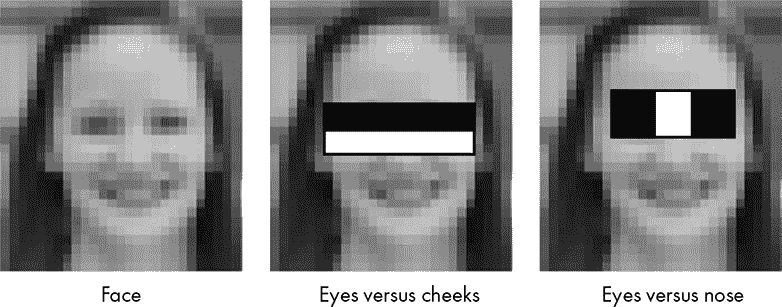

图 9-1：面部中一些一致的明亮和暗淡区域的示例

你可以使用像图 9-2 中的模板来提取这些模式。它们产生了*Haar 特征*，这是用于物体识别的数字图像属性的 fancy 名称。要计算 Haar 特征，将其中一个模板放置在灰度图像上，将与白色部分重叠的灰度像素相加，然后从与黑色部分重叠的像素之和中减去它们。因此，每个特征由一个单一的强度值组成。我们可以使用不同大小的模板来采样图像上的所有可能位置，使得系统具有尺度不变性。

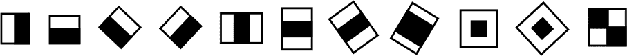

图 9-2：一些示例 Haar 特征模板

在图 9-1 中的中间图像中，一个“边缘特征”模板提取了黑暗眼睛和明亮脸颊之间的关系。在图 9-1 中的最右侧图像中，一个“线条特征”模板提取了黑暗眼睛和明亮鼻子之间的关系。

通过计算成千上万张*已知*的人脸和非人脸图像的 Haar 特征，我们可以确定哪种 Haar 特征组合在识别面部时最有效。这个训练过程比较慢，但它为后续的快速检测提供了便利。最终的算法被称为*人脸分类器*，它通过输出 1 或 0 来预测图像是否包含人脸。OpenCV 提供了基于这一技术的预训练人脸检测分类器。

为了应用分类器，算法使用*滑动窗口*方法。一个小的矩形区域会逐步在图像上移动，并通过一个包含多级过滤器的*级联分类器*进行评估。每个阶段的过滤器是 Haar 特征的组合。如果窗口区域未通过某一阶段的阈值，它将被拒绝，窗口滑动到下一个位置。快速拒绝非人脸区域，例如图 9-3 右侧插图中的区域，有助于加速整个过程。

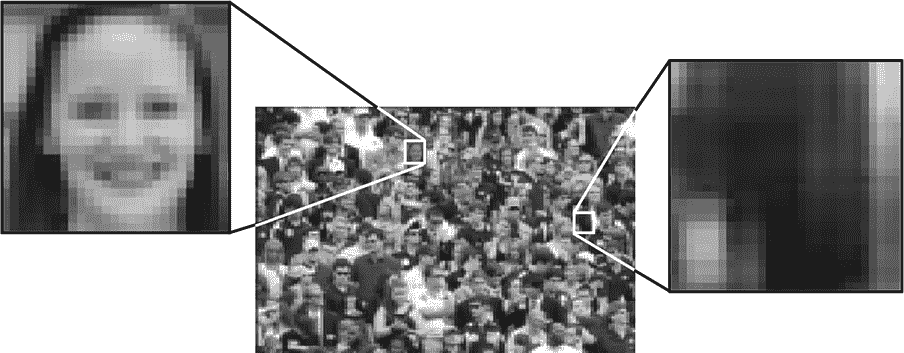

图 9-3：使用矩形滑动窗口搜索人脸。

如果一个区域通过了某个阶段的阈值，算法会处理另一组 Haar 特征并与阈值进行比较，依此类推，直到它要么拒绝，要么确定一个面部。这会导致滑动窗口在图像上移动时加速或减速。你可以在*[`vimeo.com/12774628/`](https://vimeo.com/12774628/)*上找到一个精彩的视频示例。

对于每个检测到的人脸，算法返回一个围绕人脸的矩形坐标。你可以使用这些矩形作为进一步分析的基础，例如识别眼睛。

### **项目#13：编程机器人守卫炮**

想象一下，你是联盟海军的技术员，隶属于太空部队的一支分队。你的小队被派遣到由威克汉-尤塔萨基公司在 LV-666 星球上运营的一个秘密研究基地。在研究一个神秘的外星设备时，研究人员不小心打开了通往地狱般异次元的门户。任何靠近门户的人，包括数十名平民和你的几位战友，都会变异成嗜血的无脑怪物！你甚至捕捉到了监控视频（见图 9-4）。

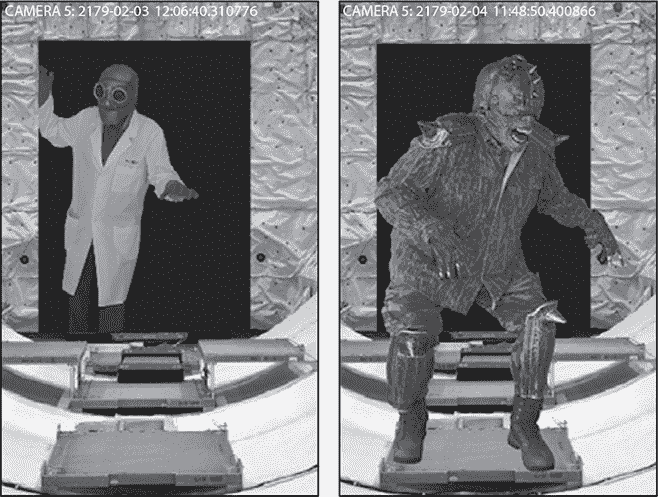

图 9-4：变异科学家的监控视频（左）和海军（右）

根据剩余科学家的说法，变异不仅仅影响有机物质。受害者佩戴的任何装备，例如头盔和护目镜，也会被转化并与肉体融合。眼组织特别脆弱。迄今为止形成的所有变异体都是没有眼睛的盲者，尽管这似乎并不影响它们的行动能力。它们依然凶猛、致命且不可阻挡，除非有军用级武器。

这就是你的任务。你的工作是设置一个自动开火站点，以守卫被攻陷设施中的关键通道 5。如果没有它，你的小队就有可能被变异怪物大军包围并压倒。

火控站由一台 UAC 549-B 自动哨兵枪组成，步兵们称其为*机器人哨兵*（图 9-5）。它配备了四门 M30 自动炮，拥有 1,000 发弹药以及多个传感器，包括运动探测器、激光测距单元和光学相机。该枪还通过敌友识别（IFF）应答器对目标进行识别。所有联军海军陆战队员都携带这些应答器，从而使他们能够安全地通过激活的哨兵枪。

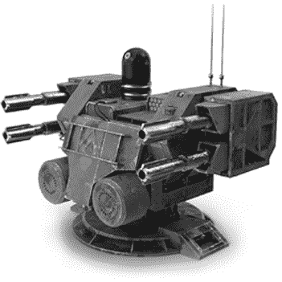

图 9-5：UAC 549-B 自动哨兵枪

不幸的是，小队的哨兵枪在着陆时受损，因此应答器不再起作用。更糟糕的是，物资上士忘记下载用于视觉识别目标的软件。由于应答器传感器失效，现在无法正面识别海军陆战队员和平民。你需要尽快修复这个问题，因为你的战友人数严重不足，而变异体已经开始行动！

幸运的是，LV-666 星球没有本土生命形式，因此你只需要区分人类和变异体。由于变异体基本上没有面孔，人脸检测算法是最合适的解决方案。

目标

编写一个 Python 程序，当哨兵枪检测到人脸时，禁用其开火机制。

#### ***策略***

在这种情况下，最好保持简单，并利用现有的资源。这意味着依赖 OpenCV 的人脸检测功能，而不是编写自定义代码来识别基地上的人类。但是你无法确定这些现成的程序是否能很好地工作，因此你需要引导你的目标人类，使任务尽可能简便。

哨兵枪的运动探测器将负责触发光学识别过程。为了允许人类安全通过，你需要提醒他们停下并面对相机。他们需要几秒钟的时间来完成这一动作，之后在被确认清除后，他们才能继续通过哨兵枪。

你还需要运行一些测试，确保 OpenCV 的训练集足够，并且没有生成任何假阳性，以免让变异体悄悄溜过。你不想因为误伤友军而杀死任何人，但你也不能过于谨慎。如果一个变异体溜过，所有人都可能丧命。

**注意**

*在现实生活中，哨兵枪将使用视频馈送。由于我没有自己的电影制作工作室以及特效和化妆部门，你将使用静态照片代替。你可以把这些照片当作独立的视频帧来看。稍后的章节中，你将有机会使用电脑的摄像头来检测自己的面孔。*

#### ***代码***

*sentry.py* 代码将循环遍历一个图像文件夹，识别图像中的人脸，并显示带有勾画出人脸的图像。然后，根据结果，它会触发或禁用枪支。你将使用 *Chapter_9* 文件夹中的 *corridor_5* 文件夹中的图像，该文件夹可以从 *[`nostarch.com/real-world-python/`](https://nostarch.com/real-world-python/)* 下载。像往常一样，在下载后不要移动或重命名任何文件，并从存储该文件的文件夹中启动 *sentry.py*。

你还需要安装两个模块，playsound 和 pyttsx3。第一个是一个跨平台模块，用于播放 WAV 和 MP3 格式的音频文件。你将使用它来产生声音效果，例如机枪射击声和“全部清除”音调。第二个是一个跨平台封装器，支持 Windows 和基于 Linux 的系统（包括 macOS）上的本地文本转语音库。哨兵枪将使用它来发出音频警告和指令。与其他文本转语音库不同，pyttsx3 直接从程序读取文本，而不是先将其保存到音频文件中。它也可以离线工作，使其成为语音项目的可靠选择。

你可以在 PowerShell 或终端窗口中使用 pip 安装这两个模块。

```py
pip install playsound
pip install pyttsx3
```

如果你在 Windows 上安装 pyttsx3 时遇到错误，比如 No module named win32.com.client、No module named win32 或 No module named win32api，那么请安装 pypiwin32。

```py
pip install pypiwin32
```

安装后，你可能需要重新启动 Python shell 和编辑器。

有关 playsound 的更多信息，请参阅 *[`pypi.org/project/playsound/`](https://pypi.org/project/playsound/)*。pyttsx3 的文档可以在 *[`pyttsx3.readthedocs.io/en/latest/`](https://pyttsx3.readthedocs.io/en/latest/)* 和 *[`pypi.org/project/pyttsx3/`](https://pypi.org/project/pyttsx3/)* 找到。

如果你尚未安装 OpenCV，请参阅 第 6 页中的“安装 Python 库”部分。

##### **导入模块、设置音频并引用分类器文件和走廊图像**

清单 9-1 导入模块，初始化并设置音频引擎，将分类器文件分配给变量，并将目录更改为包含走廊图像的文件夹。

```py
sentry.py, part 1
   import os
   import time
➊ from datetime import datetime
   from playsound import playsound
   import pyttsx3
   import cv2 as cv

➋ engine = pyttsx3.init()
   engine.setProperty('rate', 145)  
   engine.setProperty('volume', 1.0) 

   root_dir = os.path.abspath('.')
   gunfire_path = os.path.join(root_dir, 'gunfire.wav')
   tone_path = os.path.join(root_dir, 'tone.wav')

➌ path= "C:/Python372/Lib/site-packages/cv2/data/"
   face_cascade = cv.CascadeClassifier(path + 
                                       'haarcascade_frontalface_default.xml')
   eye_cascade = cv.CascadeClassifier(path + 'haarcascade_eye.xml')

➍ os.chdir('corridor_5')
   contents = sorted(os.listdir())
```

清单 9-1：导入模块、设置音频，并定位分类器文件和走廊图像

除了 datetime、playsound 和 pyttsx3 模块，如果你已经完成前面的章节 ➊，你应该对这些导入的模块很熟悉。你将使用 datetime 来记录在走廊中检测到入侵者的准确时间。

要使用 pytts3，请初始化一个 pyttsx3 对象并将其分配给一个变量，通常命名为 engine ➋。根据 pyttsx3 文档，应用程序使用 engine 对象来注册和注销事件回调，生成和停止语音，获取和设置语音引擎属性，以及启动和停止事件循环。

在接下来的两行中，设置语音速率和音量属性。这里使用的语音速率值是通过反复试验得到的，应该快速但仍然清晰易懂。音量应设置为最大值（1.0），这样任何走进走廊的人都能清楚听到警告指令。

Windows 系统上的默认语音为男性，但也可以选择其他语音。例如，在 Windows 10 机器上，您可以使用以下语音 ID 切换到女性语音：

```py
engine.setProperty('voice',
'HKEY_LOCAL_MACHINE\SOFTWARE\Microsoft\Speech\Voices\Tokens\TTS_MS_EN-US_ZIRA_11.0')
```

要查看平台上可用的语音列表，请参考*“更改语音”*，[`pyttsx3.readthedocs.io/en/latest/`](https://pyttsx3.readthedocs.io/en/latest/)。

接下来，设置枪声的音频录制，当在走廊中检测到变异体时播放。通过生成一个适用于所有平台的目录路径字符串来指定音频文件的位置，方法是使用 os.path.join() 方法将绝对路径与文件名结合起来。对于*tone.wav* 文件，使用相同的路径，当程序识别到人类时，它将作为“解除警报”信号使用。

在安装 OpenCV 时，预训练的 Haar cascade 分类器应该作为 *.xml* 文件下载。将包含分类器的文件夹路径分配给变量 ➌。显示的路径是我 Windows 机器上的路径；您的路径可能会不同。例如，在 macOS 上，您可能会在 *opencv/data/haarcascades* 中找到它们。您还可以在网上找到它们，网址是*[`github.com/opencv/opencv/tree/master/data/haarcascades/`](https://github.com/opencv/opencv/tree/master/data/haarcascades/)。

查找 cascade 分类器路径的另一种方法是使用预安装的 sysconfig 模块，如下片段所示：

```py
>>> import sysconfig
>>> path = sysconfig.get_paths()['purelib'] + '/cv2/data'
>>> path
'C:\\Python372\\Lib\\site-packages/cv2/data'
```

这在 Windows 系统中无论是在虚拟环境内外都应该有效。但在 Ubuntu 上，这仅在虚拟环境内有效。

要加载分类器，请使用 OpenCV 的 CascadeClassifier() 方法。使用字符串拼接将路径变量添加到分类器的文件名字符串中，并将结果分配给一个变量。

请注意，我只使用了两个分类器，一个用于正面人脸，一个用于眼睛，以保持简单。还可以使用其他分类器来检测侧面、微笑、眼镜、上半身等。

最后，指向您正在守卫的走廊中拍摄的图像。将目录更改为正确的文件夹 ➍；然后列出文件夹内容并将结果分配给一个内容变量。因为您没有提供文件夹的完整路径，所以需要从包含文件夹的文件夹中启动程序，该文件夹应该位于图像文件夹的上一层。

##### **发出警告、加载图像并检测人脸**

清单 9-2 开始一个 for 循环，遍历包含走廊图像的文件夹。在现实生活中，守卫枪的运动探测器会在有人进入走廊时启动你的程序。由于我们没有运动探测器，我们假设每个循环代表一个新的入侵者的到来。

循环立即激活枪支并准备开火。然后，它口头要求入侵者停止并正对摄像头。这会在离枪支一定距离处发生，由运动传感器决定。因此，你知道这些面孔的大小大致相同，这使得测试程序变得容易。

给入侵者几秒钟时间遵守命令。之后，调用级联分类器并用它来搜索面部。

```py
sentry.py, part 2 
for image in contents:
 ➊ print(f"\nMotion detected...{datetime.now()}")
    discharge_weapon = True
 ➋ engine.say("You have entered an active fire zone. \
                Stop and face the gun immediately. \
                When you hear the tone, you have 5 seconds to pass.")
    engine.runAndWait()
    time.sleep(3)

 ➌ img_gray = cv.imread(image, cv.IMREAD_GRAYSCALE)
    height, width = img_gray.shape
    cv.imshow(f'Motion detected {image}', img_gray)
    cv.waitKey(2000)
    cv.destroyWindow(f'Motion detected {image}')

 ➍ face_rect_list = []  
    face_rect_list.append(face_cascade.detectMultiScale(image=img_gray,
                                                        scaleFactor=1.1,
                                                        minNeighbors=5))
```

清单 9-2：遍历图像、发出口头警告并搜索面部

开始遍历文件夹中的图像。每张新图像代表走廊中的一个新入侵者。打印事件日志和发生的时间 ➊。注意字符串前面的 f。这是 Python 3.6 引入的*f-string*格式（* [`www.python.org/dev/peps/pep-0498/`](https://www.python.org/dev/peps/pep-0498/)*）。f-string 是一个字面量字符串，它包含表达式，例如变量、字符串、数学运算，甚至函数调用，位于大括号内。当程序打印该字符串时，它会用表达式的值替换这些表达式。这些是 Python 中最快、最有效的字符串格式，我们当然希望这个程序运行得很快！

假设每个入侵者都是变种人，并准备开火。然后，口头警告入侵者停止并进行扫描。

使用 pyttsx3 引擎对象的 say()方法来发声 ➋。它接受一个字符串作为参数。然后调用 runAndWait()方法。它会暂停程序执行，清空 say()队列并播放音频。

**注意**

*对于一些 macOS 用户，程序可能在第二次调用 runAndWait()时退出。如果发生这种情况，请从书籍的网站下载 sentry_for_Mac_bug.py 代码。该程序使用操作系统的文本到语音功能替代 pyttsx3。你仍然需要更新程序中的 Haar 级联路径变量，正如你在➌处所做的那样，在清单 9-1 中。*

接下来，使用 time 模块暂停程序三秒钟。这样，入侵者有时间正对着枪的摄像头。

在这一点上，你将进行视频捕捉，尽管我们不使用视频。相反，加载*coridor_5*文件夹中的图像。使用带有 IMREAD_GRAYSCALE 标志的 cv.imread()方法 ➌。

使用图像的 shape 属性获取其高度和宽度（以像素为单位）。这将在稍后你在图像上添加文本时派上用场。

人脸检测仅适用于灰度图像，但在应用 Haar 级联时，OpenCV 会在后台自动将彩色图像转换为灰度图像。我从一开始就选择使用灰度图像，因为图像显示时效果更恐怖。如果你想查看彩色图像，只需将前两行代码修改如下：

```py
    img_gray = cv.imread(image)
    height, width = img_gray.shape[:2]
```

接下来，显示人脸检测前的图像，保持显示两秒钟（以毫秒为单位），然后销毁窗口。这是质量控制的一部分，确保所有图像都已被检查。你可以在确认一切按计划正常工作后，将这些步骤注释掉。

创建一个空列表，用于存储当前图像中找到的人脸➍。OpenCV 将图像视为 NumPy 数组，因此列表中的项目是框住人脸的矩形的角点坐标（*x*，*y*，宽度，高度），如以下输出片段所示：

```py
[array([[383, 169,  54,  54]], dtype=int32)]
```

现在是时候使用 Haar 级联来检测人脸了。通过调用 face_cascade 变量的 detectMultiscale()方法来执行此操作。将图像以及 scaleFactor 和 minNeighbors 的值传递给该方法。这些值可以用于调整结果，以应对误检或未能识别人脸的情况。

为了获得良好的结果，图像中的人脸应与训练分类器时使用的人脸大小相同。为了确保这一点，scaleFactor 参数使用一种叫做*尺度金字塔*的技术，将原始图像缩放到正确的大小（见图 9-6）。

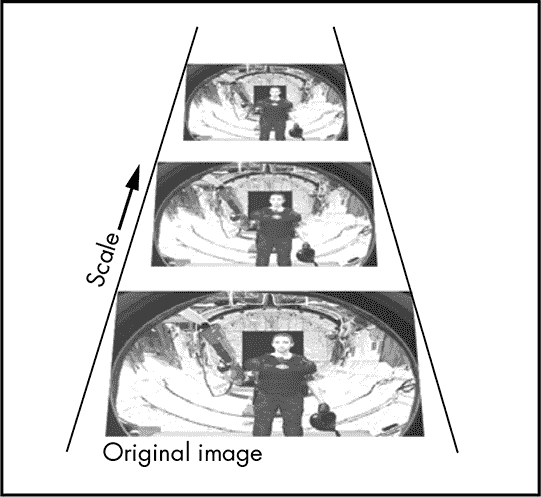

图 9-6：“尺度金字塔”示例

尺度金字塔将图像按设定的次数向下缩放。例如，scaleFactor 为 1.2 意味着图像将按 20%的增量缩小。滑动窗口将继续在缩小后的图像上滑动，并再次检查 Haar 特征。这种缩小和滑动将持续进行，直到缩放后的图像达到训练时使用的图像大小。对于 Haar 级联分类器来说，这个大小是 20×20 像素（你可以通过打开一个*.xml*文件来确认这一点）。小于这个大小的窗口无法被检测到，因此缩放会在此结束。请注意，尺度金字塔仅会*缩小*图像，因为放大图像可能会引入失真。

每次缩放时，算法会计算大量新的 Haar 特征，从而产生大量误检。为了筛除这些误检，可以使用 minNeighbors 参数。

要查看这个过程是如何工作的，参见图 9-7。此图中的矩形框代表通过 haarcascade_frontalface_alt2.xml 分类器检测到的人脸，scaleFactor 参数设置为 1.05，minNeighbors 设置为 0。矩形框的大小取决于使用的缩放图像——由 scaleFactor 参数确定——当人脸被检测到时使用的图像大小。尽管会有很多误检，但矩形框通常会聚集在真实人脸周围。

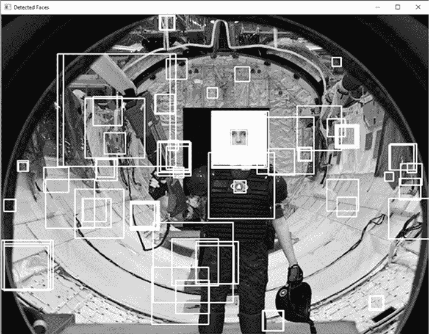

图 9-7：检测到的人脸矩形框，minNeighbors=0

增加 minNeighbors 参数的值将提高检测的质量，但会减少检测到的数量。如果你指定值为 1，则只有具有一个或多个紧邻矩形的矩形会被保留，其他的都被丢弃 (图 9-8)。

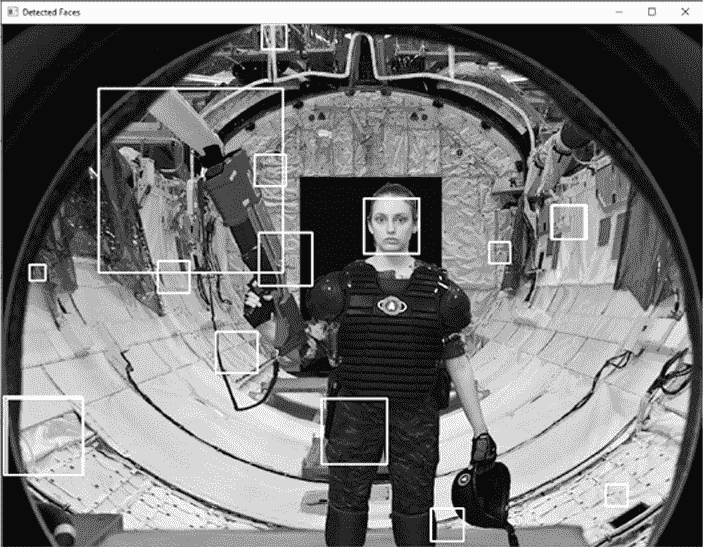

图 9-8：使用 minNeighbors=1 检测到的面部矩形

将最小邻居数增加到大约五通常可以消除误报 (图 9-9)。这对于大多数应用来说可能足够了，但应对可怕的跨维怪物需要更严谨的处理。


图 9-9：使用 minNeighbors=5 检测到的面部矩形

为了查看原因，查看 图 9-10。尽管使用了 minNeighbor 值为 5，但变种人的脚趾区域仍被错误地识别为面部。凭借一点想象力，你可以看到矩形顶部有两个黑色的眼睛和一个明亮的鼻子，底部有一个黑色、直线状的嘴巴。这可能让变种人毫发无损地通过，最好的结果是你被开除，最坏的结果则是经历一场极其痛苦的死亡。

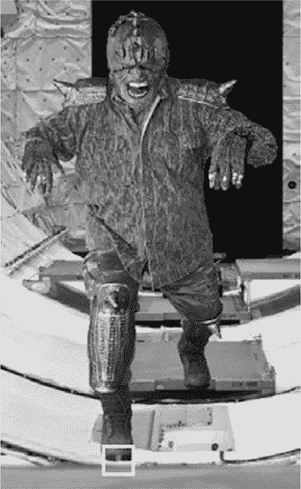

图 9-10：变种人的右脚趾区域被错误地识别为面部

幸运的是，这个问题可以很容易地解决。解决方案是搜索不仅仅是面部。

##### **检测眼睛并禁用武器**

仍然在遍历走廊图像的 for 循环中，列表 9-3 使用 OpenCV 内置的眼睛级联分类器在检测到的面部矩形列表中搜索眼睛。通过增加第二步验证，搜索眼睛可以减少误报。而且因为变种人没有眼睛，如果至少找到一只眼睛，你可以假定是人类存在，并禁用哨兵枪的射击机制，让他们通过。

```py
sentry.py, part 3 
    print(f"Searching {image} for eyes.")
    for rect in face_rect_list:
        for (x, y, w, h) in rect:
         ➊ rect_4_eyes = img_gray[y:y+h, x:x+w]
            eyes = eye_cascade.detectMultiScale(image=rect_4_eyes, 
                                                scaleFactor=1.05,
                                                minNeighbors=2)
         ➋ for (xe, ye, we, he) in eyes:
                print("Eyes detected.")
                center = (int(xe + 0.5 * we), int(ye + 0.5 * he))
                radius = int((we + he) / 3)
                cv.circle(rect_4_eyes, center, radius, 255, 2)
                cv.rectangle(img_gray, (x, y), (x+w, y+h), (255, 255, 255), 2)
             ➌ discharge_weapon = False
                break
```

列表 9-3：在面部矩形中检测眼睛并禁用武器

打印正在搜索的图像名称，并开始遍历 face_rect_list 中的矩形。如果存在矩形，开始遍历坐标元组。使用这些坐标从图像中制作一个子数组，在其中搜索眼睛 ➊。

在子数组上调用眼睛级联分类器。由于现在搜索的是一个更小的区域，你可以减少 minNeighbors 参数的值。

像面部级联分类器一样，眼睛级联也会返回一个矩形的坐标。从这些坐标开始循环，并用 e 作为结尾命名它们，代表“眼睛”，以便与面部矩形的坐标 ➋ 区分开来。

接下来，在你找到的第一个眼睛周围画一个圆圈。这只是为了你自己的视觉确认；就算法而言，眼睛已经被找到。计算矩形的中心，然后计算一个略大于眼睛的半径值。使用 OpenCV 的 circle() 方法在 rect_4_eyes 子数组上画一个白色圆圈。

现在，通过调用 OpenCV 的`rectangle()`方法并传入`img_gray`数组，绘制一个矩形框围绕人脸。显示图像两秒钟后销毁窗口。因为`rect_4_eyes`子数组是`img_gray`的一部分，即使没有显式将该子数组传递给`im_show()`方法，圆形仍然会显示出来（见图 9-11）。

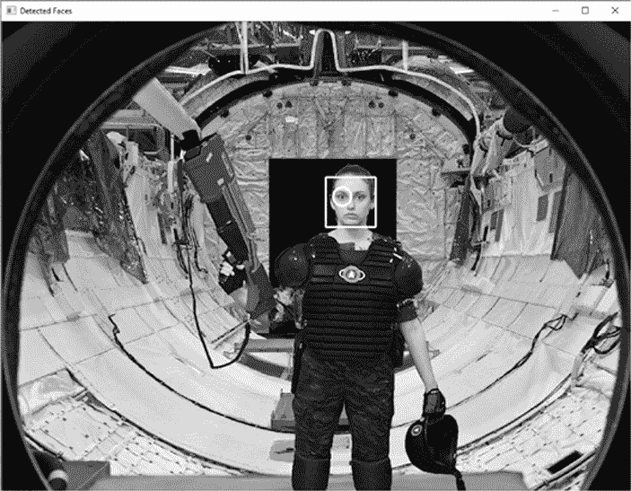

图 9-11：人脸矩形框和眼睛圆形

识别到一个人类后，禁用武器➌并跳出 for 循环。你只需识别一个眼睛，就能确认有一个人脸，因此是时候继续下一个人脸矩形框了。

##### **通过入侵者或开火武器**

仍然在遍历走廊图像的 for 循环中，清单 9-4 决定了如果禁用武器或允许开火时会发生什么。在禁用的情况下，它显示检测到人脸的图像并播放“解除警报”音调。否则，显示图像并播放枪火音频文件。

```py
sentry.py, part 4
    if discharge_weapon == False:
        playsound(tone_path, block=False)    
        cv.imshow('Detected Faces', img_gray)
        cv.waitKey(2000)
        cv.destroyWindow('Detected Faces')
        time.sleep(5)

    else:
        print(f"No face in {image}. Discharging weapon!")
        cv.putText(img_gray, 'FIRE!', (int(width / 2) - 20, int(height / 2)),
                                       cv.FONT_HERSHEY_PLAIN, 3, 255, 3)
        playsound(gunfire_path, block=False)
        cv.imshow('Mutant', img_gray)
        cv.waitKey(2000)
        cv.destroyWindow('Mutant')
        time.sleep(3)

engine.stop()
```

清单 9-4：确定枪支禁用或启用时的行动方案

使用条件语句检查武器是否被禁用。当你从`corridor_5`文件夹中选择当前图像时，你将`discharge_weapon`变量设置为 True（见清单 9-2）。如果之前的清单在人脸矩形框中找到一只眼睛，它会将状态更改为 False。

如果武器被禁用，显示正面检测图像（例如在图 9-11 中），并播放音调。首先，调用`playsound`，传入`tone_path`字符串，并将`block`参数设置为 False。通过将`block`设置为 False，你允许`playsound`在 OpenCV 显示图像的同时运行。如果将`block=True`，那么在音频完成之前，你不会看到图像。显示图像两秒钟后销毁它，并使用`time.sleep()`暂停程序五秒钟。

如果`discharge_weapon`仍然为 True，打印一条信息到命令行，表示枪正在开火。使用 OpenCV 的`putText()`方法将此信息显示在图像中心，然后显示图像（见图 9-12）。

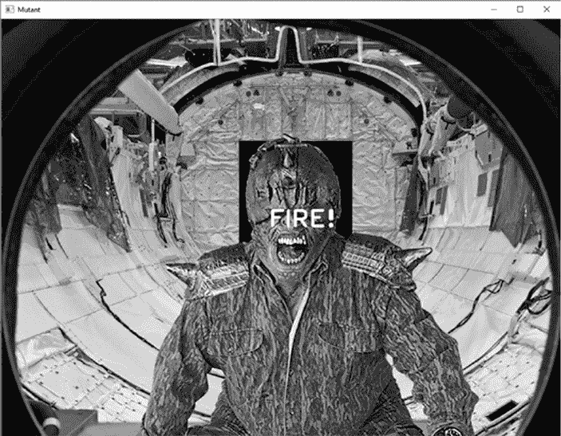

图 9-12：示例突变窗口

现在播放枪火音频。使用`playsound`，传入`gunfire_path`字符串并将`block`参数设置为 False。注意，如果你在调用`playsound`时提供完整路径，你可以选择删除清单 9-1 中的`root_dir`和`gunfire_path`代码行。例如，在我的 Windows 机器上，我会使用如下代码：

```py
playsound('C:/Python372/book/mutants/gunfire.wav', block=False)
```

显示窗口两秒钟后销毁它。暂停程序三秒钟，以便在显示突变图像和显示`corridor_5`文件夹中的下一个图像之间暂停。当循环完成时，停止`pyttsx3`引擎。

#### ***结果***

你的*sentry.py*程序修复了哨兵枪的损坏，并使其在无需转发器的情况下正常工作。然而，它有偏向保护人类生命的倾向，这可能导致灾难性的后果：如果一个变种人与一个人类在同一时刻进入走廊，变种人可能会悄悄绕过防御（见图 9-13）。


图 9-13：最坏的情况。说“茄子”！

如果走廊里有人的话，变种人也可能触发开火机制，前提是这些人在错误的时刻背离了镜头（见图 9-14）。

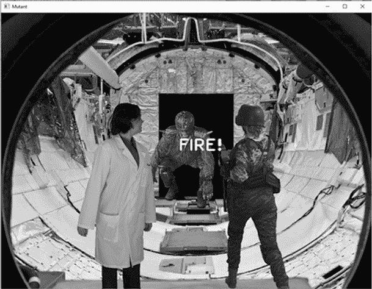

图 9-14：你只有一个任务！

我看过足够多的科幻和恐怖电影，知道在真实的情况下，我会将枪械编程为射击任何移动的物体。幸运的是，这是一个我永远不必*面对*的道德困境！

### **从视频流中检测人脸**

你也可以使用视频摄像头实时检测人脸。这很简单，因此我们不会将其作为一个专门的项目。输入清单 9-5 中的代码，或者使用书籍网站上可下载的*Chapter_9*文件夹中的数字版本*video_face_detect.py*。你将需要使用你计算机的摄像头或通过计算机连接的外部摄像头。

```py
video_face_detect.py
   import cv2 as cv

   path = "C:/Python372/Lib/site-packages/cv2/data/"
   face_cascade = cv.CascadeClassifier(path + 'haarcascade_frontalface_alt.xml')

➊ cap = cv.VideoCapture(0)

   while True:
       _, frame = cap.read()
       face_rects = face_cascade.detectMultiScale(frame, scaleFactor=1.2,
                                                  minNeighbors=3)    

       for (x, y, w, h) in face_rects:
           cv.rectangle(frame, (x, y), (x+w, y+h), (0, 255, 0), 2)

       cv.imshow('frame', frame)
    ➋ if cv.waitKey(1) & 0xFF == ord('q'):
          break

 cap.release()
 cv.destroyAllWindows()
```

清单 9-5：在视频流中检测人脸

在导入 OpenCV 之后，像在清单 9-1 的➌步骤中一样设置你的 Haar 级联分类器路径。我在这里使用*haarcascade_frontalface_alt.xml*文件，因为它比你在之前项目中使用的*haarcascade_frontalface_default.xml*文件精度更高（假阳性较少）。接下来，实例化一个名为 cap 的 VideoCapture 类对象，“cap”代表“捕获”。将视频设备的索引传递给构造函数➊。如果你只有一个摄像头，比如你笔记本电脑的内置摄像头，那么该设备的索引应该是 0。

为了保持相机和人脸检测过程的运行，使用一个 while 循环。在循环内，你将捕捉每一帧视频，并分析其中的人脸，就像你在之前的项目中对静态图像所做的那样。尽管算法需要完成许多工作，但它足够快，可以跟上连续的视频流！

要加载视频帧，调用 cap 对象的 read()方法。它返回一个元组，包含一个布尔值返回码和一个表示当前帧的 NumPy ndarray 对象。返回码用于检查在从文件读取时是否已读取完所有帧。由于我们这里没有从文件读取，将其赋值为下划线表示它是一个不重要的变量。

接下来，重用之前项目中的代码，找到人脸矩形并在帧上绘制矩形。使用 OpenCV 的 imshow()方法显示帧。如果检测到人脸，程序应该在该帧上绘制一个矩形。

要结束循环，你需要按下 Q 键以退出 ➋。首先调用 OpenCV 的 waitKey() 方法，并传递一个短暂的、一毫秒的时间间隔。此方法会暂停程序，等待按键事件，但我们不希望中断视频流太长时间。

Python 内置的 ord() 函数接受一个字符串作为参数，并返回传入参数的 Unicode 码点表示，在这种情况下是小写的 *q*。你可以在这里看到字符与数字的映射：*[`www.asciitable.com/`](http://www.asciitable.com/)*。为了使这个查找兼容所有操作系统，你必须将按位与运算符 & 与十六进制数 FF（0xFF）结合使用，FF 的整数值为 255。使用 & 0xFF 确保只读取变量的最后 8 位。

循环结束时，调用 cap 对象的 release() 方法。这会释放相机资源，供其他应用程序使用。通过销毁显示窗口来完成程序。

你可以通过在面部检测中添加更多级联来提高其准确性，就像你在之前的项目中做的那样。如果这使得检测速度变慢，可以尝试缩小视频图像。在调用 cap.read() 之后，添加以下代码片段：

```py
    frame = cv.resize(frame, None, fx=0.5, fy=0.5,
                      interpolation=cv.INTER_AREA)
```

fx 和 fy 参数是屏幕 *x* 和 *y* 维度的缩放因子。使用 0.5 将使窗口的默认大小减半。

除非你做出一些疯狂的动作，比如稍微侧头，否则程序应该不会在追踪你的面部时遇到麻烦。只要稍微转动头部，检测就会中断，矩形框就会消失（图 9-15）。


图 9-15：使用视频帧进行面部检测

Haar 级联分类器设计用于识别直立的面部，包括正面和侧面视角，并且表现出色。它们甚至可以处理眼镜和胡须。但如果你转动头部，它们可能会很快失败。

一种低效但简单的管理倾斜头部的方式是使用一个循环，在将图像传递给面部检测之前稍微旋转图像。Haar 级联分类器可以处理一定程度的倾斜（图 9-16），因此你可以在每次传递时旋转图像大约 5 度，并且有很大概率获得一个积极的结果。

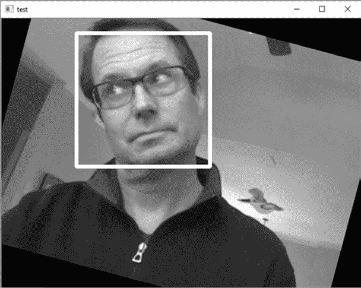

图 9-16：旋转图像有助于面部检测。

Haar 特征法用于面部检测非常受欢迎，因为它足够快速，可以在有限的计算资源下实时运行。然而，正如你可能猜到的那样，仍然有更准确、复杂且资源密集型的技术可用。

例如，OpenCV 提供了一个基于 Caffe 深度学习框架的准确且强大的面部检测器。欲了解更多有关此检测器的信息，请参见教程“使用 OpenCV 和深度学习进行面部检测”，访问 *[`www.pyimagesearch.com/`](https://www.pyimagesearch.com/)*。

另一种选择是使用 OpenCV 的 LBP 级联分类器进行人脸检测。这种技术将人脸划分为多个块，并从中提取局部二值模式直方图（LBPH）。这种直方图在检测*无约束*的人脸（即未对齐且姿势各异的面孔）时非常有效。我们将在下一章中详细讨论 LBPH，重点介绍*人脸识别*，而不仅仅是人脸检测。

### **总结**

在这一章中，你使用了 OpenCV 的 Haar 级联分类器来检测人脸；使用了 playsound 库来播放音频文件；还使用了 pyttsx3 库来进行文本转语音。得益于这些有用的库，你能够快速编写一个不仅能检测人脸，还能发出语音警告和指令的程序。

### **进一步阅读**

“使用提升级级联简单特征的快速物体检测”（计算机视觉与模式识别会议，2001 年），由 Paul Viola 和 Michael Jones 提出，是第一个提供实用实时物体检测率的物体检测框架。它构成了本章用于人脸检测的基础。

Adrian Rosebrock 的*[`www.pyimagesearch.com/`](https://www.pyimagesearch.com/)* 网站是构建图像搜索引擎和寻找大量有趣计算机视觉项目的绝佳资源，比如能够检测火灾和烟雾、在无人机视频流中寻找目标、区分真人面孔和打印的面孔、自动识别车牌等等。

### **实践项目：模糊面孔**

你是否曾经看到过某个纪录片或新闻报道，其中一个人的面部被模糊处理以保护其匿名性，就像在图 9-17 中看到的那样？嗯，这个酷炫的效果通过 OpenCV 很容易实现。你只需要从一帧图像中提取出人脸矩形框，对其进行模糊处理，然后再将其写回到原图中，并可以选择在面部周围绘制一个矩形框。

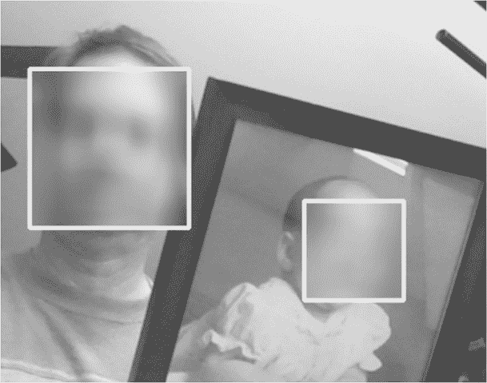

图 9-17：使用 OpenCV 进行面部模糊的示例

模糊操作是通过在一个称为*核*的局部矩阵内对像素进行平均来实现的。可以将核想象成一个你放置在图像上的框。框内的所有像素都会被平均成一个值。框越大，平均的像素越多，因此图像看起来越平滑。因此，可以将模糊视为一种低通滤波器，它会阻挡高频内容，如锐利的边缘。

模糊是这个过程中的唯一一个你之前没有做过的步骤。要模糊图像，可以使用 OpenCV 的 blur()方法，并传入图像和一个表示像素大小的元组。

```py
blurred_image = cv.blur(image, (20, 20))
```

在这个示例中，你将图像中给定像素的值替换为以该像素为中心的 20×20 正方形区域内所有像素的平均值。这个操作会对图像中的每个像素重复执行。

你可以在附录中和从书籍网站下载的*Chapter_9*文件夹中找到解决方案，名为*practice_blur.py*。

### **挑战项目：检测猫脸**

结果发现，LV-666 星球上有三种动物生命形态：人类、变种人和猫。基地的吉祥物，小猫先生，拥有自由出入的权限，并且经常会在走廊 5 中闲逛。

编辑并校准*sentry.py*，使得小猫先生可以自由通行。这将是一个挑战，因为猫并不以听从口头命令而闻名。为了至少让它看向摄像头，你可以在 pyttsx3 的语音命令中添加“Here kitty, kitty”或“Puss, puss, puss”。或者更好，使用 playsound 添加开罐头的声音！

你可以在与项目 13 中使用的分类器相同的 OpenCV 文件夹中找到用于猫脸的 Haar 分类器，并且在书籍可下载的*Chapter_9*文件夹中可以找到一张空的走廊图片，*empty_corridor.png*。从互联网上或你个人的收藏中选择几张猫的图片，并将它们粘贴在空走廊的不同地方。使用其他图片中的人类来估计猫的适当比例。
