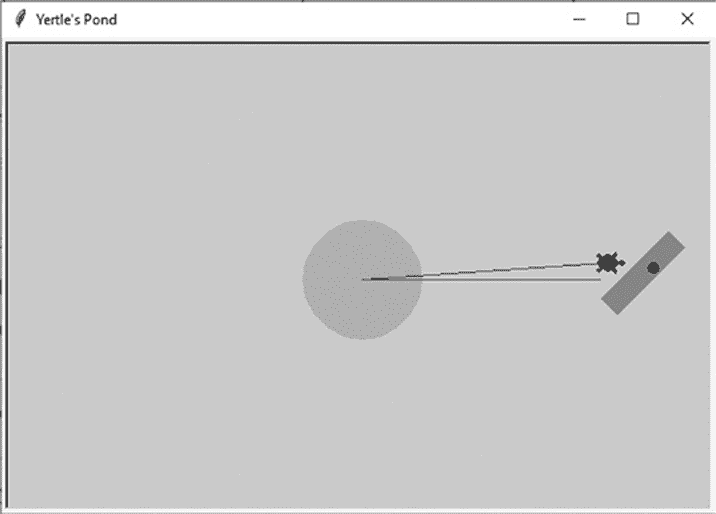
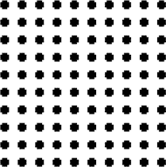
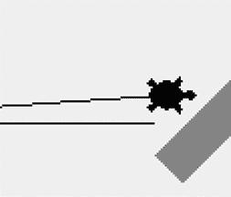
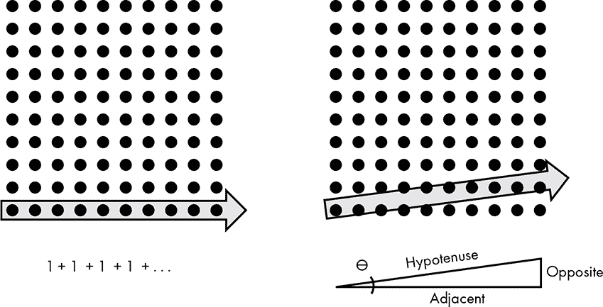
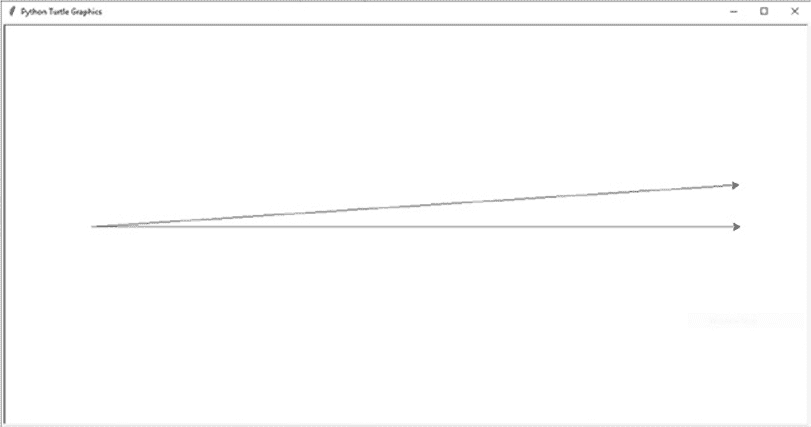

## 第十二章：我们是否生活在计算机模拟中？


2003 年，哲学家尼克·博斯特罗姆假设我们生活在由我们先进的、可能是后人类的后代运行的计算机模拟中。如今，包括尼尔·德格拉斯·泰森和埃隆·马斯克在内的许多科学家和思想家认为，*模拟假设*可能是真的。这确实解释了为什么数学如此优雅地描述了自然，为什么观察者似乎能影响量子事件，为什么我们看起来在宇宙中是孤独的。

更奇怪的是，*你* 可能是这个模拟中唯一真实的存在。也许你只是一个浸泡在历史模拟中的大脑。为了计算效率，模拟可能只呈现出你当前互动的那些事物。当你进入屋里并关上门时，外面的世界可能就像冰箱灯一样关闭。你如何才能知道这究竟是怎么回事呢？

科学家们严肃看待这个假设，进行辩论并发表论文讨论如何设计测试来证明它。在这一章中，你将尝试使用物理学家提出的方法来回答这个问题：你将构建一个简单的模拟世界，然后分析其中的线索，看看是否有任何迹象能揭示这是一个模拟。通过这样做，你将以反向的方式完成这个项目，即先编写代码，再制定解决问题的策略。你会发现，即使是最简单的模型，也能提供关于我们存在本质的深刻洞察。

### **项目 #16：生命、宇宙与 Yertle 的池塘**

模拟现实的能力并非遥不可及的梦想。物理学家们已经使用世界上最强大的超级计算机完成了这一壮举，模拟了亚原子粒子的行为，规模达到几飞米（10^(-15) 米）。尽管这项模拟仅代表宇宙的一小部分，但它与我们所理解的现实无法区分。

但别担心，你不需要超级计算机或物理学学位来解决这个问题。你只需要使用 turtle 模块，这是一个为孩子设计的绘图程序。你在第六章中使用过 turtle 来模拟阿波罗 8 号任务。在这里，你将利用它来理解计算机模型的一个基本特征。然后，你将应用这些知识来制定物理学家计划用于模拟假设的相同基本策略。

目标

确定计算机模拟中的一个特征，可能会被被模拟者发现。

#### ***池塘模拟代码***

*pond_sim.py* 代码创建了一个基于海龟图形的池塘模拟，其中包括一个泥岛、一个漂浮的木头和一只名叫 Yertle 的 snapping turtle（咬龟）。Yertle 会游到木头那里，游回来，然后再游出去。你可以从本书的网站下载该代码，网址为 *[`nostarch.com/real-world-python/`](https://nostarch.com/real-world-python/)*。

turtle 模块随 Python 一起提供，因此你不需要安装任何东西。有关该模块的概述，请参见第 127 页的《使用 turtle 模块》。

##### **导入 turtle，设置屏幕并绘制岛屿**

示例 12-1 导入 turtle，设置一个屏幕对象作为池塘，并为 Yertle 绘制一个泥岛，让他巡视自己的领地。

```py
pond_sim.py, part 1
import turtle

pond = turtle.Screen()
pond.setup(600, 400)
pond.bgcolor('light blue')
pond.title("Yertle's Pond")

mud = turtle.Turtle('circle')
mud.shapesize(stretch_wid=5, stretch_len=5, outline=None)
mud.pencolor('tan')
mud.fillcolor('tan')
```

示例 12-1：导入 turtle 模块并绘制池塘和泥岛

导入 turtle 模块后，将一个屏幕对象赋值给名为 pond 的变量。使用 turtle 的 setup()方法设置屏幕的大小（以像素为单位），然后将背景颜色设置为浅蓝色。你可以在多个网站上找到海龟颜色及其名称的表格，例如 *[`trinket.io/docs/colors`](https://trinket.io/docs/colors)*。通过为屏幕提供标题来完成 pond 的设置。

接下来，绘制一个圆形的泥岛，让 Yertle 在上面晒太阳。使用 Turtle()类实例化一个名为 mud 的海龟对象。尽管 turtle 有一个绘制圆形的自带方法，但在这里通过直接传递'circle'参数给构造函数更简单，它会生成一个圆形的海龟对象。然而，这个圆形的形状太小，无法成为一个真正的岛屿，因此使用 shapesize()方法将其拉伸。最后，将岛屿的轮廓和填充颜色设置为淡棕色。

##### **绘制原木、节疤和 Yertle**

示例 12-2 通过绘制原木（包括节疤）和海龟 Yertle 来完成程序。然后，它移动 Yertle，使他可以离开他的岛屿去查看原木。

```py
pond_sim.py, part 2
   SIDE = 80
   ANGLE = 90
   log = turtle.Turtle()
   log.hideturtle()
   log.pencolor('peru')
   log.fillcolor('peru')
   log.speed(0)
➊ log.penup()
   log.setpos(215, -30)
   log.lt(45)
   log.begin_fill()
➋ for _ in range(2):
       log.fd(SIDE)
       log.lt(ANGLE)
       log.fd(SIDE / 4)
       log.lt(ANGLE)
   log.end_fill()

   knot = turtle.Turtle()
   knot.hideturtle()
   knot.speed(0)
   knot.penup()
   knot.setpos(245, 5)
   knot.begin_fill()
   knot.circle(5)
   knot.end_fill()

   yertle = turtle.Turtle('turtle')
   yertle.color('green')
   yertle.speed(1)  # Slowest.
   yertle.fd(200)
   yertle.lt(180)
   yertle.fd(200)
➌ yertle.rt(176)
   yertle.fd(200)
```

示例 12-2：绘制原木和海龟，然后让海龟四处移动

你将绘制一个矩形来表示原木，所以首先定义两个常量：SIDE 和 ANGLE。第一个表示原木的长度（以像素为单位）；第二个是你将在矩形的每个角落让海龟转动的角度（以度为单位）。

默认情况下，所有海龟最初会出现在屏幕中央，坐标为(0, 0)。由于你会将原木放到一边，因此在实例化原木对象后，使用`hideturtle()`方法使其不可见。这样，你就不必看着它在屏幕上飞奔到达最终位置。

将原木涂成棕色，使用 peru 作为原木的颜色。然后将对象的速度设置为最快（奇怪的是，速度为 0）。这样，你就不必看着它慢慢地在屏幕上绘制。而且，为了避免看到它从屏幕中心到边缘的路径，使用 penup()方法抬起画笔 ➊。

使用 setpos()方法——用于*设置位置*——将原木放置在屏幕的右边缘附近。然后将对象向左旋转 45 度，并调用 begin_fill()方法。

你可以通过使用 for 循环 ➋来绘制矩形，从而节省一些代码行数。你将循环两次，每次绘制矩形的两条边。将原木的宽度设置为 20 像素，即将 SIDE 除以 4。循环结束后，调用 end_fill()方法将原木填充为棕色。

通过添加一个树节孔（由一个树节乌龟表示）给木桩增添一些特色。要画出树节孔，调用 circle()方法并传入 5，表示半径为五个像素。注意，你不需要指定填充颜色，因为默认就是黑色。

最后，通过画出耶尔特尔，所有他所观察的事物的国王，来结束程序。耶尔特尔是一只老乌龟，所以把他的绘图速度设置为最慢的 1。让他游出去检查木桩，然后转身游回来。耶尔特尔有点健忘，他忘记了自己刚才做的事情。所以，让他再游出去——不过这次，改变他的游动方向，使他不再朝正东游去 ➌。运行程序，你应该看到图 12-1 中所示的结果。

仔细看看这个图形。尽管这个模拟很简单，但它包含了关于我们是否像耶尔特尔一样，生活在一个计算机模拟中的强大洞察。



图 12-1：已完成模拟的截图

#### ***池塘模拟的含义***

由于计算资源有限，所有计算机模拟都需要某种框架来“悬挂”其现实模型。无论它被称为网格、晶格、网状结构、矩阵或其他什么，它提供了一种方法，可以在二维或三维空间中分布物体，并赋予它们某些属性，比如质量、温度、颜色或其他东西。

乌龟模块使用你显示器中的像素作为其坐标系统，同时用于存储属性。像素位置定义了形状，例如木桩的轮廓，像素的颜色属性帮助区分不同的形状。

像素形成了一个*正交*图案，意味着像素的行和列在直角处交叉。尽管单个像素是方形的，且太小无法轻易看见，但你可以使用乌龟模块的 dot()方法生成一个类似的图案，如下代码片段所示：

```py
>>> import turtle
>>> 
>>> t = turtle.Turtle()
>>> t.hideturtle()
>>> t.penup()
>>> 
>>> def dotfunc(x, y):
       t.setpos(x, y)
       for _ in range(10):
              t.dot()
              t.fd(10)

>>> for i in range(0, 100, 10):
       dotfunc(0, -i)
```

这会生成图 12-2 中的图案。



图 12-2：代表方形像素中心的正交网格的黑色点

在乌龟世界中，像素是真正的原子：不可分割。一条线不能比一个像素短。移动只能按像素的整数进行（虽然你可以输入浮动值而不报错）。最小的物体就是一个像素大小。

这意味着，模拟中的网格决定了你能观察到的最小特征。由于我们能够观察到极其微小的亚原子粒子，假设我们是一个模拟，那么我们的网格必须非常细密。这让许多科学家严肃怀疑模拟假设，因为这将需要惊人的计算机内存。然而，谁知道我们的远方后代，或外星人，能做什么呢？

除了限制物体的大小外，仿真网格可能会在宇宙的结构上强制施加一个优先方向，或称为*各向异性*。各向异性是指材料的方向性依赖性，比如木材沿着木纹方向比横向更容易劈开。如果你仔细观察在海龟仿真中 Yertle 的路径（图 12-3），你会看到各向异性的证据。他的上方路径略微倾斜并且呈之字形，而下方的东西向路径则完全是直线。



图 12-3：角度路径与直线路径

在正交网格上绘制非正交线并不美观。但这不仅仅是审美问题。沿* x *或* y *方向移动仅需要整数的加法或减法（图 12-4，左）。而沿角度移动则需要三角学来计算* x *和* y *方向的分量运动（图 12-4，右）。

对于计算机来说，数学运算等同于工作，因此我们可以推测，在一个角度上移动需要更多的能量。通过在图 12-4 中计时这两种计算方式，我们可以得到能量差异的相对衡量。



图 12-4：沿行或列的移动（左）需要比跨越行列（右）更简单的算术运算

#### ***测量穿越网格的代价***

要计算沿对角线绘制线条与沿水平线绘制线条之间的时间差，你需要绘制两条等长的线。但是记住，海龟只能处理整数。你需要找到一个角度，使得三角形的所有边——图 12-4 中的对边、邻边和斜边——都是整数。这样，你就可以确保你的斜线与直线长度相同。

要找到这些角度，你可以使用*毕达哥拉斯三元组*，这是由一组符合直角三角形规则的正整数*a*、*b*和*c*组成的集合，其中*a*² + *b*² = *c*²。最著名的三元组是 3-4-5，但你会希望找到一条更长的线，以确保绘制函数的运行时间不会低于计算机时钟的测量精度。幸运的是，你可以在网上找到其他更大的三元组。62-960-962 这个三元组是一个不错的选择，因为它很长，但仍然适合海龟屏幕。

##### **线条比较代码**

为了比较绘制对角线与绘制直线的代价，列表 12-3 使用海龟绘制这两条线。第一条线平行于* x *轴（即东西方向），第二条线则以浅角度与* x *轴成角。你可以通过三角学计算出这个角度的正确度数；在这种情况下，它是 3.695220532 度。该代码通过 for 循环多次绘制这些线，并使用内置的时间模块记录绘制每条线所需的时间。最终的比较是通过这些运行的平均值得出的。

你需要使用平均值，因为中央处理单元（CPU）不断运行多个进程。操作系统在后台调度这些进程，执行一个进程并推迟另一个，直到某个资源（例如输入/输出）变得可用。因此，记录一个给定函数的 *绝对* 运行时间是困难的。计算多次运行的平均时间可以弥补这一点。

你可以从书籍的网站下载代码，*line_compare.py*。

```py
line_compare.py
from time import perf_counter
import statistics
import turtle

turtle.setup(1200, 600)
screen = turtle.Screen()

ANGLES = (0, 3.695220532)  # In degrees.
NUM_RUNS = 20
SPEED = 0
for angle in ANGLES:
 ➊ times = []
    for _ in range(NUM_RUNS):
        line = turtle.Turtle()
        line.speed(SPEED)  
        line.hideturtle()
        line.penup()
        line.lt(angle)
        line.setpos(-470, 0)
        line.pendown()
        line.showturtle()
     ➋ start_time = perf_counter()
        line.fd(962)
        end_time = perf_counter()
        times.append(end_time - start_time)

    line_ave = statistics.mean(times)
    print("Angle {} degrees: average time for {} runs at speed {} = {:.5f}"
          .format(angle, NUM_RUNS, SPEED, line_ave))
```

清单 12-3：绘制直线和角度线并记录每条线的运行时间

从 time 模块中导入 perf_counter——即 *性能计数器*——开始。此函数返回秒为单位的浮动时间值。它比 time.clock() 更精确，而后者从 Python 3.8 起已被淘汰。

接下来，导入 statistics 模块来帮助你计算多次模拟运行的平均值。然后导入 turtle 并设置 turtle 屏幕。你可以根据自己的显示器自定义屏幕，但记住，你需要能够看到一条 962 像素长的线。

现在，为模拟指定一些关键值。将直线和对角线的角度放入一个名为 ANGLES 的元组中，然后为循环运行次数和绘制线条的速度分配一个变量。

开始循环遍历 ANGLES 元组中的角度。创建一个空列表来存储时间测量值 ➊，然后像之前一样设置海龟对象。将海龟对象左转指定的角度，然后使用 setpos() 将其移动到屏幕的最左侧。

让海龟前进 962 像素，将此命令夹在两次 perf_counter() 调用之间，以便计时 ➋。用结束时间减去开始时间，并将结果附加到 times 列表中。

最后，使用 statistics.mean() 函数来计算每条线的平均运行时间。将结果打印到小数点后五位。程序运行后，海龟屏幕应显示如图 12-5 所示。



图 12-5：完成的 turtle 屏幕，来自 line_compare.py

由于你使用了毕达哥拉斯三元组，角度线确实会在一个像素上结束，而不是简单地跳到最近的像素。因此，你可以确信直线和角度线的长度相同，并且在计时测量时，你是在进行真正的比较。

#### ***结果***

如果你绘制每条线 500 次并比较结果，你应该会看到绘制角度线所需的时间大约是绘制直线的 2.4 倍。

```py
Angle 0 degrees: average time for 500 runs at speed 0 = 0.06492
Angle 3.695220532 degrees: average time for 500 runs at speed 0 = 0.15691
```

你的时间可能会略有不同，因为它们会受到你计算机上可能同时运行的其他程序的影响。正如之前提到的，CPU 调度将管理所有这些进程，以确保你的系统快速、高效且公平。

如果你重复进行 1000 次实验，你应该会得到类似的结果。（如果你决定这么做，你可能需要泡一杯咖啡，来点好吃的派。）这条角度线的绘制时间大约是正常速度的 2.7 倍。

```py
Angle 0 degrees: average time for 1000 runs at speed 0 = 0.10911
Angle 3.695220532 degrees: average time for 1000 runs at speed 0 = 0.29681
```

你正在以高速运行一个简单的函数。如果你担心海龟（turtle）为了提高速度而牺牲精度，你可以减慢速度并重新运行程序。当绘制速度设置为正常（speed = 6）时，角度线的绘制时间大约是最快速度的 2.6 倍，接近最快速度的结果。

```py
Angle 0 degrees: average time for 500 runs at speed 6 = 1.12522
Angle 3.695220532 degrees: average time for 500 runs at speed 6 = 2.90180
```

很明显，穿越像素网格比沿着网格移动需要更多的工作。

#### ***策略***

本项目的目标是寻找一种方法，让模拟的存在，也许是我们自己，能够找到模拟的证据。到目前为止，我们至少知道两件事。首先，如果我们生活在一个模拟中，那么网格非常小，因为我们能够观察到亚原子粒子。其次，如果这些小粒子以某个角度穿过模拟的网格，我们应该能发现计算上的阻力，这种阻力可以转化为某种可测量的现象。这个阻力可能表现为能量损失、粒子散射、速度减缓或类似的情况。

2012 年，来自波恩大学的物理学家西拉斯·R·比恩（Silas R. Beane）和来自华盛顿大学的佐赫雷·达沃迪（Zohreh Davoudi）及马丁·J·萨维奇（Martin J. Savage）发表了一篇论文，正是论证了这一点。根据作者的观点，如果看似连续的物理定律被叠加到一个离散的网格上，那么网格的间距可能会对物理过程产生限制。

他们提议通过观察*超高能宇宙射线（UHECRs）*来进行调查。UHECRs 是宇宙中最快的粒子，随着它们能量的增加，它们会受到越来越小的特征影响。但这些粒子能量有一个限制。这个限制被称为 GZK 截断，并且在 2007 年的实验中得到了证实，这个限制与模拟网格可能产生的边界一致。这样的边界也应该导致 UHECRs 沿网格轴线优先移动，并散射试图穿越网格的粒子。

毫不奇怪，这种方法存在许多潜在的障碍。极高能宇宙射线（UHECRs）非常稀有，而且异常行为可能不易察觉。如果网格的间距小于 10^(-12)飞米，我们可能无法检测到它。甚至可能根本*没有*网格，至少就我们理解的方式而言，因为使用的技术可能远远超出我们的认知。而且，正如哲学家普雷斯顿·格林（Preston Greene）在 2019 年所指出的，整个项目可能会面临道德上的障碍。如果我们生活在一个模拟中，我们发现它的存在可能会触发模拟的终结！

### **总结**

从编码的角度来看，构建耶特尔的模拟世界其实很简单。但编码的一个重要部分是解决问题，你所做的少量工作却产生了重大影响。我们没有跨越到宇宙射线，但我们启动了正确的对话。计算机模拟需要一个网格来在宇宙中留下可观察的痕迹这一基本前提，超越了琐碎的细节。

在《哈利·波特与死亡圣器》一书中，哈利问巫师邓布利多：“告诉我最后一件事。这是真的吗？还是这只是发生在我的脑海里？”邓布利多回答：“当然，它发生在你的脑袋里，哈利，但为什么这就意味着它不真实呢？”

即便我们的世界不像尼克·博斯特罗姆所假设的那样位于“现实的基本层面”，你仍然可以从解决此类问题的能力中获得乐趣。正如笛卡尔如果今天活着可能会说的：“我编码，因此我存在。”继续前进！

### **进一步阅读**

“我们生活在一个模拟的宇宙中吗？科学家怎么说”（NBC 新闻，2019），作者：丹·福克，文章概述了模拟假说。

“尼尔·德格拉斯·泰森表示‘宇宙很可能是一个模拟’”（ExtremeTech, 2016），作者：格雷厄姆·坦普尔顿，文章中嵌入了由天体物理学家尼尔·德格拉斯·泰森主持的艾萨克·阿西莫夫纪念辩论会的视频，探讨了我们是否生活在模拟中的可能性。

“我们生活在计算机模拟中吗？我们不必揭晓真相”（*纽约时报*，2019），作者：普雷斯顿·格林，文章提出了反对研究模拟假说的哲学论点。

“我们并没有生活在一个模拟中。可能是吧。”（Fast Company, 2018），作者：格伦·麦克唐纳，文章论证了宇宙太庞大且细节太复杂，无法通过计算机进行模拟。

### **继续前进**

生活中永远没有足够的时间去做我们想做的所有事情，而写书更是如此。接下来的挑战项目代表了那些尚未写就的章节的幽灵。没有时间完成这些（或者在某些情况下，甚至没有时间开始），但也许你会有更好的运气。和往常一样，本书并没有为挑战项目提供解决方案——毕竟，你可能不需要它们。

这是现实世界，宝贝，你已经准备好迎接它了。

### **挑战项目：寻找一个安全空间**

这部获得奖项的 1970 年小说《环世界》向世人介绍了皮尔森的操纵者，一种有感知能力且高度进化的外星草食性生物。作为群居动物，操纵者极其胆小和谨慎。当它们意识到银河系的核心已经爆炸，辐射将在 20,000 年后到达它们时，它们立即开始逃离银河！

在这个项目中，你是 29 世纪外交团队的一员，负责木偶大使的任务。你的工作是选择美国大陆内的一个州，该州对木偶大使馆来说足够安全。你需要筛查每个州的自然灾害，如地震、火山、龙卷风和飓风，并为大使呈现一张总结结果的地图。不要担心你将使用的数据已经过时数百年；只需假装它是 2850 年当前的数据。

你可以在* [`earthquake.usgs.gov/earthquakes/feed/v1.0/csv.php/`](https://earthquake.usgs.gov/earthquakes/feed/v1.0/csv.php/)* 查找地震数据。使用点来绘制 6.0 或更大规模地震的震中位置。

你可以按每年每个州的平均龙卷风数量发布龙卷风数据（参见 *[`www.ncdc.noaa.gov/climate-information/extreme-events/us-tornado-climatology`](https://www.ncdc.noaa.gov/climate-information/extreme-events/us-tornado-climatology)*）。使用像在第十一章中一样的色块格式。

你可以在 2018 年更新的美国地质调查局《国家火山威胁评估》（* [`pubs.usgs.gov/sir/2018/5140/sir20185140.pdf`](https://pubs.usgs.gov/sir/2018/5140/sir20185140.pdf)*）的表 2 中找到危险火山的列表。将这些火山表示为地图上的点，但赋予它们不同于地震数据的颜色或形状。此外，忽略黄石的火山灰降落。假设监控这个超级火山的专家可以预测到火山爆发，足够让大使安全逃离地球。

要查找飓风路径，访问国家海洋和大气管理局网站（* [`coast.noaa.gov/digitalcoast/data/`](https://coast.noaa.gov/digitalcoast/data/)*）并搜索“历史飓风路径”。下载并在地图上标出 4 级及以上的风暴段。

尝试像木偶师一样思考，并使用最终的合成地图来选择一个适合使馆的候选州。你可能需要忽略一两个龙卷风。美国是一个危险的地方！

### **挑战项目：太阳来了**

2018 年，来自加利福尼亚州伍德赛德的 13 岁少女乔治亚·哈钦森在布罗德康姆大师全国科学、技术、工程和数学（STEM）竞赛中赢得了 25,000 美元。她的项目“设计一个数据驱动的双轴太阳能跟踪器”将通过消除昂贵的光传感器，使太阳能电池板更便宜、更高效。

这个新的太阳跟踪器基于这样一个前提：我们已经知道地球上任意一个点在任何时刻的太阳位置。它利用来自国家海洋和大气管理局的公共数据，持续确定太阳的位置，并调节太阳能电池板的角度以实现最大功率输出。

写一个 Python 程序，计算出基于你选择的位置的太阳位置。要开始，可以查看维基百科页面“太阳的位置” (*[`en.wikipedia.org/wiki/Position_of_the_Sun`](https://en.wikipedia.org/wiki/Position_of_the_Sun)*）。

### **挑战项目：透过狗的眼睛看世界**

运用你对计算机视觉的了解，编写一个 Python 程序，输入一张图片，模拟狗狗会看到的图像。要开始，可以查看 *[`www.akc.org/expert-advice/health/are-dogs-color-blind/`](https://www.akc.org/expert-advice/health/are-dogs-color-blind/)* 和 *[`dog-vision.andraspeter.com/`](https://dog-vision.andraspeter.com/)*。

### **挑战项目：定制化单词搜索**

哇，奶奶超爱做单词搜索！为了她的生日，使用 Python 设计并打印定制化的单词搜索，包含家庭成员的名字、经典的电视节目比如 *Matlock* 和 *Columbo*，或她常用药物的名字。让这些单词横向、纵向以及对角线方式打印出来。

### **挑战项目：简化庆祝晚宴幻灯片**

你的配偶、兄弟姐妹、父母、最好的朋友，或是其他某个庆祝晚宴的主办方，而你负责制作幻灯片。你有很多云端的照片，其中许多照片都是主角的，但文件名仅列出了拍摄的日期和时间，完全无法看出照片的内容。看起来你将花费整个星期六翻找这些照片。

等等，难道你不是在《*Real-World Python*》这本书中学过人脸识别吗？其实你只需要找到一些训练图像，做点儿编程就行了。

首先，从你个人的数字照片库中挑选一个人作为主角。接下来，编写一个 Python 程序，搜索你的文件夹，找到包含此人的照片，并将这些照片复制到一个专门的文件夹中以供查看。在训练时，确保包括侧面和正面视图，并且在人脸检测时加入侧面 Haar cascade。

### **挑战项目：我们编织的复杂网络**

使用 Python 和 turtle 模块模拟蜘蛛织网。要了解一些织网的指导，可以参考 *[`www.brisbaneinsects.com/brisbane_weavers/index.htm`](https://www.brisbaneinsects.com/brisbane_weavers/index.htm)* 和 *[`recursiveprocess.com/mathprojects/index.php/2015/06/09/spider-webs-creepy-or-cool/`](http://recursiveprocess.com/mathprojects/index.php/2015/06/09/spider-webs-creepy-or-cool/)*。

### **挑战项目：山顶上的故事**

“休斯顿，德克萨斯州，最近的山是哪座？”这个看似简单的问题，在 Quora 上被提问，却并不容易回答。一方面，你需要考虑墨西哥的山脉，还有美国的山脉。另一方面，山脉的定义并没有一个全球公认的标准。

为了让这稍微容易一些，可以使用联合国环境规划署对*山区地形*的定义。找到海拔至少为 2,500 米（8,200 英尺）的高地，并将其视为山脉。计算它们到休斯顿市中心的距离，以找到最近的山脉。
