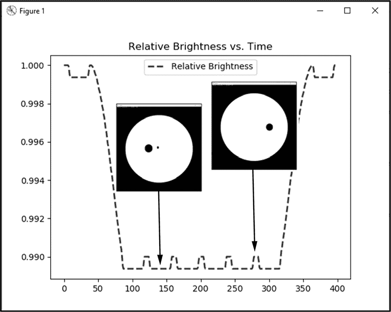

## 第十四章：**附录**

实践项目解决方案**


本附录包含每章实践项目的解决方案。数字版本可以在本书网站上获取，网址为 *[`nostarch.com/real-world-python/`](https://nostarch.com/real-world-python/)*。

### 第二章：使用风格学归属作者**

#### ***使用色散追踪猎犬***

```py
practice_hound_dispersion.py
"""Use NLP (nltk) to make dispersion plot."""
import nltk
import file_loader

corpus = file_loader.text_to_string('hound.txt')
tokens = nltk.word_tokenize(corpus)
tokens = nltk.Text(tokens)  # NLTK wrapper for automatic text analysis.
dispersion = tokens.dispersion_plot(['Holmes',
                                     'Watson',
                                     'Mortimer',
                                     'Henry',
                                     'Barrymore', 
                                     'Stapleton',
                                     'Selden',
                                     'hound'])
```

#### ***标点热图***

```py
practice_heatmap_semicolon.py
"""Make a heatmap of punctuation."""
import math
from string import punctuation
import nltk
import numpy as np
import matplotlib.pyplot as plt
from matplotlib.colors import ListedColormap
import seaborn as sns

# Install seaborn using: pip install seaborn.

PUNCT_SET = set(punctuation)

def main():  
    # Load text files into dictionary by author.
    strings_by_author = dict()
    strings_by_author['doyle'] = text_to_string('hound.txt')
    strings_by_author['wells'] = text_to_string('war.txt')
    strings_by_author['unknown'] = text_to_string('lost.txt')

    # Tokenize text strings preserving only punctuation marks.
    punct_by_author = make_punct_dict(strings_by_author)

    # Convert punctuation marks to numerical values and plot heatmaps.
    plt.ion()
    for author in punct_by_author:
        heat = convert_punct_to_number(punct_by_author, author)
        arr = np.array((heat[:6561])) # trim to largest size for square array
        arr_reshaped = arr.reshape(int(math.sqrt(len(arr))),
                                   int(math.sqrt(len(arr))))
        fig, ax = plt.subplots(figsize=(7, 7))
        sns.heatmap(arr_reshaped,
                    cmap=ListedColormap(['blue', 'yellow']),
                    square=True,
                    ax=ax)
        ax.set_title('Heatmap Semicolons {}'.format(author))
    plt.show()    

def text_to_string(filename):
    """Read a text file and return a string."""
    with open(filename) as infile:
        return infile.read()

def make_punct_dict(strings_by_author):
    """Return dictionary of tokenized punctuation by corpus by author."""
    punct_by_author = dict()
    for author in strings_by_author:
        tokens = nltk.word_tokenize(strings_by_author[author])
        punct_by_author[author] = ([token for token in tokens
                                    if token in PUNCT_SET])
        print("Number punctuation marks in {} = {}"
              .format(author, len(punct_by_author[author])))
    return punct_by_author  

def convert_punct_to_number(punct_by_author, author):
    """Return list of punctuation marks converted to numerical values."""
    heat_vals = []
    for char in punct_by_author[author]:
        if char == ';':
            value = 1
        else:
            value = 2
        heat_vals.append(value)
    return heat_vals

if __name__ == '__main__':
    main()
```

### 第四章：使用书籍密码发送超级机密消息**

#### ***绘制字符图***

```py
practice_barchart.py
"""Plot barchart of characters in text file."""
import sys
import os
import operator
from collections import Counter
import matplotlib.pyplot as plt

def load_file(infile):
    """Read and return text file as string of lowercase characters."""
    with open(infile) as f:
        text = f.read().lower()
    return text
def main():
    infile = 'lost.txt'
    if not os.path.exists(infile):
        print("File {} not found. Terminating.".format(infile),
              file=sys.stderr)
        sys.exit(1)

    text = load_file(infile)

    # Make bar chart of characters in text and their frequency.
    char_freq = Counter(text)
    char_freq_sorted = sorted(char_freq.items(),
                              key=operator.itemgetter(1), reverse=True)
    x, y = zip(*char_freq_sorted)  # * unpacks iterable.
    fig, ax = plt.subplots()
    ax.bar(x, y)
    fig.show()

if __name__ == '__main__':
    main()
```

#### ***以二战方式发送秘密***

```py
practice_WWII_words.py
"""Book code using the novel The Lost World

For words not in book, spell-out with first letter of words.
Flag 'first letter mode' by bracketing between alternating
'a a' and 'the the'.

credit: Eric T. Mortenson
"""
import sys
import os
import random
import string
from collections import defaultdict, Counter

def main():
    message = input("Enter plaintext or ciphertext: ") 
    process = input("Enter 'encrypt' or 'decrypt': ")  
    shift = int(input("Shift value (1-365) = "))
    infile = input("Enter filename with extension: ")

    if not os.path.exists(infile):
        print("File {} not found. Terminating.".format(infile), file=sys.stderr)
        sys.exit(1)        
    word_list = load_file(infile)
    word_dict = make_dict(word_list, shift)
    letter_dict = make_letter_dict(word_list)

    if process == 'encrypt':
        ciphertext = encrypt(message, word_dict, letter_dict)          
        count = Counter(ciphertext)        
        encryptedWordList = []
        for number in ciphertext:
            encryptedWordList.append(word_list[number - shift])

        print("\nencrypted word list = \n {} \n"
              .format(' '.join(encryptedWordList)))           
        print("encrypted ciphertext = \n {}\n".format(ciphertext))

        # Check the encryption by decrypting the ciphertext.
        print("decrypted plaintext = ")
        singleFirstCheck = False
        for cnt, i in enumerate(ciphertext):
            if word_list[ciphertext[cnt]-shift] == 'a' and \
               word_list[ciphertext[cnt+1]-shift] == 'a':
                continue
            if word_list[ciphertext[cnt]-shift] == 'a' and \
               word_list[ciphertext[cnt-1]-shift] == 'a':
                singleFirstCheck = True
                continue
            if singleFirstCheck == True and cnt<len(ciphertext)-1 and \
               word_list[ciphertext[cnt]-shift] == 'the' and \
                             word_list[ciphertext[cnt+1]-shift] == 'the':
                continue
            if singleFirstCheck == True and \
               word_list[ciphertext[cnt]-shift] == 'the' and \
                             word_list[ciphertext[cnt-1]-shift] == 'the':
                singleFirstCheck = False
                print(' ', end='', flush=True)
                continue
            if singleFirstCheck == True:
                print(word_list[i - shift][0], end = '', flush=True)
            if singleFirstCheck == False:
                print(word_list[i - shift], end=' ', flush=True)

    elif process == 'decrypt':
        plaintext = decrypt(message, word_list, shift)
        print("\ndecrypted plaintext = \n {}".format(plaintext))

def load_file(infile):
    """Read and return text file as a list of lowercase words."""
    with open(infile, encoding='utf-8') as file:
        words = [word.lower() for line in file for word in line.split()]
        words_no_punct = ["".join(char for char in word if char not in \
                                 string.punctuation) for word in words]
    return words_no_punct

def make_dict(word_list, shift):
    """Return dictionary of characters as keys and shifted indexes as values."""
    word_dict = defaultdict(list)
    for index, word in enumerate(word_list):
        word_dict[word].append(index + shift)
    return word_dict

def make_letter_dict(word_list):
    firstLetterDict = defaultdict(list)
    for word in word_list:
        if len(word) > 0:
            if word[0].isalpha():
                firstLetterDict[word[0]].append(word)
    return firstLetterDict

def encrypt(message, word_dict, letter_dict):
    """Return list of indexes representing characters in a message."""
    encrypted = []
    # remove punctuation from message words
    messageWords = message.lower().split()
    messageWordsNoPunct = ["".join(char for char in word if char not in \
                                 string.punctuation) for word in messageWords]    
    for word in messageWordsNoPunct:
        if len(word_dict[word]) > 1:
            index = random.choice(word_dict[word])
        elif len(word_dict[word]) == 1:  # Random.choice fails if only 1 choice.
            index = word_dict[word][0]
        elif len(word_dict[word]) == 0:  # Word not in word_dict.
            encrypted.append(random.choice(word_dict['a']))
            encrypted.append(random.choice(word_dict['a']))

            for letter in word:
                if letter not in letter_dict.keys():
                    print('\nLetter {} not in letter-to-word dictionary.'
                          .format(letter), file=sys.stderr)
                    continue
                if len(letter_dict[letter])>1:
                    newWord =random.choice(letter_dict[letter])
                else:
                    newWord = letter_dict[letter][0]
                if len(word_dict[newWord])>1:
                    index = random.choice(word_dict[newWord])
                else:
                    index = word_dict[newWord][0]
                encrypted.append(index)

            encrypted.append(random.choice(word_dict['the']))
            encrypted.append(random.choice(word_dict['the']))
            continue
        encrypted.append(index)
    return encrypted

def decrypt(message, word_list, shift):
    """Decrypt ciphertext string and return plaintext word string.
    This shows how plaintext looks before extracting first letters.
    """
    plaintextList = []
    indexes = [s.replace(',', '').replace('[', '').replace(']', '')
               for s in message.split()]
    for count, i in enumerate(indexes):
        plaintextList.append(word_list[int(i) - shift])
    return ' '.join(plaintextList)

def check_for_fail(ciphertext):
    """Return True if ciphertext contains any duplicate keys."""
    check = [k for k, v in Counter(ciphertext).items() if v > 1]
    if len(check) > 0:
        print(check)
        return True

if __name__ == '__main__':
    main()
```

### 第五章：寻找冥王星**

#### ***绘制轨道路径***

```py
practice_orbital_path.py
import os
from pathlib import Path
import cv2 as cv

PAD = 5  # Ignore pixels this distance from edge

def find_transient(image, diff_image, pad):
    """Takes image, difference image, and pad value in pixels and returns
       boolean and location of maxVal in difference image excluding an edge
       rind. Draws circle around maxVal on image."""
    transient = False
    height, width = diff_image.shape
    cv.rectangle(image, (PAD, PAD), (width - PAD, height - PAD), 255, 1)
    minVal, maxVal, minLoc, maxLoc = cv.minMaxLoc(diff_image)
    if pad < maxLoc[0] < width - pad and pad < maxLoc[1] < height - pad:
        cv.circle(image, maxLoc, 10, 255, 0)
        transient = True
    return transient, maxLoc

def main():
    night1_files = sorted(os.listdir('night_1_registered_transients'))
    night2_files = sorted(os.listdir('night_2'))             
    path1 = Path.cwd() / 'night_1_registered_transients'
    path2 = Path.cwd() / 'night_2'
    path3 = Path.cwd() / 'night_1_2_transients'

    # Images should all be the same size and similar exposures.    
    for i, _ in enumerate(night1_files[:-1]):  # Leave off negative image   
        img1 = cv.imread(str(path1 / night1_files[i]), cv.IMREAD_GRAYSCALE)
        img2 = cv.imread(str(path2 / night2_files[i]), cv.IMREAD_GRAYSCALE)
        # Get absolute difference between images.
        diff_imgs1_2 = cv.absdiff(img1, img2)
        cv.imshow('Difference', diff_imgs1_2)
        cv.waitKey(2000)        

        # Copy difference image and find and circle brightest pixel.
        temp = diff_imgs1_2.copy()
        transient1, transient_loc1 = find_transient(img1, temp, PAD)

        # Draw black circle on temporary image to obliterate brightest spot.
        cv.circle(temp, transient_loc1, 10, 0, -1)

        # Get location of new brightest pixel and circle it on input image.        
        transient2, transient_loc2 = find_transient(img1, temp, PAD)

        if transient1 or transient2:
            print('\nTRANSIENT DETECTED between {} and {}\n'
                  .format(night1_files[i], night2_files[i]))
            font = cv.FONT_HERSHEY_COMPLEX_SMALL
            cv.putText(img1, night1_files[i], (10, 25),
                       font, 1, (255, 255, 255), 1, cv.LINE_AA)
            cv.putText(img1, night2_files[i], (10, 55),
                       font, 1, (255, 255, 255), 1, cv.LINE_AA)
            if transient1 and transient2:
                cv.line(img1, transient_loc1, transient_loc2, (255, 255, 255),
                        1, lineType=cv.LINE_AA)

            blended = cv.addWeighted(img1, 1, diff_imgs1_2, 1, 0)
            cv.imshow('Surveyed', blended)
            cv.waitKey(2500)  # Keeps window open 2.5 seconds.
            out_filename = '{}_DECTECTED.png'.format(night1_files[i][:-4])
            cv.imwrite(str(path3 / out_filename), blended)  # Will overwrite!
        else:
            print('\nNo transient detected between {} and {}\n'
                  .format(night1_files[i], night2_files[i]))

if __name__ == '__main__':
    main()
```

#### ***有什么不同？***

本实践项目使用两个程序，*practice_montage_aligner.py* 和 *practice_montage_difference_finder.py*，程序应按顺序运行。

##### **practice_montage_aligner.py**

```py
practice_montage_aligner.py
import numpy as np
import cv2 as cv

MIN_NUM_KEYPOINT_MATCHES = 150

img1 = cv.imread('montage_left.JPG', cv.IMREAD_COLOR)  # queryImage
img2 = cv.imread('montage_right.JPG', cv.IMREAD_COLOR) # trainImage
img1 = cv.cvtColor(img1, cv.COLOR_BGR2GRAY)  # Convert to grayscale.
img2 = cv.cvtColor(img2, cv.COLOR_BGR2GRAY)

orb = cv.ORB_create(nfeatures=700) 

# Find the keypoints and descriptions with ORB.
kp1, desc1 = orb.detectAndCompute(img1, None)
kp2, desc2 = orb.detectAndCompute(img2, None)

# Find keypoint matches using Brute Force Matcher.
bf = cv.BFMatcher(cv.NORM_HAMMING, crossCheck=True)
matches = bf.match(desc1, desc2, None)

# Sort matches in ascending order of distance.
matches = sorted(matches, key=lambda x: x.distance)

# Draw best matches.
img3 = cv.drawMatches(img1, kp1, img2, kp2, 
                       matches[:MIN_NUM_KEYPOINT_MATCHES],
                       None)

cv.namedWindow('Matches', cv.WINDOW_NORMAL)
img3_resize = cv.resize(img3, (699, 700))
cv.imshow('Matches', img3_resize)
cv.waitKey(7000)  # Keeps window open 7 seconds.
cv.destroyWindow('Matches')

# Keep only best matches.
best_matches = matches[:MIN_NUM_KEYPOINT_MATCHES]

if len(best_matches) >= MIN_NUM_KEYPOINT_MATCHES:
    src_pts = np.zeros((len(best_matches), 2), dtype=np.float32)
    dst_pts = np.zeros((len(best_matches), 2), dtype=np.float32)

    for i, match in enumerate(best_matches):
        src_pts[i, :] = kp1[match.queryIdx].pt
        dst_pts[i, :] = kp2[match.trainIdx].pt

    M, mask = cv.findHomography(src_pts, dst_pts, cv.RANSAC)

    # Get dimensions of image 2.
    height, width = img2.shape
    img1_warped = cv.warpPerspective(img1, M, (width, height))

    cv.imwrite('montage_left_registered.JPG', img1_warped)
    cv.imwrite('montage_right_gray.JPG', img2)

else:
    print("\n{}\n".format('WARNING: Number of keypoint matches < 10!'))
```

##### **practice_montage_difference_finder.py**

```py
practice_montage_difference_finder.py
import cv2 as cv

filename1 = 'montage_left.JPG'
filename2 = 'montage_right_gray.JPG'

img1 = cv.imread(filename1, cv.IMREAD_GRAYSCALE)
img2 = cv.imread(filename2, cv.IMREAD_GRAYSCALE)

# Absolute difference between image 2 & 3:
diff_imgs1_2 = cv.absdiff(img1, img2)

cv.namedWindow('Difference', cv.WINDOW_NORMAL)
diff_imgs1_2_resize = cv.resize(diff_imgs1_2, (699, 700))
cv.imshow('Difference', diff_imgs1_2_resize)

crop_diff = diff_imgs1_2[10:2795, 10:2445]  # x, y, w, h = 10, 10, 2790, 2440

# Blur to remove extraneous noise.
blurred = cv.GaussianBlur(crop_diff, (5, 5), 0)

(minVal, maxVal, minLoc, maxLoc2) = cv.minMaxLoc(blurred)
cv.circle(img2, maxLoc2, 100, 0, 3)
x, y = int(img2.shape[1]/4), int(img2.shape[0]/4)
img2_resize = cv.resize(img2, (x, y))
cv.imshow('Change', img2_resize)
```

### 第六章：通过阿波罗 8 号赢得登月竞赛**

#### ***模拟搜索模式***

```py
practice_search_pattern.py
import time
import random
import turtle

SA_X = 600  # Search area width.
SA_Y = 480  # Search area height.
TRACK_SPACING = 40  # Distance between search tracks.

# Setup screen. 
screen = turtle.Screen()
screen.setup(width=SA_X, height=SA_Y)
turtle.resizemode('user')
screen.title("Search Pattern")
rand_x = random.randint(0, int(SA_X / 2)) * random.choice([-1, 1])
rand_y = random.randint(0, int(SA_Y / 2)) * random.choice([-1, 1])

# Set up turtle images.
seaman_image = 'seaman.gif'
screen.addshape(seaman_image)
copter_image_left = 'helicopter_left.gif'
copter_image_right = 'helicopter_right.gif'
screen.addshape(copter_image_left)
screen.addshape(copter_image_right)

# Instantiate seaman turtle.
seaman = turtle.Turtle(seaman_image)
seaman.hideturtle()
seaman.penup()
seaman.setpos(rand_x, rand_y)
seaman.showturtle()

# Instantiate copter turtle.
turtle.shape(copter_image_right)
turtle.hideturtle()
turtle.pencolor('black')
turtle.penup()
turtle.setpos(-(int(SA_X / 2) - TRACK_SPACING), int(SA_Y / 2) - TRACK_SPACING)
turtle.showturtle()
turtle.pendown()

# Run search pattern and announce discovery of seaman.
for i in range(int(SA_Y / TRACK_SPACING)):     
    turtle.fd(SA_X - TRACK_SPACING * 2)
    turtle.rt(90)
    turtle.fd(TRACK_SPACING / 2)
    turtle.rt(90)
    turtle.shape(copter_image_left)
    turtle.fd(SA_X - TRACK_SPACING * 2)
    turtle.lt(90)
    turtle.fd(TRACK_SPACING / 2)
    turtle.lt(90)
    turtle.shape(copter_image_right)
    if turtle.ycor() - seaman.ycor() <= 10:
        turtle.write("      Seaman found!",
                     align='left',
                     font=("Arial", 15, 'normal', 'bold', 'italic'))
        time.sleep(3)

        break
```

#### ***启动我！***

```py
practice_grav _assist_stationary.py
"""gravity_assist_stationary.py

Moon approaches stationary ship, which is swung around and flung away.

Credit: Eric T. Mortenson
"""
from turtle import Shape, Screen, Turtle, Vec2D as Vec
import turtle
import math

# User input:
G = 8  # Gravitational constant used for the simulation.
NUM_LOOPS = 4100  # Number of time steps in simulation.
Ro_X = 0  # Ship starting position x coordinate.
Ro_Y = -50  # Ship starting position y coordinate.
Vo_X = 0  # Ship velocity x component.
Vo_Y = 0  # Ship velocity y component.

MOON_MASS = 1_250_000

class GravSys():
    """Runs a gravity simulation on n-bodies."""

    def __init__(self):
        self.bodies = []
        self.t = 0
        self.dt = 0.001

    def sim_loop(self):
        """Loop bodies in a list through time steps."""
        for _ in range(NUM_LOOPS):
            self.t += self.dt
            for body in self.bodies:
                body.step()

class Body(Turtle):
    """Celestial object that orbits and projects gravity field."""
    def __init__(self, mass, start_loc, vel, gravsys, shape):
        super().__init__(shape=shape)
        self.gravsys = gravsys
        self.penup()
        self.mass=mass
        self.setpos(start_loc)
        self.vel = vel
        gravsys.bodies.append(self)
        self.pendown()  # uncomment to draw path behind object

    def acc(self):
        """Calculate combined force on body and return vector components."""
        a = Vec(0,0)
        for body in self.gravsys.bodies:
            if body != self:
                r = body.pos() - self.pos()
                a += (G * body.mass / abs(r)**3) * r  # units dist/time²
        return a
    def step(self):
        """Calculate position, orientation, and velocity of a body."""
        dt = self.gravsys.dt
        a = self.acc()
        self.vel = self.vel + dt * a
        xOld, yOld = self.pos()  # for orienting ship
        self.setpos(self.pos() + dt * self.vel)
        xNew, yNew = self.pos()  # for orienting ship
        if self.gravsys.bodies.index(self) == 1: # the CSM
            dir_radians = math.atan2(yNew-yOld,xNew-xOld)  # for orienting ship
            dir_degrees = dir_radians * 180 / math.pi  # for orienting ship
            self.setheading(dir_degrees+90)  # for orienting ship

def main():
    # Setup screen
    screen = Screen()
    screen.setup(width=1.0, height=1.0)  # for fullscreen
    screen.bgcolor('black')
    screen.title("Gravity Assist Example")

    # Instantiate gravitational system
    gravsys = GravSys()

    # Instantiate Planet
    image_moon = 'moon_27x27.gif'
    screen.register_shape(image_moon)
    moon = Body(MOON_MASS, (500, 0), Vec(-500, 0), gravsys, image_moon)
    moon.pencolor('gray')

    # Build command-service-module (csm) shape
    csm = Shape('compound')
    cm = ((0, 30), (0, -30), (30, 0))
    csm.addcomponent(cm, 'red', 'red')
    sm = ((-60,30), (0, 30), (0, -30), (-60, -30))
    csm.addcomponent(sm, 'red', 'black')
    nozzle = ((-55, 0), (-90, 20), (-90, -20))
    csm.addcomponent(nozzle, 'red', 'red')
    screen.register_shape('csm', csm)

    # Instantiate Apollo 8 CSM turtle
    ship = Body(1, (Ro_X, Ro_Y), Vec(Vo_X, Vo_Y), gravsys, "csm")
    ship.shapesize(0.2)
    ship.color('red') # path color
    ship.getscreen().tracer(1, 0)
    ship.setheading(90)

    gravsys.sim_loop()

if __name__=='__main__':
    main()
```

#### ***关闭我！***

```py
practice_grav_assist_intersecting.py
"""gravity_assist_intersecting.py

Moon and ship cross orbits and moon slows and turns ship.

Credit: Eric T. Mortenson
"""

from turtle import Shape, Screen, Turtle, Vec2D as Vec
import turtle
import math
import sys

# User input:
G = 8  # Gravitational constant used for the simulation.
NUM_LOOPS = 7000  # Number of time steps in simulation.
Ro_X = -152.18  # Ship starting position x coordinate.
Ro_Y = 329.87  # Ship starting position y coordinate.
Vo_X = 423.10  # Ship translunar injection velocity x component.
Vo_Y = -512.26  # Ship translunar injection velocity y component.

MOON_MASS = 1_250_000

class GravSys():
    """Runs a gravity simulation on n-bodies."""

    def __init__(self):
        self.bodies = []
        self.t = 0
        self.dt = 0.001

    def sim_loop(self):
        """Loop bodies in a list through time steps."""
        for index in range(NUM_LOOPS): # stops simulation after while 
            self.t += self.dt
            for body in self.bodies:
                body.step()

class Body(Turtle):
    """Celestial object that orbits and projects gravity field."""
    def __init__(self, mass, start_loc, vel, gravsys, shape):
        super().__init__(shape=shape)
        self.gravsys = gravsys
        self.penup()
        self.mass=mass
        self.setpos(start_loc)
        self.vel = vel
        gravsys.bodies.append(self)
        self.pendown()  # uncomment to draw path behind object

    def acc(self):
        """Calculate combined force on body and return vector components."""
        a = Vec(0,0)
        for body in self.gravsys.bodies:
            if body != self:
                r = body.pos() - self.pos()
                a += (G * body.mass / abs(r)**3) * r  # units dist/time²
        return a

    def step(self):
        """Calculate position, orientation, and velocity of a body."""
        dt = self.gravsys.dt
        a = self.acc()
        self.vel = self.vel + dt * a
        xOld, yOld = self.pos()  # for orienting ship
        self.setpos(self.pos() + dt * self.vel)
        xNew, yNew = self.pos()  # for orienting ship
        if self.gravsys.bodies.index(self) == 1:  # the CSM
            dir_radians = math.atan2(yNew-yOld,xNew-xOld)  # for orienting ship
            dir_degrees = dir_radians * 180 / math.pi  # for orienting ship
            self.setheading(dir_degrees+90)  # for orienting ship

def main():
    # Setup screen
    screen = Screen()
    screen.setup(width=1.0, height=1.0)  # for fullscreen
    screen.bgcolor('black')
    screen.title("Gravity Assist Example")
    # Instantiate gravitational system
    gravsys = GravSys()

    # Instantiate Planet
    image_moon = 'moon_27x27.gif'
    screen.register_shape(image_moon)
    moon = Body(MOON_MASS, (-250, 0), Vec(500, 0), gravsys, image_moon)
    moon.pencolor('gray')

    # Build command-service-module (csm) shape
    csm = Shape('compound')
    cm = ((0, 30), (0, -30), (30, 0))
    csm.addcomponent(cm, 'red', 'red')
    sm = ((-60,30), (0, 30), (0, -30), (-60, -30))
    csm.addcomponent(sm, 'red', 'black')
    nozzle = ((-55, 0), (-90, 20), (-90, -20))
    csm.addcomponent(nozzle, 'red', 'red')
    screen.register_shape('csm', csm)

    # Instantiate Apollo 8 CSM turtle
    ship = Body(1, (Ro_X, Ro_Y), Vec(Vo_X, Vo_Y), gravsys, "csm")
    ship.shapesize(0.2)
    ship.color('red')  # path color
    ship.getscreen().tracer(1, 0)
    ship.setheading(90)
    gravsys.sim_loop()

if __name__=='__main__':
    main()
```

### 第七章：选择火星着陆地点**

#### ***确认绘图已成为图像的一部分***

```py
practice_confirm_drawing_part_of_image.py
"""Test that drawings become part of an image in OpenCV."""
import numpy as np
import cv2 as cv

IMG = cv.imread('mola_1024x501.png', cv.IMREAD_GRAYSCALE)

ul_x, ul_y = 0, 167
lr_x, lr_y = 32, 183
rect_img = IMG[ul_y : lr_y, ul_x : lr_x]

def run_stats(image):
    """Run stats on a numpy array made from an image."""
    print('mean = {}'.format(np.mean(image)))
    print('std = {}'.format(np.std(image)))
    print('ptp = {}'.format(np.ptp(image)))
    print()
    cv.imshow('img', IMG)
    cv.waitKey(1000)    

# Stats with no drawing on screen:
print("No drawing")
run_stats(rect_img)

# Stats with white rectangle outline:
print("White outlined rectangle")
cv.rectangle(IMG, (ul_x, ul_y), (lr_x, lr_y), (255, 0, 0), 1)
run_stats(rect_img)

# Stats with rectangle filled with white:
print("White-filled rectangle")
cv.rectangle(IMG, (ul_x, ul_y), (lr_x, lr_y), (255, 0, 0), -1)
run_stats(rect_img)
```

#### ***提取高程剖面***

```py
practice_profile_olympus.py
"""West-East elevation profile through Olympus Mons."""
from PIL import Image, ImageDraw
from matplotlib import pyplot as plt

# Load image and get x and z values along horiz profile parallel to y _coord.
y_coord = 202
im = Image.open('mola_1024x512_200mp.jpg').convert('L')
width, height = im.size
x_vals = [x for x in range(width)]
z_vals = [im.getpixel((x, y_coord)) for x in x_vals]

# Draw profile on MOLA image.
draw = ImageDraw.Draw(im)
draw.line((0, y_coord, width, y_coord), fill=255, width=3)
draw.text((100, 165), 'Olympus Mons', fill=255)
im.show()    

# Make profile plot.
fig, ax = plt.subplots(figsize=(9, 4))
axes = plt.gca()
axes.set_ylim(0, 400)
ax.plot(x_vals, z_vals, color='black')
ax.set(xlabel='x-coordinate',
       ylabel='Intensity (height)',
       title="Mars Elevation Profile (y = 202)")
ratio = 0.15  # Reduces vertical exaggeration in profile.
xleft, xright = ax.get_xlim()
ybase, ytop = ax.get_ylim()
ax.set_aspect(abs((xright-xleft)/(ybase-ytop)) * ratio)
plt.text(0, 310, 'WEST', fontsize=10)
plt.text(980, 310, 'EAST', fontsize=10)
plt.text(100, 280, 'Olympus Mons', fontsize=8)
##ax.grid()
plt.show()
```

#### ***绘制 3D 图***

```py
practice_3d_plotting.py
"""Plot Mars MOLA map image in 3D.  Credit Eric T. Mortenson."""
import numpy as np
import cv2 as cv
import matplotlib.pyplot as plt
from mpl_toolkits import mplot3d

IMG_GRAY = cv.imread('mola_1024x512_200mp.jpg', cv.IMREAD_GRAYSCALE)

x = np.linspace(1023, 0, 1024)
y = np.linspace(0, 511, 512)

X, Y = np.meshgrid(x, y)
Z = IMG_GRAY[0:512, 0:1024]

fig = plt.figure()
ax = plt.axes(projection='3d')
ax.contour3D(X, Y, Z, 150, cmap='gist_earth')  # 150=number of contours
ax.auto_scale_xyz([1023, 0], [0, 511], [0, 500])
plt.show()
```

#### ***混合地图***

本实践项目使用两个程序，*practice_geo_map_step_1of2.py* 和 *practice_geo_map_step_2of2.py*，必须按顺序运行。

##### **practice_geo_map_step_1of2.py**

```py
practice_geo_map_step_1of2.py
"""Threshold a grayscale image using pixel values and save to file."""
import cv2 as cv

IMG_GEO = cv.imread('Mars_Global_Geology_Mariner9_1024.jpg', 
                     cv.IMREAD_GRAYSCALE)
cv.imshow('map', IMG_GEO)
cv.waitKey(1000)
img_copy = IMG_GEO.copy()
lower_limit = 170  # Lowest grayscale value for volcanic deposits
upper_limit = 185  # Highest grayscale value for volcanic deposits

# Using 1024 x 512 image
for x in range(1024):
    for y in range(512):
        if lower_limit <= img_copy[y, x] <= upper_limit:
            img_copy[y, x] = 1  # Set to 255 to visualize results.
        else:
            img_copy[y, x] = 0

cv.imwrite('geo_thresh.jpg', img_copy)
cv.imshow('thresh', img_copy)
cv.waitKey(0)
```

##### **practice_geo_map_step_2of2.py**

```py
practice_geo_map_step_2of2.py
"""Select Martian landing sites based on surface smoothness and geology."""
import tkinter as tk
from PIL import Image, ImageTk
import numpy as np
import cv2 as cv

# CONSTANTS: User Input:
IMG_GRAY = cv.imread('mola_1024x512_200mp.jpg', cv.IMREAD_GRAYSCALE)
IMG_GEO = cv.imread('geo_thresh.jpg', cv.IMREAD_GRAYSCALE)
IMG_COLOR = cv.imread('mola_color_1024x506.png')
RECT_WIDTH_KM = 670  # Site rectangle width in kilometers.
RECT_HT_KM = 335  # Site rectangle height in kilometers.
MIN_ELEV_LIMIT = 60  # Intensity values (0-255).
MAX_ELEV_LIMIT = 255
NUM_CANDIDATES = 20  # Number of candidate landing sites to display.

#------------------------------------------------------------------------------
# CONSTANTS: Derived and fixed:
IMG_GRAY_GEO = IMG_GRAY * IMG_GEO
IMG_HT, IMG_WIDTH = IMG_GRAY.shape
MARS_CIRCUM = 21344  # Circumference in kilometers.
PIXELS_PER_KM = IMG_WIDTH / MARS_CIRCUM
RECT_WIDTH = int(PIXELS_PER_KM * RECT_WIDTH_KM)
RECT_HT = int(PIXELS_PER_KM * RECT_HT_KM)
LAT_30_N = int(IMG_HT / 3)
LAT_30_S = LAT_30_N * 2
STEP_X = int(RECT_WIDTH / 2)  # Dividing by 4 yields more rect choices
STEP_Y = int(RECT_HT / 2)  # Dividing by 4 yields more rect choices

# Create tkinter screen and drawing canvas
screen = tk.Tk()
canvas = tk.Canvas(screen, width=IMG_WIDTH, height=IMG_HT + 130)

class Search():
    """Read image and identify landing sites based on input criteria."""   

    def __init__(self, name):
        self.name = name
        self.rect_coords = {}
        self.rect_means = {}
        self.rect_ptps = {}
        self.rect_stds = {}
        self.ptp_filtered = []
        self.std_filtered = []
        self.high_graded_rects = []

    def run_rect_stats(self):
        """Define rectangular search areas and calculate internal stats."""
        ul_x, ul_y = 0, LAT_30_N 
        lr_x, lr_y = RECT_WIDTH, LAT_30_N + RECT_HT
        rect_num = 1

        while True:
            rect_img = IMG_GRAY_GEO[ul_y : lr_y, ul_x : lr_x]
            self.rect_coords[rect_num] = [ul_x, ul_y, lr_x, lr_y]
            if MAX_ELEV_LIMIT >= np.mean(rect_img) >= MIN_ELEV_LIMIT:
                self.rect_means[rect_num] = np.mean(rect_img)
                self.rect_ptps[rect_num] = np.ptp(rect_img)
                self.rect_stds[rect_num] = np.std(rect_img)
            rect_num += 1

           # Move the rectangle.
            ul_x += STEP_X
            lr_x = ul_x + RECT_WIDTH
            if lr_x > IMG_WIDTH:
                ul_x = 0
                ul_y += STEP_Y
                lr_x = RECT_WIDTH
                lr_y += STEP_Y
            if lr_y > LAT_30_S + STEP_Y:
                break

    def draw_qc_rects(self):
        """Draw overlapping search rectangles on image as a check."""
        img_copy = IMG_GRAY_GEO.copy()
        rects_sorted = sorted(self.rect_coords.items(), key=lambda x: x[0])
        print("\nRect Number and Corner Coordinates (ul_x, ul_y, lr_x, lr_y):")
        for k, v in rects_sorted:
            print("rect: {}, coords: {}".format(k, v))
            cv.rectangle(img_copy,
                         (self.rect_coords[k][0], self.rect_coords[k][1]),
                         (self.rect_coords[k][2], self.rect_coords[k][3]),
                         (255, 0, 0), 1)
        cv.imshow('QC Rects {}'.format(self.name), img_copy)
        cv.waitKey(3000)
        cv.destroyAllWindows()        

    def sort_stats(self):  
        """Sort dictionaries by values and create lists of top N keys."""
        ptp_sorted = (sorted(self.rect_ptps.items(), key=lambda x: x[1]))
        self.ptp_filtered = [x[0] for x in ptp_sorted[:NUM_CANDIDATES]]
        std_sorted = (sorted(self.rect_stds.items(), key=lambda x: x[1]))
        self.std_filtered = [x[0] for x in std_sorted[:NUM_CANDIDATES]]

        # Make list of rects where filtered std & ptp coincide.
        for rect in self.std_filtered:
            if rect in self.ptp_filtered:
                self.high_graded_rects.append(rect)   

    def draw_filtered_rects(self, image, filtered_rect_list):
        """Draw rectangles in list on image and return image."""
        img_copy = image.copy()
        for k in filtered_rect_list: 
            cv.rectangle(img_copy,
                         (self.rect_coords[k][0], self.rect_coords[k][1]),
                         (self.rect_coords[k][2], self.rect_coords[k][3]),
                         (255, 0, 0), 1)
            cv.putText(img_copy, str(k),
                       (self.rect_coords[k][0] + 1, self.rect_coords[k][3]- 1),
                       cv.FONT_HERSHEY_PLAIN, 0.65, (255, 0, 0), 1)

        # Draw latitude limits.
        cv.putText(img_copy, '30 N', (10, LAT_30_N - 7),
                   cv.FONT_HERSHEY_PLAIN, 1, 255)
        cv.line(img_copy, (0, LAT_30_N), (IMG_WIDTH, LAT_30_N),
                (255, 0, 0), 1)
        cv.line(img_copy, (0, LAT_30_S), (IMG_WIDTH, LAT_30_S),
                (255, 0, 0), 1)
        cv.putText(img_copy, '30 S', (10, LAT_30_S + 16),
                   cv.FONT_HERSHEY_PLAIN, 1, 255)

        return img_copy

    def make_final_display(self):
        """Use Tk to show map of final rects & printout of their statistics."""
        screen.title('Sites by MOLA Gray STD & PTP {} Rect'.format(self.name))
        # Draw the high-graded rects on the colored elevation map.        
        img_color_rects = self.draw_filtered_rects(IMG_COLOR,
                                                   self.high_graded_rects)
        # Convert image from CV BGR to RGB for use with Tkinter.
        img_converted = cv.cvtColor(img_color_rects, cv.COLOR_BGR2RGB)
        img_converted = ImageTk.PhotoImage(Image.fromarray(img_converted))    
        canvas.create_image(0, 0, image=img_converted, anchor=tk.NW)
        # Add stats for each rectangle at bottom of canvas.
        txt_x = 5
        txt_y = IMG_HT + 15
        for k in self.high_graded_rects:
            canvas.create_text(txt_x, txt_y, anchor='w', font=None,
                               text=
                               "rect={}  mean elev={:.1f}  std={:.2f}  ptp={}"
                               .format(k, self.rect_means[k], 
                                       self.rect_stds[k],
                                       self.rect_ptps[k]))
            txt_y += 15
            if txt_y >= int(canvas.cget('height')) - 10:
                txt_x += 300
                txt_y = IMG_HT + 15                
        canvas.pack()
        screen.mainloop()

def main():
    app = Search('670x335 km')
    app.run_rect_stats()
    app.draw_qc_rects()
    app.sort_stats()
    ptp_img = app.draw_filtered_rects(IMG_GRAY_GEO, app.ptp_filtered)
    std_img = app.draw_filtered_rects(IMG_GRAY_GEO, app.std_filtered)
    # Display filtered rects on grayscale map.
    cv.imshow('Sorted by ptp for {} rect'.format(app.name), ptp_img)
    cv.waitKey(3000)
    cv.imshow('Sorted by std for {} rect'.format(app.name), std_img)
    cv.waitKey(3000)

    app.make_final_display()  # includes call to mainloop()

if __name__ == '__main__':
    main()
```

### 第八章：探测遥远的外行星**

#### ***探测外星巨型结构***

```py
practice_tabbys_star.py
"""Simulate transit of alien array and plot light curve."""
import numpy as np
import cv2 as cv
import matplotlib.pyplot as plt

IMG_HT = 400
IMG_WIDTH = 500
BLACK_IMG = np.zeros((IMG_HT, IMG_WIDTH), dtype='uint8')
STAR_RADIUS = 165
EXO_START_X = -250
EXO_START_Y = 150 
EXO_DX = 3
NUM_FRAMES = 500

def main():
    intensity_samples = record_transit(EXO_START_X, EXO_START_Y)
    rel_brightness = calc_rel_brightness(intensity_samples)
    plot_light_curve(rel_brightness)

def record_transit(exo_x, exo_y):
    """Draw array transiting star and return list of intensity changes."""
    intensity_samples = []
    for _ in range(NUM_FRAMES):
        temp_img = BLACK_IMG.copy()
        # Draw star:
        cv.circle(temp_img, (int(IMG_WIDTH / 2), int(IMG_HT / 2)),
                  STAR_RADIUS, 255, -1)
        # Draw alien array:
        cv.rectangle(temp_img, (exo_x, exo_y),
                     (exo_x + 20, exo_y + 140), 0, -1)
        cv.rectangle(temp_img, (exo_x - 360, exo_y),
                     (exo_x + 10, exo_y + 140), 0, 5)
        cv.rectangle(temp_img, (exo_x - 380, exo_y),
                     (exo_x - 310, exo_y + 140), 0, -1)
        intensity = temp_img.mean()
        cv.putText(temp_img, 'Mean Intensity = {}'.format(intensity), (5, 390),
                   cv.FONT_HERSHEY_PLAIN, 1, 255)
        cv.imshow('Transit', temp_img)
        cv.waitKey(10)
        intensity_samples.append(intensity)
        exo_x += EXO_DX
    return intensity_samples

def calc_rel_brightness(intensity_samples):
    """Return list of relative brightness from list of intensity values."""
    rel_brightness = []
    max_brightness = max(intensity_samples)
    for intensity in intensity_samples:
        rel_brightness.append(intensity / max_brightness)
    return rel_brightness

def plot_light_curve(rel_brightness):
    """Plot changes in relative brightness vs. time."""
    plt.plot(rel_brightness, color='red', linestyle='dashed',
             linewidth=2)
    plt.title('Relative Brightness vs. Time')
    plt.xlim(-150, 500)
    plt.show()

if __name__ == '__main__':
    main()
```

#### ***探测小行星掠过***

```py
practice _asteroids.py
"""Simulate transit of asteroids and plot light curve."""
import random
import numpy as np
import cv2 as cv
import matplotlib.pyplot as plt

STAR_RADIUS = 165
BLACK_IMG = np.zeros((400, 500, 1), dtype="uint8")
NUM_ASTEROIDS = 15
NUM_LOOPS = 170

class Asteroid():
    """Draws a circle on an image that represents an asteroid."""

    def __init__(self, number):
        self.radius = random.choice((1, 1, 1, 1, 1, 1, 1, 1, 1, 1, 2, 2, 2, 3))
        self.x = random.randint(-30, 60)
        self.y = random.randint(220, 230)
        self.dx = 3  

    def move_asteroid(self, image):
        """Draw and move asteroid object."""
        cv.circle(image, (self.x, self.y), self.radius, 0, -1)
        self.x += self.dx

def record_transit(start_image):
    """Simulate transit of asteroids over star and return intensity list."""
    asteroid_list = []
    intensity_samples = []

    for i in range(NUM_ASTEROIDS):
        asteroid_list.append(Asteroid(i))

    for _ in range(NUM_LOOPS):
        temp_img = start_image.copy()
        # Draw star.  
        cv.circle(temp_img, (250, 200), STAR_RADIUS, 255, -1)
        for ast in asteroid_list:
            ast.move_asteroid(temp_img)
        intensity = temp_img.mean()
        cv.putText(temp_img, 'Mean Intensity = {}'.format(intensity),
                   (5, 390), cv.FONT_HERSHEY_PLAIN, 1, 255)
        cv.imshow('Transit', temp_img)
        intensity_samples.append(intensity)
        cv.waitKey(50)
    cv.destroyAllWindows()
    return intensity_samples

def calc_rel_brightness(image):
    """Calculate and return list of relative brightness samples."""
    rel_brightness = record_transit(image)
    max_brightness = max(rel_brightness)
    for i, j in enumerate(rel_brightness):
        rel_brightness[i] = j / max_brightness
    return rel_brightness

def plot_light_curve(rel_brightness):
    "Plot light curve from relative brightness list."""
    plt.plot(rel_brightness, color='red', linestyle='dashed',
             linewidth=2, label='Relative Brightness')
    plt.legend(loc='upper center')
    plt.title('Relative Brightness vs. Time')
    plt.show()

relative_brightness = calc_rel_brightness(BLACK_IMG)
plot_light_curve(relative_brightness)
```

#### ***加入天顶暗化效应***

```py
practice_limb_darkening.py
"""Simulate transit of exoplanet, plot light curve, estimate planet radius."""
import cv2 as cv
import matplotlib.pyplot as plt

IMG_HT = 400
IMG_WIDTH = 500
BLACK_IMG = cv.imread('limb_darkening.png', cv.IMREAD_GRAYSCALE)
EXO_RADIUS = 7
EXO_START_X = 40
EXO_START_Y = 230 
EXO_DX = 3
NUM_FRAMES = 145

def main():
    intensity_samples = record_transit(EXO_START_X, EXO_START_Y)
    relative_brightness = calc_rel_brightness(intensity_samples)
    plot_light_curve(relative_brightness)

def record_transit(exo_x, exo_y):
    """Draw planet transiting star and return list of intensity changes."""
    intensity_samples = []
    for _ in range(NUM_FRAMES):
        temp_img = BLACK_IMG.copy()
        # Draw exoplanet:
        cv.circle(temp_img, (exo_x, exo_y), EXO_RADIUS, 0, -1)
        intensity = temp_img.mean()
        cv.putText(temp_img, 'Mean Intensity = {}'.format(intensity), (5, 390),
                   cv.FONT_HERSHEY_PLAIN, 1, 255)
        cv.imshow('Transit', temp_img)
        cv.waitKey(30)
        intensity_samples.append(intensity)
        exo_x += EXO_DX
    return intensity_samples

def calc_rel_brightness(intensity_samples):
    """Return list of relative brightness from list of intensity values."""
    rel_brightness = []
    max_brightness = max(intensity_samples)
    for intensity in intensity_samples:
        rel_brightness.append(intensity / max_brightness)
    return rel_brightness

def plot_light_curve(rel_brightness):
    """Plot changes in relative brightness vs. time."""
    plt.plot(rel_brightness, color='red', linestyle='dashed',
             linewidth=2, label='Relative Brightness')
    plt.legend(loc='upper center')
    plt.title('Relative Brightness vs. Time')
##    plt.ylim(0.995, 1.001)
    plt.show()

if __name__ == '__main__':
    main()
```

#### ***探测外星舰队***

```py
practice_alien_armada.py
"""Simulate transit of alien armada with light curve."""
import random
import numpy as np
import cv2 as cv
import matplotlib.pyplot as plt

STAR_RADIUS = 165
BLACK_IMG = np.zeros((400, 500, 1), dtype="uint8")
NUM_SHIPS = 5
NUM_LOOPS = 300  # Number of simulation frames to run

class Ship():
    """Draws and moves a ship object on an image."""
    def __init__(self, number):
        self.number = number
        self.shape = random.choice(['>>>|==H[X)',
                                    '>>|==H[XX}=))-',
                                    '>>|==H[XX]=(-'])
        self.size = random.choice([0.7, 0.8, 1])
        self.x = random.randint(-180, -80)
        self.y = random.randint(80, 350)
        self.dx = random.randint(2, 4)

    def move_ship(self, image):
        """Draws and moves ship object."""
        font = cv.FONT_HERSHEY_PLAIN
        cv.putText(img=image, 
                   text=self.shape,
                   org=(self.x, self.y),
                   fontFace=font,
                   fontScale=self.size,
                   color=0,
                   thickness=5) 
        self.x += self.dx

def record_transit(start_image):
    """Runs simulation and returns list of intensity measurements per frame."""
    ship_list = []
    intensity_samples = []

    for i in range(NUM_SHIPS):
        ship_list.append(Ship(i))

    for _ in range(NUM_LOOPS):
        temp_img = start_image.copy()
        cv.circle(temp_img, (250, 200), STAR_RADIUS, 255, -1)  # The star.
        for ship in ship_list:
            ship.move_ship(temp_img)
        intensity = temp_img.mean()
        cv.putText(temp_img, 'Mean Intensity = {}'.format(intensity),
                   (5, 390), cv.FONT_HERSHEY_PLAIN, 1, 255)
        cv.imshow('Transit', temp_img)
        intensity_samples.append(intensity)
        cv.waitKey(50)
    cv.destroyAllWindows()
    return intensity_samples

def calc_rel_brightness(image):
    """Return list of relative brightness measurments for planetary transit."""
    rel_brightness = record_transit(image)
    max_brightness = max(rel_brightness)
    for i, j in enumerate(rel_brightness):
        rel_brightness[i] = j / max_brightness
    return rel_brightness

def plot_light_curve(rel_brightness):
    """Plots curve of relative brightness vs. time."""
    plt.plot(rel_brightness, color='red', linestyle='dashed',
             linewidth=2, label='Relative Brightness')
    plt.legend(loc='upper center')
    plt.title('Relative Brightness vs. Time')
    plt.show()

relative_brightness = calc_rel_brightness(BLACK_IMG)
plot_light_curve(relative_brightness)
```

#### ***探测带月球的行星***

```py
practice_planet_moon.py
"""Moon animation credit Eric T. Mortenson."""
import math
import numpy as np
import cv2 as cv
import matplotlib.pyplot as plt

IMG_HT = 500
IMG_WIDTH = 500
BLACK_IMG = np.zeros((IMG_HT, IMG_WIDTH, 1), dtype='uint8')
STAR_RADIUS = 200
EXO_RADIUS = 20
EXO_START_X = 20
EXO_START_Y = 250
MOON_RADIUS = 5
NUM_DAYS = 200  # number days in year

def main():
    intensity_samples = record_transit(EXO_START_X, EXO_START_Y)
    relative_brightness = calc_rel_brightness(intensity_samples)
    print('\nestimated exoplanet radius = {:.2f}\n'
          .format(STAR_RADIUS * math.sqrt(max(relative_brightness)
                                          -min(relative_brightness))))
    plot_light_curve(relative_brightness)

def record_transit(exo_x, exo_y):
    """Draw planet transiting star and return list of intensity changes."""
    intensity_samples = []
    for dt in range(NUM_DAYS):
        temp_img = BLACK_IMG.copy()
        # Draw star:
        cv.circle(temp_img, (int(IMG_WIDTH / 2), int(IMG_HT/2)),
                  STAR_RADIUS, 255, -1)
        # Draw exoplanet
        cv.circle(temp_img, (int(exo_x), int(exo_y)), EXO_RADIUS, 0, -1)
        # Draw moon
        if dt != 0:
            cv.circle(temp_img, (int(moon_x), int(moon_y)), MOON_RADIUS, 0, -1)
        intensity = temp_img.mean()
        cv.putText(temp_img, 'Mean Intensity = {}'.format(intensity), (5, 10),
                   cv.FONT_HERSHEY_PLAIN, 1, 255)
        cv.imshow('Transit', temp_img)
        cv.waitKey(10)        
        intensity_samples.append(intensity)
        exo_x = IMG_WIDTH / 2 - (IMG_WIDTH / 2 - 20) * \
                math.cos(2 * math.pi * dt / (NUM_DAYS)*(1 / 2))
        moon_x = exo_x + \
                 3 * EXO_RADIUS * math.sin(2 * math.pi * dt / NUM_DAYS *(5))
        moon_y = IMG_HT / 2 - \
                 0.25 * EXO_RADIUS * \
                 math.sin(2 * math.pi * dt / NUM_DAYS * (5))
    cv.destroyAllWindows()

    return intensity_samples

def calc_rel_brightness(intensity_samples):
    """Return list of relative brightness from list of intensity values."""
    rel_brightness = []
    max_brightness = max(intensity_samples)
    for intensity in intensity_samples:
        rel_brightness.append(intensity / max_brightness)
    return rel_brightness

def plot_light_curve(rel_brightness):
    """Plot changes in relative brightness vs. time."""
    plt.plot(rel_brightness, color='red', linestyle='dashed',
             linewidth=2, label='Relative Brightness')
    plt.legend(loc='upper center')
    plt.title('Relative Brightness vs. Time')
    plt.show()

if __name__ == '__main__':
    main()
```

图 A-1 总结了 *practice_planet_moon.py* 程序的输出结果。



图 A-1：行星和月球的光曲线，其中月球从行星后面经过

#### ***测量外行星的一天长度***

```py
practice_length _of_day.py
"""Read-in images, calculate mean intensity, plot relative intensity vs time."""
import os
from statistics import mean
import cv2 as cv
import numpy as np
import matplotlib.pyplot as plt
from scipy import signal  # See Chap. 1 to install scipy.

# Switch to the folder containing images.
os.chdir('br549_pixelated')
images = sorted(os.listdir())
intensity_samples = []

# Convert images to grayscale and make a list of mean intensity values.
for image in images:
    img = cv.imread(image, cv.IMREAD_GRAYSCALE)    
    intensity = img.mean()
    intensity_samples.append(intensity)

# Generate a list of relative intensity values.
rel_intensity = intensity_samples[:]
max_intensity = max(rel_intensity)
for i, j in enumerate(rel_intensity):
    rel_intensity[i] = j / max_intensity

# Plot relative intensity values vs frame number (time proxy).
plt.plot(rel_intensity, color='red', marker='o', linestyle='solid',
         linewidth=2, markersize=0, label='Relative Intensity')
plt.legend(loc='upper center')
plt.title('Exoplanet BR549 Relative Intensity vs. Time')
plt.ylim(0.8, 1.1)
plt.xticks(np.arange(0, 50, 5))
plt.grid()
print("\nManually close plot window after examining to continue program.")
plt.show()

# Find period / length of day.
# Estimate peak height and separation (distance) limits from plot.
# height and distance parameters represent >= limits.
peaks = signal.find_peaks(rel_intensity, height=0.95, distance=5)
print(f"peaks = {peaks}")
print("Period = {}".format(mean(np.diff(peaks[0]))))
```

### 第九章：识别朋友或敌人**

#### ***模糊面部***

```py
practice_blur.py
import cv2 as cv

path = "C:/Python372/Lib/site-packages/cv2/data/"
face_cascade = cv.CascadeClassifier(path + 'haarcascade_frontalface_alt.xml')

cap = cv.VideoCapture(0)

while True:
    _, frame = cap.read()
    face_rects = face_cascade.detectMultiScale(frame, scaleFactor=1.2,
                                               minNeighbors=3)    
    for (x, y, w, h) in face_rects:
        face = cv.blur(frame[y:y + h, x:x + w], (25, 25))
        frame[y:y + h, x: x + w] = face
        cv.rectangle(frame, (x,y), (x+w, y+h), (0, 255, 0), 2)

    cv.imshow('frame', frame)
    if cv.waitKey(1) & 0xFF == ord('q'):
        break

cap.release()
cv.destroyAllWindows()
```

### 第十章：通过人脸识别限制访问**

#### ***挑战项目：添加密码和视频捕捉功能***

以下代码片段解决了挑战项目中与视频流中的人脸识别相关的部分。

```py
challenge_video_recognize.py
"""Recognize Capt. Demming's face in video frame."""
import cv2 as cv

names = {1: "Demming"}

# Set up path to OpenCV's Haar Cascades
path = "C:/Python372/Lib/site-packages/cv2/data/"
detector = cv.CascadeClassifier(path + 'haarcascade_frontalface_default.xml')

# Set up face recognizer and load trained data.
recognizer = cv.face.LBPHFaceRecognizer_create()
recognizer.read('lbph_trainer.yml')

# Prepare webcam.
cap = cv.VideoCapture(0)
if not cap.isOpened(): 
    print("Could not open video device.")
##cap.set(3, 320)  # Frame width.
##cap.set(4, 240)  # Frame height.

while True:
    _, frame = cap.read()
    gray = cv.cvtColor(frame, cv.COLOR_BGR2GRAY)
    face_rects = detector.detectMultiScale(gray, 
                                           scaleFactor=1.2,
                                           minNeighbors=5)

    for (x, y, w, h) in face_rects:
        # Resize input so it's closer to training image size.
        gray_resize = cv.resize(gray[y:y + h, x:x + w],
                                (100, 100),
                                cv.INTER_LINEAR)
        predicted_id, dist = recognizer.predict(gray_resize)
        if predicted_id == 1 and dist <= 110:
            name = names[predicted_id]
        else:
            name = 'unknown'    
        cv.rectangle(frame, (x, y), (x + w, y + h), (255, 255, 0), 2)
        cv.putText(frame, name, (x + 1, y + h -5),
                   cv.FONT_HERSHEY_SIMPLEX, 0.5, (255, 255, 0), 1)
        cv.imshow('frame', frame)

    if cv.waitKey(1) & 0xFF == ord('q'):
        break

cap.release()
cv.destroyAllWindows()
```
