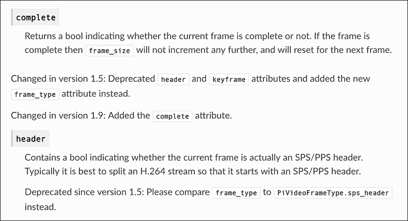

## **3**

**文档与良好的 API 实践**

在本章中，我们将讨论文档编写；特别是如何使用 *Sphinx* 自动化处理文档编写过程中较为繁琐和棘手的部分。虽然你仍然需要自己编写文档，但 Sphinx 会简化你的任务。由于使用 Python 库提供功能很常见，我们还将探讨如何管理和记录公共 API 的变更。由于 API 必须随着功能的变化而发展，从一开始就把一切都构建得完美是罕见的，但我会展示一些方法，帮助你确保你的 API 尽可能用户友好。

本章将以对 Web Services Made Easy 框架作者 Christophe de Vienne 的访谈结束，他在访谈中讨论了开发和维护 API 的最佳实践。

### **使用 Sphinx 进行文档编写**

文档是编写软件时最重要的部分之一。不幸的是，很多项目没有提供合适的文档。编写文档被认为是复杂且令人生畏的，但其实不必如此：借助 Python 程序员可用的工具，文档编写可以像编写代码一样简单。

文档稀缺或根本没有的一个最大原因是许多人认为文档代码的唯一方式是手动编写。即使一个项目有多个成员，这也意味着你团队中的一人或多人最终不得不在贡献代码和维护文档之间进行权衡——如果你问任何开发人员他们更愿意做哪个工作，你可以肯定他们会说，他们更愿意编写软件，而不是*编写*关于软件的文档。

有时，文档编写过程与开发过程完全分开，意味着文档是由那些没有编写实际代码的人来写的。此外，以这种方式生成的任何文档都很可能是过时的：无论谁来处理，手动编写文档几乎不可能跟得上开发的步伐。

归根结底，代码和文档之间的隔阂越大，后者保持更新的难度就越大。那么，为什么要将它们分开呢？不仅可以将文档直接放在代码中，而且将文档转换为易于阅读的 HTML 和 PDF 文件也很简单。

Python 文档的最常见格式是 *reStructuredText*，简称 *reST*。它是一种轻量级标记语言（类似于 Markdown），对于人类和计算机来说，都同样易于阅读和编写。Sphinx 是最常用的处理这种格式的工具；Sphinx 可以读取 reST 格式的内容，并以多种其他格式输出文档。

我建议你的项目文档始终包括以下内容：

+   你的项目旨在解决的问题，简要概述，一两句话即可。

+   你的项目分发所使用的许可证。如果你的软件是开源的，你还应该在每个代码文件的头部包含这类信息；仅仅将代码上传到互联网上并不意味着人们会知道他们可以对其做什么。

+   一个小示例，展示你的代码如何工作。

+   安装说明。

+   指向社区支持、邮件列表、IRC、论坛等的链接。

+   一个指向你的问题追踪系统的链接。

+   一个指向你源代码的链接，供开发者下载并立即开始深入研究。

你还应该包括一个 *README.rst* 文件，解释你的项目的功能。这个 README 应该显示在你的 GitHub 或 PyPI 项目页面上；这两个网站都支持处理 reST 格式。

**注意**

*如果你使用 GitHub，你还可以添加一个 CONTRIBUTING.rst 文件，当有人提交拉取请求时，它会显示出来。该文件应提供一个检查清单，供用户在提交请求之前遵循，包括诸如代码是否遵循 PEP 8 规范、是否运行单元测试等提醒。Read the Docs ([`readthedocs.org/`](http://readthedocs.org/)) 允许你自动构建并发布在线文档。注册和配置项目非常简单。然后 Read the Docs 会搜索你的 Sphinx 配置文件，构建文档并让用户访问。它是代码托管网站的一个绝佳伴侣。*

#### ***开始使用 Sphinx 和 reST***

你可以从 *[`www.sphinx-doc.org/`](http://www.sphinx-doc.org/)* 获取 Sphinx。网站上有安装说明，但最简单的方法是使用 `pip install sphinx` 安装。

一旦安装了 Sphinx，在你项目的顶层目录下运行 sphinx-quickstart。这将创建 Sphinx 期望找到的目录结构，并在 *doc/source* 文件夹中创建两个文件：*conf.py*，它包含 Sphinx 的配置设置（这是 Sphinx 工作所必需的），以及 *index.rst*，它作为文档的首页。运行快速启动命令后，系统会引导你完成一系列步骤，用以指定命名约定、版本约定以及其他有用工具和标准的选项。

*conf.py* 文件包含了一些已文档化的变量，如项目名称、作者以及用于 HTML 输出的主题。你可以根据需要随时编辑此文件。

一旦你构建了结构并设置了默认值，就可以通过调用 sphinx-build 并将源目录和输出目录作为参数，来构建 HTML 格式的文档，如 示例 3-1 所示。命令 sphinx-build 会读取源目录中的 *conf.py* 文件，并解析该目录下的所有 *.rst* 文件。然后它会在输出目录中以 HTML 格式渲染这些文件。

$ sphinx-build doc/source doc/build

import pkg_resources

正在运行 Sphinx v1.2b1

正在加载 pickle 环境... 完成

未选择构建器，使用默认值：html

正在构建 [html]：目标为 1 个过期的源文件

正在更新环境：0 添加，0 更改，0 删除

正在查找过时的文件... 未找到

正在准备文档... 完成

正在写入输出... [100%] index

正在写入附加文件... 生成索引、搜索、复制静态文件... 完成

正在转储搜索索引... 完成

正在转储对象清单... 完成

构建成功。

*列表 3-1：构建基本的 Sphinx HTML 文档*

现在你可以在你喜欢的浏览器中打开 *[doc/build/index.html](http://doc/build/index.html)* 并阅读你的文档。

**注意**

*如果你使用 setuptools 或 pbr（见 第五章）进行打包，Sphinx 扩展了它们以支持命令 setup.py build_sphinx，这将自动运行 sphinx-build。Sphinx 的 pbr 集成提供了一些更合理的默认设置，例如将文档输出到 /doc 子目录中。*

你的文档从 *index.rst* 文件开始，但不一定就此结束：reST 支持包含指令，可以从其他 reST 文件中包含 reST 文件，所以你可以将文档分成多个文件，没有任何障碍。刚开始时不用过于担心语法和语义；reST 提供了许多格式化的可能性，但你以后有足够的时间深入了解参考资料。完整的参考资料 (*[`docutils.sourceforge.net/docs/ref/rst/restructuredtext.html`](http://docutils.sourceforge.net/docs/ref/rst/restructuredtext.html)*) 解释了如何创建标题、项目符号列表、表格等。

#### ***Sphinx 模块***

Sphinx 是高度可扩展的：其基本功能仅支持手动文档化，但它配备了多个有用的模块，使自动文档化和其他功能成为可能。例如，sphinx.ext.autodoc 从你的模块中提取 reST 格式的文档字符串，并生成 *.rst* 文件以供包含。这是 sphinx-quickstart 在启动时会询问是否激活的选项。如果你没有选择该选项，依然可以编辑你的 *conf.py* 文件，并像这样将其作为扩展添加：

扩展 = ['sphinx.ext.autodoc']

请注意，autodoc *不会* 自动识别并包含你的模块。你需要显式指明希望文档化的模块，方法是将类似 列表 3-2 的内容添加到你的 *.rst* 文件中。

.. automodule:: foobar

➊     :members:

➋     :undoc-members:

➌     :show-inheritance:

*列表 3-2：指定模块供 autodoc 文档化*

在 列表 3-2 中，我们发出了三个请求，所有这些请求都是可选的：打印所有已记录的成员 ➊，打印所有未记录的成员 ➋，以及显示继承关系 ➌。还请注意以下几点：

+   如果你不包含任何指令，Sphinx 将不会生成任何输出。

+   如果你只指定 :members:，则模块、类或方法树中未文档化的节点将被跳过，即使它们的所有成员都已文档化。例如，如果你只文档化了一个类的方法，但没有文档化该类本身，:members: 将排除该类及其方法。为了避免这种情况，你需要为类写一个文档字符串，或者同时指定 :undoc-members:。

+   你的模块需要放在 Python 可以导入的位置。将 .、.. 和/或 ../.. 添加到 sys.path 中可以帮助解决问题。

autodoc 扩展使你能够将大部分文档直接包含在源代码中。你甚至可以选择要文档化的模块和方法——这不是“全有或全无”的解决方案。通过直接在源代码旁边维护文档，你可以轻松确保文档保持最新。

##### **使用 autosummary 自动化目录生成**

如果你在编写 Python 库，通常会希望将 API 文档格式化为一个包含每个模块单独页面链接的目录。

sphinx.ext.autosummary 模块专门为处理这种常见的用例而创建。首先，你需要在 *conf.py* 中启用它，方法是添加以下行：

extensions = ['sphinx.ext.autosummary']

然后，你可以像以下方式将其添加到 *.rst* 文件中，以便为指定的模块自动生成目录：

.. autosummary::

mymodule

mymodule.submodule

这将创建名为 *generated/mymodule.rst* 和 *generated/mymodule.submodule.rst* 的文件，其中包含前面描述的 autodoc 指令。使用这种格式，你可以指定希望包含在文档中的模块 API 部分。

**注意**

*sphinx-apidoc 命令可以自动为你创建这些文件；请查看 Sphinx 文档了解更多信息。*

##### **使用 doctest 自动化测试**

Sphinx 另一个有用的功能是能够在构建文档时自动运行 doctest 来检查你的示例。标准的 Python doctest 模块会在文档中搜索代码片段，并测试它们是否准确地反映了你的代码行为。每个以主提示符 >>> 开头的段落都会被视为需要测试的代码片段。例如，如果你想文档化 Python 的标准 print 函数，你可以写下如下文档片段，然后 doctest 会检查结果：

要将内容打印到标准输出，使用 :py:func:`print`

函数：

>>> print("foobar")

foobar

在文档中包含此类示例可以帮助用户理解你的 API。然而，随着 API 的发展，很容易拖延并最终忘记更新示例。幸运的是，doctest 可以确保这种情况不会发生。如果你的文档包括逐步教程，doctest 会通过测试它能检查的每一行来帮助你在开发过程中保持文档的最新。

你还可以使用 doctest 进行*文档驱动开发（DDD）*：先编写文档和示例，然后编写代码以匹配文档。利用此功能非常简单，只需使用特殊的 doctest 构建器运行 sphinx-build，例如：

$ sphinx-build -b doctest doc/source doc/build

运行 Sphinx v1.2b1

正在加载腌制的环境... 完成

正在构建[doctest]：1 个过期源文件的目标

更新环境：0 新增，0 更改，0 移除

正在寻找过时的文件... 未找到

正在运行测试...

文档：index

---------------

1 个项目通过了所有测试：

默认情况下的 1 个测试

1 个测试在 1 个项目中通过。

1 个通过，0 个失败。

测试通过。

Doctest 总结

===============

1 个测试

测试中没有失败

设置代码中没有失败

清理代码中没有失败

构建成功。

使用 doctest 构建器时，Sphinx 会读取常规的*.rst*文件，并执行其中包含的代码示例。

Sphinx 还提供了许多其他功能，既有开箱即用的，也有通过扩展模块提供的，包括这些：

+   项目间链接

+   HTML 主题

+   图表和公式

+   输出到 Texinfo 和 EPUB 格式

+   链接到外部文档

你可能不需要立即使用所有这些功能，但如果将来需要的话，提前了解这些功能是很有帮助的。再次查看完整的 Sphinx 文档以了解更多。

#### ***编写 Sphinx 扩展***

有时候现成的解决方案不足以应对某些情况，你需要创建自定义工具来解决问题。

假设你正在编写一个 HTTP REST API。Sphinx 只会记录你的 API 的 Python 部分，这迫使你手动编写 REST API 文档，并且会遇到所有相关的问题。Web Services Made Easy (WSME)的创建者（本章末尾的访谈中提到）提出了一个解决方案：一个名为 sphinxcontrib-pecanwsme 的 Sphinx 扩展，它分析文档字符串和实际 Python 代码，自动生成 REST API 文档。

**注意**

*对于其他 HTTP 框架，如 Flask、Bottle 和 Tornado，你可以使用 sphinxcontrib.httpdomain。*

我的观点是，每当你知道可以从代码中提取信息来生成文档时，就应该这样做，并且应当自动化这个过程。这比尝试维护手写的文档要好，特别是当你可以利用像 Read the Docs 这样的自动发布工具时。

我们将以 sphinxcontrib-pecanwsme 扩展为例，介绍如何编写自己的 Sphinx 扩展。第一步是编写一个模块——最好作为 sphinxcontrib 的子模块，只要你的模块足够通用——并为其选择一个名称。Sphinx 要求此模块必须有一个名为 setup(app) 的预定义函数，该函数包含你用来将代码连接到 Sphinx 事件和指令的方法。完整的方法列表可以在 Sphinx 扩展 API 中找到，地址是 *[`www.sphinx-doc.org/en/master/extdev/appapi.html`](http://www.sphinx-doc.org/en/master/extdev/appapi.html)*。

例如，sphinxcontrib-pecanwsme 扩展包含一个名为 rest-controller 的指令，通过使用 setup(app) 函数添加。此添加的指令需要一个完全限定的控制器类名来生成文档，如 列表 3-3 所示。

def setup(app):

app.add_directive('rest-controller', RESTControllerDirective)

*列表 3-3：来自 sphinxcontrib.pecanwsme.rest.setup 的代码，添加了 rest-controller 指令*

列表 3-3 中的 add_directive 方法注册了 rest-controller 指令，并将其处理委托给 RESTControllerDirective 类。此 RESTControllerDirective 类公开了某些属性，用于指示指令如何处理内容，是否有参数等。该类还实现了一个 run() 方法，实际上从代码中提取文档并将解析后的数据返回给 Sphinx。

在 *[`bitbucket.org/birkenfeld/sphinx-contrib/src/`](https://bitbucket.org/birkenfeld/sphinx-contrib/src/)* 上的代码库中，有许多小模块可以帮助你开发自己的扩展。

**注意**

*尽管 Sphinx 是用 Python 编写的，并且默认支持 Python，但也有扩展可以让它支持其他语言。即使你的项目同时使用多种语言，你也可以使用 Sphinx 来全面记录你的项目。*

另一个例子，在我名为 Gnocchi 的项目中——这是一个用于存储和索引大规模时间序列数据的数据库——我使用了一个自定义的 Sphinx 扩展来自动生成文档。Gnocchi 提供了一个 REST API，通常为了文档化这样的 API，项目会手动编写 API 请求及其响应的示例。不幸的是，这种方法容易出错，并且与实际情况不同步。

使用可用的单元测试代码来测试 Gnocchi API，我们构建了一个 Sphinx 扩展来运行 Gnocchi，并生成一个 *.rst* 文件，其中包含针对真实 Gnocchi 服务器运行的 HTTP 请求和响应。通过这种方式，我们确保文档是最新的：服务器响应不是手工编写的，如果手动编写的请求失败，则文档生成过程失败，我们知道必须修复文档。

将代码包含在书中会显得过于冗长，但你可以在线查看 Gnocchi 的源码，并查看 gnocchi.gendoc 模块以了解它的工作原理。

#### ***管理你的 API 变更***

良好的文档化代码是其他开发者看到该代码适合被导入并用于构建其他东西的标志。例如，当构建一个库并导出 API 供其他开发者使用时，你应该提供稳固的文档以增加可信度。

本节将涵盖公共 API 的最佳实践。这些 API 将暴露给你的库或应用程序的用户，虽然你可以随意处理内部 API，但公共 API 应该谨慎处理。

为了区分公共和私有 API，Python 的约定是将私有 API 的符号前缀加上一个下划线：foo 是公共的，但 _bar 是私有的。你应该遵循这一约定来识别其他 API 是否为公共或私有，并为你自己的 API 命名。与其他语言（如 Java）不同，Python 不会强制限制对标记为私有或公共的代码的访问。命名约定仅仅是为了方便程序员之间的理解。

#### ***API 版本号管理***

当正确构建时，API 的版本号可以为用户提供大量信息。Python 没有特别的系统或约定来标识 API 版本，但我们可以从 Unix 平台中获取灵感，Unix 平台使用复杂的管理系统为库提供精细的版本标识符。

通常，版本号应反映出会影响用户的 API 变化。例如，当 API 进行重大更改时，主版本号可能会从 1 更改为 2。如果只添加了少量新的 API 调用，次版本号可能会从 2.2 更改为 2.3。如果更改仅涉及修复漏洞，版本号可能会从 2.2.0 升级到 2.2.1。Python 的 requests 库是如何使用版本号的一个很好的例子 (*[`pypi.python.org/pypi/requests/`](https://pypi.python.org/pypi/requests/)*)，该库基于每个新版本中的更改数量以及这些更改对消费程序的影响来递增其 API 版本号。

版本号提示开发者应该查看库的两个版本之间的变化，但仅凭版本号并不足以完全指导开发者：你必须提供详细的文档来描述这些变化。

#### ***记录你的 API 变更***

每次你对 API 进行更改时，最重要的事情是要详细记录这些变更，以便代码的使用者可以快速了解发生了什么变化。你的文档应该涵盖以下内容：

+   新接口的新增元素

+   已废弃的旧接口元素

+   如何迁移到新接口的说明

你还应该确保不要立刻删除旧的接口。我建议在遇到麻烦之前继续保留旧接口。如果你已经标记为废弃，用户就会知道不要使用它。

Listing 3-4 是一个很好的 API 变更文档示例，展示了一个可以转向任意方向的汽车对象的代码。由于某种原因，开发者决定撤回 `turn_left` 方法，而是提供一个通用的 `turn` 方法，能够接受方向作为参数。

class Car(object):

def turn_left(self):

"""将车转向左。

.. deprecated:: 1.1

使用 :func:`turn`，并将方向参数设置为左

"""

self.turn(direction='left')

def turn(self, direction):

"""将车转向某个方向。

:param direction: 转向的方向。

:type direction: str

"""

# 在这里编写实际的 turn 函数代码

pass

*Listing 3-4：汽车对象的 API 变更文档示例*

这里的三重引号 `"""` 表示文档字符串的开始和结束，当用户在终端输入 help(Car.turn_left) 或使用像 Sphinx 这样的外部工具提取文档时，这部分内容将被引入到文档中。`car.turn_left` 方法的废弃通过 `.. deprecated 1.1` 来标识，其中 1.1 表示包含该废弃代码的第一个版本。

使用这种废弃方法并通过 Sphinx 使其可见，可以清晰地告诉用户该函数不应使用，并直接提供新的函数，同时解释如何迁移旧代码。

图 3-1 显示了 Sphinx 文档，解释了一些废弃函数。

*图 3-1：某些废弃函数的说明*

这种方法的缺点是它依赖于开发者在升级到新版本 Python 包时阅读你的变更日志或文档。然而，有一个解决方案：使用 `warnings` 模块标记废弃函数。

#### ***使用 warnings 模块标记废弃函数***

尽管废弃的模块应在文档中标明，以避免用户尝试调用它们，但 Python 还提供了 `warnings` 模块，允许你的代码在调用废弃函数时发出各种警告。这些警告 `DeprecationWarning` 和 `PendingDeprecationWarning` 可用于告知开发者，他们调用的函数已经废弃或即将废弃。

**注意**

*对于从事 C 开发的人来说，这是 GCC 扩展 __attribute__ ((deprecated)) 的一个便捷对应物。*

回到 Listing 3-4 中的汽车对象示例，我们可以用这个方法在用户尝试调用废弃函数时发出警告，如 Listing 3-5 所示。

import warnings

class Car(object):

def turn_left(self):

"""将车转向左。

➊ .. deprecated:: 1.1

请改用 :func:`turn`，并将方向参数设置为 "left"。

"""

➋ warnings.warn("turn_left 已弃用；请改用 turn",

弃用警告)

self.turn(direction='left')

def turn(self, direction):

"""将车向某个方向转。

:param direction: 要转向的方向。

:type direction: str

"""

# 这里写实际的代码

pass

*示例 3-5：使用 warnings 模块记录的车对象 API 更改*

这里，turn_left 函数已经被弃用 ➊。通过添加 warnings.warn 语句，我们可以写下自己的错误消息 ➋。现在，如果任何代码调用 turn_left 函数，警告将如下所示：

>>> Car().turn_left()

__main__:8: 弃用警告：turn_left 已弃用；请改用 turn

Python 2.7 及以后的版本默认不会打印 warnings 模块发出的任何警告，因为警告被过滤了。要查看这些警告，您需要将 -W 选项传递给 Python 可执行文件。选项 -W all 会将所有警告打印到标准错误输出。有关 -W 可能的值，请参阅 Python 手册页。

在运行测试套件时，开发者可以使用 -W 错误选项运行 Python，这将在每次调用过时的函数时抛出错误。使用您的库的开发者可以轻松找到代码需要修复的地方。示例 3-6 展示了在使用 -W 错误选项调用 Python 时，Python 如何将警告转化为致命异常。

>>> import warnings

>>> warnings.warn("此功能已弃用", DeprecationWarning)

回溯（最近的调用最后）：

文件 "<stdin>"，第 1 行，在 <module>

弃用警告：此功能已弃用

*示例 3-6：使用 -W 错误选项运行 Python 并获取弃用错误*

警告通常在运行时被忽略，且使用 -W 错误选项运行生产系统通常不是一个好主意。另一方面，使用 -W 错误选项运行 Python 应用程序的测试套件，反而可以是一个捕获警告并及早修复它们的好方法。

然而，手动编写所有这些警告、文档字符串更新等会变得繁琐，因此创建了 debtcollector 库来帮助自动化其中的一些工作。debtcollector 库提供了一些装饰器，您可以将其与函数一起使用，确保正确的警告被发出，并且文档字符串得到正确更新。示例 3-7 展示了如何通过一个简单的装饰器，指示一个函数已经被移动到其他地方。

from debtcollector import moves

class Car(object):

@moves.moved_method('turn', version='1.1')

def turn_left(self):

"""将车向左转。”

return self.turn(direction='left')

def turn(self, direction):

"""将车向某个方向转。

:param direction: 要转向的方向。

:type direction: str

"""

# 这里写实际的代码

pass

*示例 3-7：通过 debtcollector 自动化的 API 更改*

在这里，我们使用了来自 debtcollector 的 moves() 方法，它的 moved_method 装饰器会在每次调用 turn_left 时发出一个 DeprecationWarning。

### **总结**

Sphinx 是记录 Python 项目的事实标准。它支持多种语法，如果你的项目有特殊需求，也可以轻松添加新的语法或功能。Sphinx 还可以自动化生成索引或从代码中提取文档等任务，使得长时间维护文档变得更加容易。

对 API 变更进行文档记录至关重要，特别是当你弃用某些功能时，以避免用户措手不及。记录弃用内容的方式包括 Sphinx 的 deprecated 关键字和 warnings 模块，而 debtcollector 库可以自动化维护这些文档。

### **Christophe de Vienne 关于开发 API 的观点**

Christophe 是一名 Python 开发者，也是 WSME（Web Services Made Easy）框架的作者，该框架允许开发者以 Pythonic 的方式定义 Web 服务，并支持多种 API，能够与其他 Web 框架进行集成。

**开发者在设计 Python API 时容易犯哪些错误？**

在设计 Python API 时，我遵循这些规则来避免一些常见的错误：

+   **不要把它做得太复杂。** 保持简单。复杂的 API 很难理解，也很难文档化。虽然实际的库功能不一定要简单，但聪明的做法是将其设计得简单，这样用户就不容易出错。例如，该库本身非常简单直观，但在幕后做了复杂的事情。相比之下，urllib 的 API 几乎与它所做的事情一样复杂，导致它难以使用。

+   **让魔法显现出来。** 当你的 API 做了一些文档中没有解释的事情时，最终用户可能会想打开你的代码，看看背后发生了什么。如果你在幕后有一些魔法是没问题的，但你的最终用户不应该看到任何意外的行为发生，否则他们可能会感到困惑，或者依赖某种可能会改变的行为。

+   **不要忽视使用场景。** 当你专注于编写代码时，很容易忘记思考你的库将如何被实际使用。思考出好的使用场景有助于更容易地设计一个 API。

+   **编写单元测试。** *TDD（测试驱动开发）* 是一种非常高效的编写库的方式，尤其是在 Python 中，因为它迫使开发者从一开始就站在最终用户的角度进行思考，这使得开发者更注重可用性设计。这是我所知道的唯一一种方法，能够让程序员在必要时完全重写一个库。

**Python 的哪些方面可能会影响设计库 API 的难易程度？**

Python 没有内建的方式来定义哪些部分是公开的，哪些是私有的，这既是一个问题，也可能是一个优势。

这是一个问题，因为它可能导致开发者未能完全考虑哪些 API 部分是公开的，哪些应该保持私密。但是通过一点纪律、文档以及（如果需要的话）像 zope.interface 这样的工具，问题很快就能解决。

这是一种优势，因为它能使 API 重构变得更快捷、更容易，同时保持与旧版本的兼容性。

**在考虑 API 的演进、弃用和移除时，您会考虑哪些因素？**

在做任何关于 API 开发的决策时，我会权衡几个标准：

+   **库的用户在适应代码时会遇到多大难度？** 考虑到有很多人依赖您的 API，您做的任何更改都必须值得付出 adoption 的努力。这个规则旨在防止对常用 API 部分做出不兼容的更改。话虽如此，Python 的优势之一在于，相对来说，重构代码以适应 API 更改是比较容易的。

+   **我如何保持 API 的易维护性？** 简化实现、清理代码库、让 API 更易用、拥有更完整的单元测试、让 API 一目了然……所有这些都会让您作为维护者的工作变得更加轻松。

+   **如何在应用更改时保持 API 的一致性？** 如果 API 中的所有函数遵循类似的模式（例如要求第一个位置传入相同的参数），那么确保新函数也遵循这一模式。此外，一次做太多事情是导致做不好任何一件事的好方法：保持 API 专注于其应该完成的任务。

+   **用户如何从这次变化中受益？** 最后但同样重要的是，始终考虑用户的视角。

**关于 Python 中的 API 文档，您有什么建议？**

良好的文档使得新手更容易采纳您的库。忽视文档会让很多潜在用户流失——不仅仅是初学者。问题是，文档编写很难，因此经常被忽视！

+   **尽早文档化，并将文档构建纳入持续集成。** 使用 Read the Docs 工具来创建和托管文档，对于开源软件来说，没有理由不构建和发布文档。

+   **使用文档字符串来记录您 API 中的类和函数。** 如果您遵循 PEP 257 (*[`www.python.org/dev/peps/pep-0257/`](https://www.python.org/dev/peps/pep-0257/)*) 的指南，开发者就不需要阅读您的源代码来理解您的 API 功能。通过文档字符串生成 HTML 文档——而且不要仅限于 API 参考文档。

+   **始终提供实际的示例。** 至少提供一个“启动指南”，向新手展示如何构建一个可运行的示例。文档的第一页应提供一个快速概述，展示您 API 的基本和典型用例。

+   **详细记录你 API 的演变过程，逐个版本地记录。** 版本控制系统（VCS）日志是不够的！

+   **使你的文档易于访问，并且如果可能的话，让它更舒适易读。** 你的用户需要能够轻松找到文档，并获取所需的信息，而不会觉得自己像在受折磨。通过 PyPI 发布文档是一种实现这个目标的方法；在 Read the Docs 上发布文档也是个不错的主意，因为用户通常会期望在那找到你的文档。

+   **最后，选择一个既高效又吸引人的主题。** 我为 WSME 选择了“Cloud” Sphinx 主题，但还有很多其他主题可以选择。你不需要是网页专家就能制作出美观的文档。
