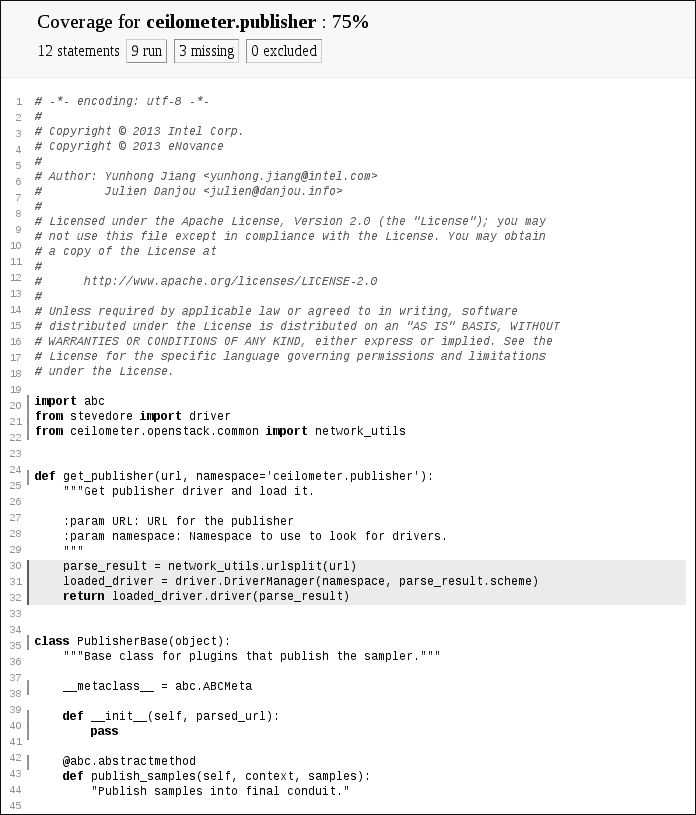

## 第七章：**单元测试**


很多人觉得单元测试既繁琐又耗时，一些人和项目甚至没有测试政策。本章假设你理解单元测试的重要性！编写未经测试的代码是毫无意义的，因为无法确凿地证明它是否有效。如果你还需要说服自己，我建议你先阅读关于测试驱动开发的好处。

本章将介绍你可以用来构建完整测试套件的 Python 工具，从而使测试变得更简单、更自动化。我们将讨论如何使用工具确保你的软件稳定无回归。我们将涵盖创建可重用的测试对象、并行运行测试、揭示未测试的代码，以及使用虚拟环境确保测试清洁的内容，还会涉及一些其他的最佳实践方法和思路。

### **测试基础**

在 Python 中，编写和运行单元测试并不复杂。这个过程既不干扰也不破坏现有的代码，单元测试将大大帮助你和其他开发人员维护软件。在这里，我将讨论一些测试的基本知识，以帮助你更轻松地进行测试。

#### ***一些简单的测试***

首先，你应该将测试保存在应用程序或库的 `tests` 子模块中。这样做可以将测试作为模块的一部分一起发布，以便任何人都能运行或重用它们——即使在你的软件安装后，也不一定需要使用源代码包。将测试作为主模块的子模块，也可以防止它们被误安装在顶级的 `tests` 模块中。

在你的测试树中使用与模块树相同的层次结构，将使得测试更加易于管理。这意味着，涵盖 *mylib/foobar.py* 代码的测试应该保存在 *mylib/tests/test_foobar.py* 中。统一的命名法使得查找与特定文件相关的测试变得更简单。清单 6-1 显示了你可以编写的最简单的单元测试。

```py
def test_true():
    assert True
```

*清单 6-1：在 test_true.py 中的一个非常简单的测试*

这将简单地断言程序的行为是否符合预期。要运行此测试，你需要加载 *test_true.py* 文件并运行其中定义的 `test_true()` 函数。

然而，为你的每个测试文件和函数编写和运行单独的测试会非常麻烦。对于使用简单的小型项目，`pytest` 包就能派上用场——通过 `pip` 安装后，pytest 提供了 `pytest` 命令，它会加载所有文件名以 *test_* 开头的文件，并执行其中所有以 `test_` 开头的函数。

只要我们的源代码树中有 *test_true.py* 文件，运行 `pytest` 就会给出如下输出：

```py
 $ pytest -v test_true.py
========================== test session starts ===========================
platform darwin -- Python 3.6.4, pytest-3.3.2, py-1.5.2, pluggy-0.6.0 --
/usr/local/opt/python/bin/python3.6
cachedir: .cache
rootdir: examples, inifile:
collected 1 item

test_true.py::test_true PASSED                                     [100%]

======================== 1 passed in 0.01 seconds ========================
```

`-v`选项告诉`pytest`以详细模式运行，并在单独的行上打印每个测试的名称。如果测试失败，输出会变更，显示失败信息，并伴随完整的回溯。

这次我们添加一个失败的测试，如清单 6-2 所示。

```py
def test_false():
    assert False
```

*清单 6-2：test_true.py 中的失败测试*

如果我们再次运行测试文件，结果如下：

```py
 $ pytest -v test_true.py
========================== test session starts ===========================
platform darwin -- Python 3.6.4, pytest-3.3.2, py-1.5.2, pluggy-0.6.0 -- /usr/
local/opt/python/bin/python3.6
cachedir: .cache
rootdir: examples, inifile:
collected 2 items

test_true.py::test_true PASSED                                     [ 50%]
test_true.py::test_false FAILED                                    [100%]

================================ FAILURES ================================
_______________________________ test_false _______________________________

    def test_false():
>       assert False
E       assert False

test_true.py:5: AssertionError
=================== 1 failed, 1 passed in 0.07 seconds ===================
```

一旦抛出`AssertionError`异常，测试就会失败；当`assert`测试的参数被评估为假值（`False`、`None`、0 等）时，它会抛出`AssertionError`异常。如果抛出其他异常，测试也会报错。

很简单，不是吗？虽然简单，但很多小项目都使用这种方法，而且效果非常好。这些项目除了`pytest`外不需要任何工具或库，因此可以依赖简单的`assert`测试。

当你开始编写更复杂的测试时，`pytest`将帮助你理解失败测试中的问题。想象一下以下测试：

```py
def test_key():
    a = ['a', 'b']
    b = ['b']
    assert a == b
```

运行`pytest`时，它会显示如下输出：

```py
 $ pytest test_true.py
========================== test session starts =========================== platform darwin -- Python 3.6.4, pytest-3.3.2, py-1.5.2, pluggy-0.6.0
rootdir: /Users/jd/Source/python-book/examples, inifile:
plugins: celery-4.1.0
collected 1 item

test_true.py F                                                     [100%]

================================ FAILURES ================================
________________________________ test_key ________________________________

    def test_key():
        a = ['a', 'b']
        b = ['b']
>       assert a == b
E       AssertionError: assert ['a', 'b'] == ['b']
E         At index 0 diff: 'a' != 'b'
E         Left contains more items, first extra item: 'b'
E         Use -v to get the full diff

test_true.py:10: AssertionError
======================== 1 failed in 0.07 seconds ========================
```

这告诉我们`a`和`b`是不同的，并且该测试没有通过。它还告诉我们它们具体的不同之处，使得修复测试或代码变得容易。

#### ***跳过测试***

如果一个测试无法运行，你可能想要跳过该测试——例如，你可能希望根据某个特定库的存在与否来有条件地运行测试。为此，你可以使用`pytest.skip()`函数，它会将测试标记为跳过，并继续执行下一个测试。`pytest.mark.skip`装饰器会无条件跳过被装饰的测试函数，因此当某个测试始终需要跳过时，你会使用它。清单 6-3 展示了如何使用这些方法跳过测试。

```py
import pytest

try:
    import mylib
except ImportError:
    mylib = None

@pytest.mark.skip("Do not run this")
def test_fail():
    assert False

@pytest.mark.skipif(mylib is None, reason="mylib is not available")
def test_mylib():
    assert mylib.foobar() == 42 def test_skip_at_runtime():
    if True:
        pytest.skip("Finally I don't want to run it")
```

*清单 6-3：跳过测试*

执行时，这个测试文件将输出以下内容：

```py
 $ pytest -v examples/test_skip.py
========================== test session starts ===========================
platform darwin -- Python 3.6.4, pytest-3.3.2, py-1.5.2, pluggy-0.6.0 -- /usr/
local/opt/python/bin/python3.6
cachedir: .cache
rootdir: examples, inifile:
collected 3 items

examples/test_skip.py::test_fail SKIPPED
[ 33%]
examples/test_skip.py::test_mylib SKIPPED
[ 66%]
examples/test_skip.py::test_skip_at_runtime SKIPPED
[100%]

================= 3 skipped in 0.01 seconds =================
```

在清单 6-3 中的测试运行输出表明，在这种情况下，所有测试都被跳过了。这些信息让你可以确保没有意外跳过你期望运行的测试。

#### ***运行特定测试***

使用`pytest`时，你通常只想运行某一特定子集的测试。你可以通过将目录或文件作为参数传递给`pytest`命令行来选择运行的测试。例如，调用`pytest test_one.py`将只运行*test_one.py*测试。`pytest`也接受目录作为参数，在这种情况下，它会递归扫描该目录并运行任何匹配*test_*.py*模式的文件。

你也可以在命令行中使用`-k`参数添加筛选器，以便仅执行与某个名称匹配的测试，如清单 6-4 所示。

```py
$ pytest -v examples/test_skip.py -k test_fail
========================== test session starts ===========================
platform darwin -- Python 3.6.4, pytest-3.3.2, py-1.5.2, pluggy-0.6.0 -- /usr/
local/opt/python/bin/python3.6
cachedir: .cache
rootdir: examples, inifile:
collected 3 items

examples/test_skip.py::test_fail SKIPPED
[100%] === 2 tests deselected ===
=== 1 skipped, 2 deselected in 0.04 seconds ===
```

*清单 6-4：按名称筛选运行的测试*

名称并不总是过滤将要运行的测试的最佳方式。通常，开发人员会根据功能或类型将测试分组。Pytest 提供了一个动态标记系统，允许你使用关键字标记测试，并可以用作过滤器。要以这种方式标记测试，请使用`-m`选项。如果我们像这样设置几个测试：

```py
import pytest

@pytest.mark.dicttest
def test_something():
    a = ['a', 'b']
    assert a == a

def test_something_else():
    assert False
```

我们可以使用`-m`参数和`pytest`只运行其中一个测试：

```py
$ pytest -v test_mark.py -m dicttest
=== test session starts ===
platform darwin -- Python 3.6.4, pytest-3.3.2, py-1.5.2, pluggy-0.6.0 -- /usr/
local/opt/python/bin/python3.6
cachedir: .cache
rootdir: examples, inifile:
collected 2 items

test_mark.py::test_something PASSED
[100%]

=== 1 tests deselected ===
=== 1 passed, 1 deselected in 0.01 seconds ===
```

`-m`标记接受更复杂的查询，因此我们也可以运行所有*未*标记的测试：

```py
$ pytest test_mark.py -m 'not dicttest'
=== test session starts ===
platform darwin -- Python 3.6.4, pytest-3.3.2, py-1.5.2, pluggy-0.6.0
rootdir: examples, inifile:
collected 2 items

test_mark.py F
[100%]

=== FAILURES ===
test_something_else def test_something_else():
>       assert False
E       assert False

test_mark.py:10: AssertionError
=== 1 tests deselected ===
=== 1 failed, 1 deselected in 0.07 seconds ===
```

这里 pytest 执行了所有未标记为`dicttest`的测试——在这种情况下，`test_something_else`测试失败了。剩下的标记测试`test_something`没有执行，因此被列为`deselected`。

Pytest 接受由`or`、`and`和`not`关键字组成的复杂表达式，允许你进行更高级的过滤。

#### ***并行运行测试***

测试套件可能需要很长时间才能运行。在大型软件项目中，完整的单元测试套件通常需要几十分钟才能运行。默认情况下，pytest 按顺序执行所有测试，顺序是未定义的。由于大多数计算机都有多个 CPU，你通常可以通过将测试列表拆分并在多个 CPU 上运行它们来加速测试过程。

为了处理这种方法，pytest 提供了插件`pytest-xdist`，你可以通过`pip`安装此插件。此插件通过`--numprocesses`参数（缩写为`-n`）扩展了 pytest 命令行，该参数的值为要使用的 CPU 数量。运行`pytest -n 4`将使用四个并行进程运行你的测试套件，在可用的 CPU 之间平衡负载。

因为 CPU 的数量可能因计算机而异，所以该插件还接受`auto`关键字作为值。在这种情况下，它会探测机器以获取可用的 CPU 数量，并启动相应数量的进程。

#### ***使用 Fixtures 创建用于测试的对象***

在单元测试中，你通常需要在运行测试前后执行一组常见的指令，这些指令将使用某些组件。例如，你可能需要一个表示应用程序配置状态的对象，并且你可能希望在每个测试之前初始化该对象，然后在测试完成后将其重置为默认值。同样，如果你的测试依赖于临时创建一个文件，那么该文件必须在测试开始之前创建，并在测试完成后删除。这些组件被称为*fixtures*，在测试之前进行设置，并在测试完成后进行清理。

在 pytest 中，fixture 被定义为简单的函数。fixture 函数应返回所需的对象，以便使用该 fixture 的测试可以使用该对象。

这是一个简单的 fixture：

```py
import pytest

@pytest.fixture
def database():
    return <some database connection>

def test_insert(database):
    database.insert(123)
```

数据库 fixture 会自动被任何在其参数列表中包含`database`的测试使用。`test_insert()`函数将接收`database()`函数的结果作为第一个参数，并根据需要使用该结果。当我们以这种方式使用 fixture 时，我们不需要重复多次数据库初始化代码。

代码测试的另一个常见功能是，在测试使用完 fixture 后进行清理。例如，你可能需要关闭数据库连接。将 fixture 实现为生成器允许我们添加清理功能，如示例 6-5 所示。

```py
import pytest

@pytest.fixture
def database():
    db = <some database connection>
    yield db
    db.close()

def test_insert(database):
    database.insert(123)
```

*示例 6-5：清理功能*

因为我们使用了`yield`关键字并使`database`成为一个生成器，所以`yield`语句之后的代码将在测试完成后运行。该代码会在测试结束时关闭数据库连接。

然而，为每个测试关闭数据库连接可能会增加不必要的运行时开销，因为测试可能能够重用相同的连接。在这种情况下，你可以通过将`scope`参数传递给装饰器来指定 fixture 的作用范围：

```py
import pytest

@pytest.fixture(scope="module")
def database():
    db = <some database connection>
    yield db
    db.close()

def test_insert(database):
    database.insert(123)
```

通过指定`scope="module"`参数，你可以在整个模块中初始化 fixture 一次，所有请求数据库连接的测试函数都会接收到相同的数据库连接。

最后，你可以在测试前后运行一些公共代码，通过使用`autouse`关键字将 fixtures 标记为*自动使用*，而不是将其作为每个测试函数的参数来指定。向`pytest.fixture()`函数指定`autouse=True`关键字参数，可以确保在模块或类中定义的任何测试运行之前，都会调用该 fixture，正如以下示例所示：

```py
import os

import pytest

@pytest.fixture(autouse=True)
def change_user_env():
    curuser = os.environ.get("USER")
    os.environ["USER"] = "foobar"
    yield
    os.environ["USER"] = curuser

def test_user():
    assert os.getenv("USER") == "foobar"
```

这些自动启用的功能很方便，但要确保不要滥用 fixtures：它们会在其作用范围内的每个测试之前运行，因此可能会显著减慢测试运行速度。

#### ***运行测试场景***

在单元测试时，你可能希望使用几个不同的对象来运行相同的错误处理测试，这些对象会触发该错误，或者你可能希望在不同的驱动程序上运行整个测试套件。

在开发*Gnocchi*（一个时间序列数据库）时，我们在很大程度上依赖了这种后者的方法。Gnocchi 提供了一个我们称之为*存储 API*的抽象类。任何 Python 类都可以实现这个抽象基类并注册自己成为一个驱动程序。软件在需要时加载配置的存储驱动程序，并使用实现的存储 API 来存储或检索数据。在这种情况下，我们需要一个单元测试类，它可以在每个驱动程序上运行——从而对每个存储 API 的实现进行测试——以确保所有驱动程序符合调用者的期望。

实现这一点的简单方法是使用 *参数化 fixtures*，这些 fixtures 会多次运行所有使用它们的测试，每次使用不同的定义参数。清单 6-6 展示了一个使用参数化 fixtures 的示例，用不同的参数运行单个测试两次：一次用于 `mysql`，一次用于 `postgresql`。

```py
import pytest
import myapp @pytest.fixture(params=["mysql", "postgresql"])
def database(request):
    d = myapp.driver(request.param)
    d.start()
    yield d
    d.stop()

def test_insert(database):
    database.insert("somedata")
```

*清单 6-6：使用参数化 fixtures 运行测试*

在清单 6-6 中，`driver` fixture 使用了两个不同的值进行参数化，每个值都是应用程序支持的数据库驱动的名称。当运行 `test_insert` 时，它实际上会运行两次：一次使用 MySQL 数据库连接，另一次使用 PostgreSQL 数据库连接。这使我们能够在不同的场景下轻松重用相同的测试，而无需添加许多代码行。

#### ***使用模拟控制测试***

模拟对象是模拟真实应用对象行为的对象，尤其是在特定和受控的方式下。这些对象在创建精确描述你希望测试代码的条件的环境时特别有用。你可以将所有对象替换为模拟对象，除了一个，用以隔离你关注对象的行为并为测试代码创建一个环境。

一个使用场景是在编写 HTTP 客户端时，因为可能不可能（或至少非常复杂）启动 HTTP 服务器并通过所有场景进行测试以返回每个可能的值。HTTP 客户端在所有故障场景下的测试尤其困难。

Python 中用于创建模拟对象的标准库是 `mock`。从 Python 3.3 开始，`mock` 已经合并到 Python 标准库中，成为 `unittest.mock`。因此，你可以使用如下片段来保持 Python 3.3 及更早版本之间的向后兼容性：

```py
try:
    from unittest import mock
except ImportError:
    import mock
```

`mock` 库使用起来相当简单。任何访问 `mock.Mock` 对象的属性都会在运行时动态创建。可以将任何值设置为这样的属性。清单 6-7 显示了如何使用 `mock` 创建一个带有假属性的假对象。

```py
>>> from unittest import mock
>>> m = mock.Mock()
>>> m.some_attribute = "hello world" >>> m.some_attribute
"hello world"
```

*清单 6-7：访问 mock.Mock 属性*

你还可以在一个可塑对象上动态创建方法，如清单 6-8 中所示，我们创建了一个始终返回 42 并接受任何参数的假方法。

```py
>>> from unittest import mock
>>> m = mock.Mock()
>>> m.some_method.return_value = 42
>>> m.some_method()
42
>>> m.some_method("with", "arguments")
42
```

*清单 6-8：在 mock.Mock 对象上创建方法*

只需几行代码，你的 `mock.Mock` 对象现在就有了一个返回 42 的 `some_method()` 方法。它接受任何类型的参数，而且目前没有检查这些值是什么。

动态创建的方法也可以具有（故意的）副作用。它们不仅仅是返回值的模板方法，而是可以定义执行有用代码的功能。

清单 6-9 创建了一个假的方法，该方法具有打印 "`hello world`" 字符串的副作用。

```py
   >>> from unittest import mock
   >>> m = mock.Mock()
   >>> def print_hello():
   ...     print("hello world!")
   ...     return 43
   ...
➊ >>> m.some_method.side_effect = print_hello
   >>> m.some_method()
   hello world!
   43
➋ >>> m.some_method.call_count
   1
```

*清单 6-9：在 mock.Mock 对象上创建带副作用的方法*

我们将整个函数分配给 `some_method` 属性 ➊。这种技术使我们能够在测试中实现更复杂的场景，因为我们可以将任何需要的代码插入到模拟对象中进行测试。然后，只需将该模拟对象传递给需要它的函数。

`call_count` 属性 ➋ 是检查方法被调用次数的简单方法。

`mock` 库采用了动作/断言模式：这意味着在测试运行完毕后，由你来检查你所模拟的动作是否被正确执行。清单 6-10 使用 `assert()` 方法对我们的模拟对象进行这些检查。

```py
   >>> from unittest import mock
   >>> m = mock.Mock()
➊ >>> m.some_method('foo', 'bar')
   <Mock name='mock.some_method()' id='26144272'>
➋ >>> m.some_method.assert_called_once_with('foo', 'bar')
   >>> m.some_method.assert_called_once_with('foo', ➌mock.ANY)
   >>> m.some_method.assert_called_once_with('foo', 'baz')
   Traceback (most recent call last):
     File "<stdin>", line 1, in <module>
     File "/usr/lib/python2.7/dist-packages/mock.py", line 846, in assert_called_
   once_with
       return self.assert_called_with(*args, **kwargs)
     File "/usr/lib/python2.7/dist-packages/mock.py", line 835, in assert_called_
   with
       raise AssertionError(msg)
   AssertionError: Expected call: some_method('foo', 'baz')
   Actual call: some_method('foo', 'bar')
```

*清单 6-10：检查方法调用*

我们创建一个带有参数 `foo` 和 `bar` 的方法，通过调用该方法 ➊ 来作为我们的测试。检查对模拟对象的调用的常用方法是使用 `assert_called()` 方法，如 `assert_called_once_with()` ➋。对于这些方法，需要传递你期望调用者在调用模拟方法时使用的值。如果传递的值与预期不符，`mock` 会抛出 `AssertionError`。如果你不知道可能传递什么参数，可以使用 `mock.ANY` 作为值 ➌；这将匹配传递给模拟方法的任何参数。

`mock` 库还可以用于修补外部模块中的某些函数、方法或对象。在 清单 6-11 中，我们将 `os.unlink()` 函数替换为我们提供的假函数。

```py
>>> from unittest import mock
>>> import os
>>> def fake_os_unlink(path):
...     raise IOError("Testing!")
...
>>> with mock.patch('os.unlink', fake_os_unlink):
...     os.unlink('foobar')
...
Traceback (most recent call last):
  File "<stdin>", line 2, in <module>
  File "<stdin>", line 2, in fake_os_unlink
IOError: Testing!
```

*清单 6-11：使用 mock.patch*

当 `mock.patch()` 作为上下文管理器使用时，它会将目标函数替换为我们提供的函数，因此在上下文中执行的代码将使用该修补方法。使用 `mock.patch()` 方法，可以更改外部代码的任何部分，使其表现得符合你的测试需求，从而测试应用中的所有条件，如 清单 6-12 所示。

```py
   from unittest import mock

   import pytest
   import requests

   class WhereIsPythonError(Exception):
       pass

➊ def is_python_still_a_programming_language():
       try:
           r = requests.get("http://python.org")
       except IOError:
           pass
       else:
           if r.status_code == 200:
               return 'Python is a programming language' in r.content
       raise WhereIsPythonError("Something bad happened")

   def get_fake_get(status_code, content):
       m = mock.Mock()
       m.status_code = status_code
       m.content = content

       def fake_get(url):
           return m

       return fake_get

   def raise_get(url):
       raise IOError("Unable to fetch url %s" % url)

➋ @mock.patch('requests.get', get_fake_get(
       200, 'Python is a programming language for sure'))
   def test_python_is():
       assert is_python_still_a_programming_language() is True

   @mock.patch('requests.get', get_fake_get(
       200, 'Python is no more a programming language'))
   def test_python_is_not():
       assert is_python_still_a_programming_language() is False

   @mock.patch('requests.get', get_fake_get(404, 'Whatever'))
   def test_bad_status_code():
       with pytest.raises(WhereIsPythonError):
           is_python_still_a_programming_language()

   @mock.patch('requests.get', raise_get)
   def test_ioerror():
       with pytest.raises(WhereIsPythonError):
           is_python_still_a_programming_language()
```

*清单 6-12：使用 mock.patch() 测试一组行为*

清单 6-12 实现了一个测试套件，用于在 *[`python.org/`](http://python.org/)* 网页中搜索所有出现的字符串“Python is a programming language” ➊。无法测试负面场景（即该句子不在网页上）——显然我们无法修改网页本身。在这种情况下，我们使用 `mock` 来“作弊”并改变请求的行为，使其返回一个模拟的回复，其中没有该字符串。这使我们能够测试该负面场景，即 *[`python.org/`](http://python.org/)* 网页中不包含该句子，从而确保程序能够正确处理这种情况。

这个例子使用了 `mock.patch()` 的装饰器版本 ➋。使用装饰器不会改变模拟的行为，但当你需要在整个测试函数的上下文中使用模拟时，它更简单。

使用模拟（mocking），我们可以模拟任何问题，比如 Web 服务器返回 404 错误、I/O 错误或网络延迟问题。我们可以确保代码在每种情况下都返回正确的值或抛出正确的异常，确保我们的代码始终按预期行为运行。

#### ***揭示未测试的代码与覆盖率***

`coverage`工具是单元测试的一个极好补充，它能识别出在测试过程中是否漏掉了某些代码。它使用代码分析工具和追踪钩子来确定哪些代码行已经执行；在单元测试运行时，它能显示出代码库的哪些部分已被覆盖，哪些部分没有。编写测试是有用的，但知道在测试过程中可能遗漏了哪些代码是锦上添花。

通过`pip`安装`coverage` Python 模块，即可在终端中访问`coverage`命令。

**注意**

*如果你通过操作系统的软件包管理工具安装`coverage`，该命令也可能被命名为 python-coverage。例如，在 Debian 上就是如此。*

使用`coverage`独立模式非常简单。它能显示程序中从未执行过的部分，以及哪些代码可能是“死代码”，即那些可以删除而不会影响程序正常工作流的代码。我们在本章讨论的所有测试工具都与`coverage`集成。

当使用`pytest`时，只需通过`pip install pytest-pycov`安装`pytest-cov`插件，并添加一些选项开关来生成详细的代码覆盖率输出，如清单 6-13 所示。

```py
$ pytest --cov=gnocchiclient gnocchiclient/tests/unit
---------- coverage: platform darwin, python 3.6.4-final-0 -----------
Name                                          Stmts   Miss Branch BrPart  Cover
---------------------------
gnocchiclient/__init__.py                         0      0      0      0   100%
gnocchiclient/auth.py                            51     23      6      0    49%
gnocchiclient/benchmark.py                      175    175     36      0     0%
--snip--
---------------------------
TOTAL                                          2040   1868    424      6     8%

=== passed in 5.00 seconds ===
```

*清单 6-13：在 pytest 中使用 coverage*

`--cov`选项会在测试运行结束时启用覆盖率报告。你需要传递包名称作为参数，以便插件正确地过滤覆盖率报告。输出包括那些未执行的代码行，因此没有测试。现在你只需打开你最喜欢的文本编辑器，开始为那些代码编写测试。

然而，`coverage`更进一步，允许你生成清晰的 HTML 报告。只需添加`--cov-report=html`标志，然后运行该命令的*htmlcov*目录将会生成 HTML 页面。每个页面将显示你源代码中的哪些部分已被执行，哪些没有。

如果你想成为*那种*人，可以使用选项`--cover-fail-under=COVER_MIN_PERCENTAGE`，当测试套件运行时，如果代码的最低百分比未被执行，测试套件将失败。虽然有一个良好的覆盖率百分比是一个不错的目标，并且该工具有助于深入了解测试覆盖率的状态，但定义一个任意的百分比值并不能提供太多见解。图 6-1 展示了一个覆盖率报告的示例，顶部显示了百分比。

例如，100% 的代码覆盖率是一个值得尊敬的目标，但这并不一定意味着代码已经完全测试过，你可以松一口气。它仅仅证明了你的整个代码路径已经运行过；并没有说明每一个可能的条件都已经被测试过。

你应该使用覆盖率信息来巩固你的测试套件，并为当前没有运行的代码添加测试。这有助于后续的项目维护，并提高代码的整体质量。



*图 6-1：ceilometer.publisher 的覆盖率*

### **虚拟环境**

我们之前提到过一个风险，那就是你的测试可能无法捕捉到依赖缺失的问题。任何较大的应用程序不可避免地依赖于外部库来提供应用程序所需的功能，但外部库可能在你的操作系统上引发很多问题。以下是其中一些：

+   你的系统没有打包你需要的库。

+   你的系统没有打包你所需的正确 *版本* 的库。

+   你需要两个不同版本的相同库来支持两个不同的应用程序。

这些问题可能发生在你首次部署应用程序时，或者稍后在应用程序运行过程中。通过系统管理器升级一个 Python 库，可能会在没有任何警告的情况下迅速破坏你的应用程序，原因可能只是库的 API 发生了变化，而该库正被应用程序使用。

解决方案是让每个应用程序使用一个包含所有应用程序依赖项的库目录。然后，该目录用于加载所需的 Python 模块，而不是系统安装的模块。

这样的目录被称为*虚拟环境*。

#### ***设置虚拟环境***

工具 `virtualenv` 会为你自动处理虚拟环境。直到 Python 3.2，你可以通过安装 `virtualenv` 包来使用它，命令是 `pip install virtualenv`。如果你使用的是 Python 3.3 或更高版本，它可以通过 Python 的 `venv` 名称直接使用。

要使用该模块，像这样将其作为主程序加载，并以目标目录作为参数：

```py
$ python3 -m venv myvenv
$ ls foobar
bin        include    lib        pyvenv.cfg
```

一旦运行，`venv` 会创建一个 *lib/pythonX.Y* 目录，并使用它将 `pip` 安装到虚拟环境中，这对于安装后续的 Python 包非常有用。

然后，你可以通过“激活” `activate` 命令来激活虚拟环境。在 Posix 系统上，使用以下命令：

```py
$ source myvenv/bin/activate
```

在 Windows 系统上，使用以下代码：

```py
> \myvenv\Scripts\activate
```

一旦完成，你的 shell 提示符应该会显示虚拟环境的名称。执行 `python` 将调用已经复制到虚拟环境中的 Python 版本。你可以通过查看 `sys.path` 变量并确认它的第一个组件是虚拟环境目录来检查它是否正常工作。

你可以随时通过调用 `deactivate` 命令来停止并退出虚拟环境：

```py
$ deactivate
```

就是这样。还要注意，如果你只想使用虚拟环境中安装的 Python 一次，你并不一定需要运行`activate`。直接调用`python`二进制文件也能工作：

```py
$ myvenv/bin/python
```

现在，当我们处于激活的虚拟环境中时，我们无法访问主系统中安装并可用的任何模块。这正是使用虚拟环境的意义所在，但这也意味着我们可能需要安装所需的包。为此，使用标准的`pip`命令安装每个包，这些包将安装到正确的位置，而不会改变系统中的任何内容：

```py
$ source myvenv/bin/activate
(myvenv) $ pip install six
Downloading/unpacking six
  Downloading six-1.4.1.tar.gz
  Running setup.py egg_info for package six

Installing collected packages: six
  Running setup.py install for six

Successfully installed six
Cleaning up...
```

Voilà！我们可以安装所需的所有库，然后从这个虚拟环境中运行我们的应用程序，而不会破坏系统。很容易看出，我们可以编写脚本来自动化安装虚拟环境，基于依赖项列表，就像在清单 6-14 中所示。

```py
virtualenv myappvenv
source myappvenv/bin/activate
pip install -r requirements.txt
deactivate
```

*清单 6-14：自动虚拟环境创建*

虽然通常不需要访问系统安装的包，但`virtualenv`允许你在创建虚拟环境时通过传递`--system-site-packages`标志启用它们。

在`myvenv`中，你会找到一个*pyvenv.cfg*文件，这是该环境的配置文件。默认情况下，它没有很多配置选项。你应该能识别出`include-system-site-package`，其作用与我们之前描述的`virtualenv`中的`--system-site-packages`相同。

正如你可能猜到的，虚拟环境对自动化运行单元测试套件非常有用。它们的使用如此广泛，以至于已经有一个专门的工具来解决这个问题。

#### ***使用 virtualenv 配合 tox***

虚拟环境的主要用途之一是为运行单元测试提供一个干净的环境。如果你误以为测试正在正常工作，但它们没有遵守依赖项列表，那将是有害的。

确保考虑所有依赖项的一种方法是编写脚本来部署虚拟环境，安装`setuptools`，然后安装应用程序/库运行时和单元测试所需的所有依赖项。幸运的是，这是一个如此常见的用例，已经有一个专门用于此任务的应用程序：`tox`。

`tox`管理工具旨在自动化和标准化 Python 中的测试运行方式。为此，它提供了运行整个测试套件所需的一切，同时也安装你的应用程序以检查安装是否成功。

在使用`tox`之前，你需要提供一个名为*tox.ini*的配置文件，该文件应放置在项目的根目录中，与你的*setup.py*文件一起：

```py
$ touch tox.ini
```

然后你可以成功地运行`tox`：

```py
% tox
GLOB sdist-make: /home/jd/project/setup.py
python create: /home/jd/project/.tox/python
python inst: /home/jd/project/.tox/dist/project-1.zip
____________________ summary _____________________
  python: commands succeeded
  congratulations :)
```

在此实例中，`tox` 使用默认的 Python 版本在 *.tox/python* 中创建一个虚拟环境。它使用 *setup.py* 创建包的分发文件，然后将其安装到这个虚拟环境中。没有运行任何命令，因为我们没有在配置文件中指定任何命令。单单这样做并没有太大用处。

我们可以通过在测试环境中添加要运行的命令来改变这个默认行为。编辑 *tox.ini* 文件，添加以下内容：

```py
[testenv]
commands=pytest
```

现在 `tox` 运行 `pytest` 命令。然而，由于我们在虚拟环境中没有安装 `pytest`，这个命令很可能会失败。我们需要将 `pytest` 列为一个依赖项以便安装：

```py
[testenv]
deps=pytest
commands=pytest
```

现在运行时，`tox` 会重新创建环境，安装新的依赖项，并运行 `pytest` 命令，执行所有单元测试。要添加更多依赖项，你可以将它们列在 `deps` 配置选项中，如这里所示，或者使用 `-rfile` 语法从文件中读取。

#### ***重新创建环境***

有时候你需要重新创建环境，例如，确保当一个新开发者克隆源代码仓库并首次运行 `tox` 时，所有东西能按预期工作。为此，`tox` 接受一个 `--recreate` 选项，它将根据你设定的参数从头开始重建虚拟环境。

你可以在 *tox.ini* 文件的 `[testenv]` 部分定义所有由 `tox` 管理的虚拟环境的参数。如前所述，`tox` 可以管理多个 Python 虚拟环境——事实上，你可以通过向 `tox` 传递 `-e` 标志来运行非默认 Python 版本下的测试，方法如下：

```py
 % tox -e py26
 GLOB sdist-make: /home/jd/project/setup.py
 py26 create: /home/jd/project/.tox/py26
 py26 installdeps: nose
 py26 inst: /home/jd/project/.tox/dist/rebuildd-1.zip
 py26 runtests: commands[0] | pytests
 --snip--
== test session starts ==
=== 5 passed in 4.87 seconds ====
```

默认情况下，`tox` 会模拟任何匹配现有 Python 版本的环境：`py24`、`py25`、`py26`、`py27`、`py30`、`py31`、`py32`、`py33`、`py34`、`py35`、`py36`、`py37`、`jython` 和 `pypy`！此外，你还可以定义自己的环境。只需要添加一个名为 `[testenv:_envname_]` 的新部分。如果你只想为某个特定环境运行某个命令，可以通过在 *tox.ini* 文件中列出以下内容来轻松实现：

```py
[testenv]
deps=pytest
commands=pytest

[testenv:py36-coverage]
deps={[testenv]deps}
      pytest-cov
commands=pytest --cov=myproject
```

通过在 `py36-coverage` 部分下使用 `pytest --cov=myproject`，如这里所示，你可以覆盖 `py36-coverage` 环境的命令，这意味着当你运行 `tox -e py36-coverage` 时，`pytest` 会作为依赖项安装，但实际运行的命令是带有覆盖选项的 `pytest`。为了使这一点生效，必须安装 `pytest-cov` 扩展：为此，我们将 `deps` 值替换为来自 `testenv` 的 `deps`，并添加 `pytest-cov` 依赖项。`tox` 也支持变量插值，因此你可以引用 *tox.ini* 文件中的任何其他字段并将其作为变量使用，语法为 `{[env_name]variable_name}`。这样可以避免重复相同的内容。

#### ***使用不同的 Python 版本***

我们还可以通过在 *tox.ini* 中添加以下内容，立即创建一个不受支持版本的 Python 环境：

```py
[testenv]
deps=pytest
commands=pytest

[testenv:py21]
basepython=python2.1
```

当我们运行它时，它现在会（尝试）使用 Python 2.1 来运行测试套件——尽管由于非常不可能你在系统上安装了这个古老的 Python 版本，我怀疑这对你来说会起作用！

你可能希望支持多个 Python 版本，在这种情况下，默认情况下让 `tox` 运行你想要支持的所有 Python 版本的所有测试会很有用。你可以通过在没有参数的情况下运行 `tox` 时指定你想使用的环境列表来做到这一点：

```py
[tox]
envlist=py35,py36,pypy

[testenv]
deps=pytest
commands=pytest
```

当 `tox` 启动时没有其他参数，所有列出的四个环境都会被创建，填充依赖项和应用程序，然后用命令 `pytest` 运行它们。

#### ***集成其他测试***

我们还可以使用 `tox` 集成像 `flake8` 这样的测试，如第一章所讨论的。以下 *tox.ini* 文件提供了一个 PEP 8 环境，将安装 `flake8` 并运行它：

```py
[tox]
envlist=py35,py36,pypy,pep8

[testenv]
deps=pytest
commands=pytest

[testenv:pep8]
deps=flake8
commands=flake8
```

在这种情况下，`pep8` 环境使用默认版本的 Python 运行，这可能没问题，尽管如果你想更改它，仍然可以指定 `basepython` 选项。

运行 `tox` 时，你会注意到所有环境都是顺序构建并运行的。这可能会使过程非常漫长，但由于虚拟环境是隔离的，什么也不会阻止你并行运行 `tox` 命令。这正是 `detox` 包所做的，它提供了一个 `detox` 命令，能够并行运行 *envlist* 中的所有默认环境。你应该 `pip install` 它！

### **测试政策**

在你的项目中嵌入测试代码是一个极好的主意，但代码的执行方式同样至关重要。太多项目中有一些测试代码，因为某些原因没有运行。这个话题不仅限于 Python，但我认为它足够重要，值得在这里强调：你应该对未经测试的代码实行零容忍政策。没有适当的单元测试覆盖的代码不应被合并。

你应该追求的最低目标是，你推送的每个提交都能通过所有测试。自动化这个过程会更好。例如，OpenStack 依赖于基于 *Gerrit*（一个基于 Web 的代码审查服务）和 *Zuul*（一个持续集成和交付服务）的特定工作流。每个提交都会通过 Gerrit 提供的代码审查系统，Zuul 负责运行一系列测试任务。Zuul 运行单元测试和各种高级功能测试。这些代码审查由几位开发人员执行，确保所有提交的代码都有相应的单元测试。

如果你使用流行的 GitHub 托管服务，*Travis CI* 是一个可以在每次推送或合并后，或在提交的拉取请求上运行测试的工具。虽然遗憾的是这些测试是在推送后进行的，但它仍然是跟踪回归的一个绝佳方式。Travis 开箱即支持所有主要的 Python 版本，并且可以进行显著的定制。一旦你通过 *[`www.travis-ci.org/`](https://www.travis-ci.org/)* 的 web 界面激活了 Travis，只需添加一个 *.travis.yml* 文件来确定如何运行测试。列表 6-15 展示了一个 .*travis.yml* 文件的示例。

```py
language: python
python:
  - "2.7"
  - "3.6"
# command to install dependencies
install: "pip install -r requirements.txt --use-mirrors"
# command to run tests
script: pytest
```

*列表 6-15：一个 .travis.yml 示例文件*

在代码仓库中放置这个文件并启用 Travis 后，Travis 会启动一组作业，使用相关的单元测试来测试你的代码。你可以很容易地通过简单地添加依赖项和测试来定制它。Travis 是一个付费服务，但好消息是，对于开源项目，它完全免费！

`tox-travis` 包 (*[`pypi.python.org/pypi/tox-travis/`](https://pypi.python.org/pypi/tox-travis/)*) 也值得关注，因为它会通过根据所使用的 Travis 环境运行正确的 `tox` 目标，来优化 `tox` 和 Travis 之间的集成。列表 6-16 展示了一个 *.travis.yml* 文件示例，该文件会在运行 `tox` 之前安装 `tox-travis`。

```py
sudo: false
language: python
python:
  - "2.7"
  - "3.4"
install: pip install tox-travis
script: tox
```

*列表 6-16：一个带有 tox-travis 的 .travis.yml 示例文件*

使用 `tox-travis`，你只需在 Travis 上调用 `tox` 作为脚本，它将根据 *.travis.yml* 文件中指定的环境调用 `tox`，构建必要的虚拟环境，安装依赖项，并运行你在 *tox.ini* 中指定的命令。这使得在本地开发机器和 Travis 持续集成平台上使用相同的工作流程变得容易。

如今，无论你的代码托管在哪里，总是可以对软件进行一些自动化测试，确保你的项目在推进，而不是因为引入了 bug 而被拖慢进度。

### **罗伯特·柯林斯关于测试的观点**

罗伯特·柯林斯不仅是 *Bazaar* 分布式版本控制系统的原始作者之一，还是 HP Cloud Services 的杰出技术专家，目前致力于 OpenStack 项目。罗伯特还是本书中描述的许多 Python 工具的作者，如 fixtures、`testscenarios`、`testrepository`，甚至是 `python-subunit`——你可能在不知情的情况下使用过他的某些程序！

**你会建议使用什么样的测试策略？不进行代码测试是否可以接受？**

我认为测试是一种工程折衷：你必须考虑失败未被发现而滑入生产环境的可能性、未发现的失败的成本和规模，以及执行工作的团队的凝聚力。以 OpenStack 为例，它有 1600 名贡献者：如此多的人各自有自己的意见，难以制定细致的政策。一般来说，一个项目需要一些自动化测试，以检查代码是否按预期运行，并且它的功能是否符合需求。通常这需要一些功能性测试，可能存在不同的代码库中。单元测试在速度和定位边界情况方面非常优秀。我认为，在有测试的前提下，测试风格之间的平衡是可以有所不同的。

在测试成本非常高且回报非常低的情况下，我认为做出不测试的明智决定是可以的，但这种情况相对较少：大多数事情可以以相对较低的成本进行测试，而及早发现错误的好处通常是相当高的。

**在编写 Python 代码时，哪些策略能够帮助管理测试并提高代码质量？**

将关注点分离，不要在同一个地方做多个事情；这样可以自然地实现重用，也使得放置测试替代物更容易。在可能的情况下，采取纯粹的函数式方法；例如，在一个方法中要么计算某些内容，要么更改某些状态，但避免两者都做。这样，你可以测试所有的计算行为，而不需要处理状态的变化，比如写入数据库或与 HTTP 服务器交互。这个好处也可以反向利用——你可以为测试替换计算逻辑，来引发边界情况的行为，并使用模拟和测试替代物来检查期望的状态传播是否按预期发生。最难测试的往往是深层次的堆栈，尤其是有复杂跨层行为依赖的情况。此时你需要让代码演变成层之间契约简单、可预测，并且——对测试最有用的是——可以替换的形式。

**如何在源代码中组织单元测试最为合适？**

拥有清晰的层次结构，例如 *`$ROOT/$PACKAGE/tests`*。我倾向于为整个源代码树做一个层次结构，例如 *`$ROOT/$PACKAGE/$SUBPACKAGE/tests`*。

在测试中，我通常会镜像源代码树的结构：*`$ROOT/$PACKAGE/foo.py`* 会在 *`$ROOT/$PACKAGE/tests/test_foo.py`* 中进行测试。

除非是顶层 `__init__` 中的 `test_suite`/`load_tests` 函数，否则其他树层不应导入测试树。这使得在小型安装环境下轻松分离测试成为可能。

**你如何看待 Python 中单元测试库和框架的未来？**

我看到的主要挑战有：

+   在新机器（例如装有四个 CPU 的手机）中，并行能力的持续扩展。现有的单元测试内部 API 并不针对并行工作负载进行优化。我在 StreamResult Java 类上的工作直接旨在解决这个问题。

+   更复杂的调度支持——为类和模块作用域设置所解决的问题提供一个不那么丑陋的解决方案。

+   寻找一种方法来整合当今我们拥有的各种框架：对于集成测试而言，能够跨多个使用不同测试运行程序的项目获得一个整合视图将会非常有益。
