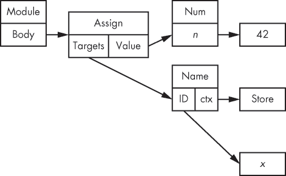

## **9**

**抽象语法树、Hy 和类似 Lisp 的属性**


*抽象语法树（AST）* 是任何编程语言源代码结构的表示。每种语言，包括 Python，都有一个特定的 AST；Python 的 AST 通过解析 Python 源文件来构建。像任何树一样，它由相互连接的节点构成。一个节点可以表示一个操作、一个语句、一个表达式，甚至是一个模块。每个节点都可以包含指向构成树的其他节点的引用。

Python 的 AST 并没有被充分文档化，因此乍一看可能很难处理，但理解 Python 构建的一些更深层次的方面有助于你掌握它的使用。

本章将检查一些简单的 Python 命令的 AST，以帮助你熟悉其结构和使用方式。熟悉 AST 后，我们将构建一个程序，使用 `flake8` 和 AST 来检查错误声明的方法。最后，我们将介绍 Hy，这是一种基于 Python AST 构建的 Python-Lisp 混合语言。

### **查看 AST**

查看 Python AST 最简单的方法是解析一些 Python 代码并转储生成的 AST。为此，Python 的 `ast` 模块提供了你所需的一切，如 清单 9-1 所示。

```py
>>> import ast
>>> ast.parse
<function parse at 0x7f062731d950>
>>> ast.parse("x = 42")
<_ast.Module object at 0x7f0628a5ad10>
>>> ast.dump(ast.parse("x = 42"))
"Module(body=[Assign(targets=[Name(id='x', ctx=Store())], value=Num(n=42))])"
```

*清单 9-1：使用 ast 模块转储解析代码生成的 AST*

`ast.parse()` 函数解析包含 Python 代码的任何字符串，并返回一个 `_ast.Module` 对象。这个对象实际上是树的根节点：你可以浏览它来发现构成树的每个节点。为了可视化树的结构，你可以使用 `ast.dump()` 函数，它将返回整个树的字符串表示。

在 清单 9-1 中，代码 `x = 42` 使用 `ast.parse()` 进行解析，并使用 `ast.dump()` 打印结果。这个抽象语法树可以渲染为 图 9-1 所示，展示了 Python `assign` 命令的结构。



*图 9-1：Python 中赋值命令的 AST*

AST 总是从根元素开始，通常是一个 _`ast.Module` 对象。这个模块对象包含一个要在其 *body* 属性中评估的语句或表达式列表，通常表示文件的内容。

正如你可能猜到的，图 9-1 中展示的 `ast.Assign` 对象表示一个 *赋值*，它映射到 Python 语法中的 `=` 符号。`ast.Assign` 对象有一个 *targets* 列表和一个 *value*，用于将目标设置为相应的值。在这个例子中，目标列表包含一个对象 `ast.Name`，它表示一个变量，其 ID 是 *x*。值是一个数字 *n*，它的值为（在此例中）42。ctx 属性存储一个 *context*，它可以是 `ast.Store` 或 `ast.Load`，取决于变量是用于读取还是写入。在此例中，变量正在被赋值，因此使用了 `ast.Store` 上下文。

我们可以将这个 AST 传递给 Python，通过内置的 `compile()` 函数进行编译和求值。该函数接受一个 AST 作为参数、源文件名以及模式（可以是 `'exec'`、`'eval'` 或 `'single'`）。源文件名可以是任何你希望给 AST 起的名字；如果数据不是来自存储的文件，通常会使用字符串 `<input>` 作为源文件名，如 Listing 9-2 所示。

```py
>>> compile(ast.parse("x = 42"), '<input>', 'exec')
<code object <module> at 0x111b3b0, file "<input>", line 1>
>>> eval(compile(ast.parse("x = 42"), '<input>', 'exec'))
>>> x
42
```

*Listing 9-2: 使用 compile() 函数编译来自非存储文件的数据*

模式分别代表执行（`exec`）、求值（`eval`）和单个语句（`single`）。模式应与传递给 `ast.parse()` 的内容匹配，默认模式是 `exec`。

+   `exec` 模式是正常的 Python 模式，当 _`ast.Module` 是树的根时使用此模式。

+   `eval` 模式是一种特殊模式，期望树的根是单个 `ast.Expression`。

+   最后，`single` 是另一种特殊模式，它期望一个单一的语句或表达式。如果它得到一个表达式，`sys.displayhook()` 会被调用并显示结果，就像在交互式命令行中执行代码一样。

AST 的根是 `ast.Interactive`，其 `body` 属性是节点的列表。

我们可以使用 `ast` 模块提供的类手动构建 AST。显然，这是一种非常繁琐的编写 Python 代码的方式，并不是我推荐的方法！尽管如此，这样做很有趣，而且对学习 AST 有帮助。让我们看看使用 AST 编程会是什么样子。

#### ***使用 AST 编写程序***

让我们通过手动构建抽象语法树（AST）来写一个经典的 `"Hello world!"` Python 程序。

```py
➊ >>> hello_world = ast.Str(s='hello world!', lineno=1, col_offset=1)
➋ >>> print_name = ast.Name(id='print', ctx=ast.Load(), lineno=1, col_offset=1)
➌ >>> print_call = ast.Call(func=print_name, ctx=ast.Load(),
   ... args=[hello_world], keywords=[], lineno=1, col_offset=1)
➍ >>> module = ast.Module(body=[ast.Expr(print_call, ... lineno=1, col_offset=1)], lineno=1, col_offset=1)
➎ >>> code = compile(module, '', 'exec')
   >>> eval(code)
   hello world!
```

*Listing 9-3: 使用 AST 编写 hello world！*

在 Listing 9-3 中，我们一次构建一个叶子，每个叶子都是程序的一个元素（无论是值还是指令）。

第一个叶子是一个简单的字符串 ➊：`ast.Str` 代表一个字面量字符串，这里包含了 `hello world!` 文本。`print_name` 变量 ➋ 包含一个 `ast.Name` 对象，它指向一个变量——在此案例中，指向 `print` 变量，该变量指向 `print()` 函数。

`print_call` 变量 ➌ 包含一个函数调用。它指向要调用的函数名、传递给函数调用的常规参数和关键字参数。使用哪些参数取决于调用的函数。在这种情况下，由于它是 `print()` 函数，我们将传递我们制作并存储在 `hello_world` 中的字符串。

最后，我们创建一个 _`ast.Module` 对象 ➍ 来将所有这些代码作为一个表达式的列表。我们可以使用 `compile()` 函数 ➎ 编译 _`ast.Module` 对象，该函数会解析树并生成一个本地的 `code` 对象。这些 `code` 对象是编译后的 Python 代码，最终可以通过 Python 虚拟机使用 `eval` 执行！

整个过程正是你运行 Python 时在*.py*文件上发生的事情：一旦文本令牌被解析，它们会转换成`ast`对象的树，然后被编译并执行。

**注意**

*参数 lineno 和 col_offset 分别表示用于生成 AST 的源代码的行号和列偏移。由于我们没有解析源文件，因此在此上下文中设置这些值没有太大意义，但能够找到生成 AST 的代码的位置是有用的。例如，Python 在生成回溯信息时会使用这些信息。事实上，Python 会拒绝编译不提供这些信息的 AST 对象，因此我们向这些值传递假数据。你还可以使用`ast.fix_missing_locations()`函数将缺失的值设置为父节点上设置的值。*

#### ***AST 对象***

你可以通过阅读`_ast`模块的文档（注意下划线）查看 AST 中所有可用的对象列表。

这些对象分为两大类：语句和表达式。*语句*包括`assert`、赋值（`=`）、增量赋值（`+=`、`/=`等）、`global`、`def`、`if`、`return`、`for`、`class`、`pass`、`import`、`raise`等类型。语句继承自`ast.stmt`；它们影响程序的控制流，并且通常由表达式组成。

*表达式*包括`lambda`、`number`、`yield`、`name`（变量）、`compare`和`call`等类型。表达式继承自`ast.expr`；它们与语句不同，通常会产生一个值并且不会影响程序的流程。

还有一些更小的类别，如`ast.operator`类，它定义了标准的运算符，如*加法* (`+`)、*除法* (`/`)和*右移* (`>>`)，以及`ast.cmpop`模块，它定义了比较运算符。

这里的简单示例应该能让你了解如何从零开始构建 AST。然后，你可以很容易地想象如何利用这个 AST 构建一个解析字符串并生成代码的编译器，从而实现你自己的 Python 语法！这正是促使 Hy 项目发展的原因，稍后我们将在本章中讨论它。

#### ***遍历 AST***

要跟踪树的构建过程或访问特定节点，你有时需要遍历树，浏览并迭代节点。你可以使用`ast.walk()`函数来完成这项工作。或者，`ast`模块还提供了`NodeTransformer`类，你可以通过继承它来遍历 AST 并修改特定节点。使用`NodeTransformer`可以轻松地动态改变代码，如示例 9-4 所示。

```py
   import ast

   class ReplaceBinOp(ast.NodeTransformer):
       """Replace operation by addition in binary operation"""
       def visit_BinOp(self, node):
           return ast.BinOp(left=node.left,
                            op=ast.Add(),
                            right=node.right)

➊ tree = ast.parse("x = 1/3")
   ast.fix_missing_locations(tree)
   eval(compile(tree, '', 'exec'))
   print(ast.dump(tree))
➋ print(x)

➌ tree = ReplaceBinOp().visit(tree)
   ast.fix_missing_locations(tree)
   print(ast.dump(tree))
   eval(compile(tree, '', 'exec'))
➍ print(x)
```

*示例 9-4：使用 NodeTransformer 遍历树以更改节点*

第一个`tree`对象➊是一个抽象语法树（AST），它表示表达式`x = 1/3`。一旦这段代码被编译和执行，函数结束时打印`x`的结果➋是`0.33333`，即`1/3`的预期结果。

第二个`tree`对象➌是`ReplaceBinOp`的一个实例，它继承自`ast.NodeTransformer`。它实现了自己版本的`ast.NodeTransformer.visit()`方法，并将任何`ast.BinOp`操作改为执行`ast.Add`的`ast.BinOp`。具体来说，这将任何二元操作符（`+`、`-`、`/`等）替换为`+`操作符。当第二棵树被编译和执行后➍，结果现在是`4`，这是`1 + 3`的结果，因为第一个对象中的`/`被替换成了`+`。

你可以在这里看到程序的执行：

```py
Module(body=[Assign(targets=[Name(id='x', ctx=Store())],
                    value=BinOp(left=Num(n=1), op=Div(), right=Num(n=3)))])
0.3333333333333333
Module(body=[Assign(targets=[Name(id='x', ctx=Store())],
                    value=BinOp(left=Num(n=1), op=Add(), right=Num(n=3)))])
4
```

**注意**

*如果你需要评估一个应返回简单数据类型的字符串，可以使用`ast.literal_eval`。作为`eval`的更安全替代，它防止输入的字符串执行任何代码。*

### **通过 AST 检查扩展 flake8**

在第七章中，你学到了不依赖于对象状态的方法应当使用`@staticmethod`装饰器声明为静态方法。问题在于，很多开发者常常忘记这么做。我个人也花了太多时间审查代码并要求别人修复这个问题。

我们已经看到如何使用`flake8`进行一些自动代码检查。实际上，`flake8`是可扩展的，可以提供更多的检查。我们将编写一个`flake8`扩展，利用 AST 检查是否省略了静态方法声明。

清单 9-5 展示了一个省略静态声明的类和一个正确包含静态声明的类。将此程序写出并保存为*ast_ext.py*；我们稍后将在其中编写扩展程序。

```py
class Bad(object):
    # self is not used, the method does not need
    # to be bound, it should be declared static
    def foo(self, a, b, c):
        return a + b - c

class OK(object):
    # This is correct
    @staticmethod
    def foo(a, b, c):
        return a + b - c
```

*清单 9-5：省略和包含@staticmethod*

尽管`Bad.foo`方法可以正常工作，但严格来说，写成`OK.foo`更为正确（有关原因，请返回查看第七章）。为了检查 Python 文件中的所有方法是否都已正确声明，我们需要执行以下操作：

+   遍历 AST 的所有语句节点。

+   检查语句是否是类定义（`ast.ClassDef`）。

+   遍历该类语句的所有函数定义（`ast.FunctionDef`），检查它们是否已用`@staticmethod`声明。

+   如果方法没有声明为静态方法，检查方法中是否使用了第一个参数（`self`）。如果`self`未被使用，则该方法可能被标记为写错了。

我们项目的名称将是`ast_ext`。为了在`flake8`中注册一个新插件，我们需要创建一个包含常规*setup.py*和*setup.cfg*文件的打包项目。然后，我们只需要在`ast_ext`项目的*setup.cfg*中添加一个入口点。

```py
[entry_points]
flake8.extension =
    --snip--
    H904 = ast_ext:StaticmethodChecker
    H905 = ast_ext:StaticmethodChecker
```

*清单 9-6：允许 flake8 插件用于我们的章节*

在 清单 9-6 中，我们还注册了两个 `flake8` 错误代码。正如你稍后会注意到的，我们在此过程中实际上会为我们的代码添加一个额外的检查！

下一步是编写插件。

#### ***编写类***

由于我们正在编写一个针对 AST 的 `flake8` 检查，插件需要是一个遵循特定签名的类，如 清单 9-7 所示。

```py
class StaticmethodChecker(object):
    def __init__(self, tree, filename):
        self.tree = tree

    def run(self):
        pass
```

*清单 9-7：用于检查 AST 的类*

默认模板很容易理解：它将树本地存储以便在 `run()` 方法中使用，该方法将 *生成* 发现的问题。生成的值必须遵循预期的 PEP 8 签名：一个元组，形式为 `(lineno`, col_offset, error_string, code)`。

#### ***忽略无关的代码***

正如前面所述，`ast` 模块提供了 `walk()` 函数，允许你轻松地遍历树。我们将使用它来遍历 AST，找出需要检查的内容和不需要检查的内容。

首先，让我们编写一个循环，忽略那些不是类定义的语句。将此代码添加到你的 `ast_ext` 项目中，如 清单 9-8 所示；应该保持不变的代码会被灰色标出。

```py
class StaticmethodChecker(object):
    def __init__(self, tree, filename):
        self.tree = tree

    def run(self):
        for stmt in ast.walk(self.tree):
            # Ignore non-class
            if not isinstance(stmt, ast.ClassDef):
                continue
```

*清单 9-8：忽略不是类定义的语句*

清单 9-8 中的代码仍然没有进行任何检查，但现在它知道如何忽略不是类定义的语句。下一步是将我们的检查器设置为忽略任何不是函数定义的语句。

```py
for stmt in ast.walk(self.tree):
    # Ignore non-class
    if not isinstance(stmt, ast.ClassDef):
        continue
    # If it's a class, iterate over its body member to find methods
    for body_item in stmt.body:
        # Not a method, skip
        if not isinstance(body_item, ast.FunctionDef):
            continue
```

*清单 9-9：忽略不是函数定义的语句*

在 清单 9-9 中，我们通过遍历类定义的属性来忽略无关的语句。

#### ***检查正确的装饰器***

我们已准备好编写检查方法，该方法存储在 `body_item` 属性中。首先，我们需要检查被检查的方法是否已经声明为静态方法。如果是，则不需要进一步检查，可以直接退出。

```py
for stmt in ast.walk(self.tree):
    # Ignore non-class
    if not isinstance(stmt, ast.ClassDef):
        continue
    # If it's a class, iterate over its body member to find methods
    for body_item in stmt.body:
        # Not a method, skip
        if not isinstance(body_item, ast.FunctionDef):
            continue
        # Check that it has a decorator
        for decorator in body_item.decorator_list:
            if (isinstance(decorator, ast.Name)
               and decorator.id == 'staticmethod'):
                # It's a static function, it's OK
                break else:
            # Function is not static, we do nothing for now
            Pass
```

*清单 9-10：检查静态装饰器*

请注意，在 清单 9-10 中，我们使用 Python 的特殊 `for/else` 形式，其中 `else` 会被评估，除非我们使用 `break` 退出 `for` 循环。到目前为止，我们已经能够检测方法是否被声明为静态方法。

#### ***寻找自我***

下一步是检查没有声明为静态方法的方法是否使用了 `self` 参数。首先，检查方法是否包含任何参数，如 清单 9-11 所示。

```py
--snip--
        # Check that it has a decorator
        for decorator in body_item.decorator_list:
            if (isinstance(decorator, ast.Name)
               and decorator.id == 'staticmethod'):
                # It's a static function, it's OK
                break
        else:
            try:
                first_arg = body_item.args.args[0]
            except IndexError:
                yield (
                    body_item.lineno,
                    body_item.col_offset,
                    "H905: method misses first argument",
                    "H905",
                )
                # Check next method
                Continue
```

*清单 9-11：检查方法的参数*

我们终于添加了一个检查！清单 9-11 中的`try`语句会从方法签名中获取第一个参数。如果代码无法从签名中获取第一个参数，因为没有第一个参数，我们就知道出现了问题：没有`self`参数，就不能有绑定方法。如果插件检测到这种情况，它会引发我们之前设置的`H905`错误代码，表示方法缺少第一个参数。

**注意**

*PEP 8 错误代码遵循特定格式（字母后跟数字），但并没有规定应该选择哪个代码。你可以为这个错误创建任何其他代码，只要它没有被 PEP 8 或其他扩展使用。*

现在你知道为什么我们在*setup.cfg*中注册了两个错误代码：我们有一个很好的机会一箭双雕。

下一步是检查方法代码中是否使用了`self`参数。

```py
--snip--
            try:
                first_arg = body_item.args.args[0]
            except IndexError:
                yield (
                    body_item.lineno,
                    body_item.col_offset,
                    "H905: method misses first argument",
                    "H905",
                )
                # Check next method
                continue
            for func_stmt in ast.walk(body_item):
                # The checking method must differ between Python 2 and Python 3
                if six.PY3:
                    if (isinstance(func_stmt, ast.Name)
                       and first_arg.arg == func_stmt.id):
                        # The first argument is used, it's OK
                        break
                else:
                    if (func_stmt != first_arg
                       and isinstance(func_stmt, ast.Name)
                       and func_stmt.id == first_arg.id):
                        # The first argument is used, it's OK
                        break
            else:
                yield (
                    body_item.lineno,
                    body_item.col_offset,
                    "H904: method should be declared static",
                    "H904",
                )
```

*清单 9-12：检查方法中的 self 参数*

为了检查方法体中是否使用了`self`参数，清单 9-12 中的插件会递归地使用`ast.walk`遍历方法体，查找名为`self`的变量。如果未找到该变量，程序最终会返回`H904`错误代码。否则，什么都不会发生，代码被认为是有效的。

**注意**

*正如你可能已经注意到的，代码多次遍历模块的 AST 定义。虽然可能有一定程度的优化空间，可以只遍历一次 AST，但考虑到工具的实际使用方式，我不确定这样做是否值得。我把这个练习留给你，亲爱的读者。*

了解 Python AST 并非使用 Python 的必需知识，但它确实能提供关于语言构建和工作原理的强大洞察力。它让你更好地理解你写的代码是如何在幕后被使用的。

### **Hy 简介**

现在你已经对 Python AST 的工作原理有了很好的理解，你可以开始构思为 Python 创建一种新的语法。你可以解析这种新语法，构建出一个 AST，并将其编译成 Python 代码。

这正是 Hy 所做的。*Hy*是一个 Lisp 方言，它解析类似 Lisp 的语言并将其转换为常规的 Python AST，使其与 Python 生态系统完全兼容。你可以把它与 Clojure 对 Java 的作用进行比较。Hy 本身可以填满一本书，所以我们只会略过它。Hy 使用 Lisp 家族语言的语法和一些特性：它是面向函数的，提供宏，并且易于扩展。

如果你还不熟悉 Lisp——你应该了解一下——Hy 的语法会显得很熟悉。一旦你安装了 Hy（通过运行`pip install hy`），启动`hy`解释器会给你一个标准的 REPL 提示符，你可以从这里开始与解释器进行交互，如清单 9-13 所示。

```py
% hy
hy 0.9.10
=> (+ 1 2)
3
```

*清单 9-13：与 Hy 解释器交互*

对于那些不熟悉 Lisp 语法的人，括号用于构造列表。如果列表没有加引号，它会被求值：第一个元素必须是一个函数，列表中的其余项作为参数传递。在这里，代码`(+ 1 2)`相当于 Python 中的`1 + 2`。

在 Hy 中，大多数构造（如函数定义）都是直接从 Python 映射而来的。

```py
=> (defn hello [name]
...  (print "Hello world!")
...  (print (% "Nice to meet you %s" name)))
=> (hello "jd")
Hello world!
Nice to meet you jd
```

*示例 9-14：从 Python 映射函数定义*

如示例 9-14 所示，Hy 内部解析提供的代码，将其转换为 Python 的 AST，进行编译并执行。幸运的是，Lisp 是一种易于解析的树结构：每一对括号代表树的一个节点，这意味着转换实际上比原生 Python 语法要容易！

类定义通过`defclass`构造函数来支持，这一构造灵感来源于通用 Lisp 对象系统（CLOS）。

```py
(defclass A [object]
  [[x 42] [y (fn [self value]
        (+ self.x value))]])
```

*示例 9-15：使用 defclass 定义类*

示例 9-15 定义了一个名为 `A` 的类，它继承自 `object`，并且有一个类属性 `x`，其值为 42；接着，方法 `y` 返回 `x` 属性加上作为参数传递的值。

真正令人惊叹的是，你可以直接将 *任何 Python 库* 导入到 Hy 中，并且毫无性能损失地使用它。使用`import()`函数导入模块，如示例 9-16 所示，就像在常规 Python 中一样。

```py
=> (import uuid)
=> (uuid.uuid4)
UUID('f823a749-a65a-4a62-b853-2687c69d0e1e')
=> (str (uuid.uuid4))
'4efa60f2-23a4-4fc1-8134-00f5c271f809'
```

*示例 9-16：导入常规 Python 模块*

Hy 还具有更高级的构造和宏。在示例 9-17 中，看看`cond()`函数是如何替代经典而冗长的`if`/`elif`/`else`的。

```py
(cond
 [(> somevar 50)
  (print "That variable is too big!")]
 [(< somevar 10)
  (print "That variable is too small!")]
 [true
  (print "That variable is jusssst right!")])
```

*示例 9-17：使用 cond 替代 if/elif/else*

`cond` 宏具有以下签名：`(cond [condition_expression return_expression] ...)`。每个条件表达式都从第一个开始被求值：一旦某个条件表达式返回了一个真值，对应的返回表达式就会被求值并返回。如果没有提供返回表达式，则返回条件表达式的值。因此，`cond` 相当于 `if`/`elif` 结构，不同之处在于它可以返回条件表达式的值，而不必进行两次求值或存储在临时变量中！

Hy 让你在不离开舒适区的情况下进入 Lisp 世界，因为你依然在编写 Python 代码。`hy2py` 工具甚至可以向你展示你的 Hy 代码在转换为 Python 后的样子。虽然 Hy 使用不广泛，但它是一个展示 Python 语言潜力的好工具。如果你有兴趣了解更多，建议你查看在线文档并加入社区。

### **总结**

就像其他任何编程语言一样，Python 源代码可以使用抽象语法树表示。你很少会直接使用 AST，但当你了解它是如何工作的时，它能为你提供有益的视角。

### **Paul Tagliamonte 论 AST 和 Hy**

Paul 在 2013 年创建了 Hy，作为一个 Lisp 爱好者，我加入了他一起踏上了这段奇妙的冒险。Paul 目前是 Sunlight Foundation 的一名开发者。

**你是如何正确使用 AST 的？对于想要了解它的人，你有什么建议吗？**

AST 的文档非常不足，所以大多数知识来自于被逆向工程生成的 AST。通过编写简单的 Python 脚本，像 `import ast; ast.dump(ast.parse("print foo"))` 这样的方法可以生成一个等效的 AST 来帮助完成任务。凭借一些猜测和一定的坚持，通过这种方式建立一个基础的理解是完全可以做到的。

在某个时候，我会承担起记录我对 AST 模块理解的任务，但我发现写代码是学习 AST 的最好方式。

**Python 的 AST 在不同版本和用途中有什么区别？**

Python 的 AST 不是私有的，但它也不是一个公共接口。不同版本之间没有稳定性保证——实际上，Python 2 和 3 之间以及不同的 Python 3 版本之间都有一些相当烦人的差异。此外，不同的实现可能会以不同的方式解读 AST，甚至可能拥有独特的 AST。没有任何规定 Jython、PyPy 或 CPython 必须以相同的方式处理 Python AST。

比如，CPython 可以处理略微乱序的 AST 条目（通过 `lineno` 和 `col_offset`），而 PyPy 会抛出断言错误。尽管有时会让人烦恼，AST 通常还是合理的。构建一个能在大量 Python 实例上工作的 AST 并非不可能。通过几个条件判断，创建一个能在 CPython 2.6 到 3.3 和 PyPy 上都能工作的 AST 也并不会太麻烦，因此这个工具相当方便。

**你创建 Hy 的过程是什么样的？**

我在一次关于如果有一个编译到 Python 而不是 Java 的 JVM（类似 Clojure） Lisp 的对话后，开始了 Hy 项目的开发。几天之后，我就有了 Hy 的第一个版本。这个版本看起来像一个 Lisp，甚至在某些方面像一个真正的 Lisp，但它非常慢。我的意思是，真的非常慢。它的运行速度比原生 Python 慢了大约一个数量级，因为 Lisp 运行时本身是用 Python 实现的。

我感到沮丧，几乎想要放弃，但这时一个同事建议使用 AST 来实现运行时，而不是直接在 Python 中实现运行时。这个建议成为了整个项目的催化剂。我在 2012 年的整个假期里都在狂热地编写 Hy 代码。大约一周后，我有了一个类似当前 Hy 代码库的东西。

在将 Hy 开发到足以实现一个基本的 Flask 应用后，我在波士顿的 Python 会议上讲解了这个项目，受到了热烈的欢迎——如此热烈，实际上让我开始把 Hy 看作是一个很好的工具，可以帮助人们了解 Python 的内部机制，比如 REPL 的工作原理、PEP 302 的导入钩子和 Python 的 AST。这是代码生成代码概念的一个很好的介绍。

我重写了编译器的部分代码，以解决过程中一些哲学上的问题，从而得到了当前版本的代码库——它表现得相当稳健！

学习 Hy 也是理解如何阅读 Lisp 的好方法。用户可以在他们熟悉的环境中，利用已经在用的库，舒适地学习 s 表达式，从而平滑过渡到其他 Lisp，如 Common Lisp、Scheme 或 Clojure。

**Hy 与 Python 的互操作性如何？**

Hy 的互操作性非常强。强到 `pdb` 可以在不做任何修改的情况下正确调试 Hy。我已经用 Hy 写过 Flask 应用、Django 应用以及各种模块。Python 可以导入 Python，Hy 可以导入 Hy，Hy 可以导入 Python，Python 也可以导入 Hy。这才是 Hy 真正与众不同的地方；其他 Lisp 变种，比如 Clojure，都是单向的。Clojure 可以导入 Java，但 Java 却很难导入 Clojure。

Hy 的工作方式是将 Hy 代码（以 s 表达式的形式）几乎直接转换为 Python 的抽象语法树（AST）。这个编译步骤意味着生成的字节码相当合理，这也使得 Python 很难判断该模块根本不是用 Python 编写的。

常见的 Lisp 风格，比如 `*earmuffs*` 或 `using-dashes`，通过将其转换为 Python 等价物（在这个例子中，`*earmuffs*` 转变为 `EARMUFFS`，`using-dashes` 转变为 `using_dashes`）得到了完全支持，这意味着 Python 根本不会对它们使用有任何困难。

确保我们有非常好的互操作性是我们最优先的任务之一，所以如果你发现任何 bug——请提交！

**选择 Hy 的优缺点是什么？**

Hy 的一个优势是它拥有完整的宏系统，而这是 Python 所难以实现的。宏是特殊的函数，在编译步骤中修改代码。这使得创建新的领域特定语言变得容易，这些语言由基础语言（在本例中为 Hy/Python）和许多宏组成，宏可以使代码更具表现力和简洁性。

至于缺点，Hy 作为一个以 s 表达式书写的 Lisp，承受着学习、阅读或维护困难的偏见。人们可能会因为其复杂性而不愿参与使用 Hy 的项目。

Hy 是每个人都爱恨交加的 Lisp。Python 使用者可能不喜欢它的语法，而 Lisp 使用者可能会回避它，因为 Hy 直接使用 Python 对象，这意味着一些基础对象的行为对于经验丰富的 Lisp 用户来说有时会让人感到意外。

希望人们能超越它的语法，考虑探索 Python 之前未曾触及的部分。
