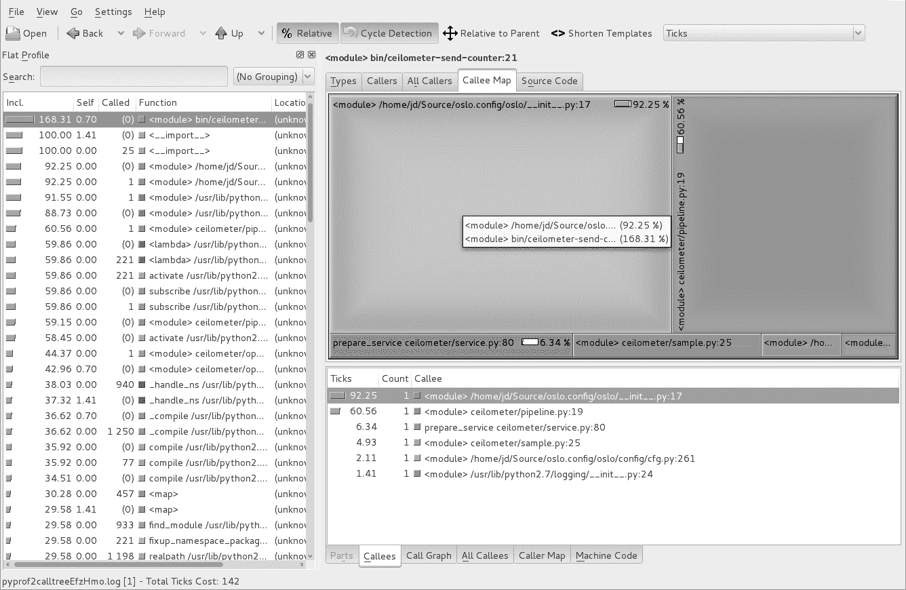
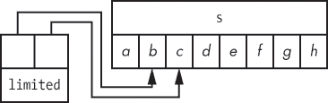

## **10**

**性能与优化**

优化通常不是你在开发时最先考虑的事情，但总会有一个时刻，优化以提高性能变得合适。这并不是说你应该编写一个程序并预期它会很慢，而是如果在没有首先找到合适工具并进行适当分析的情况下去考虑优化，那就是浪费时间。正如唐纳德·克努斯所说，“过早的优化是万恶之源。”^(1)

在这里，我将展示如何使用正确的方法编写快速代码，并在需要更多优化时，告诉你应该查看哪里。许多开发人员试图猜测 Python 可能在哪些地方更慢或更快。与其猜测，不如通过本章帮助你了解如何分析应用程序性能，从而知道程序的哪一部分正在拖慢速度，以及瓶颈在哪里。

### **数据结构**

大多数编程问题都可以通过正确的数据结构以优雅且简单的方式解决——而 Python 提供了许多数据结构供选择。学会利用这些现有的数据结构，能比编写自定义数据结构更清晰、更稳定地解决问题。

例如，每个人都在使用 dict，但你见过多少次代码尝试通过捕获 KeyError 异常来访问字典，如下所示：

def get_fruits(basket, fruit):

try:

return basket[fruit]

except KeyError:

return None

或者通过先检查键是否存在：

def get_fruits(basket, fruit):

if fruit in basket:

return basket[fruit]

如果你已经使用了 dict 类提供的 get() 方法，你就可以避免捕获异常或首先检查键是否存在：

def get_fruits(basket, fruit):

return basket.get(fruit)

dict.get() 方法也可以返回一个默认值，而不是 None；只需通过第二个参数调用它：

def get_fruits(basket, fruit):

# 如果找不到水果，则返回水果，或者如果找不到水果，则返回香蕉。

return basket.get(fruit, Banana())

许多开发人员在使用基本的 Python 数据结构时，并没有意识到它们提供的所有方法。这一点在集合数据结构中也同样适用；集合数据结构中的方法可以解决许多本来需要通过编写嵌套的 for/if 语句块来处理的问题。例如，开发人员经常使用 for/if 循环来判断某个项目是否在列表中，如下所示：

def has_invalid_fields(fields):

for field in fields: if field not in ['foo', 'bar']:

return True

return False

循环遍历列表中的每个项目，并检查所有项目是否都是 foo 或 bar。但你可以更高效地写这个，省去循环：

def has_invalid_fields(fields):

return bool(set(fields) - set(['foo', 'bar']))

这段代码修改了字段，将其转换为集合，然后通过从集合中减去 `set(['foo', 'bar'])` 来获取剩下的集合。然后它将集合转换为布尔值，表示是否还有不是 foo 和 bar 的项。通过使用集合，就不需要遍历任何列表并逐个检查项。Python 内部进行的两集合运算要更快。

Python 还有更多高级数据结构，可以大大减轻代码维护的负担。例如，看看清单 10-1。

def add_animal_in_family(species, animal, family):

if family not in species:

species[family] = set()

species[family].add(animal)

species = {}

add_animal_in_family(species, 'cat', 'felidea')

*清单 10-1：向字典集合中添加一个条目*

这段代码是完全有效的，但你的程序需要多少次像清单 10-1 那样的变体？几十次？几百次？

Python 提供了 `collections.defaultdict` 结构，它优雅地解决了这个问题：

import collections

def add_animal_in_family(species, animal, family):

species[family].add(animal)

species = collections.defaultdict(set)

add_animal_in_family(species, 'cat', 'felidea')

每次你尝试从字典中访问一个不存在的项时，`defaultdict` 会使用作为参数传递给构造函数的函数来构建一个新值，而不是抛出 `KeyError`。在这种情况下，`set()` 函数被用来在每次需要时构建一个新的集合。

`collections` 模块提供了一些其他的数据结构，你可以用来解决其他类型的问题。例如，假设你想要统计一个可迭代对象中不同项目的数量。让我们来看一下 `collections.Counter()` 方法，它提供了解决这个问题的方法：

>>> import collections

>>> c = collections.Counter("Premature optimization is the root of all evil.")

>>> c

>>> c['P']  # 返回字母 'P' 的出现次数

1

>>> c['e']  # 返回字母 'e' 的出现次数

4

>>> c.most_common(2)  # 返回最常见的 2 个字母

[(' ', 7), ('i', 5)]

`collections.Counter` 对象适用于任何具有可哈希项的可迭代对象，避免了你自己编写计数函数的需要。它可以轻松地计算字符串中每个字母的数量，并返回可迭代对象中最常见的前 *n* 项。如果你之前没有意识到 Python 标准库已经提供了这样的功能，可能已经尝试自己实现类似的功能。

使用合适的数据结构、正确的方法，当然，还有一个合适的算法，你的程序应该能表现得很好。然而，如果它的表现不够好，最好的方法是通过对代码进行性能分析来获取线索，找出哪里可能是瓶颈并需要优化。

### **通过性能分析理解行为**

*性能分析* 是一种动态程序分析方法，可以帮助我们了解程序的行为。它可以让我们确定程序中可能存在的瓶颈和需要优化的地方。程序的性能分析结果通常以一组统计数据的形式呈现，描述程序中各部分执行的频率和持续时间。

Python 提供了几个工具用于分析程序的性能。其中一个工具，cProfile，属于 Python 标准库，不需要额外安装。我们还将介绍 dis 模块，它可以将 Python 代码反汇编成更小的部分，便于我们理解底层的实现。

#### ***cProfile***

从 Python 2.5 起，Python 默认包含了 cProfile 模块。要使用 cProfile，可以通过语法 `python –m cProfile <program>` 来调用它。这会加载并启用 cProfile 模块，然后运行常规程序并启用性能分析，如清单 10-2 所示。

$ python -m cProfile myscript.py

343 次函数调用（342 次原始函数调用）用时 0.000 秒

排序方式：标准名称 ncalls  tottime  percall  cumtime  percall 文件名:行号(函数)

1    0.000    0.000    0.000    0.000 :0(_getframe)

1    0.000    0.000    0.000    0.000 :0(len)

104    0.000    0.000    0.000    0.000 :0(setattr)

1    0.000    0.000    0.000    0.000 :0(setprofile)

1    0.000    0.000    0.000    0.000 :0(startswith)

2/1    0.000    0.000    0.000    0.000 <string>:1(<module>)

1    0.000    0.000    0.000    0.000 StringIO.py:30(<module>)

1    0.000    0.000    0.000    0.000 StringIO.py:42(StringIO)

*清单 10-2：使用 cProfile 分析 Python 脚本的默认输出*

清单 10-2 展示了使用 cProfile 运行简单脚本的输出结果。这会告诉你程序中每个函数被调用的次数以及执行时花费的时间。你还可以使用 -s 选项按其他字段排序；例如，-s time 可以按内部时间排序结果。

我们可以使用一个叫做 KCacheGrind 的强大工具来可视化 cProfile 生成的信息。这个工具最初是为处理 C 语言编写的程序而创建的，但幸运的是我们可以通过将数据转换为调用树的形式，在 Python 中也能使用它。

cProfile 模块有一个 -o 选项，可以让你保存性能分析数据，而 pyprof2calltree 可以将数据从一种格式转换成另一种格式。首先，使用以下命令安装转换器：

$ pip install pyprof2calltree

然后，按照清单 10-3 中的方法运行转换器，以转换数据（使用 -i 选项）并通过转换后的数据运行 KCacheGrind（使用 -k 选项）。

$ python -m cProfile -o myscript.cprof myscript.py

$ pyprof2calltree -k -i myscript.cprof

*清单 10-3：运行 cProfile 并启动 KCacheGrind*

一旦 KCacheGrind 打开，它会显示类似图 10-1 中的信息。通过这些可视化结果，你可以使用调用图来跟踪每个函数所花费的时间百分比，从而确定程序的哪个部分可能消耗了过多的资源。

阅读 KCacheGrind 最简单的方法是从屏幕左侧的表格开始，这里列出了程序执行的所有函数和方法。你可以按执行时间对它们进行排序，然后找到消耗最多 CPU 时间的那个函数并点击它。

KCacheGrind 的右侧面板可以显示调用该函数的函数以及调用次数，还可以显示该函数调用的其他函数。程序的调用图，包括每个部分的执行时间，易于导航。

这应该能帮助你更好地理解代码中的哪些部分可能需要优化。如何优化代码取决于你自己，且取决于你的程序目标！

*图 10-1：KCacheGrind 输出示例*

虽然获取程序运行信息并将其可视化有助于从宏观角度了解程序，但你可能需要对某些代码部分进行更细致的查看，以便更紧密地检查其元素。在这种情况下，我发现使用 dis 模块来了解幕后发生的事情更为合适。

#### ***使用 dis 模块反汇编***

dis 模块是 Python 字节码的反汇编器。拆解代码有助于了解每行代码背后发生了什么，从而帮助你进行适当的优化。例如，清单 10-4 展示了 dis.dis() 函数，它可以反汇编传递给它的任意函数，并打印出该函数运行的字节码指令列表。

>>> def x():

...      return 42

...

>>> import dis

>>> dis.dis(x)

2           0 LOAD_CONST               1 (42)

3 RETURN_VALUE

*清单 10-4：反汇编一个函数*

在清单 10-4 中，函数 x 被反汇编，并打印出由字节码指令组成的内容。这里只有两个操作：加载常量 (LOAD_CONST)，其值为 42，然后返回该值 (RETURN_VALUE)。

为了展示 dis 模块的作用及其如何有用，我们将定义两个执行相同操作——连接三个字母——的函数，并对它们进行反汇编，看看它们是如何以不同方式完成任务的：

abc = ('a', 'b', 'c')

def concat_a_1():

for letter in abc:

abc[0] + letter

def concat_a_2():

a = abc[0]

for letter in abc:

a + letter

这两个函数看似执行相同的操作，但如果我们使用 dis.dis 对它们进行反汇编，如清单 10-5 所示，我们会发现生成的字节码略有不同。

>>> dis.dis(concat_a_1)

2           0 SETUP_LOOP          26 (跳转到 29)

3 LOAD_GLOBAL          0 (abc)

6 GET_ITER

>>    7 FOR_ITER               18 (跳转到 28)

10 存储局部变量               0 (letter)

3          13 加载全局变量              0 (abc)

16 加载常量               1 (0)

19 二进制下标取值

20 加载局部变量                0 (letter)

23 二进制加法

24 弹出栈顶

25 跳转绝对地址            7

>>   28 弹出代码块

>>   29 加载常量               0 (None)

32 返回值

>>> dis.dis(concat_a_2)

2           0 加载全局变量              0 (abc)

3 加载常量               1 (0)

6 二进制下标取值

7 存储局部变量               0 (a)

3          10 设置循环              22 (跳转至 35)

13 加载全局变量              0 (abc)

16 获取迭代器

>>   17 循环迭代                14 (跳转至 34)

20 存储局部变量               1 (letter)

4          23 加载局部变量                0 (a)

26 加载局部变量                1 (letter)

29 二进制加法

30 弹出栈顶

31 跳转绝对地址           17

>>   34 弹出代码块 >>   35 加载常量               0 (None)

38 返回值

*清单 10-5：反汇编连接字符串的函数*

在清单 10-5 的第二个函数中，我们在运行循环之前将 abc[0] 存储在一个临时变量中。这样，循环内部执行的字节码比第一个函数的小，因为我们避免了每次迭代时都要查找 abc[0]。通过 timeit 测量，第二个版本比第一个函数快了 10%，执行时间少了一微秒！显然，除非你调用这个函数数十亿次，否则这个微秒不值得优化，但这就是 dis 模块能提供的洞察力。

是否依赖于“技巧”，例如将值存储在循环外部，取决于具体情况——最终，应该由编译器来优化这种事情。另一方面，编译器很难保证优化不会产生负面副作用，因为 Python 是高度动态的。在清单 10-5 中，使用 abc[0] 会调用 abc.__getitem__，如果它被继承覆盖，可能会有副作用。根据你使用的函数版本，abc.__getitem__ 方法会被调用一次或多次，这可能会产生差异。因此，在编写和优化代码时要小心！

### **高效定义函数**

我在审查代码时常常发现一个常见的错误，那就是在函数内部定义函数。这种做法效率低，因为函数会被反复且无意义地重新定义。例如，清单 10-6 展示了 y() 函数被多次定义。

>> 导入 dis

>>> 定义 x():

...     返回 42

...

>>> dis.dis(x)

2           0 加载常量               1 (42)

3 返回值

>>> 定义 x():

...     定义 y():

...             返回 42

...     返回 y()

...

>>> dis.dis(x)

2           0 加载常量               1 (<code object y at

x100ce7e30, 文件 "<stdin>", 第 2 行>)

3 创建函数            0

6 存储局部变量               0 (y)

4           9 加载局部变量                0 (y) 12 调用函数            0

15 RETURN_VALUE

*示例 10-6：函数重定义*

示例 10-6 展示了调用 MAKE_FUNCTION、STORE_FAST、LOAD_FAST 和 CALL_FUNCTION，这比返回 42 所需的操作码要多得多，如示例 10-4 所示。

唯一需要在函数内部定义函数的情况是构建函数闭包，这在 Python 的操作码中有明确的应用案例，使用了 LOAD_CLOSURE，如示例 10-7 所示。

>>> def x():

...     a = 42

...     def y():

...             返回 a

...     返回 y()

...

>>> dis.dis(x)

2           0 LOAD_CONST               1 (42)

3 STORE_DEREF              0 (a)

3           6 LOAD_CLOSURE             0 (a)

9 BUILD_TUPLE              1

12 LOAD_CONST               2 (<code object y at

x100d139b0, 文件 "<stdin>"，第 3 行>

15 MAKE_CLOSURE             0

18 STORE_FAST               0 (y)

5          21 LOAD_FAST                0 (y)

24 CALL_FUNCTION            0

27 RETURN_VALUE

*示例 10-7：定义闭包*

虽然你可能不需要每天使用它，但反汇编代码是一个有用的工具，特别是在你想深入了解代码内部实现时。

### **有序列表和二分查找**

接下来，让我们来看看优化列表。如果一个列表是无序的，那么查找某个特定项在列表中的位置的最坏情况时间复杂度是 *O(n)*，意味着在最坏的情况下，你需要遍历整个列表才能找到目标项。

解决这个问题的常见方法是使用一个 *有序* 列表。排序后的列表通过使用二分查找算法来优化查找，使得查找时间复杂度为 *O(log n)*。其思想是递归地将列表一分为二，并检查目标项应该出现在左侧还是右侧，从而决定下一步应该查找哪一侧。

Python 提供了 bisect 模块，其中包含一个二分查找算法，如示例 10-8 所示。

>>> farm = sorted(['haystack', 'needle', 'cow', 'pig'])

>>> bisect.bisect(farm, 'needle')

3

>>> bisect.bisect_left(farm, 'needle')

2

>>> bisect.bisect(farm, 'chicken')

0

>>> bisect.bisect_left(farm, 'chicken')

0

>>> bisect.bisect(farm, 'eggs')

1

>>> bisect.bisect_left(farm, 'eggs')

1

*示例 10-8：使用二分查找在大海捞针中找到目标*

如示例 10-8 所示，bisect.bisect()函数返回元素应插入的位置，以保持列表有序。显然，这只有在列表最初已经排序的情况下才能起作用。初始排序使我们能够得到 *理论上的* 项目索引：bisect() 并不会返回目标项是否存在于列表中，而是返回如果该项存在，它应该位于哪个位置。通过在该索引处获取项，我们可以知道目标项是否在列表中。

如果你希望将元素立即插入到正确的排序位置，`bisect`模块提供了`insort_left()`和`insort_right()`函数，如清单 10-9 所示。

>>> farm

['cow', 'haystack', 'needle', 'pig']

>>> bisect.insort(farm, 'eggs')

>>> farm

['cow', 'eggs', 'haystack', 'needle', 'pig']

>>> bisect.insort(farm, 'turkey')

>>> farm

['cow', 'eggs', 'haystack', 'needle', 'pig', 'turkey']

*清单 10-9: 在排序列表中插入项*

使用`bisect`模块，你也可以创建一个特殊的`SortedList`类，继承自`list`，来创建一个始终保持排序的列表，如清单 10-10 所示：

import bisect

import unittest

class SortedList(list):

def __init__(self, iterable):

super(SortedList, self).__init__(sorted(iterable))

def insort(self, item):

bisect.insort(self, item) def extend(self, other):

for item in other:

self.insort(item)

@staticmethod

def append(o):

raise RuntimeError("无法向排序列表添加项")

def index(self, value, start=None, stop=None):

place = bisect.bisect_left(self[start:stop], value)

if start:

place += start

end = stop or len(self)

if place < end and self[place] == value:

return place

raise ValueError("%s 不在列表中" % value)

class TestSortedList(unittest.TestCase):

def setUp(self):

self.mylist = SortedList(

['a', 'c', 'd', 'x', 'f', 'g', 'w']

)

def test_sorted_init(self):

self.assertEqual(sorted(['a', 'c', 'd', 'x', 'f', 'g', 'w']),

self.mylist)

def test_sorted_insort(self):

self.mylist.insort('z')

self.assertEqual(['a', 'c', 'd', 'f', 'g', 'w', 'x', 'z'],

self.mylist)

self.mylist.insort('b')

self.assertEqual(['a', 'b', 'c', 'd', 'f', 'g', 'w', 'x', 'z'],

self.mylist)

def test_index(self):

self.assertEqual(0, self.mylist.index('a'))

self.assertEqual(1, self.mylist.index('c'))

self.assertEqual(5, self.mylist.index('w'))

self.assertEqual(0, self.mylist.index('a', stop=0))

self.assertEqual(0, self.mylist.index('a', stop=2))

self.assertEqual(0, self.mylist.index('a', stop=20))

self.assertRaises(ValueError, self.mylist.index, 'w', stop=3)

self.assertRaises(ValueError, self.mylist.index, 'a', start=3)

self.assertRaises(ValueError, self.mylist.index, 'a', start=333)

def test_extend(self):

self.mylist.extend(['b', 'h', 'j', 'c'])

self.assertEqual(

['a', 'b', 'c', 'c', 'd', 'f', 'g', 'h', 'j', 'w', 'x']

self.mylist)

*清单 10-10: 排序列表对象实现*

使用像这样的列表类，在插入项时稍微慢一些，因为程序必须查找合适的位置插入它。然而，这个类在使用`index()`方法时比其父类要快。显然，不应该在这个类上使用`list.append()`方法：你不能在列表的末尾添加项，否则它可能会变得不再排序！

许多 Python 库为更多的数据类型实现了清单 10-10 的不同版本，比如二进制树或红黑树结构。blist 和 bintree Python 包含可以用于这些目的的代码，是实现和调试你自己版本的一个便捷替代方案。

在下一节中，我们将看到如何利用 Python 提供的原生元组数据类型来加速你的 Python 代码。

### **namedtuple 和 Slots**

在编程中，你通常需要创建一些只有少数固定属性的简单对象。一种简单的实现可能如下所示：

class Point(object):

def __init__(self, x, y):

self.x = x

self.y = y

这确实能完成工作。然而，这种方法有一个缺点。这里我们创建了一个继承自 object 类的类，所以通过使用这个 Point 类，你正在实例化完整的对象并分配大量内存。

在 Python 中，常规对象将其所有属性存储在一个字典中，并且这个字典本身存储在 __dict__ 属性中，如清单 10-11 所示。

>>> p = Point(1, 2)

>>> p.__dict__

{'y': 2, 'x': 1}

>>> p.z = 42

>>> p.z

42

>>> p.__dict__

{'y': 2, 'x': 1, 'z': 42}

*清单 10-11：Python 对象内部如何存储属性*

对于 Python，使用字典的优势在于它允许你为对象添加任意多的属性。缺点是，使用字典来存储这些属性在内存上是昂贵的——你需要存储对象、键、值引用以及其他一切。这使得对象创建和操作变得缓慢，而且内存成本较高。

作为这个不必要的内存使用的一个示例，请看下面这个简单的类：

class Foobar(object):

def __init__(self, x):

self.x = x

这将创建一个简单的 Point 对象，具有一个名为 x 的属性。让我们使用 memory_profiler 来检查这个类的内存使用情况，memory_profiler 是一个非常好的 Python 包，可以逐行查看程序的内存使用情况。下面是一个创建 100,000 个对象的小脚本，参见清单 10-12。

$ python -m memory_profiler object.py

文件名：object.py

行号    内存使用    增量   行内容

5                             @profile

6     9.879 MB     0.000 MB   def main():

7    50.289 MB    40.410 MB       f = [ Foobar(42) for i in range(100000) ]

*清单 10-12：在使用对象的脚本中使用 memory_profiler*

清单 10-12 演示了创建 100,000 个 Foobar 类对象将消耗 40MB 的内存。虽然每个对象占用 400 字节的内存可能听起来不大，但当你创建成千上万个对象时，内存会迅速增加。

有一种方法可以在不使用字典默认行为的情况下使用对象：Python 中的类可以定义一个 __slots__ 属性，仅列出该类实例允许的属性。你可以使用 *list* 对象来存储这些属性，而不是为存储对象属性分配一个完整的字典对象。

如果你浏览 CPython 源代码并查看 *Objects/typeobject.c* 文件，就很容易理解当在类上设置 __slots__ 时 Python 的处理方式。示例 10-13 是处理该过程的函数的简略版：

static PyObject *

type_new(PyTypeObject *metatype, PyObject *args, PyObject *kwds)

{

--snip--

/* 检查字典中是否有 __slots__ 序列变量，并进行计数 */

slots = _PyDict_GetItemId(dict, &PyId___slots__);

nslots = 0;

if (slots == NULL) {

if (may_add_dict)

add_dict++;

if (may_add_weak)

add_weak++;

} else {

/* 拥有 slots */

/* 将其转换为元组 */

if (PyUnicode_Check(slots))

slots = PyTuple_Pack(1, slots);

else

slots = PySequence_Tuple(slots);

/* 是否允许使用 slots？ */

nslots = PyTuple_GET_SIZE(slots);

if (nslots > 0 && base->tp_itemsize != 0) {

PyErr_Format(PyExc_TypeError,

"非空的 __slots__ "

"子类型 '%s' 不支持",

base->tp_name);

goto error;

}

/* 将 slots 复制到一个列表中，混淆名称并对其进行排序。

排序的名称对于 __class__ 分配是必要的。

最后将其转换回元组。

*/

newslots = PyList_New(nslots - add_dict - add_weak);

if (newslots == NULL)

goto error;

if (PyList_Sort(newslots) == -1) {

Py_DECREF(newslots);

goto error;

}

slots = PyList_AsTuple(newslots);

Py_DECREF(newslots);

if (slots == NULL)

goto error;

}

/* 分配类型对象 */

type = (PyTypeObject *)metatype->tp_alloc(metatype, nslots);

--snip--

/* 在扩展类型对象中保持名称和 slots 的引用 */

et = (PyHeapTypeObject *)type;

Py_INCREF(name);

et->ht_name = name;

et->ht_slots = slots;

slots = NULL;

--snip--

return (PyObject *)type;

*示例 10-13：来自 Objects/typeobject.c 的摘录*

正如在示例 10-13 中所看到的，Python 将 __slots__ 的内容转换为元组，然后转换为列表，构建并排序后，再将列表转换回元组以便在类中使用和存储。通过这种方式，Python 可以快速检索值，而无需分配和使用整个字典。

声明并使用这样一个类是非常简单的。你需要做的就是将 __slots__ 属性设置为将要在类中定义的属性的列表：

class Foobar(object):

__slots__ = ('x',)

def __init__(self, x):

self.x = x

我们可以使用 memory_profiler Python 包比较这两种方法的内存使用情况，如示例 10-14 所示。

% python -m memory_profiler slots.py

文件名：slots.py

行号    内存使用    增量   行内容

7                             @profile

8     9.879 MB     0.000 MB   def main():

9    21.609 MB    11.730 MB       f = [ Foobar(42) for i in range(100000) ]

*清单 10-14：在使用 `__slots__` 的脚本上运行 `memory_profiler`*

清单 10-14 显示，这一次，创建 100,000 个对象只需要不到 12MB 的内存——即每个对象少于 120 字节。因此，通过使用 Python 类的 `__slots__` 属性，我们可以减少内存使用量，所以当我们创建大量简单对象时，`__slots__` 是一个有效且高效的选择。然而，这种技术不应该用于通过硬编码每个类的属性列表来执行静态类型检查：这样做并不符合 Python 程序的精神。

这里的缺点是，属性列表现在已经固定。运行时无法为 `Foobar` 类添加新属性。由于属性列表是固定的，可以很容易地想象某些类的属性始终有值，并且字段始终以某种方式排序。

这正是 `namedtuple` 类在 `collections` 模块中的作用。这个 `namedtuple` 类允许我们动态创建一个类，该类将继承自 `tuple` 类，从而共享不可变性和固定条目数等特性。

与其按索引引用它们，`namedtuple` 提供了通过引用命名属性来获取元组元素的能力。这使得元组对人类更易于访问，如 清单 10-15 所示。

>>> import collections

>>> Foobar = collections.namedtuple('Foobar', ['x'])

>>> Foobar = collections.namedtuple('Foobar', ['x', 'y'])

>>> Foobar(42, 43) Foobar(x=42, y=43)

>>> Foobar(42, 43).x

42

>>> Foobar(42, 43).x = 44

Traceback (most recent call last):

文件 "<stdin>"，第 1 行，在 <module> 中

AttributeError: 不能设置属性

>>> Foobar(42, 43).z = 0

Traceback (most recent call last):

文件 "<stdin>"，第 1 行，在 <module> 中

AttributeError: 'Foobar' 对象没有属性 'z'

>>> list(Foobar(42, 43))

[42, 43]

*清单 10-15：使用 `namedtuple` 引用元组元素*

清单 10-15 展示了如何用一行代码创建一个简单的类并实例化它。我们不能改变该类对象的任何属性，也不能为它们添加属性，原因在于该类继承自 `namedtuple` 并且 `__slots__` 的值被设置为空元组，从而避免了 `__dict__` 的创建。由于这种类继承自 `tuple`，我们可以轻松地将其转换为列表。

清单 10-16 演示了 `namedtuple` 类工厂的内存使用情况。

% python -m memory_profiler namedtuple.py

文件名：namedtuple.py

Line #    内存使用量    增量    行内容

4                             @profile

5     9.895 MB     0.000 MB   def main():

6    23.184 MB    13.289 MB       f = [ Foobar(42) for i in range(100000) ]

*清单 10-16：使用 `namedtuple` 在脚本上运行 `memory_profiler`*

对于 100,000 个对象，约 13MB 的内存使用量，使用命名元组的效率略低于使用 __slots__ 的对象，但好处是它与元组类兼容。因此，它可以传递给许多期望可迭代对象作为参数的原生 Python 函数和库。命名元组类工厂还享受元组的一些优化：例如，具有比 PyTuple_MAXSAVESIZE（默认值为 20）更少项的元组将在 CPython 中使用更快的内存分配器。

命名元组类还提供了一些额外的方法，即使它们以下划线开头，实际上也是公开的。_asdict()方法可以将命名元组转换为字典实例，_make()方法允许你将现有的可迭代对象转换为此类，而 _replace()则返回一个新的对象实例，并替换其中的某些字段。

命名元组是替代由少量属性组成的小对象的绝佳选择，它们不需要任何自定义方法——例如，考虑使用命名元组而不是字典。如果你的数据类型需要方法，具有固定的属性列表，并且可能会被实例化成千上万次，那么使用 __slots__ 创建自定义类可能是一个节省内存的好主意。

### **记忆化**

*记忆化*是一种优化技术，通过缓存函数结果来加速函数调用。只有当函数是*纯粹的*时，才能缓存其结果，意味着该函数没有副作用，并且不依赖任何全局状态。（有关纯函数的更多内容，请参见第八章）

一个可以进行记忆化的小函数是 sin()，如示例 10-17 所示。

>>> import math

>>> _SIN_MEMOIZED_VALUES = {}

>>> def memoized_sin(x):

...    if x not in _SIN_MEMOIZED_VALUES:

...        _SIN_MEMOIZED_VALUES[x] = math.sin(x)

...    return _SIN_MEMOIZED_VALUES[x]

>>> memoized_sin(1)

0.8414709848078965

>>> _SIN_MEMOIZED_VALUES

{1: 0.8414709848078965}

>>> memoized_sin(2)

0.9092974268256817

>>> memoized_sin(2)

0.9092974268256817

>>> _SIN_MEMOIZED_VALUES

{1: 0.8414709848078965, 2: 0.9092974268256817}

>>> memoized_sin(1)

0.8414709848078965

>>> _SIN_MEMOIZED_VALUES

{1: 0.8414709848078965, 2: 0.9092974268256817}

*示例 10-17：记忆化的 sin()函数*

在示例 10-17 中，第一次调用 memoized_sin()时，如果该参数没有存储在 _SIN_MEMOIZED_VALUES 中，则会计算并存储在此字典中。如果我们再次调用该函数并传入相同的值，结果将从字典中获取，而不是重新计算。虽然 sin()函数计算非常迅速，但一些涉及更复杂计算的高级函数可能需要更长时间，这正是记忆化技术大显身手的时候。

如果你已经阅读过装饰器的相关内容（如果没有，请参见“装饰器及其使用场景”第 100 页），你可能会发现这是使用装饰器的完美机会，而且你是对的。PyPI 列出了几种通过装饰器实现缓存的方式，从非常简单的案例到最复杂完整的实现。

从 Python 3.3 开始，functools 模块提供了一个 *最近最少使用（LRU）* 缓存装饰器。它提供了与缓存相同的功能，但有一个好处就是限制缓存中条目的数量，当缓存达到最大大小时会移除最久未使用的条目。该模块还提供了缓存命中和未命中的统计信息（即某个数据是否在已访问的缓存中），以及其他数据。在我看来，在实现这种缓存时，这些统计信息是必不可少的。使用缓存，或者任何缓存技术的优势在于能够衡量其使用情况和有效性。

列表 10-18 展示了如何使用 functools.lru_cache() 方法来实现函数的缓存。当被装饰后，函数将获得一个 cache_info() 方法，可以调用它来获取关于缓存使用的统计信息。

>>> import functools

>>> import math

>>> @functools.lru_cache(maxsize=2)

... def memoized_sin(x):

...      return math.sin(x)

...

>>> memoized_sin(2)

0.9092974268256817

>>> memoized_sin.cache_info()

CacheInfo(hits=0, misses=1, maxsize=2, currsize=1)

>>> memoized_sin(2)

0.9092974268256817

>>> memoized_sin.cache_info()

CacheInfo(hits=1, misses=1, maxsize=2, currsize=1)

>>> memoized_sin(3)

0.1411200080598672

>>> memoized_sin.cache_info()

CacheInfo(hits=1, misses=2, maxsize=2, currsize=2)

>>> memoized_sin(4)

-0.7568024953079282

>>> memoized_sin.cache_info()

CacheInfo(hits=1, misses=3, maxsize=2, currsize=2)

>>> memoized_sin(3)

0.1411200080598672

>>> memoized_sin.cache_info()

CacheInfo(hits=2, misses=3, maxsize=2, currsize=2)

>>> memoized_sin.cache_clear()

>>> memoized_sin.cache_info()

CacheInfo(hits=0, misses=0, maxsize=2, currsize=0)

*列表 10-18：检查缓存统计信息*

列表 10-18 展示了如何查看缓存的使用情况以及如何判断是否需要进行优化。例如，如果缓存未满时未命中的次数很高，那么缓存可能没用，因为传递给函数的参数从未相同。这将有助于确定应该或不应该缓存哪些内容！

### **使用 PyPy 加速 Python**

*PyPy* 是一种高效的 Python 语言实现，符合标准：你应该能够使用它运行任何 Python 程序。实际上，Python 的经典实现 CPython——因为它是用 C 编写的——可能非常慢。PyPy 的理念是用 Python 本身编写 Python 解释器。随着时间的推移，它发展成了用 RPython 编写，RPython 是 Python 语言的一个受限子集。

RPython 对 Python 语言进行了限制，使得变量的类型可以在编译时推断出来。RPython 代码被翻译成 C 代码，然后编译来构建解释器。当然，RPython 也可以用于实现其他语言，而不仅仅是 Python。

除了技术挑战，PyPy 的有趣之处在于它现在已经能够作为 CPython 的一个更快的替代品。PyPy 内置了一个*即时编译（JIT）*编译器；换句话说，它通过将编译代码的速度与解释的灵活性相结合，使代码运行得更快。

多快呢？这取决于情况，但对于纯算法代码，PyPy 要快得多。对于更一般的代码，PyPy 宣称大多数情况下能够达到 CPython 三倍的速度。不幸的是，PyPy 也有一些 CPython 的局限性，包括*全局解释器锁（GIL）*，它使得同一时刻只能有一个线程执行。

尽管这严格来说不是一种优化技术，但将 PyPy 作为支持的 Python 实现之一可能是个不错的主意。要使 PyPy 成为支持的实现，你需要确保在 PyPy 下进行软件测试，就像在 CPython 下测试一样。在第六章中，我们讨论了 tox（参见第 92 页的“在 tox 中使用 virtualenv”），它支持使用 PyPy 构建虚拟环境，就像它支持任何版本的 CPython 一样，因此设置 PyPy 支持应该是相对简单的。

在项目开始时就测试 PyPy 支持将确保如果你决定将软件与 PyPy 一起运行，以后不会有太多工作要做。

**注意**

*在第九章讨论的 Hy 项目中，我们从一开始就成功地采用了这种策略。Hy 一直以来都支持 PyPy 和所有其他版本的 CPython，几乎没有遇到什么麻烦。另一方面，OpenStack 在其项目中没有做到这一点，因此现在受到各种代码路径和依赖项的阻碍，这些依赖项由于种种原因无法在 PyPy 上运行；它们在早期阶段并没有被要求进行全面测试。*

PyPy 兼容 Python 2.7 和 Python 3.5，它的 JIT 编译器支持 32 位和 64 位、x86 和 ARM 架构，并可在各种操作系统（Linux、Windows 和 Mac OS X）下运行。PyPy 在功能上通常落后于 CPython，但它会定期追赶上来。除非你的项目依赖于最新的 CPython 特性，否则这个滞后可能不会成为问题。

### **通过缓冲区协议实现零拷贝**

程序通常需要处理大量数据，通常是以大数组的形式表示字节数据。一旦开始通过复制、切片和修改数据来操作这些大数据量，处理字符串形式的输入会非常低效。

我们来看一个小程序，它读取一个大的二进制文件，并将其中的一部分复制到另一个文件中。为了检查这个程序的内存使用情况，我们将像之前一样使用 memory_profiler。部分复制文件的脚本如清单 10-19 所示。

@profile

def read_random():

with open("/dev/urandom", "rb") as source:

content = source.read(1024 * 10000)

content_to_write = content[1024:]

print("内容长度：%d，待写入内容长度：%d" %

(len(content), len(content_to_write)))

with open("/dev/null", "wb") as target:

target.write(content_to_write)

if __name__ == '__main__':

read_random()

*清单 10-19：部分复制文件*

在使用 memory_profiler 运行清单 10-19 时，产生的输出与清单 10-20 所示相同。

$ python -m memory_profiler memoryview/copy.py

内容长度：10240000，待写入内容长度：10238976

文件名：memoryview/copy.py

内存使用    增量   行内容

@profile

9.883 MB     0.000 MB   def read_random():

9.887 MB     0.004 MB       with open("/dev/urandom", "rb") as source:

19.656 MB     9.770 MB           content = source.read(1024 * 10000)➊

29.422 MB     9.766 MB           content_to_write = content[1024:]➋

29.422 MB     0.000 MB       print("内容长度：%d，待写入内容长度：%d" %

29.434 MB     0.012 MB             (len(content), len(content_to_write)))

29.434 MB     0.000 MB       with open("/dev/null", "wb") as target:

29.434 MB     0.000 MB           target.write(content_to_write)

*清单 10-20：部分文件复制的内存分析*

根据输出，程序从*_/dev/urandom_* ➊ 读取了 10MB 的数据。Python 需要分配大约 10MB 的内存来存储这些数据作为字符串。然后它复制整个数据块，去掉前 1KB ➋。

在清单 10-20 中，值得注意的是，在构建变量 content_to_write 时，程序的内存使用量增加了大约 10MB。实际上，切片操作符将 content 的所有内容（去掉前 1KB）复制到一个新的字符串对象中，从而分配了大约 10MB 的大块内存。

在大字节数组上执行这种操作将是一场灾难，因为大量的内存将被分配和复制。如果你有 C 语言的编程经验，你会知道使用 memcpy()函数会带来显著的成本，包括内存使用和整体性能的下降。

作为 C 程序员，你也会知道字符串是字符数组，而且没有什么可以阻止你只查看数组的一部分而不复制它。你可以通过基本的指针运算来实现这一点，前提是整个字符串位于一个连续的内存区域中。

这在 Python 中也是可能的，使用实现了 *buffer 协议* 的对象。buffer 协议在 PEP 3118 中定义，作为一个 C API，需要在各种类型上实现才能提供该协议。例如，字符串类就实现了这个协议。

当你在一个对象上实现这个协议时，你可以使用 memoryview 类的构造函数来构建一个新的 memoryview 对象，该对象将引用原始对象的内存。例如，清单 10-21 展示了如何使用 memoryview 来访问字符串的切片而不进行任何复制：

>>> s = b"abcdefgh"

>>> view = memoryview(s)

>>> view[1]

➊ 98 <1>

>>> limited = view[1:3]

>>> limited

<memory at 0x7fca18b8d460>

>>> bytes(view[1:3])

b'bc'

*清单 10-21：使用 memoryview 避免数据复制*

在 ➊ 处，你可以找到字母 *b* 的 ASCII 码。在 清单 10-21 中，我们利用了 memoryview 对象的切片操作符本身返回一个 memoryview 对象的事实。这意味着它*不*复制任何数据，而只是引用其中的特定切片，节省了复制所需的内存。图 10-2 说明了 清单 10-21 中发生的情况。

*图 10-2：在 memoryview 对象上使用切片*

我们可以重写 清单 10-19 中的程序，这次通过引用我们想要写入的数据的 memoryview 对象，而不是分配一个新的字符串。

@profile

def read_random():

with open("/dev/urandom", "rb") as source:

content = source.read(1024 * 10000)

content_to_write = memoryview(content)[1024:]

print("内容长度：%d，写入内容长度：%d" %

(len(content), len(content_to_write)))

with open("/dev/null", "wb") as target:

target.write(content_to_write)

if __name__ == '__main__':

read_random()

*清单 10-22：使用 memoryview 部分复制文件*

清单 10-22 中的程序使用了比 清单 10-19 中的版本少一半的内存。我们可以通过再次使用 memory_profiler 进行测试来验证这一点，方法如下：

$ python -m memory_profiler memoryview/copy-memoryview.py

内容长度：10240000，写入内容长度：10238976

文件名：memoryview/copy-memoryview.py

内存使用    增量   行内容

@profile

9.887 MB     0.000 MB   def read_random():

9.891 MB     0.004 MB ➊     with open("/dev/urandom", "rb") as source:

19.660 MB     9.770 MB ➋        content = source.read(1024 * 10000)

19.660 MB     0.000 MB           content_to_write = memoryview(content)[1024:]

19.660 MB     0.000 MB       print("内容长度：%d，写入内容长度：%d" %

19.672 MB     0.012 MB             (len(content), len(content_to_write)))

19.672 MB     0.000 MB       with open("/dev/null", "wb") as target:

19.672 MB     0.000 MB           target.write(content_to_write)

这些结果表明，我们正在从*/dev/urandom*读取 10,000KB 的数据，并且几乎没有做任何处理 ➊。Python 需要分配 9.77MB 的内存来将这些数据存储为字符串 ➋。

我们引用数据块的整个部分，去掉了前 1KB，因为我们不打算将这 1KB 写入目标文件。由于我们没有进行复制，因此不会使用更多的内存！

这种技巧在处理套接字时尤其有用。当通过套接字发送数据时，数据可能会在多次调用之间分割，而不是在一次调用中发送：socket.send 方法返回网络实际能够发送的长度，这可能小于原本打算发送的数据。清单 10-23 展示了这种情况通常是如何处理的。

import socket

s = socket.socket(...)

s.connect(...)

➊ data = b"a" * (1024 * 100000) <1> 当 data:

sent = s.send(data)

➋ data = data[sent:] <2>

*清单 10-23：通过套接字发送数据*

首先，我们构建一个包含字母*a*超过一亿次的字节对象 ➊。然后，我们移除已发送的第一个字节 ➋。

使用清单 10-23 中实现的机制，程序将一遍又一遍地复制数据，直到套接字发送完所有内容。

我们可以修改清单 10-23 中的程序，使用 memoryview 来实现相同的功能，并且避免复制，从而提高性能，正如清单 10-24 所示。

import socket

s = socket.socket(...)

s.connect(...)

➊ data = b"a" * (1024 * 100000) <1>

mv = memoryview(data)

当 mv:

sent = s.send(mv)

➋ mv = mv[sent:] <2>

*清单 10-24：使用 memoryview 通过套接字发送数据*

首先，我们构建一个包含字母*a*超过一亿次的字节对象 ➊。然后，我们构建一个新的 memoryview 对象，指向待发送的数据，而不是复制这些数据 ➋。这个程序不会复制任何内容，因此不会使用比最初为数据变量分配的 100MB 更多的内存。

我们已经看过如何使用 memoryview 对象高效地写入数据，这种方法同样可以用于*读取*数据。Python 中的大多数 I/O 操作都知道如何处理实现了缓冲区协议的对象：它们可以从这些对象读取，也可以写入这些对象。在这种情况下，我们不需要 memoryview 对象；我们只需请求 I/O 函数将数据写入预分配的对象，如清单 10-25 所示。

>>> ba = bytearray(8)

>>> ba

bytearray(b'\x00\x00\x00\x00\x00\x00\x00\x00')

>>> with open("/dev/urandom", "rb") as source:

...     source.readinto(ba)

...

8

>>> ba

bytearray(b'`m.z\x8d\x0fp\xa1')

*清单 10-25：写入预分配的字节数组*

在 清单 10-25 中，通过使用打开的文件的 readinto() 方法，Python 可以直接从文件读取数据并写入预分配的 bytearray。使用这些技巧，你可以轻松地预分配一个缓冲区（就像在 C 中减少 malloc() 调用次数一样），并在需要时填充它。通过 memoryview，你可以将数据放置在内存区域的任何位置，如 清单 10-26 所示。

>>> ba = bytearray(8)

➊ >>> ba_at_4 = memoryview(ba)[4:]

>>> with open("/dev/urandom", "rb") as source:

➋ ...     source.readinto(ba_at_4)

...

4

>>> ba

bytearray(b'\x00\x00\x00\x00\x0b\x19\xae\xb2')

*清单 10-26：写入 bytearray 的任意位置*

我们从偏移量 4 开始引用 bytearray，直到它的末尾 ➊。然后，我们从偏移量 4 开始，将 */dev/urandom* 的内容写入 bytearray 的末尾，有效地只读取了 4 个字节 ➋。

缓冲区协议对于实现低内存开销和出色性能非常重要。由于 Python 隐藏了所有的内存分配，开发者往往会忘记底层发生了什么，这对程序速度造成了很大的影响！

数组模块中的对象和结构模块中的函数都能正确处理缓冲区协议，因此在目标是零复制时可以高效执行。

### **总结**

正如我们在本章中所看到的，有很多方法可以加速 Python 代码。选择正确的数据结构，并使用适当的方法操作数据，在 CPU 和内存使用方面会产生巨大的影响。这就是为什么理解 Python 内部如何工作的非常重要。

然而，优化不应当过早进行，必须先进行适当的性能分析。很容易在没有找到核心问题的情况下，浪费时间重写一些几乎没有使用的代码，尝试用更快的变体代替。不要忽视大局。

### **维克多·斯蒂纳谈优化**

维克多是一个资深的 Python 黑客、核心贡献者，也是许多 Python 模块的作者。他在 2013 年撰写了 PEP 454，提出了一个新的 tracemalloc 模块，用于跟踪 Python 内部的内存块分配，他还编写了一个简单的 AST 优化器 FAT。他还定期为 CPython 性能的提升做出贡献。

**优化 Python 代码的一个好的起始策略是什么？**

在 Python 中，策略和其他语言是一样的。首先，你需要有一个明确的使用案例，以便获得稳定且可重复的基准测试。没有可靠的基准测试，尝试不同的优化可能导致时间浪费和过早的优化。无用的优化可能会使代码变得更差、更难以阅读，甚至变得更慢。如果优化至少能提高 5% 的程序速度，那么它才值得追求。

如果某一部分代码被识别为“慢”，就应该对这部分代码进行基准测试。对一个短小函数的基准测试通常叫做 *微基准测试*。如果性能提升至少为 20%，可能达到 25%，那么就可以考虑对微基准测试进行优化。

在不同的计算机、不同的操作系统或不同的编译器上运行基准测试可能会很有趣。例如，realloc() 的性能在 Linux 和 Windows 上可能不同。

**你推荐的 Python 代码分析或优化工具有哪些？**

Python 3.3 提供了一个 time.perf_counter() 函数，用于测量基准测试的经过时间。它具有最佳的分辨率。

测试应该多次运行；最少运行三次，五次可能足够。重复测试会填充磁盘缓存和 CPU 缓存。我更倾向于保持最小的计时；而其他开发者则更喜欢使用几何平均值。

对于微基准测试，timeit 模块易于使用，并且可以快速给出结果，但使用默认参数时结果并不可靠。测试应该手动重复，以获得稳定的结果。

优化可能需要耗费大量时间，因此最好将重点放在那些使用最多 CPU 的函数上。为了找到这些函数，Python 提供了 cProfile 和 profile 模块来记录每个函数花费的时间。

**你有没有什么 Python 小技巧能够提高性能？**

你应该尽可能重用标准库——它经过了良好的测试，通常也很高效。Python 内置类型是用 C 实现的，性能良好。使用正确的容器以获得最佳性能；Python 提供了多种不同类型的容器：dict、list、deque、set 等等。

也有一些优化 Python 的技巧，但你应该避免使用这些技巧，因为它们会使代码变得不易阅读，以换取微小的性能提升。

《Python 之禅》（PEP 20）中说：“应该有一种——并且最好只有一种——显而易见的方法。” 实际上，写 Python 代码有不同的方式，而性能也不同。只信任你自己使用场景中的基准测试结果。

**Python 哪些领域的性能最差，应该注意优化？**

通常来说，我在开发新应用时不太关注性能。过早的优化是万恶之源。当你发现某些函数很慢时，应该更换算法。如果算法和容器类型选择得当，你可能会用 C 重写一些短小的函数，以获得最佳性能。

CPython 的一个瓶颈是全局解释器锁（GIL）。两个线程不能同时执行 Python 字节码。然而，只有当两个线程执行纯 Python 代码时，这个限制才会显得重要。如果大部分处理时间花费在函数调用上，并且这些函数释放了 GIL，那么 GIL 就不是瓶颈。例如，大多数 I/O 函数都会释放 GIL。

`multiprocessing` 模块可以轻松绕过 GIL（全局解释器锁）。另一种更复杂的选择是编写异步代码。Twisted、Tornado 和 Tulip 项目，作为面向网络的库，使用了这种技术。

**常见的性能错误有哪些？**

当 Python 不够理解时，可能会写出低效的代码。例如，我曾看到 misused `copy.deepcopy()`，实际上并不需要复制。

另一个性能杀手是低效的数据结构。当项目项少于 100 个时，容器类型对性能没有影响。项目项多时，必须了解每个操作（添加、获取、删除）的复杂度及其影响。
